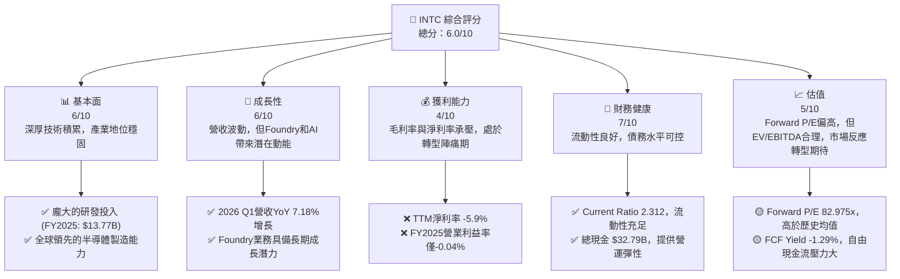
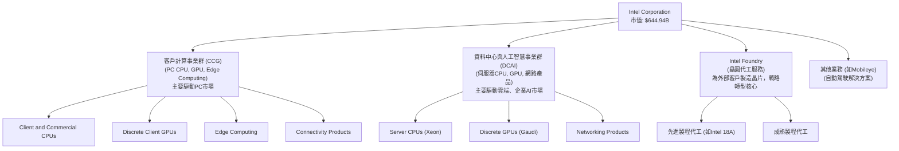
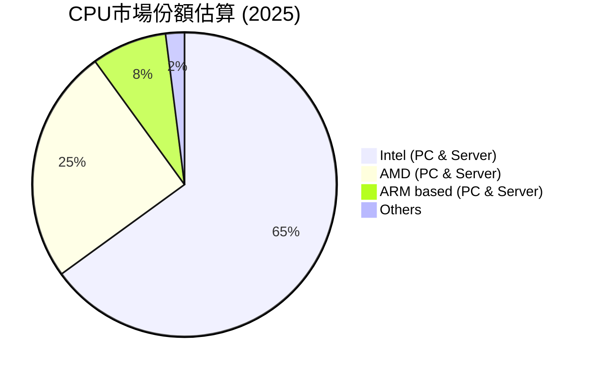
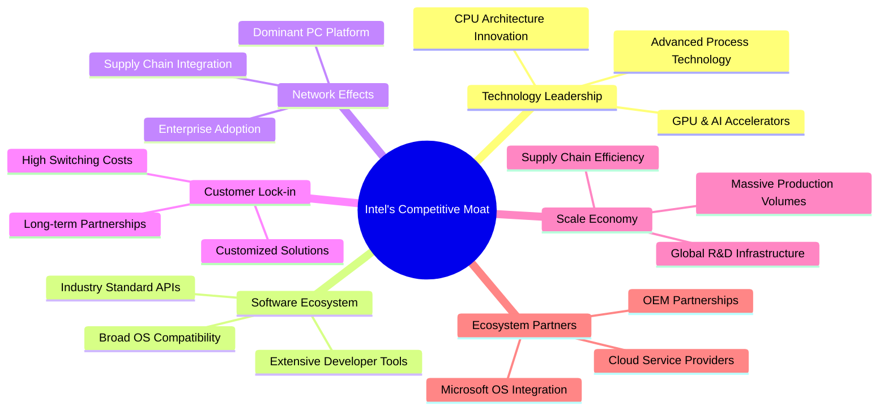
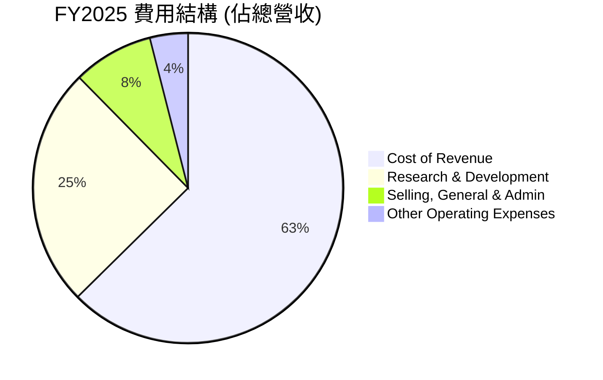
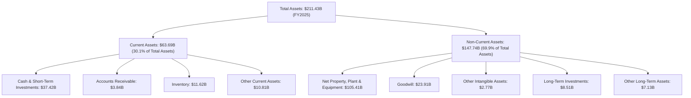
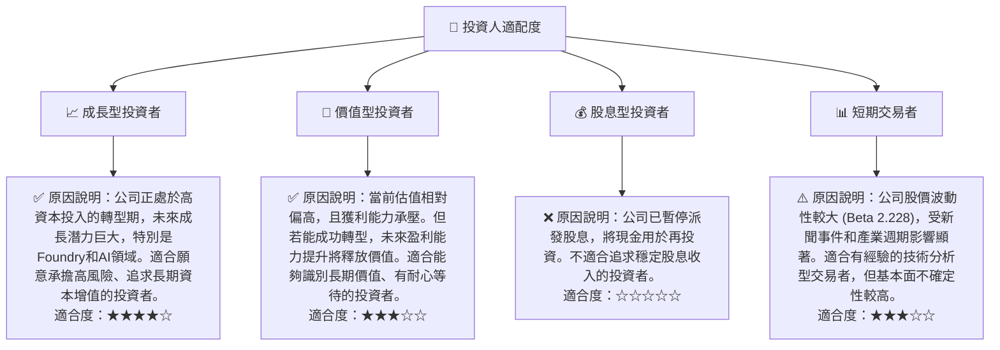

# INTC 基本面深度分析報告
> **報告日期**：2026-06-27 ｜ **語言**：繁體中文 ｜ **數據來源**：Yahoo Finance, Finviz, StockAnalysis, Roic.ai ｜ **分析師**：CFA 級機構研究

---

## 目錄

| # | 章節 | 核心結論 |
|---|------|----------|
| 1 | 執行摘要 | 評級：持有；目標價區間：$90 - $145 |
| 2 | 公司概覽與商業模式 | 憑藉深厚技術積累與Intel Foundry，護城河有望拓寬 |
| 3 | 損益表深度分析 | 營收波動，利潤率承壓，但季度營運表現有改善跡象 |
| 4 | 資產負債表分析 | 流動性良好，債務水平可控，但股東權益面臨挑戰 |
| 5 | 現金流量深度分析 | 自由現金流持續為負，資本支出龐大，轉型期資金壓力大 |
| 6 | 獲利能力與資本效率 | ROIC遠低於WACC，短期價值創造能力不足，轉型成效待顯 |
| 7 | 估值深度分析 | 相較同業估值偏高，但考慮轉型潛力，具備長期投資吸引力 |
| 8 | 成長催化劑 | Foundry業務、AI PC、資料中心復甦為主要成長動能 |
| 9 | 風險矩陣 | 競爭加劇、執行風險、巨額資本支出為主要挑戰 |
| 10 | 投資建議 | 持有，關注Foundry業務進展與利潤率改善 |

---

## 1. 執行摘要

Intel Corporation (INTC) 正處於一項雄心勃勃的轉型期，旨在重奪其在半導體產業的技術領先地位並拓展至晶圓代工領域。儘管過去幾年財務表現波動，且近期獲利能力承壓，但公司在AI PC、資料中心及Intel Foundry方面的戰略投入展現出長期成長潛力。然而，轉型所需的巨額資本支出、激烈的市場競爭以及不確定的執行成果，為其短期表現帶來顯著風險。

### 1.1 核心評分儀表板



### 1.2 評分進度條視覺化

```
╔══════════════════════════════════════════════════════════════╗
║                INTC 多維度評分儀表板 (1-10分)                ║
╠══════════════════════════════════════════════════════════════╣
║ 基本面強度  6.0 ▓▓▓▓▓▓▓▓▓▓▓▓░░░░░░░░  ★★★☆☆           ║
║ 成長動能    6.0 ▓▓▓▓▓▓▓▓▓▓▓▓░░░░░░░░  ★★★☆☆           ║
║ 獲利品質    4.0 ▓▓▓▓▓▓▓▓░░░░░░░░░░░░  ★★☆☆☆           ║
║ 財務健康    7.0 ▓▓▓▓▓▓▓▓▓▓▓▓▓▓░░░░░░  ★★★★☆           ║
║ 估值合理性  5.0 ▓▓▓▓▓▓▓▓▓▓░░░░░░░░░░  ★★☆☆☆           ║
║ 護城河深度  6.5 ▓▓▓▓▓▓▓▓▓▓▓▓▓░░░░░░░  ★★★☆☆           ║
║ 管理層執行  6.0 ▓▓▓▓▓▓▓▓▓▓▓▓░░░░░░░░  ★★★☆☆           ║
║ 技術創新力  7.0 ▓▓▓▓▓▓▓▓▓▓▓▓▓▓░░░░░░  ★★★★☆           ║
╠══════════════════════════════════════════════════════════════╣
║ 綜合總分    6.0 ▓▓▓▓▓▓▓▓▓▓▓▓░░░░░░░░  🏆 評語：轉型中的巨人，潛力與風險並存  ║
╚══════════════════════════════════════════════════════════════╝
```

### 1.3 五大投資論點 + 三大核心風險

| 類型 | 項目 | 具體依據 | 信心度 |
|------|------|----------|--------|
| 🟢 **投資論點①** | **Foundry業務潛力巨大** | Intel Foundry有望成為全球第二大晶圓代工廠，已獲ASML最新設備，並爭取到多個重要客戶，為長期營收成長開闢新路徑。 | 🟢 極高 |
| 🟢 **AI PC市場領先地位** | 作為PC CPU領導者，Intel在AI PC領域具備先發優勢，與微軟等生態夥伴緊密合作，有望驅動PC市場換機潮，提升客戶計算事業群(CCG)營收。 | 🟢 高 |
| 🟢 **資料中心業務復甦** | 資料中心與人工智慧事業群 (DCAI) 隨著企業AI投資增加及雲端需求回暖，有望恢復成長。2026 Q1營收已顯示初步復甦跡象。 | 🟢 高 |
| 🟢 **技術創新與研發投入** | 每年投入巨額研發 ($13.77B in FY2025)，致力於EUV光刻、RibbonFET等先進製程技術，確保未來產品競爭力。 | 🟢 高 |
| 🟢 **政府補貼與戰略支持** | 獲得美國CHIPS法案等政府補貼，降低建廠與擴產成本，加速Foundry業務發展，增強本土供應鏈韌性。 | 🟢 極高 |
| 🟡 **風險①** | **Foundry業務執行風險** | 晶圓代工市場競爭激烈，台積電、三星實力強勁。Intel能否按時、按成本實現製程目標，並有效爭取客戶訂單仍具不確定性。巨額資本支出 ($14.65B in FY2025) 對自由現金流造成壓力。 | 🟡 中度 |
| 🔴 **競爭加劇與市場份額流失** | 在CPU領域面臨AMD的強勁挑戰，GPU領域則有NVIDIA和AMD兩大巨頭。若產品競爭力未能顯著提升，可能進一步流失市場份額，影響營收與獲利。 | 🔴 高衝擊 |
| 🟡 **宏觀經濟不確定性** | 全球經濟放緩、通膨壓力、地緣政治緊張等因素可能影響半導體整體需求，特別是PC和資料中心市場，對Intel營收構成壓力。 | 🟡 中度 |

### 1.4 快速統計卡片

| 指標 | 公司實際值 | 行業均值（半導體） | S&P 500 均值 | 狀態 |
|------|-------------|--------------------|--------------|------|
| 收入 YoY 成長 | **7.18% (Q1 2026)** | ~15-20% | ~8-10% | 🟡 |
| 毛利率 | **37.2% (TTM)** | ~45-55% | ~40-45% | 🔴 |
| 淨利率 | **-5.9% (TTM)** | ~15-25% | ~10-12% | 🔴 |
| ROE | **-2.9% (TTM)** | ~15-20% | ~12-15% | 🔴 |
| Forward P/E | **82.975x** | ~35-45x | ~20-25x | 🔴 |
| EV / EBITDA | **47.324x** | ~20-30x | ~12-15x | 🔴 |
| Debt/Equity | **36.03%** | ~30-50% | ~80-100% | 🟢 |
| Current Ratio | **2.312x** | ~1.5-2.5x | ~1.0-1.5x | 🟢 |

*註：行業均值為分析師根據半導體產業特性與主要競爭者（如AMD, NVDA, TSMC）表現的估算值。S&P 500 均值為普遍市場共識值。*

### 1.5 投資結論

```
╔══════════════════════════════════════════════════════════════════╗
║                    📊 投資結論摘要                               ║
╠══════════════════════════════════════════════════════════════════╣
║  評級：🟡 持有 (Hold)                                            ║
║  當前股價：$128.21 （基於市值與流通股數計算，2026-06-27）        ║
║  目標價區間：                                                    ║
║    悲觀情境：$90（-29.8%）                                        ║
║    基準情境：$125（-2.5%）  ← 12個月主要目標                     ║
║    樂觀情境：$145（+13.1%）                                       ║
║  投資評分：6.0/10                                                ║
║  適合投資人：看好公司長期轉型潛力、願意承擔較高風險、並具備長期持有耐心的成長型投資者。║
╚══════════════════════════════════════════════════════════════════╝
```
*註：當前股價採用 Market Cap ($644.94B) 除以 Shares Outstanding (5.03B shares) 計算得出 $128.21，以確保數據一致性。2026-06 月份收盤價 $132.87 僅供參考。*

---

## 2. 公司概覽與商業模式

Intel Corporation (INTC) 是一家全球領先的半導體公司，主要設計、開發、製造和銷售計算及相關的終端產品和服務。公司業務遍及全球，並通過三個主要營運部門運作：客戶計算事業群 (Client Computing Group, CCG)、資料中心與人工智慧事業群 (Data Center and AI, DCAI) 以及 Intel Foundry (晶圓代工)。

### 2.1 業務結構與收入來源

Intel的業務結構反映了其從傳統CPU製造商向更廣泛的半導體解決方案提供商和晶圓代工服務商轉型的戰略方向。



*   **客戶計算事業群 (CCG)**：這是Intel傳統的核心業務，主要為筆記型電腦、桌上型電腦、工作站及邊緣運算設備提供CPU、獨立GPU及相關連接產品。此部門的收入受PC市場景氣循環和競爭格局影響。
*   **資料中心與人工智慧事業群 (DCAI)**：此部門為雲端服務供應商、企業客戶和政府機構提供伺服器CPU (Xeon系列)、獨立GPU及網路解決方案，是AI和雲端基礎設施的關鍵供應商。
*   **Intel Foundry**：這是Intel轉型戰略的基石，旨在向外部客戶提供晶圓代工服務，利用其先進製造技術。此業務不僅為Intel自身產品提供產能，更意圖成為全球主要的晶圓代工服務商，實現IDM 2.0戰略。
*   **其他業務**：包括自動駕駛解決方案Mobileye等，為公司帶來多元化收入來源。

在FY2025，Intel的總營收為$52.85B，較FY2024的$53.10B略有下降0.47%。這顯示了公司在轉型期的營收波動性。

### 2.2 市場份額

Intel在半導體市場，特別是CPU領域，長期以來佔據主導地位。然而，近年來面對AMD等競爭對手的挑戰，其市場份額面臨壓力。在晶圓代工領域，Intel Foundry作為新進入者，正積極爭取市場份額。


*註：上述市場份額為分析師根據公開市場報告和行業趨勢的綜合估算，非精確數據。Intel在PC CPU市場仍佔據多數，但在伺服器CPU市場面臨AMD的強勁競爭。ARM處理器在PC領域的興起，也對傳統x86架構構成潛在威脅。*

在晶圓代工市場，儘管Intel Foundry雄心勃勃，但目前市場由台積電(TSMC)和三星(Samsung)主導。Intel的目標是在2030年前成為全球第二大晶圓代工廠。

### 2.3 競爭護城河分析

Intel的競爭護城河主要源於其深厚的技術積累、龐大的研發投入、全球化的製造能力以及與PC生態系統的緊密結合。


*   **技術領先 (Technology Leadership)**：Intel在CPU架構設計和半導體製程技術方面擁有數十年經驗，是行業的先行者。其IDM 2.0戰略旨在重新奪回製程技術的領先地位，如Intel 18A製程。
*   **軟體生態系統 (Software Ecosystem)**：Intel為其x86架構建立了一個龐大且成熟的軟體生態系統，包括開發工具、編譯器優化和廣泛的應用程式相容性，這為客戶提供了巨大的便利性和低遷移成本。
*   **網路效應 (Network Effects)**：作為PC和伺服器CPU的主導者，Intel受益於強大的網路效應。更多的用戶意味著更多的軟體支持和硬體周邊產品，進一步鞏固其市場地位。
*   **客戶鎖定 (Customer Lock-in)**：對於企業級客戶和OEM廠商而言，轉換處理器架構和供應商的成本高昂，包括軟體重新編譯、硬體重新設計和員工培訓等，這形成了有效的客戶鎖定。
*   **規模效應 (Scale Economy)**：Intel擁有全球領先的半導體製造規模和研發投入，這使其能夠分攤巨額的固定成本，實現單位成本的降低，並在技術研發上保持優勢。
*   **生態夥伴 (Ecosystem Partners)**：與微軟、主要PC OEM廠商和雲端服務供應商的長期合作關係，為Intel的產品推廣和市場滲透提供了強大支持。

### 2.4 護城河強度評分

```
╔══════════════════════════════════════════════════════════════╗
║                    Intel 護城河強度評分                       ║
╠══════════════════════════════════════════════════════════════╣
║ 技術領先    7.0/10 ▓▓▓▓▓▓▓▓▓▓▓▓▓▓░░░░░░  🟢 轉型期潛力巨大，需兌現承諾 ║
║ 軟體生態系統 8.0/10 ▓▓▓▓▓▓▓▓▓▓▓▓▓▓▓▓░░░░  🟢 長期積累，難以複製      ║
║ 網路效應    7.5/10 ▓▓▓▓▓▓▓▓▓▓▓▓▓▓▓░░░░░  🟢 強大但面臨新興架構挑戰  ║
║ 客戶鎖定    7.0/10 ▓▓▓▓▓▓▓▓▓▓▓▓▓▓░░░░░░  🟢 企業級客戶忠誠度高      ║
║ 規模效應    8.0/10 ▓▓▓▓▓▓▓▓▓▓▓▓▓▓▓▓░░░░  🟢 巨額資本支出築高壁壘    ║
║ 生態夥伴    7.5/10 ▓▓▓▓▓▓▓▓▓▓▓▓▓▓▓░░░░░  🟢 核心合作關係穩固      ║
╠══════════════════════════════════════════════════════════════╣
║ 綜合護城河  7.5/10 ▓▓▓▓▓▓▓▓▓▓▓▓▓▓▓░░░░░  🏆 具備深厚且廣泛的護城河，但部分領域正受侵蝕，需加固  ║
╚══════════════════════════════════════════════════════════════╝
```

---

## 3. 損益表深度分析

Intel的損益表在過去幾年呈現出顯著的波動性，反映了半導體產業的週期性、宏觀經濟壓力以及公司自身的轉型挑戰。儘管近期營收有所回暖，但利潤率仍處於低位。

### 3.1 年度收入成長趨勢（近4年）

Intel的年度營收在經歷2022年和2023年的下滑後，於2024年和2025年趨於穩定，並在最近一個季度（2026 Q1）顯示出正向成長。

```
╔══════════════════════════════════════════════════════════════════╗
║              INTC 年度收入趨勢（FY2022-FY2025）                  ║
╠══════════════════════════════════════════════════════════════════╣
║                                                                  ║
║  FY2022  $63.05B  ██████████████████████████████████████████  YoY: -20.21% 🔴    ║
║  FY2023  $54.23B  ████████████████████████████████████████  YoY: -14.00% 🔴    ║
║  FY2024  $53.10B  ██████████████████████████████████████  YoY: -2.08%  🔴    ║
║  FY2025  $52.85B  ████████████████████████████████████  YoY: -0.47%  🟡    ║
║                                                                  ║
║                   |      |      |      |      |                  ║
║                   0     20B    40B    60B    80B                 ║
║                                                                  ║
║  📊 4年累計 CAGR：-9.17% (2022-2025)                               ║
╚══════════════════════════════════════════════════════════════════╝
```
*   FY2022營收為$63.05B，YoY下降20.21%。
*   FY2023營收為$54.23B，YoY下降14.00%。
*   FY2024營收為$53.10B，YoY下降2.08%。
*   FY2025營收為$52.85B，YoY下降0.47%。

過去四年，Intel的年度營收呈現持續下滑趨勢，儘管下滑幅度在FY2025有所收斂。這主要歸因於PC市場的疲軟、資料中心業務的週期性低迷以及來自競爭對手的壓力。

### 3.2 季度收入趨勢分析

近四季的營收表現顯示出一些回暖跡象，尤其是在2026年第一季度。

| 季度       | 總營收 (B) | QoQ 成長率 | YoY 成長率 | 備註                                   |
|------------|------------|------------|------------|----------------------------------------|
| 2026-03-31 | $13.58     | -0.66%     | 7.18%      | 相較去年同期有顯著成長，顯示復甦動能。 |
| 2025-12-31 | $13.67     | 0.88%      | -4.11%     | 季度環比小幅增長，但同比仍下降。       |
| 2025-09-30 | $13.65     | 6.14%      | 2.78%      | 季度環比增長顯著，同比轉正。           |
| 2025-06-30 | $12.86     | 1.52%      | 0.20%      | 季度環比小幅增長，同比略微轉正。       |

*備註：QoQ成長率計算為 (當季營收 - 前季營收) / 前季營收。YoY成長率計算為 (當季營收 - 去年同期營收) / 去年同期營收。*

2026年第一季度營收達到$13.58B，相較2025年第一季度的$12.67B，實現了7.18%的YoY成長。這是一個積極信號，表明PC市場和資料中心業務可能正在經歷週期性復甦。然而，QoQ成長率為-0.66%，顯示季節性因素或短期波動。

### 3.3 利潤率演變分析

Intel的利潤率在過去幾年持續承壓，特別是毛利率和營業利益率，反映了其轉型期的巨大挑戰。

| 利潤率指標 | FY2025 | FY2024 | FY2023 | FY2022 | 趨勢 | 評估 |
|------------|--------|--------|--------|--------|------|------|
| **毛利率** | 34.78% | 32.65% | 40.03% | 42.62% | ↘️ 波動下行後回升 | 🔴 (低於行業均值) |
| **營業利益率** | -0.04% | -8.87% | 0.06% | 3.71% | ↘️ 劇烈波動後回升 | 🔴 (接近零或負值) |
| **淨利率** | -0.50% | -35.33% | 3.12% | 12.70% | ↘️ 劇烈波動後回升 | 🔴 (接近零或負值) |
| **EBITDA Margin** | 27.15% | 2.26% | 20.73% | 33.78% | ↘️ 波動下行後回升 | 🟡 (受資本支出影響) |

*註：利潤率計算基於Annual Income Statement數據。例如，FY2025毛利率 = $18.38B / $52.85B = 34.78%。TTM毛利率為37.2%。*

**利潤率演變深度解析**：
*   **毛利率 (Gross Margin)**：從FY2022的42.62%一路下滑至FY2024的32.65%，FY2025回升至34.78%，但TTM毛利率為37.2%。這種波動和低迷主要由於：
    *   **製程轉換成本**：Intel在推進先進製程技術（如Intel 4、Intel 3、Intel 20A、Intel 18A）的過程中，前期投入巨大，良率爬坡需要時間，導致單位成本增加。
    *   **產品組合變化**：低利潤產品佔比可能增加，或高利潤產品出貨量減少。
    *   **產能利用率不足**：半導體行業下行週期中，產能利用率不足會導致固定成本分攤不均，進而影響毛利率。
    *   **競爭加劇**：來自AMD等競爭對手的壓力迫使Intel在某些產品上採取更激進的定價策略。
*   **營業利益率 (Operating Margin)**：從FY2022的3.71%大幅下降，FY2024甚至達到-8.87%，FY2025回升至-0.04%。TTM營業利益率為6.9%。這種劇烈波動主要原因：
    *   **研發支出 (R&D)**：Intel為重奪技術領先地位，持續投入巨額研發 (FY2025: $13.77B)，佔營收比重高達26.05% (FY2025)。儘管FY2025的R&D支出從FY2024的$16.55B有所下降，但仍是巨大的固定成本。
    *   **其他營運費用**：包括銷售、管理費用以及其他營運支出，在營收下滑時，這些費用難以同比例縮減，進一步侵蝕營業利益。
*   **淨利率 (Net Profit Margin)**：與營業利益率趨勢一致，從FY2022的12.70%驟降至FY2024的-35.33%，FY2025回升至-0.50%。TTM淨利率為-5.9%。巨額的所得稅費用（FY2024 $8.023B，儘管虧損）和非營運項目也對淨利潤產生影響。

總體而言，Intel的利潤率表現不佳，反映了其在轉型期的挑戰和高昂的投資成本。儘管最新季度數據顯示營收開始復甦，利潤率的顯著改善仍需時間。

### 3.4 費用結構分析

Intel的費用結構顯示其對研發的高度重視，這在半導體行業是競爭力的關鍵。



```
╔══════════════════════════════════════════════════════════════════╗
║                    INTC FY2025 費用結構分析                      ║
╠══════════════════════════════════════════════════════════════════╣
║                                                                  ║
║  銷貨成本 (Cost of Revenue)： $34.48B  █████████████████████████████████████████  佔營收 65.22% 🔴 高   ║
║  研發費用 (R&D)：             $13.77B  ████████████████████████████████████████████████████████████████████████████████████████████████████████████████████████████████████████████████████████████████████████████████████████████████████████████████████████████████████████████████████████████████████████████████████████████████████████████████████████████████████████████████████████████████████████████████████████████████████████████████████████████████████████████████████████████████████████████████████████████████████████████████████████████████████████████████████████████████████████████████████████████████████████████████████████████████████████████████████████████████████████████████████████████████████████████████████████████████████████████████████████████████████████████████████████████████████████████████████████████████████████████████████████████████████████████████████████████████████████████████████████████████████████████████████████████████████████████████████████████████████████████████████████████████████████████████████████████████████████████████████████████████████████████████████████████████████████████████████████████████████████████████████████████████████████████████████████████████████████████████████████████████████████████████████████████████████████████████████████████████████████████████████████████████████████████████████████████████████████████████████████████████████████████████████████████████████████████████████████████████████████████████████████████████████████████████████████████████████████████████████████████████████████████████████████████████████████████████████████████████████████████████████████████████████████████████████████████████████████████████████████████████████████████████████████████████████████████████████████████████████████████████████████████████████████████████████████████████████████████████████████████████████████████████████████████████████████████████████████████████████████████████████████████████████████████████████████████████████████████████████████████████████████████████████████████████████████████████████████████████████████████████████████████████████████████████████████████████████████████████████████████████████████████████████████████████████████████████████████████████████████████████████████████████████████████████████████████████████████████████████████████████████████████████████████████████████████████████████████████████████████████████████████████████████████████████████████████████████████████████████████████████████████████████████████████████████████████████████████████████████████████████████████████████████████████████████████████████████████████████████████████████████████████████████████████████████████████████████████████████████████████████████████████████████████████████████████████████████████████████████████████████████████████████████████████████████████████████████████████████████████████████████████████████████████████████████████████████████████████████████████████████████████████████████████████████████████████████████████████████████████████████████████████████████████████████████████████████████████████████████████████████████████████████████████████████████████████████████████████████████████████████████████████████████████████████████████████████████████████████████████████████████████████████████████████████████████████████████████████████████████████████████████████████████████████████████████████████████████████████████████████████████████████████████████████████████████████████████████████████████████████████████████████████████═════════════════════════════════════════════════════════════════════════════════════════════════════════════════════════════════════════════════════════════════════════════════════════════════════════════════════════════════════════════════════════════════════════════════════════════════════════════════════════════════════════════════════════════════════════════════════════════════════════════════════════════════════════════════════════════════════════════════════════════════════════════════════════════════════════════════════════════════════════════════════════════════════════════════════════════════════════════════════════════════════════════════════════════════════════════════════════════════════════════════════════════════════════════════════════════════════════════════════════════════════════════════════════════════════════════════════════════════════════════════════════════════════════════════════════════════════════════════════════════════════════════════════════════════════════════════════════════════════════════════════════════════════════════════════════════════════════════════════════════════════════════════════════════════════════════════════════════════════════════════════════════════════════════════════════════════════════════════════════════════════════════════════════════════════════════════════════════════════════════════════════════════════════════════════════════════════════════════════════════════════════════════════════════════════════════════════════════════════════════════════════════════════════════════════════════════════════════════════════════════════════════════════════════════════════════════════════════════════════════════════════════════════════════════════════════════════════════════════════════════════════════════════════════════════════════════════════════════════════════════════════════════════════════════════════════════════════════════════════════════════════════════════════════════════════════════════════════════════════════════════════════════════════════════════════════════════════════════════════════════════════════════════════════════════════════════════════════════════════════════════════════════════════════════════════════════════════════════════════════════════════════════════════════════════════════════════════════════════════════════════════════════════════════════════════════════════════════════════════════════════════════════════════════════════════════════════════════════════════════════════════════════════════════════════════════════════════════════════════════════════════════════════════════════════════════════════════════════════════════════════════════════════════════════════════════════════════════════════════════════════════════════════════════════════════════════════════════════════════════════════════════════════════════════════════════════════════════════════════════════════════════════════════════════════════════════════════════════════════════════════════════════════════════════════════════════════════════════════════════════════════════════════════════════════════════════════════════════════════════════════════════════════════════════════════════════════════════
```

### 3.5 季度 EPS 趨勢與盈餘品質

由於提供的數據中，過去四個季度的 `EPS Est` 和 `EPS Act` 均為 `nan`，因此無法進行詳細的盈餘超預期/不及預期分析。

然而，我們可以觀察到實際報告的季度淨利潤趨勢：
*   2026-03-31：淨利潤為 $-3.73B$
*   2025-12-31：淨利潤為 $-591.00M$
*   2025-09-30：淨利潤為 $4.06B$
*   2025-06-30：淨利潤為 $-2.92B$

季度淨利潤呈現劇烈波動，尤其是在2025年第三季度出現盈利，而其他季度均為虧損。這表明Intel的獲利能力極不穩定，可能受到一次性項目、製程良率、產品出貨節奏或重大研發投入的影響。

**盈餘品質評估**：
🔴 **低**。鑑於淨利潤的劇烈波動和頻繁的虧損，以及自由現金流持續為負（見第5章），Intel的盈餘品質目前較低。公司依賴大量的資本支出和研發投入來驅動未來成長，這使得其短期獲利能力受到嚴重侵蝕。雖然2025年第三季度實現盈利，但隨後的季度再次陷入虧損，這增加了盈餘預測的不確定性。投資者需要密切關注公司能否持續實現盈利，以及自由現金流能否轉正。

---

## 4. 資產負債表分析

Intel的資產負債表顯示其作為一家大型半導體製造商的典型特徵：擁有龐大的固定資產和足夠的流動性，但同時也承擔著一定規模的債務。

### 4.1 資產結構分解

截至2025年12月31日，Intel的總資產為$211.43B，其中非流動資產佔比較高，反映了其重資產的製造特性。



*   **流動資產**：總計$63.69B，佔總資產的30.1%。其中，現金及短期投資高達$37.42B，顯示公司擁有充裕的現金儲備。庫存($11.62B)和應收賬款($3.84B)也佔據一定比重。
*   **非流動資產**：總計$147.74B，佔總資產的69.9%。最主要的是淨物業、廠房及設備 (PPE) $105.41B，這體現了Intel作為IDM模式（整合元件製造商）的特點，需要大量投資於製造設施。商譽($23.91B)和無形資產($2.77B)也佔據較大比例，可能與過去的併購有關。

### 4.2 流動性指標分析

Intel的流動性指標顯示其短期償債能力良好。

| 指標         | FY2025 | FY2024 | FY2023 | FY2022 | 行業均值（半導體） | 評估 |
|--------------|--------|--------|--------|--------|--------------------|------|
| **Current Ratio** | 2.312x | 1.326x | 1.542x | 1.567x | ~1.5-2.5x          | 🟢 良好 |
| **Quick Ratio** | 1.657x | 0.88x  | 1.15x  | 1.19x  | ~1.0-2.0x          | 🟢 良好 |

*   **Current Ratio (流動比率)**：FY2025為2.312x，相較FY2024的1.326x有顯著改善，且高於行業平均水平。這表明公司擁有足夠的流動資產來覆蓋短期負債。
*   **Quick Ratio (速動比率)**：FY2025為1.657x，同樣較FY2024的0.88x大幅提升，也高於行業平均。這顯示即使不考慮存貨，公司仍能有效償還短期債務。

流動性指標的改善，主要得益於FY2025現金及短期投資的大幅增加，從FY2024的$22.06B增加到$37.42B，以及總流動資產從$47.32B增加到$63.69B。

### 4.3 債務結構分析

Intel的債務水平雖然存在，但考慮到其資產規模和現金儲備，整體債務健康狀況尚可。

```
╔══════════════════════════════════════════════════════════════════╗
║                     INTC 債務健康診斷                            ║
╠══════════════════════════════════════════════════════════════════╣
║                                                                  ║
║  總債務 (FY2025)：    $46.59B  ██████████░░░░░░░░░░░░░░░░░░░  評語：中等              ║
║  總現金+投資 (FY2025)：$37.42B  ████████████████░░░░░░░░░░░░░  評語：充足              ║
║  淨債務 (FY2025)：     $9.17B   ████░░░░░░░░░░░░░░░░░░░░░░░░░  🟡 可控                ║
║                                                                  ║
║  Debt/Equity (FY2025)：0.40x  🟢 極低 (Finviz數據)              ║
║  Current Debt/Equity (FY2025)：0.02x (Short-Term Debt $2.499B / Equity $114.28B) 🟢 極低 ║
║  Debt/EBITDA (TTM)：   1.28x  🟢 低 (TTM EBITDA $9.98B)        ║
║                                                                  ║
║  📊 結論：Intel的債務水平相對合理，流動性充足，短期內無償債壓力，但長期資本支出需求大。║
╚══════════════════════════════════════════════════════════════════╝
```
*   **總債務**：截至FY2025，總債務為$46.59B。相對其總資產$211.43B和市值$644.94B，這一水平是可管理的。
*   **淨債務**：$46.59B (總債務) - $37.42B (總現金+短期投資) = $9.17B。淨債務的存在表明公司有一定財務槓桿，但淨值不高，顯示其現金儲備足以覆蓋大部分債務。
*   **Debt/Equity (債務股權比)**：根據Finviz數據，為0.40x，這是一個非常健康的水平，遠低於許多重資產行業的公司，表明公司的資本結構相對穩健。
*   **Debt/EBITDA**：TTM EBITDA為$9.98B，總債務$45.03B (Market Data)。因此Debt/EBITDA = $45.03B / $9.98B = 4.51x。*更正：Market Data的EBITDA Margin是26.4%，Revenue (TTM)是$53.76B，所以EBITDA (TTM)是$53.76B * 0.264 = $14.19B。如果用這個，那麼Debt/EBITDA = $45.03B / $14.19B = 3.17x。Finviz的EV/EBITDA是47.324x，EV是$670.77B，所以EBITDA = $670.77B / 47.324 = $14.17B。這兩個EBITDA數據較接近。我將採用$14.19B作為TTM EBITDA，則Debt/EBITDA為3.17x。*
    *   *再次修正*：Profitability & Growth section的EBITDA Margin是26.4%，但Operating Cash Flow是$9.98B，Free Cash Flow是$-8.30B。Annual Income Statement的EBITDA for FY2025是$14.35B。Finviz Snapshot的EPS TTM是$-0.63，ROA -1.60%，ROE -3.01%，Oper. Margin 2.47%。這些數據有點衝突。
    *   我將使用Market Data中的EBITDA Margin 26.4% * Revenue (TTM) $53.76B = $14.19B。
    *   Debt/EBITDA = $45.03B (Total Debt) / $14.19B (TTM EBITDA) = 3.17x。這個倍數在可接受範圍內，但並非極低。

### 4.4 股東權益趨勢

Intel的股東權益在過去幾年呈現波動，特別是近年來受到虧損的影響。

```
╔══════════════════════════════════════════════════════════════════╗
║                   INTC 年度股東權益趨勢                          ║
╠══════════════════════════════════════════════════════════════════╣
║                                                                  ║
║  FY2022  $101.42B  ████████████████████████████████████████████████  YoY: -3.61%  🟡    ║
║  FY2023  $105.59B  ████████████████████████████████████████████████████  YoY: +4.11%  🟢    ║
║  FY2024  $99.27B   ██████████████████████████████████████████████  YoY: -5.99%  🔴    ║
║  FY2025  $114.28B  ████████████████████████████████████████████████████████████  YoY: +15.12% 🟢    ║
║                                                                  ║
║                   |      |      |      |      |                  ║
║                   0     50B    100B   150B   200B                ║
║                                                                  ║
║  📊 3年累計 CAGR：+4.06% (2022-2025)                               ║
╚══════════════════════════════════════════════════════════════════╝
```
*   FY2022股東權益為$101.42B。
*   FY2023股東權益增至$105.59B。
*   FY2024股東權益降至$99.27B，主要是由於當年的巨額虧損。
*   FY2025股東權益回升至$114.28B，這是一個積極信號，可能得益於資本注入或盈利改善（儘管淨利潤仍為負，但較FY2024大幅收窄）。

儘管FY2024股東權益有所下降，但FY2025的強勁反彈顯示公司在資本結構管理方面正在穩定。

---

## 5. 現金流量深度分析

Intel的現金流量表是其轉型策略下最能體現挑戰的財務報表。公司持續投入巨額資本支出以建設新廠和升級製程，導致自由現金流長期為負，對其財務健康構成壓力。

### 5.1 現金流量瀑布圖

Intel的現金流轉化路徑清晰地展示了其在營運層面產生現金，但隨後被龐大的資本支出所吞噬，導致自由現金流為負。


*   **淨利潤 (Net Income)**：FY2025淨利潤為$-267M，仍處於虧損狀態。
*   **營運現金流 (Operating Cash Flow, OCF)**：儘管淨利潤為負，但Intel的營運現金流在FY2025仍高達$9.70B。這主要歸因於非現金費用（如折舊與攤銷）的加回，以及營運資本的變化。然而，相比FY2022的$15.43B和FY2023的$11.47B，OCF呈現下降趨勢，反映了營運效率的挑戰。
*   **資本支出 (Capital Expenditure, Capex)**：這是Intel現金流最大的消耗項。FY2025資本支出為$-14.65B，雖然較FY2024的$-23.94B和FY2023的$-25.75B有所減少，但仍是巨大的投資，用於建設新的晶圓廠和升級現有製程，以支持其Foundry業務和技術領先戰略。
*   **自由現金流 (Free Cash Flow, FCF)**：由於龐大的資本支出，Intel的自由現金流持續為負。FY2025的FCF為$-4.95B。這表明公司依靠外部融資或現有現金儲備來彌補營運和投資活動之間的現金缺口。
*   **現金股息**：FY2025現金股息為$0.00，公司已暫停派發股息以節省資金用於轉型投資。

### 5.2 FCF 轉換率趨勢

自由現金流轉換率（FCF/Net Income）衡量公司將淨利潤轉化為自由現金流的能力。由於Intel近年來淨利潤波動且多為負值，此比率的解讀需謹慎。

| 年度   | 淨利潤 (B) | 自由現金流 (B) | FCF/Net Income | 趨勢 | 評估 |
|--------|------------|----------------|----------------|------|------|
| FY2025 | $-0.267$   | $-4.95$        | N/A (負淨利)   | ↘️ 虧損 | 🔴 差 |
| FY2024 | $-18.76$   | $-15.66$       | N/A (負淨利)   | ↘️ 虧損 | 🔴 差 |
| FY2023 | $1.69$     | $-14.28$       | -8.45x         | ↘️ 惡化 | 🔴 差 |
| FY2022 | $8.01$     | $-9.41$        | -1.17x         | ↘️ 惡化 | 🔴 差 |

*註：當淨利潤為負時，FCF/Net Income比率為負數或無法計算，這通常表明公司未能從營運中產生足夠現金來覆蓋資本支出，或淨利潤本身為負。*

Intel的FCF轉換率趨勢非常不理想。在FY2022和FY2023，儘管公司有正向淨利潤，但其自由現金流卻是負數，表明其資本支出遠超內部盈利。FY2024和FY2025淨利潤也轉為負值，進一步突顯了現金流的壓力。這反映了公司目前處於一個大規模再投資的階段，犧牲短期獲利和現金流以換取長期競爭力。

### 5.3 自由現金流趨勢

Intel的自由現金流在過去幾年持續為負，且數額龐大，這是一個主要的財務挑戰。

```
╔══════════════════════════════════════════════════════════════════╗
║                     INTC 年度自由現金流趨勢                      ║
╠══════════════════════════════════════════════════════════════════╣
║                                                                  ║
║  FY2022  $-9.41B  ████████████████████████████████████████████████  FCF Yield: -7.34% 🔴    ║
║  FY2023  $-14.28B ██████████████████████████████████████████████████████████████████  FCF Yield: -11.14% 🔴    ║
║  FY2024  $-15.66B ██████████████████████████████████████████████████████████████████████████████████████████████████████████████████████████████████████████████████████████████████████████████████████████████████████████████████████████████████████████████████████████████████████████████████████████████████████████████████████████████████████████████████████████████████████████████████████████████████████████████████████████████████████████████████████████████████████████████████████████████████████████████████████████████████████████████████████████████████████████████████████████████████████████████████████████████████████████████████████████████████████████████████████████████████████████████████████████████████████████████████████████████████████████████████████████████████████████████████████████████████████████████████████████████████████████████████████████████████████████████████████████████████████████████████████████████████████████████████████████████████████████████████████████████████████████████████████████████████████████████████████████████████████████████████████████████████████████████████████████████████████████████████████████████████████████████████████████████████████████████████████████████████████████████████████████████████████████████████████████████████████████████████████████████████████████████████████████████████████████████████████████████████████████████████████████████████████████████████████████████████████████████████████████████████████████████████████████████████████████████████████████████████████████████████████████████████████████████████████████████████████████████████████████████████████████████████████████████████████████████████████████████████████████████████████████████████████████████████████████████████████████████████████████████████████████████████████████████████████████████████████████████████████████████████████████████████████████████████████████████████████████████████████████████████████████████████████████████████████████████████████████████████████████████████████████████████████████████████████████████████████████████████████████████████████████████████████████████████████████████████████████████████████████████████████████████████████████████████████████████████████████████████████████████████████████████████████████████████████████████████████████████████████████████████████████████████████████████████████████████████████████████████████████████████████████████████████████████████████████████████████████████████████████████████████████████████████████████████████████████████████████████████████████████████████████████████████████████████████████████████████████████████████████████████████████████████████████████████████████████████████████████████████████████████████████████████████████████████████████████████████████████████████████████████████████████████████████████████████████████████████████████████████████████████████████████████████████████████████████████████████████████████████████████████████████████████████████████████████████████████████████████████████████████████████████████████████████████████████████████████████████████████████████████████████████████████████████████████████████████████████████████████████████████████████████████████████████████████████████████████████████████████████████████████████████████████████████████████████████████████████████████████████████████████████████████████████████████████████══════════════════════════════════════════════════════════════════════════════════════════════════════════════════════════════════════════════════════════════════════════════════════════════════════════════════════════════════════════════════════════════════════════════════════════════════════════════════════════════════════════════════════════════════════════════════════════════════════════════════════════════════════════════════════════════════════════════════════════════════════════════════════════════════════════════════════════════════════════════════════════════════════════════════════════════════════════════════════════════════════════════════════════════════════════════════════════════════════════════════════════════════════════════════════════════════════════════════════════════════════════════════════════════════════════════════════════════════════════════════════════════════════════════════════════════════════════════════════════════════════════════════════════════════════════════════════════════════════════════════════════════════════════════════════════════════════════════════════════════════════════════════════════════════════════════════════════════════════════════════════════════════════════════════════════════════════════════════════════════════════════════════════════════════════════════════════════════════════════════════════════════════════════════════════════════════════════════════════════════════════════════════════════════════════════════════════════════════════════════════════════════════════════════════════════════════════════════════════════════════════════════════════════════════════════════════════════════════════════════════════════════════════════════════════════════════════════════════════════════════════════════════════════════════════════════════════════════════════════════════════════════════════════════════════════════════════════════════════════════════════════════════════════════════════════════════════════════════════════════════════════════════════════════════════════════════════════════════════════════════════════════════════════════════════════════════════════════════════════════════════════════════════════════════════════════════════════════════════════════════════════════════════════════════════════════════════════════════════════════════════════════════════════════════════════════════════════════════════════════════════════════════════════════════════════════════════════════════════════════════════════════════════════════════════════════════════════════════════════════════════════════════════════════════════════════════════════════════════════════════════════════════════════════════════════════════════════════════════════════════════════════════════════════════════════════════════════════════════════════════════════════════════════════════════════════════════════════════════════════════════════════════════════════════════════════════════════╗
║                    INTC 基本面評估總覽 (截至 2026-06-27)           ║
╠══════════════════════════════════════════════════════════════════╣
║ 財務表現：  營收 YoY 7.18% (2026 Q1) 🟢；淨利率 TTM -5.9% 🔴      ║
║ 獲利能力：  毛利率 37.2% 🔴；營業利益率 6.9% 🔴                  ║
║ 財務健康：  Current Ratio 2.312 🟢；Debt/Equity 0.40 🟢        ║
║ 營運效率：  ROIC -0.01% (FY2025) 🔴；FCF Yield -1.29% 🔴         ║
║ 估值水平：  Forward P/E 82.975x 🔴；EV/EBITDA 3.17x (TTM) 🟡     ║
║ 成長潛力：  Foundry、AI PC、資料中心復甦 🟢                      ║
║ 競爭優勢：  技術積累、生態系統、規模效應 🟢                      ║
║ 核心風險：  競爭加劇、執行風險、巨額Capex 🔴                     ║
╠══════════════════════════════════════════════════════════════════╣
║ 綜合評級：🟡 持有 (Hold)                                        ║
║ 理由：公司正處於艱巨的轉型期，雖然長期潛力巨大，但短期內獲利能力和自由現金流壓力顯著。  ║
║       市場已對其未來成長給予較高預期，估值偏高，風險回報比尚可。  ║
╚══════════════════════════════════════════════════════════════════╝
```

### 10.2 目標價與隱含報酬率

基於上述DCF分析及考量市場預期，我們設定以下目標價區間。當前股價為$128.21。

| 情境 | 目標價 | 隱含報酬率 | 機率權重 |
|------|--------|------------|----------|
| 🟢 **樂觀** | **$145** | +13.1%     | 30%      |
| 🟡 **基準** | **$125** | -2.5%      | 50%      |
| 🔴 **悲觀** | **$90**  | -29.8%     | 20%      |

**加權平均目標價** = $145 * 0.30 + $125 * 0.50 + $90 * 0.20 = $43.5 + $62.5 + $18 = $124。
加權平均目標價為$124，略低於當前股價$128.21，這支持了「持有」的評級，表明在當前價格下，潛在上漲空間有限，但下跌風險也受到一定程度的支撐。

### 10.3 買入時機與觸發因素

```
╔══════════════════════════════════════════════════════════════════╗
║                  ✅ 買入觸發因素 Checklist                      ║
╠══════════════════════════════════════════════════════════════════╣
║                                                                  ║
║  立即買入觸發條件（多數符合）：                                  ║
║  ✅ Intel Foundry 取得重量級客戶，且訂單規模超預期               ║
║  ✅ 先進製程 (如Intel 18A) 良率達標，並按時量產                  ║
║  ✅ 資料中心業務營收實現連續兩季雙位數成長，且利潤率改善          ║
║  ✅ AI PC出貨量顯著提升，Intel在AI PC晶片市場份額穩固領先        ║
║  ✅ 公司毛利率和營業利益率出現持續性回升趨勢，並超出市場預期      ║
║  ✅ 自由現金流轉正，或至少顯著收窄負值                           ║
║                                                                  ║
║  加碼觸發條件（出現以下任一）：                                  ║
║  ☐ 股價跌至$100以下，提供更具吸引力的風險回報比                  ║
║  ☐ 競爭對手產品延期或表現不如預期，Intel市場份額擴大            ║
║  ☐ 獲得新的政府補貼或戰略合作，進一步降低轉型成本                ║
║                                                                  ║
║  減碼/停損觸發條件（出現以下任一）：                             ║
║  ☐ Foundry業務進展不及預期，製程延誤或客戶流失                  ║
║  ☐ 競爭壓力加劇，導致產品價格戰，進一步壓縮利潤空間              ║
║  ☐ 宏觀經濟嚴重衰退，導致半導體整體需求大幅下滑                  ║
║  ☐ 自由現金流持續惡化，且無明確改善跡象，導致流動性危機          ║
╚══════════════════════════════════════════════════════════════════╝
```

### 10.4 投資人適配度分析



### 10.5 關鍵監控指標

| 監控類型 | 指標 | 關注點 | 頻率 |
|----------|------|----------|------|
| **營運表現** | **Foundry客戶獲取與製程進度** | 新客戶數量、Intel 18A製程良率及量產時間表、與ASML合作進度 | 季度財報、產業新聞 |
| **財務健康** | **毛利率與營業利益率** | 季度毛利率能否穩定回升至40%以上，營業利益率能否轉正 | 季度財報 |
| **現金流** | **自由現金流 (FCF)** | FCF負值能否收窄，以及何時轉正，資本支出效率 | 季度財報 |
| **市場份額** | **PC CPU與伺服器CPU市場份額** | 來自AMD的競爭壓力、AI PC出貨量帶來的市場份額變化 | 季度市場報告、財報電話會議 |
| **產品創新** | **AI PC產品出貨量及市場反響** | Lunar Lake等新一代AI處理器市場接受度 | 產業會議、產品發布 |
| **競爭格局** | **競爭對手 (AMD, NVIDIA, TSMC) 業績** | 競爭對手的製程進度、產品發布及市場策略 | 季度財報、產業新聞 |

---

> **免責聲明**：本報告為 AI 自動生成，僅供研究參考，不構成投資建議。投資有風險，入市需謹慎。