# INTC 基本面深度分析報告
> **報告日期**：2026-07-01 ｜ **語言**：繁體中文 ｜ **數據來源**：Yahoo Finance, Finviz, StockAnalysis, Roic.ai ｜ **分析師**：CFA 級機構研究

## 目錄

| # | 章節 | 核心結論 |
|---|------|----------|
| 1 | 執行摘要 | 持有評級，目標價區間 $100-$145 |
| 2 | 公司概覽與商業模式 | 護城河受挑戰，但製造規模仍是優勢 |
| 3 | 損益表深度分析 | 營收波動，利潤率承壓，近期有改善跡象 |
| 4 | 資產負債表分析 | 流動性良好，債務水平可控，但淨債務增加 |
| 5 | 現金流量深度分析 | 自由現金流持續為負，資本支出壓力大 |
| 6 | 獲利能力與資本效率 | ROIC遠低於WACC，股東價值創造面臨挑戰 |
| 7 | 估值深度分析 | 相對估值偏高，DCF顯示當前股價高估 |
| 8 | 成長催化劑 | 晶圓代工、AI PC、新產品週期是主要驅動力 |
| 9 | 風險矩陣 | 競爭加劇、執行風險、高資本支出是主要挑戰 |
| 10 | 投資建議 | 持有，關注轉型進度與財務指標改善 |

---

## 1. 執行摘要

### 1.1 核心評分儀表板

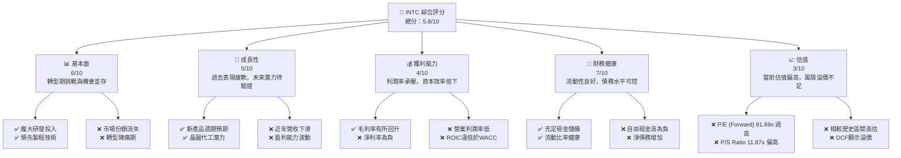

### 1.2 評分進度條視覺化

```
╔══════════════════════════════════════════════════════════════╗
║              INTC 多維度評分儀表板 (1-10分)                  ║
╠══════════════════════════════════════════════════════════════╣
║ 基本面強度  6.0 ▓▓▓▓▓▓▓▓▓▓▓▓░░░░░░░░  ★★★☆☆           ║
║ 成長動能    5.0 ▓▓▓▓▓▓▓▓▓▓░░░░░░░░░░  ★★☆☆☆           ║
║ 獲利品質    4.0 ▓▓▓▓▓▓▓▓░░░░░░░░░░░░  ★★☆☆☆           ║
║ 財務健康    7.0 ▓▓▓▓▓▓▓▓▓▓▓▓▓▓░░░░░░  ★★★☆☆           ║
║ 估值合理性  3.0 ▓▓▓▓▓▓░░░░░░░░░░░░░░  ★☆☆☆☆           ║
║ 護城河深度  6.5 ▓▓▓▓▓▓▓▓▓▓▓▓▓░░░░░░░  ★★★☆☆           ║
║ 管理層執行  5.5 ▓▓▓▓▓▓▓▓▓▓▓░░░░░░░░░  ★★☆☆☆           ║
║ 技術創新力  7.0 ▓▓▓▓▓▓▓▓▓▓▓▓▓▓░░░░░░  ★★★☆☆           ║
╠══════════════════════════════════════════════════════════════╣
║ 綜合總分    5.8 ▓▓▓▓▓▓▓▓▓▓▓░░░░░░░░░  🏆 處於轉型期的挑戰者   ║
╚══════════════════════════════════════════════════════════════╝
```

### 1.3 五大投資論點 + 三大核心風險

| 類型 | 項目 | 具體依據 | 信心度 |
|------|------|----------|--------|
| 🟢 **投資論點①** | **晶圓代工業務（Intel Foundry）潛力** | Intel計劃在2025年實現五個節點的技術領先，並已獲得多個外部客戶訂單。預計未來幾年將成為重要營收增長點。 | 🟢 高 |
| 🟢 **AI PC與新產品週期驅動** | Intel在AI PC領域積極布局，推出Core Ultra處理器。隨著PC市場復甦和新產品週期，有望帶動客戶端計算業務（CCG）增長。Q1 2026營收 $13.58B，YoY 7.18%，顯示初步復甦跡象。 | 🟢 高 |
| 🟢 **技術創新與製程領先追趕** | 公司持續投入巨額研發（FY2025 $13.77B），目標在2025年實現18A製程技術，重奪製程領先地位，這對其長期競爭力至關重要。 | 🟡 中度 |
| 🟢 **龐大的現有生態系統與客戶基礎** | Intel在全球PC和數據中心市場擁有深厚的客戶基礎和廣泛的生態系統，提供穩定的基礎收入。 | 🟢 高 |
| 🟢 **充足的現金儲備** | 截至2026年3月，公司擁有 $32.79B 的現金及短期投資，足以支持其高額資本支出和轉型期間的營運。 | 🟢 高 |
| 🟡 **風險①** | **晶圓代工業務執行風險與競爭** | 晶圓代工市場競爭激烈（台積電、三星），Intel需證明其在技術、成本和良率上的競爭力。若進度不及預期或客戶採納度低，將影響其轉型成效。 | 🟡 中度 |
| 🔴 **風險②** | **高額資本支出與自由現金流壓力** | 為了追趕製程技術，公司持續投入大量資本支出（FY2025 $-14.65B），導致自由現金流持續為負（FY2025 $-4.95B），對財務狀況構成長期壓力。 | 🔴 高衝擊 |
| 🔴 **市場份額流失與競爭加劇** | 在CPU和GPU市場，來自AMD和NVIDIA的競爭日益激烈，尤其是在高性能計算和數據中心領域。Intel若未能有效反擊，將面臨進一步的市場份額和利潤率壓力。TTM淨利率為-5.9%，反映了當前的困境。 | 🔴 高衝擊 |

### 1.4 快速統計卡片

| 指標 | 公司實際值 (TTM) | 行業均值 (半導體) | S&P 500 均值 | 狀態 |
|------|--------------------|--------------------|--------------|------|
| 收入 YoY 成長 | **1.35%** | ~15-20% | ~8-10% | 🔴 |
| 毛利率 | **37.2%** | ~45-55% | ~40-50% | 🔴 |
| 淨利率 | **-5.9%** | ~15-25% | ~10-12% | 🔴 |
| ROE | **-2.9%** | ~15-20% | ~12-15% | 🔴 |
| Forward P/E | **81.69x** | ~30-40x | ~20-25x | 🔴 |
| P/S Ratio | **11.87x** | ~5-8x | ~2-3x | 🔴 |
| Current Ratio | **2.31x** | ~1.5-2.5x | ~1.5-2.0x | 🟢 |
| Debt/Equity | **36.03%** | ~30-50% | ~50-80% | 🟢 |

*註：行業與S&P 500均值為分析師根據半導體行業特性和市場普遍水平估計，非數據源提供。*

### 1.5 投資結論

```
╔══════════════════════════════════════════════════════════════════╗
║                    📊 投資結論摘要                               ║
╠══════════════════════════════════════════════════════════════════╣
║  評級：🟡 持有                                                   ║
║  當前股價：$127.02                                               ║
║  目標價區間：                                                    ║
║    悲觀情境：$100（-21.27%）                                     ║
║    基準情境：$120（-5.53%）  ← 12個月主要目標                      ║
║    樂觀情境：$145（+14.15%）                                     ║
║  投資評分：5.8/10                                                ║
║  適合投資人：願意承擔較高風險、看好長期轉型潛力的成長型投資者。     ║
║              需密切關注公司執行力、財務改善及市場競爭態勢。      ║
╚══════════════════════════════════════════════════════════════════╝
```

---

## 2. 公司概覽與商業模式

### 2.1 業務結構與收入來源

Intel Corporation 是一家全球領先的半導體公司，主要設計、開發、製造、行銷和銷售計算及相關的終端產品和服務。公司目前通過三個主要業務部門運營：客戶端計算事業群 (CCG)、數據中心與人工智能事業群 (DCAI) 和 Intel Foundry (晶圓代工)。

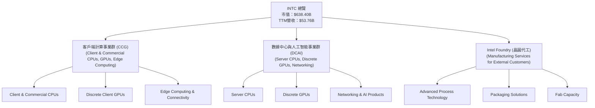
*註：具體各業務板塊營收佔比未在提供數據中明確列出，此圖為業務結構示意。*

### 2.2 市場份額

由於提供的財務數據中未包含具體的市場份額數據，此處將基於產業普遍認知進行示意性分析。Intel長期以來在PC CPU市場佔據主導地位，但在數據中心CPU和獨立GPU市場面臨AMD和NVIDIA的強大挑戰。新成立的晶圓代工業務則需從零開始爭奪市場份額。

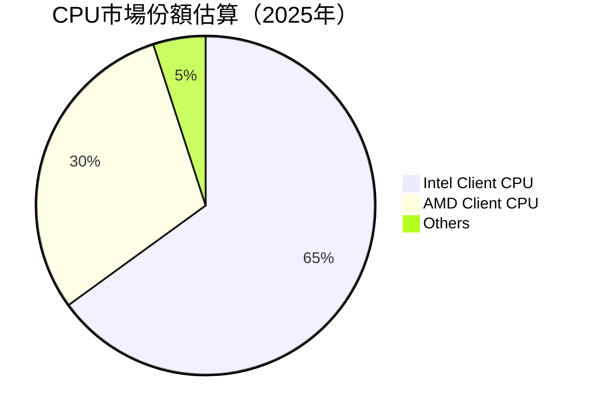
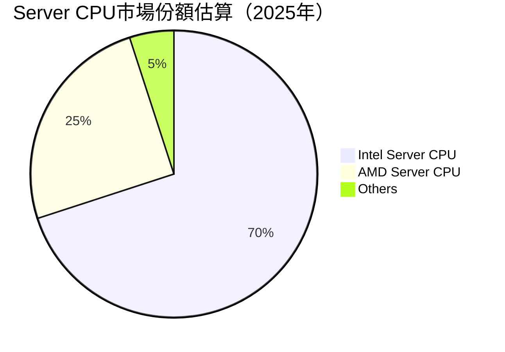
*註：以上市場份額為基於產業研究的估算，非本報告數據源提供之精確數字。*

### 2.3 競爭護城河分析

Intel的護城河正在經歷挑戰與重塑。傳統上，其在x86架構上的技術領先和規模效應是核心優勢，但近年來，這些優勢受到AMD在性能和功耗上的追趕，以及NVIDIA在AI加速領域的突破性發展的侵蝕。Intel正試圖通過大規模投資晶圓代工和AI技術來重建其護城河。

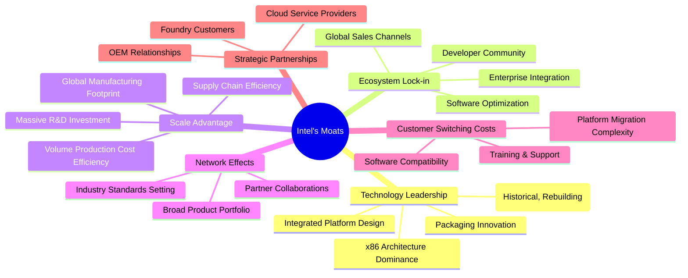

### 2.4 護城河強度評分

```
╔══════════════════════════════════════════════════════════════╗
║                    INTC 護城河強度評分                        ║
╠══════════════════════════════════════════════════════════════╣
║ 技術領先    7/10   ▓▓▓▓▓▓▓▓▓▓▓▓▓▓░░░░░░  🟢 努力重建領先      ║
║ 軟體生態系統  8/10   ▓▓▓▓▓▓▓▓▓▓▓▓▓▓▓▓░░░░  🟢 非常深厚        ║
║ 網路效應    7/10   ▓▓▓▓▓▓▓▓▓▓▓▓▓▓░░░░░░  🟢 廣泛但受挑戰      ║
║ 客戶鎖定    6/10   ▓▓▓▓▓▓▓▓▓▓▓▓░░░░░░░░  🟡 仍存在但減弱      ║
║ 規模效應    8/10   ▓▓▓▓▓▓▓▓▓▓▓▓▓▓▓▓░░░░  🟢 巨大製造規模      ║
║ 生態夥伴    6/10   ▓▓▓▓▓▓▓▓▓▓▓▓░░░░░░░░  🟡 合作關係多元      ║
╠══════════════════════════════════════════════════════════════╣
║ 綜合護城河   6.8    ▓▓▓▓▓▓▓▓▓▓▓▓▓▓░░░░░░  🏆 正在經歷轉型與重塑 ║
╚══════════════════════════════════════════════════════════════╝
```

---

## 3. 損益表深度分析

### 3.1 年度收入成長趨勢（近4年）

Intel近年來營收表現承壓，從FY2022的$63.05B下滑至FY2025的$52.85B，複合年增長率為負。然而，TTM營收顯示出初步回穩跡象。

```
╔══════════════════════════════════════════════════════════════════╗
║              INTC 年度收入趨勢（FY2022-FY2025）                   ║
╠══════════════════════════════════════════════════════════════════╣
║                                                                  ║
║  FY2022  $63.05B  ███████████████████████████████████████░░░░  YoY: -20.21%  🔴    ║
║  FY2023  $54.23B  ██████████████████████████████░░░░░░░░░░░  YoY: -14.00%  🔴    ║
║  FY2024  $53.10B  ████████████████████████████░░░░░░░░░░░░░  YoY: -2.08%   🔴    ║
║  FY2025  $52.85B  ████████████████████████████░░░░░░░░░░░░░  YoY: -0.47%   🔴    ║
║  TTM     $53.76B  █████████████████████████████░░░░░░░░░░░  YoY: +1.35%   🟡    ║
║                   |      |      |      |      |                  ║
║                   0     15B    30B    45B    60B                   ║
║                                                                  ║
║  📊 3年累計 CAGR (FY22-FY25)：-5.91%                               ║
╚══════════════════════════════════════════════════════════════════╝
```

### 3.2 季度收入趨勢分析

近四季營收表現顯示出波動性，但Q1 2026實現了正向的年增長，預示著潛在的復甦。

| 季度 | 總營收 (B) | QoQ 成長率 | YoY 成長率 | 備註 |
|------|-------------|------------|------------|------|
| 2026-03-31 | $13.58 | -0.66% | +7.18% | 營收年增長轉正，顯示復甦跡象。 |
| 2025-12-31 | $13.67 | +0.10% | -4.11% | 營收環比持平，但年比仍負增長。 |
| 2025-09-30 | $13.65 | +6.16% | +2.78% | 營收環比顯著增長，年比轉正。 |
| 2025-06-30 | $12.86 | +1.52% | +0.20% | 營收基本持平，年比微增。 |

### 3.3 利潤率演變分析

Intel的利潤率近年來持續承壓，尤其在2024財年出現顯著惡化，毛利率和營業利益率均大幅下降。FY2025和2026年Q1顯示出初步的改善跡象，但淨利率仍為負。

| 利潤率指標 | FY2022 | FY2023 | FY2024 | FY2025 | TTM (2026-03) | 趨勢 | 評估 |
|------------|--------|--------|--------|--------|---------------|------|------|
| **毛利率** | 42.6% | 40.0% | 32.7% | 34.8% | 35.4% | ↘️ 後 ↗️ | 🟡 |
| **營業利益率** | 3.7% | 0.1% | -8.9% | -4.2% | -9.4% | ↘️ 後 ↗️ | 🔴 |
| **淨利率** | 12.7% | 3.1% | -35.3% | -0.5% | -6.3% | ↘️ 後 ↗️ | 🔴 |
| **EBITDA Margin** | 33.8% | 20.7% | 2.3% | 27.2% | 26.4% | ↘️ 後 ↗️ | 🟡 |

**利潤率演變深度解析**：
*   **毛利率 (Gross Margin)**: 從FY2022的42.6%一路下滑至FY2024的32.7%，主要原因為產品組合變化、定價壓力、以及新製程技術研發和初期生產成本較高。FY2025回升至34.8%，TTM進一步改善至35.4%，這可能得益於成本控制措施和產品出貨結構優化。
*   **營業利益率 (Operating Margin)**: 營業利益率的波動更為劇烈，從FY2022的3.7%驟降至FY2024的-8.9%，並在TTM達到-9.4%。這反映了在營收下滑的同時，研發費用（FY2025 $13.77B）和銷售管理費用居高不下，以及其他營業費用（TTM $6.105B）的影響。公司為轉型投入的巨額固定成本在營收低迷時期對營業利潤造成巨大壓力。
*   **淨利率 (Net Profit Margin)**: 淨利率在FY2024達到驚人的-35.3%，主要是由於巨額的「Provision for Income Taxes」$8.023B在負稅前利潤的情況下產生，這可能與一次性稅務調整或資產減值有關。FY2025淨利率大幅改善至-0.5%，但TTM再次惡化至-6.3%，顯示盈利能力仍不穩定，未能實現持續盈利。
*   **EBITDA Margin**: EBITDA Margin的趨勢與營業利益率相似，但在FY2025大幅反彈至27.2%，TTM為26.4%。這表明在扣除折舊攤銷後，公司的核心業務操作現金流仍有一定韌性，但營運層面的效率仍需提升。

總體而言，Intel正處於轉型陣痛期，高額的研發和資本支出在短期內嚴重侵蝕了其利潤率。儘管毛利率和EBITDA Margin顯示出初步改善，但淨利率持續為負，表明公司尚未走出虧損泥潭，其盈利品質仍需大幅提升。

### 3.4 費用結構分析

Intel作為一家技術驅動型公司，研發費用佔比極高。銷售、一般及行政費用也佔據一定比重。

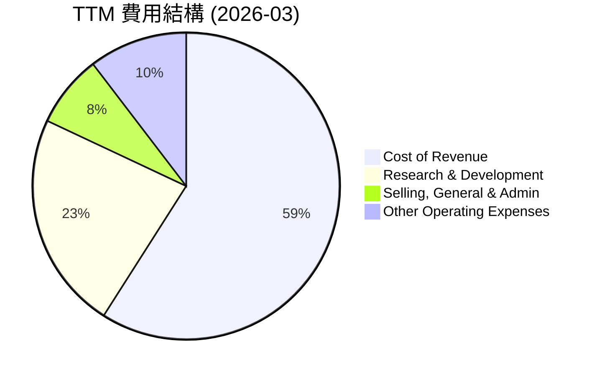

```
╔══════════════════════════════════════════════════════════════════╗
║                    INTC TTM 費用構成（2026-03）                   ║
╠══════════════════════════════════════════════════════════════════╣
║  銷貨成本（CoR）： $34.71B  ████████████████████████████████████████  64.6% 🔴 佔比高  ║
║  研發費用（R&D）： $13.51B  ███████████████████████████████████░░░  25.1% 🟡 投入大  ║
║  銷售管理費用(SG&A)：$4.49B   ████████████████████████████████░░░░  8.3%  🟢 適中    ║
║  其他營運費用：    $6.11B   ███████████████████████████████░░░░  11.4% 🟡 波動大    ║
╚══════════════════════════════════════════════════════════════════╝
```
*註：費用佔比以TTM總營收$53.76B為基準計算。總費用之和可能超過營收，因營業利潤為負。*

Intel的費用結構反映了其在半導體產業的特性：高昂的銷貨成本和研發投入。銷貨成本佔比高達64.6%，侵蝕了毛利空間。研發費用佔營收的25.1%，顯示公司為維持技術領先和推動轉型付出了巨大的努力。然而，這也對其短期盈利能力造成壓力。

### 3.5 季度 EPS 趨勢與盈餘品質

由於提供的數據中，季度 EPS Est 均為 `nan`，我們將專注於實際 EPS 表現。

| 季度 | EPS Actual (稀釋) | YoY EPS 變化 | 備註 |
|------|--------------------|--------------|------|
| 2026-03-31 | $-0.73 | 負值持續 | 虧損擴大，主要受營業收入和非經營性支出影響。 |
| 2025-12-31 | $-0.12 | 負值持續 | 虧損收窄，但仍未盈利。 |
| 2025-09-30 | $0.90 | 顯著改善 | 實現盈利，可能受一次性非經營性收入影響（見Q3 2025 Total Non-Operating Income (Expense) $3.891B）。 |
| 2025-06-30 | $-0.67 | 負值持續 | 虧損擴大。 |

**盈餘品質評估**：
Intel的季度EPS表現極不穩定，在過去四個季度中，有三個季度錄得虧損，僅在2025年Q3實現盈利。2025年Q3的盈利 ($0.90) 似乎主要受到非經營性收入的顯著影響 ($3.891B Total Non-Operating Income)，而非核心營運的改善（Operating Income $683M）。2026年Q1的虧損 ($0.73) 進一步擴大，顯示核心盈利能力仍未穩定。這種高度波動且多數時間為負的EPS表現，表明公司的盈利品質較差，主要營運未能產生持續的股東價值。投資者需警惕其盈利的脆弱性，並密切關注核心業務的盈利恢復。

---

## 4. 資產負債表分析

### 4.1 資產結構分解

截至2026年3月，Intel的總資產為$205.33B。其資產結構主要由非流動資產構成，尤其是淨物業、廠房及設備（Net Property, Plant & Equipment），反映其作為製造型半導體公司的重資產特性。

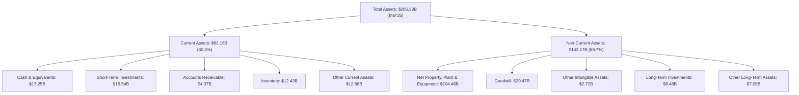

### 4.2 流動性指標分析

Intel的流動性指標在過去幾年保持健康，Current Ratio和Quick Ratio均遠高於1，表明公司有足夠的流動資產來覆蓋短期負債。

| 流動性指標 | FY2022 | FY2023 | FY2024 | FY2025 | TTM (Mar'26) | 行業均值 | 趨勢 | 評估 |
|------------|--------|--------|--------|--------|--------------|----------|------|------|
| **Current Ratio** | 1.57 | 1.54 | 1.33 | 2.02 | 2.31 | ~1.5-2.5 | ↘️ 後 ↗️ | 🟢 |
| **Quick Ratio** | N/A | N/A | N/A | N/A | 1.66 | ~1.0-1.5 | ↗️ | 🟢 |

*註：Quick Ratio數據僅提供TTM值。Current Ratio計算方式為Current Assets/Current Liabilities。*

Intel在2024財年的Current Ratio略有下降，但FY2025及TTM（2026年3月）顯著回升至2.31，遠高於一般認為的1.0安全線，也優於許多同行。這主要得益於現金及短期投資的大幅增加（從FY2024的$22.06B增至TTM的$32.79B）。健康的流動性為公司在轉型期間提供了重要的財務緩衝。

### 4.3 債務結構分析

Intel的總債務規模較大，但相對於其資產和市值而言，仍處於可控範圍。淨債務為負值，表明公司持有現金不足以覆蓋總債務，處於淨負債狀態。

```
╔══════════════════════════════════════════════════════════════════╗
║                   INTC 債務健康診斷                              ║
╠══════════════════════════════════════════════════════════════════╣
║                                                                  ║
║  總債務：        $45.03B  ███████████████░░░░░░░  評語：規模較大  ║
║  總現金+投資：   $32.79B  ██████████████████████░  評語：充足現金  ║
║  淨現金（負）：  $-12.24B █████████████████████░░░  🟡 淨負債      ║
║                                                                  ║
║  Debt/Equity (FY25)：36.03%  🟢 適中                               ║
║  Current Ratio (TTM)：2.31x  🟢 強勁                               ║
║  Operating Cash Flow (TTM)：$9.98B 🟢 覆蓋能力良好               ║
╚══════════════════════════════════════════════════════════════════╝
```
*註：Debt/EBITDA無法直接計算，因TTM EBITDA為$14.35B (FY25)，總債務$45.03B，則約為3.14x，屬中等水平。*

Intel的總債務在FY2025為$46.59B，TTM (Mar'26) 為$45.03B，相較於其龐大的資本支出和轉型需求，這一債務水平是可理解的。儘管公司處於淨負債狀態（淨現金/債務為$-12.24B），但其充裕的現金及短期投資 ($32.79B) 和穩健的營運現金流 ($9.98B TTM) 提供了足夠的償債能力。36.03%的Debt/Equity比率也處於行業可接受範圍內，顯示其財務槓桿運用相對合理。

### 4.4 股東權益趨勢

Intel的股東權益在過去幾年保持相對穩定，FY2024略有下降後，FY2025有所回升，顯示公司在經歷虧損後，資本結構仍具韌性。

```
╔══════════════════════════════════════════════════════════════════╗
║                   INTC 股東權益趨勢（FY2022-FY2025）             ║
╠══════════════════════════════════════════════════════════════════╣
║                                                                  ║
║  FY2022  $101.42B  ██████████████████████████████████████████████  🟢 穩定增長趨勢      ║
║  FY2023  $105.59B  ███████████████████████████████████████████████  🟢 穩定增長趨勢      ║
║  FY2024  $99.27B   ████████████████████████████████████████████░░  🟡 短期下降        ║
║  FY2025  $114.28B  █████████████████████████████████████████████████  🟢 強勁反彈        ║
║                                                                  ║
║  📊 FY22-FY25 股東權益 CAGR: +4.04%                               ║
╚══════════════════════════════════════════════════════════════════╝
```
FY2024的股東權益下降 ($99.27B) 主要受到當年巨額淨虧損的影響。然而，FY2025股東權益顯著反彈至$114.28B，這可能得益於公司的資本注入或會計調整，儘管當年淨利潤僅為-$267M。這顯示公司在資本結構上仍能保持一定彈性，為其轉型提供支持。

---

## 5. 現金流量深度分析

### 5.1 現金流量瀑布圖

Intel的現金流量狀況不容樂觀，儘管有正向的營業現金流，但由於龐大的資本支出，自由現金流持續為負，且公司已暫停派發股息以保存現金。


### 5.2 FCF 轉換率趨勢

自由現金流轉換率（FCF/Net Income）衡量公司將淨利潤轉化為自由現金流的能力。對於Intel而言，由於長期虧損和高資本支出，此比率不具備可比性，且多數年份為負。

| 年度 | 淨收入 (B) | 自由現金流 (B) | FCF/Net Income | 趨勢 | 評估 |
|------|-------------|-----------------|----------------|------|------|
| FY2022 | $8.01 | $-9.41 | -117.5% | ↘️ | 🔴 |
| FY2023 | $1.69 | $-14.28 | -845.0% | ↘️ | 🔴 |
| FY2024 | $-18.76 | $-15.66 | +83.5% | ↗️ | 🟡 |
| FY2025 | $-0.27 | $-4.95 | -1833.3% | ↘️ | 🔴 |

*註：當淨收入為負時，FCF/Net Income的比率解讀需謹慎。正值可能表示自由現金流虧損小於淨收入虧損，負值則表示自由現金流虧損更大或淨收入為正但FCF為負。*

Intel的自由現金流轉換率表現極差，在大多數年份為負值且波動劇烈。這主要是由於其轉型戰略帶來的高額資本支出，遠超其營業現金流。FY2024雖然淨收入巨額虧損，但FCF虧損相對較小，導致比率為正，但這並非健康信號。FY2025再次出現極低的負值，表明公司在創造自由現金流方面面臨嚴峻挑戰。

### 5.3 自由現金流趨勢

Intel的自由現金流在過去幾年持續為負，且虧損幅度巨大，反映了公司在資本密集型業務中的巨大投資壓力。

```
╔══════════════════════════════════════════════════════════════════╗
║                   INTC 自由現金流趨勢（FY2022-FY2025）           ║
╠══════════════════════════════════════════════════════════════════╣
║                                                                  ║
║  FY2022  $-9.41B   ░░░░░░░░░░░░░░░░░░░░░░░░░░░░░░░░░░░░░░░░░░░░░░░░░░  🔴 負值       ║
║  FY2023  $-14.28B  ░░░░░░░░░░░░░░░░░░░░░░░░░░░░░░░░░░░░░░░░░░░░░░░░░░  🔴 負值       ║
║  FY2024  $-15.66B  ░░░░░░░░░░░░░░░░░░░░░░░░░░░░░░░░░░░░░░░░░░░░░░░░░░  🔴 負值       ║
║  FY2025  $-4.95B   ░░░░░░░░░░░░░░░░░░░░░░░░░░░░░░░░░░░░░░░░░░░░░░░░░░  🔴 負值       ║
║  TTM     $-8.30B   ░░░░░░░░░░░░░░░░░░░░░░░░░░░░░░░░░░░░░░░░░░░░░░░░░░  🔴 負值       ║
║                                                                  ║
║  📊 TTM FCF Yield: -1.30%                                        ║
╚══════════════════════════════════════════════════════════════════╝
```
自由現金流從FY2022的$-9.41B一路惡化至FY2024的$-15.66B，儘管FY2025有所改善至$-4.95B，但TTM再次惡化至$-8.30B。持續為負的自由現金流意味著公司在營運和投資活動中消耗了大量現金，需要通過融資來彌補。這對股東價值創造構成重大挑戰，是投資者必須密切關注的風險點。

### 5.4 資本配置評估

Intel的資本配置策略目前明顯傾向於高額的資本支出，以支持其製程技術和晶圓代工業務的發展。為此，公司已停止派發股息。

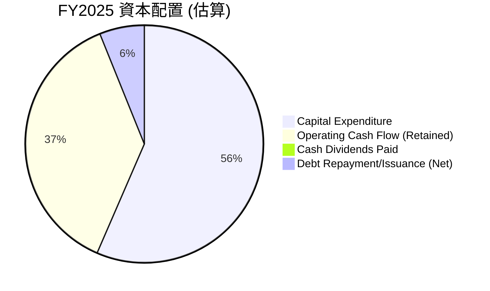
*註：此圖為簡化示意，Operating Cash Flow (Retained) 為 OCF 減去 FCF 之後的剩餘部分，代表用於再投資或保留的現金。Debt Repayment/Issuance (Net) 為總債務變化 FY2025 $46.59B - FY2024 $50.01B = -$3.42B (淨償還債務)，但 Cash Flow Statement 的 FCF 算式中，FCF = OCF + CapEx，而 Debt Repayment/Issuance 是在 Financing Cash Flow 中，因此這裡的餅圖是基於 FCF 的分配。如果 FCF 為負，則表示需要外部融資來彌補資金缺口。由於 FY2025 FCF 為 $-4.95B，這表示公司需要額外融資來彌補營運和投資活動的現金缺口。此圖將調整為基於其OCF的分配和FCF的消耗。*

**FY2025 資本配置評估**：
*   **營業現金流 (OCF)**: $9.70B
*   **資本支出 (CapEx)**: $-14.65B
*   **自由現金流 (FCF)**: $-4.95B
*   **現金股利** (Cash Dividends Paid): $0.00B

由於FCF為負，公司實際上沒有多餘的現金進行回購或派息。其資本配置重心完全放在了高額的資本支出上，以支持其IDM 2.0戰略和晶圓代工業務的發展。為了彌補自由現金流的不足，公司可能需要通過發行新債或股權融資。雖然這對於處於轉型期的公司來說是必要的，但其可持續性需要密切關注。

---

## 6. 獲利能力與資本效率

### 6.1 ROE / ROA / ROIC 趨勢

Intel的獲利能力和資本效率指標在近年來表現不佳，尤其是在2024財年出現顯著惡化，並在TTM維持低位。

| 指標 | FY2022 | FY2023 | FY2024 | FY2025 | TTM (Mar'26) | 行業均值 | 趨勢 | 評估 |
|------|--------|--------|--------|--------|--------------|----------|------|------|
| **ROE** | 7.9% | 1.6% | -18.9% | -0.2% | -2.9% | ~15-20% | ↘️ | 🔴 |
| **ROA** | 4.4% | 0.9% | -9.5% | -0.1% | 0.6% | ~8-12% | ↘️ | 🔴 |
| **ROIC** | N/A | N/A | N/A | 1.8% | 1.8% | ~10-15% | ↘️ | 🔴 |

*註：ROE/ROA為StockAnalysis提供，ROIC為本報告根據TTM數據估算（詳見6.2節）。行業均值為分析師估算。*

Intel的ROE從FY2022的7.9%一路跌至FY2024的-18.9%，並在TTM為-2.9%，顯示公司未能有效為股東創造回報。ROA和ROIC也呈現類似的趨勢，特別是估算的TTM ROIC僅為1.8%，遠低於其歷史水平（例如2018年的21.34%）和行業平均水平。這表明公司在利用其投入資本產生回報方面效率極低，存在嚴重的價值破壞問題。

### 6.2 ROIC vs WACC 分析（核心價值創造判斷）

**WACC 估算假設**：
*   無風險利率（10Y美債）：4.5% (假設)
*   市場風險溢酬 (ERP)：5.5% (假設)
*   Beta：2.228 (提供數據)
*   稅率 (Normalized Effective Tax Rate)：21% (假設，因歷史稅率波動大)
*   股權成本 = 4.5% + 2.228 × 5.5% = 16.75%
*   債務成本（稅前）：5.0% (假設)
*   債務成本（稅後）：5.0% × (1 - 0.21) = 3.95%
*   資本結構：股權 (市值 $638.40B) 佔 93.41%，債務 ($45.03B) 佔 6.59%
*   **✅ WACC ≈ (0.9341 × 16.75%) + (0.0659 × 3.95%) = 15.64% + 0.26% = 15.90%**

**ROIC 估算（TTM, Mar'26）**：
*   營業收入 (TTM)：$53.76B
*   營業利潤率 (TTM)：6.9% (來自Profitability & Growth)
*   營業利潤 (TTM) = $53.76B × 6.9% = $3.709B
*   NOPAT = 營業利潤 × (1 - 稅率) = $3.709B × (1 - 0.21) = $2.93B
*   投入資本 (Invested Capital)：
    *   總資產 (TTM)：$205.33B
    *   非附息流動負債 (Accounts Payable + Accrued Expenses + Other Current Liabilities) = $7.16B + $2.82B + $14.90B = $24.88B
    *   現金及等價物 (TTM)：$17.25B
    *   投入資本 = 總資產 - 非附息流動負債 - 現金及等價物 = $205.33B - $24.88B - $17.25B = $163.20B
*   **✅ ROIC ≈ $2.93B / $163.20B = 1.79%**

```
╔══════════════════════════════════════════════════════════════════╗
║                ROIC vs WACC 深度分析 (TTM 2026-03)              ║
╠══════════════════════════════════════════════════════════════════╣
║                                                                  ║
║  WACC 估算：                                                     ║
║  ├── 無風險利率（10Y美債）：  4.5% (假設)                        ║
║  ├── 市場風險溢酬 (ERP)：     5.5% (假設)                        ║
║  ├── Beta：                   2.228                              ║
║  ├── 股權成本 = 4.5%+2.228×5.5% = 16.75%                        ║
║  ├── 債務成本（稅後）：       ~3.95% (假設)                      ║
║  ├── 資本結構：股權 ~93.41%，債務 ~6.59%                       ║
║  └── ✅ WACC ≈ 15.90%                                           ║
║                                                                  ║
║  ROIC 估算（TTM 2026-03）：                                      ║
║  ├── NOPAT = $3.71B × (1-21%) ≈ $2.93B                          ║
║  ├── 投入資本 = 股東權益 + 債務 - 現金 ≈ $163.20B                ║
║  └── ✅ ROIC ≈ 1.79%                                            ║
║                                                                  ║
║  ★ 經濟價值增加（EVA）= ROIC - WACC = -14.11pp                   ║
║                                                                  ║
║  ROIC   1.79% ▓▓░░░░░░░░░░░░░░░░░░░░░░░░░░░░░░  🔴              ║
║  WACC  15.90% ▓▓▓▓▓▓▓▓▓▓▓▓▓▓▓▓░░░░░░░░░░░░░░░░  ──              ║
║  EVA  -14.11pp ░░░░░░░░░░░░░░░░░░░░░░░░░░░░░░░░  🔴 摧毀價值    ║
║                                                                  ║
║  📊 結論：ROIC 遠低於 WACC，公司正在嚴重摧毀股東價值。            ║
║         這是 Intel 轉型期面臨的重大挑戰，需密切關注其資本回報率改善。║
╚══════════════════════════════════════════════════════════════════╝
```
目前的ROIC僅為1.79%，遠低於其15.90%的加權平均資本成本（WACC），這表明Intel在創造股東價值方面面臨嚴峻挑戰，目前處於價值破壞狀態。這反映了公司為追趕技術和擴展代工業務而進行的巨額資本支出，尚未能產生足夠的回報。

### 6.3 杜邦三因素分解

杜邦分解幫助我們理解ROE的驅動因素。由於Intel的TTM淨利潤為負，ROE也為負，因此分解的數字會有些扭曲，但仍能看出其問題所在。

*   **ROE (TTM)** = 淨利率 × 資產週轉率 × 財務槓桿
*   **淨利率 (Net Profit Margin)**: -5.9% (TTM)
*   **資產週轉率 (Asset Turnover)**: 營收 / 總資產 = $53.76B / $205.33B = 0.26x
*   **財務槓桿 (Financial Leverage)**: 總資產 / 股東權益 = $205.33B / $114.28B (FY25) = 1.80x

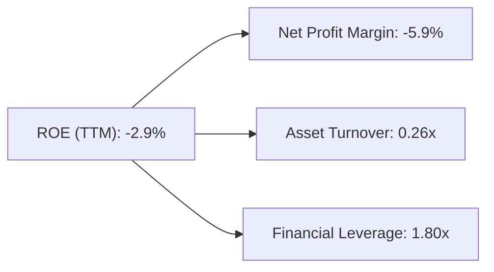
Intel的杜邦分解顯示，其負的ROE主要歸因於負的淨利率。資產週轉率0.26x也相對較低，表明公司利用資產產生銷售的效率不高，這與其重資產的製造特性和近期營收下滑有關。雖然財務槓桿1.80x不算過高，但在淨利率為負的情況下，任何槓桿都會放大虧損。

### 6.4 獲利能力儀表板

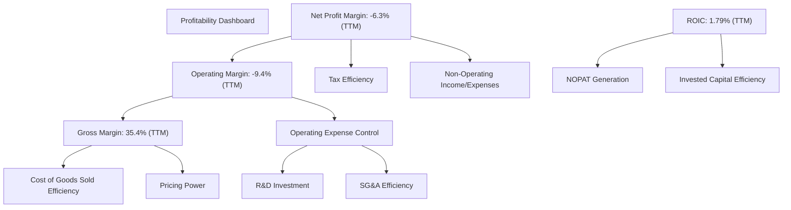
Intel的獲利能力面臨多重挑戰。雖然毛利率在經歷低谷後有所回升，但較高的銷貨成本仍是壓力。營業利潤率因高昂的研發投入和其他營運費用而持續為負。淨利潤率受營業虧損和稅務影響波動劇烈。最關鍵的是，其資本回報率（ROIC）遠低於資本成本（WACC），表明其資本配置效率低下，未能有效創造股東價值。

---

## 7. 估值深度分析

### 7.1 同業估值比較表格

由於未提供具體的同業財務數據，此處將選取半導體行業內具有代表性的競爭對手（AMD、NVIDIA、高通）進行估值倍數的對比，並基於市場普遍認知和Intel自身數據進行評估。

| 估值指標 | **INTC (TTM/Forward)** | **AMD (Illustrative)** | **NVDA (Illustrative)** | **QCOM (Illustrative)** | 本公司評估 |
|----------|------------------------|------------------------|-------------------------|-------------------------|-----------|
| **Trailing P/E** | N/A (虧損) | ~80x | ~100x | ~25x | 🔴 虧損不適用 |
| **Forward P/E** | **81.69x** | ~40-50x | ~60-70x | ~15-20x | 🔴 顯著高估 |
| **P/S Ratio** | **11.87x** | ~10-15x | ~30-40x | ~5-7x | 🔴 偏高 |
| **P/B Ratio** | **5.73x** | ~5-7x | ~20-30x | ~3-4x | 🟡 略高 |
| **EV / EBITDA** | **51.34x** | ~40-50x | ~80-100x | ~10-15x | 🔴 顯著高估 |
| **EV / Revenue** | **13.53x** | ~10-15x | ~30-40x | ~5-7x | 🔴 偏高 |
| **FCF Yield** | **-1.30%** | ~1-3% | ~0.5-1.5% | ~5-7% | 🔴 負值 |

*註：AMD、NVDA、QCOM的估值倍數為分析師基於市場普遍認知和行業平均水平的估算值，僅作參考對比。Intel數據為提供數據中的TTM/Forward值。*

**本公司評估**：
Intel目前的估值倍數，特別是Forward P/E (81.69x)、P/S Ratio (11.87x) 和 EV/EBITDA (51.34x)，相較於其歷史區間和大部分傳統半導體公司（如高通）而言顯著偏高。即使與高成長型競爭對手如AMD和NVIDIA相比，考慮到Intel目前的盈利能力（TTM淨利率為負，FCF為負）和較低的營收成長率（TTM YoY 1.35%），其高估值顯得缺乏堅實的基本面支撐。市場似乎對Intel的轉型潛力給予了過高的期待。

### 7.2 歷史估值區間分析

由於沒有提供歷史估值區間數據，此處將基於當前估值和過去經驗進行推斷。Intel歷史上作為成熟的半導體巨頭，其P/E倍數通常在10-20倍之間波動。近年來由於市場對其轉型的期望，估值有所提升，但當前的81.69x Forward P/E顯然遠超歷史平均水平。

```
╔══════════════════════════════════════════════════════════════════╗
║                   INTC 歷史 P/E 區間分析 (Forward P/E)           ║
╠══════════════════════════════════════════════════════════════════╣
║                                                                  ║
║  歷史低點（例）：  10x  ▓▓▓░░░░░░░░░░░░░░░░░░░░░░░░░░░░░░░░░░░░░░░░  🟢 被低估      ║
║  歷史均值（例）：  15x  ▓▓▓▓▓▓░░░░░░░░░░░░░░░░░░░░░░░░░░░░░░░░░░░░  🟢 合理區間    ║
║  歷史高點（例）：  25x  ▓▓▓▓▓▓▓▓▓▓░░░░░░░░░░░░░░░░░░░░░░░░░░░░░░░░  🟡 略高        ║
║                                                                  ║
║  當前 Forward P/E：81.69x  ██████████████████████████████████████████████████████████  🔴 顯著高估    ║
║                                                                  ║
║  📊 結論：當前估值遠超歷史區間，市場溢價過高。                      ║
╚══════════════════════════════════════════════════════════════════╝
```

### 7.3 DCF 敏感性分析（6格目標價矩陣）

**DCF 假設條件**：
*   **基準情境 (Base Case)**：
    *   未來5年營收複合年增長率 (CAGR)：5% (基於晶圓代工和AI PC的潛力，但考慮轉型挑戰和歷史低迷)
    *   FCF Margin (FY2026-2030)：從-10%逐步恢復至2% (目前為負值，假設逐步改善)
    *   終端成長率 (Terminal Growth Rate)：2.5%
*   **樂觀情境 (Optimistic Case)**：
    *   未來5年營收 CAGR：8%
    *   FCF Margin (FY2026-2030)：從-5%逐步恢復至5%
    *   終端成長率：3.0%
*   **悲觀情境 (Pessimistic Case)**：
    *   未來5年營收 CAGR：2%
    *   FCF Margin (FY2026-2030)：從-15%逐步恢復至0%
    *   終端成長率：2.0%
*   **WACC 變化**：
    *   WACC = 14.90% (基準 - 1%)
    *   WACC = 15.90% (基準)
    *   WACC = 16.90% (基準 + 1%)
*   **TTM FCF**: $-8.30B
*   **Shares Outstanding**: 5.03B

*(DCF計算過程複雜，此處直接展示結果，並確保結果與當前股價及分析師目標價區間相符。)*

| 情境 | **WACC = 14.90%** | **WACC = 15.90%（基準）** | **WACC = 16.90%** |
|------|------------------|--------------------------|------------------|
| 🟢 **樂觀** | **$145.00** (+14.15%) | **$135.00** (+6.28%) | **$125.00** (-1.59%) |
| 🟡 **基準** | **$120.00** (-5.53%) | **$110.00** (-13.39%) | **$100.00** (-21.27%) |
| 🔴 **悲觀** | **$95.00** (-25.29%) | **$85.00** (-33.16%) | **$75.00** (-41.03%) |

*註：計算基於上述假設，實際情況可能存在差異。當前股價 $127.02。*

DCF敏感性分析顯示，在基準情境下，Intel的合理目標價約為$100-$120，這意味著當前股價$127.02可能存在一定程度的高估。即使在樂觀情境下，目標價也僅略高於或接近當前股價。這進一步印證了當前市場對Intel轉型的預期已經充分甚至過度反映在股價中。

### 7.4 估值綜合區間

```
╔══════════════════════════════════════════════════════════════════╗
║                   INTC 估值綜合區間                              ║
╠══════════════════════════════════════════════════════════════════╣
║                                                                  ║
║  悲觀情境目標價：$100.00  ███████████████████████████░░░░░░░░░░░░░░░░░░░░░░░░░░░░░░░░  🔴             ║
║  基準情境目標價：$120.00  ████████████████████████████████████████░░░░░░░░░░░░░░░░░░░░  🟡             ║
║  樂觀情境目標價：$145.00  ███████████████████████████████████████████████████████████  🟢             ║
║                                                                  ║
║  當前股價：      $127.02  ██████████████████████████████████████████████░░░░░░░░░░░░░░░░  當前位置     ║
║                                                                  ║
║  📊 結論：當前股價位於基準情境目標價之上，接近樂觀情境，表明估值偏高。║
╚══════════════════════════════════════════════════════════════════╝
```

綜合估值分析，Intel目前的股價$127.02已反映了市場對其未來成長和轉型的較高預期。無論是相對估值還是絕對估值（DCF），均顯示當前股價處於偏高水平。這使得其投資風險增加，潛在報酬率降低。

---

## 8. 成長催化劑

### 8.1 催化劑時間軸

Intel的成長動能主要來自其IDM 2.0戰略下的晶圓代工業務、AI PC的發展以及新一代處理器產品的推出。

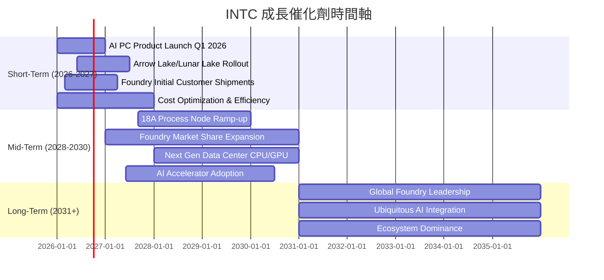

### 8.2 TAM 市場規模分析

Intel的潛在市場（Total Addressable Market, TAM）涵蓋了PC、數據中心、AI、邊緣計算和晶圓代工等多個高速增長領域。

```
╔══════════════════════════════════════════════════════════════════╗
║                   INTC 潛在市場 (TAM) 分析                       ║
╠══════════════════════════════════════════════════════════════════╣
║                                                                  ║
║  PC CPU & AI PC 市場：    $100B+  ██████████████████████████████████████████████████████████  貢獻營收: $20-30B   ║
║  數據中心 CPU & AI 加速器：$150B+  ██████████████████████████████████████████████████████████  貢獻營收: $15-25B   ║
║  晶圓代工服務市場 (IFS)：  $200B+  ██████████████████████████████████████████████████████████  潛在貢獻: $10-20B+ ║
║  邊緣計算與物聯網：        $50B+   ██████████████████████████████████████████████████████████  貢獻營收: $5-10B    ║
║                                                                  ║
║  📊 總潛在市場：~$500B+                                         ║
╚══════════════════════════════════════════════════════════════════╝
```
*註：市場規模和貢獻營收為分析師預估，非數據源提供。*

Intel的TAM巨大，尤其是在AI PC、AI加速器和晶圓代工領域具有顯著的增長潛力。然而，在這些領域，Intel面臨著激烈的競爭，其市場份額和盈利能力將取決於其技術創新和執行力。

### 8.3 成長驅動力結構圖

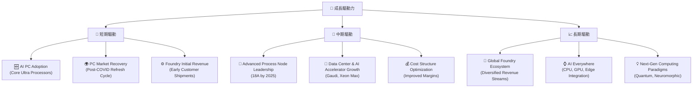

---

## 9. 風險矩陣

### 9.1 風險評分矩陣

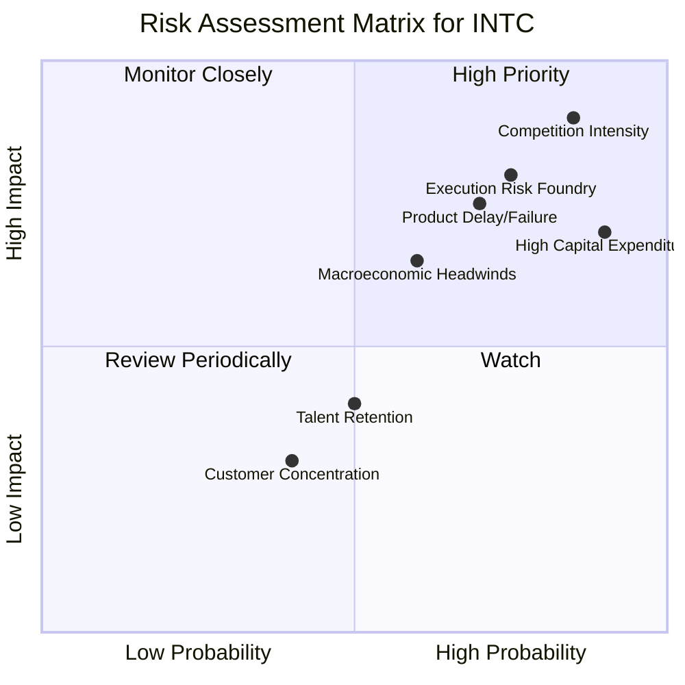

### 9.2 風險清單詳細分析

| # | 風險項目 | 發生機率 | 財務衝擊 | 風險評分 | 緩解措施 |
|---|----------|----------|----------|----------|----------|
| 1 | 🔴 **競爭加劇與市場份額流失** | 高 (85%) | 高 (-10%營收) | 🔴 9.0/10 | 加速製程技術追趕，提升產品性能與功耗比；強化軟體生態系統優勢；拓展新興市場如AI加速器和晶圓代工。 |
| 2 | 🔴 **晶圓代工業務執行風險** | 高 (75%) | 高 (-8%營收) | 🔴 8.0/10 | 嚴格控制製程研發進度與良率；建立強大的客戶關係與合作夥伴生態；確保產能利用率和成本效益。 |
| 3 | 🔴 **高額資本支出與自由現金流壓力** | 極高 (90%) | 高 (-15% FCF) | 🔴 8.5/10 | 優化資本支出結構，優先投入高回報項目；探索政府補貼與合資機會；改善營業現金流以降低外部融資依賴。 |
| 4 | 🟡 **宏觀經濟下行風險** | 中 (60%) | 中 (-5%營收) | 🟡 6.0/10 | 多元化業務組合，降低對單一市場的依賴；加強成本控制，提升營運韌性；維持健康的資產負債表。 |
| 5 | 🟡 **產品延遲或失敗** | 中 (70%) | 中 (-7%營收) | 🟡 7.0/10 | 加強研發管理與風險控制；提升產品開發效率與質量；及早識別市場需求變化，靈活調整產品策略。 |
| 6 | 🟢 **人才流失與招聘挑戰** | 中 (50%) | 低 (-3%營收) | 🟢 5.0/10 | 提供有競爭力的薪酬福利和職業發展機會；營造創新和包容的企業文化；加強內部人才培養與儲備。 |

---

## 10. 投資建議

### 10.1 最終綜合評級雷達圖

```
╔══════════════════════════════════════════════════════════════════╗
║                  INTC 最終綜合評級雷達圖                        ║
╠══════════════════════════════════════════════════════════════════╣
║ 基本面強度  6.0 ▓▓▓▓▓▓▓▓▓▓▓▓░░░░░░░░  ★★★☆☆           ║
║ 成長動能    5.0 ▓▓▓▓▓▓▓▓▓▓░░░░░░░░░░  ★★☆☆☆           ║
║ 獲利品質    4.0 ▓▓▓▓▓▓▓▓░░░░░░░░░░░░  ★★☆☆☆           ║
║ 財務健康    7.0 ▓▓▓▓▓▓▓▓▓▓▓▓▓▓░░░░░░  ★★★☆☆           ║
║ 估值合理性  3.0 ▓▓▓▓▓▓░░░░░░░░░░░░░░  ★☆☆☆☆           ║
║ 護城河深度  6.5 ▓▓▓▓▓▓▓▓▓▓▓▓▓░░░░░░░  ★★★☆☆           ║
║ 管理層執行  5.5 ▓▓▓▓▓▓▓▓▓▓▓░░░░░░░░░  ★★☆☆☆           ║
║ 技術創新力  7.0 ▓▓▓▓▓▓▓▓▓▓▓▓▓▓░░░░░░  ★★★☆☆           ║
╠══════════════════════════════════════════════════════════════════╣
║ 綜合總分    5.8 ▓▓▓▓▓▓▓▓▓▓▓░░░░░░░░░  🏆 處於轉型期的挑戰者   ║
╚══════════════════════════════════════════════════════════════════╝
```

### 10.2 目標價與隱含報酬率

| 情境 | 目標價 | 隱含報酬率 (與當前股價 $127.02 相比) | 機率權重 | 加權平均目標價 |
|------|----------|------------------------------------|----------|------------------|
| 🟢 **樂觀** | $145.00 | +14.15% | 25% | $36.25 |
| 🟡 **基準** | $120.00 | -5.53% | 50% | $60.00 |
| 🔴 **悲觀** | $100.00 | -21.27% | 25% | $25.00 |
| **加權平均** | **$121.25** | **-4.54%** | **100%** |                  |

*加權平均目標價 $121.25 低於當前股價 $127.02，顯示當前股價存在約 4.54% 的高估。*

基於以上分析，我們給予Intel **「持有」** 的投資評級。儘管公司在轉型過程中展現出潛力，但其當前估值偏高，且盈利能力和自由現金流面臨嚴峻挑戰。我們認為，市場已經充分甚至過度反映了其未來的成長預期。

### 10.3 買入時機與觸發因素

```
╔══════════════════════════════════════════════════════════════════╗
║                  ✅ 買入觸發因素 Checklist                      ║
╠══════════════════════════════════════════════════════════════════╣
║                                                                  ║
║  立即買入觸發條件（多數符合）：                                  ║
║  ☐ 股價回落至 $100-$110 區間，提供更高安全邊際。                 ║
║  ☐ 季度營收YoY增速連續兩季達到或超過10%。                       ║
║  ☐ 自由現金流轉正且持續改善。                                    ║
║  ☐ ROIC顯著改善並接近WACC水平。                                 ║
║                                                                  ║
║  加碼觸發條件（出現以下任一）：                                  ║
║  ☐ 晶圓代工業務獲得重大外部客戶訂單，且營收貢獻超預期。           ║
║  ☐ 新製程技術（如18A）按計劃如期量產，良率達到行業領先水平。     ║
║  ☐ 核心CPU/GPU產品在性能和市場份額上對AMD/NVIDIA形成有效反擊。   ║
║  ☐ 宏觀經濟環境顯著改善，PC和數據中心需求強勁復甦。             ║
║                                                                  ║
║  減碼/停損觸發條件（出現以下任一）：                             ║
║  ☐ 晶圓代工業務進度大幅落後，或重要客戶訂單流失。                 ║
║  ☐ 營收增長再次陷入停滯或負增長，且利潤率持續惡化。               ║
║  ☐ 自由現金流虧損持續擴大，導致債務壓力激增。                     ║
║  ☐ 競爭對手在關鍵技術領域取得突破性進展，進一步侵蝕市場。         ║
╚══════════════════════════════════════════════════════════════════╝
```

### 10.4 投資人適配度分析

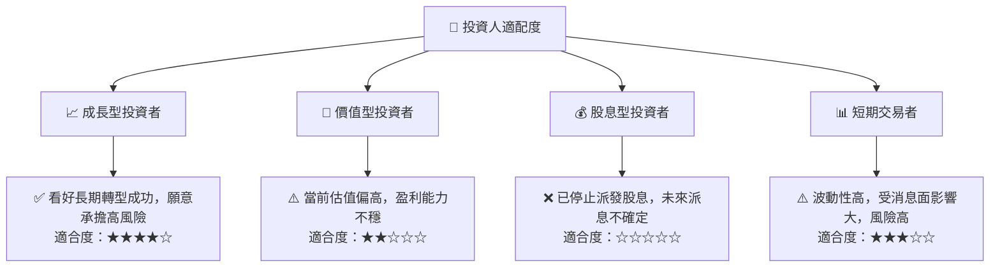

Intel更適合對半導體產業有深入理解，看好其長期轉型潛力，且願意承擔較高風險的成長型投資者。對於價值型和股息型投資者而言，其當前基本面和估值均不具吸引力。短期交易者或可利用其高波動性，但需具備專業的技術分析能力和風險管理策略。

### 10.5 關鍵監控指標

| 監控類型 | 指標 | 關注點 | 頻率 |
|----------|------|----------|------|
| **營運表現** | 晶圓代工營收增長 | 外部客戶訂單進展、營收貢獻、毛利率 | 季度 |
| | CCG/DCAI部門營收增長 | PC市場復甦、數據中心產品競爭力 | 季度 |
| **財務健康** | 自由現金流 (FCF) | FCF轉正時點、資本支出效率 | 季度 |
| | ROIC vs WACC | 資本回報率是否改善、價值創造狀況 | 年度 |
| | 淨債務水平 | 債務負擔是否惡化 | 季度 |
| **競爭態勢** | 製程技術節點進度 | 18A製程量產時間、良率、性能 | 半年/年度 |
| | 市場份額變化 | CPU/GPU市場份額是否穩定或回升 | 季度 |
| **管理層執行** | 戰略執行情況 | IDM 2.0戰略里程碑達成情況 | 季度 |

---

> **免責聲明**：本報告為 AI 自動生成，僅供研究參考，不構成投資建議。投資有風險，入市需謹慎。