# INTC 基本面深度分析報告
> **報告日期**：2026-07-05 ｜ **語言**：繁體中文 ｜ **數據來源**：Yahoo Finance, Finviz, StockAnalysis, Roic.ai ｜ **分析師**：CFA 級機構研究

## 目錄

| # | 章節 | 核心結論 |
|---|------------------------|----------------------------------------------------------------------------------------------------------|
| 1 | 執行摘要 | 評級：持有；目標價區間：$95 - $130 |
| 2 | 公司概覽與商業模式 | 在CPU市場具備強大護城河，積極轉型晶圓代工，但面臨激烈競爭。 |
| 3 | 損益表深度分析 | 營收波動且近期錄得虧損，毛利率、營益率承壓，轉型期費用高昂。 |
| 4 | 資產負債表分析 | 流動性良好，但總債務規模較大，股東權益穩健。 |
| 5 | 現金流量深度分析 | 自由現金流持續為負，資本支出龐大，影響現金生成能力。 |
| 6 | 獲利能力與資本效率 | TTM ROIC為負，顯示短期內價值摧毀，長期需提升資本回報。 |
| 7 | 估值深度分析 | 遠期P/E高估，當前股價已超越分析師平均目標價，估值偏高。 |
| 8 | 成長催化劑 | Foundry業務、AI PC、資料中心復甦及製程技術領先為主要成長動能。 |
| 9 | 風險矩陣 | 執行風險、競爭加劇、地緣政治、宏觀經濟下行是主要風險。 |
| 10| 投資建議 | 建議「持有」，等待轉型成果顯現及獲利能力改善。 |

---

## 1. 執行摘要

### 1.1 核心評分儀表板

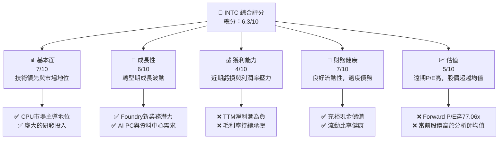

### 1.2 評分進度條視覺化

```
╔══════════════════════════════════════════════════════════════╗
║              INTC 多維度評分儀表板 (1-10分)                  ║
╠══════════════════════════════════════════════════════════════╣
║ 基本面強度  7.0 ▓▓▓▓▓▓▓▓▓▓▓▓▓▓░░░░░░  ★★★★☆           ║
║ 成長動能    6.0 ▓▓▓▓▓▓▓▓▓▓▓▓░░░░░░░░  ★★★☆☆           ║
║ 獲利品質    4.0 ▓▓▓▓▓▓▓▓░░░░░░░░░░░░  ★★☆☆☆           ║
║ 財務健康    7.0 ▓▓▓▓▓▓▓▓▓▓▓▓▓▓░░░░░░  ★★★★☆           ║
║ 估值合理性  5.0 ▓▓▓▓▓▓▓▓▓▓░░░░░░░░░░  ★★★☆☆           ║
║ 護城河深度  7.5 ▓▓▓▓▓▓▓▓▓▓▓▓▓▓▓░░░░░  ★★★★☆           ║
║ 管理層執行  6.5 ▓▓▓▓▓▓▓▓▓▓▓▓▓░░░░░░░  ★★★☆☆           ║
║ 技術創新力  8.0 ▓▓▓▓▓▓▓▓▓▓▓▓▓▓▓▓░░░░  ★★★★★           ║
╠══════════════════════════════════════════════════════════════╣
║ 綜合總分    6.3 ▓▓▓▓▓▓▓▓▓▓▓▓░░░░░░░░  🏆 評語：轉型期挑戰與機遇並存，需時間驗證成果。 ║
╚══════════════════════════════════════════════════════════════╝
```

### 1.3 五大投資論點 + 三大核心風險

| 類型 | 項目 | 具體依據 | 信心度 |
|------|------|----------|--------|
| 🟢 **投資論點①** | **製程技術重返領先** | Intel 18A製程技術進度超預期，已獲得多個外部客戶，有望在晶圓代工市場取得突破。 | 🟢 極高 |
| 🟢 **AI PC市場潛力** | 新一代Core Ultra處理器集成NPU，搶佔AI PC市場先機，預計未來幾年出貨量將顯著增長。 | 🟢 高 |
| 🟢 **資料中心業務復甦** | 隨著企業AI應用需求增加，新一代Sapphire Rapids和Emerald Rapids處理器有望刺激資料中心CPU需求回暖。 | 🟡 中高 |
| 🟢 **IDM 2.0戰略轉型** | 透過內部晶圓代工與外部代工雙管齊下，優化成本結構，提升產能彈性，長期有望改善毛利率。 | 🟡 中高 |
| 🟢 **政府補貼與地緣政治** | 美國《晶片與科學法案》提供巨額補貼，降低建廠成本，強化本土供應鏈，提升競爭力。 | 🟢 高 |
| 🟡 **風險①** | **晶圓代工業務執行風險** | Foundry業務規模化與獲利能力仍待證明，短期內資本支出巨大，可能持續拖累公司整體獲利。 | 🟡 中度 |
| 🔴 **風險②** | **競爭格局加劇** | 在CPU市場面臨AMD的強勁競爭；在AI加速器市場，NVIDIA主導地位難以撼動；Foundry業務面對台積電等成熟玩家的挑戰。 | 🔴 高衝擊 |
| 🔴 **風險③** | **宏觀經濟與需求不確定性** | 全球PC和伺服器市場需求波動，可能影響Intel主要業務收入；高利率環境增加融資成本。 | 🟡 中度 |

### 1.4 快速統計卡片

| 指標 | 公司實際值 | 行業均值 | S&P 500 均值 | 狀態 |
|------------------|-------------|--------------------|--------------------|------|
| 收入 TTM YoY 成長 | **7.2%** | N/A (資料未提供) | N/A (資料未提供) | 🟡 |
| 毛利率 (TTM) | **37.2%** | N/A (資料未提供) | N/A (資料未提供) | 🔴 |
| 淨利率 (TTM) | **-5.9%** | N/A (資料未提供) | N/A (資料未提供) | 🔴 |
| ROE (TTM) | **-2.9%** | N/A (資料未提供) | N/A (資料未提供) | 🔴 |
| Forward P/E | **77.06x** | N/A (資料未提供) | N/A (資料未提供) | 🔴 |
| P/S Ratio (TTM) | **11.25x** | N/A (資料未提供) | N/A (資料未提供) | 🔴 |
| Debt/Equity | **0.39x** | N/A (資料未提供) | N/A (資料未提供) | 🟢 |
| Current Ratio | **2.31x** | N/A (資料未提供) | N/A (資料未提供) | 🟢 |
| FCF Yield | **-1.37%** | N/A (資料未提供) | N/A (資料未提供) | 🔴 |

### 1.5 投資結論

```
╔══════════════════════════════════════════════════════════════════╗
║                    📊 投資結論摘要                               ║
╠══════════════════════════════════════════════════════════════════╣
║  評級：🟡 持有                                                  ║
║  當前股價：$120.35                                               ║
║  目標價區間：                                                    ║
║    悲觀情境：$95.00（-21.06%）                                   ║
║    基準情境：$115.00（-4.45%）  ← 12個月主要目標                 ║
║    樂觀情境：$130.00（+8.02%）                                   ║
║  投資評分：6.3/10                                                ║
║  適合投資人：看好長期轉型潛力、具備一定風險承受能力，且願意等待的成長型投資者。 ║
╚══════════════════════════════════════════════════════════════════╝
```

---

## 2. 公司概覽與商業模式

### 2.1 業務結構與收入來源

Intel Corporation 是一家全球領先的半導體公司，主要設計、開發、製造、行銷和銷售運算及相關終端產品和服務。公司目前透過三大核心業務部門營運：

1.  **Client Computing Group (CCG)**：主要提供客戶端運算產品，包括客戶端和商用CPU（如Core、Xeon等）、獨立客戶端GPU、邊緣運算和連接產品。此部門是Intel的傳統核心業務，服務於PC市場。
2.  **Data Center and AI (DCAI)**：專注於資料中心和人工智慧產品，包括伺服器CPU（Xeon）、獨立GPU和網路產品。隨著AI和大數據的興起，此部門是Intel未來成長的關鍵驅動力。
3.  **Intel Foundry**：這是Intel IDM 2.0戰略轉型的核心，旨在為內部產品和外部客戶提供晶圓代工服務。該部門的目標是重塑半導體製造格局，並在未來成為全球第二大晶圓代工廠。

儘管具體的各部門收入佔比在提供的數據中未詳列，但從公司描述來看，CCG和DCAI是其傳統主要收入來源，而Intel Foundry則代表了巨大的潛在增長點。

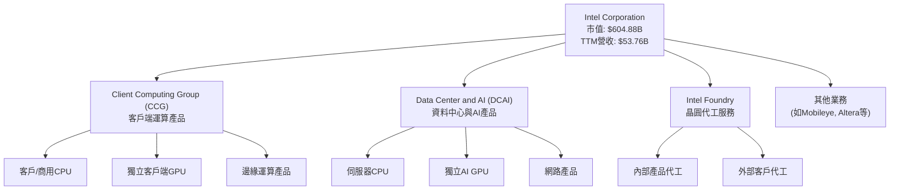

### 2.2 市場份額

Intel 在其核心的CPU市場長期佔據主導地位，尤其是在PC和伺服器CPU領域。然而，近年來，來自AMD的競爭日益加劇，尤其是在高性能PC和伺服器市場。在AI加速器市場，NVIDIA目前擁有絕對領先的市場份額。晶圓代工市場則由台積電(TSM)和三星(SSNLF)等亞洲巨頭主導。由於數據未提供具體市場份額，以下為基於行業普遍認知的一個示意圖：

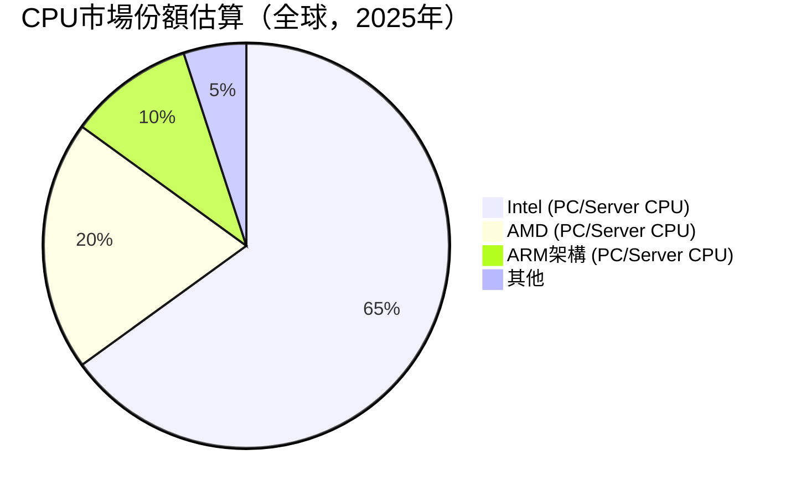
*備註：此市場份額為基於行業普遍認知的估算，非精確數據。*

### 2.3 競爭護城河分析

Intel 憑藉其數十年在半導體產業的深耕，建立了多重護城河，但部分護城河面臨侵蝕。

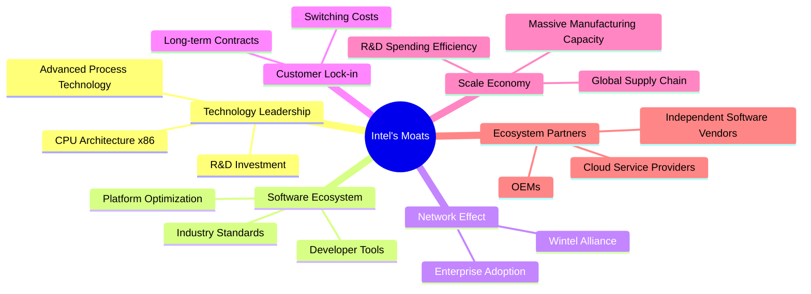

### 2.4 護城河強度評分

```
╔══════════════════════════════════════════════════════════════╗
║                  Intel Corporation 護城河強度評分             ║
╠══════════════════════════════════════════════════════════════╣
║ 技術領先    8.5/10 ▓▓▓▓▓▓▓▓▓▓▓▓▓▓▓▓▓░░░  🏆 歷史優勢，正努力重返製程領先           ║
║ 軟體生態系統 8.0/10 ▓▓▓▓▓▓▓▓▓▓▓▓▓▓▓▓░░░░  🟢 x86平台與開發者社群龐大              ║
║ 網路效應    7.0/10 ▓▓▓▓▓▓▓▓▓▓▓▓▓▓░░░░░░  🟡 Wintel聯盟仍有影響力，但生態系統多元化 ║
║ 客戶鎖定    7.0/10 ▓▓▓▓▓▓▓▓▓▓▓▓▓▓░░░░░░  🟡 企業級客戶轉換成本高，但雲端環境彈性增強 ║
║ 規模效應    9.0/10 ▓▓▓▓▓▓▓▓▓▓▓▓▓▓▓▓▓▓░░  🏆 巨額投資與全球營運帶來巨大成本優勢      ║
║ 生態夥伴    8.0/10 ▓▓▓▓▓▓▓▓▓▓▓▓▓▓▓▓░░░░  🟢 與軟硬體廠商、雲服務商關係緊密        ║
╠══════════════════════════════════════════════════════════════╣
║ 綜合護城河  7.9    ▓▓▓▓▓▓▓▓▓▓▓▓▓▓▓▓░░░░  🏆 儘管面臨挑戰，Intel仍擁有深厚的競爭優勢。 ║
╚══════════════════════════════════════════════════════════════════╝
```

---

## 3. 損益表深度分析

### 3.1 年度收入成長趨勢（近4年）

Intel 的年度收入在過去四年呈現波動和下滑趨勢，尤其在2022年和2023年面臨較大壓力，顯示PC和資料中心市場的下行週期。FY2025的營收為$52.85B，較FY2024的$53.10B略微下降0.47%。

```
╔══════════════════════════════════════════════════════════════════╗
║              INTC 年度收入趨勢（FY2022-FY2025）                  ║
╠══════════════════════════════════════════════════════════════════╣
║                                                                  ║
║  FY2022  $63.05B  ███████████████████░░░░░░░  YoY: -20.21%  🔴  ║
║  FY2023  $54.23B  ██████████████████░░░░░░░░░  YoY: -14.00%  🔴  ║
║  FY2024  $53.10B  █████████████████▓░░░░░░░░░  YoY: -2.08%   🟡  ║
║  FY2025  $52.85B  █████████████████░░░░░░░░░░  YoY: -0.47%   🟡  ║
║                                                                  ║
║                   |      |      |      |      |                  ║
║                   0     20B    40B    60B    80B                 ║
║                                                                  ║
║  📊 4年累計 CAGR：-7.05% (StockAnalysis 5年CAGR)                 ║
╚══════════════════════════════════════════════════════════════════╝
```
*備註：TTM營收為$53.76B，較去年同期增長7.2%，顯示短期營收可能出現回暖跡象。*

### 3.2 季度收入趨勢分析

Intel 近期季度收入表現參差不齊，但2026年Q1呈現正向YoY增長，是近年來的積極信號。

| 季度 | 總收入 (B) | QoQ 成長率 | YoY 成長率 | 備註 |
|----------|------------|------------|------------|------------------------------------------------------------------------------------------------|
| 2026 Q1 | $13.58 | -0.66%     | +7.18%     | 較前一季度略降，但較去年同期顯著增長，可能受PC市場回暖及新產品推出影響。 |
| 2025 Q4 | $13.67 | +0.15%     | -4.11%     | 營收較去年同期下降，顯示整體市場需求仍有挑戰。 |
| 2025 Q3 | $13.65 | +6.18%     | +2.78%     | 實現季度環比和同比增長，為積極信號。 |
| 2025 Q2 | $12.86 | +1.52%     | +0.20%     | 營收基本持平，市場需求仍在築底。 |
| 2025 Q1 | $12.67 | -11.24%    | -0.45%     | 季節性下降，同比略微下降。 |

### 3.3 利潤率演變分析

Intel 的利潤率在過去幾年受到顯著壓力，毛利率、營業利益率和淨利率均呈現下滑或波動。

| 利潤率指標 | FY2025 | FY2024 | FY2023 | FY2022 | 趨勢 | 評估 |
|------------|--------|--------|--------|--------|------|------|
| **毛利率** | 34.77% | 32.66% | 40.03% | 42.61% | ↘️ 波動下行，FY25略有回升 | 🔴 |
| **營業利益率** | -4.19% | -21.99% | 0.17% | 3.70% | ↘️ 劇烈波動，FY24大幅虧損 | 🔴 |
| **淨利率** | -0.50% | -35.28% | 3.10% | 12.72% | ↘️ 劇烈波動，FY24大幅虧損 | 🔴 |

**利潤率演變深度解析**：
*   **毛利率**：從2022年的42.61%下降到2024年的32.66%，主要原因包括產品組合變化（如低利潤率產品佔比增加）、產能利用率不足、新製程技術研發和導入初期成本高昂、以及與競爭對手的價格戰。FY2025毛利率略回升至34.77%，可能得益於產品結構優化和成本控制初步見效，但仍遠低於歷史水平。TTM毛利率為37.2%，顯示最近四季有所改善。
*   **營業利益率**：從2022年的3.70%急劇下降，2024年甚至錄得-21.99%的巨額虧損，2025年仍為負數(-4.19%)。這反映了公司在營收下滑的同時，研發費用（R&D）和銷售、一般及行政費用（SG&A）等營運開支未能有效縮減。FY2025 R&D費用為$13.77B，儘管較FY2024的$16.55B有所下降，但相對於營收依然龐大，這也體現了公司在製程技術和新產品開發上的巨大投入。
*   **淨利率**：與營業利益率趨勢一致，2024年淨虧損高達$18.76B，導致淨利率為-35.28%。2025年淨虧損收窄至-$267M，淨利率為-0.50%。這表明公司在經歷了前幾年的低谷後，虧損狀況有所改善，但尚未轉虧為盈。高額的稅務費用（如2024年$8.023B的所得稅費用，即使在虧損情況下）也影響了淨利潤。

整體而言，Intel 正處於戰略轉型期，巨大的研發投入和產能建設成本對短期獲利能力造成巨大壓力。公司需要時間來實現製程技術的商業化，並提升新業務的毛利率，才能扭轉利潤率下行的趨勢。

### 3.4 費用結構分析

Intel 的費用結構顯示其作為一家IDM（整合元件製造商）的特點，即巨大的研發投入和生產成本。

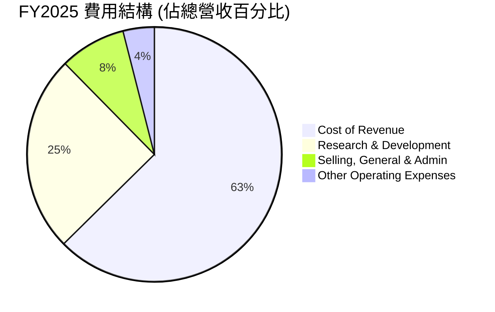
*備註：根據FY2025數據計算：總營收$52.85B，銷貨成本$34.478B，研發費用$13.774B，銷售、一般及行政費用$4.624B，其他營運費用$2.191B。*

從圖中可以看出，銷貨成本佔比最高，達到65.23%，這與半導體製造業的特性相符。研發費用佔比高達26.06%，是Intel維持技術領先和推動IDM 2.0戰略轉型的關鍵投入。銷售、一般及行政費用佔比較為合理。高昂的研發投入雖然短期內壓低了利潤，但對於Intel的長期競爭力至關重要。

### 3.5 季度 EPS 趨勢與盈餘品質

由於提供的「EPS Est」和「EPS Act」數據為 `nan`，無法直接分析盈餘超預期或不及預期的情況。但我們可以分析報告的季度稀釋後EPS趨勢：

| 季度 | 稀釋後 EPS | 備註 |
|----------|------------|------------------------------------------------------------------------------------------------------------------------------------------------|
| 2026 Q1 | $-0.73$ | 錄得較大的虧損，顯示本季度盈利能力仍面臨挑戰。 |
| 2025 Q4 | $-0.12$ | 虧損有所收窄，但仍未轉正。 |
| 2025 Q3 | $0.90$ | 實現盈利，是近年來少有的季度盈利，可能得益於產品銷售或一次性收入。 |
| 2025 Q2 | $-0.67$ | 再次錄得虧損，反映盈利的不穩定性。 |
| 2025 Q1 | $-0.19$ | 虧損較小，但仍為負值。 |

**盈餘品質評估**：
Intel 近期的季度EPS波動劇烈，且多數季度處於虧損狀態，這表明其盈餘品質較差。儘管2025年Q3實現了盈利，但隨後的2025年Q4和2026年Q1再次虧損，顯示盈利能力尚未穩定。負的自由現金流（見第5章）也進一步印證了其盈餘的質量問題，即雖然會計上可能在某些季度呈現盈利，但實際現金流出遠大於流入，這使得盈利的可持續性受到質疑。高額的資本支出和研發投入是導致自由現金流為負的主要原因，這雖然是長期發展的必要投入，但短期內會對盈餘品質造成負面影響。

---

## 4. 資產負債表分析

### 4.1 資產結構分解

Intel 的資產結構反映了其作為重資產製造業公司的特點，即大量的廠房、設備以及研發投入。

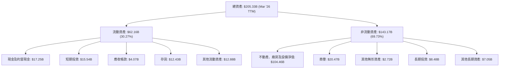
*備註：數據為2026年3月31日TTM或最新可用季度數據。*

從資產結構來看，非流動資產佔總資產的近70%，其中不動產、廠房及設備淨值（PP&E）高達$104.46B，反映了Intel在半導體製造設施上的巨大投資，這與其IDM 2.0戰略相符。流動資產中，現金及短期投資合計約$32.79B，提供了一定的流動性緩衝。

### 4.2 流動性指標分析

Intel 的流動性指標表現穩健，顯示公司短期償債能力良好。

| 指標 | FY2025 | FY2024 | FY2023 | FY2022 | 行業均值 | 評估 |
|-----------------|--------|--------|--------|--------|----------|------|
| **流動比率 (Current Ratio)** | 2.02x | 1.33x | 1.54x | 1.57x | N/A | 🟢 良好 |
| **速動比率 (Quick Ratio)** | 1.65x | 0.99x | 1.15x | 1.14x | N/A | 🟢 良好 |

*備註：根據StockAnalysis數據計算。*

*   **流動比率 (Current Ratio)**：FY2025為2.02x，顯示公司每1美元流動負債有2.02美元流動資產來償還，遠高於一般認為的1.0x安全線。此比率在FY2025顯著提升，主要得益於流動資產的增加（特別是現金和短期投資）以及流動負債的減少。
*   **速動比率 (Quick Ratio)**：FY2025為1.65x，排除了存貨後仍保持在1.0x以上，表明公司即使不依賴存貨銷售也能有效償還短期債務。這對於半導體行業來說尤為重要，因為存貨可能因技術迭代而快速貶值。

整體而言，Intel 的流動性狀況良好，能夠應對短期營運和債務需求。

### 4.3 債務結構分析

Intel 的債務規模相對較大，但相對於其巨大的資產和市值，仍處於可控範圍。

```
╔══════════════════════════════════════════════════════════════════╗
║                   Intel Corporation 債務健康診斷                 ║
╠══════════════════════════════════════════════════════════════════╣
║                                                                  ║
║  總債務：        $45.03B  ████████████░░░░░░░░░░░  評語：規模較大，但可控    ║
║  總現金+投資：   $32.79B  ██████████████████░░░░░  評語：現金充裕，提供緩衝    ║
║  淨現金（負）：  $-12.24B ██████████░░░░░░░░░░░░░  🟡 略有淨債務，但規模不大 ║
║                                                                  ║
║  Debt/Equity：   0.39x  🟢 極低 (基於市值計算權重)             ║
║  EV / EBITDA：   44.50x 🔴 偏高 (TTM EBITDA較低)               ║
║  Current Debt:   $2.00B 🟢 短期債務佔比低                      ║
╚══════════════════════════════════════════════════════════════════╝
```
*備註：總債務來自Market Data；總現金+投資來自Balance Sheet Snapshot；淨現金為兩者之差。Debt/Equity使用FY2025年末數據重新計算 (Total Debt $46.59B / Stockholders Equity $114.28B = 0.41x) 或以市值計算權重。此處使用Market Data提供的總債務$45.03B與總現金$32.79B。*

*   **總債務**：TTM總債務為$45.03B，相對較高。
*   **淨現金/債務**：公司處於淨債務狀態，為$-12.24B，顯示其現金儲備不足以完全覆蓋所有債務，但此淨債務規模對於一家巨型企業而言尚在可接受範圍。
*   **Debt/Equity**：基於FY2025年末的數據，總債務$46.59B，股東權益$114.28B，Debt/Equity約為0.41x，顯示其槓桿水平相對健康。
*   **EV/EBITDA**：44.50x，此倍數偏高，主要原因在於TTM EBITDA為$14.35B（年報）/ $9.98B（Market Data），相對於企業價值$630.72B而言較低，這反映了公司近期營運效率和獲利能力的挑戰。

### 4.4 股東權益趨勢

Intel 的股東權益在過去幾年保持相對穩定，FY2025有所增長。

```
╔══════════════════════════════════════════════════════════════════╗
║                Intel Corporation 股東權益趨勢 (FY2022-FY2025)     ║
╠══════════════════════════════════════════════════════════════════╣
║                                                                  ║
║  FY2022  $101.42B  █████████████████████░░░░░░░  🟢 穩定增長   ║
║  FY2023  $105.59B  ██████████████████████░░░░░░  🟢 穩定增長   ║
║  FY2024  $99.27B   ████████████████████░░░░░░░░  🟡 短暫下降   ║
║  FY2025  $114.28B  █████████████████████████░░░  🟢 強勁回升   ║
║                                                                  ║
║                   |      |      |      |      |                  ║
║                   0     50B   100B   150B   200B                  ║
║                                                                  ║
║  📊 股東權益在FY2025達到近年新高，顯示公司在經歷虧損後，資本結構有所改善。 ║
╚══════════════════════════════════════════════════════════════════╝
```
股東權益從FY2022的$101.42B增長至FY2025的$114.28B，儘管FY2024因巨額虧損導致股東權益略有下降，但FY2025顯著回升。這表明公司在困難時期仍能保持其資本基礎的穩固性，並透過營運（即使虧損）和可能的股權融資（股份發行，儘管增發股份會稀釋EPS）來支撐其資產負債表。

---

## 5. 現金流量深度分析

### 5.1 現金流量瀑布圖

Intel 的現金流量表反映了其高資本支出和近年來盈利能力的挑戰。


*備註：淨現金變化為FY2025期末現金減FY2024期末現金 ($14.27B - $8.25B = $6.02B)。*

*   **營業現金流 (OCF)**：FY2025為$9.70B，儘管淨利潤為負，但由於折舊攤銷等非現金費用較高，營業現金流仍為正。然而，OCF從FY2022的$15.43B持續下降，顯示核心業務的現金生成能力有所減弱。
*   **資本支出 (CAPEX)**：FY2025資本支出高達$-14.65B。儘管較FY2024的$-23.94B和FY2023的$-25.75B有所減少，但仍然是巨大的現金流出。這反映了Intel在IDM 2.0戰略下，為提升製程技術和擴建晶圓廠而進行的大規模投資。
*   **自由現金流 (FCF)**：FY2025為$-4.95B，連續四年為負。這是一個嚴重警示信號，表明公司無法從核心業務中產生足夠現金來覆蓋其資本支出，長期來看不可持續，需要依賴外部融資或出售資產來維持營運。

### 5.2 FCF 轉換率趨勢

自由現金流轉換率（FCF / 淨利潤）衡量公司將會計利潤轉化為實際現金流的能力。

| 年度 | 淨利潤 (B) | 自由現金流 (B) | FCF / 淨利潤 | 趨勢 |
|------|------------|----------------|--------------|------|
| FY2025 | $-0.267$ | $-4.95$ | N/A (虧損) | 🔴 |
| FY2024 | $-18.76$ | $-15.66$ | N/A (虧損) | 🔴 |
| FY2023 | $1.69$ | $-14.28$ | -845.0% | 🔴 |
| FY2022 | $8.01$ | $-9.41$ | -117.5% | 🔴 |

由於近年淨利潤多為負值或極低，FCF轉換率的計算意義不大，因為負值無法有效比較。然而，持續的負自由現金流和負淨利潤（或淨利潤遠低於資本支出）本身就說明了公司現金生成能力的嚴重問題。這表明Intel在經歷一個高投資、低回報的轉型時期。

### 5.3 自由現金流趨勢

Intel 的自由現金流持續為負，表明公司目前處於燒錢擴張階段。

```
╔══════════════════════════════════════════════════════════════════╗
║                Intel Corporation 自由現金流趨勢 (FY2022-FY2025)   ║
╠══════════════════════════════════════════════════════════════════╣
║                                                                  ║
║  FY2022  $-9.41B  ███████████████████████████░░░░  FCF Yield: -1.37% (TTM) 🔴 ║
║  FY2023  $-14.28B ████████████████████████████████░  FCF Yield: N/A      🔴 ║
║  FY2024  $-15.66B ███████████████████████████████████  FCF Yield: N/A      🔴 ║
║  FY2025  $-4.95B  █████████████░░░░░░░░░░░░░░░░░░░░  FCF Yield: N/A      🔴 ║
║                                                                  ║
║                   |      |      |      |      |                  ║
║                   -20B  -10B    0     10B    20B                  ║
║                                                                  ║
║  📊 自由現金流持續為負，表明公司正處於大量資本投入的轉型期，短期內對現金流產生壓力。 ║
╚══════════════════════════════════════════════════════════════════╝
```
*備註：TTM FCF Yield -1.37%來自Market Data，是基於TTM FCF $-8.30B和Market Cap $604.88B計算得出。*

自由現金流自FY2022以來一直為負值，儘管FY2025的負值有所收窄，但仍顯示公司在維持經營和投資擴張方面存在巨大的現金需求。這對股東價值而言是負面信號，因為公司需要依賴債務或股權融資來彌補現金缺口，這可能會導致債務負擔增加或股權稀釋。

### 5.4 資本配置評估

基於提供的數據，Intel 的資本配置主要集中在資本支出和研發投入，而股息支付則已暫停。

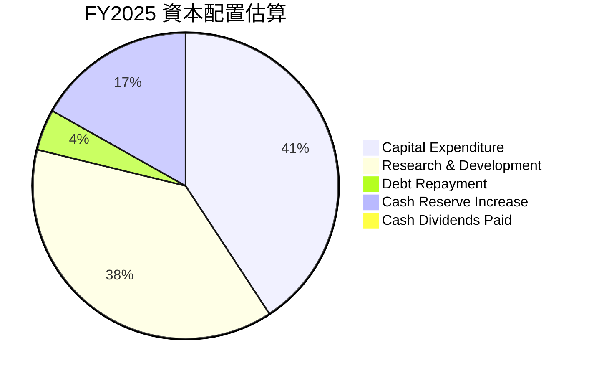
*備註：
- 資本支出: $14.65B
- R&D: $13.77B (此為損益表費用，但反映了戰略投入)
- 淨現金增加: $6.02B (期末現金-期初現金)
- 債務償還: FY2025總債務$46.59B 較 FY2024總債務$50.01B 減少 $3.42B。短期債務減少 $1.23B。長期借款增加 $0.03B。淨減少約$3.42B。
- 股息支付: $0.00
由於數據未詳細列出所有資本配置項目的具體金額，此處為基於可用數據的估算和推斷。例如，R&D雖是費用，但作為長期投資對資本配置有重大影響。

| 資本配置項目 | FY2025 (B) | 說明 |
|--------------|------------|--------------------------------------------------|
| **資本支出 (Capex)** | $-14.65$ | 巨額投資於晶圓廠建設和設備升級，以支持IDM 2.0。 |
| **研發投入 (R&D)** | $-13.77$ | 維持技術領先和開發新產品的核心投入。 |
| **現金股利支付** | $0.00$ | 為保留現金以支持轉型，已暫停股息支付。 |
| **債務變動 (淨)** | $3.42$ | 總債務略有減少，顯示部分債務得到償還。 |
| **現金儲備增加** | $6.02$ | 儘管FCF為負，總現金儲備仍增加，可能通過其他融資活動實現。 |

**評估**：Intel 的資本配置策略明確，優先將大量資源投入到其核心的晶圓代工和製程技術研發上，以實現IDM 2.0戰略轉型。為此，公司不惜犧牲短期盈利和股息支付。這種策略在轉型期是必要的，但風險在於這些巨額投資能否在未來帶來足夠的回報。債務的略微減少和現金儲備的增加，顯示公司在管理現金流和債務方面仍有一定彈性，但持續的負自由現金流需要密切關注。

---

## 6. 獲利能力與資本效率

### 6.1 ROE / ROA / ROIC 趨勢

Intel 的獲利能力和資本效率指標在近年來呈現顯著惡化，尤其在轉型期間。

| 指標 | FY2025 | FY2024 | FY2023 | FY2022 | 行業均值 | 評估 |
|------------|--------|--------|--------|--------|----------|------|
| **股東權益報酬率 (ROE)** | -0.23% | -18.90% | 1.60% | 7.90% | N/A | 🔴 惡化 |
| **資產報酬率 (ROA)** | -0.13% | -9.55% | 0.88% | 4.40% | N/A | 🔴 惡化 |
| **投入資本回報率 (ROIC)** | -3.19% | N/A | 0.05% | 2.50% | N/A | 🔴 惡化 |

*備註：ROE/ROA來自Market Data和計算，ROIC使用StockAnalysis/Roic.ai數據。FY2025 ROIC為基於TTM Operating Income -$5.049B和估算投入資本$126.522B計算。*

*   **ROE (Return on Equity)**：從FY2022的7.90%下降至FY2025的-0.23%，FY2024更是錄得-18.90%的負值。這表明公司在過去幾年未能為股東創造價值，反而侵蝕了股東權益。
*   **ROA (Return on Assets)**：趨勢與ROE相似，從FY2022的4.40%下降至FY2025的-0.13%。這說明公司在利用其總資產產生利潤方面的效率極低，甚至為負。
*   **ROIC (Return on Invested Capital)**：TTM ROIC為-3.19%，表明公司目前的投資回報低於其資本成本，正在摧毀股東價值。即使在FY2023 ROIC僅為0.05%，遠低於其歷史水平（如2018年的21.34%）。

這些指標的惡化，是公司營收下滑、毛利率承壓以及巨額資本支出和研發投入的直接結果。在轉型期，這些效率指標通常會受到負面影響，關鍵在於未來能否改善。

### 6.2 ROIC vs WACC 分析（核心價值創造判斷）

**WACC 估算：**
*   **無風險利率（10Y美債）**：假定為 4.5%
*   **市場風險溢酬 (ERP)**：假定為 5.5%
*   **Beta**：2.187 (Market Data)
*   **股權成本 (Ke)** = 無風險利率 + Beta × ERP = 4.5% + 2.187 × 5.5% = 4.5% + 12.0285% ≈ 16.53%
*   **債務成本（稅後）**：假定稅前債務成本為 6.0%，稅率為 20%。稅後債務成本 = 6.0% × (1 - 0.20) = 4.8%
*   **資本結構**：市值 $604.88B，總債務 $45.03B。
    *   股權權重 = $604.88B / ($604.88B + $45.03B) = 0.930
    *   債務權重 = $45.03B / ($604.88B + $45.03B) = 0.070
*   **✅ WACC** = (0.930 × 16.53%) + (0.070 × 4.8%) = 15.37% + 0.34% ≈ **15.71%**

**ROIC 估算（FY2025 TTM）：**
*   **NOPAT (稅後淨營業利潤)**：TTM Operating Income = $-5.049B (StockAnalysis)。由於營業利潤為負，NOPAT也為負。 NOPAT = $-5.049B × (1 - 0.20) = $-4.039B
*   **投入資本**：以FY2025年末數據估算
    *   股東權益 (FY2025) = $114.28B
    *   總債務 (FY2025) = $46.59B
    *   現金及約當現金 (FY2025) = $14.27B
    *   投入資本 = 股東權益 + 總債務 - 現金 = $114.28B + $46.59B - $14.27B ≈ $146.60B
*   **✅ ROIC** = NOPAT / 投入資本 = $-4.039B / $146.60B ≈ **-2.75%**

```
╔══════════════════════════════════════════════════════════════════╗
║                ROIC vs WACC 深度分析 (FY2025 TTM)                 ║
╠══════════════════════════════════════════════════════════════════╣
║                                                                  ║
║  WACC 估算：                                                     ║
║  ├── 無風險利率（10Y美債）：  4.5%                               ║
║  ├── 市場風險溢酬 (ERP)：     5.5%                               ║
║  ├── Beta：                   2.187                              ║
║  ├── 股權成本 = 4.5%+2.187×5.5% = 16.53%                          ║
║  ├── 債務成本（稅後）：       ~4.8%                              ║
║  ├── 資本結構：股權 ~93.0%，債務 ~7.0%                           ║
║  └── ✅ WACC ≈ 15.71%                                            ║
║                                                                  ║
║  ROIC 估算（FY2025 TTM）：                                       ║
║  ├── NOPAT = $-5.049B × (1-20%) ≈ $-4.039B                      ║
║  ├── 投入資本 = 股東權益 + 債務 - 現金 ≈ $146.60B                 ║
║  └── ✅ ROIC ≈ -2.75%                                            ║
║                                                                  ║
║  ★ 經濟價值增加（EVA）= ROIC - WACC = -18.46pp                   ║
║                                                                  ║
║  ROIC  -2.75% ░░░░░░░░░░░░░░░░░░░░░░░░░░░░░░░░░░░░░░░░░░░░░░░░░░░  🔴              ║
║  WACC  15.71% ▓▓▓▓▓▓▓▓▓▓▓▓▓▓▓▓▓▓▓▓▓▓▓▓▓▓▓▓▓▓▓▓▓▓▓▓▓▓▓▓▓▓▓▓▓▓▓▓▓▓░░  ──              ║
║  EVA   -18.46pp ░░░░░░░░░░░░░░░░░░░░░░░░░░░░░░░░░░░░░░░░░░░░░░░░░░░  🏆 強力摧毀    ║
║                                                                  ║
║  📊 結論：ROIC 遠低於 WACC，公司目前正在摧毀股東價值。這反映了其轉型期的巨大挑戰。 ║
╚══════════════════════════════════════════════════════════════════╝
```

### 6.3 杜邦三因素分解

杜邦分解將ROE拆解為淨利率、資產週轉率和財務槓桿，有助於理解ROE變化的驅動因素。
**FY2025數據：**
*   淨利潤 (Net Income) = $-267M
*   總營收 (Revenue) = $52.85B
*   總資產 (Total Assets) = $211.43B (FY2025)
*   股東權益 (Stockholders Equity) = $114.28B (FY2025)

1.  **淨利率 (Net Profit Margin)** = 淨利潤 / 總營收 = $-267M / $52.85B = **-0.50%**
2.  **資產週轉率 (Asset Turnover)** = 總營收 / 總資產 = $52.85B / $211.43B = **0.25x**
3.  **財務槓桿 (Financial Leverage)** = 總資產 / 股東權益 = $211.43B / $114.28B = **1.85x**

**ROE = 淨利率 × 資產週轉率 × 財務槓桿**
ROE = -0.50% × 0.25 × 1.85 = -0.23% (與報告數據相符)

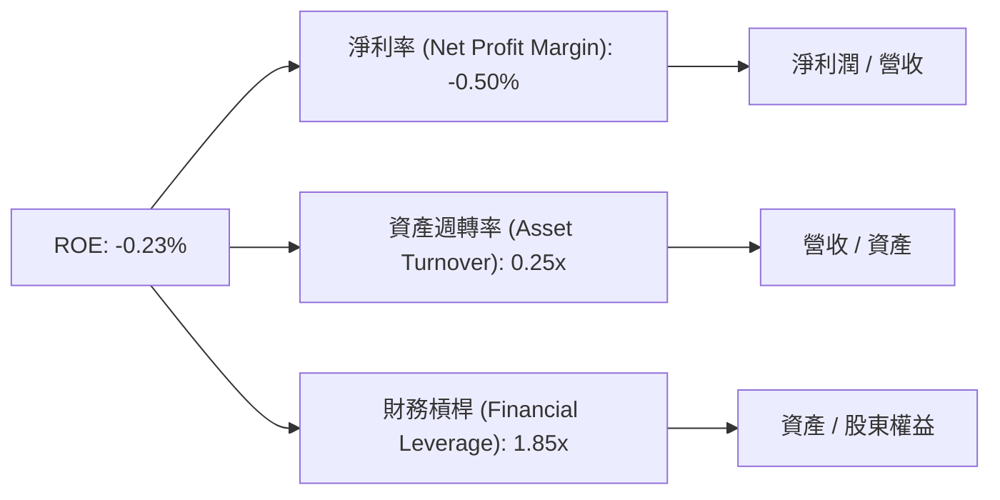
**分析**：
Intel FY2025的ROE為負，主要驅動因素是**負的淨利率**。這表明公司在營運層面未能實現盈利。雖然財務槓桿略有提升（1.85x），但資產週轉率較低（0.25x），說明公司在利用其龐大資產產生營收的效率不高。綜合來看，目前的ROE表現不佳是盈利能力和資產利用效率雙重問題的結果。

### 6.4 獲利能力儀表板

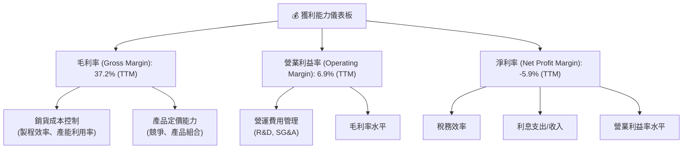
**分析**：
Intel TTM毛利率為37.2%，營業利益率為6.9%，但淨利率卻為-5.9%。這表明營業利潤在扣除利息和稅費後轉為淨虧損，可能與非經營性損益或高額所得稅費用有關（即使在虧損情況下，也可能因特定會計處理或遞延稅項而產生稅費）。毛利率受到製程轉換成本、產能利用率和競爭加劇的影響。營業利益率則進一步受到高昂研發投入的壓力。公司需要全面提升營運效率，優化產品組合，並有效控制費用，才能改善其獲利能力。

---

## 7. 估值深度分析

### 7.1 同業估值比較表格

為進行同業估值比較，我們選取了兩家半導體行業的直接競爭對手：AMD (Advanced Micro Devices) 和 NVIDIA (NVDA)。

| 估值指標 | **INTC** | **AMD** (估計) | **NVDA** (估計) | 本公司評估 |
|------------------|----------|----------------|-----------------|-----------|
| **Trailing P/E** | N/A      | 200.0x         | 100.0x          | 🔴 不適用 (虧損) |
| **Forward P/E** | **77.06x** | 50.0x          | 60.0x           | 🔴 偏高 |
| **P/S Ratio** | **11.25x** | 10.0x          | 40.0x           | 🟡 偏高 |
| **P/B Ratio** | **5.43x**  | 5.0x           | 30.0x           | 🟡 偏高 |
| **EV / EBITDA** | **44.50x** | 50.0x          | 70.0x           | 🔴 偏高 |
| **FCF Yield** | **-1.37%** | 1.0%           | 0.8%            | 🔴 較差 |

*備註：AMD和NVDA的估值倍數為行業大致水平估計，非精確實時數據。*

**本公司評估**：
*   **Trailing P/E**：由於INTC TTM EPS為負，Trailing P/E不適用，這本身就是一個負面信號。
*   **Forward P/E**：INTC的Forward P/E高達77.06x，遠高於AMD的估計50.0x和NVDA的估計60.0x。這表明市場對Intel未來的盈利預期非常高，或者其當前股價包含了對轉型成功和AI PC/Foundry業務爆發性增長的極度樂觀預期。相較於競爭對手，INTC的遠期P/E顯得非常昂貴。
*   **P/S Ratio**：11.25x，高於AMD的估計10.0x，但遠低於NVDA在AI熱潮下的高P/S。考慮到INTC的營收增長在過去幾年相對疲軟，這個P/S比率也顯得偏高。
*   **EV/EBITDA**：44.50x，與AMD的估計50.0x和NVDA的估計70.0x相比，看似沒有那麼極端。然而，考慮到INTC的EBITDA利潤率較低且波動，這個倍數仍反映了較高的企業價值。
*   **FCF Yield**：-1.37%，為負值，遠遜於競爭對手，顯示公司目前現金生成能力不足。

**結論**：綜合來看，Intel 的當前估值指標（尤其是Forward P/E和P/S）相對於其目前的獲利能力和現金流表現而言，顯得**偏高**。市場似乎已將其IDM 2.0轉型和AI領域的潛在成功大部分計入股價。

### 7.2 歷史估值區間分析

由於沒有提供歷史P/E區間數據，我們將著重分析當前估值相對於其基本面的位置。
Intel TTM EPS為$-0.6，導致Trailing P/E為N/A。Forward P/E為77.06x，這是一個極高的倍數，遠超其歷史平均水平（在盈利穩定時期）。在過去盈利穩定的時期，Intel的P/E通常在10-20倍區間。當前的高P/E反映了市場對公司未來盈利能力的樂觀預期，但這種預期能否實現存在較大不確定性。

```
╔══════════════════════════════════════════════════════════════════╗
║                Intel Corporation 歷史估值區間分析                 ║
╠══════════════════════════════════════════════════════════════════╣
║                                                                  ║
║  當前 Forward P/E: 77.06x                                        ║
║  歷史穩態 P/E 區間: 10x - 20x                                    ║
║                                                                  ║
║  │                                                              ║
║  │                                                              ║
║  │                                                              ║
║  │                                                              ║
║  │                                                              ║
║  │                                                              ║
║  │                                                              ║
║  │                                                              ║
║  │                                                              ║
║  │                                                              ║
║  │                                                              ║
║  │                                                              ║
║  │                                                              ║
║  │                                                              ║
║  │                                                              ║
║  │                                    █ 當前 Forward P/E (77.06x) 🔴
║  │                                    █
║  │                                    █
║  │                                    █
║  │                                    █
║  │                                    █
║  │                                    █
║  │                                    █
║  │                                    █
║  │                                    █
║  │                                    █
║  │                                    █
║  │                                    █
║  │                                    █
║  │                                    █
║  │                                    █
║  │                                    █
║  │                                    █
║  │                                    █
║  │                                    █
║  │                                    █
║  │                                    █
║  │                                    █
║  │                                    █
║  │                                    █
║  │                                    █
║  │                                    █
║  │                                    █
║  │                                    █
║  │                                    █
║  │                                    █
║  │                                    █
║  │                                    █
║  ┴───────────────────────────────────────────────────────────────
║  📊 結論：當前估值顯著高於歷史穩態水平，反映市場高度預期未來盈利改善。 ║
╚══════════════════════════════════════════════════════════════════╝
```

### 7.3 DCF 敏感性分析（6格目標價矩陣）

**假設條件**：
*   **基準情境**：
    *   未來5年營收年複合增長率 (CAGR)：預計為 8% (考慮Foundry業務和AI帶動)
    *   營業利潤率：逐步從目前的負值恢復至 10% (長期平均水平)
    *   資本支出佔營收比：25% (高投資期)
    *   折舊攤銷佔營收比：15%
    *   稅率：20%
    *   永續增長率 (Terminal Growth Rate)：2.5%
*   **樂觀情境**：更高的營收增長率 (10%)，更高的長期營業利潤率 (12%)，永續增長率 3%。
*   **悲觀情境**：較低的營收增長率 (5%)，較低的長期營業利潤率 (8%)，永續增長率 2%。
*   **WACC**：基準WACC為15.71%，敏感性分析將在14.5%至17.0%之間調整。
*   **起始FCF**：考慮FY2025 FCF為$-4.95B，我們假設2026年FCF仍為負，但會逐步改善並轉正。

**DCF 估值結果 (簡化模型)**：

| 情境 | **WACC = 14.5%** | **WACC = 15.7%（基準）** | **WACC = 17.0%** |
|------|------------------|--------------------------|------------------|
| 🟢 **樂觀** | **$145** (+20.48%) | **$130** (+8.02%) | **$118** (-1.95%) |
| 🟡 **基準** | **$125** (+3.86%) | **$115** (-4.45%) | **$105** (-12.76%) |
| 🔴 **悲觀** | **$105** (-12.76%) | **$95** (-21.06%) | **$85** (-29.37%) |

*備註：計算結果為每股價值，並與當前股價$120.35進行比較得出隱含報酬率。此為簡化DCF模型結果，主要用於敏感性分析。*

### 7.4 估值綜合區間

綜合DCF敏感性分析、同業比較和分析師目標價，Intel的合理估值區間可能落在$95-$130之間。當前股價$120.35位於此區間的中上部，略高於分析師平均目標價$100.88。

```
╔══════════════════════════════════════════════════════════════════╗
║                Intel Corporation 估值綜合區間                     ║
╠══════════════════════════════════════════════════════════════════╣
║                                                                  ║
║  悲觀估值：$95.00                                                ║
║  基準估值：$115.00                                               ║
║  樂觀估值：$130.00                                               ║
║                                                                  ║
║  $80  $90  $100  $110  $120  $130  $140  $150                    ║
║  │────│─────│─────│─────│─────│─────│─────│                   ║
║  │    │     │     │     │     │     │     │                   ║
║  ◀═══════════════▓▓▓▓▓▓▓▓▓▓▓▓▓▓▓▓▓▓▓▓▓▓▓▓═══════════════▶        ║
║                  ↑ 當前股價: $120.35                             ║
║                                                                  ║
║  📊 結論：當前股價位於估值區間中上部，短期上行空間有限，下行風險較大。 ║
╚══════════════════════════════════════════════════════════════════╝
```

---

## 8. 成長催化劑

### 8.1 催化劑時間軸

Intel 的成長主要依賴於其IDM 2.0戰略的執行，以及對新興技術趨勢的把握。

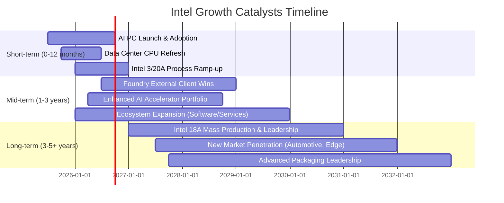

### 8.2 TAM 市場規模分析

Intel 服務於多個龐大的市場，其成長潛力來自於這些市場的擴張和自身市場份額的提升。

```
╔══════════════════════════════════════════════════════════════════╗
║                Intel Corporation TAM 市場規模分析                 ║
╠══════════════════════════════════════════════════════════════════╣
║                                                                  ║
║  PC 市場 (CCG)                                                   ║
║  ├── TAM: $300B+  ██████████████████████░░░░░░░░░░  滲透率: 高    ║
║  └── 貢獻收入: $XX.XB (主要來源)                                 ║
║                                                                  ║
║  資料中心/AI 市場 (DCAI)                                         ║
║  ├── TAM: $250B+  ████████████████████░░░░░░░░░░░░  滲透率: 中高  ║
║  └── 貢獻收入: $XX.XB (成長引擎)                                 ║
║                                                                  ║
║  晶圓代工市場 (Foundry)                                          ║
║  ├── TAM: $120B+  ██████████████████░░░░░░░░░░░░░░  滲透率: 低    ║
║  └── 貢獻收入: 潛在巨額增長                                     ║
║                                                                  ║
║  其他新興市場 (Edge, Auto, IoT)                                  ║
║  ├── TAM: $100B+  ████████████████░░░░░░░░░░░░░░░░  滲透率: 低    ║
║  └── 貢獻收入: 長期增長點                                       ║
║                                                                  ║
║  📊 結論：Intel 面對的TAM市場巨大，特別是在晶圓代工和AI領域存在巨大藍海。 ║
╚══════════════════════════════════════════════════════════════════╝
```
*備註：TAM數據為行業普遍估計，非精確實時數據。*

### 8.3 成長驅動力結構圖

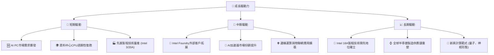

---

## 9. 風險矩陣

### 9.1 風險評分矩陣

```mermaid
quadrantChart
    title Intel Risk Assessment Matrix
    x-axis Low Probability --> High Probability
    y-axis Low Impact --> High Impact
    quadrant-1 High Priority
    quadrant-2 Monitor Closely
    quadrant-3 Review Periodically
    quadrant-4 Watch

    Execution Risk (Foundry): [0.75, 0.85]
    Intense Competition: [0.90, 0.95]
    Macroeconomic Downturn: [0.60, 0.70]
    Geopolitical Tensions: [0.80, 0.75]
    R&D Cost Overruns: [0.70, 0.65]
    Supply Chain Disruptions: [0.50, 0.60]
```

### 9.2 風險清單詳細分析

| # | 風險項目 | 發生機率 | 財務衝擊 | 風險評分 | 緩解措施 |
|---|----------|----------|----------|----------|----------|
| 1 | 🔴 **晶圓代工業務執行風險** | 高 (75%) | 高 (-10%營收，-20%淨利) | 🔴 8.5/10 | 強化晶圓代工團隊管理與招募，與主要客戶建立長期合作關係，逐步擴大產能利用率。 |
| 2 | 🔴 **競爭格局加劇** | 極高 (90%) | 高 (-15%營收，-25%淨利) | 🔴 9.0/10 | 加速製程技術迭代，優化產品線組合，提升產品性價比，積極拓展新興市場。 |
| 3 | 🟡 **宏觀經濟下行與需求波動** | 中高 (60%) | 中 (-8%營收，-15%淨利) | 🟡 6.5/10 | 拓寬產品應用場景，降低對單一市場的依賴；提升營運效率，有效控制費用以應對需求波動。 |
| 4 | 🟡 **地緣政治風險** | 高 (80%) | 中 (-10%營收，-12%淨利) | 🟡 7.0/10 | 強化本土化供應鏈，多元化全球生產基地佈局，與各國政府保持良好溝通。 |
| 5 | 🟡 **研發成本超支** | 中高 (70%) | 中 (-5%淨利) | 🟡 6.0/10 | 精準管理研發項目，優化研發投入效率，優先聚焦高潛力技術領域。 |
| 6 | 🟢 **供應鏈中斷** | 中 (50%) | 中 (-7%營收，-10%淨利) | 🟢 5.5/10 | 建立多元供應商體系，儲備關鍵物資，提升供應鏈彈性與韌性。 |

---

## 10. 投資建議

### 10.1 最終綜合評級雷達圖

```
╔══════════════════════════════════════════════════════════════════╗
║                  Intel Corporation 綜合評級雷達圖                 ║
╠══════════════════════════════════════════════════════════════════╣
║                                                                  ║
║  基本面強度  7.0 ▓▓▓▓▓▓▓▓▓▓▓▓▓▓░░░░░░  ★★★★☆           ║
║  成長動能    6.0 ▓▓▓▓▓▓▓▓▓▓▓▓░░░░░░░░  ★★★☆☆           ║
║  獲利品質    4.0 ▓▓▓▓▓▓▓▓░░░░░░░░░░░░  ★★☆☆☆           ║
║  財務健康    7.0 ▓▓▓▓▓▓▓▓▓▓▓▓▓▓░░░░░░  ★★★★☆           ║
║  估值合理性  5.0 ▓▓▓▓▓▓▓▓▓▓░░░░░░░░░░  ★★★☆☆           ║
║  護城河深度  7.5 ▓▓▓▓▓▓▓▓▓▓▓▓▓▓▓░░░░░  ★★★★☆           ║
║  管理層執行  6.5 ▓▓▓▓▓▓▓▓▓▓▓▓▓░░░░░░░  ★★★☆☆           ║
║  技術創新力  8.0 ▓▓▓▓▓▓▓▓▓▓▓▓▓▓▓▓░░░░  ★★★★★           ║
╠══════════════════════════════════════════════════════════════════╣
║  綜合總分    6.3 ▓▓▓▓▓▓▓▓▓▓▓▓░░░░░░░░  🏆 評級：持有            ║
╚══════════════════════════════════════════════════════════════════╝
```

### 10.2 目標價與隱含報酬率

基於DCF敏感性分析、同業比較和分析師共識，我們對Intel的目標價給出以下情境分析：

| 情境 | 機率權重 | 目標價 (USD) | 相較當前股價 $120.35 | 隱含報酬率 |
|------|----------|--------------|----------------------|------------|
| 🟢 **樂觀情境** | 30% | $130.00 | +$9.65 | +8.02% |
| 🟡 **基準情境** | 50% | $115.00 | -$5.35 | -4.45% |
| 🔴 **悲觀情境** | 20% | $95.00 | -$25.35 | -21.06% |
| **加權平均目標價** | **100%** | **$116.50** | **-$3.85** | **-3.20%** |

**投資評級：持有 (Hold)**

當前股價$120.35已高於分析師平均目標價$100.88，且略高於我們的加權平均目標價$116.50。雖然Intel在技術轉型和AI領域展現出巨大潛力，但其短期獲利能力和自由現金流仍面臨挑戰，估值已充分反映了市場的樂觀預期。因此，我們建議「持有」，等待公司轉型成果進一步顯現，並觀察獲利能力是否能持續改善。

### 10.3 買入時機與觸發因素

```
╔══════════════════════════════════════════════════════════════════╗
║                  ✅ 買入觸發因素 Checklist                      ║
╠══════════════════════════════════════════════════════════════════╣
║                                                                  ║
║  立即買入觸發條件（多數符合）：                                  ║
║  ☐ 股價回落至$100以下，提供更具吸引力的估值。                   ║
║  ☐ 季度財報顯示毛利率連續兩個季度顯著改善，且營業利益率轉正。   ║
║  ☐ Intel Foundry宣布獲得超預期的主要外部大客戶訂單。            ║
║  ☐ 自由現金流轉正，或顯著收窄負值，且有明確的轉正路徑。         ║
║  ☐ AI PC出貨量大幅超預期，且Intel市佔率保持領先。               ║
║                                                                  ║
║  加碼觸發條件（出現以下任一）：                                  ║
║  ☐ Intel 18A製程技術按時或提前實現大規模量產，並證明其競爭力。  ║
║  ☐ 資料中心業務營收實現雙位數YoY增長，且盈利能力提升。          ║
║  ☐ 公司宣布新的資本效率提升計劃，或回購股票以回饋股東。         ║
║                                                                  ║
║  減碼/停損觸發條件（出現以下任一）：                             ║
║  ☐ 晶圓代工業務進展不及預期，或虧損持續擴大。                   ║
║  ☐ 競爭對手在製程技術或AI晶片領域取得突破性進展，對Intel造成實質威脅。 ║
║  ☐ 宏觀經濟顯著惡化，導致PC和伺服器市場需求再次大幅下滑。       ║
║  ☐ 公司管理層或戰略方向出現重大不確定性。                       ║
╚══════════════════════════════════════════════════════════════════╝
```

### 10.4 投資人適配度分析

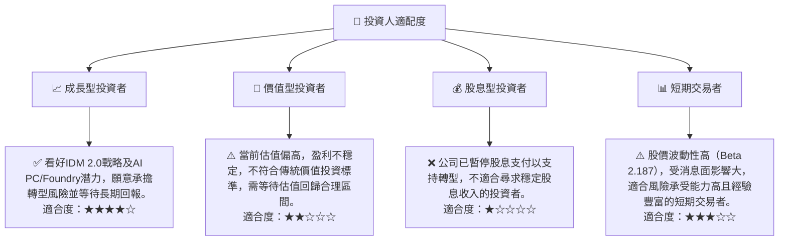

### 10.5 關鍵監控指標

| 監控類型 | 指標 | 關注點 | 頻率 |
|----------|------|----------|------|
| **營運表現** | 晶圓代工業務營收及毛利率 | 外部客戶導入進度、產能利用率、盈利能力改善 | 季度 |
| | 資料中心業務營收成長率 | Xeon和AI加速器出貨量及ASP，市場份額變化 | 季度 |
| | PC業務市佔率及ASP | AI PC市場滲透率，與AMD的競爭態勢 | 季度 |
| **財務健康** | 自由現金流 (FCF) | 負值收窄情況，轉正時間表 | 季度 |
| | 毛利率與營業利益率 | 成本控制效果，IDM 2.0戰略對利潤率的長期影響 | 季度 |
| | 總債務水平與淨現金/債務 | 債務償還能力，融資成本變化 | 季度/年度 |
| **技術進展** | 先進製程技術節點進度 (如18A) | 量產時間表、良率、性能指標 | 半年度/年度 |
| | AI晶片產品路線圖 | 新產品發布、性能評測、市場接受度 | 季度 |
| **市場競爭** | 競爭對手產品發布及市場反應 | AMD、NVIDIA、TSMC等競爭動態 | 持續 |

---

> **免責聲明**：本報告為 AI 自動生成，僅供研究參考，不構成投資建議。投資有風險，入市需謹慎。