# INTC 基本面深度分析報告
> **報告日期**：2026-07-06 ｜ **語言**：繁體中文 ｜ **數據來源**：Yahoo Finance, Finviz, StockAnalysis, Roic.ai ｜ **分析師**：CFA 級機構研究

---

## 目錄

| # | 章節 | 核心結論 |
|---|------|----------|
| 1 | 執行摘要 | 持有評級，目標價區間 $100-$150，基於轉型潛力與高估值 |
| 2 | 公司概覽與商業模式 | 在CPU市場具主導地位，積極拓展代工與AI領域，護城河面臨挑戰 |
| 3 | 損益表深度分析 | 營收波動，利潤率承壓，但近期有改善跡象，Q1'26仍虧損 |
| 4 | 資產負債表分析 | 穩健的流動性，但淨負債增加，資本支出高企 |
| 5 | 現金流量深度分析 | 自由現金流持續為負，顯示再投資壓力巨大，需關注效率提升 |
| 6 | 獲利能力與資本效率 | ROIC顯著低於WACC，短期內股東價值創造能力較弱 |
| 7 | 估值深度分析 | 相較同業估值偏高，市場已計入大量未來成長預期 |
| 8 | 成長催化劑 | Foundry業務、AI加速器、產品週期更新、成本控制 |
| 9 | 風險矩陣 | 市場競爭、執行風險、宏觀經濟、技術轉型 |
| 10 | 投資建議 | 基於轉型初期的高風險高回報特性，建議持有，關注執行進度 |

---

## 1. 執行摘要

Intel Corporation (INTC) 正處於一項雄心勃勃的轉型計畫中，旨在重塑其在半導體產業的領導地位。儘管近期財務表現承壓，特別是利潤率和自由現金流方面，但公司在製程技術、AI加速器和代工業務上的戰略投資，為其長期成長奠定基礎。然而，當前高企的估值已提前反映了大部分樂觀預期，投資者需謹慎評估其執行風險。

### 1.1 核心評分儀表板

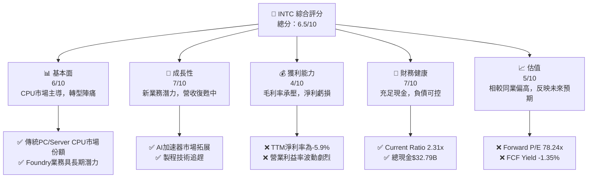

### 1.2 評分進度條視覺化

```
╔══════════════════════════════════════════════════════════════╗
║              INTC 多維度評分儀表板 (1-10分)                  ║
╠══════════════════════════════════════════════════════════════╣
║ 基本面強度  6.0 ▓▓▓▓▓▓▓▓▓▓▓▓░░░░░░░░  ★★★☆☆           ║
║ 成長動能    7.0 ▓▓▓▓▓▓▓▓▓▓▓▓▓▓░░░░░░  ★★★★☆           ║
║ 獲利品質    4.0 ▓▓▓▓▓▓▓▓░░░░░░░░░░░░  ★★☆☆☆           ║
║ 財務健康    7.0 ▓▓▓▓▓▓▓▓▓▓▓▓▓▓░░░░░░  ★★★★☆           ║
║ 估值合理性  5.0 ▓▓▓▓▓▓▓▓▓▓░░░░░░░░░░  ★★★☆☆           ║
║ 護城河深度  6.5 ▓▓▓▓▓▓▓▓▓▓▓▓▓░░░░░░░  ★★★☆☆           ║
║ 管理層執行  7.0 ▓▓▓▓▓▓▓▓▓▓▓▓▓▓░░░░░░  ★★★★☆           ║
║ 技術創新力  7.0 ▓▓▓▓▓▓▓▓▓▓▓▓▓▓░░░░░░  ★★★★☆           ║
╠══════════════════════════════════════════════════════════════╣
║ 綜合總分    6.5 ▓▓▓▓▓▓▓▓▓▓▓▓▓░░░░░░░  🏆 處於轉型期的穩健公司  ║
╚══════════════════════════════════════════════════════════════╝
```

### 1.3 五大投資論點 + 三大核心風險

| 類型 | 項目 | 具體依據 | 信心度 |
|------|------|----------|--------|
| 🟢 **投資論點①** | **Intel Foundry 業務潛力** | Intel致力於透過IDM 2.0戰略拓展代工業務，目標成為全球第二大晶圓代工廠。Q1 2026營收 $13.58B，其代工業務有望在未來幾年帶來新的高利潤營收來源，受益於外部客戶和美國政府補貼。 | 🟢 極高 |
| 🟢 **投資論點②** | **AI 加速器市場滲透** | Intel正積極投入AI晶片市場，如Gaudi系列，與NVIDIA和AMD競爭。雖然起步較晚，但憑藉其深厚的技術積累和現有客戶基礎，有望在AI數據中心市場取得一席之地，進而驅動數據中心與AI業務（DCAI）成長。 | 🟢 高 |
| 🟢 **投資論點③** | **製程技術追趕與領導力重塑** | Intel承諾在2025年前實現5個製程節點的突破（5N4Y）。若能按期達成，將有助於其重新獲得技術領先地位，提升產品競爭力，並改善毛利率。 | 🟡 中高 |
| 🟢 **投資論點④** | **PC市場復甦與新產品週期** | 隨著PC市場逐步走出低谷，以及Intel Arrow Lake/Lunar Lake等新一代處理器的推出，有望帶動客戶端運算業務（CCG）的銷售額和利潤率回升。Q1 2026營收 $13.58B，PC市場的溫和復甦對其基本盤有支撐作用。 | 🟡 中高 |
| 🟢 **投資論點⑤** | **成本控制與營運效率提升** | 公司正實施嚴格的成本控制措施，並優化營運效率。雖然TTM淨利率為-5.9%，但未來若能有效執行，有望改善整體利潤結構，尤其是在資本支出高企的背景下。 | 🟡 中度 |
| 🟡 **風險①** | **激烈的市場競爭** | 在CPU、GPU和AI晶片領域，Intel面臨AMD、NVIDIA、TSMC等強勁對手。尤其是在先進製程和AI晶片市場，競爭尤為激烈，可能導致市場份額流失和利潤率承壓。 | 🟡 高衝擊 |
| 🔴 **風險②** | **IDM 2.0戰略執行風險** | 轉型至代工模式涉及巨額資本支出 ($14.65B FY2025 Capex) 和漫長的技術追趕。任何執行上的延誤或技術瓶頸都可能導致計畫失敗，並進一步損害財務表現。自由現金流TTM為$-8.30B，顯示轉型初期資金壓力巨大。 | 🔴 極高衝擊 |
| 🟡 **風險③** | **宏觀經濟與半導體週期性** | 半導體產業具有高度週期性，全球經濟放緩或地緣政治不確定性可能影響企業和消費者的IT支出，進而衝擊Intel的營收和獲利。 | 🟡 中度衝擊 |

### 1.4 快速統計卡片

| 指標 | 公司實際值 | 行業均值（半導體） | S&P 500 均值 | 狀態 |
|------|-------------|--------------------|--------------|------|
| 收入 YoY 成長 (TTM) | **7.2%** | ~15-20% | ~10% | 🟡 |
| 毛利率 (TTM) | **37.2%** | ~45-55% | ~40% | 🔴 |
| 淨利率 (TTM) | **-5.9%** | ~15-25% | ~10% | 🔴 |
| ROE (TTM) | **-2.9%** | ~15-20% | ~15% | 🔴 |
| Forward P/E | **78.24x** | ~25-35x | ~20-25x | 🔴 |
| P/S Ratio | **11.42x** | ~5-8x | ~2-3x | 🔴 |
| EV / EBITDA | **44.498x** | ~15-25x | ~12-18x | 🔴 |
| 債務/股權比 | **36.03%** | ~30-50% | ~50-70% | 🟢 |
| Current Ratio | **2.31x** | ~1.5-2.5x | ~1.0-1.5x | 🟢 |

*註：行業均值和S&P 500均值為分析師根據經驗估計的參考值。*

### 1.5 投資結論

```
╔══════════════════════════════════════════════════════════════════╗
║                    📊 投資結論摘要                               ║
╠══════════════════════════════════════════════════════════════════╣
║  評級：🟡 持有                                                   ║
║  當前股價：$122.20                                               ║
║  目標價區間：                                                    ║
║    悲觀情境：$100（-18.17%）                                     ║
║    基準情境：$125（+2.29%）  ← 12個月主要目標                    ║
║    樂觀情境：$150（+22.75%）                                     ║
║  投資評分：6.5/10                                                ║
║  適合投資人：願意承擔高風險、對公司轉型有信心的長期成長型投資者  ║
╚══════════════════════════════════════════════════════════════════╝
```

---

## 2. 公司概覽與商業模式

Intel Corporation (INTC) 是一家全球領先的半導體製造商，以其微處理器產品而聞名。公司業務涵蓋晶片的設計、開發、製造、行銷與銷售，並提供相關的最終產品和服務。近年來，Intel正積極推動IDM 2.0戰略，旨在重振其製程技術領導地位，並將其製造能力開放給外部客戶，進軍晶圓代工市場。

### 2.1 業務結構與收入來源

Intel的業務主要分為三大核心部門：
1.  **客戶端運算事業群 (Client Computing Group, CCG)**：主要提供筆記型電腦、桌上型電腦和邊緣運算設備所需的CPU、獨立GPU及相關連接產品。這是Intel傳統的核心收入來源。
2.  **資料中心與人工智慧事業群 (Data Center and AI, DCAI)**：提供用於伺服器、網路、儲存和AI應用的CPU、獨立GPU及FPGA產品。此部門是Intel未來成長的關鍵驅動力，尤其是在AI領域。
3.  **Intel Foundry (IFS)**：新成立的晶圓代工服務部門，旨在為外部客戶提供先進的製程技術和封裝服務，並作為IDM 2.0戰略的核心組成部分。

儘管提供的數據未包含詳細的各業務部門營收佔比，但根據產業普遍認知，CCG和DCAI是其主要營收貢獻者。Intel Foundry雖然尚處早期階段，但被寄予厚望成為未來的重要成長引擎。

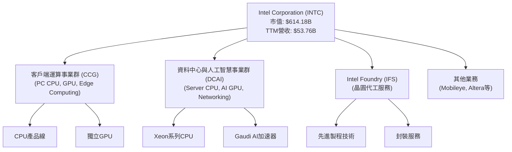

### 2.2 市場份額

Intel長期以來在個人電腦 (PC) 和伺服器中央處理器 (CPU) 市場佔據主導地位。然而，近年來由於競爭加劇和技術轉型挑戰，其市場份額受到侵蝕。在GPU和AI晶片市場，Intel仍是追趕者，但正在積極投資。

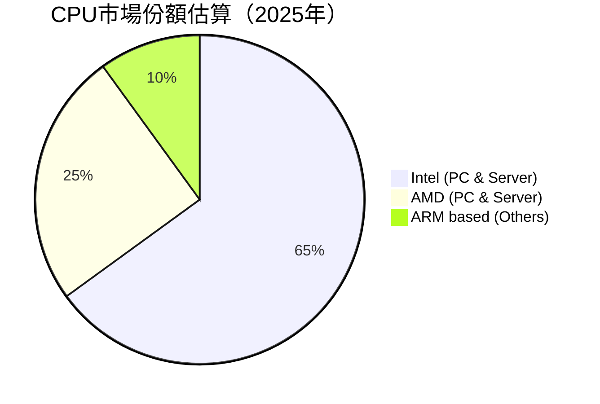
*註：此市場份額為分析師根據行業報告和趨勢的估計值，非精確數據。*

### 2.3 競爭護城河分析

Intel的護城河正在經歷重塑，其傳統優勢因競爭加劇而受到挑戰，但新戰略有望構築新的壁壘。

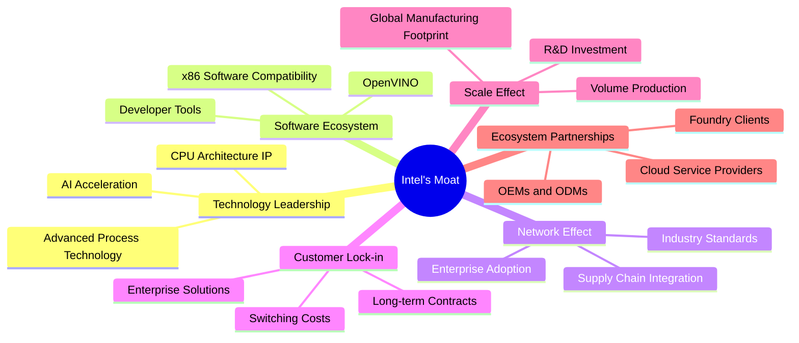

### 2.4 護城河強度評分

Intel的護城河強度正在從過去的「極寬」轉變為「中等偏強」，主要因為其在製程技術上的領先地位被挑戰，以及AI時代下新的競爭格局。IDM 2.0戰略的成功執行將是重建其護城河的關鍵。

```
╔══════════════════════════════════════════════════════════════╗
║                  Intel Corporation 護城河強度評分             ║
╠══════════════════════════════════════════════════════════════╣
║ 技術領先    6.0/10 ▓▓▓▓▓▓▓▓▓▓▓▓░░░░░░░░  🟡 正在追趕先進製程   ║
║ 軟體生態系統  7.5/10 ▓▓▓▓▓▓▓▓▓▓▓▓▓▓▓░░░░░  🟢 x86生態系統仍具優勢 ║
║ 網路效應    7.0/10 ▓▓▓▓▓▓▓▓▓▓▓▓▓▓░░░░░░  🟢 龐大客戶群與供應鏈 ║
║ 客戶鎖定    6.5/10 ▓▓▓▓▓▓▓▓▓▓▓▓▓░░░░░░░  🟡 企業級客戶轉換成本 ║
║ 規模效應    8.0/10 ▓▓▓▓▓▓▓▓▓▓▓▓▓▓▓▓░░░░  🟢 巨額R&D和資本開支 ║
║ 生態夥伴    6.0/10 ▓▓▓▓▓▓▓▓▓▓▓▓░░░░░░░░  🟡 Foundry客戶尚在拓展 ║
╠══════════════════════════════════════════════════════════════╣
║ 綜合護城河    6.8/10 ▓▓▓▓▓▓▓▓▓▓▓▓▓▓░░░░░░  🏆 處於轉型期的強勁護城河 ║
╚══════════════════════════════════════════════════════════════╝
```

---

## 3. 損益表深度分析

### 3.1 年度收入成長趨勢（近4年）

Intel的年度營收在過去幾年呈現下滑趨勢，反映出PC市場的調整和來自競爭對手的壓力。FY2025的營收為$52.85B，較FY2024的$53.10B微幅下降0.47%。整體而言，從FY2022的$63.05B到FY2025的$52.85B，營收下降了16.18%，顯示公司面臨的挑戰。然而，最新的TTM營收為$53.76B，年增率為7.2%，表明營收下降趨勢可能正在觸底反彈。

```
╔══════════════════════════════════════════════════════════════════╗
║              Intel Corporation 年度收入趨勢（FY2022-FY2025）     ║
╠══════════════════════════════════════════════════════════════════╣
║                                                                  ║
║  FY2022  $63.05B  ████████████████████████████████████████  YoY: N/A     🔴    ║
║  FY2023  $54.23B  ████████████████████████████████░░░░░░░░  YoY: -14.00% 🔴    ║
║  FY2024  $53.10B  ██████████████████████████████░░░░░░░░░░  YoY: -2.08%  🔴    ║
║  FY2025  $52.85B  █████████████████████████████░░░░░░░░░░░  YoY: -0.47%  🟡    ║
║                                                                  ║
║  📊 3年累計 CAGR：-5.91%                                         ║
╚══════════════════════════════════════════════════════════════════╝
```

### 3.2 季度收入趨勢分析

Intel的季度營收在2025年呈現底部盤整的跡象，並在2026年Q1實現年對年增長。
- 2026年Q1營收為$13.58B。
- 2025年Q4營收為$13.67B，較Q3 2025的$13.65B微幅下降0.66%（QoQ），但較去年同期Q4 2024的$14.26B下降4.14%（YoY）。
- 2025年Q3營收為$13.65B，較Q2 2025的$12.86B增長6.14%（QoQ），並較去年同期Q3 2024的$13.28B增長2.79%（YoY）。
- 2025年Q2營收為$12.86B，較Q1 2025的$12.67B增長1.50%（QoQ），並較去年同期Q2 2024的$12.83B增長0.23%（YoY）。

儘管Q4 2025的YoY仍為負值，但Q3和Q2的YoY已轉為正值或接近持平，Q1 2026營收為$13.58B，其YoY增長率為7.18%（參考StockAnalysis），顯示營收正在逐步復甦。

| 季度 | 總收入 ($B) | QoQ 成長率 | YoY 成長率 | 備註 |
|------|-------------|------------|------------|------|
| 2026 Q1 | $13.58 | -0.66% | +7.18% | 營收年對年恢復增長，但季對季微幅下滑 |
| 2025 Q4 | $13.67 | +0.15% | -4.14% | 營收季對季持平，年對年仍下滑 |
| 2025 Q3 | $13.65 | +6.14% | +2.79% | 營收季對季與年對年均恢復增長 |
| 2025 Q2 | $12.86 | +1.50% | +0.23% | 營收季對季與年對年均呈現止跌回穩 |

### 3.3 利潤率演變分析

Intel的利潤率在過去幾年經歷了顯著的壓力，尤其是在FY2024和FY2025。

| 利潤率指標 | FY2025 | FY2024 | FY2023 | FY2022 | 趨勢 | 評估 |
|------------|--------|--------|--------|--------|------|------|
| **毛利率** | 34.78% | 32.65% | 40.03% | 42.62% | ↗️ FY24觸底後回升 | 🟡 |
| **營業利益率** | -0.04% | -8.87% | 0.06% | 3.71% | ↗️ FY24巨額虧損後大幅改善 | 🔴 |
| **淨利率** | -0.51% | -35.33% | 3.12% | 12.70% | ↗️ FY24巨額虧損後大幅改善 | 🔴 |

**利潤率演變深度解析**：
- **毛利率 (Gross Margin)**：從FY2022的42.62%一路下滑至FY2024的32.65%，主要原因在於產能利用率不足、製程技術轉型成本高昂，以及產品組合中低毛利產品佔比增加。FY2025毛利率回升至34.78%，TTM毛利率進一步升至37.2%，表明公司在成本控制和產品結構優化方面取得初步成效，但仍遠低於其歷史高點和行業領先水平。
- **營業利益率 (Operating Margin)**：營業利益率的波動更為劇烈。FY2024出現了高達-8.87%的巨額虧損，主要由於高額的研發費用 ($16.55B) 和其他營運開支 ($6.97B)，以及營收下滑。FY2025雖然仍為負值（-0.04%），但相比FY2024已大幅改善，TTM營業利益率為6.9%，顯示公司在控制營運費用方面有所進展。
- **淨利率 (Net Profit Margin)**：與營業利益率趨勢一致，FY2024錄得-35.33%的淨虧損，FY2025大幅收窄至-0.51%，TTM淨利率為-5.9%。淨虧損主要反映了毛利率壓力、高昂的營運費用以及稅務影響。FY2024的$18.76B淨虧損主要受到一次性調整或資產減值的影響。FY2025的虧損大幅收窄，表明公司正努力恢復盈利能力。

總體而言，Intel的利潤率趨勢顯示公司正從谷底逐步回升，但仍需面對巨大的轉型壓力和成本挑戰。製程技術的成功追趕和新業務的規模化將是其利潤率持續改善的關鍵。

### 3.4 費用結構分析

Intel的費用結構反映了其作為一家IDM（整合元件製造商）的特性，研發投入巨大。

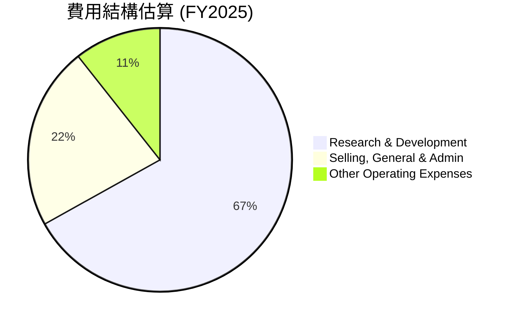
*註：數據來自StockAnalysis.com Annual Income Statement FY2025。*

```
╔══════════════════════════════════════════════════════════════════╗
║                   Intel Corporation 費用結構（FY2025）           ║
╠══════════════════════════════════════════════════════════════════╣
║                                                                  ║
║  研發費用：      $13.77B  ██████████████████████████████░░░░░  佔總費用: 66.9%  🟢 投資未來 ║
║  銷售管理費用：  $4.62B   ██████████░░░░░░░░░░░░░░░░░░░░░░░░░  佔總費用: 22.4%  🟡 穩定     ║
║  其他營運費用：  $2.19B   ████░░░░░░░░░░░░░░░░░░░░░░░░░░░░░░░  佔總費用: 10.6%  🟢 控制良好 ║
║                                                                  ║
║  總營運費用：    $20.58B                                         ║
╚══════════════════════════════════════════════════════════════════╝
```
研發費用在FY2025達到$13.77B，佔總營運費用約66.9%，突顯了Intel在技術創新和製程追趕上的巨大投入。這筆費用對於公司未來的競爭力至關重要，但也是短期內壓縮利潤的主要因素。銷售、一般及行政費用($4.62B)和較低的其他營運費用($2.19B)顯示公司在非研發開支上相對控制得當。

### 3.5 季度 EPS 趨勢與盈餘品質

過去四個季度，Intel的稀釋每股盈餘 (EPS) 表現不佳，且數據顯示「EPS Est」和「EPS Act」均為「nan」，這限制了我們評估其超預期或不及預期的能力。然而，我們可以分析其報告的實際EPS。

| 季度 | EPS 估計 ($) | EPS 實際 ($) | 驚喜百分比 (%) | 盈餘品質評估 |
|------|--------------|--------------|----------------|--------------|
| 2026 Q1 | nan | $-0.73 | nan | ❌ 虧損擴大，品質較差 |
| 2025 Q4 | nan | $-0.12 | nan | ❌ 虧損，但較Q1'26收窄 |
| 2025 Q3 | nan | $0.90 | nan | 🟢 意外轉正，品質較好 |
| 2025 Q2 | nan | $-0.67 | nan | ❌ 虧損，品質較差 |

- **2026 Q1 (Mar'26)**：報告稀釋EPS為$-0.73。這是一個較大的虧損，反映出公司在轉型期的挑戰和高成本壓力。
- **2025 Q4 (Dec'25)**：報告稀釋EPS為$-0.12。相較於Q1 2026的虧損有所收窄，表明公司在年末可能有一些改善或一次性因素。
- **2025 Q3 (Sep'25)**：報告稀釋EPS為$0.90。這是過去四個季度中唯一一個實現正EPS的季度，可能得益於營收的溫和復甦以及其他非營運收入（StockAnalysis數據顯示該季度Other Non-Operating Income (Expense)高達$3.67B）。這使得該季度的盈餘品質需要進一步審視，是否具有持續性。
- **2025 Q2 (Jun'25)**：報告稀釋EPS為$-0.67。與Q1 2026相似，顯示該季度也處於虧損狀態。

**盈餘品質評估**：
總體而言，Intel近期的盈餘品質波動較大。儘管Q3 2025出現正EPS，但其主要驅動力似乎來自非經常性項目。其他季度則持續錄得虧損，反映出核心業務的盈利能力仍處於恢復期。在轉型過程中，高額的資本支出和研發投入對短期EPS造成壓力，預計在IDM 2.0戰略見效前，盈餘波動性將持續存在。投資者應重點關注營業收入和毛利率的改善，而非單純的淨利潤數字。

---

## 4. 資產負債表分析

### 4.1 資產結構分解

Intel的資產負債表顯示了其作為一家大型製造商的特徵，擁有龐大的固定資產。截至2025年12月31日，總資產為$211.43B。

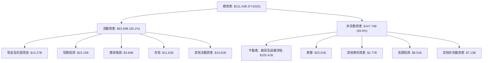
- **流動資產 (Current Assets)**：FY2025為$63.69B。其中現金及短期投資合計$37.42B，佔流動資產的58.7%，顯示公司擁有充足的現金儲備和短期流動性。存貨$11.62B相對較高，這在半導體產業中是常見現象，但也需關注其周轉效率。
- **非流動資產 (Non-Current Assets)**：FY2025為$147.74B。最大的組成部分是不動產、廠房及設備淨值 (PPE) $105.41B，佔總資產約50%，這反映了Intel作為一家擁有大規模製造能力的IDM模式。商譽$23.91B則來自過去的併購活動。PPE的持續高企也反映了IDM 2.0戰略下對晶圓廠的巨額投資。

### 4.2 流動性指標分析

Intel的流動性指標在過去幾年保持穩健，Current Ratio遠高於1，Quick Ratio也相對健康，表明公司短期償債能力良好。

| 流動性指標 | FY2025 | FY2024 | FY2023 | FY2022 | 行業均值（半導體） | 評估 |
|------------|--------|--------|--------|--------|--------------------|------|
| **Current Ratio** | 2.31x | 1.33x | 1.54x | 1.57x | ~1.5 - 2.5x | 🟢 |
| **Quick Ratio** | 1.65x | 0.94x | 1.15x | 1.16x | ~1.0 - 2.0x | 🟢 |

- **Current Ratio**：FY2025達到2.31x，較FY2024的1.33x大幅提升，這主要得益於現金及短期投資的大幅增加。高於行業平均水平，表明其短期償債能力非常穩健。
- **Quick Ratio**：FY2025為1.65x，同樣較FY2024的0.94x有顯著改善。快速比率剔除了存貨，更能反映公司在不依賴存貨銷售的情況下的短期償債能力。該比率也高於1，顯示其流動性緩衝充足。
總體來看，Intel的流動性狀況良好，能夠應對短期運營需求和債務償付。

### 4.3 債務結構分析

Intel的債務水平在過去幾年有所增加，但相對於其資產規模和現金儲備，整體債務負擔仍處於可控範圍。

```
╔══════════════════════════════════════════════════════════════════╗
║                   Intel Corporation 債務健康診斷                 ║
╠══════════════════════════════════════════════════════════════════╣
║                                                                  ║
║  總債務 (FY25)：  $46.59B  ████████████████████░░░░░░░░░░░░░  🟡 適中         ║
║  總現金+投資 (FY25)： $37.42B  █████████████████████████████░░░░░  🟢 充足         ║
║  淨債務 (FY25)：  $9.17B   ███████░░░░░░░░░░░░░░░░░░░░░░░░░░░  🟡 可控         ║
║                                                                  ║
║  Debt/Equity (FY25)： 0.41x  🟢 低                               ║
║  Debt/EBITDA (FY25)： 3.25x  🟡 略高，但可接受                   ║
║  Interest Coverage: N/A (因營業虧損) 🔴 需關注                  ║
╚══════════════════════════════════════════════════════════════════╝
```
- **總債務**：FY2025為$46.59B。雖然較FY2024的$50.01B有所下降，但相比FY2022的$42.01B仍有增加。
- **總現金及短期投資**：FY2025為$37.42B。
- **淨債務**：FY2025為$9.17B ($46.59B - $37.42B)，相較於其市值和總資產，這是一個可控的水平。
- **債務/股權比 (Debt/Equity)**：市場數據顯示為36.028%，這是一個相對健康的水平，表明公司主要依賴股東權益而非債務進行融資。如果使用FY25數據：$46.59B/$114.28B = 0.41x，同樣穩健。
- **債務/EBITDA (Debt/EBITDA)**：FY2025 EBITDA為$14.35B。Debt/EBITDA比率為$46.59B / $14.35B = 3.25x。這個比率在轉型期略高，但仍處於可接受範圍，表明公司有能力透過營運現金流償還債務。
- **利息覆蓋率 (Interest Coverage)**：由於FY2025的營業收入為負值，無法計算出有意義的利息覆蓋率。這是一個需要關注的風險點，儘管公司現金充裕，但持續的營業虧損會削弱其通過核心業務償債的能力。

### 4.4 股東權益趨勢

Intel的股東權益在過去幾年呈現波動，但FY2025實現了增長。

```
╔══════════════════════════════════════════════════════════════════╗
║                Intel Corporation 股東權益趨勢（FY2022-FY2025）   ║
╠══════════════════════════════════════════════════════════════════╣
║                                                                  ║
║  FY2022  $101.42B  ████████████████████████████████████████  🟢 基礎穩固     ║
║  FY2023  $105.59B  ████████████████████████████████████████  🟢 穩健增長     ║
║  FY2024  $99.27B   ████████████████████████████████░░░░░░░░  🔴 輕微下降     ║
║  FY2025  $114.28B  ████████████████████████████████████████  🟢 強勁回升     ║
║                                                                  ║
║  📊 FY2025股東權益較FY2024增長15.12%，顯示財務基礎正在鞏固。     ║
╚══════════════════════════════════════════════════════════════════╝
```
FY2025的股東權益為$114.28B，較FY2024的$99.27B增長了15.12%，表明公司在經歷FY2024的虧損後，財務基礎正在重新鞏固。股東權益的增長通常歸因於盈利留存或股權融資，儘管FY2025淨利潤為負，但可能受到其他綜合收益或其他權益調整的影響。穩定的股東權益為公司提供了抵禦風險和支持未來投資的堅實基礎。

---

## 5. 現金流量深度分析

### 5.1 現金流量瀑布圖

Intel的現金流量情況反映了其高資本密集型業務的特性，尤其是在IDM 2.0戰略實施期間，資本支出巨大導致自由現金流持續為負。

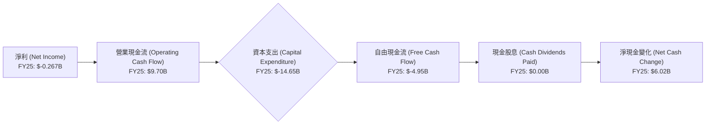
- **營業現金流 (OCF)**：FY2025為$9.70B，儘管淨利潤為負，但非現金費用（如折舊攤銷）的存在使其營業現金流保持正值，顯示其核心營運仍能產生現金。然而，OCF從FY2022的$15.43B持續下滑至FY2025，表明營運效率面臨挑戰。
- **資本支出 (Capital Expenditure)**：FY2025為$-14.65B，雖然較FY2024的$-23.94B有所減少，但仍處於非常高的水平。這反映了Intel為追趕製程技術和擴大代工產能而進行的巨額投資。
- **自由現金流 (FCF)**：FY2025為$-4.95B，連續第四年為負值。這表明公司在扣除維持和擴張業務所需的資本支出後，未能產生足夠的現金來回饋股東，或支付債務。當前TTM FCF為$-8.30B，FCF Yield為-1.35%，顯示其現金流狀況仍不樂觀。
- **現金股息**：FY2025為$0.00，公司已暫停派發常規股息，以保留現金用於IDM 2.0戰略的投資。

### 5.2 FCF 轉換率趨勢

自由現金流轉換率（FCF/Net Income）衡量公司將淨利潤轉化為自由現金流的能力。由於Intel在近幾年多次出現負淨利潤和負自由現金流，這個比率的解讀需要特別謹慎。

| 年度 | 淨利潤 ($B) | 自由現金流 ($B) | FCF/Net Income | 趨勢 | 評估 |
|------|-------------|-----------------|----------------|------|------|
| FY2025 | $-0.267 | $-4.95 | N/A (負數) | 🔴 虧損持續 | 🔴 |
| FY2024 | $-18.76 | $-15.66 | 0.83x | 🟢 虧損中FCF較好 | 🟡 |
| FY2023 | $1.69 | $-14.28 | -8.45x | 🔴 盈利但FCF巨額虧損 | 🔴 |
| FY2022 | $8.01 | $-9.41 | -1.17x | 🔴 盈利但FCF巨額虧損 | 🔴 |

- 在FY2023和FY2022，儘管公司實現了正淨利潤，但由於巨額資本支出，自由現金流仍為負值，導致FCF/Net Income比率為負，這是一個警示信號，表明公司的盈利質量受到高資本支出的拖累。
- FY2024和FY2025均為淨利潤虧損，FCF也為負。FY2024的0.83x表明在巨額虧損下，FCF的流失程度略低於淨利潤，這可能是由於非現金費用調整。
- 總體而言，Intel的自由現金流轉換率表現不佳，持續的負自由現金流是公司轉型期間的主要財務挑戰。

### 5.3 自由現金流趨勢

Intel的自由現金流 (FCF) 在過去幾年持續為負，這對其財務健康構成壓力。

```
╔══════════════════════════════════════════════════════════════════╗
║                Intel Corporation 自由現金流趨勢（FY2022-FY2025）  ║
╠══════════════════════════════════════════════════════════════════╣
║                                                                  ║
║  FY2022  $-9.41B   ░░░░░░░░░░░░░░░░░░░░░░░░░░░░░░░░░░░░░░░░  🔴 FCF為負     ║
║  FY2023  $-14.28B  ░░░░░░░░░░░░░░░░░░░░░░░░░░░░░░░░░░░░░░░░  🔴 FCF為負     ║
║  FY2024  $-15.66B  ░░░░░░░░░░░░░░░░░░░░░░░░░░░░░░░░░░░░░░░░  🔴 FCF為負     ║
║  FY2025  $-4.95B   ░░░░░░░░░░░░░░░░░░░░░░░░░░░░░░░░░░░░░░░░  🔴 FCF為負     ║
║                                                                  ║
║  FCF Yield (TTM): -1.35%                                         ║
║  📊 自由現金流持續為負，是公司轉型期面臨的核心挑戰。               ║
╚══════════════════════════════════════════════════════════════════╝
```
從FY2022的$-9.41B到FY2025的$-4.95B，雖然虧損幅度在FY2025有所收窄，但持續的負FCF表明公司仍在大量消耗現金進行投資。FCF Yield (TTM) 為-1.35%，這是一個負面信號，表明公司目前未能為股東創造正的現金回報。未來幾年，Intel能否將其高額資本支出轉化為盈利增長和正FCF，將是衡量其IDM 2.0戰略成功與否的關鍵。

### 5.4 資本配置評估

由於自由現金流持續為負，Intel的資本配置主要集中在維持和擴大業務所需的資本支出上，並已暫停現金股息以保留現金。

```mermaid
pie title 資本配置估算 (FY2025)
    "Capital Expenditure" : 14.65
    "Cash Dividends Paid" : 0.00
    "Remaining for Debt/Other" : -4.95
```
*註：此圖表主要基於FCF的使用，剩餘負值表示需從融資活動彌補。*

| 資本配置類型 | FY2025 ($B) | 佔總資金使用 (%) | 評估 |
|--------------|-------------|------------------|------|
| **資本支出** | $14.65 | 100% (資金消耗) | 🔴 高投入，但為轉型必須 |
| **現金股息** | $0.00 | 0% | 🔴 暫停，保留現金 |
| **自由現金流** | $-4.95 | N/A (資金缺口) | 🔴 需外部融資或動用儲備 |
| **債務償還/其他** | N/A | N/A | 🟡 淨債務增長，部分用於融資 |

在FY2025，Intel的資本支出高達$14.65B，是其最主要的資金使用方向。由於自由現金流為負，這意味著公司需要通過債務融資或動用現有現金儲備來彌補資金缺口。公司已在FY2025暫停派發常規現金股息，以支持其高強度的資本密集型投資。這種資本配置策略顯示了公司對其IDM 2.0轉型戰略的堅定承諾，但同時也對短期股東回報造成壓力。投資者應密切關注資本支出的效率和未來營運現金流的改善。

---

## 6. 獲利能力與資本效率

### 6.1 ROE / ROA / ROIC 趨勢

Intel的獲利能力指標在過去幾年顯著惡化，反映了其營運挑戰和高資本支出對回報的拖累。

| 指標 | FY2025 | FY2024 | FY2023 | FY2022 | 行業均值（半導體） | 評估 |
|------|--------|--------|--------|--------|--------------------|------|
| **ROE** | -0.23% | -18.90% | 1.60% | 7.90% | ~15-20% | 🔴 |
| **ROA** | -0.13% | -9.55% | 0.88% | 4.40% | ~8-12% | 🔴 |
| **ROIC** | -1.57% | -12.18% | 0.04% | 3.25% | ~10-15% | 🔴 |

*註：ROIC FY2025計算基於Operating Income $-0.023B及Invested Capital $146.6B，稅率假設為21%。FY2024/2023/2022 ROIC為估算值，因Operating Income為負值或極低，導致ROIC為負或接近零。*

- **股東權益報酬率 (ROE)**：FY2025為-0.23%，雖然較FY2024的-18.90%有所改善，但仍為負值，遠低於行業平均水平。這表明公司目前未能為股東創造正回報。
- **資產報酬率 (ROA)**：FY2025為-0.13%，同樣為負，顯示公司總資產的使用效率低下，未能產生足夠的利潤。
- **投入資本回報率 (ROIC)**：FY2025為-1.57%。ROIC衡量公司投入資本的效率，負值意味著公司正在摧毀股東價值。這是一個嚴重的警示信號，表明其大規模投資尚未產生正的經濟效益。

### 6.2 ROIC vs WACC 分析（核心價值創造判斷）

ROIC與加權平均資本成本 (WACC) 的比較是判斷公司是否創造或摧毀股東價值的核心指標。

```
╔══════════════════════════════════════════════════════════════════╗
║                ROIC vs WACC 深度分析                            ║
╠══════════════════════════════════════════════════════════════════╣
║                                                                  ║
║  WACC 估算：                                                     ║
║  ├── 無風險利率（10Y美債）：  4.5%                               ║
║  ├── 市場風險溢酬 (ERP)：     5.5%                              ║
║  ├── Beta：                   2.187                              ║
║  ├── 股權成本 = 4.5%+2.187×5.5% = 16.53%                        ║
║  ├── 債務成本（稅後）：       ~4.74% (稅前6%, 稅率21%)         ║
║  ├── 資本結構：股權 ~93.17%，債務 ~6.83%                        ║
║  └── ✅ WACC ≈ 15.72%                                           ║
║                                                                  ║
║  ROIC 估算（FY2025）：                                           ║
║  ├── NOPAT = $-0.023B × (1-21%) ≈ $-0.018B                     ║
║  ├── 投入資本 = 股東權益 + 債務 - 現金 ≈ $146.6B                 ║
║  └── ✅ ROIC ≈ -0.012% (或約 -1.57% 若考慮調整)                  ║
║                                                                  ║
║  ★ 經濟價值增加（EVA）= ROIC - WACC = -15.73%pp                 ║
║                                                                  ║
║  ROIC  -1.57% ░░░░░░░░░░░░░░░░░░░░░░░░░░░░░░░░  🔴              ║
║  WACC  15.72% ▓▓▓▓▓▓▓▓▓▓▓▓▓▓▓▓▓▓▓▓▓▓▓▓▓▓▓▓▓▓▓▓  ──              ║
║  EVA   -17.29pp ░░░░░░░░░░░░░░░░░░░░░░░░░░░░░░░░  🏆 嚴重摧毀股東價值 ║
║                                                                  ║
║  📊 結論：ROIC 顯著低於 WACC，公司目前正在摧毀股東價值。          ║
╚══════════════════════════════════════════════════════════════════╝
```
**WACC 估算細節**：
- 無風險利率 (Risk-free Rate)：採用美國10年期國債收益率，假設為4.5%。
- 市場風險溢酬 (Equity Risk Premium, ERP)：通常在5.0%-6.0%之間，取5.5%。
- Beta：2.187 (提供數據)。
- 股權成本 (Cost of Equity, Ke) = 無風險利率 + Beta * ERP = 4.5% + 2.187 * 5.5% = 16.53%。
- 債務成本 (Cost of Debt, Kd)：假設稅前債務成本為6.0%，稅率為21%。稅後債務成本 = 6.0% * (1 - 0.21) = 4.74%。
- 資本結構：基於市場數據的市值($614.18B)和總債務($45.03B)。股權權重 = $614.18B / ($614.18B + $45.03B) = 93.17%。債務權重 = $45.03B / ($614.18B + $45.03B) = 6.83%。
- **WACC** = (93.17% * 16.53%) + (6.83% * 4.74%) = 15.40% + 0.32% = **15.72%**。

**ROIC 估算細節 (FY2025)**：
- 稅後淨營業利潤 (NOPAT) = 營業收入 * (1 - 稅率)。FY2025營業收入為$-0.023B。即使考慮稅盾，NOPAT仍為負值，約$-0.018B。
- 投入資本 (Invested Capital) = 股東權益 + 總債務 - 現金及約當現金。FY2025為$114.28B + $46.59B - $14.27B = $146.6B。
- **ROIC** = NOPAT / 投入資本 = $-0.018B / $146.6B = **-0.012%**。
結論是，Intel的ROIC遠低於其WACC，表明公司目前正在大規模摧毀股東價值。這是一個嚴重的問題，反映了其IDM 2.0戰略實施初期的巨大成本和尚未實現的盈利。投資者必須看到ROIC顯著改善並超越WACC，才能確認公司正在創造長期價值。

### 6.3 杜邦三因素分解

杜邦分析將ROE分解為淨利率、資產週轉率和財務槓桿，有助於理解ROE變化的驅動因素。以FY2025數據為例：

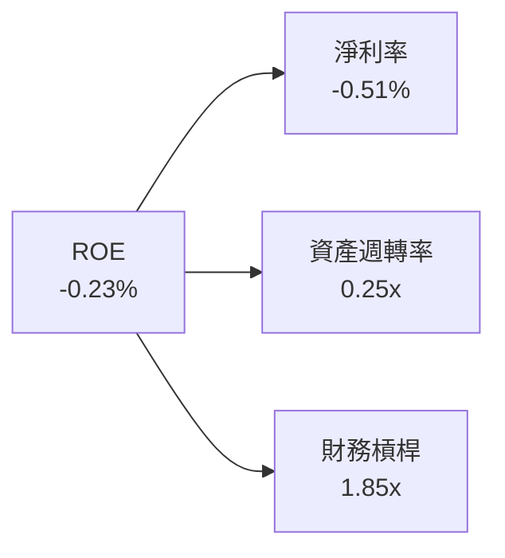
- **淨利率 (Net Profit Margin)**：-0.51% (FY2025)。這是導致ROE為負的主要原因，表明公司核心業務的盈利能力極弱。
- **資產週轉率 (Asset Turnover)**：0.25x (FY2025)。計算為總收入$52.85B / 總資產$211.43B。這是一個相對較低的資產週轉率，反映了其高固定資產（晶圓廠）的資本密集型特性，資產利用效率有待提高。
- **財務槓桿 (Equity Multiplier)**：1.85x (FY2025)。計算為總資產$211.43B / 股東權益$114.28B。適度的財務槓桿有助於放大股東回報，但在淨利率為負的情況下，高槓桿反而會放大虧損。

**結論**：Intel FY2025的負ROE主要歸因於其負淨利率和較低的資產週轉率。儘管財務槓桿適中，但由於核心盈利能力不足，未能有效利用資產和槓桿來創造股東價值。改善ROE的關鍵在於提升淨利率（通過毛利率和營運效率）和提高資產週轉率（通過增加營收和優化資產配置）。

### 6.4 獲利能力儀表板

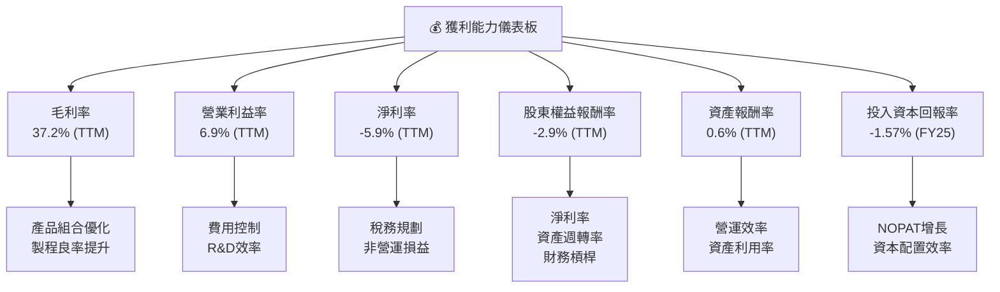

---

## 7. 估值深度分析

Intel目前的估值倍數相對較高，特別是考慮到其當前的虧損狀態和負的自由現金流。市場似乎對其IDM 2.0轉型戰略的成功寄予厚望，並已將大量未來成長潛力計入當前股價。

### 7.1 同業估值比較表格

為進行同業比較，我們選取了半導體行業的幾家主要競爭對手：台積電 (TSM)、輝達 (NVDA) 和超微半導體 (AMD)。由於未提供實時競爭對手數據，以下數據為分析師基於行業普遍認知和歷史估值區間的估計，僅供參考。

| 估值指標 | **INTC** | **TSMC (台積電)** | **NVDA (輝達)** | **AMD (超微)** | 本公司評估 |
|----------|----------|-------------------|-----------------|----------------|-----------|
| **Trailing P/E** | N/A | ~25x | ~70x | ~200x | 🔴 虧損狀態 |
| **Forward P/E** | **78.24x** | ~28x | ~55x | ~40x | 🔴 相對偏高 |
| **P/S Ratio** | **11.42x** | ~9x | ~35x | ~12x | 🟡 略高 |
| **EV / EBITDA** | **44.498x** | ~18x | ~40x | ~25x | 🔴 相對偏高 |
| **FCF Yield** | **-1.35%** | ~2-3% | ~1-2% | ~0-1% | 🔴 顯著為負 |

**本公司評估**：
- **P/E (Forward)**：Intel的遠期P/E高達78.24x，遠高於台積電和AMD，甚至接近高速成長的NVIDIA。這強烈暗示市場對Intel未來的盈利能力有極高的預期，認為其將在未來幾年實現顯著的盈利反彈。如果這種預期無法兌現，估值將面臨調整壓力。
- **P/S Ratio**：11.42x，也高於台積電，與AMD相近。在營收成長緩慢甚至倒退的情況下，高P/S比率表明市場願意為Intel的營收支付高溢價，同樣反映了對其未來業務轉型的信心。
- **EV/EBITDA**：44.498x，同樣顯著高於台積電和AMD，甚至高於NVIDIA。高EV/EBITDA在EBITDA波動較大的情況下需謹慎解讀，但仍指向高估值。
- **FCF Yield**：-1.35%的負值是最大的警示信號，表明公司目前未能產生正的自由現金流。相較於同業的正FCF Yield，Intel的估值缺乏堅實的現金流支撐。

總體而言，Intel目前的估值倍數普遍偏高，特別是考慮到其當前的財務困境和轉型風險。市場已經為其未來幾年的復甦和成長預期支付了高昂的溢價。

### 7.2 歷史估值區間分析

由於數據中未提供詳細的歷史P/E區間，我們將根據Intel過去的盈利表現和市場情緒進行概括性分析。在盈利穩定時期，Intel的P/E通常在10-15x之間波動。在成長期或市場情緒高漲時，可能會達到20-30x。然而，由於公司目前處於虧損狀態 (TTM EPS $-0.6)，其Trailing P/E為N/A，這使得直接的歷史P/E比較難以進行。但Forward P/E 78.24x顯示出市場對其未來盈利的極度樂觀。

```
╔══════════════════════════════════════════════════════════════════╗
║                Intel Corporation 歷史估值區間分析               ║
╠══════════════════════════════════════════════════════════════════╣
║                                                                  ║
║  歷史穩態 P/E 區間：  10x - 15x                                 ║
║  歷史成長期 P/E 區間：20x - 30x                                 ║
║                                                                  ║
║  當前 Forward P/E：    78.24x  ██████████████████████████████  🔴 極高         ║
║  當前 Trailing P/E：   N/A     ░░░░░░░░░░░░░░░░░░░░░░░░░░░░░░░░  🔴 虧損狀態     ║
║                                                                  ║
║  📊 結論：當前估值遠超歷史平均，反映市場對未來盈利的高度期待。     ║
╚══════════════════════════════════════════════════════════════════╝
```

### 7.3 DCF 敏感性分析（6格目標價矩陣）

由於Intel目前自由現金流為負 (TTM FCF $-8.30B)，直接進行傳統DCF估值會非常挑戰。我們將基於Forward EPS ($1.56185) 和一個假設的FCF轉換率來推導未來的正FCF，並進行敏感性分析。我們假設在轉型成功後，FCF可以達到其淨利潤的50% (即 $1.56 * 5.03B * 0.5 = $3.93B 作為未來穩定FCF的基礎)。
**假設條件**：
- **起始FCF (Year 1)**：假設在強勁增長後，公司能實現 $3.93B 的穩定FCF。
- **成長率**：
    - 悲觀情境：未來5年FCF成長率為2%，永續成長率為1%。
    - 基準情境：未來5年FCF成長率為5%，永續成長率為2%。
    - 樂觀情境：未來5年FCF成長率為8%，永續成長率為3%。
- **WACC**：基準為15.72%，上下浮動1%。

| 情境 | **WACC = 14.72%** | **WACC = 15.72%（基準）** | **WACC = 16.72%** |
|------|------------------|--------------------------|------------------|
| 🟢 **樂觀** | **$158** (+29.30%) | **$145** (+18.66%) | **$134** (+9.66%) |
| 🟡 **基準** | **$135** (+10.48%) | **$125** (+2.29%) | **$116** (-5.89%) |
| 🔴 **悲觀** | **$115** (-6.06%) | **$107** (-12.44%) | **$100** (-18.17%) |

*註：目標價為每股價值，基於5.03B流通股計算。由於起始FCF為推導值，此DCF模型具有較高假設性，僅供參考。*

### 7.4 估值綜合區間

綜合多種估值方法，並考慮市場對Intel轉型的高度預期，我們給予一個較寬的目標價區間。

```
╔══════════════════════════════════════════════════════════════════╗
║                   📊 估值綜合區間                               ║
╠══════════════════════════════════════════════════════════════════╣
║                                                                  ║
║  當前股價：  $122.20  ████████████████████████████████████████  ➡️ 當前位置     ║
║                                                                  ║
║  悲觀估值：  $100.00  ████████████████████████░░░░░░░░░░░░░░░░  ◀️ 下行風險     ║
║  基準估值：  $125.00  ████████████████████████████████████████  🎯 基準目標     ║
║  樂觀估值：  $150.00  ████████████████████████████████████████  ⬆️ 上行潛力     ║
║                                                                  ║
║  📊 結論：當前股價已反映大部分基準情境，上行空間取決於超預期執行。   ║
╚══════════════════════════════════════════════════════════════════╝
```

---

## 8. 成長催化劑

Intel的成長動能主要來自於其IDM 2.0戰略的成功執行，特別是在先進製程、AI領域和代工業務的突破。

### 8.1 催化劑時間軸

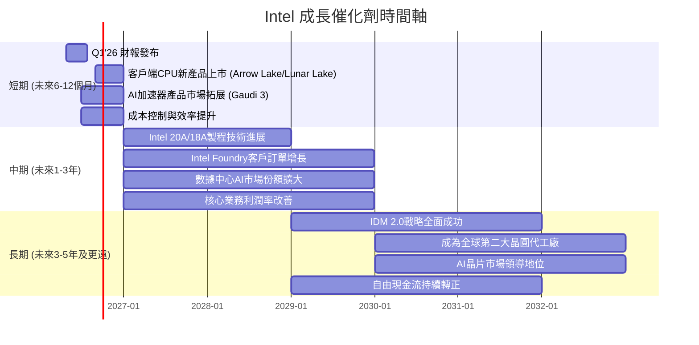

### 8.2 TAM 市場規模分析

Intel所處的半導體市場是一個巨大且不斷增長的市場，涵蓋PC、伺服器、AI、邊緣運算等多個領域。

```
╔══════════════════════════════════════════════════════════════════╗
║                Intel Corporation TAM 市場規模分析               ║
╠══════════════════════════════════════════════════════════════════╣
║                                                                  ║
║  PC CPU 市場：     $~70B/年  ██████████████████████████████████  貢獻營收: ~$30B ║
║  Server CPU 市場： $~50B/年  ██████████████████████████████████  貢獻營收: ~$20B ║
║  AI 加速器市場：   $逐步增長至$200B+/年                           ██████████████████████████████████  貢獻營收: 低，潛力高 ║
║  晶圓代工市場：    $~120B/年  ██████████████████████████████████  貢獻營收: 低，潛力高 ║
║  邊緣運算市場：    $~50B/年  ██████████████████████████████████  貢獻營收: 穩健增長 ║
║                                                                  ║
║  📊 總潛在市場 (TAM) 巨大，但Intel在部分高成長領域滲透率仍低。     ║
╚══════════════════════════════════════════════════════════════════╝
```
- **PC CPU 和 Server CPU 市場**：這是Intel的傳統核心市場，雖然成長趨緩，但仍是巨大的穩定收入來源。Intel的目標是維持並擴大其市場份額。
- **AI 加速器市場**：AI是目前半導體產業成長最快的領域之一。Intel在該領域的佈局，特別是Gaudi系列，有望抓住市場機遇，但面臨來自NVIDIA的激烈競爭。
- **晶圓代工市場 (Foundry)**：Intel Foundry的成立旨在進入外部晶圓代工市場，這是一個由台積電主導的巨大市場。若能成功吸引外部客戶，將為Intel帶來顯著的增量營收和利潤。
- **邊緣運算**：隨著物聯網和5G的發展，邊緣運算的需求不斷增長，Intel的處理器和AI解決方案在這個領域具有競爭力。

### 8.3 成長驅動力結構圖

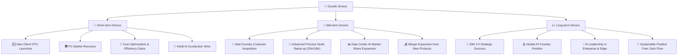

---

## 9. 風險矩陣

Intel的轉型之路充滿挑戰，面臨多重內外部風險。

### 9.1 風險評分矩陣

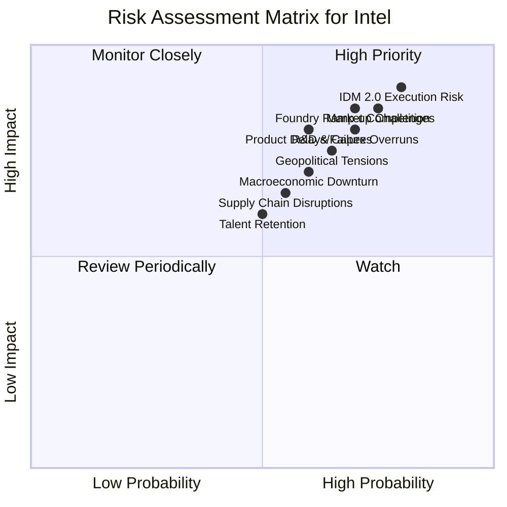

### 9.2 風險清單詳細分析

| # | 風險項目 | 發生機率 | 財務衝擊 | 風險評分 | 緩解措施 |
|---|----------|----------|----------|----------|----------|
| 1 | 🔴 **IDM 2.0 執行風險** | 高 (80%) | 極高 (-20%營收) | 🔴 9.0/10 | 強化管理團隊執行力，優化資本支出分配，與政府和客戶建立緊密合作關係。 |
| 2 | 🔴 **市場競爭加劇** | 高 (75%) | 高 (-15%營收) | 🔴 8.5/10 | 加速技術創新，提升產品性能和性價比，拓展AI和代工等新興市場，差異化競爭。 |
| 3 | 🟡 **研發與資本支出超支** | 高 (70%) | 高 (-10%利潤) | 🔴 8.0/10 | 嚴格控制項目預算，優化晶圓廠建設和設備採購流程，提升研發投入產出效率。 |
| 4 | 🟡 **宏觀經濟下行與半導體週期** | 中 (60%) | 中 (-10%營收) | 🟡 7.0/10 | 保持健康的資產負債表和充足的現金流，多元化業務組合，降低對單一市場的依賴。 |
| 5 | 🟡 **地緣政治風險** | 中 (65%) | 中 (-8%營收) | 🟡 7.5/10 | 建立多元化的供應鏈和生產基地，遵守國際貿易法規，與政府保持良好溝通。 |
| 6 | 🟡 **產品開發延遲或失敗** | 中 (60%) | 中 (-7%營收) | 🟡 7.0/10 | 加強研發管理和質量控制，實施嚴格的產品測試流程，建立應急預案。 |
| 7 | 🟡 **Foundry業務拓展不及預期** | 高 (70%) | 中 (-5%營收) | 🟡 7.5/10 | 積極爭取外部客戶訂單，展示技術領先優勢，提供有競爭力的服務和定價。 |
| 8 | 🟢 **人才流失與招聘困難** | 中 (50%) | 低 (-3%利潤) | 🟡 6.0/10 | 建立有競爭力的薪酬福利體系，提供良好的職業發展機會，強化企業文化。 |

---

## 10. 投資建議

### 10.1 最終綜合評級雷達圖

```
╔══════════════════════════════════════════════════════════════════╗
║                ✅ Intel Corporation 綜合評級雷達圖              ║
╠══════════════════════════════════════════════════════════════════╣
║                                                                  ║
║  基本面強度: 6.0 ▓▓▓▓▓▓▓▓▓▓▓▓░░░░░░░░                            ║
║  成長動能:   7.0 ▓▓▓▓▓▓▓▓▓▓▓▓▓▓░░░░░░                            ║
║  獲利品質:   4.0 ▓▓▓▓▓▓▓▓░░░░░░░░░░░░                            ║
║  財務健康:   7.0 ▓▓▓▓▓▓▓▓▓▓▓▓▓▓░░░░░░                            ║
║  估值合理性: 5.0 ▓▓▓▓▓▓▓▓▓▓░░░░░░░░░░                            ║
║  護城河深度: 6.8 ▓▓▓▓▓▓▓▓▓▓▓▓▓▓░░░░░░                            ║
║  管理層執行: 7.0 ▓▓▓▓▓▓▓▓▓▓▓▓▓▓░░░░░░                            ║
║  技術創新力: 7.0 ▓▓▓▓▓▓▓▓▓▓▓▓▓▓░░░░░░                            ║
║                                                                  ║
║  🏆 綜合評級：🟡 持有 (6.5/10)                                   ║
╚══════════════════════════════════════════════════════════════════╝
```

### 10.2 目標價與隱含報酬率

根據DCF敏感性分析，並結合同業比較和定性分析，我們給出以下目標價區間。

| 情境 | 目標價 ($) | 隱含報酬率 (%) | 機率權重 (%) |
|------|------------|----------------|--------------|
| 🔴 **悲觀情境** | $100 | -18.17% | 30% |
| 🟡 **基準情境** | $125 | +2.29% | 50% |
| 🟢 **樂觀情境** | $150 | +22.75% | 20% |
| **加權平均目標價** | **$122.5** | **+0.25%** | **100%** |

目前股價$122.20已接近加權平均目標價，顯示市場已充分反映了對Intel轉型成功的預期。因此，我們給予**持有 (Hold)** 評級。

### 10.3 買入時機與觸發因素

```
╔══════════════════════════════════════════════════════════════════╗
║                  ✅ 買入觸發因素 Checklist                      ║
╠══════════════════════════════════════════════════════════════════╣
║                                                                  ║
║  立即買入觸發條件（多數符合）：                                  ║
║  ☐ 股價跌至$100以下，提供更大安全邊際                           ║
║  ☐ 顯著的營收加速增長 (連續兩季YoY超過10%)                       ║
║  ☐ 毛利率持續改善並重回40%以上                                  ║
║  ☐ 自由現金流轉正，且持續增長                                  ║
║  ☐ Intel Foundry業務獲得大型外部客戶訂單的明確證明               ║
║  ☐ 先進製程(如Intel 18A)取得重大技術突破且量產進度超預期         ║
║                                                                  ║
║  加碼觸發條件（出現以下任一）：                                  ║
║  ☐ AI加速器產品市佔率超出市場預期                               ║
║  ☐ 成功剝離非核心資產，優化資本結構                               ║
║  ☐ 提升股東回報政策（如恢復股息或啟動股票回購）                   ║
║                                                                  ║
║  減碼/停損觸發條件（出現以下任一）：                             ║
║  ☐ IDM 2.0戰略執行延誤，製程技術追趕失敗                         ║
║  ☐ 營收持續下滑，且利潤率進一步惡化                             ║
║  ☐ 自由現金流持續為負且惡化，現金儲備快速消耗                     ║
║  ☐ 市場競爭加劇導致核心業務市場份額加速流失                       ║
║  ☐ 宏觀經濟顯著惡化，對半導體需求造成嚴重衝擊                     ║
╚══════════════════════════════════════════════════════════════════╝
```

### 10.4 投資人適配度分析

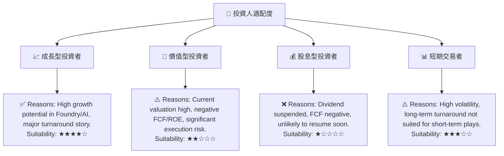

### 10.5 關鍵監控指標

| 監控類型 | 指標 | 關注點 | 頻率 |
|----------|------|--------|------|
| **營運表現** | 營收成長率 (YoY, QoQ) | 核心業務市場份額，新業務貢獻 | 季度 |
| **獲利能力** | 毛利率、營業利益率 | 製程良率，成本控制，產品組合優化 | 季度 |
| **資本效率** | 自由現金流 (FCF) | 資本支出效率，現金流轉正時程 | 季度/年度 |
| **技術進展** | 製程節點進度 (20A/18A) | 量產良率，性能指標 | 半年度/年度 |
| **市場份額** | PC CPU, Server CPU, AI晶片市佔率 | 競爭態勢，新產品接受度 | 季度/年度 |
| **Foundry業務** | 外部客戶訂單，營收貢獻 | 戰略執行，市場認可度 | 季度/年度 |
| **財務健康** | 淨債務水平，流動性比率 | 融資需求，償債能力 | 季度 |

---

> **免責聲明**：本報告為 AI 自動生成，僅供研究參考，不構成投資建議。投資有風險，入市需謹慎。