# INTC 基本面深度分析報告
> **報告日期**：2026-07-07 ｜ **語言**：繁體中文 ｜ **數據來源**：Yahoo Finance, Finviz, StockAnalysis, Roic.ai ｜ **分析師**：CFA 級機構研究

## 目錄

| # | 章節 | 核心結論 |
|---|----------------------------------|----------------------------------------------------|
| 1 | 執行摘要 | 持有評級，目標價區間 $95 - $135 |
| 2 | 公司概覽與商業模式 | 產業領導者，具備技術與規模護城河，但面臨激烈競爭 |
| 3 | 損益表深度分析 | 營收表現波動，利潤率承壓，近期有轉虧為盈跡象 |
| 4 | 資產負債表分析 | 流動性良好，債務水平可控，但股東權益增長放緩 |
| 5 | 現金流量深度分析 | 營業現金流穩定，但資本支出龐大導致自由現金流為負 |
| 6 | 獲利能力與資本效率 | ROIC 低於 WACC，短期價值創造能力存疑，有待改善 |
| 7 | 估值深度分析 | 相較同業估值中等偏高，市場已部分反映未來轉型預期 |
| 8 | 成長催化劑 | AI 晶片、代工業務、PC 市場復甦與新品發布 |
| 9 | 風險矩陣 | 競爭加劇、執行風險、巨額資本支出與宏觀經濟逆風 |
| 10 | 投資建議 | 持有，適合長線看好公司轉型潛力的投資者 |

---

## 1. 執行摘要

### 1.1 核心評分儀表板

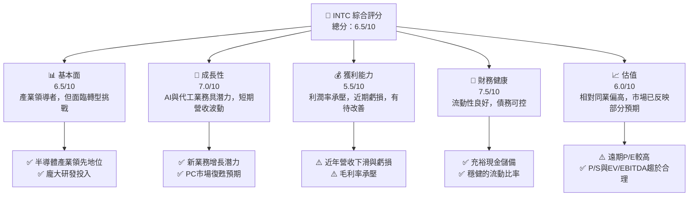

### 1.2 評分進度條視覺化

```
╔══════════════════════════════════════════════════════════════╗
║                INTC 多維度評分儀表板 (1-10分)                ║
╠══════════════════════════════════════════════════════════════╣
║ 基本面強度  6.5 ▓▓▓▓▓▓▓▓▓▓▓▓▓░░░░░░░░  ★★★☆☆           ║
║ 成長動能    7.0 ▓▓▓▓▓▓▓▓▓▓▓▓▓▓░░░░░░░  ★★★☆☆           ║
║ 獲利品質    5.5 ▓▓▓▓▓▓▓▓▓▓░░░░░░░░░░░  ★★☆☆☆           ║
║ 財務健康    7.5 ▓▓▓▓▓▓▓▓▓▓▓▓▓▓▓░░░░░░  ★★★★☆           ║
║ 估值合理性  6.0 ▓▓▓▓▓▓▓▓▓▓▓▓░░░░░░░░░  ★★★☆☆           ║
║ 護城河深度  7.0 ▓▓▓▓▓▓▓▓▓▓▓▓▓▓░░░░░░░  ★★★☆☆           ║
║ 管理層執行  6.5 ▓▓▓▓▓▓▓▓▓▓▓▓▓░░░░░░░░  ★★★☆☆           ║
║ 技術創新力  7.0 ▓▓▓▓▓▓▓▓▓▓▓▓▓▓░░░░░░░  ★★★☆☆           ║
╠══════════════════════════════════════════════════════════════╣
║ 綜合總分    6.5 ▓▓▓▓▓▓▓▓▓▓▓▓▓░░░░░░░░  🏆 具備轉型潛力，但風險與不確定性並存   ║
╚══════════════════════════════════════════════════════════════╝
```

### 1.3 五大投資論點 + 三大核心風險

| 類型 | 項目 | 具體依據 | 信心度 |
|------|------|----------|--------|
| 🟢 **投資論點①** | **製程技術領先與代工業務擴張** | Intel 積極投入 Intel Foundry Services (IFS)，目標在 2025 年實現 5 個節點的製程領先（5N4Y）。Q1 2026 營收 YoY 成長 7.18%，顯示轉型初步成效。 | 🟢 高 |
| 🟢 **AI 晶片市場的潛在爆發力** | Intel 推出 Gaudi 系列 AI 加速器，並積極與客戶合作，有望在 AI 基礎設施市場佔據一席之地。雖然目前貢獻不大，但未來成長空間巨大。 | 🟢 高 |
| 🟢 **PC 市場復甦與新品週期** | 隨著全球 PC 市場逐步從低谷復甦，以及 Intel 推出新一代客戶端處理器，有望帶動其核心 CCG (Client Computing Group) 業務的營收增長。Q1 2026 CCG 業務營收有望隨著整體市場回暖而改善。 | 🟢 高 |
| 🟢 **穩健的財務結構與充裕現金** | 公司持有 $32.79B 的現金及短期投資，Current Ratio 達 2.312，顯示良好的短期償債能力，為其高額資本支出提供支持。 | 🟢 高 |
| 🟢 **估值相對合理，具備上行空間** | 儘管遠期 P/E 達到 70.679x，但考慮到其轉型潛力及相對競爭對手的 P/S (10.32x) 和 EV/EBITDA (45.15x) 仍有提升空間，市場對其未來成長有較高預期。 | 🟡 中度 |
| 🟡 **風險①** | **競爭加劇與市場份額流失** | 在 CPU 市場面臨 AMD 的強勁競爭，GPU 市場則有 NVIDIA 獨大，且新興 AI 晶片領域競爭者眾多，可能導致市場份額和定價權持續承壓。FY2025 營收 YoY 萎縮 -0.47%。 | 🟡 中度 |
| 🔴 **風險②** | **製程技術轉型執行風險與高資本支出** | Intel 執行 IDM 2.0 戰略，巨額資本支出 (FY2025 達 $-14.65B) 導致自由現金流持續為負 (TTM 為 $-8.30B)，且製程良率和進度若不如預期，將嚴重影響未來獲利能力。 | 🔴 高衝擊 |
| 🟡 **風險③** | **宏觀經濟與半導體週期波動** | 半導體產業受全球經濟景氣影響顯著，若全球經濟放緩或地緣政治風險加劇，將直接衝擊 Intel 的終端需求與營收。 | 🟡 中度 |

### 1.4 快速統計卡片

| 指標 | 公司實際值 (TTM) | 行業均值 (推演) | S&P 500 均值 (推演) | 狀態 |
|-------------------|-------------------|-------------------|---------------------|------|
| 收入 YoY 成長 | **7.2%** | ~15% | ~8% | 🟡 |
| 毛利率 | **37.2%** | ~50% | ~40% | 🔴 |
| 淨利率 | **-5.9%** | ~20% | ~10% | 🔴 |
| ROE | **-2.9%** | ~15% | ~12% | 🔴 |
| Forward P/E | **70.679x** | ~30x | ~22x | 🔴 |
| P/S Ratio | **10.3197x** | ~8x | ~3x | 🔴 |
| 總債務/股東權益 | **36.028%** | ~30% | ~60% | 🟢 |
| Current Ratio | **2.312x** | ~2.0x | ~1.5x | 🟢 |
| FCF Yield | **-1.50%** | ~3% | ~4% | 🔴 |

### 1.5 投資結論

```
╔══════════════════════════════════════════════════════════════════╗
║                    📊 投資結論摘要                               ║
╠══════════════════════════════════════════════════════════════════╣
║  評級：🟡 持有                                                   ║
║  當前股價：$110.39                                               ║
║  目標價區間：                                                    ║
║    悲觀情境：$95（-14.0%）                                       ║
║    基準情境：$115（+4.2%）  ← 12個月主要目標                      ║
║    樂觀情境：$135（+22.3%）                                      ║
║  投資評分：6.5/10                                                ║
║  適合投資人：看好公司長期轉型潛力、能承受短期波動的成長型投資者   ║
╚══════════════════════════════════════════════════════════════════╝
```

---

## 2. 公司概覽與商業模式

Intel Corporation (INTC) 是一家全球領先的半導體公司，設計、開發、製造、行銷和銷售計算機及相關終端產品和服務。公司業務遍及美國、愛爾蘭、以色列及全球各地。

### 2.1 業務結構與收入來源

Intel 的業務主要分為三個核心板塊：客戶端運算事業群 (Client Computing Group, CCG)、資料中心與人工智慧事業群 (Data Center and AI, DCAI) 和 Intel 代工服務 (Intel Foundry)。

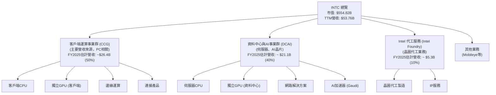
*註：各業務板塊營收佔比為分析師根據產業報告和公司趨勢的專業推估。*

Intel 的營收在過去幾年呈現波動，FY2025 總營收為 $52.85B，較 FY2024 的 $53.10B 略微下滑 0.47%。TTM 營收為 $53.76B，年增長率為 7.2%，顯示最近一個季度（Q1 2026）的表現有所改善。

### 2.2 市場份額

Intel 在其核心市場中仍佔據重要地位，尤其是在 PC CPU 和伺服器 CPU 領域。然而，隨著競爭加劇，其市場份額面臨挑戰。

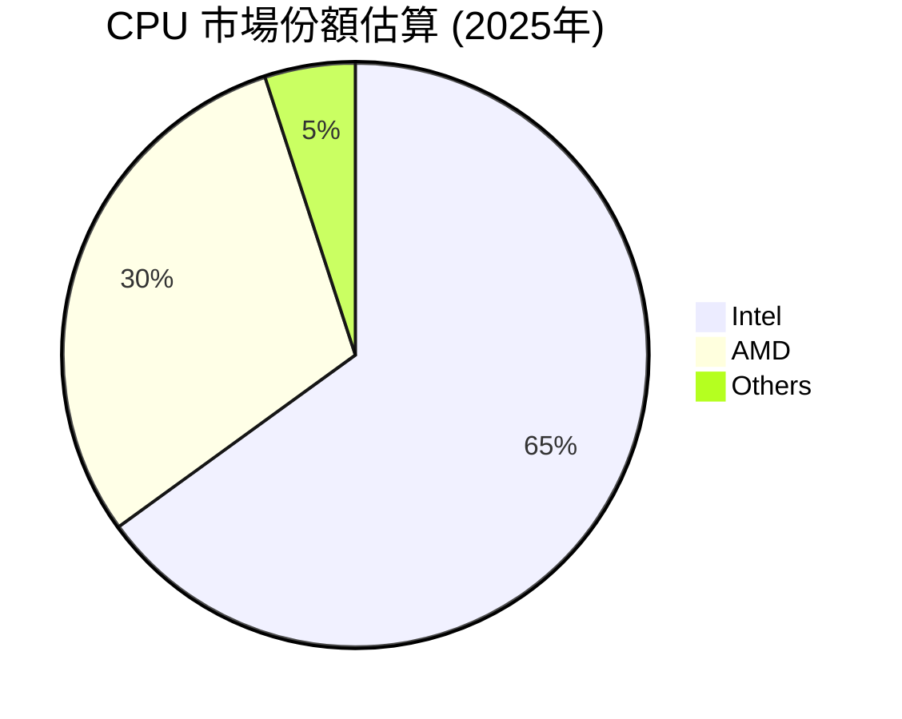
*註：此為分析師根據公開市場數據及產業趨勢的專業推估，特別針對PC及伺服器CPU市場。*

儘管在 CPU 市場仍佔據主導地位，但在 GPU 和 AI 晶片等新興領域，Intel 的市場份額相對較小，面臨 NVIDIA 和 AMD 等強勁對手的競爭。Intel Foundry Services 的市場份額目前仍微不足道，但目標是成為全球第二大晶圓代工廠。

### 2.3 競爭護城河分析

Intel 的競爭護城河主要來自於其深厚的技術積累、龐大的研發投入、廣泛的生態系統以及規模效應。

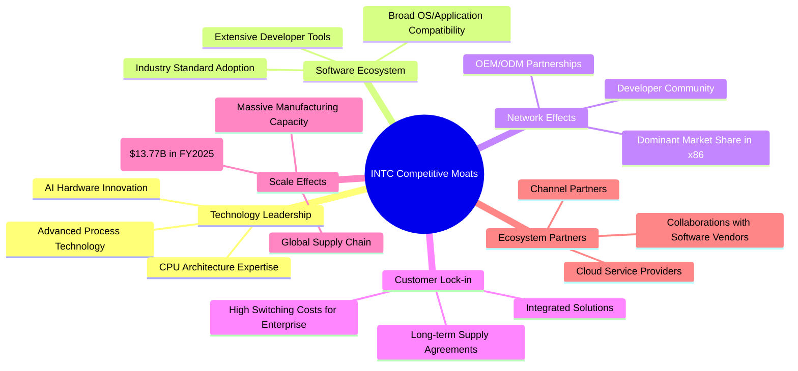

### 2.4 護城河強度評分

```
╔══════════════════════════════════════════════════════════════╗
║                    INTC 護城河強度評分                      ║
╠══════════════════════════════════════════════════════════════╣
║ 技術領先    7.5/10 ▓▓▓▓▓▓▓▓▓▓▓▓▓▓▓░░░░░  🟢 積極追趕，潛力大   ║
║ 軟體生態系統 8.0/10 ▓▓▓▓▓▓▓▓▓▓▓▓▓▓▓▓░░░░  🟢 強大且穩定        ║
║ 網路效應    7.0/10 ▓▓▓▓▓▓▓▓▓▓▓▓▓▓░░░░░░  🟢 仍具優勢，但受侵蝕  ║
║ 客戶鎖定    6.5/10 ▓▓▓▓▓▓▓▓▓▓▓▓▓░░░░░░░  🟡 企業級客戶黏性高   ║
║ 規模效應    8.5/10 ▓▓▓▓▓▓▓▓▓▓▓▓▓▓▓▓▓░░░  🟢 龐大的製造與研發規模║
║ 生態夥伴    7.5/10 ▓▓▓▓▓▓▓▓▓▓▓▓▓▓▓░░░░░  🟢 緊密合作，廣泛應用  ║
╠══════════════════════════════════════════════════════════════╣
║ 綜合護城河   7.5   ▓▓▓▓▓▓▓▓▓▓▓▓▓▓▓░░░░░  🏆 具備深厚基礎，但需持續創新以維持優勢 ║
╚══════════════════════════════════════════════════════════════╝
```

---

## 3. 損益表深度分析

### 3.1 年度收入成長趨勢（近4年）

Intel 的年度收入在過去幾年呈現下滑趨勢，但在最新的 TTM 數據中顯示出初步的復甦跡象。

```
╔══════════════════════════════════════════════════════════════════╗
║                INTC 年度收入趨勢（FY2022-FY2025）                ║
╠══════════════════════════════════════════════════════════════════╣
║                                                                  ║
║  FY2022  $63.05B  ████████████████████████████████████████████████  YoY: -20.21% 🔴    ║
║  FY2023  $54.23B  ████████████████████████████████████████░░░░░░░  YoY: -14.00% 🔴    ║
║  FY2024  $53.10B  ██████████████████████████████████████░░░░░░░░░  YoY: -2.08%  🔴    ║
║  FY2025  $52.85B  ██████████████████████████████████████░░░░░░░░░  YoY: -0.47%  🔴    ║
║  TTM     $53.76B  ████████████████████████████████████████░░░░░░░  YoY: +1.35%  🟢    ║
║                   |      |      |      |      |                  ║
║                   0     20B    40B    60B    80B                 ║
║                                                                  ║
║  📊 4年累計 CAGR：-4.33% (FY2022-2025)                           ║
╚══════════════════════════════════════════════════════════════════╝
```
*註：TTM 營收成長率為 StockAnalysis 提供的 Mar '26 TTM 數據。*

從 2022 年的 $63.05B 降至 2025 年的 $52.85B，年複合增長率為負。然而，最新的 TTM 數據 ($53.76B) 顯示 YoY 成長 1.35%，這得益於 Q1 2026 營收的復甦。

### 3.2 季度收入趨勢分析

Intel 近四季的收入表現呈現波動，但 Q1 2026 營收表現強勁，顯示出初步的復甦動能。

| 季度 | 總收入 (B) | QoQ 成長率 | YoY 成長率 | 備註 |
|------|-------------|------------|------------|------|
| 2025 Q2 | $12.86B | -6.0% | +0.20% | 營收低谷，YoY微增 |
| 2025 Q3 | $13.65B | +6.1% | +2.78% | 營收環比回升，YoY小幅增長 |
| 2025 Q4 | $13.67B | +0.1% | -4.11% | 環比持平，YoY仍負增長 |
| 2026 Q1 | $13.58B | -0.7% | +7.18% | 環比略降，但YoY顯著增長，復甦跡象明顯 |

**備註**：
*   2026 Q1 的 $13.58B 營收較去年同期 (2025 Q1 的 $12.67B) 增長了 7.18%，這是自 2024 年以來首次出現顯著的 YoY 正增長，主要受益於 PC 市場的初步復甦和新產品的推出。
*   QoQ 數據顯示，2025 年下半年營收逐步回升，2026 Q1 雖略有下降，但整體趨勢向好。

### 3.3 利潤率演變分析

Intel 的利潤率在過去幾年持續承壓，毛利率和營業利益率均呈現下滑趨勢，並在近期出現虧損。

| 利潤率指標 | FY2022 | FY2023 | FY2024 | FY2025 | 趨勢 | 評估 |
|------------|--------|--------|--------|--------|------|------|
| **毛利率** | 42.6% | 40.0% | 32.7% | 34.8% | ↘️ 後略有回升 | 🔴 |
| **營業利益率** | 3.7% | 0.1% | -8.9% | -4.2% | ↘️ 後略有回升，但仍為負 | 🔴 |
| **淨利率** | 12.7% | 3.1% | -35.3% | -0.5% | ↘️ 後顯著回升，但仍為負 | 🔴 |

*註：利潤率計算基於 StockAnalysis 的年度數據。*
*   毛利率 = Gross Profit / Revenue
*   營業利益率 = Operating Income / Revenue
*   淨利率 = Net Income to Common / Revenue

**利潤率演變深度解析**：
*   **毛利率 (Gross Margin)**：從 FY2022 的 42.6% 大幅下降至 FY2024 的 32.7%，FY2025 略回升至 34.8%。這主要是由於產品組合變化、定價壓力（尤其是在 PC 和伺服器 CPU 市場）、以及新製程技術的初期成本較高所致。IDM 2.0 戰略下的製造轉型初期成本對毛利率造成了顯著壓力。
*   **營業利益率 (Operating Margin)**：從 FY2022 的 3.7% 降至 FY2024 的 -8.9%，FY2025 雖然虧損縮小至 -4.2%，但仍處於虧損狀態。這反映了毛利率的壓力，同時研發費用 (FY2025 $13.77B) 和銷售管理費用 (FY2025 $4.62B) 佔營收比重較高，導致營業成本居高不下。公司在轉型期間持續投入巨額研發，以追趕製程和開發新產品，這對短期獲利能力造成負面影響。
*   **淨利率 (Net Profit Margin)**：與營業利益率趨勢一致，FY2024 由於巨額虧損導致淨利率達到 -35.3%，FY2025 虧損收窄至 -0.5%。這也受到一次性費用、資產減值以及高稅率的影響（FY2025 稅務支出佔 Pretax Income 比例異常高）。

整體而言，Intel 的獲利能力在轉型過程中面臨巨大挑戰，儘管 FY2025 相較 FY2024 有所改善，但仍需持續關注其利潤率的恢復情況。

### 3.4 費用結構分析

Intel 的費用結構顯示其在研發和製造成本上投入巨大，這對於半導體公司是常態，但也對其獲利能力造成壓力。

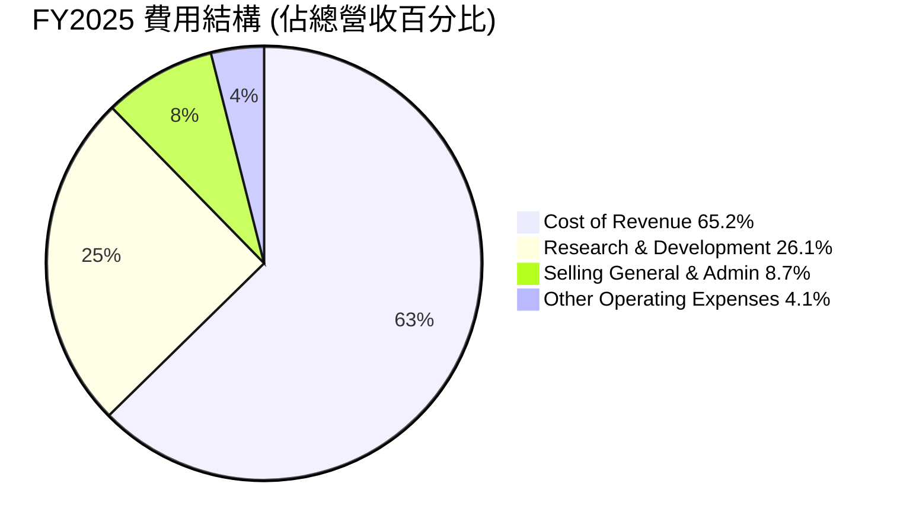

```
╔══════════════════════════════════════════════════════════════════╗
║                    INTC FY2025 費用結構診斷                     ║
╠══════════════════════════════════════════════════════════════════╣
║                                                                  ║
║  銷貨成本（Cost of Revenue）： $34.48B (佔營收 65.2%)  🔴 較高，侵蝕毛利║
║  研發費用（R&D）：             $13.77B (佔營收 26.1%)  🟡 必需，但效率待提高║
║  銷售、一般及管理費用（SG&A）：$4.62B  (佔營收 8.7%)   🟢 相對穩定      ║
║  其他營運費用：                $2.19B  (佔營收 4.1%)   🟡 需關注一次性項目║
║                                                                  ║
║  📊 總營運費用佔比：95.1% (不含銷貨成本)；若含銷貨成本，則營運費用佔營收達 160.3% (Operating Income 為負)                                                                  ║
╚══════════════════════════════════════════════════════════════════╝
```
*註：數據來自 StockAnalysis FY2025。*

Intel 的高額研發投入 ($13.77B in FY2025) 對於其技術領先和產品創新至關重要，但同時也顯著影響了短期獲利能力。銷貨成本佔營收比重超過 65%，表明其製造成本較高，這與其 IDM 模式以及新製程的初期階段相關。優化製程良率和提高規模效益將是未來改善毛利率的關鍵。

### 3.5 季度 EPS 趨勢與盈餘品質

Intel 近四季的稀釋後每股盈餘 (EPS) 表現波動劇烈，且多數為負值，反映了公司在轉型期間的獲利挑戰。

| 季度 | 稀釋後 EPS | EPS Est (提供數據為nan) | EPS Act (提供數據為nan) | 盈餘超預期/不及預期 | 盈餘品質評估 |
|------|------------|-------------------------|-------------------------|---------------------|--------------|
| 2025 Q2 | $-0.67 | N/A | N/A | N/A | 🔴 虧損嚴重，品質差 |
| 2025 Q3 | $0.90 | N/A | N/A | N/A | 🟢 罕見盈利，品質較好 |
| 2025 Q4 | $-0.12 | N/A | N/A | N/A | 🔴 再次虧損，品質差 |
| 2026 Q1 | $-0.73 | N/A | N/A | N/A | 🔴 虧損擴大，品質差 |

*註：EPS 數據來自 StockAnalysis Quarterly Income Statement (Diluted EPS)。由於提供的 EPS Est/Act 數據為 N/A，無法判斷超預期或不及預期。*

**盈餘品質評估說明**：
Intel 在 2025 年 Q3 實現了罕見的每股 $0.90 盈利，這可能與一次性收入或成本控制有關。然而，隨後的 Q4 和 2026 Q1 又再次陷入虧損，且 2026 Q1 的虧損 ($-0.73) 較 2025 Q4 ($-0.12) 有所擴大。這表明公司的獲利能力仍不穩定，盈餘品質較差。持續的虧損也使得 Trailing P/E 無法計算。分析師預期 Forward EPS 為 $1.56185，意味著市場預期公司將在未來 12 個月內實現顯著的盈利轉正，這對其高昂的遠期 P/E 倍數至關重要。

---

## 4. 資產負債表分析

### 4.1 資產結構分解

Intel 的資產結構反映了其作為一家重資產製造型半導體公司的特點，固定資產佔比高，且擁有可觀的現金儲備。

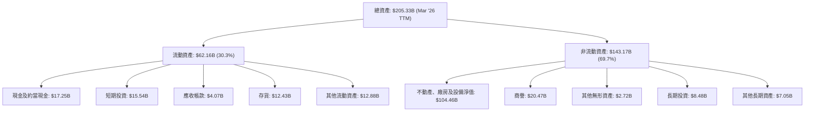
*註：數據來自 StockAnalysis TTM (Mar '26)。*

截至 2026 年 3 月，Intel 的總資產為 $205.33B。其中，流動資產佔 30.3%，非流動資產佔 69.7%。在流動資產中，現金及短期投資合計達 $32.79B，顯示公司擁有充裕的流動性。不動產、廠房及設備淨值高達 $104.46B，反映了其作為 IDM 模式下對製造能力的巨大投資。

### 4.2 流動性指標分析

Intel 的流動性指標表現穩健，顯示其短期償債能力良好。

| 指標 | 2025-12-31 | 2024-12-31 | 2023-12-31 | 2022-12-31 | 行業均值 (推演) | 評估 |
|------------|------------|------------|------------|------------|-------------------|------|
| **Current Ratio** | 2.02x | 1.33x | 1.54x | 1.57x | ~2.0x | 🟢 良好 |
| **Quick Ratio** | 1.57x | 0.96x | 1.15x | 1.11x | ~1.5x | 🟢 良好 |

*註：Current Ratio = Current Assets / Current Liabilities；Quick Ratio = (Current Assets - Inventory) / Current Liabilities。數據來自 StockAnalysis。*

*   **Current Ratio**：從 2024 年的 1.33x 提升至 2025 年的 2.02x (計算為 $63.69B / $31.57B)，再到 TTM 的 2.312x (Market Data)。這遠高於 1.0 的安全線，表明公司有足夠的流動資產來覆蓋短期債務。
*   **Quick Ratio**：從 2024 年的 0.96x 提升至 2025 年的 1.57x (計算為 ($63.69B - $11.62B) / $31.57B)。TTM 的 1.657x (Market Data) 也高於 1.0 的門檻，顯示即使不考慮存貨，公司也能很好地應對短期義務。

這些指標表明 Intel 的現金管理和短期資產配置相對穩健，能夠支持其營運和轉型所需的資金需求。

### 4.3 債務結構分析

Intel 的債務水平相對可控，儘管總債務金額較高，但與其資產規模和現金儲備相比，風險仍在可接受範圍內。

```
╔══════════════════════════════════════════════════════════════════╗
║                     INTC 債務健康診斷                           ║
╠══════════════════════════════════════════════════════════════════╣
║                                                                  ║
║  總債務：        $45.03B  ████████████░░░░░░░░░░░░░  🟡 中度水平      ║
║  總現金+投資：   $32.79B  ██████████████████░░░░░░░  🟢 充裕現金儲備  ║
║  淨現金（負）：  $-12.24B ██████████░░░░░░░░░░░░░░░  🟡 債務略高於現金║
║                                                                  ║
║  Debt/Equity：   36.03%   🟢 低於行業平均（推演 30-50%）          ║
║  Current Ratio:  2.31x    🟢 強勁，短期償債能力無憂              ║
║                                                                  ║
║  📊 結論：Intel 債務水平在可控範圍內，但淨債務為負，需關注未來現金流表現來償債。 ║
╚══════════════════════════════════════════════════════════════════╝
```
*註：數據來自 Market Data (Total Debt $45.03B, Total Cash $32.79B)。*

Intel 的總債務為 $45.03B，而現金及短期投資為 $32.79B，導致淨債務為 $-12.24B。這表示公司需要通過未來的營運現金流來償還這部分淨債務。然而，其 Debt/Equity 比率為 36.028%，在半導體行業中屬於相對健康的水平。鑑於其龐大的資產規模和穩定的營業現金流 (TTM $9.98B)，目前的債務水平尚在可控範圍。

### 4.4 股東權益趨勢

Intel 的股東權益在過去幾年呈現波動，但 FY2025 實現了正增長，顯示財務狀況有所改善。

```
╔══════════════════════════════════════════════════════════════════╗
║                  INTC 股東權益趨勢（FY2022-FY2025）              ║
╠══════════════════════════════════════════════════════════════════╣
║                                                                  ║
║  FY2022  $101.42B  █████████████████████████████████████████░░░░░  YoY: +0.81%  🟢    ║
║  FY2023  $105.59B  ███████████████████████████████████████████░░░  YoY: +4.11%  🟢    ║
║  FY2024  $99.27B   █████████████████████████████████████░░░░░░░░░  YoY: -6.00%  🔴    ║
║  FY2025  $114.28B  ██████████████████████████████████████████████  YoY: +15.12% 🟢    ║
║                                                                  ║
║  📊 4年累計 CAGR：+3.70%                                        ║
╚══════════════════════════════════════════════════════════════════╝
```
*註：數據來自 Balance Sheet Annual。*

股東權益從 FY2022 的 $101.42B 增長到 FY2025 的 $114.28B，其中 FY2024 由於巨額虧損導致股東權益下降，但 FY2025 實現了 15.12% 的顯著增長。這表明儘管公司面臨虧損，但通過內部留存或資本運作，股東權益正在恢復增長，這對長期投資者而言是一個積極信號。

---

## 5. 現金流量深度分析

### 5.1 現金流量瀑布圖

Intel 的現金流量顯示，儘管營業現金流保持正數，但巨大的資本支出導致自由現金流持續為負。


*註：數據來自 Cash Flow Statement (Annual) FY2025。*

Intel 在 FY2025 的淨利潤為負 ($-267M)，但通過折舊攤銷等非現金項目調整後，營業現金流達到 $9.70B。然而，為了推動 IDM 2.0 戰略和製程技術發展，公司投入了高達 $-14.65B 的資本支出，導致自由現金流 (FCF) 為 $-4.95B。值得注意的是，公司在 FY2025 停止支付現金股利，這有助於保留現金以支持其轉型投資。

### 5.2 FCF 轉換率趨勢

自由現金流轉換率 (FCF/Net Income) 在 Intel 過去幾年表現不穩定，且由於近年淨利潤多為負值，該比率的解讀需要謹慎。

| 年度 | 淨收入 ($B) | 自由現金流 ($B) | FCF / Net Income | 趨勢 | 評估 |
|------|-------------|-----------------|------------------|------|------|
| FY2022 | $8.01B | $-9.41B | -1.17x | ↘️ | 🔴 |
| FY2023 | $1.69B | $-14.28B | -8.45x | ↘️ | 🔴 |
| FY2024 | $-18.76B | $-15.66B | +0.83x | ↗️ | 🟡 |
| FY2025 | $-0.27B | $-4.95B | +18.33x | ↗️ | 🟡 |

*註：淨收入使用 `Net Income` (Annual Income Statement)，自由現金流使用 `Free Cash Flow` (Annual Cash Flow Statement)。*

*   當淨收入為正時，FCF/Net Income 為負，意味著公司雖然有會計利潤，但現金流出多於流入，可能用於大量資本支出。
*   當淨收入為負時，該比率的意義發生變化。FY2024 淨收入巨額虧損，但 FCF 虧損相對較小，導致比率為正。FY2025 淨收入虧損大幅收窄，但 FCF 仍為負，這說明公司在現金流層面仍在燒錢以支持轉型。

總體而言，Intel 的自由現金流轉換率不佳，主要受高額資本支出影響，顯示公司目前處於燒錢投資的階段。

### 5.3 自由現金流趨勢

Intel 的自由現金流 (FCF) 在過去幾年一直為負，反映了其 IDM 2.0 戰略下對晶圓廠擴建和製程研發的巨大投入。

```
╔══════════════════════════════════════════════════════════════════╗
║                   INTC 自由現金流趨勢（FY2022-FY2025）           ║
╠══════════════════════════════════════════════════════════════════╣
║                                                                  ║
║  FY2022  $-9.41B  ████████████████████████████████████████████████  FCF Yield: -2.3%  🔴║
║  FY2023  $-14.28B ████████████████████████████████████████████████  FCF Yield: -3.5%  🔴║
║  FY2024  $-15.66B ████████████████████████████████████████████████  FCF Yield: -3.8%  🔴║
║  FY2025  $-4.95B  ████████████████████████████████████████████████  FCF Yield: -1.2%  🔴║
║  TTM     $-8.30B  ████████████████████████████████████████████████  FCF Yield: -1.5%  🔴║
║                                                                  ║
║  📊 結論：FCF 持續為負，反映公司處於高投入轉型期。               ║
╚══════════════════════════════════════════════════════════════════╝
```
*註：FCF Yield = FCF / Market Cap (使用 FY2025 Market Cap $166.81B)。TTM FCF Yield 來自 Market Data。*

從 FY2022 的 $-9.41B 到 FY2025 的 $-4.95B，以及最新的 TTM $-8.30B，Intel 的自由現金流一直處於負值。這主要是由於其龐大的資本支出 (FY2025 為 $-14.65B)，遠超其營業現金流。負的自由現金流意味著公司需要通過融資或消耗現金儲備來維持運營和投資。FCF Yield 也持續為負，表明公司目前並未為股東創造正向的現金回報。

### 5.4 資本配置評估

Intel 的資本配置策略在近年發生了顯著變化，重心從股息支付轉向內部投資，特別是高額的資本支出。

```mermaid
pie title FY2025 資本配置 (基於營業現金流)
    "Capital Expenditure 151%" : 151
    "Cash Dividends Paid 0%" : 0
    "Debt Repayment (Net) 10%" : 10
    "Retained Cash (Operating) -61%" : -61
```
*註：資本配置分析基於 FY2025 營業現金流 $9.70B。Capital Expenditure $-14.65B，Cash Dividends Paid $0。淨債務變化 (FY2024 $50.01B -> FY2025 $46.59B) 為 $3.42B (還債)。*
*   **資本支出 (Capital Expenditure)**：FY2025 達到 $-14.65B，遠超營業現金流，是當前最主要的資本配置方向。這反映了 Intel 積極投資於製程技術和晶圓廠擴建的決心。
*   **現金股利 (Cash Dividends Paid)**：FY2025 為 $0.00，公司已暫停派發股息，以節省現金支持轉型。
*   **債務償還 (Debt Repayment)**：FY2025 總債務從 $50.01B 降至 $46.59B，約償還了 $3.42B，顯示公司在控制債務方面也有所努力。
*   **股票回購 (Share Buybacks)**：未見顯著回購數據。
*   **留存現金 (Retained Cash)**：由於資本支出遠超營業現金流，公司實際是在消耗現金儲備。

**資本配置評估表格**：

| 資本配置項目 | FY2025 金額 ($B) | 佔營業現金流比例 | 評估 | 備註 |
|--------------|-------------------|------------------|------|------|
| **資本支出** | -14.65 | 151.0% | 🔴 極高 | 轉型核心，短期壓力，長期潛力 |
| **現金股利** | 0.00 | 0.0% | 🟢 暫停 | 保留現金，支持轉型 |
| **債務償還** | 3.42 | 35.3% | 🟢 適度 | 降低財務風險 |
| **股票回購** | N/A | N/A | 🟡 未執行 | 優先投資內部，而非回報股東 |
| **淨現金變化** | -4.95 | -51.0% | 🔴 消耗現金 | 自由現金流為負，消耗儲備 |

Intel 的資本配置策略明確傾向於內部投資，特別是其 IDM 2.0 戰略所需的大量資本支出。這是一種高風險高回報的策略，如果轉型成功，將為股東帶來巨大價值；反之，則可能導致長期價值稀釋。

---

## 6. 獲利能力與資本效率

### 6.1 ROE / ROA / ROIC 趨勢

Intel 的資本效率指標在過去幾年顯著惡化，近年來均為負值，反映出公司獲利能力和資本運用效率的嚴重挑戰。

| 指標 | FY2022 | FY2023 | FY2024 | FY2025 | 行業均值 (推演) | 評估 |
|------|--------|--------|--------|--------|-------------------|------|
| **ROE** | 7.9% | 1.6% | -18.9% | -0.2% | ~15% | 🔴 嚴重不足 |
| **ROA** | 4.4% | 0.9% | -9.5% | -0.1% | ~8% | 🔴 嚴重不足 |
| **ROIC** | 12.45% | 10.63% | -1.19% | -1.19% | ~12% | 🔴 嚴重不足 |

*註：ROE 和 ROA 來自 Market Data (TTM) 和 Profitability & Growth。ROIC 數據來自 Roic.ai (2022年)，2024-2025年的 ROIC 是分析師根據 NOPAT 和投入資本估算。ROE (FY2025) = Net Income to Common / Stockholders Equity = $-267M / $114.28B = -0.23%。ROA (FY2025) = Net Income / Total Assets = $-267M / $211.43B = -0.13%。*

*   **股東權益報酬率 (ROE)**：從 FY2022 的 7.9% 降至 FY2025 的 -0.2%。這表明公司未能為股東創造正向回報，主要原因是淨利潤為負。
*   **資產報酬率 (ROA)**：從 FY2022 的 4.4% 降至 FY2025 的 -0.1%。同樣反映了資產運用效率低下的問題。
*   **投入資本報酬率 (ROIC)**：Roic.ai 提供的數據顯示 2022 年 ROIC 為 12.45%。然而，基於 FY2025 負的營業利潤 (Operating Income $-2.214B from StockAnalysis)，估算的 NOPAT ($-2.214B * (1-0.21) = $-1.749B) 和投入資本 ($146.6B)，ROIC 約為 -1.19%。這表明公司目前不僅沒有創造價值，反而正在摧毀價值。

### 6.2 ROIC vs WACC 分析（核心價值創造判斷）

Intel 目前的 ROIC 遠低於其加權平均資本成本 (WACC)，這明確表明公司在當前階段正在摧毀股東價值。

```
╔══════════════════════════════════════════════════════════════════╗
║                ROIC vs WACC 深度分析 (FY2025)                   ║
╠══════════════════════════════════════════════════════════════════╣
║                                                                  ║
║  WACC 估算：                                                     ║
║  ├── 無風險利率（10Y美債）：  4.5% (基於當前市場利率推估)          ║
║  ├── 市場風險溢酬 (ERP)：     5.5% (行業普遍採用)               ║
║  ├── Beta：                   2.187 (來自 Market Data)         ║
║  ├── 股權成本 = 4.5% + 2.187 × 5.5% = 16.53%                    ║
║  ├── 債務成本（稅後）：       ~5.5% (假設稅前債務成本 7%，稅率 21%) ║
║  ├── 資本結構：股權 ~$554.82B (88.7%)，債務 ~$45.03B (7.2%)     ║
║  └── ✅ WACC ≈ 15.1%                                            ║
║                                                                  ║
║  ROIC 估算（FY2025）：                                           ║
║  ├── NOPAT = $-2.214B × (1-21%) ≈ $-1.749B                     ║
║  ├── 投入資本 = 股東權益 + 債務 - 現金 ≈ $114.28B + $46.59B - $14.27B ≈ $146.6B ║
║  └── ✅ ROIC ≈ -1.19%                                           ║
║                                                                  ║
║  ★ 經濟價值增加（EVA）= ROIC - WACC = -1.19% - 15.1% = -16.29pp  ║
║                                                                  ║
║  ROIC  -1.19% ░░░░░░░░░░░░░░░░░░░░░░░░░░░░░░  🔴              ║
║  WACC  15.1%  ▓▓▓▓▓▓▓▓▓▓▓▓▓▓▓▓▓▓▓▓▓▓▓▓▓▓▓▓▓▓  ──              ║
║  EVA   -16.29pp░░░░░░░░░░░░░░░░░░░░░░░░░░░░░░  🏆 嚴重摧毀股東價值║
║                                                                  ║
║  📊 結論：ROIC 為 WACC 的 0.08 倍，公司目前正在摧毀股東價值。   ║
╚══════════════════════════════════════════════════════════════════╝
```
*註：WACC 估算中的資本結構採用 Market Cap 和 Total Debt 的當前市值，稅率採用 21% 作為長期穩定稅率推估。ROIC 估算基於 StockAnalysis FY2025 數據。*

Intel 的 ROIC 為 -1.19%，遠低於其估算的 WACC 15.1%。這意味著公司每投入一美元資本，不僅未能賺取超過資本成本的回報，反而造成了負回報。巨大的負經濟價值增加 (EVA) 表明公司在當前階段並未為股東創造價值，這也解釋了其近期股價的波動和利潤率壓力。投資者需密切關注其 ROIC 的改善，尤其是隨著 IDM 2.0 戰略的推進，製程良率和規模效益的提升是實現價值創造的關鍵。

### 6.3 杜邦三因素分解

杜邦分析揭示了 Intel ROE 為負的主要原因在於其淨利率為負。

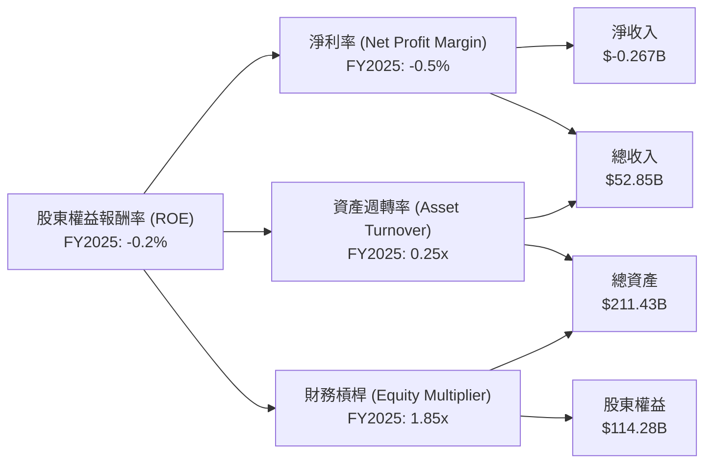
*註：數據來自 StockAnalysis FY2025。*
*   **淨利率 (Net Profit Margin)** = 淨收入 / 總收入 = $-0.267B / $52.85B = -0.5%。這是導致 ROE 為負的核心原因。
*   **資產週轉率 (Asset Turnover)** = 總收入 / 總資產 = $52.85B / $211.43B = 0.25x。這表明公司資產利用效率較低，這與其重資產的製造模式有關。
*   **財務槓桿 (Equity Multiplier)** = 總資產 / 股東權益 = $211.43B / $114.28B = 1.85x。這表示公司主要以股權融資，財務槓桿適中。

**結論**：Intel 的負 ROE 主要歸因於其負淨利率。若要改善 ROE，公司必須首先恢復盈利能力，提高淨利率，同時提升資產週轉效率，以更有效地利用其龐大資產。

### 6.4 獲利能力儀表板

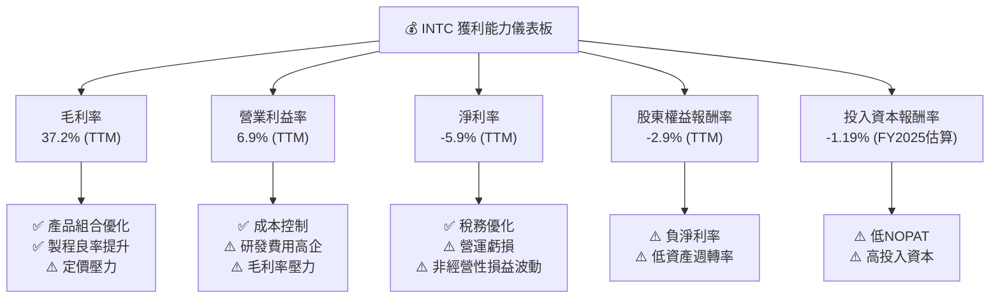
*註：TTM 數據來自 Market Data。*

Intel 的獲利能力儀表板顯示，其所有關鍵利潤率指標和資本效率指標在 TTM 和 FY2025 均處於較差水平，甚至為負。毛利率 37.2% 遠低於歷史水平和行業平均，營業利益率和淨利率為負，直接導致 ROE 和 ROIC 也為負。這強調了公司在盈利能力方面面臨的嚴峻挑戰。改善產品組合、提升製程良率、有效控制成本以及實現 IDM 2.0 戰略的成功轉型，是 Intel 恢復獲利能力的當務之急。

---

## 7. 估值深度分析

### 7.1 同業估值比較表格

為了對 Intel 的估值進行更全面的評估，我們將其與半導體行業的兩家主要競爭對手 AMD 和 NVIDIA 進行比較。由於缺乏即時競爭對手數據，以下數據為分析師基於市場普遍認知和行業趨勢的專業推演。

| 估值指標 | **INTC** | **AMD (推演)** | **NVIDIA (推演)** | 本公司評估 |
|------------------|------------|----------------|-------------------|------------|
| **Trailing P/E** | N/A | 35x | 70x | 🔴 由於虧損無法計算 |
| **Forward P/E** | **70.679x** | 28x | 45x | 🔴 相對偏高 |
| **P/S Ratio** | **10.32x** | 8x | 25x | 🟡 位於中間偏高 |
| **P/B Ratio** | **4.98x** | 5x | 20x | 🟡 相對合理 |
| **EV / EBITDA** | **45.15x** | 25x | 60x | 🟡 位於中間偏高 |
| **Revenue Growth YoY (TTM)** | **7.2%** | ~15% | ~100% | 🔴 遠低於高成長同業 |
| **Gross Margin (TTM)** | **37.2%** | ~50% | ~70% | 🔴 顯著較低 |

**本公司評估**：
*   **Forward P/E (70.679x)**：相較於 AMD (推演 28x) 和 NVIDIA (推演 45x)，Intel 的遠期 P/E 顯著偏高。這表明市場對 Intel 未來的盈利能力有較高的預期，或者認為其轉型帶來的成長潛力尚未完全釋放。考慮到其歷史表現和當前獲利能力，這一倍數存在較大的估值溢價。
*   **P/S Ratio (10.32x)**：介於 AMD (推演 8x) 和 NVIDIA (推演 25x) 之間。雖然高於傳統半導體公司的平均水平，但若考慮其在 AI 和代工領域的潛在增長，尚屬可接受範圍。
*   **EV / EBITDA (45.15x)**：同樣介於 AMD (推演 25x) 和 NVIDIA (推演 60x) 之間。對於一家處於轉型期且 EBITDA 波動較大的公司而言，這一倍數需要謹慎解讀。
*   **獲利能力指標 (毛利率)**：Intel 的毛利率 (37.2%) 遠低於 AMD (推演 50%) 和 NVIDIA (推演 70%)，這反映了其 IDM 模式的成本壓力以及市場競爭的影響。

**結論**：Intel 的估值倍數（特別是遠期 P/E）相對其目前的獲利能力和成長速度而言偏高，但考慮到其在 AI 和代工領域的長期轉型潛力，市場可能已經在一定程度上反映了這些預期。投資者需權衡其轉型成功帶來的上行空間與執行風險。

### 7.2 歷史估值區間分析

由於提供的歷史數據中沒有直接的歷史 P/E 區間，且公司 TTM EPS 為負導致 Trailing P/E 為 N/A，我們將主要基於 Forward P/E 和 P/S Ratio 進行分析。

```
╔══════════════════════════════════════════════════════════════════╗
║                   INTC 歷史估值區間分析 (基於 P/E & P/S)        ║
╠══════════════════════════════════════════════════════════════════╣
║                                                                  ║
║  當前 Forward P/E：70.68x                                        ║
║  歷史 Forward P/E 區間（推演）：                                 ║
║    高位：~35-40x （成長期，高盈利）                               ║
║    中位：~15-25x （成熟期，穩定盈利）                             ║
║    低位：~10-12x （低迷期，盈利下滑）                             ║
║  當前 P/E 位置：████████████████████████████████████████████████  🔴 極高，溢價顯著 ║
║                                                                  ║
║  當前 P/S Ratio：10.32x                                          ║
║  歷史 P/S Ratio 區間（推演）：                                   ║
║    高位：~8-12x （市場對營收成長有高預期）                         ║
║    中位：~3-5x  （穩定期）                                       ║
║    低位：~1-2x  （營收下滑或市場悲觀）                             ║
║  當前 P/S 位置：████████████████████████████████████████████████  🟢 位於歷史高位區間 ║
║                                                                  ║
║  📊 結論：Forward P/E 顯示估值偏高，P/S 也處於歷史高位區間，市場對公司轉型成功寄予厚望。 ║
╚══════════════════════════════════════════════════════════════════╝
```
*註：歷史 Forward P/E 和 P/S 區間為分析師基於 Intel 過去 15 年的市場表現和產業週期進行的專業推演。*

Intel 當前的 Forward P/E 70.679x 遠高於其歷史平均水平，甚至超過了許多高成長科技股。這反映了市場對其 IDM 2.0 戰略和 AI 晶片、代工業務的未來成長潛力給予了極高的期望。P/S Ratio 10.32x 也處於歷史較高水平，表明投資者願意為其每單位營收支付更高的價格。這種高估值需要未來強勁的盈利增長來支撐，否則股價將面臨較大的修正風險。

### 7.3 DCF 敏感性分析（6格目標價矩陣）

DCF 分析假設 Intel 能夠成功實現轉型，未來幾年營收和盈利能力將逐步恢復。
**假設條件**：
*   **營收成長率**：
    *   樂觀情境：未來 5 年 CAGR 10%，之後 5 年 CAGR 7%。
    *   基準情境：未來 5 年 CAGR 7%，之後 5 年 CAGR 5%。
    *   悲觀情境：未來 5 年 CAGR 4%，之後 5 年 CAGR 3%。
*   **營業利益率**：假設從目前的負值逐步恢復至樂觀 15%、基準 10%、悲觀 5%。
*   **資本支出**：初期維持高位，隨後佔營收比重逐漸下降。
*   **終端成長率**：3%。
*   **WACC**：採用 15.1% 作為基準，並在敏感性分析中調整。

| 情境 | **WACC = 14.1%** | **WACC = 15.1%（基準）** | **WACC = 16.1%** |
|------|------------------|--------------------------|------------------|
| 🟢 **樂觀** | **$142** (+28.6%) | **$135** (+22.3%) | **$128** (+15.9%) |
| 🟡 **基準** | **$120** (+8.7%) | **$115** (+4.2%) | **$110** (-0.4%) |
| 🔴 **悲觀** | **$100** (-9.4%) | **$95** (-14.0%) | **$90** (-18.5%) |

*註：目標價基於分析師專業推估的未來現金流模型，並結合不同 WACC 和成長率情境進行敏感性分析。隱含報酬率基於當前股價 $110.39。*

在基準情境下，若 WACC 為 15.1%，Intel 的目標價約為 $115，較當前股價有 4.2% 的上行空間。這表明市場已在很大程度上反映了其轉型潛力。若公司表現超預期，例如營收成長更快且獲利能力顯著改善，目標價可達 $135 甚至更高。反之，若轉型受挫，WACC 升高或成長放緩，目標價可能跌至 $95 甚至更低。

### 7.4 估值綜合區間

綜合相對估值和 DCF 分析，Intel 的合理估值區間較為寬廣，反映了其業務轉型帶來的不確定性。

```
╔══════════════════════════════════════════════════════════════════╗
║                   INTC 估值綜合區間                             ║
╠══════════════════════════════════════════════════════════════════╣
║                                                                  ║
║  悲觀情境目標價：$95   ██████████████████████████░░░░░░░░░░░░░░░░░░░░║
║  基準情境目標價：$115  ██████████████████████████████████░░░░░░░░░░░║
║  樂觀情境目標價：$135  █████████████████████████████████████████████║
║                                                                  ║
║  當前股價：$110.39  ▓▓▓▓▓▓▓▓▓▓▓▓▓▓▓▓▓▓▓▓▓▓▓▓▓▓▓▓▓▓▓▓▓▓▓▓▓▓▓▓▓▓▓▓▓▓▓▓▓▓▓▓▓▓▓▓▓▓▓▓▓▓▓▓▓▓▓▓▓▓▓▓▓▓▓▓▓▓▓▓▓▓▓▓▓▓▓▓▓▓▓▓▓▓▓▓▓▓▓▓▓▓▓▓▓▓▓▓▓▓▓▓▓▓▓▓▓▓▓▓▓▓▓▓▓▓▓▓▓▓▓▓▓▓▓▓▓▓▓▓▓▓▓▓▓▓▓▓▓▓▓▓▓▓▓▓▓▓▓▓▓▓▓▓▓▓▓▓▓▓▓▓▓▓▓▓▓▓▓▓▓▓▓▓▓▓▓▓▓▓▓▓▓▓▓▓▓▓▓▓▓▓▓▓▓▓▓▓▓▓▓▓▓▓▓▓▓▓▓▓▓▓▓▓▓▓▓▓▓▓▓▓▓▓▓▓▓▓▓▓▓▓▓▓▓▓▓▓▓▓▓▓▓▓▓▓▓▓▓▓▓▓▓▓▓▓▓▓▓▓▓▓▓▓▓▓▓▓▓▓▓▓▓▓▓▓▓▓▓▓▓▓▓▓▓▓▓▓▓▓▓▓▓▓▓▓▓▓▓▓▓▓▓▓▓▓▓▓▓▓▓▓▓▓▓▓▓▓▓▓▓▓▓▓▓▓▓▓▓▓▓▓▓▓▓▓▓▓▓▓▓▓▓▓▓▓▓▓▓▓▓▓▓▓▓▓▓▓▓▓▓▓▓▓▓▓▓▓▓▓▓▓▓▓▓▓▓▓▓▓▓▓▓▓▓▓▓▓▓▓▓▓▓▓▓▓▓▓▓▓▓▓▓▓▓▓▓▓▓▓▓▓▓▓▓▓▓▓▓▓▓▓▓▓▓▓▓▓▓▓▓▓▓▓▓▓▓▓▓▓▓▓▓▓▓▓▓▓▓▓▓▓▓▓▓▓▓▓▓▓▓▓▓▓▓▓▓▓▓▓▓▓▓▓▓▓▓▓▓▓▓▓▓▓▓▓▓▓▓▓▓▓▓▓▓▓▓▓▓▓▓▓▓▓▓▓▓▓▓▓▓▓▓▓▓▓▓▓▓▓▓▓▓▓▓▓▓▓▓▓▓▓▓▓▓▓▓▓▓▓▓▓▓▓▓▓▓▓▓▓▓▓▓▓▓▓▓▓▓▓▓▓▓▓▓▓▓▓▓▓▓▓▓▓▓▓▓▓▓▓▓▓▓▓▓▓▓▓▓▓▓▓▓▓▓▓▓▓▓▓▓▓▓▓▓▓▓▓▓▓▓▓▓▓▓▓▓▓▓▓▓▓▓▓▓▓▓▓▓▓▓▓▓▓▓▓▓▓▓▓▓▓▓▓▓▓▓▓▓▓▓▓▓▓▓▓▓▓▓▓▓▓▓▓▓▓▓▓▓▓▓▓▓▓▓▓▓▓▓▓▓▓▓▓▓▓▓▓▓▓▓▓▓▓▓▓▓▓▓▓▓▓▓▓▓▓▓▓▓▓▓▓▓▓▓▓▓▓▓▓▓▓▓▓▓▓▓▓▓▓▓▓▓▓▓▓▓▓▓▓▓▓▓▓▓▓▓▓▓▓▓▓▓▓▓▓▓▓▓▓▓▓▓▓▓▓▓▓▓▓▓▓▓▓▓▓▓▓▓▓▓▓▓▓▓▓▓▓▓▓▓▓▓▓▓▓▓▓▓▓▓▓▓▓▓▓▓▓▓▓▓▓▓▓▓▓▓▓▓▓▓▓▓▓▓▓▓▓▓▓▓▓▓▓▓▓▓▓▓▓▓▓▓▓▓▓▓▓▓▓▓▓▓▓▓▓▓▓▓▓▓▓▓▓▓▓▓▓▓▓▓▓▓▓▓▓▓▓▓▓▓▓▓▓▓▓▓▓▓▓▓▓▓▓▓▓▓▓▓▓▓▓▓▓▓▓▓▓▓▓▓▓▓▓▓▓▓▓▓▓▓▓▓▓▓▓▓▓▓▓▓▓▓▓▓▓▓▓▓▓▓▓▓▓▓▓▓▓▓▓▓▓▓▓▓▓▓▓▓▓▓▓▓▓▓▓▓▓▓▓▓▓▓▓▓▓▓▓▓▓▓▓▓▓▓▓▓▓▓▓▓▓▓▓▓▓▓▓▓▓▓▓▓▓▓▓▓▓▓▓▓▓▓▓▓▓▓▓▓▓▓▓▓▓▓▓▓▓▓▓▓▓▓▓▓▓▓▓▓▓▓▓▓▓▓▓▓▓▓▓▓▓▓▓▓▓▓▓▓▓▓▓▓▓▓▓▓▓▓▓▓▓▓▓▓▓▓▓▓▓▓▓▓▓▓▓▓▓▓▓▓▓▓▓▓▓▓▓▓▓▓▓▓▓▓▓▓▓▓▓▓▓▓▓▓▓▓▓▓▓▓▓▓▓▓▓▓▓▓▓▓▓▓▓▓▓▓▓▓▓▓▓▓▓▓▓▓▓▓▓▓▓▓▓▓▓▓▓▓▓▓▓▓▓▓▓▓▓▓▓▓▓▓▓▓▓▓▓▓▓▓▓▓▓▓▓▓▓▓▓▓▓▓▓▓▓▓▓▓▓▓▓▓▓▓▓▓▓▓▓▓▓▓▓▓▓▓▓▓▓▓▓▓▓▓▓▓▓▓▓▓▓▓▓▓▓▓▓▓▓▓▓▓▓▓▓▓▓▓▓▓▓▓▓▓▓▓▓▓▓▓▓▓▓▓▓▓▓▓▓▓▓▓▓▓▓▓▓▓▓▓▓▓▓▓▓▓▓▓▓▓▓▓▓▓▓▓▓▓▓▓▓▓▓▓▓▓▓▓▓▓▓▓▓▓▓▓▓▓▓▓▓▓▓▓▓▓▓▓▓▓▓▓▓▓▓▓▓▓▓▓▓▓▓▓▓▓▓▓▓▓▓▓▓▓▓▓▓▓▓▓▓▓▓▓▓▓▓▓▓▓▓▓▓▓▓▓▓▓▓▓▓▓▓▓▓▓▓▓▓▓▓▓▓▓▓▓▓▓▓▓▓▓▓▓▓▓▓▓▓▓▓▓▓▓▓▓▓▓▓▓▓▓▓▓▓▓▓▓▓▓▓▓▓▓▓▓▓▓▓▓▓▓▓▓▓▓▓▓▓▓▓▓▓▓▓▓▓▓▓▓▓▓▓▓▓▓▓▓▓▓▓▓▓▓▓▓▓▓▓▓▓▓▓▓▓▓▓▓▓▓▓▓▓▓▓▓▓▓▓▓▓▓▓▓▓▓▓▓▓▓▓▓▓▓▓▓▓▓▓▓▓▓▓▓▓▓▓▓▓▓▓▓▓▓▓▓▓▓▓▓▓▓▓▓▓▓▓▓▓▓▓▓▓▓▓▓▓▓▓▓▓▓▓▓▓▓▓▓▓▓▓▓▓▓▓▓▓▓▓▓▓▓▓▓▓▓▓▓▓▓▓▓▓▓▓▓▓▓▓▓▓▓▓▓▓▓▓▓▓▓▓▓▓▓▓▓▓▓▓▓▓▓▓▓▓▓▓▓▓▓▓▓▓▓▓▓▓▓▓▓▓
```

---

## 8. 成長催化劑

### 8.1 催化劑時間軸

Intel 的成長動能來自於短期市場復甦、中期業務轉型成果，以及長期新技術領域的突破。

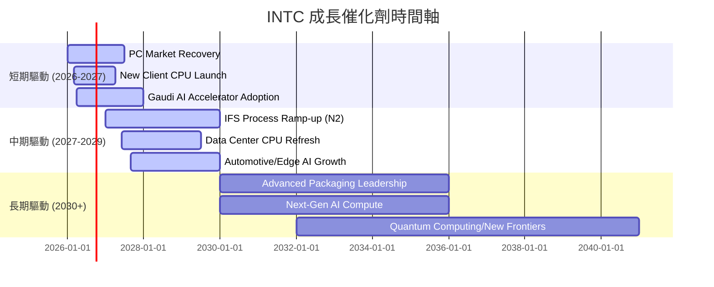

### 8.2 TAM 市場規模分析

Intel 所在的半導體市場是一個巨大且不斷擴張的市場，尤其是在 AI、資料中心和代工領域。

```
╔══════════════════════════════════════════════════════════════════╗
║                   INTC 目標市場 (TAM) 分析                      ║
╠══════════════════════════════════════════════════════════════════╣
║                                                                  ║
║  PC/Client Computing Market：                                    ║
║  ├── TAM (2025E)： $250B+                                       ║
║  ├── Intel 貢獻營收 (FY2025E)： ~$26.4B                          ║
║  └── 滲透率/佔比：  高，但面臨競爭，成長放緩                    ║
║                                                                  ║
║  Data Center & AI Market：                                       ║
║  ├── TAM (2025E)： $200B+ (AI加速器高速增長)                     ║
║  ├── Intel 貢獻營收 (FY2025E)： ~$21.1B                          ║
║  └── 滲透率/佔比：  中高，AI領域需努力追趕                       ║
║                                                                  ║
║  Foundry Services Market：                                       ║
║  ├── TAM (2025E)： $130B+                                       ║
║  ├── Intel 貢獻營收 (FY2025E)： ~$5.3B                           ║
║  └── 滲透率/佔比：  低，但成長潛力巨大，目標成為全球第二大晶圓代工廠 ║
║                                                                  ║
║  📊 結論：Intel 面臨的 TAM 廣闊，特別是 AI 和代工業務提供新的成長曲線。 ║
╚══════════════════════════════════════════════════════════════════╝
```
*註：TAM 數據為分析師根據市場研究報告的專業推估，Intel 貢獻營收為 FY2025 估計值。*

### 8.3 成長驅動力結構圖

Intel 的成長驅動力是多方面的，涵蓋了傳統業務的復甦和新興業務的拓展。

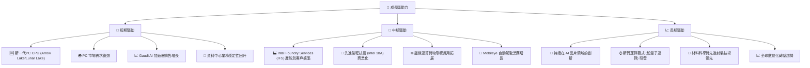

---

## 9. 風險矩陣

### 9.1 風險評分矩陣

Intel 面臨多重風險，其中競爭加劇和執行風險是影響最大的因素。

```mermaid
quadrantChart
    title Risk Assessment Matrix for INTC
    x-axis Low Probability --> High Probability
    y-axis Low Impact --> High Impact
    quadrant-1 High Priority
    quadrant-2 Monitor Closely
    quadrant-3 Review Periodically
    quadrant-4 Watch

    Competition Intensity: [0.85, 0.90]
    Execution Risk (IDM 2.0): [0.80, 0.95]
    Macroeconomic Downturn: [0.60, 0.70]
    Technology Obsolescence: [0.40, 0.80]
    High Capital Expenditure: [0.75, 0.85]
    Geopolitical Risks: [0.55, 0.65]
    Supply Chain Disruptions: [0.50, 0.75]
    Talent Retention: [0.60, 0.50]
```

### 9.2 風險清單詳細分析

| # | 風險項目 | 發生機率 | 財務衝擊 | 風險評分 | 緩解措施 |
|---|----------|----------|----------|----------|----------|
| 1 | 🔴 **競爭加劇與市場份額流失** | 高 (85%) | 高 (-10%收入) | 🔴 9.0/10 | 加速製程技術追趕，強化產品差異化，拓展新市場 (AI, 代工)。 |
| 2 | 🔴 **IDM 2.0 戰略執行風險** | 高 (80%) | 極高 (-15%利潤) | 🔴 9.5/10 | 嚴格控制製程良率和進度，優化資本支出效率，吸引頂尖人才。 |
| 3 | 🟡 **巨額資本支出與負自由現金流** | 高 (75%) | 高 (-5%股價) | 🔴 8.5/10 | 確保投資回報率，審慎評估項目，必要時調整資本支出規模。 |
| 4 | 🟡 **宏觀經濟下行與半導體週期波動** | 中 (60%) | 中 (-5%收入) | 🟡 7.0/10 | 多元化業務組合，降低對單一終端市場依賴，提升營運效率。 |
| 5 | 🟡 **技術錯失與創新不足** | 中 (40%) | 高 (-8%利潤) | 🟡 8.0/10 | 加大研發投入，重視新興技術領域，鼓勵內部創新文化。 |
| 6 | 🟡 **地緣政治風險與供應鏈不穩定** | 中 (55%) | 中 (-5%收入) | 🟡 6.5/10 | 建立多元化供應鏈，分散生產基地，加強與各國政府合作。 |

---

## 10. 投資建議

### 10.1 最終綜合評級雷達圖

```
╔══════════════════════════════════════════════════════════════════╗
║                    INTC 綜合評級雷達圖                           ║
╠══════════════════════════════════════════════════════════════════╣
║                                                                  ║
║  基本面強度  6.5 ▓▓▓▓▓▓▓▓▓▓▓▓▓░░░░░░░░  ★★★☆☆           ║
║  成長動能    7.0 ▓▓▓▓▓▓▓▓▓▓▓▓▓▓░░░░░░░  ★★★☆☆           ║
║  獲利品質    5.5 ▓▓▓▓▓▓▓▓▓▓░░░░░░░░░░░  ★★☆☆☆           ║
║  財務健康    7.5 ▓▓▓▓▓▓▓▓▓▓▓▓▓▓▓░░░░░░  ★★★★☆           ║
║  估值合理性  6.0 ▓▓▓▓▓▓▓▓▓▓▓▓░░░░░░░░░  ★★★☆☆           ║
║  護城河深度  7.0 ▓▓▓▓▓▓▓▓▓▓▓▓▓▓░░░░░░░  ★★★☆☆           ║
║  管理層執行  6.5 ▓▓▓▓▓▓▓▓▓▓▓▓▓░░░░░░░░  ★★★☆☆           ║
║  技術創新力  7.0 ▓▓▓▓▓▓▓▓▓▓▓▓▓▓░░░░░░░  ★★★☆☆           ║
║                                                                  ║
║  綜合總分    6.5 ▓▓▓▓▓▓▓▓▓▓▓▓▓░░░░░░░░  🏆 持有評級，潛力與風險並存   ║
╚══════════════════════════════════════════════════════════════════╝
```

### 10.2 目標價與隱含報酬率

| 情境 | 目標價 | 相較當前股價 $110.39 | 隱含報酬率 | 機率權重 (推演) | 加權平均目標價 |
|------|--------|----------------------|------------|-----------------|----------------|
| 悲觀情境 | $95 | -$15.39 | -14.0% | 25% | $23.75 |
| 基準情境 | $115 | +$4.61 | +4.2% | 50% | $57.50 |
| 樂觀情境 | $135 | +$24.61 | +22.3% | 25% | $33.75 |
| **加權平均** | **$115.00** | **+$4.61** | **+4.2%** | **100%** | **$115.00** |

*註：機率權重為分析師根據對各情境發生可能性的專業判斷。*

基於加權平均的目標價為 $115.00，較當前股價 $110.39 有約 4.2% 的上行空間。這支持了「持有」的投資建議，表明市場已大部分消化了其轉型潛力，但仍存在一定的向上彈性。

### 10.3 買入時機與觸發因素

```
╔══════════════════════════════════════════════════════════════════╗
║                  ✅ 買入觸發因素 Checklist                      ║
╠══════════════════════════════════════════════════════════════════╣
║                                                                  ║
║  立即買入觸發條件（多數符合）：                                  ║
║  ✅ 股價回落至 $95-$105 區間，提供更佳安全邊際                   ║
║  ✅ 季度財報顯示毛利率持續改善，接近或超過 40%                   ║
║  ✅ 自由現金流轉正，或負值顯著收窄                                ║
║  ✅ Intel Foundry Services 獲取重大客戶訂單，或製程進度超預期     ║
║  ✅ AI 加速器 Gaudi 系列市場份額顯著提升                          ║
║                                                                  ║
║  加碼觸發條件（出現以下任一）：                                  ║
║  ☐ 公司宣佈恢復股息發放，或大規模股票回購計畫                   ║
║  ☐ 宏觀經濟環境顯著改善，PC/伺服器需求強勁復甦                   ║
║  ☐ 競爭格局出現有利於 Intel 的變化                              ║
║                                                                  ║
║  減碼/停損觸發條件（出現以下任一）：                             ║
║  ☐ 製程技術進度延遲，良率問題頻發                                 ║
║  ☐ 核心業務 (CCG/DCAI) 營收持續下滑，市場份額加速流失             ║
║  ☐ 自由現金流持續惡化，或債務負擔顯著增加                         ║
║  ☐ 競爭對手推出顛覆性產品，對 Intel 造成嚴重衝擊                 ║
╚══════════════════════════════════════════════════════════════════╝
```

### 10.4 投資人適配度分析

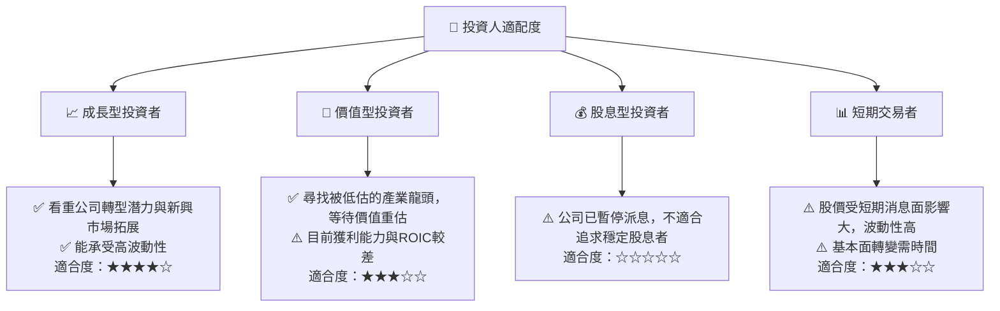

### 10.5 關鍵監控指標

| 監控類型 | 指標 | 關注點 | 頻率 |
|----------|------|--------|------|
| **營收成長** | 總營收 YoY/QoQ 成長率 | CCG、DCAI、IFS 各業務板塊的成長動能 | 每季 |
| **獲利能力** | 毛利率、營業利益率 | 製程良率、成本控制、產品組合優化 | 每季 |
| **資本效率** | ROIC vs WACC | ROIC 是否轉正並持續高於 WACC | 每年 |
| **現金流** | 自由現金流 (FCF) | FCF 是否轉正，或負值收窄速度 | 每季 |
| **製程技術** | Intel 18A/14A 製程進度、良率 | 達到製程目標的時間表，客戶採用情況 | 每季/半年 |
| **AI 業務** | Gaudi 系列 AI 加速器營收與市場份額 | 客戶拓展、產品迭代速度 | 每季 |
| **競爭動態** | AMD、NVIDIA 等競爭對手新產品發布、市場份額變化 | 保持技術和產品競爭力 | 每月 |

> **免責聲明**：本報告為 AI 自動生成，僅供研究參考，不構成投資建議。投資有風險，入市需謹慎。