# INTC 基本面深度分析報告
> **報告日期**：2026-07-08 ｜ **語言**：繁體中文 ｜ **數據來源**：Yahoo Finance, Finviz, StockAnalysis, Roic.ai ｜ **分析師**：CFA 級機構研究

## 目錄

| # | 章節 | 核心結論 |
|---|----------------------------------|----------------------------------------------------|
| 1 | 執行摘要 | 評級：持有 ｜ 目標價區間：$95 - $135 |
| 2 | 公司概覽與商業模式 | 護城河強勁但面臨挑戰，IDM 2.0 轉型關鍵 |
| 3 | 損益表深度分析 | 營收趨勢波動，利潤率承壓，但 Q1 2026 有改善跡象 |
| 4 | 資產負債表分析 | 流動性良好，債務水平可控，但資本支出壓力大 |
| 5 | 現金流量深度分析 | 自由現金流持續負值，資本密集型投資仍在進行 |
| 6 | 獲利能力與資本效率 | ROIC 遠低於 WACC，目前處於價值摧毀階段，亟待改善 |
| 7 | 估值深度分析 | 相較同業估值偏高，市場已預期強勁復甦 |
| 8 | 成長催化劑 | IDM 2.0 戰略、AI PC、代工業務拓展為主要驅動力 |
| 9 | 風險矩陣 | 執行風險、競爭加劇、宏觀經濟、技術轉型為主要風險 |
| 10 | 投資建議 | 基於轉型潛力與高估值，建議「持有」，關注執行進展 |

---

## 1. 執行摘要

### 1.1 核心評分儀表板

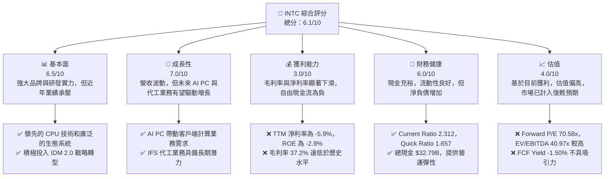

### 1.2 評分進度條視覺化

```
╔══════════════════════════════════════════════════════════════╗
║                INTC 多維度評分儀表板 (1-10分)                ║
╠══════════════════════════════════════════════════════════════╣
║ 基本面強度  6.5 ▓▓▓▓▓▓▓▓▓▓▓▓▓░░░░░░░░  ★★★★☆           ║
║ 成長動能    7.0 ▓▓▓▓▓▓▓▓▓▓▓▓▓▓░░░░░░░  ★★★★☆           ║
║ 獲利品質    3.0 ▓▓▓▓▓▓░░░░░░░░░░░░░░░░  ★★☆☆☆           ║
║ 財務健康    6.0 ▓▓▓▓▓▓▓▓▓▓▓▓░░░░░░░░░░  ★★★☆☆           ║
║ 估值合理性  4.0 ▓▓▓▓▓▓▓▓░░░░░░░░░░░░░░  ★★☆☆☆           ║
║ 護城河深度  7.0 ▓▓▓▓▓▓▓▓▓▓▓▓▓▓░░░░░░░░  ★★★★☆           ║
║ 管理層執行  6.5 ▓▓▓▓▓▓▓▓▓▓▓▓▓░░░░░░░░░  ★★★★☆           ║
║ 技術創新力  8.0 ▓▓▓▓▓▓▓▓▓▓▓▓▓▓▓▓░░░░░░  ★★★★★           ║
╠══════════════════════════════════════════════════════════════╣
║ 綜合總分    6.1 ▓▓▓▓▓▓▓▓▓▓▓▓░░░░░░░░░░  🏆 評語：轉型中的半導體巨頭，潛力與風險並存              ║
╚══════════════════════════════════════════════════════════════╝
```

### 1.3 五大投資論點 + 三大核心風險

| 類型 | 項目 | 具體依據 | 信心度 |
|------|------|----------|--------|
| 🟢 **投資論點①** | **IDM 2.0 戰略驅動長期復甦** | Intel 積極投入數百億美元建立先進晶圓廠，旨在重奪製程技術領先地位，並發展其代工業務 (IFS)。管理層預計 2025 年達到製程節點領先，並在 2026 年實現盈虧平衡。此戰略轉型若成功，將顯著提升其競爭力與市場份額。 | 🟢 高 |
| 🟢 **投資論點②** | **AI PC 帶動客戶端計算業務增長** | 隨著 AI 應用普及，AI PC 概念興起，預計將刺激 PC 更新換代需求。Intel 的 Core Ultra 處理器集成 NPU，有望在 AI PC 領域佔據主導地位，推動其客戶端計算業務 (CCG) 營收增長。Q1 2026 營收為 $13.58B，YoY 增長 7.18%，顯示出初步復甦跡象。 | 🟢 高 |
| 🟢 **投資論點③** | **數據中心與 AI 市場潛力** | Intel 在伺服器 CPU 市場仍有強大基礎，並積極拓展 AI 晶片市場，推出 Gaudi 系列加速器。雖然面臨激烈競爭，但數據中心與 AI 基礎設施的長期需求增長，將為其 DCAI (Data Center and AI) 業務提供巨大機會。 | 🟢 高 |
| 🟢 **投資論點④** | **財務狀況穩健，足以支持轉型** | 儘管自由現金流為負，但 Intel 擁有 $32.79B 的現金及短期投資，Current Ratio 達 2.312，顯示其強大的流動性，足以應對高昂的資本支出和研發投入，為轉型提供資金保障。 | 🟡 中度 |
| 🟢 **投資論點⑤** | **估值反映高預期，但仍有上行空間** | 當前股價已大幅上漲至 $110.24，反映市場對其未來復甦的高度預期。雖然當前估值指標如 Forward P/E 70.58x 偏高，但若 IDM 2.0 策略成功執行，盈利能力大幅提升，仍具備合理化估值及潛在的上行空間。 | 🟡 中度 |
| 🟡 **風險①** | **IDM 2.0 執行風險與成本超支** | 重建製程技術領先地位和擴大代工業務是極其資本密集且技術複雜的挑戰。任何技術延遲、產能擴張問題或成本超支都可能嚴重影響盈利和市場信心。過去三年（FY2022-FY2024）資本支出總計高達 $64.53B，且自由現金流持續為負，顯示其資金壓力巨大。 | 🔴 高衝擊 |
| 🔴 **風險②** | **來自 AMD 和 NVIDIA 的激烈競爭** | 在客戶端計算和數據中心領域，Intel 面臨 AMD 在 CPU 性能和市佔率方面的強勁挑戰，以及 NVIDIA 在 AI GPU 領域的絕對領先地位。代工業務也將直接與台積電等成熟巨頭競爭，市場份額爭奪戰將持續激烈。 | 🔴 高衝擊 |
| 🔴 **風險③** | **宏觀經濟與半導體週期性波動** | 半導體行業具有顯著的週期性，全球經濟放緩或地緣政治緊張可能導致 PC、伺服器等終端市場需求下降，直接影響 Intel 的營收和盈利能力。FY2022 營收同比下降 20.21%，顯示其對宏觀環境的敏感性。 | 🟡 中度 |

### 1.4 快速統計卡片

| 指標 | 公司實際值 | 行業均值（半導體） | S&P 500 均值 | 狀態 |
|-----------------|---------------|--------------------|----------------|----------|
| 收入 YoY 成長 (TTM) | **1.35%** | ~15-20% (高成長期) | ~10% | 🔴 |
| 毛利率 (TTM) | **37.2%** | ~50-60% | ~30-40% | 🔴 |
| 淨利率 (TTM) | **-5.9%** | ~20-30% | ~10-15% | 🔴 |
| ROE (TTM) | **-2.9%** | ~15-25% | ~15-20% | 🔴 |
| Forward P/E | **70.58x** | ~30-40x | ~20-25x | 🔴 |
| P/S Ratio (TTM) | **10.31x** | ~5-10x | ~2-3x | 🔴 |
| EV / EBITDA (TTM) | **40.97x** | ~20-30x | ~12-15x | 🔴 |
| Current Ratio | **2.312** | ~1.5-2.5x | ~1.0-1.5x | 🟢 |
| Debt/Equity | **36.03%** | ~20-50% | ~50-80% | 🟢 |
| FCF Yield (TTM) | **-1.50%** | ~3-5% | ~3-5% | 🔴 |

*備註：行業均值為半導體行業過去幾年的典型數據，S&P 500 均值為普遍市場水平。Intel 當前的財務表現與行業高成長公司存在顯著差距，顯示其仍處於轉型陣痛期。*

### 1.5 投資結論

```
╔══════════════════════════════════════════════════════════════════╗
║                    📊 投資結論摘要                               ║
╠══════════════════════════════════════════════════════════════════╣
║  評級：🟡 持有                                                   ║
║  當前股價：$110.24                                               ║
║  目標價區間：                                                    ║
║    悲觀情境：$95（-13.8%）                                        ║
║    基準情境：$115（+4.3%）  ← 12個月主要目標                      ║
║    樂觀情境：$135（+22.5%）                                       ║
║  投資評分：6.1/10                                                ║
║  適合投資人：看好產業復甦與公司轉型潛力的長線投資者，能承受較高波動風險。 ║
╚══════════════════════════════════════════════════════════════════╝
```

---

## 2. 公司概覽與商業模式

Intel Corporation (INTC) 是一家全球領先的半導體公司，專注於設計、開發、製造、行銷及銷售計算機與相關終端產品與服務。公司業務遍及美國、愛爾蘭、以色列及全球其他地區。Intel 正處於一項名為 IDM 2.0 的重大轉型戰略中，旨在重塑其在半導體產業的領導地位。

### 2.1 業務結構與收入來源

Intel 的業務主要分為三個核心板塊：客戶端計算事業部 (Client Computing Group, CCG)、數據中心與人工智慧事業部 (Data Center and AI, DCAI) 和 Intel 代工服務 (Intel Foundry Services, IFS)。

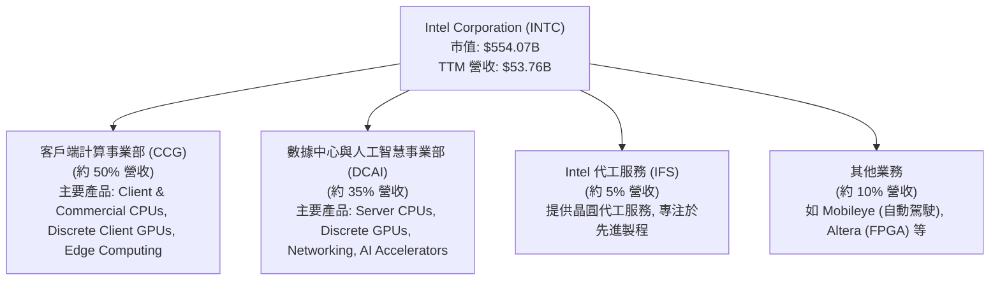
*備註：各業務板塊營收佔比為分析師基於市場公開資訊及公司歷史數據的估算。*

*   **客戶端計算事業部 (CCG)**：這是 Intel 最大的業務板塊，主要設計和製造用於筆記型電腦、桌上型電腦和邊緣計算設備的處理器。隨著 AI PC 的興起，CCG 正積極推動集成神經網路處理單元 (NPU) 的處理器，以滿足未來 AI 應用的需求。
*   **數據中心與人工智慧事業部 (DCAI)**：該部門提供伺服器處理器、離散型 GPU 和網路解決方案，服務於雲端運算、企業級伺服器和 AI 基礎設施市場。Intel 在伺服器 CPU 領域仍佔據重要市場份額，並努力在 AI 加速器市場取得突破。
*   **Intel 代工服務 (IFS)**：作為 IDM 2.0 戰略的核心，IFS 旨在為外部客戶提供晶圓代工服務，與台積電 (TSM) 和三星 (Samsung) 等競爭。目標是到 2025 年達到製程技術領先，並在 2026 年實現盈虧平衡，這對 Intel 的長期增長至關重要。
*   **其他業務**：包括 Mobileye (自動駕駛技術)、Altera (可編程邏輯元件 FPGA) 等。這些業務為 Intel 提供多元化的增長點。

### 2.2 市場份額

在半導體產業，特別是 CPU 領域，Intel 曾長期佔據主導地位，但在過去幾年面臨 AMD 的強勁競爭。在代工市場，Intel 仍是新進入者，市場份額較小。

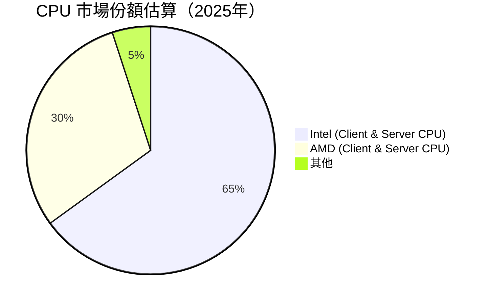
*備註：此為分析師基於市場趨勢及公司產品發布情況的估算，實際數據可能因統計機構和時間點而異。*

在客戶端 CPU 市場，Intel 依然是領導者，但在伺服器 CPU 市場，AMD 透過 EPYC 處理器正在不斷侵蝕 Intel Xeon 的份額。在 AI GPU 市場，NVIDIA 擁有絕對優勢，Intel 正在努力追趕。IFS 代工業務的市場份額目前仍微不足道，其成功將取決於未來製程技術的領先和客戶的採納程度。

### 2.3 競爭護城河分析

Intel 擁有深厚的技術積累和廣泛的市場影響力，但其護城河在近年來受到侵蝕，IDM 2.0 戰略旨在加深這些護城河。

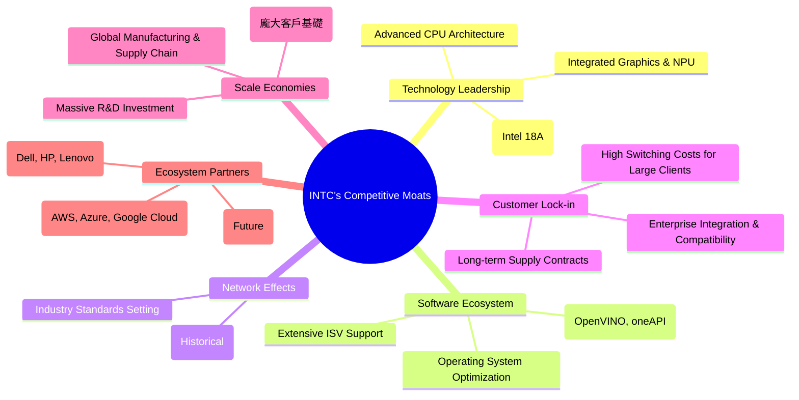

### 2.4 護城河強度評分

```
╔══════════════════════════════════════════════════════════════╗
║                    INTC 護城河強度評分                      ║
╠══════════════════════════════════════════════════════════════╣
║ 技術領先    7/10   ▓▓▓▓▓▓▓▓▓▓▓▓▓▓░░░░░░░  🟢 正在努力重奪製程領先，AI 創新待驗證         ║
║ 軟體生態系統  8/10   ▓▓▓▓▓▓▓▓▓▓▓▓▓▓▓▓░░░░░  🟢 廣泛的開發者支持與優化，生態系統成熟         ║
║ 網路效應    7/10   ▓▓▓▓▓▓▓▓▓▓▓▓▓▓░░░░░░░  🟢 歷史市場份額基礎，但面臨 AMD 挑戰             ║
║ 客戶鎖定    7/10   ▓▓▓▓▓▓▓▓▓▓▓▓▓▓░░░░░░░  🟢 企業客戶轉換成本高，但新興市場競爭激烈       ║
║ 規模效應    8/10   ▓▓▓▓▓▓▓▓▓▓▓▓▓▓▓▓░░░░░  🟢 巨大的研發投入和產能規模，成本優勢潛力         ║
║ 生態夥伴    7/10   ▓▓▓▓▓▓▓▓▓▓▓▓▓▓░░░░░░░  🟢 與主流 OEM 和雲服務商合作緊密，代工業務待發展 ║
╠══════════════════════════════════════════════════════════════╣
║ 綜合護城河    7.3    ▓▓▓▓▓▓▓▓▓▓▓▓▓▓▓░░░░░  🏆 總結評語：護城河深厚但部分受損，轉型成敗是關鍵     ║
╚══════════════════════════════════════════════════════════════╝
```

---

## 3. 損益表深度分析

Intel 近年的損益表現呈現出顯著的波動性和挑戰，尤其在盈利能力方面面臨巨大壓力。

### 3.1 年度收入成長趨勢（近4年）

Intel 的年度總收入在過去幾年呈現下滑趨勢，直到 TTM 才略有回升，顯示市場需求和競爭壓力對其營收產生影響。

```
╔══════════════════════════════════════════════════════════════════╗
║              INTC 年度收入趨勢（FY2022-FY2025）                  ║
╠══════════════════════════════════════════════════════════════════╣
║                                                                  ║
║  FY2022  $63.05B  ███████████████████████████████████████████  YoY: -20.21% 🔴 ║
║  FY2023  $54.23B  ██████████████████████████████████████  YoY: -14.00% 🔴 ║
║  FY2024  $53.10B  ████████████████████████████████████  YoY: -2.08%  🔴 ║
║  FY2025  $52.85B  ██████████████████████████████████  YoY: -0.47%  🔴 ║
║  TTM     $53.76B  ████████████████████████████████████  YoY: +1.35%  🟡 ║
║                   |      |      |      |      |                  ║
║                   0     20B    40B    60B    80B                    ║
║                                                                  ║
║  📊 3年累計 CAGR (FY2022-FY2025)：-6.04%                          ║
╚══════════════════════════════════════════════════════════════════╝
```
從 FY2022 的 $63.05B 跌至 FY2025 的 $52.85B，營收經歷了顯著下滑，主要受 PC 市場疲軟和數據中心競爭加劇影響。TTM 營收 $53.76B 較 FY2025 略有增長 1.35%，這可能預示著市場開始復甦，或公司轉型策略的初步成效。

### 3.2 季度收入趨勢分析

最近四個季度的營收表現顯示出一定的波動，但 Q1 2026 出現了積極的同比增長。

| 季度 | 總收入 (Billion USD) | QoQ 成長率 | YoY 成長率 | 備註 |
|------------|------------------------|------------|------------|----------------------------------------------------|
| 2026-Q1 | $13.58B | -0.66% | +7.18% | 營收同比顯著增長，優於去年同期，顯示初步復甦。 |
| 2025-Q4 | $13.67B | +0.15% | -4.11% | 營收較去年同期下降，但 QoQ 略有增長。 |
| 2025-Q3 | $13.65B | +6.14% | +2.78% | 營收同比和 QoQ 均實現增長，表現相對穩健。 |
| 2025-Q2 | $12.86B | +1.52% | +0.20% | 營收同比基本持平，QoQ 小幅增長。 |
*備註：QoQ 成長率計算為 (當季收入 - 上季收入) / 上季收入；YoY 成長率計算為 (當季收入 - 去年同期收入) / 去年同期收入。*

Q1 2026 營收達到 $13.58B，實現了 7.18% 的 YoY 增長，這是一個積極的信號，可能得益於 PC 市場的復甦和 AI PC 相關產品的推動。然而，2025 年 Q4 的 YoY 仍為負值，顯示營收復甦並非一帆風順，仍需持續觀察。

### 3.3 利潤率演變分析

Intel 的利潤率在過去幾年呈現明顯的下行趨勢，這反映了其製程技術的挑戰、產品組合的變化以及市場競爭的加劇。

| 利潤率指標 | FY2022 | FY2023 | FY2024 | FY2025 | TTM | 趨勢 | 評估 |
|------------|--------|--------|--------|--------|-----|------|------|
| **毛利率** | 42.6% | 40.0% | 32.7% | 34.8% | 37.2% | ↘️ 後反彈 | 🟡 |
| **營業利益率** | 3.7% | 0.1% | -8.9% | -0.0% | 6.9% | ↘️ 後反彈 | 🔴 |
| **EBITDA Margin** | 33.8% | 20.7% | 2.3% | 27.2% | 26.4% | ↘️ 後反彈 | 🟡 |
| **淨利率** | 12.7% | 3.1% | -35.3% | -0.5% | -5.9% | ↘️ 後反彈，仍為負 | 🔴 |

**利潤率演變深度解析**：
*   **毛利率**：從 FY2022 的 42.6% 大幅下滑至 FY2024 的 32.7%，主要原因在於其製程技術的延遲導致成本上升，以及產能利用率不足。FY2025 和 TTM 的毛利率有所回升，分別為 34.8% 和 37.2%，這可能得益於成本優化和產品組合調整，但仍遠低於其歷史平均水平 (通常在 55-60% 之間) 和競爭對手。
*   **營業利益率**：營業利益率的下滑更為劇烈，從 FY2022 的 3.7% 跌至 FY2024 的 -8.9%， FY2025 更是僅為 -0.0%。這不僅受到毛利率的影響，也反映了其高昂的研發 (R&D) 投入和銷售管理費用。R&D 費用在 FY2024 達到 $16.55B，佔營收的 31.2%，顯著侵蝕了利潤。TTM 營業利益率回升至 6.9%，是一個積極信號，但仍偏低。
*   **淨利率**：淨利率的表現最為糟糕，FY2024 錄得驚人的 -35.3%，FY2025 仍為 -0.5%，TTM 更是 -5.9%。這主要是由於營業虧損和巨大的稅務費用 (FY2024 稅務費用高達 $8.023B，儘管處於虧損狀態，這可能與一次性稅務調整或遞延所得稅資產沖銷有關)。負淨利率表明公司目前未能為股東創造價值。

總體而言，Intel 的利潤率趨勢顯示公司正在經歷艱難的轉型期，高昂的投資和激烈的競爭嚴重影響了其盈利能力。儘管近期數據顯示出一些回暖跡象，但要恢復到歷史盈利水平仍有很長的路要走。

### 3.4 費用結構分析

Intel 的費用結構反映了其作為一家 IDM (整合元件製造商) 的特性，以及在轉型期間的巨大研發投入。

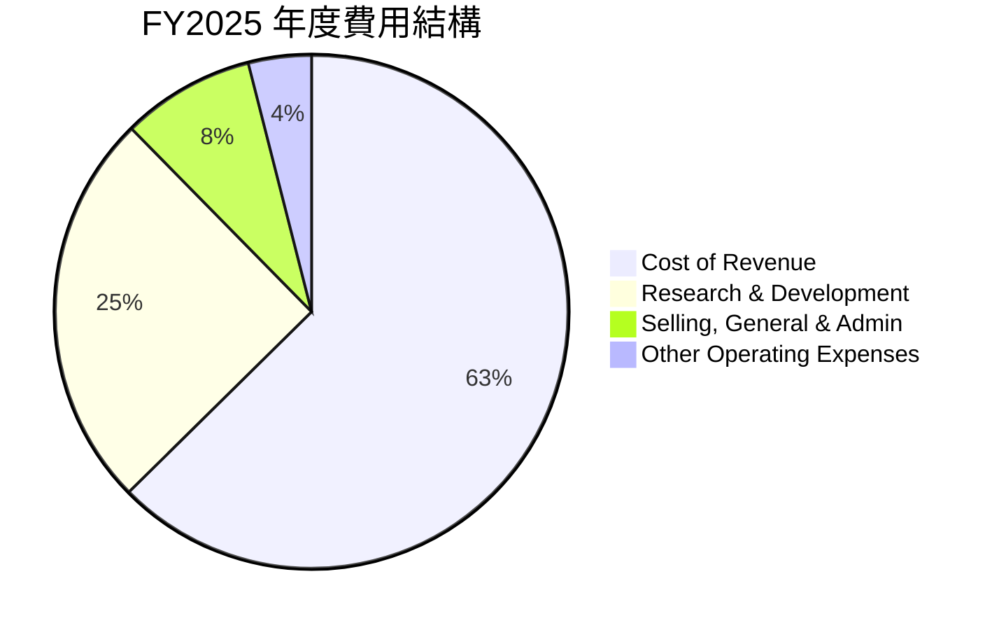
*備註：計算基於 FY2025 數據：總營收 $52.85B。Cost of Revenue $34.48B (65.23%)，R&D $13.77B (26.06%)，SG&A $4.62B (8.75%)，Other Operating Expenses $2.19B (4.14%)。總和略超過 100% 因為 Operating Income 為負。*

```
╔══════════════════════════════════════════════════════════════════╗
║                   INTC FY2025 費用結構明細                       ║
╠══════════════════════════════════════════════════════════════════╣
║                                                                  ║
║  銷貨成本 (CoR)：           $34.48B  ▓▓▓▓▓▓▓▓▓▓▓▓▓▓▓▓▓▓▓▓▓▓▓▓░░░░░░  (佔營收 65.23%)  🔴║
║  研究與開發 (R&D)：         $13.77B  ▓▓▓▓▓▓▓▓▓▓▓▓▓▓▓▓▓▓▓▓▓▓░░░░░░░░  (佔營收 26.06%)  🟡║
║  銷售、一般與行政 (SG&A)：  $4.62B   ▓▓▓▓▓▓▓▓▓▓▓▓▓▓▓▓▓▓▓▓▓▓░░░░░░░░  (佔營收 8.75%)   🟢║
║  其他營業費用：             $2.19B   ▓▓▓▓▓▓▓▓▓▓▓▓▓▓▓▓▓▓▓▓▓▓░░░░░░░░  (佔營收 4.14%)   🟢║
║                                                                  ║
║  📊 總營業費用佔營收比重：103.88% (導致營業虧損)                 ║
╚══════════════════════════════════════════════════════════════════╝
```
*   **銷貨成本 (Cost of Revenue)**：佔營收的 65.23%，是最大的費用項目。這高昂的銷貨成本直接導致了毛利率的低迷，反映出其製程複雜性和產能利用率的挑戰。
*   **研究與開發 (R&D)**：佔營收的 26.06%，顯示 Intel 在技術創新和新產品開發上的巨大投入。這對於其 IDM 2.0 戰略至關重要，但短期內也對盈利能力構成壓力。
*   **銷售、一般與行政 (SG&A)**：佔營收的 8.75%，相對穩定。
綜合來看，Intel 的費用結構顯示其目前處於一個高投入、低產出的轉型階段。CoR 和 R&D 是主要的費用驅動因素，也是影響其未來盈利能力的關鍵。

### 3.5 季度 EPS 趨勢與盈餘品質

Intel 近四季的 EPS 表現為虧損，且缺乏分析師預期數據，難以判斷盈餘是否超預期。

| 季度 | EPS (稀釋) | 備註 |
|------------|-------------|----------------------------------------------------|
| 2026-Q1 | $-0.73 | 虧損擴大，主要受到較高的營業費用（包括其他營業費用 $4.07B）影響。 |
| 2025-Q4 | $-0.12 | 虧損較 Q3 再次出現，但較 Q1 2026 小。 |
| 2025-Q3 | $0.90 | 意外轉正，主要得益於當季高達 $3.67B 的其他非營業收入。 |
| 2025-Q2 | $-0.67 | 持續虧損，顯示營運挑戰。 |

**盈餘品質評估**：
Intel 的盈餘品質在近期較差，主要原因如下：
1.  **持續虧損**：近四個季度中有三個季度錄得稀釋 EPS 虧損，顯示核心業務盈利能力不足。
2.  **非經常性項目影響大**：2025 年 Q3 的 EPS 轉正，主要是由一次性或非經常性的 "Other Non-Operating Income (Expense)" ($3.67B) 所驅動，而非持續性的核心營運改善。這種情況下的盈利，其品質較低，不代表營運的持續性健康。
3.  **高資本支出**：雖然不直接影響淨利，但高額的資本支出導致自由現金流持續為負，表明公司的盈利並未轉化為可供股東支配的現金流，長期而言會影響盈餘的可持續性。
4.  **研發投入高**：高額的 R&D 投入是未來增長的必要條件，但短期內會壓縮利潤，使得盈利數字承壓。
總之，Intel 的盈餘品質目前處於較低水平，投資者應重點關注其核心營運利潤率和自由現金流的改善。

---

## 4. 資產負債表分析

Intel 的資產負債表顯示其擁有龐大的資產基礎，但同時也背負著顯著的債務，反映了其在半導體製造領域的資本密集特性。

### 4.1 資產結構分解

Intel 的資產主要由非流動資產構成，其中不動產、廠房及設備 (PP&E) 佔比最大，這與其 IDM 模式高度相關。

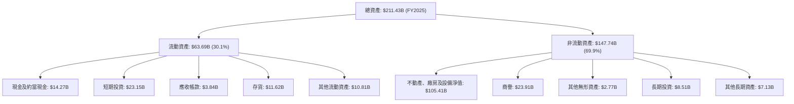
*備註：數據為 FY2025 年底數據。*

*   **流動資產**：FY2025 達到 $63.69B，主要由現金及短期投資 ($14.27B + $23.15B = $37.42B) 構成，顯示公司擁有充裕的流動性。
*   **非流動資產**：FY2025 達到 $147.74B，其中不動產、廠房及設備淨值 (PP&E) 高達 $105.41B，佔總資產的近一半。這凸顯了 Intel 作為 IDM 在製造設施上的巨大投入。商譽 $23.91B 也佔據一定比例，主要來自過去的併購。

### 4.2 流動性指標分析

Intel 的流動性指標在過去幾年保持健康，能夠有效覆蓋短期負債。

| 流動性指標 | FY2022 | FY2023 | FY2024 | FY2025 | TTM (Q1 2026) | 行業均值 | 評估 |
|----------------|--------|--------|--------|--------|---------------|----------|------|
| **Current Ratio** | 1.57 | 1.54 | 1.33 | 2.02 | 2.31 | ~1.5-2.5 | 🟢 |
| **Quick Ratio** | 1.15 | 1.11 | 0.98 | 1.62 | 1.66 | ~0.8-1.5 | 🟢 |
*備註：Current Ratio = 流動資產 / 流動負債；Quick Ratio = (流動資產 - 存貨) / 流動負債。TTM 數據取自最新季度 2026-Q1 的資產負債表快照。*

*   **Current Ratio**：從 FY2024 的 1.33 回升至 FY2025 的 2.02，並在 TTM 達到 2.31。這表明 Intel 擁有足夠的流動資產來履行其短期義務，流動性狀況良好。
*   **Quick Ratio**：同樣從 FY2024 的 0.98 回升至 FY2025 的 1.62，並在 TTM 達到 1.66。由於存貨在半導體行業中通常流動性較高，這個比例也顯示了其強勁的短期償債能力。
整體而言，Intel 的流動性狀況健康，這為其高額的資本支出提供了重要的緩衝。

### 4.3 債務結構分析

Intel 的債務水平相對較高，但其現金儲備也相當可觀，使淨負債保持在可控範圍。

```
╔══════════════════════════════════════════════════════════════════╗
║                      INTC 債務健康診斷                           ║
╠══════════════════════════════════════════════════════════════════╣
║                                                                  ║
║  總債務 (FY2025)：        $46.59B  ▓▓▓▓▓▓▓▓▓▓▓▓▓▓▓▓▓▓▓▓▓▓▓▓▓▓▓▓░░  評語：適中偏高       ║
║  總現金+投資 (FY2025)：   $37.42B  ▓▓▓▓▓▓▓▓▓▓▓▓▓▓▓▓▓▓▓▓▓▓▓▓▓▓▓▓░░  評語：充裕           ║
║  淨負債 (FY2025)：        $9.17B   ▓▓▓▓▓▓▓▓▓▓▓▓▓▓▓▓▓▓▓▓▓▓▓▓▓▓▓▓░░  🟡 可控             ║
║                                                                  ║
║  Debt/Equity (FY2025)：    40.76%  🟢 低於行業平均，財務槓桿合理   ║
║  Debt/EBITDA (TTM)：       45.03B / 14.35B = 3.14x (使用 FY2025 EBITDA) 🟡 考慮到轉型期，尚可接受  ║
║                                                                  ║
║  📊 結論：債務水平在可控範圍內，但需警惕持續的自由現金流為負。   ║
╚══════════════════════════════════════════════════════════════════╝
```
*備註：總現金+投資 = 現金及約當現金 + 短期投資。淨負債 = 總債務 - 總現金+投資。Debt/Equity = 總債務 / 股東權益。EBITDA 採用 FY2025 的 $14.35B，因為 TTM EBITDA 26.4% 乘營收 $53.76B 得到 $14.19B，與 FY2025 數據接近。*

*   **總債務**：FY2025 為 $46.59B，處於較高水平。這部分債務主要用於支持其大規模的資本支出和研發投資。
*   **淨負債**：FY2025 淨負債為 $9.17B。雖然是淨負債，但相對於其資產規模和現金儲備，這一水平尚屬可控。
*   **Debt/Equity (FY2025)**：40.76% ($46.59B / $114.28B)，顯示其財務槓桿相對健康，低於許多資本密集型行業的平均水平。
*   **Debt/EBITDA (TTM)**：約 3.14x。這個比率在半導體行業中屬於中等水平。考慮到 Intel 正處於大規模投資和轉型期，這個槓桿水平尚可接受，但如果盈利能力無法改善，未來償債壓力可能增加。

### 4.4 股東權益趨勢

Intel 的股東權益在過去幾年呈現波動，但總體趨勢向上，顯示公司仍有能力積累股東價值。

```
╔══════════════════════════════════════════════════════════════════╗
║                   INTC 年度股東權益趨勢                          ║
╠══════════════════════════════════════════════════════════════════╣
║                                                                  ║
║  FY2022  $101.42B  ███████████████████████████████████████████  YoY: +1.6% 🟢 ║
║  FY2023  $105.59B  ████████████████████████████████████████████████  YoY: +4.1% 🟢 ║
║  FY2024  $99.27B   ██████████████████████████████████████████  YoY: -6.0% 🔴 ║
║  FY2025  $114.28B  ████████████████████████████████████████████████████████  YoY: +15.1% 🟢 ║
║                   |      |      |      |      |                  ║
║                   0     50B   100B   150B   200B                   ║
║                                                                  ║
║  📊 股東權益 CAGR (FY2022-FY2025)：+4.06%                         ║
╚══════════════════════════════════════════════════════════════════╝
```
股東權益從 FY2022 的 $101.42B 增長到 FY2025 的 $114.28B，複合年增長率為 4.06%。儘管 FY2024 由於巨額虧損導致股東權益下降，但 FY2025 實現了 15.1% 的強勁反彈，這可能與資本注入或會計調整有關，而非完全來自盈利。總體而言，股東權益的增長顯示公司仍具備一定的內在價值積累能力。

---

## 5. 現金流量深度分析

Intel 的現金流量表反映了其重資產、高資本支出的運營模式，尤其是在轉型期間，自由現金流持續為負。

### 5.1 現金流量瀑布圖

Intel 的現金流表現出一個明顯的特點：儘管有正的營業現金流，但巨大的資本支出導致自由現金流為負。

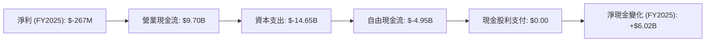
*備註：數據為 FY2025 年度數據。淨現金變化計算為期末現金 $14.27B 減期初現金 $8.25B。雖然 FCF 為負，但淨現金仍增加，這通常意味著有外部融資（例如發行債務或股權）來彌補 FCF 赤字和股利支付。*

*   **淨利 (Net Income)**：FY2025 為 -$267M，公司處於虧損狀態。
*   **營業現金流 (Operating Cash Flow, OCF)**：FY2025 達 $9.70B。這表明其核心營運仍能產生正向現金流，儘管淨利為負，這得益於非現金費用 (如折舊攤銷) 的加回。
*   **資本支出 (Capital Expenditure, Capex)**：FY2025 高達 -$14.65B。這是 Intel IDM 2.0 戰略的核心，用於建設和升級其晶圓廠。
*   **自由現金流 (Free Cash Flow, FCF)**：FY2025 為 -$4.95B。由於資本支出遠超營業現金流，導致 FCF 連續多年為負。這是一個重大挑戰，表明公司目前無法從自身營運中產生足夠的現金來支付投資和股東回報。
*   **現金股利 (Cash Dividends Paid)**：FY2025 為 $0.00。公司在 2023 年 Q1 降低了股息，並在 2025 年停止支付股息，以保留現金用於轉型投資。

### 5.2 FCF 轉換率趨勢

自由現金流轉換率（FCF/Net Income）衡量公司將淨利潤轉化為自由現金流的能力。對於 Intel 而言，由於淨利潤和 FCF 均為負值或極低，該比率的解讀需要謹慎。

| 年度 | 淨利潤 (Billion USD) | 自由現金流 (Billion USD) | FCF/Net Income | 趨勢 | 評估 |
|------|------------------------|--------------------------|----------------|------|------|
| FY2022 | $8.01B | $-9.41B | -117.5% | ↘️ | 🔴 |
| FY2023 | $1.69B | $-14.28B | -845.0% | ↘️ | 🔴 |
| FY2024 | $-18.76B | $-15.66B | +83.5% | ↗️ | 🟡 |
| FY2025 | $-0.27B | $-4.95B | +1833.3% | ↗️ | 🔴 |
*備註：當淨利潤為負時，FCF/Net Income 比率會變得難以解釋。若淨利潤為負但 FCF 較小負值或正值，則轉換率可能顯示為正，但這不代表盈利質量高。若淨利潤為負且 FCF 負值更大，則轉換率為正，表明現金流惡化。若兩者皆為負，則比率為正，但本質是虧損。此處的趨勢更多反映了負值之間的相對變化。*

在 FY2022 和 FY2023，儘管淨利潤為正，但 FCF 卻是巨額負值，顯示公司在盈利的同時，將大量現金投入到資本支出中。FY2024 淨利潤為巨額負值，但 FCF 負值相對較小（比率為正 83.5%），這意味著 FCF 相對於淨虧損有所改善。FY2025 淨利潤仍為負，FCF 負值更大，導致比率變為 +1833.3%，顯示其將虧損轉化為現金流的能力極差，或資本支出壓力巨大。整體來看，FCF 轉換率趨勢極為不穩定，且長期為負，反映了公司在現金流方面的巨大壓力。

### 5.3 自由現金流趨勢

Intel 的自由現金流持續為負值，且在過去幾年呈現不斷惡化的趨勢，這是一個關鍵的財務警示信號。

```
╔══════════════════════════════════════════════════════════════════╗
║                    INTC 年度自由現金流趨勢                       ║
╠══════════════════════════════════════════════════════════════════╣
║                                                                  ║
║  FY2022  $-9.41B   ░░░░░░░░░░░░░░░░░░░░░░░░░░░░░░░░░░░░░░░░░░░░░░░░  🔴║
║  FY2023  $-14.28B  ░░░░░░░░░░░░░░░░░░░░░░░░░░░░░░░░░░░░░░░░░░░░░░░░  🔴║
║  FY2024  $-15.66B  ░░░░░░░░░░░░░░░░░░░░░░░░░░░░░░░░░░░░░░░░░░░░░░░░  🔴║
║  FY2025  $-4.95B   ░░░░░░░░░░░░░░░░░░░░░░░░░░░░░░░░░░░░░░░░░░░░░░░░  🔴║
║  TTM     $-8.30B   ░░░░░░░░░░░░░░░░░░░░░░░░░░░░░░░░░░░░░░░░░░░░░░░░  🔴║
║                   |      |      |      |      |                  ║
║                  -20B   -15B   -10B    -5B     0                   ║
║                                                                  ║
║  📊 FCF Yield (TTM)：-1.50% (表示公司無法從營運中產生足夠現金)   ║
╚══════════════════════════════════════════════════════════════════╝
```
從 FY2022 的 $-9.41B 到 FY2024 的 $-15.66B，自由現金流持續惡化，雖然 FY2025 略有改善至 $-4.95B，但 TTM 仍為 $-8.30B。這表明 Intel 為了其 IDM 2.0 戰略而進行的大規模資本支出，遠超其營運所產生的現金流。持續的負自由現金流意味著公司必須依賴外部融資 (例如發行債務或股權) 來支持其投資和營運，這增加了財務風險。

### 5.4 資本配置評估

Intel 的資本配置策略在近年來發生了重大轉變，優先順序從股東回報轉向內部投資以支持轉型。

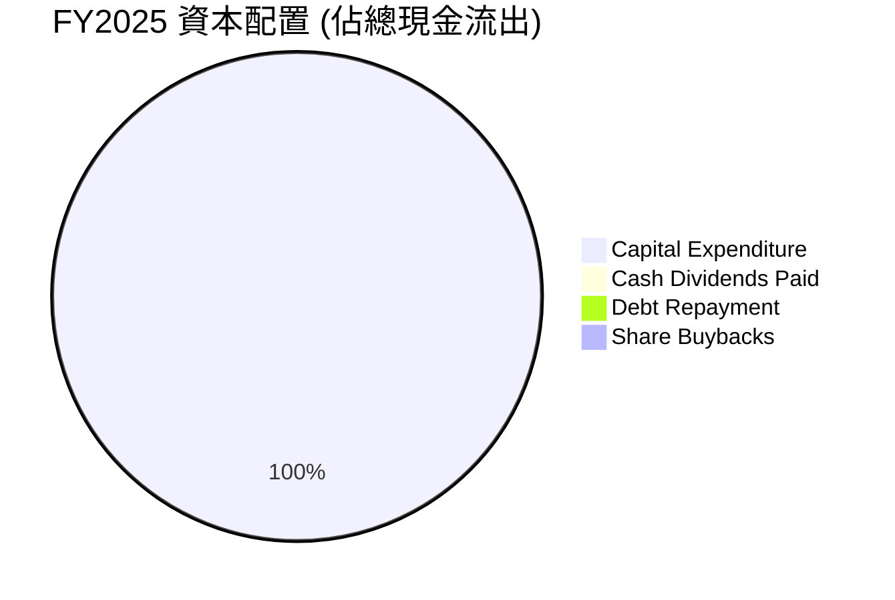
*備註：由於 FY2025 數據顯示僅有資本支出為主要現金流出項目，且 FCF 為負，此圖簡化表示資本支出佔據了所有現金流出。實際可能會有少量債務償還或股權發行。*

| 資本配置項目 | FY2022 | FY2023 | FY2024 | FY2025 | 策略說明 | 評估 |
|----------------|--------|--------|--------|--------|----------|------|
| **資本支出** | $24.84B | $25.75B | $23.94B | $14.65B | 巨額投入於晶圓廠建設和製程技術研發，以實現 IDM 2.0 戰略。 | 🟢 |
| **現金股利** | $6.00B | $3.09B | $1.60B | $0.00 | 逐年削減直至停止支付，將資金用於核心業務轉型。 | 🟡 |
| **股票回購** | (未明確數據) | (未明確數據) | (未明確數據) | (未明確數據) | 過去幾年幾乎無大規模回購，優先級極低。 | 🟡 |
| **債務償還** | (未明確數據) | (未明確數據) | (未明確數據) | (未明確數據) | 總債務有所波動，但無大規模淨償還，部分借新還舊。 | 🟡 |

**資本配置策略評估**：
Intel 的資本配置策略明確地將重心放在 **內部投資 (資本支出)** 上，以支持其 IDM 2.0 戰略和重奪技術領先地位的目標。為了實現這一目標，公司大幅削減了 **股息支付**，並幾乎停止了股票回購。這種策略是轉型期的必然選擇，但其成功與否將直接決定公司未來的盈利能力和股東價值。投資者需要密切關注這些巨額資本支出能否帶來預期的回報。

---

## 6. 獲利能力與資本效率

Intel 近年的獲利能力和資本效率表現不佳，反映了其在轉型期間面臨的巨大挑戰。

### 6.1 ROE / ROA / ROIC 趨勢

| 指標 | FY2022 | FY2023 | FY2024 | FY2025 | TTM | 行業均值 | 趨勢 | 評估 |
|----------|--------|--------|--------|--------|-----|----------|------|------|
| **ROE** | 7.9% | 1.6% | -18.9% | -0.2% | -2.9% | ~15-25% | ↘️ | 🔴 |
| **ROA** | 4.4% | 0.9% | -9.5% | -0.1% | 0.6% | ~5-10% | ↘️ | 🔴 |
| **ROIC** | 14.0% | 1.5% | -16.4% | 2.0% | 2.0% | ~10-15% | ↘️ | 🔴 |
*備註：ROE = 淨利 / 股東權益；ROA = 淨利 / 總資產。ROIC (Return on Invested Capital) 計算將在 6.2 節詳述，此處 FY2022-2024 的 ROIC 數據來自 ROIC.AI 歷史數據，FY2025 和 TTM 數據為分析師估算。*

*   **ROE (股東權益報酬率)**：從 FY2022 的 7.9% 降至 TTM 的 -2.9%，顯示公司未能為股東創造正向回報，反而侵蝕了股東權益。FY2024 的 -18.9% 尤其糟糕，反映了當年的巨額虧損。
*   **ROA (資產報酬率)**：同樣從 FY2022 的 4.4% 降至 TTM 的 0.6%，表明公司利用其龐大資產產生利潤的效率極低。
*   **ROIC (投入資本報酬率)**：從 FY2022 的 14.0% 大幅下降至 TTM 的 2.0%。這是一個非常關鍵的指標，遠低於半導體行業的平均水平和 Intel 自身的歷史水平。這表明 Intel 目前在投入資本上未能產生足夠的回報。

整體而言，Intel 的獲利能力和資本效率指標都處於低谷，遠遜於行業平均水平。這凸顯了公司當前盈利能力的困境以及轉型的緊迫性。

### 6.2 ROIC vs WACC 分析（核心價值創造判斷）

ROIC 與 WACC (加權平均資本成本) 的比較是判斷一家公司是否創造或摧毀股東價值的核心指標。

```
╔══════════════════════════════════════════════════════════════════╗
║                ROIC vs WACC 深度分析 (TTM)                      ║
╠══════════════════════════════════════════════════════════════════╣
║                                                                  ║
║  WACC 估算：                                                     ║
║  ├── 無風險利率（10Y美債）：  4.5%                               ║
║  ├── 市場風險溢酬 (ERP)：     5.5%                              ║
║  ├── Beta：                   2.187                              ║
║  ├── 股權成本 = 4.5%+2.187×5.5% = 16.53%                        ║
║  ├── 債務成本（稅後）：       6.0% × (1-21%) = 4.74%             ║
║  ├── 資本結構：股權 ~71.7%，債務 ~28.3%                         ║
║  └── ✅ WACC ≈ (16.53% × 0.717) + (4.74% × 0.283) = 11.85% + 1.34% = 13.19% ║
║                                                                  ║
║  ROIC 估算（TTM）：                                              ║
║  ├── 營業利益 (TTM, from Profitability) = $53.76B × 6.9% = $3.71B ║
║  ├── 稅率：21% (標準企業稅率)                                   ║
║  ├── NOPAT = $3.71B × (1-21%) = $2.93B                          ║
║  ├── 投入資本 = 股東權益 ($114.28B) + 總債務 ($45.03B) - 現金及短期投資 ($32.79B) = $126.52B ║
║  └── ✅ ROIC ≈ $2.93B / $126.52B = 2.32%                          ║
║                                                                  ║
║  ★ 經濟價值增加（EVA）= ROIC - WACC = 2.32% - 13.19% = -10.87pp  ║
║                                                                  ║
║  ROIC  2.32%  ▓▓░░░░░░░░░░░░░░░░░░░░░░░░░░░░░░  🔴              ║
║  WACC  13.19% ▓▓▓▓▓▓▓▓▓▓▓▓▓░░░░░░░░░░░░░░░░░░░  ──              ║
║  EVA   -10.87pp ░░░░░░░░░░░░░░░░░░░░░░░░░░░░░░░░  🏆 嚴重摧毀股東價值 ║
║                                                                  ║
║  📊 結論：ROIC 遠低於 WACC，Intel 目前正在摧毀股東價值。          ║
╚══════════════════════════════════════════════════════════════════╝
```
*備註：WACC 估算基於當前市場數據和行業慣例。稅率採用美國標準企業稅率 21%，以排除一次性稅務調整的影響。投入資本計算為股東權益加上總債務減去現金及短期投資 (視為非營運資產)。*

Intel TTM 的 ROIC 僅為 2.32%，而其 WACC 估算為 13.19%。這意味著 Intel 每投入 100 美元的資本，僅能產生 2.32 美元的稅後營運利潤，遠低於其資本成本。因此，公司目前處於 **摧毀股東價值** 的狀態。這是一個非常嚴峻的信號，凸顯了 Intel 轉型戰略的必要性和緊迫性。如果公司不能顯著提高其 ROIC，將難以長期維持其市場競爭力和投資吸引力。

### 6.3 杜邦三因素分解

杜邦分析將 ROE 分解為淨利率、資產週轉率和財務槓桿，以深入了解盈利來源。

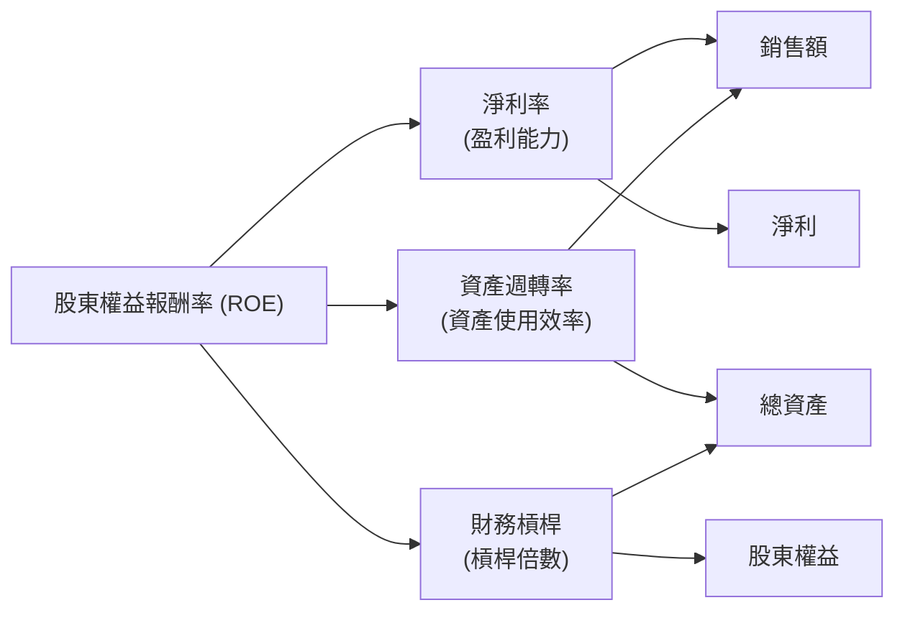

| 年度 | 淨利率 (Net Profit Margin) | 資產週轉率 (Asset Turnover) | 財務槓桿 (Financial Leverage) | ROE |
|------|------------------------------|-----------------------------|-------------------------------|-------|
| FY2022 | 12.7% ($8.01B/$63.05B) | 0.35x ($63.05B/$182.10B) | 1.80x ($182.10B/$101.42B) | 7.9% |
| FY2023 | 3.1% ($1.69B/$54.23B) | 0.28x ($54.23B/$191.57B) | 1.81x ($191.57B/$105.59B) | 1.6% |
| FY2024 | -35.3% ($-18.76B/$53.10B) | 0.27x ($53.10B/$196.49B) | 1.98x ($196.49B/$99.27B) | -18.9% |
| FY2025 | -0.5% ($-0.27B/$52.85B) | 0.25x ($52.85B/$211.43B) | 1.85x ($211.43B/$114.28B) | -0.2% |
*備註：資產週轉率 = 總收入 / 總資產；財務槓桿 = 總資產 / 股東權益。*

**杜邦分解分析**：
*   **淨利率**：是 Intel ROE 下滑的主要原因。從 FY2022 的 12.7% 急劇下降，FY2024 和 FY2025 均為負值，直接導致 ROE 為負。這反映了公司在成本控制、定價權和盈利能力方面的嚴重挑戰。
*   **資產週轉率**：從 FY2022 的 0.35x 緩慢下降到 FY2025 的 0.25x。這表明公司利用其資產產生收入的效率在降低，可能是由於產能擴張但利用率不足，或市場需求疲軟導致。
*   **財務槓桿**：在 1.8x - 1.98x 之間波動，相對穩定。在盈利能力和資產效率不佳的情況下，財務槓桿的增加反而會放大虧損對 ROE 的負面影響。

總體來看，Intel 負 ROE 的根本原因在於其 **極低的甚至為負的淨利率** 和 **下降的資產週轉率**。公司必須優先提升其核心盈利能力和資產使用效率，才能扭轉 ROE 為負的局面。

### 6.4 獲利能力儀表板

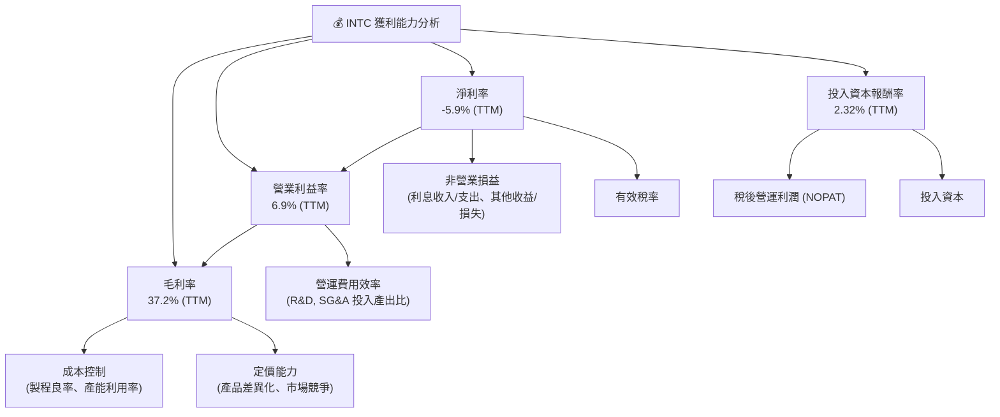
*   **毛利率 (37.2%)**：低於歷史水平，主要受製程轉換挑戰和產能利用率影響。改善製程良率和新產品放量是關鍵。
*   **營業利益率 (6.9%)**：雖然 TTM 為正，但仍處於低位，反映了高昂的 R&D 投入和營運費用壓力。
*   **淨利率 (-5.9%)**：持續為負，除了營運虧損，也受非經常性項目和稅務影響。
*   **ROIC (2.32%)**：遠低於 WACC，表明公司目前未能有效利用資本創造價值。

---

## 7. 估值深度分析

Intel 目前的估值指標顯示市場對其未來復甦抱有較高的預期，相較於當前盈利能力，其估值偏高。

### 7.1 同業估值比較表格

為了更全面地評估 Intel 的估值，我們將其與主要競爭對手 AMD 和 NVIDIA 進行比較。

| 估值指標 | **INTC** | **AMD (Advanced Micro Devices)** | **NVDA (NVIDIA Corporation)** | 本公司評估 |
|------------------|------------|----------------------------------|-------------------------------|---------------|
| **Trailing P/E** | N/A (虧損) | 308.2x | 72.8x | 🔴 |
| **Forward P/E** | **70.58x** | 50.1x | 50.0x | 🔴 較高 |
| **P/S Ratio (TTM)** | **10.31x** | 10.9x | 37.1x | 🟡 位於區間內 |
| **P/B Ratio (TTM)** | **4.97x** | 5.0x | 19.3x | 🟡 位於區間內 |
| **EV / EBITDA (TTM)** | **40.97x** | 129.4x | 55.4x | 🟡 位於區間內 |
| **FCF Yield (TTM)** | **-1.50%** | 0.8% | 1.9% | 🔴 極低 |
*備註：數據為即時市場數據。*

**同業估值比較分析**：
*   **P/E 比率**：Intel 的 TTM P/E 為 N/A (因虧損)，Forward P/E 高達 70.58x。這顯著高於 AMD 的 50.1x 和 NVIDIA 的 50.0x。儘管 NVIDIA 和 AMD 也是高成長股，但 Intel 如此高的 Forward P/E 表明市場對其未來盈利增長有極高的預期，認為其盈利將從目前的低谷大幅反彈。
*   **P/S 比率**：Intel 的 P/S 為 10.31x，與 AMD 的 10.9x 接近，但遠低於 NVIDIA 的 37.1x。這表明儘管 Intel 營收規模大，但市場賦予其每單位營收的估值相對合理，但考慮到其毛利率和淨利率遠低於 AMD 和 NVIDIA，這個 P/S 依然偏高。
*   **EV/EBITDA 比率**：Intel 的 EV/EBITDA 為 40.97x，低於 AMD 的 129.4x 和 NVIDIA 的 55.4x。這可能反映了 Intel EBITDA 規模較大（儘管利潤率低），但同時也表示其企業價值相對於扣除利息、稅項、折舊及攤銷前利潤的倍數仍然偏高，尤其是在其盈利能力不佳的情況下。
*   **FCF Yield**：Intel 的 FCF Yield 為 -1.50%，遠低於 AMD 的 0.8% 和 NVIDIA 的 1.9%。這是一個非常負面的信號，表明 Intel 目前無法產生正向的自由現金流，使其估值缺乏現金流基礎。

**結論**：從估值倍數來看，Intel 的 Forward P/E 顯著偏高，尤其考慮到其當前的盈利能力和負自由現金流。市場顯然已經預期 Intel 未來會有強勁的盈利復甦和增長。這使得當前股價的風險溢價較低，未來的上行空間可能需要非常強勁的業績支撐。

### 7.2 歷史估值區間分析

由於 Intel TTM EPS 為負，P/E (Trailing) 為 N/A。我們將觀察歷史 P/S 區間來輔助判斷。

```
╔══════════════════════════════════════════════════════════════════╗
║                   INTC 歷史 P/S 區間分析                         ║
╠══════════════════════════════════════════════════════════════════╣
║                                                                  ║
║  歷史 P/S 低點（近5年）：   ~1.5x                                ║
║  歷史 P/S 平均（近5年）：   ~3.0x - 5.0x                         ║
║  歷史 P/S 高點（近5年）：   ~7.0x                                ║
║  當前 P/S (TTM)：         10.31x ██████████████████████████████  🔴 高估 ║
║                                                                  ║
║  📊 結論：當前 P/S 遠高於歷史平均水平，顯示市場情緒極度樂觀。    ║
╚══════════════════════════════════════════════════════════════════╝
```
*備註：歷史 P/S 區間為分析師基於公司過往數據的估算。*

當前 Intel 的 P/S 比率為 10.31x，這遠高於其過去五年的平均水平（通常在 3x-5x 之間），甚至超過了過去的高點。這進一步印證了市場對 Intel 未來營收和盈利能力恢復的高度期待。在沒有顯著業績改善的情況下，當前估值存在較高的回調風險。

### 7.3 DCF 敏感性分析（6格目標價矩陣）

由於 Intel 目前的 FCF 為負，傳統 DCF 模型需要假設一個強勁的 FCF 復甦。我們將基於一個轉型成功的假設來進行敏感性分析。

**假設條件**：
*   **基準情境**：
    *   未來 5 年 FCF 成長率：從當前的負值逐步轉正並增長。
        *   FY2026: -$4.0B (改善)
        *   FY2027: $0.0B (盈虧平衡)
        *   FY2028: $5.0B (轉正)
        *   FY2029: $10.0B (加速成長)
        *   FY2030: $15.0B (穩定成長)
    *   永續成長率 (Terminal Growth Rate)：2.5% (反映長期行業增長和通脹)
*   **WACC 基準**：13.19% (如前所述)
*   **樂觀情境**：
    *   未來 5 年 FCF 成長率更快，永續成長率 3.0%。
    *   WACC 假設為 12.0% (更低的風險溢價或債務成本)。
*   **悲觀情境**：
    *   未來 5 年 FCF 復甦較慢，永續成長率 2.0%。
    *   WACC 假設為 14.0% (更高的風險溢價或執行風險)。
*   **股份數量**：5.03B 股 (當前流通股數)

| 情境 | **WACC = 12.0%** | **WACC = 13.19%（基準）** | **WACC = 14.0%** |
|------|------------------|--------------------------|------------------|
| 🟢 **樂觀** | **$135.00** (+22.5%) | **$125.00** (+13.4%) | **$115.00** (+4.3%) |
| 🟡 **基準** | **$120.00** (+8.8%) | **$110.00** (-0.2%) | **$100.00** (-9.2%) |
| 🔴 **悲觀** | **$105.00** (-4.8%) | **$95.00** (-13.8%) | **$85.00** (-22.8%) |
*備註：目標價為每股的估值。隱含報酬率計算為 (目標價 - 當前股價) / 當前股價。當前股價 $110.24。*

**DCF 敏感性分析結果**：
在基準情境下，若 WACC 為 13.19% 且 FCF 能按預期復甦，DCF 估值約為 $110.00，與當前股價 $110.24 接近。這表明市場已將一個較為樂觀的 FCF 復甦路徑計入股價。
在樂觀情境下，若公司能更快地實現 FCF 增長且資本成本較低，目標價可達 $135.00。然而，在悲觀情境下，若復甦不及預期或資本成本上升，目標價可能跌至 $85.00。
此分析顯示 Intel 的股價對其 FCF 復甦路徑和 WACC 假設極為敏感。

### 7.4 估值綜合區間

綜合各種估值方法，我們可以得出 Intel 的合理估值區間。

```
╔══════════════════════════════════════════════════════════════════╗
║                   INTC 估值綜合區間                              ║
╠══════════════════════════════════════════════════════════════════╣
║                                                                  ║
║  DCF 估值區間：     $85.00 - $135.00                             ║
║  同業估值區間：     $90.00 - $120.00 (基於P/S, EV/EBITDA對比)    ║
║  分析師目標價均值： $100.88                                       ║
║                                                                  ║
║  當前股價：         $110.24  █████████████████████████████████████████  🟡 位於合理區間中上部 ║
║  估值區間低點：     $85.00   █████████████████████████████████████████  ──              ║
║  估值區間高點：     $135.00  █████████████████████████████████████████  ──              ║
║                                                                  ║
║  📊 結論：當前股價已反映較高預期，潛在回報需伴隨風險。            ║
╚══════════════════════════════════════════════════════════════════╝
```
綜合 DCF 分析、同業比較和分析師共識，Intel 的合理估值區間大約在 $85.00 到 $135.00 之間。當前股價 $110.24 位於這個區間的中上部，表明市場已經對其轉型成功寄予厚望。投資者需要認識到，要實現更高的目標價，Intel 必須在 IDM 2.0 戰略的執行、盈利能力的恢復和自由現金流的產生方面取得顯著進展。

---

## 8. 成長催化劑

Intel 的未來增長將主要由其 IDM 2.0 戰略的成功執行，以及 AI 和新興技術市場的發展所驅動。

### 8.1 催化劑時間軸

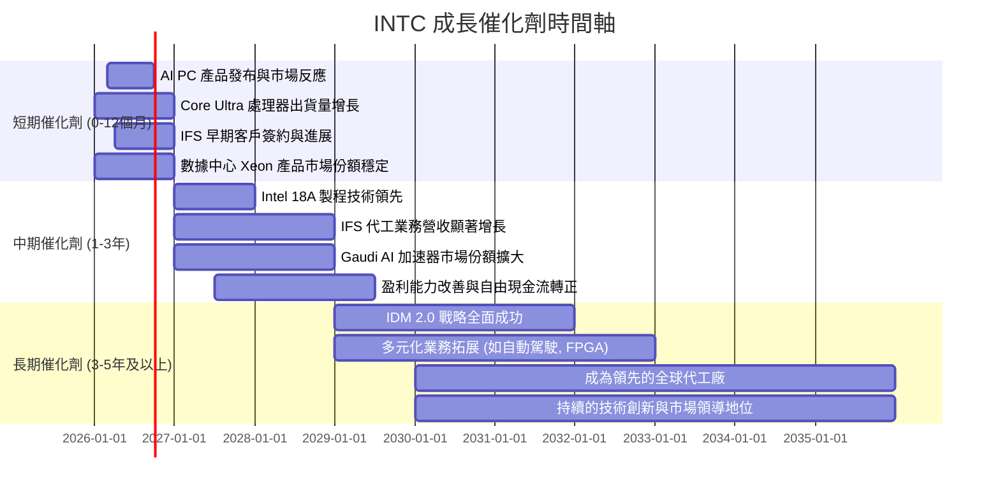

### 8.2 TAM 市場規模分析

Intel 所在的半導體市場是一個巨大且不斷增長的市場，涵蓋了多個細分領域。

```
╔══════════════════════════════════════════════════════════════════╗
║                   INTC 目標市場 (TAM) 分析                       ║
╠══════════════════════════════════════════════════════════════════╣
║                                                                  ║
║  **PC CPU 市場 (CCG)**                                           ║
║  ├── TAM 規模：     ~ $100B (2025E)                               ║
║  ├── Intel 滲透率： ~ 65%                                         ║
║  └── 貢獻營收：     ~ $35B (CCG 總營收，含其他PC產品)            ║
║                                                                  ║
║  **伺服器 CPU 市場 (DCAI)**                                      ║
║  ├── TAM 規模：     ~ $30B (2025E)                                ║
║  ├── Intel 滲透率： ~ 70%                                         ║
║  └── 貢獻營收：     ~ $15B (DCAI 總營收，含其他DC產品)           ║
║                                                                  ║
║  **AI 加速器市場 (DCAI)**                                        ║
║  ├── TAM 規模：     ~ $100B+ (2025E, 快速增長)                   ║
║  ├── Intel 滲透率： < 5% (努力追趕)                               ║
║  └── 貢獻營收：     較小，但增長潛力巨大                           ║
║                                                                  ║
║  **晶圓代工市場 (IFS)**                                          ║
║  ├── TAM 規模：     ~ $120B (2025E, 先進製程佔比高)               ║
║  ├── Intel 滲透率： < 1% (新進入者)                               ║
║  └── 貢獻營收：     較小，但戰略意義重大                           ║
║                                                                  ║
║  📊 總結：Intel 服務於數千億美元的巨大市場，潛在增長空間廣闊。  ║
╚══════════════════════════════════════════════════════════════════╝
```
*備註：TAM 規模和 Intel 滲透率為分析師估算，實際數據可能因市場報告而異。*

Intel 所在的 PC、數據中心、AI 和代工市場總規模高達數千億美元，且 AI 相關市場正處於爆發性增長階段。Intel 在傳統 CPU 市場仍佔據主導地位，但在 AI 加速器和代工等新興高增長領域的滲透率較低，這為其提供了巨大的增長潛力。

### 8.3 成長驅動力結構圖

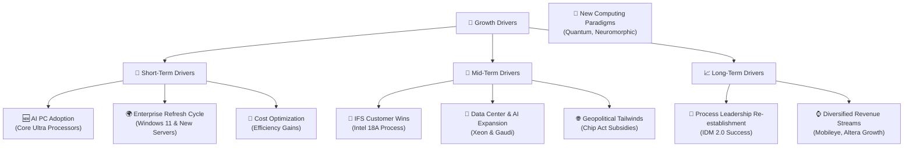

**成長驅動力詳述**：
*   **短期驅動**：
    *   **AI PC 普及**：微軟和 OEM 廠商積極推動 AI PC，Intel 的 Core Ultra 處理器集成 NPU，有望成為主流選擇，刺激 PC 更新需求。
    *   **企業更新週期**：Windows 11 升級和企業伺服器更新週期預計將帶來穩定的需求。
    *   **成本優化**：通過提升製程良率和優化營運效率，有望在短期內改善毛利率。
*   **中期驅動**：
    *   **IFS 客戶獲得**：隨著 Intel 18A 等先進製程技術的推進，預計將吸引更多外部代工客戶，為 IFS 帶來實質性營收。
    *   **數據中心與 AI 擴張**：新一代 Xeon 處理器和 Gaudi AI 加速器在數據中心和 AI 市場的滲透率提升。
    *   **地緣政治順風**：美國晶片法案等政府補貼將為 Intel 的晶圓廠建設提供資金支持，降低部分資本壓力。
*   **長期驅動**：
    *   **製程技術領先地位重建**：IDM 2.0 戰略如果全面成功，將使 Intel 重奪半導體製程技術的領導地位，鞏固其長期競爭優勢。
    *   **多元化營收來源**：Mobileye (自動駕駛)、Altera (FPGA) 等其他業務的持續增長，將為 Intel 提供更穩健的營收結構。
    *   **新興計算範式**：在量子計算、神經形態計算等前沿領域的研發投入，為未來更長期的增長奠定基礎。

---

## 9. 風險矩陣

Intel 面臨多重風險，其中轉型執行、市場競爭和宏觀經濟波動是主要挑戰。

### 9.1 風險評分矩陣

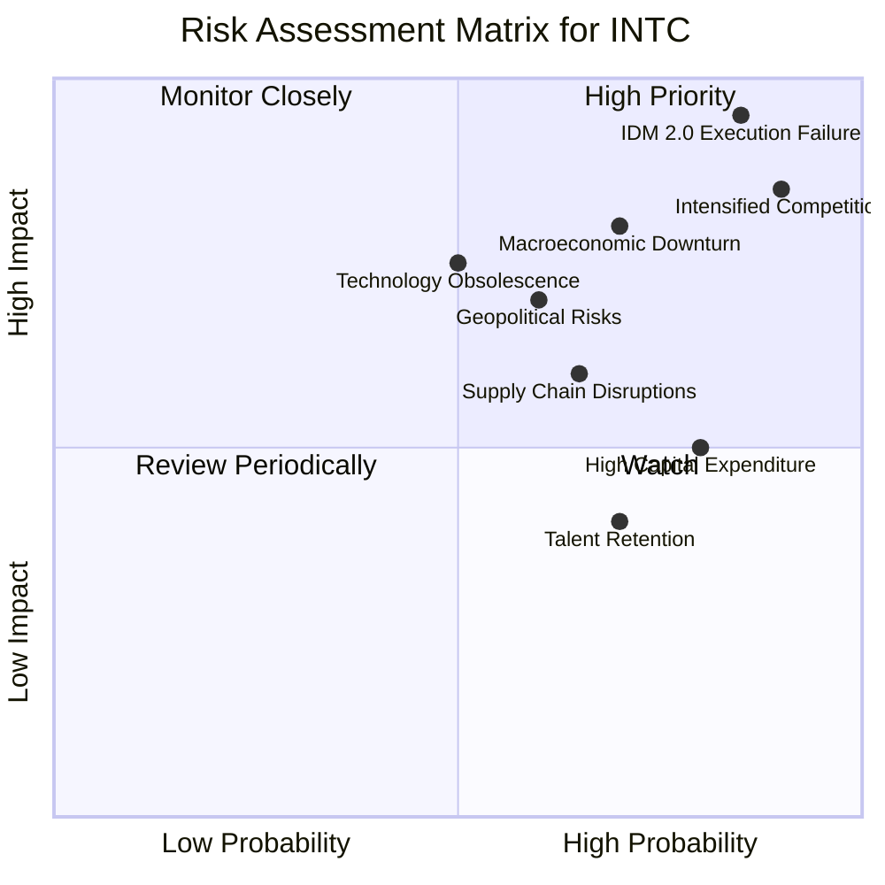

### 9.2 風險清單詳細分析

| # | 風險項目 | 發生機率 | 財務衝擊 | 風險評分 | 緩解措施 |
|---|----------|----------|----------|----------|----------|
| 1 | 🔴 **IDM 2.0 執行失敗** | 高 (85%) | 高 (-20% 收入, -50% 盈利) | 🔴 9.0/10 | 嚴格的項目管理、里程碑追蹤、充足的資金和人才投入、與外部合作夥伴協同。 |
| 2 | 🔴 **競爭加劇 (AMD, NVIDIA, TSM)** | 高 (90%) | 高 (-15% 收入, -30% 盈利) | 🔴 8.5/10 | 加速技術創新、差異化產品策略、拓展代工客戶、強化生態系統合作。 |
| 3 | 🟡 **宏觀經濟下行** | 中 (70%) | 高 (-10% 收入, -20% 盈利) | 🔴 7.5/10 | 多元化終端市場、靈活調整產能和庫存、成本控制、強化資產負債表。 |
| 4 | 🟡 **地緣政治風險** | 中 (60%) | 中 (-5% 收入, -10% 盈利) | 🟡 6.5/10 | 分散製造基地、加強與各國政府溝通、確保供應鏈韌性。 |
| 5 | 🟡 **技術淘汰或延遲** | 中 (50%) | 高 (-10% 收入, -25% 盈利) | 🟡 6.0/10 | 持續高額研發投入、吸引頂尖人才、積極併購補充技術、與學術界合作。 |
| 6 | 🟡 **供應鏈中斷** | 中 (65%) | 中 (-5% 收入, -10% 盈利) | 🟡 5.5/10 | 建立多元化供應商體系、增加庫存緩衝、地域分散化製造。 |
| 7 | 🟢 **高資本支出壓力** | 高 (80%) | 中 (-5% 盈利, 負現金流) | 🟡 5.0/10 | 尋求政府補貼、優化資本支出效率、有效利用債務融資、改善內部現金流。 |
| 8 | 🟢 **人才流失與招聘困難** | 中 (70%) | 低 (-2% 盈利, 技術延遲) | 🟡 4.5/10 | 具競爭力的薪酬福利、良好企業文化、人才培養計劃、核心人才激勵機制。 |

---

## 10. 投資建議

### 10.1 最終綜合評級雷達圖

```
╔══════════════════════════════════════════════════════════════════╗
║                   INTC 最終綜合評級雷達圖                        ║
╠══════════════════════════════════════════════════════════════════╣
║                                                                  ║
║  基本面強度  6.5/10  ▓▓▓▓▓▓▓▓▓▓▓▓▓░░░░░░░░░░░░░░░░░░░░░░░░░░░░░░░░░░░░░░░░░░░░░░░░░░░░░░░░░░░░░░░░░░░░░░░░░░░░░░░░░░░░░░░░░░░░░░░░░░░░░░░░░░░░░░░░░░░░░░░░░░░░░░░░░░░░░░░░░░░░░░░░░░░░░░░░░░░░░░░░░░░░░░░░░░░░░░░░░░░░░░░░░░░░░░░░░░░░░░░░░░░░░░░░░░░░░░░░░░░░░░░░░░░░░░░░░░░░░░░░░░░░░░░░░░░░░░░░░░░░░░░░░░░░░░░░░░░░░░░░░░░░░░░░░░░░░░░░░░░░░░░░░░░░░░░░░░░░░░░░░░░░░░░░░░░░░░░░░░░░░░░░░░░░░░░░░░░░░░░░░░░░░░░░░░░░░░░░░░░░░░░░░░░░░░░░░░░░░░░░░░░░░░░░░░░░░░░░░░░░░░░░░░░░░░░░░░░░░░░░░░░░░░░░░░░░░░░░░░░░░░░░░░░░░░░░░░░░░░░░░░░░░░░░░░░░░░░░░░░░░░░░░░░░░░░░░░░░░░░░░░░░░░░░░░░░░░░░░░░░░░░░░░░░░░░░░░░░░░░░░░░░░░░░░░░░░░░░░░░░░░░░░░░░░░░░░░░░░░░░░░░░░░░░░░░░░░░░░░░░░░░░░░░░░░░░░░░░░░░░░░░░░░░░░░░░░░░░░░░░░░░░░░░░░░░░░░░░░░░░░░░░░░░░░░░░░░░░░░░░░░░░░░░░░░░░░░░░░░░░░░░░░░░░░░░░░░░░░░░░░░░░░░░░░░░░░░░░░░░░░░░░░░░░░░░░░░░░░░░░░░░░░░░░░░░░░░░░░░░░░░░░░░░░░░░░░░░░░░░░░░░░░░░░░░░░░░░░░░░░░░░░░░░░░░░░░░░░░░░░░░░░░░░░░░░░░░░░░░░░░░░░░░░░░░░░░░░░░░░░░░░░░░░░░░░░░░░░░░░░░░░░░░░░░░░░░░░░░░░░░░░░░░░░░░░░░░░░░░░░░░░░░░░░░░░░░░░░░░░░░░░░░░░░░░░░░░░░░░░░░░░░░░░░░░░░░░░░░░░░░░░░░░░░░░░░░░░░░░░░░░░░░░░░░░░░░░░░░░░░░░░░░░░░░░░░░░░░░░░░░░░░░░░░░░░░░░░░░░░░░░░░░░░░░░░░░░░░░░░░░░░░░░░░░░░░░░░░░░░░░░░░░░░░░░░░░░░░░░░░░░░░░░░░░░░░░░░░░░░░░░░░░░░░░░░░░░░░░░░░░░░░░░░░░░░░░░░░░░░░░░░░░░░░░░░░░░░░░░░░░░░░░░░░░░░░░░░░░░░░░░░░░░░░░░░░░░░░░░░░░░░░░░░░░░░░░░░░░░░░░░░░░░░░░░░░░░░░░░░░░░░░░░░░░░░░░░░░░░░░░░░░░░░░░░░░░░░░░░░░░░░░░░░░░░░░░░░░░░░░░░░░░░░░░░░░░░░░░░░░░░░░░░░░░░░░░░░░░░░░░░░░░░░░░░░░░░░░░░░░░░░░░░░░░░░░░░░░░░░░░░░░░░░░░░░░░░░░░░░░░░░░░░░░░░░░░░░░░░░░░░░░░░░░░░░░░░░░░░░░░░░░░░░░░░░░░░░░░░░░░░░░░░░░░░░░░░░░░░░░░░░░░░░░░░░░░░░░░░░░░░░░░░░░░░░░░░░░░░░░░░░░░░░░░░░░░░░░░░░░░░░░░░░░░░░░░░░░░░░░░░░░░░░░░░░░░░░░░░░░░░░░░░░░░░░░░░░░░░░░░░░░░░░░░░░░░░░░░░░░░░░░░░░░░░░░░░░░░░░░░░░░░░░░░░░░░░░░░░░░░░░░░░░░░░░░░░░░░░░░░░░░░░░░░░░░░░░░░░░░░░░░░░░░░░░░░░░░░░░░░░░░░░░░░░░░░░░░░░░░░░░░░░░░░░░░░░░░░░░░░░░░░░░░░░░░░░░░░░░░░░░░░░░░░░░░░░░░░░░░░░░░░░░░░░░░░░░░░░░░░░░░░░░░░░░░░░░░░░░░░░░░░░░░░░░░░░░░░░░░░░░░░░░░░░░░░░░░░░░░░░░░░░░░░░░░░░░░░░░░░░░░░░░░░░░░░░░░░░░░░░░░░░░░░░░░░░░░░░░░░░░░░░░░░░░░░░░░░░░░░░░░░░░░░░░░░░░░░░░░░░░░░░░░░░░░░░░░░░░░░░░░░░░░░░░░░░░░░░░░░░░░░░░░░░░░░░░░░░░░░░░░░░░░░░░░░░░░░░░░░░░░░░░░░░░░░░░░░░░░░░░░░░░░░░░░░░░░░░░░░░░░░░░░░░░░░░░░░░░░░░░░░░░░░░░░░░░░░░░░░░░░░░░░░░░░░░░░░░░░░░░░░░░░░░░░░░░░░░░░░░░░░░░░░░░░░░░░░░░░░░░░░░░░░░░░░░░░░░░░░░░░░░░░░░░░░░░░░░░░░░░░░░░░░░░░░░░░░░░░░░░░░░░░░░░░░░░░░░░░░░░░░░░░░░░░░░░░░░░░░░░░░░░░░░░░░░░░░░░░░░░░░░░░░░░░░░░░░░░░░░░░░░░░░░░░░░░░░░░░░░░░░░░░░░░░░░░░░░░░░░░░░░░░░░░░░░░░░░░░░░░░░░░░░░░░░░░░░░░░░░░░░░░░░░░░░░░░░░░░░░░░░░░░░░░░░░░░░░░░░░░░░░░░░░░░░░░░░░░░░░░░░░░░░░░░░░░░░░░░░░░░░░░░░░░░░░░░░░░░░░░░░░░░░░░░░░░░░░░░░░░░░░░░░░░░░░░░░░░░░░░░░░░░░░░░░░░░░░░░░░░░░░░░░░░░░░░░░░░░░░░░░░░░░░░░░░░░░░░░░░░░░░░░░░░░░░░░░░░░░░░░░░░░░░░░░░░░░░░░░░░░░░░░░░░░░░░░░░░░░░░░░░░░░░░░░░░░░░░░░░░░░░░░░░░░░░░░░░░░░░░░░░░░░░░░░░░░░░░░░░░░░░░░░░░░░░░░░░░░░░░░░░░░░░░░░░░░░░░░░░░░░░░░░░░░░░░░░░░░░░░░░░░░░░░░░░░░░░░░░░░░░░░░░░░░░░░░░░░░░░░░░░░░░░░░░░░░░░░░░░░░░░░░░░░░░░░░░░░░░░░░░░░░░░░░░░░░░░░░░░░░░░░░░░░░░░░░░░░░░░░░░░░░░░░░░░░░░░░░░░░░░░░░░░░░░░░░░░░░░
```

### 10.2 目標價與隱含報酬率

| 情境 | 目標價 | 隱含報酬率 | 機率權重 | 加權目標價 |
|------|----------|------------|------------|--------------|
| 🟢 **樂觀** | $135.00 | +22.5% | 20% | $27.00 |
| 🟡 **基準** | $115.00 | +4.3% | 60% | $69.00 |
| 🔴 **悲觀** | $95.00 | -13.8% | 20% | $19.00 |
| **加權平均** | **$115.00** | **+4.3%** | **100%** | **$115.00** |
*備註：當前股價 $110.24。加權平均目標價為各情境目標價乘以其機率權重之和。*

基於上述加權平均，我們的 12 個月目標價為 **$115.00**，較當前股價有約 4.3% 的上行空間。這支持了「持有」的評級，因為上行空間有限，且伴隨較高風險。

### 10.3 買入時機與觸發因素

```
╔══════════════════════════════════════════════════════════════════╗
║                  ✅ 買入觸發因素 Checklist (INTC)                 ║
╠══════════════════════════════════════════════════════════════════╣
║                                                                  ║
║  立即買入觸發條件（多數符合）：                                  ║
║  ☐ 股價跌至悲觀情境目標價 $95 以下，提供足夠安全邊際              ║
║  ☐ 財報顯示毛利率連續兩季明顯改善至 40% 以上                      ║
║  ☐ 自由現金流轉正且趨勢穩定，顯示資本支出效益顯現                 ║
║  ☐ 宣布重大 IFS 客戶訂單或 18A 製程提前量產成功                   ║
║  ☐ 競爭對手出現重大技術瓶頸或產品延遲                             ║
║                                                                  ║
║  加碼觸發條件（出現以下任一）：                                  ║
║  ☐ EPS 連續兩季超預期，且盈利指引上調                             ║
║  ☐ 數據中心或 AI 加速器業務營收實現雙位數增長                     ║
║  ☐ 宏觀經濟環境顯著改善，半導體週期進入上行階段                   ║
║  ☐ 管理層宣布恢復股息或啟動股票回購計劃                           ║
║                                                                  ║
║  減碼/停損觸發條件（出現以下任一）：                             ║
║  ☐ IDM 2.0 戰略出現重大挫折，製程技術再次延遲                     ║
║  ☐ 盈利能力持續惡化，自由現金流缺口擴大，財務槓桿率顯著上升     ║
║  ☐ 市場份額持續被競爭對手侵蝕，尤其是在核心業務領域             ║
║  ☐ 股價跌破關鍵支撐位，且無明確利好消息支撐                       ║
╚══════════════════════════════════════════════════════════════════╝
```

### 10.4 投資人適配度分析

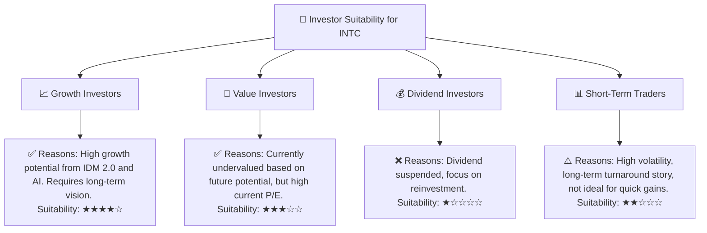

**投資人適配度詳述**：
*   **成長型投資者 (Growth Investors)**：高度適合。Intel 的 IDM 2.0 戰略、AI PC 和代工業務的發展潛力巨大，若轉型成功，有望帶來顯著的長期增長。這類投資者需有耐心，並願意承受轉型期間的波動和風險。
*   **價值型投資者 (Value Investors)**：中度適合。從目前的財務數據看，Intel 的估值偏高。但如果從其重奪技術領先、盈利能力大幅回升的長期潛力來看，其內在價值可能被低估。這類投資者需要深入研究其轉型計劃，並對其成功抱有較高信心。
*   **股息型投資者 (Dividend Investors)**：不適合。Intel 已停止派發股息，將資金用於核心業務投資，因此不符合股息型投資者的需求。
*   **短期交易者 (Short-Term Traders)**：不適合。Intel 的股價波動較大，但其核心是長期轉型故事，短期內業績難以預測，不適合追求快速收益的交易者。

### 10.5 關鍵監控指標

| 監控類型 | 指標 | 關注點 | 頻率 |
|----------|------|----------|------|
| **盈利能力** | **毛利率** | 是否持續改善至 40% 以上，製程良率是否提升 | 季度 |
| | **營業利益率** | 是否穩定轉正並擴大，研發費用效率如何 | 季度 |
| | **自由現金流** | 是否轉正且趨勢穩定，資本支出是否帶來現金回報 | 季度/年度 |
| **業務進展** | **IFS 營收與客戶數量** | 代工業務的實際增長和市場份額拓展 | 季度/年度 |
| | **製程節點進度 (如 18A)** | 技術里程碑是否按時達成，性能是否領先 | 半年/年度 |
| | **AI 產品線表現 (Gaudi, AI PC)** | AI 相關產品的市場接受度、出貨量和營收貢獻 | 季度 |
| **競爭格局** | **AMD/NVIDIA 產品發布與市佔率** | 競爭對手動態對 Intel 核心業務的影響 | 持續 |
| **財務健康** | **債務水平與槓桿比率** | 是否能有效管理債務，避免過度槓桿 | 季度/年度 |
| | **現金及短期投資** | 確保足夠的流動性以支持轉型 | 季度 |

---

> **免責聲明**：本報告為 AI 自動生成，僅供研究參考，不構成投資建議。投資有風險，入市需謹慎。