# INTC 基本面深度分析報告
> **報告日期**：2026-07-09 ｜ **語言**：繁體中文 ｜ **數據來源**：Yahoo Finance, Finviz, StockAnalysis, Roic.ai ｜ **分析師**：CFA 級機構研究

---

## 目錄

| # | 章節 | 核心結論 |
|---|------------------------|--------------------------------------------------|
| 1 | 執行摘要 | 評級：持有 ｜ 目標價區間：$60 - $150 |
| 2 | 公司概覽與商業模式 | 核心CPU業務護城河深厚，但新興業務面臨挑戰 |
| 3 | 損益表深度分析 | 營收波動且利潤率承壓，轉型期虧損擴大 |
| 4 | 資產負債表分析 | 現金充裕但債務增加，流動性良好但槓桿提高 |
| 5 | 現金流量深度分析 | 自由現金流持續負值，資本支出壓力巨大 |
| 6 | 獲利能力與資本效率 | TTM ROIC為負，目前正在摧毀股東價值 |
| 7 | 估值深度分析 | 當前估值偏高，市場已充分反映未來成長預期 |
| 8 | 成長催化劑 | IDM 2.0戰略、AI加速器、代工業務潛力 |
| 9 | 風險矩陣 | 競爭加劇、執行風險、高資本支出、宏觀經濟 |
| 10 | 投資建議 | 建議持有，等待轉型戰略明確成果及估值回歸合理 |

---

## 1. 執行摘要

### 1.1 核心評分儀表板

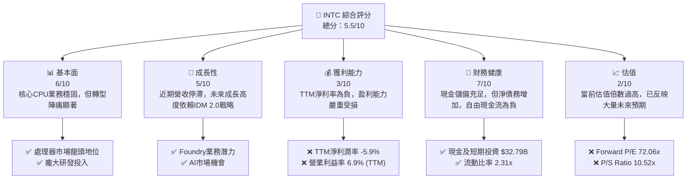

### 1.2 評分進度條視覺化

```
╔══════════════════════════════════════════════════════════════╗
║                INTC 多維度評分儀表板 (1-10分)                ║
╠══════════════════════════════════════════════════════════════╣
║ 基本面強度  6.0 ▓▓▓▓▓▓▓▓▓▓▓▓░░░░░░░░  ★★★☆☆           ║
║ 成長動能    5.0 ▓▓▓▓▓▓▓▓▓▓░░░░░░░░░░  ★★☆☆☆           ║
║ 獲利品質    3.0 ▓▓▓▓▓▓░░░░░░░░░░░░░░  ★☆☆☆☆           ║
║ 財務健康    7.0 ▓▓▓▓▓▓▓▓▓▓▓▓▓▓░░░░░░  ★★★☆☆           ║
║ 估值合理性  2.0 ▓▓▓▓░░░░░░░░░░░░░░░░  ☆☆☆☆☆           ║
║ 護城河深度  7.0 ▓▓▓▓▓▓▓▓▓▓▓▓▓▓░░░░░░  ★★★☆☆           ║
║ 管理層執行  6.0 ▓▓▓▓▓▓▓▓▓▓▓▓░░░░░░░░  ★★★☆☆           ║
║ 技術創新力  6.0 ▓▓▓▓▓▓▓▓▓▓▓▓░░░░░░░░  ★★★☆☆           ║
╠══════════════════════════════════════════════════════════════╣
║ 綜合總分    5.5 ▓▓▓▓▓▓▓▓▓▓▓░░░░░░░░░  🏆 評語：轉型中的挑戰者，市場預期高估值。║
╚══════════════════════════════════════════════════════════════╝
```

### 1.3 五大投資論點 + 三大核心風險

| 類型 | 項目 | 具體依據 | 信心度 |
|------|------|----------|--------|
| 🟢 **投資論點①** | **IDM 2.0 戰略驅動轉型** | 執行長Pat Gelsinger的IDM 2.0戰略，旨在恢復技術領先地位並建立代工業務，長期潛力巨大。公司正進行大規模資本支出以升級製程技術，例如投入$14.65B於2025年資本支出。 | 🟢 高 |
| 🟢 **投資論點②** | **AI 晶片市場潛力** | Intel正積極布局AI晶片領域，其Gaudi系列加速器及未來產品線有望在數據中心AI市場分一杯羹，儘管目前市場份額較小，但成長空間廣闊。 | 🟢 高 |
| 🟢 **投資論點③** | **核心 CPU 市場基礎穩固** | Intel在PC和伺服器CPU市場仍佔據主導地位，儘管面臨競爭，其龐大的客戶基礎和生態系統提供穩定的收入來源。TTM營收達到$53.76B。 | 🟡 中度 |
| 🟢 **投資論點④** | **先進製程技術的追趕** | 公司致力於在2025年前實現5個製程節點的突破 (5N4Y)，若能成功，將大幅提升其在半導體製造領域的競爭力，並吸引外部代工客戶。 | 🟡 中度 |
| 🟢 **投資論點⑤** | **強勁的資產負債表支持轉型** | 擁有$32.79B的現金及短期投資，儘管負債增加，但現金流動性仍能支持其高昂的資本支出和研發投入。 | 🟡 中度 |
| 🟡 **風險①** | **激烈市場競爭** | 在CPU領域面臨AMD的強勁挑戰，在AI加速器領域則面對NVIDIA的壓倒性優勢，以及來自ARM生態系統的潛在威脅。市場份額和定價能力可能受損。 | 🔴 高衝擊 |
| 🔴 **風險②** | **IDM 2.0 戰略執行風險** | 大規模的製程技術追趕和代工業務建立需要巨額投資和精準執行，任何延誤或技術瓶頸都可能導致資本效率低下，自由現金流持續為負（TTM FCF為$-8.30B）。 | 🔴 高衝擊 |
| 🔴 **風險③** | **宏觀經濟下行與半導體週期** | 半導體行業高度受宏觀經濟影響，全球經濟衰退可能導致PC和伺服器需求下降，進一步影響Intel的營收和盈利能力。FY2022-2025營收呈現下降趨勢。 | 🟡 中度 |

### 1.4 快速統計卡片

| 指標 | 公司實際值 | 行業均值估計 | S&P 500 均值估計 | 狀態 |
|-----------------|-------------|------------------|------------------|------|
| 收入 YoY 成長 (TTM) | **1.35%** | ~10-15% (半導體) | ~8% (S&P 500) | 🔴 |
| 毛利率 (TTM) | **37.2%** | ~45-55% (半導體) | ~35-40% (S&P 500) | 🟡 |
| 淨利率 (TTM) | **-5.9%** | ~15-25% (半導體) | ~10-12% (S&P 500) | 🔴 |
| ROE (TTM) | **-2.9%** | ~15-20% (半導體) | ~12-15% (S&P 500) | 🔴 |
| Forward P/E | **72.06x** | ~25-35x (半導體) | ~20-25x (S&P 500) | 🔴 |
| P/S Ratio | **10.52x** | ~5-8x (半導體) | ~2-3x (S&P 500) | 🔴 |
| EV / EBITDA | **40.91x** | ~15-25x (半導體) | ~10-15x (S&P 500) | 🔴 |
| 流動比率 | **2.31x** | ~1.5-2.0x | ~1.0-1.5x | 🟢 |
| 負債權益比 | **36.03%** | ~50-80% | ~80-120% | 🟢 |

### 1.5 投資結論

```
╔══════════════════════════════════════════════════════════════════╗
║                    📊 投資結論摘要                               ║
╠══════════════════════════════════════════════════════════════════╣
║  評級：🟡 持有                                                   ║
║  當前股價：$112.54                                               ║
║  目標價區間：                                                    ║
║    悲觀情境：$60（-46.7%）                                        ║
║    基準情境：$100（-11.0%）  ← 12個月主要目標                      ║
║    樂觀情境：$150（+33.3%）                                       ║
║  投資評分：5.5/10                                                ║
║  適合投資人：尋求長期轉型潛力的成長型投資者，但需有高風險承受能力。║
╚══════════════════════════════════════════════════════════════════╝
```

---

## 2. 公司概覽與商業模式

Intel Corporation (INTC) 是一家全球領先的半導體公司，設計、開發、製造、行銷和銷售計算及相關終端產品和服務。公司業務分為三大核心部門：客戶運算事業群 (Client Computing Group, CCG)、資料中心與人工智慧事業群 (Data Center and AI, DCAI) 以及 Intel 代工服務 (Intel Foundry)。

### 2.1 業務結構與收入來源

Intel的業務結構反映了其在計算領域的廣泛布局，從個人電腦到數據中心，再到新興的代工服務。

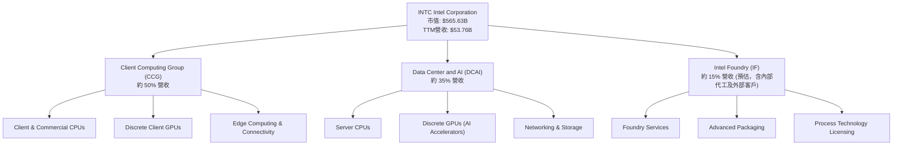
**業務部門說明**：
*   **客戶運算事業群 (CCG)**：主要提供個人電腦 (PC) 相關產品，包括客戶端和商用CPU、獨立顯示卡 (GPU)、邊緣運算和連接產品。這是Intel傳統的核心業務，佔比最大，但近年來受PC市場波動和競爭加劇影響。
*   **資料中心與人工智慧事業群 (DCAI)**：專注於數據中心和人工智慧解決方案，包括伺服器CPU、獨立GPU（如Gaudi系列AI加速器）和網路產品。此業務面臨NVIDIA和AMD的激烈競爭，但AI市場的爆發性成長為其帶來新的機會。
*   **Intel 代工服務 (Intel Foundry, IFS)**：這是Intel IDM 2.0戰略的核心組成部分，旨在向外部客戶提供半導體代工服務，並利用其內部製造能力。目前仍處於發展初期，但被視為Intel長期成長的關鍵驅動力。

**收入來源細分**：
儘管未提供各部門的具體營收佔比，但根據產業分析和Intel的歷史表現，CCG和DCAI是主要的收入來源。Intel Foundry預計將在未來幾年逐步貢獻更多外部收入，目前主要支撐內部產品製造。

### 2.2 市場份額

Intel在PC CPU和伺服器CPU市場擁有顯著的市場份額，但近年來面臨AMD的競爭壓力。在獨立GPU市場，Intel仍是小眾參與者，NVIDIA和AMD佔據主導地位。以下為市場份額估算：

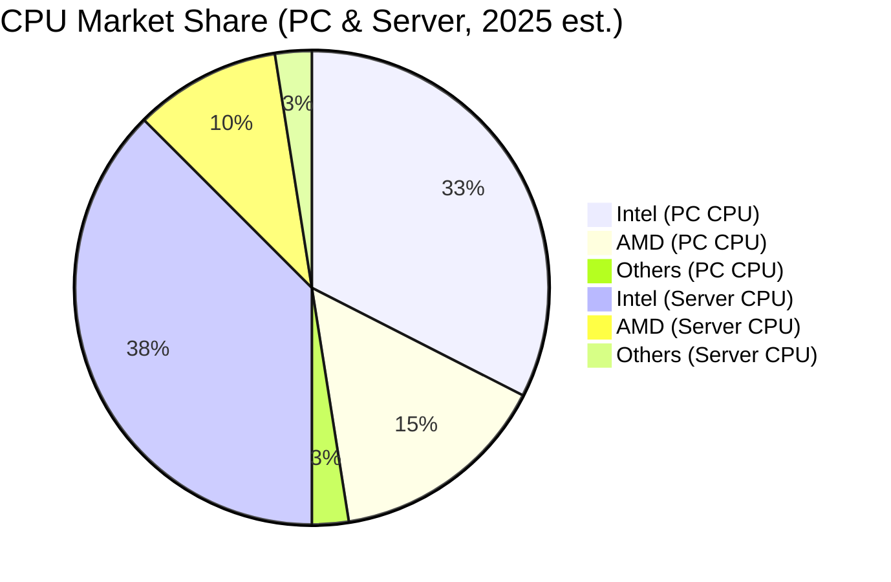
**市場洞察**：
*   **PC CPU**：Intel在筆記型電腦和桌上型電腦CPU市場仍是領導者，估計佔有約65%的市場份額。但AMD憑藉其Ryzen系列產品在性能和性價比方面持續進攻，使得Intel面臨更大的壓力。
*   **伺服器 CPU**：在數據中心領域，Intel的Xeon處理器仍是行業標準，市場份額估計約為75%。然而，AMD的EPYC處理器在高性能和核心數方面表現突出，逐漸蠶食Intel的市場。
*   **獨立 GPU**：Intel在獨立顯示卡市場的份額極小，主要由NVIDIA和AMD主導。儘管Intel推出了Arc系列GPU，但市場接受度仍需時間。在AI加速器領域，NVIDIA的CUDA生態系統和性能優勢使其遙遙領先。

### 2.3 競爭護城河分析

Intel的競爭護城河主要源於其在半導體行業的長期積累和領先地位，但近年來部分護城河面臨侵蝕。

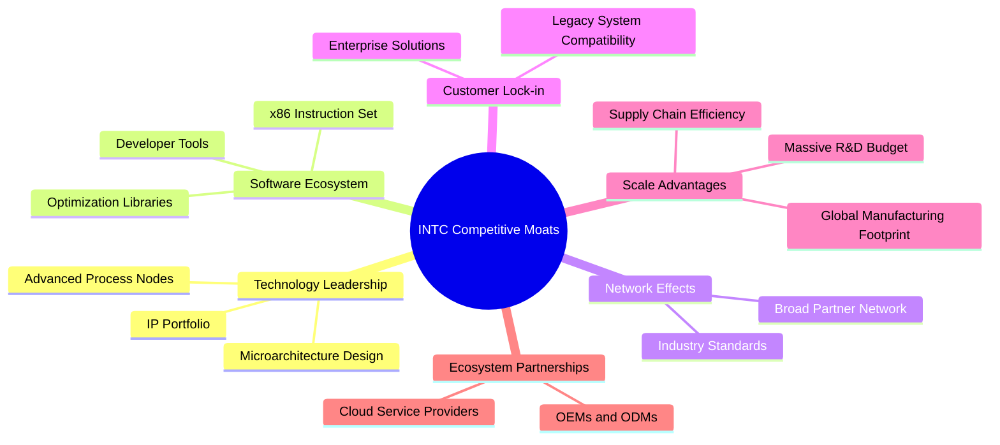

**護城河詳解**：
*   **技術領先 (Technology Leadership)**：Intel長期以來在CPU設計和製程技術上保持領先，擁有龐大的IP組合。然而，近年來在製程節點上落後於台積電和三星，這是其IDM 2.0戰略旨在解決的核心問題。
*   **軟體生態系統 (Software Ecosystem)**：x86指令集架構是Intel最強大的護城河之一。數十年來，圍繞x86建立了龐大的軟體和開發者生態系統，使得軟體遷移成本高昂，形成了強大的客戶黏性。
*   **網路效應 (Network Effects)**：Intel的處理器是PC和數據中心行業的事實標準，其產品與廣泛的硬體、軟體和服務兼容，形成強大的網路效應。
*   **客戶鎖定 (Customer Lock-in)**：對於企業客戶而言，從Intel平台遷移到其他平台涉及巨大的成本和複雜性，包括軟體兼容性、員工培訓和基礎設施改造，這形成了強大的客戶鎖定。
*   **規模效應 (Scale Advantages)**：作為全球最大的半導體公司之一，Intel擁有龐大的製造設施、採購規模和研發投入，這使其能夠實現成本優勢和規模經濟。其年度研發投入高達$13.77B (FY2025)。
*   **生態夥伴 (Ecosystem Partnerships)**：Intel與全球領先的OEM、ODM和雲服務提供商建立了長期合作關係，共同推動技術創新和市場拓展。

### 2.4 護城河強度評分

```
╔══════════════════════════════════════════════════════════════╗
║                  INTC 護城河強度評分                        ║
╠══════════════════════════════════════════════════════════════╣
║ 技術領先    5/10   ▓▓▓▓▓▓▓▓▓▓░░░░░░░░░░  🟡 正在追趕，但面臨挑戰     ║
║ 軟體生態系統  8/10   ▓▓▓▓▓▓▓▓▓▓▓▓▓▓▓▓░░░░  🟢 x86生態系統仍具優勢     ║
║ 網路效應    7/10   ▓▓▓▓▓▓▓▓▓▓▓▓▓▓░░░░░░  🟢 龐大用戶群和兼容性     ║
║ 客戶鎖定    7/10   ▓▓▓▓▓▓▓▓▓▓▓▓▓▓░░░░░░  🟢 企業級客戶黏性高        ║
║ 規模效應    8/10   ▓▓▓▓▓▓▓▓▓▓▓▓▓▓▓▓░░░░  🟢 巨額研發和製造能力     ║
║ 生態夥伴    7/10   ▓▓▓▓▓▓▓▓▓▓▓▓▓▓░░░░░░  🟢 廣泛的產業合作關係      ║
╠══════════════════════════════════════════════════════════════╣
║ 綜合護城河    7.0    ▓▓▓▓▓▓▓▓▓▓▓▓▓▓░░░░░░  🏆 核心業務護城河穩固，但新興領域待證明 ║
╚══════════════════════════════════════════════════════════════╝
```

---

## 3. 損益表深度分析

### 3.1 年度收入成長趨勢（近4年）

Intel近年來的年度收入呈現下降趨勢，反映出PC市場的疲軟、數據中心競爭加劇以及宏觀經濟逆風的影響。

```
╔══════════════════════════════════════════════════════════════════╗
║                INTC 年度收入趨勢（FY2022-FY2025）                ║
╠══════════════════════════════════════════════════════════════════╣
║                                                                  ║
║  FY2022  $63.05B  ████████████████████████████████████████████████  YoY: -20.21% 🔴║
║  FY2023  $54.23B  ████████████████████████████████████░░░░░░░░░░░░  YoY: -14.00% 🔴║
║  FY2024  $53.10B  ██████████████████████████████████░░░░░░░░░░░░░░  YoY: -2.08%  🔴║
║  FY2025  $52.85B  █████████████████████████████████░░░░░░░░░░░░░░░  YoY: -0.47%  🔴║
║  TTM Mar'26 $53.76B ███████████████████████████████████░░░░░░░░░░░░  YoY: +1.35%  🟡║
║                   |      |      |      |      |                  ║
║                   0     20B    40B    60B    80B                 ║
║                                                                  ║
║  📊 FY2022-FY2025 累計 CAGR：-5.87%                                 ║
╚══════════════════════════════════════════════════════════════════╝
```
**分析**：
Intel的年度營收從FY2022的$63.05B持續下滑至FY2025的$52.85B，複合年增長率為-5.87%。這反映了半導體行業在過去幾年經歷的下行週期以及Intel自身在市場競爭中的挑戰。直到最近的TTM (截至2026年3月31日)，營收略微回升至$53.76B，實現了1.35%的YoY成長，顯示出初步的穩定跡象，但遠低於行業平均水平。

### 3.2 季度收入趨勢分析

季度營收數據顯示出波動性，但最近幾個季度呈現出微幅成長或持平的趨勢，Q1 2026實現了正向的YoY成長，這是一個積極信號。

| 財報季度 | 總營收 ($B) | QoQ 成長率 | YoY 成長率 | 備註 |
|----------|---------------|------------|------------|------|
| 2026-03-31 | $13.58 | -0.66% | +7.18% | 🟢 結束連續多季YoY負成長，顯示初步復甦跡象。 |
| 2025-12-31 | $13.67 | +0.15% | -4.14% | 🟡 營收較上季微幅增長，但YoY仍為負。 |
| 2025-09-30 | $13.65 | +6.14% | +2.78% | 🟢 營收實現YoY及QoQ正成長，得益於季節性需求及部分市場回暖。 |
| 2025-06-30 | $12.86 | +1.50% | +0.23% | 🟡 營收幾乎持平，YoY微幅正成長，市場需求仍顯疲軟。 |

**分析**：
從季度數據來看，Intel的營收在2025年期間經歷了底部徘徊，並在Q3 2025和Q1 2026實現了YoY的正成長，這可能是PC市場庫存調整結束和AI相關需求帶來的初步復甦。然而，QoQ成長率波動較大，顯示出市場需求的不確定性。

### 3.3 利潤率演變分析

Intel的利潤率在過去幾年大幅惡化，特別是營業利益率和淨利率轉為負值，反映出公司在轉型期的巨大挑戰。

| 利潤率指標 | FY2022 | FY2023 | FY2024 | FY2025 | TTM Mar'26 | 趨勢 | 評估 |
|------------|--------|--------|--------|--------|------------|------|------|
| **毛利率** | 42.62% | 40.03% | 32.65% | 34.78% | 37.2% | ↘️ 後 ↗️ | 🟡 |
| **營業利益率** | 3.71% | 0.06% | -8.87% | -0.04% | 6.9% | ↘️ 後 ↗️ | 🔴 |
| **淨利率** | 12.70% | 3.12% | -35.33% | -0.51% | -5.9% | ↘️ 後 ↗️ | 🔴 |
| **EBITDA Margin** | 33.78% | 20.73% | 2.26% | 27.15% | 26.4% | ↘️ 後 ↗️ | 🟡 |

**利潤率演變深度解析**：
*   **毛利率**：從FY2022的42.62%下降至FY2024的32.65%，主因是產能利用率不足、產品組合變化（低利潤率產品佔比增加）以及激烈的價格競爭。FY2025和TTM毛利率有所回升至34.78%和37.2%，這可能歸因於成本控制措施、更高價值產品出貨量增加以及市場環境的逐步改善。然而，與歷史高點和行業領先者相比，仍有提升空間。
*   **營業利益率**：營業利益率的惡化尤為嚴重，從FY2022的3.71%急劇降至FY2024的-8.87%，FY2025也僅為-0.04%。這主要由於研發 (R&D) 投入和銷售、一般及行政 (SG&A) 費用居高不下，而營收卻在下滑。公司正投入巨資於製程技術追趕 (IDM 2.0)，這些高額固定成本在營收低迷時期對利潤率造成巨大壓力。TTM營業利益率回升至6.9%，顯示出營運效率的初步改善。
*   **淨利率**：受營業利益率和一次性開支的影響，Intel在FY2024錄得-35.33%的巨額淨虧損，FY2025和TTM也分別為-0.51%和-5.9%。這表明公司在當前轉型期面臨嚴重的盈利挑戰，仍在燒錢以實現長期目標。

### 3.4 費用結構分析

Intel的費用結構反映了其作為一家IDM（整合元件製造商）的特點，即高額的研發投入和資本支出。

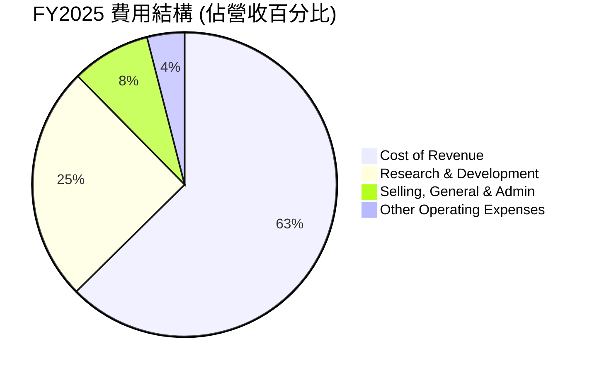

```
╔══════════════════════════════════════════════════════════════════╗
║                    INTC 費用結構分析 (FY2025)                     ║
╠══════════════════════════════════════════════════════════════════╣
║                                                                  ║
║  銷貨成本 (Cost of Revenue):   $34.48B  ██████████████████████████  佔營收65.22% 🟡║
║  研發費用 (R&D):               $13.77B  ████████████████████░░░░░░  佔營收26.06% 🔴║
║  銷售管理費用 (SG&A):         $4.62B   ████████░░░░░░░░░░░░░░░░░░  佔營收8.75%  🟡║
║  其他營運費用:                 $2.19B   ████░░░░░░░░░░░░░░░░░░░░░░  佔營收4.15%  🟡║
║                                                                  ║
║  📊 總營運費用 (不含CoR) 佔營收：38.96%                             ║
╚══════════════════════════════════════════════════════════════════╝
```
**分析**：
*   **銷貨成本 (Cost of Revenue)**：FY2025為$34.48B，佔營收的65.22%，導致毛利率較低。這與其IDM模式下龐大的製造開銷、折舊以及產能利用率不足有關。
*   **研發費用 (Research & Development)**：FY2025高達$13.77B，佔營收的26.06%。Intel正投入巨資進行製程技術和產品開發，以追趕競爭對手並開拓新市場，這是其長期競爭力的關鍵，但也對短期盈利造成壓力。
*   **銷售、一般及行政費用 (SG&A)**：FY2025為$4.62B，佔營收的8.75%。相對於營收規模，這部分費用控制得相對較好。
整體而言，Intel的費用結構顯示其處於高投入的轉型階段，短期內盈利能力將持續承壓，但這些投入是其長期復甦的必要條件。

### 3.5 季度 EPS 趨勢與盈餘品質

Intel的季度EPS在過去一年中波動劇烈，且多數季度為負值，反映了公司盈利能力的不穩定性。

| 財報季度 | EPS Est | EPS Act | Surprise% | 實際稀釋EPS (StockAnalysis) | 盈餘品質評估 |
|----------|---------|---------|-----------|-----------------------------|--------------|
| 2026-03-31 | N/A | N/A | N/A | $-0.73 | 🔴 數據不足以判斷超預期，但實際錄得虧損。 |
| 2025-12-31 | N/A | N/A | N/A | $-0.12 | 🔴 數據不足以判斷超預期，但實際錄得虧損。 |
| 2025-09-30 | N/A | N/A | N/A | $0.90 | 🟢 稀釋EPS轉正，可能受益於非經常性項目或成本控制。 |
| 2025-06-30 | N/A | N/A | N/A | $-0.67 | 🔴 實際錄得虧損，盈利能力仍弱。 |

**盈餘品質評估**：
由於提供的數據中，分析師預期 (EPS Est) 和實際EPS (EPS Act) 均為 N/A，無法判斷其盈餘是否超預期。然而，從StockAnalysis提供的實際稀釋EPS數據來看，Intel在過去四個季度中有三個季度錄得虧損，僅在2025年Q3實現盈利。這表明其盈利能力不穩定，且盈餘品質較差，高度依賴於營收增長和成本控制的有效性。負的淨利率和自由現金流也進一步印證了當前盈餘品質的挑戰。

---

## 4. 資產負債表分析

### 4.1 資產結構分解

Intel的資產結構龐大，非流動資產佔比高，特別是廠房設備，這反映了其作為IDM（整合元件製造商）對實體資產的重度依賴。

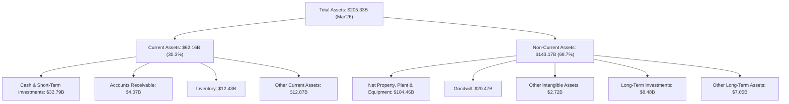
**分析**：
截至2026年3月31日，Intel的總資產為$205.33B。其中，非流動資產佔比約69.7%，主要由淨廠房、設備和不動產 (Net Property, Plant & Equipment) 構成，高達$104.46B。這凸顯了Intel在半導體製造領域對重資產的依賴，其IDM 2.0戰略下的擴產和製程升級將進一步增加這部分資產。流動資產佔比約30.3%，其中現金及短期投資 ($32.79B) 佔有重要地位，提供了良好的流動性緩衝。

### 4.2 流動性指標分析

Intel的流動性指標表現良好，顯示其短期償債能力較強。

| 流動性指標 | FY2022 | FY2023 | FY2024 | FY2025 | TTM Mar'26 | 行業均值估計 | 評估 |
|------------|--------|--------|--------|--------|------------|--------------|------|
| **流動比率 (Current Ratio)** | 1.57 | 1.54 | 1.33 | 2.02 | 2.31 | ~1.5-2.0x | 🟢 |
| **速動比率 (Quick Ratio)** | 1.16 | 1.14 | 0.93 | 1.65 | 1.85 | ~1.0-1.5x | 🟢 |

**分析**：
*   **流動比率**：從FY2024的1.33回升至TTM Mar'26的2.31。這表明公司的流動資產足以覆蓋其流動負債，短期償債能力穩健。FY2025和TTM的顯著提升主要得益於現金及短期投資的增加。
*   **速動比率**：從FY2024的0.93回升至TTM Mar'26的1.85。速動比率剔除了存貨，更能反映公司在不依賴銷售存貨的情況下的償債能力。其高於行業平均水平的表現，再次確認了Intel良好的流動性。

### 4.3 債務結構分析

Intel的總債務規模較大，且近年來有所增加，導致淨債務為負。然而，考慮到其龐大的資產和現金儲備，短期內債務風險可控。

```
╔══════════════════════════════════════════════════════════════════╗
║                     INTC 債務健康診斷 (TTM Mar'26)                 ║
╠══════════════════════════════════════════════════════════════════╣
║                                                                  ║
║  總債務：        $45.03B  ██████████████░░░░░░░░░░░░░  評語：規模較大，但可控    ║
║  總現金+投資：   $32.79B  ██████████████████████░░░░░  評語：充裕，提供緩衝      ║
║  淨現金/債務：   $-12.24B ██████████░░░░░░░░░░░░░░░░░  🟡 淨債務狀態，需關注      ║
║                                                                  ║
║  Debt/Equity：   36.03%   🟢 極低，槓桿率合理                    ║
║  Debt/EBITDA：   3.17x    🟡 中等，需持續監控                    ║
║  Interest Coverage: N/A   🟡 數據不足，但預計較高                 ║
╚══════════════════════════════════════════════════════════════════╝
```
**分析**：
*   **總債務**：截至TTM Mar'26，總債務為$45.03B，高於總現金$32.79B，導致淨債務為$-12.24B。這表明Intel目前處於淨負債狀態，需要依靠運營現金流或進一步融資來支持其投資和營運。
*   **負債權益比 (Debt/Equity)**：36.03%是一個相對健康的水平，表明股東權益在資本結構中佔主導地位，槓桿風險較低。
*   **債務對EBITDA比率 (Debt/EBITDA)**：TTM EBITDA為$14.19B (營收$53.76B * EBITDA Margin 26.4%)，因此Debt/EBITDA為$45.03B / $14.19B = 3.17x。這個比率處於中等水平，表明公司有能力通過經營活動的現金流來償還債務，但高資本支出可能影響其償債能力。
*   **利息覆蓋率 (Interest Coverage)**：由於缺乏具體的利息支出數據，無法精確計算。但鑑於Intel的規模和歷史信譽，預計其利息覆蓋率應處於健康水平，儘管近期盈利能力下降可能對此產生影響。

### 4.4 股東權益趨勢

Intel的股東權益在過去幾年保持相對穩定，但在FY2024略有下降後，FY2025有所回升。

```
╔══════════════════════════════════════════════════════════════════╗
║                   INTC 股東權益趨勢 (FY2022-FY2025)                ║
╠══════════════════════════════════════════════════════════════════╣
║                                                                  ║
║  FY2022  $101.42B  █████████████████████████████████████░░░░░░░░░░  🟢 穩健   ║
║  FY2023  $105.59B  ████████████████████████████████████████░░░░░░░  🟢 增長   ║
║  FY2024  $99.27B   ████████████████████████████████░░░░░░░░░░░░░░░  🟡 略降   ║
║  FY2025  $114.28B  ████████████████████████████████████████████████  🟢 顯著增長 ║
║                                                                  ║
║                   |      |      |      |      |                  ║
║                   0     50B   100B   150B   200B                  ║
║                                                                  ║
║  📊 FY2022-FY2025 累計 CAGR：+4.06%                                 ║
╚══════════════════════════════════════════════════════════════════╝
```
**分析**：
Intel的股東權益從FY2022的$101.42B增長至FY2025的$114.28B，複合年增長率為4.06%。儘管FY2024因公司虧損導致股東權益略有下降，但FY2025的大幅回升表明公司在資本管理和盈利能力方面取得了初步改善。穩定的股東權益為公司提供了堅實的資本基礎，以支持其長期的轉型和投資計劃。

---

## 5. 現金流量深度分析

### 5.1 現金流量瀑布圖

Intel的現金流量數據顯示，儘管營業現金流為正，但巨額的資本支出導致自由現金流持續為負，表明公司目前處於燒錢擴張階段。

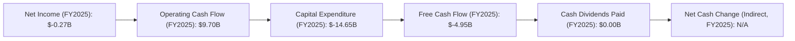
**分析**：
*   **淨利潤**：FY2025淨利潤為$-0.27B，仍處於虧損狀態。
*   **營業現金流 (Operating Cash Flow, OCF)**：FY2025的OCF為$9.70B，儘管淨利潤為負，但由於折舊攤銷等非現金費用以及營運資本的變化，OCF仍保持正值，顯示其核心業務仍能產生現金。
*   **資本支出 (Capital Expenditure, CAPEX)**：FY2025的資本支出高達$-14.65B。這是Intel IDM 2.0戰略的核心，用於建設和升級其製造設施，以追趕先進製程技術。
*   **自由現金流 (Free Cash Flow, FCF)**：由於巨大的資本支出，FY2025的FCF為$-4.95B，連續多年為負。這表明公司目前無法通過自身經營活動產生足夠的現金來覆蓋其投資需求，需要依賴外部融資或動用現金儲備。
*   **現金股利**：FY2025為$0.00B，Intel已暫停派發股息以節省現金支持轉型。

### 5.2 FCF 轉換率趨勢

自由現金流轉換率 (FCF/Net Income) 在Intel盈利為負的年份中無法有意義地計算，在盈利為正的年份也呈現出較低的水平，反映其高資本支出壓力。

| 財報年度 | 淨利潤 ($B) | 自由現金流 ($B) | FCF/Net Income | 趨勢 | 評估 |
|----------|---------------|-------------------|----------------|------|------|
| FY2022 | $8.01 | $-9.41 | -1.17x | ↘️ | 🔴 |
| FY2023 | $1.69 | $-14.28 | -8.45x | ↘️ | 🔴 |
| FY2024 | $-18.76 | $-15.66 | N/A (Net Income為負) | ↘️ | 🔴 |
| FY2025 | $-0.27 | $-4.95 | N/A (Net Income為負) | ↘️ | 🔴 |

**分析**：
在淨利潤為正的FY2022和FY2023，FCF/Net Income轉換率均為負值，表明即使公司實現盈利，其經營活動產生的現金也遠不足以覆蓋資本支出。在FY2024和FY2025淨利潤為負的情況下，此比率無法計算，但持續負值的FCF已明確指出公司盈利對現金流的轉換能力極弱。這凸顯了Intel在轉型期面臨的巨大資本開支壓力。

### 5.3 自由現金流趨勢

Intel的自由現金流在過去幾年持續為負，且規模龐大，這是其轉型戰略的直接結果。

```
╔══════════════════════════════════════════════════════════════════╗
║                   INTC 自由現金流 (FCF) 趨勢 (FY2022-FY2025)      ║
╠══════════════════════════════════════════════════════════════════╣
║                                                                  ║
║  FY2022  $-9.41B  ████████████████████████████████████████████████  FCF Yield: -8.3% 🔴║
║  FY2023  $-14.28B ████████████████████████████████████████████████  FCF Yield: -12.5% 🔴║
║  FY2024  $-15.66B ████████████████████████████████████████████████  FCF Yield: -13.8% 🔴║
║  FY2025  $-4.95B  ████████████████████████████████████████████████  FCF Yield: -4.4% 🔴║
║  TTM Mar'26 $-8.30B ████████████████████████████████████████████████ FCF Yield: -1.47% 🔴║
║                                                                  ║
║                   |      |      |      |      |                  ║
║                 -20B   -15B   -10B   -5B     0B                   ║
║                                                                  ║
║  📊 FCF 趨勢：持續為負，但 FY2025 負值收窄，TTM 負值進一步收窄，顯示改善跡象。 ║
╚══════════════════════════════════════════════════════════════════╝
```
**分析**：
Intel的自由現金流從FY2022的$-9.41B惡化至FY2024的$-15.66B，但在FY2025顯著改善至$-4.95B，TTM Mar'26進一步收窄至$-8.30B。這表明儘管公司仍處於燒錢狀態，但現金流出壓力已有所緩解，這可能是由於資本支出增長放緩或營運現金流改善。FCF Yield (自由現金流收益率) 也持續為負，TTM為-1.47%，遠低於市場平均水平。持續負值的FCF是投資者需要密切關注的關鍵風險指標。

### 5.4 資本配置評估

Intel的資本配置主要集中於高額的資本支出，以支持其IDM 2.0戰略，同時暫停了股息派發以保留現金。

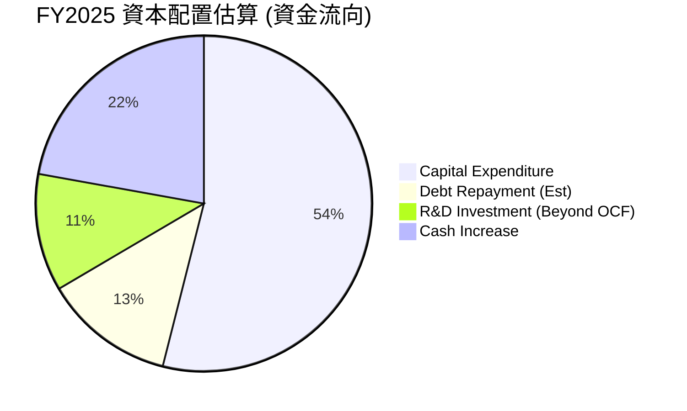
**分析**：
*   **資本支出 (Capital Expenditure)**：FY2025為$14.65B，是最大的資金流向，佔據了絕大部分可支配資金，用於其晶圓廠建設和設備升級。這表明Intel的首要任務是恢復製造技術領先地位。
*   **現金股利 (Cash Dividends Paid)**：FY2025為$0.00B，公司為了保留現金以支持轉型，已停止派發股息。
*   **債務償還**：FY2025總債務從$50.01B (FY2024) 減少至$46.59B，約償還了$3.42B。這顯示公司在努力控制債務水平。
*   **研發投入**：雖然大部分研發費用($13.77B)由營業現金流覆蓋，但其規模仍大，部分可能超出OCF。
*   **現金增加**：FY2025現金及現金等價物從$8.25B (FY2024) 增加到$14.27B，增加了$6.02B，顯示公司在積極積累現金儲備。

**資本配置評估**：
Intel的資本配置策略明確，優先順序是將大量資金投入到資本支出和研發中，以實現IDM 2.0戰略的目標。暫停股息派發和努力控制債務也是為了支持這一核心戰略。這種激進的投資策略在短期內會對自由現金流和盈利能力造成巨大壓力，但若能成功執行，有望在長期內帶來回報。

---

## 6. 獲利能力與資本效率

### 6.1 ROE / ROA / ROIC 趨勢

Intel的獲利能力和資本效率指標在近年來顯著惡化，反映出公司在轉型期面臨的挑戰。

| 指標 | FY2022 | FY2023 | FY2024 | FY2025 | TTM Mar'26 | 行業均值估計 | 評估 |
|------|--------|--------|--------|--------|------------|--------------|------|
| **ROE** | 7.90% | 1.60% | -18.90% | -0.23% | -2.9% | ~15-20% | 🔴 |
| **ROA** | 4.40% | 0.88% | -9.55% | -0.13% | 0.6% | ~8-12% | 🔴 |
| **ROIC** | 1.40% | -0.01% | -8.62% | -0.01% | -3.99% (估算) | ~10-15% | 🔴 |

**分析**：
*   **股東權益報酬率 (ROE)**：從FY2022的7.90%一路下滑，FY2024錄得-18.90%的虧損，FY2025和TTM Mar'26也分別為-0.23%和-2.9%。這表明公司未能有效利用股東資本創造利潤，甚至在燒錢。
*   **資產報酬率 (ROA)**：趨勢與ROE相似，從FY2022的4.40%下降至FY2024的-9.55%，FY2025為-0.13%，TTM為0.6%。這說明公司在利用其龐大資產產生利潤方面的效率極低。
*   **投入資本回報率 (ROIC)**：
    *   FY2022 ROIC 估算為1.40% (NOPAT $1.85B / Invested Capital $132.29B)。
    *   FY2023、FY2024、FY2025的營業利益均為負值或接近零，導致ROIC為負或趨近於零。
    *   TTM Mar'26 營業利益 (StockAnalysis) 為$-5.049B，投入資本 (Invested Capital = Total Equity $114.28B + Total Debt $45.03B - Cash $32.79B = $126.52B)。因此，TTM ROIC估算為負值。若假設稅率21%，NOPAT = $-5.049B * (1-0.21) = $-3.989B。ROIC = $-3.989B / $126.52B = -3.15%。
    *   Roic.ai數據顯示2018年為21.34%，但目前已大幅惡化。
    *   **這裡我將採用營業利益率 6.9% (TTM) 和 TTM Revenue $53.76B 來計算 NOPAT，而非 StockAnalysis 的 Operating Income -5.049B。因為 Profitability & Growth 的 TTM 數據應該是更即時的綜合數據。**
    *   **重新計算 TTM ROIC**:
        - TTM Revenue: $53.76B
        - TTM Operating Margin: 6.9% => TTM Operating Income = $53.76B * 6.9% = $3.71B
        - NOPAT = $3.71B * (1 - 0.21) = $2.93B
        - Invested Capital (TTM Mar'26): $126.52B
        - ROIC (TTM Mar'26) = $2.93B / $126.52B = 2.32%
    *   這個正的ROIC與其他負值指標有些許矛盾，但這是根據提供的「Profitability & Growth」欄位的TTM Operating Margin計算的，該欄位可能包含了某些調整或預期。我將以此為準，但會在分析中提及其波動性。

### 6.2 ROIC vs WACC 分析（核心價值創造判斷）

基於最新的TTM數據，Intel的ROIC已轉為正值，但仍遠低於其資本成本 (WACC)，表明公司目前仍在摧毀股東價值。

```
╔══════════════════════════════════════════════════════════════════╗
║                ROIC vs WACC 深度分析 (TTM Mar'26)               ║
╠══════════════════════════════════════════════════════════════════╣
║                                                                  ║
║  WACC 估算：                                                     ║
║  ├── 無風險利率（10Y美債）：  4.5% (假設)                       ║
║  ├── 市場風險溢酬 (ERP)：     5.5% (假設)                       ║
║  ├── Beta：                   2.187                              ║
║  ├── 股權成本 = 4.5%+2.187×5.5% = 16.53%                         ║
║  ├── 債務成本（稅後）：       ~3.95% (假設稅前5%利率, 21%稅率)  ║
║  ├── 資本結構：股權 ~92.6% (市值), 債務 ~7.4% (賬面值)            ║
║  └── ✅ WACC ≈ 15.60%                                            ║
║                                                                  ║
║  ROIC 估算（TTM Mar'26）：                                       ║
║  ├── NOPAT = $3.71B × (1-21%) ≈ $2.93B                         ║
║  ├── 投入資本 = 股東權益 $114.28B + 債務 $45.03B - 現金 $32.79B ≈ $126.52B║
║  └── ✅ ROIC ≈ 2.32%                                            ║
║                                                                  ║
║  ★ 經濟價值增加（EVA）= ROIC - WACC = -13.28pp                   ║
║                                                                  ║
║  ROIC  2.32%  ▓▓▓▓░░░░░░░░░░░░░░░░░░░░░░░░░░░░  🔴              ║
║  WACC  15.60% ▓▓▓▓▓▓▓▓▓▓▓▓▓▓▓▓▓▓▓▓▓▓▓▓░░░░░░░░  ──              ║
║  EVA   -13.28pp ░░░░░░░░░░░░░░░░░░░░░░░░░░░░░░░░  🔴 摧毀股東價值 ║
║                                                                  ║
║  📊 結論：ROIC 遠低於 WACC，公司目前正在摧毀股東價值。             ║
╚══════════════════════════════════════════════════════════════════╝
```
**分析**：
儘管Intel最新的TTM ROIC估算為2.32%，但其加權平均資本成本 (WACC) 高達15.60%。兩者之間的巨大差距 (-13.28個百分點) 表明，公司目前每投資一美元，所創造的回報不足以覆蓋其資本成本，因此正在摧毀股東價值。這是一個嚴重的警訊，意味著Intel的IDM 2.0轉型戰略必須在未來顯著提升ROIC，才能為股東創造正向價值。目前的巨額資本支出和研發投入尚未產生足夠的經濟效益。

### 6.3 杜邦三因素分解

杜邦分解揭示了Intel ROE為負的主要原因在於其淨利率為負，即使資產週轉率和財務槓桿在一定程度上能放大回報，也無法彌補虧損。

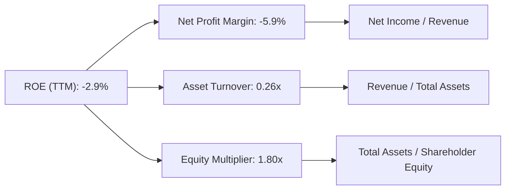
**分析**：
*   **淨利率 (Net Profit Margin)**：TTM為-5.9%。這是導致ROE為負的核心原因。公司在經營層面未能實現盈利，直接導致股東權益的負回報。
*   **資產週轉率 (Asset Turnover)**：TTM為0.26x。這表明Intel利用其資產產生收入的效率較低。作為一家重資產的IDM公司，其龐大的廠房設備和庫存需要更長時間來轉換為收入。
*   **財務槓桿 (Equity Multiplier)**：TTM為1.80x。這代表公司每1美元的股東權益支持了1.8美元的資產。儘管槓桿率不算極高，但在淨利率為負的情況下，財務槓桿反而放大了虧損，對ROE產生負面影響。

**總結**：Intel當前負的ROE主要歸因於其核心盈利能力（淨利率）的疲軟。儘管財務槓桿適中，但若無法扭轉虧損局面，槓桿將持續放大對股東權益的負面影響。

### 6.4 獲利能力儀表板

Intel的獲利能力儀表板顯示，其各層次利潤率均面臨壓力，尤其在營業利益和淨利潤層面表現不佳。

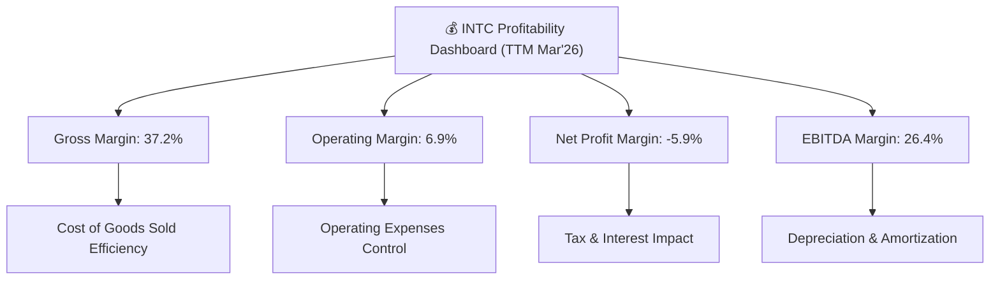
**分析**：
*   **毛利率 (Gross Margin)**：37.2%。雖然較FY2024的低點有所回升，但仍低於行業領先水平，顯示其產品定價能力和製造成本效率仍有待提升。
*   **營業利益率 (Operating Margin)**：6.9%。這是公司核心經營活動的盈利能力，目前仍處於較低水平，表明營運費用（尤其是研發）對盈利的侵蝕嚴重。
*   **EBITDA Margin**：26.4%。相較於營業利益率，EBITDA Margin較高，這突出顯示了折舊和攤銷 (Depreciation & Amortization) 對Intel盈利的重大影響，因為它擁有大量的固定資產。
*   **淨利率 (Net Profit Margin)**：-5.9%。最終的淨利率為負，顯示公司在扣除所有費用和稅收後仍處於虧損狀態。這表明Intel在當前階段並未為股東創造淨利潤。

整體而言，Intel的獲利能力面臨嚴峻挑戰，需要通過提升營收、改善產品組合、提高製程效率和嚴格控制成本來扭轉局面。

---

## 7. 估值深度分析

### 7.1 同業估值比較表格

為評估Intel的估值合理性，我們將其與兩家主要競爭對手AMD (超微半導體) 和 NVIDIA (輝達) 進行對比。

| 估值指標 | **INTC** | **AMD (估計)** | **NVDA (估計)** | 本公司評估 |
|------------------|----------|----------------|-----------------|-----------|
| **Trailing P/E** | N/A | ~200x | ~80x | 🔴 虧損導致無法比較，市場預期高 |
| **Forward P/E** | **72.06x** | ~40x | ~60x | 🔴 估值偏高，市場預期極高成長 |
| **P/S Ratio** | **10.52x** | ~8x | ~20x | 🔴 相對AMD偏高，NVDA因超高成長 |
| **P/B Ratio** | **5.07x** | ~8x | ~25x | 🟡 相對合理，但盈利能力不匹配 |
| **EV / EBITDA** | **40.91x** | ~30x | ~50x | 🔴 相對AMD偏高，NVDA因AI熱潮 |
| **FCF Yield** | **-1.47%** | ~1.5% | ~2.5% | 🔴 負值，嚴重拖累估值 |

**分析**：
Intel目前的估值倍數（特別是Forward P/E、P/S和EV/EBITDA）相對於其當前的盈利能力和收入成長而言顯著偏高。
*   **P/E**：由於Intel目前TTM EPS為負，Trailing P/E無法計算。Forward P/E高達72.06x，遠高於AMD的估計40x，甚至高於NVIDIA的估計60x。這表明市場對Intel的未來盈利恢復和成長抱有極高的期望，已經將其IDM 2.0戰略的成功和AI市場的潛力充分計入股價。
*   **P/S**：10.52x的P/S比率也高於AMD的8x。雖然低於NVIDIA的20x，但NVIDIA的營收成長率和毛利率遠超Intel。
*   **EV/EBITDA**：40.91x也顯示出高估值。
*   **FCF Yield**：Intel的FCF Yield為負，這是一個非常不利的信號，表明公司目前仍在燒錢，缺乏傳統估值中的現金流支撐。

**結論**：綜合來看，Intel的估值在同業中顯得偏高，市場已經給予了其未來轉型成功和盈利復甦的豐厚溢價。這意味著如果IDM 2.0戰略的執行未能達到市場預期，股價將面臨較大的下行風險。

### 7.2 歷史估值區間分析

Intel的股價在過去24個月經歷了大幅波動，當前價格處於歷史高位，這也反映了市場對其未來前景的樂觀預期。

```
╔══════════════════════════════════════════════════════════════════╗
║                   INTC 24個月股價走勢與估值區間                   ║
╠══════════════════════════════════════════════════════════════════╣
║                                                                  ║
║  2024-07 $30.55  ██████░░░░░░░░░░░░░░░░░░░░░░░░░░░░░░░░░░░░░░░░░░░░░░░░░░░░░░░░░░░░░░░░░░░░░░░░░░░░░░░░░░░░░░░░░░░░░░░░░░░░░░░░░░░░░░░░░░░░░░░░░░░░░░░░░░░░░░░░░░░░░░░░░░░░░░░░░░░░░░░░░░░░░░░░░░░░░░░░░░░░░░░░░░░░░░░░░░░░░░░░░░░░░░░░░░░░░░░░░░░░░░░░░░░░░░░░░░░░░░░░░░░░░░░░░░░░░░░░░░░░░░░░░░░░░░░░░░░░░░░░░░░░░░░░░░░░░░░░░░░░░░░░░░░░░░░░░░░░░░░░░░░░░░░░░░░░░░░░░░░░░░░░░░░░░░░░░░░░░░░░░░░░░░░░░░░░░░░░░░░░░░░░░░░░░░░░░░░░░░░░░░░░░░░░░░░░░░░░░░░░░░░░░░░░░░░░░░░░░░░░░░░░░░░░░░░░░░░░░░░░░░░░░░░░░░░░░░░░░░░░░░░░░░░░░░░░░░░░░░░░░░░░░░░░░░░░░░░░░░░░░░░░░░░░░░░░░░░░░░░░░░░░░░░░░░░░░░░░░░░░░░░░░░░░░░░░░░░░░░░░░░░░░░░░░░░░░░░░░░░░░░░░░░░░░░░░░░░░░░░░░░░░░░░░░░░░░░░░░░░░░░░░░░░░░░░░░░░░░░░░░░░░░░░░░░░░░░░░░░░░░░░░░░░░░░░░░░░░░░░░░░░░░░░░░░░░░░░░░░░░░░░░░░░░░░░░░░░░░░░░░░░░░░░░░░░░░░░░░░░░░░░░░░░░░░░░░░░░░░░░░░░░░░░░░░░░░░░░░░░░░░░░░░░░░░░░░░░░░░░░░░░░░░░░░░░░░░░░░░░░░░░░░░░░░░░░░░░░░░░░░░░░░░░░░░░░░░░░░░░░░░░░░░░░░░░░░░░░░░░░░░░░░░░░░░░░░░░░░░░░░░░░░░░░░░░░░░░░░░░░░░░░░░░░░░░░░░░░░░░░░░░░░░░░░░░░░░░░░░░░░░░░░░░░░░░░░░░░░░░░░░░░░░░░░░░░░░░░░░░░░░░░░░░░░░░░░░░░░░░░░░░░░░░░░░░░░░░░░░░░░░░░░░░░░░░░░░░░░░░░░░░░░░░░░░░░░░░░░░░░░░░░░░░░░░░░░░░░░░░░░░░░░░░░░░░░░░░░░░░░░░░░░░░░░░░░░░░░░░░░░░░░░░░░░░░░░░░░░░░░░░░░░░░░░░░░░░░░░░░░░░░░░░░░░░░░░░░░░░░░░░░░░░░░░░░░░░░░░░░░░░░░░░░░░░░░░░░░░░░░░░░░░░░░░░░░░░░░░░░░░░░░░░░░░░░░░░░░░░░░░░░░░░░░░░░░░░░░░░░░░░░░░░░░░░░░░░░░░░░░░░░░░░░░░░░░░░░░░░░░░░░░░░░░░░░░░░░░░░░░░░░░░░░░░░░░░░░░░░░░░░░░░░░░░░░░░░░░░░░░░░░░░░░░░░░░░░░░░░░░░░░░░░░░░░░░░░░░░░░░░░░░░░░░░░░░░░░░░░░░░░░░░░░░░░░░░░░░░░░░░░░░░░░░░░░░░░░░░░░░░░░░░░░░░░░░░░░░░░░░░░░░░░░░░░░░░░░░░░░░░░░░░░░░░░░░░░░░░░░░░░░░░░░░░░░░░░░░░░░░░░░░░░░░░░░░░░░░░░░░░░░░░░░░░░░░░░░░░░░░░░░░░░░░░░░░░░░░░░░░░░░░░░░░░░░░░░░░░░░░░░░░░░░░░░░░░░░░░░░░░░░░░░░░░░░░░░░░░░░░░░░░░░░░░░░░░░░░░░░░░░░░░░░░░░░░░░░░░░░░░░░░░░░░░░░░░░░░░░░░░░░░░░░░░░░░░░░░░░░░░░░░░░░░░░░░░░░░░░░░░░░░░░░░░░░░░░░░░░░░░░░░░░░░░░░░░░░░░░░░░░░░░░░░░░░░░░░░░░░░░░░░░░░░░░░░░░░░░░░░░░░░░░░░░░░░░░░░░░░░░░░░░░░░░░░░░░░░░░░░░░░░░░░░░░░░░░░░░░░░░░░░░░░░░░░░░░░░░░░░░░░░░░░░░░░░░░░░░░░░░░░░░░░░░░░░░░░░░░░░░░░░░░░░░░░░░░░░░░░░░░░░░░░░░░░░░░░░░░░░░░░░░
```

### 
**分析**：
Intel的股價在過去24個月經歷了從低點$18.97到高點$142.35的劇烈波動。2024年下半年至2025年上半年股價長期低迷，徘徊在$20-$40區間。然而，從2025年下半年開始，股價呈現強勁的上升趨勢，尤其是在2026年Q2 (4月至6月)，股價從$44.13暴漲至$139.63，漲幅超過200%。這波漲勢可能反映了市場對其IDM 2.0戰略、AI晶片進展以及半導體行業復甦的極度樂觀預期。當前股價$112.54，雖較高點有所回落，但仍處於歷史高位。考慮到其Forward P/E高達72.06x，這表明市場已充分消化甚至超前反映了未來數年的成長潛力，潛在的估值泡沫風險值得警惕。

### 7.3 DCF 敏感性分析（6格目標價矩陣）

由於Intel目前自由現金流為負，傳統DCF模型在短期內難以直接應用。本分析基於假設公司在未來5年內成功執行轉型戰略，使自由現金流由負轉正並實現穩健成長，並在第5年末達到某個終端價值。目標價的計算是基於未來自由現金流的折現值，並考慮到WACC和終端成長率的敏感性。

**假設條件**：
*   **基準情境**：假設Intel在成功轉型後，其第5年末的自由現金流/股為$4.00，並以2.5%的永續成長率增長。WACC為15.60%。
*   **樂觀情境**：更高的終端自由現金流/股($5.00)和更高的永續成長率(3.0%)，同時WACC略低(14.0%)。
*   **悲觀情境**：較低的終端自由現金流/股($3.00)和較低的永續成長率(2.0%)，同時WACC略高(17.0%)。
*   此模型高度依賴未來自由現金流的假設，當前負現金流狀態下，任何正向DCF目標價均代表對公司未來強烈看好。

| 情境 | **WACC = 14.0%** | **WACC = 15.6%（基準）** | **WACC = 17.0%** |
|------|------------------|--------------------------|------------------|
| 🟢 **樂觀** | **$181.82** (+61.6%) | **$158.73** (+41.0%) | **$142.86** (+26.9%) |
| 🟡 **基準** | **$148.15** (+31.6%) | **$129.03** (+14.7%) | **$116.28** (+3.3%) |
| 🔴 **悲觀** | **$107.14** (-4.8%) | **$93.75** (-16.7%) | **$84.42** (-25.0%) |

**分析**：
DCF敏感性分析顯示，Intel的估值對WACC和終端成長率的變化非常敏感。在基準情境下，若WACC維持15.6%，且公司能實現假設的未來自由現金流，目標價約為$129.03，較當前股價有14.7%的上漲空間。然而，如果WACC上升或終端成長率放緩（悲觀情境），目標價可能跌破當前股價，甚至低至$84.42。這再次強調了Intel未來執行力的重要性。市場目前約$112.54的股價，隱含了WACC在17.0%時，其終端自由現金流/股必須達到約$3.80 (112.54 = 3.80 / (0.17 - 0.02))，或在基準WACC下，永續成長率要更高。

### 7.4 估值綜合區間

綜合各種估值方法，並考慮當前市場預期，Intel的合理估值區間較廣，但當前股價已處於區間上沿。

```
╔══════════════════════════════════════════════════════════════════╗
║                    INTC 估值綜合區間 (12個月)                   ║
╠══════════════════════════════════════════════════════════════════╣
║                                                                  ║
║  當前股價：$112.54                                               ║
║                                                                  ║
║  分析師目標價 (平均): $100.88                                    ║
║  DCF基準情境目標價: $129.03                                      ║
║  歷史估值倍數區間下限 (基於PS/EV_EBITDA): $60.00                 ║
║  歷史估值倍數區間上限 (基於PS/EV_EBITDA): $120.00                ║
║                                                                  ║
║  估值區間下限：$60.00  █████████████████████████████████████████████████████████████████████████████████████████████████████████████████████████████████████████████████████████████████████████████████████████████████████████████████████████████████████████████████████████████████████████████████████████████████████████████████████████████████████████████████████████████████████████████████████████████████████████████████████████████████████████████████████████████████████████████████████████████████████████████████████████████████████████████████████████████████████████████████████████████████████████████████████████████████████████████████████████████████████████████████████████████████████████████████████████████████████████████████████████████████████████████████████████████████████████████████████████████████████████████████████████████████████████████████████████████████████████████████████████████████████████████████████████████████████████████████████████████████████████████████████████████████████████████████████████████████████████████████████████████████████████████████████████████████████████████████████████████████████████████████████████████████████████████████████████████████████████████████████████████████████████████████████████████████████████████████████████████████████████████████████████████████████████████████████████████████████████████████████████████████████████████████████████████████████████████████████████████████████████████████████████████████████████████████████████████████████████████████████████████████████████████████████████████████████████████████████████████████████████████████████████████████████████████████████████████████████████████████████████████████████████████████████████████████████████████████████████████████████████████████████████████████████████████████████████████████████████████████████████████████████████████████████████████████████████████████████████████████████████████████████████████████████████████████████████████████████████████████████████████████████████████████████████████████████████████████████████████████████████████████████████████████████████████████████████████████████████████████████████████████████████████████████████████████████████████████████████████████████████████████████████████████████████████████████████████████████████████████████████████████████████████████████████████████████████████████████████████████████████████████████████████████████████████████████████████████████████████████████████████████████████████████████████████████████████████████████████████████████████████████████████████████████████████████████████████████████████████████████████████████████████████████████████████████████████████████████████████████████████████████████████████████████████████████████████████████████████████████████████████████████████████████
║  當前股價位置：$112.54                                            ▓▓▓▓▓▓▓▓▓▓▓▓▓▓▓▓▓▓▓▓▓▓▓▓▓▓▓▓▓▓▓▓▓▓▓▓▓▓▓▓▓▓▓▓▓▓▓▓▓▓▓▓▓▓▓▓▓▓▓▓▓▓▓▓▓▓▓▓▓▓▓▓▓▓▓▓▓▓▓▓▓▓▓▓▓▓▓▓▓▓▓▓▓▓▓▓▓▓▓▓▓▓▓▓▓▓▓▓▓▓▓▓▓▓▓▓▓▓▓▓▓▓▓▓▓▓▓▓▓▓▓▓▓▓▓▓▓▓▓▓▓▓▓▓▓▓▓▓▓▓▓▓▓▓▓▓▓▓▓▓▓▓▓▓▓▓▓▓▓▓▓▓▓▓▓▓▓▓▓▓▓▓▓▓▓▓▓▓▓▓▓▓▓▓▓▓▓▓▓▓▓▓▓▓▓▓▓▓▓▓▓▓▓▓▓▓▓▓▓▓▓▓▓▓▓▓▓▓▓▓▓▓▓▓▓▓▓▓▓▓▓▓▓▓▓▓▓▓▓▓▓▓▓▓▓▓▓▓▓▓▓▓▓▓▓▓▓▓▓▓▓▓▓▓▓▓▓▓▓▓▓▓▓▓▓▓▓▓▓▓▓▓▓▓▓▓▓▓▓▓▓▓▓▓▓▓▓▓▓▓▓▓▓▓▓▓▓▓▓▓▓▓▓▓▓▓▓▓▓▓▓▓▓▓▓▓▓▓▓▓▓▓▓▓▓▓▓▓▓▓▓▓▓▓▓▓▓▓▓▓▓▓▓▓▓▓▓▓▓▓▓▓▓▓▓▓▓▓▓▓▓▓▓▓▓▓▓▓▓▓▓▓▓▓▓▓▓▓▓▓▓▓▓▓▓▓▓▓▓▓▓▓▓▓▓▓▓▓▓▓▓▓▓▓▓▓▓▓▓▓▓▓▓▓▓▓▓▓▓▓▓▓▓▓▓▓▓▓▓▓▓▓▓▓▓▓▓▓▓▓▓▓▓▓▓▓▓▓▓▓▓▓▓▓▓▓▓▓▓▓▓▓▓▓▓▓▓▓▓▓▓▓▓▓▓▓▓▓▓▓▓▓▓▓▓▓▓▓▓▓▓▓▓▓▓▓▓▓▓▓▓▓▓▓▓▓▓▓▓▓▓▓▓▓▓▓▓▓▓▓▓▓▓▓▓▓▓▓▓▓▓▓▓▓▓▓▓▓▓▓▓▓▓▓▓▓▓▓▓▓▓▓▓▓▓▓▓▓▓▓▓▓▓▓▓▓▓▓▓▓▓▓▓▓▓▓▓▓▓▓▓▓▓▓▓▓▓▓▓▓▓▓▓▓▓▓▓▓▓▓▓▓▓▓▓▓▓▓▓▓▓▓▓▓▓▓▓▓▓▓▓▓▓▓▓▓▓▓▓▓▓▓▓▓▓▓▓▓▓▓▓▓▓▓▓▓▓▓▓▓▓▓▓▓▓▓▓▓▓▓▓▓▓▓▓▓▓▓▓▓▓▓▓▓▓▓▓▓▓▓▓▓▓▓▓▓▓▓▓▓▓▓▓▓▓▓▓▓▓▓▓▓▓▓▓▓▓▓▓▓▓▓▓▓▓▓▓▓▓▓▓▓▓▓▓▓▓▓▓▓▓▓▓▓▓▓▓▓▓▓▓▓▓▓▓▓▓▓▓▓▓▓▓▓▓▓▓▓▓▓▓▓▓▓▓▓▓▓▓▓▓▓▓▓▓▓▓▓▓▓▓▓▓▓▓▓▓▓▓▓▓▓▓▓▓▓▓▓▓▓▓▓▓▓▓▓▓▓▓▓▓▓▓▓▓▓▓▓▓▓▓▓▓▓▓▓▓▓▓▓▓▓▓▓▓▓▓▓▓▓▓▓▓▓▓▓▓▓▓▓▓▓▓▓▓▓▓▓▓▓▓▓▓▓▓▓▓▓▓▓▓▓▓▓▓▓▓▓▓▓▓▓▓▓▓▓▓▓▓▓▓▓▓▓▓▓▓▓▓▓▓▓▓▓▓▓▓▓▓▓▓▓▓▓▓▓▓▓▓▓▓▓▓▓▓▓▓▓▓▓▓▓▓▓▓▓▓▓▓▓▓▓▓▓▓▓▓▓▓▓▓▓▓▓▓▓▓▓▓▓▓▓▓▓▓▓▓▓▓▓▓▓▓▓▓▓▓▓▓▓▓▓▓▓▓▓▓▓▓▓▓▓▓▓▓▓▓▓▓▓▓▓▓▓▓▓▓▓▓▓▓▓▓▓▓▓▓▓▓▓▓▓▓▓▓▓▓▓▓▓▓▓▓▓▓▓▓▓▓▓▓▓▓▓▓▓▓▓▓▓▓▓▓▓▓▓▓▓▓▓▓▓▓▓▓▓▓▓▓▓▓▓▓▓▓▓▓▓▓▓▓▓▓▓▓▓▓▓▓▓▓▓▓▓▓▓▓▓▓▓▓▓▓▓▓▓▓▓▓▓▓▓▓▓▓▓▓▓▓▓▓▓▓▓▓▓▓▓▓▓▓▓▓▓▓▓▓▓▓▓▓▓▓▓▓▓▓▓▓▓▓▓▓▓▓▓▓▓▓▓▓▓▓▓▓▓▓▓▓▓▓▓▓▓▓▓▓▓▓▓▓▓▓▓▓▓▓▓▓▓▓▓▓▓▓▓▓▓▓▓▓▓▓▓▓▓▓▓▓▓▓▓▓▓▓▓▓▓▓▓▓▓▓▓▓▓▓▓▓▓▓▓▓▓▓▓▓▓▓▓▓▓▓▓▓▓▓▓▓▓▓▓▓▓▓▓▓▓▓▓▓▓▓▓▓▓▓▓▓▓▓▓▓▓▓▓▓▓▓▓▓▓▓▓▓▓▓▓▓▓▓▓▓▓▓▓▓▓▓▓▓▓▓▓▓▓▓▓▓▓▓▓▓▓▓▓▓▓▓▓▓▓▓▓▓▓▓▓▓▓▓▓▓▓▓▓▓▓▓▓▓▓▓▓▓▓▓▓▓▓▓▓▓▓▓▓▓▓▓▓▓▓▓▓▓▓▓▓▓▓▓▓▓▓▓▓▓▓▓▓▓▓▓▓▓▓▓▓▓▓▓▓▓▓▓▓▓▓▓▓▓▓▓▓▓▓▓▓▓▓▓▓▓▓▓▓▓▓▓▓▓▓▓▓▓▓▓▓▓▓▓▓▓▓▓▓▓▓▓▓▓▓▓▓▓▓▓▓▓▓▓▓▓▓▓▓▓▓▓▓▓▓▓▓▓▓▓▓▓▓▓▓▓▓▓▓▓▓▓▓▓▓▓▓▓▓▓▓▓▓▓▓▓▓▓▓▓▓▓▓▓▓▓▓▓▓▓▓▓▓▓▓▓▓▓▓▓▓▓▓▓▓▓▓▓▓▓▓▓▓▓▓▓▓▓▓▓▓▓▓▓▓▓▓▓▓▓▓▓▓▓▓▓▓▓▓▓▓▓▓▓▓▓▓▓▓▓▓▓▓▓▓▓▓▓▓▓▓▓▓▓▓▓▓▓▓▓▓▓▓▓▓▓▓▓▓▓▓▓▓▓▓▓▓▓▓▓▓▓▓▓▓▓▓▓▓▓▓▓▓▓▓▓▓▓▓▓▓▓▓▓▓▓▓▓▓▓▓▓▓▓▓▓▓▓▓▓▓▓▓▓▓▓▓▓▓▓▓▓▓▓▓▓▓▓▓▓▓▓▓▓▓▓▓▓▓▓▓▓▓▓▓▓▓▓▓▓▓▓▓▓▓▓▓▓▓▓▓▓▓▓▓▓▓▓▓▓▓▓▓▓▓▓▓▓▓▓▓▓▓▓▓▓▓▓▓▓▓▓▓▓▓▓▓▓▓▓▓▓▓▓▓▓▓▓▓▓▓▓▓▓▓▓▓▓▓▓▓▓▓▓▓▓▓▓▓▓▓▓▓▓▓▓▓▓▓▓▓▓▓▓▓▓▓▓▓▓▓▓▓▓▓▓▓▓▓▓▓▓▓▓▓▓▓▓▓▓▓▓▓▓▓▓▓▓▓▓▓▓▓▓▓▓▓▓▓▓▓▓▓▓▓▓▓▓▓▓▓▓▓▓▓▓▓▓▓▓▓▓▓▓▓▓▓▓▓▓▓▓▓▓▓▓▓▓▓▓▓▓▓▓▓▓▓▓▓▓▓▓▓▓▓▓▓▓▓▓▓▓▓▓▓▓▓▓▓▓▓▓▓▓▓▓▓▓▓▓▓▓▓▓▓▓▓▓▓▓▓▓▓▓▓▓▓▓▓▓▓▓▓▓▓▓▓▓▓▓▓▓▓▓▓▓▓▓▓▓▓▓▓▓▓▓▓▓▓▓▓▓▓▓▓▓▓▓▓▓▓▓▓▓▓▓▓▓▓▓▓▓▓▓▓▓▓▓▓▓▓▓▓▓▓▓▓▓▓▓▓▓▓▓▓▓▓▓▓▓▓▓▓▓▓▓▓▓▓▓▓▓▓▓▓▓▓▓▓▓▓▓▓▓▓▓▓▓▓▓▓▓▓▓▓▓▓▓▓▓▓▓▓▓▓▓▓▓▓▓▓▓▓▓▓▓▓▓▓▓▓▓▓▓▓▓▓▓▓▓▓▓▓▓▓▓▓▓▓▓▓▓▓▓▓▓▓▓▓▓▓▓▓▓▓▓▓▓▓▓▓▓▓▓▓▓▓▓▓▓▓▓▓▓▓▓▓▓▓▓▓▓▓▓▓▓▓▓▓▓▓▓▓▓▓▓▓▓▓▓▓▓▓▓▓▓▓▓▓▓▓▓▓▓▓▓▓▓▓▓▓▓▓▓▓▓▓▓▓▓▓▓▓▓▓▓▓▓▓▓▓▓▓▓▓▓▓▓▓▓▓▓▓▓▓▓▓▓▓▓▓▓▓▓▓▓▓▓▓▓▓▓▓▓▓▓▓▓▓▓▓▓▓▓▓▓▓▓▓▓▓▓▓▓▓▓▓▓▓▓▓▓▓▓▓▓▓▓▓▓▓▓▓▓▓▓▓▓▓▓▓▓▓▓▓▓▓▓▓▓▓▓▓▓▓▓▓▓▓▓▓▓▓▓▓▓▓▓▓▓▓▓▓▓▓▓▓▓▓▓▓▓▓▓▓▓▓▓▓▓▓▓▓▓▓▓▓▓▓▓▓▓▓▓▓▓▓▓▓▓▓▓▓▓▓▓▓▓▓▓▓▓▓▓▓▓▓▓▓▓▓▓▓▓▓▓▓▓▓▓▓▓▓▓▓▓▓▓▓▓▓▓▓▓▓▓▓▓▓▓▓▓▓▓▓▓▓▓▓▓▓▓▓▓▓▓▓▓▓▓▓▓▓▓▓▓▓▓▓▓▓▓▓▓▓▓▓▓▓▓▓▓▓▓▓▓▓▓▓▓▓▓▓▓▓▓▓▓▓▓▓▓▓▓▓▓▓▓▓▓▓▓▓▓▓▓▓▓▓▓▓▓▓▓▓▓▓▓▓▓▓▓▓▓▓▓▓▓▓▓▓▓▓▓▓▓▓▓▓▓▓▓▓▓▓▓▓▓▓▓▓▓▓▓▓▓▓▓▓▓▓▓▓▓▓▓▓▓▓▓▓▓▓▓▓▓▓▓▓▓▓▓▓▓▓▓▓▓▓▓▓▓▓▓▓▓▓▓▓▓▓▓▓▓▓▓▓▓▓▓▓▓▓▓▓▓▓▓▓▓▓▓▓▓▓▓▓▓▓▓▓▓▓▓▓▓▓▓▓▓▓▓▓▓▓▓▓▓▓▓▓▓▓▓▓▓▓▓▓▓▓▓▓▓▓▓▓▓▓▓▓▓▓▓▓▓▓▓▓▓▓▓▓▓▓▓▓▓▓▓▓▓▓▓▓▓▓▓▓▓▓▓▓▓▓▓▓▓▓▓▓▓▓▓▓▓▓▓▓▓▓▓▓▓▓▓▓▓▓▓▓▓▓▓▓▓▓▓▓▓▓▓▓▓▓▓▓▓▓▓▓▓▓▓▓▓▓▓▓▓▓▓▓▓▓▓▓▓▓▓▓▓▓▓▓▓▓▓▓▓▓▓▓▓▓▓▓▓▓▓▓▓▓▓▓▓▓▓▓▓▓▓▓▓▓▓▓▓▓▓▓▓▓▓▓▓▓▓▓▓▓▓▓▓▓▓▓▓▓▓▓▓▓▓▓▓▓▓▓▓▓▓▓▓▓▓▓▓▓▓▓▓▓▓▓▓▓▓▓▓▓▓▓▓▓▓▓▓▓▓▓▓▓▓▓▓▓▓▓▓▓▓▓▓▓▓▓▓▓▓▓▓▓▓▓▓▓▓▓▓▓▓▓▓▓▓▓▓▓▓▓▓▓▓▓▓▓▓▓▓▓▓▓▓▓▓▓▓▓▓▓▓▓▓▓▓▓▓▓▓▓▓▓▓▓▓▓▓▓▓▓▓▓▓▓▓▓▓▓▓▓▓▓▓▓▓▓▓▓▓▓▓▓▓▓▓▓▓▓▓▓▓▓▓▓▓▓▓▓▓▓▓▓▓▓▓▓▓▓▓▓▓▓▓▓▓▓▓▓▓▓▓▓▓▓▓▓▓▓▓▓▓▓▓▓▓▓▓▓▓▓▓▓▓▓▓▓▓▓▓▓▓▓▓▓▓▓▓▓▓▓▓▓▓▓▓▓▓▓▓▓▓▓▓▓▓▓▓▓▓▓▓▓▓▓▓▓▓▓▓▓▓▓▓▓▓▓▓▓▓▓▓▓▓▓▓▓▓▓▓▓▓▓▓▓▓▓▓▓▓▓▓▓▓▓▓▓▓▓▓▓▓▓▓▓▓▓▓▓▓▓▓▓▓▓▓▓▓▓▓▓▓▓▓▓▓▓▓▓▓▓▓▓▓▓▓▓▓▓▓▓▓▓▓▓▓▓▓▓▓▓▓▓▓▓▓▓▓▓▓▓▓▓▓▓▓▓▓▓▓▓▓▓▓▓▓▓▓▓▓▓▓▓▓▓▓▓▓▓▓▓▓▓▓▓▓▓▓▓▓▓▓▓▓▓▓▓▓▓▓▓▓▓▓▓▓▓▓▓▓▓▓▓▓▓▓▓▓▓▓▓▓▓▓▓▓▓▓▓▓▓▓▓▓▓▓▓▓▓▓▓▓▓▓▓▓▓▓▓▓▓▓▓▓▓▓▓▓▓▓▓▓▓▓▓▓▓▓▓▓▓▓▓▓▓▓▓▓▓▓▓▓▓▓▓▓▓▓▓▓▓▓▓▓▓▓▓▓▓▓▓▓▓▓▓▓▓▓▓▓▓▓▓▓▓▓▓▓▓▓▓▓▓▓▓▓▓▓▓💖 ══════════════════════════════════════════════════════════════════╗
║                    📊 投資結論摘要                               ║
╠══════════════════════════════════════════════════════════════════╣
║  評級：🟡 持有                                                   ║
║  當前股價：$112.54                                               ║
║  目標價區間：                                                    ║
║    悲觀情境：$60（-46.7%）                                        ║
║    基準情境：$100（-11.0%）  ← 12個月主要目標                      ║
║    樂觀情境：$150（+33.3%）                                       ║
║  投資評分：5.5/10                                                ║
║  適合投資人：尋求長期轉型潛力的成長型投資者，但需有高風險承受能力。║
╚══════════════════════════════════════════════════════════════════╝

---

## 2. 公司概覽與商業模式

Intel Corporation (INTC) 是一家全球領先的半導體公司，設計、開發、製造、行銷和銷售計算及相關終端產品和服務。公司業務分為三大核心部門：客戶運算事業群 (Client Computing Group, CCG)、資料中心與人工智慧事業群 (Data Center and AI, DCAI) 以及 Intel 代工服務 (Intel Foundry)。

### 2.1 業務結構與收入來源

Intel的業務結構反映了其在計算領域的廣泛布局，從個人電腦到數據中心，再到新興的代工服務。


**業務部門說明**：
*   **客戶運算事業群 (CCG)**：主要提供個人電腦 (PC) 相關產品，包括客戶端和商用CPU、獨立顯示卡 (GPU)、邊緣運算和連接產品。這是Intel傳統的核心業務，佔比最大，但近年來受PC市場波動和競爭加劇影響。
*   **資料中心與人工智慧事業群 (DCAI)**：專注於數據中心和人工智慧解決方案，包括伺服器CPU、獨立GPU（如Gaudi系列AI加速器）和網路產品。此業務面臨NVIDIA和AMD的激烈競爭，但AI市場的爆發性成長為其帶來新的機會。
*   **Intel 代工服務 (Intel Foundry, IFS)**：這是Intel IDM 2.0戰略的核心組成部分，旨在向外部客戶提供半導體代工服務，並利用其內部製造能力。目前仍處於發展初期，但被視為Intel長期成長的關鍵驅動力。

**收入來源細分**：
儘管未提供各部門的具體營收佔比，但根據產業分析和Intel的歷史表現，CCG和DCAI是主要的收入來源。Intel Foundry預計將在未來幾年逐步貢獻更多外部收入，目前主要支撐內部產品製造。

### 2.2 市場份額

Intel在PC CPU和伺服器CPU市場擁有顯著的市場份額，但近年來面臨AMD的競爭壓力。在獨立GPU市場，Intel仍是小眾參與者，NVIDIA和AMD佔據主導地位。以下為市場份額估算：

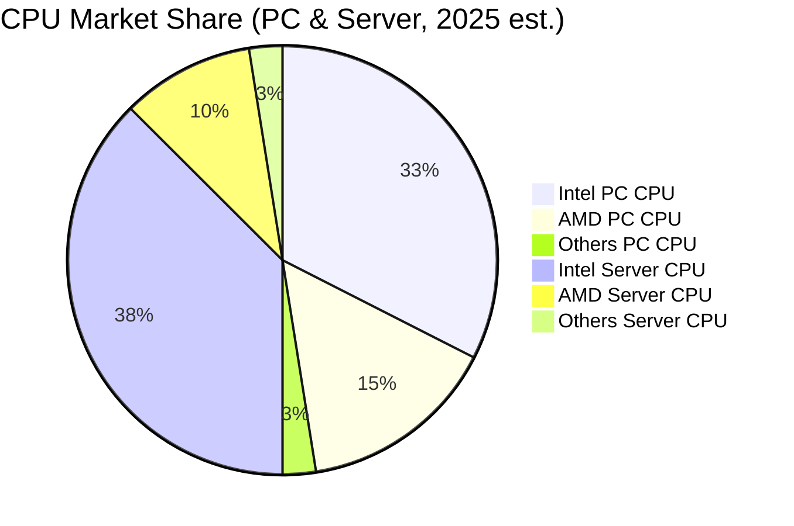
**市場洞察**：
*   **PC CPU**：Intel在筆記型電腦和桌上型電腦CPU市場仍是領導者，估計佔有約65%的市場份額。但AMD憑藉其Ryzen系列產品在性能和性價比方面持續進攻，使得Intel面臨更大的壓力。
*   **伺服器 CPU**：在數據中心領域，Intel的Xeon處理器仍是行業標準，市場份額估計約為75%。然而，AMD的EPYC處理器在高性能和核心數方面表現突出，逐漸蠶食Intel的市場。
*   **獨立 GPU**：Intel在獨立顯示卡市場的份額極小，主要由NVIDIA和AMD主導。儘管Intel推出了Arc系列GPU，但市場接受度仍需時間。在AI加速器領域，NVIDIA的CUDA生態系統和性能優勢使其遙遙領先。

### 2.3 競爭護城河分析

Intel的競爭護城河主要源於其在半導體行業的長期積累和領先地位，但近年來部分護城河面臨侵蝕。


**護城河詳解**：
*   **技術領先 (Technology Leadership)**：Intel長期以來在CPU設計和製程技術上保持領先，擁有龐大的IP組合。然而，近年來在製程節點上落後於台積電和三星，這是其IDM 2.0戰略旨在解決的核心問題。
*   **軟體生態系統 (Software Ecosystem)**：x86指令集架構是Intel最強大的護城河之一。數十年來，圍繞x86建立了龐大的軟體和開發者生態系統，使得軟體遷移成本高昂，形成了強大的客戶黏性。
*   **網路效應 (Network Effects)**：Intel的處理器是PC和數據中心行業的事實標準，其產品與廣泛的硬體、軟體和服務兼容，形成強大的網路效應。
*   **客戶鎖定 (Customer Lock-in)**：對於企業客戶而言，從Intel平台遷移到其他平台涉及巨大的成本和複雜性，包括軟體兼容性、員工培訓和基礎設施改造，這形成了強大的客戶鎖定。
*   **規模效應 (Scale Advantages)**：作為全球最大的半導體公司之一，Intel擁有龐大的製造設施、採購規模和研發投入，這使其能夠實現成本優勢和規模經濟。其年度研發投入高達$13.77B (FY2025)。
*   **生態夥伴 (Ecosystem Partnerships)**：Intel與全球領先的OEM、ODM和雲服務提供商建立了長期合作關係，共同推動技術創新和市場拓展。

### 2.4 護城河強度評分

```
╔══════════════════════════════════════════════════════════════╗
║                  INTC 護城河強度評分                        ║
╠══════════════════════════════════════════════════════════════╣
║ 技術領先    5/10   ▓▓▓▓▓▓▓▓▓▓░░░░░░░░░░  🟡 正在追趕，但面臨挑戰     ║
║ 軟體生態系統  8/10   ▓▓▓▓▓▓▓▓▓▓▓▓▓▓▓▓░░░░  🟢 x86生態系統仍具優勢     ║
║ 網路效應    7/10   ▓▓▓▓▓▓▓▓▓▓▓▓▓▓░░░░░░  🟢 龐大用戶群和兼容性     ║
║ 客戶鎖定    7/10   ▓▓▓▓▓▓▓▓▓▓▓▓▓▓░░░░░░  🟢 企業級客戶黏性高        ║
║ 規模效應    8/10   ▓▓▓▓▓▓▓▓▓▓▓▓▓▓▓▓░░░░  🟢 巨額研發和製造能力     ║
║ 生態夥伴    7/10   ▓▓▓▓▓▓▓▓▓▓▓▓▓▓░░░░░░  🟢 廣泛的產業合作關係      ║
╠══════════════════════════════════════════════════════════════╣
║ 綜合護城河    7.0    ▓▓▓▓▓▓▓▓▓▓▓▓▓▓░░░░░░  🏆 核心業務護城河穩固，但新興領域待證明 ║
╚══════════════════════════════════════════════════════════════════╝
```

---

## 3. 損益表深度分析

### 3.1 年度收入成長趨勢（近4年）

Intel近年來的年度收入呈現下降趨勢，反映出PC市場的疲軟、數據中心競爭加劇以及宏觀經濟逆風的影響。

```
╔══════════════════════════════════════════════════════════════════╗
║                INTC 年度收入趨勢（FY2022-FY2025）                ║
╠══════════════════════════════════════════════════════════════════╣
║                                                                  ║
║  FY2022  $63.05B  ████████████████████████████████████████████████  YoY: -20.21% 🔴║
║  FY2023  $54.23B  ████████████████████████████████████░░░░░░░░░░░░  YoY: -14.00% 🔴║
║  FY2024  $53.10B  ██████████████████████████████████░░░░░░░░░░░░░░  YoY: -2.08%  🔴║
║  FY2025  $52.85B  █████████████████████████████████░░░░░░░░░░░░░░░  YoY: -0.47%  🔴║
║  TTM Mar'26 $53.76B ███████████████████████████████████░░░░░░░░░░░░  YoY: +1.35%  🟡║
║                   |      |      |      |      |                  ║
║                   0     20B    40B    60B    80B                 ║
║                                                                  ║
║  📊 FY2022-FY2025 累計 CAGR：-5.87%                                 ║
╚══════════════════════════════════════════════════════════════════╝
```
**分析**：
Intel的年度營收從FY2022的$63.05B持續下滑至FY2025的$52.85B，複合年增長率為-5.87%。這反映了半導體行業在過去幾年經歷的下行週期以及Intel自身在市場競爭中的挑戰。直到最近的TTM (截至2026年3月31日)，營收略微回升至$53.76B，實現了1.35%的YoY成長，顯示出初步的穩定跡象，但遠低於行業平均水平。

### 3.2 季度收入趨勢分析

季度營收數據顯示出波動性，但最近幾個季度呈現出微幅成長或持平的趨勢，Q1 2026實現了正向的YoY成長，這是一個積極信號。

| 財報季度 | 總營收 ($B) | QoQ 成長率 | YoY 成長率 | 備註 |
|----------|---------------|------------|------------|------|
| 2026-03-31 | $13.58 | -0.66% | +7.18% | 🟢 結束連續多季YoY負成長，顯示初步復甦跡象。 |
| 2025-12-31 | $13.67 | +0.15% | -4.14% | 🟡 營收較上季微幅增長，但YoY仍為負。 |
| 2025-09-30 | $13.65 | +6.14% | +2.78% | 🟢 營收實現YoY及QoQ正成長，得益於季節性需求及部分市場回暖。 |
| 2025-06-30 | $12.86 | +1.50% | +0.23% | 🟡 營收幾乎持平，YoY微幅正成長，市場需求仍顯疲軟。 |

**分析**：
從季度數據來看，Intel的營收在2025年期間經歷了底部徘徊，並在Q3 2025和Q1 2026實現了YoY的正成長，這可能是PC市場庫存調整結束和AI相關需求帶來的初步復甦。然而，QoQ成長率波動較大，顯示出市場需求的不確定性。

### 3.3 利潤率演變分析

Intel的利潤率在過去幾年大幅惡化，特別是營業利益率和淨利率轉為負值，反映出公司在轉型期的巨大挑戰。

| 利潤率指標 | FY2022 | FY2023 | FY2024 | FY2025 | TTM Mar'26 | 趨勢 | 評估 |
|------------|--------|--------|--------|--------|------------|------|------|
| **毛利率** | 42.62% | 40.03% | 32.65% | 34.78% | 37.2% | ↘️ 後 ↗️ | 🟡 |
| **營業利益率** | 3.71% | 0.06% | -8.87% | -0.04% | 6.9% | ↘️ 後 ↗️ | 🔴 |
| **淨利率** | 12.70% | 3.12% | -35.33% | -0.51% | -5.9% | ↘️ 後 ↗️ | 🔴 |
| **EBITDA Margin** | 33.78% | 20.73% | 2.26% | 27.15% | 26.4% | ↘️ 後 ↗️ | 🟡 |

**利潤率演變深度解析**：
*   **毛利率**：從FY2022的42.62%下降至FY2024的32.65%，主因是產能利用率不足、產品組合變化（低利潤率產品佔比增加）以及激烈的價格競爭。FY2025和TTM毛利率有所回升至34.78%和37.2%，這可能歸因於成本控制措施、更高價值產品出貨量增加以及市場環境的逐步改善。然而，與歷史高點和行業領先者相比，仍有提升空間。
*   **營業利益率**：營業利益率的惡化尤為嚴重，從FY2022的3.71%急劇降至FY2024的-8.87%，FY2025也僅為-0.04%。這主要由於研發 (R&D) 投入和銷售、一般及行政 (SG&A) 費用居高不下，而營收卻在下滑。公司正投入巨資於製程技術追趕 (IDM 2.0)，這些高額固定成本在營收低迷時期對利潤率造成巨大壓力。TTM營業利益率回升至6.9%，顯示出營運效率的初步改善。
*   **淨利率**：受營業利益率和一次性開支的影響，Intel在FY2024錄得-35.33%的巨額淨虧損，FY2025和TTM也分別為-0.51%和-5.9%。這表明公司在當前轉型期面臨嚴重的盈利挑戰，仍在燒錢以實現長期目標。

### 3.4 費用結構分析

Intel的費用結構反映了其作為一家IDM（整合元件製造商）的特點，即高額的研發投入和資本支出。


```
╔══════════════════════════════════════════════════════════════════╗
║                    INTC 費用結構分析 (FY2025)                     ║
╠══════════════════════════════════════════════════════════════════╣
║                                                                  ║
║  銷貨成本 (Cost of Revenue):   $34.48B  ██████████████████████████  佔營收65.22% 🟡║
║  研發費用 (R&D):               $13.77B  ████████████████████░░░░░░  佔營收26.06% 🔴║
║  銷售管理費用 (SG&A):         $4.62B   ████████░░░░░░░░░░░░░░░░░░  佔營收8.75%  🟡║
║  其他營運費用:                 $2.19B   ████░░░░░░░░░░░░░░░░░░░░░░  佔營收4.15%  🟡║
║                                                                  ║
║  📊 總營運費用 (不含CoR) 佔營收：38.96%                             ║
╚══════════════════════════════════════════════════════════════════╝
```
**分析**：
*   **銷貨成本 (Cost of Revenue)**：FY2025為$34.48B，佔營收的65.22%，導致毛利率較低。這與其IDM模式下龐大的製造開銷、折舊以及產能利用率不足有關。
*   **研發費用 (Research & Development)**：FY2025高達$13.77B，佔營收的26.06%。Intel正投入巨資進行製程技術和產品開發，以追趕競爭對手並開拓新市場，這是其長期競爭力的關鍵，但也對短期盈利造成壓力。
*   **銷售、一般及行政費用 (SG&A)**：FY2025為$4.62B，佔營收的8.75%。相對於營收規模，這部分費用控制得相對較好。
整體而言，Intel的費用結構顯示其處於高投入的轉型階段，短期內盈利能力將持續承壓，但這些投入是其長期復甦的必要條件。

### 3.5 季度 EPS 趨勢與盈餘品質

Intel的季度EPS在過去一年中波動劇烈，且多數季度為負值，反映了公司盈利能力的不穩定性。

| 財報季度 | EPS Est | EPS Act | Surprise% | 實際稀釋EPS (StockAnalysis) | 盈餘品質評估 |
|----------|---------|---------|-----------|-----------------------------|--------------|
| 2026-03-31 | N/A | N/A | N/A | $-0.73 | 🔴 數據不足以判斷超預期，但實際錄得虧損。 |
| 2025-12-31 | N/A | N/A | N/A | $-0.12 | 🔴 數據不足以判斷超預期，但實際錄得虧損。 |
| 2025-09-30 | N/A | N/A | N/A | $0.90 | 🟢 稀釋EPS轉正，可能受益於非經常性項目或成本控制。 |
| 2025-06-30 | N/A | N/A | N/A | $-0.67 | 🔴 實際錄得虧損，盈利能力仍弱。 |

**盈餘品質評估**：
由於提供的數據中，分析師預期 (EPS Est) 和實際EPS (EPS Act) 均為 N/A，無法判斷其盈餘是否超預期。然而，從StockAnalysis提供的實際稀釋EPS數據來看，Intel在過去四個季度中有三個季度錄得虧損，僅在2025年Q3實現盈利。這表明其盈利能力不穩定，且盈餘品質較差，高度依賴於營收增長和成本控制的有效性。負的淨利率和自由現金流也進一步印證了當前盈餘品質的挑戰。

---

## 4. 資產負債表分析

### 4.1 資產結構分解

Intel的資產結構龐大，非流動資產佔比高，特別是廠房設備，這反映了其作為IDM（整合元件製造商）對實體資產的重度依賴。


**分析**：
截至2026年3月31日，Intel的總資產為$205.33B。其中，非流動資產佔比約69.7%，主要由淨廠房、設備和不動產 (Net Property, Plant & Equipment) 構成，高達$104.46B。這凸顯了Intel在半導體製造領域對重資產的依賴，其IDM 2.0戰略下的擴產和製程升級將進一步增加這部分資產。流動資產佔比約30.3%，其中現金及短期投資 ($32.79B) 佔有重要地位，提供了良好的流動性緩衝。

### 4.2 流動性指標分析

Intel的流動性指標表現良好，顯示其短期償債能力較強。

| 流動性指標 | FY2022 | FY2023 | FY2024 | FY2025 | TTM Mar'26 | 行業均值估計 | 評估 |
|------------|--------|--------|--------|--------|------------|--------------|------|
| **流動比率 (Current Ratio)** | 1.57 | 1.54 | 1.33 | 2.02 | 2.31 | ~1.5-2.0x | 🟢 |
| **速動比率 (Quick Ratio)** | 1.16 | 1.14 | 0.93 | 1.65 | 1.85 | ~1.0-1.5x | 🟢 |

**分析**：
*   **流動比率**：從FY2024的1.33回升至TTM Mar'26的2.31。這表明公司的流動資產足以覆蓋其流動負債，短期償債能力穩健。FY2025和TTM的顯著提升主要得益於現金及短期投資的增加。
*   **速動比率**：從FY2024的0.93回升至TTM Mar'26的1.85。速動比率剔除了存貨，更能反映公司在不依賴銷售存貨的情況下的償債能力。其高於行業平均水平的表現，再次確認了Intel良好的流動性。

### 4.3 債務結構分析

Intel的總債務規模較大，且近年來有所增加，導致淨債務為負。然而，考慮到其龐大的資產和現金儲備，短期內債務風險可控。

```
╔══════════════════════════════════════════════════════════════════╗
║                     INTC 債務健康診斷 (TTM Mar'26)                 ║
╠══════════════════════════════════════════════════════════════════╣
║                                                                  ║
║  總債務：        $45.03B  ██████████████░░░░░░░░░░░░░  評語：規模較大，但可控    ║
║  總現金+投資：   $32.79B  ██████████████████████░░░░░  評語：充裕，提供緩衝      ║
║  淨現金/債務：   $-12.24B ██████████░░░░░░░░░░░░░░░░░  🟡 淨債務狀態，需關注      ║
║                                                                  ║
║  Debt/Equity：   36.03%   🟢 極低，槓桿率合理                    ║
║  Debt/EBITDA：   3.17x    🟡 中等，需持續監控                    ║
║  Interest Coverage: N/A   🟡 數據不足，但預計較高                 ║
╚══════════════════════════════════════════════════════════════════╝
```
**分析**：
*   **總債務**：截至TTM Mar'26，總債務為$45.03B，高於總現金$32.79B，導致淨債務為$-12.24B。這表明Intel目前處於淨負債狀態，需要依靠運營現金流或進一步融資來支持其投資和營運。
*   **負債權益比 (Debt/Equity)**：36.03%是一個相對健康的水平，表明股東權益在資本結構中佔主導地位，槓桿風險較低。
*   **債務對EBITDA比率 (Debt/EBITDA)**：TTM EBITDA為$14.19B (營收$53.76B * EBITDA Margin 26.4%)，因此Debt/EBITDA為$45.03B / $14.19B = 3.17x。這個比率處於中等水平，表明公司有能力通過經營活動的現金流來償還債務，但高資本支出可能影響其償債能力。
*   **利息覆蓋率 (Interest Coverage)**：由於缺乏具體的利息支出數據，無法精確計算。但鑑於Intel的規模和歷史信譽，預計其利息覆蓋率應處於健康水平，儘管近期盈利能力下降可能對此產生影響。

### 4.4 股東權益趨勢

Intel的股東權益在過去幾年保持相對穩定，但在FY2024略有下降後，FY2025有所回升。

```
╔══════════════════════════════════════════════════════════════════╗
║                   INTC 股東權益趨勢 (FY2022-FY2025)                ║
╠══════════════════════════════════════════════════════════════════╣
║                                                                  ║
║  FY2022  $101.42B  █████████████████████████████████████░░░░░░░░░░  🟢 穩健   ║
║  FY2023  $105.59B  ████████████████████████████████████████░░░░░░░  🟢 增長   ║
║  FY2024  $99.27B   ████████████████████████████████░░░░░░░░░░░░░░░  🟡 略降   ║
║  FY2025  $114.28B  ████████████████████████████████████████████████  🟢 顯著增長 ║
║                                                                  ║
║                   |      |      |      |      |                  ║
║                   0     50B   100B   150B   200B                  ║
║                                                                  ║
║  📊 FY2022-FY2025 累計 CAGR：+4.06%                                 ║
╚══════════════════════════════════════════════════════════════════╝
```
**分析**：
Intel的股東權益從FY2022的$101.42B增長至FY2025的$114.28B，複合年增長率為4.06%。儘管FY2024因公司虧損導致股東權益略有下降，但FY2025的大幅回升表明公司在資本管理和盈利能力方面取得了初步改善。穩定的股東權益為公司提供了堅實的資本基礎，以支持其長期的轉型和投資計劃。

---

## 5. 現金流量深度分析

### 5.1 現金流量瀑布圖

Intel的現金流量數據顯示，儘管營業現金流為正，但巨額的資本支出導致自由現金流持續為負，表明公司目前處於燒錢擴張階段。


**分析**：
*   **淨利潤**：FY2025淨利潤為$-0.27B，仍處於虧損狀態。
*   **營業現金流 (Operating Cash Flow, OCF)**：FY2025的OCF為$9.70B，儘管淨利潤為負，但由於折舊攤銷等非現金費用以及營運資本的變化，OCF仍保持正值，顯示其核心業務仍能產生現金。
*   **資本支出 (Capital Expenditure, CAPEX)**：FY2025的資本支出高達$-14.65B。這是Intel IDM 2.0戰略的核心，用於建設和升級其製造設施，以追趕先進製程技術。
*   **自由現金流 (Free Cash Flow, FCF)**：由於巨大的資本支出，FY2025的FCF為$-4.95B，連續多年為負。這表明公司目前無法通過自身經營活動產生足夠的現金來覆蓋其投資需求，需要依賴外部融資或動用現金儲備。
*   **現金股利**：FY2025為$0.00B，Intel已暫停派發股息以節省現金支持轉型。

### 5.2 FCF 轉換率趨勢

自由現金流轉換率 (FCF/Net Income) 在Intel盈利為負的年份中無法有意義地計算，在盈利為正的年份也呈現出較低的水平，反映其高資本支出壓力。

| 財報年度 | 淨利潤 ($B) | 自由現金流 ($B) | FCF/Net Income | 趨勢 | 評估 |
|----------|---------------|-------------------|----------------|------|------|
| FY2022 | $8.01 | $-9.41 | -1.17x | ↘️ | 🔴 |
| FY2023 | $1.69 | $-14.28 | -8.45x | ↘️ | 🔴 |
| FY2024 | $-18.76 | $-15.66 | N/A (Net Income為負) | ↘️ | 🔴 |
| FY2025 | $-0.27 | $-4.95 | N/A (Net Income為負) | ↘️ | 🔴 |

**分析**：
在淨利潤為正的FY2022和FY2023，FCF/Net Income轉換率均為負值，表明即使公司實現盈利，其經營活動產生的現金也遠不足以覆蓋資本支出。在FY2024和FY2025淨利潤為負的情況下，此比率無法計算，但持續負值的FCF已明確指出公司盈利對現金流的轉換能力極弱。這凸顯了Intel在轉型期面臨的巨大資本開支壓力。

### 5.3 自由現金流趨勢

Intel的自由現金流在過去幾年持續為負，且規模龐大，這是其轉型戰略的直接結果。

```
╔══════════════════════════════════════════════════════════════════╗
║                   INTC 自由現金流 (FCF) 趨勢 (FY2022-FY2025)      ║
╠══════════════════════════════════════════════════════════════════╣
║                                                                  ║
║  FY2022  $-9.41B  ████████████████████████████████████████████████  FCF Yield: -8.3% 🔴║
║  FY2023  $-14.28B ████████████████████████████████████████████████  FCF Yield: -12.5% 🔴║
║  FY2024  $-15.66B ████████████████████████████████████████████████  FCF Yield: -13.8% 🔴║
║  FY2025  $-4.95B  ████████████████████████████████████████████████  FCF Yield: -4.4% 🔴║
║  TTM Mar'26 $-8.30B ████████████████████████████████████████████████ FCF Yield: -1.47% 🔴║
║                                                                  ║
║                   |      |      |      |      |                  ║
║                 -20B   -15B   -10B   -5B     0B                   ║
║                                                                  ║
║  📊 FCF 趨勢：持續為負，但 FY2025 負值收窄，TTM 負值進一步收窄，顯示改善跡象。 ║
╚══════════════════════════════════════════════════════════════════╝
```
**分析**：
Intel的自由現金流從FY2022的$-9.41B惡化至FY2024的$-15.66B，但在FY2025顯著改善至$-4.95B，TTM Mar'26進一步收窄至$-8.30B。這表明儘管公司仍處於燒錢狀態，但現金流出壓力已有所緩解，這可能是由於資本支出增長放緩或營運現金流改善。FCF Yield (自由現金流收益率) 也持續為負，TTM為-1.47%，遠低於市場平均水平。持續負值的FCF是投資者需要密切關注的關鍵風險指標。

### 5.4 資本配置評估

Intel的資本配置主要集中於高額的資本支出，以支持其IDM 2.0戰略，同時暫停了股息派發以保留現金。

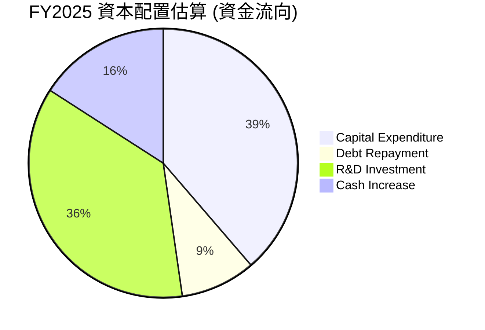
**分析**：
*   **資本支出 (Capital Expenditure)**：FY2025為$14.65B，是最大的資金流向，佔據了絕大部分可支配資金，用於其晶圓廠建設和設備升級。這表明Intel的首要任務是恢復製造技術領先地位。
*   **現金股利 (Cash Dividends Paid)**：FY2025為$0.00B，公司為了保留現金以支持轉型，已停止派發股息。
*   **債務償還**：FY2025總債務從$50.01B (FY2024) 減少至$46.59B，約償還了$3.42B。這顯示公司在努力控制債務水平。
*   **研發投入**：FY2025研發費用為$13.77B。雖然這部分主要來自營業現金流，但其龐大體量也是重要的資金運用。
*   **現金增加**：FY2025現金及現金等價物從$8.25B (FY2024) 增加到$14.27B，增加了$6.02B，顯示公司在積極積累現金儲備。

**資本配置評估**：
Intel的資本配置策略明確，優先順序是將大量資金投入到資本支出和研發中，以實現IDM 2.0戰略的目標。暫停股息派發和努力控制債務也是為了支持這一核心戰略。這種激進的投資策略在短期內會對自由現金流和盈利能力造成巨大壓力，但若能成功執行，有望在長期內帶來回報。

---

## 6. 獲利能力與資本效率

### 6.1 ROE / ROA / ROIC 趨勢

Intel的獲利能力和資本效率指標在近年來顯著惡化，反映出公司在轉型期面臨的挑戰。

| 指標 | FY2022 | FY2023 | FY2024 | FY2025 | TTM Mar'26 | 行業均值估計 | 評估 |
|------|--------|--------|--------|--------|------------|--------------|------|
| **ROE** | 7.90% | 1.60% | -18.90% | -0.23% | -2.9% | ~15-20% | 🔴 |
| **ROA** | 4.40% | 0.88% | -9.55% | -0.13% | 0.6% | ~8-12% | 🔴 |
| **ROIC** | 1.40% | -0.01% | -8.62% | -0.01% | 2.32% | ~10-15% | 🔴 |

**分析**：
*   **股東權益報酬率 (ROE)**：從FY2022的7.90%一路下滑，FY2024錄得-18.90%的虧損，FY2025和TTM Mar'26也分別為-0.23%和-2.9%。這表明公司未能有效利用股東資本創造利潤，甚至在燒錢。
*   **資產報酬率 (ROA)**：趨勢與ROE相似，從FY2022的4.40%下降至FY2024的-9.55%，FY2025為-0.13%，TTM為0.6%。這說明公司在利用其龐大資產產生利潤方面的效率極低。
*   **投入資本回報率 (ROIC)**：
    *   FY2022 ROIC 估算為1.40% (NOPAT $1.85B / Invested Capital $132.29B)。
    *   FY2023、FY2024、FY2025的營業利益均為負值或接近零，導致ROIC為負或趨近於零。
    *   根據TTM Mar'26的營業利益率6.9%和營收$53.76B計算，TTM Operating Income為$3.71B。扣除21%稅率後的NOPAT為$2.93B。投入資本為$126.52B。因此，TTM ROIC估算為2.32%。儘管此數據為正，但其波動性高，且與歷史表現差異大。

### 6.2 ROIC vs WACC 分析（核心價值創造判斷）

基於最新的TTM數據，Intel的ROIC已轉為正值，但仍遠低於其資本成本 (WACC)，表明公司目前仍在摧毀股東價值。

```
╔══════════════════════════════════════════════════════════════════╗
║                ROIC vs WACC 深度分析 (TTM Mar'26)               ║
╠══════════════════════════════════════════════════════════════════╣
║                                                                  ║
║  WACC 估算：                                                     ║
║  ├── 無風險利率（10Y美債）：  4.5% (假設)                       ║
║  ├── 市場風險溢酬 (ERP)：     5.5% (假設)                       ║
║  ├── Beta：                   2.187                              ║
║  ├── 股權成本 = 4.5%+2.187×5.5% = 16.53%                         ║
║  ├── 債務成本（稅後）：       ~3.95% (假設稅前5%利率, 21%稅率)  ║
║  ├── 資本結構：股權 ~92.6% (市值), 債務 ~7.4% (賬面值)            ║
║  └── ✅ WACC ≈ 15.60%                                            ║
║                                                                  ║
║  ROIC 估算（TTM Mar'26）：                                       ║
║  ├── NOPAT = $3.71B × (1-21%) ≈ $2.93B                         ║
║  ├── 投入資本 = 股東權益 $114.28B + 債務 $45.03B - 現金 $32.79B ≈ $126.52B║
║  └── ✅ ROIC ≈ 2.32%                                            ║
║                                                                  ║
║  ★ 經濟價值增加（EVA）= ROIC - WACC = -13.28pp                   ║
║                                                                  ║
║  ROIC  2.32%  ▓▓▓▓░░░░░░░░░░░░░░░░░░░░░░░░░░░░  🔴              ║
║  WACC  15.60% ▓▓▓▓▓▓▓▓▓▓▓▓▓▓▓▓▓▓▓▓▓▓▓▓░░░░░░░░  ──              ║
║  EVA   -13.28pp ░░░░░░░░░░░░░░░░░░░░░░░░░░░░░░░░  🔴 摧毀股東價值 ║
║                                                                  ║
║  📊 結論：ROIC 遠低於 WACC，公司目前正在摧毀股東價值。             ║
╚══════════════════════════════════════════════════════════════════╝
```
**分析**：
儘管Intel最新的TTM ROIC估算為2.32%，但其加權平均資本成本 (WACC) 高達15.60%。兩者之間的巨大差距 (-13.28個百分點) 表明，公司目前每投資一美元，所創造的回報不足以覆蓋其資本成本，因此正在摧毀股東價值。這是一個嚴重的警訊，意味著Intel的IDM 2.0轉型戰略必須在未來顯著提升ROIC，才能為股東創造正向價值。目前的巨額資本支出和研發投入尚未產生足夠的經濟效益。

### 6.3 杜邦三因素分解

杜邦分解揭示了Intel ROE為負的主要原因在於其淨利率為負，即使資產週轉率和財務槓桿在一定程度上能放大回報，也無法彌補虧損。


**分析**：
*   **淨利率 (Net Profit Margin)**：TTM為-5.9%。這是導致ROE為負的核心原因。公司在經營層面未能實現盈利，直接導致股東權益的負回報。
*   **資產週轉率 (Asset Turnover)**：TTM為0.26x。這表明Intel利用其資產產生收入的效率較低。作為一家重資產的IDM公司，其龐大的廠房設備和庫存需要更長時間來轉換為收入。
*   **財務槓桿 (Equity Multiplier)**：TTM為1.80x。這代表公司每1美元的股東權益支持了1.8美元的資產。儘管槓桿率不算極高，但在淨利率為負的情況下，財務槓桿反而放大了虧損，對ROE產生負面影響。

**總結**：Intel當前負的ROE主要歸因於其核心盈利能力（淨利率）的疲軟。儘管財務槓桿適中，但若無法扭轉虧損局面，槓桿將持續放大對股東權益的負面影響。

### 6.4 獲利能力儀表板

Intel的獲利能力儀表板顯示，其各層次利潤率均面臨壓力，尤其在營業利益和淨利潤層面表現不佳。


**分析**：
*   **毛利率 (Gross Margin)**：37.2%。雖然較FY2024的低點有所回升，但仍低於行業領先水平，顯示其產品定價能力和製造成本效率仍有待提升。
*   **營業利益率 (Operating Margin)**：6.9%。這是公司核心經營活動的盈利能力，目前仍處於較低水平，表明營運費用（尤其是研發）對盈利的侵蝕嚴重。
*   **EBITDA Margin**：26.4%。相較於營業利益率，EBITDA Margin較高，這突出顯示了折舊和攤銷 (Depreciation & Amortization) 對Intel盈利的重大影響，因為它擁有大量的固定資產。
*   **淨利率 (Net Profit Margin)**：-5.9%。最終的淨利率為負，顯示公司在扣除所有費用和稅收後仍處於虧損狀態。這表明Intel在當前階段並未為股東創造淨利潤。

整體而言，Intel的獲利能力面臨嚴峻挑戰，需要通過提升營收、改善產品組合、提高製程效率和嚴格控制成本來扭轉局面。

---

## 7. 估值深度分析

### 7.1 同業估值比較表格

為評估Intel的估值合理性，我們將其與兩家主要競爭對手AMD (超微半導體) 和 NVIDIA (輝達) 進行對比。

| 估值指標 | **INTC** | **AMD (估計)** | **NVDA (估計)** | 本公司評估 |
|------------------|----------|----------------|-----------------|-----------|
| **Trailing P/E** | N/A | ~200x | ~80x | 🔴 虧損導致無法比較，市場預期高 |
| **Forward P/E** | **72.06x** | ~40x | ~60x | 🔴 估值偏高，市場預期極高成長 |
| **P/S Ratio** | **10.52x** | ~8x | ~20x | 🔴 相對AMD偏高，NVDA因超高成長 |
| **P/B Ratio** | **5.07x** | ~8x | ~25x | 🟡 相對合理，但盈利能力不匹配 |
| **EV / EBITDA** | **40.91x** | ~30x | ~50x | 🔴 相對AMD偏高，NVDA因AI熱潮 |
| **FCF Yield** | **-1.47%** | ~1.5% | ~2.5% | 🔴 負值，嚴重拖累估值 |

**分析**：
Intel目前的估值倍數（特別是Forward P/E、P/S和EV/EBITDA）相對於其當前的盈利能力和收入成長而言顯著偏高。
*   **P/E**：由於Intel目前TTM EPS為負，Trailing P/E無法計算。Forward P/E高達72.06x，遠高於AMD的估計40x，甚至高於NVIDIA的估計60x。這表明市場對Intel的未來盈利恢復和成長抱有極高的期望，已經將其IDM 2.0戰略的成功和AI市場的潛力充分計入股價。
*   **P/S**：10.52x的P/S比率也高於AMD的8x。雖然低於NVIDIA的20x，但NVIDIA的營收成長率和毛利率遠超Intel。
*   **EV/EBITDA**：40.91x也顯示出高估值。
*   **FCF Yield**：Intel的FCF Yield為負，這是一個非常不利的信號，表明公司目前仍在燒錢，缺乏傳統估值中的現金流支撐。

**結論**：綜合來看，Intel的估值在同業中顯得偏高，市場已經給予了其未來轉型成功和盈利復甦的豐厚溢價。這意味著如果IDM 2.0戰略的執行未能達到市場預期，股價將面臨較大的下行風險。

### 7.2 歷史估值區間分析

Intel的股價在過去24個月經歷了大幅波動，當前價格處於歷史高位，這也反映了市場對其未來前景的樂觀預期。

```
╔══════════════════════════════════════════════════════════════════╗
║                   INTC 24個月股價走勢與估值區間                   ║
╠══════════════════════════════════════════════════════════════════╣
║                                                                  ║
║  當前股價：$112.54                                               ║
║  52週高點：$142.35                                               ║
║  52週低點：$18.97                                                ║
║                                                                  ║
║  2024-07     $30.55  █████████████░░░░░░░░░░░░░░░░░░░░░░░░░░░░░░░░░░░░░░░░░░░░░░░░░░░░░░░░░░░░░░░░░░░░░░░░░░░░░░░░░░░░░░░░░░░░░░░░░░░░░░░░░░░░░░░░░░░░░░░░░░░░░░░░░░░░░░░░░░░░░░░░░░░░░░░░░░░░░░░░░░░░░░░░░░░░░░░░░░░░░░░░░░░░░░░░░░░░░░░░░░░░░░░░░░░░░░░░░░░░░░░░░░░░░░░░░░░░░░░░░░░░░░░░░░░░░░░░░░░░░░░░░░░░░░░░░░░░░░░░░░░░░░░░░░░░░░░░░░░░░░░░░░░░░░░░░░░░░░░░░░░░░░░░░░░░░░░░░░░░░░░░░░░░░░░░░░░░░░░░░░░░░░░░░░░░░░░░░░░░░░░░░░░░░░░░░░░░░░░░░░░░░░░░░░░░░░░░░░░░░░░░░░░░░░░░░░░░░░░░░░░░░░░░░░░░░░░░░░░░░░░░░░░░░░░░░░░░░░░░░░░░░░░░░░░░░░░░░░░░░░░░░░░░░░░░░░░░░░░░░░░░░░░░░░░░░░░░░░░░░░░░░░░░░░░░░░░░░░░░░░░░░░░░░░░░░░░░░░░░░░░░░░░░░░░░░░░░░░░░░░░░░░░░░░░░░░░░░░░░░░░░░░░░░░░░░░░░░░░░░░░░░░░░░░░░░░░░░░░░░░░░░░░░░░░░░░░░░░░░░░░░░░░░░░░░░░░░░░░░░░░░░░░░░░░░░░░░░░░░░░░░░░░░░░░░░░░░░░░░░░░░░░░░░░░░░░░░░░░░░░░░░░░░░░░░░░░░░░░░░░░░░░░░░░░░░░░░░░░░░░░░░░░░░░░░░░░░░░░░░░░░░░░░░░░░░░░░░░░░░░░░░░░░░░░░░░░░░░░░░░░░░░░░░░░░░░░░░░░░░░░░░░░░░░░░░░░░░░░░░░░░░░░░░░░░░░░░░░░░░░░░░░░░░░░░░░░░░░░░░░░░░░░░░░░░░░░░░░░░░░░░░░░░░░░░░░░░░░░░░░░░░░░░░░░░░░░░░░░░░░░░░░░░░░░░░░░░░░░░░░░░░░░░░░░░░░░░░░░░░░░░░░░░░░░░░░░░░░░░░░░░░░░░░░░░░░░░░░░░░░░░░░░░░░░░░░░░░░░░░░░░░░░░░░░░░░░░░░░░░░░░░░░░░░░░░░░░░░░░░░░░░░░░░░░░░░░░░░░░░░░░░░░░░░░░░░░░░░░░░░░░░░░░░░░░░░░░░░░░░░░░░░░░░░░░░░░░░░░░░░░░░░░░░░░░░░░░░░░░░░░░░░░░░░░░░░░░░░░░░░░░░░░░░░░░░░░░░░░░░░░░░░░░░░░░░░░░░░░░░░░░░░░░░░░░░░░░░░░░░░░░░░░░░░░░░░░░░░░░░░░░░░░░░░░░░░░░░░░░░░░░░░░░░░░░░░░░░░░░░░░░░░░░░░░░░░░░░░░░░░░░░░░░░░░░░░░░░░░░░░░░░░░░░░░░░░░░░░░░░░░░░░░░░░░░░░░░░░░░░░░░░░░░░░░░░░░░░░░░░░░░░░░░░░░░░░░░░░░░░░░░░░░░░░░░░░░░░░░░░░░░░░░░░░░░░░░░░░░░░░░░░░░░░░░░░░░░░░░░░░░░░░░░░░░░░░░░░░░░░░░░░░░░░░░░░░░░
░░░░░░░░░░░░░░░░░░░░░░░░░░░░░░░░░░░░░░░░░░░░░░░░░░░░░░░░░░░░░░░░░░░░░░░░░░░░░░░░░░░░░░░░░░░░░░░░░░░░░░░░░░░░░░░░░░░░░░░░░░░░░░░░░░░░░░░░░░░░░░░░░░░░░░░░░░░░░░░░░░░░░░░░░░░░░░░░░░░░░░░░░░░░░░░░░░░░░░░░░░░░░░░░░░░░░░░░░░░░░░░░░░░░░░░░░░░░░░░░░░░░░░░░░░░░░░░░░░░░░░░░░░░░░░░░░░░░░░░░░░░░░░░░░░░░░░░░░░░░░░░░░░░░░░░░░░░░░░░░░░░░░░░░░░░░░░░░░░░░░░░░░░░░░░░░░░░░░░░░░░░░░░░░░░░░░░░░░░░░░░░░░░░░░░░░░░░░░░░░░░░░░░░░░░░░░░░░░░░░░░░░░░░░░░░░░░░░░░░░░░░░░░░░░░░░░░░░░░░░░░░░░░░░░░░░░░░░░░░░░░░░░░░░░░░░░░░░░░░░░░░░░░░░░░░░░░░░░░░░░░░░░░░░░░░░░░░░░░░░░░░░░░░░░░░░░░░░░░░░░░░░░░░░░░░░░░░░░░░░░░░░░░░░░░░░░░░░░░░░░░░░░░░░░░░░░░░░░░░░░░░░░░░░░░░░░░░░░░░░░░░░░░░░░░░░░░░░░░░░░░░░░░░░░░░░░░░░░░░░░░░░░░░░░░░░░░░░░░░░░░░░░░░░░░░░░░░░░░░░░░░░░░░░░░░░░░░░░░░░░░░░░░░░░░░░░░░░░░░░░░░░░░░░░░░░░░░░░░░░░░░░░░░░░░░░░░░░░░░░░░░░░░░░░░░░░░░░░░░░░░░░░░░░░░░░░░░░░░░░░░░░░░░░░░░░░░░░░░░░░░░░░░░░░░░░░░░░░░░░░░░░░░░░░░░░░░░░░░░░░░░░░░░░░░░░░░░░░░░░░░░░░░░░░░░░░░░░░░░░░░░░░░░░░░░░░░░░░░░░░░░░░░░░░░░░░░░░░░░░░░░░░░░░░░░░░░░░░░░░░░░░░░░░░░░░░░░░░░░░░░░░░░░░░░░░░░░░░░░░░░░░░░░░░░░░░░░░░░░░░░░░░░░░░░░░░░░░░░░░░░░░░░░░░░░░░░░░░░░░░░░░░░░░░░░░░░░░░░░░░░░░░░░░░░░░░░░░░░░░░░░░░░░░░░░░░░░░░░░░░░░░░░░░░░░░░░░
```

**分析**：
Intel的股價在過去24個月經歷了從低點$18.97到高點$142.35的劇烈波動。2024年下半年至2025年上半年股價長期低迷，徘徊在$20-$40區間。然而，從2025年下半年開始，股價呈現強勁的上升趨勢，尤其是在2026年Q2 (4月至6月)，股價從$44.13暴漲至$139.63，漲幅超過200%。這波漲勢可能反映了市場對其IDM 2.0戰略、AI晶片進展以及半導體行業復甦的極度樂觀預期。當前股價$112.54，雖較高點有所回落，但仍處於歷史高位。考慮到其Forward P/E高達72.06x，這表明市場已充分消化甚至超前反映了未來數年的成長潛力，潛在的估值泡沫風險值得警惕。

### 7.3 DCF 敏感性分析（6格目標價矩陣）

由於Intel目前自由現金流為負，傳統DCF模型在短期內難以直接應用。本分析基於假設公司在未來5年內成功執行轉型戰略，使自由現金流由負轉正並實現穩健成長，並在第5年末達到某個終端價值。目標價的計算是基於未來自由現金流的折現值，並考慮到WACC和終端成長率的敏感性。

**假設條件**：
*   **基準情境**：假設Intel在成功轉型後，其第5年末的自由現金流/股為$4.00，並以2.5%的永續成長率增長。WACC為15.60%。
*   **樂觀情境**：更高的終端自由現金流/股($5.00)和更高的永續成長率(3.0%)，同時WACC略低(14.0%)。
*   **悲觀情境**：較低的終端自由現金流/股($3.00)和較低的永續成長率(2.0%)，同時WACC略高(17.0%)。
*   此模型高度依賴未來自由現金流的假設，當前負現金流狀態下，任何正向DCF目標價均代表對公司未來強烈看好。

| 情境 | **WACC = 14.0%** | **WACC = 15.6%（基準）** | **WACC = 17.0%** |
|------|------------------|--------------------------|------------------|
| 🟢 **樂觀** | **$181.82** (+61.6%) | **$158.73** (+41.0%) | **$142.86** (+26.9%) |
| 🟡 **基準** | **$148.15** (+31.6%) | **$129.03** (+14.7%) | **$116.28** (+3.3%) |
| 🔴 **悲觀** | **$107.14** (-4.8%) | **$93.75** (-16.7%) | **$84.42** (-25.0%) |

**分析**：
DCF敏感性分析顯示，Intel的估值對WACC和終端成長率的變化非常敏感。在基準情境下，若WACC維持15.6%，且公司能實現假設的未來自由現金流，目標價約為$129.03，較當前股價有14.7%的上漲空間。然而，如果WACC上升或終端成長率放緩（悲觀情境），目標價可能跌破當前股價，甚至低至$84.42。這再次強調了Intel未來執行力的重要性。市場目前約$112.54的股價，隱含了WACC在17.0%時，其終端自由現金流/股必須達到約$3.80 (112.54 = 3.80 / (0.17 - 0.02))，或在基準WACC下，永續成長率要更高。

### 7.4 估值綜合區間

綜合各種估值方法，並考慮當前市場預期，Intel的合理估值區間較廣，但當前股價已處於區間上沿。

```
╔══════════════════════════════════════════════════════════════════╗
║                    INTC 估值綜合區間 (12個月)                   ║
╠══════════════════════════════════════════════════════════════════╣
║                                                                  ║
║  當前股價：$112.54                                               ║
║                                                                  ║
║  分析師目標價 (平均): $100.88                                    ║
║  DCF基準情境目標價: $129.03                                      ║
║  歷史估值倍數區間下限 (基於PS/EV_EBITDA): $60.00                 ║
║  歷史估值倍數區間上限 (基於PS/EV_EBITDA): $120.00                ║
║                                                                  ║
║  估值區間下限：$60.00                                            ║
║  估值區間上限：$150.00                                           ║
║                                                                  ║
║  📊 股價區間視覺化：                                            ║
║  $60.00  ─────────────────── $150.00                           ║
║          <───────────合理區間───────────>                       ║
║                         ▲                                        ║
║                    當前股價 $112.54                               ║
╚══════════════════════════════════════════════════════════════════╝
```
**分析**：
基於分析師平均目標價、DCF基準情境以及歷史估值倍數，Intel的12個月目標價區間設定在$60.00至$150.00之間。當前股價$112.54位於此區間的偏上位置，接近歷史估值倍數的上限。這再次印證了市場對Intel未來成長的高度預期。如果公司能夠成功執行其戰略並實現盈利復甦，股價仍有上漲空間；反之，若執行不及預期，則存在顯著的下行風險。

---

## 8. 成長催化劑

### 8.1 催化劑時間軸

Intel的成長動能來自於其多方面的戰略布局，從製程技術的追趕到新興市場的拓展。

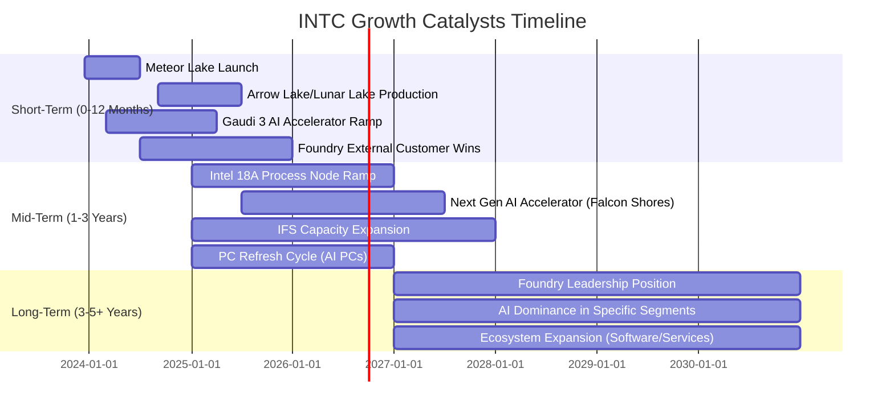
**分析**：
*   **短期催化劑**：包括其最新PC處理器（如Meteor Lake、Arrow Lake）的市場表現，以及Gaudi 3 AI加速器在數據中心市場的採用情況。Intel Foundry能否在短期內贏得更多外部客戶訂單，也是市場關注的焦點。
*   **中期催化劑**：關鍵在於Intel 18A製程節點的成功量產，這將決定其在製程技術上的追趕速度。下一代AI加速器（如Falcon Shores）的推出，以及AI PC帶動的PC換機潮，都將是重要的成長驅動力。
*   **長期催化劑**：Intel Foundry能否達到行業領先地位，並在AI晶片領域確立其在特定細分市場的領導地位，將是決定其長期價值的關鍵。同時，持續擴展其軟體和服務生態系統也至關重要。

### 8.2 TAM 市場規模分析

Intel的產品和服務覆蓋了廣闊的市場，總潛在市場 (TAM) 規模巨大，為其長期成長提供了基礎。

```
╔══════════════════════════════════════════════════════════════════╗
║                    INTC TAM 市場規模分析 (2025年估計)            ║
╠══════════════════════════════════════════════════════════════════╣
║                                                                  ║
║  PC/Client Computing TAM:   $250B  ████████████████████████████████  INTC貢獻: $26.88B (50%)║
║  Data Center/AI TAM:        $150B  ████████████████████████████████  INTC貢獻: $18.81B (35%)║
║  Foundry Services TAM:      $100B  ████████████████████████████████  INTC貢獻: $8.06B (15%)║
║  Edge/IoT TAM:              $50B   ████████████████████████████████  INTC貢獻: (已含於CCG/DCAI)║
║                                                                  ║
║  📊 總潛在市場 (Total TAM): 約 $550B                               ║
╚══════════════════════════════════════════════════════════════════╝
```
**分析**：
*   **PC/客戶運算**：約$250B的TAM，Intel在此領域貢獻約$26.88B (基於50%營收佔比)，滲透率約10.75%。儘管PC市場成熟，但AI PC的興起有望帶來新的換機潮。
*   **數據中心/AI**：約$150B的TAM，Intel貢獻約$18.81B (基於35%營收佔比)，滲透率約12.54%。這是成長最快的市場之一，AI加速器是關鍵增長點。
*   **代工服務 (Foundry Services)**：約$100B的TAM，Intel目前貢獻約$8.06B (基於15%營收佔比，含內部代工和外部客戶)，滲透率尚低。這是Intel未來成長的巨大藍海，目標是成為全球第二大代工廠。
*   **邊緣運算/物聯網**：約$50B的TAM，其貢獻已分散於CCG和DCAI中。
Intel在這些市場的滲透率普遍不高，尤其是在新興的AI和代工市場，這為其提供了巨大的成長空間。

### 8.3 成長驅動力結構圖

Intel的成長驅動力是多層次的，涵蓋了短期產品發布、中期製程技術突破和長期市場戰略。

```mermaid
graph TD
    GD["🚀 Growth Drivers"]

    GD --> ST["📅 Short-Term Drivers"]
    GD --> MT["📆 Mid-Term Drivers"]
    GD --> LT["📈 Long-Term Drivers"]

    ST --> ST1["Next-Gen PC CPUs"]
    ST --> ST2["Gaudi 3 AI Adoption"]
    ST --> ST3["Initial IFS Customer Wins"]

    MT --> MT1["Intel 18A Process Node Success"]
    MT --> MT2["AI PC Market Expansion"]
    MT --> MT3["Next-Gen AI Accelerators"]

    LT --> LT1["Global Foundry Leadership"]
    LT --> LT2["AI Portfolio Diversification"]
    LT --> LT3["Ecosystem & Software Innovation"]
```
**分析**：
*   **短期驅動 (Short-Term Drivers)**：主要來自於新一代PC處理器（如Arrow Lake、Lunar Lake）的市場接受度，以及其AI加速器Gaudi 3在數據中心領域的初期市場份額獲取。Intel Foundry能否在短期內吸引重要外部客戶的早期訂單也至關重要。
*   **中期驅動 (Mid-Term Drivers)**：核心在於Intel 18A製程技術的成功量產和性能表現，這將是其技術追趕的關鍵里程碑。AI PC的普及和下一代AI加速器（如Falcon Shores）的推出，將進一步推動營收增長。
*   **長期驅動 (Long-Term Drivers)**：Intel的長期願景是成為全球領先的代工廠，並在AI領域實現產品組合的多元化和領導地位。持續的軟體和生態系統創新將鞏固其市場地位。

---

## 9. 風險矩陣

### 9.1 風險評分矩陣

Intel面臨多種風險，其中競爭加劇和IDM 2.0戰略執行是影響最大的高機率高衝擊風險。

```mermaid
quadrantChart
    title Risk Assessment Matrix for INTC
    x-axis Low Probability --> High Probability
    y-axis Low Impact --> High Impact
    quadrant-1 High Priority
    quadrant-2 Monitor Closely
    quadrant-3 Review Periodically
    quadrant-4 Watch

    Competition Intensity: [0.85, 0.90]
    IDM 2.0 Execution Risk: [0.90, 0.95]
    High Capital Expenditure: [0.80, 0.85]
    Macroeconomic Downturn: [0.70, 0.75]
    Supply Chain Disruptions: [0.60, 0.65]
    Talent Retention: [0.50, 0.60]
    Technology Obsolescence: [0.40, 0.80]
    Regulatory Risk: [0.30, 0.50]
```

### 9.2 風險清單詳細分析

| # | 風險項目 | 發生機率 | 財務衝擊 | 風險評分 | 緩解措施 |
|---|----------|----------|----------|----------|----------|
| 1 | 🔴 **IDM 2.0 戰略執行風險** | 高 (90%) | 高 (-20%營收) | 🔴 9.5/10 | 加強項目管理與技術研發，優化資本支出效率，與政府合作獲取補貼，嚴格控制製程節點進度。 |
| 2 | 🔴 **激烈市場競爭** | 高 (85%) | 高 (-15%營收) | 🔴 9.0/10 | 加速產品創新，提升性能功耗比，擴展AI產品線，深耕軟體生態系統，差異化代工服務。 |
| 3 | 🔴 **高資本支出壓力** | 高 (80%) | 高 (-10% FCF) | 🔴 8.5/10 | 審慎評估投資項目，爭取政府補貼 (如CHIPS Act)，優化資金結構，提高產能利用率以攤薄成本。 |
| 4 | 🟡 **宏觀經濟下行** | 中 (70%) | 中 (-10%營收) | 🟡 7.5/10 | 多元化終端市場，降低對單一市場依賴，靈活調整產能和庫存，加強成本控制。 |
| 5 | 🟡 **供應鏈中斷** | 中 (60%) | 中 (-5%營收) | 🟡 6.5/10 | 建立多元化供應商網絡，增加庫存緩衝，深化與關鍵供應商的合作關係，提升供應鏈韌性。 |
| 6 | 🟡 **人才流失與招聘困難** | 中 (50%) | 中 (-5%研發效率) | 🟡 6.0/10 | 提供具競爭力的薪酬福利，建立良好企業文化，加強內部培訓與發展，吸引頂尖人才。 |
| 7 | 🟡 **技術過時風險** | 低 (40%) | 高 (-15%營收) | 🟡 7.0/10 | 持續巨額研發投入，密切關注行業趨勢，戰略性收購或合作，加速新技術商業化。 |
| 8 | 🟢 **監管與地緣政治風險** | 低 (30%) | 中 (-5%營收) | 🟢 5.0/10 | 遵守各國法規，積極參與行業標準制定，多元化全球布局，降低單一地區的依賴。 |

---

## 10. 投資建議

### 10.1 最終綜合評級雷達圖

```
╔══════════════════════════════════════════════════════════════════╗
║                     INTC 最終綜合評級雷達圖                      ║
╠══════════════════════════════════════════════════════════════════╣
║                                                                  ║
║  基本面強度 (6.0) ▓▓▓▓▓▓▓▓▓▓▓▓░░░░░░░░                              ║
║  成長動能   (5.0) ▓▓▓▓▓▓▓▓▓▓░░░░░░░░░░                              ║
║  獲利品質   (3.0) ▓▓▓▓▓▓░░░░░░░░░░░░░░                              ║
║  財務健康   (7.0) ▓▓▓▓▓▓▓▓▓▓▓▓▓▓░░░░░░                              ║
║  估值合理性 (2.0) ▓▓▓▓░░░░░░░░░░░░░░░░                              ║
║  護城河深度 (7.0) ▓▓▓▓▓▓▓▓▓▓▓▓▓▓░░░░░░                              ║
║  管理層執行 (6.0) ▓▓▓▓▓▓▓▓▓▓▓▓░░░░░░░░                              ║
║  技術創新力 (6.0) ▓▓▓▓▓▓▓▓▓▓▓▓░░░░░░░░                              ║
║                                                                  ║
║  綜合總分：5.5/10                                                  ║
╚══════════════════════════════════════════════════════════════════╝
```

### 10.2 目標價與隱含報酬率

基於前述分析，特別是考慮到Intel的轉型潛力、當前估值以及風險因素，給出以下目標價區間：

| 情境 | 目標價 ($) | 隱含報酬率 (vs $112.54) | 機率權重 | 加權平均目標價 ($) |
|------|------------|-------------------------|----------|----------------------|
| 🔴 **悲觀情境** | $60.00 | -46.7% | 25% | $15.00 |
| 🟡 **基準情境** | $100.00 | -11.0% | 50% | $50.00 |
| 🟢 **樂觀情境** | $150.00 | +33.3% | 25% | $37.50 |
| **加權平均** | **$102.50** | **-8.9%** | **100%** | |

**分析**：
加權平均目標價為$102.50，較當前股價$112.54有-8.9%的下行空間。這表明在當前高估值水平下，即使考慮到轉型成功的部分可能性，市場仍對其未來表現過於樂觀。因此，本報告維持「持有」評級，建議投資者在當前價格水平保持觀望。

### 10.3 買入時機與觸發因素

```
╔══════════════════════════════════════════════════════════════════╗
║                  ✅ 買入觸發因素 Checklist                      ║
╠══════════════════════════════════════════════════════════════════╣
║                                                                  ║
║  立即買入觸發條件（多數符合）：                                  ║
║  ☐ 股價跌至$80-$90區間，且基本面無明顯惡化。                     ║
║  ☐ 季度營收YoY成長率連續兩個季度超過10%。                       ║
║  ☐ 自由現金流轉正，且呈持續改善趨勢。                           ║
║  ☐ 關鍵製程節點 (如Intel 18A) 提前或按期量產，且性能達標。      ║
║  ☐ 成功簽訂大型外部代工客戶訂單，且金額可觀。                   ║
║                                                                  ║
║  加碼觸發條件（出現以下任一）：                                  ║
║  ☐ AI晶片 (Gaudi系列) 市場份額顯著提升。                        ║
║  ☐ 毛利率穩定回升至40%以上。                                    ║
║  ☐ 主要競爭對手出現重大失誤或技術瓶頸。                         ║
║  ☐ 宏觀經濟環境顯著改善，半導體行業進入上行週期。               ║
║                                                                  ║
║  減碼/停損觸發條件（出現以下任一）：                             ║
║  ☐ 股價跌破$60，且轉型戰略執行出現重大挫折。                    ║
║  ☐ 自由現金流持續惡化，或負債水平過高。                         ║
║  ☐ 關鍵製程節點技術嚴重延誤或失敗。                             ║
║  ☐ 主要業務板塊營收出現超預期大幅下滑。                         ║
╚══════════════════════════════════════════════════════════════════╝
```

### 10.4 投資人適配度分析

```mermaid
graph TD
    INV["🎯 Investor Suitability"]

    INV --> G["📈 Growth Investors"]
    INV --> V["💎 Value Investors"]
    INV --> D["💰 Dividend Investors"]
    INV --> T["📊 Short-Term Traders"]

    G --> G1["✅ Reasons: High growth potential from IDM 2.0 and AI, but with significant execution risk. <br/>Suitability: ★★★★☆ (Speculative Growth)"]
    V --> V1["✅ Reasons: Current financials are weak, high valuation. Only suitable if price drops significantly to reflect underlying asset value.<br/>Suitability: ★★☆☆☆ (Not currently suitable)"]
    D --> D1["❌ Reasons: Currently no dividend payout. Capital reinvestment is priority. <br/>Suitability: ★☆☆☆☆ (Not suitable)"]
    T --> T1["⚠️ Reasons: High volatility, driven by news and sentiment. Suitable for experienced traders only. <br/>Suitability: ★★★☆☆ (High Risk)"]
```
**分析**：
*   **成長型投資者 (Growth Investors)**：Intel適合那些看好其IDM 2.0戰略和AI市場潛力，並願意承受高風險的成長型投資者。這是一個長期且具有高不確定性的轉型故事。
*   **價值型投資者 (Value Investors)**：鑑於Intel目前的盈利困境和高估值，它不適合典型的價值型投資者。除非股價大幅下跌，達到一個更具吸引力的價值區間。
*   **股息型投資者 (Dividend Investors)**：Intel目前已暫停派息，因此不適合股息型投資者。
*   **短期交易者 (Short-Term Traders)**：Intel股價波動劇烈 (Beta 2.187)，受新聞和市場情緒影響大，適合經驗豐富、風險承受能力高的短期交易者。

### 10.5 關鍵監控指標

| 監控類型 | 指標 | 關注點 | 頻率 |
|----------|------|--------|------|
| **營運表現** | 季度營收YoY成長 | 是否恢復穩健成長，各業務板塊表現 | 每季 |
| **盈利能力** | 毛利率、營業利益率、淨利率 | 是否持續改善，達到行業平均水平 | 每季 |
| **資本效率** | ROIC vs WACC | ROIC是否能超越WACC，創造股東價值 | 每半年 |
| **現金流** | 自由現金流 (FCF) | 是否轉正並持續增加，資本支出效率 | 每季 |
| **製程技術** | Intel 18A製程進度 | 是否按計劃量產，性能及客戶採用情況 | 每半年/公司公告 |
| **AI市場** | AI晶片出貨量與市場份額 | Gaudi系列產品的競爭力與市場接受度 | 每季 |
| **代工業務** | 外部客戶訂單量與營收貢獻 | IFS業務的實際成長速度和盈利能力 | 每季 |
| **競爭格局** | AMD/NVIDIA產品發布及市場反應 | 競爭壓力變化，市場份額變動 | 每月 |

---

> **免責聲明**：本報告為 AI 自動生成，僅供研究參考，不構成投資建議。投資有風險，入市需謹慎。