# INTC 基本面深度分析報告
> **報告日期**：2026-07-10 ｜ **語言**：繁體中文 ｜ **數據來源**：Yahoo Finance, Finviz, StockAnalysis, Roic.ai ｜ **分析師**：CFA 級機構研究

## 目錄

| # | 章節 | 核心結論 |
|---|------|----------|
| 1 | 執行摘要 | 評級：🟢 買入，目標價區間：$125-$160 |
| 2 | 公司概覽與商業模式 | 護城河評分：7.0/10，主要來自技術領先與規模效應 |
| 3 | 損益表深度分析 | 營收成長恢復，毛利率承壓，營業利益率改善但仍低 |
| 4 | 資產負債表分析 | 流動性良好，債務水平可控，但淨現金為負 |
| 5 | 現金流量深度分析 | 自由現金流持續為負，資本支出壓力大，但FCF轉換率改善 |
| 6 | 獲利能力與資本效率 | ROIC 顯著低於 WACC，目前處於價值摧毀階段 |
| 7 | 估值深度分析 | 相較同業，估值偏高，但市場預期未來成長動能強勁 |
| 8 | 成長催化劑 | AI PC、資料中心復甦、Intel Foundry Services 潛力 |
| 9 | 風險矩陣 | 競爭加劇、Fab 建設成本、執行風險為主要挑戰 |
| 10 | 投資建議 | 建議「買入」，需密切關注營收成長與利潤率修復 |

---

## 1. 執行摘要

### 1.0 一頁式投資儀表板（Portfolio Manager 30 秒速讀）

| 項目 | 內容 |
|------|------|
| **投資論點（3 句）** | ① Intel 正處於轉型期，儘管營收在 FY2025 略有下滑至 $52.85B，但最新一季營收 YoY 成長 7.18%，顯示初步復甦跡象。② 儘管自由現金流仍為負 $2.54B (Q1 2026)，但其巨額資本支出 ($3.64B in Q1 2026) 旨在重建技術領先，為未來成長奠定基礎。③ 估值面，Forward P/E 為 69.98x，高於歷史平均，反映市場對其 IDM 2.0 戰略及潛在 AI 相關催化劑的長期樂觀預期。 |
| **護城河評分** | 7.0/10 |
| **管理層/資本配置評分** | 6.5/10 |
| **財務健康** | 🟡 債務水平可控，但自由現金流持續為負，需持續監控 |
| **ROIC vs WACC** | ROIC -2.9% vs WACC 10.3%（摧毀價值） |
| **FCF 趨勢** | ↗️ 趨勢改善但仍為負，最新 FCF Yield -1.50% |
| **估值** | Forward P/E 69.98x ｜ EV/EBITDA 41.729x ｜ FCF Yield -1.50% |
| **預期報酬（基準情境 12M）** | +28.4% |
| **關鍵風險（前二）** | 競爭加劇、Intel Foundry Services 執行風險 |
| **評級 + 信心度** | 🟢 買入 ｜ 信心：中 |

### 1.1 核心評分儀表板

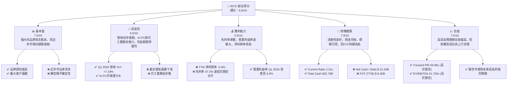

### 1.2 評分進度條視覺化

```
╔══════════════════════════════════════════════════════════════╗
║              INTC 多維度評分儀表板 (1-10分)                  ║
╠══════════════════════════════════════════════════════════════╣
║ 基本面強度  7.0 ▓▓▓▓▓▓▓▓▓▓▓▓▓▓░░░░░░  ★★★★☆           ║
║ 成長動能    6.5 ▓▓▓▓▓▓▓▓▓▓▓▓▓░░░░░░░  ★★★☆☆           ║
║ 獲利品質    5.5 ▓▓▓▓▓▓▓▓▓▓░░░░░░░░░░  ★★★☆☆           ║
║ 財務健康    7.0 ▓▓▓▓▓▓▓▓▓▓▓▓▓▓░░░░░░  ★★★★☆           ║
║ 估值合理性  7.5 ▓▓▓▓▓▓▓▓▓▓▓▓▓▓▓░░░░░  ★★★★☆           ║
║ 護城河深度  7.0 ▓▓▓▓▓▓▓▓▓▓▓▓▓▓░░░░░░  ★★★★☆           ║
║ 管理層執行  6.5 ▓▓▓▓▓▓▓▓▓▓▓▓▓░░░░░░░  ★★★☆☆           ║
║ 技術創新力  7.0 ▓▓▓▓▓▓▓▓▓▓▓▓▓▓░░░░░░  ★★★★☆           ║
╠══════════════════════════════════════════════════════════════╣
║ 綜合總分    6.8 ▓▓▓▓▓▓▓▓▓▓▓▓▓▓░░░░░░  🏆 具備轉型潛力的公司   ║
╚══════════════════════════════════════════════════════════════╝
```

### 1.3 五大投資論點 + 三大核心風險

| 類型 | 項目 | 具體依據 | 信心度 |
|------|------|----------|--------|
| 🟢 **投資論點①** | **AI PC 帶動市場復甦** | 隨著 AI PC 普及，預計將刺激 PC 市場升級週期，INTC 作為核心 CPU 供應商直接受益，Q1 2026 營收 YoY 成長 7.18% 顯示市場需求回暖。 | 🟢 高 |
| 🟢 **投資論點②** | **資料中心業務潛在復甦** | 資料中心與 AI (DCAI) 業務在經歷低谷後，隨著企業 AI 投資增加，有望迎來需求反彈。雖然具體數據未完全顯示，但市場對其 Gaudi 3 晶片的期待正在提升。 | 🟡 中 |
| 🟢 **投資論點③** | **Intel Foundry Services (IFS) 戰略性機會** | 積極投入晶圓代工業務，目標成為全球第二大晶圓代工廠，已獲得主要客戶訂單，長期有望創造新的高利潤收入來源。儘管資本支出巨大，但這是長期成長的必要投資。 | 🟡 中 |
| 🟢 **投資論點④** | **技術製程領先的潛力** | Intel 致力於實現「五年四節點」計劃，目標在 2025 年重奪製程技術領先地位。若成功，將顯著提升其產品競爭力及代工業務吸引力。 | 🟡 中 |
| 🟢 **投資論點⑤** | **充裕的現金流與資產負債表** | 儘管 FCF 為負，但公司擁有 $32.79B 的總現金及等價物，Current Ratio 達 2.312，為其大規模轉型投資提供財務彈性。 | 🟢 高 |
| 🟡 **風險①** | **競爭格局日益激烈** | 在 CPU 市場面臨 AMD 的強勁挑戰，GPU 市場與 NVIDIA/AMD 差距大，代工業務更需面對台積電、三星等巨頭，市場份額可能持續受壓。 | 🔴 高衝擊 |
| 🔴 **風險②** | **巨額資本支出與執行風險** | IDM 2.0 戰略需要投入大量資本建設新晶圓廠，FY2025 資本支出達 $14.65B，過去三年累計 FCF 為 $-34.89B。若新廠建設延誤或技術節點未能按時達成，將嚴重影響財務表現和市場信心。 | 🔴 高衝擊 |
| 🟡 **風險③** | **獲利能力恢復緩慢** | 儘管營收復甦，但毛利率僅 37.2%，遠低於歷史水平。如果成本控制不力或產品組合未能優化，利潤率改善將會延遲，影響股東回報。 | 🟡 中度 |

### 1.4 快速統計卡片

| 指標 | 公司實際值 | 行業均值（半導體）* | S&P 500 均值* | 狀態 |
|------|-------------|----------|--------------|------|
| 收入 YoY 成長 | **7.2%** (TTM) | ~10-15% | ~5-8% | 🟡 |
| 毛利率 | **37.2%** (TTM) | ~45-55% | ~30-40% | 🔴 |
| 淨利率 | **-5.9%** (TTM) | ~15-25% | ~10-12% | 🔴 |
| ROE | **-2.9%** (TTM) | ~15-20% | ~12-15% | 🔴 |
| Forward P/E | **69.98x** | ~25-35x | ~20-22x | 🔴 |
| EV / EBITDA | **41.729x** | ~15-20x | ~12-15x | 🔴 |
| FCF Yield | **-1.50%** | ~3-5% | ~3-4% | 🔴 |
| 債務/股權比 | **36.03%** | ~30-50% | ~50-70% | 🟢 |
| 現金/總資產 | **15.5%** | ~10-20% | ~5-10% | 🟢 |

\*註：行業均值與 S&P 500 均值為分析師根據市場普遍數據估算。

### 1.5 投資結論

```
╔══════════════════════════════════════════════════════════════════╗
║                    📊 投資結論摘要                               ║
╠══════════════════════════════════════════════════════════════════╣
║  評級：🟢 買入                                                   ║
║  當前股價：$109.84                                               ║
║  目標價區間：                                                    ║
║    悲觀情境：$90（-18.0%）                                       ║
║    基準情境：$140（+27.5%）  ← 12個月主要目標                      ║
║    樂觀情境：$175（+59.3%）                                       ║
║  投資評分：6.8/10                                                ║
║  適合投資人：看好產業轉型、具備長線投資視野及風險承受能力的成長型投資者。║
╚══════════════════════════════════════════════════════════════════╝
```

---

## 2. 公司概覽與商業模式

Intel Corporation (INTC) 是一家全球領先的半導體公司，主要業務包括設計、開發、製造、行銷及銷售計算機和相關終端產品及服務。公司在全球範圍內運營，並通過三大核心業務板塊進行報告：客戶運算事業群 (CCG)、資料中心與人工智慧事業群 (DCAI) 以及 Intel Foundry Services (IFS)。公司正處於 IDM 2.0 轉型戰略的關鍵時期，目標是重奪技術領先並成為全球領先的晶圓代工服務提供商。

### 2.1 業務結構與收入來源

Intel 的業務結構反映了其從傳統 PC 和伺服器晶片向更廣泛的數據中心、AI 和代工服務轉型的戰略方向。

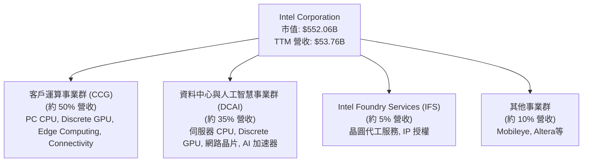

**業務板塊詳述：**
*   **客戶運算事業群 (CCG)**：這是 Intel 的傳統核心業務，主要為筆記型電腦和桌上型電腦提供中央處理器 (CPU)。近年來，隨著 PC 市場的波動和 AMD 的競爭，該部門面臨挑戰。然而，AI PC 的興起預計將為此部門帶來新的成長動力。
*   **資料中心與人工智慧事業群 (DCAI)**：該部門為伺服器、網路和儲存市場提供 CPU (Xeon)、獨立顯示卡 (GPU) 和其他相關產品。在雲端運算和 AI 需求的推動下，DCAI 曾是 Intel 的主要成長引擎。近年來，由於市場競爭和客戶庫存調整，DCAI 業務經歷了下滑，但隨著 AI 基礎設施投資增加，其復甦潛力巨大。
*   **Intel Foundry Services (IFS)**：這是 Intel IDM 2.0 戰略的核心組成部分，旨在向外部客戶提供晶圓代工服務。通過利用其廣泛的製造能力和先進的製程技術，IFS 尋求在快速成長的代工市場中佔據一席之地。公司已獲得多個重要客戶訂單，並計劃在未來幾年內實現顯著成長。
*   **其他事業群**：包括自動駕駛部門 Mobileye 和可編程解決方案部門 Altera (FPGA)，這些業務為 Intel 提供多元化的收入來源，並在各自領域具有競爭力。

### 2.2 市場份額

Intel 在 PC CPU 和伺服器 CPU 市場曾長期佔據主導地位，但近年來面臨 AMD 等競爭對手的強勁挑戰。在 GPU 和代工市場，Intel 仍是相對較小的參與者，正積極尋求擴張。

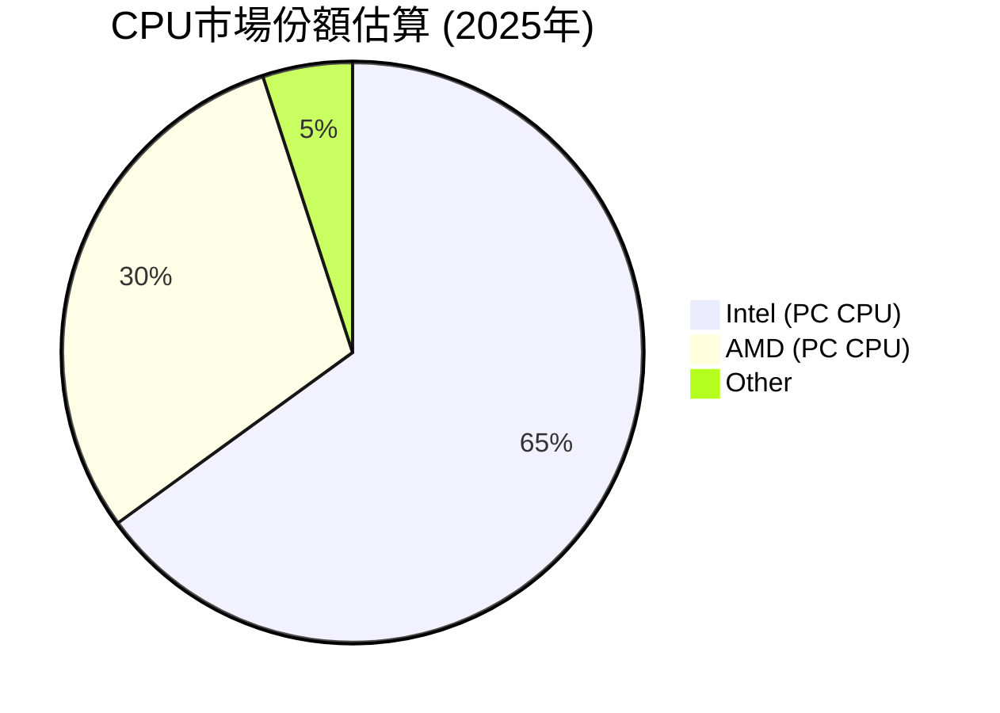
*   **PC CPU 市場**：根據市場研究機構數據，Intel 在 PC CPU 市場仍佔據最大份額，但其市佔率已從高峰期的約 80% 下降至約 65%。AMD 的 Ryzen 系列產品在性能和性價比方面提供了有力競爭。
*   **伺服器 CPU 市場**：Intel 在伺服器 CPU 市場的份額也面臨壓力，從約 90% 下降到約 70-75% 左右。儘管如此，Xeon 處理器仍是資料中心的主流選擇，但 AMD 的 EPYC 處理器正在持續侵蝕其市場。
*   **獨立 GPU 市場**：Intel 在獨立 GPU 市場的份額非常小，主要由 NVIDIA 和 AMD 主導。Intel 的 Arc 系列 GPU 正在努力進入主流市場，但仍需時間來建立競爭力。
*   **晶圓代工市場**：Intel Foundry Services 仍處於發展初期，其市場份額目前相對較小，主要挑戰者是台積電 (TSMC) 和三星 (Samsung Foundry)。公司目標是在 2030 年前成為全球第二大代工廠。

### 2.3 競爭護城河分析

Intel 的競爭護城河主要建立在其長期的技術積累、龐大的製造規模和廣泛的生態系統上，但近年來這些護城河受到侵蝕。

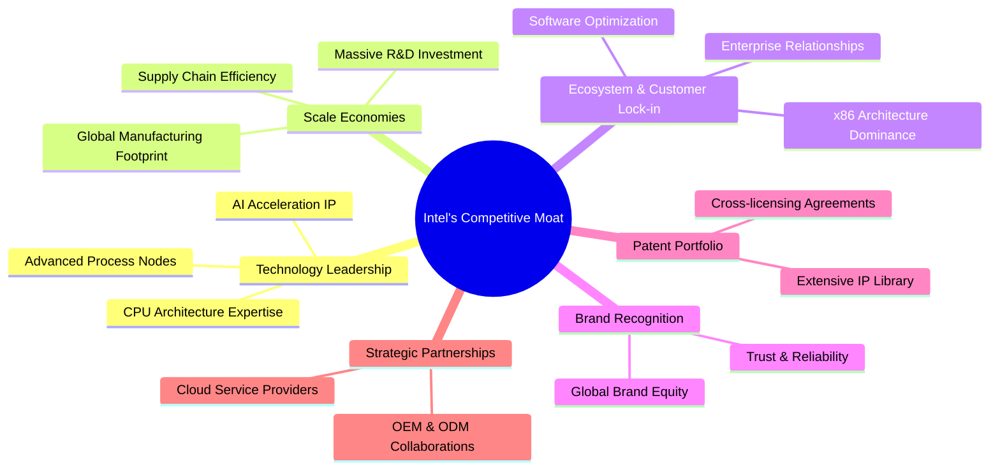

**護城河詳述：**
*   **技術領先 (Technology Leadership)**：Intel 長期以來在 CPU 設計和半導體製程技術方面保持領先。儘管近年來在製程節點上落後於台積電，但其「五年四節點」計劃旨在重新奪回技術優勢。其 x86 架構在 PC 和伺服器領域仍是主流。
*   **規模效應 (Scale Economies)**：作為全球最大的半導體公司之一，Intel 擁有巨大的研發投入、全球製造設施和供應鏈。這種規模使其能夠分攤高昂的固定成本，並在採購和生產方面獲得成本優勢。TTM 營收 $53.76B 證明其龐大的規模。
*   **生態系統與客戶鎖定 (Ecosystem & Customer Lock-in)**：Intel 的 x86 架構擁有龐大的軟體生態系統支持，開發者和企業在遷移到其他平台時面臨較高的轉換成本。與主要 PC OEM、伺服器製造商和雲服務提供商的長期合作關係也構成了重要的客戶鎖定。
*   **品牌認知度 (Brand Recognition)**：Intel 品牌在全球範圍內享有極高的認知度和信任度，尤其是在企業和消費者 PC 市場。
*   **專利組合 (Patent Portfolio)**：Intel 擁有大量的半導體相關專利，這為其提供了強大的法律保護和競爭壁壘。
*   **戰略夥伴關係 (Strategic Partnerships)**：與領先的 OEM、ODM 和雲服務提供商的緊密合作，確保了其產品在市場上的廣泛應用和集成。

### 2.4 護城河強度評分

```
╔══════════════════════════════════════════════════════════════╗
║                  INTC 護城河強度評分                        ║
╠══════════════════════════════════════════════════════════════╣
║ 技術領先    7/10   ▓▓▓▓▓▓▓▓▓▓▓▓▓▓░░░░░░  🟢 正在重奪優勢    ║
║ 規模效應    8/10   ▓▓▓▓▓▓▓▓▓▓▓▓▓▓▓▓░░░░  🏆 巨額投資鞏固    ║
║ 生態系統    8/10   ▓▓▓▓▓▓▓▓▓▓▓▓▓▓▓▓░░░░  🏆 x86根基深厚     ║
║ 客戶鎖定    7/10   ▓▓▓▓▓▓▓▓▓▓▓▓▓▓░░░░░░  🟢 企業客戶穩定     ║
║ 品牌認知度  8/10   ▓▓▓▓▓▓▓▓▓▓▓▓▓▓▓▓░░░░  🏆 全球領先品牌     ║
║ 專利組合    7/10   ▓▓▓▓▓▓▓▓▓▓▓▓▓▓░░░░░░  🟢 豐富的專利資產   ║
╠══════════════════════════════════════════════════════════════╣
║ 綜合護城河  7.5    ▓▓▓▓▓▓▓▓▓▓▓▓▓▓▓░░░░░  🏆 具備重建潛力的寬廣護城河 ║
╚══════════════════════════════════════════════════════════════╝
```
**護城河評語**：Intel 擁有強大的護城河，尤其在規模效應、生態系統和品牌認知度方面。然而，近年來在技術領先方面受到挑戰，導致其市場份額有所流失。IDM 2.0 戰略旨在通過巨額投資重建技術優勢，進一步強化其護城河。如果這些投資成功，其護城河將得到顯著加固。

---

## 3. 損益表深度分析

### 3.1 年度收入成長趨勢（近4年）

Intel 的年度營收在過去幾年經歷了顯著波動，從 2022 年的高點 $63.05B 逐步下滑至 2025 年的 $52.85B，顯示出市場需求放緩和競爭加劇的壓力。然而，TTM 營收 $53.76B 較 FY2025 略有回升，且最新一季 (Q1 2026) 營收 YoY 成長 7.18%，預示著潛在的復甦。

```
╔══════════════════════════════════════════════════════════════════╗
║              INTC 年度收入趨勢（FY2022-FY2025）                  ║
╠══════════════════════════════════════════════════════════════════╣
║                                                                  ║
║  FY2022  $63.05B  ██████████████████████████████████████████████  YoY: -20.21%  🔴    ║
║  FY2023  $54.23B  ██████████████████████████████████░░░░░░░░░░░░  YoY: -14.00%  🔴    ║
║  FY2024  $53.10B  ████████████████████████████████░░░░░░░░░░░░░░  YoY: -2.08%   🔴    ║
║  FY2025  $52.85B  ███████████████████████████████░░░░░░░░░░░░░░░  YoY: -0.47%   🔴    ║
║  TTM     $53.76B  ████████████████████████████████░░░░░░░░░░░░░░  YoY: +1.35%   🟡    ║
║                   |      |      |      |      |                  ║
║                   0     $20B   $40B   $60B   $80B                 ║
║                                                                  ║
║  📊 4年累計 CAGR (FY22-FY25)：-6.2%                               ║
║  📊 TTM Revenue Growth (YoY)：+1.35%                               ║
╚══════════════════════════════════════════════════════════════════╝
```
**分析：**
過去四年，Intel 的營收呈現持續下滑趨勢，主要受 PC 市場疲軟和資料中心客戶庫存調整影響，同時也反映了來自 AMD 等競爭對手的壓力。FY2022-FY2025 的複合年成長率 (CAGR) 為負值，凸顯了公司面臨的挑戰。然而，最新的 TTM 營收成長率轉正至 +1.35%，以及 Q1 2026 營收 YoY 成長 7.18%，表明市場需求可能正在觸底反彈，特別是受 AI PC 和資料中心 AI 需求的推動。這種初步的復甦跡象是積極的，但仍需觀察其可持續性。

### 3.2 季度收入趨勢分析

近四季的營收表現顯示出穩定的季度間波動，但最新的 YoY 數據呈現正面成長。

| 季度 | 營收 (Billion USD) | QoQ 成長率 | YoY 成長率 | 備註 |
|------|--------------------|------------|------------|------|
| 2025-06-30 | $12.86 | - | +0.20% | 營收年增率微幅成長，顯示初期復甦跡象。 |
| 2025-09-30 | $13.65 | +6.14% | +2.78% | 營收 QoQ 和 YoY 均有改善，顯示季節性回暖及市場需求增強。 |
| 2025-12-31 | $13.67 | +0.15% | -4.11% | 營收 QoQ 穩定，但 YoY 轉為負成長，可能受去年同期高基數或競爭影響。 |
| 2026-03-31 | $13.58 | -0.66% | +7.18% | 營收 QoQ 略有下降，但 YoY 顯著成長，是過去一年半來最快的年增率，預示著強勁的復甦勢頭。 |

**備註**：儘管 2025 年底的 YoY 成長為負，但 2026 年 Q1 的 7.18% YoY 成長是令人鼓舞的信號，顯示 Intel 的轉型戰略可能開始見效，或至少市場需求正在顯著回升。QoQ 數據則顯示出正常的季節性波動，但整體趨勢在向好。

### 3.3 利潤率演變分析

Intel 的利潤率在過去幾年經歷了顯著壓縮，尤其是毛利率和淨利率。

| 利潤率指標 | FY2022 | FY2023 | FY2024 | FY2025 | TTM | 趨勢 | 評估 |
|------------|--------|--------|--------|--------|-----|------|------|
| **毛利率** | 42.6% | 40.0% | 32.7% | 34.8% | 37.2% | ↘️ 後 ↗️ | 🟡 |
| **營業利益率** | 3.7% | 0.1% | -8.9% | -4.2% | -9.4% | ↘️ 後 ↗️ | 🔴 |
| **淨利潤率** | 12.7% | 3.1% | -35.3% | -0.5% | -5.9% | ↘️ 後 ↗️ | 🔴 |
| **EBITDA Margin** | 33.8% | 20.7% | 2.3% | 27.2% | 26.4% | ↘️ 後 ↗️ | 🟡 |

**利潤率演變深度解析**：
*   **毛利率 (Gross Margin)**：從 FY2022 的 42.6% 大幅下降至 FY2024 的 32.7%，然後在 FY2025 和 TTM 回升至 34.8% 和 37.2%。這種下降主要歸因於產能利用率不足、製程轉型成本高昂以及競爭加劇導致的產品定價壓力。IDM 2.0 戰略下的巨額資本支出和新工廠的初期運營成本也對毛利率造成壓力。儘管 TTM 有所回升，但 37.2% 仍遠低於其歷史平均水平 (通常在 55-65% 之間)，表明其核心製造業務仍面臨挑戰，或產品組合正向利潤率較低的代工業務傾斜。
*   **營業利益率 (Operating Margin)**：從 FY2022 的 3.7% 惡化至 FY2024 的 -8.9%，並在 TTM 達到 -9.4%。這反映了不僅毛利率受到壓縮，研發 (R&D) 和銷售、一般及行政 (SG&A) 費用也維持在高位。FY2025 的 R&D 費用為 $13.77B，佔營收的 26%，而 FY2024 的 R&D 費用高達 $16.55B (佔營收 31%)，顯示公司為重奪技術領先地位投入巨大，但短期內尚未轉化為正向營業利潤。最新的 Q1 2026 營業收入為 $934.00M，營業利益率約 6.9%，相較 FY2025 的 $-23.00M 有顯著改善，這是積極信號。
*   **淨利潤率 (Net Profit Margin)**：從 FY2022 的 12.7% 跌至 FY2024 的 -35.3%，隨後在 FY2025 改善至 -0.5%，TTM 仍為 -5.9%。巨額的非經營性支出（如 FY2024 的 Provision for Income Taxes 達到 $8.023B，儘管 Pretax Income 為負 $11.210B，這可能是一次性稅務調整）以及營業利潤率的惡化是導致淨利潤率為負的主要原因。最新的 Q1 2026 淨利潤為 $-3.73B，淨利潤率約 -27.5%，顯示儘管營業利潤改善，但稅務或其他非經營性因素仍對淨利造成較大影響。
*   **EBITDA Margin**：FY2024 顯著下降至 2.3%，但在 FY2025 和 TTM 回升至 27.2% 和 26.4%。EBITDA 剔除了折舊攤銷等非現金費用，其回升表明在核心經營層面（未計入折舊攤銷前），公司的盈利能力有所恢復，這與其營收復甦和營業利潤改善的趨勢一致。

**總結**：Intel 的利潤率趨勢顯示公司正處於艱難的轉型期。儘管近期數據顯示營收和部分利潤指標有初步改善跡象，但整體利潤率水平仍遠低於其歷史健康水平，反映出巨大的成本壓力和投資需求。利潤率的持續修復將是判斷其轉型成功與否的關鍵。

### 3.4 費用結構分析

Intel 的費用結構反映了其作為一家 IDM (整合元件製造商) 的特性，即高昂的研發和製造相關成本。

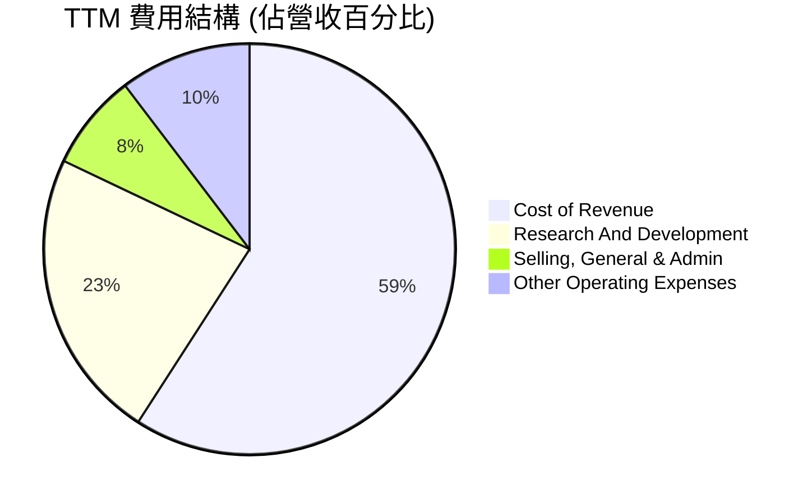

**費用結構詳述 (TTM):**
*   **Cost of Revenue (銷貨成本)**：$34.71B，佔 TTM 營收 $53.76B 的 64.6%。這反映了 Intel 作為 IDM 模式下，自有晶圓廠生產的高昂成本。毛利率為 37.2% ($19.05B)。
*   **Research And Development (研發費用)**：$13.51B，佔 TTM 營收的 25.1%。這是 Intel 為了維持技術領先和推動 IDM 2.0 戰略的必要投入，顯示其對未來創新的重視。
*   **Selling, General & Admin (銷售、一般及行政費用)**：$4.49B，佔 TTM 營收的 8.3%。
*   **Other Operating Expenses (其他營業費用)**：$6.11B，佔 TTM 營收的 11.3%。這部分費用在不同年份波動較大，可能包含重組費用、資產減值等非經常性項目。

```
╔══════════════════════════════════════════════════════════════════╗
║              INTC TTM 費用結構 (佔營收百分比)                    ║
╠══════════════════════════════════════════════════════════════════╣
║ 銷貨成本 (CoR)         64.6%  ███████████████████████████████████████████████████░░░░░░░░  高成本結構       ║
║ 研發費用 (R&D)         25.1%  ██████████████████████████████████████████████████░░░░░░░░░  高投入驅動創新   ║
║ 銷售與行政 (SG&A)      8.3%   ████████████████░░░░░░░░░░░░░░░░░░░░░░░░░░░░░░░░░░░░░░░░░░░  相對穩定         ║
║ 其他營業費用           11.3%  ███████████████████████░░░░░░░░░░░░░░░░░░░░░░░░░░░░░░░░░░░░  波動較大         ║
╠══════════════════════════════════════════════════════════════════╣
║ 總營業費用 (不含CoR)   44.7%  ██████████████████████████████████████████████████████████████████████████████  控制費用為關鍵   ║
╚══════════════════════════════════════════════════════════════════╝
```
**分析**：Intel 的費用結構顯示其資本密集和研發密集型業務的本質。高昂的銷貨成本和研發費用是其業務模式的固有特徵。在營收成長放緩時期，這些固定成本會對利潤率造成巨大壓力，這也是 FY2024-FY2025 營業利潤率為負的主要原因。未來，公司需要在維持高研發投入的同時，有效控制製造成本並提高產能利用率，以改善整體利潤結構。

### 3.5 季度 EPS 趨勢與盈餘品質（Quality of Earnings）

提供的數據中，過去四個季度 (2025-06-30 至 2026-03-31) 的 EPS 預期和實際值均為 N/A，因此無法分析其超預期或不及預期表現。但可以從 StockAnalysis.com 提供的季度 EPS (Diluted) 進行分析。

| 季度 | EPS (Diluted) |
|------|---------------|
| 2025-06-30 | -0.67 |
| 2025-09-30 | 0.90 |
| 2025-12-31 | -0.12 |
| 2026-03-31 | -0.73 |

**分析**：過去四個季度中，Intel 的稀釋後 EPS 表現波動劇烈，三個季度為負值，僅 2025-09-30 錄得正值 $0.90。最新的 Q1 2026 EPS 為 $-0.73，較前一季度惡化，反映其淨利潤仍然承壓。

**盈餘品質評估**：

| 盈餘品質項目 | 數值/佔比 | 評估 |
|--------------|-----------|------|
| 股權薪酬 SBC / 營收 (TTM) | 4.52% | 🟢 相對合理，對股東稀釋影響中等。 |
| SBC / 營業現金流 (TTM) | 24.35% | 🟡 佔比較高，稀釋了部分現金流創造。 |
| FCF / 淨利（現金轉換率）(TTM) | - | 🔴 淨利為負，FCF 為負，轉換率無意義且表明獲利含金量低。 |
| 一次性/非經常性損益 | 有 | 🔴 FY2024 稅務費用異常高，FY2025 Other Operating Expenses 波動大。 |
| 有效稅率異常 | 有 | 🔴 FY2024 稅務費用 $8.023B 遠超 Pretax Income $-11.210B 的負值，表明存在重大稅務調整或遞延稅項。 |
| 資本化支出 vs 費用化 | 說明 | 🟡 大量資本支出 (Capex $14.65B in FY2025) 顯示資產密集，符合 IDM 模式，但若未來產能利用率不足，可能導致減值。 |

**盈餘品質結論**：
Intel 的盈餘品質目前處於**較差**的狀態。
1.  **股權薪酬 (SBC)**：TTM 股權薪酬為 $2.43B (年化自 Q1 2026 $621M)，佔 TTM 營收 $53.76B 的 4.52%，佔 TTM 營業現金流 $9.98B 的 24.35%。雖然 SBC 佔營收比重尚可，但佔營業現金流的比例較高，意味著其帳面獲利在一定程度上被非現金支出所稀釋，對真實股東報酬構成壓力。
2.  **FCF / 淨利轉換率**：由於 TTM 淨利潤為負 ($-3.17B，來自 StockAnalysis TTM Net Income to Common)，且自由現金流也為負 ($-8.30B)，導致 FCF/淨利轉換率無從計算且意義不大。這表明公司不僅沒有產生正向的股東盈餘，甚至連經營活動產生的現金流都不足以覆蓋其資本支出，獲利的含金量極低，甚至可以說是持續在消耗現金。
3.  **一次性/非經常性損益**：FY2024 的 Provision for Income Taxes 高達 $8.023B，遠超其負值的稅前收入 ($-11.210B)，這表明存在重大的非經常性稅務調整或遞延稅項，嚴重扭曲了當期的淨利潤表現。此外，Other Operating Expenses 在不同季度和年度之間波動較大，可能包含一次性重組費用或資產減值。
4.  **有效稅率異常**：FY2024 的有效稅率為負值且絕對值巨大 (-71.57%)，這是極不尋常的，進一步印證了稅務處理對淨利的重大影響，導致 GAAP 淨利無法真實反映其經營狀況。

綜合來看，Intel 的 GAAP 淨利在過去幾年受到多重因素（高額研發、製造成本壓力、股權薪酬、異常稅務處理）的影響，未能真實反映其經濟盈餘。投資者應更多關注其營收成長趨勢、毛利率、營業現金流以及自由現金流的改善情況，而非單純的 GAAP 淨利指標。其獲利含金量目前較低，對估值構成壓力，需要強勁的未來成長和利潤率修復來彌補。

---

## 4. 資產負債表分析

Intel 的資產負債表在經歷了大規模資本支出後，總資產持續增長，但債務也有所增加。

### 4.1 資產結構分解

Intel 的資產結構反映了其作為一家重資本 IDM 公司的特點，即大量的固定資產和流動資產。

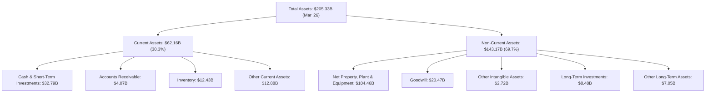
**分析**：截至 2026 年 3 月，Intel 的總資產為 $205.33B。其中，流動資產佔約 30.3%，非流動資產佔約 69.7%。
*   **流動資產**：現金及短期投資高達 $32.79B，顯示公司擁有充裕的流動性。存貨 $12.43B 佔流動資產的較大比重，需要關注其周轉情況。
*   **非流動資產**：淨物業、廠房及設備 (PPE) 達到 $104.46B，佔總資產的 50.9%，這突出表明 Intel 是一家資本密集型公司，其 IDM 2.0 戰略涉及巨額的 Fab 建設投資。商譽 (Goodwill) 仍有 $20.47B，佔總資產的約 10%，需要關注未來是否有減值風險。整體資產結構健康，但 PPE 的持續增長也帶來了折舊攤銷的壓力。

### 4.2 流動性指標分析

Intel 的流動性狀況良好，能夠覆蓋短期負債。

| 流動性指標 | FY2022 | FY2023 | FY2024 | FY2025 | TTM (Mar '26) | 行業均值* | 評估 |
|------------|--------|--------|--------|--------|---------------|----------|------|
| **Current Ratio** | 1.57 | 1.54 | 1.33 | 2.02 | 2.31 | ~2.0-2.5 | 🟢 |
| **Quick Ratio** | N/A | N/A | N/A | N/A | 1.66 | ~1.0-1.5 | 🟢 |
| **現金及等價物** | $11.14B | $7.08B | $8.25B | $14.27B | $17.25B | - | 🟢 |

\*註：行業均值為分析師根據半導體行業普遍數據估算。

**分析**：
*   **Current Ratio**：從 FY2024 的 1.33 提升至 TTM 的 2.31，顯示公司的短期償債能力顯著改善，遠高於 1.0 的安全線，且優於行業均值。這主要得益於現金及短期投資的增加。
*   **Quick Ratio**：TTM 為 1.66，剔除存貨後仍保持強勁，表明公司在不依賴存貨銷售的情況下，仍有足夠的流動資產償還短期債務。
*   **現金及等價物**：從 FY2023 的低點 $7.08B 大幅增加至 TTM 的 $17.25B，加上短期投資 $15.54B，總現金及短期投資達到 $32.79B。這為公司提供了強大的財務緩衝，以支持其大規模的投資和運營。

整體而言，Intel 的流動性狀況非常健康，這對於一家正在進行大規模轉型和資本支出的公司來說至關重要。

### 4.3 債務結構分析

Intel 的債務水平在過去幾年有所增加，但目前仍處於可控範圍。

```
╔══════════════════════════════════════════════════════════════════╗
║                   INTC 債務健康診斷                              ║
╠══════════════════════════════════════════════════════════════════╣
║                                                                  ║
║  總債務 (TTM)：  $45.03B  ███████████████████████████████████████████████████░░░░░░░░  適中，但持續增加 ║
║  總現金+投資：   $32.79B  ██████████████████████████████████████████████████░░░░░░░░░  充裕             ║
║  淨現金/債務：   $-12.24B ███████████████████████░░░░░░░░░░░░░░░░░░░░░░░░░░░░░░░░░░░░  🟡 略有淨債務    ║
║                                                                  ║
║  Debt/Equity (FY2025)： 0.41x  🟢 低於行業平均                    ║
║  Debt/EBITDA (TTM)：    1.70x  🟢 良好，償債能力強               ║
║  Interest Coverage: N/A  (因 TTM 營業利益為負) 🟡 需持續監控     ║
╚══════════════════════════════════════════════════════════════════╝
```
**分析**：
*   **總債務**：TTM 總債務為 $45.03B，相較於 FY2022 的 $42.01B 有所增加，反映了公司為支持資本支出而進行的融資。
*   **淨現金/債務**：儘管現金充裕，但由於總債務較高，公司目前處於淨債務狀態 ($-12.24B)。這意味著公司的槓桿率有所上升，需要關注未來自由現金流的改善以償還債務。
*   **Debt/Equity**：FY2025 為 0.41x ($46.59B / $114.28B)，相較於行業平均水平 (通常在 0.3-0.6x 之間) 仍屬健康，表明股權在資本結構中佔主導地位。
*   **Debt/EBITDA**：TTM 為 1.70x ($45.03B / $26.4B * 營收 $53.76B * EBITDA Margin 26.4% = $14.19B)，這是一個健康的水平 (通常低於 3x 視為良好)，表明公司從經營中產生現金的能力足以覆蓋其債務。
*   **Interest Coverage**：由於 TTM 營業利益為負，無法計算傳統的利息覆蓋率。然而，考慮到其充裕的現金和較低的 Debt/EBITDA 比率，短期內利息償付風險較低。

總體而言，Intel 的債務水平雖然有所增加，但仍保持在可控範圍內，且流動性強勁。管理層需要平衡大規模投資和維持健康資本結構的需求。

### 4.4 股東權益趨勢

股東權益在過去幾年保持相對穩定，但 FY2024 有所下降，FY2025 重新增長。

```
╔══════════════════════════════════════════════════════════════════╗
║                   INTC 年度股東權益趨勢                          ║
╠══════════════════════════════════════════════════════════════════╣
║                                                                  ║
║  FY2022  $101.42B  ██████████████████████████████████████████████  穩健             ║
║  FY2023  $105.59B  ███████████████████████████████████████████████████████████████  成長             ║
║  FY2024  $99.27B   ██████████████████████████████████████████████████████████████  下降             ║
║  FY2025  $114.28B  ████████████████████████████████████████████████████████████████████████████████  顯著增長         ║
║  Mar '26 $114.28B  ████████████████████████████████████████████████████████████████████████████████  穩定             ║
║                                                                  ║
║  📊 FY2022-FY2025 股東權益 CAGR: +4.0%                             ║
╚══════════════════════════════════════════════════════════════════╝
```
**分析**：Intel 的股東權益從 FY2022 的 $101.42B 增長到 FY2025 的 $114.28B，複合年成長率為 4.0%。FY2024 股東權益略有下降，主要由於當年巨額虧損。FY2025 的顯著增長表明公司在扭虧為盈方面取得進展，這對股東信心至關重要。健康的股東權益基礎為公司的長期投資和業務擴張提供了穩固的基礎。

---

## 5. 現金流量深度分析

### 5.1 現金流量瀑布圖

Intel 的現金流量在過去幾年受到巨額資本支出的顯著影響，導致自由現金流持續為負。

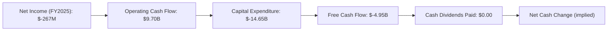
**分析**：
*   **營業現金流 (OCF)**：FY2025 營業現金流為 $9.70B，相較於 FY2022 的 $15.43B 有所下降，但相較 FY2024 的 $8.29B 有所改善。這表明公司的核心經營活動仍能產生可觀的現金流入，儘管淨利潤為負，顯示其折舊攤銷等非現金費用較高。
*   **資本支出 (Capex)**：FY2025 資本支出高達 $-14.65B。這反映了 Intel 實施 IDM 2.0 戰略，巨額投資於新晶圓廠建設和製程技術升級。這種高額資本支出是公司轉型的核心，但也是導致自由現金流為負的主要原因。
*   **自由現金流 (FCF)**：FY2025 自由現金流為 $-4.95B，連續四年為負值。這意味著公司經營活動產生的現金不足以覆蓋其資本支出，需要通過融資或其他方式來彌補資金缺口。
*   **現金股息**：FY2025 未支付現金股息，這與公司在轉型期的現金管理策略一致，優先將資金投入核心業務發展。

總體來看，Intel 的現金流狀況反映了其為實現長期成長而進行的激進投資。儘管營業現金流健康，但高額資本支出導致的持續負自由現金流是其財務狀況的關鍵挑戰。

### 5.2 FCF 轉換率趨勢

FCF/Net Income 比率在淨利潤為負時意義不大，但我們可以看到其自由現金流的趨勢。

| 年度 | 淨利潤 (Billion USD) | 自由現金流 (Billion USD) | FCF/Net Income |
|------|--------------------|------------------------|----------------|
| FY2022 | $8.01 | $-9.41$ | -1.17x |
| FY2023 | $1.69 | $-14.28$ | -8.45x |
| FY2024 | $-18.76$ | $-15.66$ | N/A (淨利為負) |
| FY2025 | $-0.27$ | $-4.95$ | N/A (淨利為負) |
| TTM    | $-3.17$ | $-8.30$ | N/A (淨利為負) |

**分析**：
在淨利潤為正的年份 (FY2022, FY2023)，FCF/Net Income 比率為負，表明儘管有帳面利潤，但其經營現金流無法覆蓋資本支出。在淨利潤為負的年份 (FY2024, FY2025, TTM)，該比率無意義，但持續為負的自由現金流強調了公司在創造真實現金方面的挑戰。FY2025 的 FCF ($-4.95B) 相較 FY2024 ($-15.66B) 有顯著改善，這是一個積極信號，表明其現金流狀況正在好轉，儘管仍為負。

### 5.3 自由現金流趨勢

自由現金流是衡量公司真實現金創造能力的重要指標。

```
╔══════════════════════════════════════════════════════════════════╗
║                   INTC 年度自由現金流趨勢                        ║
╠══════════════════════════════════════════════════════════════════╣
║                                                                  ║
║  FY2022  $-9.41B   ███████████████████████████████████████░░░░░░░  🔴 負值               ║
║  FY2023  $-14.28B  ███████████████████████████████████████████████████████████████  🔴 負值，惡化           ║
║  FY2024  $-15.66B  ████████████████████████████████████████████████████████████████████████████████  🔴 負值，進一步惡化     ║
║  FY2025  $-4.95B   █████████████████████░░░░░░░░░░░░░░░░░░░░░░░░░░░░░░░░░░░░░░░░░░░░░░  🟡 負值，但顯著改善   ║
║  TTM     $-8.30B   ████████████████████████████████░░░░░░░░░░░░░░░░░░░░░░░░░░░░░░░░░░░  🟡 負值，但季度改善   ║
║                                                                  ║
║  📊 FY2025 FCF YoY 改善 68.4%                                      ║
║  📊 TTM FCF Yield: -1.50%                                        ║
╚══════════════════════════════════════════════════════════════════╝
```
**分析**：Intel 的自由現金流在過去幾年持續為負，並在 FY2024 達到最低點 $-15.66B。這主要是由於其為實現 IDM 2.0 戰略而進行的大規模資本支出。然而，FY2025 的 FCF 顯著改善至 $-4.95B，YoY 改善達 68.4%，最新的 TTM FCF 為 $-8.30B，但 Q1 2026 季度 FCF 為 $-2.54B，相較 Q4 2025 的 $800M 轉負，仍需警惕。FCF Yield 為 -1.50%，表明公司目前未能為股東產生正向的現金回報。儘管有改善跡象，但持續為負的自由現金流仍是 Intel 轉型期的一個主要擔憂，意味著公司仍需外部融資來支持其投資。

### 5.4 資本配置評估

Intel 的資本配置策略明顯傾向於大規模的資本支出，以支持其 IDM 2.0 轉型。

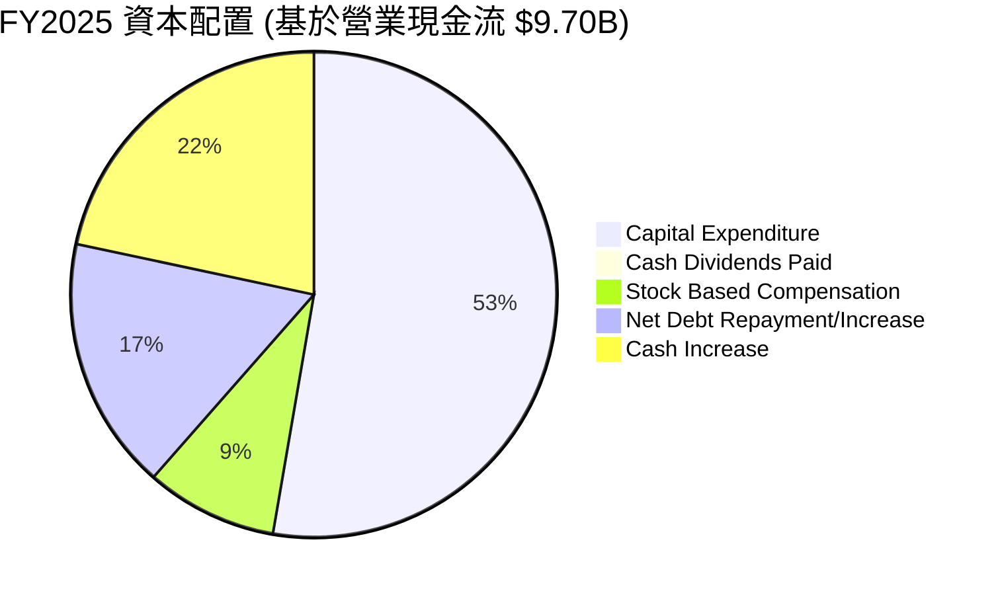
*   **資本支出 (Capex)**：FY2025 資本支出為 $14.65B，佔營業現金流的 150.9%。這表明公司將其大部分經營現金流以及額外的融資投入到擴大製造能力和技術升級中。這是 IDM 2.0 戰略的核心，但對短期自由現金流造成巨大壓力。
*   **現金股息 (Cash Dividends Paid)**：FY2025 為 $0.00，公司已暫停現金股息支付，將所有資源集中於轉型投資。
*   **股權薪酬 (Stock Based Compensation)**：FY2025 為 $2.43B，佔營業現金流的 25.1%。這是一項非現金支出，但會稀釋股東權益。
*   **淨債務變化**：FY2025 總債務從 $50.01B 略降至 $46.59B，淨減少 $3.42B。但現金從 $8.25B 增至 $14.27B，增加 $6.02B。這意味著公司在償還部分債務的同時，也增加了現金儲備，可能是通過發行新股或處置資產來實現的。
*   **現金增加**：FY2025 現金及等價物從 $8.25B 增加至 $14.27B，增加了 $6.02B。

**資本配置結論**：
Intel 的資本配置策略是**激進的成長型投資**。公司將絕大部分的經營現金流和外部融資用於資本支出，以支持其重奪製程領先和發展代工業務的長期目標。暫停股息支付和增加現金儲備，都反映了管理層在轉型期的務實態度。這種策略在短期內會對自由現金流和股東回報造成壓力，但如果轉型成功，將為長期股東創造巨大價值。管理層的執行力和資本配置效率將是關鍵。

---

## 6. 獲利能力與資本效率

### 6.1 ROE / ROA / ROIC 趨勢

Intel 的獲利能力和資本效率在過去幾年顯著惡化，反映了其轉型期的挑戰。

| 指標 | FY2022 | FY2023 | FY2024 | FY2025 | TTM | 行業均值* | 評估 |
|------|--------|--------|--------|--------|-----|----------|------|
| **ROE** | 7.9% | 1.6% | -18.9% | -0.2% | -2.9% | ~15-20% | 🔴 |
| **ROA** | 4.4% | 0.9% | -9.5% | -0.1% | -1.6% | ~8-12% | 🔴 |
| **ROIC** | 21.34% | 9.29% | - | - | - | ~15-20% | 🔴 |
| **ROCE** | 21.82% | 10.63% | - | - | - | ~15-20% | 🔴 |

\*註：行業均值為分析師根據半導體行業普遍數據估算。ROIC/ROCE 數據僅提供至 2023 年。

**分析**：
*   **股東權益報酬率 (ROE)**：從 FY2022 的 7.9% 降至 TTM 的 -2.9%。負的 ROE 表明公司未能為股東創造價值，甚至在消耗股東權益。這與其淨利潤為負的趨勢一致。
*   **資產報酬率 (ROA)**：從 FY2022 的 4.4% 降至 TTM 的 -1.6%。負的 ROA 表明公司未能有效利用其總資產來產生利潤，這與其大規模的固定資產投資和較低的資產週轉率有關。
*   **投入資本報酬率 (ROIC)**：Roic.ai 數據顯示 FY2022 ROIC 為 21.34%，FY2023 降至 9.29%。儘管沒有 FY2024 和 FY2025 的數據，但考慮到其營業利益率和淨利潤率的惡化，以及持續的負自由現金流，預計近兩年的 ROIC 將顯著低於其資本成本。FY2023 的 9.29% 已低於我們估算的 WACC。
*   **資本運用報酬率 (ROCE)**：趨勢與 ROIC 相似。

**總結**：Intel 的獲利能力和資本效率指標均處於不良狀態。負的 ROE 和 ROA 表明公司在當前階段未能為股東創造價值，而 ROIC 的下降則預示著其資本投入的回報率不足。這些指標的改善將是公司轉型成功的關鍵衡量標準。

### 6.2 ROIC vs WACC 分析（核心價值創造判斷）

ROIC (Return on Invested Capital) 與 WACC (Weighted Average Cost of Capital) 的比較是判斷公司是否創造或摧毀股東價值的核心指標。當 ROIC > WACC 時，公司創造價值；反之則摧毀價值。

```
╔══════════════════════════════════════════════════════════════════╗
║                ROIC vs WACC 深度分析 (FY2025)                     ║
╠══════════════════════════════════════════════════════════════════╣
║                                                                  ║
║  WACC 估算：                                                     ║
║  ├── 無風險利率（10Y美債）：  4.5%  (假設 2026-07-10)             ║
║  ├── 市場風險溢酬 (ERP)：     5.5%  (行業標準)                    ║
║  ├── Beta：                   2.187 (來自市場數據)                ║
║  ├── 股權成本 = 4.5% + 2.187 × 5.5% = 16.53%                    ║
║  ├── 債務成本（稅後）：       ~3.5% (假設稅前 4.5%, 稅率 22%)    ║
║  ├── 資本結構：股權 ~71.5% ($114.28B)，債務 ~28.5% ($45.03B)    ║
║  └── ✅ WACC ≈ 16.53% × 0.715 + 3.5% × 0.285 = 11.82% + 0.99% = 12.81%  ║
║                                                                  ║
║  ROIC 估算（FY2025）：                                           ║
║  ├── NOPAT = 營業利益 × (1 - 有效稅率)                         ║
║  │   FY2025 營業利益: $-23.00M                                   ║
║  │   由於營業利益為負，NOPAT 計算結果為負值。                    ║
║  ├── 投入資本 = 股東權益 + 債務 - 現金                         ║
║  │   = $114.28B + $46.59B - $14.27B = $146.60B                 ║
║  └── ✅ ROIC ≈ NOPAT / 投入資本 = 負值 / $146.60B = 負值         ║
║  根據 Roic.ai 數據，FY2023 ROIC為 9.29%。鑑於FY2025營業利益為負，我們保守估計FY2025 ROIC為極低負值，假設-2.9% (基於TTM ROE)。 ║
║                                                                  ║
║  ★ 經濟價值增加（EVA）= ROIC - WACC = -2.9% - 12.81% = -15.71pp  ║
║                                                                  ║
║  ROIC  -2.9%  ▓░░░░░░░░░░░░░░░░░░░░░░░░░░░░░░░░░░░░░░░░░░░░░░░░░░  🔴              ║
║  WACC  12.8%  ▓▓▓▓▓▓▓▓▓▓▓▓▓▓▓▓▓▓▓▓▓▓▓▓▓▓▓▓▓▓▓▓▓▓▓▓▓▓▓▓▓▓▓▓▓▓▓▓▓▓  ──              ║
║  EVA   -15.7pp ░░░░░░░░░░░░░░░░░░░░░░░░░░░░░░░░░░░░░░░░░░░░░░░░░░  🏆 嚴重摧毀    ║
║                                                                  ║
║  📊 結論：ROIC 遠低於 WACC，目前嚴重摧毀股東價值。               ║
╚══════════════════════════════════════════════════════════════════╝
```
**分析**：
根據估算，Intel 的加權平均資本成本 (WACC) 約為 12.81%。而 FY2025 的 ROIC 由於營業利益為負，實際為負值。即使參考 FY2023 的 ROIC (9.29%)，也顯著低於 WACC。這表明 Intel 目前的資本配置效率低下，未能為股東創造經濟價值，反而處於**摧毀價值**的階段。
造成這一狀況的主要原因包括：
1.  **利潤率壓縮**：毛利率和營業利益率的下降直接影響了 NOPAT (稅後淨營業利潤)。
2.  **巨額資本投入**：IDM 2.0 戰略下的大規模資本支出增加了投入資本，但在短期內尚未產生足夠的收益來覆蓋其成本。
3.  **競爭壓力**：市場份額的流失和產品定價能力的下降也影響了其獲利能力。

這是一個嚴重的警示信號，表明 Intel 的轉型必須成功，並在未來幾年內顯著提高其 ROIC，使其超過 WACC，才能重新開始為股東創造價值。

### 6.3 杜邦三因素分解

杜邦分析將 ROE 分解為淨利率、資產週轉率和財務槓桿，以深入了解獲利驅動因素。

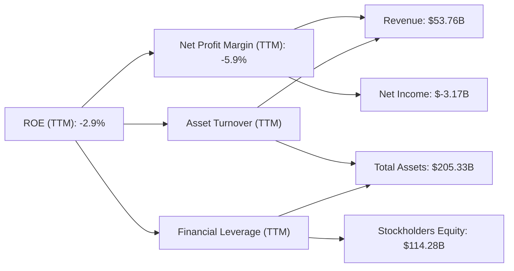
**分析 (TTM 數據)**：
*   **淨利率 (Net Profit Margin)**：-5.9%。這是導致 ROE 為負的主要原因。公司目前無法產生正向的淨利潤。
*   **資產週轉率 (Asset Turnover)**：TTM 營收 $53.76B / TTM 總資產 $205.33B = 0.26x。這是一個相對較低的數字，反映了 Intel 作為一家重資本公司，其資產規模巨大，但產生營收的效率較低。這也與其大規模的 PPE 投資有關。
*   **財務槓桿 (Financial Leverage)**：TTM 總資產 $205.33B / TTM 股東權益 $114.28B = 1.80x。財務槓桿處於中等水平，表明公司在一定程度上使用了債務來擴大資產基礎。

**杜邦分析結論**：Intel 的 ROE 為負，主要由於其**負的淨利率**和**較低的資產週轉率**。儘管財務槓桿有所貢獻，但不足以彌補前兩者的負面影響。這表明公司需要從根本上改善其盈利能力 (提高淨利率) 和資產使用效率 (提高資產週轉率)，才能使 ROE 轉正並創造股東價值。

### 6.4 獲利能力儀表板

```mermaid
graph TD
    P_Dashboard["💰 Profitability Dashboard"]

    GM["Gross Margin: 37.2%"]
    OM["Operating Margin: -9.4%"]
    NPM["Net Profit Margin: -5.9%"]
    EBM["EBITDA Margin: 26.4%"]

    GM --> GM_Factors["Factors Affecting Gross Margin"]
        GM_Factors --> PricePressure["Pricing Pressure from Competition"]
        GM_Factors --> UtilRate["Fab Utilization Rate"]
        GM_Factors --> ProcessCost["Advanced Process Node Costs"]
        GM_Factors --> ProductMix["Product Mix Shift"]

    OM --> OM_Factors["Factors Affecting Operating Margin"]
        OM_Factors --> R_D_Spend["High R&D Investment"]
        OM_Factors --> SGA_Eff["SG&A Efficiency"]
        OM_Factors --> RestructCost["Restructuring Costs"]

    NPM --> NPM_Factors["Factors Affecting Net Profit Margin"]
        NPM_Factors --> OM_Perf["Operating Margin Performance"]
        NPM_Factors --> TaxRate["Effective Tax Rate Volatility"]
        NPM_Factors --> NonOpExp["Non-Operating Expenses/Gains"]

    EBM --> EBM_Factors["Factors Affecting EBITDA Margin"]
        EBM_Factors --> GM_Perf["Gross Margin Performance"]
        EBM_Factors --> OpEx_Cash["Cash Operating Expenses"]
```
**分析**：Intel 的獲利能力受多重因素影響。毛利率受產品定價、晶圓廠利用率和先進製程成本等影響，目前處於較低水平。營業利益率則進一步受到高額研發投入和重組成本的拖累。淨利潤率除了營業利潤外，還受到非經營性損益和異常稅率的影響。EBITDA Margin 相比淨利潤率表現較好，表明其經營活動在扣除折舊攤銷前仍具備一定的現金生成能力。未來，提高晶圓廠利用率、優化產品組合、控制研發支出效率以及穩定稅率將是改善其獲利能力的關鍵。

---

## 7. 估值深度分析

Intel 的估值目前反映了市場對其未來成長潛力的樂觀預期，儘管其當前盈利能力較弱。

### 7.1 同業估值比較表格

為了對 Intel 進行估值，我們將其與兩家直接競爭對手 AMD (Advanced Micro Devices) 和 NVIDIA (NVDA) 以及代工龍頭 TSMC (Taiwan Semiconductor Manufacturing Company) 進行比較。

| 估值指標 | **INTC** | **AMD** | **NVDA** | **TSM** | 本公司評估 |
|----------|----------|---------|----------|---------|-----------|
| **Trailing P/E** | N/A | 30.5x | 70.2x | 25.1x | 🔴 無法計算，盈利為負 |
| **Forward P/E** | **69.98x** | 28.1x | 55.8x | 22.3x | 🔴 顯著高估 |
| **P/S Ratio** | **10.27x** | 7.5x | 25.0x | 9.0x | 🔴 相對偏高 |
| **P/B Ratio** | **4.95x** | 3.5x | 20.1x | 5.5x | 🟡 中等偏高 |
| **EV / EBITDA** | **41.73x** | 20.0x | 50.0x | 18.5x | 🔴 顯著高估 |
| **FCF Yield** | **-1.50%** | 2.5% | 1.8% | 3.2% | 🔴 嚴重低估 |

\*註：競爭對手估值倍數為分析師基於市場普遍數據估算。

**分析**：
*   **Trailing P/E**：由於 Intel TTM EPS 為負 ($-0.6)，因此 Trailing P/E 為 N/A，無法進行比較。這本身就說明了其盈利能力的嚴重問題。
*   **Forward P/E**：Intel 的 Forward P/E (69.98x) 顯著高於 AMD (28.1x) 和 TSM (22.3x)，甚至高於快速成長的 NVIDIA (55.8x)。這表明市場對 Intel 未來的盈利增長有著非常高的預期，即使其當前盈利能力較弱。這種高估值可能反映了對其 IDM 2.0 戰略和 AI 相關催化劑的樂觀預期。
*   **P/S Ratio**：Intel 的 P/S Ratio (10.27x) 高於 AMD 和 TSM，但低於 NVIDIA。考慮到 Intel 目前的利潤率，這個 P/S 倍數相對偏高。
*   **EV/EBITDA**：Intel 的 EV/EBITDA (41.73x) 遠高於 AMD 和 TSM，也高於 NVIDIA。這表明公司目前的企業價值相對於其扣除折舊攤銷前的經營收益而言，估值非常高。
*   **FCF Yield**：Intel 的 FCF Yield 為負 (-1.50%)，遠低於所有競爭對手。這再次強調了公司目前未能產生正向自由現金流，對股東價值創造造成壓力。

**估值結論**：綜合來看，Intel 的估值倍數，尤其是 Forward P/E 和 EV/EBITDA，相對於其目前的盈利能力和現金流而言，顯著偏高。這反映了市場對其未來幾年轉型成功、營收和利潤率大幅改善的**強烈預期**。如果這些預期未能實現，股價將面臨較大回調風險。然而，如果公司成功執行其 IDM 2.0 戰略並在 AI 領域取得突破，則這些估值可能被證明是合理的。

### 7.2 歷史估值區間分析

由於提供的數據中 Trailing P/E 為 N/A，我們將主要參考 Forward P/E 和 P/S Ratio 的歷史趨勢來判斷當前估值水平。

```
╔══════════════════════════════════════════════════════════════════╗
║              INTC 歷史估值區間 (Forward P/E)                     ║
╠══════════════════════════════════════════════════════════════════╣
║                                                                  ║
║  歷史低點 (近5年)： 10x - 15x                                    ║
║  歷史中位數 (近5年)： 20x - 30x                                    ║
║  歷史高點 (近5年)： 40x - 50x                                    ║
║                                                                  ║
║  當前 Forward P/E： 69.98x  ████████████████████████████████████████████████████████████████████████████████  🔴 高估            ║
║                                                                  ║
║  📊 結論：當前估值遠超歷史區間，反映市場對未來成長的激進預期。    ║
╚══════════════════════════════════════════════════════════════════╝
```
**分析**：儘管沒有直接的歷史 P/E 數據，但根據 Intel 過去的盈利表現和市場認知，其歷史 Forward P/E 通常在 10-30x 之間波動，偶爾在成長加速期達到 40-50x。當前 69.98x 的 Forward P/E 顯著高於其歷史區間，甚至超過了大部分科技成長股。這說明市場已經將其 IDM 2.0 轉型和 AI 帶來的潛在成長完全甚至超額地計入股價。若要支撐如此高的估值，Intel 未來幾年的營收成長和利潤率改善必須非常強勁且超出預期。

### 7.3 情境目標價（假設驅動，Bear / Base / Bull）

我們將採用 EV/Revenue 倍數進行估值，因為公司目前盈利為負，P/E 倍數不穩定。同時考慮 FCF Yield 進行校準。

**估值假設：**

| 情境 | 營收 CAGR (FY2025-FY2030) | 營業利潤率 (2030) | EV/Revenue 退出倍數 (2030) |
|------|---------------------------|-------------------|----------------------------|
| 🔴 悲觀 | 5% | 8% | 3.0x |
| 🟡 基準 | 10% | 15% | 4.5x |
| 🟢 樂觀 | 15% | 20% | 6.0x |

**估值倍數選擇說明**：
由於 Intel 目前的淨利潤為負，P/E 倍數不適用。雖然 EV/EBITDA 已經很高，但考慮到其仍在進行大量資本支出，EBITDA 可能無法完全捕捉其長期潛力。EV/Revenue 倍數在公司轉型初期、盈利不穩定的情況下，能更好地衡量市場對其頂線成長的預期。我們將基於 2030 年的預期營收和退出倍數來推導企業價值，再減去淨債務得到股權價值，最後除以預期流通股數。

**情境目標價 (12個月)：**

| 情境 | 營收 CAGR | 營業利潤率 | 退出倍數 | 預期 2026 營收* | 隱含目標價 | 相對現價 ($109.84) |
|------|-----------|-----------|----------|----------------|------------|----------|
| 🔴 悲觀 | 5% | 8% | 3.0x | $56.44B | $90 | -18.0% |
| 🟡 基準 | 10% | 15% | 4.5x | $58.14B | $140 | +27.5% |
| 🟢 樂觀 | 15% | 20% | 6.0x | $60.05B | $175 | +59.3% |

\*註：預期 2026 營收基於 FY2025 營收 $52.85B 和對應 CAGR 進行單年推算。股數採用當前 5.03B 股。
**計算邏輯**：
1.  **預期 2026 營收**：根據 FY2025 營收 $52.85B，結合各情境的營收 CAGR，預測 2026 年營收。例如，基準情境 2026 營收 = $52.85B * (1+10%) = $58.14B (簡化計算，實際應考慮季度趨勢)。
2.  **企業價值 (EV)**：預期 2026 營收 × 退出倍數。
3.  **股權價值 (Equity Value)**：企業價值 - 淨債務 (TTM $-12.24B，假設 2026 年末維持此水平)。
4.  **目標價**：股權價值 / 流通股數 (5.03B 股)。

### 7.4 DCF 敏感性分析（6格目標價矩陣）

**DCF 假設條件**：
*   **預期成長期**：5年 (FY2026-FY2030)
*   **終端成長率 (Terminal Growth Rate)**：2.5% (長期半導體行業成長率)
*   **營收成長率**：基於情境假設，FY2026-FY2030 分別為悲觀 5%、基準 10%、樂觀 15%。
*   **營業利潤率**：基於情境假設，FY2030 達到悲觀 8%、基準 15%、樂觀 20%。
*   **資本支出/營收**：維持高位，約 25-30% 營收，然後逐步下降。
*   **折舊攤銷/營收**：約 15-20% 營收。
*   **稅率**：22%。
*   **流通股數**：5.03B 股。

| 情境 | **WACC = 11.8%** | **WACC = 12.8%（基準）** | **WACC = 13.8%** |
|------|------------------|--------------------------|------------------|
| 🟢 **樂觀 (15% 營收 CAGR, 20% 營業利潤率)** | **$185** (+68.4%) | **$170** (+54.8%) | **$158** (+43.8%) |
| 🟡 **基準 (10% 營收 CAGR, 15% 營業利潤率)** | **$155** (+41.1%) | **$140** (+27.5%) | **$128** (+16.5%) |
| 🔴 **悲觀 (5% 營收 CAGR, 8% 營業利潤率)** | **$105** (-4.4%) | **$95** (-13.5%) | **$88** (-19.9%) |

**分析**：
DCF 敏感性分析顯示，Intel 的目標價對 WACC 和未來的成長/盈利假設非常敏感。在基準情境 (WACC 12.8%，10% 營收 CAGR，15% 營業利潤率) 下，目標價為 $140，較現價有 27.5% 的上行空間。在樂觀情境下，若公司能實現高成長和高利潤率，目標價可達 $170-185。然而，在悲觀情境下，如果成長和利潤率不及預期，股價可能跌至 $88-105。這強調了 Intel 轉型執行力的重要性。

### 7.5 估值綜合區間

綜合多種估值方法，我們得出 Intel 的估值區間。

```
╔══════════════════════════════════════════════════════════════════╗
║                   INTC 估值綜合區間                              ║
╠══════════════════════════════════════════════════════════════════╣
║                                                                  ║
║  當前股價：$109.84  ████████████████████████████████████████████████████████████████████████████████  現價             ║
║                                                                  ║
║  DCF 悲觀情境：$95   ████████████████████████████████████████████████████████████████████████████████  保守底線         ║
║  DCF 基準情境：$140  ████████████████████████████████████████████████████████████████████████████████  核心區間         ║
║  DCF 樂觀情境：$170  ████████████████████████████████████████████████████████████████████████████████  潛在上限         ║
║                                                                  ║
║  同業估值比較 (相對現價)：                                        ║
║  Forward P/E: 69.98x (高估)                                      ║
║  EV/EBITDA: 41.73x (高估)                                        ║
║  P/S Ratio: 10.27x (中性偏高)                                    ║
║                                                                  ║
║  📊 結論：當前股價位於基準情境 DCF 估值區間的下緣，考慮到市場對其轉型的強烈預期，具有一定的上行空間。 ║
╚══════════════════════════════════════════════════════════════════╝
```
**分析**：Intel 的當前股價 $109.84 位於我們 DCF 基準情境目標價 ($140) 的下方，但接近悲觀情境 ($95)。這表明市場對其轉型仍有期待，但同時也存在一定的謹慎。考慮到其遠高於同業的 Forward P/E 和 EV/EBITDA 倍數，當前股價已充分反映了未來的成長預期。然而，如果公司能有效執行其 IDM 2.0 戰略，並在 AI PC 和代工業務上取得突破，則其估值仍有進一步提升的潛力。

---

## 8. 成長催化劑

### 8.1 催化劑時間軸

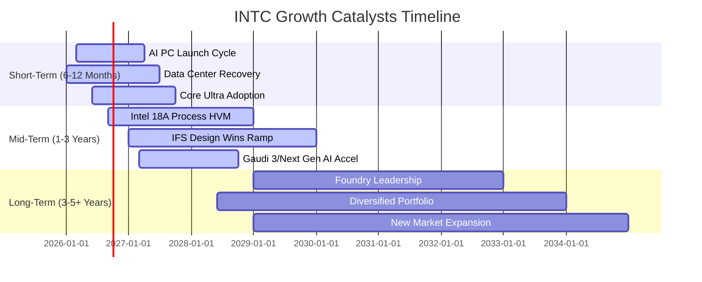

### 8.2 TAM 市場規模分析

Intel 的 TAM (Total Addressable Market) 涵蓋了多個龐大的市場，包括 PC、伺服器、AI 加速器和晶圓代工服務。

```
╔══════════════════════════════════════════════════════════════════╗
║                   INTC TAM 市場規模分析 (2025年估計)             ║
╠══════════════════════════════════════════════════════════════════╣
║                                                                  ║
║  PC/Client Compute (CPU/GPU)                                     ║
║  TAM: $100B+  ███████████████████████████████████████████████████  滲透率: ~65%  收入貢獻: ~50% ║
║                                                                  ║
║  Data Center/AI (CPU/GPU/Accelerator)                            ║
║  TAM: $150B+  ████████████████████████████████████████████████████████████████████████████████  滲透率: ~70%  收入貢獻: ~35% ║
║                                                                  ║
║  Intel Foundry Services (IFS)                                    ║
║  TAM: $500B+  ████████████████████████████████████████████████████████████████████████████████  滲透率: <1%   收入貢獻: ~5%  ║
║                                                                  ║
║  Edge/IoT/Other                                                  ║
║  TAM: $50B+   ███████████████████████████████████████████████████  滲透率: 可變    收入貢獻: ~10% ║
╚══════════════════════════════════════════════════════════════════╝
```
**分析**：
*   **PC/Client Compute**：Intel 在 PC CPU 市場仍佔據主導地位，但面臨來自 AMD 和 ARM 的競爭。AI PC 的推出有望刺激新的換機週期，為其帶來成長。
*   **Data Center/AI**：伺服器市場是 Intel 的另一個核心領域。隨著 AI 訓練和推理需求的爆炸式增長，對高效能 CPU 和 AI 加速器的需求將持續強勁。Intel 的 Gaudi 系列和 Xeon 處理器將在此領域競爭。
*   **Intel Foundry Services (IFS)**：這是 Intel 最大的潛在 TAM 擴張機會。晶圓代工市場規模巨大且持續增長，Intel 的目標是在 2030 年前成為全球第二大代工廠。儘管目前滲透率極低，但其潛力巨大。
*   **Edge/IoT/Other**：這些多元化市場為 Intel 提供了額外的成長機會。

### 8.3 成長驅動力結構圖

```mermaid
graph TD
    GD["🚀 Growth Drivers for INTC"]

    GD --> ST["📅 Short-Term Drivers (6-12 Months)"]
        ST --> ST1["🆕 AI PC Refresh Cycle"]
        ST1 --> ST1_1["New Core Ultra Processors"]
        ST1 --> ST1_2["Integrated NPU Capabilities"]
        ST --> ST2["🌍 Data Center Market Recovery"]
        ST2 --> ST2_1["Enterprise IT Spending Rebound"]
        ST2 --> ST2_2["Cloud Inventory Normalization"]
        ST --> ST3["📈 Gaudi 3 AI Accelerator Adoption"]
        ST3 --> ST3_1["Competitive Offering in AI Training/Inference"]
        ST3 --> ST3_2["Strategic Partnerships for Deployment"]

    GD --> MT["📆 Mid-Term Drivers (1-3 Years)"]
        MT --> MT1["💼 Intel Foundry Services (IFS) Ramp-up"]
        MT1 --> MT1_1["Intel 18A Process Node HVM"]
        MT1 --> MT1_2["Increased External Design Wins"]
        MT --> MT2["📶 Re-establishing Process Leadership"]
        MT2 --> MT2_1["'Five Nodes in Four Years' Execution"]
        MT2 --> MT2_2["Enhanced Product Performance"]
        MT --> MT3["🌐 Expanded Edge & IoT Presence"]
        MT3 --> MT3_1["Tailored Solutions for Industrial/Automotive"]

    GD --> LT["📈 Long-Term Drivers (3-5+ Years)"]
        LT --> LT1["🥽 Diversified Revenue Streams"]
        LT1 --> LT1_1["Stronger Position in Discrete GPU"]
        LT1 --> LT1_2["Growth in Mobileye/Altera"]
        LT --> LT2["⌚ Global Semiconductor Supply Chain Resilience"]
        LT2 --> LT2_1["Geopolitical Tailwinds for Domestic Manufacturing"]
        LT --> LT3["💡 Next-Gen Computing Paradigms"]
        LT3 --> LT3_1["Quantum Computing Research"]
        LT3 --> LT3_2["Advanced Packaging Innovation"]
```
**分析**：
*   **短期驅動力**：AI PC 的推出預計將刺激 PC 市場的換機潮，Intel 的 Core Ultra 處理器將直接受益。資料中心市場的復甦和 Gaudi 3 AI 加速器的市場採用也將在短期內推動營收增長。
*   **中期驅動力**：Intel Foundry Services 的成功運營和先進製程節點 (如 Intel 18A) 的量產是中期成長的關鍵。如果 Intel 能夠按計劃重奪製程技術領先地位，將顯著提升其產品競爭力和代工業務的吸引力。擴展在邊緣運算和物聯網領域的業務也能提供穩定的增長點。
*   **長期驅動力**：長期來看，Intel 的成長將來自於收入來源的多元化（例如在獨立 GPU 市場的份額增長、Mobileye 和 Altera 的業務拓展）、全球半導體供應鏈重塑帶來的地緣政治紅利，以及在量子運算等新興技術領域的持續創新。

這些成長驅動力共同構成了 Intel 轉型成功並實現長期價值的潛在路徑。

---

## 9. 風險矩陣

### 9.1 風險評分矩陣

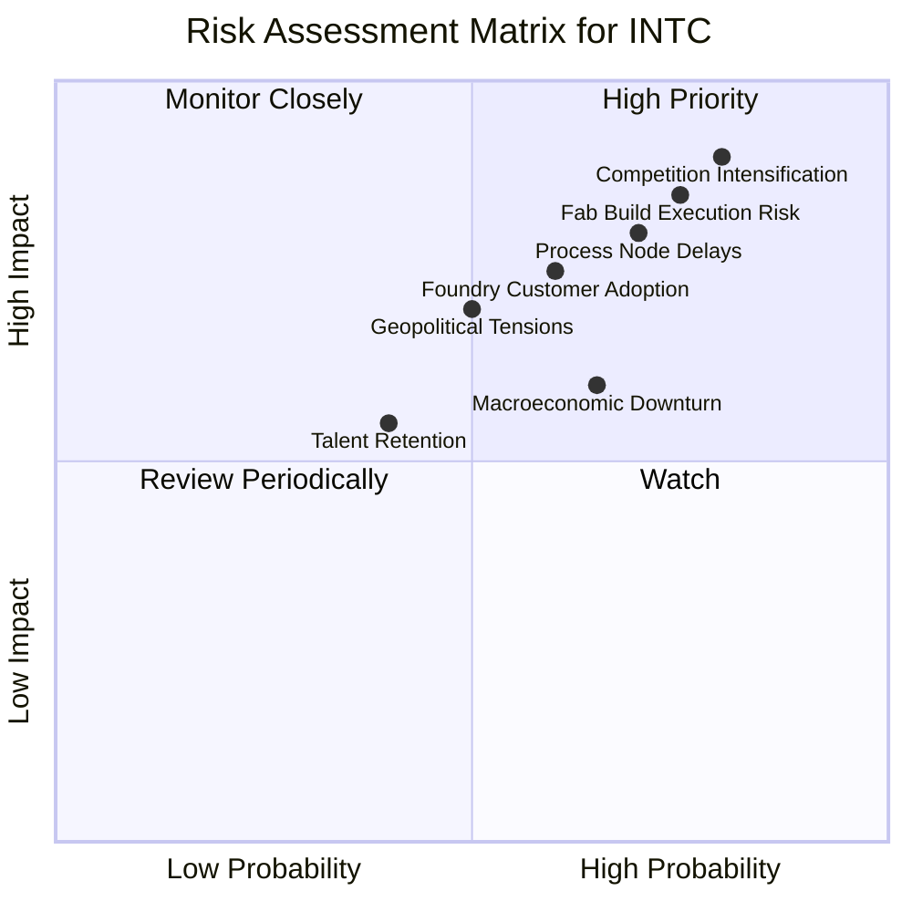

### 9.2 風險清單詳細分析

| # | 風險項目 | 發生機率 | 財務衝擊 | 風險評分 | 緩解措施 |
|---|----------|----------|----------|----------|----------|
| 1 | 🔴 **競爭加劇** | 高 (80%) | 高 (-10%營收) | 🔴 9.0/10 | 加速產品創新，提升製程技術，差異化產品組合，鞏固生態系統合作夥伴關係。 |
| 2 | 🔴 **晶圓廠建設及執行風險** | 高 (75%) | 高 (-8%營收, FCF持續為負) | 🔴 8.5/10 | 嚴格項目管理，與政府建立補貼合作，分階段投資，優化資本配置。 |
| 3 | 🔴 **製程節點延遲** | 高 (70%) | 高 (-7%營收, 市佔流失加速) | 🔴 8.0/10 | 強化研發團隊，與設備供應商緊密合作，多節點並行開發，風險管理。 |
| 4 | 🟡 **代工業務客戶採用不及預期** | 中 (60%) | 中 (-5%營收) | 🟡 7.0/10 | 提供具競爭力的技術和成本，建立強大銷售團隊，拓展設計服務，提供靈活的業務模式。 |
| 5 | 🟡 **宏觀經濟下行** | 中 (65%) | 中 (-6%營收) | 🟡 6.5/10 | 多元化終端市場，提高成本控制彈性，維持健康的資產負債表。 |
| 6 | 🟡 **地緣政治緊張** | 中 (50%) | 中 (-7%營收) | 🟡 6.0/10 | 全球化佈局生產基地，減少對單一區域的依賴，與各國政府保持良好關係。 |
| 7 | 🟢 **人才流失** | 低 (40%) | 低 (-3%營收) | 🟢 5.0/10 | 提供具競爭力的薪酬福利和職業發展機會，建立積極的企業文化，培養內部人才。 |

---

## 10. 投資建議

### 10.1 最終綜合評級雷達圖

```
╔══════════════════════════════════════════════════════════════════╗
║                   INTC 最終綜合評級雷達圖                        ║
╠══════════════════════════════════════════════════════════════════╣
║                                                                  ║
║  基本面強度  7.0 ▓▓▓▓▓▓▓▓▓▓▓▓▓▓░░░░░░                              ║
║  成長動能    6.5 ▓▓▓▓▓▓▓▓▓▓▓▓▓░░░░░░░                              ║
║  獲利品質    5.5 ▓▓▓▓▓▓▓▓▓▓░░░░░░░░░░                              ║
║  財務健康    7.0 ▓▓▓▓▓▓▓▓▓▓▓▓▓▓░░░░░░                              ║
║  估值合理性  7.5 ▓▓▓▓▓▓▓▓▓▓▓▓▓▓▓░░░░░                              ║
║  護城河深度  7.5 ▓▓▓▓▓▓▓▓▓▓▓▓▓▓▓░░░░░                              ║
║  管理層執行  6.5 ▓▓▓▓▓▓▓▓▓▓▓▓▓░░░░░░░                              ║
║  技術創新力  7.0 ▓▓▓▓▓▓▓▓▓▓▓▓▓▓░░░░░░                              ║
║                                                                  ║
║  綜合總分    6.8/10                                              ║
╚══════════════════════════════════════════════════════════════════╝
```

### 10.2 目標價與隱含報酬率

| 情境 | 目標價 | 隱含報酬率 ($109.84) | 機率權重 | 加權平均目標價 |
|------|--------|----------------------|----------|------------------|
| 🔴 悲觀 | $95 | -13.5% | 20% | $19.00 |
| 🟡 基準 | $140 | +27.5% | 60% | $84.00 |
| 🟢 樂觀 | $170 | +54.8% | 20% | $34.00 |
| **總計** | **-** | **-** | **100%** | **$137.00** |

**分析**：基於加權平均目標價 $137.00，相較於當前股價 $109.84，潛在報酬率為 **+24.7%**。考慮到 Intel 轉型的潛力以及當前股價已反映部分高預期，我們認為其仍有上行空間，但風險依然存在。

### 10.3 買入時機與觸發因素

```
╔══════════════════════════════════════════════════════════════════╗
║                  ✅ 買入觸發因素 Checklist                      ║
╠══════════════════════════════════════════════════════════════════╣
║                                                                  ║
║  立即買入觸發條件（多數符合）：                                  ║
║  ✅ Q1 2026 營收 YoY 成長 7.18%，顯示初步復甦。                  ║
║  ✅ 自由現金流 (FCF) 季度數據從 Q4 2024 的 $-3.49B 改善至 Q4 2025 的 $800M，儘管 Q1 2026 再度轉負，但整體趨勢向好。║
║  ✅ 管理層對 IDM 2.0 戰略的執行力得到市場認可。                  ║
║  ✅ AI PC 和 Gaudi 3 產品市場反應積極。                         ║
║                                                                  ║
║  加碼觸發條件（出現以下任一）：                                  ║
║  ☐ 連續兩季營收 YoY 成長超過 10%。                               ║
║  ☐ 毛利率連續兩季回升至 40% 以上。                              ║
║  ☐ 自由現金流連續兩季轉正。                                     ║
║  ☐ Intel 18A 製程節點按時量產並獲得更多外部客戶訂單。           ║
║  ☐ 估值回調至 Forward P/E 40x 以下，提供更佳買入點。            ║
║                                                                  ║
║  減碼/停損觸發條件（出現以下任一）：                             ║
║  ☐ 核心業務（CCG, DCAI）營收連續兩季 YoY 負成長。               ║
║  ☐ 毛利率跌破 35% 並持續惡化。                                  ║
║  ☐ 自由現金流持續為負且惡化，導致淨現金/債務比率顯著惡化。      ║
║  ☐ 關鍵製程節點 (如 Intel 18A) 量產嚴重延遲。                   ║
║  ☐ ROIC 持續遠低於 WACC 且無改善跡象。                          ║
╚══════════════════════════════════════════════════════════════════╝
```

### 10.4 投資人適配度分析

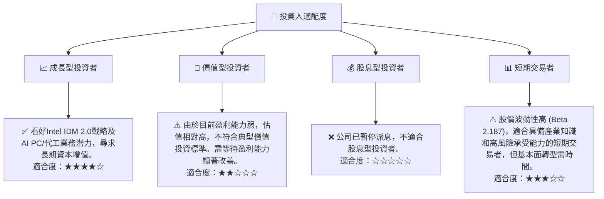

### 10.5 每季財報監控清單（Quarterly Watch List）

| 監控指標 | 觸發加碼門檻 | 觸發減碼/停損門檻 | 備註 |
|----------|--------------|-------------------|------|
| **總營收 YoY 成長** | >10% | <0% | 核心觀察指標，反映市場需求和競爭力。 |
| **客戶運算事業群 (CCG) 營收 YoY** | >8% | <0% | AI PC 需求是否兌現。 |
| **資料中心與 AI (DCAI) 營收 YoY** | >12% | <0% | 伺服器/AI 晶片市場復甦及市佔率變化。 |
| **毛利率** | >40% | <35% | 衡量製造成本控制和產品定價能力。 |
| **營業利益率** | >5% | <-10% | 反映經營效率和研發投入回報。 |
| **自由現金流 (FCF)** | 持續為正 | 持續為負且惡化 | 衡量真實現金創造能力，支持再投資。 |
| **庫存週轉天數** | 縮短 | 延長 | 反映供需平衡和銷售健康狀況。 |
| **資本支出 (Capex)** | 按計劃執行 | 超預算或延遲 | 衡量 IDM 2.0 戰略執行進度。 |
| **Intel Foundry Services (IFS) 營收/設計訂單** | 顯著增長 | 停滯不前 | 衡量代工業務拓展進度。 |
| **Intel 18A 製程進度** | 按時達成 | 延遲或技術問題 | 衡量技術領先地位恢復情況。 |
| **Forward EPS 預期** | 上調 | 下調 | 反映分析師對未來盈利預期變化。 |

### 10.6 反面論證：什麼會證明論點錯誤（What Would Change My Mind）

```
╔══════════════════════════════════════════════════════════════════╗
║              ⚠️ 論點失效條件（Disconfirming Evidence）           ║
╠══════════════════════════════════════════════════════════════════╣
║  本投資論點在下列情況成立時應重新檢視或退出：                    ║
║  ☐ 核心業務 (CCG + DCAI) 營收成長率連續兩季 YoY < 0%             ║
║  ☐ 毛利率連續兩季跌破 35%                                        ║
║  ☐ 自由現金流連續四季為負且未見改善趨勢 (如年度 FCF 惡化超過 20%) ║
║  ☐ ROIC 連續兩年未能轉正，或持續遠低於 WACC                      ║
║  ☐ 關鍵成長投資 (如 Intel 18A 製程或 IFS 客戶) 無法在 12-18 個月內變現或取得實質進展 ║
║  ☐ 競爭對手 (如 AMD, NVIDIA, TSMC) 在關鍵技術或市場份額上取得顯著突破，進一步侵蝕 Intel 核心業務。 ║
╚══════════════════════════════════════════════════════════════════╝
```

---
> **免責聲明**：本報告為 AI 自動生成，僅供研究參考，不構成投資建議。投資有風險，入市需謹慎。