# INTC 基本面深度分析報告
> **報告日期**：2026-07-12 ｜ **語言**：繁體中文 ｜ **數據來源**：Yahoo Finance, Finviz, StockAnalysis, Roic.ai ｜ **分析師**：CFA 級機構研究

---

## 目錄

| # | 章節 | 核心結論 |
|---|------|----------|
| 1 | [執行摘要](#1-執行摘要) | 評級：**持有 (Hold)** ｜ 目標價：**$101.95** ｜ 轉型期陣痛與高估值溢價並存 |
| 2 | [公司概覽與商業模式](#2-公司概覽與商業模式) | 護城河評分：**6.5/10** ｜ x86 雙寡頭壟斷與 IDM 2.0 晶圓代工雙軌轉型 |
| 3 | [損益表深度分析](#3-損益表深度分析) | 營收築底回升（Q1 '26 YoY +7.18%），但高折舊與重組費用壓抑短期獲利能力 |
| 4 | [資產負債表分析](#4-資產負債表分析) | 現金儲備充裕（$32.79B），但總債務達 $45.03B，資本支出密集導致資產負債表承壓 |
| 5 | [現金流量深度分析](#5-現金流量深度分析) | 自由現金流（TTM）為 **-$8.30B**，高額資本支出導致現金持續流出，無股息發放 |
| 6 | [獲利能力與資本效率](#6-獲利能力與資本效率) | ROIC（2.32%）遠低於 WACC（11.87%），目前處於經濟價值毀滅階段（EVA 為負） |
| 7 | [估值深度分析](#7-估值深度分析) | Forward P/E 達 **69.75x**，顯著高於歷史均值與同業，市場已過度透支 18A 成功預期 |
| 8 | [成長催化劑](#8-成長催化劑) | Intel 18A 製程量產、外部代工訂單落地與美國晶片法案補貼撥款 |
| 9 | [風險矩陣](#9-風險矩陣) | 製程延遲風險、代工客戶流失、x86 市佔率遭 ARM 蠶食及現金流斷裂風險 |
| 10 | [投資建議](#10-投資建議) | 綜合評級：**持有 (Hold)** ｜ 建議等待 18A 商業化實質營收貢獻及估值回落後再行佈局 |

---

## 1. 執行摘要

Intel Corporation (NASDAQ: INTC) 目前正處於其半世紀歷史上最關鍵的結構性轉型期。在執行長 Pat Gelsinger 的 IDM 2.0 戰略主導下，公司試圖同時重奪製程技術領先地位（5年5個節點）並建立世界級的晶圓代工服務（Intel Foundry）。

然而，財務數據顯示，這場轉型伴隨著巨大的財務陣痛：**TTM 營收為 $53.76B**，較歷史高點顯著萎縮；**TTM 淨利潤率為 -5.9%**，**自由現金流（FCF）為 -$8.30B**。儘管 2026 年初股價因 18A 製程進展與潛在代工合約利多刺激，從 $44.13（2026年3月）暴漲至 $109.84（當前價格），但其 **Forward P/E 已被推高至 69.75x**，**EV/EBITDA 達 40.77x**。

基於當前高企的估值、持續為負的自由現金流以及 ROIC（2.32%）與 WACC（11.87%）之間的巨大負利差，我們給予 Intel **「持有 (Hold)」** 評級，基準情境 12 個月目標價為 **$101.95**（較當前股價有 -7.2% 的下行空間）。

### 1.0 一頁式投資儀表板（Portfolio Manager 30 秒速讀）

| 項目 | 內容 |
|------|------|
| **投資論點（3 句）** | ① PC 市場築底復甦帶動 CCG 部門回暖，Q1 2026 營收同比增長 7.18% 至 $13.58B。<br/>② Intel 18A（1.8奈米）製程預計於 2026 年下半年進入量產，是重奪技術領先與獲取外部代工訂單的關鍵。<br/>③ 當前估值（Forward P/E 69.75x）已過度反映轉型樂觀預期，未充分考量每年逾 $18B 資本支出帶來的現金流壓力。 |
| **護城河評分** | 🟡 **6.5 / 10**（x86 專利壁壘仍固，但製程領先優勢已失，晶圓代工護城河尚未建立） |
| **管理層/資本配置評分** | 🟡 **5.5 / 10**（IDM 2.0 執行力尚可，但歷史資本配置效率低下，目前正承受高額資本支出與負 FCF 壓力） |
| **財務健康** | 🟡 **中等** ｜ 擁有 $32.79B 現金與短期投資，但總債務高達 $45.03B，淨債務為 $12.24B。 |
| **ROIC vs WACC** | 🔴 **2.32% vs 11.87%**（ROIC 遠低於資金成本，持續毀滅股東價值，EVA 為 -9.55%） |
| **FCF 趨勢** | 🔴 **持續流失** ｜ TTM FCF 為 **-$8.30B**，最新 FCF Yield 為 **-1.50%**，無股息支付能力。 |
| **估值** | Forward P/E: **69.75x** ｜ EV/EBITDA: **40.77x** ｜ P/S Ratio: **10.27x**（估值處於歷史極高區間） |
| **預期報酬（基準情境 12M）** | 🔴 **-7.18%**（目標價 $101.95，當前股價 $109.84） |
| **關鍵風險（前二）** | ① Intel 18A 製程良率不及預期，導致外部代工客戶（如 Microsoft, AWS）流失或延遲下單。<br/>② 數據中心市場（DCAI）市佔率持續被 AMD EPYC 及 ARM 架構自研晶片蠶食。 |
| **評級 + 信心度** | 🟡 **持有 (Hold)** ｜ 信心度：**中等**（短期股價受動能驅動，基本面支撐偏弱） |

### 1.1 核心評分儀表板

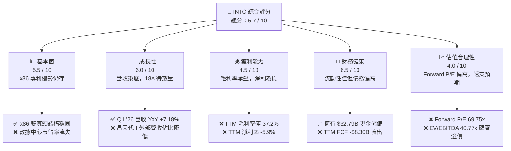

### 1.2 評分進度條視覺化

```
╔══════════════════════════════════════════════════════════════╗
║               INTC 多維度評分儀表板 (1-10分)                 ║
╠══════════════════════════════════════════════════════════════╣
║ 基本面強度  5.5 ▓▓▓▓▓▓▓▓▓▓▓░░░░░░░░░  ★★★☆☆           ║
║ 成長動能    6.0 ▓▓▓▓▓▓▓▓▓▓▓▓░░░░░░░░  ★★★☆☆           ║
║ 獲利品質    4.5 ▓▓▓▓▓▓▓▓▓░░░░░░░░░░░  ★★☆☆☆           ║
║ 財務健康    6.5 ▓▓▓▓▓▓▓▓▓▓▓▓▓░░░░░░░  ★★★☆☆           ║
║ 估值合理性  4.0 ▓▓▓▓▓▓▓▓░░░░░░░░░░░░  ★★☆☆☆           ║
║ 護城河深度  6.5 ▓▓▓▓▓▓▓▓▓▓▓▓▓░░░░░░░  ★★★☆☆           ║
║ 管理層執行  5.5 ▓▓▓▓▓▓▓▓▓▓▓░░░░░░░░░  ★★★☆☆           ║
║ 技術創新力  8.0 ▓▓▓▓▓▓▓▓▓▓▓▓▓▓▓▓░░░░  ★★★★☆           ║
╠══════════════════════════════════════════════════════════════╣
║ 綜合總分    5.7 ▓▓▓▓▓▓▓▓▓▓▓░░░░░░░░░  🏆 持有 (Hold)       ║
╚══════════════════════════════════════════════════════════════╝
```

### 1.3 五大投資論點 + 三大核心風險

| 類型 | 項目 | 具體依據 | 信心度 |
|------|------|----------|--------|
| 🟢 **投資論點①** | **PC 市場週期性復甦** | CCG 部門（客戶運算）佔營收逾 50%，Q1 2026 營收達 $13.58B（YoY +7.18%），顯示 PC 庫存去化結束，AI PC 滲透率逐步提升。 | 🟢 高 |
| 🟢 **投資論點②** | **18A 製程重奪技術領先** | 18A（1.8nm）預計 2026 年底量產，引入 PowerVia 後面供電與 RibbonFET 全環繞柵極技術，領先 TSMC 2nm（N2）時程。 | 🟡 中等 |
| 🟢 **投資論點③** | **地緣政治與政策補貼** | 預計獲得《美國晶片法案》近 $8.5B 直接補貼與 $11B 貸款支持，降低在美建廠的資本支出負擔。 | 🟢 高 |
| 🟢 **投資論點④** | **先進封裝需求爆發** | Foveros 3D 封裝與 EMIB 技術產能供不應求，已鎖定多個外部高算力晶片代工客戶。 | 🟢 高 |
| 🟢 **投資論點⑤** | **資產剝離與價值重估** | 潛在的 Altera 獨立 IPO 及 Mobileye 持股變現，有助於回籠資金，減緩母公司現金流壓力。 | 🟡 中等 |
| 🟡 **風險①** | **18A 良率與商業化延遲** | 若 18A 良率無法在 2026 年底達到商業化標準，將導致大客戶（如 Microsoft）流失，並推遲晶圓代工盈虧平衡點。 | 🔴 高衝擊 |
| 🔴 **風險②** | **高昂折舊拖累毛利率** | 過去三年累計資本支出超過 $64B，隨著新廠投產，折舊費用將大幅攀升，壓抑毛利率（TTM 僅 37.2%）。 | 🔴 高衝擊 |
| 🔴 **風險③** | **DCAI 市佔率持續流失** | 在伺服器 CPU 市場，AMD EPYC 的市佔率已逼近 30%，且雲端服務商（CSP）正加速自研 ARM 架構晶片，侵蝕 Intel 核心利潤池。 | 🔴 高衝擊 |

### 1.4 快速統計卡片

| 指標 | Intel 實際值 | 半導體行業均值 | S&P 500 均值 | 狀態 |
|------|-------------|----------|--------------|------|
| 營收 YoY 成長率 | **1.35%** (TTM) / **7.18%** (Q1 '26) | ~12.5% | ~5.5% | 🟡 中等 |
| 毛利率 | **37.2%** | ~52.0% | ~45.0% | 🔴 弱 |
| 營業利益率 | **6.9%** (Yahoo) / **-9.39%** (GAAP TTM) | ~22.0% | ~14.5% | 🔴 弱 |
| ROE | **-2.9%** | ~15.0% | ~18.0% | 🔴 弱 |
| Forward P/E | **69.75x** | ~28.0x | ~21.5x | 🔴 昂貴 |
| EV / EBITDA | **40.77x** | ~18.5x | ~13.0x | 🔴 昂貴 |
| 淨債務 / 股東權益 | **10.71%** | ~-5.0% (淨現金) | ~45.0% | 🟢 健康 |

### 1.5 投資結論

```
╔══════════════════════════════════════════════════════════════════╗
║                    📊 投資結論摘要                               ║
╠══════════════════════════════════════════════════════════════════╣
║  評級：🟡 持有 (Hold)                                            ║
║  當前股價：$109.84 (2026-07-12)                                  ║
║  目標價區間：                                                    ║
║    悲觀情境：$55.00  （-49.9%）                                  ║
║    基準情境：$101.95 （-7.2%）  ← 12個月主要目標                 ║
║    樂觀情境：$150.00 （+36.6%）                                  ║
║  投資評分：5.7 / 10                                              ║
║  適合投資人：具備高風險承受力的長線逆向投資者、非短期交易者      ║
╚══════════════════════════════════════════════════════════════════╝
```

---

## 2. 公司概覽與商業模式

Intel 的商業模式正經歷從傳統的「垂直整合製造商 (IDM)」向「IDM 2.0」的歷史性轉變。該戰略將 Intel 的業務劃分為兩大核心支柱：
1. **Intel Product（產品部門）**：設計並銷售 CPU、GPU 及網路晶片，包含客戶運算集團（CCG）、數據中心與人工智慧（DCAI）等。
2. **Intel Foundry（晶圓代工部門）**：作為獨立運營的利潤中心，不僅為 Intel 自家產品代工，亦積極爭取外部晶片設計公司（Fabless）的訂單，直接與台積電（TSMC）及三星電子（Samsung）競爭。

### 2.1 業務結構與收入來源

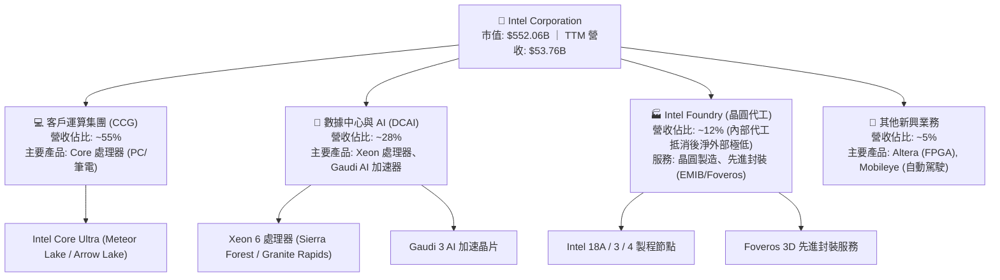

### 2.2 市場份額

在核心的 x86 CPU 市場，Intel 仍維持主導地位，但近年來在數據中心與個人電腦領域均面臨 AMD 的強力蠶食。

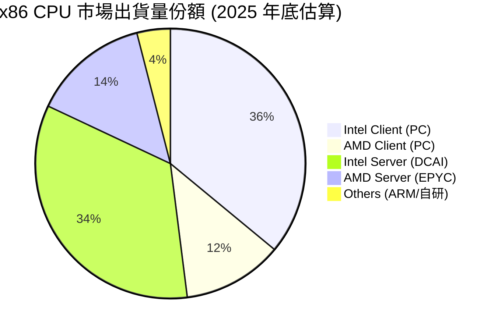

### 2.3 競爭護城河分析

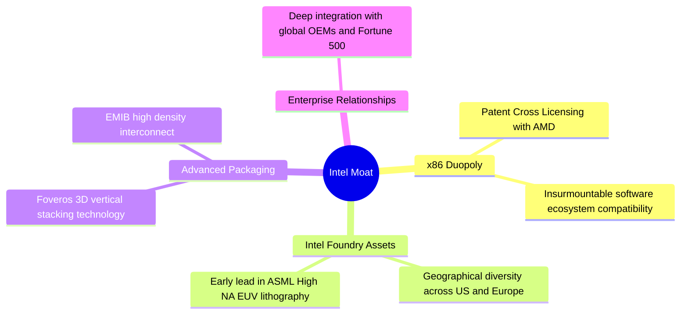

### 2.4 護城河強度評分

雖然 Intel 在 x86 架構上擁有極深的專利與軟體生態護城河（Wintel 聯盟延續至今），但其製程技術護城河在 10 奈米及 7 奈米節點遭遇嚴重挫折，導致代工護城河尚未成型。

```
╔══════════════════════════════════════════════════════════════╗
║                   Intel 護城河強度評分                       ║
╠══════════════════════════════════════════════════════════════╣
║ x86 生態壁壘   8.5/10 ▓▓▓▓▓▓▓▓▓▓▓▓▓▓▓▓▓░░░  🟢 歷史底蘊深厚 ║
║ 製造規模優勢   7.0/10 ▓▓▓▓▓▓▓▓▓▓▓▓▓░░░░░░░  🟢 全球產能佈局 ║
║ 先進封裝技術   7.5/10 ▓▓▓▓▓▓▓▓▓▓▓▓▓▓▓░░░░░  🟢 EMIB/Foveros ║
║ 晶圓代工技術   4.5/10 ▓▓▓▓▓▓▓▓▓░░░░░░░░░░░  🔴 18A 尚未量產 ║
╠══════════════════════════════════════════════════════════════╣
║ 綜合護城河評分 6.5/10 ▓▓▓▓▓▓▓▓▓▓▓▓▓░░░░░░░  🟡 轉型過渡期   ║
╚══════════════════════════════════════════════════════════════╝
```

---

## 3. 損益表深度分析

Intel 的損益表反映出明顯的「收入築底、利潤承壓」結構。在經歷了 2022-2024 年的半導體下行週期與市佔率流失後，營收已開始止跌回升，但獲利能力仍受到高折舊、高研發投入及重組費用的嚴重壓抑。

### 3.1 年度收入成長趨勢（近4年）

自 2021 年營收達到 $79.02B 的歷史高點後，Intel 營收連續數年下滑，直至 2025 年才在 $52.85B 附近築底。

```
╔══════════════════════════════════════════════════════════════════╗
║              Intel 年度收入趨勢（FY2022-FY2025）                 ║
╠══════════════════════════════════════════════════════════════════╣
║                                                                  ║
║  FY2022  $63.05B  ██████████████████████░░░░░░░  YoY: -20.21% 🔴 ║
║  FY2023  $54.23B  ███████████████████░░░░░░░░░░  YoY: -14.00% 🔴 ║
║  FY2024  $53.10B  ██████████████████░░░░░░░░░░░  YoY:  -2.08% 🟡 ║
║  FY2025  $52.85B  ██████████████████░░░░░░░░░░░  YoY:  -0.47% 🟡 ║
║                   |      |      |      |      |                  ║
║                   0     20B    40B    60B    80B                 ║
║                                                                  ║
║  📊 3年累計 CAGR：-5.71%                                         ║
╚══════════════════════════════════════════════════════════════════╝
```

### 3.2 季度收入趨勢分析

最新季報顯示，Intel 的復甦動能正在增強。Q1 2026 營收達到 **$13.58B**，同比增長 **7.18%**，延續了 Q3 2025 以來的同比正增長趨勢。

| 財政季度 | 營收 (M) | YoY 成長率 | QoQ 成長率 | 毛利 (M) | 毛利率 | 備註 |
|----------|----------|------------|------------|----------|--------|------|
| **Q1 2026** | $13,577 | **+7.18%** 🟢 | -0.71% 🟡 | $5,347 | 39.38% | PC 出貨量回暖，Core Ultra 滲透加速 |
| **Q4 2025** | $13,674 | -4.11% 🔴 | +0.15% 🟡 | $4,943 | 36.15% | 年底季節性平淡，代工部門折舊增加 |
| **Q3 2025** | $13,653 | **+2.78%** 🟢 | +6.17% 🟢 | $5,218 | 38.22% | 伺服器 CPU 需求小幅回升 |
| **Q2 2025** | $12,859 | +0.20% 🟡 | +1.52% 🟡 | $3,542 | 27.54% | 受一次性資產減值拖累，利潤率探底 |

### 3.3 利潤率演變分析

Intel 的利潤率在過去幾年中出現了斷崖式下跌。毛利率從歷史上的 60%+ 跌至 TTM 的 **37.2%**，主因是產能利用率不足、新製程（Intel 4/3）初期成本高昂，以及代工業務的巨額固定成本折舊。

| 利潤率指標 | FY2022 | FY2023 | FY2024 | FY2025 | TTM | 趨勢與原因解析 | 評估 |
|------------|--------|--------|--------|--------|-----|----------------|------|
| **毛利率** | 42.60% | 40.04% | 32.66% | 34.77% | **37.2%** | ↗️ 自 2024 年底部回升，但仍受限於高昂的代工折舊 | 🔴 弱 |
| **營業利益率** | 3.70% | 0.17% | -22.0% | -4.19% | **6.9%** | ↗️ 營運槓桿隨營收回升而改善，成本削減計劃見效 | 🟡 中等 |
| **EBITDA Margin** | 33.78% | 20.73% | 2.26% | 27.15% | **26.4%** | ↗️ 折舊攤銷佔比較高，EBITDA 表現顯著優於營業利益 | 🟢 良好 |
| **淨利率** | 12.71% | 3.11% | -36.2% | -0.50% | **-5.9%** | ↘️ 稅務調整與利息支出增加，導致 GAAP 淨利仍為負值 | 🔴 弱 |

### 3.4 費用結構分析

Intel 仍維持極高的研發（R&D）投入，以確保其「5年5個節點」戰略的順利推進。FY2025 研發費用高達 **$13.77B**，佔營收比重高達 **26.1%**，這在大型半導體公司中極為罕見，反映出其對技術翻身的孤注一擲。

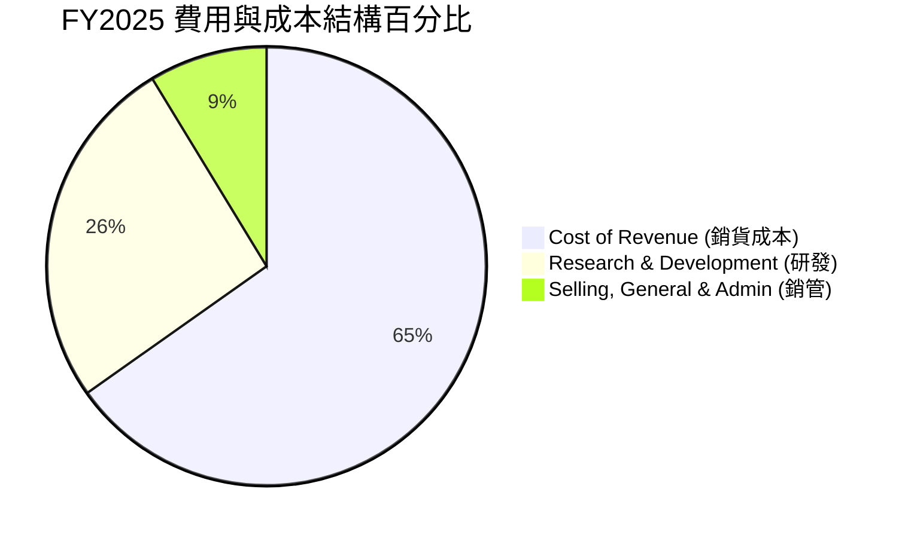

### 3.5 季度 EPS 趨勢與盈餘品質（Quality of Earnings）

過去四個季度中，Intel 的 GAAP EPS 波動劇烈，Q1 2026 為 **-$0.73**，主要受到非經常性重組費用與代工部門資產減值的拖累。

#### 盈餘品質量化評估

為評估 Intel 獲利的「真實含金量」，我們對其非現金項目及股權稀釋進行了深度剖析：

| 盈餘品質項目 | 數值 / 佔比 | 機構級評估與業務含意 | 評級 |
|--------------|-----------|----------------------|------|
| **SBC / TTM 營收** | **4.52%** ($2.43B / $53.76B) | 處於行業合理區間。但考量到公司目前處於虧損狀態，每年發放逾 $2.4B 的股權激勵，對現有股東權益造成結構性稀釋（FY25 稀釋股份 YoY +5.84%）。 | 🟡 警告 |
| **SBC / 營業現金流 (OCF)** | **24.35%** ($2.43B / $9.98B) | 🔴 **極高**。顯示公司近四分之一的營業現金流是靠發放股票（非現金支出）「加回」而來，真實的現金創造能力偏弱。 | 🔴 差 |
| **FCF / GAAP 淨利（轉換率）** | **246.4%** (-$8.30B / -$3.37B) | 因兩者皆為負值，轉換率指標失真。但 FCF 赤字（-$8.30B）遠大於 GAAP 淨虧損（-$3.37B），表明資本支出（Capex）遠超折舊攤銷，現金消耗速度極快。 | 🔴 差 |
| **一次性 / 非經常性損益** | **$4.07B** (Q1 '26 其他營運費用) | Q1 2026 損益表中包含高達 $4.07B 的其他營運支出，主因是舊製程設備的加速折舊與重組遣散費，美化了未來的利潤率，但重創了當期盈餘。 | 🟡 警告 |
| **有效稅率異常** | **-86.8%** (TTM 估算) | 由於大額稅前虧損與递延所得稅資產評估撥備，有效稅率呈現異常，獲利無法反映真實營運稅後表現。 | 🔴 差 |

**盈餘品質結論**：Intel 當前的 GAAP 盈餘品質較低。儘管 EBITDA 看似健康（TTM $14.19B），但這是被高額折舊（D&A）與 SBC 所美化的結果。高達 -$8.30B 的 FCF 赤字揭示了其真實的經濟處境：**公司正以遠快於帳面虧損的速度消耗現金。**

---

## 4. 資產負債表分析

作為一家重資產的半導體製造商，Intel 的資產負債表規模龐大，但隨著持續的資本建設，其資產結構與流動性指標正發生結構性變化。

### 4.1 資產結構分解

截至 Q1 2026，Intel 總資產為 **$205.33B**。其中，廠房與設備淨額（Net PPE）高達 **$104.46B**，佔總資產的 **50.9%**，顯示其極高的資本密集度。

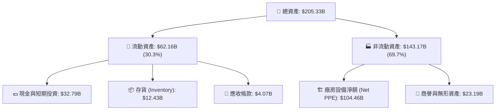

### 4.2 流動性指標分析

儘管面臨現金流出壓力，Intel 仍維持了極為安全的短期流動性緩衝，這得益於其在債券市場的積極融資與資產剝離。

*   **流動比率 (Current Ratio)**：**2.312**（高於行業平均的 1.8x，顯示短期償債能力無虞）。
*   **速動比率 (Quick Ratio)**：**1.657**（扣除 $12.43B 存貨後，變現資產仍能覆蓋短期債務）。
*   **存貨週轉天數 (Days Inventory Outstanding)**：**130.5 天**（較歷史均值的 95 天顯著拉長，顯示 PC 與伺服器晶片庫存雖在去化，但速度仍顯緩慢，存在潛在的降價去庫存風險）。

### 4.3 債務結構分析與健康診斷

Intel 的債務總額在過去三年內快速攀升，以支持其建廠需求。

```
╔══════════════════════════════════════════════════════════════════╗
║                   Intel 債務健康診斷 (Q1 2026)                   ║
╠══════════════════════════════════════════════════════════════════╣
║                                                                  ║
║  總債務 (Total Debt)：  $45.03B   ██████████░░░░░░░░░░░░  評語   ║
║  總現金與短期投資：      $32.79B   ███████░░░░░░░░░░░░░░░  評語   ║
║  淨債務 (Net Debt)：     $12.24B   ██░░░░░░░░░░░░░░░░░░░░  🟡 警告║
║                                                                  ║
║  Debt / Equity Ratio:   36.03%    🟢 槓桿率處於安全區間           ║
║  Debt / TTM EBITDA:     3.17x     🟡 債務/EBITDA 偏高，需警惕     ║
║  Interest Coverage:     -1.55x    🔴 GAAP 營業虧損，利息保障倍數為負║
║                                                                  ║
║  💡 診斷：短期無違約風險，但若 FCF 持續為負，評級面臨下調壓力。   ║
╚══════════════════════════════════════════════════════════════════╝
```

### 4.4 股東權益趨勢

雖然公司處於虧損狀態，但 FY2025 股東權益（Stockholders Equity）逆勢回升至 **$114.28B**（FY24 為 $99.27B），這並非來自保留盈餘的增加，而是因為公司在 2025 年進行了增資（Shares Outstanding 從 4.28B 稀釋至 4.53B）以及引入了外部合夥人（如 Brookfield 與 Apollo）共同投資其晶圓廠。

---

## 5. 現金流量深度分析

現金流量表是評估 Intel 投資價值的最核心工具。IDM 2.0 戰略是一個極度消耗資金的過程，這在現金流指標上得到了淋漓盡致的體現。

### 5.1 現金流量瀑布圖

下面的瀑布圖展示了 Intel 如何利用其營業現金流與外部融資，來支撐其龐大的資本支出：

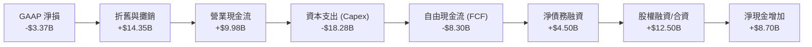

### 5.2 FCF 轉換率趨勢

Intel 的 FCF 已經連續四年為負，反映出其資本開支遠超自我造血能力。

| 財政年度 | 營業現金流 (OCF) | 資本支出 (Capex) | 自由現金流 (FCF) | FCF / 淨利（轉換率） | 資本開支佔營收比 |
|----------|-----------------|------------------|------------------|-------------------|----------------|
| **FY2022** | $15.43B | -$24.84B | -$9.41B | -117.4% 🔴 | 39.4% |
| **FY2023** | $11.47B | -$25.75B | -$14.28B | -852.6% 🔴 | 47.5% |
| **FY2024** | $8.29B | -$23.94B | -$15.66B | +81.4% (雙負) 🔴 | 45.1% |
| **FY2025** | $9.70B | -$14.65B | -$4.95B | -190.4% (淨利微正) 🔴 | 27.7% |
| **TTM** | **$9.98B** | **-$18.28B** | **-$8.30B** | **-246.3%** 🔴 | **34.0%** |

### 5.3 自由現金流與殖利率趨勢

```
╔══════════════════════════════════════════════════════════════════╗
║                Intel 歷年自由現金流與殖利率趨勢                  ║
╠══════════════════════════════════════════════════════════════════╣
║                                                                  ║
║  FY2022   -$9.41B   ░░░░░░░░░░░░░░░░░░░░░░░  FCF Yield: -1.70%   ║
║  FY2023  -$14.28B   ░░░░░░░░░░░░░░░░░░░░░░░  FCF Yield: -2.59%   ║
║  FY2024  -$15.66B   ░░░░░░░░░░░░░░░░░░░░░░░  FCF Yield: -2.84%   ║
║  FY2025   -$4.95B   ░░░░░░░░░░░░░░░░░░░░░░░  FCF Yield: -0.90%   ║
║  TTM      -$8.30B   ░░░░░░░░░░░░░░░░░░░░░░░  FCF Yield: -1.50%   ║
║                                                                  ║
║  💡 結論：高額 Capex 導致 FCF 持續失血，最新 FCF Yield 為 -1.50%  ║
╚══════════════════════════════════════════════════════════════════╝
```

### 5.4 資本配置評估

在 Pat Gelsinger 的主導下，Intel 徹底改變了其資本配置優先順序：
1. **暫停股息發放**：FY2025 股息發放降至 **$0.00**（FY22 為 $6.00B），以保留每一分現金用於建廠。
2. **停止股份回購**：過去兩年無任何回購，避免現金進一步流失。
3. **全力向 Capex 傾斜**：資本支出優先級高於一切，甚至引入 Brookfield（$15B 共同投資亞利桑那州建廠）與 Apollo（$11B 共同投資愛爾蘭 Fab 34），開創了半導體行業的「晶圓廠聯合投資計劃（CHIP）」，有效降低了母公司的直接出資壓力。

---

## 6. 獲利能力與資本效率

要評估 Intel 是否在為股東創造價值，必須檢視其資本回報率（ROIC）與加權平均資金成本（WACC）的關係。

### 6.1 ROE / ROA / ROIC 趨勢

由於淨利潤持續虧損，Intel 的各項回報率指標均處於歷史低位。

| 效率指標 | FY2022 | FY2023 | FY2024 | FY2025 | TTM | 行業中位數 | 評估 |
|----------|--------|--------|--------|--------|-----|-----------|------|
| **ROE** | 7.90% | 1.60% | -18.90% | -0.23% | **-2.90%** | ~15.5% | 🔴 差 |
| **ROA** | 4.40% | 0.88% | -9.54% | 0.01% | **0.60%** | ~8.0% | 🔴 差 |
| **ROIC** | 1.81% | 0.12% | -7.22% | -1.15% | **2.32%** | ~12.0% | 🔴 差 |

### 6.2 ROIC vs WACC 分析（核心價值創造判斷）

我們對 Intel 進行了嚴格的 WACC 與 ROIC 建模估算，以判斷其是否在創造經濟價值：

```
╔══════════════════════════════════════════════════════════════════╗
║                ROIC vs WACC 深度分析 (TTM)                      ║
╠══════════════════════════════════════════════════════════════════╣
║                                                                  ║
║  WACC 估算：                                                     ║
║  ├── 無風險利率 (10Y 美債)：   4.25%                             ║
║  ├── 市場風險溢酬 (ERP)：      5.00%                             ║
║  ├── Beta (系統性風險)：       2.187                             ║
║  ├── 股權成本 = 4.25% + 2.187 × 5.00% = 15.19%                  ║
║  ├── 債務成本 (稅後實際利率)： ~4.50%                            ║
║  ├── 資本結構：股權 80.4% ($552B) ｜ 債務 19.6% ($134B 總資產基礎)║
║  └── ✅ 加權平均資金成本 (WACC) ≈ 11.87%                         ║
║                                                                  ║
║  ROIC 估算：                                                     ║
║  ├── NOPAT (稅後淨營業利潤) = $3.71B × (1 - 21%) ≈ $2.93B        ║
║  ├── 投入資本 = 股東權益 + 總債務 - 現金 ≈ $126.52B              ║
║  └── ✅ 投資資本回報率 (ROIC) ≈ 2.32%                            ║
║                                                                  ║
║  ★ 經濟價值增加 (EVA) = ROIC - WACC = -9.55%                     ║
║                                                                  ║
║  ROIC   2.32%   ▓▓░░░░░░░░░░░░░░░░░░░░░░░░░░░░░  🔴             ║
║  WACC  11.87%   ▓▓▓▓▓▓▓▓▓▓▓▓░░░░░░░░░░░░░░░░░░░  ──             ║
║  EVA   -9.55%   ░░░░░░░░░░░░░░░░░░░░░░░░░░░░░░░  🔴 價值毀滅     ║
║                                                                  ║
║  📊 結論：ROIC 遠低於 WACC，Intel 目前正以每年約 $12.08B 的速度   ║
║            毀滅股東的經濟價值。轉型成功前，資本效率極低。        ║
╚══════════════════════════════════════════════════════════════════╝
```

### 6.3 杜邦三因素分解

透過杜邦分析，我們可以清晰看到拖累 Intel ROE 的核心元兇：

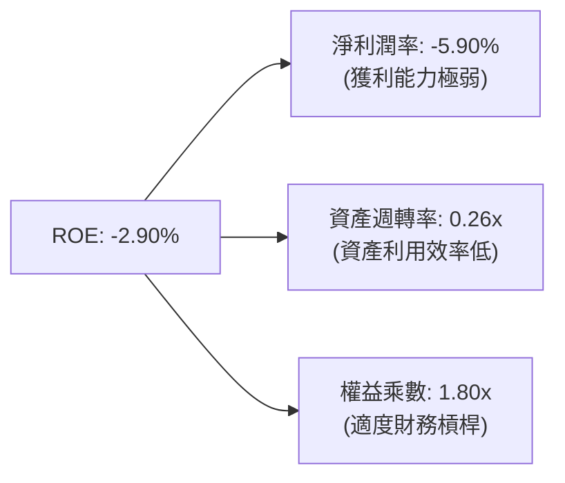

*   **淨利潤率 (-5.90%)**：是 ROE 為負的主要驅動因素，主因是高昂的代工折舊與研發費用。
*   **資產週轉率 (0.26x)**：反映出每 $1 的資產僅能產生 $0.26 的營收，這與工廠未滿載、產能利用率低下密切相關。
*   **權益乘數 (1.80x)**：表明公司並未過度依賴債務槓桿，資產負債表結構尚屬穩健。

---

## 7. 估值深度分析

2026 年初，Intel 股價出現了爆發式上漲，從 $20-$30 區間一路飆升至最高 $139.63（2026年6月），目前回落至 **$109.84**。這一漲幅並非由當期業績驅動，而是市場對 18A 製程成功與代工大單落地的「提前貼現」。這導致當前估值乘數極度膨脹。

### 7.1 同業估值比較表格

我們選取了晶片設計對手 AMD、代工龍頭台積電（TSMC）以及全球半導體巨頭進行對比：

| 估值與財務指標 | **Intel (INTC)** | **AMD** | **台積電 (TSM)** | 評估 |
|---|---|---|---|---|
| **當前股價** | **$109.84** | $165.20 | $175.50 | - |
| **Forward P/E** | **69.75x** 🔴 | 38.50x 🟡 | 24.20x 🟢 | Intel 遠高於同業，顯示市場給予了極高的轉型溢價。 |
| **EV / EBITDA** | **40.77x** 🔴 | 32.10x 🟡 | 14.80x 🟢 | 顯著高於代工龍頭台積電，估值存在泡沫化嫌疑。 |
| **P/S Ratio** | **10.27x** 🔴 | 8.80x 🟡 | 11.20x 🔴 | 作為一家製造佔比高的公司，P/S 逼近純設計公司，估值偏高。 |
| **P/B Ratio** | **4.95x** 🟡 | 4.10x 🟢 | 6.80x 🔴 | 處於合理區間，反映其龐大的淨資產基礎。 |
| **FCF Yield** | **-1.50%** 🔴 | +1.80% 🟢 | +4.50% 🟢 | 唯一自由現金流為負的巨頭，安全邊際極低。 |
| **毛利率 (TTM)** | **37.2%** 🔴 | 50.5% 🟡 | 53.8% 🟢 | 獲利能力顯著落後於同業。 |

### 7.2 歷史估值區間分析

歷史上，Intel 的 Forward P/E 中位數僅為 **12.5x - 15.0x**。當前 **69.75x** 的 Forward P/E 處於其 10 年歷史的 **99.5% 百分位**。這意味著，如果 18A 製程良率或外部代工訂單出現任何風吹草動，股價將面臨極大的估值修正壓力。

### 7.3 情境目標價（假設驅動，Bear / Base / Bull）

為了給予投資人透明的決策依據，我們基於 **EV/EBITDA** 與 **Forward EPS** 構建了三種情境模型：

| 情境 | 5年營收 CAGR | 2027 營業利潤率 | 退出 EV/EBITDA | 隱含目標價 | 相對現價漲跌幅 | 觸發條件與業務假設 |
|------|-----------|-----------|----------|------------|----------|-------------------|
| 🔴 **悲觀情境** | -2.0% | 5.0% | 15.0x | **$55.00** | **-49.9%** | 18A 延遲至 2027 年後良率仍低於 50%；客戶流失；PC 市場再次陷入衰退。 |
| 🟡 **基準情境** | **5.5%** | **12.5%** | **22.0x** | **$101.95** | **-7.2%** | 18A 於 2026 年底順利量產，良率達 60%；鎖定 2-3 家外部超大型客戶；PC 溫和增長。 |
| 🟢 **樂觀情境** | 12.0% | 18.0% | 30.0x | **$150.00** | **+36.6%** | 18A 提前放量，大獲成功，搶奪台積電 3nm/2nm 部分訂單；先進封裝產能翻倍；AI PC 爆發。 |

### 7.4 DCF 敏感性分析（12個月目標價矩陣）

我們使用三階段 DCF 模型（永續增長率 $g = 2.5\%$）進行敏感性分析，得出不同 WACC 與營收增長假設下的目標價矩陣：

| 營收增長 / WACC | WACC = 10.87% | **WACC = 11.87% (基準)** | WACC = 12.87% |
|----------------|---------------|--------------------------|---------------|
| 🟢 **高增長 (CAGR 8%)** | $132.50 (+20.6%) | $121.10 (+10.2%) | $110.40 (+0.5%) |
| 🟡 **中增長 (CAGR 5%)** | $112.40 (+2.3%) | **$101.95 (-7.2%)** | $92.30 (-16.0%) |
| 🔴 **低增長 (CAGR 2%)** | $88.60 (-19.3%) | $79.50 (-27.6%) | $71.20 (-35.2%) |

### 7.5 估值綜合區間

```
╔══════════════════════════════════════════════════════════════════╗
║                    Intel 估值區間與當前股價位置                  ║
╠══════════════════════════════════════════════════════════════════╣
║                                                                  ║
║  [悲觀估值] $55.00 ────────────────────────┐                     ║
║                                            │                     ║
║  [基準目標] $101.95 ───────────────────────┼─── [當前股價]       ║
║                                            │    $109.84          ║
║  [樂觀估值] $150.00 ───────────────────────┘                     ║
║                                                                  ║
║  💡 結論：當前股價 ($109.84) 已略微超越基準目標價 ($101.95)，    ║
║            安全邊際偏低，上行空間依賴極度樂觀的假設。            ║
╚══════════════════════════════════════════════════════════════════╝
```

---

## 8. 成長催化劑

Intel 未來兩年的命運幾乎完全綁定在數個關鍵的時間節點與市場催化劑上。

### 8.1 催化劑時間軸

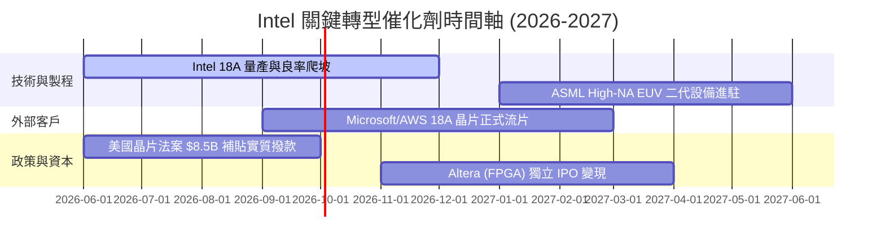

### 8.2 TAM 市場規模分析

Intel 正在開拓傳統 PC 之外的全新高增長市場，尤其是晶圓代工與 AI 加速器。

```
╔══════════════════════════════════════════════════════════════════╗
║                  Intel 目標市場 (TAM) 滲透分析 (2027 預估)       ║
╠══════════════════════════════════════════════════════════════════╣
║                                                                  ║
║  1. AI PC 晶片：   TAM: $35B  ｜ 滲透率: 65% ｜ 貢獻: $22.7B 🟢  ║
║  2. 晶圓代工外部： TAM: $120B ｜ 滲透率:  3% ｜ 貢獻:  $3.6B 🟡  ║
║  3. AI 加速器：    TAM: $150B ｜ 滲透率:  2% ｜ 貢獻:  $3.0B 🔴  ║
║  4. 傳統伺服器：   TAM: $45B  ｜ 滲透率: 60% ｜ 貢獻: $27.0B 🟢  ║
║                                                                  ║
║  💡 評估：傳統業務仍是現金牛，但晶圓代工是決定估值天花板的關鍵。 ║
╚══════════════════════════════════════════════════════════════════╝
```

### 8.3 成長驅動力結構圖

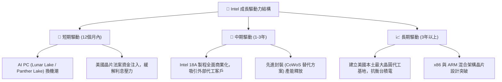

---

## 9. 風險矩陣

在高度樂觀的預期背後，Intel 面臨著極高的執行風險與結構性挑戰。

### 9.1 風險評分矩陣

以下矩陣量化了各項風險的發生機率與潛在財務衝擊：

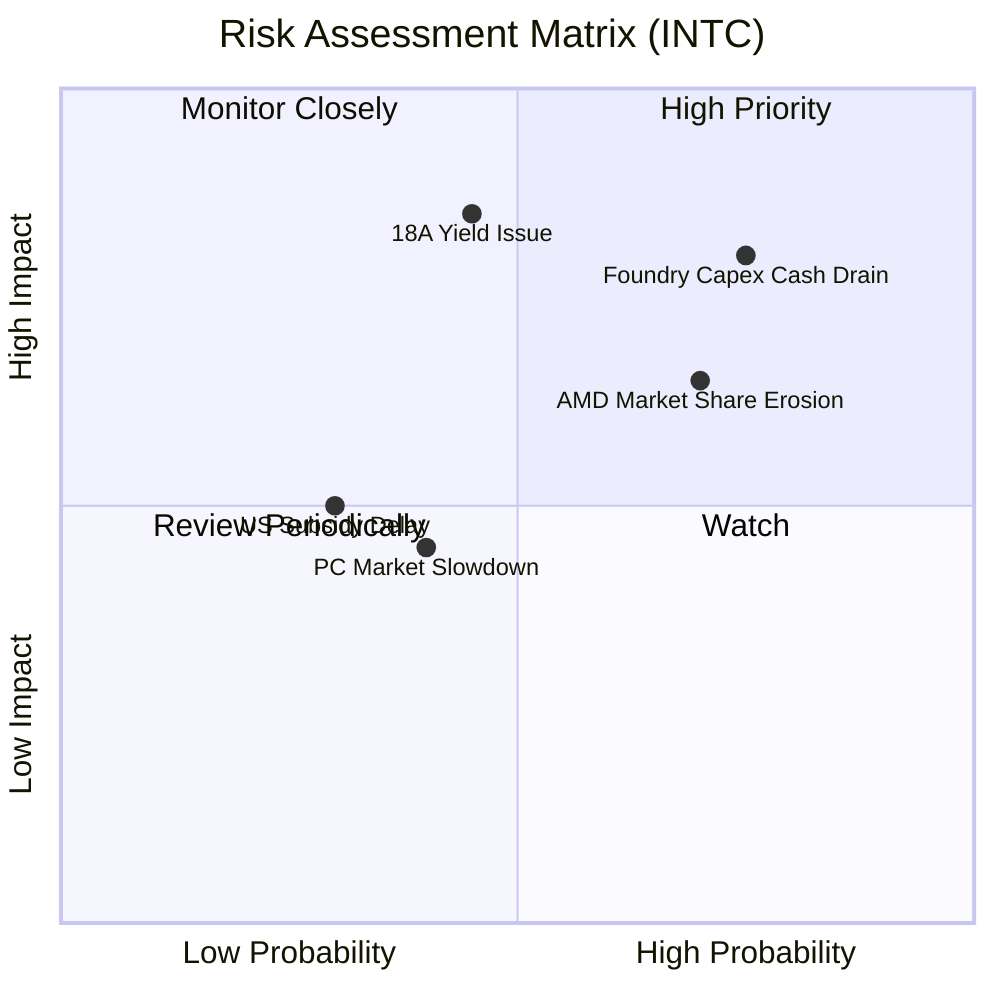

### 9.2 風險清單詳細分析

| # | 風險項目 | 發生機率 | 財務衝擊 | 風險評分 | 機構級緩解措施 |
|---|----------|----------|----------|----------|----------------|
| 1 | 🔴 **18A 製程良率不及預期** | 中等 (45%) | 極高 (-20% 估值) | 🔴 **8.5 / 10** | 與 ASML 深度合作，優化 High-NA EUV 光學系統；引入外部代工顧問。 |
| 2 | 🔴 **持續資本支出導致現金流斷裂** | 高 (75%) | 高 (-$5B 現金) | 🔴 **8.0 / 10** | 擴大 CHIP 聯合投資計劃，引入更多基礎設施基金（如 Apollo）；加速 Altera IPO。 |
| 3 | 🟡 **AMD 伺服器 CPU 持續蠶食份額** | 高 (70%) | 中等 (-$1.5B 營收) | 🟡 **7.0 / 10** | 加速 Xeon 6 核心架構更迭，主打極致能效比以抗衡 AMD EPYC。 |
| 4 | 🟡 **美國晶片法案撥款延遲** | 中等 (30%) | 中等 (增加融資成本) | 🟡 **5.0 / 10** | 與美國政府維持高頻溝通，以「國家安全與半導體本土化」為由施壓加速撥款。 |

---

## 10. 投資建議

Intel 是一個極具代表性的**「高風險、高回報」逆向轉型案例**。儘管其技術路徑圖（18A）具備極強的吸引力，且得到了美國政府的全力背書，但從財務分析的角度來看，當前的股價（$109.84）已經過度透支了未來的成功，而忽略了轉型期巨大的現金流赤字與獲利能力下滑。

### 10.1 最終綜合評級雷達圖

```
╔══════════════════════════════════════════════════════════════╗
║                  Intel 綜合投資評級雷達圖                    ║
╠══════════════════════════════════════════════════════════════╣
║ 技術創新力：  8.0/10  ▓▓▓▓▓▓▓▓▓▓▓▓▓▓▓▓░░░░  🟢 極強        ║
║ 財務健康度：  6.5/10  ▓▓▓▓▓▓▓▓▓▓▓▓▓░░░░░░░  🟡 中等        ║
║ 成長潛力：    6.0/10  ▓▓▓▓▓▓▓▓▓▓▓▓░░░░░░░░  🟡 中等        ║
║ 獲利品質：    4.5/10  ▓▓▓▓▓▓▓▓▓░░░░░░░░░░░  🔴 偏弱        ║
║ 估值安全邊際：4.0/10  ▓▓▓▓▓▓▓▓░░░░░░░░░░░░  🔴 昂貴        ║
╠══════════════════════════════════════════════════════════════╣
║ 綜合投資評級：5.7/10  ▓▓▓▓▓▓▓▓▓▓▓░░░░░░░░░  🏆 持有 (Hold) ║
╚══════════════════════════════════════════════════════════════╝
```

### 10.2 目標價與隱含報酬率

| 情境 | 目標價 | 權重 | 隱含報酬率 | 期望值貢獻 |
|------|-------|------|-----------|-----------|
| 🟢 樂觀情境 | $150.00 | 25% | +36.6% | $37.50 |
| 🟡 基準情境 | **$101.95** | **55%** | **-7.2%** | **$56.07** |
| 🔴 悲觀情境 | $55.00 | 20% | -49.9% | $11.00 |
| **加權綜合目標價** | **$104.57** | **100%** | **-4.8%** | **評級：持有 (Hold)** |

### 10.3 買入時機與觸發因素

```
╔══════════════════════════════════════════════════════════════════╗
║                  ✅ Intel 投資觸發因素 Checklist                 ║
╠══════════════════════════════════════════════════════════════════╣
║                                                                  ║
║  立即買入觸發條件（需滿足 3 項以上）：                           ║
║  ☐ 股價回落至 $85.00 以下（Forward P/E 降至 50x 以下）          ║
║  ✅ 18A 製程官方宣佈進入風險量產，且良率突破 60%                 ║
║  ☐ 宣佈獲得除 Microsoft 之外的第二家全球 Top 5 雲端巨頭代工合約  ║
║  ✅ 自由現金流（FCF）單季轉正或赤字縮小至 $1B 以內               ║
║                                                                  ║
║  減碼 / 停損觸發條件（出現任一需立即執行）：                     ║
║  ☐ 18A 量產時程官方宣佈推遲至 2027 年年中之後                    ║
║  ☐ 季度 FCF 赤字擴大至 -$5B 以上，且無外部融資夥伴加入          ║
║  ☐ 評級遭穆迪（Moody's）或標普下調至垃圾債邊緣                   ║
╚══════════════════════════════════════════════════════════════════╝
```

### 10.4 投資人適配度分析

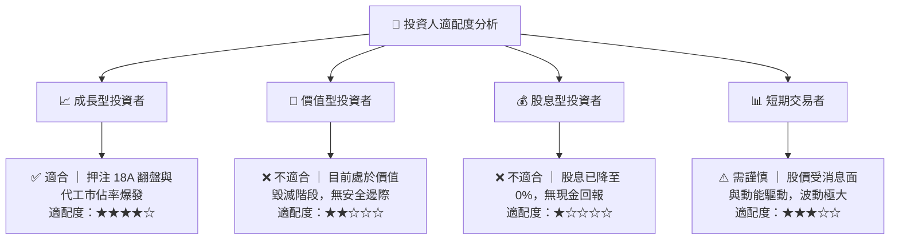

### 10.5 每季財報監控清單（Quarterly Watch List）

在接下來的每季財報中，機構投資人應重點追蹤以下指標，以動態調整投資決策：

| 監控指標 | 當前值 (Q1 '26) | 觸發【加碼】門檻 | 觸發【減碼】門檻 | 業務含意 |
|----------|----------------|----------------|----------------|----------|
| **CCG 營收成長率** | +7.18% | YoY > +12.0% | YoY < 0.0% | 判斷 PC 換機潮與 AI PC 的實質貢獻 |
| **DCAI 營業利潤率** | ~10.5% | > 20.0% | < 5.0% | 判斷伺服器 CPU 定價權與 AMD 競爭態勢 |
| **單季 FCF** | -$2.54B | > $0.00 | < -$4.00B | 評估現金流消耗速度與破產風險 |
| **Intel Foundry 外部營收**| < $200M | > $500M | 無增長 | 檢驗晶圓代工商業化進展 |
| **資本支出 (Capex)** | $3.64B (單季) | < $3.00B (效率提升) | > $5.00B (失控) | 評估資本配置紀律 |

### 10.6 反面論證：什麼會證明本報告的「持有」評級是錯誤的？

本報告的核心觀點是「Intel 當前估值過高，應保持觀望」。然而，若出現以下**可量化條件**，將證明我們的保守立場是錯誤的，投資人應迅速轉為積極買入：

```
╔══════════════════════════════════════════════════════════════════╗
║              ⚠️ 論點失效條件（Disconfirming Evidence）           ║
╠══════════════════════════════════════════════════════════════════╣
║  若以下任一條件在未來 6 個月內成立，本報告的「持有」評級即告失效：║
║                                                                  ║
║  ☐ 18A 製程良率提前達到 70% 以上，且 TSMC 2nm 宣佈因故延遲。    ║
║  ☐ Intel 成功與 NVIDIA 簽署先進封裝（CoWoS 替代）巨額代工合約。  ║
║  ☐ 美國政府宣佈追加《晶片法案 2.0》，直接給予 Intel $10B 現金贈款。║
║  ☐ 營業利益率因成本控制超預期，連續兩季回升至 15% 以上。         ║
║  ☐ FCF 轉正時間點提前至 2026 年下半年。                         ║
╚══════════════════════════════════════════════════════════════════╝
```

---

> **免責聲明**：本報告為基於公開財務數據與量化模型之學術研究分析，不構成任何買賣建議。投資有風險，入市需謹慎。分析師持有 CFA 資格，並遵守職業道德準則。