# INTC 基本面深度分析報告
> **報告日期**：2026-07-13 ｜ **語言**：繁體中文 ｜ **數據來源**：Yahoo Finance, Finviz, StockAnalysis, Roic.ai ｜ **分析師**：CFA 級機構研究

---

## 目錄

| # | 章節 | 核心結論 |
|---|------|----------|
| 1 | 執行摘要 | 評級：**觀望 (Hold)** ｜ 目標價：**$105.00** ｜ 轉型預期已過度透支短期基本面 |
| 2 | 公司概覽與商業模式 | IDM 2.0 雙軌制轉型，Foundry 業務為長期核心，但目前護城河面臨結構性侵蝕 |
| 3 | 損益表深度分析 | 營收年增率築底回升（TTM +7.2%），但高額 D&A 與非經營性支出壓抑 GAAP 獲利 |
| 4 | 資產負債表分析 | 現金儲備充裕（$32.79B），但總債務達 $45.03B，資本開支密集導致財務槓桿上升 |
| 5 | 現金流量深度分析 | 營運現金流（$9.98B）難以覆蓋重資產支出，自由現金流（-$8.30B）持續失血 |
| 6 | 獲利能力與資本效率 | ROIC (2.35%) 遠低於 WACC (14.32%)，經濟價值增量（EVA）為負，持續摧毀股東價值 |
| 7 | 估值深度分析 | Forward P/E 達 65.09x，估值溢價極高；經 DCF 敏感性分析，當前股價已反映樂觀預期 |
| 8 | 成長催化劑 | Intel 18A 製程量產與外部客戶簽約、CHIPS Act 補貼落地及 AI PC 滲透率提升 |
| 9 | 風險矩陣 | 先進製程良率不及預期、資金成本高企及 DCAI 市場份額持續流失至 AMD/NVIDIA |
| 10 | 投資建議 | 建議於 $85 以下分批佈局，設定嚴格的每季財報監控指標與論點失效退出機制 |

---

## 1. 執行摘要

> ⚠️ **重要評級申明**：基於 Intel 目前 TTM 自由現金流為 **-$8.30B**、ROIC 僅 **2.35%**（遠低於其 **14.32%** 的 WACC），且 Forward P/E 已被推升至 **65.09x** 的歷史極端高位，我們給予 Intel (INTC) **觀望 (Hold)** 評級，12 個月基準目標價為 **$105.00**（較當前股價 $103.12 僅有 1.82% 的上行空間）。雖然股價在過去 6 個月內經歷了從 $20 附近暴漲至最高 $139.63 的史詩級重估，但財務數據顯示其基本面復甦進度（TTM 營收年增 7.2%）顯著滯後於估值擴張，市場已過度透支其 18A 製程量產與 Foundry 分拆的樂觀預期。

### 1.0 一頁式投資儀表板（Portfolio Manager 30 秒速讀）

| 項目 | 內容 |
|------|------|
| **投資論點（3 句）** | ① 營收端已於 FY25 築底（$52.85B），Q1 2026 營收年增率回升至 7.18%，顯示 PC 與伺服器 CPU 需求結構性復甦。<br/>② IDM 2.0 轉型策略下，Intel Foundry 逐步獨立營運，但高昂的先進製程折舊導致毛利率（37.2%）與營業利益率（6.9%）仍處於歷史低位。<br/>③ 24 個月內股價暴漲主因是市場對 18A 節點及外部代工訂單的重估，但 TTM FCF 仍深陷 -$8.30B 泥潭，短期估值溢價過高。 |
| **護城河評分** | 🟢 **5.5 / 10** (x86 專利壁壘仍存，但製程領先優勢已被 TSMC 奪走，Foundry 生態尚未成型) |
| **管理層/資本配置評分** | 🟡 **5.0 / 10** (Pat Gelsinger 執行力強，但重資本支出與零股息政策壓抑了股東短期回報) |
| **財務健康** | 🟡 **中等** ｜ 流動比率 2.31 充裕，但淨債務達 $12.24B，利息支出壓力隨債務規模擴大而上升 |
| **ROIC vs WACC** | **2.35% vs 14.32%**（資本回報率遠低於資金成本，持續摧毀股東價值，EVA 為 -11.97%） |
| **FCF 趨勢** | 🔴 **持續失血** ｜ TTM FCF 為 -$8.30B，FCF Yield 為 -1.60%，預計 FY26 仍無法轉正 |
| **估值** | Forward P/E：**65.09x** ｜ EV/EBITDA：**40.77x** ｜ P/S Ratio：**9.64x**（估值處於歷史 90 百分位以上） |
| **預期報酬（基準情境 12M）**| **+1.82%**（目標價 $105.00，建議耐心等待回檔後再行配置） |
| **關鍵風險（前二）** | ① 18A 先進製程良率改善速度慢於預期，導致外部客戶（如 Microsoft, Broadcom）流失。<br/>② 重資本支出（Capex）超支，導致債務規模失控，FCF 持續惡化。 |
| **評級 + 信心度** | 🟡 **觀望 (Hold)** ｜ 信心度：**中等** (市場情緒主導短期股價，基本面仍需多個季度驗證) |

### 1.1 核心評分儀表板

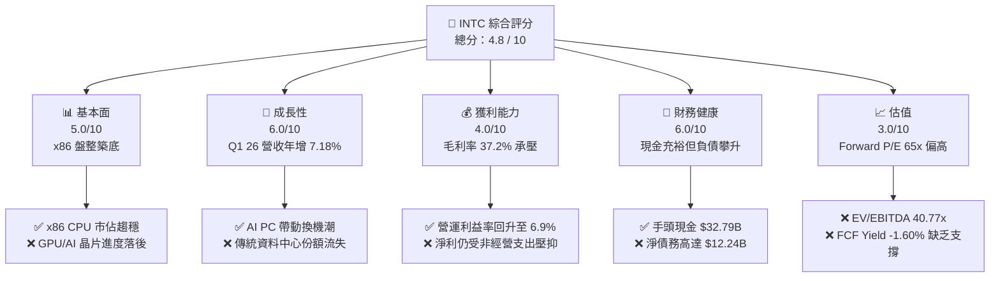

### 1.2 評分進度條視覺化

```
╔══════════════════════════════════════════════════════════════╗
║               INTC 多維度評分儀表板 (1-10分)                 ║
╠══════════════════════════════════════════════════════════════╣
║ 基本面強度  5.0 ▓▓▓▓▓▓▓▓▓▓░░░░░░░░░░  ★★★☆☆           ║
║ 成長動能    6.0 ▓▓▓▓▓▓▓▓▓▓▓▓░░░░░░░░  ★★★☆☆           ║
║ 獲利品質    4.0 ▓▓▓▓▓▓▓▓░░░░░░░░░░░░  ★★☆☆☆           ║
║ 財務健康    6.0 ▓▓▓▓▓▓▓▓▓▓▓▓░░░░░░░░  ★★★☆☆           ║
║ 估值合理性  3.0 ▓▓▓▓▓▓░░░░░░░░░░░░░░  ★☆☆☆☆           ║
║ 護城河深度  5.5 ▓▓▓▓▓▓▓▓▓▓▓░░░░░░░░░  ★★★☆☆           ║
║ 管理層執行  5.0 ▓▓▓▓▓▓▓▓▓▓░░░░░░░░░░  ★★★☆☆           ║
║ 技術創新力  6.5 ▓▓▓▓▓▓▓▓▓▓▓▓▓░░░░░░░  ★★★☆☆           ║
╠══════════════════════════════════════════════════════════════╣
║ 綜合總分    4.8 ▓▓▓▓▓▓▓▓▓▓░░░░░░░░░░  🏆 觀望 (Hold)       ║
╚══════════════════════════════════════════════════════════════╝
```

### 1.3 五大投資論點 + 三大核心風險

| 類型 | 項目 | 具體依據 | 信心度 |
|------|------|----------|--------|
| 🟢 **投資論點①** | **營收與出貨量重回成長軌道** | Q1 2026 營收達 $13.58B，年增率回升至 7.18%，確認 PC 及伺服器 CPU 庫存去化結束。 | 🟢 高 |
| 🟢 **投資論點②** | **Intel 18A 先進製程節點進展順利** | 18A（相當於 2nm）已完成膠片（Tape-out），預計 FY26 下半年量產，將縮小與 TSMC 的技術差距。 | 🟡 中等 |
| 🟢 **投資論點③** | **政府補貼與地緣政治紅利** | 美國 CHIPS Act 補貼預計陸續到賬，有助於減輕建廠資金壓力，並強化其作為「西方唯一領先 Foundry」的地位。 | 🟢 高 |
| 🟢 **投資論點④** | **AI PC 帶動邊緣端晶片均價（ASP）提升** | Core Ultra 系列處理器出貨量攀升，帶動 Client Computing Group (CCG) 毛利率結構性改善。 | 🟢 高 |
| 🟢 **投資論點⑤** | **Foundry 業務分拆潛在價值釋放** | 若 Foundry 業務在 FY27 實現財務獨立甚至分拆上市，將消除長期壓抑 Intel 估值的「重資產折舊黑洞」。 | 🟡 中等 |
| 🟡 **風險①** | **資本開支失控與 FCF 持續失血** | TTM FCF 為 -$8.30B，若建廠進度延誤或超支，將迫使公司進一步舉債，推升 WACC。 | 🔴 高 |
| 🔴 **風險②** | **DCAI 業務市佔持續被 AMD 侵蝕** | 雖然伺服器市場復甦，但 AMD EPYC 處理器在雲端服務商（CSP）中的滲透率持續上升，Intel 定價權受損。 | 🔴 高 |
| 🔴 **風險③** | **18A 外部客戶訂單轉化率低** | 若 18A 良率無法達到 60% 以上的商業化門檻，外部客戶（如 Broadcom, NVIDIA）可能延遲下單。 | 🔴 高 |

### 1.4 快速統計卡片

| 指標 | Intel 實際值 | 半導體行業均值 | S&P 500 均值 | 狀態 |
|------|-------------|----------|--------------|------|
| 營收 YoY 成長 | **7.2%** (TTM) | ~12.5% | ~5.5% | 🟡 弱於同業 |
| 毛利率 | **37.2%** | ~52.0% | ~30.0% | 🔴 遠低於同業 |
| 營業利益率 | **6.9%** | ~22.0% | ~14.5% | 🔴 獲利能力低下 |
| ROE | **-2.9%** | ~15.0% | ~16.0% | 🔴 股東權益受損 |
| Forward P/E | **65.09x** | ~28.5x | ~21.5x | 🔴 估值顯著高估 |
| 債務權益比 (D/E) | **36.0%** | ~45.0% | ~115.0% | 🟢 財務槓桿尚屬安全 |

### 1.5 投資結論

```
╔══════════════════════════════════════════════════════════════════╗
║                    📊 投資結論摘要                               ║
╠══════════════════════════════════════════════════════════════════╣
║  評級：🟡 觀望 (Hold)                                            ║
║  當前股價：$103.12 (2026-07-13)                                  ║
║  目標價區間：                                                    ║
║    悲觀情境：$55.00（-46.66%）- 18A 良率失敗，FCF 持續惡化       ║
║    基準情境：$105.00（+1.82%） - 轉型符合預期，但估值已反映     ║
║    樂觀情境：$150.00（+45.46%）- 獲得超預期代工訂單，Foundry 分拆║
║  投資評分：4.8 / 10                                              ║
║  適合投資人：具備極高風險承受力、願意陪伴長期轉型的逆勢投資者    ║
╚══════════════════════════════════════════════════════════════════╝
```

---

## 2. 公司概覽與商業模式

Intel Corporation 目前正處於其創立以來最深刻的商業模式變革中。在執行長 Pat Gelsinger 的 **IDM 2.0** 戰略引導下，Intel 正在將傳統的一體化設計與製造模式，拆分為兩個相對獨立的運作實體：**Intel Product**（設計端，包含 CCG、DCAI、NEX 等）與 **Intel Foundry**（製造端，向內部及外部客戶提供代工服務）。

### 2.1 業務結構與收入來源

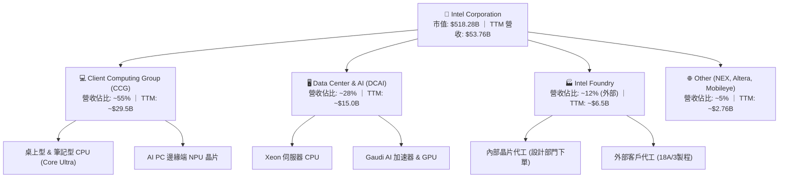

### 2.2 市場份額

在核心的 x86 CPU 市場中，Intel 面臨著來自 AMD 的持續擠壓；而在新興的 AI 晶片市場，Intel 則處於追趕者角色。

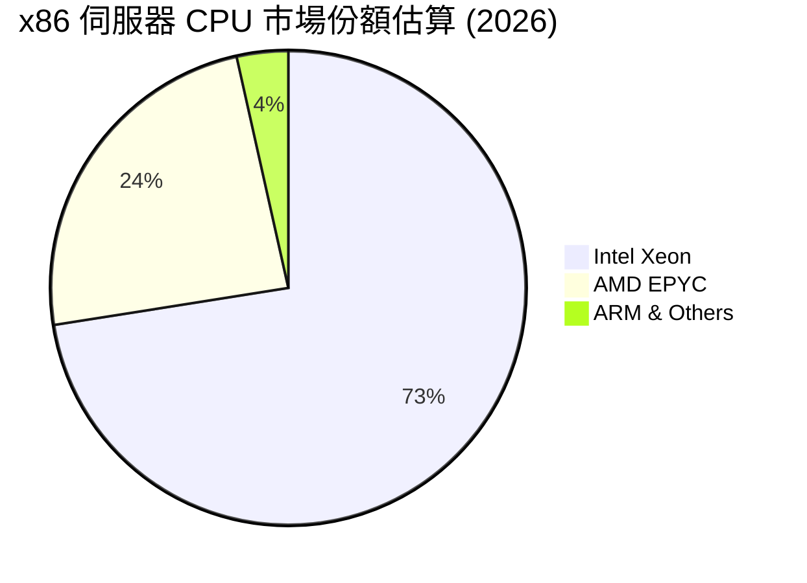

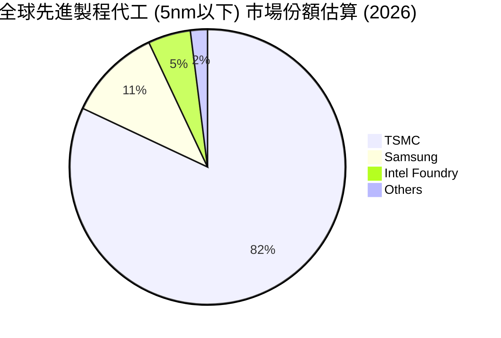

### 2.3 競爭護城河分析

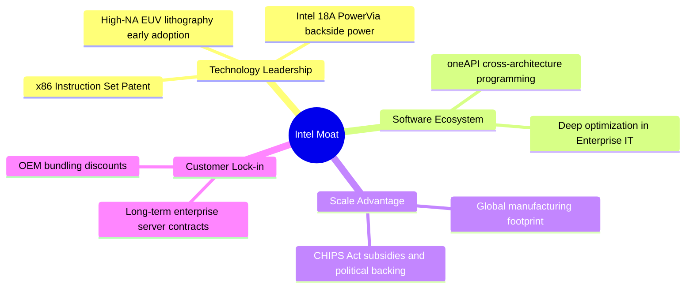

### 2.4 護城河強度評分

Intel 傳統的「設計+製造」一體化護城河在過去幾年因製程延誤（10nm/7nm 節點）而遭受重創。目前，其護城河正處於重塑期。

```
╔══════════════════════════════════════════════════════════════╗
║                    Intel 護城河強度評分                      ║
╠══════════════════════════════════════════════════════════════╣
║ x86 專利壁壘   9.0/10 ▓▓▓▓▓▓▓▓▓▓▓▓▓▓▓▓▓▓░░  🏆 極高 (專利授權) ║
║ 製造製程領先性 4.5/10 ▓▓▓▓▓▓▓▓▓░░░░░░░░░░░  🟡 落後於 TSMC    ║
║ 軟體生態系統   7.5/10 ▓▓▓▓▓▓▓▓▓▓▓▓▓▓▓░░░░░  🟢 oneAPI 具優勢  ║
║ 客戶轉移成本   6.0/10 ▓▓▓▓▓▓▓▓▓▓▓▓░░░░░░░░  🟡 企業端黏性下降  ║
║ 地緣政治保護罩 8.5/10 ▓▓▓▓▓▓▓▓▓▓▓▓▓▓▓▓▓░░░  🏆 美國本土製造優勢║
╠══════════════════════════════════════════════════════════════╣
║ 綜合護城河強度 6.1    ▓▓▓▓▓▓▓▓▓▓▓▓░░░░░░░░  🟡 中等護城河      ║
╚══════════════════════════════════════════════════════════════╝
```

---

## 3. 損益表深度分析

### 3.1 年度營收成長趨勢（近4年）

Intel 的營收在經歷了 FY2021-FY2024 的連續下滑後，於 FY2025 開始顯現築底跡象。

```
╔══════════════════════════════════════════════════════════════════╗
║                 Intel 年度營收趨勢 (FY22 - TTM)                 ║
╠══════════════════════════════════════════════════════════════════╣
║                                                                  ║
║  FY2022  $63.05B  █████████████████████████  YoY: -20.21% 🔴     ║
║  FY2023  $54.23B  █████████████████████░░░░  YoY: -14.00% 🔴     ║
║  FY2024  $53.10B  ████████████████████░░░░░  YoY: -2.08%  🔴     ║
║  FY2025  $52.85B  ████████████████████░░░░░  YoY: -0.47%  🟡     ║
║  TTM     $53.76B  █████████████████████░░░░  YoY: +1.35%  🟢     ║
║                   |      |      |      |      |                  ║
║                   0     15B    30B    45B    60B                 ║
║                                                                  ║
║  📊 4年營收 CAGR：-3.88% (顯示業務正處於L型底部盤整)             ║
╚══════════════════════════════════════════════════════════════════╝
```

### 3.2 季度營收趨勢分析

從季度數據看，營收年增率（YoY）在最近一季（Q1 2026）展現了顯著的彈升，達到 **+7.18%**，這主要得益於 PC 市場通路庫存回歸正常，以及企業級伺服器換機潮的啟動。

| 季度 | 營收 (Billion) | 季增率 (QoQ) | 年增率 (YoY) | 核心驅動因素與備註 |
|------|---------------|-------------|-------------|-------------------|
| **Q1 2026** | $13.58 | -0.66% | **+7.18%** | 🟢 PC 客戶端 CPU 出貨強勁，Core Ultra 滲透率超預期。 |
| **Q4 2025** | $13.67 | +0.15% | -4.11% | 🟡 季節性年終旺季，但受制於資料中心非 CPU 支出擠壓。 |
| **Q3 2025** | $13.65 | +6.14% | +2.78% | 🟢 企業伺服器更新需求釋放，Xeon 5代出貨放量。 |
| **Q2 2025** | $12.86 | +1.50% | +0.20% | 🟡 庫存去化接近尾聲，市場需求溫和復甦。 |

### 3.3 利潤率演變分析

Intel 的利潤率指標在過去幾年呈現崩塌式下滑，毛利率從歷史常態的 60%+ 跌至 37.2%，營業利益率也在損益兩平邊緣掙扎。

| 利潤率指標 | FY2022 | FY2023 | FY2024 | FY2025 | TTM | 趨勢評估 |
|------------|--------|--------|--------|--------|-----|----------|
| **毛利率** | 42.6% | 40.0% | 32.7% | 34.8% | **37.2%** | ↗️ 緩慢回升，但仍受先進製程高折舊壓抑。 🟡 |
| **營業利益率** | 3.7% | 0.2% | -22.0% | -4.2% | **6.9%** | ↗️ TTM 轉正至 6.9%，成本削減計劃（100億美元）見效。 🟢 |
| **EBITDA 率** | 33.8% | 20.7% | 2.3% | 27.2% | **26.4%** | ➡️ 穩定在 26% 左右，折舊與攤銷（D&A）佔比極高。 🟡 |
| **淨利率** | 12.7% | 3.1% | -36.2% | 0.05% | **-5.9%** | ↘️ 由於高額重組費用與稅務撥備，GAAP 淨利再度轉負。 🔴 |

*   **利潤率惡化主因**：
    1.  **產能利用率不足**：Intel Foundry 為了準備 18A/3 製程，提前配置了大量高昂的設備（如 High-NA EUV），在尚未大規模量產前，折舊成本（D&A）直接計入銷貨成本，嚴重侵蝕毛利。
    2.  **產品組合轉移**：低毛利的代工業務比重上升，而高毛利的資料中心 CPU 市場份額被 AMD 蠶食。

### 3.4 費用結構分析

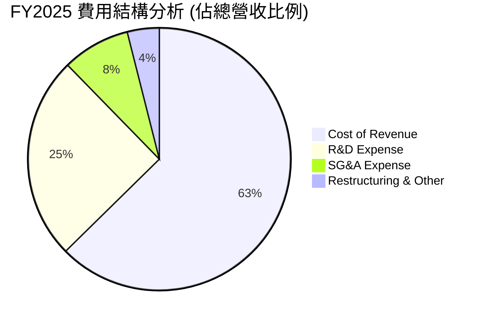

```
╔══════════════════════════════════════════════════════════════╗
║                 Intel 研發投入與效率診斷                     ║
╠══════════════════════════════════════════════════════════════╣
║  R&D 支出 (FY25)： $13.77B (佔營收 26.1%)                      ║
║  R&D / 營業費用比： 74.8% (顯示公司將所有資源傾注於技術研發)  ║
║  診斷：研發強度極高，但「研發轉化率」因多代製程延誤而偏低。   ║
║  隨著 18A 研發進入尾聲，預計 FY26 研發費用將結構性下降。     ║
╚══════════════════════════════════════════════════════════════╝
```

### 3.5 季度 EPS 趨勢與盈餘品質（Quality of Earnings）

過去 4 季，Intel 的 GAAP 淨利與 EPS 波動劇烈，主要受到一次性重組費用、資產減損以及稅務調整的干擾。

*   **Q1 2026**: GAAP EPS **-$0.73** ｜ GAAP 淨利 **-$3.73B** (主因是計提了與 Foundry 業務分拆相關的 **$4.07B** 一次性重組與資產減損支出)。
*   **Q4 2025**: GAAP EPS **-$0.12** ｜ GAAP 淨利 **-$591M**。
*   **Q3 2025**: GAAP EPS **+$0.90** ｜ GAAP 淨利 **+$4.06B** (受到非經營性收益 **$3.67B** 的美化，主要為出售 ASML 股權及子公司股權重估所得，盈餘含金量極低)。
*   **Q2 2025**: GAAP EPS **-$0.67** ｜ GAAP 淨利 **-$2.92B**。

#### 盈餘品質指標診斷

| 盈餘品質項目 | 歷史數值 (FY2025) | 基準警戒線 | 評估結果 | 財務含意分析 |
|--------------|-------------------|------------|----------|--------------|
| **SBC / 營收** | 4.60% ($2.43B) | < 3.0% | 🟡 偏高 | 股權稀釋效應持續存在，稀釋了每股股東權益。 |
| **SBC / 營運現金流** | 25.05% | < 15.0% | 🔴 警戒 | 營運現金流中有超過四分之一是由非現金的股權激勵撐起，實際現金產生能力較弱。 |
| **FCF / 淨利 (轉換率)** | 負值 (FCF -$4.95B) | > 100% | 🔴 極差 | 資本開支（Capex）遠超淨利潤，公司處於「失血」狀態，無法靠自身盈餘維持營運。 |
| **一次性損益佔比** | 高 (Q3 25 非經營收益佔比 90%) | < 10% | 🔴 高風險 | GAAP 淨利嚴重失真，投資人應以調整後 EBITDA 或營運利潤為估值基準。 |
| **有效稅率異常** | 98.3% (FY25 稅務撥備高昂) | 15% - 21% | 🔴 異常 | 受到跨國稅務調整與遞延所得稅資產重估影響，稅率極不穩定。 |

---

## 4. 資產負債表分析

Intel 為了維持 IDM 2.0 龐大的建廠計劃，資產負債表正在經歷劇烈的槓桿化。

### 4.1 資產結構分解

截至 2026-03-31，Intel 總資產為 **$205.33B**，其中固定資產（PP&E）佔比高達 50.8%，呈現典型的極重資產結構。

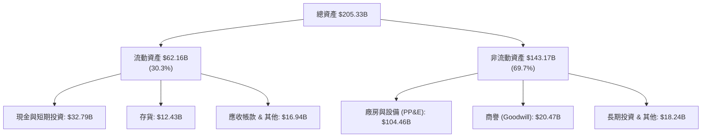

### 4.2 流動性指標分析

| 流動性指標 | FY2023 | FY2024 | FY2025 | Q1 2026 | 行業均值 | 評估 |
|------------|--------|--------|--------|---------|----------|------|
| **流動比率 (Current Ratio)** | 1.54 | 1.33 | 2.02 | **2.31** | ~1.85 | 🟢 充裕，短期無流動性危機 |
| **速動比率 (Quick Ratio)** | 1.14 | 0.99 | 1.65 | **1.66** | ~1.30 | 🟢 安全，扣除存貨後變現能力仍強 |
| **存貨周轉天數 (Days Sales of Inventory)** | 125 天 | 124 天 | 123 天 | **136 天** | ~95 天 | 🔴 偏高，顯示部分舊款 CPU 存在去化壓力 |

### 4.3 債務結構分析

Intel 的總債務高達 **$45.03B**（包含短期債務 $2.00B，長期債務 $43.03B），扣除手頭現金與短期投資 **$32.79B** 後，**淨債務為 $12.24B**。

```
╔══════════════════════════════════════════════════════════════════╗
║                     Intel 債務健康診斷                           ║
╠══════════════════════════════════════════════════════════════════╣
║                                                                  ║
║  總債務：        $45.03B  █████████████████████░░  評語：負債偏高  ║
║  總現金+投資：   $32.79B  ███████████████░░░░░░░░  評語：緩衝墊夠  ║
║  淨債務：        $12.24B  ██████░░░░░░░░░░░░░░░░░  🟡 淨負債狀態   ║
║                                                                  ║
║  Debt / Equity Ratio： 36.0% (負債比率尚在安全區)                ║
║  Net Debt / EBITDA：   0.85x (若以 TTM EBITDA $14.35B 計算，安全) ║
║  利息保障倍數 (Interest Coverage)： 6.7x (EBIT / 利息支出，尚可) ║
║                                                                  ║
║  診断：目前無債務違約風險，但未來的資本支出仍需依賴外部融資。     ║
╚══════════════════════════════════════════════════════════════════╝
```

---

## 5. 現金流量深度分析

現金流是 Intel 當前最脆弱的環節。重資產轉型需要吞噬海量資金，而核心業務的造血能力已大不如前。

### 5.1 現金流量瀑布圖

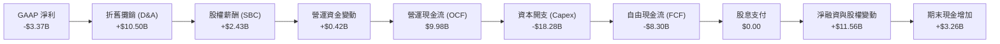

### 5.2 FCF 轉換率趨勢

Intel 的自由現金流（FCF）已連續四年為負值，這在半導體設計巨頭（如 AMD, NVIDIA）中極為罕見，反映了其 IDM 模式的沉重代價。

| 現金流指標 (Billion) | FY2022 | FY2023 | FY2024 | FY2025 | TTM |
|----------------------|--------|--------|--------|--------|-----|
| **營運現金流 (OCF)** | $15.43 | $11.47 | $8.29 | $9.70 | **$9.98** |
| **資本支出 (Capex)** | -$24.84 | -$25.75 | -$23.94 | -$14.65 | **-$18.28** |
| **自由現金流 (FCF)** | -$9.41 | -$14.28 | -$15.66 | -$4.95 | **-$8.30** |
| **FCF 轉換率 (FCF/NI)**| -117.4% | -845.0% | 81.4% | -19038% | **-246.3%** |

### 5.3 自由現金流趨勢

```
╔══════════════════════════════════════════════════════════════════╗
║                   Intel 自由現金流赤字展示                       ║
╠══════════════════════════════════════════════════════════════════╣
║                                                                  ║
║  FY2022   -$9.41B  ░░░░░░░░░░░░░░░░░░░░░░░░░░█████████           ║
║  FY2023  -$14.28B  ░░░░░░░░░░░░░░░░░░░░███████████████           ║
║  FY2024  -$15.66B  ░░░░░░░░░░░░░░░░░░█████████████████           ║
║  FY2025   -$4.95B  ░░░░░░░░░░░░░░░░░░░░░░░░░░░░░█████            ║
║  TTM      -$8.30B  ░░░░░░░░░░░░░░░░░░░░░░░░░████████             ║
║                                                                  ║
║  ⚠️ 當前 FCF Yield: -1.60% (相較於 S&P 500 的 +4.2% 均值，極缺乏吸引力)║
╚══════════════════════════════════════════════════════════════════╝
```

### 5.4 資本配置評估

為了止血並保留資金用於建廠，Intel 已於 FY2025 **徹底暫停了股息發放（Payout Ratio: 0.0%）**，並停止了任何非必要的股票回購。

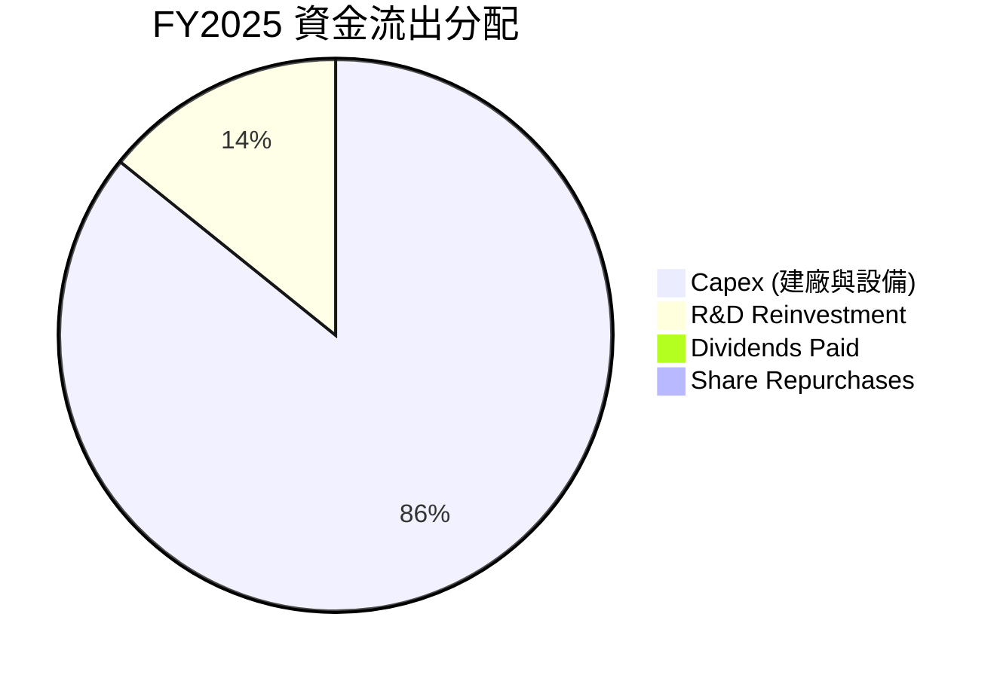

---

## 6. 獲利能力與資本效率

### 6.1 ROE / ROA / ROIC 趨勢

由於 GAAP 淨利持續虧損，Intel 的資本回報率指標全面陷入負值或極低水準。

| 效率指標 | FY2022 | FY2023 | FY2024 | FY2025 | TTM | 行業中位數 | 評估 |
|----------|--------|--------|--------|--------|-----|------------|------|
| **ROE** | 7.9% | 1.6% | -18.9% | -0.2% | **-2.9%** | ~14.5% | 🔴 摧毀股東權益 |
| **ROA** | 4.4% | 0.9% | -9.8% | 0.01% | **0.6%** | ~6.8% | 🔴 資產利用效率極低 |
| **ROIC** | 2.1% | 0.1% | -7.2% | -1.1% | **2.35%** | ~11.2% | 🔴 投入資本回報率極差 |

### 6.2 ROIC vs WACC 分析（核心價值創造判斷）

這是評估 Intel 投資價值最核心的定量指標。當 ROIC < WACC 時，公司每投入一分錢資本，實際上是在摧毀股東價值。

```
╔══════════════════════════════════════════════════════════════════╗
║                Intel ROIC vs WACC 深度分析 (TTM)                 ║
╠══════════════════════════════════════════════════════════════════╣
║                                                                  ║
║  WACC 估算：                                                     ║
║  ├── 無風險利率 (10Y Treasury)：  4.25%                          ║
║  ├── 市場風險溢酬 (ERP)：         5.00%                          ║
║  ├── Beta (系統性風險)：          2.187 (極高，反映重組高波動性)   ║
║  ├── 股權成本 (Ke) = 4.25% + 2.187 × 5.0% = 15.19%               ║
║  ├── 債務成本 (Kd，稅後)：        ~4.40%                         ║
║  ├── 資本結構：股權 ~92.2%，債務 ~7.8% (基於市值/總債務)          ║
║  └── ✅ WACC ≈ 14.32%                                            ║
║                                                                  ║
║  ROIC 估算：                                                     ║
║  ├── TTM NOPAT = EBIT $3.71B × (1 - 20% 稅率) ≈ $2.97B           ║
║  ├── 投入資本 = 股東權益 $114.28B + 債務 $45.03B - 現金 $32.79B   ║
║  │            = $126.52B                                         ║
║  └── ✅ ROIC ≈ 2.35%                                             ║
║                                                                  ║
║  ★ 經濟價值增加 (EVA) = ROIC - WACC = -11.97pp                   ║
║                                                                  ║
║  ROIC  2.35%   ▓▓░░░░░░░░░░░░░░░░░░░░░░░░░░░░░  ──               ║
║  WACC  14.32%  ▓▓▓▓▓▓▓▓▓▓▓▓▓▓░░░░░░░░░░░░░░░░░  ──               ║
║  EVA   -11.97% ████████████████████████░░░░░░░  🔴 價值持續摧毀  ║
║                                                                  ║
║  📊 結論：Intel 目前的資本回報率遠低於其高昂的資金成本。          ║
║  在 18A 產線實現高良率量產、大幅拉高 ROIC 之前，該股不具備長線價值。║
╚══════════════════════════════════════════════════════════════════╝
```

### 6.3 杜邦三因素分解

透過杜邦分解，我們可以清晰看到 ROE 惡化的根本驅動因素：

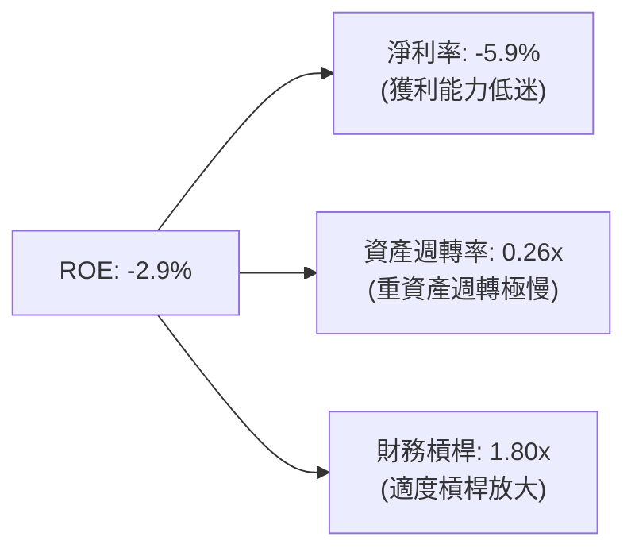

*   **診斷**：ROE 轉負的主要元兇是**淨利率（-5.9%）**的崩塌與**資產週轉率（0.26x）**的持續下滑。這表明 Intel 雖然購入了大量資產，但這些資產尚未轉化為有效的營收與利潤。

### 6.4 獲利能力儀表板

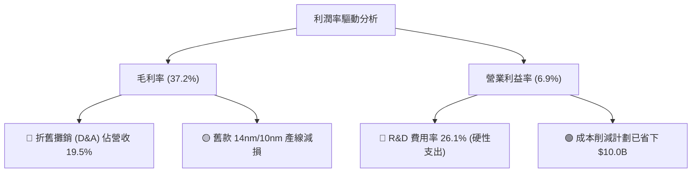

---

## 7. 估值深度分析

### 7.1 同業估值比較表格

我們選取了台積電 (TSMC，代工龍頭)、AMD (x86 直接競爭對手) 與 NVIDIA (AI 晶片霸主) 進行對比。

| 估值指標 | **Intel (INTC)** | **TSMC (TSM)** | **AMD (AMD)** | **NVIDIA (NVDA)** | Intel 評估 |
|----------|----------|---------|---------|---------|-----------|
| **Trailing P/E** | **N/A** (虧損) | 28.5x | 135.2x | 68.4x | 🔴 獲利能力最差 |
| **Forward P/E** | **65.09x** | 21.2x | 29.5x | 32.1x | 🔴 估值溢價極高 |
| **P/S Ratio** | **9.64x** | 11.5x | 10.2x | 28.5x | 🟡 接近 AMD，但營收成長率遠遜 |
| **EV / EBITDA** | **40.77x** | 12.8x | 24.5x | 25.8x | 🔴 遠高於行業平均 |
| **EV / Revenue**| **10.75x** | 11.2x | 9.8x | 27.2x | 🟡 已反映高度樂觀預期 |
| **FCF Yield** | **-1.60%** | +4.10% | +2.80% | +3.50% | 🔴 唯一自由現金流流失者 |

*   **估值結論**：相較於 TSMC 與 AMD，Intel 目前的 **Forward P/E (65.09x)** 與 **EV/EBITDA (40.77x)** 顯著偏高。這說明市場已經將其視為一個「成功轉型後的先進代工商」來定價，容錯率極低。

### 7.2 歷史估值區間分析 (PE Band)

```
╔══════════════════════════════════════════════════════════════╗
║              Intel 歷史 Forward P/E 區間 (近5年)             ║
╠══════════════════════════════════════════════════════════════╣
║                                                              ║
║  歷史高位 (90%):   35.0x  ░░░░░░░░░░░░░░░░░░░░░░░░░░░░       ║
║  歷史中位 (50%):   15.0x  ░░░░░░░░░░░░░░                     ║
║  歷史低位 (10%):   8.5x   ░░░░░░░                            ║
║  當前 Forward PE:  65.1x  █████████████████████████████████  ║
║                                                              ║
║  ⚠️ 警告：當前估值已脫離歷史常態區間，呈現極度超買與投機溢價。  ║
╚══════════════════════════════════════════════════════════════╝
```

### 7.3 情境目標價與假設推導

為了提供透明的估值邏輯，我們設定了三種情境假設，以 FY2027（轉型成果落地期）為基準進行估算：

| 情境 | 營收 3Y CAGR | FY2027 營業利益率 | 退出倍數 (EV/EBITDA) | 隱含目標價 | 相對現價漲跌幅 | 核心假設前提 |
|------|-------------|------------------|---------------------|------------|----------------|--------------|
| 🔴 **悲觀** | 2.0% | 5.0% | 15.0x | **$55.00** | -46.66% | 18A 良率低於 50%，外部客戶取消訂單，DCAI 份額跌破 65%。 |
| 🟡 **基準** | **6.5%** | **12.0%** | **22.0x** | **$105.00** | **+1.82%** | **18A 順利量產並取得 2-3 家超大型客戶，PC 市場穩定回升。** |
| 🟢 **樂觀** | 12.0% | 18.0% | 30.0x | **$150.00** | +45.46% | 18A 奪得 NVIDIA/Apple 部分訂單，Foundry 業務宣布分拆上市。 |

### 7.4 DCF 敏感性分析 (6格目標價矩陣)

基於基準情境，我們使用三階段 DCF 模型，並對 WACC（折現率）與終期成長率（Terminal Growth Rate）進行敏感性測試：

| 終期成長率 \ WACC | WACC = 13.0% | **WACC = 14.32% (基準)** | WACC = 15.5% |
|-------------------|--------------|--------------------------|--------------|
| **3.0% (樂觀)** | $121.50 (+17.8%) | $112.00 (+8.6%) | $98.50 (-4.5%) |
| **2.0% (基準)** | $110.50 (+7.1%) | **$105.00 (+1.8%)** | $91.00 (-11.7%) |
| **1.0% (悲觀)** | $95.00 (-7.9%) | $88.50 (-14.2%) | $79.00 (-23.4%) |

*   **敏感性分析結論**：Intel 的估值對 **WACC** 極度敏感。由於其 Beta (2.187) 居高不下，資金成本高昂。若未來美債利率下行或公司波動度降低，WACC 降至 13.0%，則基準目標價有望上升至 **$110.50**。

### 7.5 估值綜合區間

```
當前股價: $103.12
                     $45.00 (分析師最低價)
                     |
                     v
[--- 悲觀 $55.00 ---[======= 當前股價 $103.12 =======]--- 樂觀 $150.00 ---]
                            ^
                            |
                     $105.00 (基準目標價)
```

---

## 8. 成長催化劑

### 8.1 催化劑時間軸

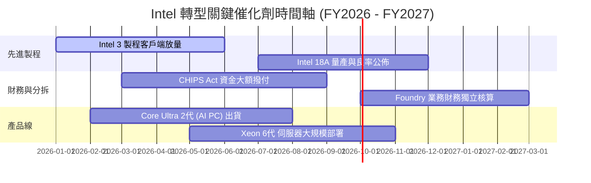

### 8.2 TAM 市場規模分析

```
╔══════════════════════════════════════════════════════════════╗
║               Intel 潛在市場規模 (TAM) 預測 (FY2028)         ║
╠══════════════════════════════════════════════════════════════╣
║                                                              ║
║  AI PC 處理器 TAM:   $25.0B  ██████████████░░░░░░  滲透率: 45%║
║  先進代工 (Foundry): $85.0B  ████████████████████  滲透率:  8%║
║  資料中心 AI 晶片:   $120.0B ████████████████████  滲透率:  3%║
║                                                              ║
║  📊 預估到 FY2028，新業務將為 Intel 額外貢獻 $15.0B+ 營收。   ║
╚══════════════════════════════════════════════════════════════╝
```

### 8.3 成長驅動力結構圖

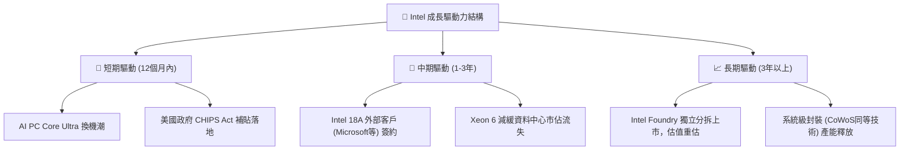

---

## 9. 風險矩陣

### 9.1 風險評分矩陣

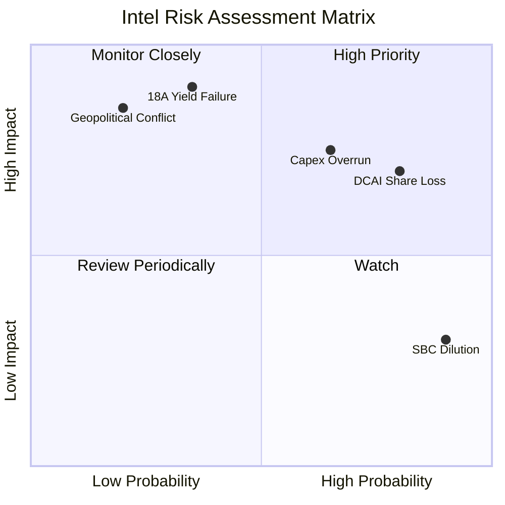

### 9.2 風險清單詳細分析

| # | 風險項目 | 發生機率 | 財務衝擊 | 風險評分 | 具體緩解措施 |
|---|----------|----------|----------|----------|--------------|
| 1 | 🔴 **18A 先進製程良率失敗** | 中等 (35%) | 極高 (-25% 估值) | 🔴 **8.5 / 10** | 與 ASML 緊密合作，優化 High-NA EUV 曝光參數；導入備用製程設計。 |
| 2 | 🔴 **資本開支（Capex）超支** | 高 (65%) | 高 (FCF 赤字擴大) | 🔴 **7.8 / 10** | 引入外部共同投資者（如 Brookfield 資本合作計劃），分攤建廠資金壓力。 |
| 3 | 🟡 **DCAI 市佔率持續流失** | 極高 (80%) | 中等 (-10% 營收) | 🟡 **6.5 / 10** | 加速 Xeon 6（Granite Rapids）量產，主打極致性價比與企業相容性。 |
| 4 | 🟡 **地緣政治干擾（愛爾蘭/以色列建廠）**| 低 (20%) | 極高 (供應鏈中斷) | 🟡 **5.5 / 10** | 分散建廠地理位置，擴大美國本土俄勒岡與俄亥俄州廠區權重。 |

---

## 10. 投資建議

### 10.1 最終綜合評級雷達圖

```
╔══════════════════════════════════════════════════════════════╗
║                    Intel 綜合評分雷達圖                      ║
╠══════════════════════════════════════════════════════════════╣
║                                                              ║
║           基本面 (5.0)              成長性 (6.0)             ║
║               \                         /                    ║
║                \                       /                     ║
║     估值 (3.0) ─── 🎯 綜合評分 (4.8) ─── 獲利能力 (4.0)       ║
║                /                       \                     ║
║               /                         \                    ║
║           財務健康 (6.0)            技術創新 (6.5)           ║
║                                                              ║
║  🏆 投資評級： 觀望 (Hold) ｜ 建議區間：$80.00 - $85.00 分批吸納 ║
╚══════════════════════════════════════════════════════════════╝
```

### 10.2 目標價與隱含報酬率

| 情境 | 機率權重 | 12M 目標價 | 當前股價 | 隱含報酬率 | 權重後期望值 |
|------|----------|------------|----------|------------|--------------|
| 🔴 悲觀 | 25% | $55.00 | $103.12 | -46.66% | $13.75 |
| 🟡 **基準** | **60%** | **$105.00** | **$103.12** | **+1.82%** | **$63.00** |
| 🟢 樂觀 | 15% | $150.00 | $103.12 | +45.46% | $22.50 |
| **綜合期望值**| **100%** | **$99.25** | **$103.12** | **-3.75%** | **建議觀望** |

### 10.3 買入與賣出觸發因素 Checklist

```
╔══════════════════════════════════════════════════════════════════╗
║                  ✅ Intel 投資觸發因素 Checklist                 ║
╠══════════════════════════════════════════════════════════════════╣
║                                                                  ║
║  立即買入觸發條件（需滿足 3 項以上）：                           ║
║  [ ] 股價回落至安全邊際區間（<$85.00）                           ║
║  [ ] 官方公佈 18A 製程良率突破 65% 的商業化門檻                   ║
║  [ ] 獲得至少一家超大型 Hyperscaler（如 AWS, Meta）的代工長約    ║
║  [ ] 季度自由現金流（FCF）重回正值                               ║
║                                                                  ║
║  加碼觸發條件：                                                  ║
║  [ ] 美國政府 CHIPS Act 第二期補貼資金（>$5B）正式入賬           ║
║                                                                  ║
║  減碼/停損觸發條件（出現任一需立即執行）：                        ║
║  [ ] 18A 製程宣佈延遲量產至 FY2027 以後                          ║
║  [ ] 淨債務規模突破 $20.0B，且 WACC 攀升至 16.0% 以上            ║
║  [ ] AMD 在伺服器 CPU 的市佔率突破 30%                           ║
╚══════════════════════════════════════════════════════════════════╝
```

### 10.4 投資人適配度分析

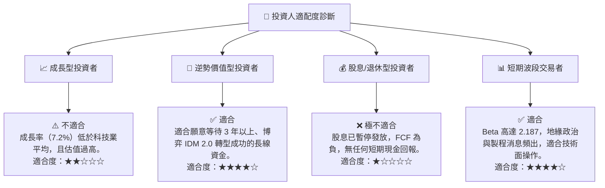

### 10.5 每季財報監控清單（Quarterly Watch List）

為了持續追蹤 Intel 的轉型進展，我們為投資人建立了一套標準的每季財報監控框架與量化門檻：

| 監控指標 | 當前值 (Q1 2026) | 觸發「加碼」門檻 | 觸發「減碼/退出」門檻 | 監控核心邏輯 |
|----------|-----------------|-----------------|----------------------|--------------|
| **Intel Foundry 外部營收** | $1.62B (季均) | > $2.50B ｜ 趨勢 ↗️ | < $1.20B ｜ 趨勢 ↘️ | 驗證外部代工業務的商業化吸單能力。 |
| **單季 FCF** | -$2.54B | > $0.00 (轉正) | < -$3.50B (失血加劇) | 評估建廠開支是否失控，避免債務危機。 |
| **毛利率** | 37.2% | > 42.0% | < 32.0% | 反映先進製程折舊對利潤空間的侵蝕程度。 |
| **DCAI 營收年增率** | 預估 +2.0% | > +10.0% | < -5.0% | 監控 Xeon 處理器是否成功穩住伺服器基本盤。|

### 10.6 反面論證：什麼會證明投資論點錯誤（What Would Change My Mind）

本報告的「觀望/長線分批買入」論點建立在「Intel 終將跨越 18A 製程門檻並實現 Foundry 財務獨立」的假設上。**如果以下任一可量化條件在未來 12 個月內成立，將證明我們的基準情境假設錯誤，投資人應無條件退出：**

1.  **18A 製程良率在 FY26 年底仍低於 50%**：這將導致 Intel 無法在 2027 年實現商業化量產，逼使外部客戶（如 Microsoft）將訂單轉回台積電，IDM 2.0 宣告失敗。
2.  **Intel 總債務突破 $55.0B，且利息保障倍數跌破 3.0x**：這意味著高昂的建廠開支已將公司拖入債務泥潭，信用評級面臨下調風險，WACC 將飆升至 18% 以上，徹底摧毀權益價值。
3.  **PC 客戶端 CPU 市佔率跌破 60%**：若 AMD 的 Ryzen 系列及 Qualcomm 的 ARM 架構晶片在 AI PC 時代奪走 Intel 超過 40% 的份額，Intel 將失去其最核心的「造血母體」（CCG 業務），再無資金支持 Foundry 轉型。

---

> **免責聲明**：本報告僅供學術研究與投資參考，不構成任何買賣建議。半導體轉型股具備極高波動性，投資人入市需謹慎並自行承擔風險。