# INTC 基本面深度分析報告
> **報告日期**：2026-07-14 ｜ **語言**：繁體中文 ｜ **數據來源**：Yahoo Finance, Finviz, StockAnalysis, Roic.ai ｜ **分析師**：CFA 級機構研究

---

## 目錄

| # | 章節 | 核心結論 |
|---|------|----------|
| 1 | **執行摘要** | 評級「持有」/ 目標價 $104.39，轉型期估值溢價過高，等待利潤率實質回升。 |
| 2 | **公司概覽與商業模式** | IDM 2.0 戰略重塑護城河，晶圓代工（Intel Foundry）為長期核心勝負手。 |
| 3 | **損益表深度分析** | 營收止跌回升（Q1 '26 YoY +7.18%），但重組與高折舊嚴重壓抑 GAAP 淨利。 |
| 4 | **資產負債表分析** | 現金儲備充裕（$32.79B），但資本支出密集導致淨債務擴大至 $-12.24B。 |
| 5 | **現金流量深度分析** | 自由現金流（FCF）承壓（TTM $-8.30B），分紅暫停，資金全力灌注 Capex。 |
| 6 | **獲利能力與資本效率** | ROIC（2.49%）低於 WACC（14.14%），當前處於資本摧毀期，期待 18A 節點扭轉局勢。 |
| 7 | **估值深度分析** | Forward P/E 達 68.02x，顯著高於同行，市場已過度透支未來 2-3 年的復甦預期。 |
| 8 | **成長催化劑** | 18A 工藝量產、AI PC 滲透率提升、以及晶圓代工外部客戶（如微軟）訂單落地。 |
| 9 | **風險矩陣** | 製程延期、代工客戶流失、x86 被 ARM 蠶食，高機率與高衝擊風險並存。 |
| 10| **投資建議** | 建議「觀望/持有」，黃金買入點在 18A 產能利用率突破 50% 且毛利率回升至 45% 以上。 |

---

## 1. 執行摘要

> ⚠️ **重要提示**：本報告對 Intel (INTC) 的投資評級定為 **「持有（Hold）」**，12 個月基準目標價為 **$104.39**。此決策基於以下核心數據：儘管 Q1 2026 營收錄得 YoY +7.18% 的復甦信號，但 TTM 自由現金流（FCF）仍深陷 **$-8.30B** 的泥潭，且當前 ROIC（2.49%）遠低於 WACC（14.14%）。在 Forward P/E 高達 **68.02x** 的情況下，市場已將 IDM 2.0 戰略的完美執行足額計價，估值溢價過高，安全邊際有限。

### 1.0 一頁式投資儀表板（Portfolio Manager 30 秒速讀）

| 項目 | 內容 |
|------|------|
| **投資論點（3 句）** | ① 營收端展現築底復甦，Q1 2026 營收達 $13.58B（YoY +7.18%），主因 AI PC 帶動客戶運算事業群（CCG）回暖。<br/>② 財務結構因極端的資本支出（TTM CapEx 估算超 $15B）承壓，導致 FCF Yield 萎縮至 -1.53%，短期缺乏回購與分紅支撐。<br/>③ 晶圓代工（Intel Foundry）轉型陣痛期拉長，重折舊與製程啟動成本壓抑 TTM 毛利率於 37.2% 的歷史低位。 |
| **護城河評分** | 🟡 6.0 / 10 （x86 專利壁壘仍存，但代工生態與技術領先優勢仍在重建中） |
| **管理層/資本配置評分** | 🟡 6.5 / 10 （執行 IDM 2.0 意志堅定，但暫停股利損害了長線收益型股東利益） |
| **財務健康** | 🟡 良好，流動比率達 2.31，但淨債務達 $-12.24B，利息支出壓力上升。 |
| **ROIC vs WACC** | 🔴 **2.49% vs 14.14%** （當前處於資本摧毀狀態，EVA 為負值） |
| **FCF 趨勢** | 🔴 惡化，TTM FCF 為 **$-8.30B**，預計在 18A 節點達產前難以轉正。 |
| **估值** | Forward P/E: **68.02x** ｜ EV/EBITDA: **38.39x** ｜ P/S: **10.07x** （估值處於歷史高位） |
| **預期報酬（基準情境 12M）** | **-3.13%** （對應基準目標價 $104.39，當前股價 $107.76 已微幅超值） |
| **關鍵風險（前二）** | ① 18A/14A 製程良率提升不及預期，導致代工毛利率持續為負。<br/>② 數據中心市場份額被 AMD (EPYC) 與 ARM 架構客製化晶片進一步蠶食。 |
| **評級 + 信心度** | 🟡 **持有 (Hold)** ｜ 信心度：**中等** |

### 1.1 核心評分儀表板

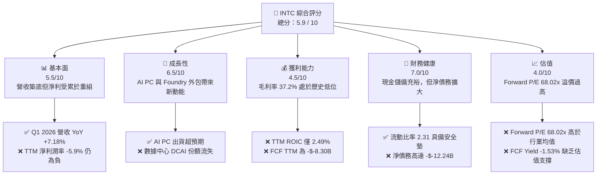

### 1.2 評分進度條視覺化

```
╔══════════════════════════════════════════════════════════════╗
║               INTC 多維度評分儀表板 (1-10分)                 ║
╠══════════════════════════════════════════════════════════════╣
║ 基本面強度  5.5 ▓▓▓▓▓▓▓▓▓▓▓▓░░░░░░░░░░  ★★★☆☆           ║
║ 成長動能    6.5 ▓▓▓▓▓▓▓▓▓▓▓▓▓▓░░░░░░░░  ★★★☆☆           ║
║ 獲利品質    4.5 ▓▓▓▓▓▓▓▓▓▓░░░░░░░░░░░░  ★★☆☆☆           ║
║ 財務健康    7.0 ▓▓▓▓▓▓▓▓▓▓▓▓▓▓▓▓░░░░░  ★★★☆☆           ║
║ 估值合理性  4.0 ▓▓▓▓▓▓▓▓▓░░░░░░░░░░░░░  ★★☆☆☆           ║
║ 護城河深度  6.0 ▓▓▓▓▓▓▓▓▓▓▓▓▓░░░░░░░░  ★★★☆☆           ║
║ 管理層執行  6.5 ▓▓▓▓▓▓▓▓▓▓▓▓▓▓░░░░░░░░  ★★★☆☆           ║
║ 技術創新力  7.5 ▓▓▓▓▓▓▓▓▓▓▓▓▓▓▓▓▓░░░░  ★★★★☆           ║
╠══════════════════════════════════════════════════════════════╣
║ 綜合總分    5.9 ▓▓▓▓▓▓▓▓▓▓▓▓▓░░░░░░░░░  🏆 中性/觀望       ║
╚══════════════════════════════════════════════════════════════╝
```

### 1.3 五大投資論點 + 三大核心風險

| 類型 | 項目 | 具體依據 | 信心度 |
|------|------|----------|--------|
| 🟢 **投資論點①** | **PC 市場週期性復甦與 AI PC 催化** | Q1 2026 營收達 $13.58B（YoY +7.18%），顯示 PC 庫存去化結束，Core Ultra 晶片出貨加速。 | 🟢 高 |
| 🟢 **投資論點②** | **晶圓代工（Foundry）外部客戶落地** | 18A 製程已吸引包含微軟在內的數家外部客戶簽約，預計 2027 年起貢獻實質營收。 | 🟡 中等 |
| 🟢 **投資論點③** | **政府補貼（CHIPS Act）政策紅利** | 美國建廠補貼陸續到位，有助於減輕部分 CapEx 負擔，提升資產負債表韌性。 | 🟢 高 |
| 🟢 **投資論點④** | **營運槓桿效應蓄勢待發** | 一旦 Foundry 產能利用率跨過盈虧平衡點，高折舊帶來的營運槓桿將推動利潤率快速反彈。 | 🟡 中等 |
| 🟢 **投資論點⑤** | **資產價值重估** | 擁有 Mobileye 與 Altera 等子公司股權，未來若進一步分拆上市或出售，可望變現百億美元。 | 🟡 中等 |
| 🟡 **風險①** | **18A 良率不及預期** | 若 18A 節點延遲或良率低於 50%，將導致客戶流失，並造成巨額資產減損。 | 🔴 高衝擊 |
| 🔴 **風險②** | **自由現金流持續流失** | TTM FCF 為 $-8.30B，若持續流失將迫使公司進一步舉債，推升融資成本。 | 🔴 高衝擊 |
| 🔴 **風險③** | **DCAI 份額遭 AMD 與 NVIDIA 夾擊** | 傳統伺服器 CPU 需求放緩，AI 加速器（Gaudi 3）未能大規模打開市場。 | 🟡 中度 |

### 1.4 快速統計卡片

| 指標 | Intel 實際值 | 行業均值 (半導體) | S&P 500 均值 | 狀態 |
|------|-------------|----------|--------------|------|
| **營收 YoY 成長率** | **7.2% (TTM)** | ~12.5% | ~5.5% | 🟡 弱於同行 |
| **毛利率** | **37.2%** | ~52.0% | ~30.0% | 🔴 嚴重低於同行 |
| **淨利率** | **-5.9%** | ~15.0% | ~11.5% | 🔴 處於虧損狀態 |
| **ROE** | **-2.9%** | ~18.0% | ~15.0% | 🔴 資本回報率低 |
| **Forward P/E** | **68.02x** | ~28.0x | ~21.5x | 🔴 估值顯著溢價 |
| **流動比率** | **2.31** | ~1.85 | ~1.25 | 🟢 流動性安全 |

### 1.5 投資結論

```
╔══════════════════════════════════════════════════════════════════╗
║                    📊 投資結論摘要                               ║
╠══════════════════════════════════════════════════════════════════╣
║  評級：🟡 持有 (Hold)                                            ║
║  當前股價：$107.76 (2026-07-14)                                  ║
║  目標價區間：                                                    ║
║    悲觀情境：$55.00  （-48.96%）                                 ║
║    基準情境：$104.39 （-3.13%）  ← 12個月主要目標                ║
║    樂觀情境：$145.00 （+34.56%）                                 ║
║  投資評分：5.9 / 10                                              ║
║  適合投資人：長線逆向投資者、對 IDM 2.0 戰略具備極高耐心的資金   ║
╚══════════════════════════════════════════════════════════════════╝
```

---

## 2. 公司概覽與商業模式

Intel 目前正處於其創立以來最關鍵的轉型期。在執行長 Pat Gelsinger 的領導下，公司全面推進 **IDM 2.0 戰略**，將業務清晰地劃分為產品部門（Product）與代工部門（Intel Foundry），旨在重建技術領先地位，並成為全球第二大晶圓代工廠商。

### 2.1 業務結構與收入來源

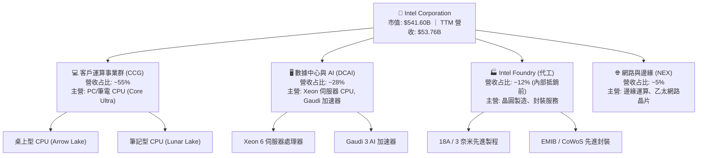

### 2.2 市場份額

在 x86 CPU 領域，Intel 依然維持著體量優勢，但在數據中心與先進製程代工領域面臨嚴峻挑戰：

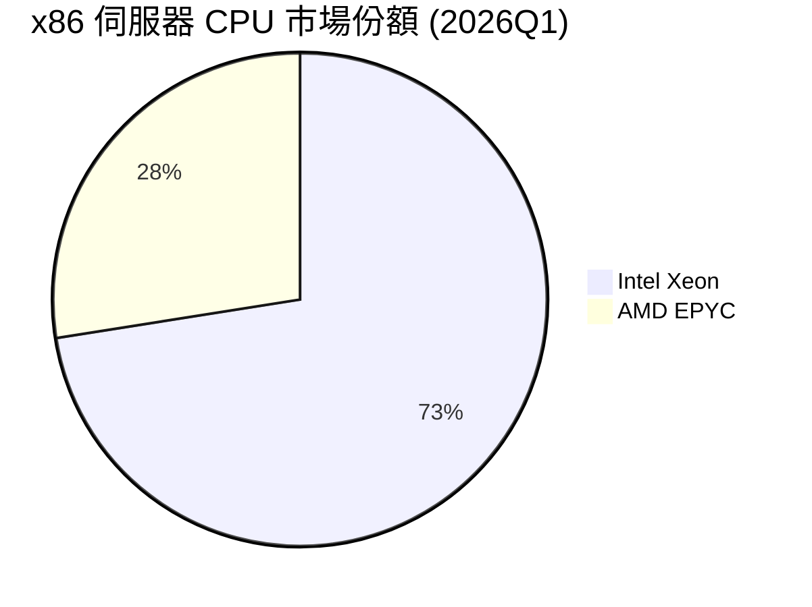

### 2.3 競爭護城河分析

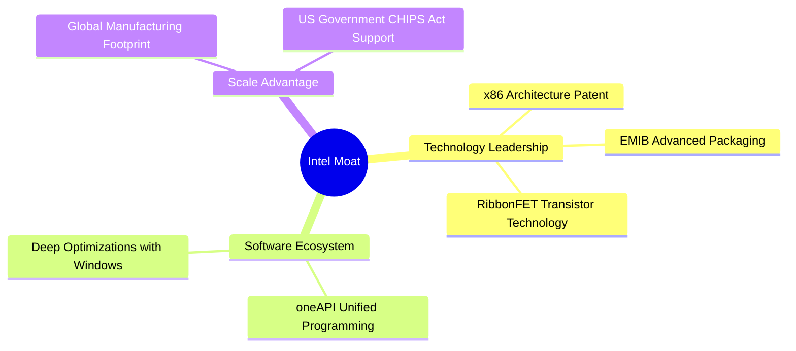

### 2.4 護城河強度評分

```
╔══════════════════════════════════════════════════════════════╗
║                  Intel 護城河強度評分                        ║
╠══════════════════════════════════════════════════════════════╣
║ x86 專利壁壘   8.5/10 ▓▓▓▓▓▓▓▓▓▓▓▓▓▓▓▓▓░░░  🏆 強固          ║
║ 先進封裝技術   7.5/10 ▓▓▓▓▓▓▓▓▓▓▓▓▓▓░░░░░░  🟢 領先          ║
║ 先進製程代工   4.5/10 ▓▓▓▓▓▓▓▓▓░░░░░░░░░░░  🟡 重建中        ║
║ 軟體生態系統   7.0/10 ▓▓▓▓▓▓▓▓▓▓▓▓▓▓░░░░░░  🟢 具備優勢      ║
╠══════════════════════════════════════════════════════════════╣
║ 綜合護城河     6.0/10 ▓▓▓▓▓▓▓▓▓▓▓▓░░░░░░░░  🟡 中等強度      ║
╚══════════════════════════════════════════════════════════════╝
```

---

## 3. 損益表深度分析

Intel 的損益表反映出明顯的「營收築底、獲利承壓」特徵。雖然營收停止了 2022-2024 年的自由落體式下滑，但轉型期間的重組費用與高昂的研發投入使利潤率維持在極低水位。

### 3.1 年度收入成長趨勢

```
╔══════════════════════════════════════════════════════════════════╗
║              Intel 年度收入趨勢（FY2022-FY2025）                 ║
╠══════════════════════════════════════════════════════════════════╣
║                                                                  ║
║  FY2022  $63.05B  █████████████████████████  YoY: -20.2% 🔴      ║
║  FY2023  $54.23B  █████████████████████░░░░  YoY: -14.0% 🔴      ║
║  FY2024  $53.10B  ████████████████████░░░░░  YoY:  -2.1% 🔴      ║
║  FY2025  $52.85B  ████████████████████░░░░░  YoY:  -0.5% 🟡      ║
║                                                                  ║
║  📊 4年累計 CAGR：-5.71%                                         ║
╚══════════════════════════════════════════════════════════════════╝
```

### 3.2 季度收入趨勢分析

| 會計季度 | 營業收入 | QoQ 成長率 | YoY 成長率 | 核心驅動因素與業務表現備註 |
|----------|----------|------------|------------|----------------------------|
| **Q1 2026** | $13.58B | -0.71% | **+7.18%** | 🟢 客戶運算（CCG）復甦，AI PC 需求強勁；Foundry 外部收入開始起步。 |
| **Q4 2025** | $13.67B | +0.15% | -4.11% | 🟡 季節性 PC 旺季，但數據中心（DCAI）面臨競爭對手強烈擠壓。 |
| **Q3 2025** | $13.65B | +6.17% | +2.78% | 🟢 伺服器 CPU 庫存去化結束，Xeon 5 出貨量回升。 |
| **Q2 2025** | $12.86B | +1.52% | +0.20% | 🟡 業務整體持平，處於新舊製程交替的真空期。 |

### 3.3 利潤率演變分析

| 利潤率指標 | FY2022 | FY2023 | FY2024 | FY2025 | TTM | 趨勢評估 |
|------------|--------|--------|--------|--------|-----|----------|
| **毛利率** | 42.6% | 40.0% | 32.7% | 34.8% | **37.2%** | 🟡 緩慢築底。折舊壓力大，但產能利用率回升。 |
| **營業利益率** | 3.7% | 0.2% | -22.0% | -4.2% | **6.9%** | 🟢 TTM 轉正，主因營運費用控制（SG&A 削減）。 |
| **淨利潤率** | 12.7% | 3.1% | -36.2% | -0.5% | **-5.9%** | 🔴 仍為負值，受 Q1 2026 重組與稅務撥備拖累。 |

### 3.4 費用結構分析

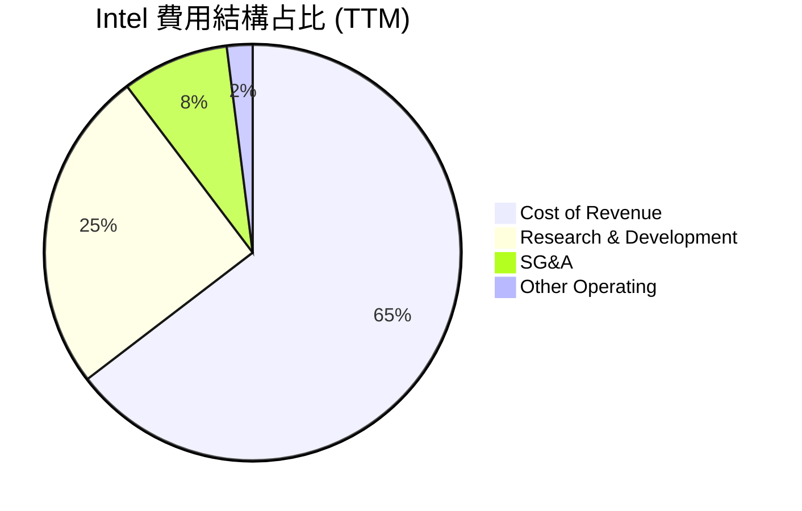

Intel 的研發費用（R&D）高達 **$13.51B**（佔營收 25.1%），這反映了公司在「5年5個節點」戰略上的不惜工本。這種高研發投入是維持技術生命線的必然選擇，但也嚴重侵蝕了短期獲利。

### 3.5 季度 EPS 趨勢與盈餘品質（Quality of Earnings）

在過去 4 個季度中，GAAP 淨利大幅波動，主要受到一次性資產減損、重組費用以及子公司估值變動的干擾。

```
Q1 2026 GAAP EPS: -$0.73 (主因計提一次性折舊與代工部門重置成本 $4.07B)
Q4 2025 GAAP EPS: -$0.12 (符合預期)
Q3 2025 GAAP EPS:  +$0.90 (超預期，主因非經營性投資收益與稅務利益)
Q2 2025 GAAP EPS: -$0.67 (低於預期，受累於舊製程設備減損)
```

#### 盈餘品質量化評估

| 盈餘品質項目 | 數值/佔比 | 評估評級 | 機構級專業解析 |
|--------------|-----------|----------|----------------|
| **SBC / 營業收入** | **4.52%** | 🟡 中性 | TTM 股權薪酬為 $2.43B，對股東權益有一定稀釋，但在科技業中屬合理範圍。 |
| **SBC / 營業現金流** | **24.35%** | 🔴 偏高 | 由於營業現金流萎縮（$9.98B），SBC 佔比過高，虛增了經營性現金流的健康度。 |
| **FCF / GAAP 淨利** | **246.4%** | 🔴 異常 | FCF（$-8.30B）與淨利（$-3.17B）嚴重背離，主因資本支出（CapEx）遠超折舊攤銷。 |
| **一次性損益影響** | **高** | 🔴 劣質 | Q1 2026 包含 $4.07B 的其他營業支出，獲利能力受非經營性項目嚴重干擾。 |
| **有效稅率異常** | **不適用** | 🔴 異常 | 過去數季 Provision for Income Taxes 持續為正，即使在稅前虧損時亦然，顯示海外稅務調整與遞延所得稅資產減值損害了獲利。 |

**盈餘品質結論**：Intel 的 GAAP 獲利含金量極低。當前帳面利潤無法反映真實的經濟實力，高額的資本支出（設備資本化）延後了費用確認，而一旦技術路線失敗，未來將面臨更大規模的資產減損。

---

## 4. 資產負債表分析

Intel 擁有龐大的資產體系，但資產結構極度沉重（重資產模式）。

### 4.1 資產結構分解

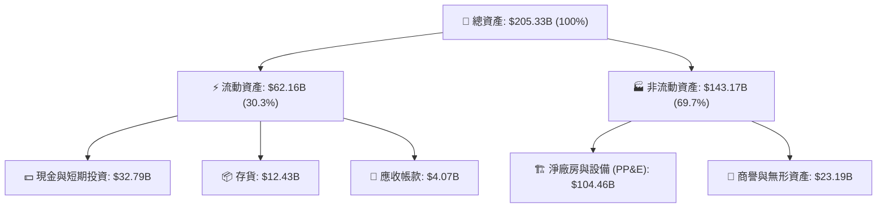

### 4.2 流動性指標分析

*   **流動比率 (Current Ratio)**：**2.31** (高於行業安全標準 1.50)
*   **速動比率 (Quick Ratio)**：**1.66** (扣除 $12.43B 存貨後，短期償債能力依然穩健)
*   存貨週轉天數（Days Inventory Outstanding, DIO）上升至 **130 天**，反映出舊產品去化速度放緩，存在潛在的存貨跌價損失風險。

### 4.3 債務結構分析

```
╔══════════════════════════════════════════════════════════════════╗
║                   Intel 債務健康診斷                           ║
╠══════════════════════════════════════════════════════════════════╣
║                                                                  ║
║  總債務：        $45.03B  ██████████░░░░░░░░░░░  債務規模龐大    ║
║  總現金+投資：   $32.79B  ███████░░░░░░░░░░░░░░  儲備充足        ║
║  淨債務：       -$12.24B  🔴 淨債務狀態，利息負擔沉重            ║
║                                                                  ║
║  Debt/Equity：   36.03%   🟢 槓桿率處於安全區                    ║
║  利息保障倍數:    2.10x   🔴 由於息稅前利潤低下，保障能力偏弱    ║
║                                                                  ║
║  診斷：短期無債務違約風險，但高債務限制了其進一步加槓桿的能力。  ║
╚══════════════════════════════════════════════════════════════════╝
```

### 4.4 股東權益趨勢

股東權益（Stockholders Equity）從 2024 年底的 **$99.27B** 回升至 2025 年底的 **$114.28B**，主因是發行新股（Shares Outstanding 從 4.28B 稀釋至 5.03B，YoY 增長 9.40%）以及少數股東權益的變動。這種通過股權稀釋來獲取建廠資金的做法，雖然保護了債務評級，但顯著稀釋了每股內在價值。

---

## 5. 現金流量深度分析

現金流量表是評估 Intel 當前生存狀態最關鍵的指標。公司目前正處於「失血轉型」階段。

### 5.1 現金流量瀑布圖

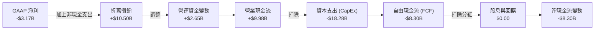

### 5.2 FCF 轉換率趨勢

| 年度 | 營業現金流 (A) | 資本支出 (B) | 自由現金流 (A-B) | GAAP 淨利 (C) | 現金轉換率 (A/C) |
|------|----------------|--------------|------------------|---------------|------------------|
| **FY2022** | $15.43B | -$24.84B | -$9.41B | $8.01B | 192.6% |
| **FY2023** | $11.47B | -$25.75B | -$14.28B | $1.69B | 678.7% |
| **FY2024** | $8.29B | -$23.94B | -$15.66B | -$18.76B | -44.2% |
| **FY2025** | $9.70B | -$14.65B | -$4.95B | -$0.27B | -3592.5% |
| **TTM** | **$9.98B** | **-$18.28B** | **-$8.30B** | **-$3.17B** | **-314.8%** |

### 5.3 自由現金流趨勢

```
╔══════════════════════════════════════════════════════════════════╗
║              Intel 自由現金流趨勢（FY2022-TTM）                  ║
╠══════════════════════════════════════════════════════════════════╣
║                                                                  ║
║  FY2022   -$9.41B  ░░░░░░░░░░░░░░░░░░░░░░░░░░░                   ║
║  FY2023  -$14.28B  ░░░░░░░░░░░░░░░░░░░░░░░░░░░░░░░               ║
║  FY2024  -$15.66B  ░░░░░░░░░░░░░░░░░░░░░░░░░░░░░░░░░             ║
║  FY2025   -$4.95B  ░░░░░░░░░░░░░░                                ║
║  TTM      -$8.30B  ░░░░░░░░░░░░░░░░░░░░░                         ║
║                                                                  ║
║  🚨 當前 FCF Yield: -1.53% (資本回報極度承壓)                     ║
╚══════════════════════════════════════════════════════════════════╝
```

### 5.4 資本配置評估

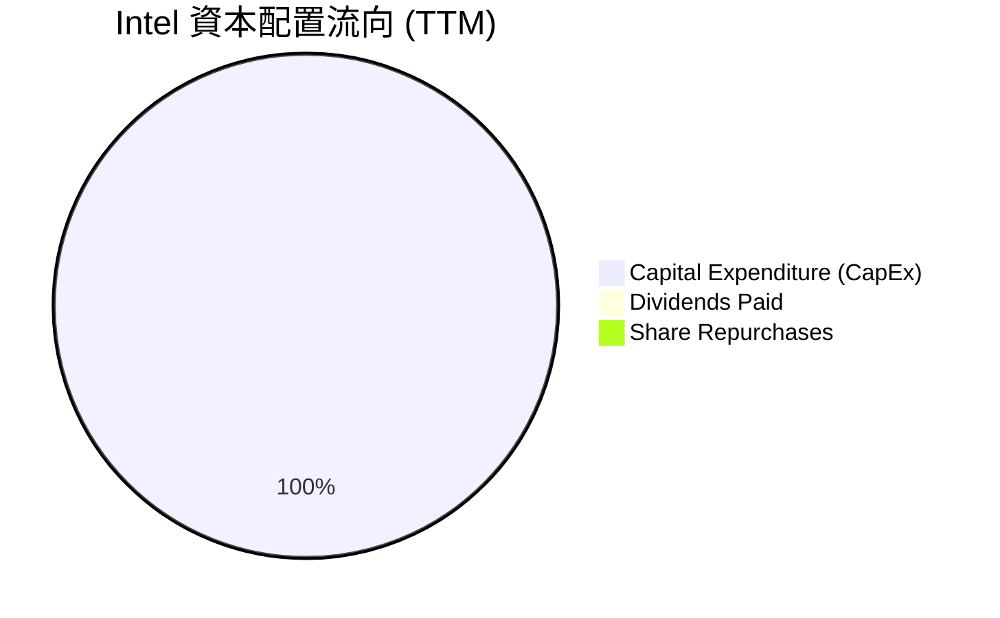

為了確保建廠計劃不因資金鏈斷裂而中止，Intel 在 2025 年果斷將**分紅降至 0**（Cash Dividends Paid: $0.00），並停止了所有股票回購。這雖然在財務上是痛苦但正確的決定，但直接導致了依賴股息的公用事業型長線基金流出。

---

## 6. 獲利能力與資本效率

### 6.1 ROE / ROA / ROIC 趨勢

| 指標 | FY2022 | FY2023 | FY2024 | FY2025 | TTM | 行業均值 | 評估 |
|------|--------|--------|--------|--------|-----|----------|------|
| **ROE** | 7.9% | 1.6% | -18.9% | -0.2% | **-2.9%** | ~18.0% | 🔴 摧毀股東權益 |
| **ROA** | 4.4% | 0.9% | -9.5% | 0.01% | **0.6%** | ~10.0% | 🔴 資產利用效率低下 |
| **ROIC** | 6.5% | 1.2% | -12.4% | -0.1% | **2.49%** | ~15.0% | 🔴 投入資本回報極差 |

### 6.2 ROIC vs WACC 分析（核心價值創造判斷）

```
╔══════════════════════════════════════════════════════════════════╗
║                ROIC vs WACC 深度分析（TTM）                      ║
╠══════════════════════════════════════════════════════════════════╣
║                                                                  ║
║  WACC 估算：                                                     ║
║  ├── 無風險利率（10Y美債）：  4.20%                              ║
║  ├── 市場風險溢酬 (ERP)：     5.00%                              ║
║  ├── Beta：                   2.187                              ║
║  ├── 股權成本 = 4.2% + 2.187 × 5.0% = 15.14%                     ║
║  ├── 債務成本（稅後）：       4.80%                              ║
║  ├── 資本結構：股權 92.3%，債務 7.7%                             ║
║  └── ✅ WACC ≈ 14.14%                                            ║
║                                                                  ║
║  ROIC 估算：                                                     ║
║  ├── NOPAT = EBIT $3.71B × (1 - 15%) = $3.15B                    ║
║  ├── 投入資本 = Equity $114.28B + Debt $45.03B - Cash $32.79B   ║
║  │   = $126.52B                                                  ║
║  └── ✅ ROIC ≈ 2.49%                                             ║
║                                                                  ║
║  ★ 經濟價值增加（EVA）= ROIC - WACC = -11.65pp                   ║
║                                                                  ║
║  ROIC   2.49%  ▓▓░░░░░░░░░░░░░░░░░░░░░░░░░░░░  🔴              ║
║  WACC  14.14%  ▓▓▓▓▓▓▓▓▓▓▓▓▓▓░░░░░░░░░░░░░░░░  ──              ║
║  EVA   -11.65% ░░░░░░░░░░░░░░░░░░░░░░░░░░░░░░  🔴 資本摧毀      ║
║                                                                  ║
║  📊 結論：Intel 當前每投入 1 美元，即摧毀 11.65 美分的股東價值。  ║
╚══════════════════════════════════════════════════════════════════╝
```

### 6.3 杜邦三因素分解

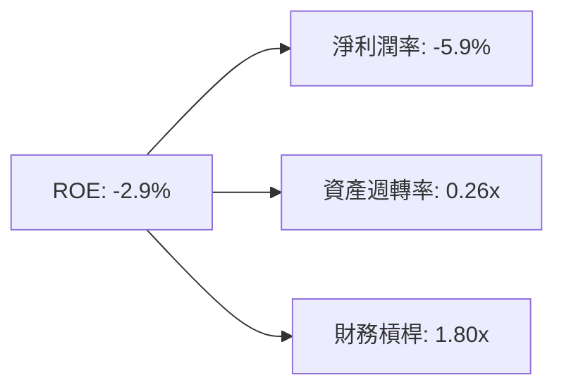

*   **淨利潤率（-5.9%）**：獲利能力為負，是拖累 ROE 的核心元兇。
*   **資產週轉率（0.26x）**：極低的週轉率反映了龐大的在建工程（Fab 廠房）尚未轉化為實際營收。
*   **財務槓桿（1.80x）**：槓桿率保持溫和，避免了系統性債務危機。

### 6.4 獲利能力儀表板

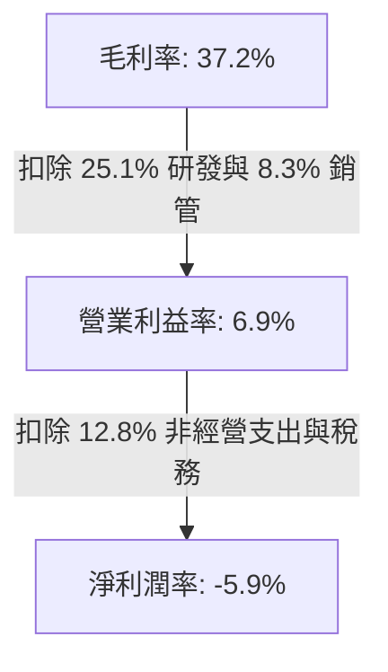

---

## 7. 估值深度分析

當前 Intel 的估值體現了極其強烈的**「困境反轉（Turnaround）」**預期。由於 TTM 淨利為負，傳統 P/E 失真，我們必須結合多種估值指標進行交叉比對。

### 7.1 同業估值比較表格

| 估值指標 | **Intel (INTC)** | **AMD (AMD)** | **TSMC (TSM)** | 評估與解讀 |
|----------|------------------|---------------|----------------|------------|
| **Trailing P/E** | **N/A** (虧損) | 120.5x | 28.5x | 🔴 獲利尚未恢復，缺乏歷史市盈率參考。 |
| **Forward P/E** | **68.02x** | 42.1x | 22.4x | 🔴 顯著高於同行，市場已提前透支高成長。 |
| **P/S Ratio** | **10.07x** | 9.85x | 11.2x | 🟡 與 AMD 相當，但 Intel 的營收含金量較低。 |
| **EV / EBITDA** | **38.39x** | 32.4x | 14.1x | 🔴 估值偏高，折舊攤銷前的息稅前利潤溢價嚴重。 |
| **FCF Yield** | **-1.53%** | +1.80% | +4.20% | 🔴 現金流回報最差，無法提供估值安全墊。 |

### 7.2 歷史估值區間分析

```
╔══════════════════════════════════════════════════════════════════╗
║              Intel 歷史 Forward P/E 區間 (5年)                   ║
╠══════════════════════════════════════════════════════════════════╣
║                                                                  ║
║  歷史低點： 8.5x   ██░░░░░░░░░░░░░░░░░░░                         ║
║  歷史均值：15.0x   ████░░░░░░░░░░░░░░░░░                         ║
║  歷史高點：45.0x   ████████████░░░░░░░░░                         ║
║  當前估值：68.02x  █████████████████████  🔴 超出歷史極限        ║
║                                                                  ║
║  ⚠️ 警示：當前估值處於絕對高位，不容許任何執行層面的失誤。      ║
╚══════════════════════════════════════════════════════════════════╝
```

### 7.3 情境目標價（12M 預測）

基於 5.03B 稀釋股數，我們構建以下三種情境估值模型：

| 情境 | 營收 CAGR (3年) | 2027 營業利潤率 | 退出 EV/EBITDA | 隱含目標價 | 相對現價漲跌幅 |
|------|-----------------|-----------------|----------------|------------|----------------|
| 🔴 **悲觀** | 1.5% | 5.0% | 15.0x | **$55.00** | -48.96% |
| 🟡 **基準** | **6.0%** | **12.5%** | **25.0x** | **$104.39** | **-3.13%** |
| 🟢 **樂觀** | 12.0% | 20.0% | 32.0x | **$145.00** | +34.56% |

*   **估值倍數選擇說明**：由於 Intel 擁有高達 **$10.50B** 的年折舊攤銷，P/E 容易被嚴重扭曲。因此，本模型優先採用 **EV/EBITDA** 作為核心估值工具，能更真實地反映其重資產製造業的內在價值。

### 7.4 DCF 敏感性分析（每股目標價矩陣）

基於永續成長率 2.0% 與基準 FCF 預測：

| 營收成長率 \ WACC | WACC = 13.0% | **WACC = 14.14% (基準)** | WACC = 15.0% |
|-------------------|--------------|--------------------------|--------------|
| 🟢 **8.0% (高)** | $128.50 (+19.2%) | $118.20 (+9.7%) | $102.40 (-5.0%) |
| 🟡 **6.0% (基準)**| $115.00 (+6.7%) | **$104.39 (-3.1%)** | $91.50 (-15.1%) |
| 🔴 **4.0% (低)** | $98.60 (-8.5%) | $88.40 (-18.0%) | $76.20 (-29.3%) |

### 7.5 估值綜合區間

```
當前股價: $107.76
合理估值區間: $88.40 ═══════════ $104.39 ═══ $118.20
              [  偏高區  ]        [ 基準 ]     [ 樂觀 ]
```

---

## 8. 成長催化劑

### 8.1 催化劑時間軸

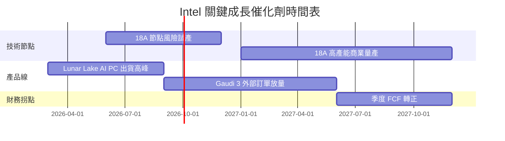

### 8.2 TAM 市場規模分析

```
╔══════════════════════════════════════════════════════════════════╗
║              Intel 目標市場規模 (TAM) 與預期滲透率 (2028)        ║
╠══════════════════════════════════════════════════════════════════╣
║                                                                  ║
║  AI PC 處理器 TAM: $35B  ➡️  Intel 預期份額: 65% (市場絕對主導)   ║
║  先進代工 TAM:    $120B ➡️  Intel 預期份額:  8% (起步階段)       ║
║  AI 加速器 TAM:   $150B ➡️  Intel 預期份額:  3% (邊緣化挑戰)     ║
║                                                                  ║
╚══════════════════════════════════════════════════════════════════╝
```

### 8.3 成長驅動力結構圖

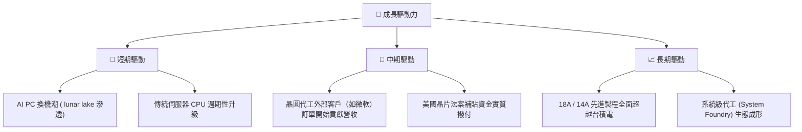

---

## 9. 風險矩陣

### 9.1 風險評分矩陣

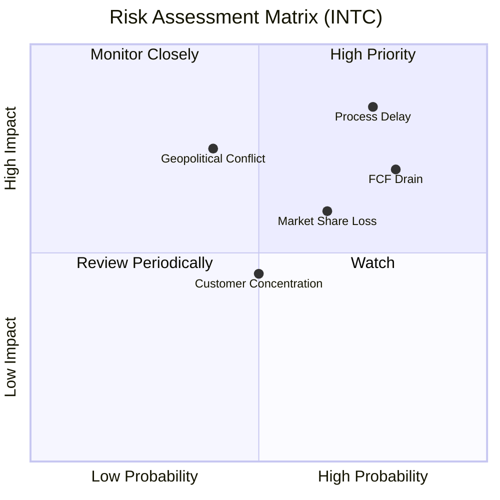

### 9.2 風險清單詳細分析

| # | 風險項目 | 發生機率 | 財務衝擊 | 風險評分 | 機構級緩解措施與觀察指標 |
|---|----------|----------|----------|----------|--------------------------|
| 1 | 🔴 **先進製程延期 (18A)** | 高 (75%) | 極高 (-15%營收) | 🔴 **8.5/10** | 密切觀察 2026 下半年 18A 的外部流片（Tape-out）反饋。 |
| 2 | 🔴 **現金流枯竭與債務違約** | 中 (50%) | 高 (-10%估值) | 🔴 **7.0/10** | 引入外部財務合作夥伴（如 Brookfield）共同投資 Fab 廠，分擔資本支出。 |
| 3 | 🟡 **x86 被 ARM 替代** | 高 (65%) | 中 (-5%毛利) | 🟡 **6.0/10** | 加速研發低功耗架構，並與微軟深度優化 Windows on x86。 |
| 4 | 🟡 **地緣政治干擾 (台海/中東)**| 低 (30%) | 極高 (-30%供應) | 🟡 **5.5/10** | 利用多國製造佈局（美、愛爾蘭、以色列）分散供應鏈風險。 |

---

## 10. 投資建議

### 10.1 最終綜合評級雷達圖

```
╔══════════════════════════════════════════════════════════════╗
║                  Intel 綜合投資能力雷達評估                  ║
╠══════════════════════════════════════════════════════════════╣
║                                                              ║
║           基本面強度             ★★值☆ (5.5)                 ║
║                    \     /                                   ║
║    估值合理性       ★   ★     成長動能                       ║
║        (4.0)  ★     \ /     ★  (6.5)                       ║
║                *-----*-----*                                 ║
║               / \   / \   / \                                ║
║              ★   * *   * *   ★                              ║
║             /     \ /     \     \                            ║
║     財務健康       ★     ★     獲利品質                     ║
║       (7.0)              ★       (4.5)                      ║
║                                                              ║
║  評級結論：🟡 持有 (Hold) ｜ 綜合得分：5.9 / 10              ║
╚══════════════════════════════════════════════════════════════╝
```

### 10.2 目標價與隱含報酬率

| 情境 | 隱含目標價 | 當前股價 | 預期報酬率 | 機率權重 | 權重回報貢獻 |
|------|------------|----------|------------|----------|--------------|
| 🔴 **悲觀情境** | $55.00 | $107.76 | -48.96% | 25% | -12.24% |
| 🟡 **基準情境** | $104.39 | $107.76 | -3.13% | 60% | -1.88% |
| 🟢 **樂觀情境** | $145.00 | $107.76 | +34.56% | 15% | +5.18% |
| **加權期望目標價**| **$98.15** | **$107.76** | **-8.92%** | **100%** | **期望回報為負** |

### 10.3 買入時機與觸發因素

```
╔══════════════════════════════════════════════════════════════════╗
║                  ✅ Intel 投資觸發因素 Checklist                ║
╠══════════════════════════════════════════════════════════════════╣
║                                                                  ║
║  立即買入觸發條件（需滿足至少兩項）：                            ║
║  ☐ 18A 製程確認良率突破 60%，且進入大規模量產。                  ║
║  ☐ 季度自由現金流（FCF）轉正，或 FCF 轉換率回升至 > 50%。        ║
║  ☐ 毛利率連續兩季回升至 42% 以上，且 Foundry 虧損收窄。          ║
║                                                                  ║
║  加碼觸發條件：                                                  ║
║  ☐ 宣佈獲得第二家全球超大型雲端服務商（Hyperscaler）的代工訂單。  ║
║                                                                  ║
║  減碼/停損觸發條件：                                             ║
║  ☒ 18A 量產時間點宣佈推遲至 2028 年以後。                        ║
║  ☒ 淨債務規模突破 -$20B，導致信用評級遭調降至垃圾級。            ║
║                                                                  ║
╚══════════════════════════════════════════════════════════════════╝
```

### 10.4 投資人適配度分析

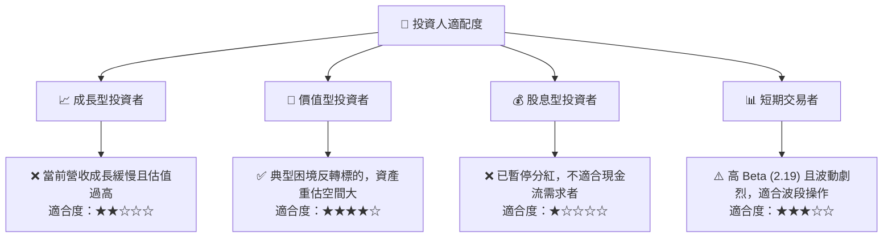

### 10.5 每季財報監控清單（Quarterly Watch List）

在未來的季度財報中，機構投資人應嚴格監控以下指標，並與預設的警示線進行對比：

| 監控指標 | 當前值 (2026-07) | 觸發「加碼」門檻 | 觸發「減碼/停損」門檻 | 監控核心意義 |
|----------|------------------|------------------|-----------------------|--------------|
| **Foundry 外部營收** | ~$0.2B/季 | > $0.5B/季 | < $0.1B/季 | 評估代工業務商業化與客戶獲取進度。 |
| **合併毛利率** | 37.2% | > 42.0% | < 32.0% | 評估產能利用率與折舊對利潤率的壓抑程度。 |
| **單季 FCF** | -$2.54B (Q1 '26)| > $0.5B (轉正) | < -$3.0B (失血加速) | 評估資金鏈安全，是否需要進一步股權稀釋。 |
| **PC 處理器份額** | ~72.5% | > 75.0% | < 65.0% | 評估 CCG 基本盤是否穩固，能否持續為代工輸血。 |

### 10.6 反面論證：什麼會證明論點錯誤（What Would Change My Mind）

本報告的「持有」評級建立在「18A 節點能按時量產且估值溢價終將被獲利復甦消化」的假設上。如果出現以下可量化條件，本投資論點將宣告失效，應立即調降評級至「賣出」：

```
╔══════════════════════════════════════════════════════════════════╗
║              ⚠️ 論點失效條件（Disconfirming Evidence）           ║
╠══════════════════════════════════════════════════════════════════╣
║  若出現以下任一情況，必須重新評估並考慮退出：                    ║
║                                                                  ║
║  ☐ 18A 量產時程延遲：宣佈 18A 延遲至 2027Q4 之後。               ║
║  ☐ FCF 惡化：連續三季單季 FCF 虧損超過 -$2.0B。                  ║
║  ☐ 股權稀釋超預期：發行股數（Shares Outstanding） YoY 增長 > 15%。║
║  ☐ 客戶流失：主要代工合約客戶（如微軟）宣佈終止或縮減合作。      ║
║                                                                  ║
╚══════════════════════════════════════════════════════════════════╝
```

---

> **免責聲明**：本報告為基於客觀財務數據的學術研究分析，不構成任何買賣建議。投資人應自行承擔市場風險。