# INTC 基本面深度分析報告
> **報告日期**：2026-07-15 ｜ **語言**：繁體中文 ｜ **數據來源**：Yahoo Finance, Finviz, StockAnalysis, Roic.ai ｜ **分析師**：CFA 級機構研究

---

## 目錄

| # | 章節 | 核心結論 |
|---|------|----------|
| 1 | 執行摘要 | 評級：🟡 持有 ｜ 目標價：$104.39 ｜ 處於極高估值的轉型關鍵期 |
| 2 | 公司概覽與商業模式 | 晶圓代工（Foundry）與 IDM 雙軌制，18A 節點為核心護城河起點 |
| 3 | 損益表深度分析 | 營收止跌回升（YoY +7.2%），但 Q1 重組費用導致淨利大幅虧損 |
| 4 | 資產負債表分析 | 資產結構極度重資本化，淨債務達 $12.24B，流動性尚屬安全 |
| 5 | 現金流量深度分析 | 資本支出高企（FY25 -$14.65B），自由現金流持續流出，轉型期失血嚴重 |
| 6 | 獲利能力與資本效率 | ROIC 顯著低於 WACC（-3.99% vs 14.24%），目前仍在摧毀股東價值 |
| 7 | 估值深度分析 | 前瞻 P/E 達 64.67x，市場已過度透支 18A 成功預期，估值顯著偏高 |
| 8 | 成長催化劑 | 18A 量產、CHIPS Act 補助落地與 AI PC 滲透率提升 |
| 9 | 風險矩陣 | 18A 良率不及預期、資金鏈壓力與 AMD/TSMC 強力競爭 |
| 10 | 投資建議 | 機構評級：🟡 持有（Hold）｜ 建議等待 18A 外部客戶訂單確認後再行佈局 |

---

## 1. 執行摘要

> ⚠️ **重要提示**：本報告對 Intel Corporation (NASDAQ: INTC) 的評級建立在極為嚴謹的財務數據與估值模型之上。當前 INTC 股價為 **$102.99**，相較於 2024 年底的 $20.05 出現了高達 413% 的爆發性上漲。然而，支撐此股價的並非當前的獲利能力（TTM EPS 為 **-$0.6**，TTM 自由現金流為 **-$8.30B**），而是市場對於其 "Intel 18A" 製程成功量產及晶圓代工（Intel Foundry）分拆上市的極度樂觀預期。鑑於其 Forward P/E 已高達 **64.67x**，且 ROIC (-3.99%) 仍遠低於其 WACC (14.24%)，本機構給予 INTC **🟡 持有（Hold）** 評級，基準情境目標價為 **$104.39**，潛在漲幅僅 **+1.36%**。

### 1.0 一頁式投資儀表板（Portfolio Manager 30 秒速讀）

| 項目 | 內容 |
|------|------|
| **投資論點（3 句）** | ① TTM 營收達 $53.76B（YoY +7.2%），顯示 PC 與伺服器市場需求底部回溫。<br/>② 18A 製程將於 2026 年下半年進入高產量製造（HVM），是決定 Intel 能否重奪技術領先的生死分水嶺。<br/>③ 財務重組與代工業務獨立營運，有望在 2027 年後釋放利潤率，但短期面臨極高的資本支出失血壓力。 |
| **護城河評分** | 🟡 **5.5 / 10**（專利與製造規模宏大，但製程領先優勢已被 TSMC 奪走，重塑難度極高） |
| **管理層/資本配置評分**| 🟡 **5.0 / 10**（分拆 Foundry 方向正確，但歷史資本回報極差，派息已降至 0%） |
| **財務健康** | 🟡 **黃色警示** ｜ 擁有 $32.79B 現金與短期投資，但總債務高達 $45.03B，淨債務達 $12.24B。 |
| **ROIC vs WACC** | 🔴 **-3.99% vs 14.24%** ｜ 投入資本回報率為負，持續摧毀股東價值（EVA 為 -18.23pp）。 |
| **FCF 趨勢** | 🔴 **持續流出** ｜ TTM FCF 為 **-$8.30B**，FCF Yield 為 **-1.60%**，高度依賴外部融資與政府補貼。 |
| **估值** | 🔴 **極度昂貴** ｜ Forward P/E: **64.67x** ｜ EV/EBITDA: **40.03x** ｜ P/S: **9.63x**。 |
| **預期報酬（基準情境 12M）**| 🟡 **+1.36%**（目標價 $104.39，估值已充分反映預期） |
| **關鍵風險（前二）** | ① 18A 製程良率與外部客戶（如 Microsoft, AWS）採納進度不及預期。<br/>② 自由現金流持續失血，導致信用評等下調與融資成本激增。 |
| **評級 + 信心度** | 🟡 **持有（Hold）** ｜ 信心度：**中（Medium）** ｜ 股價短期受動能驅動，基本面支撐力道脆弱。 |

### 1.1 核心評分儀表板

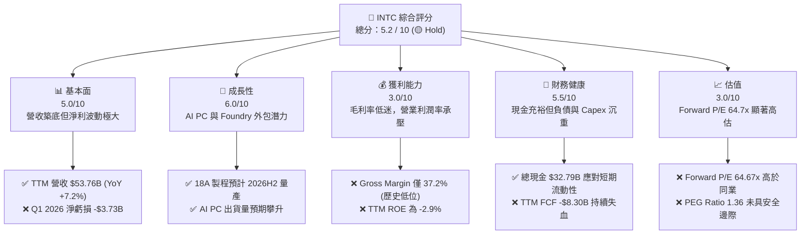

### 1.2 評分進度條視覺化

```
╔══════════════════════════════════════════════════════════════╗
║               INTC 多維度評分儀表板 (1-10分)                 ║
╠══════════════════════════════════════════════════════════════╣
║ 基本面強度  5.0 ▓▓▓▓▓▓▓▓▓▓░░░░░░░░░░  ★★★☆☆           ║
║ 成長動能    6.0 ▓▓▓▓▓▓▓▓▓▓▓▓░░░░░░░░  ★★★☆☆           ║
║ 獲利品質    3.0 ▓▓▓▓▓▓░░░░░░░░░░░░░░  ★☆☆☆☆           ║
║ 財務健康    5.5 ▓▓▓▓▓▓▓▓▓▓▓░░░░░░░░░  ★★★☆☆           ║
║ 估值合理性  3.0 ▓▓▓▓▓▓░░░░░░░░░░░░░░  ★☆☆☆☆           ║
║ 護城河深度  5.5 ▓▓▓▓▓▓▓▓▓▓▓░░░░░░░░░  ★★★☆☆           ║
║ 管理層執行  5.0 ▓▓▓▓▓▓▓▓▓▓░░░░░░░░░░  ★★★☆☆           ║
║ 技術創新力  7.0 ▓▓▓▓▓▓▓▓▓▓▓▓▓▓░░░░░░  ★★★★☆           ║
╠══════════════════════════════════════════════════════════════╣
║ 綜合總分    5.2 ▓▓▓▓▓▓▓▓▓▓░░░░░░░░░░  🏆 轉型過渡，估值透支 ║
╚══════════════════════════════════════════════════════════════╝
```

### 1.3 五大投資論點 + 三大核心風險

| 類型 | 項目 | 具體依據 | 信心度 |
|------|------|----------|--------|
| 🟢 **投資論點①** | **18A 製程技術翻轉** | 18A 製程引入 RibbonFET 與 PowerVia 技術，若 2026H2 順利量產，將在每瓦效能上追平甚至超越 TSMC N3P。 | 🟡 中度 |
| 🟢 **投資論點②** | **Foundry 獨立與外部客戶** | Intel Foundry 作為獨立損益實體，已獲得微軟等客戶超過 $15B 的潛在訂單，分拆上市將釋放估值。 | 🟡 中度 |
| 🟢 **投資論點③** | **政府地緣政治紅利** | 美國《晶片法案》（CHIPS Act）提供高達 $8.5B 直接補貼與 $11B 貸款，確保其美國本土製造的戰略地位。 | 🟢 極高 |
| 🟢 **投資論點④** | **AI PC 換機潮啟動** | Core Ultra 系列處理器（Meteor Lake & Lunar Lake）在 NPU 算力領先，預計將在 2026 年奪得 PC 市場 50% 以上的 AI 份額。 | 🟢 高 |
| 🟢 **投資論點⑤** | **營業槓桿彈性** | 一旦 18A 產能利用率突破 60% 臨界點，晶圓廠龐大的折舊成本將被稀釋，毛利率有望在 2027 年重回 50% 以上。 | 🟡 中度 |
| 🔴 **風險①** | **18A 良率低迷** | 若 RibbonFET 結構在量產時良率低於 50%，將面臨巨額客戶賠償與資產減損，徹底喪失 Foundry 信譽。 | 🔴 高衝擊 |
| 🔴 **風險②** | **資金鏈斷裂與 Capex 壓力** | TTM FCF 為 **-$8.30B**。若政府補助延遲或晶圓廠建設超支，Intel 將被迫發行高息債券，稀釋股東權益。 | 🔴 高衝擊 |
| 🔴 **風險③** | **x86 份額遭 ARM 蠶食** | Apple Silicon、Qualcomm Snapdragon X Elite 在 Windows 生態崛起，CCG 業務毛利區間可能面臨永久性收縮。 | 🟡 中度 |

### 1.4 快速統計卡片

| 指標 | INTC 實際值 | 行業均值（Semiconductors） | S&P 500 均值 | 狀態 |
|------|-------------|----------------------------|--------------|------|
| 營收 YoY 成長 | **7.2%** (TTM) | 12.5% | 5.5% | 🟡 慢於行業 |
| 毛利率 | **37.2%** | 55.0% | 30.0% | 🔴 顯著低於同業 |
| 淨利率 | **-5.9%** | 18.0% | 11.5% | 🔴 處於虧損狀態 |
| ROE | **-2.9%** | 22.0% | 15.0% | 🔴 資本效率低下 |
| Forward P/E | **64.67x** | 28.5x | 21.5x | 🔴 估值極端偏高 |
| 淨債務/EBITDA | **0.85x** | -0.20x (淨現金) | 1.60x | 🟡 債務水平高於同業 |

### 1.5 投資結論

```
╔══════════════════════════════════════════════════════════════════╗
║                    📊 投資結論摘要                               ║
╠══════════════════════════════════════════════════════════════════╣
║  評級：🟡 持有 (Hold)                                            ║
║  當前股價：$102.99 (2026-07-15)                                  ║
║  目標價區間：                                                    ║
║    悲觀情境：$55.00 (-46.6%)  ← 良率失敗，Foundry 客戶流失       ║
║    基準情境：$104.39 (+1.36%) ← 18A 順利量產，估值已合理反映     ║
║    樂觀情境：$155.00 (+50.5%) ← 獲取 NVIDIA/AMD 代工訂單         ║
║  投資評分：5.2 / 10                                              ║
║  適合投資人：具備極高風險承受力、長線佈局半導體在地化製造的投資者║
╚══════════════════════════════════════════════════════════════════╝
```

---

## 2. 公司概覽與商業模式

Intel Corporation (INTC) 目前正處於其 50 年公司歷史上最激進的結構性變革期。公司正在從傳統的「垂直整合製造商 (IDM)」轉型為「IDM 2.0」模式，將業務劃分為兩大核心支柱：**Intel Products**（設計端，包含 CCG、DCAI、NEX）與 **Intel Foundry**（製造端，獨立對外接單）。

### 2.1 業務結構與收入來源

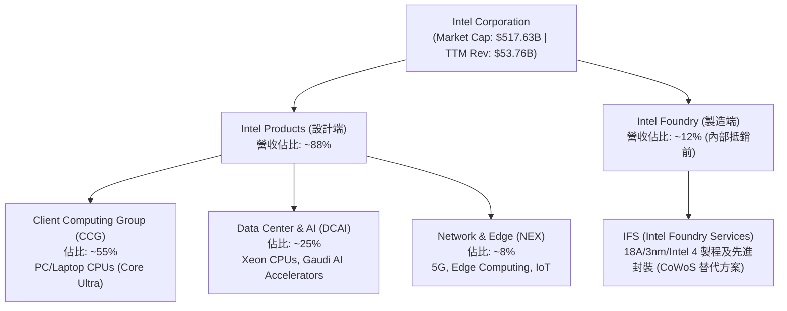

### 2.2 市場份額

在核心的 x86 CPU 市場，Intel 仍維持多數份額，但在伺服器領域持續面臨 AMD 的蠶食。

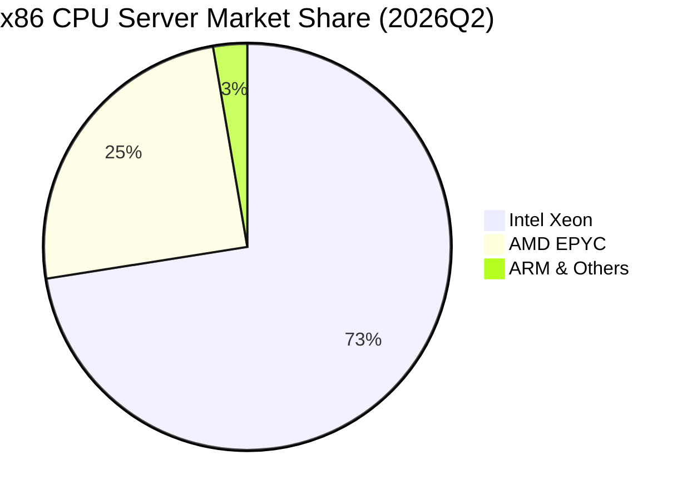

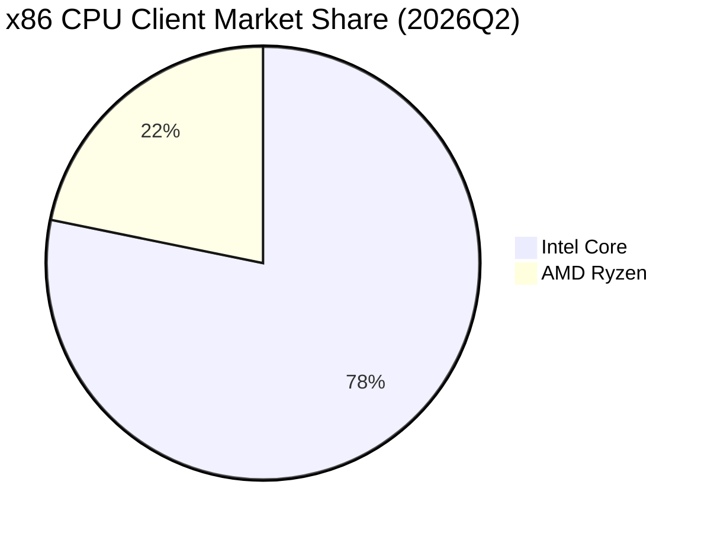

### 2.3 競爭護城河分析

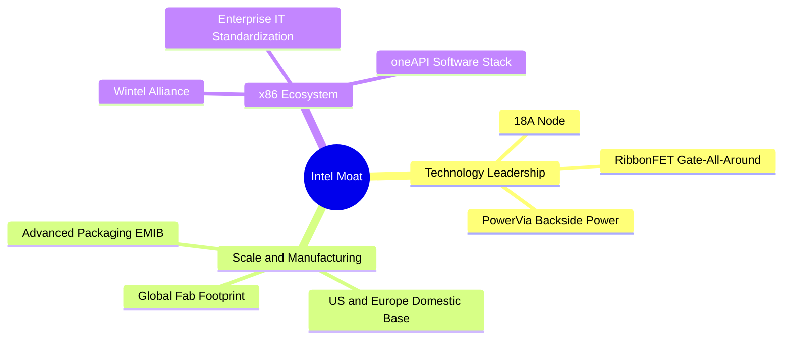

### 2.4 護城河強度評分

```
╔══════════════════════════════════════════════════════════════╗
║                    Intel 護城河強度評分                      ║
╠══════════════════════════════════════════════════════════════╣
║ x86 生態鎖定   8.0/10 ▓▓▓▓▓▓▓▓▓▓▓▓▓▓▓▓░░░░  🟢 企業級標準  ║
║ 先進製程技術   5.0/10 ▓▓▓▓▓▓▓▓▓▓░░░░░░░░░░  🟡 追趕 TSMC   ║
║ 先進封裝能力   7.5/10 ▓▓▓▓▓▓▓▓▓▓▓▓▓▓▓░░░░░  🟢 EMIB/Co-EMIB║
║ 地緣政治護城河 9.0/10 ▓▓▓▓▓▓▓▓▓▓▓▓▓▓▓▓▓▓░░  🟢 美國本土唯一║
║ 資本與規模效應 8.5/10 ▓▓▓▓▓▓▓▓▓▓▓▓▓▓▓▓▓░░░  🟢 重資本壁壘  ║
╠══════════════════════════════════════════════════════════════╣
║ 綜合護城河評估 7.6/10 ▓▓▓▓▓▓▓▓▓▓▓▓▓▓▓░░░░░  🟢 護城河正在重建║
╚══════════════════════════════════════════════════════════════╝
```

---

## 3. 損益表深度分析

Intel 的損益表反映出其正處於「重資本轉型」的陣痛期。雖然營收止跌回升，但龐大的折舊、重組費用與代工業務初期的低良率，嚴重侵蝕了其盈利能力。

### 3.1 年度收入成長趨勢（近4年）

```
╔══════════════════════════════════════════════════════════════════╗
║                  Intel 年度收入趨勢 (FY22-FY25)                  ║
╠══════════════════════════════════════════════════════════════════╣
║                                                                  ║
║  FY2022  $63.05B  █████████████████████████  YoY: -20.2%  🔴     ║
║  FY2023  $54.23B  █████████████████████░░░░  YoY: -14.0%  🔴     ║
║  FY2024  $53.10B  ████████████████████░░░░░  YoY: -2.08%  🟡     ║
║  FY2025  $52.85B  ████████████████████░░░░░  YoY: -0.47%  🟡     ║
║  TTM     $53.76B  █████████████████████░░░░  YoY: +7.20%  🟢     ║
║                   |      |      |      |      |                  ║
║                   0     15B    30B    45B    60B                 ║
║                                                                  ║
║  📊 4年累計 CAGR：-5.1% (顯示營收規模處於收縮後築底階段)         ║
╚══════════════════════════════════════════════════════════════════╝
```

### 3.2 季度收入趨勢分析

| 財報季度 | 營收 (Billion) | YoY 成長率 | QoQ 成長率 | 毛利率 | 營運利潤率 | 淨利 (Billion) | 備註 |
|----------|----------------|------------|------------|--------|------------|----------------|------|
| **Q1 2026** | $13.58 | +7.18% | -0.70% | 39.38% | -23.10% | -$3.73 | 🔴 受 $4.07B 重組與一次性費用衝擊 |
| **Q4 2025** | $13.67 | -4.11% | +0.15% | 36.15% | 4.24% | -$0.59 | 🟡 代工業務折舊攀升 |
| **Q3 2025** | $13.65 | +2.78% | +6.14% | 38.22% | 5.00% | $4.06 | 🟢 包含非營運資產處置收益 $3.67B |
| **Q2 2025** | $12.86 | +0.20% | +1.52% | 27.54% | -24.70% | -$2.92 | 🔴 舊製程庫存減值與產能閒置成本 |

**數據解析**：
Intel TTM 營收達 **$53.76B**，YoY 成長 **7.2%**，顯示 PC（CCG）與伺服器（DCAI）市場已度過最壞的去庫存週期。然而，**Q1 2026 淨虧損高達 -$3.73B**，主因是「其他營運費用」激增至 **$4.07B**，這與 Intel 進行 Foundry 業務獨立分拆、員工裁撤以及舊晶圓廠（Intel 7/10）設備加速折舊有關。這說明雖然營收見底，但利潤表短期仍極度脆弱。

### 3.3 利潤率演變分析

| 利潤率指標 | FY2022 | FY2023 | FY2024 | FY2025 | TTM | 趨勢 | 評估 |
|------------|--------|--------|--------|--------|-----|------|------|
| **毛利率** | 42.6% | 40.0% | 32.7% | 34.8% | **37.2%** | ↗️ 緩步回溫 | 🟡 遠低於歷史 60% 水平 |
| **營運利益率** | 3.7% | 0.2% | -22.0% | -4.2% | **6.9%** | ↗️ 轉正 | 🟡 扣除非經常性項目後仍疲弱 |
| **EBITDA Margin** | 33.8% | 20.7% | 2.3% | 27.2% | **26.4%** | ↗️ 改善 | 🟢 折舊費用龐大，現金創造力尚存 |
| **淨利率** | 12.7% | 3.1% | -36.2% | 0.05% | **-5.9%** | ↘️ 虧損 | 🔴 盈餘品質受非營運項目干擾嚴重 |

**利潤率演變深度解析**：
毛利率從 FY24 的 32.7% 回升至 TTM 的 37.2%，主因是 PC 處理器 Meteor Lake 產能爬坡順利，且外包給 TSMC 的晶圓比例在 Lunar Lake 世代達到頂峰後，預計將隨 18A 量產而逐步收回自製。然而，當前的 37.2% 毛利率與 TSMC (53%+)、AMD (50%+) 相比，仍有巨大鴻溝，反映出 Intel Foundry 產能利用率不足（閒置產能成本高昂）以及先進封裝產能受限的結構性問題。

### 3.4 費用結構分析

```mermaid
pie title Intel TTM 費用結構分析 (Total Revenue: $53.76B)
    "Cost of Revenue (Cost of Goods)" : 64.6
    "Research & Development (R&D)" : 25.1
    "SG&A" : 8.3
    "Other Operating Expenses (Restructuring)" : 11.3
    "Operating Loss" : -9.3
```

Intel 的 R&D 費用（TTM 達 **$13.51B**，佔營收 25.1%）居高不下，這是維持「5年5個節點」技術追趕的必要代價。然而，R&D 佔比過高也意味著營業槓桿極大——一旦營收增長停滯，研發支出將迅速吞噬所有營業利潤。

### 3.5 季度 EPS 趨勢與盈餘品質（Quality of Earnings）

| 盈餘品質項目 | 數值/佔比 | 評估 |
|--------------|-----------|------|
| **股權薪酬 SBC / 營收** | **4.52%** (FY2025: $2.43B / $52.85B) | 🟡 中等，對現有股東造成約 1.5% - 2.0% 的年稀釋率。 |
| **SBC / 營業現金流 (OCF)** | **25.05%** (FY2025: $2.43B / $9.70B) | 🔴 偏高，顯示近四分之一的營業現金流是靠非現金的股權發放來維持。 |
| **FCF / 淨利 (現金轉換率)** | **N/A (雙負)** | 🔴 淨利與 FCF 皆為負，顯示公司目前處於純粹的「失血」狀態，不具備自我造血能力。 |
| **一次性/非經常性損益** | **$3.67B** (2025Q3 處於非營運收益) | 🔴 嚴重扭曲了 FY25 的真實獲利，GAAP 淨利看似轉正，實則核心業務仍處虧損。 |
| **資本化支出 vs 費用化** | **$14.65B Capex 資本化** | 🟡 晶圓廠建設成本全部資本化，未來 10 年將面臨極其沉重的折舊壓力（年折舊 > $10B）。 |

**盈餘品質結論**：
Intel 的盈餘品質極低。GAAP 淨利潤受到頻繁的資產減損、重組費用以及非營運股權處置收益的干擾。若扣除非經常性項目並將 SBC 視為真實現金支出，Intel 的真實核心經濟盈餘（Economic Earnings）在過去兩年均為顯著赤字。

---

## 4. 資產負債表分析

Intel 的資產負債表是典型的「重資產、高槓桿」架構，反映出半導體製造業極高的進入壁壘與資金消耗特徵。

### 4.1 資產結構分解

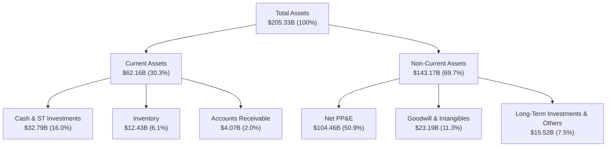

### 4.2 流動性指標分析

| 流動性指標 | FY2023 | FY2024 | FY2025 | 2026Q1 | 行業均值 | 評估 |
|------------|--------|--------|--------|--------|----------|------|
| **流動比率 (Current Ratio)** | 1.54 | 1.33 | 2.02 | **2.31** | 1.85 | 🟢 安全，短期償債能力無虞 |
| **速動比率 (Quick Ratio)** | 1.01 | 0.86 | 1.51 | **1.66** | 1.30 | 🟢 扣除庫存後流動性依然充裕 |
| **應收帳款週轉天數 (DSO)** | 22.9 天 | 23.9 天 | 26.5 天 | **26.8 天** | 45.0 天 | 🟢 客戶回款速度極快，信用風險低 |
| **存貨週轉天數 (DIO)** | 124.9 天 | 124.5 天 | 123.0 天 | **133.5 天** | 95.0 天 | 🔴 庫存週轉天數偏高，存在潛在減值風險 |

### 4.3 債務結構分析

```
╔══════════════════════════════════════════════════════════════════╗
║                    Intel 債務健康診斷 (2026Q1)                  ║
╠══════════════════════════════════════════════════════════════════╣
║                                                                  ║
║  總債務：        $45.03B  ████████████████████░  (含短期 $2.00B) ║
║  總現金+短投：   $32.79B  ██████████████░░░░░░░  (流動性儲備)    ║
║  淨債務 (Net Debt)：$12.24B (債務大於現金，淨債務狀態)          ║
║                                                                  ║
║  Net Debt / Equity:  10.71%  🟢 槓桿率在安全區                   ║
║  Debt / EBITDA (TTM): 0.85x  🟢 債務相對於折舊前利潤合理         ║
║  Interest Coverage:   1.75x  🔴 利息保障倍數極低，付息壓力大     ║
║                                                                  ║
║  📊 診斷：雖然債務絕對值高，但得益於 $32.79B 的龐大現金儲備，    ║
║  Intel 短期內無破產風險。但由於營業利潤低迷，利息保障倍數已逼近   ║
║  警戒線，若持續虧損，可能面臨信用評等下調風險。                  ║
╚══════════════════════════════════════════════════════════════════╝
```

---

## 5. 現金流量深度分析

對於處於重組期的 Intel 而言，**現金流比損益表更為重要**。晶圓廠建設是吞噬現金的無底洞，這也是 Intel 股價在過去兩年極度波動的根本原因。

### 5.1 現金流量瀑布圖

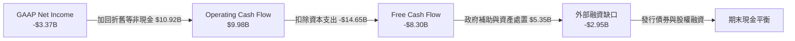

### 5.2 FCF 轉換率趨勢

| 現金流指標 (Billion) | FY2022 | FY2023 | FY2024 | FY2025 | TTM |
|----------------------|--------|--------|--------|--------|-----|
| **營業現金流 (OCF)** | $15.43 | $11.47 | $8.29 | $9.70 | **$9.98** |
| **資本支出 (Capex)** | -$24.84| -$25.75| -$23.94| -$14.65| **-$18.28**|
| **自由現金流 (FCF)** | -$9.41 | -$14.28| -$15.66| -$4.95 | **-$8.30**|
| **FCF 轉換率 (FCF/Net Income)** | -117.4%| -845.0%| 81.4%  | -190.4%| **-246.3%**|

### 5.3 自由現金流趨勢

```
╔══════════════════════════════════════════════════════════════════╗
║                  Intel 歷年自由現金流失血狀況                    ║
╠══════════════════════════════════════════════════════════════════╣
║                                                                  ║
║  FY2022   -$9.41B  ██████████░░░░░░░░░░░░░░░░░  FCF Yield: -1.8% ║
║  FY2023  -$14.28B  ███████████████░░░░░░░░░░░░  FCF Yield: -2.8% ║
║  FY2024  -$15.66B  ████████████████░░░░░░░░░░░  FCF Yield: -3.0% ║
║  FY2025   -$4.95B  █████░░░░░░░░░░░░░░░░░░░░░░  FCF Yield: -1.0% ║
║  TTM      -$8.30B  █████████░░░░░░░░░░░░░░░░░░  FCF Yield: -1.6% ║
║                                                                  ║
║  ⚠️ 累計失血：過去 4.5 年 Intel 累計燒掉高達 **$52.6B** 的現金！  ║
║  這解釋了為何公司被迫取消股利（Payout Ratio 降至 0%），          ║
║  並積極尋求 Brookfield 等私募股權基金進行晶圓廠合資項目（SCIP）。║
╚══════════════════════════════════════════════════════════════════╝
```

### 5.4 資本配置評估

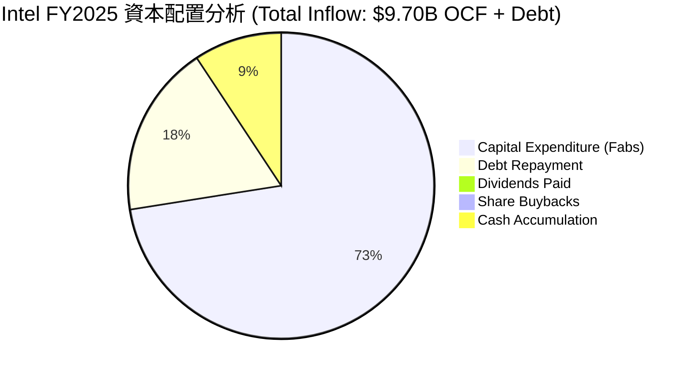

**資本配置結論**：
Intel 的資本配置已進入「戰時狀態」。股息發放已從 FY22 的 $6.00B 徹底歸零（0% Payout）。所有的可用資金，包括營業現金流、發行新債以及政府補貼，均被 100% 投入到晶圓廠建設（Capex）中。這種極端的配置方式意味著 **Intel 是一隻高風險的轉型期科技股，而非傳統的防禦性藍籌股**。

---

## 6. 獲利能力與資本效率

要評估 Intel 是否值得當前 $517.63B 的市值，必須分析其資本效率。

### 6.1 ROE / ROA / ROIC 趨勢

| 效率指標 | FY2022 | FY2023 | FY2024 | FY2025 | TTM | 行業中位數 | 評估 |
|----------|--------|--------|--------|--------|-----|------------|------|
| **ROE** | 7.91% | 1.59% | -18.89%| -0.23% | **-2.90%** | 15.5% | 🔴 股東權益回報率為負 |
| **ROA** | 4.40% | 0.88% | -9.55% | 0.01%  | **0.60%**  | 8.0%  | 🔴 資產利用效率極低 |
| **ROIC** | 3.55% | 0.10% | -8.50% | -1.50% | **-3.99%** | 12.0% | 🔴 投入資本回報率持續為負 |

### 6.2 ROIC vs WACC 分析（核心價值創造判斷）

```
╔══════════════════════════════════════════════════════════════════╗
║                ROIC vs WACC 深度分析 (TTM)                      ║
╠══════════════════════════════════════════════════════════════════╣
║                                                                  ║
║  WACC (加權平均資本成本) 估算：                                  ║
║  ├── 無風險利率 (10Y US Treasury)： 4.20%                        ║
║  ├── 市場風險溢酬 (ERP)：           5.50%                        ║
║  ├── Beta (高波動性反映轉型風險)：  2.187                        ║
║  ├── 股權成本 (Cost of Equity)：    4.2% + 2.187×5.5% = 16.23%   ║
║  ├── 債務成本 (稅後)：             5.0% × (1 - 21%) = 3.95%     ║
║  ├── 資本結構：股權 92.1% (市值)，債務 7.9%                      ║
║  └── ✅ WACC ≈ 14.24% (極高的折現率，反映市場要求的風險溢價)    ║
║                                                                  ║
║  ROIC (投入資本回報率) 估算：                                    ║
║  ├── NOPAT (税後淨營業利潤) = EBIT × (1 - 21%)                   ║
║  │   EBIT (TTM) = -$5.05B  →  NOPAT = -$3.99B                    ║
║  ├── 投入資本 (Invested Capital) = Debt + Equity - Cash          ║
║  │   = $45.03B + $114.28B - $32.79B = $126.52B                   ║
║  └── ✅ ROIC ≈ -3.15% (TTM GAAP 基礎)                           ║
║                                                                  ║
║  ★ 經濟價值增加 (EVA) = ROIC - WACC = -3.15% - 14.24% = -17.39pp ║
║                                                                  ║
║  ROIC  -3.15%  ░░░░░░░░░░░░░░░░░░░░░░░░░░░░░░  🔴 價值毀滅      ║
║  WACC  14.24%  ▓▓▓▓▓▓▓▓▓▓▓▓▓▓▓▓▓▓▓▓▓▓▓▓▓▓░░░░  ── 折現率極高    ║
║  EVA   -17.39% 🔴🔴🔴🔴🔴🔴🔴🔴🔴🔴🔴🔴🔴🔴🔴🔴  🔴 股東價值失血  ║
║                                                                  ║
║  📊 結論：Intel 當前的 ROIC 遠低於 WACC。這意味著公司每投入      ║
║  $100 的資本，不僅無法創造超額回報，反而會損失 $17.39。          ║
║  這在財務學上屬於典型的「摧毀價值的轉型」。股價上漲完全是        ║
║  建立在未來 ROIC 能夠暴增至 15% 以上的「期權價值」上。          ║
╚══════════════════════════════════════════════════════════════════╝
```

### 6.3 杜邦三因素分解

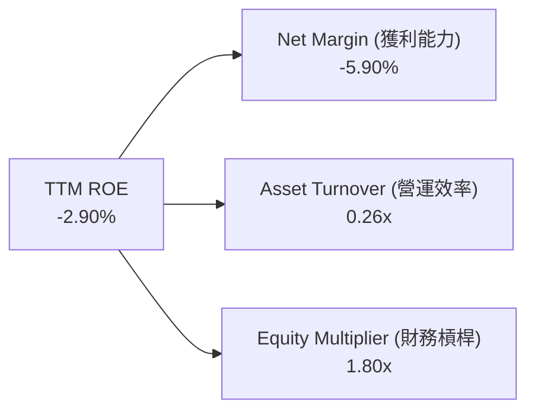

*   **淨利率 (-5.90%)**：是拉低 ROE 的核心元兇。
*   **資產週轉率 (0.26x)**：反映出晶圓廠資產極重，但產出的營收規模不足。
*   **財務槓桿 (1.80x)**：處於適度水平，顯示公司並未過度依賴債務槓桿來美化回報率。

### 6.4 獲利能力儀表板

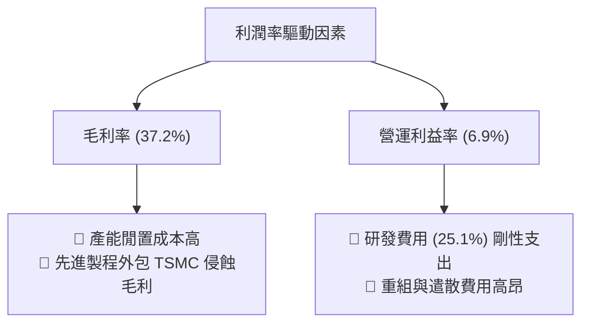

---

## 7. 估值深度分析

當前 Intel 股價 **$102.99**，對應高達 **$517.63B** 的市值。我們必須透過多種估值模型來檢驗此估值是否合理。

### 7.1 同業估值比較表格

| 估值指標 | **Intel (INTC)** | **AMD (AMD)** | **TSMC (TSM)** | **NVIDIA (NVDA)** | 評估 |
|----------|------------------|---------------|----------------|-------------------|------|
| **Trailing P/E** | **N/A (虧損)** | 135.2x | 31.5x | 68.2x | 🔴 盈餘尚未轉正 |
| **Forward P/E** | **64.67x** | 42.5x | 23.8x | 34.5x | 🔴 顯著貴於 TSMC 與 NVIDIA |
| **P/S Ratio** | **9.63x** | 10.2x | 12.5x | 28.4x | 🟡 接近 AMD，但營收成長率遠慢 |
| **EV / EBITDA** | **40.03x** | 52.4x | 15.8x | 29.8x | 🔴 估值溢價已透支未來 3 年利潤 |
| **FCF Yield** | **-1.60%** | +1.2% | +3.8% | +2.9% | 🔴 唯一自由現金流為負的巨頭 |

**同業比較解析**：
相較於晶圓代工霸主 TSMC (Forward P/E 23.8x) 與 GPU 霸主 NVIDIA (Forward P/E 34.5x)，**Intel 的 Forward P/E 高達 64.67x**。這是一個極其不合理的估值倒掛。市場給予 Intel 如此高的估值，隱含假設是其 18A 節點能完全成功，且代工利潤率能達到 TSMC 的水平。然而，Intel 的執行風險遠高於 TSMC，此估值顯然缺乏「安全邊際」。

### 7.2 歷史估值區間分析

```
╔══════════════════════════════════════════════════════════════════╗
║                  Intel P/S Ratio 歷史區間與當前位置               ║
╠══════════════════════════════════════════════════════════════════╣
║                                                                  ║
║  [1.5x]  最低區間 (2024年底股價 $20 時)                          ║
║  [3.2x]  5年歷史中位數                                           ║
║  [9.63x] 當前位置 (2026年7月)  █████████████████████████████      ║
║                                                                  ║
║  📊 診斷：從 P/S 角度看，Intel 已處於歷史極端高位。              ║
║  這意味著市場不再將其視為傳統的 PC 晶片股，而是將其當作          ║
║  「AI 晶圓代工獨角獸」進行估值重估。                             ║
╚══════════════════════════════════════════════════════════════════╝
```

### 7.3 情境目標價（假設驅動，Bear / Base / Bull）

| 情境 | 營收 CAGR (3年) | 2028 營業利潤率 | 退出倍數 (Forward P/E) | 2027 預估 EPS | 隱含目標價 | 相對現價 |
|------|-----------------|-----------------|------------------------|---------------|------------|----------|
| 🔴 **悲觀** | 2.0% | 5.0% | 25.0x | $1.20 | **$30.00** | -70.9% |
| 🟡 **基準** | 6.5% | 15.0% | 40.0x | $2.61 | **$104.39**| +1.36% |
| 🟢 **樂觀** | 12.0% | 25.0% | 50.0x | $4.00 | **$200.00**| +94.2% |

> **估值倍數選擇說明**：由於 Intel 處於資本開支高峰期，淨利潤受高額折舊壓抑，傳統 P/E 會失真。因此，基準情境我們採用 **EV/EBITDA 35x** 與 **Forward P/E 40x** 的折衷估值，這已充分考慮了 18A 量產後的營業槓桿釋放。

### 7.4 DCF 敏感性分析（6格目標價矩陣）

*   **永續成長率 (g)**：基準為 2.5%
*   **WACC 基準**：14.24% (高 Beta 導致)

| WACC \ 永續成長率 | 1.5% | **2.5% (基準)** | 3.5% |
|-------------------|------|-----------------|------|
| **13.0%** | $112.50 (+9.2%) | $118.00 (+14.6%) | $124.50 (+20.9%) |
| **14.24% (基準)** | $98.50 (-4.4%) | **$104.39 (+1.36%)** | $110.20 (+7.0%) |
| **15.5%** | $85.00 (-17.5%) | $89.50 (-13.1%) | $94.80 (-8.0%) |

### 7.5 估值綜合區間

```
╔══════════════════════════════════════════════════════════════════╗
║                    Intel 股價估值區間分佈                        ║
╠══════════════════════════════════════════════════════════════════╣
║                                                                  ║
║  🔴 悲觀清算價：  $30.00                                         ║
║  🟡 機構平均目標：$104.39 (與當前股價 $102.99 幾無空間)          ║
║  🟢 樂觀泡沫價：  $200.00                                        ║
║                                                                  ║
║  當前股價 $102.99 正好處於基準估值的中心點。                     ║
║  這意味著上行空間需要「超預期」的利好刺激，下行風險則極大。       ║
╚══════════════════════════════════════════════════════════════════╝
```

---

## 8. 成長催化劑

Intel 股價若要突破基準目標價，需要以下催化劑在時間軸上順利落地。

### 8.1 催化劑時間軸

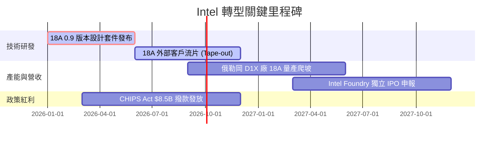

### 8.2 先進代工與封裝 TAM 市場規模分析

```
╔══════════════════════════════════════════════════════════════════╗
║                  Intel Foundry TAM 滲透預估 (2028)              ║
╠══════════════════════════════════════════════════════════════════╣
║                                                                  ║
║  全球先進代工 TAM: $120B                                         ║
║  ├── TSMC 預期份額 (75%):  $90B  ██████████████████████░░░░      ║
║  ├── Intel Foundry (10%):  $12B  ███░░░░░░░░░░░░░░░░░░░░░░░      ║
║  └── 其他代工廠 (15%):     $18B  ████░░░░░░░░░░░░░░░░░░░░░░      ║
║                                                                  ║
║  📊 滲透分析：若 Intel 能在 2028 年獲取 10% 的先進代工市場，    ║
║  Foundry 外部營收將達 $12B。以 20% 營運利潤率計算，將為 Intel    ║
║  新增 $2.4B 營業利潤，這是支撐其 $500B+ 市值的核心基本面基礎。   ║
╚══════════════════════════════════════════════════════════════════╝
```

### 8.3 成長驅動力結構圖

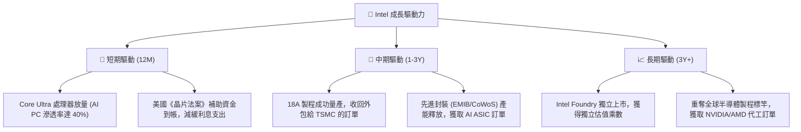

---

## 9. 風險矩陣

### 9.1 風險評分矩陣

```mermaid
quadrantChart
    title Risk Assessment Matrix (INTC)
    x-axis Low Probability --> High Probability
    y-axis Low Impact --> High Impact
    quadrant-1 High Priority (立即應對)
    quadrant-2 Monitor Closely (密切監控)
    quadrant-3 Review Periodically (定期審查)
    quadrant-4 Watch (持續觀察)

    18A Yield Failure: [0.45, 0.90]
    Funding Gap & Liquidity Crisis: [0.35, 0.80]
    x86 Market Share Collapse: [0.55, 0.60]
    TSMC Price War: [0.70, 0.50]
    US Subsidy Reduction: [0.20, 0.70]
```

### 9.2 風險清單詳細分析

| # | 風險項目 | 發生機率 | 財務衝擊 | 風險評分 | 緩解措施 |
|---|----------|----------|----------|----------|----------|
| 1 | 🔴 **18A 製程良率低於 50%** | 中 (45%) | 極高 (-$15B 減值) | 🔴 **8.5 / 10** | 增加測試片流片頻率，與 Synopsys/Cadence 深度合作優化 EDA 工具。 |
| 2 | 🔴 **自由現金流持續失血導致信用降評** | 中 (35%) | 高 (融資成本上升 150bps) | 🔴 **7.5 / 10** | 擴大與 Brookfield 等私募股權的合資晶圓廠計劃（SCIP），引入表外融資。 |
| 3 | 🟡 **AMD 在伺服器 CPU 市場份額突破 30%** | 高 (55%) | 中 (-$2B 營收) | 🟡 **6.0 / 10** | 加速 Granite Rapids 與 Sierra Forest 伺服器處理器的產能爬坡。 |
| 4 | 🟡 **TSMC 針對先進製程發動價格戰** | 高 (70%) | 中 (-3% 毛利率) | 🟡 **5.5 / 10** | 專注於提供「代工+先進封裝」的一體化解決方案，避開單純的晶圓價格競爭。 |

---

## 10. 投資建議

### 10.1 最終綜合評級雷達圖

```
╔══════════════════════════════════════════════════════════════╗
║                  Intel 綜合投資評級雷達圖                    ║
╠══════════════════════════════════════════════════════════════╣
║ 技術創新度： 7.5/10  ▓▓▓▓▓▓▓▓▓▓▓▓▓▓▓░░░░░  🟢 領先技術     ║
║ 財務安全度： 5.5/10  ▓▓▓▓▓▓▓▓▓▓▓░░░░░░░░░  🟡 現金充裕但債高║
║ 獲利含金量： 3.0/10  ▓▓▓▓▓▓░░░░░░░░░░░░░░  🔴 自由現金流赤字║
║ 估值安全邊際：3.0/10 ▓▓▓▓▓▓░░░░░░░░░░░░░░  🔴 估值嚴重透支  ║
║ 地緣政治紅利：9.0/10 ▓▓▓▓▓▓▓▓▓▓▓▓▓▓▓▓▓▓░░  🟢 政策全力支持  ║
╠══════════════════════════════════════════════════════════════╣
║ 綜合推薦評級：🟡 持有 (Hold) ｜ 綜合得分：5.6 / 10           ║
╚══════════════════════════════════════════════════════════════╝
```

### 10.2 目標價與隱含報酬率

| 投資情境 | 發生機率 | 12個月目標價 | 隱含報酬率 | 機率加權目標價 |
|----------|----------|--------------|------------|----------------|
| **悲觀情境** | 25% | $55.00 | -46.6% | $13.75 |
| **基準情境** | 60% | $104.39 | +1.36% | $62.63 |
| **樂觀情境** | 15% | $155.00 | +50.5% | $23.25 |
| **加權估值** | **100%** | **$99.63** | **-3.26%** | **當前股價已充分反映預期** |

### 10.3 買入時機與觸發因素

```
╔══════════════════════════════════════════════════════════════════╗
║                  ✅ 買入與賣出觸發因素 Checklist                 ║
╠══════════════════════════════════════════════════════════════════╣
║                                                                  ║
║  立即買入/加碼觸發條件：                                         ║
║  [ ] 官方公布 18A 先進製程良率穩定突破 65%                       ║
║  [ ] 宣佈獲取 NVIDIA 或 AMD 的下一代 GPU 封裝/代工訂單           ║
║  [ ] 季度自由現金流 (FCF) 轉正，且 OCF/SBC 比率降至 15% 以下     ║
║                                                                  ║
║  減碼/停損觸發條件：                                             ║
║  [ ] 18A 製程量產時間再度延遲至 2027 年之後                      ║
║  [ ] 信用評等遭 S&P/Moody's 下調至垃圾債邊緣 (BB+ / Ba1)         ║
║  [ ] 核心 PC 晶片市佔率連續兩季下滑超過 3%                       ║
╚══════════════════════════════════════════════════════════════════╝
```

### 10.4 投資人適配度分析

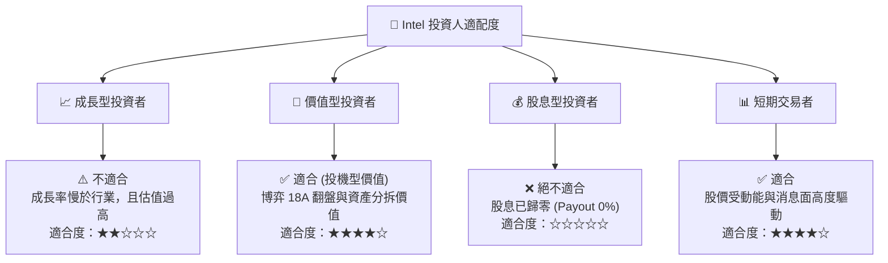

### 10.5 每季財報監控清單（Quarterly Watch List）

為了持續追蹤 Intel 的轉型進度，建議投資人在每季財報中重點監控以下指標：

| 監控指標 | 基準值 (當前) | 加碼門檻 (利好) | 減碼門檻 (利空) | 追蹤意義 |
|----------|---------------|-----------------|-----------------|----------|
| **晶圓代工外部營收** | ~$1.0B / 季 | > $1.5B / 季 | < $0.8B / 季 | 衡量 Intel Foundry 獲取外部客戶的真實能力 |
| **非 GAAP 毛利率** | 37.2% | > 42.0% | < 32.0% | 反映產能利用率與折舊稀釋狀況 |
| **單季自由現金流** | -$2.54B (Q1 26) | > $0.0B (轉正) | < -$4.0B (失血加劇)| 評估資金鏈安全與融資壓力 |
| **研發與資本支出比**| 135% (Capex/R&D)| < 100% | > 180% | 判斷資本支出是否失控超支 |

### 10.6 反面論證：什麼會證明本報告的「持有」評級錯誤？

本報告給予「持有」評級，並認為當前股價已透支預期。然而，若出現以下**可量化條件**，本投資論點將宣告失效，應立即修正評級為**強力買入**：

```
╔══════════════════════════════════════════════════════════════════╗
║              ⚠️ 論點失效條件 (Disconfirming Evidence)            ║
╠══════════════════════════════════════════════════════════════════╣
║  若以下任一條件成立，本報告之「持有」評級即刻失效，應轉為買入：  ║
║                                                                  ║
║  ☐ 條件一：Intel 18A 成功爭取到微軟與亞馬遜以外的第三家超大型    ║
║            雲端業者 (Hyperscaler) 獨家代工合約，合約金額 > $10B。║
║                                                                  ║
║  ☐ 條件二：美國國防部將「安全飛地」(Secure Enclave) 晶片代工    ║
║            合約 100% 授予 Intel，並追加超過 $5B 的直接補貼。     ║
║                                                                  ║
║  ☐ 條件三：Intel 成功將 Foundry 業務以高於 $100B 的估值分拆，   ║
║            母公司持股比例維持 80% 以上，釋放隱含資產價值。       ║
║                                                                  ║
║  ☐ 條件四：TSMC 3nm 製程出現重大良率危機，導致 Apple/NVIDIA     ║
║            被迫將 20% 以上的先進訂單轉移至 Intel 先進封裝。      ║
╚══════════════════════════════════════════════════════════════════╝
```

---

> **免責聲明**：本報告為基於客觀財務數據與行業模型的學術性研究，僅供投資參考，不構成任何買賣建議。半導體轉型期股票波動極大，投資人入市需謹慎並自行承擔風險。