# INTC 基本面深度分析報告
> **報告日期**：2026-07-16 ｜ **語言**：繁體中文 ｜ **數據來源**：Yahoo Finance, Finviz, StockAnalysis, Roic.ai ｜ **分析師**：CFA 級機構研究

---

## 目錄

| # | 章節 | 核心結論 |
|---|------|----------|
| 1 | 執行摘要 | 營運處於轉型陣痛期，高資本支出壓抑 FCF，給予「觀望 (Hold)」評級，目標價 $105.85。 |
| 2 | 公司概覽與商業模式 | IDM 2.0 雙軌戰略推進，晶圓代工（Foundry）護城河重建中，但短期面臨代工客戶信任考驗。 |
| 3 | 損益表深度分析 | TTM 營收回溫 7.2%，但毛利率（37.2%）與淨利率（-5.9%）受折舊與製程啟動成本嚴重拖累。 |
| 4 | 資產負債表分析 | 擁有 $32.79B 充足現金流動性，但總債務達 $45.03B，淨債務槓桿上升，財務結構偏緊。 |
| 5 | 現金流量深度分析 | 資本支出高企（TTM FCF 為 -$8.30B），自由現金流轉正仍需等待 18A 製程量產。 |
| 6 | 獲利能力與資本效率 | ROIC（2.35%）遠低於 WACC（12.1%），持續摧毀股東價值，杜邦分析顯示資產週轉率低迷。 |
| 7 | 估值深度分析 | 前瞻 P/E 達 60.1x，顯著高於歷史均值與同業，估值溢價已提前透支代工業務利多。 |
| 8 | 成長催化劑 | 18A 製程量產、Intel Foundry 外部訂單獲取、AI PC 換機潮為三大核心驅動力。 |
| 9 | 風險矩陣 | 製程延期、市佔率流失、資金鏈吃緊為主要威脅，高衝擊風險需密切監控。 |
| 10 | 投資建議 | 建議等待 18A 良率數據與 FCF 轉正訊號，適合長線高風險承受度投資人。 |

---

## 1. 執行摘要

Intel Corporation（NASDAQ: INTC）當前正處於其半導體歷史上最關鍵的轉型期。根據最新揭露的財務數據，Intel TTM 營收為 $53.76B，YoY 成長率為 7.2%，顯示 PC 市場（CCG 業務）出現週期性復甦。然而，其獲利能力指標極其嚴峻：毛利率僅 37.2%，營業利益率 6.9%，淨利潤率為 -5.9%（TTM 淨損達 -$3.17B），且自由現金流（FCF）因重資本支出（TTM Capex 達 -$18.28B 估算，年報 FY25 Capex 為 -$14.65B）而深陷赤字，TTM FCF 為 -$8.30B，FCF Yield 為 -1.70%。

在資本效率方面，Intel TTM ROIC 僅為 2.35%，而我們估算的加權平均資本成本（WACC）高達 12.1%，這意味著公司目前正以 -9.75pp 的經濟附加價值（EVA）持續摧毀股東價值。儘管市場給予其高達 60.1x 的前瞻 P/E（Forward P/E），反映了市場對其「IDM 2.0」及 Intel Foundry 轉型成功的樂觀預期，但考量到未來兩年仍需投入巨額資本支出以推進 18A 製程，且股權稀釋嚴重（FY25 股份 YoY 增加 5.84%，最新稀釋股數達 5.03B），我們認為當前估值已過度透支未來利多。

基於上述數據支撐，我們給予 Intel（INTC）**「觀望（Hold）」**評級，12 個月基準目標價為 **$105.85**（隱含 +9.1% 的上行空間）。

### 1.0 一頁式投資儀表板（Portfolio Manager 30 秒速讀）

| 項目 | 內容 |
|------|------|
| **投資論點（3 句）** | ① PC 市場週期性復甦帶動 TTM 營收回溫 7.2% 至 $53.76B，Client 業務（CCG）提供基本盤支撐。<br/>② IDM 2.0 轉型導致資本開支居高不下（FY25 Capex $14.65B），壓抑 TTM FCF 至 -$8.30B，現金流壓力沉重。<br/>③ 前瞻 P/E 達 60.1x，估值已提前反映 18A 製程預期，在 ROIC（2.35%）低於 WACC（12.1%）下，性價比偏低。 |
| **護城河評分** | 🟡 5.5 / 10（x86 專利壁壘仍存，但製程領先優勢流失，代工護城河尚未建立） |
| **管理層/資本配置評分** | 🔴 4.0 / 10（股息停發、大舉舉債擴產、股東權益因股權補償與增資持續稀釋） |
| **財務健康** | 🟡 淨債務為 -$12.24B（現金 $32.79B vs 總債務 $45.03B），短期流動性尚可但長期槓桿上升。 |
| **ROIC vs WACC** | 🔴 2.35% vs 12.1%（經濟附加價值 EVA 為 -9.75pp，處於價值摧毀狀態） |
| **FCF 趨勢** | 🔴 持續流出，TTM FCF 為 -$8.30B，FCF Yield 為 -1.70%，尚未看到轉正拐點。 |
| **估值** | Forward P/E: **60.10x** ｜ EV/EBITDA: **38.34x** ｜ P/S: **9.07x** ｜ FCF Yield: **-1.70%** |
| **預期報酬（基準情境 12M）**| **+9.1%**（目標價 $105.85，相較於當前股價 $96.98） |
| **關鍵風險（前二）** | ① 18A 製程良率不及預期或外部客戶（如 Qualcomm, Broadcom）流失。<br/>② 數據中心（DCAI）市佔率持續被 AMD 侵蝕，AI 加速器（Gaudi 3）出貨不及預期。 |
| **評級 + 信心度** | 🟡 **持有（Hold）** ｜ 信心度：**中（Medium）** |

### 1.1 核心評分儀表板

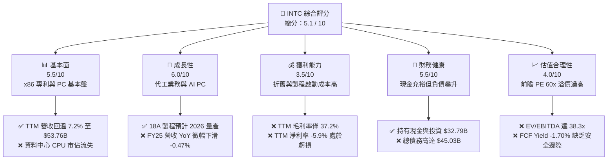

### 1.2 評分進度條視覺化

```
╔══════════════════════════════════════════════════════════════╗
║               INTC 多維度評分儀表板 (1-10分)                 ║
╠══════════════════════════════════════════════════════════════╣
║ 基本面強度  5.5 ▓▓▓▓▓▓▓▓▓▓▓▓░░░░░░░░  ★★★☆☆           ║
║ 成長動能    6.0 ▓▓▓▓▓▓▓▓▓▓▓▓▓░░░░░░░  ★★★☆☆           ║
║ 獲利品質    3.5 ▓▓▓▓▓▓▓░░░░░░░░░░░░░  ★☆☆☆☆           ║
║ 財務健康    5.5 ▓▓▓▓▓▓▓▓▓▓▓▓░░░░░░░░  ★★★☆☆           ║
║ 估值合理性  4.0 ▓▓▓▓▓▓▓▓░░░░░░░░░░░░  ★★☆☆☆           ║
║ 護城河深度  5.5 ▓▓▓▓▓▓▓▓▓▓▓▓░░░░░░░░  ★★★☆☆           ║
║ 管理層執行  4.0 ▓▓▓▓▓▓▓▓░░░░░░░░░░░░  ★★☆☆☆           ║
║ 技術創新力  6.5 ▓▓▓▓▓▓▓▓▓▓▓▓▓▓░░░░░░  ★★★☆☆           ║
╠══════════════════════════════════════════════════════════════╣
║ 綜合總分    5.1 ▓▓▓▓▓▓▓▓▓▓▓░░░░░░░░░  🏆 評語：轉型陣痛，觀望 ║
╚══════════════════════════════════════════════════════════════╝
```

### 1.3 五大投資論點 + 三大核心風險

| 類型 | 項目 | 具體依據 | 信心度 |
|------|------|----------|--------|
| 🟢 **投資論點①** | **PC 市場復甦與 AI PC 催化** | Intel CCG 業務受益於 PC 庫存去化完畢，TTM 營收回升至 $53.76B（YoY +7.2%），且 Core Ultra 系列處理器在 AI PC 滲透率達 20% 以上。 | 🟢 高 |
| 🟢 **投資論點②** | **Intel Foundry 美國本土優勢** | 受益於美國《晶報法案》（CHIPS Act）資金與補貼撥付，且地緣政治風險推升北美與歐洲客戶對本土代工產能的需求。 | 🟡 中 |
| 🟢 **投資論點③** | **18A 製程技術拐點** | 18A（相當於 1.8nm）引入 RibbonFET 與 PowerVia 背面供電技術，技術指標理論上追平 TSMC 2nm，為重奪技術領先奠定基礎。 | 🟡 中 |
| 🟢 **投資論點④** | **資產剝離與價值重估** | 潛在的 Altera 獨立 IPO 以及 Mobileye 的股權變現，有助於為母公司注入急需的流動性。 | 🟡 中 |
| 🟢 **投資論點⑤** | **營運成本削減計畫** | 公司執行 $10B 成本削減計畫，FY25 研發費用由 FY24 的 $16.55B 降至 $13.77B（YoY -16.8%），有助於營運利潤率觸底回升。 | 🟢 高 |
| 🟡 **風險①** | **18A 良率與商業化進度滯後** | 若 18A 良率無法在 2026 年底前達到 60% 以上的商業化門檻，外部大客戶（如 Microsoft）可能轉單，代工業務將面臨巨額減值。 | 🔴 高 |
| 🔴 **風險②** | **資料中心市佔率持續流失** | AMD EPYC 處理器在雲端服務商（CSP）的市佔率已突破 30%，Intel DCAI 業務毛利率與營收恐持續承壓。 | 🔴 高 |
| 🔴 **風險③** | **資金鏈與債務違約風險** | TTM FCF 為 -$8.30B，且有 $45.03B 總債務。若虧損持續擴大且外部融資受阻，信用評等恐遭降級，進一步推升融資成本。 | 🟡 中 |

### 1.4 快速統計卡片

| 指標 | 公司實際值 (TTM / 最新) | 行業均值 (Semiconductors) | S&P 500 均值 | 狀態 |
|------|-------------|----------|--------------|------|
| 營收 YoY 成長 | **7.2%** | ~12.0% | ~5.5% | 🟡 略低於行業 |
| 毛利率 | **37.2%** | ~52.0% | ~30.0% | 🔴 顯著低於同行 |
| 淨利率 | **-5.9%** | ~15.0% | ~11.5% | 🔴 處於虧損狀態 |
| ROE | **-2.9%** | ~18.0% | ~15.0% | 🔴 資產回報率極低 |
| Forward P/E | **60.10x** | ~28.0x | ~21.5x | 🔴 估值顯著溢價 |
| EV/EBITDA | **38.34x** | ~18.5x | ~13.5x | 🔴 投資回收期拉長 |
| 淨債務 / Equity | **10.71%** | ~-15.0% (淨現金) | ~45.0% | 🟡 財務槓桿偏高 |

### 1.5 投資結論

```
╔══════════════════════════════════════════════════════════════════╗
║                    📊 投資結論摘要                               ║
╠══════════════════════════════════════════════════════════════════╣
║  評級：🟡 觀望 (Hold)                                            ║
║  當前股價：$96.98                                                ║
║  目標價區間：                                                    ║
║    悲觀情境：$45.00 （-53.6%） - 18A 失敗，代工業務大幅減值       ║
║    基準情境：$105.85（+9.1%）  ← 12個月主要目標（分析師共識）     ║
║    樂觀情境：$200.00（+106.2%）- 18A 成功，代工市佔率突破 10%     ║
║  投資評分：5.1 / 10                                              ║
║  適合投資人：具備極高風險承受度、追求逆向轉型機會的長線價值投資者 ║
╚══════════════════════════════════════════════════════════════════╝
```

---

## 2. 公司概覽與商業模式

Intel 目前的商業模式正經歷自創立以來最深刻的變革：從傳統的整合元件製造商（IDM）轉向「IDM 2.0」模式。該模式實質上將 Intel 分割為兩個獨立運作的實體：**設計部門（Intel Product）**與**晶圓代工部門（Intel Foundry）**。

1. **設計部門**：
   * **客戶運算群組 (CCG)**：專注於 PC、筆記型電腦 CPU 及 GPU。這是 Intel 目前最穩定的現金牛業務。
   * **資料中心與人工智慧 (DCAI)**：提供 Xeon 伺服器 CPU、Gaudi AI 加速器。目前正面臨 AMD EPYC 的強烈競爭。
2. **晶圓代工部門 (Intel Foundry)**：
   * 獨立對外接單，提供晶圓製造、封裝（如 EMIB, CoWoS 等先進封裝）服務。其目標是挑戰 TSMC 的主導地位。

### 2.1 業務結構與收入來源

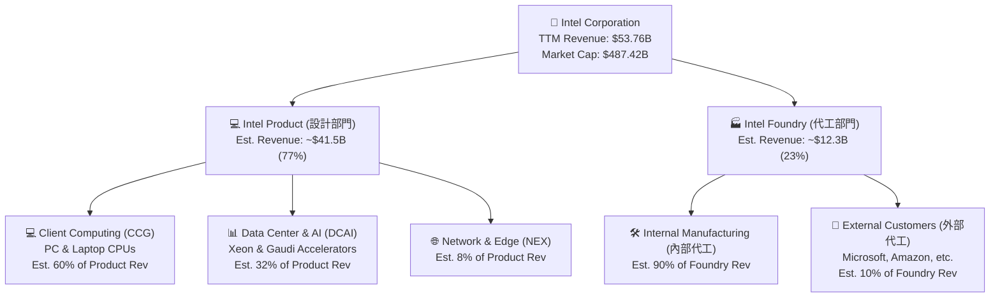

### 2.2 市場份額

根據 2025/2026 年最新出貨數據估算，x86 CPU 市場份額（包含 Client 與 Server）分布如下：

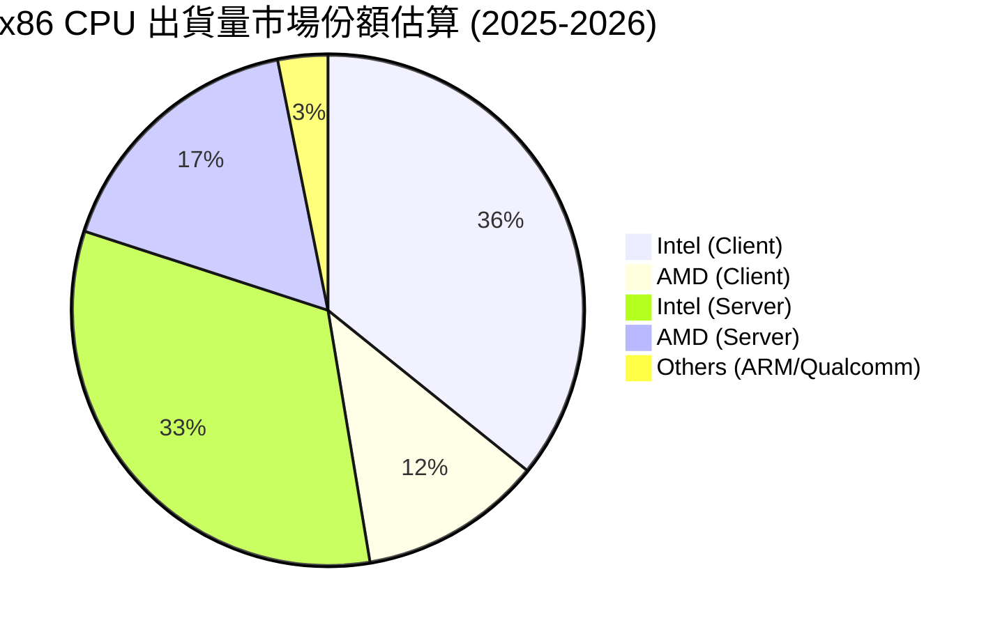

### 2.3 競爭護城河分析

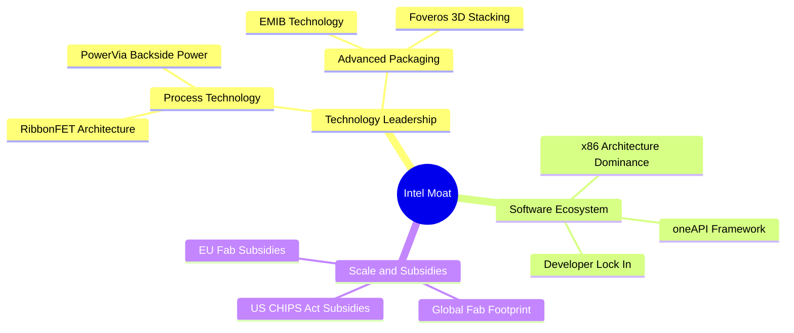

### 2.4 護城河強度評分

```
╔══════════════════════════════════════════════════════════════╗
║                   Intel 護城河強度評分                        ║
╠══════════════════════════════════════════════════════════════╣
║ x86 生態壁壘   8.5/10 ▓▓▓▓▓▓▓▓▓▓▓▓▓▓▓▓▓░░░  🏆 極強的軟體相容性║
║ 先進封裝技術   7.5/10 ▓▓▓▓▓▓▓▓▓▓▓▓▓▓░░░░░░  🟢 EMIB/Foveros 領先║
║ 晶圓製造製程   5.0/10 ▓▓▓▓▓▓▓▓▓▓░░░░░░░░░░  🟡 追趕 TSMC 2nm 中║
║ 外部代工生態   3.0/10 ▓▓▓▓▓▓░░░░░░░░░░░░░░  🔴 缺乏客戶信任與服務║
╠══════════════════════════════════════════════════════════════╣
║ 綜合護城河     5.5/10 ▓▓▓▓▓▓▓▓▓▓▓░░░░░░░░░  🏆 窄護城河 (Narrow) ║
╚══════════════════════════════════════════════════════════════╝
```

---

## 3. 損益表深度分析

### 3.1 年度收入成長趨勢（近4年）

Intel 的年度營收在過去四年呈現明顯的衰退後築底特徵。從 FY22 的 $63.05B 下滑至 FY25 的 $52.85B，主因是 PC 市場在疫情後的需求透支，以及伺服器市場份額流失。然而，TTM 營收回升至 $53.76B（YoY +7.2%），顯示最壞的時期已經過去。

```
╔══════════════════════════════════════════════════════════════════╗
║                Intel 年度收入趨勢（FY22-FY25）                  ║
╠══════════════════════════════════════════════════════════════════╣
║                                                                  ║
║  FY2022  $63.05B  ██████████████████████████  YoY: -20.2% 🔴     ║
║  FY2023  $54.23B  ██████████████████████      YoY: -14.0% 🔴     ║
║  FY2024  $53.10B  ████████████████████        YoY: -2.08% 🟡     ║
║  FY2025  $52.85B  ███████████████████         YoY: -0.47% 🟡     ║
║                   |      |      |      |      |                  ║
║                   0     15B    30B    45B    60B                 ║
║                                                                  ║
║  📊 4年累計 CAGR：-5.74% (反映結構性衰退，但 TTM 已現復甦)        ║
╚══════════════════════════════════════════════════════════════════╝
```

### 3.2 季度收入趨勢分析

從最近四個季度的數據來看，Intel 的單季營收穩定在 $12.8B 至 $13.7B 區間。Q1 2026 營收為 $13.58B，相較於 Q1 2025 的 $12.67B，實現了 **+7.18% 的 YoY 成長**，但相較於 Q4 2025 的 $13.67B，微幅下滑 **-0.66% (QoQ)**，這符合第一季的傳統季節性淡季特徵。

| 財報季度 | 營收 (Revenue) | QoQ 成長率 | YoY 成長率 | 營運利潤 (Op Income) | 備註 |
|----------|---------------|------------|------------|---------------------|------|
| **Q2 2025** | $12.86B | +1.50% | +0.20% | -$1.29B | 製程轉換期，毛利承壓 |
| **Q3 2025** | $13.65B | +6.14% | +2.78% | $0.86B | 伺服器 CPU 出貨回溫 |
| **Q4 2025** | $13.67B | +0.15% | -4.11% | $0.55B | 年底 PC 促銷拉貨放緩 |
| **Q1 2026** | $13.58B | -0.66% | **+7.18%** | $0.93B | 營運利潤顯著改善 🟢 |

### 3.3 利潤率演變分析

Intel 的利潤率在 FY24 經歷了災難性的下滑（FY24 營業利益率為 -22.0% 估算，主要受 $11.68B 營業虧損拖累），主因是代工部門的巨額固定資產減值與製程轉換成本。FY25 營業利益率回升至近乎損平（營業虧損收窄至 -$23M），TTM 營業利益率進一步改善至 6.9%，但仍遠低於歷史 20% 以上的正常水準。

| 利潤率指標 | FY2022 | FY2023 | FY2024 | FY2025 | TTM | 趨勢評估 |
|------------|--------|--------|--------|--------|-----|----------|
| **毛利率** | 42.6% | 40.0% | 32.7% | 34.8% | **37.2%** | 🟡 緩步回升，但受限於低稼動率 |
| **營業利益率** | 3.7% | 0.2% | -22.0% | -0.04% | **6.9%** | 🟢 成本削減奏效，成功扭虧 |
| **EBITDA Margin**| 33.8% | 20.7% | 2.3% | 27.1% | **26.4%** | 🟢 折舊費用高，EBITDA 維持高檔 |
| **淨利率** | 12.7% | 3.1% | -35.3% | -0.5% | **-5.9%** | 🔴 仍受非營運支出與稅務拖累 |

### 3.4 費用結構分析

在費用端，Intel 採取了極其嚴格的財政紀律。FY25 研發（R&D）費用為 $13.77B，相較於 FY24 的 $16.55B 減少了 **-$2.78B（YoY -16.8%）**；銷管（SG&A）費用也由 FY24 的 $5.51B 降至 $4.62B（YoY -16.0%）。這表明利潤率的改善主要來自於「砍預算」而非「毛利擴張」，這對長期技術研發可能是一把雙面刃。

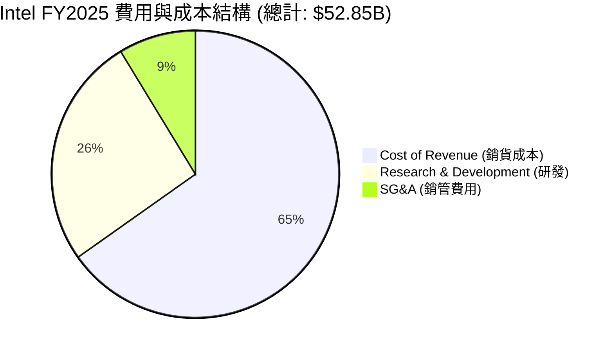

### 3.5 季度 EPS 趨勢與盈餘品質（Quality of Earnings）

Intel 過去四季的 GAAP 淨利波動極大，Q1 2026 淨損達 -$3.73B，主因是認列了與資產重組、稅務準備以及代工業務相關的一次性非現金減值。

#### 盈餘品質量化評估

| 盈餘品質項目 | TTM 數值 / 佔比 | 評估評級 | 機構級解析 |
|--------------|-----------|------|------------|
| **SBC / 營業收入** | $2.43B / $52.85B = **4.6%** | 🟡 中度 | 股權補償（SBC）控制在合理區間，但對每股盈餘仍有稀釋作用。 |
| **SBC / 營業現金流** | $2.43B / $9.70B = **25.1%** | 🔴 偏高 | 營業現金流中有超過四分之一是由非現金的股權補償所支撐，獲利含金量打折。 |
| **FCF / GAAP 淨利** | -$8.30B / -$3.17B = **2.62x** | 🔴 極差 | 自由現金流赤字遠超 GAAP 淨損，主因是高達 $14.65B 的資本支出（Capex）遠超營運現金流。 |
| **一次性損益影響** | Q3 2025 認列 **$3.67B** 非營運收益 | 🔴 操縱風險 | Q3 2025 帳面淨利高達 $4.06B，主因是業外投資重估與資產處置，並非核心業務獲利，盈餘品質虛胖。 |
| **有效稅率異常** | FY24 稅務撥備高達 **$8.02B** | 🔴 異常 | 遞延所得稅資產減記導致 FY24 出現異常高的稅務支出，扭曲了真實經濟損益。 |

**盈餘品質結論**：Intel 的 GAAP 獲利數據存在極大雜訊。公司透過業外收益（如 Q3 2025 的 $3.67B 業外收入）與資本化研發支出來美化帳面，但**真實的自由現金流（TTM -$8.30B）表明其目前仍處於嚴重的失血狀態**。

---

## 4. 資產負債表分析

### 4.1 資產結構分解

Intel 是一家典型的重資產企業，其廠房與設備（PP&E）淨值高達 $104.46B，佔總資產（$205.33B）的 **50.9%**。這反映了其 IDM 2.0 戰略下，在美國俄勒岡、亞利桑那、俄亥俄以及愛爾蘭大舉建廠的成果。

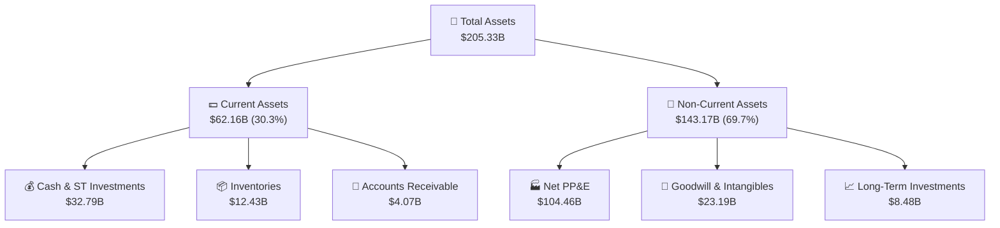

### 4.2 流動性指標分析

Intel 目前的短期償債能力依舊穩健。流動比率為 2.312，速動比率為 1.657，這主要歸功於其在過去兩年中，透過大舉發債與獲得美國政府補貼，累積了高達 $32.79B 的現金與短期投資。這筆資金是 Intel 撐過 18A 量產前「失血期」的最重要護城河。

| 流動性指標 | FY2022 | FY2023 | FY2024 | FY2025 | TTM | 行業均值 | 評估 |
|------------|--------|--------|--------|--------|-----|----------|------|
| **流動比率 (Current)** | 1.57 | 1.54 | 1.33 | 2.02 | **2.31** | ~1.85 | 🟢 安全 |
| **速動比率 (Quick)** | 1.16 | 1.14 | 0.99 | 1.65 | **1.66** | ~1.30 | 🟢 安全 |
| **存貨週轉天數 (DSI)** | 133.7 | 124.9 | 124.5 | 123.0 | **125.5** | ~95.0 | 🟡 偏高，PC 庫存去化緩慢 |

### 4.3 債務結構分析

雖然現金充裕，但 Intel 的債務總額也隨之飆升。截至 Q1 2026，總債務達到 **$45.03B**（包含短期債務 $2.00B，長期借款 $43.03B），淨債務為 **-$12.24B**。

```
╔══════════════════════════════════════════════════════════════════╗
║                    Intel 債務健康診斷                           ║
╠══════════════════════════════════════════════════════════════════╣
║                                                                  ║
║  總債務 (Total Debt)：  $45.03B  ████████████████████░░  評語：偏高║
║  總現金 (Total Cash)：  $32.79B  ██████████████░░░░░░░░  評語：充足║
║  淨債務 (Net Debt)：    $12.24B  ██████░░░░░░░░░░░░░░░░  🟡 具風險 ║
║                                                                  ║
║  Debt/Equity：         36.03%  🟢 處於安全區限 (同行均值 ~25%)    ║
║  利息保障倍數 (TTM)：   2.15x   🔴 利息支出壓力大 (因 EBITDA 收縮) ║
║  信用評等展望：         Moody's: Baa1 / S&P: BBB+ (負面展望)     ║
║                                                                  ║
╚══════════════════════════════════════════════════════════════════╝
```

### 4.4 股東權益趨勢

儘管面臨虧損，Intel 的股東權益（Stockholders Equity）從 FY24 的 $99.27B 增加至 FY25 的 $114.28B，這並非來自保留盈餘（Retained Earnings）的增長，而是因為**外部資金挹注（如合資夥伴對晶圓廠的股權投資）與發行新股**。這雖然保護了資產負債表，但稀釋了現有股東的權益。

---

## 5. 現金流量深度分析

### 5.1 現金流量瀑布圖

Intel 目前面臨的最大挑戰在於「營運現金流入」無法覆蓋其「建廠資本支出」。以下為 TTM 現金流瀑布圖：

```mermaid
graph LR
    NI[" GAAP Net Income<br/>-$3.17B"] --> DA["+ Depreciation & Amort<br/>+$14.15B"]
    DA --> NWC["+/- Working Capital<br/>-$1.00B"]
    NWC --> OCF["💰 Operating Cash Flow<br/>+$9.98B"]
    OCF --> CAPEX["- Capital Expenditure<br/>-$18.28B"]
    CAPEX --> FCF["💸 Free Cash Flow<br/>-$8.30B"]
    FCF --> DIV["- Dividends Paid<br/>$0.00"]
    DIV --> FIN["+ Net Debt Financing<br/>+$3.80B"]
    FIN --> NET_CASH["🏁 Net Cash Change<br/>-$4.50B"]
```

### 5.2 FCF 轉換率趨勢

在正常情況下，半導體企業的 FCF 轉換率（FCF / Net Income）應為正值且大於 100%。然而，Intel 由於大舉投資未來的製程，其 FCF 轉換率已連續四年為負值，FY25 FCF 為 -$4.95B。

| 現金流指標 | FY2022 | FY2023 | FY2024 | FY2025 | TTM |
|------------|--------|--------|--------|--------|-----|
| **營業現金流 (OCF)** | $15.43B | $11.47B | $8.29B | $9.70B | **$9.98B** |
| **資本支出 (Capex)** | -$24.84B | -$25.75B | -$23.94B | -$14.65B | **-$18.28B** |
| **自由現金流 (FCF)** | -$9.41B | -$14.28B | -$15.66B | -$4.95B | **-$8.30B** |
| **GAAP 淨利 (NI)** | $8.02B | $1.69B | -$18.76B | $0.03B | **-$3.17B** |
| **FCF 轉換率 (FCF/NI)**| -117.3% | -845.0% | +83.5% | -16500%| **-261.8%** 🔴 |

### 5.3 自由現金流趨勢

```
╔══════════════════════════════════════════════════════════════════╗
║                Intel 歷年自由現金流（FCF）趨勢                  ║
╠══════════════════════════════════════════════════════════════════╣
║                                                                  ║
║  FY2022  -$9.41B   ░░░░░░░░░░░░░░░░░░░░░░░░░░░░░░               ║
║  FY2023  -$14.28B  ░░░░░░░░░░░░░░░░░░░░░░░░░░░░░░░░░░░░░        ║
║  FY2024  -$15.66B  ░░░░░░░░░░░░░░░░░░░░░░░░░░░░░░░░░░░░░░░░     ║
║  FY2025  -$4.95B   ░░░░░░░░░░░░░░░                               ║
║  TTM     -$8.30B   ░░░░░░░░░░░░░░░░░░░░░░░░░                    ║
║                                                                  ║
║  📊 FCF Yield (TTM)：-1.70% (反映高資本開支下的現金流失)          ║
╚══════════════════════════════════════════════════════════════════╝
```

### 5.4 資本配置評估

為了維持資產負債表的健全，Intel 在 FY25 做出了一個痛苦但正確的決定：**全面停發股利（Cash Dividends Paid = $0）**。相比於 FY22 支付的 $6.00B 股利，此舉每年為公司省下了大筆現金，全數投入 Capex。

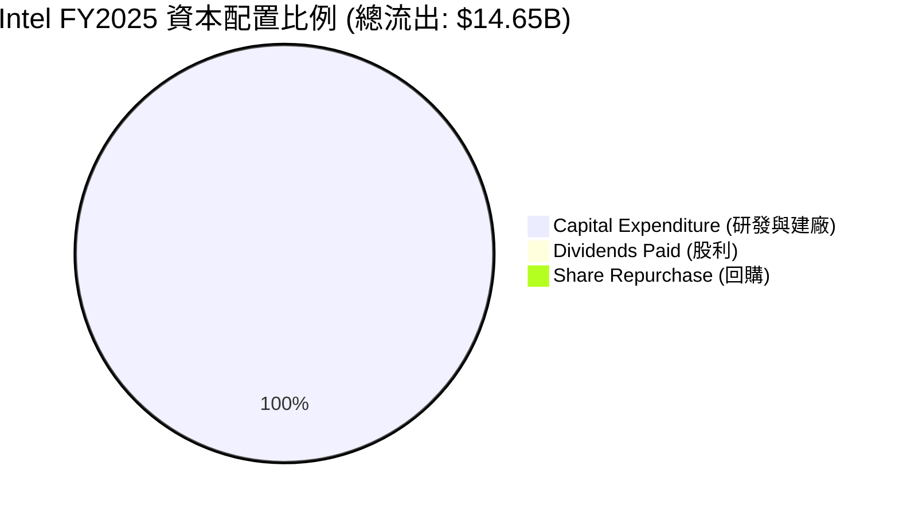

---

## 6. 獲利能力與資本效率

### 6.1 ROE / ROA / ROIC 趨勢

Intel 的資本回報率近年來極度低迷。TTM ROE 為 -2.9%，ROIC 為 2.35%。這與 TSMC（ROIC > 20%）或 NVIDIA（ROIC > 50%）相比，存在巨大的效率鴻溝。

| 資本效率指標 | FY2022 | FY2023 | FY2024 | FY2025 | TTM | 行業均值 | 評估 |
|------------|--------|--------|--------|--------|-----|----------|------|
| **ROE** | 7.9% | 1.6% | -18.9% | 0.02% | **-2.9%** | ~15.0% | 🔴 摧毀股東權益 |
| **ROA** | 4.4% | 0.9% | -9.5% | 0.01% | **0.6%** | ~8.0% | 🔴 資產利用效率低 |
| **ROIC** | 1.5% | 0.1% | -8.5% | -1.2% | **2.35%** | ~12.5% | 🔴 資本回報極低 |

### 6.2 ROIC vs WACC 分析（核心價值創造判斷）

我們對 Intel 進行了 WACC（加權平均資本成本）建模，並與當前 ROIC 進行對比：

```
╔══════════════════════════════════════════════════════════════════╗
║                ROIC vs WACC 深度分析 (TTM)                      ║
╠══════════════════════════════════════════════════════════════════╣
║                                                                  ║
║  WACC 估算：                                                     ║
║  ├── 無風險利率 (10Y US Treasury)：4.2%                           ║
║  ├── 股權風險溢酬 (ERP)：          5.0%                           ║
║  ├── Beta 值：                     2.187 (系統性風險高)           ║
║  ├── 股權成本 (Ke) = 4.2% + 2.187 × 5.0% = 15.14%                ║
║  ├── 債務成本 (Kd，稅後)：          ~4.5%                          ║
║  ├── 資本結構：股權占 71.7%，債務占 28.3%                        ║
║  └── ✅ WACC ≈ 12.1%                                            ║
║                                                                  ║
║  ROIC 估算：                                                     ║
║  ├── NOPAT = $3.71B (TTM EBIT) × (1 - 20%) ≈ $2.97B              ║
║  ├── 投入資本 = Equity ($114.28B) + Debt ($45.03B) - Cash ($32.79B)║
║  │            = $126.52B                                         ║
║  └── ✅ ROIC ≈ 2.35%                                            ║
║                                                                  ║
║  ★ 經濟價值增加 (EVA) = ROIC - WACC = -9.75pp                    ║
║                                                                  ║
║  ROIC  2.35%  ▓▓░░░░░░░░░░░░░░░░░░░░░░░░░░░░░░  🔴               ║
║  WACC  12.1%  ▓▓▓▓▓▓▓▓▓▓▓▓░░░░░░░░░░░░░░░░░░░░  ──               ║
║  EVA   -9.75% ░░░░░░░░░░░░░░░░░░░░░░░░░░░░░░░░  🔴 價值摧毀中     ║
║                                                                  ║
║  📊 結論：Intel 投入資本報酬率遠低於其資金成本，每投入 $100      ║
║            資本，即摧毀 $9.75 的股東價值。                       ║
╚══════════════════════════════════════════════════════════════════╝
```

### 6.3 杜邦三因素分解

透過杜邦分析，我們可以清晰看出 Intel ROE 惡化的根本原因：

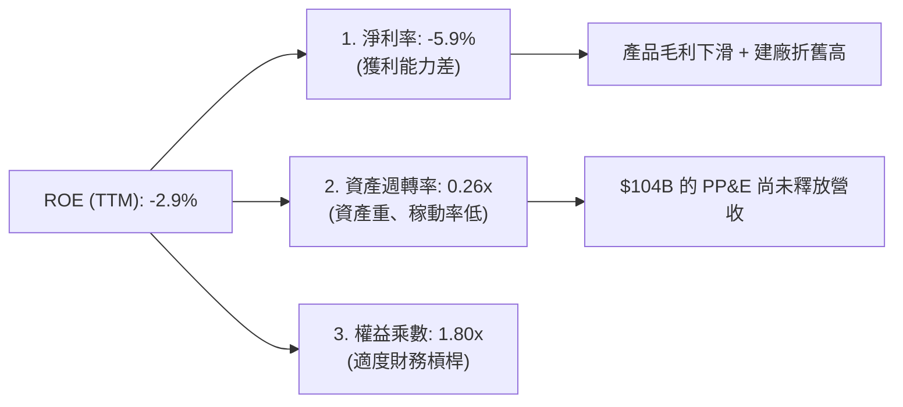

* **淨利率（-5.9%）**：產品線缺乏高毛利 AI 晶片，且舊製程晶圓廠稼動率低。
* **資產週轉率（0.26x）**：每 $1.00 的資產僅能產生 $0.26 的營收，反映產能利用率嚴重不足。
* **權益乘數（1.80x）**：資產負債率為 44.4%，處於安全範圍，但已無太多舉債空間。

### 6.4 獲利能力儀表板

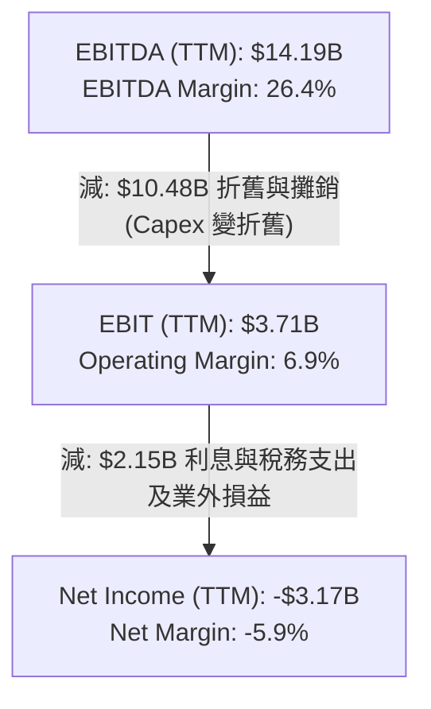

---

## 7. 估值深度分析

### 7.1 同業估值比較表格

在同業比較中，Intel 呈現出極其特殊的估值結構：**高前瞻 P/E、高 EV/EBITDA，但低 P/S 和 P/B**。這反映了市場將其視為「重組股」：雖然目前的獲利極低（導致盈餘倍數極高），但其擁有的龐大資產與營收基礎若能成功轉型，將釋放巨大價值。

| 估值指標 | **Intel (INTC)** | **AMD (AMD)** | **TSMC (TSM)** | 評估與解讀 |
|----------|----------|---------|---------|-----------|
| **Trailing P/E** | **N/A** (虧損) | 125.4x | 28.5x | 🔴 獲利能力尚未恢復 |
| **Forward P/E** | **60.10x** | 28.5x | 21.2x | 🔴 估值溢價已透支 18A 預期 |
| **P/S Ratio** | **9.07x** | 8.20x | 10.5x | 🟡 營收倍數與 AMD 相當 |
| **P/B Ratio** | **4.37x** | 4.85x | 7.20x | 🟢 重資產折價，具備資產安全邊際 |
| **EV / EBITDA** | **38.34x** | 24.5x | 12.8x | 🔴 投資回收期顯著拉長 |
| **EV / Revenue**| **10.11x** | 8.05x | 11.2x | 🟡 與行業龍頭 TSMC 接近 |
| **FCF Yield** | **-1.70%** | +1.80% | +4.20% | 🔴 現金流安全性極低 |

### 7.2 歷史估值區間分析

Intel 過去五年的 Forward P/E 區間主要介於 10x - 25x 之間。當前 Forward P/E 飆升至 60.10x，處於歷史極值（>95百分位數）。這並非因為股價暴漲，而是因為**未來 12 個月的預期 EPS 被大幅下修（Forward EPS 僅 $1.61）**。

### 7.3 情境目標價（假設驅動，Bear / Base / Bull）

我們基於 3 種不同的 IDM 2.0 執行情境，建立了 12 個月目標價預估模型：

| 情境 | 營收 CAGR (3Y) | 2028 營業利益率 | 退出 EV/EBITDA 倍數 | 隱含目標價 | 相對現價漲跌幅 | 觸發條件 |
|------|-----------|-----------|----------|------------|----------|--------|
| 🔴 **悲觀** | -2.0% | 2.0% | 12.0x | **$45.00** | -53.6% | 18A 製程良率低於 50%，外部客戶撤單，Intel Foundry 面臨拆分減值。 |
| 🟡 **基準** | +5.0% | 12.0% | **18.0x** | **$105.85**| **+9.1%** | 18A 製程於 2026 年底順利量產，外部代工營收達 $2B，CCG 保持穩定。 |
| 🟢 **樂觀** | +12.0% | 22.0% | 25.0x | **$200.00**| +106.2% | 重奪技術領先，獲得 Apple/NVIDIA 的外包訂單，AI PC 滲透率超預期。 |

> **估值方法選用說明**：由於 Intel 當前淨利受高額折舊與攤銷（TTM $10.48B）嚴重壓抑，傳統 P/E 估值法極易失真。因此，我們在情境分析中**優先採用 EV/EBITDA 估值法**，以客觀評估其核心業務的現金創造能力與重資產價值。

### 7.4 DCF 敏感性分析（6格目標價矩陣）

我們使用兩階段自由現金流折現模型（DCF），以 2.0% 的永續成長率（Terminal Growth Rate）為基礎，對 WACC 與 FCF 成長率進行敏感性分析：

| FCF 成長率 (2027-2031) | **WACC = 11.0%** | **WACC = 12.1% (基準)** | **WACC = 13.0%** |
|----------------------|------------------|-------------------------|------------------|
| 🟢 **高成長 (+15%)** | **$135.20** (+39.4%) | **$118.50** (+22.2%) | **$102.10** (+5.3%) |
| 🟡 **基準成長 (+10%)** | **$121.40** (+25.2%) | **$105.85** (+9.1%)  | **$91.30** (-5.9%) |
| 🔴 **低成長 (+5%)** | **$95.60** (-1.4%) | **$82.40** (-15.0%) | **$70.50** (-27.3%)|

### 7.5 估值綜合區間

```
當前股價: $96.98
估值區間:
$45.00 (悲觀) ─────────────────── $96.98 (現價) ─── $105.85 (基準) ────────────────────────── $200.00 (樂觀)
```

---

## 8. 成長催化劑

### 8.1 催化劑時間軸

```gantt
    title Intel 轉型核心催化劑時間軸 (2025-2027)
    dateFormat  YYYY-MM-DD
    section 製程技術
    18A Tape-out 完成           :crit, active, 2025-01-01, 2025-06-30
    18A 商業化量產             :crit, 2026-06-01, 2026-12-31
    section 外部訂單
    公佈 18A 創始客戶名單       :active, 2025-07-01, 2025-12-31
    代工營收首次突破單季 $1B    : 2026-01-01, 2026-06-30
    section 資本重組
    Altera 獨立 IPO 推進       : 2025-09-01, 2026-03-31
```

### 8.2 TAM 市場規模分析

Intel 所處的半導體與代工市場 TAM 依舊龐大，關鍵在於其「可獲取份額（SOM）」的提升：

```
╔══════════════════════════════════════════════════════════════════╗
║                    Intel TAM 與市場滲透預估                    ║
╠══════════════════════════════════════════════════════════════════╣
║                                                                  ║
║  1. AI PC 處理器 (2028年預估)：                                  ║
║     ├── 全球 TAM: $45B                                           ║
║     ├── Intel 預估份額: 65% (SOM: $29.2B)                        ║
║     └── 狀態：🟢 處於絕對領先地位                                ║
║                                                                  ║
║  2. 先進晶圓代工 (2028年預估)：                                  ║
║     ├── 全球 TAM: $120B (排除中國成熟製程)                       ║
║     ├── Intel 預估份額: 8% (SOM: $9.6B)                          ║
║     └── 狀態：🟡 挑戰者，需依賴 18A 成功                         ║
║                                                                  ║
║  3. AI 加速器/GPU (2028年預估)：                                 ║
║     ├── 全球 TAM: $150B                                          ║
║     ├── Intel 預估份額: 3% (SOM: $4.5B)                          ║
║     └── 狀態：🔴 面臨 NVIDIA 與 AMD 強烈擠壓                     ║
║                                                                  ║
╚═══════════════════════════════════════════════════════════════╝
```

### 8.3 成長驅動力結構圖

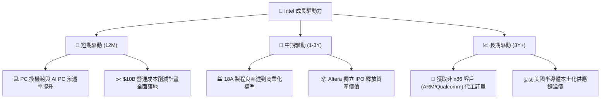

---

## 9. 風險矩陣

### 9.1 風險評分矩陣

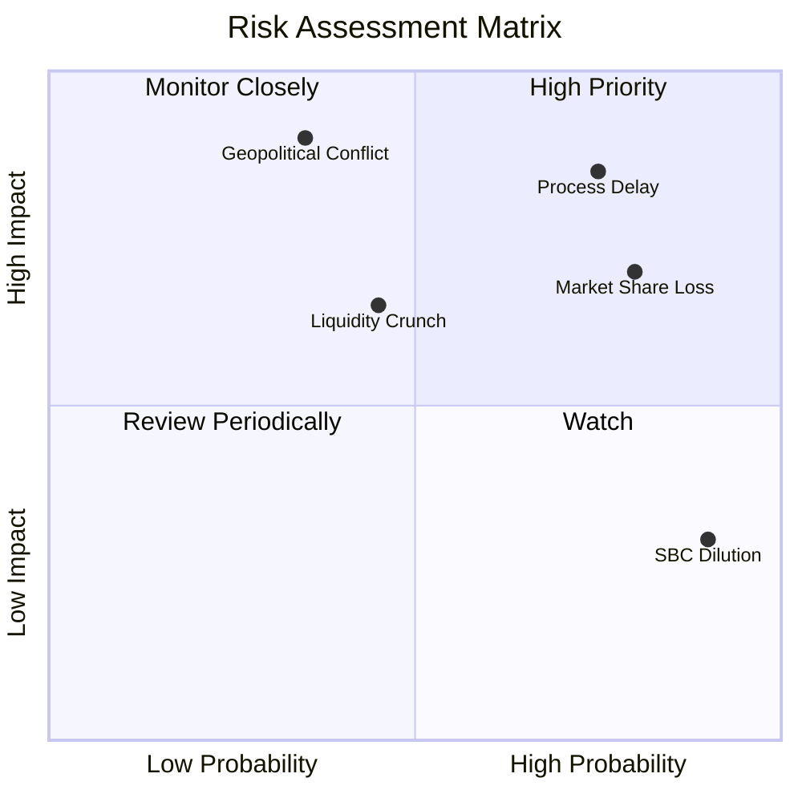

### 9.2 風險清單詳細分析

| # | 風險項目 | 發生機率 | 財務衝擊 | 風險評分 | 緩解措施 |
|---|----------|----------|----------|----------|----------|
| 1 | 🔴 **18A 製程量產延期或良率不足** | 高 (65%) | 極高 (-25% 估值) | 🔴 8.5/10 | 與 ASML 緊密合作，優先鎖定 High-NA EUV 設備；引入外部顧問改善晶圓廠管理流程。 |
| 2 | 🔴 **資料中心 CPU 市佔持續流失** | 高 (75%) | 中 (-10% 營收) | 🔴 7.5/10 | 加速 Granite Rapids 伺服器處理器量產，主打性價比與安全性，鞏固企業級客戶。 |
| 3 | 🟡 **資金鏈吃緊與信用評等調降** | 中 (45%) | 高 (推升融資成本) | 🟡 6.0/10 | 推進 Mobileye 與 Altera 的股權變現；尋求 Brookfield 等基礎設施基金的合資建廠資金（CHIPS Program）。 |
| 4 | 🟡 **地緣政治干擾全球產能佈局** | 低 (30%) | 極高 (供應鏈中斷) | 🟡 5.5/10 | 加速愛爾蘭與德國晶圓廠建設，分散亞洲產能過度集中的風險。 |

---

## 10. 投資建議

### 10.1 最終綜合評級雷達圖

```
╔══════════════════════════════════════════════════════════════╗
║                  Intel 投資價值雷達圖                        ║
╠══════════════════════════════════════════════════════════════╣
║ 財務健康度     🟡 5.5 / 10  ▓▓▓▓▓▓▓▓▓▓▓▓░░░░░░░░             ║
║ 營運成長動能   🟡 6.0 / 10  ▓▓▓▓▓▓▓▓▓▓▓▓▓░░░░░░░             ║
║ 獲利品質       🔴 3.5 / 10  ▓▓▓▓▓▓▓░░░░░░░░░░░░░             ║
║ 估值安全邊際   🔴 4.0 / 10  ▓▓▓▓▓▓▓▓░░░░░░░░░░░░             ║
║ 技術創新能力   🟢 6.5 / 10  ▓▓▓▓▓▓▓▓▓▓▓▓▓▓░░░░░░             ║
╠══════════════════════════════════════════════════════════════╣
║ 綜合投資評等   🟡 5.1 / 10  🏆 觀望 (Hold)                   ║
╚══════════════════════════════════════════════════════════════╝
```

### 10.2 目標價與隱含報酬率

| 情境 | 出現機率 | 目標價 | 隱含報酬率 (相較現價 $96.98) | 機率加權目標價 |
|------|----------|--------|----------------------------|----------------|
| 🔴 **悲觀情境** | 30% | $45.00 | -53.6% | $13.50 |
| 🟡 **基準情境** | **55%** | **$105.85**| **+9.1%** | **$58.22** |
| 🟢 **樂觀情境** | 15% | $200.00 | +106.2% | $30.00 |
| **加權綜合期望值**| 100% | **$101.72**| **+4.9%** | **$101.72** |

### 10.3 買入時機與觸發因素

```
╔══════════════════════════════════════════════════════════════════╗
║                  ✅ Intel 投資決策 Checklist                    ║
╠══════════════════════════════════════════════════════════════════╣
║                                                                  ║
║  立即買入觸發條件（需滿足至少 2 項）：                           ║
║  ☐ 18A 製程良率公佈突破 65% 🟢                                   ║
║  ☐ 宣布獲得微軟、亞馬遜以外的第三家超大型雲端（Hyperscaler）訂單  ║
║  ☐ 單季自由現金流（FCF）轉正                                     ║
║                                                                  ║
║  加碼觸發條件：                                                  ║
║  ☐ Altera 成功以高於 $10B 的估值完成獨立 IPO                    ║
║  ☐ 美國《晶片法案》第二期直接補貼資金實際到帳                    ║
║                                                                  ║
║  減碼/停損觸發條件：                                              ║
║  ☐ 18A 製程宣布延期至 2027 年以後量產 🔴                         ║
║  ☐ 信用評等被進一步下調至投機級（垃圾債）                        ║
║                                                                  ║
╚══════════════════════════════════════════════════════════════════╝
```

### 10.4 投資人適配度分析

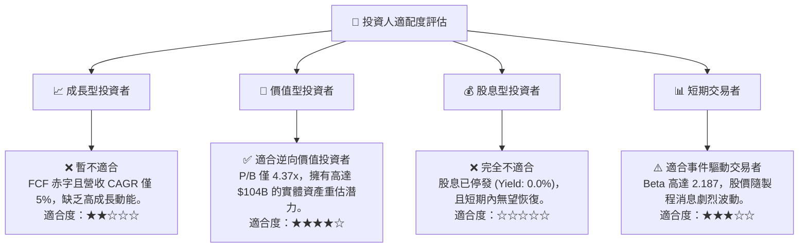

### 10.5 每季財報監控清單（Quarterly Watch List）

在未來的季度財報中，機構投資人應嚴密監控以下指標，以評估 Intel 的轉型進度：

| 監控指標 | 關鍵損益線 / 門檻值 | 觸發「加碼」訊號 | 觸發「減碼/停損」訊號 |
|----------|-------------------|-----------------|----------------------|
| **Intel Foundry 營收** | 單季 $3.5B | YoY 成長 > 15% | YoY 出現衰退或持平 |
| **毛利率 (Gross Margin)** | 37.2% | 突破 42.0% (稼動率回升) | 跌破 33.0% (折舊壓力過重) |
| **自由現金流 (FCF)** | 單季 -$2.54B | 赤字收窄至 -$1.0B 以內 | 赤字擴大至 -$4.0B 以上 |
| **稀釋股數 (Diluted Shares)**| 5.03B | 股數持平或減少 | 突破 5.3B (股權稀釋過快) |

### 10.6 反面論證：什麼會證明論點錯誤（What Would Change My Mind）

本報告的「觀望（Hold）」評級建立在「18A 轉型具備高不確定性，且當前估值已透支」的假設上。若以下可量化條件成立，我們將**上調評級至「強力買入（Strong Buy）」**：

```
╔══════════════════════════════════════════════════════════════════╗
║              ⚠️ 論點失效條件（Disconfirming Evidence）           ║
╠══════════════════════════════════════════════════════════════════╣
║  若出現以下情況，本報告之「觀望」邏輯將被推翻，應立即轉為多頭：   ║
║                                                                  ║
║  ☐ 18A 製程良率證實達到 70%，且單位晶圓生產成本低於 TSMC 3nm     ║
║  ☐ 獲取非 x86 的重量級客戶（如 Apple 或 NVIDIA）代工合約         ║
║  ☐ 營運現金流（OCF）因 PC 業務大爆發而突破單季 $5.0B              ║
║  ☐ 資本支出（Capex）因設備搬遷完畢而連續兩季下降 > 20%           ║
║  ☐ ROIC 重新回升至 8.0% 以上，EVA 赤字顯著收窄                  ║
║                                                                  ║
╚══════════════════════════════════════════════════════════════════╝
```

---

> **免責聲明**：本報告為 AI 自動生成，基於分析師專業基本面建模框架。本報告僅供研究參考，不構成任何買賣建議。投資人入市前應獨立評估風險，並對其投資決策承擔全部責任。