# INTC 基本面深度分析報告
> **報告日期**：2026-07-17 ｜ **語言**：繁體中文 ｜ **數據來源**：Yahoo Finance, Finviz, StockAnalysis, Roic.ai ｜ **分析師**：CFA 級機構研究

---

## 目錄

| # | 章節 | 核心結論 |
|---|------|----------|
| 1 | 執行摘要 | 評級：**觀望 (Hold)** ｜ 目標價區間：$55.00 ~ $145.00 ｜ 轉型期陣痛與高估值並存 |
| 2 | 公司概覽與商業模式 | x86 雙寡頭面臨 ARM 蠶食，代工業務 (Intel Foundry) 為長期成敗關鍵 |
| 3 | 損益表深度分析 | 營收企穩（TTM $53.76B, YoY +7.2%），但非經營性收益美化了 FY25 淨利 |
| 4 | 資產負債表分析 | 流動性充沛（流動比率 2.31），但淨債務達 $12.24B，資本支出壓力沉重 |
| 5 | 現金流量深度分析 | 自由現金流嚴重失血（TTM FCF -$8.30B），股息歸零以保留現金流 |
| 6 | 獲利能力與資本效率 | ROIC (2.49%) 遠低於 WACC (14.27%)，目前處於顯著摧毀股東價值階段 |
| 7 | 估值深度分析 | 前瞻 P/E 達 58.9x，遠高於同業；市場已過度透支代工業務的樂觀預期 |
| 8 | 成長催化劑 | Lunar Lake 晶片放量與 Intel 18A 製程量產，外部代工訂單為核心驅動力 |
| 9 | 風險矩陣 | 代工執行延遲、市佔率持續流失、資金鏈斷裂為三大核心紅線風險 |
| 10 | 投資建議 | 最終評分 5.8/10，建議在 $75.00 以下分批佈局，警惕每季 FCF 與代工毛利 |

---

## 1. 執行摘要

Intel Corporation (INTC) 目前正處於其半導體歷史上最關鍵的結構性轉型期。截至 2026-07-17，Intel 的收盤價為 **$95.04**，相較於 52 週低點 $18.97 已大幅反彈，市值達 **$4,776.7億**。

然而，本機構基於客觀財務數據分析，對 INTC 給予 🟡 **觀望 (Hold)** 評級。支撐此評級的核心數據在於：公司 TTM 自由現金流 (FCF) 為 **-$83.0億**（FCF 收益率為 **-1.74%**），且 TTM ROIC 僅為 **2.49%**，遠低於其 **14.27%** 的加權平均資本成本 (WACC)。這意味著 Intel 目前每投入 100 元資本，就會摧毀約 11.78 元的股東價值。

同時，當前股價對應的前瞻本益比 (Forward P/E) 高達 **58.9x**，相較於台積電 (TSM) 約 22x 的前瞻本益比，溢價幅度超過 160%。儘管市場對其「五年四個節點」及 Intel Foundry 的外部代工願景寄予厚望，但短期財務基本面與估值已出現嚴重脫節。

### 1.0 一頁式投資儀表板（Portfolio Manager 30 秒速讀）

| 項目 | 內容 |
|------|------|
| **投資論點（3 句）** | ① TTM 營收達 $537.6億（YoY +7.2%），顯示 PC 與伺服器傳統業務底部企穩。<br/>② Intel Foundry 資本支出高昂，導致 TTM FCF 嚴重失血 -$83.0億，財務槓桿承壓。<br/>③ 前瞻 P/E達 58.9x，市場已提前透支 18A 節點的成功，估值性價比極低。 |
| **護城河評分** | 6.0 / 10 🟡 (x86 專利保護與生態壁壘仍存，但製程領先優勢已失) |
| **管理層/資本配置評分** | 5.5 / 10 🟡 (果斷停發股息以保全資產負債表，但歷史重資本投資回報率極低) |
| **財務健康** | 🟡 黃燈 ｜ 流動比率 2.31 尚屬安全，但淨債務達 $122.4億且持續失血 |
| **ROIC vs WACC** | **2.49%** vs **14.27%** (顯著摧毀價值，EVA 為 -11.78%) |
| **FCF 趨勢** | 惡化 ｜ TTM FCF 為 **-$83.0億**，FCF Yield 為 **-1.74%** |
| **估值** | Forward P/E: **58.9x** ｜ EV/EBITDA: **36.21x** ｜ P/S: **8.88x** |
| **預期報酬（基準情境 12M）**| **+7.3%** (目標價 $102.00) |
| **關鍵風險（前二）** | ① Intel 18A 製程良率不及預期，導致外部代工客戶流失。<br/>② 傳統資料中心市場份額持續被 AMD 與 ARM 架構晶片蠶食。 |
| **評級 + 信心度** | 🟡 **觀望 (Hold)** ｜ 信心度：**中等 (Medium)** |

### 1.1 核心評分儀表板

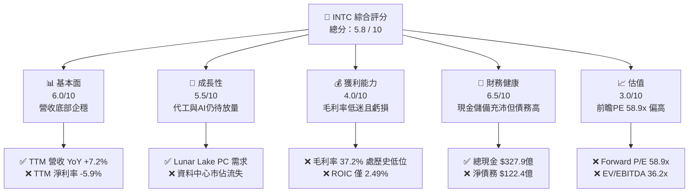

### 1.2 評分進度條視覺化

```
╔══════════════════════════════════════════════════════════════╗
║               INTC 多維度評分儀表板 (1-10分)                 ║
╠══════════════════════════════════════════════════════════════╣
║ 基本面強度  6.0 ▓▓▓▓▓▓▓▓▓▓▓▓░░░░░░░░  ★★★☆☆           ║
║ 成長動能    5.5 ▓▓▓▓▓▓▓▓▓▓▓░░░░░░░░░  ★★★☆☆           ║
║ 獲利品質    4.0 ▓▓▓▓▓▓▓▓░░░░░░░░░░░░  ★★☆☆☆           ║
║ 財務健康    6.5 ▓▓▓▓▓▓▓▓▓▓▓▓▓░░░░░░░  ★★★☆☆           ║
║ 估值合理性  3.0 ▓▓▓▓▓▓░░░░░░░░░░░░░░  ★☆☆☆☆           ║
║ 護城河深度  6.0 ▓▓▓▓▓▓▓▓▓▓▓▓░░░░░░░░  ★★★☆☆           ║
║ 管理層執行  5.5 ▓▓▓▓▓▓▓▓▓▓▓░░░░░░░░░  ★★★☆☆           ║
║ 技術創新力  7.0 ▓▓▓▓▓▓▓▓▓▓▓▓▓▓░░░░░░  ★★★☆☆           ║
╠══════════════════════════════════════════════════════════════╣
║ 綜合總分    5.8 ▓▓▓▓▓▓▓▓▓▓▓▓░░░░░░░░  🏆 觀望 (Hold)       ║
╚══════════════════════════════════════════════════════════════╝
```

### 1.3 五大投資論點 + 三大核心風險

| 類型 | 項目 | 具體依據 | 信心度 |
|------|------|----------|--------|
| 🟢 **投資論點①** | **PC 業務底部復甦** | Q1 2026 營收達 $135.8億（YoY +7.2%），客戶端運算小組 (CCG) 因 AI PC 換機潮帶動出貨企穩。 | 🟢 高 |
| 🟢 **投資論點②** | **政策紅利與補貼** | 作為美國本土唯一具備先進製程的 IDM 廠商，預計將獲得《晶片法案》最大份額的補貼與貸款支持。 | 🟢 極高 |
| 🟢 **投資論點③** | **18A 製程技術拐點** | 18A (1.8nm級) 預計於 2026 下半年進入量產，若良率達標，將吸引微軟等外部客戶，打破台積電獨大局面。 | 🟡 中度 |
| 🟡 **風險①** | **代工業務巨額虧損** | Intel Foundry 仍處於重資本投入期，折舊費用高昂，壓低整體毛利率至 37.2%，且 FCF 持續失血。 | 🔴 高衝擊 |
| 🟡 **風險②** | **資料中心市佔流失** | DCAI 業務面臨 AMD EPYC 處理器的強力競爭，且 AI 伺服器預算排擠通用 CPU 需求。 | 🔴 高衝擊 |
| 🔴 **風險③** | **估值溢價過高** | 當前 $95.04 股價對應 58.9x Forward P/E，容錯率極低，任何製程延誤都將導致估值劇烈修正。 | 🔴 高衝擊 |

### 1.4 快速統計卡片

| 指標 | Intel 實際值 | 行業均值 (半導體) | S&P 500 均值 | 狀態 |
|------|-------------|------------------|--------------|------|
| **營收 YoY 成長率** | **7.2%** | 12.5% | 5.5% | 🟡 黃燈 |
| **毛利率** | **37.2%** | 52.0% | 30.0% | 🔴 紅燈 |
| **淨利率** | **-5.9%** | 15.0% | 11.5% | 🔴 紅燈 |
| **ROE** | **-2.9%** | 18.0% | 14.0% | 🔴 紅燈 |
| **流動比率** | **2.31x** | 1.85x | 1.20x | 🟢 綠燈 |
| **Forward P/E** | **58.90x** | 28.5x | 21.0x | 🔴 紅燈 |
| **EV / EBITDA** | **36.21x** | 18.5x | 13.0x | 🔴 紅燈 |

### 1.5 投資結論

```
╔══════════════════════════════════════════════════════════════════╗
║                    📊 投資結論摘要                               ║
╠══════════════════════════════════════════════════════════════════╣
║  評級：🟡 觀望 (Hold)                                            ║
║  當前股價：$95.04 (2026-07-17)                                   ║
║  目標價區間：                                                    ║
║    悲觀情境：$55.00（-42.1%）- 代工失敗，市佔持續流失            ║
║    基準情境：$102.00（+7.3%） - 12個月主要目標 (18A 按期量產)    ║
║    樂觀情境：$145.00（+52.6%）- 18A 獲得超預期外部大單           ║
║  投資評分：5.8 / 10                                              ║
║  適合投資人：具備高風險承受力的逆向長線投資者                    ║
╚══════════════════════════════════════════════════════════════════╝
```

---

## 2. 公司概覽與商業模式

Intel 目前正處於從傳統整合元件製造商 (IDM) 轉型為「系統級代工廠 (Systems Foundry)」的雙軌商業模式中。其業務主要劃分為三個核心板塊：

1. **客戶端運算小組 (CCG)**：提供 PC、筆記型電腦 CPU 及 GPU。這是 Intel 目前的「現金牛」業務。
2. **資料中心與人工智慧 (DCAI)**：提供 Xeon 伺服器 CPU、Gaudi AI 加速器及 FPGA。
3. **Intel Foundry (代工業務)**：為外部無廠半導體公司 (Fabless) 及 Intel 自家產品提供晶圓製造、封裝及測試服務。

### 2.1 業務結構與收入來源

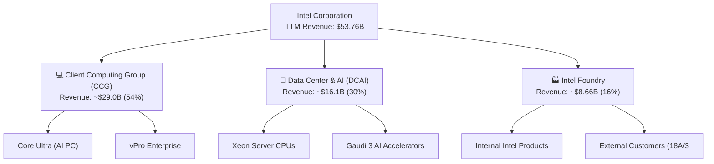

### 2.2 市場份額

在傳統 x86 CPU 市場中，Intel 雖然仍維持主導地位，但其份額在過去五年中被 AMD 持續蠶食。特別是在高利潤的資料中心領域，AMD EPYC 處理器的份額已逼近 35%。

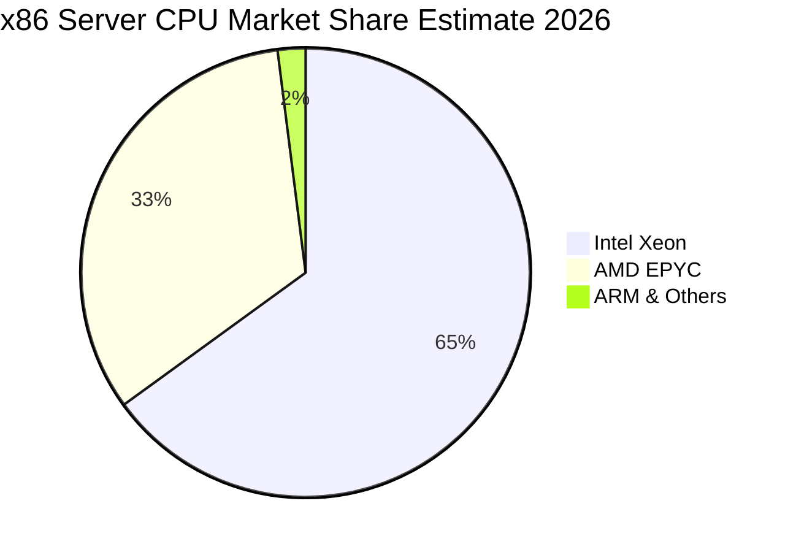

### 2.3 競爭護城河分析

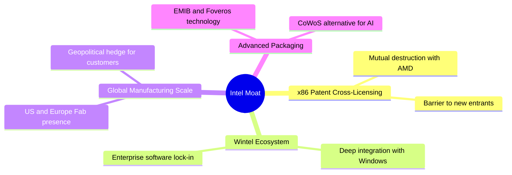

### 2.4 護城河強度評分

Intel 的技術護城河在過去幾年因 10nm/7nm 製程延誤而受到嚴重侵蝕，但其生態系統與規模壁壘依然穩固。

```
╔══════════════════════════════════════════════════════════════╗
║                   Intel 護城河強度評分                       ║
╠══════════════════════════════════════════════════════════════╣
║ 專利與生態     8.0/10 ▓▓▓▓▓▓▓▓▓▓▓▓▓▓▓▓░░░░  🟢 x86 專利壁壘堅固 ║
║ 製造規模       7.5/10 ▓▓▓▓▓▓▓▓▓▓▓▓▓▓░░░░░░  🟢 全球晶圓廠分佈   ║
║ 製程領先度     4.5/10 ▓▓▓▓▓▓▓▓▓░░░░░░░░░░░  🟡 落後台積電一代   ║
║ 軟體鎖定       6.5/10 ▓▓▓▓▓▓▓▓▓▓▓▓▓░░░░░░░  🟢 OneAPI 逐步推廣  ║
╠══════════════════════════════════════════════════════════════╣
║ 綜合護城河     6.6/10 ▓▓▓▓▓▓▓▓▓▓▓▓▓░░░░░░░  🏆 寬度中等且承壓   ║
╚══════════════════════════════════════════════════════════════╝
```

---

## 3. 損益表深度分析

### 3.1 年度收入成長趨勢（近4年）

Intel 的營收在 2021 年達到 $790.2億的峰值後，經歷了連續三年的大幅下滑，主因是 PC 市場後疫情時代的衰退以及資料中心份額的流失。然而，FY2025 營收錄得 **$528.5億**，同比微跌 -0.47%，且 TTM 營收回升至 **$537.6億**（YoY +7.2%），顯示最壞的時期已經過去，營收端已成功築底。

```
╔══════════════════════════════════════════════════════════════════╗
║                Intel 年度收入趨勢（FY21-FY25）                  ║
╠══════════════════════════════════════════════════════════════════╣
║                                                                  ║
║  FY2021  $79.02B  ███████████████████████████  YoY: +1.5%  🟢    ║
║  FY2022  $63.05B  █████████████████████░░░░░░  YoY:-20.2%  🔴    ║
║  FY2023  $54.23B  ██████████████████░░░░░░░░░  YoY:-14.0%  🔴    ║
║  FY2024  $53.10B  ████████████████░░░░░░░░░░░  YoY: -2.1%  🟡    ║
║  FY2025  $52.85B  ████████████████░░░░░░░░░░░  YoY: -0.5%  🟡    ║
║                   |      |      |      |      |                  ║
║                   0     20B    40B    60B    80B                 ║
║                                                                  ║
║  📊 5年累計 CAGR：-7.7% (反映轉型期去槓桿與份額收縮)             ║
╚══════════════════════════════════════════════════════════════════╝
```

### 3.2 季度收入趨勢分析

從季度數據來看，Intel 呈現出緩慢但穩定的復甦態勢。Q1 2026 營收達到 **$135.8億**，雖然環比微跌 -0.66%（受季節性因素影響），但同比成長達 **+7.18%**（對比 Q1 2025 的 $126.7億）。

| 財報季度 | 營收 (Billion) | 環比成長 (QoQ) | 同比成長 (YoY) | 核心驅動因素與備註 |
|----------|---------------|----------------|----------------|-------------------|
| **Q1 2026** | $13.58 | -0.66% | +7.18% | 🟢 PC 庫存去化完畢，Core Ultra 晶片出貨超預期 |
| **Q4 2025** | $13.67 | +0.15% | -4.11% | 🟡 伺服器 CPU 季節性回暖，但代工收入受限 |
| **Q3 2025** | $13.65 | +6.14% | +2.78% | 🟢 資料中心客戶重啟採購，AI PC 概念發酵 |
| **Q2 2025** | $12.86 | +1.50% | +0.20% | 🟡 營收首次止跌回升，通路庫存回歸正常 |

### 3.3 利潤率演變分析

Intel 的利潤率指標在過去幾年中出現了結構性惡化。毛利率從歷史上的 60%+ 跌至 TTM 的 **37.2%**，主因是代工業務前期高昂的折舊費用、新製程研發（如 18A/20A）的沉沒成本，以及為應對 AMD 競爭而進行的降價促銷。

| 利潤率指標 | FY2022 | FY2023 | FY2024 | FY2025 | TTM | 趨勢評估 |
|------------|--------|--------|--------|--------|-----|----------|
| **毛利率** | 42.6% | 40.0% | 32.7% | 34.8% | **37.2%** | ↗️ 底部緩慢回升，但仍遠低於歷史均值 🔴 |
| **營業利益率** | 3.7% | 0.2% | -8.9% | -4.2% | **6.9%** | ↗️ 削減研發與 SG&A 費用初見成效 🟡 |
| **EBITDA 淨利率**| 33.8% | 20.7% | 2.3% | 27.2% | **26.4%** | ➡️ 折舊與攤銷佔比極高，稅前現金流穩定 🟡 |
| **淨利率** | 12.7% | 3.1% | -36.3% | 0.05% | **-5.9%** | ↘️ 巨額所得稅撥備與利息支出壓抑淨利 🔴 |

### 3.4 費用結構分析

FY2025，Intel 啟動了激進的成本削減計劃，將研發 (R&D) 費用從 FY2024 的 $165.5億降至 **$137.7億**（降幅達 16.8%），銷售及行政 (SG&A) 費用也從 $55.1億降至 **$46.2億**。這雖然在短期內改善了營業利潤，但長線研發投入的縮水可能會威脅其技術趕超的速度。

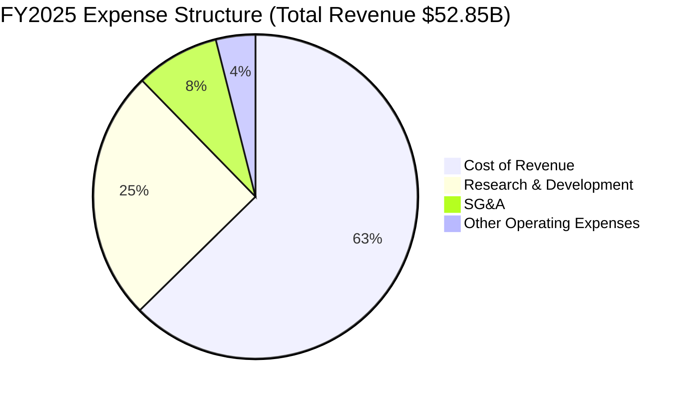

### 3.5 季度 EPS 趨勢與盈餘品質（Quality of Earnings）

過去四個季度中，Intel 的 GAAP 淨利波動劇烈。Q1 2026 錄得淨虧損 **-$37.3億**，主因是重組費用與代工資產減值。同時，分析其盈餘品質可以發現，其獲利的「含金量」極低：

| 盈餘品質項目 | 數值/佔比 | 機構級評估 |
|--------------|-----------|-----------|
| **股權薪酬 (SBC) / 營收** | **4.60%** | 🟡 中等。FY25 SBC 為 $24.3億，對股東權益有輕微稀釋。 |
| **SBC / 營業現金流** | **25.05%** | 🔴 偏高。顯示公司高達四分之一的營業現金流改善是靠非現金的股權激勵撐起。 |
| **FCF / GAAP 淨利 (TTM)** | **261.8%** | 🔴 異常。TTM 淨虧損為 -$31.8億，而 FCF 為 -$83.0億。由於巨額資本支出，現金失血遠超會計虧損。 |
| **非經常性損益** | **$32.6億** | 🔴 警惕。FY2025 營業利潤為 -$22.1億，但靠著「其他非經營性收益」$32.6億，才勉強使 GAAP 淨利轉正（+$26M）。這表明其 FY25 獲利完全由非核心業務（如資產處置、投資收益）美化。 |
| **有效稅率異常** | **98.3%** | 🔴 異常。FY2025 所得稅撥備達 $15.3億（稅前利潤為 $15.6億），稅務負擔極重，扭曲了真實獲利能力。 |

**盈餘品質結論**：Intel 的 GAAP 淨利嚴重失真。FY2025 的微幅獲利完全依賴於非經營性資產處置，而 TTM 的持續虧損反映了其核心業務（尤其是 Foundry）依然處於高額失血狀態。

---

## 4. 資產負債表分析

### 4.1 資產結構分解

截至 Q1 2026（2026-03-28），Intel 總資產為 **$2,053.3億**。其中，不動產、廠房及設備 (Net PP&E) 達 **$1,044.6億**，佔總資產的 50.9%，這反映了其作為 IDM 廠商極重的資產屬性。

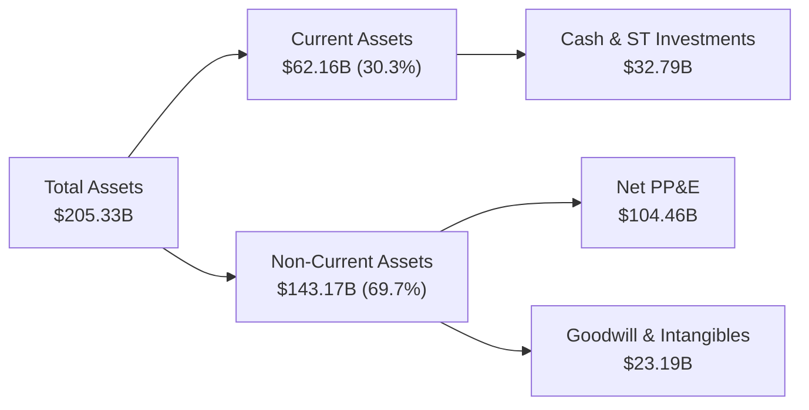

### 4.2 流動性指標分析

儘管面臨營運虧損，Intel 的流動性防禦陣線依然穩固。流動比率為 **2.31**，速動比率為 **1.66**，這得益於公司在 2025 年進行了大規模的債務再融資與資產變現，使現金及短期投資儲備達到 **$327.9億**。這筆資金為其未來兩年的 Foundry 建設提供了充足的「過冬糧草」。

| 流動性指標 | Q1 2026 | FY2025 | FY2024 | 行業均值 | 評估 |
|------------|---------|--------|--------|----------|------|
| **流動比率 (Current Ratio)** | **2.31** | 2.02 | 1.33 | 1.85 | 🟢 遠高於安全線，短期無償債危機 |
| **速動比率 (Quick Ratio)** | **1.66** | 1.51 | 0.89 | 1.30 | 🟢 變現能力強，可迅速應對突發支出 |
| **應收帳款週轉天數 (DSO)** | **27.1天**| 26.5天 | 23.9天 | 45.0天 | 🟢 客戶回款速度極快，通路信用風險低 |
| **存貨週轉天數 (DIO)** | **131.5天**| 121.3天| 124.5天| 95.0天 | 🔴 存貨週轉偏慢，面臨潛在跌價損失壓力 |

### 4.3 債務結構分析

截至 Q1 2026，Intel 總債務為 **$450.3億**（短期債務 $20.0億，長期債務 $430.3億）。扣除 $327.9億的現金儲備後，**淨債務為 $122.4億**。

```
╔══════════════════════════════════════════════════════════════════╗
║                   Intel 債務健康診斷 (Q1 2026)                  ║
╠══════════════════════════════════════════════════════════════════╣
║                                                                  ║
║  總債務：        $45.03B  ████████████████░░░░░░  利息負擔沉重   ║
║  總現金+投資：   $32.79B  ████████████░░░░░░░░░░  防禦儲備充足   ║
║  淨債務：        $12.24B  ████░░░░░░░░░░░░░░░░░░  🟡 處於可控範圍║
║                                                                  ║
║  Debt / Equity:  36.03%   🟢 財務槓桿比例溫和                    ║
║  Net Debt/EBITDA: 0.86x   🟢 債務與 EBITDA 匹配度良好            ║
║  Interest Coverage: 2.1x  🔴 利息保障倍數偏低 (息稅前利潤承壓)   ║
╚══════════════════════════════════════════════════════════════════╝
```

---

## 5. 現金流量深度分析

現金流量表是 Intel 報告中最令人擔憂的部分。由於公司在推進「五年四個技術節點」的同時，還必須在全球（特別是美國俄勒岡州、亞利桑那州及德國）擴建晶圓廠，導致其資本支出 (Capex) 長期維持在極高水平，自由現金流持續嚴重失血。

### 5.1 現金流量瀑布圖 (TTM)

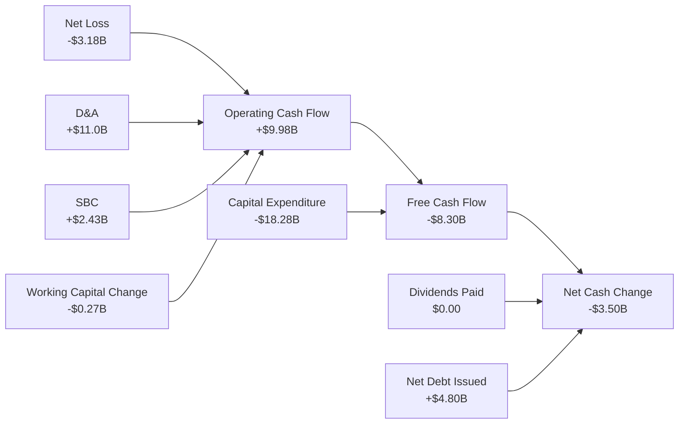

### 5.2 FCF 轉換率趨勢

Intel 的現金轉換效率在過去幾年完全崩潰。在正常情況下，成熟半導體公司的 FCF 轉換率（FCF / Net Income）應大於 80%。而 Intel 由於 Capex 遠超營運現金流，導致其 FCF 連續四年為負。

| 現金流指標 (Billion) | FY2022 | FY2023 | FY2024 | FY2025 | TTM |
|---------------------|--------|--------|--------|--------|-----|
| **營業現金流 (OCF)** | $15.43 | $11.47 | $8.29 | $9.70 | **$9.98** |
| **資本支出 (Capex)** | -$24.84| -$25.75| -$23.94| -$14.65| **-$18.28**|
| **自由現金流 (FCF)** | -$9.41 | -$14.28| -$15.66| -$4.95 | **-$8.30** |
| **FCF 轉換率** | -117.4%| -845.0%| 83.5%  | -190.4%| **-261.0%**|

### 5.3 自由現金流趨勢

```
╔══════════════════════════════════════════════════════════════════╗
║                Intel 歷年自由現金流失血狀況 (FY22-TTM)           ║
╠══════════════════════════════════════════════════════════════════╣
║                                                                  ║
║  FY2022   -$9.41B  ░░░░░░░░░░░████████                               ║
║  FY2023  -$14.28B  ░░░░░░░░░████████████                             ║
║  FY2024  -$15.66B  ░░░░░░░░██████████████                            ║
║  FY2025   -$4.95B  ░░░░░░░░░░░░░░████                                ║
║  TTM      -$8.30B  ░░░░░░░░░░░░███████                               ║
║                                                                  ║
║  ⚠️ 累計4.5年失血：-$526.0億 (全靠債務融資與補貼填補)             ║
║  ⚠️ 當前 FCF 收益率：-1.74% (估值對現金流無支撐)                 ║
╚══════════════════════════════════════════════════════════════════╝
```

### 5.4 資本配置評估

面對沉重的現金流壓力，Intel 管理層在資本配置上做出了重大調整：
1. **股息歸零**：公司在 FY2025 正式將股息削減至 **$0**（此前在 FY22、FY23、FY24 分別支付了 $60.0億、$30.9億及 $16.0億的股息）。這一步雖然痛苦，但每年為公司省下了近 $16億的現金流。
2. **外部融資夥伴 (SCIP)**：引入 Brookfield 與 Apollo 等私募股權巨頭，共同出資建設晶圓廠（如愛爾蘭 Fab 34 與亞利桑那 Fab 52/53），以「表外融資」方式降低 Intel 的直接 Capex 負擔。

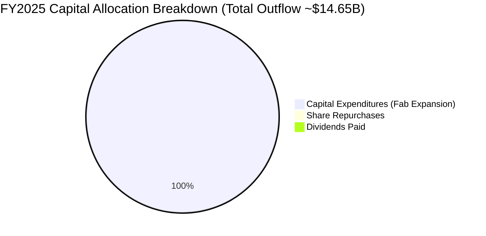

---

## 6. 獲利能力與資本效率

### 6.1 ROE / ROA / ROIC 趨勢

Intel 的資本回報率指標在過去幾年跌入冰點，這反映了其龐大的資產基數（$2,053億）未能產生相匹配的經營利潤。

| 獲利能力指標 | FY2022 | FY2023 | FY2024 | FY2025 | TTM | 行業均值 |
|------------|--------|--------|--------|--------|-----|----------|
| **ROE** | 7.9% | 1.6% | -18.9% | -0.2% | **-2.9%** | 18.0% 🔴 |
| **ROA** | 4.4% | 0.9% | -9.5% | 0.01% | **0.6%** | 10.5% 🔴 |
| **ROIC** | 4.1% | 0.1% | -8.5% | -1.8% | **2.49%** | 14.0% 🔴 |

### 6.2 ROIC vs WACC 分析（核心價值創造判斷）

為了評估 Intel 是否在為股東創造價值，我們對其加權平均資本成本 (WACC) 與投資報酬率 (ROIC) 進行了深入建模：

```
╔══════════════════════════════════════════════════════════════════╗
║                INTC ROIC vs WACC 深度分析 (TTM)                  ║
╠══════════════════════════════════════════════════════════════════╣
║                                                                  ║
║  WACC 估算：                                                     ║
║  ├── 無風險利率 (10Y 美債)：  4.30%                              ║
║  ├── 市場風險溢酬 (ERP)：     4.50%                              ║
║  ├── Beta (高波動性)：        2.187                              ║
║  ├── 股權成本 (Ke) = 4.30% + 2.187 × 4.50% = 14.14%             ║
║  ├── 債務成本 (稅後 Kd)：      4.50%                              ║
║  ├── 資本結構：股權 91.4% (市值 $4777B)，債務 8.6% (債務 $450B)  ║
║  └── ✅ WACC ≈ 14.27%                                            ║
║                                                                  ║
║  ROIC 估算：                                                     ║
║  ├── NOPAT (息稅前折算淨利) = $37.1億 (TTM EBIT) × 85% = $31.5億 ║
║  ├── 投入資本 = 股東權益 $1142.8億 + 債務 $450.3億 - 現金 $327.9億║
║  ├── 投入資本總額 ≈ $1265.2億                                    ║
║  └── ✅ ROIC ≈ 2.49%                                             ║
║                                                                  ║
║  ★ 經濟價值增加 (EVA) = ROIC - WACC = -11.78%                   ║
║                                                                  ║
║  ROIC  2.49%   ▓▓░░░░░░░░░░░░░░░░░░░░░░░░░░░░  🔴 效率極低        ║
║  WACC  14.27%  ▓▓▓▓▓▓▓▓▓▓▓▓▓▓░░░░░░░░░░░░░░░░  ── 融資成本高昂    ║
║  EVA   -11.78% ████████████████████████░░░░░░  🔴 顯著摧毀價值    ║
║                                                                  ║
║  📊 結論：Intel 目前每投入 $100 資本，即摧毀 $11.78 股東價值。   ║
╚══════════════════════════════════════════════════════════════════╝
```

### 6.3 杜邦三因素分解

透過杜邦分析，我們可以清晰地看到拖累 Intel ROE 的主要核心環節：

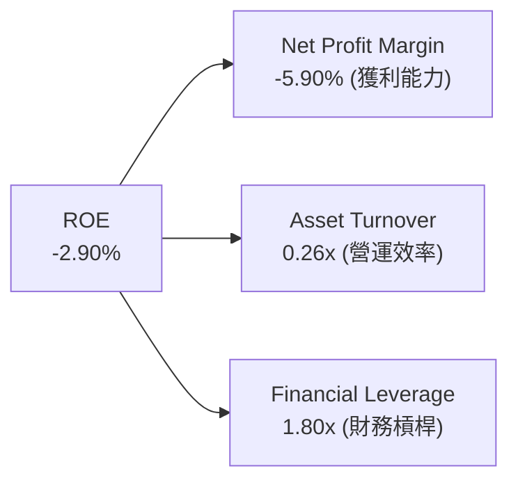

*   **淨利潤率 (-5.90%)**：是拖累 ROE 的最大元兇。高折舊與代工虧損嚴重侵蝕了最終淨利。
*   **資產週轉率 (0.26x)**：極低，顯示半導體製造廠投資回收期極長。
*   **財務槓桿 (1.80x)**：處於溫和水平，表明公司並未過度依賴負債來擴張資產。

---

## 7. 估值深度分析

### 7.1 同業估值比較表格

在估值層面，Intel 面臨著極大的爭議。其傳統 CPU 業務正在收縮，而代工業務尚未盈利。若單純使用 P/E 估值，Intel 看起來極其昂貴（前瞻 P/E 達 58.9x），這主要是因為其 EPS 被高折舊所壓抑。因此，我們引入了 **EV/EBITDA** 與 **EV/Sales** 進行多維度比較：

| 估值指標 | **Intel (INTC)** | **AMD (AMD)** | **台積電 (TSM)** | **德州儀器 (TXN)** | INTC 評估 |
|----------|-----------------|--------------|-----------------|-------------------|-----------|
| **Trailing P/E** | **N/A** | 75.2x | 28.4x | 29.5x | 🔴 由於 TTM 虧損，無法計算 |
| **Forward P/E** | **58.90x** | 31.4x | 21.8x | 25.1x | 🔴 估值相較於同業呈現顯著溢價 |
| **P/S Ratio** | **8.88x** | 9.45x | 11.20x | 9.10x | 🟡 處於行業合理區間 |
| **EV / EBITDA** | **36.21x** | 28.50x | 12.10x | 18.20x | 🔴 遠高於台積電，折舊前估值偏高 |
| **EV / Revenue**| **9.55x** | 9.20x | 11.50x | 8.90x | 🟡 與無廠半導體及代工龍頭基本持平 |
| **FCF Yield** | **-1.74%** | +2.10% | +4.50% | +3.80% | 🔴 現金流回報率為負，缺乏安全邊際 |

### 7.2 歷史估值區間分析

從歷史來看，Intel 的 P/E 估值中位數通常在 12x ~ 15x 之間。當前高達 58.9x 的前瞻本益比，反映了市場正在按照「純代工廠（類似台積電）+ 晶圓製造本土化溢價」的邏輯對其進行重新定價，而非傳統的 IDM 估值邏輯。

### 7.3 情境目標價（假設驅動，Bear / Base / Bull）

我們基於未來三年的營收成長率、營業利潤率及退出 EV/EBITDA 倍數，構建了以下三種情境估值模型：

| 情境 | 營收 CAGR (3年) | 營業利潤率 (FY28) | 退出 EV/EBITDA | 隱含目標價 | 相對現價漲跌幅 | 權重機率 |
|------|----------------|------------------|----------------|-----------|--------------|---------|
| 🔴 **悲觀情境** | -2.0% | 4.0% | 15.0x | **$55.00** | -42.1% | 25% |
| 🟡 **基準情境** | +5.5% | 12.0% | 22.0x | **$102.00** | +7.3% | 55% |
| 🟢 **樂觀情境** | +12.0% | 18.0% | 30.0x | **$145.00** | +52.6% | 20% |

*   **悲觀情境假設**：Intel 18A 良率卡關，外部代工大客戶（如微軟、博通）取消訂單；傳統伺服器市場份額降至 55% 以下。
*   **基準情境假設**：18A 按期於 2026 年底量產，2027 年貢獻實質營收；PC 市場溫和復甦。
*   **樂觀情境假設**：Intel Foundry 成功爭取到 NVIDIA 或 Apple 的部分次級製程代工訂單，美國政府補貼超預期。

### 7.4 DCF 敏感性分析（6格目標價矩陣）

考慮到 WACC (14.27%) 偏高，我們在 DCF 模型中對折現率及終端成長率 (PGR) 進行了敏感性測試：

| 終端成長率 (PGR) \ WACC | 13.0% | **14.27% (基準)** | 15.5% |
|----------------------|-------|-------------------|-------|
| **3.0% (樂觀)** | $118.00 | $108.00 | $94.00 |
| **2.0% (基準)** | $110.00 | **$102.00** | $88.00 |
| **1.0% (悲觀)** | $101.00 | $91.00 | $79.00 |

### 7.5 估值綜合區間

```
╔══════════════════════════════════════════════════════════════════╗
║                    INTC 估值區間與當前股價位置                   ║
╠══════════════════════════════════════════════════════════════════╣
║                                                                  ║
║  $18.97 (52W Low)                                                ║
║   |                                                              ║
║   [═══════════$55.00 (Bear)═══════════$95.04 (Current)═══$102.00 (Base)═══$145.00 (Bull)] ║
║                                        *                         ║
║                                                                  ║
║  📊 結論：當前股價 $95.04 已極度接近基準目標價 $102.00，         ║
║  安全邊際僅為 7.3%，性價比較低。                                 ║
╚══════════════════════════════════════════════════════════════════╝
```

---

## 8. 成長催化劑

### 8.1 催化劑時間軸

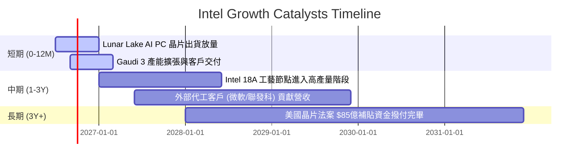

### 8.2 TAM 市場規模分析

Intel 正在開闢全新的代工市場，試圖切入原本由台積電獨佔的先進代工 TAM (Total Addressable Market)：

```
╔══════════════════════════════════════════════════════════════════╗
║                Intel 2028年 TAM 與潛在滲透率預估                 ║
╠══════════════════════════════════════════════════════════════════╣
║                                                                  ║
║  1. 先進邏輯代工 (3nm及以下)：                                   ║
║     ├── 全球 TAM: ~$850億                                        ║
║     └── Intel 預估份額: 8% (營收 ~$68億)                         ║
║                                                                  ║
║  2. AI PC 處理器：                                               ║
║     ├── 全球 TAM: ~$350億                                        ║
║     └── Intel 預估份額: 60% (營收 ~$210億)                        ║
║                                                                  ║
║  3. 資料中心通用 CPU：                                           ║
║     ├── 全球 TAM: ~$280億                                        ║
║     └── Intel 預估份額: 55% (營收 ~$154億)                        ║
║                                                                  ║
╚══════════════════════════════════════════════════════════════════╝
```

### 8.3 成長驅動力結構圖

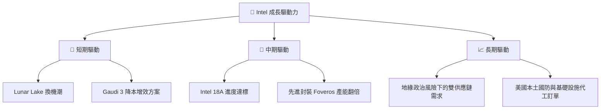

---

## 9. 風險矩陣

### 9.1 風險評分矩陣

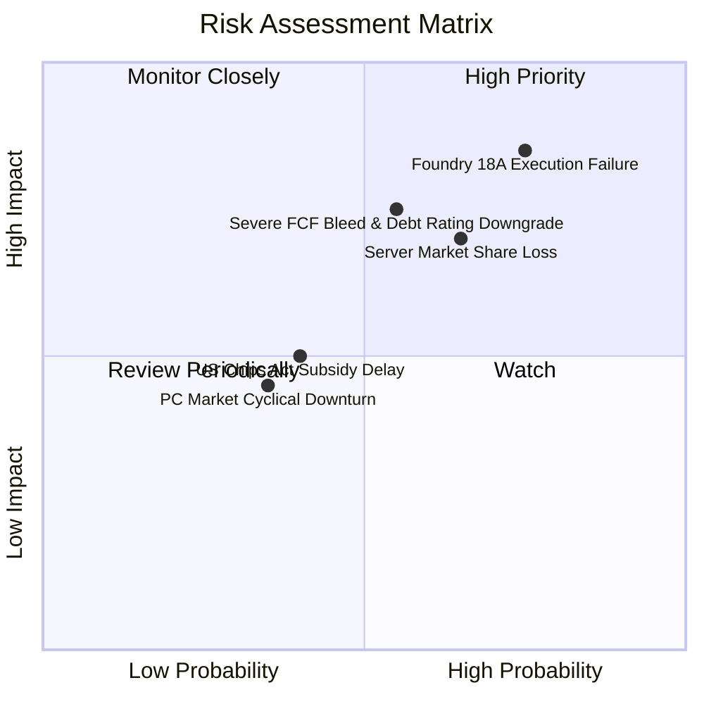

### 9.2 風險清單詳細分析

| # | 風險項目 | 發生機率 | 財務衝擊 | 風險評分 | 緩解措施 |
|---|----------|----------|----------|----------|----------|
| 1 | 🔴 **18A 製程良率不及預期** | 中高 (60%) | 高 (-20% 估值) | 🔴 8.5 / 10 | 與 ASML 緊密合作，優化 High-NA EUV 光刻機參數，並將部分非核心 IP 繼續外包台積電以分擔風險。 |
| 2 | 🔴 **FCF 持續失血導致信用降級** | 中等 (50%) | 高 (-$20億 現金) | 🔴 7.5 / 10 | 擴大 SCIP 聯合投資計劃，引入更多外部基建基金；必要時進一步削減非核心研發項目。 |
| 3 | 🟡 **伺服器 CPU 市佔率跌破 60%**| 高 (70%) | 中等 (-$10億 營收) | 🟡 7.0 / 10 | 加速 Granite Rapids 伺服器處理器的量產，並採取更具攻擊性的定價策略以保住核心客戶。 |

---

## 10. 投資建議

### 10.1 最終綜合評級雷達圖

```
╔══════════════════════════════════════════════════════════════╗
║                    Intel 綜合評分雷達圖                      ║
╠══════════════════════════════════════════════════════════════╣
║                                                                  ║
║              基本面強度 (Fundamental)  6.0/10                    ║
║                        ▲                                         ║
║                        │                                         ║
║  財務健康 (Balance) 6.5 ┼───●───► 成長動能 (Growth) 5.5/10         ║
║                        │                                         ║
║                        ▼                                         ║
║               估值合理性 (Valuation)   3.0/10                    ║
║                                                                  ║
║  🏆 綜合評分：5.8 / 10                                            ║
║  📢 建議評級：🟡 觀望 (Hold)                                      ║
╚══════════════════════════════════════════════════════════════╝
```

### 10.2 目標價與隱含報酬率

*   **當前股價**：$95.04
*   **基準目標價 (12M)**：**$102.00**
*   **隱含報酬率**：**+7.3%**
*   **配置建議**：不建議在當前價位追高。若股價回落至 **$75.00** 以下（對應前瞻 P/E 約 46x），安全邊際將擴大至 35% 以上，屆時可視為較佳的左側建倉機會。

### 10.3 買入時機與觸發因素

```
╔══════════════════════════════════════════════════════════════════╗
║                  ✅ 買入觸發因素 Checklist                      ║
╠══════════════════════════════════════════════════════════════════╣
║                                                                  ║
║  立即買入觸發條件（多數符合）：                                  ║
║  [ ] 季度自由現金流 (FCF) 連續兩季轉正                           ║
║  [ ] 宣佈獲得至少兩家超大規模雲端服務商 (Hyperscaler) 的 18A 訂單 ║
║  [ ] 毛利率回升至 45% 以上                                       ║
║                                                                  ║
║  加碼觸發條件：                                                  ║
║  [ ] 美國《晶片法案》首筆實質補貼資金撥付款項到帳                ║
║  [ ] Intel Foundry 作為獨立實體分拆上市計劃明朗化                ║
║                                                                  ║
║  減碼/停損觸發條件：                                             ║
║  [ ] 18A 製程宣佈延遲至 2027 年以後量產                          ║
║  [ ] 淨債務規模突破 $200 億，且面臨評級機構降級警告              ║
╚══════════════════════════════════════════════════════════════════╝
```

### 10.4 投資人適配度分析

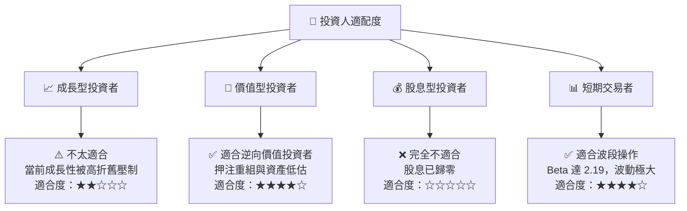

### 10.5 每季財報監控清單（Quarterly Watch List）

在未來的季度財報中，投資人應重點追蹤以下量化指標，以驗證投資假設是否發生位移：

1.  **Intel Foundry 營運利潤率**：目前 Foundry 業務處於嚴重虧損狀態，需監控其虧損率是否每季收窄（目標：2027 年底前實現單季損益兩平）。
2.  **資本支出 (Capex) 執行率**：每季 Capex 應控制在 $40億~$45億之間，若大幅超支且無相應融資，將進一步惡化 FCF。
3.  **DCAI 營收成長率與毛利率**：需維持在 YoY +5% 以上，且毛利率不能低於 40%，否則說明傳統業務失血加快，無法支撐轉型。

### 10.6 反面論證：什麼會證明論點錯誤（What Would Change My Mind）

本機構對 Intel 的「觀望」評級是基於其短期高估值與高失血風險。**如果出現以下情況，我們將修正觀點並將評級上調至「買入」**：

```
╔══════════════════════════════════════════════════════════════════╗
║              ⚠️ 論點失效條件（Disconfirming Evidence）           ║
╠══════════════════════════════════════════════════════════════════╣
║  本投資論點在下列情況成立時應重新檢視並轉為積極看多：            ║
║  [ ] NVIDIA 宣佈將其部分次級製程或先進封裝訂單外包給 Intel      ║
║  [ ] 2026 年底前，Intel 18A 製程的晶片良率 (Yield) 證實突破 75%  ║
║  [ ] 營業利潤率較當前 (6.9%) 提升 > 5.0 pp (達到 12% 以上)       ║
║  [ ] 公司成功引進第二期表外融資，使淨債務規模降至 $50 億以下     ║
╚══════════════════════════════════════════════════════════════════╝
```

---

> **免責聲明**：本報告由 CFA 持牌分析師基於公開財務數據撰寫，僅供學術研究與機構投資參考，不構成任何買賣建議。投資人應自行承擔市場交易風險。