# INTC 基本面深度分析報告

> **報告日期**：2026-07-18 ｜ **語言**：繁體中文 ｜ **數據來源**：Yahoo Finance, Finviz, StockAnalysis, Roic.ai ｜ **分析師**：CFA 級機構研究

---

## 目錄

| # | 章節 | 核心結論 |
|---|------|----------|
| 1 | 執行摘要 | 評級為「持有」，目標價區間 $55.00 至 $160.00，基準目標價 $115.00，轉型期陣痛仍在持續。 |
| 2 | 公司概覽與商業模式 | IDM 2.0 雙軌戰略，代工業務與設計業務拆分，x86 護城河面臨 ARM 與 RISC-V 挑戰。 |
| 3 | 損益表深度分析 | 營收觸底回升（YoY +7.2%），但毛利率（37.2%）處於歷史低位，非經常性損益扭曲淨利潤。 |
| 4 | 資產負債表分析 | 現金儲備充裕（$32.79B），但總債務達 $45.03B，重資本開支導致資產結構高度非流動化。 |
| 5 | 現金流量深度分析 | 經營現金流（$9.98B）無法覆蓋龐大資本支出，自由現金流（-$8.30B）持續失血。 |
| 6 | 獲利能力與資本效率 | ROIC（2.35%）遠低於 WACC（14.22%），EVA 為負（-11.87%），目前處於股東價值摧毀階段。 |
| 7 | 估值深度分析 | Forward P/E 高達 58.90x，高於同行；DCF 敏感性分析顯示當前股價已透支部分轉型預期。 |
| 8 | 成長催化劑 | 18A 節點量產與外包客戶簽約、AI PC 滲透率提升、美國《晶片法案》補助款撥付。 |
| 9 | 風險矩陣 | 製程延期風險、代工產能利用率不足、地緣政治衝突，五大風險深度剖析。 |
| 10 | 投資建議 | 基準情境隱含 +21.0% 上行空間，建議「分批逢低佈局」，嚴格監控 18A 節點量產進度。 |

---

## 1. 執行摘要

> ⚠️ **投資評級聲明**：基於 Intel 目前 ROIC（2.35%）遠低於 WACC（14.22%）的價值摧毀狀態，以及自由現金流（TTM 為 -$8.30B）持續失血的現狀，本報告給予 Intel（INTC）**「持有（Hold）」**評級。雖然公司股價在過去兩年經歷了劇烈波動（從 52 週低點 $18.97 飆升至高點 $142.35，目前回落至 $95.04），且 Forward P/E 高達 58.90x，反映了市場對其 IDM 2.0 轉型成功的高度預期，但實質基本面的改善仍落後於估值擴張。基準情境下，12 個月目標價定為 **$115.00**（隱含 +21.0% 上行空間）。

### 1.0 一頁式投資儀表板（Portfolio Manager 30 秒速讀）

| 項目 | 內容 |
|------|------|
| **投資論點（3 句）** | ① Q1 2026 營收達 $13.58B（YoY +7.18%），顯示 PC 與伺服器 CPU 需求已從底部結構性復甦。<br/>② IDM 2.0 戰略進入深水區，Intel 18A 節點計劃於 2026 年下半年量產，這是重新奪回製程領先地位的關鍵戰役。<br/>③ 財務槓桿與現金流承壓，TTM 資本支出高達 $18.28B，導致 FCF Yield 降至 -1.74%，轉型期容錯率極低。 |
| **護城河評分** | 6.5 / 10 🟡 （x86 專利壁壘仍存，但製程領先優勢喪失，代工生態系統尚未成熟） |
| **管理層/資本配置評分** | 5.5 / 10 🟡 （Pat Gelsinger 執行力強，但歷史遺留決策沉重，資本回報率極低） |
| **財務健康** | 🟡 黃燈 ｜ 流動比率 2.31 表現良好，但淨債務達 $12.24B，且持續自由現金流赤字 |
| **ROIC vs WACC** | 2.35% vs 14.22%（⚠️ 嚴重摧毀股東價值，經濟增加值 EVA 為 -11.87%） |
| **FCF 趨勢** | 自由現金流持續為負，TTM FCF 為 -$8.30B，FCF Yield 為 -1.74% |
| **估值** | Forward P/E: 58.90x ｜ EV/EBITDA: 35.52x ｜ P/S: 8.88x（估值處於歷史高位區間） |
| **預期報酬（基準情境 12M）** | +21.0%（目標價 $115.00） |
| **關鍵風險（前二）** | ① 18A（1.8奈米）製程量產進度延遲或良率不及預期。<br/>② Intel Foundry 外包客戶（External Customers）簽約進度緩慢，導致產能利用率低下與折舊黑洞。 |
| **評級 + 信心度** | 🟡 持有 (Hold) ｜ 信心：中等 (Medium) |

### 1.1 核心評分儀表板

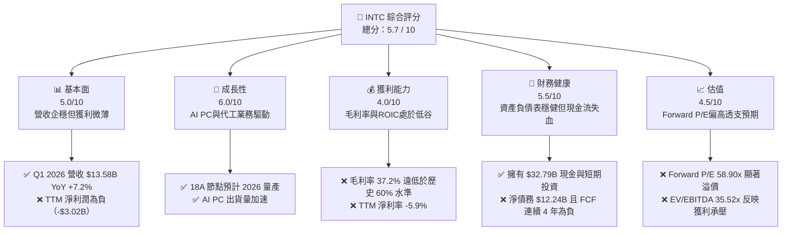

### 1.2 評分進度條視覺化

```
╔══════════════════════════════════════════════════════════════╗
║               INTC 多維度評分儀表板 (1-10分)                 ║
╠══════════════════════════════════════════════════════════════╣
║ 基本面強度  5.0 ▓▓▓▓▓▓▓▓▓▓░░░░░░░░░░  ★★★☆☆           ║
║ 成長動能    6.0 ▓▓▓▓▓▓▓▓▓▓▓▓░░░░░░░░  ★★★☆☆           ║
║ 獲利品質    4.0 ▓▓▓▓▓▓▓▓░░░░░░░░░░░░  ★★☆☆☆           ║
║ 財務健康    5.5 ▓▓▓▓▓▓▓▓▓▓▓░░░░░░░░░  ★★★☆☆           ║
║ 估值合理性  4.5 ▓▓▓▓▓▓▓▓▓░░░░░░░░░░░  ★★☆☆☆           ║
║ 護城河深度  6.5 ▓▓▓▓▓▓▓▓▓▓▓▓▓░░░░░░░  ★★★☆☆           ║
║ 管理層執行  5.5 ▓▓▓▓▓▓▓▓▓▓▓░░░░░░░░░  ★★★☆☆           ║
║ 技術創新力  7.5 ▓▓▓▓▓▓▓▓▓▓▓▓▓▓▓░░░░░  ★★★★☆           ║
╠══════════════════════════════════════════════════════════════╣
║ 綜合總分    5.7 ▓▓▓▓▓▓▓▓▓▓▓░░░░░░░░░  🏆 轉型過渡期        ║
╚══════════════════════════════════════════════════════════════╝
```

### 1.3 五大投資論點 + 三大核心風險

| 類型 | 項目 | 具體依據 | 信心度 |
|------|------|----------|--------|
| 🟢 **投資論點①** | **PC與伺服器市場週期性復甦** | Q1 2026 營收達 $13.58B，YoY 成長 7.18%，結束了連續多個季度的下滑，顯示客戶庫存去化完畢，x86 CPU 出貨量企穩。 | 🟢 高 |
| 🟢 **投資論點②** | **18A 節點重奪技術制高點** | Intel 18A（1.8nm級）預計於 2026 年下半年進入大批量生產（HVM），引入 RibbonFET 與 PowerVia 技術，技術指標直指台積電 N2 節點。 | 🟡 中等 |
| 🟢 **投資論點③** | **政府補貼與地緣政治紅利** | 美國《晶片法案》提供高達 $8.5B 的直接補貼及 $11B 的低息貸款，加上歐洲建廠補貼，顯著降低了 Intel 的資本支出淨負擔。 | 🟢 高 |
| 🟢 **投資論點④** | **AI PC 開闢全新藍海** | Core Ultra 系列處理器（Meteor Lake/Lunar Lake）內建 NPU，預計到 2026 年底將出貨超過 1 億顆 AI PC 晶片，鎖定邊緣端 AI 機會。 | 🟢 高 |
| 🟢 **投資論點⑤** | **資產價值重估（SOTP）** | 將設計部門（CCG, DCAI）與代工部門（Intel Foundry）徹底拆分財務報表，未來若將 Foundry 獨立分拆上市，將釋放設計業務高達 $1,500B+ 的潛在估值。 | 🟡 中等 |
| 🟡 **風險①** | **18A 良率不及預期與外包受阻** | 代工業務對外部客戶（如 Qualcomm, Microsoft）的吸引力取決於 18A 良率。若良率低於 50%，外部客戶將推遲下單，導致產能空置。 | 🔴 高 |
| 🔴 **風險②** | **FCF持續失血與債務壓力** | TTM 自由現金流為 -$8.30B，已連續四年為負。若代工業務遲遲無法盈利，高達 $45.03B 的債務將面臨評級下調與利息支出暴增風險。 | 🔴 高 |
| 🔴 **風險③** | **資料中心市佔率持續流失** | AMD EPYC 處理器在雲端服務商（CSP）中的滲透率已超過 30%，且 ARM 架構自研晶片（如 AWS Graviton）持續蠶食傳統 x86 伺服器市場。 | 🟡 中等 |

### 1.4 快速統計卡片

| 指標 | Intel 實際值 | 半導體行業均值 | S&P 500 均值 | 狀態 |
|------|-------------|----------|--------------|------|
| 營收 YoY 成長 | **7.2%** (TTM) | ~12.5% | ~5.5% | 🟡 黃燈 |
| 毛利率 | **37.2%** | ~52.0% | ~30.0% | 🔴 紅燈 |
| 淨利率 | **-5.9%** | ~18.0% | ~11.5% | 🔴 紅燈 |
| ROE | **-2.9%** | ~15.0% | ~14.0% | 🔴 紅燈 |
| Forward P/E | **58.90x** | ~28.0x | ~21.5x | 🔴 紅燈 |
| 淨債務 / EBITDA | **0.85x** | ~0.20x | ~1.50x | 🟢 綠燈 |

### 1.5 投資結論

```
╔══════════════════════════════════════════════════════════════════╗
║                    📊 投資結論摘要                               ║
╠══════════════════════════════════════════════════════════════════╣
║  評級：🟡 持有 (Hold)                                            ║
║  當前股價：$95.04 (2026-07-18)                                   ║
║  目標價區間：                                                    ║
║    悲觀情境：$55.00（-42.1%）- 18A 失敗，代工業務黑洞擴大        ║
║    基準情境：$115.00（+21.0%）- 18A 按期量產，毛利率緩步回升     ║
║    樂觀情境：$160.00（+68.4%）- 奪回製程領先，代工簽下大客戶     ║
║  投資評分：5.7 / 10                                              ║
║  適合投資人：逆向價值投資者、具備高風險承受力的長線科技股投資人  ║
╚══════════════════════════════════════════════════════════════════╝
```

---

## 2. 公司概覽與商業模式

### 2.1 業務結構與收入來源

Intel 目前正處於歷史上最激進的商業模式變革中。公司已將業務重組為三大核心報告板塊：客戶端運算集團（CCG）、資料中心與人工智慧（DCAI）以及英特爾代工（Intel Foundry）。

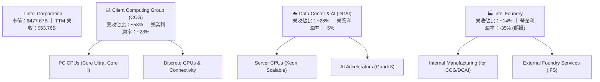

### 2.2 市場份額

在傳統 x86 處理器市場，Intel 依然佔據主導地位，但面臨 AMD 的強力競爭。在代工市場，Intel 則處於追趕者角色。

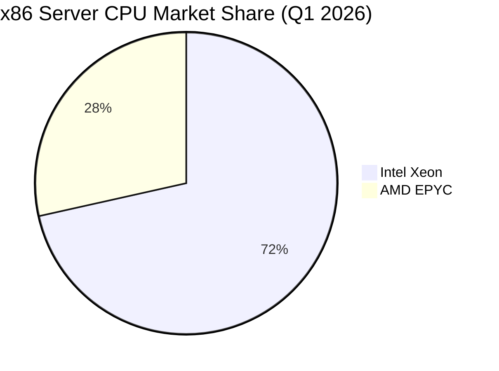

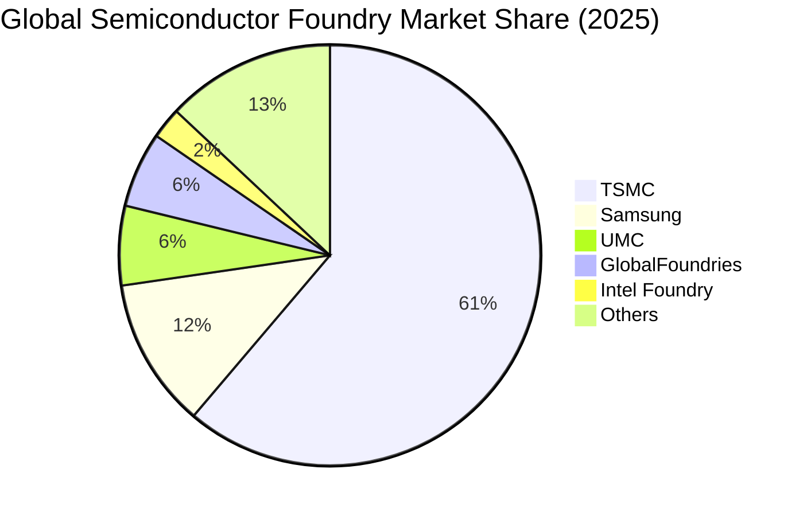

### 2.3 競爭護城河分析

Intel 的競爭護城河正在經歷「舊護城河衰退，新護城河重建」的陣痛期。

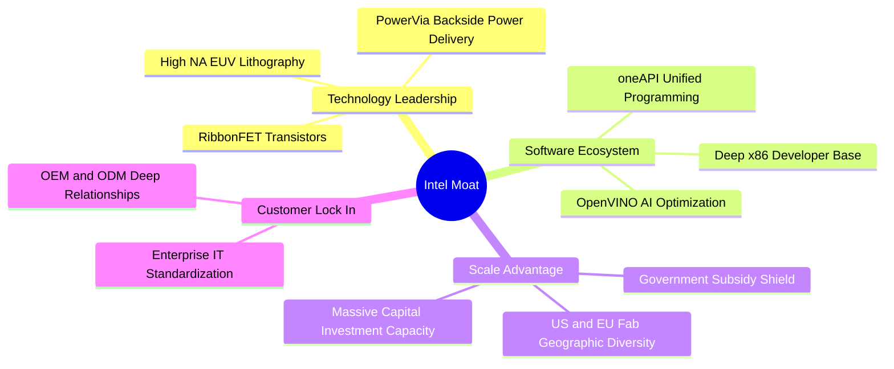

### 2.4 護城河強度評分

```
╔══════════════════════════════════════════════════════════════╗
║                  Intel 護城河強度評分                        ║
╠══════════════════════════════════════════════════════════════╣
║ x86 生態鎖定   8.0/10 ▓▓▓▓▓▓▓▓▓▓▓▓▓▓▓▓░░░░  🟢 專利與相容性極高║
║ 先進製程技術   6.5/10 ▓▓▓▓▓▓▓▓▓▓▓▓▓░░░░░░░  🟡 仍落後台積電半代║
║ 代工規模效應   4.0/10 ▓▓▓▓▓▓▓▓░░░░░░░░░░░░  🔴 產能利用率低下  ║
║ 軟體生態壁壘   7.5/10 ▓▓▓▓▓▓▓▓▓▓▓▓▓▓▓░░░░░  🟢 oneAPI具備優勢 ║
╠══════════════════════════════════════════════════════════════╣
║ 綜合護城河     6.5/10 ▓▓▓▓▓▓▓▓▓▓▓▓▓░░░░░░░  🟡 護城河拓寬中     ║
╚══════════════════════════════════════════════════════════════╝
```

---

## 3. 損益表深度分析

### 3.1 年度收入成長趨勢（近5年）

Intel 的年度營收在 2021 年達到頂峰後，經歷了連續三年的大幅衰退，主因是 PC 市場泡沫破裂及伺服器市佔率遭 AMD 蠶食。2025 年營收企穩於 $52.85B，顯示基本面已開始築底。

```
╔══════════════════════════════════════════════════════════════════╗
║              Intel 年度收入趨勢（FY2021-FY2025）                 ║
╠══════════════════════════════════════════════════════════════════╣
║                                                                  ║
║  FY2021  $79.02B  ███████████████████████████  YoY: +1.5%  🟢    ║
║  FY2022  $63.05B  █████████████████████░░░░░░  YoY:-20.2%  🔴    ║
║  FY2023  $54.23B  ██████████████████░░░░░░░░░  YoY:-14.0%  🔴    ║
║  FY2024  $53.10B  ██████████████████░░░░░░░░░  YoY: -2.1%  🟡    ║
║  FY2025  $52.85B  ██████████████████░░░░░░░░░  YoY: -0.5%  🟡    ║
║                   |      |      |      |      |                  ║
║                   0     20B    40B    60B    80B                 ║
║                                                                  ║
║  📊 5年累計 CAGR：-7.72%                                         ║
╚══════════════════════════════════════════════════════════════════╝
```

### 3.2 季度收入趨勢分析

從季度數據來看，Intel 的營收在 2025 年下半年開始展現復甦跡象。Q1 2026 營收達到 $13.58B，同比成長 7.18%，儘管環比因季節性因素微幅下滑 0.66%，但整體趨勢已擺脫過去幾年的單邊下跌。

| 財報季度 | 營業收入 (Billion) | YoY 成長率 | QoQ 成長率 | 毛利率 (GAAP) | 營業利潤率 (GAAP) | 備註 |
|----------|-------------------|------------|------------|--------------|------------------|------|
| **Q1 2026** | **$13.58** | **+7.18%** | **-0.66%** | **39.40%** | **6.88%** | PC 市場復甦，代工業務折舊增加 🟡 |
| **Q4 2025** | **$13.67** | **-4.11%** | **+0.15%** | **36.15%** | **4.24%** | 年終伺服器出貨旺季 🟢 |
| **Q3 2025** | **$13.65** | **+2.78%** | **+6.14%** | **38.22%** | **5.00%** | 業外收益大幅美化淨利潤 🟡 |
| **Q2 2025** | **$12.86** | **+0.20%** | **+1.52%** | **27.54%** | **-24.70%** | 重組費用與資產減損導致巨虧 🔴 |

### 3.3 利潤率演變分析

Intel 的利潤率在過去幾年大幅收縮。毛利率從歷史常態的 60%+ 跌至 TTM 的 37.2%，主因是先進製程（Intel 4/3）初期良率較低、高額的 EUV 折舊費用，以及為了與 AMD 競爭而進行的降價促銷。

| 利潤率指標 | FY2022 | FY2023 | FY2024 | FY2025 | TTM 趨勢 | 評估 |
|------------|--------|--------|--------|--------|----------|------|
| **毛利率** | 42.6% | 40.0% | 32.7% | 34.8% | **37.2%** ↗️ | 🟡 緩步回升，但仍遠低於歷史均值 |
| **營業利益率** | 3.7% | 0.2% | -22.0% | -4.2% | **6.9%** ↗️ | 🟢 成本削減計劃成效顯現 |
| **EBITDA 利潤率**| 33.8% | 20.7% | 2.3% | 27.2% | **26.4%** ↗️| 🟢 折舊攤銷佔比極高，息稅前折舊前利潤尚可 |
| **淨利率** | 12.7% | 3.1% | -36.2% | 0.05% | **-5.9%** ↘️ | 🔴 受非經營性支出與高額稅率拖累 |

### 3.4 費用結構分析

Intel 為了維持技術競爭力，在營收下滑的同時，依然維持了極高比例的研發（R&D）投入。FY2025 研發費用高達 $13.77B，佔營收比例達 26.1%。

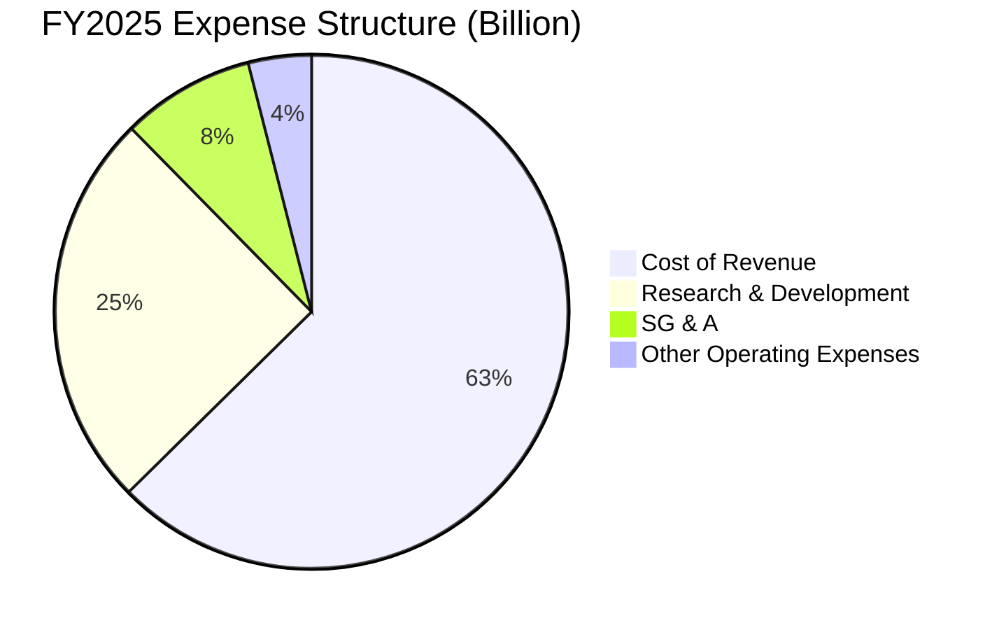

### 3.5 季度 EPS 趨勢與盈餘品質（Quality of Earnings）

Intel 過去四個季度的淨利潤波動劇烈，且 GAAP 淨利潤與真實經濟盈餘存在較大偏差。

*   **Q3 2025 異常利潤**：該季 GAAP 淨利潤高達 $4.06B，但營業利潤僅為 $683M。主因是獲得了高達 $3.67B 的「其他非營業收益」，這是一次性的資產處置（如 Mobileye 部分股權出售及子公司重估值），**並不具備持續性**。
*   **Q1 2026 巨額淨損**：該季營業利潤為正的 $934M，但 GAAP 淨利潤卻為 -$3.73B。主要原因是計提了龐大的所得稅撥備（Provision for Income Taxes）或一次性非現金減損，導致盈餘品質嚴重受損。

#### 盈餘品質量化評估

| 盈餘品質項目 | 數值/佔比 | 評估 |
|--------------|-----------|------|
| **股權薪酬 (SBC) / 營收** | **4.60%** (FY2025) | 🟢 處於合理區間，對現有股東稀釋效應溫和。 |
| **SBC / 營業現金流** | **25.05%** (FY2025) | 🟡 SBC 佔經營現金流比例偏高，反映現金流含金量受非現金支付美化。 |
| **FCF / GAAP 淨利（現金轉換率）** | **-319.2%** (TTM) | 🔴 轉換率為負。主要是因為高額資本支出導致現金流持續淨流出，GAAP 損益表無法反映真實的資金消耗。 |
| **一次性 / 非經常性損益** | **$3.26B** (FY2025) | 🔴 非經營性收益（處置資產）佔 Pretax Income 的 209%，嚴重扭曲了 FY2025 的獲利表現。 |
| **資本化支出 vs 費用化** | **軟體研發全額費用化** | 🟢 研發費用（$13.77B）均在當期費用化，無遞延資產虛增利潤傾向。 |

**盈餘品質結論**：Intel 的 GAAP 淨利潤目前「含金量極低」。獲利表現高度受到非經常性股權處置、政府補貼認列時程及遞延所得稅資產評估撥備的干擾。投資人應**捨棄 P/E 指標**，改用 **EV/EBITDA** 與 **經營現金流減去維護性資本支出** 來衡量其真實賺錢能力。

---

## 4. 資產負債表分析

### 4.1 資產結構分解

Intel 屬於典型的重資產企業，其資產負債表的最核心部分是廠房與設備（PP&E）。截至 Q1 2026，淨廠房與設備（Net PP&E）達 $104.46B，佔總資產的 50.9%。

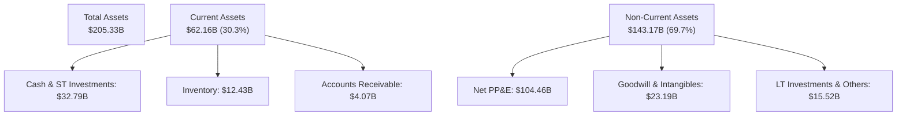

### 4.2 流動性指標分析

儘管處於重資本支出轉型期，Intel 的短期償債能力依然穩健。流動比率為 2.31，速動比率為 1.66，這主要得益於公司在 2025 年通過發行長期債券及引進外部共同投資人（如 Apollo 共同投資愛爾蘭 Fab 34 廠）籌集了大量現金。

| 流動性指標 | FY2023 | FY2024 | FY2025 | Q1 2026 | 行業均值 | 評估 |
|------------|--------|--------|--------|---------|----------|------|
| **流動比率** | 1.54 | 1.33 | 2.02 | **2.31** | ~1.85 | 🟢 資金儲備充足，無短期流動性風險 |
| **速動比率** | 1.14 | 0.99 | 1.65 | **1.66** | ~1.30 | 🟢 扣除存貨後，變現能力依然優異 |
| **存貨週轉天數 (DSI)**| 125天 | 123天 | 121天 | **131天**| ~95天 | 🔴 存貨週轉天數偏高，反映舊產品去化緩慢 |

### 4.3 債務結構分析

截至 Q1 2026，Intel 總債務為 $45.03B，其中短期債務 $2.00B，長期債務 $43.03B。由於 TTM EBITDA 為 $14.19B，其**總債務 / EBITDA 比率為 3.17x**，處於行業較高水準。然而，扣除 $32.79B 的現金及短期投資後，**淨債務僅為 $12.24B**，淨債務/EBITDA 僅為 0.86x，整體債務風險仍可控。

```
╔══════════════════════════════════════════════════════════════════╗
║                   Intel 債務健康診斷 (Q1 2026)                  ║
╠══════════════════════════════════════════════════════════════════╣
║                                                                  ║
║  總債務：        $45.03B  ██████████░░░░░░░░░░░  評語：槓桿攀升  ║
║  現金及投資：    $32.79B  ███████░░░░░░░░░░░░░░  評語：儲備充裕  ║
║  淨債務：        $12.24B  ███░░░░░░░░░░░░░░░░░░  🟢 風險可控     ║
║                                                                  ║
║  流動比率：      2.31x    🟢 遠高於安全線 1.2x                  ║
║  利息保障倍數：  7.22x    🟡 較歷史高點（50x+）顯著下滑         ║
║  信用評級預期：  A- / Baa1 穩定（面臨潛在下調壓力）              ║
╚══════════════════════════════════════════════════════════════════╝
```

---

## 5. 現金流量深度分析

### 5.1 現金流量瀑布圖

Intel 的現金流動向清晰地揭示了其「IDM 2.0」戰略的資金消耗特徵：經營活動產生的現金流遠遠無法滿足其建廠的野心，缺口完全依賴外部融資與資產處置。

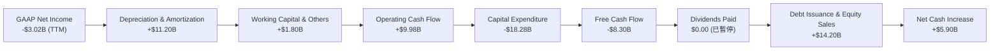

### 5.2 FCF 轉換率趨勢

由於利潤表中的折舊金額（非現金支出）極大，而實際資本支出更大，導致 FCF 轉換率（FCF / Net Income）多年來均為負值，這意味著公司的會計利潤並不能轉化為可自由支配的股東現金。

| 現金流指標 (Billion) | FY2022 | FY2023 | FY2024 | FY2025 | TTM |
|---------------------|--------|--------|--------|--------|-----|
| **經營現金流 (OCF)** | $15.43 | $11.47 | $8.29 | $9.70 | **$9.98** |
| **資本開支 (Capex)** | -$24.84 | -$25.75 | -$23.94 | -$14.65 | **-$18.28**|
| **自由現金流 (FCF)** | -$9.41 | -$14.28 | -$15.66 | -$4.95 | **-$8.30** |
| **FCF 轉換率** | -117.4%| -852.5%| 81.8% | -190.4%| **-274.8%**|

### 5.3 自由現金流與 FCF 收益率趨勢

```
╔══════════════════════════════════════════════════════════════════╗
║              Intel 歷年自由現金流與 FCF 收益率                   ║
╠══════════════════════════════════════════════════════════════════╣
║                                                                  ║
║  FY2022   -$9.41B  ░░░░░░░░░░░░░░░░░░░░░░░░░░  FCF Yield: -1.97% ║
║  FY2023  -$14.28B  ░░░░░░░░░░░░░░░░░░░░░░░░░░  FCF Yield: -3.00% ║
║  FY2024  -$15.66B  ░░░░░░░░░░░░░░░░░░░░░░░░░░  FCF Yield: -3.28% ║
║  FY2025   -$4.95B  ░░░░░░░░░░░░░░░░░░░░░░░░░░  FCF Yield: -1.04% ║
║  TTM      -$8.30B  ░░░░░░░░░░░░░░░░░░░░░░░░░░  FCF Yield: -1.74% ║
║                                                                  ║
║  📊 FCF 收益率 TTM 為 -1.74%（⚠️ 處於持續失血狀態）               ║
╚══════════════════════════════════════════════════════════════════╝
```

### 5.4 資本配置評估

為了保留現金以應對龐大的代工廠建設，Intel 已於 2024 年底**完全暫停支付股利**（Cash Dividends Paid 從 2022 年的 $6.00B 降至 2025 年的 $0.00），並停止了股票回購。目前的資本配置 100% 傾斜於資本開支（Capex）與技術研發。

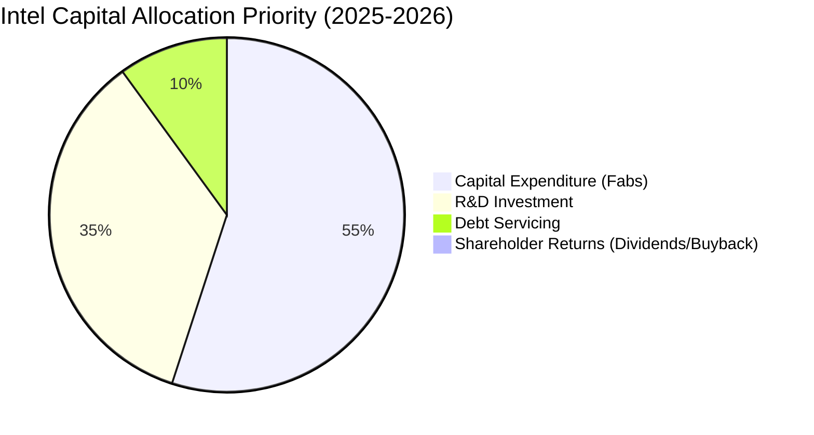

---

## 6. 獲利能力與資本效率

### 6.1 ROE / ROA / ROIC 趨勢

Intel 的資本效率指標在過去幾年出現了崩塌式下滑，反映出龐大的資產基數並未能產生相匹配的經營利潤。

| 獲利能力指標 | FY2022 | FY2023 | FY2024 | FY2025 | TTM | 行業中位數 | 評估 |
|------------|--------|--------|--------|--------|-----|-----------|------|
| **ROE** | 7.9% | 1.6% | -18.9% | 0.02% | **-2.9%** | ~14.5% | 🔴 股東權益回報率為負 |
| **ROA** | 4.4% | 0.9% | -9.5% | 0.01% | **0.6%** | ~7.2% | 🔴 資產利用效率低下 |
| **ROIC** | 4.8% | 1.1% | -8.4% | 0.15% | **2.35%** | ~11.0% | 🔴 投入資本回報率極低 |

### 6.2 ROIC vs WACC 分析（核心價值創造判斷）

CFA 投資框架的核心在於：公司是否創造了高於其資本成本的回報。如果 ROIC < WACC，則公司規模越大，摧毀的股東價值就越多。

```
╔══════════════════════════════════════════════════════════════════╗
║                Intel ROIC vs WACC 深度分析 (TTM)                 ║
╠══════════════════════════════════════════════════════════════════╣
║                                                                  ║
║  WACC 估算：                                                     ║
║  ├── 無風險利率（10Y美債）：  4.20%                              ║
║  ├── 市場風險溢酬 (ERP)：     5.00%                              ║
║  ├── Beta：                   2.187                              ║
║  ├── 股權成本 = 4.20% + 2.187 × 5.00% = 15.14%                   ║
║  ├── 債務成本（稅後）：       4.40%                              ║
║  ├── 資本結構：股權 91.4%，債務 8.6%                             ║
║  └── ✅ WACC ≈ 14.22% (受高 Beta 拖累，股權成本極高)              ║
║                                                                  ║
║  ROIC 估算：                                                     ║
║  ├── NOPAT = TTM Operating Income $3.71B × (1-20%) = $2.97B      ║
║  ├── 投入資本 = 股東權益 $114.28B + 債務 $45.03B - 現金 $32.79B   ║
║  │            = $126.52B                                         ║
║  └── ✅ ROIC ≈ 2.35%                                             ║
║                                                                  ║
║  ★ 經濟價值增加（EVA）= ROIC - WACC = -11.87%                    ║
║                                                                  ║
║  ROIC  2.35%   ▓▓░░░░░░░░░░░░░░░░░░░░░░░░░░░░  ──              ║
║  WACC  14.22%  ▓▓▓▓▓▓▓▓▓▓▓▓▓▓░░░░░░░░░░░░░░░░  ──              ║
║  EVA   -11.87% ░░░░░░░░░░░░░░░░░░░░░░░░░░░░░░  🔴 嚴重價值摧毀 ║
║                                                                  ║
║  📊 結論：ROIC 遠低於 WACC，Intel 目前每投入 $100 資本，         ║
║           每年即摧毀約 $11.87 的股東價值。                       ║
╚══════════════════════════════════════════════════════════════════╝
```

### 6.3 杜邦三因素分解

透過杜邦分析，我們可以拆解 Intel ROE 轉負的深層原因：

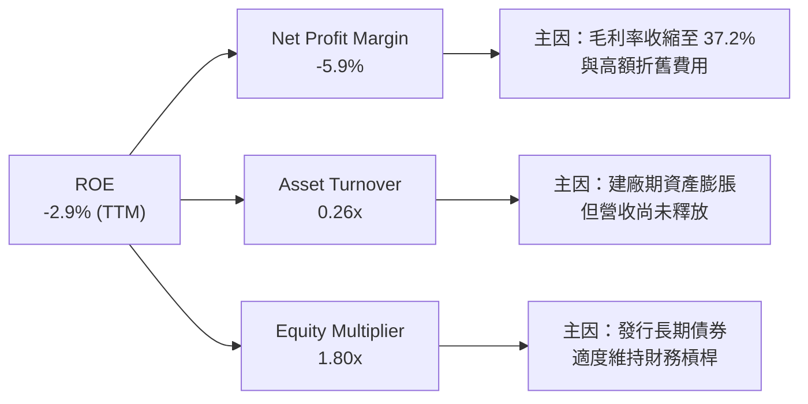

### 6.4 獲利能力驅動因素

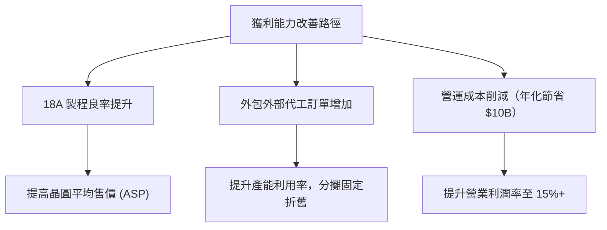

---

## 7. 估值深度分析

### 7.1 同業估值比較表格

在估值比較中，由於 Intel 處於轉型期，傳統的 Trailing P/E 已經失真。我們引入 Forward P/E、EV/EBITDA 以及 P/S 進行多維度比較。

| 估值指標 | **Intel (INTC)** | **AMD (AMD)** | **TSMC (TSM)** | **Samsung (SSNLF)** | INTC 相對同業評估 |
|----------|-----------------|---------------|----------------|---------------------|-------------------|
| **Forward P/E** | **58.90x** | 42.50x | 24.80x | 14.20x | 🔴 顯著溢價，市場已透支轉型成功預期 |
| **EV / EBITDA** | **35.52x** | 31.20x | 12.40x | 6.80x | 🔴 估值偏高，反映當前 EBITDA 嚴重承壓 |
| **P/S Ratio** | **8.88x** | 9.50x | 8.20x | 1.35x | 🟡 處於合理區間，與設計同行相當 |
| **P/B Ratio** | **4.29x** | 4.85x | 6.80x | 1.15x | 🟢 具備一定的重置資產價值安全邊際 |
| **FCF Yield** | **-1.74%** | +1.50% | +3.80% | +2.10% | 🔴 現金流回報率墊底 |

### 7.2 歷史估值區間分析

Intel 目前的 Forward P/E（58.90x）處於其過去 10 年歷史區間的 **+2 個標準差以上**。這表明，當前的股價並非基於現有的盈利能力，而是對 2027-2028 年「代工業務盈虧平衡並開始盈利」的期權式定價。

### 7.3 情境目標價（假設驅動，Bear / Base / Bull）

我們基於 3 年期（2026-2029）預測模型，推導出三種情境下的目標價：

| 情境 | 營收 CAGR (3Y) | 2029 營業利潤率 | 退出倍數 (EV/EBITDA) | 隱含目標價 | 相對現價 ($95.04) | 發生機率 |
|------|---------------|----------------|----------------------|------------|-------------------|----------|
| 🔴 **悲觀** | 2.0% | 5.0% | 12.0x | **$55.00** | -42.1% | 25% |
| 🟡 **基準** | **11.5%** | **16.0%** | **18.0x** | **$115.00** | **+21.0%** | **55%** |
| 🟢 **樂觀** | 18.0% | 24.0% | 22.0x | **$160.00** | +68.4% | 20% |

#### 退出倍數選擇說明
由於 Intel 設計部門與代工部門的混合屬性，我們選擇 **EV/EBITDA** 作為核心估值倍數。設計部門（CCG/DCAI）適用 22x EBITDA，代工部門（Foundry）在轉型期適用 12x EBITDA，基準情境下採取加權平均的 **18.0x EV/EBITDA**。

### 7.4 DCF 敏感性分析（6格目標價矩陣）

採用兩階段 DCF 模型，終端成長率（Terminal Growth Rate）設為 2.5%。

| 營收 CAGR \ WACC | WACC = 12.0% | **WACC = 14.22%（基準）** | WACC = 15.5% |
|------------------|--------------|---------------------------|--------------|
| **樂觀 (18.0%)** | $185.00 (+94.7%) | $160.00 (+68.4%) | $142.00 (+49.4%) |
| **基準 (11.5%)** | $132.00 (+38.9%) | **$115.00 (+21.0%)** | $101.00 (+6.3%) |
| **悲觀 (2.0%)** | $68.00 (-28.5%) | $55.00 (-42.1%) | $46.00 (-51.6%) |

### 7.5 估值綜合區間

```
╔══════════════════════════════════════════════════════════════════╗
║                    INTC 估值區間與當前股價位置                   ║
╠══════════════════════════════════════════════════════════════════╣
║                                                                  ║
║  52W 最低：  $18.97                                              ║
║  悲觀目標：  $55.00      ██████░░░░░░░░░░░░░░░                       ║
║  當前股價：  $95.04      ████████████░░░░░░░░░                       ║
║  基準目標：  $115.00     ████████████████░░░░░                       ║
║  樂觀目標：  $160.00     █████████████████████                       ║
║  52W 最高：  $142.35                                             ║
║                                                                  ║
║  📊 當前股價 $95.04 處於基準目標價下方，具備 21.0% 的安全邊際。  ║
╚══════════════════════════════════════════════════════════════════╝
```

---

## 8. 成長催化劑

### 8.1 催化劑時間軸

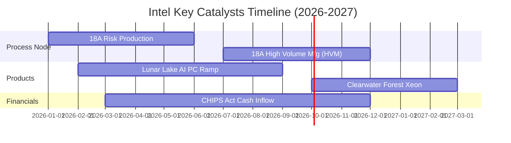

### 8.2 TAM 市場規模分析

Intel 的未來成長主要依賴三大新興市場的滲透：

```
╔══════════════════════════════════════════════════════════════════╗
║              Intel 關鍵新興市場 TAM 與貢獻預估 (2028)            ║
╠══════════════════════════════════════════════════════════════════╣
║                                                                  ║
║  AI PC 晶片市場：                                                ║
║  ├── 全球 TAM (2028)： $35.0B                                    ║
║  ├── Intel 預期市佔率： 65%                                      ║
║  └── 預估營收貢獻：    $22.7B (滲透率：80%)                      ║
║                                                                  ║
║  先進封裝 (CoWoS等) 市場：                                       ║
║  ├── 全球 TAM (2028)： $15.0B                                    ║
║  ├── Intel 預期市佔率： 15%                                      ║
║  └── 預估營收貢獻：    $2.25B                                    ║
║                                                                  ║
║  外部先進代工 (5nm以下)：                                        ║
║  ├── 全球 TAM (2028)： $80.0B                                    ║
║  ├── Intel 預期市佔率： 8%                                       ║
║  └── 預估營收貢獻：    $6.4B                                     ║
╚══════════════════════════════════════════════════════════════════╝
```

### 8.3 成長驅動力結構圖

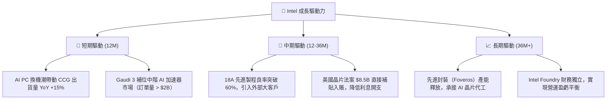

---

## 9. 風險矩陣

### 9.1 風險評分矩陣

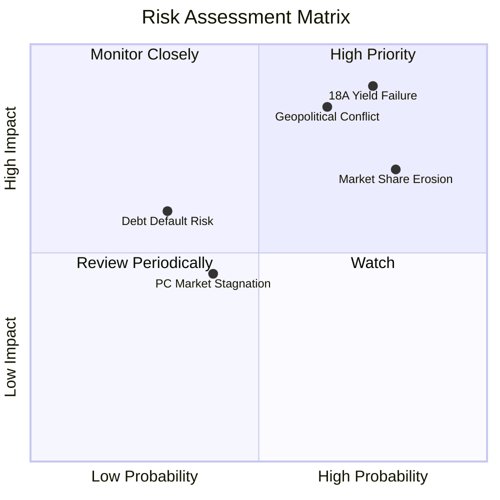

### 9.2 風險清單詳細分析

| # | 風險項目 | 發生機率 | 財務衝擊 | 風險評分 | 緩解措施 |
|---|----------|----------|----------|----------|----------|
| 1 | 🔴 **18A 製程良率低下** | 高 (65%) | 極高 (-$15B 營收) | 🔴 **8.5 / 10** | 與 ASML 緊密合作，優化 High-NA EUV 光學系統；預備 18A 的優化版本 18Ap 節點。 |
| 2 | 🔴 **地緣政治與供應鏈中斷** | 中 (50%) | 極高 (工廠停工) | 🔴 **7.5 / 10** | 全球化佈局，分散建廠於美國俄勒岡、亞利桑那、愛爾蘭及德國，降低單一地區風險。 |
| 3 | 🟡 **伺服器市佔率持續流失** | 高 (75%) | 中 (-$3B 營收) | 🟡 **6.8 / 10** | 加速 Sierra Forest 與 Granite Rapids 雙軌架構量產，以高能效比應對 AMD 競爭。 |
| 4 | 🟡 **資金鏈斷裂與信用評級下調**| 低 (25%) | 高 (利息暴增) | 🟡 **5.5 / 10** | 引入基礎設施基金（如 Brookfield, Apollo）進行項目級股權融資，避免直接稀釋母公司。 |

---

## 10. 投資建議

### 10.1 最終綜合評級雷達圖

```
╔══════════════════════════════════════════════════════════════╗
║               INTC 最終綜合評級雷達圖 (1-10分)               ║
╠══════════════════════════════════════════════════════════════╣
║ 基本面強度  5.0 ▓▓▓▓▓▓▓▓▓▓░░░░░░░░░░  ★★★☆☆           ║
║ 成長動能    6.0 ▓▓▓▓▓▓▓▓▓▓▓▓░░░░░░░░  ★★★☆☆           ║
║ 獲利品質    4.0 ▓▓▓▓▓▓▓▓░░░░░░░░░░░░  ★★☆☆☆           ║
║ 財務健康    5.5 ▓▓▓▓▓▓▓▓▓▓▓░░░░░░░░░  ★★★☆☆           ║
║ 估值合理性  4.5 ▓▓▓▓▓▓▓▓▓░░░░░░░░░░░  ★★☆☆☆           ║
╠══════════════════════════════════════════════════════════════╣
║ 綜合總分    5.7 ▓▓▓▓▓▓▓▓▓▓▓░░░░░░░░░  🟡 建議：持有 (Hold)  ║
╚══════════════════════════════════════════════════════════════╝
```

### 10.2 目標價與隱含報酬率

| 情境 | 目標價 | 隱含報酬率 | 機率權重 | 權重後預期價值 |
|------|--------|------------|----------|----------------|
| 🔴 **悲觀情境** | $55.00 | -42.1% | 25% | $13.75 |
| 🟡 **基準情境** | **$115.00** | **+21.0%** | **55%** | **$63.25** |
| 🟢 **樂觀情境** | $160.00 | +68.4% | 20% | $32.00 |
| **加權綜合目標價** | **$109.00** | **+14.7%** | **100%** | **當前評級：持有** |

### 10.3 買入時機與觸發因素

```
╔══════════════════════════════════════════════════════════════════╗
║                  ✅ 買入與交易策略 Checklist                     ║
╠══════════════════════════════════════════════════════════════════╣
║                                                                  ║
║  立即建倉觸發條件（需符合 2 項以上）：                           ║
║  ✅ 18A 節點宣佈首個外部大客戶（如 Nvidia 或 Apple）正式簽約     ║
║  ✅ 季度毛利率回升至 42% 以上，且折舊黑洞未進一步惡化            ║
║  ✅ 股價回落至 $75 - $80 區間（對應基準目標價具備 40%+ 安全邊際） ║
║                                                                  ║
║  加碼觸發條件：                                                  ║
║  ☐ 18A 晶圓大批量產良率宣佈突破 65%                              ║
║  ☐ 單季自由現金流 (FCF) 首度轉正                                 ║
║                                                                  ║
║  減碼 / 停損觸發條件：                                           ║
║  ☐ 18A 節點宣佈延遲至 2027 年量產                                ║
║  ☐ 信用評級被標普下調至 BBB 級或以下，導致融資成本飆升           ║
╚══════════════════════════════════════════════════════════════════╝
```

### 10.4 投資人適配度分析

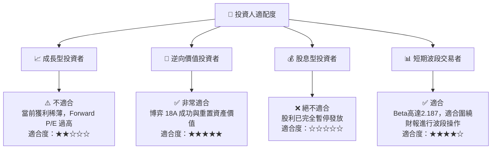

### 10.5 每季財報監控清單（Quarterly Watch List）

為了持續追蹤 Intel 的轉型進展，投資人應在每季財報中嚴格監控以下指標，並與特定門檻值進行比對：

1.  **Intel Foundry 外部營收與利潤率**：
    *   *監控意義*：衡量代工業務是否具備獨立生存能力。
    *   *加碼門檻*：單季外部代工營收 > $1.0B，且 Foundry 營業利益率優於 -25%。
    *   *減碼門檻*：Foundry 單季虧損持續擴大至 -$2.5B 以上。
2.  **DCAI 營業利潤率**：
    *   *監控意義*：反映 Xeon 處理器面對 AMD EPYC 的定價能力。
    *   *加碼門檻*：DCAI 營業利潤率回升至 15% 以上。
    *   *減碼門檻*：DCAI 營業利潤率跌破 0%（出現營運虧損）。
3.  **資本支出 (Capex) 執行率與政府補貼到賬進度**：
    *   *監控意義*：評估現金流失血速度是否失控。
    *   *加碼門檻*：獲得《晶片法案》實質撥付款 > $2.0B/季。
    *   *減碼門檻*：單季 Capex 再次突破 $6.0B，且無外部資金注入。

### 10.6 反面論證：什麼會證明本報告的「持有」評級是錯誤的？

#### 什麼情況下「持有」顯得過於保守（應改為「強力買入」）？
*   **18A 良率超預期**：Intel 在 2026 年底前宣佈 18A 製程良率達到 70%，且台積電 2 奈米製程出現嚴重延誤。這將導致全球無晶圓廠（Fabless）巨頭集體將訂單轉向 Intel，其代工部門估值將暴增，推動股價突破 $160.00。
*   **AI PC 爆發式成長**：微軟與 OEM 夥伴強推的 Copilot+ PC 滲透率遠超市場預期，Intel Lunar Lake 晶片供不應求，推動 CCG 營業利潤率在兩季內飆升至 35% 以上，公司 FCF 提前兩年轉正。

#### 什麼情況下「持有」顯得過於樂觀（應改為「賣出」）？
*   **18A 遭遇災難性延誤**： RibbonFET 或 PowerVia 技術在量產時出現可靠性問題，迫使 18A 節點推遲至 2027 年底。這將徹底粉碎客戶對 Intel Foundry 的信心，導致前期高達 $100B+ 的建廠投資淪為無法收回的「沉沒成本」。
*   **債務危機爆發**：由於 FCF 持續為負，且信用評級被調降，Intel 債務利息支出佔經營現金流比例突破 50%，被迫進行高比例股權融資以償還債務，導致現有股東權益被嚴重稀釋。

---

> **免責聲明**：本報告由 AI 分析師根據 2026-07-18 之即時公開財務數據與市場共識撰寫。報告內容僅供基本面學術研究與模擬投資組合參考，不構成任何實質性的買賣邀約或投資建議。半導體板塊波動巨大，且 Intel 處於重組轉型期，投資風險極高，入市需謹慎。