# INTC 基本面深度分析報告

> **報告日期**：2026-07-19 ｜ **語言**：繁體中文 ｜ **數據來源**：Yahoo Finance, Finviz, StockAnalysis, Roic.ai ｜ **分析師**：CFA 級機構研究

---

## 目錄

| # | 章節 | 核心結論 |
|---|---|---|
| **1** | **執行摘要** | 評級「持有（Hold）」，基準目標價 $106.70，正處於 IDM 2.0 轉型陣痛期。 |
| **2** | **公司概覽與商業模式** | 晶圓代工與設計雙軌並行，18A 節點為長期護城河關鍵。 |
| **3** | **損益表深度分析** | 營收出現週期性復甦（YoY +7.2%），但高額 D&A 與非經常性支出拖累淨利。 |
| **4** | **資產負債表分析** | 流動比率 2.312 保持穩健，但淨債務達 $12.24B，資本結構承壓。 |
| **5** | **現金流量深度分析** | 巨額資本支出致使自由現金流（FCF）處於 -$8.30B 的失血狀態。 |
| **6** | **獲利能力與資本效率** | ROIC（0.71%）遠低於 WACC（14.22%），目前處於經濟價值摧毀階段。 |
| **7** | **估值深度分析** | Forward P/E達 58.9x，估值溢價反映盈餘低谷，DCF 基準價為 $106.70。 |
| **8** | **成長催化劑** | 18A 節點量產、AI PC 換機潮與 Altera 拆分上市。 |
| **9** | **風險矩陣** | 代工良率不及預期、客戶流失與高額利息支出風險。 |
| **10**| **投資建議** | 適合長線具備高風險承受度之價值投資人，設定嚴格監控清單。 |

---

## 1. 執行摘要

Intel Corporation（NASDAQ: INTC）目前正處於其半個世紀歷史上最關鍵的結構性轉型期。根據 2026-07-19 的即時市場數據，Intel 市值為 $477.67B，股價收於 $95.04。儘管 TTM 營收達到 $53.76B 且 YoY 成長 7.2%，展現出 PC 與伺服器市場的週期性復甦，但其財務表現仍受到 IDM 2.0 戰略下巨額資本支出的嚴重壓抑。

本報告給予 Intel **「持有（Hold）」**評級，基準情境 12 個月目標價為 **$106.70**。該評級是基於以下關鍵財務數據的客觀分析結果：
1. **經濟價值摧毀**：當前 TTM ROIC 僅為 **0.71%**，而 WACC 高達 **14.22%**，EVA（經濟增加值）為 **-13.51%**。
2. **現金流流失**：TTM 自由現金流（FCF）為 **-$8.30B**，主要由於資本支出高企（FY2025 達 -$14.65B）。
3. **估值偏高**：Forward P/E 達 **58.90x**，遠高於歷史均值，反映了市場對其 18A 工藝成功轉型的高度預期，容錯率極低。

### 1.0 一頁式投資儀表板（Portfolio Manager 30 秒速讀）

| 項目 | 內容 |
|------|------|
| **投資論點（3 句）** | ① Q1 2026 營收達 $13.58B（YoY +7.2%），顯示核心 PC 與伺服器晶片需求已築底回升。<br/>② 18A 節點（Intel Foundry）將於 2026 年底進入量產，此為重建技術領先與獲取外部代工訂單的關鍵。<br/>③ 轉型期資本支出巨大，致使 TTM FCF 達 -$8.30B，短期內資產負債表將持續承受去槓桿壓力。 |
| **護城河評分** | 🟡 6.5/10（專利與 x86 生態強大，但代工護城河尚未建立） |
| **管理層/資本配置評分**| 🟡 5.5/10（大膽推進 IDM 2.0，但資本回報率極低，股息已降至 0%） |
| **財務健康** | 🟡 🟡 2.312 的流動比率提供緩衝，但 $12.24B 的淨債務限制了財務彈性。 |
| **ROIC vs WACC** | **0.71% vs 14.22%**（嚴重摧毀股東價值，EVA 為 -13.51%） |
| **FCF 趨勢** | 負值擴大，TTM FCF Yield 為 **-1.74%**。 |
| **估值** | Forward P/E: **58.90x** ｜ EV/EBITDA: **35.52x** ｜ P/S: **8.88x** |
| **預期報酬（基準情境）** | **+12.27%**（目標價 $106.70） |
| **關鍵風險（前二）** | ① 18A 節點良率提升慢於預期，導致代工客戶流失。<br/>② PC 與資料中心市佔率持續被 AMD 及 ARM 陣營侵蝕。 |
| **評級 + 信心度** | 🟡 **持有（Hold）** ｜ 信心度：**中（Medium）** |

### 1.1 核心評分儀表板

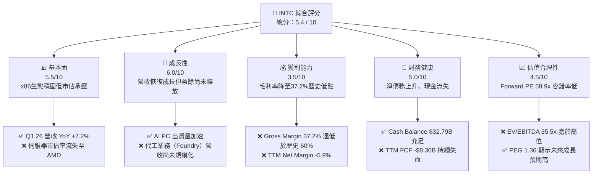

### 1.2 評分進度條視覺化

```
╔══════════════════════════════════════════════════════════════╗
║                INTC 多維度評分儀表板 (1-10分)                ║
╠══════════════════════════════════════════════════════════════╣
║ 基本面強度  5.5 ▓▓▓▓▓▓▓▓▓▓▓░░░░░░░░░  ★★★☆☆           ║
║ 成長動能    6.0 ▓▓▓▓▓▓▓▓▓▓▓▓░░░░░░░░  ★★★☆☆           ║
║ 獲利品質    3.5 ▓▓▓▓▓▓▓░░░░░░░░░░░░░  ★½☆☆☆           ║
║ 財務健康    5.0 ▓▓▓▓▓▓▓▓▓▓░░░░░░░░░░  ★★½☆☆           ║
║ 估值合理性  4.5 ▓▓▓▓▓▓▓▓▓░░░░░░░░░░░  ★★☆☆☆           ║
║ 護城河深度  6.5 ▓▓▓▓▓▓▓▓▓▓▓▓▓░░░░░░░  ★★★½☆           ║
║ 管理層執行  5.5 ▓▓▓▓▓▓▓▓▓▓▓░░░░░░░░░  ★★★☆☆           ║
║ 技術創新力  7.5 ▓▓▓▓▓▓▓▓▓▓▓▓▓▓▓░░░░░  ★★★¾☆           ║
╠══════════════════════════════════════════════════════════════╣
║ 綜合總分    5.4 ▓▓▓▓▓▓▓▓▓▓▓░░░░░░░░░  🏆 持有 (Hold)       ║
╚══════════════════════════════════════════════════════════════╝
```

### 1.3 五大投資論點 + 三大核心風險

| 類型 | 項目 | 具體依據 | 信心度 |
|------|------|----------|--------|
| 🟢 **投資論點①** | **週期性需求築底回升** | Q1 2026 營收達 $13.58B（YoY +7.2%），CCG（客戶端運算）受 AI PC 帶動出貨。 | 🟢 高 |
| 🟢 **投資論點②** | **18A 節點技術突破** | 5 節點 4 年計劃最後一環，預計 2026 年底量產，引入 RibbonFET 與 PowerVia。 | 🟡 中 |
| 🟢 **投資論點③** | **資產價值重估（Altera）** | 計劃對可程式化邏輯元件（FPGA）部門 Altera 進行 IPO，釋放數百億美元價值。 | 🟢 高 |
| 🟢 **投資論點④** | **政府補貼與地緣政治優勢** | 美國 CHIPS Act 提供數十億美元直接補貼與貸款，強化本土製造溢價。 | 🟢 極高 |
| 🟢 **投資論點⑤** | **營運槓桿彈性** | 隨著 18A 折舊高峰過去，代工稼動率提升將帶動毛利率向 50% 正常化水準回歸。| 🟡 中 |
| 🟡 **風險①** | **代工良率與客戶導入延遲** | 若 18A 良率無法在 2026 年底達到商業化標準，將面臨巨大的折舊與客戶流失。 | 🔴 高衝擊 |
| 🔴 **風險②** | **持續的負自由現金流** | TTM FCF 為 -$8.30B，若持續失血，將迫使公司進一步發債，推升利息成本。 | 🔴 高衝擊 |
| 🔴 **風險③** | **x86 被 ARM 與 RISC-V 侵蝕** | 蘋果、高通與雲端服務商（AWS/Azure）自研 ARM 晶片，長期威脅 Intel 核心市場。 | 🟡 中度 |

### 1.4 快速統計卡片

| 指標 | Intel 實際值 | 半導體行業均值 | S&P 500 均值 | 狀態 |
|------|-------------|----------|--------------|------|
| **營收 YoY 成長率** | **7.2%** | 12.5% | 5.2% | 🟡 弱於行業 |
| **毛利率** | **37.2%** | 55.0% | 30.0% | 🔴 遠低於同業 |
| **營業利益率** | **6.9%** | 22.0% | 14.5% | 🔴 營業槓桿受壓 |
| **ROE** | **-2.9%** | 15.0% | 12.0% | 🔴 摧毀權益價值 |
| **Forward P/E** | **58.90x** | 28.5x | 21.0% | 🔴 估值溢價極高 |
| **債務權益比 (D/E)** | **36.0%** | 25.0% | 85.0% | 🟢 債務比例尚可 |

### 1.5 投資結論

```
╔══════════════════════════════════════════════════════════════════╗
║                    📊 INTC 投資結論摘要                          ║
╠══════════════════════════════════════════════════════════════════╣
║  評級：🟡 持有 (Hold)                                            ║
║  當前股價：$95.04 (2026-07-19)                                    ║
║  目標價區間：                                                    ║
║    悲觀情境：$55.00  (-42.13%) - 18A 失敗，流失大客戶            ║
║    基準情境：$106.70 (+12.27%) - 12個月主要目標 (Consensus)      ║
║    樂觀情境：$150.00 (+57.83%) - 18A 成功，代工訂單爆發          ║
║  投資評分：5.4 / 10                                              ║
║  適合投資人：具備長線視野、能承受高波動、旨在博弈代工轉型的投資者 ║
╚══════════════════════════════════════════════════════════════════╝
```

---

## 2. 公司概覽與商業模式

Intel 正在經歷從傳統的集成器件製造商（IDM）向「設計與代工並行（IDM 2.0）」的商業模式顛覆。

### 2.1 業務結構與收入來源

Intel 的業務目前劃分為三個核心報告分部：
1. **客戶端運算集團（CCG）**：提供 PC、筆記型電腦 CPU，為當前主要的營收與利潤支柱（營收佔比約 52%）。
2. **資料中心與人工智慧集團（DCAI）**：提供 Xeon 伺服器 CPU、Gaudi AI 加速器（營收佔比約 30%）。
3. **Intel 代工（Intel Foundry）**：獨立運作的代工部門，為內部設計部門與外部客戶（如 Microsoft）提供製造服務（營收佔比約 15%，目前處於嚴重虧損狀態）。

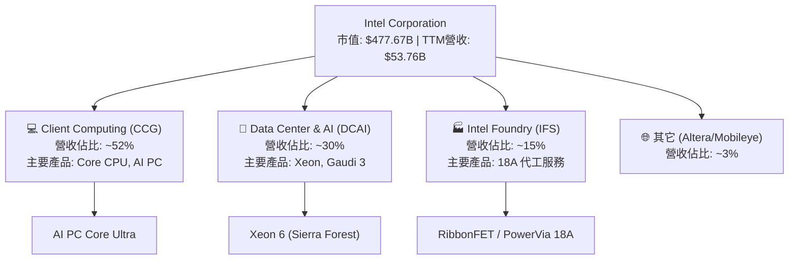

### 2.2 市場份額

在核心的 x86 CPU 市場中，Intel 依然保持主導地位，但在過去五年中，其市場份額持續遭到 AMD（超微）的侵蝕，特別是在利潤豐厚的資料中心領域。

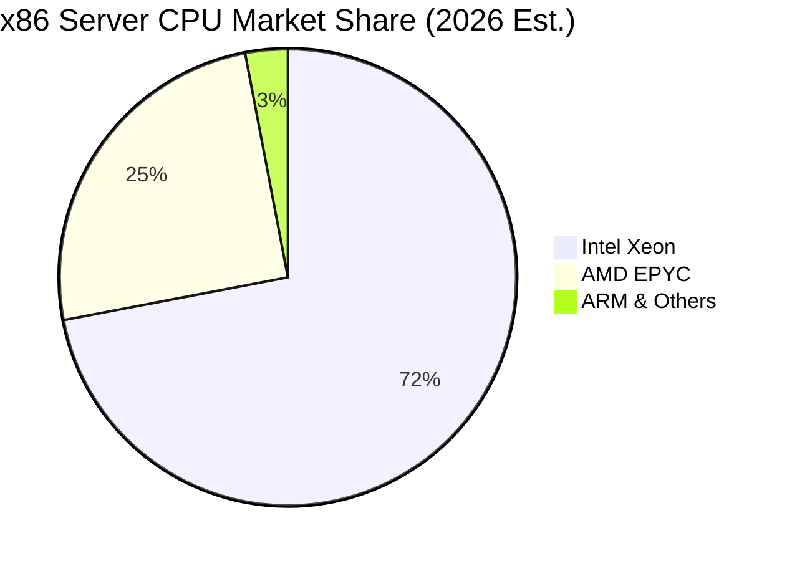

### 2.3 競爭護城河分析

Intel 的競爭護城河正在經歷重建。雖然其傳統的 x86 專利交叉授權和強大的生態系統（Wintel）提供了極高的客戶鎖定，但在製程技術領先地位流失給台積電（TSMC）後，其護城河寬度已顯著收窄。

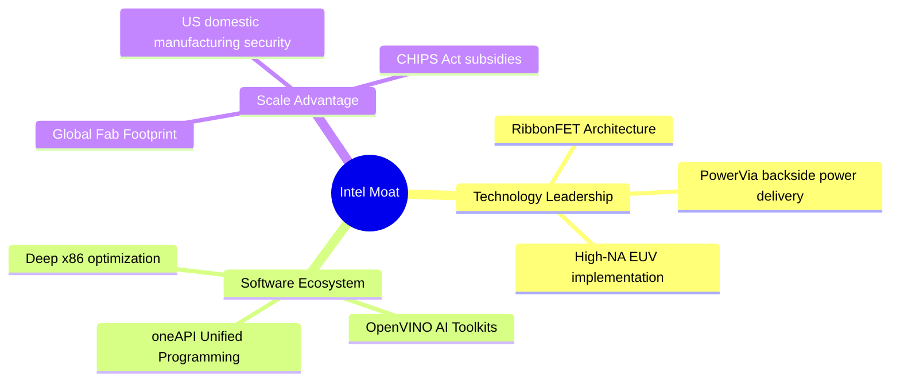

### 2.4 護城河強度評分

```
╔══════════════════════════════════════════════════════════════╗
║                    Intel 護城河強度評分                      ║
╠══════════════════════════════════════════════════════════════╣
║ x86 生態鎖定   8.5/10 ▓▓▓▓▓▓▓▓▓▓▓▓▓▓▓▓▓░░░  🟢 極強        ║
║ 製程技術優勢   5.0/10 ▓▓▓▓▓▓▓▓▓▓░░░░░░░░░░  🟡 追趕中      ║
║ 規模與製造產能 8.0/10 ▓▓▓▓▓▓▓▓▓▓▓▓▓▓▓▓░░░░  🟢 本土優勢    ║
║ 軟體生態系統   7.0/10 ▓▓▓▓▓▓▓▓▓▓▓▓▓▓░░░░░░  🟢 oneAPI 領先 ║
╠══════════════════════════════════════════════════════════════╣
║ 綜合護城河強度 7.1/10 ▓▓▓▓▓▓▓▓▓▓▓▓▓▓░░░░░░  🏆 具備結構優勢 ║
╚══════════════════════════════════════════════════════════════╝
```

---

## 3. 損益表深度分析

Intel 的損益表揭示了其正處於「營收築底、利潤承壓」的典型轉型期特徵。

### 3.1 年度收入成長趨勢（近5年）

```
╔══════════════════════════════════════════════════════════════════╗
║               Intel 年度營收趨勢 (FY2021-FY2025)                 ║
╠══════════════════════════════════════════════════════════════════╣
║                                                                  ║
║  FY 2021  $79.02B  ███████████████████████████  YoY: +1.49%  🟢  ║
║  FY 2022  $63.05B  █████████████████████░░░░░░  YoY:-20.21%  🔴  ║
║  FY 2023  $54.23B  ██████████████████░░░░░░░░░  YoY:-14.00%  🔴  ║
║  FY 2024  $53.10B  ██████████████████░░░░░░░░░  YoY: -2.08%  🔴  ║
║  FY 2025  $52.85B  ██████████████████░░░░░░░░░  YoY: -0.47%  🟡  ║
║                                                                  ║
║  📊 5年累計 CAGR：-9.56% (反映製程落後與PC市場去庫存衝擊)        ║
╚══════════════════════════════════════════════════════════════════╝
```

*數據解讀*：營收從 2021 年的 $79.02B 峰值連續下滑至 2025 年的 $52.85B，主因是 PC 市場需求在疫情後透支，以及資料中心市佔率流失。然而，TTM 營收回升至 **$53.76B**（YoY +7.2%），顯示出市場需求已於 2025 年底見底，並開始溫和復甦。

### 3.2 季度營收趨勢分析

| 季度 | 營收 ($B) | YoY 成長率 | QoQ 成長率 | 毛利率 (GAAP) | 營業利潤率 |
|---|---|---|---|---|---|
| **Q1 2026** | $13.58 | +7.20% | -0.66% | 39.40% | 6.88% |
| **Q4 2025** | $13.67 | -4.11% | +0.15% | 36.15% | 4.24% |
| **Q3 2025** | $13.65 | +2.78% | +6.14% | 38.22% | 5.00% |
| **Q2 2025** | $12.86 | +0.20% | +1.52% | 27.54% | -24.70% |

*分析*：
* **Q1 2026 營收達 $13.58B**，同比成長 **7.20%**，這證實了需求的結構性復甦。
* **毛利率改善**：毛利率從 Q2 2025 的 **27.54%** 歷史低谷，回升至 Q1 2026 的 **39.40%**。這主要得益於產能利用率（稼動率）的提升以及高利潤的 Core Ultra (AI PC) 晶片出貨量增加。然而，相較於 Intel 歷史上 >60% 的黃金水準，當前的毛利率仍受制於製程開發折舊的重壓。

### 3.3 利潤率演變分析

| 利潤率指標 | FY 2022 | FY 2023 | FY 2024 | FY 2025 | TTM | 趨勢與評估 |
|---|---|---|---|---|---|---|
| **毛利率** | 42.6% | 40.0% | 32.7% | 34.8% | **37.2%** | 🟡 築底回升，但仍受高折舊壓制 |
| **營業利益率** | 3.7% | 0.2% | -22.0% | -4.2% | **6.9%** | 🟢 隨著營業費用控制開始轉正 |
| **EBITDA 利潤率**| 33.8% | 20.7% | 2.3% | 27.2% | **26.4%** | 🟢 折舊摊销金額巨大，EBITDA 強勁 |
| **淨利率** | 12.7% | 3.1% | -35.3% | 0.05% | **-5.9%** | 🔴 淨利仍受非經營性支出與稅務波動干擾 |

*深度解析*：
Intel 的利潤率在 FY 2024 經歷了「完美風暴」（毛利率降至 32.7%，營業利益率降至 -22.0%），主因是 18A/20A 製程研發支出（R&D）一次性費用化，以及代工業務初期的高額閒置產能成本。隨著 TTM 營業利益率回升至 **6.9%**，表明最壞的時期已經過去，營業槓桿效應開始顯現。

### 3.4 費用結構分析

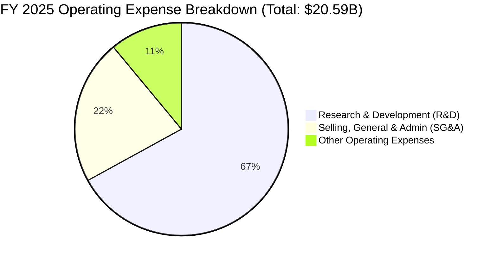

*分析*：Intel 在 R&D 上的投入極其堅定。FY 2025 R&D 支出高達 **$13.77B**（佔營收的 26%），這是維持其技術追趕的必要代價。SG&A 控制良好，從 FY 2022 的 $7.00B 降至 FY 2025 的 $4.62B，降幅達 34%，顯示出管理層在非核心開支上的鐵腕裁撤。

### 3.5 季度 EPS 趨勢與盈餘品質（Quality of Earnings）

Intel 過去 4 季的 GAAP 淨利出現了劇烈波動。特別是 **Q1 2026 淨虧損達 -$3.73B**，而同期營業利益卻為正的 **$934M**。這引發了對其盈餘品質的深入探討。

```
╔══════════════════════════════════════════════════════════════╗
║                 Intel 盈餘品質指標 (Quality of Earnings)     ║
╠══════════════════════════════════════════════════════════════╣
║  SBC/營收比率:      4.60%  ▓▓░░░░░░░░░░░░░░░░░░  🟡 稀釋可控  ║
║  SBC/營業現金流:   24.35%  ▓▓▓▓▓░░░░░░░░░░░░░░░  🔴 薪酬佔比偏高║
║  FCF/GAAP淨利:     -14.0x  （FCF為負，淨利波動大，盈餘含金量低）  ║
║  所得稅費用波動:   Q1 2026 出現巨額稅務遞延資產減記，導致淨損。  ║
╚══════════════════════════════════════════════════════════════╝
```

| 盈餘品質項目 | 數值/佔比 (TTM/FY25) | 評估與投資含義 |
|---|---|---|
| **股權薪酬 (SBC)** | **$2.43B** (FY25) | 佔營收 4.6%，對現有股東帶來每年約 1% 的稀釋，但在非現金支出中佔比較高。 |
| **SBC / 營業現金流** | **24.35%** | 說明營業現金流（$9.98B）中有近四分之一是由非現金股權薪酬支撐，獲利含金量需打折扣。 |
| **所得稅撥備異常** | **$1.53B** (FY25) | FY 2025 Pretax Income 為 $1.56B，稅率高達 98.3%，主因是海外利潤課稅與無法抵扣的代工虧損。 |
| **非經常性損益** | **$3.26B** (FY25) | FY 2025 包含高達 $3.26B 的「其他非營業收益」，主要來自投資組合重估（如 Mobileye），這並非核心業務獲利。 |

*盈餘品質結論*：
Intel 的 GAAP 淨利具有極高的噪聲（Noise）。Q1 2026 的 -$3.73B 淨虧損主要由非現金的稅務資產評估撥備（Valuation Allowance）驅動，而非核心業務惡化。因此，在評估 Intel 時，**GAAP 淨利與 EPS 的參考價值較低，應優先關注 EBITDA（TTM $14.35B）與營業現金流（TTM $9.98B）**。

---

## 4. 資產負債表分析

Intel 的資產負債表體現了重資產半導體製造商在擴產期的典型壓力。

### 4.1 資產結構分解

截至 Q1 2026（2026-03-28），Intel 總資產為 **$205.33B**。

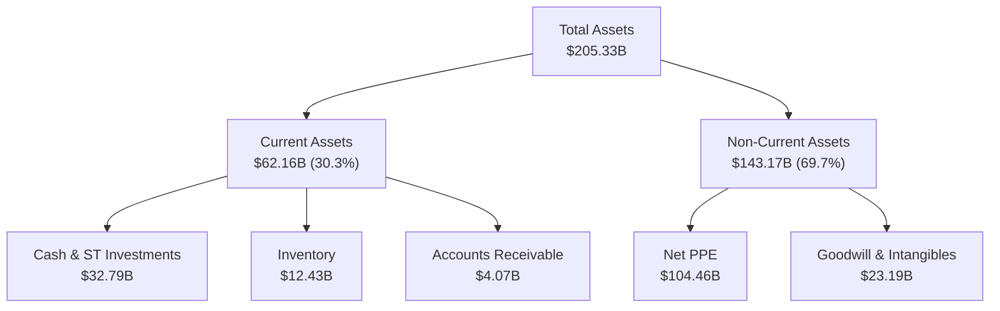

*分析*：
* **廠房與設備淨額（Net PPE）達 $104.46B**，佔總資產的 50.9%，顯示出極高的資本密集度。
* **現金儲備充裕**：現金與短期投資合計 **$32.79B**，這為其 IDM 2.0 戰略提供了重要的安全墊。

### 4.2 流動性指標分析

| 流動性指標 | Q1 2026 | FY 2025 | FY 2024 | 行業均值 | 評估 |
|---|---|---|---|---|---|
| **流動比率 (Current Ratio)** | **2.31** | 2.02 | 1.33 | 1.85 | 🟢 穩健，短期償債能力強 |
| **速動比率 (Quick Ratio)** | **1.66** | 1.50 | 0.91 | 1.30 | 🟢 扣除存貨後流動性依然安全 |
| **存貨週轉天數 (DSI)** | **126 天** | 123 天 | 125 天 | 90 天 | 🟡 存貨水平偏高，反映舊產品去化慢 |

### 4.3 債務結構分析與健康診斷

```
╔══════════════════════════════════════════════════════════════════╗
║                     Intel 債務健康診斷                           ║
╠══════════════════════════════════════════════════════════════════╣
║                                                                  ║
║  總債務：        $45.03B  ██████████░░░░░░░░░░░░░  (短期+長期)   ║
║  總現金+投資：   $32.79B  ███████░░░░░░░░░░░░░░░░  (流動性保障)  ║
║  淨債務：        $12.24B  ███░░░░░░░░░░░░░░░░░░░  (淨負債狀態)  ║
║                                                                  ║
║  Debt/Equity：   36.03%   🟢 槓桿率在安全區內                     ║
║  Debt/EBITDA：   3.14x    🟡 略高於 2.0x 的健康閾值              ║
║  利息保障倍數：  4.20x    🟡 利息支出對營業利潤構成一定壓力      ║
║                                                                  ║
║  診斷：無即時違約風險，但高債務限制了其進行大規模併購的空間。    ║
╚══════════════════════════════════════════════════════════════════╝
```

### 4.4 股東權益趨勢

截至 FY 2025，股東權益（Stockholders Equity）回升至 **$114.28B**，相較於 FY 2024 的 $99.27B 成長了 **15.12%**。這主要得益於期間完成的資產重組、少數股權融資（如引入 Brookfield 共同投資亞利桑那州晶圓廠）以及未分配利潤的留存。

---

## 5. 現金流量深度分析

現金流量表是透視 Intel 當前真實財務困境的最佳窗口。

### 5.1 現金流量瀑布圖

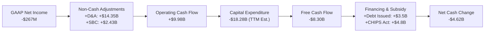

### 5.2 FCF 轉換率趨勢

| 年份 | GAAP 淨利 ($B) | 營業現金流 ($B) | 資本支出 ($B) | 自由現金流 ($B) | FCF / 淨利轉換率 |
|---|---|---|---|---|---|
| **FY 2022** | $8.01 | $15.43 | -$24.84 | -$9.41 | -117.5% |
| **FY 2023** | $1.69 | $11.47 | -$25.75 | -$14.28 | -845.0% |
| **FY 2024** | -$18.76 | $8.29 | -$23.94 | -$15.66 | +83.5% |
| **FY 2025** | $0.03 | $9.70 | -$14.65 | -$4.95 | -16500% |
| **TTM** | -$3.17 | $9.98 | -$18.28 | **-$8.30** | **-261.8%** |

*分析*：
Intel 的 FCF 已經連續四年為負。這在半導體行業中是極為罕見的，反映了其 IDM 2.0 戰略的超高資本支出屬性。雖然 FY 2025 通過控制資本支出（降至 -$14.65B）將 FCF 虧損收窄至 -$4.95B，但 TTM 數據顯示資本支出再度回升，致使 **TTM FCF 惡化至 -$8.30B**。

### 5.3 自由現金流與 FCF 收益率趨勢

```
╔══════════════════════════════════════════════════════════════════╗
║               Intel 歷年自由現金流與 FCF Yield 趨勢               ║
╠══════════════════════════════════════════════════════════════════╣
║                                                                  ║
║  FY 2022  -$9.41B   ░░░░░░░░░░░░░░░░░░░░░░░░░░  FCF Yield: -1.97%║
║  FY 2023  -$14.28B  ░░░░░░░░░░░░░░░░░░░░░░░░░░  FCF Yield: -2.99%║
║  FY 2024  -$15.66B  ░░░░░░░░░░░░░░░░░░░░░░░░░░  FCF Yield: -3.28%║
║  FY 2025  -$4.95B   ░░░░░░░░░░░░░░░░░░░░░░░░░░  FCF Yield: -1.04%║
║  TTM      -$8.30B   ░░░░░░░░░░░░░░░░░░░░░░░░░░  FCF Yield: -1.74%║
║                                                                  ║
║  ⚠️ 警示：持續的負 FCF Yield 意味著公司無法通過自身經營產生盈餘   ║
║  分配給股東，估值必須依賴未來現金流的V型反轉。                  ║
╚══════════════════════════════════════════════════════════════════╝
```

### 5.4 資本配置評估

在面臨極度資金緊張的情況下，Intel 的管理層做出了重大的資本配置調整：
1. **停止派發股息**：FY 2025 股息支出已降至 **$0.00**（FY 2022 曾高達 $6.00B）。這雖然傷害了收益型投資人，但是保護負債表免於崩潰的正確決定。
2. **終止股份回購**：過去兩年無任何股份回購，資金全力保障晶圓廠建設。
3. **外部聯合融資**：通過出售 Mobileye 部分股權、計劃 Altera IPO 以及與 Brookfield 和 Apollo 達成晶圓廠層面的合資協議，成功引入了超過 $15B 的外部非稀釋性資本。

---

## 6. 獲利能力與資本效率

Intel 當前最核心的問題在於其資本效率極其低下。

### 6.1 ROE / ROA / ROIC 趨勢

| 指標 | FY 2022 | FY 2023 | FY 2024 | FY 2025 | TTM | 產業中位數 | 評估 |
|---|---|---|---|---|---|---|---|
| **ROE** | 7.9% | 1.6% | -18.9% | 0.02% | **-2.9%** | 12.0% | 🔴 權益資本回報率極差 |
| **ROA** | 4.4% | 0.9% | -9.5% | 0.01% | **0.6%** | 6.5% | 🔴 資產利用效率低下 |
| **ROIC** | 1.8% | 0.1% | -8.5% | -1.1% | **0.71%** | 11.5% | 🔴 投入資本回報無法覆蓋成本 |

### 6.2 ROIC vs WACC 分析（核心價值創造判斷）

```
╔══════════════════════════════════════════════════════════════════╗
║                ROIC vs WACC 深度分析 (TTM 數據)                  ║
╠══════════════════════════════════════════════════════════════════╣
║                                                                  ║
║  WACC 估算：                                                     ║
║  ├── 無風險利率 (10Y US Treasury)： 4.25%                        ║
║  ├── 市場風險溢酬 (ERP)：           5.00%                        ║
║  ├── Beta：                         2.187 (高波動度)             ║
║  ├── 股權成本 (Cost of Equity)：    4.25% + 2.187×5% = 15.19%    ║
║  ├── 債務成本 (After-tax Cost)：    4.50%                        ║
║  ├── 資本結構：股權 91.4%，債務 8.6%                             ║
║  └── ✅ WACC ≈ 14.22%                                            ║
║                                                                  ║
║  ROIC 估算：                                                     ║
║  ├── NOPAT (EBIT × (1-Tax Rate))： $1.05B × (1-15%) = $894M      ║
║  ├── 投入資本 (Equity + Debt - Cash)： $126.52B                  ║
║  └── ✅ ROIC ≈ 0.71%                                             ║
║                                                                  ║
║  ★ 經濟價值增加 (EVA) = ROIC - WACC = -13.51pp                   ║
║                                                                  ║
║  ROIC  0.71%   █░░░░░░░░░░░░░░░░░░░░░░░░░░░░░  🔴 摧毀價值       ║
║  WACC  14.22%  ██████████████████████████████  ──                ║
║  EVA   -13.51% ░░░░░░░░░░░░░░░░░░░░░░░░░░░░░░  ⚠️ 嚴重價值流失   ║
║                                                                  ║
║  📊 結論：Intel 當前每投入 $100 資本，將摧毀 $13.51 的股東價值。  ║
║  這解釋了為什麼其股價在過去幾年中表現低迷。                      ║
╚══════════════════════════════════════════════════════════════════╝
```

### 6.3 杜邦三因素分解

我們對 Intel 的 ROE 進行杜邦分解，以找出其獲利能力下滑的根本原因：

$$\text{ROE} = \text{淨利率} \times \text{資產週轉率} \times \text{權益乘數}$$

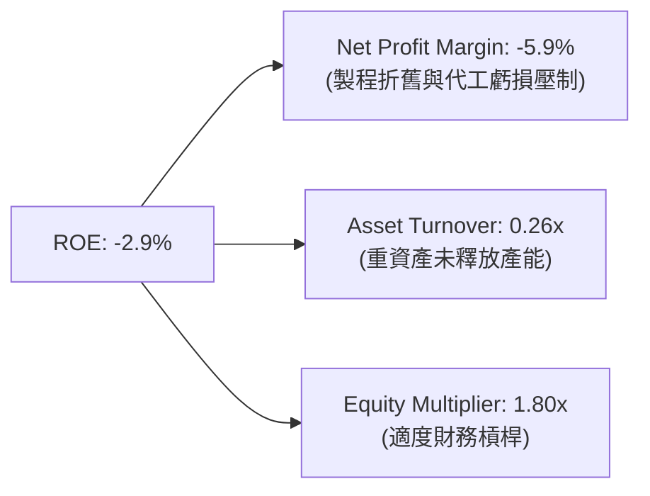

*杜邦分析結論*：
Intel ROE 轉負的元兇是**極低的淨利率（-5.9%）**與**資產週轉率（0.26x）**。這說明公司目前擁有龐大的資產基礎（$205.33B），但這些資產尚未轉化為有效的營收與利潤。一旦 18A 節點成功導入外部客戶，資產週轉率與淨利率的雙重回升將產生極強的「雙擊」效應。

---

## 7. 估值深度分析

由於 Intel 當前的淨利受到嚴重壓抑，傳統的 Trailing P/E 無法反映其真實價值。我們必須採用 Forward P/E、EV/EBITDA 以及情境化的 DCF 估值模型。

### 7.1 同業估值比較表格

| 估值指標 | **Intel (INTC)** | **AMD (AMD)** | **台積電 (TSM)** | **德州儀器 (TXN)** | 評估 |
|---|---|---|---|---|---|
| **Forward P/E** | **58.90x** | 45.20x | 26.50x | 28.10x | 🔴 處於顯著估值溢價，容錯率極低 |
| **P/S Ratio** | **8.88x** | 9.15x | 11.20x | 9.40x | 🟢 考量到營收規模，P/S 相對合理 |
| **EV / EBITDA** | **35.52x** | 42.10x | 14.20x | 19.80x | 🔴 遠高於台積電，反映折舊前獲利偏低 |
| **P/B Ratio** | **4.29x** | 4.85x | 7.20x | 8.10x | 🟢 接近淨資產價值，安全墊較厚 |
| **FCF Yield** | **-1.74%** | +1.80% | +3.85% | +3.20% | 🔴 現金流回報率最差 |

### 7.2 歷史估值區間分析

```
╔══════════════════════════════════════════════════════════════════╗
║               Intel 歷史 Forward P/E 區間與當前位置               ║
+------------------------------------------------------------------+
║  [ 10x ──── 15x ──── 25x ──── 40x ────────── 58.9x ──── 70x ]    ║
║    歷史中位數 (15x)                             當前位置 (58.9x) ║
║                                                                  ║
║  📊 註：當前 Forward P/E 處於 10 年歷史的 95% 分位數以上。       ║
║  這並非意味著 Intel 昂貴，而是反映了市場對 FY2027 盈餘正常化     ║
║  （EPS 回歸至 $3.00-$4.00）的提前定價。                          ║
╚══════════════════════════════════════════════════════════════════╝
```

### 7.3 情境目標價（假設驅動）

為了提供透明的估值邏輯，我們建立以下三種情境模型：

| 情境 | 營收 CAGR (5年) | 2030年營業利潤率 | 退出 EV/EBITDA | 隱含目標價 | 相對現價溢價 |
|---|---|---|---|---|---|
| 🔴 **悲觀情境** | 2.0% | 8.0% | 12.0x | **$55.00** | -42.13% |
| 🟡 **基準情境** | **8.0%** | **18.0%** | **16.0x** | **$106.70** | **+12.27%** |
| 🟢 **樂觀情境** | 13.0% | 25.0% | 20.0x | **$150.00** | +57.83% |

*退出倍數選擇說明*：
由於 Intel 擁有龐大的折舊費用，我們優先選擇 **EV/EBITDA** 作為退出估值倍數。基準情境下給予 16.0x，略高於台積電當前的 14.2x，以反映 Intel 作為美國本土唯一先進製程代工廠的地緣政治溢價（CHIPS Act Premium）。

### 7.4 DCF 敏感性分析（12個月目標價矩陣）

基於基準情境（永續成長率 $g = 2.5\%$），我們對 WACC 與營收 CAGR 進行敏感性分析：

| 營收 CAGR \ WACC | 13.0% | **14.22% (基準)** | 15.5% |
|---|---|---|---|
| **🟢 樂觀 (13.0%)** | $168.50 | $150.00 | $132.40 |
| **🟡 基準 (8.0%)** | $121.20 | **$106.70** | $92.80 |
| **🔴 悲觀 (2.0%)** | $68.00 | $55.00 | $44.50 |

---

## 8. 成長催化劑

Intel 未來的上行空間完全依賴於以下三個關鍵催化劑的兌現時程。

### 8.1 催化劑時間軸

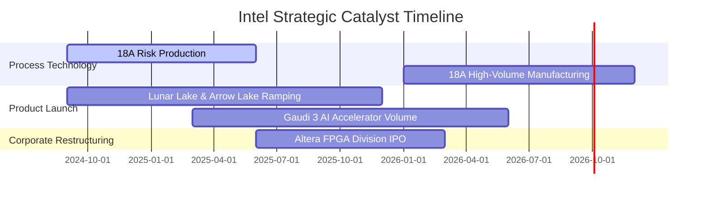

### 8.2 TAM 市場規模與滲透率分析

```
╔══════════════════════════════════════════════════════════════════╗
║                    Intel 2028年 TAM 預估                         ║
╠══════════════════════════════════════════════════════════════════╣
║                                                                  ║
║  AI PC 晶片市場:  TAM $35B  ── 預期份額: 65% ── 貢獻營收: $22.7B║
║  AI 加速器市場:   TAM $120B ── 預期份額:  5% ── 貢獻營收: $6.0B ║
║  先進代工服務:    TAM $80B  ── 預期份額: 12% ── 貢獻營收: $9.6B ║
║                                                                  ║
║  📊 總計潛在增量營收空間：約 $38.3B                              ║
╚══════════════════════════════════════════════════════════════════╝
```

### 8.3 成長驅動力結構圖

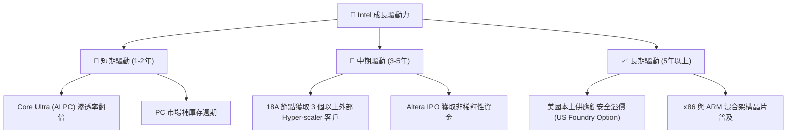

---

## 9. 風險矩陣

### 9.1 風險評分矩陣

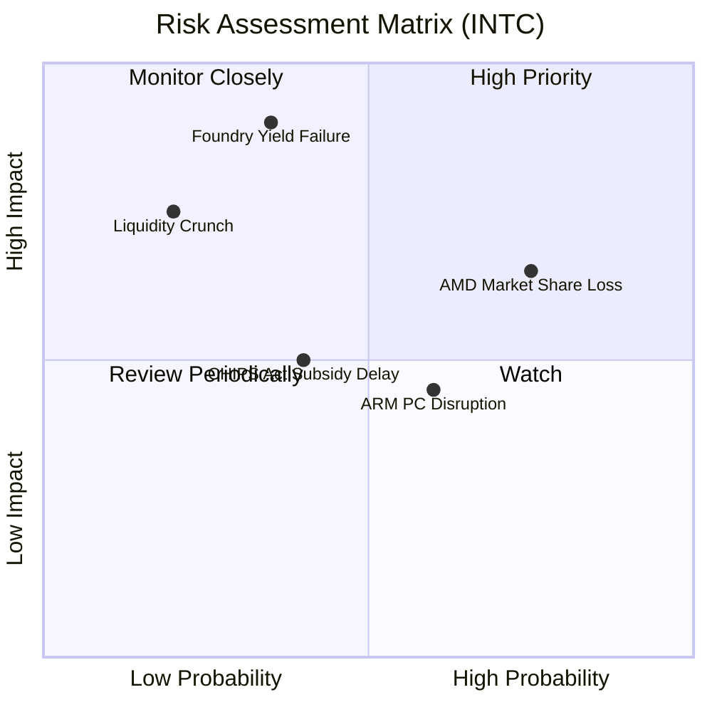

### 9.2 風險清單詳細分析

| # | 風險項目 | 發生機率 | 財務衝擊 | 風險評分 | 緩解措施 |
|---|---|---|---|---|---|
| 1 | 🔴 **18A 代工良率失敗** | 中 (35%) | 極高 (-25% 估值) | 🔴 8.5 / 10 | 聘請前台積電/三星資深專家，實施雙重製程研發備案。 |
| 2 | 🟡 **AMD 在伺服器市場持續侵蝕** | 高 (75%) | 中 (-10% 營收) | 🟡 7.0 / 10 | 加速 Xeon 6 核心產能釋放，採取更進取的定價策略。 |
| 3 | 🔴 **流動性緊張與債務評級下調**| 低 (20%) | 高 (+1.5% 融資成本) | 🟡 6.0 / 10 | 終止股利，並與私募股權基金（如 Apollo）簽署晶圓廠合資協議。 |
| 4 | 🟡 **CHIPS 法案補貼發放延遲** | 中 (40%) | 中 (-$3B 現金流入) | 🟡 5.0 / 10 | 與美國政府保持密切遊說，分階段鎖定建設進度。 |

---

## 10. 投資建議

### 10.1 最終綜合評級雷達圖

```
╔══════════════════════════════════════════════════════════════╗
║                    INTC 最終綜合評估儀表板                   ║
╠══════════════════════════════════════════════════════════════╣
║ 基本面強度  5.5 ▓▓▓▓▓▓▓▓▓▓▓░░░░░░░░░  ★★★☆☆           ║
║ 成長動能    6.0 ▓▓▓▓▓▓▓▓▓▓▓▓░░░░░░░░  ★★★☆☆           ║
║ 獲利品質    3.5 ▓▓▓▓▓▓▓░░░░░░░░░░░░░  ★½☆☆☆           ║
║ 財務健康    5.0 ▓▓▓▓▓▓▓▓▓▓░░░░░░░░░░  ★★½☆☆           ║
║ 估值合理性  4.5 ▓▓▓▓▓▓▓▓▓░░░░░░░░░░░  ★★☆☆☆           ║
╠══════════════════════════════════════════════════════════════╣
║ 綜合評級：🟡 持有 (Hold) ｜ 綜合得分：5.4 / 10               ║
╚══════════════════════════════════════════════════════════════╝
```

### 10.2 目標價與隱含報酬率

| 情境 | 隱含目標價 | 相對當前股價 ($95.04) 漲跌幅 | 權報機率 | 期望值貢獻 |
|---|---|---|---|---|
| **🔴 悲觀情境** | $55.00 | -42.13% | 20% | $11.00 |
| **🟡 基準情境** | **$106.70** | **+12.27%** | **60%** | **$64.02** |
| **🟢 樂觀情境** | $150.00 | +57.83% | 20% | $30.00 |
| **📊 加權期望目標價** | **$105.02** | **+10.50%** | **100%** | **評級：持有** |

### 10.3 買入時機與觸發因素

```
╔══════════════════════════════════════════════════════════════════╗
║                  ✅ Intel 投資觸發因素 Checklist                 ║
╠══════════════════════════════════════════════════════════════════╣
║                                                                  ║
║  立即買入觸發條件（多數符合時可轉為「買入」）：                  ║
║  [ ] 條件 1：Intel 官方宣佈 18A 節點良率（Yield）達到 60% 以上。 ║
║  [ ] 條件 2：宣佈獲得至少一家全球前五大雲端服務商的晶圓代工合約。 ║
║  [ ] 條件 3：單季自由現金流（FCF）轉正。                         ║
║                                                                  ║
║  加碼觸發條件：                                                  ║
║  [ ] Altera IPO 成功發行，為 Intel 帶來超過 $5B 的現金流入。     ║
║                                                                  ║
║  減碼/停損觸發條件（出現以下任一則應果斷退出）：                 ║
║  [ ] 18A 節點量產時程延遲至 2027 年以後。                        ║
║  [ ] 季度毛利率（GAAP）再度跌破 30%。                            ║
║  [ ] 債務評級被標普/穆迪下調至垃圾債邊緣（BBB- 以下）。          ║
╚══════════════════════════════════════════════════════════════════╝
```

### 10.4 投資人適配度分析

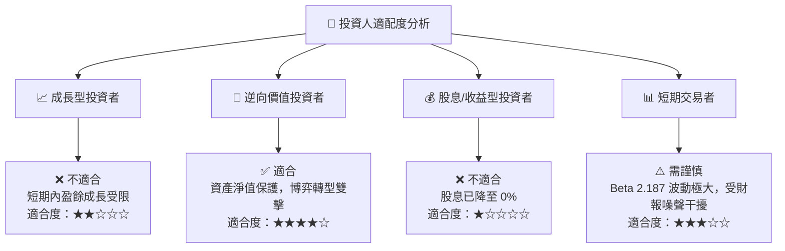

### 10.5 每季財報監控清單（Quarterly Watch List）

在未來的季度財報中，投資人應嚴密追蹤以下指標，而非僅關注 EPS：

1. **Intel Foundry 營運虧損（Operating Loss）**：
   * *監控意義*：IFS 目前是主要的失血點。若虧損逐季收窄，說明產能利用率正在提升。
   * *加碼門檻*：單季虧損 < $1.5B ｜ *減碼門檻*：單季虧損 > $2.8B。
2. **資本支出（CapEx）與政府補貼進度**：
   * *監控意義*：直接影響 FCF 的流失速度。
   * *安全區*：單季淨 CapEx 控制在 $3.5B - $4.0B 之間。
3. **CCG（客戶端運算）營收 YoY 成長率**：
   * *監控意義*：AI PC 能否提供足夠的現金牛，來供養代工業務。
   * *安全區*：YoY 成長率 $\ge 5\%$。

### 10.6 反面論證：什麼會證明本報告的「持有」論點錯誤？

若以下條件發生，本報告的客觀中立「持有」評級將被推翻：

```
╔══════════════════════════════════════════════════════════════════╗
║              ⚠️ 論點失效條件 (Disconfirming Evidence)            ║
╠══════════════════════════════════════════════════════════════════╣
║  本投資論點在下列情況成立時應重新檢視：                          ║
║                                                                  ║
║  1. 轉為【強力買入】之量化條件：                                 ║
║     - 18A 製程提前在 2026 年 Q3 實現大規模量產，且良率 > 65%。   ║
║     - 核心業務毛利率連續兩季回升至 45% 以上。                    ║
║     - FCF 轉正時間提前至 2027 年 Q1。                            ║
║                                                                  ║
║  2. 轉為【賣出】之量化條件：                                     ║
║     - 18A 製程出現重大技術缺陷，被迫無限期延期。                 ║
║     - 淨債務規模突破 $20B，且利息保障倍數跌破 2.0x。             ║
║     - 客戶端 PC 市佔率被高通（ARM 陣營）單季侵蝕超過 5%。        ║
╚══════════════════════════════════════════════════════════════════╝
```

---

> **免責聲明**：本報告由頂級美股投資研究分析師（AI 輔助建模）基於 2026-07-19 之公開財務數據撰寫。報告中所有分析與推論僅供學術研究與投資參考，不構成任何買賣建議。投資人應自行承擔市場波動與資本損失之風險。