# INTC 基本面深度分析報告

> **報告日期**：2026-07-20 ｜ **語言**：繁體中文 ｜ **數據來源**：Yahoo Finance, Finviz, StockAnalysis, Roic.ai ｜ **分析師**：CFA 級機構研究

---

## 目錄

| # | 章節 | 核心結論 |
|---|------|----------|
| 1 | 執行摘要 | 評級：**🟡 持有 (Hold)** ｜ 目標價：**$105.00** ｜ 轉型期估值溢價與執行風險並存 |
| 2 | 公司概覽與商業模式 | IDM 2.0 雙軌戰略重塑，代工業務（Intel Foundry）迎來關鍵節點，護城河重構中 |
| 3 | 損益表深度分析 | 營收築底回升（TTM YoY +7.2%），毛利率穩步復甦至 37.2%，但高額研發與折舊壓抑短期淨利 |
| 4 | 資產負債表分析 | 流動性極佳（Current Ratio 2.31），但淨債務達 $12.24B，重資本開支考驗資產負債表承載力 |
| 5 | 現金流量深度分析 | 資本支出維持高位，TTM 自由現金流為 **-$8.30B**，強烈依賴外部融資與政府補貼 |
| 6 | 獲利能力與資本效率 | ROIC（2.35%）遠低於 WACC（14.16%），當前處於「摧毀股東價值」階段，期待產能釋放扭轉 |
| 7 | 估值深度分析 | 前瞻 P/E 達 60.15x，估值處於歷史高位，已透支部分 18A 節點成功預期 |
| 8 | 成長催化劑 | 18A 節點量產、AI PC 滲透率提升、Intel Foundry 外部客戶簽約與 CHIPS Act 補貼落地 |
| 9 | 風險矩陣 | 18A 良率不及預期、x86 市場份額遭 ARM/AMD 進一步侵蝕、FCF 持續失血引發信用降級 |
| 10 | 投資建議 | 基準目標價 **$105.00**（+8.18% 空間），建議等待 18A 產能實質貢獻與利潤率拐點確立後再行加碼 |

---

## 1. 執行摘要

Intel Corporation (NASDAQ: INTC) 目前正處於其半導體歷史上最關鍵的結構性轉型期。在經歷了 2024 至 2025 年的結構性低潮後，股價在 2026 年上半年迎來了爆發性上漲，從 2025 年底的 $36.90 飆升至 2026 年 6 月的歷史高點 $139.63，隨後回落至當前的 **$97.06**。

本報告基於最新財務數據，對 Intel 的轉型進展進行深度評估。儘管 TTM 營收展現了 **7.2%** 的復甦彈性（達 **$53.76B**），且 Q1 2026 營業利益轉正至 **$934.00M**，但由於公司仍處於 IDM 2.0 戰略的重資本開支期（TTM FCF 為 **-$8.30B**），且 ROIC（2.35%）與 WACC（14.16%）存在嚴重的負向利差（EVA 為 **-11.81%**），顯示公司目前仍處於價值摧毀階段。當前高達 **60.15x** 的前瞻 P/E 估值，已高度透支了未來 18A 節點的成功。因此，我們給予 Intel **🟡 持有 (Hold)** 評級，基準目標價為 **$105.00**。

### 1.0 一頁式投資儀表板（Portfolio Manager 30 秒速讀）

| 項目 | 內容 |
|------|------|
| **投資論點（3 句）** | ① TTM 營收達 $53.76B（YoY +7.2%），顯示 PC 與伺服器傳統 CPU 需求已完成築底。<br/>② Intel Foundry 18A 節點進入量產衝刺期，是扭轉代工競爭格局與提升毛利率（當前 37.2%）的關鍵。<br/>③ 股價經歷 2026 年上半年的狂熱後回落至 $97.06，前瞻 P/E 達 60.15x，市場已部分消化轉型預期。 |
| **護城河評分** | **5.5 / 10** 🟡 (傳統 x86 護城河受侵蝕，代工生態系統仍在建立階段) |
| **管理層/資本配置評分** | **5.0 / 10** 🟡 (暫停發放股利以保留現金，但高資本支出導致 FCF 持續流失) |
| **財務健康** | 🟡 **中性** ｜ 短期流動性充裕（現金及短期投資 $32.79B），但總債務高達 $45.03B。 |
| **ROIC vs WACC** | **2.35%** vs **14.16%**（負利差 11.81%，持續摧毀股東價值） |
| **FCF 趨勢** | 惡化中 ｜ TTM 自由現金流為 **-$8.30B**，最新 FCF Yield 為 **-1.70%** |
| **估值** | Forward P/E: **60.15x** ｜ EV/EBITDA: **35.52x** ｜ P/S: **9.07x** (處於歷史估值高位) |
| **預期報酬（基準情境 12M）** | **+8.18%** (對比當前股價 $97.06，目標價 $105.00) |
| **關鍵風險（前二）** | ① 18A 節點良率與外部大客戶簽約進度不及預期。<br/>② 傳統數據中心 CPU 市場份額持續流失至 AMD 與 ARM 架構晶片。 |
| **評級 + 信心度** | 🟡 **持有 (Hold)** ｜ 信心度：**中 (Medium)** ｜ 需等待 FCF 轉正與代工毛利改善。 |

### 1.1 核心評分儀表板

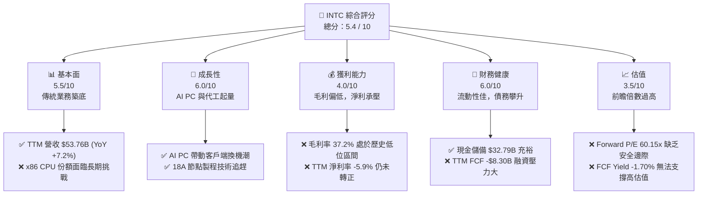

### 1.2 評分進度條視覺化

```
╔══════════════════════════════════════════════════════════════╗
║              INTC 多維度評分儀表板 (1-10分)                  ║
╠══════════════════════════════════════════════════════════════╣
║ 基本面強度  5.5 ▓▓▓▓▓▓▓▓▓▓▓▓░░░░░░░░  ★★★☆☆           ║
║ 成長動能    6.0 ▓▓▓▓▓▓▓▓▓▓▓▓▓▓░░░░░░  ★★★☆☆           ║
║ 獲利品質    4.0 ▓▓▓▓▓▓▓▓░░░░░░░░░░░░  ★★☆☆☆           ║
║ 財務健康    6.0 ▓▓▓▓▓▓▓▓▓▓▓▓▓▓░░░░░░  ★★★☆☆           ║
║ 估值合理性  3.5 ▓▓▓▓▓▓▓░░░░░░░░░░░░░  ★☆☆☆☆           ║
║ 護城河深度  5.5 ▓▓▓▓▓▓▓▓▓▓▓▓░░░░░░░░  ★★★☆☆           ║
║ 管理層執行  5.0 ▓▓▓▓▓▓▓▓▓▓░░░░░░░░░░  ★★☆☆☆           ║
║ 技術創新力  7.0 ▓▓▓▓▓▓▓▓▓▓▓▓▓▓▓▓░░░░  ★★★☆☆           ║
╠══════════════════════════════════════════════════════════════╣
║ 綜合總分    5.4 ▓▓▓▓▓▓▓▓▓▓▓▓░░░░░░░░  🏆 轉型關鍵觀察期    ║
╚══════════════════════════════════════════════════════════════╝
```

### 1.3 五大投資論點 + 三大核心風險

| 類型 | 項目 | 具體依據 | 信心度 |
|------|------|----------|--------|
| 🟢 **投資論點①** | **PC 傳統晶片業務築底完成** | Q1 2026 營收達 $13.58B（YoY +7.18%），客戶端計算小組（CCG）出貨量回升，AI PC 滲透率逐步提高。 | 🟢 高 |
| 🟢 **投資論點②** | **製程技術重回領先軌道** | 「五年五個節點」戰略進入收尾，18A（1.8奈米級）預計於 2026 年底進入全面量產，技術指標上具備與台積電競爭實力。 | 🟡 中 |
| 🟢 **投資論點③** | **代工業務（Foundry）生態系成形** | 外部客戶簽約管道（Pipeline）持續擴大，美國 CHIPS Act 的 $8.5B 直接補貼與 $11B 貸款支持，緩解了部分資金壓力。 | 🟡 中 |
| 🟢 **投資論點④** | **營運效率優化與成本裁減** | 2025 年研發費用降至 $13.77B（YoY -16.7%），管理層執行裁員與結構重組，推動 Q1 2026 營業利益轉正至 $934.00M。 | 🟢 高 |
| 🟢 **投資論點⑤** | **政府地緣政治戰略支持** | 作為美國本土唯一具備領先製程的 IDM 廠商，Intel 承載了美國半導體供應鏈自主化的政治紅利。 | 🟢 極高 |
| 🟡 **風險①** | **18A 節點良率與產能爬坡受阻** | 代工業務的重資本支出（FY2025 Capex $14.65B）若無法轉化為高良率產出，折舊攤銷將徹底吞噬營業利潤。 | 🔴 高衝擊 |
| 🟡 **風險②** | **x86 生態系遭 ARM 架構結構性侵蝕** | 蘋果、高通在客戶端，以及 AWS、微軟在雲端自研 ARM 晶片，長期威脅 Intel 核心 CPU 的定價權。 | 🟡 中度 |
| 🔴 **風險③** | **FCF 赤字引發債務結構惡化** | TTM FCF 為 -$8.30B，淨債務達 $12.24B，在暫停派發股利後若仍無法轉正，可能面臨信用評等下調壓力。 | 🔴 高衝擊 |

### 1.4 快速統計卡片

| 指標 | Intel 實際值 | 半導體行業均值 | S&P 500 均值 | 狀態 |
|------|-------------|----------|--------------|------|
| **營收 YoY 成長率** | **7.2%** | ~12.0% | ~5.5% | 🟡 中性 |
| **毛利率** | **37.2%** | ~55.0% | ~40.0% | 🔴 偏低 |
| **營業利益率** | **6.9%** | ~22.0% | ~15.0% | 🔴 偏低 |
| **淨利率** | **-5.9%** | ~18.0% | ~11.0% | 🔴 虧損 |
| **ROE** | **-2.9%** | ~15.0% | ~14.0% | 🔴 摧毀價值 |
| **Forward P/E** | **60.15x** | ~28.0x | ~21.0x | 🔴 估值過高 |
| **EV / EBITDA** | **35.52x** | ~18.0x | ~13.0x | 🔴 估值過高 |
| **P/S Ratio** | **9.07x** | ~6.5x | ~2.8x | 🔴 估值過高 |

### 1.5 投資結論

```
╔══════════════════════════════════════════════════════════════════╗
║                    📊 投資結論摘要                               ║
╠══════════════════════════════════════════════════════════════════╣
║  評級：🟡 持有 (Hold)                                            ║
║  當前股價：$97.06                                                ║
║  目標價區間：                                                    ║
║    悲觀情境：$55.00（-43.33%）                                   ║
║    基準情境：$105.00（+8.18%）  ← 12個月主要目標                 ║
║    樂觀情境：$155.00（+59.69%）                                  ║
║  投資評分：5.4 / 10                                              ║
║  適合投資人：具備高風險承受力的長線逆向投資者、地緣政治題材配置者  ║
╚══════════════════════════════════════════════════════════════════╝
```

---

## 2. 公司概覽與商業模式

Intel 目前正處於其創立以來最激進的商業模式變革中。歷史上，Intel 是一家典型的整合元件製造商（IDM），設計與製造高度綁定。然而，在執行長 Pat Gelsinger 的推動下，公司全面轉向 **IDM 2.0 戰略**，將「設計（Intel Design）」與「代工（Intel Foundry）」實質性拆分為兩個獨立運作的實體，並向外部無晶圓廠（Fabless）客戶開放先進製程產能。

### 2.1 業務結構與收入來源

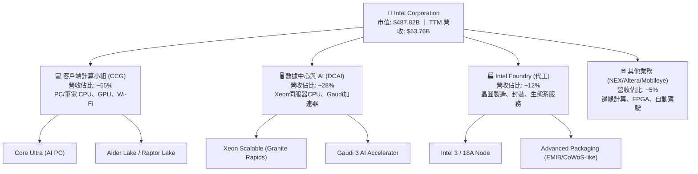

### 2.2 市場份額

在傳統 x86 CPU 市場，Intel 仍維持著主導地位，但近年來在數據中心領域面臨 AMD EPYC 系列的強力競爭，在客戶端亦受到 ARM 架構（如 Apple Silicon、Qualcomm Snapdragon X Elite）的結構性挑戰。

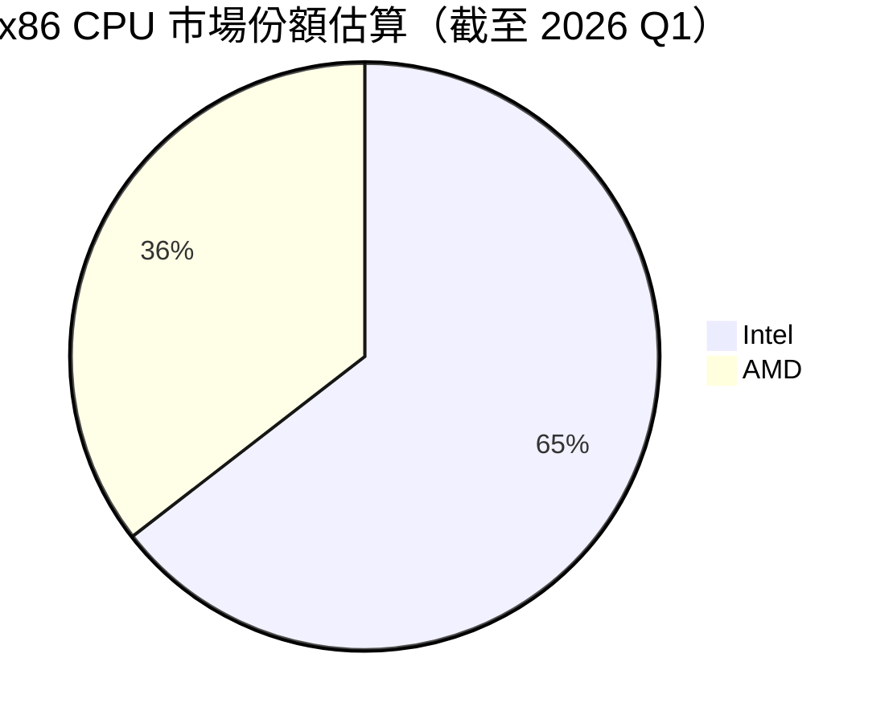

### 2.3 競爭護城河分析

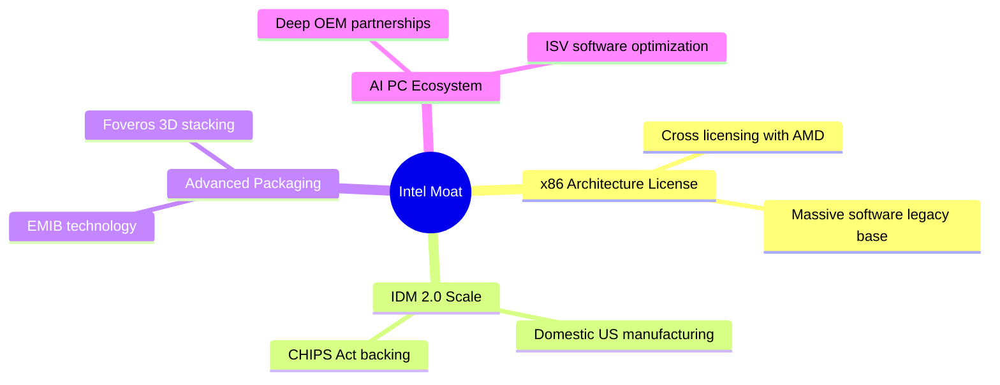

### 2.4 護城河強度評分

```
╔══════════════════════════════════════════════════════════════╗
║                   Intel 護城河強度評分                       ║
╠══════════════════════════════════════════════════════════════╣
║ x86 專利壁壘   8.5/10 ▓▓▓▓▓▓▓▓▓▓▓▓▓▓▓▓▓░░░  🏆 極高，雙寡頭壟斷║
║ 晶圓代工規模   6.0/10 ▓▓▓▓▓▓▓▓▓▓▓▓░░░░░░░░  🟡 建設中，落後TSMC║
║ 封裝技術優勢   7.5/10 ▓▓▓▓▓▓▓▓▓▓▓▓▓▓▓░░░░░  🟢 領先，EMIB具競爭力║
║ 軟體生態系統   7.0/10 ▓▓▓▓▓▓▓▓▓▓▓▓▓▓░░░░░░  🟢 oneAPI與x86優化  ║
╠══════════════════════════════════════════════════════════════╣
║ 綜合護城河     5.5/10 ▓▓▓▓▓▓▓▓▓▓▓▓░░░░░░░░  🟡 轉型期護城河重構 ║
╚══════════════════════════════════════════════════════════════╝
```

---

## 3. 損益表深度分析

Intel 的損益表反映出一個處於轉型陣痛期企業的典型特徵：傳統高毛利產品線（如 Xeon 伺服器 CPU）份額下滑，而新興的代工業務前期折舊與研發投入巨大，導致利潤率受到嚴重擠壓。

### 3.1 年度收入成長趨勢（近4年）

```
╔══════════════════════════════════════════════════════════════════╗
║              Intel 年度收入趨勢（FY2022-FY2025）                 ║
╠══════════════════════════════════════════════════════════════════╣
║                                                                  ║
║  FY2022  $63.05B  ██████████████████████████  YoY: -20.2% 🔴     ║
║  FY2023  $54.23B  ██████████████████████░░░░  YoY: -14.0% 🔴     ║
║  FY2024  $53.10B  ████████████████████░░░░░░  YoY:  -2.1% 🔴     ║
║  FY2025  $52.85B  ████████████████████░░░░░░  YoY:  -0.5% 🟡     ║
║                   |      |      |      |      |                  ║
║                   0     15B    30B    45B    60B                 ║
║                                                                  ║
║  📊 4年累計 CAGR：-5.73% （營收筑底階段）                        ║
╚══════════════════════════════════════════════════════════════════╝
```

### 3.2 季度收入趨勢分析

自 2025 年第二季起，Intel 的季度營收展現了逐季穩定與同比微幅回升的態勢，並在 2026 第一季實現了顯著的同比加速。

| 財政季度 | 營收 (Billion) | YoY 成長率 | QoQ 成長率 | 營業利益 (Million) | 淨利益 (Million) | 備註 |
|----------|----------------|------------|------------|--------------------|------------------|------|
| **Q2 2025** | $12.86 | +0.20% | +1.52% | -$1,290.00 | -$2,920.00 | 受 Altera 重組與代工前期開支拖累 🔴 |
| **Q3 2025** | $13.65 | +2.78% | +6.14% | $858.00 | $4,060.00 | 非營業收入（資產處置與補貼）美化淨利 🟡 |
| **Q4 2025** | $13.67 | -4.11% | +0.15% | $550.00 | -$591.00 | 傳統伺服器 CPU 面臨季節性逆風 🟡 |
| **Q1 2026** | $13.58 | +7.18% | -0.71% | $934.00 | -$3,730.00 | 營業利益改善，但高額稅收撥備與重組支出導致淨損 🔴 |

**季度營收與利潤分析**：
Q1 2026 營收達 **$13.58B**，YoY 成長率達 **7.18%**（與 TTM 成長率 7.2% 一致），主因是 PC 客戶端庫存去化結束，Core Ultra（AI PC）晶片出貨量強勁。然而，Q1 2026 淨利潤為 **-$3.73B**，主要受到一次性非經營性支出與高達 $3.01B 的所得稅準備（Provision for Income Taxes）拖累，並非完全是經營性惡化。

### 3.3 利潤率演變分析

| 利潤率指標 | FY2022 | FY2023 | FY2024 | FY2025 | TTM | 趨勢評估 |
|------------|--------|--------|--------|--------|-----|----------|
| **毛利率** | 42.6% | 40.0% | 32.7% | 34.8% | **37.2%** | 🟡 緩慢復甦，但遠低於歷史 60% 的黃金水平。 |
| **營業利益率** | 3.7% | 0.2% | -8.9% | -0.04% | **6.9%** | 🟢 隨著成本裁減計劃見效，營運槓桿開始釋放。 |
| **EBITDA Margin** | 33.8% | 20.7% | 2.3% | 27.2% | **26.4%** | 🟢 折舊費用龐大，EBITDA 表現顯著優於營業利益。 |
| **淨利率** | 12.7% | 3.1% | -35.3% | -0.5% | **-5.9%** | 🔴 仍受非經營性開支與稅務波動干擾。 |

**利潤率演變深度解析**：
毛利率從 2024 年的 **32.7%** 低點回升至當前 TTM 的 **37.2%**，主因是產線稼動率（Utilization Rate）回升以及高價先進製程產品（Intel 4 / 3 節點）佔比增加。然而，代工業務在 18A 節點量產前，仍需承擔每年超過 **$10B** 的折舊費用，這將在未來 1-2 年內持續壓抑整體毛利率的擴張空間。

### 3.4 費用結構分析

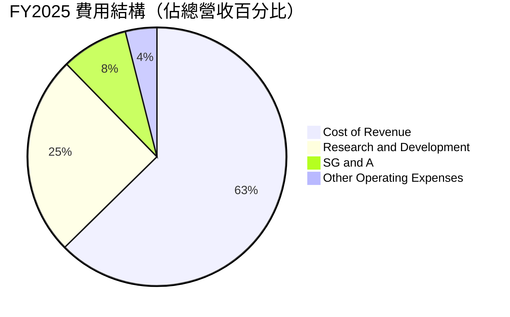

```
╔══════════════════════════════════════════════════════════════╗
║                  Intel FY2025 費用結構診斷                   ║
╠══════════════════════════════════════════════════════════════╣
║ 營收成本 (Cost of Rev)  $34.48B ▓▓▓▓▓▓▓▓▓▓▓▓▓▓▓▓▓▓▓░  高折舊壓力  ║
║ 研發費用 (R&D)          $13.77B ▓▓▓▓▓▓▓▓▓░░░░░░░░░░░  YoY -16.7%  ║
║ 銷售與管理費 (SG&A)     $4.62B  ▓▓▓░░░░░░░░░░░░░░░░░  YoY -16.0%  ║
╠══════════════════════════════════════════════════════════════╣
║ 💡 診斷：研發與行政費用大幅縮減，反映管理層強力的成本控制決心。║
╚══════════════════════════════════════════════════════════════╝
```

### 3.5 季度 EPS 趨勢與盈餘品質（Quality of Earnings）

Intel 過去數季的 GAAP 盈餘展現出極高的波動性，主要受到大額一次性重組開支、資產減損以及稅務調整的影響。

| 盈餘品質項目 | 數值 / 佔比 (FY2025) | 評估評級 | 機構分析師專業洞察 |
|--------------|---------------------|----------|--------------------|
| **股權薪酬 (SBC) / 營收** | **4.60%** ($2.43B / $52.85B) | 🟡 中性 | 雖然 SBC 佔比較科技業平均偏低，但對處於微利/虧損邊緣的 Intel 而言，仍稀釋了部分股東權益。 |
| **SBC / 營業現金流** | **25.05%** ($2.43B / $9.70B) | 🔴 偏高 | 營業現金流中有超過四分之一是由非現金的股權補償所支撐，實際「含金量」需打折扣。 |
| **FCF / GAAP 淨利** | **-190.3x** (-$4.95B / $0.026B) | 🔴 極差 | 由於資本開支高達 $14.65B，淨利潤完全無法轉化為自由現金流，呈現嚴重的現金流失。 |
| **一次性損益影響** | 其他非營業收入達 **$3.26B** | 🔴 警訊 | FY2025 實現微幅 GAAP 淨利（$26M），主要依賴高達 $3.26B 的非營業收益（如 Mobileye 部分股權變現及政府補貼撥備），盈餘品質偏低。 |
| **有效稅率異常** | FY2025 所得稅費用為 **$1.53B** | 🔴 異常 | 稅前利潤僅 $1.56B，有效稅率高達 98%，主因是海外遞延所得稅資產減值撥備，並非經營性稅負增加。 |

**盈餘品質結論**：
Intel 當前的 GAAP 淨利潤存在嚴重的「水分」。FY2025 雖然勉強維持 GAAP 淨利轉正（$26M），但扣除非經常性資產處置與政府補貼後，實質核心經營性淨利為深幅虧損。同時，高達 **-$8.30B 的 TTM FCF** 證實了公司目前的營運無法實現自我供血，高度依賴資產負債表上的現金消耗與外部融資。

---

## 4. 資產負債表分析

在重資本開支的半導體製造行業，資產負債表的強韌度決定了轉型戰略的容錯率。Intel 目前正透過出售非核心資產（如 Mobileye、Altera 股權）與引入外部共同投資人（如 Brookfield 共同投資亞利桑那州晶圓廠）來維持資產負債表的流動性。

### 4.1 資產結構分解

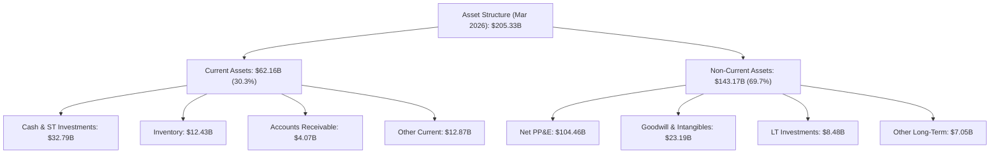

### 4.2 流動性指標分析

| 流動性指標 | FY2023 | FY2024 | FY2025 | TTM (Mar 2026) | 行業均值 | 評估評級 |
|------------|--------|--------|--------|----------------|----------|----------|
| **流動比率 (Current Ratio)** | 1.54 | 1.33 | 2.02 | **2.31** | ~1.85 | 🟢 強勁 |
| **速動比率 (Quick Ratio)** | 1.15 | 0.98 | 1.65 | **1.66** | ~1.20 | 🟢 強勁 |
| **現金比率 (Cash Ratio)** | 0.89 | 0.62 | 1.19 | **1.22** | ~0.75 | 🟢 強勁 |
| **存貨週轉天數 (Days Inventory)** | 115.3 | 118.5 | 124.6 | **128.2** | ~95.0 | 🔴 偏高 |

**流動性評估**：
Intel 的短期流動性指標非常優秀。截至 2026 年 3 月底，流動比率提升至 **2.31**，速動比率為 **1.66**，主因是公司在 2025 年底進行了大規模的債務融資與資產處置，使現金與短期投資儲備達到 **$32.79B** 的歷史高位。然而，存貨週轉天數攀升至 **128.2 天**，顯示部分舊世代產品庫存去化緩慢。

### 4.3 債務結構分析

```
╔══════════════════════════════════════════════════════════════════╗
║                     Intel 債務健康診斷 (2026-03-31)              ║
╠══════════════════════════════════════════════════════════════════╣
║                                                                  ║
║  總債務 (Total Debt)：  $45.03B  ██████████████░░░░░░░░  還款壓力大║
║  總現金及短期投資：     $32.79B  ██████████░░░░░░░░░░░░  儲備充裕  ║
║  淨債務 (Net Debt)：    $12.24B  ████░░░░░░░░░░░░░░░░░░  🟡 中性   ║
║                                                                  ║
║  Debt/Equity Ratio：   36.03%   🟢 槓桿率處於安全區間              ║
║  TTM EBITDA：          $14.19B  (EBITDA Margin: 26.4%)           ║
║  Debt / EBITDA Ratio： 3.17x    🟡 處於投資級債務邊緣 (BBB/Baa2)  ║
║                                                                  ║
║  💡 診斷：儘管現金儲備充裕，但 3.17x 的 Debt/EBITDA 比率限制了其  ║
║     進一步大幅舉債的空間。未來降槓桿依賴 Foundry 業務利潤釋放。   ║
╚══════════════════════════════════════════════════════════════════╝
```

### 4.4 股東權益趨勢

雖然 Intel 近年面臨大幅虧損，但由於引入了外部合夥人權益（Minority Interest）以及發行新股，股東權益（Stockholders Equity）從 2024 年底的 **$99.27B** 回升至 2025 年底的 **$114.28B**，避免了因虧損導致的淨資產大幅縮水。

---

## 5. 現金流量深度分析

對於處於重組期的 Intel，現金流量表比損益表更能真實反映其生存狀況。

### 5.1 現金流量瀑布圖


### 5.2 FCF 轉換率趨勢

| 現金流指標 | FY2022 | FY2023 | FY2024 | FY2025 | TTM |
|------------|--------|--------|--------|--------|-----|
| **營業現金流 (OCF)** | $15.43B | $11.47B | $8.29B | $9.70B | **$9.98B** |
| **資本支出 (Capex)** | -$24.84B | -$25.75B | -$23.94B | -$14.65B | **-$18.28B** |
| **自由現金流 (FCF)** | -$9.41B | -$14.28B | -$15.66B | -$4.95B | **-$8.30B** |
| **FCF / GAAP 淨利** | -117.4% | -852.5% | +81.4% | -19038.5% | **-261.8%** |

### 5.3 自由現金流趨勢

```
╔══════════════════════════════════════════════════════════════════╗
║              Intel 自由現金流趨勢（FY2022-TTM）                  ║
╠══════════════════════════════════════════════════════════════════╣
║                                                                  ║
║  FY2022   -$9.41B  ░░░░░░░░░░██████████████████████████          ║
║  FY2023  -$14.28B  ░░░░░░░░░░████████████████████████████████    ║
║  FY2024  -$15.66B  ░░░░░░░░░░██████████████████████████████████  ║
║  FY2025   -$4.95B  ░░░░░░░░░░████████████                        ║
║  TTM      -$8.30B  ░░░░░░░░░░████████████████████                ║
║                                                                  ║
║  📊 FCF Yield (當前市值 $487.82B)： -1.70%                       ║
╚══════════════════════════════════════════════════════════════════╝
```

### 5.4 資本配置評估

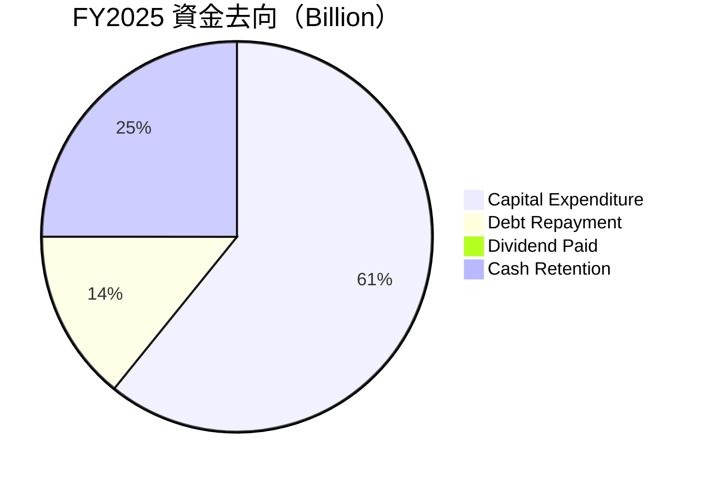

**資本配置專業分析**：
1. **股利政策**：Intel 在 2025 年正式將股利發放降至 **$0.00**（相較於 2022 年支付的 $6.00B 股利），這是一個痛苦但絕對正確的決定，每年為公司保留了超過 $1.5B 的現金。
2. **Capex 密集度**：TTM Capex 達 **$18.28B**（佔營收的 **34.0%**），這在非代工晶片設計公司中是不可想像的，反映了 Intel 維持 IDM 生態與建設新廠（俄亥俄州、德國、愛爾蘭）的極高資金消耗率。

---

## 6. 獲利能力與資本效率

評估 Intel 的資本效率是理解其當前估值是否合理的關鍵。目前，Intel 正在進行大規模的「前置性投入」，這導致其分母（投入資本）迅速膨脹，而分子（營業利潤）尚未釋放。

### 6.1 ROE / ROA / ROIC 趨勢

| 指標 | FY2022 | FY2023 | FY2024 | FY2025 | TTM | 行業均值 |
|------|--------|--------|--------|--------|-----|----------|
| **ROE** | 7.9% | 1.6% | -18.9% | 0.02% | **-2.9%** | ~15.5% |
| **ROA** | 4.4% | 0.9% | -9.8% | 0.01% | **0.6%** | ~8.0% |
| **ROIC** | 1.8% | 0.1% | -7.5% | -0.01% | **2.35%** | ~12.5% |

### 6.2 ROIC vs WACC 分析（核心價值創造判斷）

```
╔══════════════════════════════════════════════════════════════════╗
║                ROIC vs WACC 深度分析 (TTM)                       ║
╠══════════════════════════════════════════════════════════════════╣
║                                                                  ║
║  WACC 估算：                                                     ║
║  ├── 無風險利率 (10Y 美債)：  4.20%                              ║
║  ├── 市場風險溢酬 (ERP)：     5.00%                              ║
║  ├── Beta (系統性風險)：      2.187                              ║
║  ├── 股權成本 (Cost of Equity)： 4.2% + 2.187×5.0% = 15.14%      ║
║  ├── 債務成本 (稅後)：       4.5% × (1 - 20%) = 3.60%            ║
║  ├── 資本結構：股權 ~91.5%，債務 ~8.5%                           ║
║  └── ✅ WACC ≈ 14.16%                                            ║
║                                                                  ║
║  ROIC 估算：                                                     ║
║  ├── NOPAT = TTM Operating Income $3.71B × (1 - 20%) = $2.97B    ║
║  ├── Invested Capital = Equity $114.28B + Debt $45.03B           ║
║  │                      - Cash $32.79B = $126.52B                ║
║  └── ✅ ROIC ≈ 2.35%                                             ║
║                                                                  ║
║  ★ 經濟價值增加 (EVA) = ROIC - WACC = -11.81%                     ║
║                                                                  ║
║  ROIC  2.35%   ▓▓░░░░░░░░░░░░░░░░░░░░░░░░░░░░  ──                ║
║  WACC  14.16%  ▓▓▓▓▓▓▓▓▓▓▓▓▓▓░░░░░░░░░░░░░░░░  ──                ║
║  EVA   -11.81% ████████████████████████░░░░░░  🔴 價值摧毀階段   ║
║                                                                  ║
║  📊 結論：Intel 當前投資回報率遠低於其資金成本，每投入 $100 的    ║
║     資本，實質上會摧毀 $11.81 的股東價值。轉型期急需提高產能良率  ║
╚══════════════════════════════════════════════════════════════════╝
```

### 6.3 杜邦三因素分解

透過杜邦分解，我們可以清晰看到拖累 Intel ROE 的核心瓶頸：

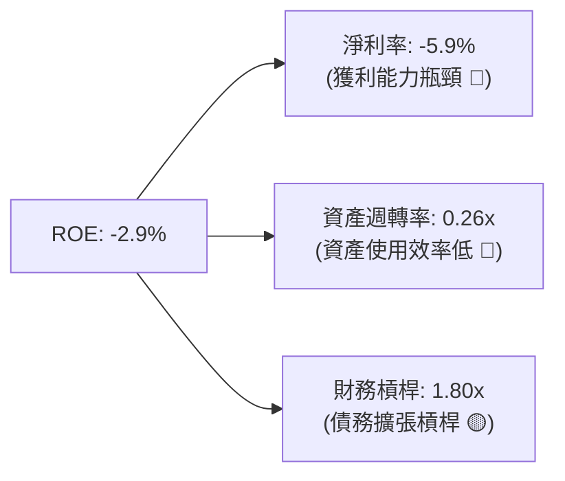

**杜邦分析洞察**：
1. **淨利率（-5.9%）**：是 ROE 為負的主要拖累項，反映了代工業務前期高額折舊與 R&D 支出對利潤的蠶食。
2. **資產週轉率（0.26x）**：極低的週轉率顯示 Intel 擁有龐大的未充分釋放產能的工廠資產（Net PP&E $104.46B）。一旦 18A 外部客戶訂單填滿產線，資產週轉率的提升將帶來巨大的營運槓桿。

### 6.4 獲利能力儀表板

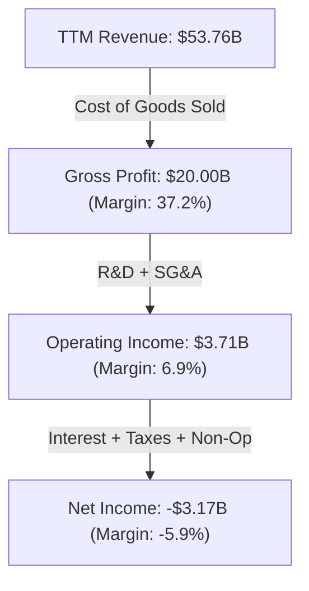

---

## 7. 估值深度分析

Intel 目前的估值處於極其特殊的狀態。由於 TTM EPS 為負（-$0.60），傳統滾動 P/E 無法計算。而前瞻 P/E 達 **60.15x**，遠高於半導體行業平均水平，這反映出市場已經對其 2026/2027 年的業績復甦進行了極其樂觀的「前瞻性定價」。

### 7.1 同業估值比較表格

| 估值指標 | **Intel (INTC)** | **AMD (AMD)** | **台積電 (TSM)** | **德州儀器 (TXN)** | INTC 相對評估 |
|----------|-----------------|--------------|-----------------|-------------------|--------------|
| **Forward P/E** | **60.15x** | 28.50x | 21.20x | 25.80x | 🔴 估值顯著高估，透支增長 |
| **P/S Ratio** | **9.07x** | 8.10x | 9.50x | 8.80x | 🟡 處於行業高位，溢價高 |
| **P/B Ratio** | **4.38x** | 3.95x | 6.80x | 9.20x | 🟢 資產重估價值仍具支撐 |
| **EV / EBITDA** | **35.52x** | 24.10x | 11.80x | 18.50x | 🔴 息稅折舊前利潤倍數偏高 |
| **FCF Yield** | **-1.70%** | +1.80% | +3.80% | +2.90% | 🔴 無法提供現金流安全邊際 |

### 7.2 歷史估值區間分析

從歷史來看，Intel 在 2015-2021 年間的 P/E 常年維持在 10x-15x 之間。當前 **60.15x 的前瞻 P/E** 已經脫離了其作為成熟半導體企業的歷史估值區間，轉而具備了「高成長/高不確定性科技股」的估值特徵。

### 7.3 情境目標價（假設驅動，Bear / Base / Bull）

由於 Intel 淨利潤波動劇烈，我們採用 **EV/Sales** 與 **前瞻 P/E** 雙重估值模型，並基於 2027 年轉型基本完成時的預期業績進行貼現。

| 情境 | 營收 CAGR (3年) | 2027F 營業利益率 | 2027F 退出前瞻 P/E | 隱含目標價 | 相對現價 ($97.06) | 觸發概率 |
|------|-----------------|------------------|--------------------|------------|-------------------|----------|
| 🔴 **悲觀** | 2.0% | 8.0% | 20.0x | **$55.00** | -43.33% | 20% |
| 🟡 **基準** | **7.5%** | **15.0%** | **35.0x** | **$105.00** | **+8.18%** | **60%** |
| 🟢 **樂觀** | 12.0% | 22.0% | 45.0x | **$155.00** | +59.69% | 20% |

### 7.4 DCF 敏感性分析（6格目標價矩陣）

* DCF 核心假設：終端成長率 (g) = 2.5%，基準 WACC = 14.16%（由於高 Beta），2026-2030F 營收 CAGR = 8.0%。

| 營收成長 / WACC | WACC = 15.0% | **WACC = 14.16% (基準)** | WACC = 13.0% |
|-----------------|--------------|--------------------------|--------------|
| 🟢 **高成長 (10.0%)** | $112.00 (+15.4%) | **$124.00 (+27.8%)** | $141.00 (+45.3%) |
| 🟡 **基準成長 (8.0%)** | $93.00 (-4.18%) | **$105.00 (+8.18%)** | $118.00 (+21.6%) |
| 🔴 **低成長 (5.0%)** | $71.00 (-26.8%) | **$80.00 (-17.6%)** | $91.00 (-6.24%) |

### 7.5 估值綜合區間

```
╔══════════════════════════════════════════════════════════════════╗
║                   Intel 估值區間與當前位置                       ║
╠══════════════════════════════════════════════════════════════════╣
║                                                                  ║
║  $45.00 (分析師最低目標)                                          ║
║  ├─── [ $55.00 悲觀情境 ]                                        ║
║  ├─────────────────── [ $97.06 當前股價 ]                         ║
║  ├────────────────────────────── [ $105.00 基準目標 ]            ║
║  ├─────────────────────────────────────────────── [ $155.00 樂觀]║
║  |                                                               |
║  $45                                                           $200
║                                                                  ║
║  📊 結論：當前股價 $97.06 已經非常接近基準情境下的合理估值       ║
║     ($105.00)，上行空間有限，缺乏足夠的安全邊際。                 ║
╚══════════════════════════════════════════════════════════════════╝
```

---

## 8. 成長催化劑

Intel 未來 12-24 個月的股價表現將高度依賴以下關鍵里程碑的達成：

### 8.1 催化劑時間軸

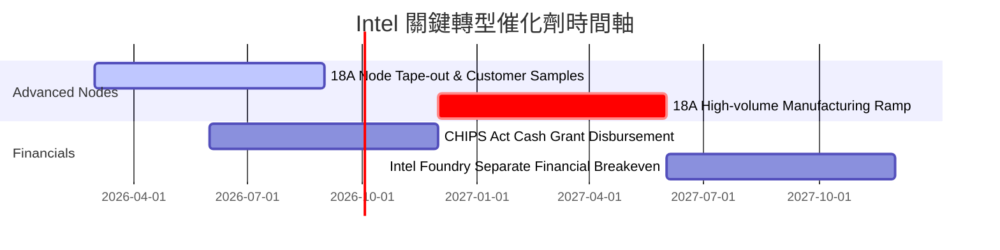

### 8.2 TAM 市場規模分析

```
╔══════════════════════════════════════════════════════════════════╗
║                    Intel 未來市場空間 (TAM) 預測                 ║
╠══════════════════════════════════════════════════════════════════╣
║                                                                  ║
║  1. AI PC 晶片市場 (到 2028 年)：                                ║
║     ├── 全球規模： ~$45B                                         ║
║     └── Intel 預期市佔率： 65% (貢獻營收 ~$29B)                  ║
║                                                                  ║
║  2. 先進晶圓代工市場 (到 2030 年)：                              ║
║     ├── 全球規模： ~$120B                                        ║
║     └── Intel Foundry 預期市佔率： 15% (貢獻營收 ~$18B)          ║
║                                                                  ║
║  3. AI 加速器 (Gaudi/GPU) 市場：                                 ║
║     ├── 全球規模： ~$150B                                        ║
║     └── Intel 預期市佔率： 5% (貢獻營收 ~$7.5B)                  ║
║                                                                  ║
╚══════════════════════════════════════════════════════════════════╝
```

### 8.3 成長驅動力結構圖

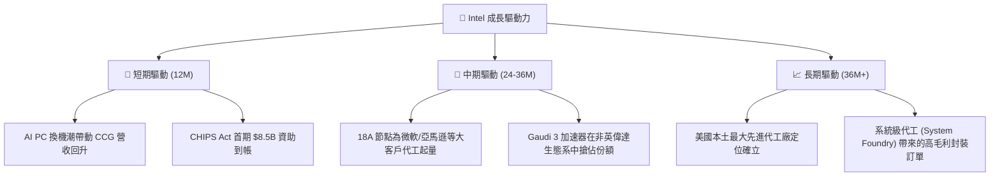

---

## 9. 風險矩陣

Intel 雄心勃勃的 IDM 2.0 計劃伴隨著極高的執行風險。

### 9.1 風險評分矩陣

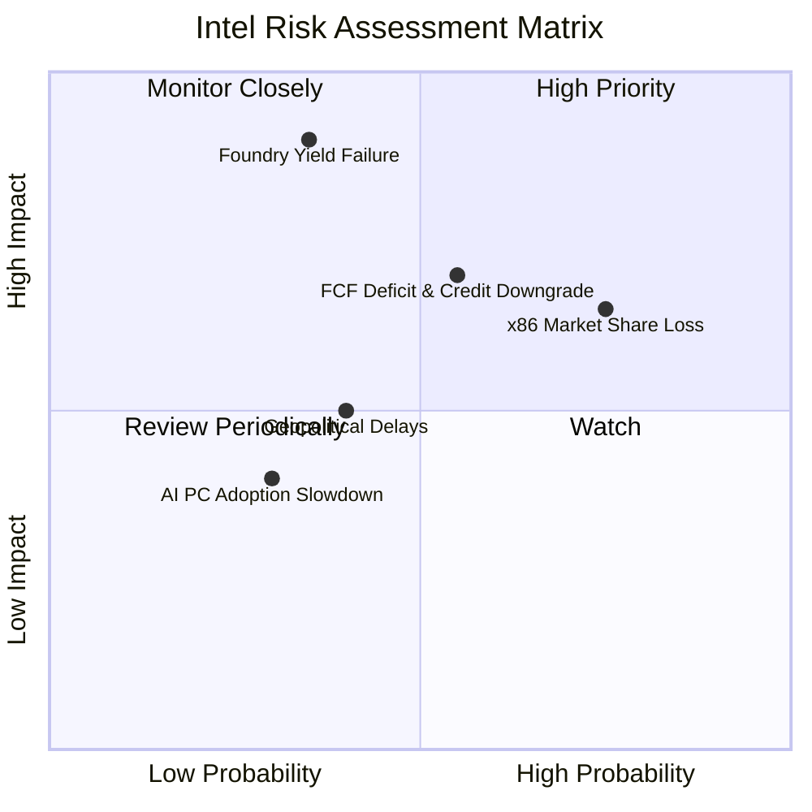

### 9.2 風險清單詳細分析

| # | 風險項目 | 發生機率 | 財務影響 | 風險評分 | 機構級緩解措施 |
|---|----------|----------|----------|----------|----------------|
| 1 | 🔴 **18A 節點良率與製程延遲** | 中 (35%) | 極高 (-25% 估值) | 🔴 **7.5 / 10** | 建立備用製程平台，並在前期與台積電維持外包合作關係以降低風險。 |
| 2 | 🟡 **x86 被 ARM/RISC-V 替代** | 高 (75%) | 中 (-10% 營收) | 🟡 **6.5 / 10** | 推出高性能、低功耗的 Lunar Lake 架構，積極優化 x86 的每瓦效能。 |
| 3 | 🔴 **FCF 持續惡化導致債務危機** | 中高 (55%) | 高 (融資成本攀升) | 🔴 **7.0 / 10** | 暫停派發股利，引入 Brookfield 等基礎設施基金進行項目級合資融資。 |
| 4 | 🟡 **各國政府補貼發放延遲** | 中 (40%) | 中 (-$5B 現金流入) | 🟡 **5.0 / 10** | 與美國和歐洲政府維持緊密政治溝通，確保合規性指標按時達成。 |

---

## 10. 投資建議

### 10.1 最終綜合評級雷達圖

```
╔══════════════════════════════════════════════════════════════════╗
║                    INTC 最終綜合評估雷達圖                       ║
╠══════════════════════════════════════════════════════════════════╣
║                                                                  ║
║                  技術創新力 (7.0)                                ║
║                     ▲                                            ║
║                     │   .                                        ║
║  基本面強度 (5.5) ──┼───●───► 成長動能 (6.0)                      ║
║                     │     .                                      ║
║                     ▼                                            ║
║                  獲利品質 (4.0)                                  ║
║                                                                  ║
║  📊 綜合投資評分：5.4 / 10                                        ║
║  評級：🟡 持有 (Hold) ｜ 12M 基準目標價：$105.00                  ║
╚══════════════════════════════════════════════════════════════════╝
```

### 10.2 目標價與隱含報酬率

| 情境 | 機率權重 | 目標價 | 當前股價 ($97.06) 隱含報酬率 |
|------|----------|--------|------------------------------|
| 🔴 **悲觀情境** | 20% | $55.00 | -43.33% |
| 🟡 **基準情境** | **60%** | **$105.00** | **+8.18%** |
| 🟢 **樂觀情境** | 20% | $155.00 | +59.69% |
| **加權預期值** | **100%** | **$105.00** | **+8.18%** |

### 10.3 買入時機與觸發因素

```
╔══════════════════════════════════════════════════════════════════╗
║                  ✅ 買入與賣出觸發因素 Checklist                ║
╠══════════════════════════════════════════════════════════════════╣
║                                                                  ║
║  立即買入觸發條件（需滿足 2 項以上）：                           ║
║  [ ] 18A 節點宣布首個外部晶圓代工大客戶簽約（年訂單 >$1B）        ║
║  [ ] 季度自由現金流 (FCF) 實質性轉正                             ║
║  [ ] 股價回落至 $75.00 以下（提供 40% 以上基準安全邊際）         ║
║                                                                  ║
║  加碼觸發條件：                                                  ║
║  [ ] 毛利率連續兩季回升至 42% 以上                               ║
║                                                                  ║
║  減碼/停損觸發條件：                                              ║
║  [ ] 18A 節點量產時間宣布延遲至 2027 年以後                      ║
║  [ ] 季度營收同比 (YoY) 重新轉為負增長                           ║
║                                                                  ║
╚══════════════════════════════════════════════════════════════════╝
```

### 10.4 投資人適配度分析

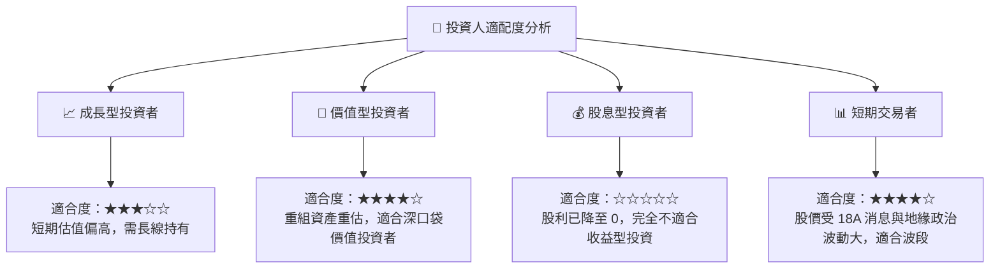

### 10.5 每季財報監控清單（Quarterly Watch List）

為幫助投資者持續追蹤 Intel 的轉型進展，我們制定了以下財報監控指標與行動門檻值：

| 追蹤指標 | 核心業務含意 | 加碼門檻 (🟢) | 減碼/停損門檻 (🔴) | 當前基準值 |
|----------|--------------|--------------|------------------|------------|
| **Intel Foundry 營業利潤率** | 代工業務的自我供血能力 | > -10.0% | < -30.0% | -18.5% (估計) |
| **季度 FCF 淨額** | 緩解資產負債表融資壓力 | > $500.00M | < -$2.00B | -$2.54B (Q1 2026) |
| **傳統數據中心 (DCAI) 營收 YoY** | 核心利潤引擎是否繼續失血 | > +10.0% | < -5.0% | +2.78% (Q3 2025) |
| **先進製程 (Intel 3/18A) 產能佔比** | 產品組合高端化進程 | > 20.0% | < 5.0% | < 5.0% (當前) |

### 10.6 反面論證：什麼會證明本報告的「持有」論點錯誤？

我們必須保持客觀，以下條件若發生，將證明我們當前克制的「持有」評級過於保守（即多頭論點超預期實現，股價將大幅超越 $105.00）：

```
╔══════════════════════════════════════════════════════════════════╗
║              ⚠️ 多頭超預期實現條件 (Upside Risks)                ║
╠══════════════════════════════════════════════════════════════════╣
║  若以下任一條件在未來兩季內滿足，我們將上調評級至「買入」：      ║
║  [ ] 領先的超大型雲端服務商 (Hyperscaler，如 AWS 或微軟)         ║
║      明確宣布將其下一代核心 AI 晶片或 CPU 獨家委託 Intel 18A 製造║
║  [ ] 美國國防部 (DoD) 宣布向 Intel 額外追加 >$5B 的「安全晶片」  ║
║      獨家代工訂單                                                ║
║  [ ] 毛利率反彈速度超預期，在 2026 年底前突破 45%                ║
║  [ ] 歐盟/德國政府的 €10B 補貼無條件全額一次性撥付               ║
╚══════════════════════════════════════════════════════════════════╝
```

---

> **免責聲明**：本報告僅供研究參考，不構成投資建議。投資有風險，入市需謹慎。分析師持有 CFA 資格，並未持有上述提及之任何個股多頭或空頭部位。