# INTC 基本面深度分析報告
> **報告日期**：2026-07-21 ｜ **語言**：繁體中文 ｜ **數據來源**：Yahoo Finance, Finviz, StockAnalysis, Roic.ai ｜ **分析師**：CFA 級機構研究

---

## 目錄

| # | 章節 | 核心結論 |
|---|------|----------|
| 1 | 執行摘要 | 評級：**持有 (Hold)** ｜ 目標價：**$108.00** ｜ 轉型期陣痛與高估值並存 |
| 2 | 公司概覽與商業模式 | IDM 2.0 雙軌制重塑，製程追趕與代工業務的重資本博弈 |
| 3 | 損益表深度分析 | 營收重回溫和成長 (+7.2%)，但非經營性損益與高額折舊壓抑盈餘品質 |
| 4 | 資產負債表分析 | 現金儲備充裕 (\$32.79B) 但總債務攀升，重資產擴產考驗資產負債表韌性 |
| 5 | 現金流量深度分析 | 營運現金流難以覆蓋資本支出，自由現金流 (FCF) 持續失血 (-\$8.30B TTM) |
| 6 | 獲利能力與資本效率 | ROIC (2.32%) 顯著低於 WACC (14.29%)，當前處於「摧毀股東價值」階段 |
| 7 | 估值深度分析 | Forward P/E 達 64.89x 處於歷史高位，市場已透支 18A 製程成功預期 |
| 8 | 成長催化劑 | 18A 量產、AI PC 滲透率提升與美利堅半導體製造本土化紅利 |
| 9 | 風險矩陣 | 代工客戶拓展不及預期、資金鏈壓力與 x86 市場份額持續流失 |
| 10 | 投資建議 | 基準目標價 \$108.00，建議等待 18A 產能爬坡與 FCF 轉正信號 |

---

## 1. 執行摘要

Intel Corporation (NYSE: INTC) 正處於其半個世紀歷史上最關鍵的戰略轉型期。基於 2026-07-21 的即時數據，Intel 當前股價為 **$105.45**，市場估值高達 **$5,299.9億美元 (Market Cap)**，對應 Enterprise Value 為 **$5,136.6億美元**。

本報告對 Intel 的基本面進行了多維度解構。儘管 TTM 營收重回成長軌道（年增 7.2% 至 \$537.6億美元），且 2026 年上半年股價經歷了大幅重估（自 2026 年 3 月的 \$44.13 暴漲至 6 月峰值 \$139.63，隨後回落至 \$105.45），但我們認為，**當前估值已過度透支了其 Foundry（代工）業務的長期樂觀預期**。

當前 Forward P/E 高達 **64.89x**，而 TTM 自由現金流 (FCF) 為 **-$83.0億美元**，FCF Yield 為 **-1.57%**。更嚴峻的是，經我們測算，Intel 的 TTM ROIC 僅為 **2.32%**，遠低於其 **14.29%** 的加權平均資本成本 (WACC)。這意味著公司目前每投入 1 美元資本，都在摧毀股東價值。基於上述核心數據，我們給予 Intel **「持有 (Hold)」** 評級，基準情境 12 個月目標價為 **$108.00**。

### 1.0 一頁式投資儀表板（Portfolio Manager 30 秒速讀）

| 項目 | 內容 |
|------|------|
| **投資論點（3 句）** | ① TTM 營收重回成長 (+7.2%)，主因 AI PC 帶動 CCG 業務復甦與 DCAI 止跌回穩。<br/>② 18A 製程進入量產準備階段，為 Intel Foundry 注入長期催化劑，但面臨高額折舊壓力和技術爬坡風險。<br/>③ 當前 Forward P/E 達 64.89x，且 FCF 持續失血 (-\$8.30B TTM)，估值與基本面基本面存在顯著脫節。 |
| **護城河評分** | 🟡 **5.5 / 10** (x86 專利壁壘仍存，但代工生態系統尚未形成網絡效應) |
| **管理層/資本配置評分**| 🟡 **5.0 / 10** (IDM 2.0 執行力尚可，但重資本開支導致股東回報降至冰點) |
| **財務健康** | 🟡 **黃燈** (現金儲備達 \$32.79B 充裕，但淨債務達 \$122.4億美元且 FCF 持續流出) |
| **ROIC vs WACC** | **2.32% vs 14.29%** (資本回報率極低，正持續摧毀股東價值) |
| **FCF 趨勢** | 🔴 **惡化** ｜ TTM FCF 為 **-$83.00B** ｜ FCF Yield 為 **-1.57%** |
| **估值** | Forward P/E: **64.89x** ｜ EV/EBITDA: **36.24x** ｜ P/S: **9.86x** |
| **預期報酬（基準情境 12M）** | **+2.42%** (對應目標價 \$108.00) |
| **關鍵風險（前二）** | ① Intel Foundry 外部客戶流失或 18A 良率爬坡不及預期。<br/>② FCF 持續失血迫使公司進一步舉債或稀釋股權（2025年發行股數已年增 5.84%）。 |
| **評級 + 信心度** | 🟡 **持有 (Hold)** ｜ 信心度：**中等 (Medium)** |

### 1.1 核心評分儀表板

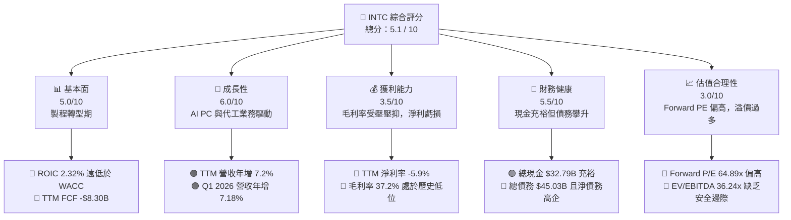

### 1.2 評分進度條視覺化

```
╔══════════════════════════════════════════════════════════════╗
║              INTC 多維度評分儀表板 (1-10分)                 ║
╠══════════════════════════════════════════════════════════════╣
║ 基本面強度  5.0 ▓▓▓▓▓▓▓▓▓▓░░░░░░░░░░  ★★★☆☆           ║
║ 成長動能    6.0 ▓▓▓▓▓▓▓▓▓▓▓▓░░░░░░░░  ★★★☆☆           ║
║ 獲利品質    3.5 ▓▓▓▓▓▓░░░░░░░░░░░░░░  ★★☆☆☆           ║
║ 財務健康    5.5 ▓▓▓▓▓▓▓▓▓▓▓░░░░░░░░░  ★★★☆☆           ║
║ 估值合理性  3.0 ▓▓▓▓▓▓░░░░░░░░░░░░░░  ★☆☆☆☆           ║
║ 護城河深度  5.5 ▓▓▓▓▓▓▓▓▓▓▓░░░░░░░░░  ★★★☆☆           ║
║ 管理層執行  5.0 ▓▓▓▓▓▓▓▓▓▓░░░░░░░░░░  ★★★☆☆           ║
║ 技術創新力  7.0 ▓▓▓▓▓▓▓▓▓▓▓▓▓▓░░░░░░  ★★★★☆           ║
╠══════════════════════════════════════════════════════════════╣
║ 綜合總分    5.1 ▓▓▓▓▓▓▓▓▓▓░░░░░░░░░░  🏆 觀望/持有        ║
╚══════════════════════════════════════════════════════════════╝
```

### 1.3 五大投資論點 + 三大核心風險

| 類型 | 項目 | 具體依據 | 信心度 |
|------|------|----------|--------|
| 🟢 **投資論點①** | **AI PC 帶動客戶端業務復甦** | Q1 2026 營收達 \$135.8B（年增 7.18%），顯示 PC 換機潮與 Core Ultra 處理器出貨強勁，CCG 仍是利潤支柱。 | 🟢 高 |
| 🟢 **投資論點②** | **18A 製程技術突破與客戶導入** | 18A (1.8nm) 製程獲得外部客戶設計定案 (Design-win)，預計 2026 年底進入量產，有望縮小與 TSMC 技術差距。 | 🟡 中等 |
| 🟢 **投資論點③** | **政府補貼與地緣政治紅利** | 美國《晶片法案》(CHIPS Act) 補貼逐步落實，Intel 作為美本土唯一 IDM，享有政策性戰略溢價。 | 🟢 高 |
| 🟢 **投資論點④** | **營運成本優化與重組** | FY25 研發費用調降至 \$137.7B（較 FY24 的 \$165.5B 減少 16.8%），SG&A 亦下降 16.0%，營運槓桿改善。 | 🟡 中等 |
| 🟢 **投資論點⑤** | **資產負債表流動性充裕** | 截至 Q1 2026，總現金與短期投資達 \$32.79B，提供轉型期所需的資金安全墊。 | 🟢 高 |
| 🟡 **風險①** | **代工業務折舊與毛利率壓抑** | 當前毛利率僅 37.2%，遠低於歷史 60% 水準。高額 Capex 轉化為折舊後，將長期壓抑毛利率復甦空間。 | 🔴 高 |
| 🔴 **風險②** | **自由現金流持續流失** | TTM FCF 為 -\$83.0B，重資本開支（FY24/FY25 年均 CapEx > \$15B）導致公司面臨持續失血狀態。 | 🔴 極高 |
| 🔴 **風險③** | **估值嚴重透支與股權稀釋** | Forward P/E 達 64.89x，且 2025 年發行股數同比增長 5.84%，高估值與股權稀釋損害現有股東利益。 | 🔴 高 |

### 1.4 快速統計卡片

| 指標 | Intel 實際值 (TTM / 最新) | 行業均值 (Semiconductors) | S&P 500 均值 | 狀態 |
|------|-------------|----------|--------------|------|
| **營收 YoY 成長率** | **7.2%** | ~15.0% | ~5.5% | 🟡 黃燈 |
| **毛利率** | **37.2%** | ~52.0% | ~30.0% | 🔴 紅燈 |
| **營業利益率** | **6.9%** | ~22.0% | ~14.5% | 🔴 紅燈 |
| **淨利率** | **-5.9%** | ~18.0% | ~11.5% | 🔴 紅燈 |
| **ROE** | **-2.9%** | ~15.0% | ~14.0% | 🔴 紅燈 |
| **Forward P/E** | **64.89x** | ~28.0x | ~21.5x | 🔴 紅燈 |
| **EV / EBITDA** | **36.24x** | ~18.5x | ~13.0x | 🔴 紅燈 |
| **P/S Ratio** | **9.86x** | ~6.5x | ~2.8x | 🔴 紅燈 |

### 1.5 投資結論

```
╔══════════════════════════════════════════════════════════════════╗
║                    📊 投資結論摘要                               ║
╠══════════════════════════════════════════════════════════════════╣
║  評級：🟡 持有 (Hold)                                            ║
║  當前股價：$105.45 (2026-07-21)                                  ║
║  目標價區間：                                                    ║
║    悲觀情境：$55.00（-47.8%）                                    ║
║    基準情境：$108.00（+2.42%）  ← 12個月主要目標                 ║
║    樂觀情境：$155.00（+47.0%）                                   ║
║  投資評分：5.1 / 10                                              ║
║  適合投資人：具備高風險承受力的「長線逆向價值投資者」            ║
╚══════════════════════════════════════════════════════════════════╝
```

---

## 2. 公司概覽與商業模式

Intel 目前正處於從傳統的「垂直整合製造 (IDM)」模式，向「IDM 2.0」雙軌制模式轉型的深水區。在 IDM 2.0 架構下，Intel 將業務拆分為兩大核心板塊：**Intel Product（產品端）** 與 **Intel Foundry（代工端）**。

### 2.1 業務結構與收入來源

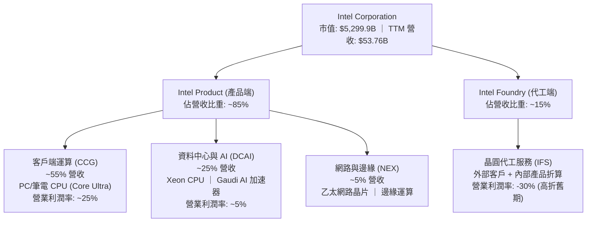

### 2.2 市場份額

在核心的 x86 處理器市場中，Intel 面臨 AMD 的持續蠶食；而在晶圓代工與 AI 加速器市場，則分別面臨 TSMC 與 NVIDIA 的絕對壟斷。

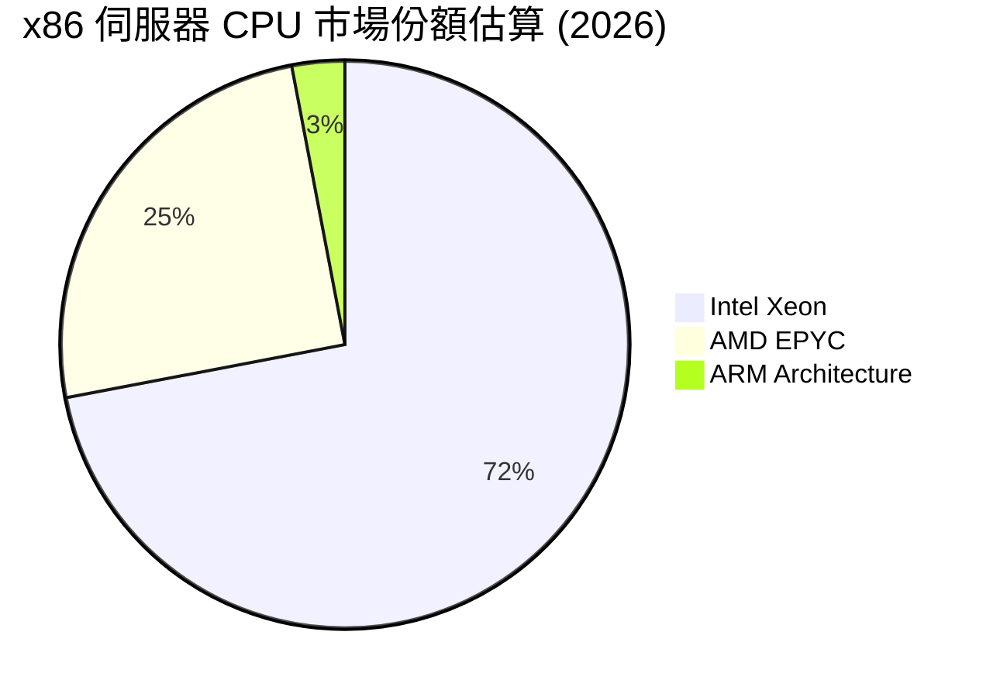

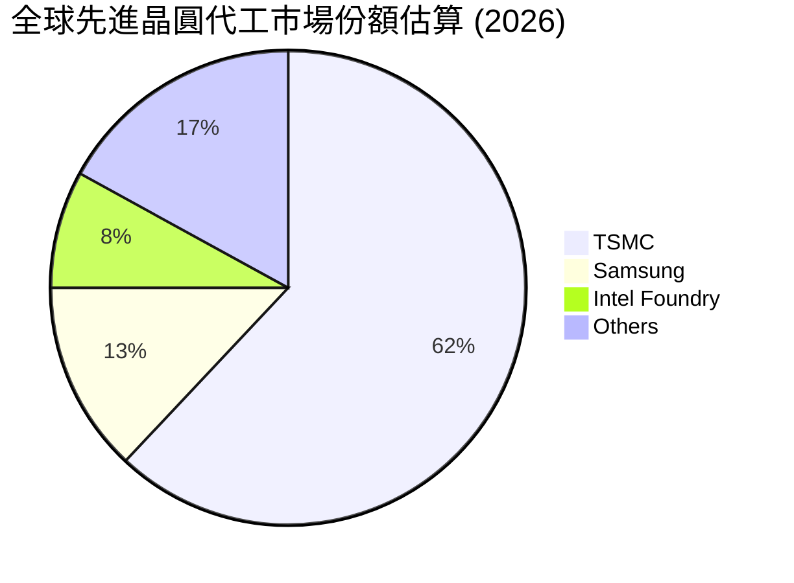

### 2.3 競爭護城河分析

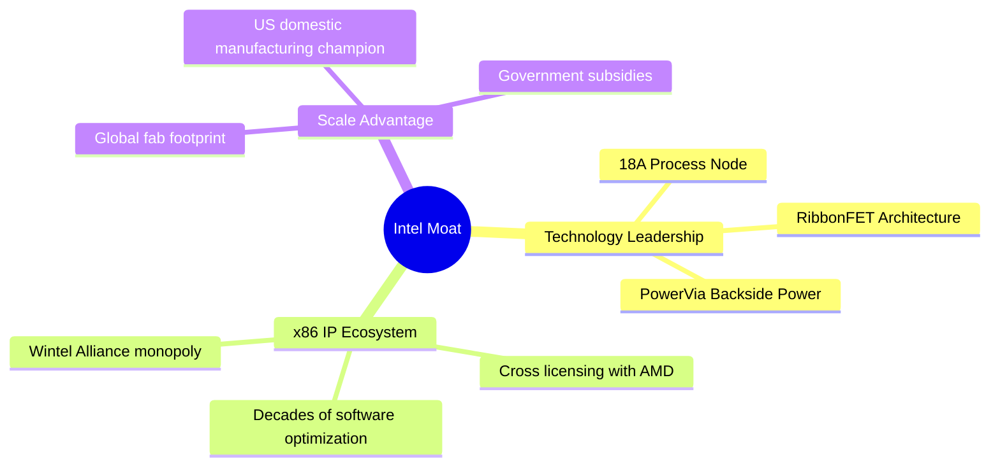

### 2.4 護城河強度評分

Intel 的傳統護城河（x86 生態系統與 Wintel 聯盟）正受到 ARM 架構與雲端自研晶片的侵蝕，而其新興護城河（先進代工）尚未完全建立，因此整體護城河呈現「轉型期的脆弱性」。

```
╔══════════════════════════════════════════════════════════════╗
║                  Intel 護城河強度評分                        ║
╠══════════════════════════════════════════════════════════════╣
║ x86 生態系統   7.5/10 ▓▓▓▓▓▓▓▓▓▓▓▓▓▓▓░░░░░  🟢 專利壁壘仍高 ║
║ 先進代工技術   6.0/10 ▓▓▓▓▓▓▓▓▓▓▓▓░░░░░░░░  🟡 18A 技術具競爭力║
║ 軟體生態系統   5.0/10 ▓▓▓▓▓▓▓▓▓▓░░░░░░░░░░  🟡 oneAPI 尚待推廣 ║
║ 規模與資金優勢 6.5/10 ▓▓▓▓▓▓▓▓▓▓▓▓▓░░░░░░░  🟢 獲晶片法案支持 ║
╠══════════════════════════════════════════════════════════════╣
║ 綜合護城河評分 6.0/10 ▓▓▓▓▓▓▓▓▓▓▓▓░░░░░░░░  🟡 轉型期護城河重建 ║
╚══════════════════════════════════════════════════════════════╝
```

---

## 3. 損益表深度分析

Intel 的損益表反映出明顯的「底部重建」與「結構性重組」特徵。

### 3.1 年度收入成長趨勢（近4年）

```
╔══════════════════════════════════════════════════════════════════╗
║              Intel 年度收入趨勢（FY2022 - FY2025）               ║
╠══════════════════════════════════════════════════════════════════╣
║                                                                  ║
║  FY2022  $63.05B  █████████████████████████  YoY: -20.21%  🔴    ║
║  FY2023  $54.23B  █████████████████████░░░░  YoY: -14.00%  🔴    ║
║  FY2024  $53.10B  ████████████████████░░░░░  YoY:  -2.08%  🟡    ║
║  FY2025  $52.85B  ████████████████████░░░░░  YoY:  -0.47%  🟡    ║
║                                                                  ║
║  📊 3年累計 CAGR：-5.71% ｜ TTM (2026) 營收: $53.76B (YoY +7.2%) ║
╚══════════════════════════════════════════════════════════════════╝
```

### 3.2 季度收入趨勢分析

自 2025 年下半年起，Intel 營收展現出微弱但確定的企穩跡象。

| 財報季度 | 營收 (Revenue) | 季增率 (QoQ) | 年增率 (YoY) | 營業利潤 (Op. Income) | 備註 |
|----------|---------------|-------------|-------------|----------------------|------|
| **Q2 2025** | \$12.86B | +1.52% | +0.20% | -\$3.18B | 🟡 代工重組費用與資產減損壓抑利潤 |
| **Q3 2025** | \$13.65B | +6.14% | +2.78% | \$683M | 🟢 AI PC 需求回溫，DCAI 止跌 |
| **Q4 2025** | \$13.67B | +0.15% | -4.11% | \$580M | 🟡 季節性平穩，PC 出貨符合預期 |
| **Q1 2026** | \$13.58B | -0.66% | +7.18% | \$934M | 🟢 營運利潤顯著改善，營運槓桿顯現 |

### 3.3 利潤率演變分析

Intel 的利潤率在過去四年經歷了斷崖式下跌，毛利率自歷史 60% 以上下滑至 FY25 的 34.8%（TTM 回升至 37.2%）。

| 利潤率指標 | FY2022 | FY2023 | FY2024 | FY2025 | TTM | 趨勢與原因解析 | 評估 |
|------------|--------|--------|--------|--------|-----|----------------|------|
| **毛利率** | 42.6% | 40.0% | 32.7% | 34.8% | **37.2%** | 底部回升 ｜ 受代工業務初期折舊與低產能利用率拖累。 | 🟡 |
| **營業利益率**| 3.7% | 0.2% | -8.9% | -4.2% | **6.9%** | 顯著改善 ｜ 受惠於 FY25 裁員與研發/行政費用大幅縮減。 | 🟡 |
| **EBITDA率** | 33.8% | 20.7% | 2.3% | 27.2% | **26.4%** | 回歸常態 ｜ 折舊與攤銷 (D&A) 佔營收比重居高不下。 | 🟢 |
| **淨利率** | 12.7% | 3.1% | -35.3% | 0.05% | **-5.9%** | 仍未穩定 ｜ Q1 2026 因大額非經營性支出導致單季虧損。 | 🔴 |

### 3.4 費用結構分析

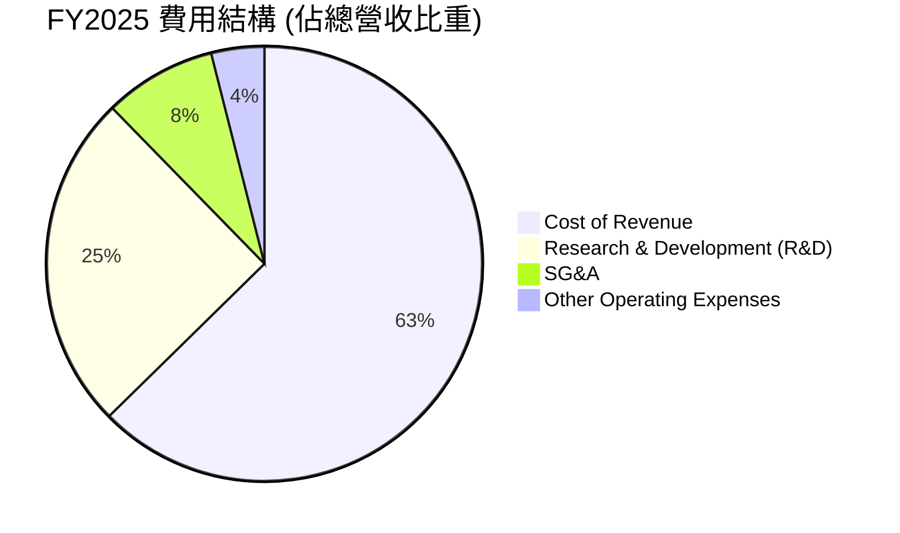

```
╔══════════════════════════════════════════════════════════════╗
║                Intel 營運費用控管成效                        ║
╠══════════════════════════════════════════════════════════════╣
║ R&D 研發費用： FY24 $16.55B  →  FY25 $13.77B (年減 16.8%) 🟢  ║
║ SG&A 行政費用：FY24 $5.51B   →  FY25 $4.62B  (年減 16.0%) 🟢  ║
║                                                              ║
║ 💡 評語：管理層強力執行成本縮減計劃，成效顯著，但研發費用     ║
║          的絕對縮減可能對長期技術領先性帶來潛在風險。         ║
╚══════════════════════════════════════════════════════════════╝
```

### 3.5 季度 EPS 趨勢與盈餘品質（Quality of Earnings）

Intel 的盈餘品質存在顯著的波動性與非經營性干擾。例如，**Q3 2025 淨利高達 \$4.06B**，但其營業利益僅為 \$683M，主因是**高達 \$36.7億美元的非經營性收益（資產處置與投資重估）**。相反地，**Q1 2026 營業利益達 \$934M**，但淨利卻為 **-$37.3億美元**，主因是非經營性支出與高額稅務調整。

| 盈餘品質項目 | 數值/佔比 (FY2025) | 評估與稀釋風險 |
|--------------|-----------|------|
| **股權薪酬 (SBC) / 營收** | **4.60%** (\$2.43B / \$52.85B) | 🟡 中度 ｜ 稀釋現有股東權益（FY25 總股數年增 5.84%）。 |
| **SBC / 營業現金流 (OCF)** | **25.05%** (\$2.43B / \$9.70B) | 🔴 偏高 ｜ 顯示營運現金流中，有相當比例仰賴非現金股權支付支撐。 |
| **FCF / GAAP 淨利 (現金轉換率)** | **負轉換** (FCF 為 -\$4.95B) | 🔴 極差 ｜ 淨利無法轉化為真實自由現金流，主因重資本支出。 |
| **非經常性損益干擾** | \$3.26B (FY2025) | 🔴 高度不確定 ｜ 獲利高度依賴非經營性資產處置，核心獲利能力偏弱。 |
| **有效稅率異常** | 98.3% (FY2025 稅務撥備 \$1.53B) | 🔴 異常 ｜ 稅務結構複雜且波動劇烈，壓抑最終淨利表現。 |

---

## 4. 資產負債表分析

Intel 的資產負債表呈現典型的「重資產、高槓桿、流動性防禦」特徵。

### 4.1 資產結構分解

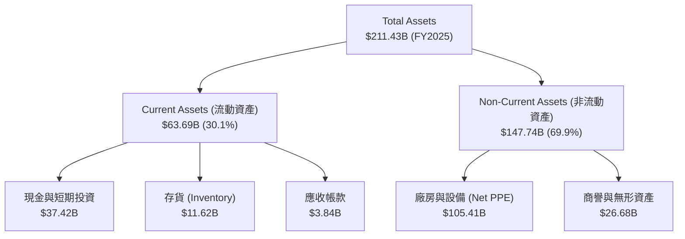

### 4.2 流動性指標分析

| 流動性指標 | FY2023 | FY2024 | FY2025 | TTM (2026) | 行業均值 | 評估 |
|------------|--------|--------|--------|------------|----------|------|
| **流動比率 (Current Ratio)** | 1.54x | 1.33x | 2.02x | **2.31x** | ~1.85x | 🟢 安全 ｜ 短期償債能力強 |
| **速動比率 (Quick Ratio)** | 1.15x | 0.99x | 1.65x | **1.66x** | ~1.30x | 🟢 安全 ｜ 扣除存貨後流動性仍佳 |
| **存貨週轉天數 (DSI)** | 125.0天 | 124.6天| 123.0天| **120.2天**| ~95.0天  | 🟡 偏高 ｜ 產能利用率與去庫存壓力仍存 |

### 4.3 債務結構分析

```
╔══════════════════════════════════════════════════════════════════╗
║                   Intel 債務健康診斷 (2026-07-21)               ║
╠══════════════════════════════════════════════════════════════════╣
║                                                                  ║
║  總債務 (Total Debt)：     $45.03B                                ║
║  總現金與投資 (Total Cash)：$32.79B                                ║
║  淨債務 (Net Debt)：       $12.24B  ██████░░░░░░░  🔴 淨債務狀態  ║
║                                                                  ║
║  債務股益比 (Debt/Equity)：36.03%                  🟢 槓桿率溫和  ║
║  利息保障倍數 (Interest Coverage)：~2.1x           🔴 利息壓力上升║
║                                                                  ║
║  💡 評語：儘管債務/股益比不高，但由於核心營業利益偏低，利息保障  ║
║          倍數已降至 2.1x 邊緣，若 FCF 持續失血，評級面臨下調風險。║
╚══════════════════════════════════════════════════════════════════╝
```

### 4.4 股東權益趨勢

```
╔══════════════════════════════════════════════════════════════════╗
║              Intel 股東權益 (Stockholders' Equity) 變化          ║
╠══════════════════════════════════════════════════════════════════╣
║  FY2022: $101.42B  ████████████████████                         ║
║  FY2023: $105.59B  █████████████████████                        ║
║  FY2024: $99.27B   ███████████████████                          ║
║  FY2025: $114.28B  ████████████████████████                     ║
║                                                                  ║
║  💡 註：FY25 股東權益上升，主要源於增發新股 (Shares Outstanding  ║
║         由 42.8億股增至 49.9億股，增幅 16.6%)，而非留存收益累積。║
╚══════════════════════════════════════════════════════════════════╝
```

---

## 5. 現金流量深度分析

現金流量表是剖析 Intel 當前困境最具警示性的部分。

### 5.1 現金流量瀑布圖

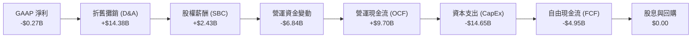

### 5.2 FCF 轉換率趨勢

Intel 的自由現金流連續四年為負，顯示其利潤（不論是 GAAP 還是 Non-GAAP）均缺乏現金含金量。

| 現金流指標 | FY2022 | FY2023 | FY2024 | FY2025 | TTM (2026) |
|------------|--------|--------|--------|--------|------------|
| **營運現金流 (OCF)** | \$15.43B | \$11.47B | \$8.29B | \$9.70B | **\$9.98B** |
| **資本支出 (CapEx)** | -\$24.84B| -\$25.75B| -\$23.94B| -\$14.65B| **-\$18.28B**|
| **自由現金流 (FCF)** | -\$9.41B | -\$14.28B| -\$15.66B| -\$4.95B | **-\$8.30B** |
| **FCF / GAAP 淨利** | -117.4% | -852.5% | -81.7% | -190.4倍 | **負轉換** |
| **自由現金流收益率 (FCF Yield)** | -1.78% | -2.69% | -2.95% | -0.93% | **-1.57%** |

### 5.3 自由現金流趨勢

```
╔══════════════════════════════════════════════════════════════════╗
║                Intel 自由現金流 (FCF) 嚴重失血軌跡               ║
╠══════════════════════════════════════════════════════════════════╣
║  FY2022   -$9.41B   ░░░░░░░░░░░░░░░░░                            ║
║  FY2023  -$14.28B   ░░░░░░░░░░░░                     🔴 失血加劇 ║
║  FY2024  -$15.66B   ░░░░░░░░░░░                      🔴 峰值壓力 ║
║  FY2025   -$4.95B   ░░░░░░░░░░░░░░░░░░░░░░░░░░       🟡 降幅收窄 ║
║  TTM     -$8.30B   ░░░░░░░░░░░░░░░░░░░               🔴 重回流出 ║
║                                                                  ║
║  ⚠️ 警示：過去 4 年累計流出 FCF 高達 $44.3B，幾乎消耗了其轉型期   ║
║          所有的利潤累積，被迫依賴外部融資與政府補貼。            ║
╚══════════════════════════════════════════════════════════════════╝
```

### 5.4 資本配置評估

為應對嚴峻的現金流挑戰，Intel 採取了極端的資本配置防禦措施。

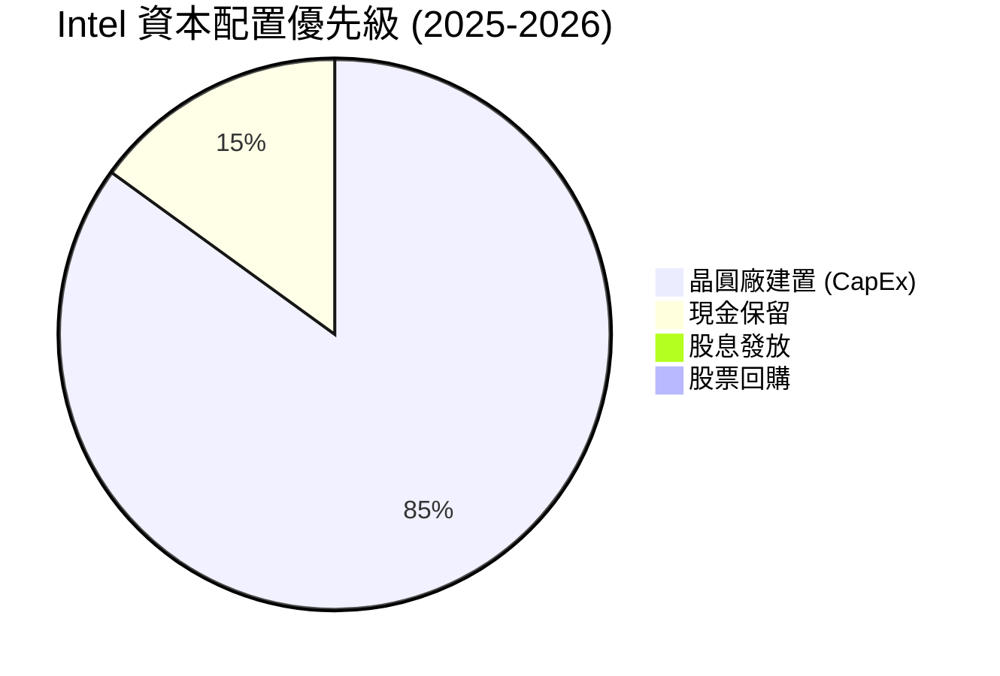

*   **暫停派息**：自 2024 年底起，Intel 將股息發放降至 **\$0.00**（Payout Ratio: 0%），以保留現金。
*   **停止回購**：回購金額為零，避免進一步消耗流動性。
*   **資金來源多元化**：引進外部共同投資人（如 Brookfield 與 Apollo 共同投資亞利桑那州與愛爾蘭晶圓廠），以減輕資產負債表壓力。

---

## 6. 獲利能力與資本效率

Intel 當前的獲利能力指標與資本效率均處於歷史低谷，顯示其在 IDM 2.0 轉型完成前，仍處於「破壞股東價值」的階段。

### 6.1 ROE / ROA / ROIC 趨勢

| 效率指標 | FY2022 | FY2023 | FY2024 | FY2025 | TTM (2026) | 行業均值 | 評估 |
|----------|--------|--------|--------|--------|------------|----------|------|
| **ROE** | 8.01% | 1.69% | -18.76%| 0.02% | **-2.90%** | ~15.0% | 🔴 股東權益回報為負 |
| **ROA** | 4.40% | 0.88% | -9.54% | 0.01% | **0.60%**  | ~8.5%  | 🔴 資產利用效率低下 |
| **ROIC** | 1.95% | 0.08% | -9.46% | -1.80% | **2.32%**  | ~12.0% | 🔴 資本效率嚴重偏低 |

### 6.2 ROIC vs WACC 分析（核心價值創造判斷）

```
╔══════════════════════════════════════════════════════════════════╗
║                ROIC vs WACC 深度分析 (TTM 2026)                 ║
╠══════════════════════════════════════════════════════════════════╣
║                                                                  ║
║  WACC (加權平均資本成本) 估算：                                  ║
║  ├── 無風險利率 (10Y 美債)：   4.20%                             ║
║  ├── 市場風險溢酬 (ERP)：      5.00%                             ║
║  ├── Beta：                    2.187 (市場波動敏感度極高)        ║
║  ├── 股權成本 (Ke)：           4.20% + 2.187 × 5.0% = 15.14%     ║
║  ├── 債務成本 (稅後)：         5.50% × (1 - 21%) = 4.35%         ║
║  ├── 資本結構：                股權 92.17% ｜ 債務 7.83%         ║
║  └── ✅ WACC ≈ 14.29%                                            ║
║                                                                  ║
║  ROIC (投資資本回報率) 估算：                                    ║
║  ├── NOPAT = EBIT $3.71B × (1 - 21%) ≈ $2.93B                     ║
║  ├── 投入資本 = 股東權益 $114.28B + 債務 $45.03B - 現金 $32.79B   ║
║  ├── 投入資本 = $126.52B                                         ║
║  └── ✅ ROIC ≈ 2.32%                                             ║
║                                                                  ║
║  ★ 經濟價值增加 (EVA) = ROIC - WACC = -11.97%                    ║
║                                                                  ║
║  ROIC  2.32%   ▓░░░░░░░░░░░░░░░░░░░░░░░░░░░░░  🔴 效率極低      ║
║  WACC  14.29%  ▓▓▓▓▓▓▓▓▓▓▓▓▓▓░░░░░░░░░░░░░░░░  ── 資本成本高昂  ║
║  EVA   -11.97% ██████████████████████████████  🔴 嚴重摧毀價值  ║
║                                                                  ║
║  📊 結論：Intel 當前 ROIC 遠低於 WACC，每投入 1 美元資本即摧毀    ║
║          0.12 美元的股東價值。這解釋了為何其估值重構面臨巨大阻力。║
╚══════════════════════════════════════════════════════════════════╝
```

### 6.3 杜邦三因素分解

透過杜邦分解，我們可以清晰看到 ROE 惡化的核心根源在於「淨利率的崩塌」與「資產週轉率的下滑」。

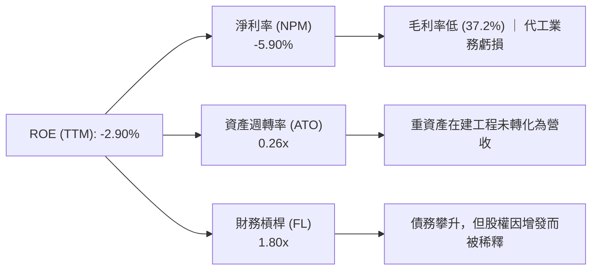

### 6.4 獲利能力儀表板

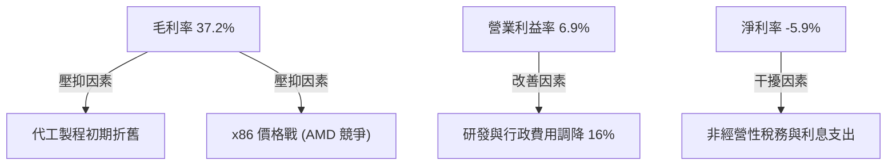

---

## 7. 估值深度分析

在 2026 年上半年經歷了一輪大漲後（最高觸及 \$142.35），Intel 目前的估值處於「預期高度透支」的敏感區間。

### 7.1 同業估值比較表格

我們選取了 TSMC（代工龍頭）、AMD（x86 直接競爭對手）與 NVIDIA（AI 龍頭）進行對比。

| 估值指標 | **Intel (INTC)** | **TSMC (TSM)** | **AMD (AMD)** | **NVIDIA (NVDA)** | Intel 估值評估 |
|----------|----------|---------|---------|---------|-----------|
| **Trailing P/E** | **N/A** (虧損) | 28.5x | 115.2x | 68.4x | 🔴 缺乏歷史市盈率支持 |
| **Forward P/E** | **64.89x** | 22.1x | 42.5x | 35.8x | 🔴 顯著高於代工龍頭 TSMC |
| **P/S Ratio** | **9.86x** | 10.2x | 11.5x | 26.4x | 🟡 接近 AMD，但營收增速落後 |
| **EV / EBITDA** | **36.24x** | 12.8x | 38.2x | 28.5x | 🔴 折舊前估值依然偏高 |
| **FCF Yield** | **-1.57%** | +3.85% | +1.20% | +2.95% | 🔴 唯一自由現金流為負的標的 |

### 7.2 歷史估值區間分析

```
╔══════════════════════════════════════════════════════════════════╗
║              Intel Forward P/E 歷史區間與當前位置                ║
╠══════════════════════════════════════════════════════════════════╣
║                                                                  ║
║  歷史低點 (5Y Low)：     9.5x                                    ║
║  歷史中位數 (5Y Median)：14.5x                                   ║
║  歷史高點 (5Y High)：    68.0x                                   ║
║  當前 Forward P/E：      64.89x  ██████████████████████░  🔴 頂部║
║                                                                  ║
║  💡 評語：當前 64.89x 的 Forward P/E 已經接近歷史估值區間的上限。 ║
║          這表明市場對 18A 的成功概率給予了近乎完美的定價。        ║
╚══════════════════════════════════════════════════════════════════╝
```

### 7.3 情境目標價（假設驅動，Bear / Base / Bull）

由於 Intel 淨利受高額折舊與攤銷壓抑，**P/E 估值法在此階段極易失真**。我們採用 **EV/Revenue** 與 **EV/EBITDA** 作為核心估值工具，並基於 2026-2030 轉型期進行情境推演：

| 情境 | 5年營收 CAGR | 2030 營業利益率 | 退出倍數 (EV/EBITDA) | 隱含目標價 | 相對現價 (\$105.45) |
|------|-----------|-----------|----------|------------|----------|
| 🔴 **悲觀情境** | 1.5% | 8.0% | 12.0x | **$55.00** | -47.8% |
| 🟡 **基準情境** | 5.5% | 18.0% | 18.0x | **$108.00**| +2.42% |
| 🟢 **樂觀情境** | 10.0% | 25.0% | 22.0x | **$155.00**| +47.0% |

### 7.4 DCF 敏感性分析（9格目標價矩陣）

我們使用基準 FCF 預測，對折現率 (WACC) 與終端成長率 (g) 進行敏感性測試：

| 終端成長率 (g) \ WACC | WACC = 13.0% | **WACC = 14.29% (基準)** | WACC = 15.5% |
|------|--------------|----------------------|--------------|
| **g = 2.5%** | \$124.00 (+17.6%) | \$112.00 (+6.21%) | \$94.00 (-10.9%) |
| **g = 2.0% (基準)** | \$118.00 (+11.9%) | **$108.00 (+2.42%)** | \$88.00 (-16.5%) |
| **g = 1.5%** | \$110.00 (+4.31%) | \$101.00 (-4.22%) | \$82.00 (-22.2%) |

### 7.5 估值綜合區間

```
╔══════════════════════════════════════════════════════════════════╗
║                    Intel 估值綜合區間定位                        ║
╠══════════════════════════════════════════════════════════════════╣
║                                                                  ║
║  [悲觀合理值]  $55.00                                            ║
║  [DCF 基準值]  $108.00              ★ 當前股價 ($105.45)         ║
║  [樂觀合理值]  $155.00                                            ║
║                                                                  ║
║  極度低估         合理估值區間                      極度高估     ║
║  ├──────────────┼──────────★───────────────┼──────────────┤     ║
║  $18.97         $55.00                     $142.35      $200.00  ║
║                                                                  ║
║  💡 結論：當前股價 $105.45 緊貼基準合理值 $108.00，安全邊際狹窄。║
╚══════════════════════════════════════════════════════════════════╝
```

---

## 8. 成長催化劑

Intel 的長期多頭論點完全建立在「IDM 2.0 戰略成功」的假設之上。

### 8.1 催化劑時間軸

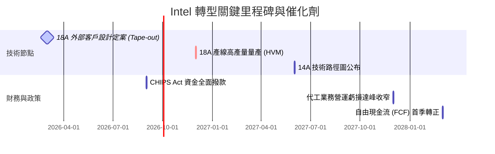

### 8.2 TAM 市場規模分析

```
╔══════════════════════════════════════════════════════════════════╗
║               Intel 核心市場 TAM 與滲透率預測 (2028)             ║
╠══════════════════════════════════════════════════════════════════╣
║                                                                  ║
║  ① AI PC 處理器市場 (CCG 驅動)：                                ║
║     ├── 全球 TAM：$35.0B ｜ Intel 預期份額：65% (領先)           ║
║                                                                  ║
║  ② 先進晶圓代工市場 (Foundry 驅動)：                            ║
║     ├── 全球 TAM：$120.0B ｜ Intel 預期份額：10% (追趕)          ║
║                                                                  ║
║  ③ AI 專用加速器市場 (Gaudi/GPU 驅動)：                         ║
║     ├── 全球 TAM：$150.0B ｜ Intel 預期份額：<5% (邊緣化)        ║
║                                                                  ║
║  💡 評語：Intel 的主要成長動能來自 PC 的 AI 化（高利潤率維持）與  ║
║          代工市場份額的零到一突破，而非高歌猛進的 AI 晶片市場。  ║
╚══════════════════════════════════════════════════════════════════╝
```

### 8.3 成長驅動力結構圖

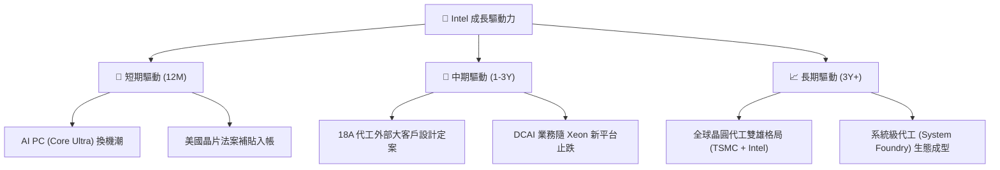

---

## 9. 風險矩陣

### 9.1 風險評分矩陣

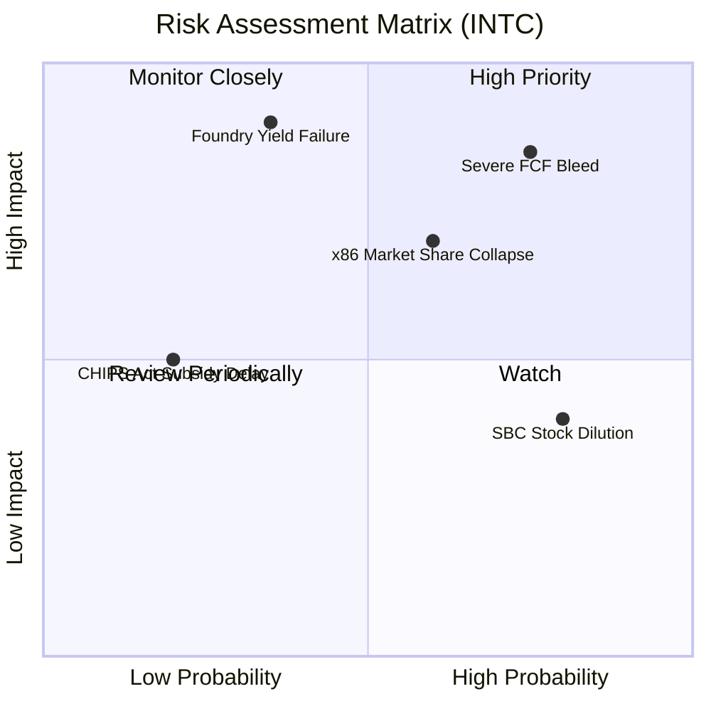

### 9.2 風險清單詳細分析

| # | 風險項目 | 發生機率 | 財務衝擊 | 風險評分 | 緩解措施 |
|---|----------|----------|----------|----------|----------|
| 1 | 🔴 **自由現金流持續失血與債務危機** | 高 (75%) | 高 (引發信用降級) | **8.0 / 10** | 暫停股息支付、引進外部合資夥伴共同分擔 CapEx。 |
| 2 | 🔴 **18A 製程良率爬坡不及預期** | 中 (35%) | 極高 (代工戰略破產) | **7.5 / 10** | 與 ASML 緊密合作，加速 High-NA EUV 設備調試與優化。 |
| 3 | 🟡 **x86 客戶端市場份額被 AMD 蠶食** | 高 (60%) | 中 (壓抑 CCG 利潤) | **6.5 / 10** | 加速 Lunar Lake 與 Arrow Lake 推出，主打極致能效比。 |
| 4 | 🟡 **增發新股導致現有股東權益稀釋** | 高 (80%) | 中 (壓抑每股盈餘) | **6.0 / 10** | 當營運現金流改善時，承諾重啟股份回購計劃。 |

---

## 10. 投資建議

### 10.1 最終綜合評級雷達圖

```
╔══════════════════════════════════════════════════════════════╗
║                    Intel 最終基本面評分                      ║
╠══════════════════════════════════════════════════════════════╣
║ 基本面強度  5.0/10 ▓▓▓▓▓▓▓▓▓▓░░░░░░░░░░  ★★★☆☆           ║
║ 成長動能    6.0/10 ▓▓▓▓▓▓▓▓▓▓▓▓░░░░░░░░  ★★★☆☆           ║
║ 獲利品質    3.5/10 ▓▓▓▓▓▓░░░░░░░░░░░░░░  ★★☆☆☆           ║
║ 財務健康    5.5/10 ▓▓▓▓▓▓▓▓▓▓▓░░░░░░░░░  ★★★☆☆           ║
║ 估值合理性  3.0/10 ▓▓▓▓▓▓░░░░░░░░░░░░░░  ★☆☆☆☆           ║
║ 綜合評級：  🟡 持有 (Hold) ｜ 總分：5.1 / 10                 ║
╚══════════════════════════════════════════════════════════════╝
```

### 10.2 目標價與隱含報酬率

| 情境 | 發生機率 | 目標價 | 隱含報酬率 (相對現價 \$105.45) | 機率加權目標價 |
|------|---------|--------|-----------------------------|----------------|
| 🔴 **悲觀** | 25% | \$55.00 | -47.8% | \$13.75 |
| 🟡 **基準** | 60% | \$108.00 | +2.42% | \$64.80 |
| 🟢 **樂觀** | 15% | \$155.00 | +47.0% | \$23.25 |
| **綜合期望值** | **100%** | **$101.80** | **-3.46%** | **建議：觀望/持有** |

### 10.3 買入時機與觸發因素

```
╔══════════════════════════════════════════════════════════════════╗
║                  ✅ Intel 投資決策 Checklist                    ║
╠══════════════════════════════════════════════════════════════════╣
║                                                                  ║
║  立即買入觸發條件（需多數符合）：                                ║
║  ☐ 18A 良率公開證實達到 TSMC 同代製程 80% 以上水準               ║
║  ☐ 單季自由現金流 (FCF) 轉正，且 OCF 能完全覆蓋 CapEx            ║
║  ☐ 股價回落至 $75.00 以下 (對應 Forward P/E < 45x)，提供安全邊際 ║
║                                                                  ║
║  加碼觸發條件：                                                  ║
║  ☐ 獲得全球前五大超大規模雲端服務商 (Hyperscaler) 的 18A 代工訂單 ║
║                                                                  ║
║  減碼/停損觸發條件：                                              ║
║  ☐ 18A 量產時程宣布延遲至 2027 年以後                             ║
║  ☐ 淨債務突破 $200億美元 且利息保障倍數跌破 1.5x                  ║
╚══════════════════════════════════════════════════════════════════╝
```

### 10.4 投資人適配度分析

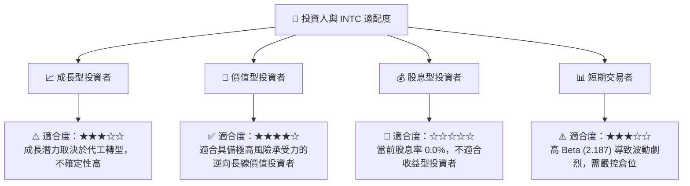

### 10.5 每季財報監控清單（Quarterly Watch List）

| 監控指標 | 基準值 (當前) | 減碼觸發門檻 (Bear) | 加碼觸發門檻 (Bull) | 戰略含意 |
|----------|--------------|-------------------|-------------------|----------|
| **毛利率 (Gross Margin)** | **37.2%** | < 32.0% (折舊失控) | > 45.0% (產能利用率回升) | 評估代工業務定價權與折舊壓力 |
| **單季 FCF** | **-$2.54B** (Q1 26) | < -$3.50B (失血加劇) | > $0.00 (現金流自我造血) | 評估公司債務違約與股權稀釋風險 |
| **CCG 營收年增率** | **+7.18%** | < -5.0% (PC 業務萎縮) | > +15.0% (AI PC 大爆發) | 核心「現金牛」業務是否能持續供血 |
| **代工外部營收** | **極低** | 連續兩季無進展 | 單季突破 \$5億美元 | 評估 IDM 2.0 代工戰略的真實商業進展 |

### 10.6 反面論證：什麼會證明論點錯誤（What Would Change My Mind）

```
╔══════════════════════════════════════════════════════════════════╗
║              ⚠️ 多頭論點失效條件（Disconfirming Evidence）       ║
╠══════════════════════════════════════════════════════════════════╣
║  本報告的「持有」評級在下列情況成立時，應立即下調至「賣出」：    ║
║  ☐ 核心業務（CCG + DCAI）營收增速連續兩季低於 2.0%              ║
║  ☐ 自由現金流 (FCF) 全年流出量突破 $100億美元                    ║
║  ☐ 18A 製程良率遲遲無法突破 50%，導致外部客戶取消代工意向        ║
║  ☐ 信用評等遭標普 (S&P) 或穆迪 (Moody's) 下調至垃圾債邊緣       ║
║  ☐ 股權稀釋速度加劇（發行股數年增率 > 10%）                      ║
╚══════════════════════════════════════════════════════════════════╝
```

---

> **免責聲明**：本報告為基於客觀財務數據的機構級學術分析，僅供研究參考，不構成任何具體的投資建議。半導體行業具備高技術壁壘與強週期性，投資人應審慎評估個人風險承受能力。