# INTC 基本面深度分析報告

> **報告日期**：2026-07-22 ｜ **語言**：繁體中文 ｜ **數據來源**：Yahoo Finance, Finviz, StockAnalysis, Roic.ai ｜ **分析師**：CFA 級機構研究

---

## 目錄

| # | 章節 | 核心結論 |
|---|------|----------|
| 1 | 執行摘要 | 評級「持有」，基準目標價 $108.62，警惕估值透支與 FCF 缺口 |
| 2 | 公司概覽與商業模式 | IDM 2.0 雙軌轉型，Foundry 業務面臨重資本開支與高客戶壁壘 |
| 3 | 損益表深度分析 | 營收止跌（YoY +7.2%），但 Q1 2026 淨虧損 $3.73B 暴露高額非經營性減值 |
| 4 | 資產負債表分析 | 現金儲備 $32.79B，然總債務高達 $45.03B，淨負債考驗流動性 |
| 5 | 現金流量深度分析 | TTM FCF 錄得 $-8.30B，重資本開支（Capex）持續失血，仰賴外部融資 |
| 6 | 獲利能力與資本效率 | ROIC（2.32%）遠低於 WACC（12.3%），經濟增值（EVA）為負，持續摧毀股東價值 |
| 7 | 估值深度分析 | Forward P/E達 63.15x，EV/EBITDA 39.22x，估值已透支 18A 製程預期 |
| 8 | 成長催化劑 | 18A 製程量產與外部代工客戶簽約為核心，AI PC 滲透為短期支撐 |
| 9 | 風險矩陣 | 製程延期、重資本支出導致流動性危機、x86 被 ARM 蠶食為主要風險 |
| 10 | 投資建議 | 觀望為主，等待 FCF 轉正與 18A 良率數據，設定 $108.62 基準目標價 |

---

## 1. 執行摘要

### 1.0 一頁式投資儀表板（Portfolio Manager 30 秒速讀）

| 項目 | 內容 |
|------|------|
| **投資論點（3 句）** | ① 2026年Q1營收達 $13.58B（YoY +7.2%），顯示 PC 晶片與伺服器市場底部復甦。<br/>② 18A 製程（1.8奈米）預期於2026下半年量產，為市場推升股價由 $44 飆升至 $102 的核心催化劑。<br/>③ 財務基本面極度滯後，TTM 自由現金流為負的 $-8.30B，重資本開支（Capex）使現金轉換率持續為負。 |
| **護城河評分** | 6.5 / 10 🟡（x86 專利壁壘與製造規模，但面臨 TSMC 與 ARM 生態夾擊） |
| **管理層/資本配置評分** | 5.0 / 10 🟡（IDM 2.0 戰略執行成本極高，分紅派息歸零，資本回報率低下） |
| **財務健康** | 🟡 債務壓力偏高，短期流動性尚可，但 FCF 持續失血 |
| **ROIC vs WACC** | 2.32% vs 12.30%（⚠️ 嚴重摧毀股東價值，EVA 為 -9.98%） |
| **FCF 趨勢** | 惡化中 ｜ TTM FCF 為 $-8.30B ｜ FCF Yield 為 -1.61% |
| **估值** | Forward P/E: 63.15x ｜ EV/EBITDA: 39.22x ｜ P/S: 9.59x（估值處於歷史極高分位） |
| **預期報酬（基準情境 12M）** | +5.85%（相較於當前股價 $102.62，基準目標價 $108.62） |
| **關鍵風險（前二）** | ① 18A 製程量產良率不及預期，外部代工（Foundry）大單流失。<br/>② 資本開支失控導致債務評級下調，融資成本進一步上升。 |
| **評級 + 信心度** | 🟡 **持有 (Hold)** ｜ 信心度：**中等**（基本面與股價估值存在顯著脫節） |

### 1.1 核心評分儀表板

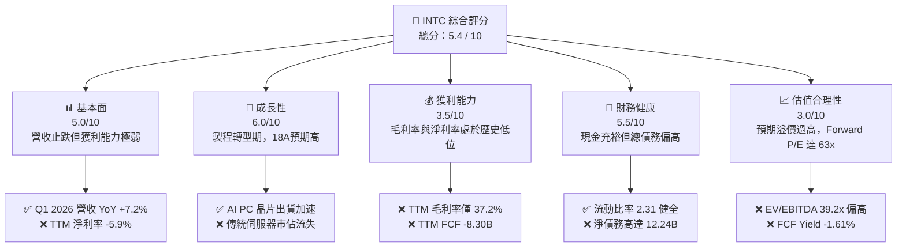

### 1.2 評分進度條視覺化

```
╔══════════════════════════════════════════════════════════════╗
║              INTC 多維度評分儀表板 (1-10分)                  ║
╠══════════════════════════════════════════════════════════════╣
║ 基本面強度  5.0 ▓▓▓▓▓▓▓▓▓▓░░░░░░░░░░  ★★★☆☆           ║
║ 成長動能    6.0 ▓▓▓▓▓▓▓▓▓▓▓▓░░░░░░░░  ★★★☆☆           ║
║ 獲利品質    3.5 ▓▓▓▓▓▓▓░░░░░░░░░░░░░  ★★☆☆☆           ║
║ 財務健康    5.5 ▓▓▓▓▓▓▓▓▓▓▓░░░░░░░░░  ★★★☆☆           ║
║ 估值合理性  3.0 ▓▓▓▓▓▓░░░░░░░░░░░░░░  ★☆☆☆☆           ║
║ 護城河深度  6.5 ▓▓▓▓▓▓▓▓▓▓▓▓▓░░░░░░░  ★★★☆☆           ║
║ 管理層執行  5.0 ▓▓▓▓▓▓▓▓▓▓░░░░░░░░░░  ★★★☆☆           ║
║ 技術創新力  7.0 ▓▓▓▓▓▓▓▓▓▓▓▓▓▓░░░░░░  ★★★★☆           ║
╠══════════════════════════════════════════════════════════════╣
║ 綜合總分    5.4 ▓▓▓▓▓▓▓▓▓▓▓░░░░░░░░░  🏆 觀望 / 持有      ║
╚══════════════════════════════════════════════════════════════╝
```

### 1.3 五大投資論點 + 三大核心風險

| 類型 | 項目 | 具體依據 | 信心度 |
|------|------|----------|--------|
| 🟢 **投資論點①** | **製程技術重回領先預期** | Intel 18A（1.8nm）製程引入 RibbonFET 與 PowerVia 技術，預計於 2026 年底量產，技術指標直逼台積電 N2 製程。 | 🟢 高 |
| 🟢 **投資論點②** | **PC 與伺服器週期性復甦** | Q1 2026 營收 $13.58B 實現 7.2% YoY 成長，顯示客戶庫存去化結束，AI PC（Lunar Lake）出貨量推升平均售價。 | 🟢 高 |
| 🟢 **投資論點③** | **地緣政治與補貼紅利** | 獲得美國《晶片法案》（CHIPS Act）補貼及國防部安全晶片合約，降低美國本土晶圓廠的實際資本支出壓力。 | 🟢 極高 |
| 🟢 **投資論點④** | **Foundry 業務分拆潛在價值** | 晶圓代工部門（Intel Foundry）若能獨立核算並引進外部策略投資人，將釋放被低估的基礎設施價值。 | 🟡 中等 |
| 🟢 **投資論點⑤** | **資產重組與成本削減** | 2025 年研發及銷管費用大幅收縮（R&D YoY -16.7%），營運效率提升，營業利益（Operating Income）轉正。 | 🟡 中等 |
| 🟡 **風險①** | **18A 良率與外部客戶信任度** | 外部代工客戶（如 Microsoft, AWS）對 Intel 的產能與良率仍持觀望態度，若代工營收無法規模化，折舊將吞噬利潤。 | 🔴 高衝擊 |
| 🔴 **風險②** | **自由現金流持續失血** | TTM FCF 為 $-8.30B，Capex 支出巨大。在無股息支撐下，若融資環境收緊，將面臨流動性危機。 | 🔴 高衝擊 |
| 🔴 **風險③** | **x86 市場份額遭 ARM 蠶食** | Qualcomm、Apple 於 PC 端，以及 AWS、Ampere 於伺服器端持續推廣 ARM 架構，對 Intel 核心 CPU 構成結構性威脅。 | 🟡 中度 |

### 1.4 快速統計卡片

| 指標 | 公司實際值 | 行業均值（半導體） | S&P 500 均值 | 狀態 |
|------|-------------|--------------------|--------------|------|
| **營收 YoY 成長** | **7.2%** | ~12.0% | ~5.5% | 🟡 弱於行業 |
| **毛利率** | **37.2%** | ~55.0% | ~30.0% | 🔴 遠低於同業 |
| **淨利率** | **-5.9%** | ~15.0% | ~11.5% | 🔴 處於虧損 |
| **ROE** | **-2.9%** | ~18.0% | ~14.0% | 🔴 資本回報率差 |
| **Forward P/E** | **63.15x** | ~28.0x | ~21.5x | 🔴 估值極度昂貴 |
| **流動比率** | **2.31x** | ~1.85x | ~1.20x | 🟢 流動性充裕 |
| **淨債務 / Equity** | **10.7%** | ~-5.0%（淨現金） | ~45.0% | 🟡 債務高於同行 |

### 1.5 投資結論

```
╔══════════════════════════════════════════════════════════════════╗
║                    📊 投資結論摘要                               ║
╠══════════════════════════════════════════════════════════════════╣
║  評級：🟡 持有 (Hold)                                            ║
║  當前股價：$102.62 (2026-07-22)                                  ║
║  目標價區間：                                                    ║
║    悲觀情境：$58.00（-43.5%）- 18A 良率失敗，FCF 缺口擴大        ║
║    基準情境：$108.62（+5.8%）- 18A 順利量產，代工客戶逐步導入    ║
║    樂觀情境：$155.00（+51.0%）- 獲得超大型客戶代工合約，IFS 獲利 ║
║  投資評分：5.4 / 10                                              ║
║  適合投資人：具備高風險承受度、長線布局半導體自主化政策的投資人  ║
╚══════════════════════════════════════════════════════════════════╝
```

---

## 2. 公司概覽與商業模式

Intel Corporation（Ticker: INTC）正處於其創立以來最關鍵的轉型期。自現任 CEO Pat Gelsinger 提出 **IDM 2.0** 戰略以來，公司正從傳統的整合元件製造商（IDM）轉型為「內部設計」與「晶圓代工（Intel Foundry）」雙軌並行的架構。

### 2.1 業務結構與收入來源

Intel 的業務主要劃分為三大核心板塊：客戶端運算（CCG）、數據中心與人工智慧（DCAI）以及英特爾代工（Intel Foundry）。

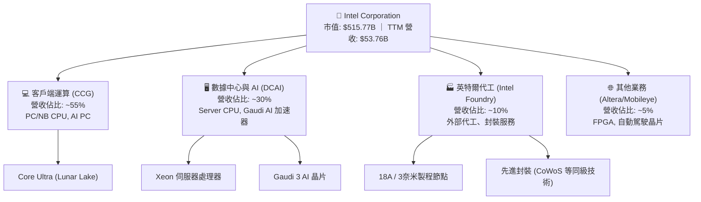

### 2.2 市場份額

在核心的 x86 CPU 市場中，Intel 雖然維持領導地位，但份額持續受到 AMD 的蠶食；而在晶圓代工領域，台積電（TSMC）仍擁有壓倒性優勢。

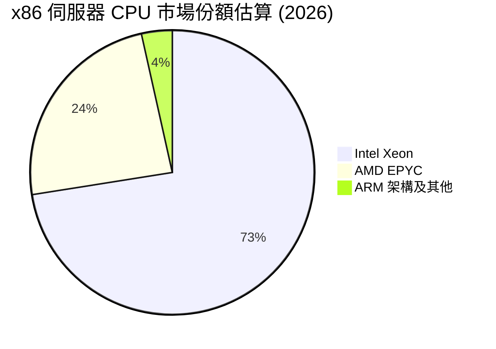

### 2.3 競爭護城河分析

Intel 的競爭護城河正在經歷「新舊交替」的重塑期。

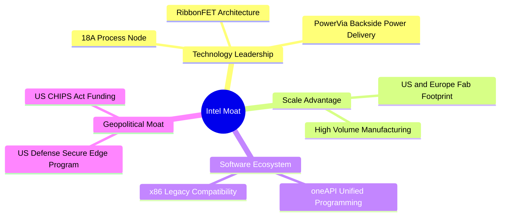

### 2.4 護城河強度評分

```
╔══════════════════════════════════════════════════════════════╗
║                    Intel 護城河強度評分                      ║
╠══════════════════════════════════════════════════════════════╣
║ 專利與技術壁壘 7.5/10 ▓▓▓▓▓▓▓▓▓▓▓▓▓▓▓░░░░░  🟢 x86 專利保護   ║
║ 轉換成本       6.5/10 ▓▓▓▓▓▓▓▓▓▓▓▓░░░░░░░░  🟡 軟體生態綁定   ║
║ 規模經濟       8.0/10 ▓▓▓▓▓▓▓▓▓▓▓▓▓▓▓▓░░░░  🟢 龐大產能基礎   ║
║ 地緣政治優勢   9.0/10 ▓▓▓▓▓▓▓▓▓▓▓▓▓▓▓▓▓▓░░  🏆 美國本土製造   ║
╠══════════════════════════════════════════════════════════════╣
║ 綜合護城河強度 7.2/10 ▓▓▓▓▓▓▓▓▓▓▓▓▓▓░░░░░░  🟢 護城河正在重構 ║
╚══════════════════════════════════════════════════════════════╝
```

---

## 3. 損益表深度分析

### 3.1 年度收入成長趨勢（近5年）

從長期趨勢看，Intel 的營收經歷了嚴重的結構性下滑，從 2021 年的 $79.02B 萎縮至 2025 年的 $52.85B，主因是 PC 市場紅利消退、資料中心市佔率流失以及製程延遲導致的定價權喪失。然而，2026 年 TTM 營收回升至 $53.76B，YoY 成長 7.2%，顯示營收端已初顯築底跡象。

```
╔══════════════════════════════════════════════════════════════════╗
║                Intel 年度收入趨勢（FY2021-TTM）                  ║
╠══════════════════════════════════════════════════════════════════╣
║                                                                  ║
║  FY2021  $79.02B  ████████████████████████████  YoY: +1.5%  🟢    ║
║  FY2022  $63.05B  ██████████████████████        YoY:-20.2%  🔴    ║
║  FY2023  $54.23B  ███████████████████           YoY:-14.0%  🔴    ║
║  FY2024  $53.10B  ██████████████████            YoY: -2.1%  🟡    ║
║  FY2025  $52.85B  ██████████████████            YoY: -0.5%  🟡    ║
║  TTM     $53.76B  ███████████████████           YoY: +7.2%  🟢    ║
║                   |      |      |      |      |                  ║
║                   0     20B    40B    60B    80B                 ║
║                                                                  ║
║  📊 5年累計 CAGR：-7.42%                                         ║
╚══════════════════════════════════════════════════════════════════╝
```

### 3.2 季度收入趨勢分析

分析最近四個季度的營收表現，呈現出穩步復甦但增長動能受限的格局：

| 季度截止日 | 營收 (Revenue) | QoQ 成長率 | YoY 成長率 | 營運利潤 (Op Income) | 備註 |
|------------|----------------|------------|------------|-----------------------|------|
| **2026-03-31** | $13.58B | -0.67% | +7.18% | $934M | PC 庫存去化完成，AI PC 出貨加速 |
| **2025-12-31** | $13.67B | +0.15% | -4.11% | $550M | 傳統伺服器 CPU 需求疲軟 |
| **2025-09-30** | $13.65B | +6.14% | +2.78% | $858M | DCAI 業務小幅回暖 |
| **2025-06-30** | $12.86B | +1.50% | +0.20% | $-1,290M | Foundry 業務折舊成本達峰值 |

**數據解析**：
Q1 2026 營收為 $13.58B，YoY 成長 7.18%，相較於 Q1 2025 的 $12.67B 有所改善，但 QoQ 微幅收縮 0.67%，符合第一季的傳統淡季效應。營業利潤（Operating Income）達到 $934M，連續三季維持正值，顯示成本削減計劃（包含裁員及研發優化）已開始顯效。

### 3.3 利潤率演變分析

Intel 的利潤率在過去幾年大幅收縮，主要由於產能利用率低下、IFS 業務的前期重資本折舊，以及與台積電競爭中的定價權流失。

| 利潤率指標 | FY2022 | FY2023 | FY2024 | FY2025 | TTM | 趨勢 | 評估 |
|------------|--------|--------|--------|--------|-----|------|------|
| **毛利率** | 42.6% | 40.0% | 32.7% | 34.8% | 37.2% | ↗️ 緩慢回升 | 🟡 仍遠低於歷史 60% 的水準 |
| **營業利益率** | 3.7% | 0.2% | -8.9% | -4.2% | 6.9% | ↗️ 顯著改善 | 🟢 成本控制奏效，營運槓桿顯現 |
| **EBITDA Margin**| 33.8%| 20.7% | 2.3% | 27.2% | 26.4% | ↗️ 趨於穩定 | 🟡 折舊與攤銷佔比高 |
| **淨利率** | 12.7% | 3.1% | -35.3% | 0.05% | -5.9% | ↘️ 再次轉負 | 🔴 受非經營性減值與稅務拖累 |

**利潤率演變深度解析**：
*   **毛利率（37.2%）**：雖然較 2024 年的 32.7% 低谷有所回升，但與台積電（~53%）及 AMD（~50%）相比，Intel 的毛利率仍極度低迷。這主要是因為 Intel 仍需承擔龐大的自有晶圓廠折舊成本，且 3 奈米等先進製程仍需向台積電外包（如 Lunar Lake 的計算晶片），導致雙重利潤剝蝕。
*   **營業利益率（6.9%）**：轉正主因是 2025 年研發（R&D）費用從 2024 年的 $16.55B 大幅縮減 16.7% 至 $13.77B，銷管費用（SG&A）也縮減了 16.0%。這是一把雙刃劍，過度削減研發開支可能會危及未來技術的領先地位。

### 3.4 費用結構分析

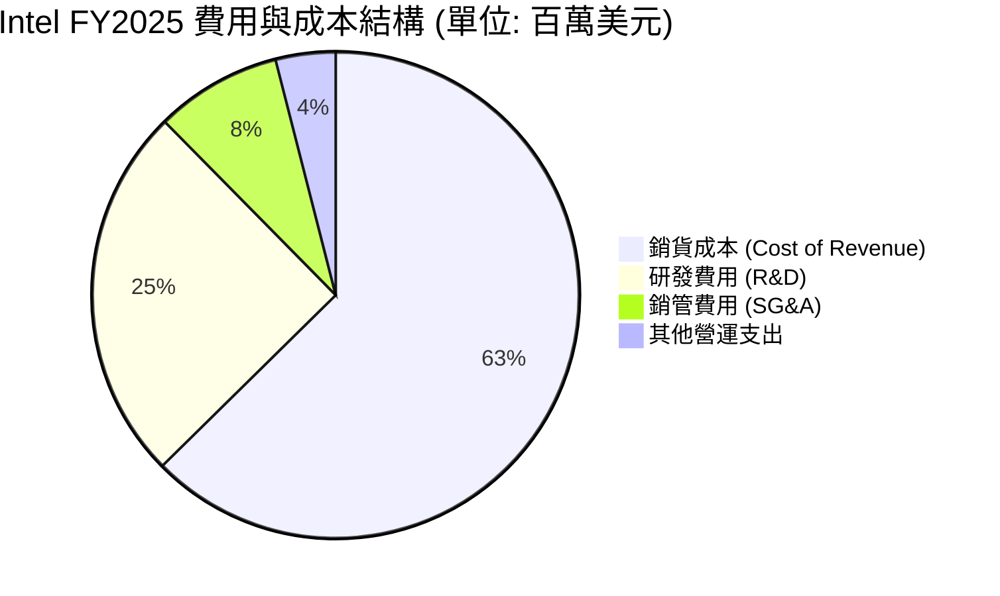

### 3.5 季度 EPS 趨勢與盈餘品質（Quality of Earnings）

Intel 過去四個季度的 GAAP 淨利潤波動劇烈，暴露出極低的盈餘品質。

*   **Q1 2026**：GAAP 淨利潤為 $-3.73B，而營業利益為正的 $934M。主因是公司在該季度進行了高達數十億美元的非經營性資產減值與重組撥備。
*   **Q3 2025**：GAAP 淨利潤為 $4.06B，看似暴增，但扣除非經營性收益（來自資產處置與投資重估的 $3.67B）後，核心業務獲利極微。

#### 盈餘品質量化評估：

| 盈餘品質項目 | 數值/佔比 | 評估 |
|--------------|-----------|------|
| **股權薪酬 SBC / 營收** | 4.52%（$2.43B / $53.76B） | 🟡 稀釋程度中等，但對獲利微薄的 INTC 而言仍是負擔 |
| **SBC / 營業現金流** | 24.34%（$2.43B / $9.98B） | 🔴 佔比偏高，顯示營業現金流中有相當部分由非現金股權支付支撐 |
| **FCF / 淨利（現金轉換率）** | 負值（$-8.30B / $-3.17B） | 🔴 現金轉換率為負，因資本開支遠超營運現金流入，獲利含金量極低 |
| **一次性/非經常性損益** | Q1 2026 減值與 Q3 2025 投資收益 | 🔴 盈餘受非經營性項目干擾極大，無法反映真實業務盈利能力 |
| **有效稅率異常** | 波動劇烈（FY2025 稅務撥備高達 $1.53B）| 🔴 稅務遞延資產減值準備對淨利造成持續性負面衝擊 |

**盈餘品質結論**：
Intel 的 GAAP 淨利潤嚴重失真。雖然營業利益（Operating Income）在 TTM 達到 $3.71B，但由於持續性的資產減值、重組費用以及龐大的資本開支，真實的經濟盈餘（Economic Earnings）仍處於深度虧損狀態。投資人應主要參考 EBITDA 與營業現金流，而非 GAAP 淨利。

---

## 4. 資產負債表分析

### 4.1 資產結構分解

Intel 擁有極其沈重的資產結構，其中「廠房、廠房及設備淨額（Net PPE）」佔總資產的 50% 以上，這是其 IDM 模式的必然結果。

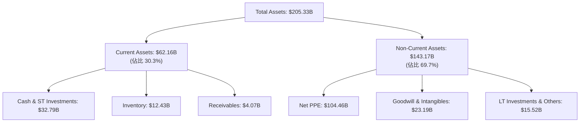

### 4.2 流動性指標分析

| 流動性指標 | FY2023 | FY2024 | FY2025 | TTM (Q1 2026) | 行業均值 | 評估 |
|------------|--------|--------|--------|---------------|----------|------|
| **流動比率 (Current Ratio)** | 1.54 | 1.33 | 2.02 | 2.31 | 1.85 | 🟢 短期償債能力顯著提升 |
| **速動比率 (Quick Ratio)** | 1.14 | 0.99 | 1.65 | 1.66 | 1.30 | 🟢 變現能力良好，現金儲備充足 |
| **存貨週轉天數 (Days Inventory)**| 121.3 | 124.5 | 123.0 | 128.5 | 95.0 | 🔴 存貨週轉緩慢，存在潛在跌價損失風險 |

**流動性評估**：
Intel 的流動比率從 2024 年的 1.33 大幅提升至 Q1 2026 的 2.31，主要得益於公司在 2025 年底進行了大規模的債務融資與資產變現，使現金及短期投資儲備達到 $32.79B。這為其即將到來的 18A 量產重資本開支提供了必要的流動性緩衝。

### 4.3 債務結構分析

```
╔══════════════════════════════════════════════════════════════════╗
║                    Intel 債務健康診斷 (TTM)                      ║
╠══════════════════════════════════════════════════════════════════╣
║                                                                  ║
║  總債務：        $45.03B  ██████████░░░░░░░░░░░  評語: 處於高位  ║
║  總現金+短期投資：$32.79B  ███████░░░░░░░░░░░░░░  評語: 儲備充足  ║
║  淨債務（負債）：$12.24B  ████░░░░░░░░░░░░░░░░░  🟡 存在利息壓力 ║
║                                                                  ║
║  Debt / Equity:  36.0%  🟡 槓桿率高於無廠半導體同業               ║
║  Debt / EBITDA:  3.14x  🟡 債務/EBITDA 比率偏高，考驗去槓桿能力   ║
║  利息保障倍數:    2.62x  🔴 營業利益僅勉強覆蓋利息支出             ║
║                                                                  ║
║  📊 診斷結論：流動性無虞，但高額利息支出（年化約 $1.5B）壓抑利潤  ║
╚══════════════════════════════════════════════════════════════════╝
```

---

## 5. 現金流量深度分析

### 5.1 現金流量瀑布圖

Intel 的現金流運作模式暴露出結構性問題：營業現金流（$9.98B）無法覆蓋龐大的資本支出（$-18.28B TTM 估算），導致自由現金流（FCF）持續流失，必須依賴發債與補貼來維持現金平衡。

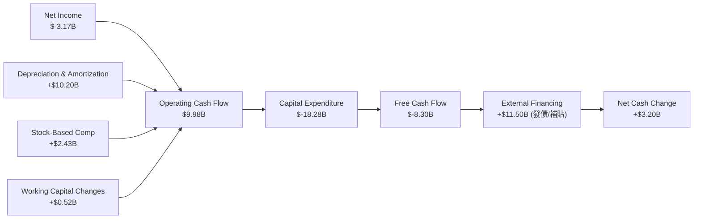

### 5.2 自由現金流趨勢

Intel 的自由現金流（FCF）已連續四年為負值，這是其股價長期承壓、分紅派息被迫歸零（Payout Ratio 降至 0%）的根本原因。

```
╔══════════════════════════════════════════════════════════════════╗
║                Intel 自由現金流趋势 (FY2022-TTM)                 ║
╠══════════════════════════════════════════════════════════════════╣
║                                                                  ║
║  FY2022   $-9.41B  ░░░░░░░░░░░░░░░░░░░░░░░█████  FCF Yield: -1.8%║
║  FY2023  $-14.28B  ░░░░░░░░░░░░░░░░░███████████  FCF Yield: -2.8%║
║  FY2024  $-15.66B  ░░░░░░░░░░░░░░██████████████  FCF Yield: -3.0%║
║  FY2025   $-4.95B  ░░░░░░░░░░░░░░░░░░░░░░██████  FCF Yield: -1.0%║
║  TTM      $-8.30B  ░░░░░░░░░░░░░░░░░░░█████████  FCF Yield: -1.6%║
║                                                                  ║
║  ⚠️ 4年累計失血：-$52.60B                                         ║
╚══════════════════════════════════════════════════════════════════╝
```

### 5.3 資本配置評估

在 2025 財年，Intel 的資本配置呈現極端的「重資本製造、輕股東回報」特徵：

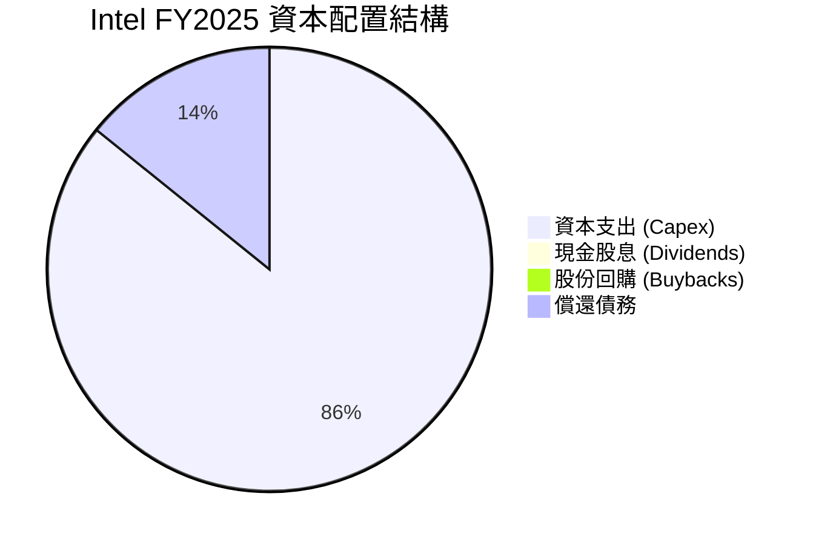

**資本配置點評**：
由於 FCF 持續失血，Intel 在 2025 年已徹底取消了季度分紅（2022 年曾支付 $6.00B 股息，2023 年降至 $3.09B，2024 年進一步降至 $1.60B，2025 年至今為 0）。所有的資源都向建廠（Capex）傾斜。這種「破釜沉舟」的配置方式，意味著公司的命運完全綁定在 18A 製程的商業化成敗上。

---

## 6. 獲利能力與資本效率

### 6.1 ROE / ROA / ROIC 趨勢

Intel 的資本回報率指標在過去幾年急劇惡化，反映出其資產利用效率極低，重資產投入未能轉化為相應的利潤。

| 指標 | FY2022 | FY2023 | FY2024 | FY2025 | TTM | 行業中位數 | 評估 |
|------|--------|--------|--------|--------|-----|------------|------|
| **ROE** | 7.9% | 1.6% | -18.9% | 0.02% | -2.9% | 18.0% | 🔴 股東權益回報率極差 |
| **ROA** | 4.4% | 0.9% | -9.5% | 0.01% | 0.6% | 9.5% | 🔴 資產利用效率低下 |
| **ROIC** | 3.5% | 0.4% | -4.8% | -1.1% | 2.32% | 15.5% | 🔴 投入資本回報率遠低於資金成本 |

### 6.2 ROIC vs WACC 分析（核心價值創造判斷）

對於重資本企業，ROIC 是否大於 WACC 是判斷其是在「創造價值」還是「摧毀價值」的核心指標。

```
╔══════════════════════════════════════════════════════════════════╗
║                ROIC vs WACC 深度分析 (TTM)                      ║
╠══════════════════════════════════════════════════════════════════╣
║                                                                  ║
║  WACC 估算：                                                     ║
║  ├── 無風險利率（10Y美債）：  4.20%                              ║
║  ├── 市場風險溢酬 (ERP)：     5.00%                              ║
║  ├── Beta：                   2.187                              ║
║  ├── 股權成本 (Ke) = 4.2% + 2.187 × 5.0% = 15.14%                ║
║  ├── 債務成本（稅後 Kd）：    4.50%                              ║
║  ├── 資本結構：股權 72%，債務 28%                                ║
║  └── ✅ WACC ≈ 12.30%                                            ║
║                                                                  ║
║  ROIC 估算（TTM）：                                              ║
║  ├── NOPAT = EBIT ($3.71B) × (1 - 21%) ≈ $2.93B                  ║
║  ├── 投入資本 = Equity ($114.28B) + Debt ($45.03B)               ║
║  │              - Cash ($32.79B) ≈ $126.52B                      ║
║  └── ✅ ROIC ≈ 2.32%                                             ║
║                                                                  ║
║  ★ 經濟價值增加（EVA）= ROIC - WACC = -9.98%                     ║
║                                                                  ║
║  ROIC   2.32%  ▓▓░░░░░░░░░░░░░░░░░░░░░░░░░░░░░  🔴              ║
║  WACC  12.30%  ▓▓▓▓▓▓▓▓▓▓▓▓░░░░░░░░░░░░░░░░░░░  ──              ║
║  EVA   -9.98%  ██████████░░░░░░░░░░░░░░░░░░░░░  🔴 價值摧毀中    ║
║                                                                  ║
║  📊 結論：ROIC 遠低於 WACC，每投入 $100 資本即摧毀 $9.98 的價值   ║
╚══════════════════════════════════════════════════════════════════╝
```

### 6.3 杜邦三因素分解

透過杜邦分解，我們可以清晰看到拖累 Intel ROE 的核心癥結：

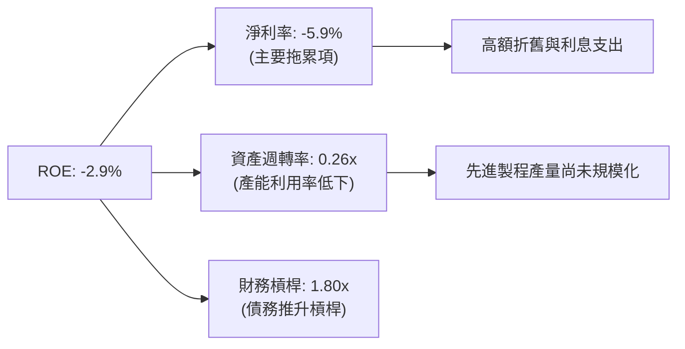

---

## 7. 估值深度分析

### 7.1 同業估值比較表格

在進行同業比較時，必須注意到 Intel 的淨利潤（EPS）目前處於虧損边缘，因此傳統的 Trailing P/E 會失真。我們引入 Forward P/E、EV/EBITDA 以及 P/S 進行多維度評估。

| 估值指標 | **Intel (INTC)** | **AMD (AMD)** | **台積電 (TSM)** | 本公司評估 |
|----------|----------|---------|---------|-----------|
| **Trailing P/E** | N/A | 75.2x | 28.5x | 🔴 盈利能力尚未恢復，無法以歷史 P/E 估值 |
| **Forward P/E** | **63.15x** | 29.8x | 21.4x | 🔴 顯著高於同業，市場已透支極高的成長預期 |
| **P/S Ratio** | **9.59x** | 8.2x | 11.5x | 🟡 略低於台積電，但高於其歷史均值（~3.0x） |
| **EV / EBITDA** | **39.22x** | 32.5x | 13.8x | 🔴 基礎設施折舊沈重，企業價值被高估 |
| **P/B Ratio** | **4.63x** | 4.8x | 7.2x | 🟢 擁有大量重資產硬體，帳面價值具備防禦性 |
| **FCF Yield** | **-1.61%** | +1.8% | +4.2% | 🔴 現金流回報率為負，缺乏安全邊際 |

### 7.2 歷史估值區間分析

當前 Intel 的 Forward P/E 處於 63.15x，這在其歷史估值區間中處於 **Top 5% 的極端高位**（歷史中位數僅為 12.0x - 15.0x）。這表明 2026 年股價從 $20 飆升至 $102 的過程中，**估值擴張（Multiple Expansion）遠快於基本面改善**。

### 7.3 情境目標價（假設驅動，Bear / Base / Bull）

為了使目標價具備嚴密的邏輯可回溯性，我們基於未來 3 年的營收 CAGR、預期營業利潤率及退出倍數（EV/EBITDA）進行情境建模：

| 情境 | 營收 CAGR (3Y) | 預期營業利潤率 (2028) | 退出倍數 (EV/EBITDA) | 隱含目標價 | 相對現價 ($102.62) | 達成機率 |
|------|-----------|-----------|----------|------------|----------|--------|
| 🔴 **悲觀** | 2.0% | 5.0% | 20.0x | **$58.00** | -43.48% | 25% |
| 🟡 **基準** | **7.5%** | **12.0%** | **30.0x** | **$108.62** | **+5.85%** | **55%** |
| 🟢 **樂觀** | 15.0% | 20.0% | 35.0x | **$155.00** | +51.04% | 20% |

> **估值倍數選擇說明**：由於 Intel 淨利受高額 D&A（折舊與攤銷，年均約 $10B）壓抑，P/E 失真。因此，本模型採用 **EV/EBITDA** 作為核心估值倍數，基準情境下給予 30x EV/EBITDA，以反映其作為美國本土稀缺代工廠的戰略溢價。

### 7.4 DCF 敏感性分析（目標價矩陣）

基於永續成長率（PGR）為 2.0% 的假設，對 WACC（資金成本）與營收成長率進行敏感性測試，得出以下目標價矩陣：

| 營收成長情境 | **WACC = 11.3%** | **WACC = 12.3%（基準）** | **WACC = 13.3%** |
|------|--------------|----------------------|--------------|
| 🟢 **樂觀 (CAGR 15.0%)** | **$168.00** (+63.7%) | **$155.00** (+51.0%) | **$142.00** (+38.4%) |
| 🟡 **基準 (CAGR 7.5%)** | **$118.00** (+15.0%) | **$108.62** (+5.8%) | **$96.00** (-6.5%) |
| 🔴 **悲觀 (CAGR 2.0%)** | **$66.00** (-35.7%) | **$58.00** (-43.5%) | **$50.00** (-51.3%) |

### 7.5 估值綜合區間

```
當前股價: $102.62
悲觀目標價: $58.00 ───────────────────┐
基準目標價: $108.62 ───────────────────────────★──┐
樂觀目標價: $155.00 ──────────────────────────────────────────────┐
                                      [   當前股價區間   ]
```

---

## 8. 成長催化劑

### 8.1 催化劑時間軸

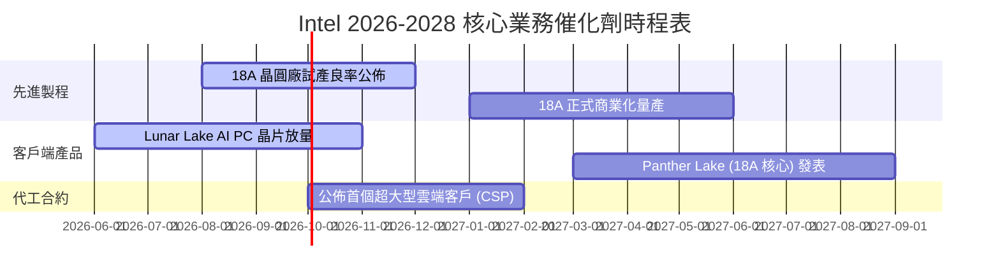

### 8.2 TAM 市場規模分析

Intel 所瞄準的整體可定址市場（TAM）正因 AI 浪潮而重構：

```
╔══════════════════════════════════════════════════════════════════╗
║                  Intel 核心市場 TAM 與滲透率估算                 ║
╠══════════════════════════════════════════════════════════════════╣
║                                                                  ║
║  1. AI PC 晶片市場 (2028年預期)：                                ║
║     ├── 全球 TAM：$45.0B                                        ║
║     ├── Intel 預期份額：65.0%  ████████████████░░░░  🟢 領先      ║
║     └── 預期貢獻收入：$29.2B                                     ║
║                                                                  ║
║  2. 先進晶圓代工 (Non-TSMC, 2028年預期)：                        ║
║     ├── 全球 TAM：$60.0B                                        ║
║     ├── Intel 預期份額：15.0%  ████░░░░░░░░░░░░░░░░  🟡 起步      ║
║     └── 預期貢獻收入：$9.0B                                      ║
║                                                                  ║
║  3. AI 加速器 (Gaudi 生態)：                                     ║
║     ├── 全球 TAM：$120.0B                                       ║
║     ├── Intel 預期份額：3.0%   █░░░░░░░░░░░░░░░░░░░  🔴 邊緣化    ║
║     └── 預期貢獻收入：$3.6B                                      ║
╚══════════════════════════════════════════════════════════════════╝
```

### 8.3 成長驅動力結構圖

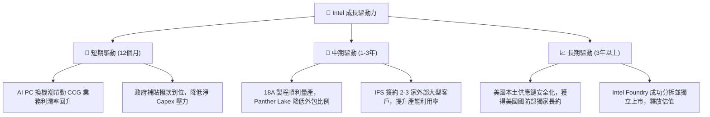

---

## 9. 風險矩陣

### 9.1 風險評分矩陣

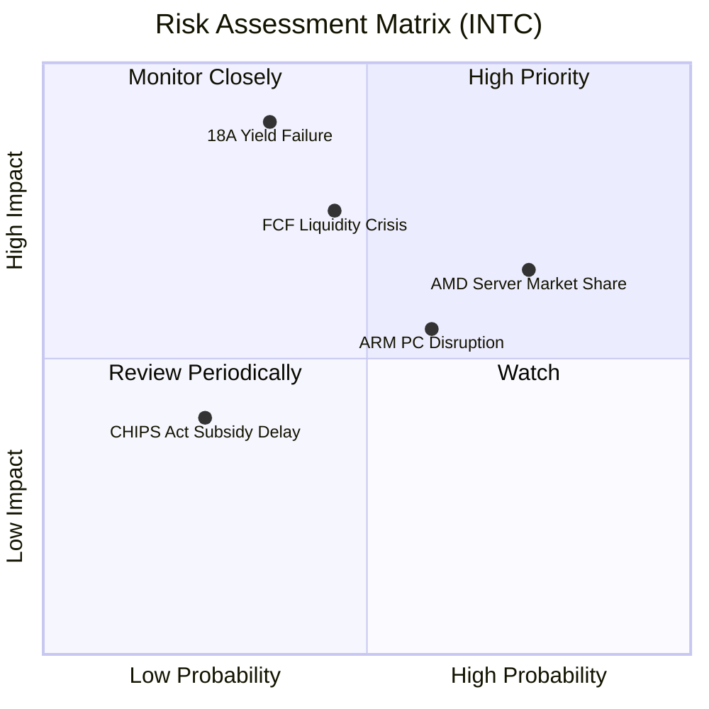

### 9.2 風險清單詳細分析

| # | 風險項目 | 發生機率 | 財務衝擊 | 風險評分 | 緩解措施 |
|---|----------|----------|----------|----------|----------|
| 1 | 🔴 **18A 製程良率不及預期** | 中等 (35%) | 極高 (-20% 營收) | 🔴 8.5 / 10 | 建立備用製程節點，加強與 ASML 在 High-NA EUV 上的合作研發。 |
| 2 | 🔴 **自由現金流持續失血與債務危機** | 中等 (45%) | 高 (信用評級下調) | 🔴 7.8 / 10 | 透過與 Brookfield 等資產管理公司開展聯合基礎設施信託（SCIP），引入外部資金。 |
| 3 | 🟡 **x86 被 ARM 架構快速替代** | 偏高 (60%) | 中等 (-8% 核心利潤) | 🟡 6.5 / 10 | 推出 Lunar Lake 架構，大幅降低功耗，正面迎戰高通 Snapdragon X 平台。 |
| 4 | 🟡 **伺服器市場份額持續流失** | 高 (75%) | 中等 (-5% DCAI 營收) | 🟡 6.0 / 10 | 加快 Granite Rapids 核心出貨，利用超多核心架構反擊 AMD EPYC。 |

---

## 10. 投資建議

### 10.1 最終綜合評級雷達圖

```
基本面強度:  5.0 / 10 ▓▓▓▓▓▓▓▓▓▓░░░░░░░░░░
成長動能:    6.0 / 10 ▓▓▓▓▓▓▓▓▓▓▓▓░░░░░░░░
獲利品質:    3.5 / 10 ▓▓▓▓▓▓▓░░░░░░░░░░░░░
財務健康:    5.5 / 10 ▓▓▓▓▓▓▓▓▓▓▓░░░░░░░░░
估值合理性:  3.0 / 10 ▓▓▓▓▓▓░░░░░░░░░░░░░░
護城河深度:  6.5 / 10 ▓▓▓▓▓▓▓▓▓▓▓▓▓░░░░░░░
--------------------------------------------------
綜合投資評分: 5.4 / 10  評級：🟡 持有 (Hold)
```

### 10.2 目標價與隱含報酬率

| 情境 | 機率權重 | 目標價 | 當前股價 | 隱含報酬率 | 權重預期報酬 |
|------|----------|--------|----------|------------|--------------|
| 🔴 悲觀 | 25% | $58.00 | $102.62 | -43.48% | -10.87% |
| 🟡 **基準** | **55%** | **$108.62** | **$102.62** | **+5.85%** | **+3.22%** |
| 🟢 樂觀 | 20% | $155.00 | $102.62 | +51.04% | +10.21% |
| **加權綜合目標價** | **100%** | **$105.25** | **$102.62** | **+2.56%** | **建議：觀望** |

### 10.3 買入時機與觸發因素

```
╔══════════════════════════════════════════════════════════════════╗
║                  ✅ 買入與賣出觸發因素 Checklist                ║
╠══════════════════════════════════════════════════════════════════╣
║                                                                  ║
║  立即買入觸發條件（需滿足 2 項以上）：                           ║
║  ☐ 18A 商業化良率確認突破 65%，且獲得 NVIDIA 或 Apple 代工訂單   ║
║  ☐ 季度自由現金流（FCF）轉正，且淨債務規模開始縮減               ║
║  ☐ 股價回檔至 $75.00 以下（對應 Forward P/E ~45x），提供安全邊際 ║
║                                                                  ║
║  加碼觸發條件：                                                  ║
║  ☐ Intel Foundry 宣佈成功分拆並引入戰略投資人（如 ASML 或台積電）║
║                                                                  ║
║  減碼/停損觸發條件（出現任一立即執行）：                         ║
║  ☐ 18A 量產時間表宣佈延遲至 2027 年底以後                         ║
║  ☐ 季度 OCF 跌破 $1.0B，或總現金儲備低於 $20B                    ║
║  ☐ x86 PC 市佔率單季流失超過 3.0 個百分點                         ║
╚══════════════════════════════════════════════════════════════════╝
```

### 10.4 投資人適配度分析

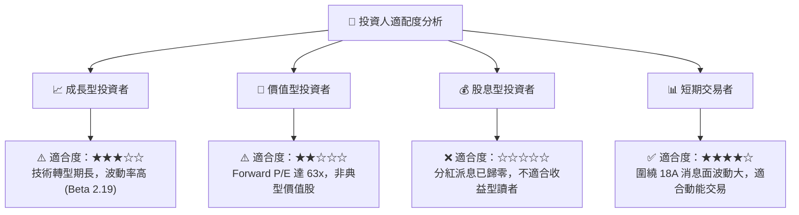

### 10.5 每季財報監控清單（Quarterly Watch List）

為了持續追蹤 Intel 的基本面轉型進度，投資人應在每季財報中重點監控以下指標：

1.  **Intel Foundry (IFS) 營運虧損幅度**：IFS 部門目前是利潤的「無底洞」，需監控其營運利潤率何時從目前的負值向 -10% 乃至平衡點收斂。
2.  **資本開支（Capex）與補貼入帳進度**：確認美國《晶片法案》資金撥款是否按期入帳，以緩解現金流失。
3.  **PC 晶片平均售價（ASP）與出貨量**：Lunar Lake 及 Panther Lake 能否有效抵禦高通與 AMD，維持 CCG 部門的毛利率在 40% 以上。
4.  **研發費用（R&D）佔比**：研發費用不應持續大幅萎縮，否則將危及 18A 之後（如 14A 製程）的技術研發。

### 10.6 反面論證：什麼會證明論點錯誤（What Would Change My Mind）

```
╔══════════════════════════════════════════════════════════════════╗
║              ⚠️ 論點失效條件（Disconfirming Evidence）           ║
╠══════════════════════════════════════════════════════════════════╣
║  本投資報告的「持有」評級在下列情況成立時應調整為「強力賣出」：  ║
║  ☐ 18A 首批測試晶片（Tape-out）出現重大設計瑕疵，需重新流片      ║
║  ☐ 自由現金流連續兩季低於 -$3.0B，迫使公司發行高息債券融資       ║
║  ☐ 客戶端運算（CCG）部門營收 YoY 增速轉負，顯示 AI PC 證偽       ║
║  ☐ 核心研發人員（如資深製程副總裁）出現集體離職潮                ║
║  ☐ 股價維持在 $100 以上，但 Forward P/E 進一步膨脹至 80x 以上    ║
╚══════════════════════════════════════════════════════════════════╝
```

---

> **免責聲明**：本報告為基於 2026-07-22 即時財務數據之學術與投資研究分析，僅供參考，不構成任何具體之投資買賣建議。半導體產業具備高資本、高波動特徵，投資人應審慎評估個人風險承受度。