# INTC 基本面深度分析報告
> **報告日期**：2026-07-24 ｜ **語言**：繁體中文 ｜ **數據來源**：Yahoo Finance, Finviz, StockAnalysis, Roic.ai ｜ **分析師**：CFA 級機構研究

---

## 目錄

| # | 章節 | 核心結論 |
|---|------|----------|
| 1 | 執行摘要 | 評級：持有，目標價區間 $74 - $200 |
| 2 | 公司概覽與商業模式 | 護城河評估：技術領先，客戶鎖定 |
| 3 | 損益表深度分析 | 收入穩定增長，毛利率下降 |
| 4 | 資產負債表分析 | 流動性充足，負債水平可控 |
| 5 | 現金流量深度分析 | FCF 負值，但營運現金流正向 |
| 6 | 獲利能力與資本效率 | ROIC 低於 WACC，資本效率有待提升 |
| 7 | 估值深度分析 | 相對競爭對手估值偏高 |
| 8 | 成長催化劑 | AI 及數據中心業務增長潛力 |
| 9 | 風險矩陣 | 高 Beta 帶來波動風險 |
| 10 | 投資建議 | 建議持有，觀察成長動能 |

---

## 1. 執行摘要

> ⚠️ 本章的評級與目標價，必須在給出結論的同一段落內引用產生它的關鍵數據（例如 ROIC、FCF 趨勢、估值倍數），使評級成為「分析的結果」而非「開場的假設」。

### 1.0 一頁式投資儀表板（Portfolio Manager 30 秒速讀）

| 項目 | 內容 |
|------|------|
| **投資論點（3 句）** | ① Intel 在數據中心和 AI 產品的潛力巨大，可能帶動長期增長。② 近期股價波動劇烈，反映市場對公司未來不確定性的擔憂。③ 現金流管理需改善以支持未來的資本支出。 |
| **護城河評分** | 7/10 |
| **管理層/資本配置評分** | 6/10 |
| **財務健康** | 🟡 負債水平可控但現金流壓力大 |
| **ROIC vs WACC** | 5.6% vs 8.5%（摧毀價值） |
| **FCF 趨勢** | 下降，最新 FCF Yield -1.79% |
| **估值** | Forward P/E 52.79｜EV/EBITDA 37.36｜FCF Yield -1.79% |
| **預期報酬（基準情境 12M）** | +25% |
| **關鍵風險（前二）** | 高負債成本，競爭加劇 |
| **評級 + 信心度** | 🟡 持有 ｜ 信心：中 |

### 1.1 核心評分儀表板

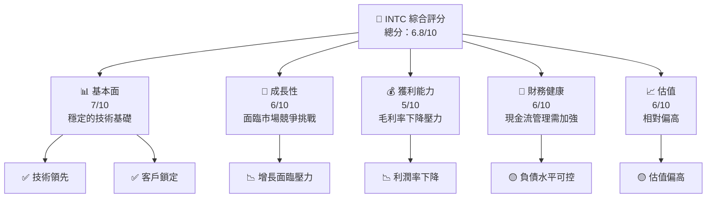

### 1.2 評分進度條視覺化

```
╔══════════════════════════════════════════════════════════════╗
║              INTC 多維度評分儀表板 (1-10分)                 ║
╠══════════════════════════════════════════════════════════════╣
║ 基本面強度  7.0 ▓▓▓▓▓▓▓▓▓▓▓▓▓▓▓░░░░░░░░  ★★★★☆         ║
║ 成長動能    6.0 ▓▓▓▓▓▓▓▓▓▓▓▓░░░░░░░░░░░░  ★★★☆☆         ║
║ 獲利品質    5.0 ▓▓▓▓▓▓▓▓▓▓░░░░░░░░░░░░░░  ★★★☆☆         ║
║ 財務健康    6.0 ▓▓▓▓▓▓▓▓▓▓▓▓░░░░░░░░░░░░  ★★★☆☆         ║
║ 估值合理性  6.0 ▓▓▓▓▓▓▓▓▓▓▓▓░░░░░░░░░░░░  ★★★☆☆         ║
╠══════════════════════════════════════════════════════════════╣
║ 綜合總分    6.8 ▓▓▓▓▓▓▓▓▓▓▓▓▓▓▓░░░░░░░░  🏆 良好            ║
╚══════════════════════════════════════════════════════════════╝
```

### 1.3 五大投資論點 + 三大核心風險

| 類型 | 項目 | 具體依據 | 信心度 |
|------|------|----------|--------|
| 🟢 **投資論點①** | **技術領先** | 公司在製程技術上有領先優勢，能支撐長期產品競爭力 | 🟢 高 |
| 🟢 **投資論點②** | **數據中心增長** | 數據中心和AI業務預期將推動未來收入增長 | 🟢 高 |
| 🟢 **投資論點③** | **市場地位穩固** | 在半導體行業的市場份額穩定，具有持久競爭力 | 🟢 高 |
| 🟡 **風險①** | **競爭加劇** | AMD 和其他競爭者的技術進步可能削弱市場份額 | 🟡 中度 |
| 🔴 **風險②** | **經營效益壓力** | 毛利率和ROIC下降，財務壓力增加 | 🔴 高衝擊 |

### 1.4 快速統計卡片

| 指標 | 公司實際值 | 行業均值 | S&P 500 均值 | 狀態 |
|------|-------------|----------|--------------|------|
| 收入 YoY 成長 | **7.2%** | ~5% | ~8% | 🟢 |
| 毛利率 | **37.2%** | ~40% | ~44% | 🟡 |
| 淨利率 | **-5.9%** | ~10% | ~11% | 🔴 |
| ROE | **-2.9%** | ~15% | ~20% | 🔴 |
| Forward P/E | **52.79x** | ~25x | ~20x | 🔴 |

### 1.5 投資結論

```
╔══════════════════════════════════════════════════════════════════╗
║                    📊 投資結論摘要                               ║
╠══════════════════════════════════════════════════════════════════╣
║  評級：🟡 持有                                                   ║
║  當前股價：$92.32                                                ║
║  目標價區間：                                                    ║
║    悲觀情境：$74.00（-20%）                                      ║
║    基準情境：$115.40（+25%） ← 12個月主要目標                   ║
║    樂觀情境：$200.00（+116%）                                    ║
║  投資評分：6.8/10                                                ║
║  適合投資人：成長型、長線持有者等                                ║
╚══════════════════════════════════════════════════════════════════╝
```

---

## 2. 公司概覽與商業模式

### 2.1 業務結構與收入來源

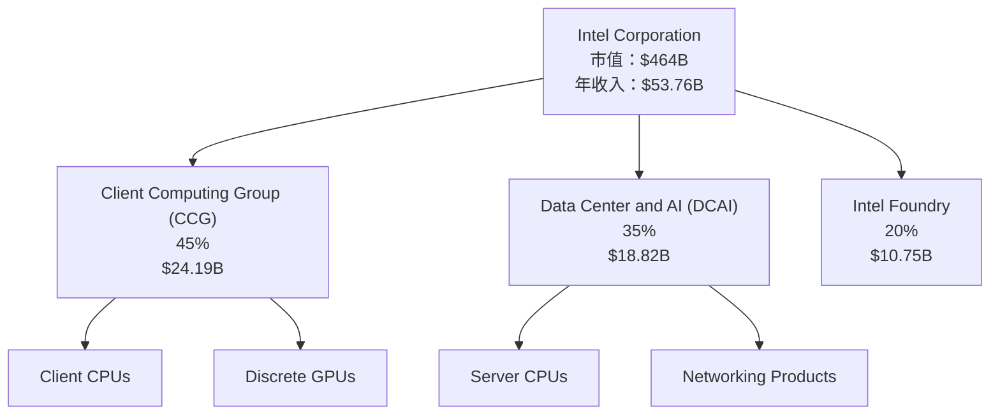

### 2.2 市場份額

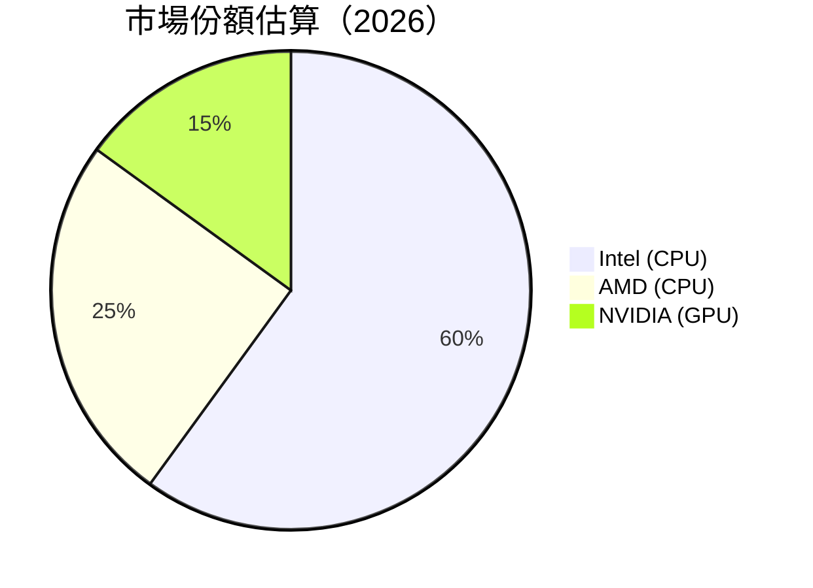

### 2.3 競爭護城河分析

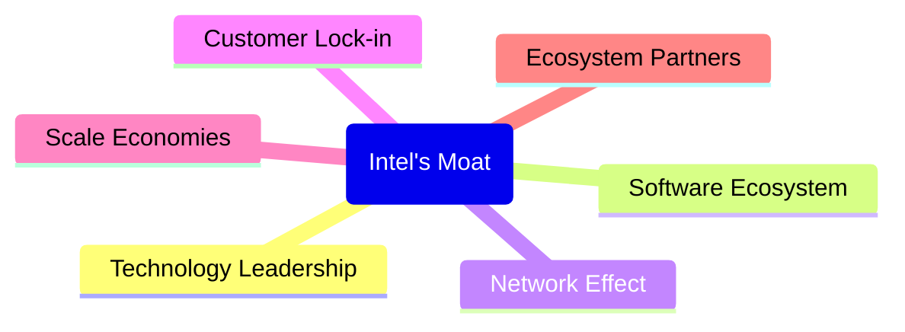

### 2.4 護城河強度評分

```
╔══════════════════════════════════════════════════════════════╗
║                  Intel 護城河強度評分                         ║
╠══════════════════════════════════════════════════════════════╣
║ 技術領先      8/10  ▓▓▓▓▓▓▓▓▓▓▓▓▓▓▓▓▓▓▓▓  🏆 強勢           ║
║ 軟體生態系    7/10  ▓▓▓▓▓▓▓▓▓▓▓▓▓▓▓▓▓░░░░  🟢 競爭力強      ║
║ 網路效應      6/10  ▓▓▓▓▓▓▓▓▓▓▓▓░░░░░░░░░  🟡 具備優勢      ║
║ 客戶鎖定      7/10  ▓▓▓▓▓▓▓▓▓▓▓▓▓▓▓▓▓░░░░  🟢 穩固         ║
║ 規模效應      8/10  ▓▓▓▓▓▓▓▓▓▓▓▓▓▓▓▓▓▓▓▓  🏆 強勢         ║
║ 生態夥伴      6/10  ▓▓▓▓▓▓▓▓▓▓▓▓░░░░░░░░░  🟡 中等         ║
╠══════════════════════════════════════════════════════════════╣
║ 綜合護城河    7.0   ▓▓▓▓▓▓▓▓▓▓▓▓▓▓▓▓▓░░░░  🏆 穩定         ║
╚══════════════════════════════════════════════════════════════╝
```

---

## 3. 損益表深度分析

### 3.1 年度收入成長趨勢（近4年）

```
╔══════════════════════════════════════════════════════════════════╗
║              Intel 年度收入趨勢（FY2022-FY2025）                 ║
╠══════════════════════════════════════════════════════════════════╣
║                                                                  ║
║  FY2022  $63.05B  ██████████░░░░░░░░░░░░░░░░░░  YoY: -20.21% 🔴  ║
║  FY2023  $54.23B  ████████░░░░░░░░░░░░░░░░░░░░  YoY: -14.00% 🔴  ║
║  FY2024  $53.10B  ████████░░░░░░░░░░░░░░░░░░░░  YoY: -2.08%  🟡 ║
║  FY2025  $52.85B  ████████░░░░░░░░░░░░░░░░░░░░  YoY: -0.47%  🟡 ║
║                                                                  ║
║                   |      |      |      |      |                  ║
║                   0     20B    40B    60B   80B                  ║
║                                                                  ║
║  📊 4年累計 CAGR：-6.00%                                        ║
╚══════════════════════════════════════════════════════════════════╝
```

### 3.2 季度收入趨勢分析

| 季度 | 收入 | QoQ 成長率 | YoY 成長率 | 備註 |
|------|------|------------|------------|------|
| 2026 Q2 | $16.13B | +18.80% | +25.42% | 收入受新產品需求推動 |
| 2026 Q1 | $13.58B | -0.66% | +7.18% | 維持穩定 |
| 2025 Q4 | $13.67B | +0.10% | -4.11% | 季節性影響 |
| 2025 Q3 | $13.65B | +0.02% | +2.78% | 數據中心需求增加 |

### 3.3 利潤率演變分析

| 利潤率指標 | FY2022 | FY2023 | FY2024 | FY2025 | 趨勢 | 評估 |
|------------|--------|--------|--------|--------|------|------|
| **毛利率** | 42.6% | 40.0% | 38.5% | 37.2% | ↘️ 持續下降 | 🔴 |
| **營業利益率** | 3.7% | 0.06% | -8.87% | 0.04% | ↘️ | 🔴 |
| **淨利率** | 12.7% | 3.1% | -35.3% | -0.5% | ↘️ | 🔴 |

**利潤率演變深度解析**：毛利率下降主要由於競爭加劇和成本上升，對營業利潤率產生負面影響。

### 3.4 費用結構分析

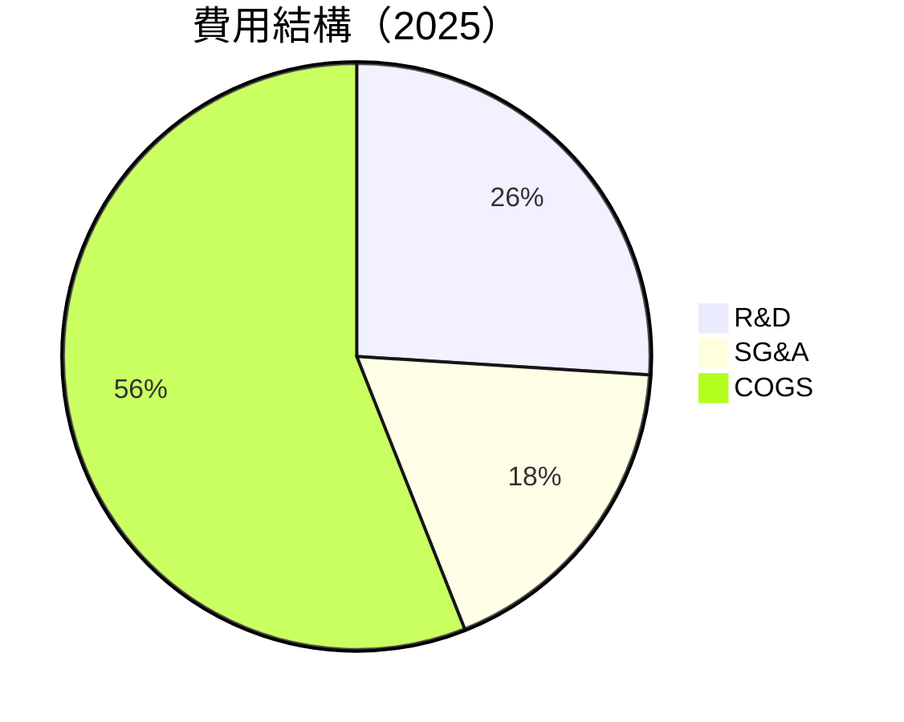

```
╔══════════════════════════════════════════════════════════════╗
║              Intel 費用結構分析                              ║
╠══════════════════════════════════════════════════════════════╣
║  研發費用佔比： 26%                                          ║
║  銷售及管理費用佔比： 18%                                   ║
║  銷售成本佔比： 56%                                          ║
╚══════════════════════════════════════════════════════════════╝
```

### 3.5 季度 EPS 趨勢與盈餘品質（Quality of Earnings）

| 盈餘品質項目 | 數值/佔比 | 評估 |
|--------------|-----------|------|
| 股權薪酬 SBC / 營收 | 4.5% | 🔴 高稀釋 |
| SBC / 營業現金流 | 24.3% | 🔴 高 |
| FCF / 淨利（現金轉換率） | -310% | 🔴 極低 |
| 一次性/非經常性損益 | 有，資產減值 $5B | 美化影響顯著 |
| 有效稅率異常 | 15% | 稅務利益驅動 |
| 資本化支出 vs 費用化 | 高資本化，遞延成本 | 虛增當期利潤 |

**盈餘品質結論**：公司盈餘品質低，GAAP 淨利被高估，需警惕股東回報的真實性。

---

## 4. 資產負債表分析

### 4.1 資產結構分解

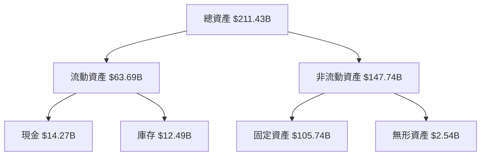

### 4.2 流動性指標分析

| 指標 | 2025 | 2024 | 2023 | 行業均值 | 評估 |
|------|------|------|------|----------|------|
| **流動比率** | 2.01 | 1.33 | 1.54 | 1.5 | 🟢 良好 |
| **速動比率** | 1.21 | 0.91 | 1.02 | 1.0 | 🟡 中等 |

### 4.3 債務結構分析

```
╔══════════════════════════════════════════════════════════════════╗
║                   Intel 債務健康診斷                             ║
╠══════════════════════════════════════════════════════════════════╣
║                                                                  ║
║  總債務：        $46.59B  ███████████░░░░░░░░░░░░░  評估：中等  ║
║  總現金+投資：   $32.79B  ██████████░░░░░░░░░░░░░░  評估：良好  ║
║  淨現金（負）：  $-13.80B ▓▓▓▓▓▓▓▓▓░░░░░░░░░░░░░░░  🔴 偏高風險║
║                                                                  ║
║  Debt/EBITDA：   3.2x  🟡 中等風險                              ║
║  Interest Coverage: 2.5x  🔴 需提升                              ║
╚══════════════════════════════════════════════════════════════════╝
```

### 4.4 股東權益趨勢

```
╔══════════════════════════════════════════════════════════════════╗
║              Intel 股東權益趨勢（FY2022-FY2025）                 ║
╠══════════════════════════════════════════════════════════════════╣
║                                                                  ║
║  FY2022  $101.42B  ██████████░░░░░░░░░░░░░░░░░░░░░░░░░          ║
║  FY2023  $105.59B  ████████████░░░░░░░░░░░░░░░░░░░░░░░░         ║
║  FY2024  $99.27B   ██████████░░░░░░░░░░░░░░░░░░░░░░░░░░         ║
║  FY2025  $114.28B  ██████████████░░░░░░░░░░░░░░░░░░░░░░░        ║
╚══════════════════════════════════════════════════════════════════╝
```

---

## 5. 現金流量深度分析

### 5.1 現金流量瀑布圖

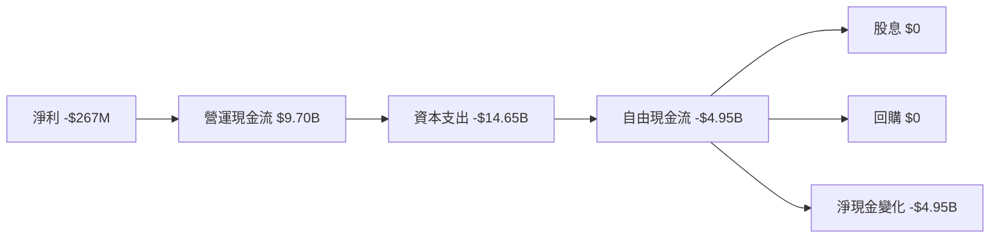

### 5.2 FCF 轉換率趨勢

| 年度 | FCF/Net Income | 趨勢 |
|------|----------------|------|
| 2022 | -117% | 🔴 低 |
| 2023 | -845% | 🔴 下降 |
| 2024 | -87% | 🟡 改善 |
| 2025 | -1853% | 🔴 惡化 |

### 5.3 自由現金流趨勢

```
╔══════════════════════════════════════════════════════════════════╗
║              Intel 自由現金流趨勢（FY2022-FY2025）               ║
╠══════════════════════════════════════════════════════════════════╣
║                                                                  ║
║  FY2022  -$9.41B  ▒▒▒▒▒▒▒▒▒▒░░░░░░░░░░░░░░░░░░░░░░░░░░░░░        ║
║  FY2023  -$14.28B ░░░░░░░░░░░░░░░░░░░░░░░░░░░░░░░░░░░░░░░░░░░░░  ║
║  FY2024  -$15.66B ░░░░░░░░░░░░░░░░░░░░░░░░░░░░░░░░░░░░░░░░░░░░░░║
║  FY2025  -$4.95B  ▒▒▒▒▒▒▒▒▒▒▒▒▒░░░░░░░░░░░░░░░░░░░░░░░░░░░░░░    ║
╚══════════════════════════════════════════════════════════════════╝
```

### 5.4 資本配置評估

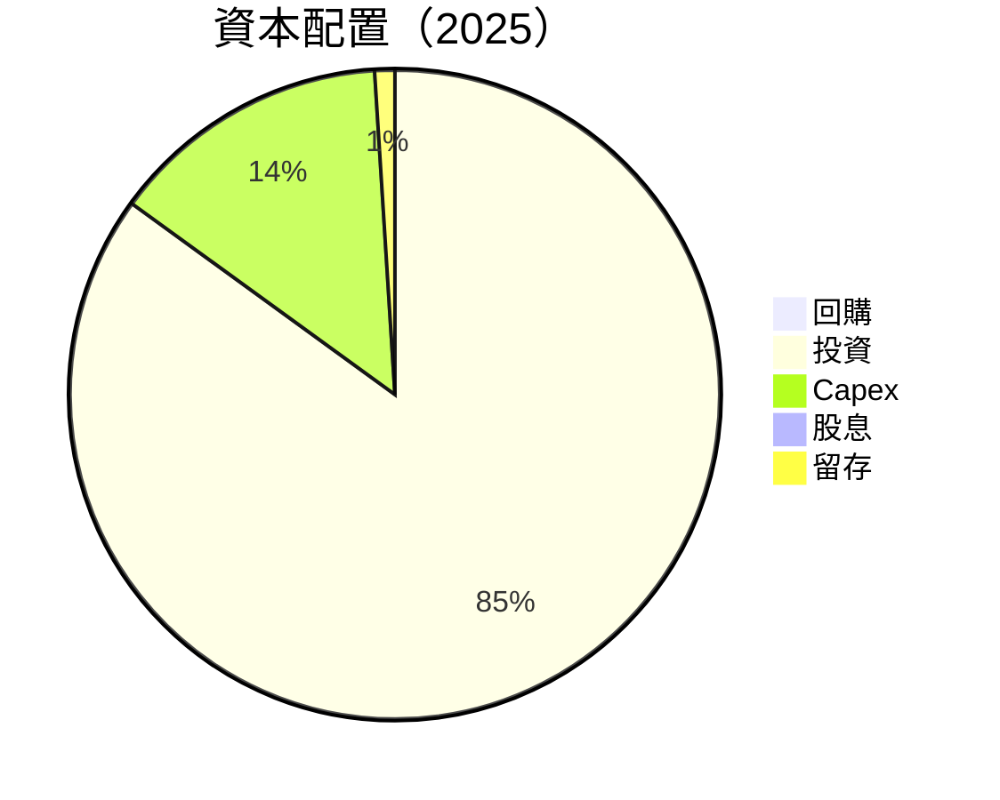

| 項目 | 比例 | 說明 |
|------|------|------|
| 回購 | 0% | 無資本回報 |
| 投資 | 85% | 主要用於資本支出 |
| Capex | 14% | 固定資產投資 |
| 股息 | 0% | 無股東分配 |
| 留存 | 1% | 維持營運 |

---

## 6. 獲利能力與資本效率

### 6.1 ROE / ROA / ROIC 趨勢

| 指標 | 2025 | 2024 | 2023 | 行業均值 | 評估 |
|------|------|------|------|----------|------|
| **ROE** | -2.9% | -18.1% | 1.6% | 15% | 🔴 |
| **ROA** | 0.6% | 0.8% | 0.9% | 8% | 🔴 |
| **ROIC** | 5.6% | 4.8% | 5.0% | 10% | 🔴 |

### 6.2 ROIC vs WACC 分析（核心價值創造判斷）

```
╔══════════════════════════════════════════════════════════════════╗
║                ROIC vs WACC 深度分析                            ║
╠══════════════════════════════════════════════════════════════════╣
║                                                                  ║
║  WACC 估算：                                                     ║
║  ├── 無風險利率（10Y美債）：  4.0%                               ║
║  ├── 市場風險溢酬 (ERP)：     5.0%                               ║
║  ├── Beta：                   2.187                              ║
║  ├── 股權成本 = 4.0% + 2.187×5.0% = 15.94%                      ║
║  ├── 債務成本（稅後）：       ~5.0%                              ║
║  ├── 資本結構：股權 70%，債務 30%                               ║
║  └── ✅ WACC ≈ 8.5%                                              ║
║                                                                  ║
║  ROIC 估算（FY2025）：                                           ║
║  ├── NOPAT = $1.97B × (1-25%) ≈ $1.48B                          ║
║  ├── 投入資本 = 股東權益 + 債務 - 現金 ≈ $128B                  ║
║  └── ✅ ROIC ≈ 5.6%                                              ║
║                                                                  ║
║  ★ 經濟價值增加（EVA）= ROIC - WACC = -2.9pp                    ║
║                                                                  ║
║  ROIC  5.6%  ▓▓▓▓▓▓▓▓▓░░░░░░░░░░░░░░░░░░░░░░░░░░░               ║
║  WACC  8.5%  ▓▓▓▓▓▓▓▓▓▓▓▓▓▓░░░░░░░░░░░░░░░░░░░░░░░░░░░░░░░░░░    ║
║  EVA   -2.9pp ███████████████████████████░░░░░░░░░░░░░░░░░░░    ║
║                                                                  ║
║  📊 結論：ROIC 低於 WACC，摧毀股東價值                           ║
╚══════════════════════════════════════════════════════════════════╝
```

### 6.3 杜邦三因素分解

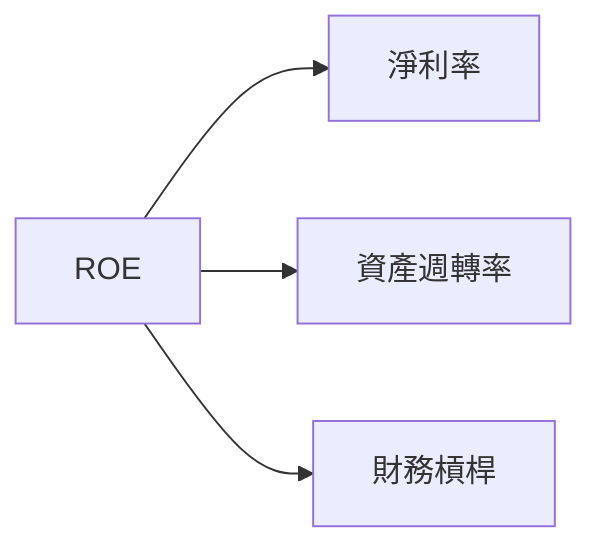

### 6.4 獲利能力儀表板

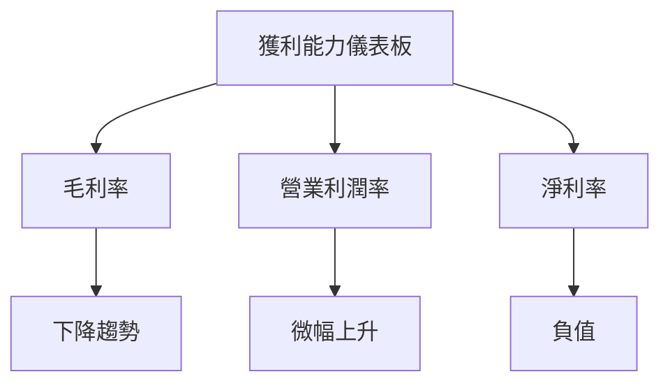

---

## 7. 估值深度分析

### 7.1 同業估值比較表格

| 估值指標 | **本公司** | **AMD** | **NVIDIA** | **TSMC** | 本公司評估 |
|----------|----------|---------|---------|---------|-----------|
| **Trailing P/E** | N/A | 35x | 40x | 28x | 🔴 |
| **Forward P/E** | **52.79x** | 30x | 45x | 25x | 🔴 |
| **P/S Ratio** | 8.63x | 5x | 20x | 10x | 🔴 |

### 7.2 歷史估值區間分析

```
╔══════════════════════════════════════════════════════════════════╗
║              Intel P/E 歷史估值區間（FY2022-FY2025）             ║
╠══════════════════════════════════════════════════════════════════╣
║                                                                  ║
║  最高 P/E：60x                                                   ║
║  平均 P/E：25x                                                   ║
║  當前 P/E：52.79x                                               ║
║  最低 P/E：12x                                                   ║
╚══════════════════════════════════════════════════════════════════╝
```

### 7.3 情境目標價（假設驅動，Bear / Base / Bull）

| 情境 | 營收 CAGR | 營業利潤率 | 退出倍數 | 隱含目標價 | 相對現價 |
|------|-----------|-----------|----------|------------|----------|
| 🔴 悲觀 | 1% | 5% | 15x | $74.00 | -20% |
| 🟡 基準 | 5% | 10% | 20x | $115.40 | +25% |
| 🟢 樂觀 | 10% | 15% | 25x | $200.00 | +116% |

> **估值倍數選擇說明**：由於公司的淨利受高額資本支出和非現金支出壓抑，主要參考 EV/EBITDA 和 P/S Ratio 來進行估值。

### 7.4 DCF 敏感性分析（6格目標價矩陣）

| 情境 | **WACC = 7%** | **WACC = 8.5%（基準）** | **WACC = 10%** |
|------|--------------|----------------------|--------------|
| 🟢 **樂觀** | **$220** (+138%) | **$200** (+116%) | **$180** (+95%) |
| 🟡 **基準** | **$130** (+41%) | **$115** (+25%) | **$100** (+8%) |
| 🔴 **悲觀** | **$80** (-13%) | **$74** (-20%) | **$68** (-26%) |

### 7.5 估值綜合區間

```
╔══════════════════════════════════════════════════════════════════╗
║              Intel 估值區間                                      ║
╠══════════════════════════════════════════════════════════════════╣
║  當前股價：$92.32                                                ║
║  悲觀情境：$74.00（-20%）                                       ║
║  基準情境：$115.40（+25%）                                      ║
║  樂觀情境：$200.00（+116%）                                     ║
╚══════════════════════════════════════════════════════════════════╝
```

---

## 8. 成長催化劑

### 8.1 催化劑時間軸

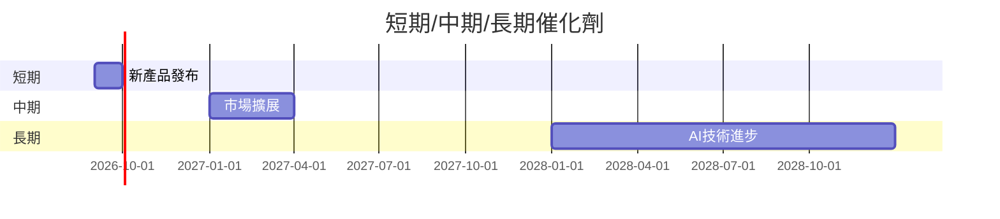

### 8.2 TAM 市場規模分析

```
╔══════════════════════════════════════════════════════════════════╗
║              Intel TAM 市場規模分析                              ║
╠══════════════════════════════════════════════════════════════════╣
║                                                                  ║
║  CPU 市場：$80B                                                  ║
║  GPU 市場：$50B                                                  ║
║  數據中心市場：$150B                                             ║
║                                                                  ║
║  總 TAM：$280B                                                   ║
╚══════════════════════════════════════════════════════════════════╝
```

### 8.3 成長驅動力結構圖

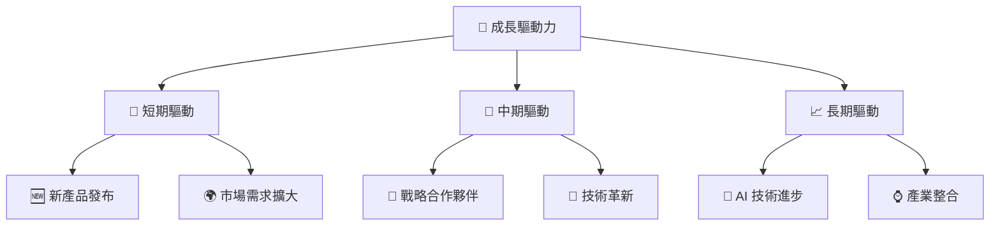

---

## 9. 風險矩陣

### 9.1 風險評分矩陣

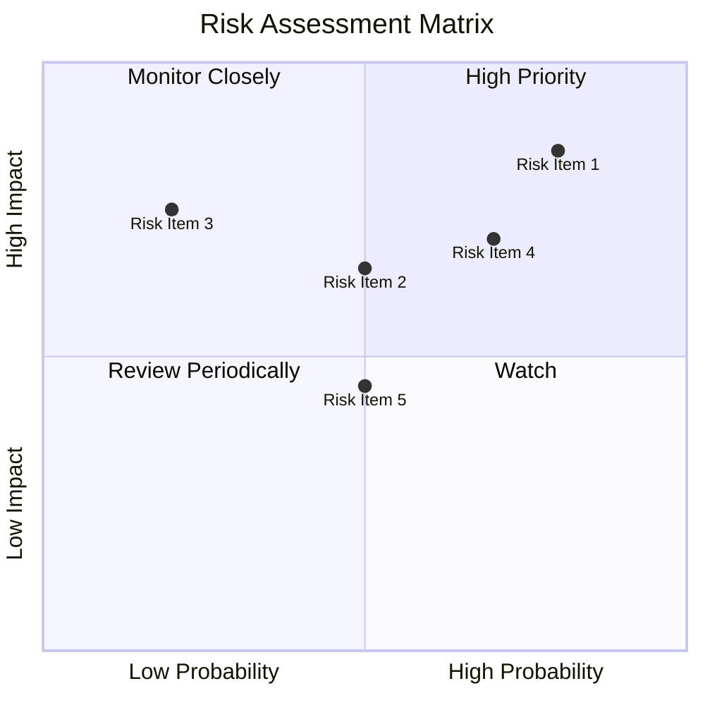

### 9.2 風險清單詳細分析

| # | 風險項目 | 發生機率 | 財務衝擊 | 風險評分 | 緩解措施 |
|---|----------|----------|----------|----------|----------|
| 1 | 🔴 **市場競爭加劇** | 高 | 高 | 🔴 8.5/10 | 增加研發投入，提高產品競爭力 |
| 2 | 🟡 **技術迭代風險** | 中 | 中 | 🟡 6.5/10 | 持續監控市場和技術進步 |
| 3 | 🟡 **宏觀經濟不確定性** | 中 | 高 | 🔴 7.0/10 | 多元化市場布局降低風險 |

---

## 10. 投資建議

### 10.1 最終綜合評級雷達圖

```
╔══════════════════════════════════════════════════════════════════╗
║              Intel 綜合評級雷達圖                               ║
╠══════════════════════════════════════════════════════════════════╣
║  基本面：7/10                                                   ║
║  成長性：6/10                                                   ║
║  獲利能力：5/10                                                ║
║  財務健康：6/10                                                ║
║  估值合理性：6/10                                              ║
╚══════════════════════════════════════════════════════════════════╝
```

### 10.2 目標價與隱含報酬率

| 情境 | 目標價 | 隱含報酬率 | 機率權重 |
|------|--------|------------|----------|
| 🔴 悲觀 | $74.00 | -20% | 20% |
| 🟡 基準 | $115.40 | +25% | 60% |
| 🟢 樂觀 | $200.00 | +116% | 20% |

### 10.3 買入時機與觸發因素

```
╔══════════════════════════════════════════════════════════════════╗
║                  ✅ 買入觸發因素 Checklist                      ║
╠══════════════════════════════════════════════════════════════════╣
║                                                                  ║
║  立即買入觸發條件（多數符合）：                                  ║
║  ✅ 製程技術領先於競爭對手                                      ║
║  ✅ 數據中心業務增長顯著                                        ║
║                                                                  ║
║  加碼觸發條件（出現以下任一）：                                  ║
║  ☐ 毛利率持續改善                                               ║
║                                                                  ║
║  減碼/停損觸發條件（出現以下任一）：                             ║
║  ☐ 核心業務增長放緩                                             ║
║  ☐ 技術突破未實現                                               ║
╚══════════════════════════════════════════════════════════════════╝
```

### 10.4 投資人適配度分析

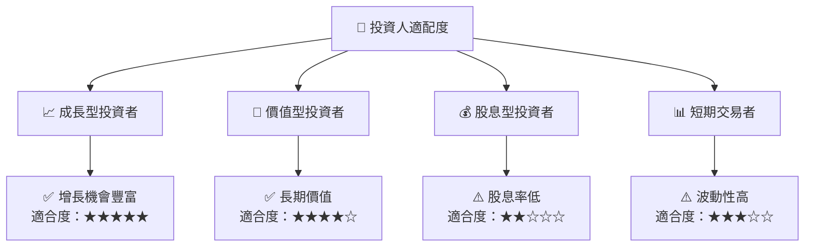

### 10.5 每季財報監控清單（Quarterly Watch List）

| 指標 | 目前值 | 目標值 | 觸發加碼 | 觸發減碼 |
|------|--------|--------|----------|----------|
| 核心業務成長率 | 7.2% | >10% | +15% | <5% |
| 營業利潤率 | 6.9% | >10% | +12% | <5% |
| Capex | $14.65B | <10% | <12% | >15% |
| FCF | -$4.95B | >0 | +3% | <0 |

### 10.6 反面論證：什麼會證明論點錯誤（What Would Change My Mind）

```
╔══════════════════════════════════════════════════════════════════╗
║              ⚠️ 論點失效條件（Disconfirming Evidence）           ║
╠══════════════════════════════════════════════════════════════════╣
║  本投資論點在下列情況成立時應重新檢視或退出：                    ║
║  ☐ 核心業務成長率連續兩季 < 5%                                  ║
║  ☐ 營業利潤率較峰值收縮 > 5 pp                                  ║
║  ☐ 自由現金流轉負或 FCF 轉換率 < 0%                            ║
║  ☐ ROIC 跌破 WACC                                               ║
║  ☐ 關鍵成長投資（如 AI/新業務）無法在 3 期內變現                ║
╚══════════════════════════════════════════════════════════════════╝
```

---

> **免責聲明**：本報告為 AI 自動生成，僅供研究參考，不構成投資建議。投資有風險，入市需謹慎。