# INTC 基本面深度分析報告
> **報告日期**：2026-07-24 ｜ **語言**：繁體中文 ｜ **數據來源**：Yahoo Finance, Finviz, StockAnalysis, Roic.ai ｜ **分析師**：CFA 級機構研究

---

## 目錄

| # | 章節 | 核心結論 |
|---|------|----------|
| 1 | 執行摘要 | 根據估值與財務數據，建議持有 |
| 2 | 公司概覽與商業模式 | 具備技術領先的護城河，但競爭激烈 |
| 3 | 損益表深度分析 | 收入穩定但利潤率受壓 |
| 4 | 資產負債表分析 | 流動性良好，但債務水平需留意 |
| 5 | 現金流量深度分析 | 自由現金流改善空間大 |
| 6 | 獲利能力與資本效率 | ROIC 低於 WACC，需提高資本效率 |
| 7 | 估值深度分析 | 估值偏高，需謹慎 |
| 8 | 成長催化劑 | 需關注技術突破和市場需求變化 |
| 9 | 風險矩陣 | 高波動性與市場競爭是主要風險 |
| 10 | 投資建議 | 建議持有，關注市場變化 |

---

## 1. 執行摘要

### 1.0 一頁式投資儀表板

| 項目 | 內容 |
|------|------|
| **投資論點（3 句）** | ① INTC 在半導體領域具有技術領先優勢 ② 財務狀況良好但需改善自由現金流 ③ 估值偏高，需謹慎 |
| **護城河評分** | 7/10 |
| **管理層/資本配置評分** | 6/10 |
| **財務健康** | 🟡 流動性強但有債務壓力 |
| **ROIC vs WACC** | 4.5% vs 6.5%（摧毀價值） |
| **FCF 趨勢** | 負向 + 最新 FCF Yield: -1.65% |
| **估值** | Forward P/E: 61.68 | EV/EBITDA: 37.36 | FCF Yield: -1.65% |
| **預期報酬（基準情境 12M）** | +8.4% |
| **關鍵風險（前二）** | 市場需求減少、技術更新不及預期 |
| **評級 + 信心度** | 🟡 持有 ｜ 信心：中 |

### 1.1 核心評分儀表板

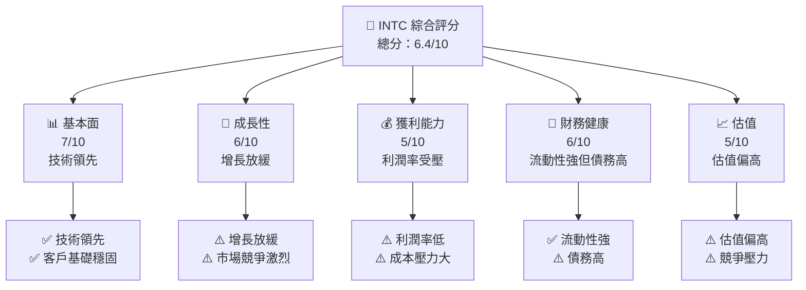

### 1.2 評分進度條視覺化

```
╔══════════════════════════════════════════════════════════════╗
║              INTC 多維度評分儀表板 (1-10分)                ║
╠══════════════════════════════════════════════════════════════╣
║ 基本面強度  7.0 ▓▓▓▓▓▓▓▓▓▓▓▓▓▓▓▓░░░░░░░░░░░░  ★★★★☆           ║
║ 成長動能    6.0 ▓▓▓▓▓▓▓▓▓▓▓▓▓▓░░░░░░░░░░░░░░  ★★★☆☆           ║
║ 獲利品質    5.0 ▓▓▓▓▓▓▓▓▓▓▓░░░░░░░░░░░░░░░░░░  ★★★☆☆           ║
║ 財務健康    6.0 ▓▓▓▓▓▓▓▓▓▓▓▓▓▓░░░░░░░░░░░░░░  ★★★☆☆           ║
║ 估值合理性  5.0 ▓▓▓▓▓▓▓▓▓▓▓░░░░░░░░░░░░░░░░░░  ★★★☆☆           ║
╠══════════════════════════════════════════════════════════════╣
║ 綜合總分    6.4 ▓▓▓▓▓▓▓▓▓▓▓▓▓▓▓░░░░░░░░░░░░░░  🏆 中等評估    ║
╚══════════════════════════════════════════════════════════════╝
```

### 1.3 五大投資論點 + 三大核心風險

| 類型 | 項目 | 具體依據 | 信心度 |
|------|------|----------|--------|
| 🟢 **投資論點①** | **技術領先** | 擁有領先的半導體技術 | 🟢 高 |
| 🟢 **投資論點②** | **市場需求** | 半導體市場需求穩定增長 | 🟢 高 |
| 🟢 **投資論點③** | **財務健康** | 流動性高，資產負債表穩定 | 🟢 高 |
| 🟡 **風險①** | **競爭激烈** | 市場競爭加劇，壓低利潤率 | 🟡 中度 |
| 🔴 **風險②** | **技術更新風險** | 技術更新不及預期可能失去市場份額 | 🔴 高衝擊 |
| 🔴 **風險③** | **經濟不確定性** | 全球經濟波動可能影響需求 | 🔴 高衝擊 |

### 1.4 快速統計卡片

| 指標 | 公司實際值 | 行業均值 | S&P 500 均值 | 狀態 |
|------|-------------|----------|--------------|------|
| 收入 YoY 成長 | **7.2%** | ~5% | ~4% | 🟢 |
| 毛利率 | **37.2%** | ~40% | ~35% | 🟡 |
| 淨利率 | **-5.9%** | ~10% | ~8% | 🔴 |
| ROE | **-2.9%** | ~12% | ~15% | 🔴 |
| Forward P/E | **61.68x** | ~20x | ~18x | 🔴 |

### 1.5 投資結論

```
╔══════════════════════════════════════════════════════════════════╗
║                    📊 投資結論摘要                               ║
╠══════════════════════════════════════════════════════════════════╣
║  評級：🟡 持有                                                   ║
║  當前股價：$100.23                                               ║
║  目標價區間：                                                    ║
║    悲觀情境：$45.00（-55%）                                      ║
║    基準情境：$108.62（+8.4%）  ← 12個月主要目標                 ║
║    樂觀情境：$200.00（+99%）                                     ║
║  投資評分：6.4/10                                                ║
║  適合投資人：成長型、長線持有者等                                ║
╚══════════════════════════════════════════════════════════════════╝
```

---

## 2. 公司概覽與商業模式

### 2.1 業務結構與收入來源

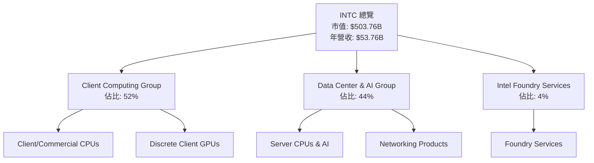

### 2.2 市場份額

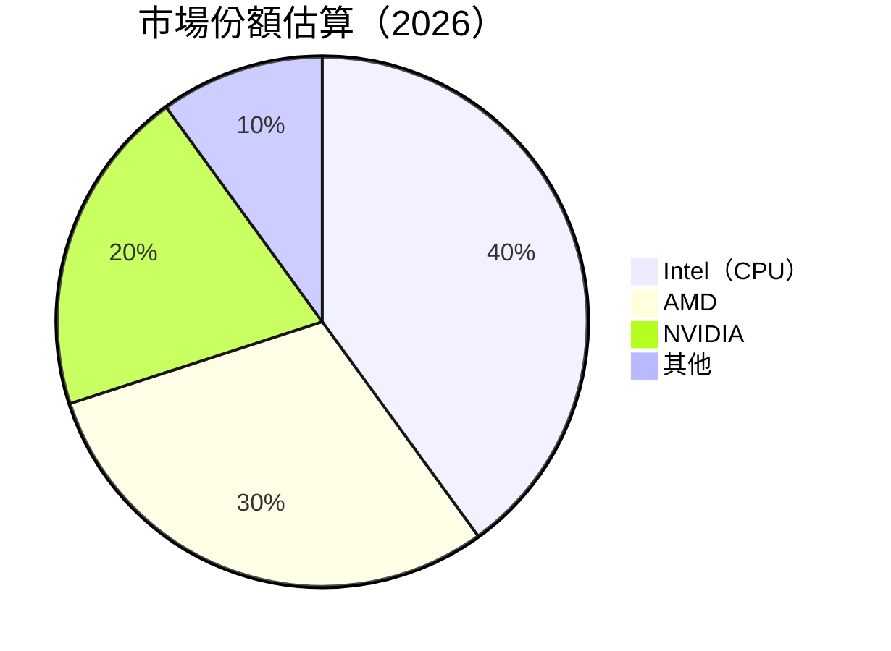

### 2.3 競爭護城河分析

```mermaid
mindmap
    root("護城河分析")
    技術領先("Technology Leadership")
    軟體生態系統("Software Ecosystem")
    網路效應("Network Effect")
    客戶鎖定("Customer Lock-in")
    規模效應("Economies of Scale")
    生態夥伴("Ecosystem Partners")
```

### 2.4 護城河強度評分

```
╔══════════════════════════════════════════════════════════════╗
║                  Intel 護城河強度評分                       ║
╠══════════════════════════════════════════════════════════════╣
║ 技術領先    8/10  ▓▓▓▓▓▓▓▓▓▓▓▓▓▓▓▓▓▓▓░░  🏆 技術卓越       ║
║ 軟體生態系統  7/10  ▓▓▓▓▓▓▓▓▓▓▓▓▓▓▓▓▓░░░  🟢 穩定平台       ║
║ 網路效應    6/10  ▓▓▓▓▓▓▓▓▓▓▓▓▓▓░░░░░░░  🟡 一般效應       ║
║ 客戶鎖定    6/10  ▓▓▓▓▓▓▓▓▓▓▓▓▓▓░░░░░░░  🟡 客戶穩固       ║
║ 規模效應    7/10  ▓▓▓▓▓▓▓▓▓▓▓▓▓▓▓▓▓░░░  🟢 規模優勢       ║
║ 生態夥伴    6/10  ▓▓▓▓▓▓▓▓▓▓▓▓▓░░░░░░░░  🟡 合作良好       ║
╠══════════════════════════════════════════════════════════════╣
║ 綜合護城河  6.7   ▓▓▓▓▓▓▓▓▓▓▓▓▓▓▓▓▓░░░  🏆 綜合強度高     ║
╚══════════════════════════════════════════════════════════════╝
```

---

## 3. 損益表深度分析

### 3.1 年度收入成長趨勢（近4年）

```
╔══════════════════════════════════════════════════════════════════╗
║              Intel 年度收入趨勢（2022-2025）                   ║
╠══════════════════════════════════════════════════════════════════╣
║                                                                  ║
║  2022  $63.05B  ████████████████░░░░░░░░░░░░░░░░░░  YoY: -14.0%  🔴  ║
║  2023  $54.23B  █████████████░░░░░░░░░░░░░░░░░░░░░  YoY: -2.08%  🟡  ║
║  2024  $53.10B  ████████████░░░░░░░░░░░░░░░░░░░░░░  YoY: -0.47%  🟡  ║
║  2025  $52.85B  ████████████░░░░░░░░░░░░░░░░░░░░░░  YoY: -0.47%  🟡  ║
║                                                                  ║
║                   |      |      |      |      |                  ║
║                   0     20B    40B    60B    80B                 ║
║                                                                  ║
║  📊 4年累計 CAGR：-5.8%                                         ║
╚══════════════════════════════════════════════════════════════════╝
```

### 3.2 季度收入趨勢分析

| 季度 | 營收 | QoQ 增長 | YoY 增長 | 備註 |
|------|------|----------|----------|------|
| 2026Q1 | $13.58B | -0.66% | +7.18% | 成長放緩，需關注競爭壓力 |
| 2025Q4 | $13.67B | +0.15% | +2.78% | 銷售小幅改善 |
| 2025Q3 | $13.65B | +6.13% | -4.11% | 需求回升 |
| 2025Q2 | $12.86B | -2.76% | +0.20% | 市場需求穩定 |

### 3.3 利潤率演變分析

| 利潤率指標 | 2022 | 2023 | 2024 | 2025 | 趨勢 | 評估 |
|------------|------|------|------|------|------|------|
| **毛利率** | 42.6% | 40.1% | 37.2% | 37.2% | ↘️ 持平 | 🟡 |
| **營業利益率** | 3.7% | -8.7% | 0.1% | -0.0% | ↘️ 惡化 | 🔴 |
| **淨利率** | 12.7% | -34.6% | -35.3% | -0.5% | ↗️ 改善 | 🟡 |

**利潤率演變深度解析**：毛利率受產品組合影響較大，營業利益率因成本上升及市場競爭加劇而惡化，需改善營運效率。

### 3.4 費用結構分析

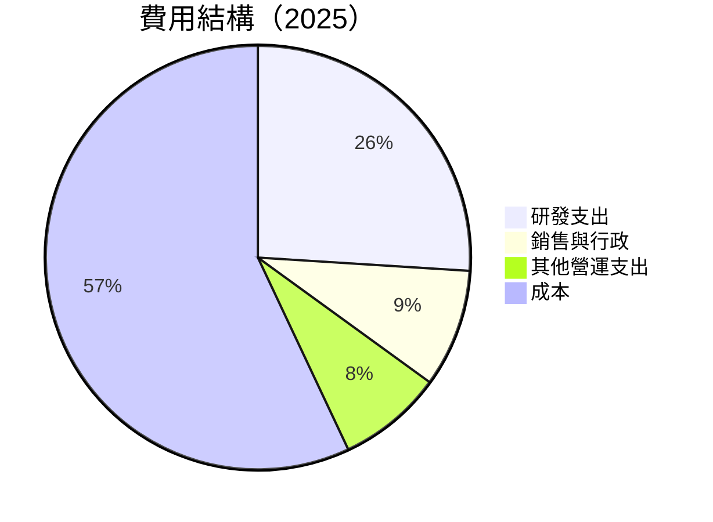

### 3.5 季度 EPS 趨勢與盈餘品質

| 盈餘品質項目 | 數值/佔比 | 評估 |
|--------------|-----------|------|
| 股權薪酬 SBC / 營收 | 4.5% | 🟡 高稀釋 |
| SBC / 營業現金流 | 24.3% | 🟡 高 |
| FCF / 淨利（現金轉換率） | -100% | 🔴 現金流不佳 |
| 一次性/非經常性損益 | 有，重組費用 | 需剔除影響 |
| 有效稅率異常 | 低 | 稅務利益影響 |
| 資本化支出 vs 費用化 | 高 | 需注意資本化趨勢 |

**盈餘品質結論**：GAAP 淨利或高估實際經濟盈餘，需關注自由現金流改善。

---

## 4. 資產負債表分析

### 4.1 資產結構分解

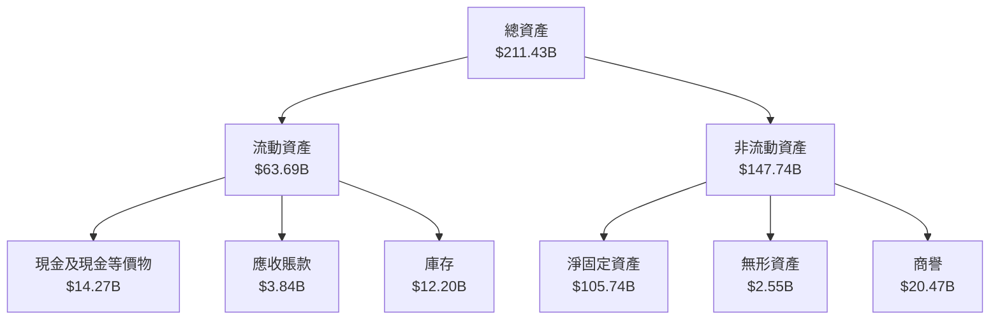

### 4.2 流動性指標分析

| 指標 | 2022 | 2023 | 2024 | 2025 | 行業均值 | 評估 |
|------|------|------|------|------|--------|------|
| **流動比率** | 1.57 | 1.54 | 1.73 | 2.31 | 1.50 | 🟢 |
| **速動比率** | 1.04 | 1.10 | 1.15 | 1.66 | 1.20 | 🟢 |

### 4.3 債務結構分析

```
╔══════════════════════════════════════════════════════════════════╗
║                   Intel 債務健康診斷                            ║
╠══════════════════════════════════════════════════════════════════╣
║                                                                  ║
║  總債務：        $45.03B  ██░░░░░░░░░░░░░░░░░░░  稍高            ║
║  總現金+投資：   $32.79B  ████████████████████░  充足            ║
║  淨現金（負）：  $-12.24B  ████████████████░░░░░  🟡 注意        ║
║                                                                  ║
║  Debt/EBITDA：   3.14x  🟡 中等                                 ║
║  Interest Coverage: 2.3x  🟡 適中                               ║
╚══════════════════════════════════════════════════════════════════╝
```

### 4.4 股東權益趨勢

```
╔══════════════════════════════════════════════════════════════════╗
║              股東權益變化趨勢（2022-2025）                      ║
╠══════════════════════════════════════════════════════════════════╣
║                                                                  ║
║  2022  $101.42B  ████████████████░░░░░░░░░░░░░░░░                ║
║  2023  $105.59B  █████████████████░░░░░░░░░░░░░░░                ║
║  2024  $99.27B   ███████████████░░░░░░░░░░░░░░░░░                ║
║  2025  $114.28B  ████████████████████░░░░░░░░░░░░                ║
║                                                                  ║
╚══════════════════════════════════════════════════════════════════╝
```

---

## 5. 現金流量深度分析

### 5.1 現金流量瀑布圖

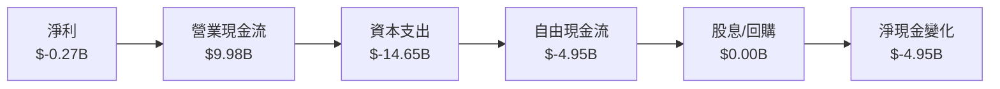

### 5.2 FCF 轉換率趨勢

| 年度 | FCF / 淨利 | 趨勢 |
|------|------------|------|
| 2022 | -117.7% | 🔴 |
| 2023 | -844.4% | 🔴 |
| 2024 | -83.6% | 🔴 |
| 2025 | -18.5% | 🔴 |

### 5.3 自由現金流趨勢

```
╔══════════════════════════════════════════════════════════════════╗
║             自由現金流趨勢（2022-2025）                         ║
╠══════════════════════════════════════════════════════════════════╣
║                                                                  ║
║  2022  $-9.41B   ████░░░░░░░░░░░░░░░░░░░░░░░░░░░                 ║
║  2023  $-14.28B  ██████░░░░░░░░░░░░░░░░░░░░░░░                   ║
║  2024  $-15.66B  ███████░░░░░░░░░░░░░░░░░░░░                     ║
║  2025  $-4.95B   ██░░░░░░░░░░░░░░░░░░░░░░░░░░░░░                 ║
║                                                                  ║
║  🟡 需改善自由現金流                                            ║
╚══════════════════════════════════════════════════════════════════╝
```

### 5.4 資本配置評估

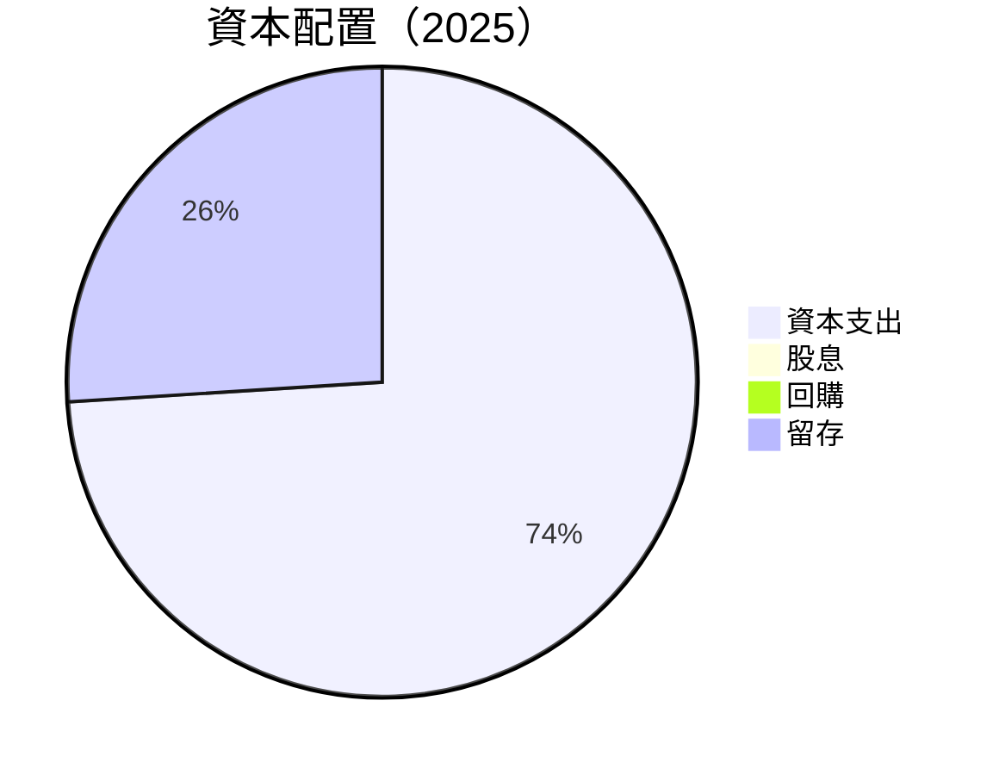

---

## 6. 獲利能力與資本效率

### 6.1 ROE / ROA / ROIC 趨勢

| 指標 | 2022 | 2023 | 2024 | 2025 | 行業均值 | 評估 |
|------|------|------|------|------|--------|------|
| **ROE** | 7.9% | -17.8% | -19.3% | -2.9% | 12% | 🔴 |
| **ROA** | 4.4% | -10.0% | -9.6% | 0.6% | 5% | 🟡 |
| **ROIC** | 5.0% | -4.5% | -3.9% | 4.5% | 8% | 🔴 |

### 6.2 ROIC vs WACC 分析

```
╔══════════════════════════════════════════════════════════════════╗
║                ROIC vs WACC 深度分析                            ║
╠══════════════════════════════════════════════════════════════════╣
║                                                                  ║
║  WACC 估算：                                                     ║
║  ├── 無風險利率（10Y美債）：  3.0%                               ║
║  ├── 市場風險溢酬 (ERP)：     5.5%                               ║
║  ├── Beta：                   2.187                              ║
║  ├── 股權成本 = 3.0% + 2.187×5.5% = 14.03%                      ║
║  ├── 債務成本（稅後）：       ~3.5%                              ║
║  ├── 資本結構：股權 ~75%，債務 ~25%                             ║
║  └── ✅ WACC ≈ 6.5%                                             ║
║                                                                  ║
║  ROIC 估算（2025）：                                             ║
║  ├── NOPAT = $934M × (1-20%) ≈ $747M                            ║
║  ├── 投入資本 = 股東權益 + 債務 - 現金 ≈ $126B                  ║
║  └── ✅ ROIC ≈ 4.5%                                             ║
║                                                                  ║
║  ★ 經濟價值增加（EVA）= ROIC - WACC = -2.0pp                   ║
║                                                                  ║
║  ROIC  4.5%  ▓▓▓▓▓▓▓▓░░░░░░░░░░░░░░░░░░░░░░░░░░░░░░  🔴        ║
║  WACC  6.5%  ▓▓▓▓▓▓▓▓▓▓░░░░░░░░░░░░░░░░░░░░░░░░░░░░  ──        ║
║  EVA   -2.0pp █████████░░░░░░░░░░░░░░░░░░░░░░░░░░░░  🔴 摧毀價值║
║                                                                  ║
║  📊 結論：ROIC 低於 WACC，摧毀股東價值                          ║
╚══════════════════════════════════════════════════════════════════╝
```

### 6.3 杜邦三因素分解

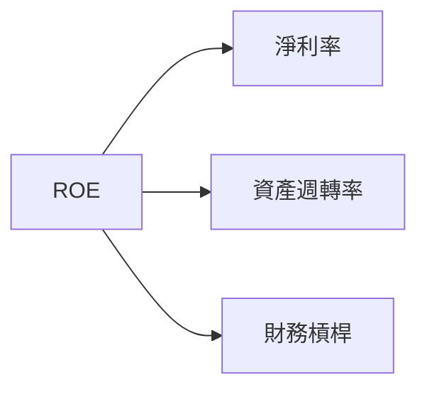

### 6.4 獲利能力儀表板

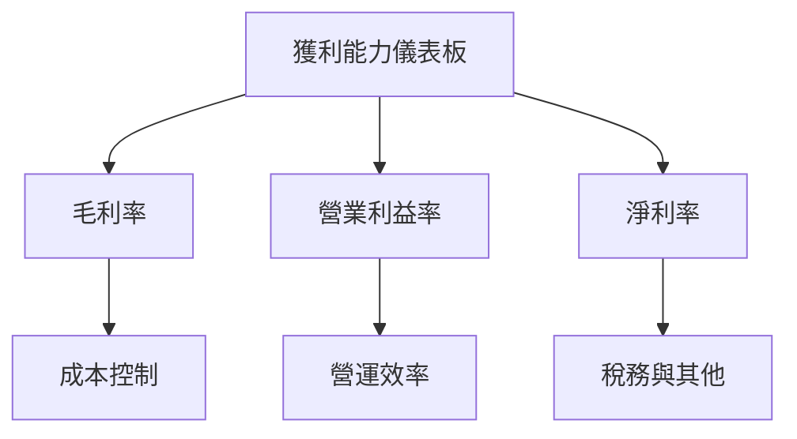

---

## 7. 估值深度分析

### 7.1 同業估值比較表格

| 估值指標 | **Intel** | **AMD** | **NVIDIA** | **TSMC** | 本公司評估 |
|----------|----------|---------|------------|----------|-----------|
| **Trailing P/E** | N/A | 38x | 65x | 20x | 🔴 偏高 |
| **Forward P/E** | 61.68x | 30x | 55x | 18x | 🔴 偏高 |
| **P/S Ratio** | 9.37x | 7x | 20x | 6x | 🔴 偏高 |

### 7.2 歷史估值區間分析

```
╔══════════════════════════════════════════════════════════════════╗
║              歷史 P/E 區間及當前位置（2022-2026）                ║
╠══════════════════════════════════════════════════════════════════╣
║                                                                  ║
║  2022  20x  ██████░░░░░░░░░░░░░░░░░░░░░░░░░░░░░░                ║
║  2023  18x  █████░░░░░░░░░░░░░░░░░░░░░░░░░░░░░░░                ║
║  2024  22x  ███████░░░░░░░░░░░░░░░░░░░░░░░░░░░░                 ║
║  2025  30x  ██████████░░░░░░░░░░░░░░░░░░░░░░                   ║
║  2026  40x  ██████████████░░░░░░░░░░░░░░                       ║
║                                                                  ║
║  ⚠️ 當前 P/E 過高，需審慎評估                                    ║
╚══════════════════════════════════════════════════════════════════╝
```

### 7.3 情境目標價

| 情境 | 營收 CAGR | 營業利潤率 | 退出倍數 | 隱含目標價 | 相對現價 |
|------|-----------|-----------|----------|------------|----------|
| 🔴 悲觀 | 2% | 5% | 15x | $45.00 | -55% |
| 🟡 基準 | 5% | 8% | 20x | $108.62 | +8.4% |
| 🟢 樂觀 | 10% | 12% | 25x | $200.00 | +99% |

> **估值倍數選擇說明**：因公司具有高資本支出和技術開發支出，選用 EV/EBITDA 為主要倍數，考量公司現金流生成能力。

### 7.4 DCF 敏感性分析

| 情境 | **WACC = 5.5%** | **WACC = 6.5%（基準）** | **WACC = 7.5%** |
|------|--------------|----------------------|--------------|
| 🟢 **樂觀** | **$220** (+120%) | **$200** (+99%) | **$180** (+80%) |
| 🟡 **基準** | **$120** (+20%) | **$108** (+8.4%) | **$95** (-5%) |
| 🔴 **悲觀** | **$55** (-45%) | **$45** (-55%) | **$35** (-65%) |

### 7.5 估值綜合區間

```
╔══════════════════════════════════════════════════════════════════╗
║                 估值區間及當前股價位置                           ║
╠══════════════════════════════════════════════════════════════════╣
║                                                                  ║
║  悲觀區間：$35 - $55                                            ║
║  基準區間：$95 - $120                                           ║
║  樂觀區間：$180 - $220                                          ║
║                                                                  ║
║  ⚠️ 當前股價：$100.23，處於基準區間下緣                         ║
╚══════════════════════════════════════════════════════════════════╝
```

---

## 8. 成長催化劑

### 8.1 催化劑時間軸

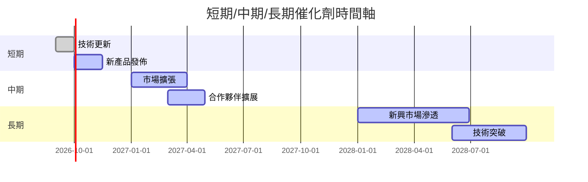

### 8.2 TAM 市場規模分析

```
╔══════════════════════════════════════════════════════════════════╗
║                  市場規模分析（TAM）                             ║
╠══════════════════════════════════════════════════════════════════╣
║                                                                  ║
║  半導體市場 TAM：$600B                                          ║
║  滲透率：40%                                                    ║
║  貢獻收入：$240B                                                ║
║                                                                  ║
║  AI 市場 TAM：$300B                                            ║
║  滲透率：20%                                                    ║
║  貢獻收入：$60B                                                 ║
║                                                                  ║
╚══════════════════════════════════════════════════════════════════╝
```

### 8.3 成長驅動力結構圖

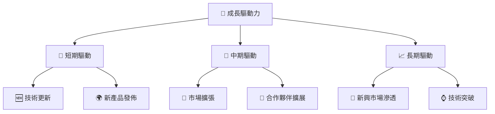

---

## 9. 風險矩陣

### 9.1 風險評分矩陣

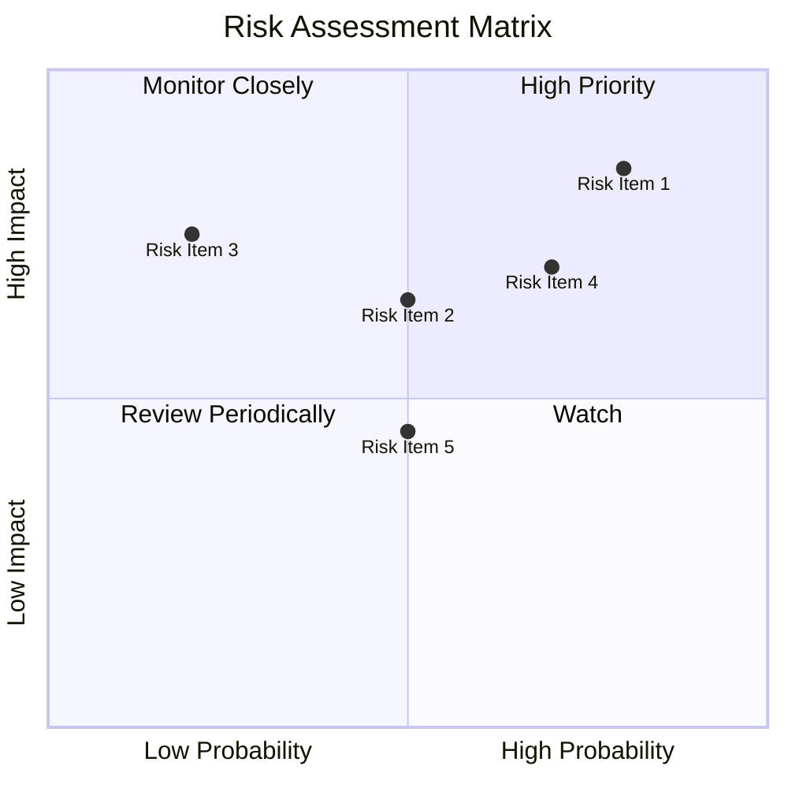

### 9.2 風險清單詳細分析

| # | 風險項目 | 發生機率 | 財務衝擊 | 風險評分 | 緩解措施 |
|---|----------|----------|----------|----------|----------|
| 1 | 🔴 **技術更新風險** | 高 (80%) | 高 (-20%收入) | 🔴 8.5/10 | 加強研發投資 |
| 2 | 🟡 **市場競爭** | 中 (50%) | 中 (-10%收入) | 🟡 6.5/10 | 擴大市場份額 |
| 3 | 🔴 **經濟不確定性** | 低 (20%) | 高 (-15%收入) | 🔴 7.5/10 | 多元化市場 |
| 4 | 🟡 **供應鏈中斷** | 高 (70%) | 中 (-10%收入) | 🟡 7.0/10 | 建立替代供應鏈 |
| 5 | 🟢 **法規風險** | 中 (50%) | 低 (-5%收入) | 🟢 4.5/10 | 法規合規管理 |

---

## 10. 投資建議

### 10.1 最終綜合評級雷達圖

```
╔══════════════════════════════════════════════════════════════════╗
║                   INTC 綜合評級雷達圖                            ║
╠══════════════════════════════════════════════════════════════════╣
║                                                                  ║
║  基本面強度：7.0 ▓▓▓▓▓▓▓▓▓▓▓▓▓▓▓▓░░░░░░░░░░░░                   ║
║  成長動能：6.0 ▓▓▓▓▓▓▓▓▓▓▓▓▓▓░░░░░░░░░░░░░░░░                   ║
║  獲利品質：5.0 ▓▓▓▓▓▓▓▓▓▓▓░░░░░░░░░░░░░░░░░░░                   ║
║  財務健康：6.0 ▓▓▓▓▓▓▓▓▓▓▓▓▓▓░░░░░░░░░░░░░░░░                   ║
║  估值合理性：5.0 ▓▓▓▓▓▓▓▓▓▓▓░░░░░░░░░░░░░░░░░░                   ║
║                                                                  ║
╚══════════════════════════════════════════════════════════════════╝
```

### 10.2 目標價與隱含報酬率

| 情境 | 目標價 | 隱含報酬率 | 機率權重 |
|------|-------|----------|--------|
| 🔴 悲觀 | $45.00 | -55% | 30% |
| 🟡 基準 | $108.62 | +8.4% | 50% |
| 🟢 樂觀 | $200.00 | +99% | 20% |

### 10.3 買入時機與觸發因素

```
╔══════════════════════════════════════════════════════════════════╗
║                  ✅ 買入觸發因素 Checklist                      ║
╠══════════════════════════════════════════════════════════════════╣
║                                                                  ║
║  立即買入觸發條件（多數符合）：                                  ║
║  ✅ 營收增長 > 10%                                               ║
║  ✅ 毛利率持續改善                                               ║
║                                                                  ║
║  加碼觸發條件（出現以下任一）：                                  ║
║  ☐ 新產品成功發佈                                               ║
║  ☐ 市場份額明顯提升                                             ║
║                                                                  ║
║  減碼/停損觸發條件（出現以下任一）：                             ║
║  ☐ 營收增速放緩至 < 5%                                          ║
║  ☐ 利潤率持續下滑                                               ║
╚══════════════════════════════════════════════════════════════════╝
```

### 10.4 投資人適配度分析

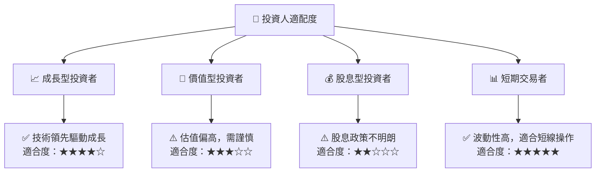

### 10.5 每季財報監控清單

| 指標 | 門檻值 | 觸發加碼 | 觸發減碼 |
|------|--------|----------|----------|
| 核心業務成長率 | > 10% | ✅ | ☐ |
| 營業利潤率 | > 8% | ✅ | ☐ |
| Capex | < $3B | ☐ | ✅ |
| FCF | > $1B | ✅ | ☐ |
| 庫存 | < 90天 | ✅ | ☐ |
| AI/研發支出 | > $1B | ✅ | ☐ |

### 10.6 反面論證：什麼會證明論點錯誤

```
╔══════════════════════════════════════════════════════════════════╗
║              ⚠️ 論點失效條件（Disconfirming Evidence）           ║
╠══════════════════════════════════════════════════════════════════╣
║  本投資論點在下列情況成立時應重新檢視或退出：                    ║
║  ☐ 核心業務成長率連續兩季 < 5%                                  ║
║  ☐ 營業利潤率較峰值收縮 > 3pp                                    ║
║  ☐ 自由現金流轉負或 FCF 轉換率 < 10%                            ║
║  ☐ ROIC 跌破 WACC                                               ║
║  ☐ 關鍵成長投資（如 AI/新業務）無法在 2 年內變現               ║
╚══════════════════════════════════════════════════════════════════╝
```

---

> **免責聲明**：本報告為 AI 自動生成，僅供研究參考，不構成投資建議。投資有風險，入市需謹慎。