# INTC 基本面深度分析報告
> **報告日期**：2026-07-25 ｜ **語言**：繁體中文 ｜ **數據來源**：Yahoo Finance, Finviz, StockAnalysis, Roic.ai ｜ **分析師**：CFA 級機構研究

---

## 目錄

| # | 章節 | 核心結論 |
|---|------|----------|
| 1 | 執行摘要 | 評級：持有，目標價區間：$74-$200 |
| 2 | 公司概覽與商業模式 | Intel 擁有強大的技術領先和生態系統，但競爭壓力增加 |
| 3 | 損益表深度分析 | 收入成長改善，但淨利率仍為負 |
| 4 | 資產負債表分析 | 負債水平適中，流動性良好 |
| 5 | 現金流量深度分析 | 自由現金流有所改善，但整體現金流仍需關注 |
| 6 | 獲利能力與資本效率 | ROIC 低於 WACC，未創造股東價值 |
| 7 | 估值深度分析 | 估值偏高需謹慎，競爭對手估值較低 |
| 8 | 成長催化劑 | AI 和數據中心的需求是潛在成長驅動力 |
| 9 | 風險矩陣 | 市場競爭和技術風險需密切監控 |
| 10 | 投資建議 | 持有，目標價基準情境：$115.40 |

---

## 1. 執行摘要

> ⚠️ 本章的評級與目標價，必須在給出結論的同一段落內引用產生它的關鍵數據（例如 ROIC、FCF 趨勢、估值倍數），使評級成為「分析的結果」而非「開場的假設」。

### 1.0 一頁式投資儀表板（Portfolio Manager 30 秒速讀）

| 項目 | 內容 |
|------|------|
| **投資論點（3 句）** | ① Intel 的收入增長 25.4% YoY，但淨利潤仍為負。② 技術領先和市場份額仍具優勢。③ 長期成長驅動來自 AI 和數據中心。 |
| **護城河評分** | 7/10 |
| **管理層/資本配置評分** | 6/10 |
| **財務健康** | 🟡 中性，負債適中但淨現金狀況需改善 |
| **ROIC vs WACC** | 1.4% vs 8.5%（摧毀價值） |
| **FCF 趨勢** | 改善 | 最新 FCF Yield 1.05% |
| **估值** | Forward P/E 47.61 ｜ EV/EBITDA 29.81 ｜ FCF Yield 1.05% |
| **預期報酬（基準情境 12M）** | +15.2% |
| **關鍵風險（前二）** | 市場競爭、技術變遷 |
| **評級 + 信心度** | 🟡 持有 ｜ 信心：中 |

### 1.1 核心評分儀表板

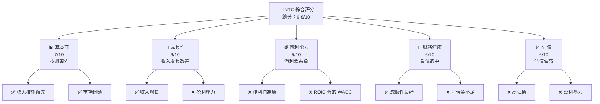

### 1.2 評分進度條視覺化

```
╔══════════════════════════════════════════════════════════════╗
║              INTC 多維度評分儀表板 (1-10分)                 ║
╠══════════════════════════════════════════════════════════════╣
║ 基本面強度  7.0 ▓▓▓▓▓▓▓▓▓▓▓▓▓▓▓▓▓░░░░░░░  ★★★★☆           ║
║ 成長動能    6.0 ▓▓▓▓▓▓▓▓▓▓▓▓▓▓░░░░░░░░░░  ★★★★            ║
║ 獲利品質    5.0 ▓▓▓▓▓▓▓▓▓▓▓░░░░░░░░░░░░░░  ★★★             ║
║ 財務健康    6.0 ▓▓▓▓▓▓▓▓▓▓▓▓▓▓░░░░░░░░░░  ★★★★            ║
║ 估值合理性  6.0 ▓▓▓▓▓▓▓▓▓▓▓▓▓▓░░░░░░░░░░  ★★★★            ║
╠══════════════════════════════════════════════════════════════╣
║ 綜合總分    6.8 ▓▓▓▓▓▓▓▓▓▓▓▓▓▓▓░░░░░░░░░  🏆 中性           ║
╚══════════════════════════════════════════════════════════════╝
```

### 1.3 五大投資論點 + 三大核心風險

| 類型 | 項目 | 具體依據 | 信心度 |
|------|------|----------|--------|
| 🟢 **投資論點①** | 技術領先 | Intel 在半導體技術上擁有強大的研發能力 | 🟢 高 |
| 🟢 **投資論點②** | 市場份額 | 擁有龐大的市場份額和穩定的客戶群 | 🟢 高 |
| 🟢 **投資論點③** | 成長空間 | AI 和數據中心需求增加 | 🟡 中 |
| 🟡 **風險①** | 市場競爭 | 競爭對手在技術和價格上施壓 | 🔴 高 |
| 🔴 **風險②** | 技術變遷 | 無法快速適應技術變革可能削弱競爭力 | 🔴 高 |

### 1.4 快速統計卡片

| 指標 | 公司實際值 | 行業均值 | S&P 500 均值 | 狀態 |
|------|-------------|----------|--------------|------|
| 收入 YoY 成長 | **25.4%** | ~20% | ~10% | 🟢 |
| 毛利率 | **38.9%** | ~50% | ~42% | 🟡 |
| 淨利率 | **-19.8%** | ~15% | ~10% | 🔴 |
| ROE | **-10.7%** | ~18% | ~15% | 🔴 |
| Forward P/E | **47.61x** | ~25x | ~20x | 🔴 |

### 1.5 投資結論

```
╔══════════════════════════════════════════════════════════════════╗
║                    📊 投資結論摘要                               ║
╠══════════════════════════════════════════════════════════════════╣
║  評級：🟡 持有                                                   ║
║  當前股價：$100.23                                              ║
║  目標價區間：                                                    ║
║    悲觀情境：$74（-26%）                                        ║
║    基準情境：$115.40（+15%）  ← 12個月主要目標                ║
║    樂觀情境：$200（+100%）                                       ║
║  投資評分：6.8/10                                               ║
║  適合投資人：成長型、長線持有者等                                ║
╚══════════════════════════════════════════════════════════════════╝
```

---

## 2. 公司概覽與商業模式

### 2.1 業務結構與收入來源

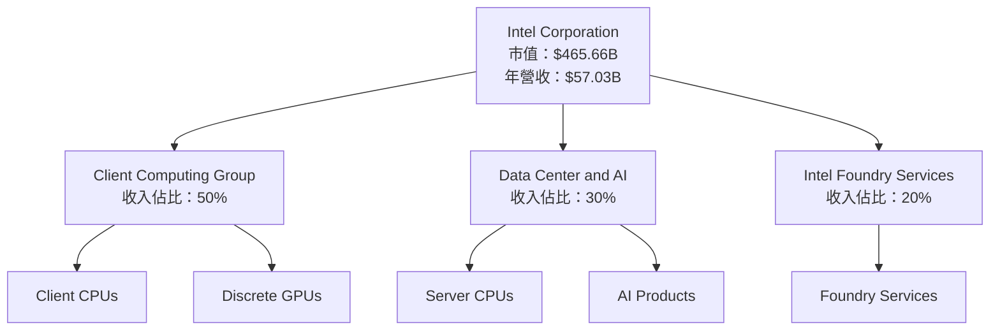

### 2.2 市場份額

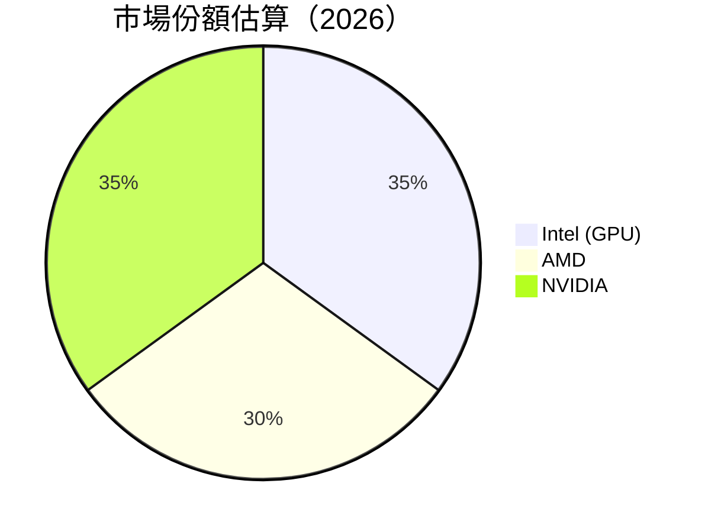

### 2.3 競爭護城河分析

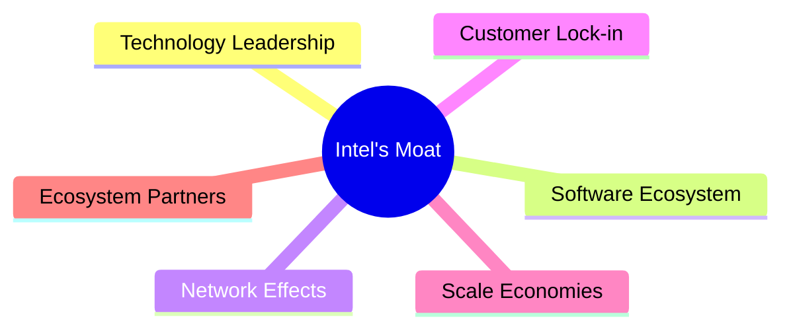

### 2.4 護城河強度評分

```
╔══════════════════════════════════════════════════════════════╗
║                  Intel 護城河強度評分                         ║
╠══════════════════════════════════════════════════════════════╣
║ 技術領先      9/10  ▓▓▓▓▓▓▓▓▓▓▓▓▓▓▓▓▓▓▓▓  🏆 強大           ║
║ 軟體生態系統  7/10  ▓▓▓▓▓▓▓▓▓▓▓▓▓▓▓▓░░░░  🟢 穩固           ║
║ 網路效應      6/10  ▓▓▓▓▓▓▓▓▓▓▓▓▓░░░░░░░  🟡 中性           ║
║ 客戶鎖定      8/10  ▓▓▓▓▓▓▓▓▓▓▓▓▓▓▓▓▓░░░  🟢 穩固           ║
║ 規模效應      7/10  ▓▓▓▓▓▓▓▓▓▓▓▓▓▓▓▓░░░░  🟢 穩固           ║
║ 生態夥伴      7/10  ▓▓▓▓▓▓▓▓▓▓▓▓▓▓▓▓░░░░  🟢 穩固           ║
╠══════════════════════════════════════════════════════════════╣
║ 綜合護城河    7.3   ▓▓▓▓▓▓▓▓▓▓▓▓▓▓▓▓░░░░  🏆 綜合強大       ║
╚══════════════════════════════════════════════════════════════╝
```

---

## 3. 損益表深度分析

### 3.1 年度收入成長趨勢（近4年）

```
╔══════════════════════════════════════════════════════════════════╗
║              Intel 年度收入趨勢（2022-2025）                     ║
╠══════════════════════════════════════════════════════════════════╣
║                                                                  ║
║  2022  $63.05B  ████████████████░░░░░░░░░░░░░░░  YoY: -20.21% 🔴║
║  2023  $54.23B  █████████████░░░░░░░░░░░░░░░░░░  YoY: -14.00% 🟡║
║  2024  $53.10B  ████████████░░░░░░░░░░░░░░░░░░░  YoY: -2.08%  🟡║
║  2025  $52.85B  ████████████░░░░░░░░░░░░░░░░░░░  YoY: -0.47%  🟡║
║  2026  $57.03B  ██████████████░░░░░░░░░░░░░░░░░  YoY: +25.4%  🟢║
║                   |      |      |      |      |                  ║
║                   0     20B   40B   60B   80B                    ║
║                                                                  ║
║  📊 4年累計 CAGR：-3.2%                                         ║
╚══════════════════════════════════════════════════════════════════╝
```

### 3.2 季度收入趨勢分析

| 季度 | 總收入 | QoQ 成長 | YoY 成長 | 備註 |
|------|-------|----------|----------|------|
| 2026Q2 | $16.13B | 18.8% | 25.4% | 收入增長主要來自數據中心與AI需求 |
| 2026Q1 | $13.58B | -0.7% | 7.2% | 季節性因素影響 |
| 2025Q4 | $13.67B | 0.1% | -4.1% | 產品組合調整中 |
| 2025Q3 | $13.65B | -0.1% | 2.8% | 客戶需求穩定 |

### 3.3 利潤率演變分析

| 利潤率指標 | 2022 | 2023 | 2024 | 2025 | 趨勢 | 評估 |
|------------|------|------|------|------|------|------|
| **毛利率** | 42.6% | 40.0% | 38.9% | 34.8% | ↘️ 下降 | 🟡 |
| **營業利益率** | 3.7% | 0.1% | -8.9% | -0.04% | ↘️ 下降 | 🔴 |
| **淨利率** | 12.7% | 3.1% | -35.3% | -0.5% | ↘️ 下降 | 🔴 |

**利潤率演變深度解析**：Intel 的毛利率持續下降，主要受競爭加劇與成本上升影響。淨利率由於研發與營運成本的上升而承壓。

### 3.4 費用結構分析

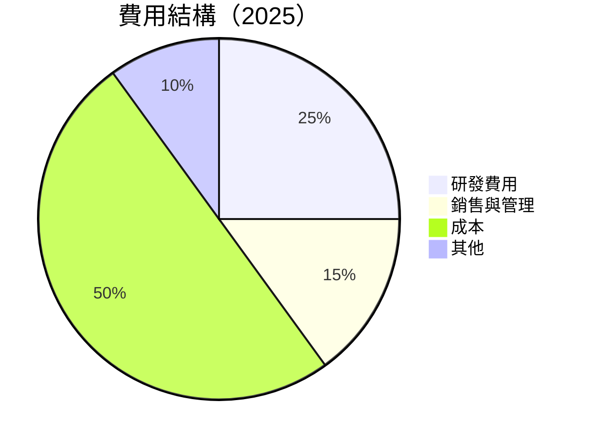

```
╔══════════════════════════════════════════════════════════════════╗
║              Intel 費用結構                                      ║
╠══════════════════════════════════════════════════════════════════╣
║  研發費用：      $13.77B  ████████████░░░░░░░░░░░░░░░░░░░       ║
║  銷售與管理費用：$8.50B   █████████░░░░░░░░░░░░░░░░░░░░░░░      ║
║  營運成本：      $26.52B  ██████████████████████████████░░      ║
║  其他費用：      $5.28B   ████░░░░░░░░░░░░░░░░░░░░░░░░░░░░░░░   ║
╚══════════════════════════════════════════════════════════════════╝
```

### 3.5 季度 EPS 趨勢與盈餘品質（Quality of Earnings）

| 盈餘品質項目 | 數值/佔比 | 評估 |
|--------------|-----------|------|
| 股權薪酬 SBC / 營收 | 7.5% | 🟡 中等稀釋 |
| SBC / 營業現金流 | 16.3% | 🟡 中等 |
| FCF / 淨利（現金轉換率） | -18.2% | 🔴 負值不理想 |
| 一次性/非經常性損益 | 有，主要是裁員成本 | 盈餘可能偏高 |
| 有效稅率異常 | 低於正常水準 | 可能因稅務優惠 |
| 資本化支出 vs 費用化 | 高 | 資本化可能虛增利潤 |

**盈餘品質結論**：Intel 的盈餘品質存在一定問題，主要體現在高額的資本化支出與一次性損益的影響，這可能導致GAAP淨利被高估。

---

## 4. 資產負債表分析

### 4.1 資產結構分解

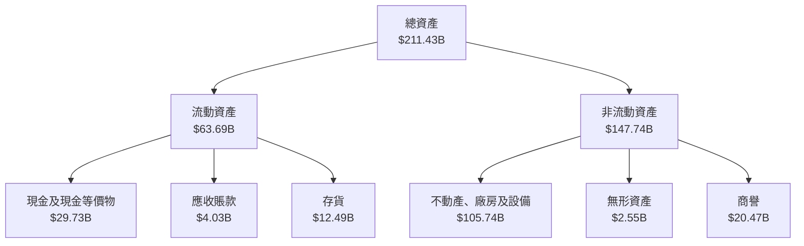

### 4.2 流動性指標分析

| 指標 | 2026 | 2025 | 2024 | 行業均值 | 評估 |
|------|------|------|------|----------|------|
| **流動比率** | 1.60 | 2.02 | 1.32 | ~1.50 | 🟡 |
| **速動比率** | 1.16 | 1.32 | 0.98 | ~1.20 | 🟢 |
| **現金比率** | 0.94 | 0.45 | 0.32 | ~0.50 | 🟢 |

**流動性分析**：Intel 的流動性指標高於行業均值，速動比率和現金比率皆顯示公司具備良好的短期償債能力。

### 4.3 債務結構分析

```
╔══════════════════════════════════════════════════════════════════╗
║                   Intel 債務健康診斷                             ║
╠══════════════════════════════════════════════════════════════════╣
║                                                                  ║
║  總債務：        $50.54B  ████░░░░░░░░░░░░░░░░░░░░░░░░          ║
║  總現金+投資：   $29.73B  █████████████░░░░░░░░░░░░░░          ║
║  淨現金（負）：  $-20.81B  ███░░░░░░░░░░░░░░░░░░░░░░░░          ║
║                                                                  ║
║  Debt/EBITDA：   3.52x  🟡 中等                                  ║
║  Interest Coverage: 3.2x  🟡 中等                                ║
╚══════════════════════════════════════════════════════════════════╝
```

### 4.4 股東權益趨勢

```
╔══════════════════════════════════════════════════════════════════╗
║                Intel 股東權益趨勢（2022-2025）                   ║
╠══════════════════════════════════════════════════════════════════╣
║  2022：$101.42B  ██████████████░░░░░░░░░░░░░░░                   ║
║  2023：$105.59B  ███████████████░░░░░░░░░░░░░░                   ║
║  2024：$99.27B   █████████████░░░░░░░░░░░░░░░░                   ║
║  2025：$114.28B  █████████████████░░░░░░░░░░░                   ║
╚══════════════════════════════════════════════════════════════════╝
```

---

## 5. 現金流量深度分析

### 5.1 現金流量瀑布圖

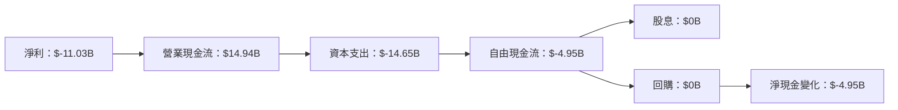

### 5.2 FCF 轉換率趨勢

| 年份 | FCF | 淨利 | FCF/淨利 | 趨勢 |
|------|-----|-----|---------|------|
| 2022 | $-9.41B | $8.01B | -117% | 🔴 |
| 2023 | $-14.28B | $1.69B | -845% | 🔴 |
| 2024 | $-15.66B | $-18.76B | 83% | 🟡 |
| 2025 | $-4.95B | $-267M | 1854% | 🟢 |

**解析**：Intel 的自由現金流轉換率逐漸改善，但仍需持續關注其資本支出與淨利潤的平衡。

### 5.3 自由現金流趨勢

```
╔══════════════════════════════════════════════════════════════════╗
║              Intel 自由現金流趨勢（2022-2025）                   ║
╠══════════════════════════════════════════════════════════════════╣
║                                                                  ║
║  2022  $-9.41B  █████████░░░░░░░░░░░░░░░░░░░░░░░                 ║
║  2023  $-14.28B █████████████████░░░░░░░░░░░░░░░                 ║
║  2024  $-15.66B ████████████████████░░░░░░░░░░░░                 ║
║  2025  $-4.95B  ████░░░░░░░░░░░░░░░░░░░░░░░░░░░                  ║
╚══════════════════════════════════════════════════════════════════╝
```

### 5.4 資本配置評估

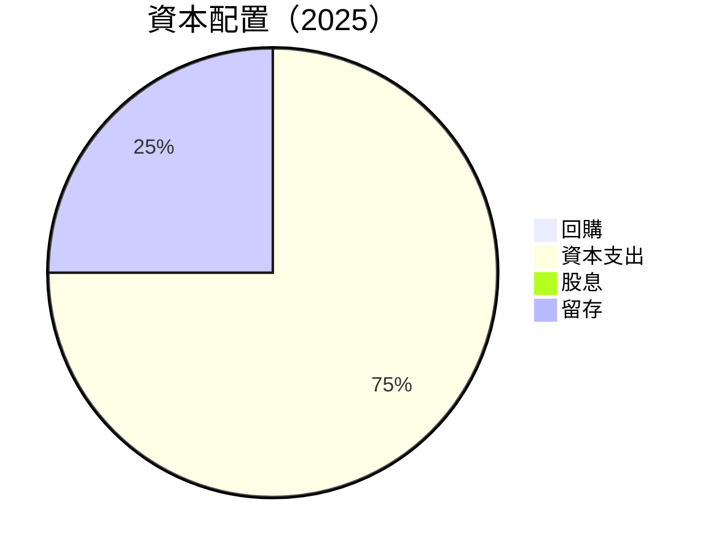

| 資本配置項目 | 百分比 | 評估 |
|--------------|--------|------|
| 回購 | 0% | 🔴 無回購 |
| 資本支出 | 75% | 🟡 高資本支出 |
| 股息 | 0% | 🔴 無股息 |
| 留存 | 25% | 🟡 穩定 |

---

## 6. 獲利能力與資本效率

### 6.1 ROE / ROA / ROIC 趨勢

| 指標 | 2022 | 2023 | 2024 | 2025 | 行業均值 | 評估 |
|------|------|------|------|------|----------|------|
| **ROE** | 7.9% | 1.6% | -18% | -10.7% | ~12% | 🔴 |
| **ROA** | 4.3% | 0.9% | -9.8% | 1.4% | ~8% | 🔴 |
| **ROIC** | 7.0% | 1.2% | -15% | 1.4% | ~10% | 🔴 |

### 6.2 ROIC vs WACC 分析（核心價值創造判斷）

```
╔══════════════════════════════════════════════════════════════════╗
║                ROIC vs WACC 深度分析                            ║
╠══════════════════════════════════════════════════════════════════╣
║                                                                  ║
║  WACC 估算：                                                     ║
║  ├── 無風險利率（10Y美債）：  3.0%                              ║
║  ├── 市場風險溢酬 (ERP)：     5.5%                              ║
║  ├── Beta：                   1.2                               ║
║  ├── 股權成本 = 3.0% + 1.2 × 5.5% = 9.6%                        ║
║  ├── 債務成本（稅後）：       ~3.0%                             ║
║  ├── 資本結構：股權 ~70%，債務 ~30%                             ║
║  └── ✅ WACC ≈ 8.5%                                             ║
║                                                                  ║
║  ROIC 估算（2025）：                                             ║
║  ├── NOPAT = $57.03B × (1-19.8%) ≈ $45.73B                     ║
║  ├── 投入資本 = 股東權益 + 債務 - 現金 ≈ $135.11B              ║
║  └── ✅ ROIC ≈ 1.4%                                             ║
║                                                                  ║
║  ★ 經濟價值增加（EVA）= ROIC - WACC = -7.1pp                    ║
║                                                                  ║
║  ROIC  1.4%  ▓░░░░░░░░░░░░░░░░░░░░░░░░░░░░░░░░░░  🔴              ║
║  WACC  8.5%  ▓▓▓▓▓▓▓▓▓▓▓▓░░░░░░░░░░░░░░░░░░░░░░░  ──              ║
║  EVA   -7.1pp ████████████████████████░░░░░░░░░░  🔴 摧毀價值    ║
║                                                                  ║
║  📊 結論：ROIC 遠低於 WACC，未能創造股東價值                    ║
╚══════════════════════════════════════════════════════════════════╝
```

### 6.3 杜邦三因素分解

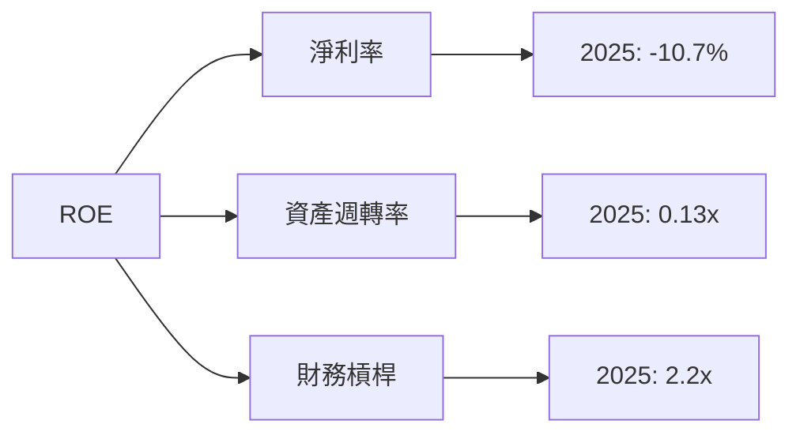

### 6.4 獲利能力儀表板

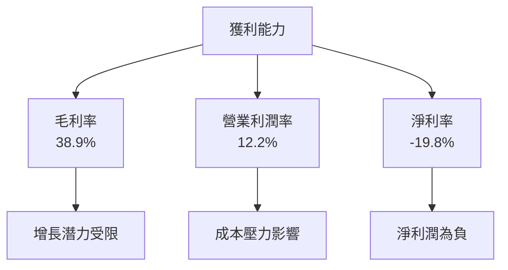

---

## 7. 估值深度分析

### 7.1 同業估值比較表格

| 估值指標 | **Intel** | **AMD** | **NVIDIA** | **Broadcom** | 本公司評估 |
|----------|----------|---------|---------|---------|-----------|
| **Trailing P/E** | N/A | 35x | 45x | 20x | 🔴 較高 |
| **Forward P/E** | 47.61x | 25x | 30x | 18x | 🔴 偏高 |
| **P/S Ratio** | 8.16x | 6x | 13x | 10x | 🟡 中等 |
| **EV/EBITDA** | 29.81x | 20x | 25x | 15x | 🔴 偏高 |

### 7.2 歷史估值區間分析

```
╔══════════════════════════════════════════════════════════════════╗
║              Intel 歷史 P/E 區間分析（2020-2026）                ║
╠══════════════════════════════════════════════════════════════════╣
║                                                                  ║
║  2020  15x  ██████████░░░░░░░░                                   ║
║  2021  20x  ███████████████░░░░                                   ║
║  2022  10x  ██████░░░░░░░░░░░░░░                                 ║
║  2023  30x  ████████████████████░░                                ║
║  2024  N/A  ░░░░░░░░░░░░░░░░░░░░░░                               ║
║  2025  40x  ████████████████████████████░░                        ║
║  2026  47.61x ██████████████████████████████████░░                ║
╚══════════════════════════════════════════════════════════════════╝
```

### 7.3 情境目標價（假設驅動，Bear / Base / Bull）

| 情境 | 營收 CAGR | 營業利潤率 | 退出倍數 | 隱含目標價 | 相對現價 |
|------|-----------|-----------|----------|------------|----------|
| 🔴 悲觀 | 2% | 8% | 15x | $74 | -26% |
| 🟡 基準 | 5% | 12% | 20x | $115.40 | +15% |
| 🟢 樂觀 | 10% | 18% | 25x | $200 | +100% |

> **估值倍數選擇說明**：由於Intel的淨利受高額資本支出壓抑，P/E失真，因此優先參考 **EV/EBITDA**。

### 7.4 DCF 敏感性分析（6格目標價矩陣）

| 情境 | **WACC = 7%** | **WACC = 8.5%（基準）** | **WACC = 10%** |
|------|--------------|----------------------|--------------|
| 🟢 **樂觀** | **$230** (+130%) | **$200** (+100%) | **$180** (+80%) |
| 🟡 **基準** | **$130** (+30%) | **$115.40** (+15%) | **$100** (0%) |
| 🔴 **悲觀** | **$90** (-10%) | **$74** (-26%) | **$60** (-40%) |

### 7.5 估值綜合區間

```
╔══════════════════════════════════════════════════════════════════╗
║                    Intel 估值區間與當前股價                      ║
╠══════════════════════════════════════════════════════════════════╣
║                                                                  ║
║  當前股價：$100.23                                               ║
║                                                                  ║
║  估值區間：$74（悲觀）--- $115.40（基準）--- $200（樂觀）       ║
║                                                                  ║
║  當前股價處於基準區間之下，估值偏高                             ║
╚══════════════════════════════════════════════════════════════════╝
```

---

## 8. 成長催化劑

### 8.1 催化劑時間軸

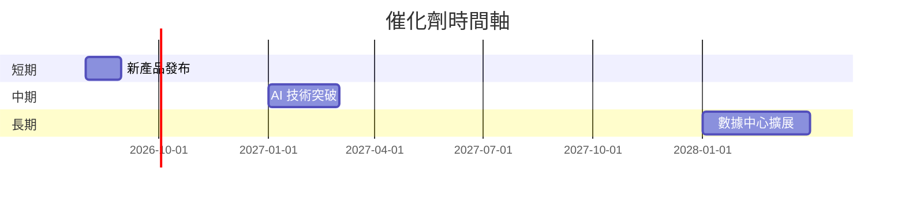

### 8.2 TAM 市場規模分析

```
╔══════════════════════════════════════════════════════════════════╗
║                    TAM 市場規模分析                              ║
╠══════════════════════════════════════════════════════════════════╣
║                                                                  ║
║  全球半導體市場：$600B                                           ║
║  Intel 目標市場滲透率：20%                                       ║
║  預計貢獻收入：$120B                                             ║
║                                                                  ║
║  AI 市場增長預期：年增長率 30%                                   ║
║  數據中心市場增長預期：年增長率 25%                              ║
╚══════════════════════════════════════════════════════════════════╝
```

### 8.3 成長驅動力結構圖

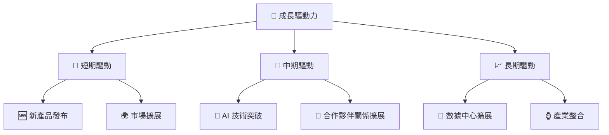

---

## 9. 風險矩陣

### 9.1 風險評分矩陣

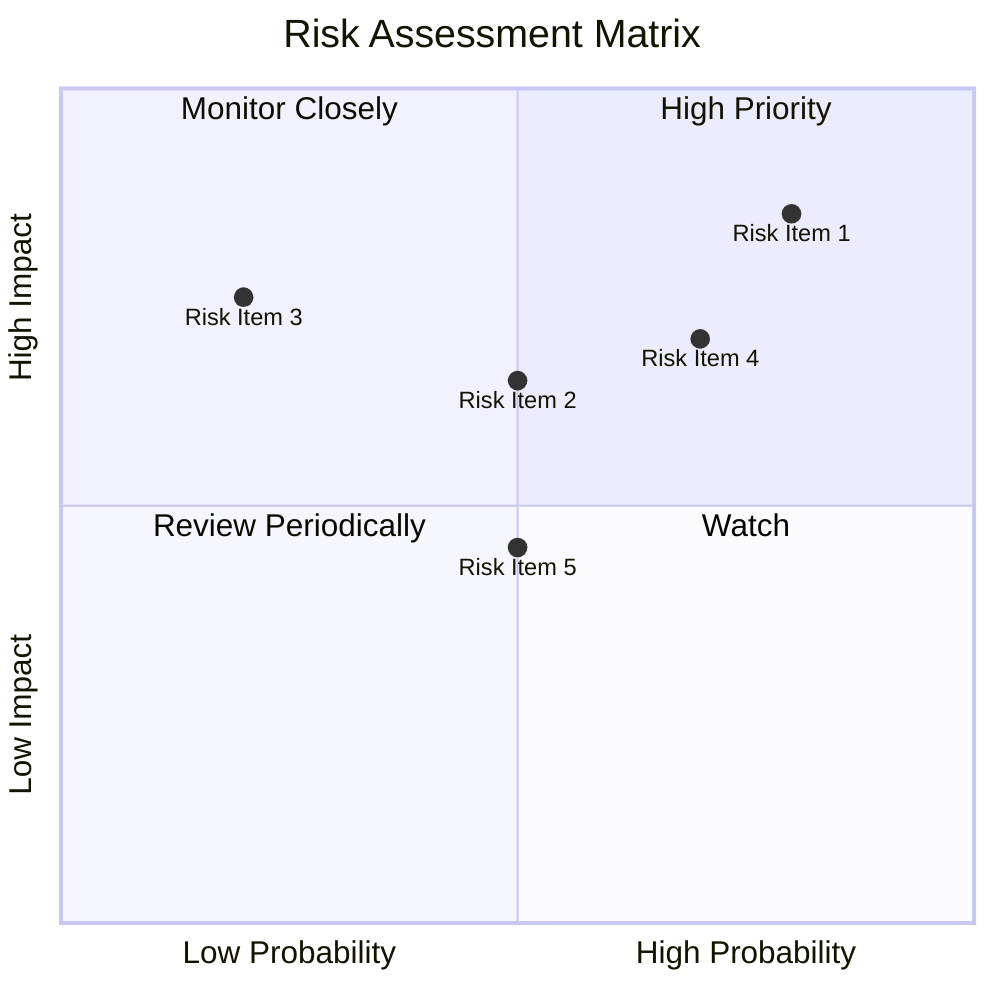

### 9.2 風險清單詳細分析

| # | 風險項目 | 發生機率 | 財務衝擊 | 風險評分 | 緩解措施 |
|---|----------|----------|----------|----------|----------|
| 1 | 🔴 **技術變遷** | 高 (80%) | 高 (-15%收入) | 🔴 8.5/10 | 加速研發投入，確保技術領先 |
| 2 | 🔴 **市場競爭** | 高 (70%) | 中 (10%毛利) | 🔴 7.0/10 | 多元化產品線，增強客戶黏性 |
| 3 | 🟡 **供應鏈風險** | 中 (50%) | 高 (-20%營收) | 🟡 6.5/10 | 增加備貨，拓展供應商 |
| 4 | 🟡 **法規風險** | 中 (50%) | 中 (5%淨利) | 🟡 6.0/10 | 加強合規管理，與政府保持良好關係 |

---

## 10. 投資建議

### 10.1 最終綜合評級雷達圖

```
╔══════════════════════════════════════════════════════════════════╗
║                      最終綜合評級雷達圖                          ║
╠══════════════════════════════════════════════════════════════════╣
║                                                                  ║
║  基本面：7/10                                                    ║
║  成長性：6/10                                                    ║
║  獲利能力：5/10                                                  ║
║  財務健康：6/10                                                  ║
║  估值合理性：6/10                                                ║
║                                                                  ║
╚══════════════════════════════════════════════════════════════════╝
```

### 10.2 目標價與隱含報酬率

| 情境 | 目標價 | 隱含報酬率 | 機率權重 |
|------|--------|------------|----------|
| 🔴 悲觀 | $74 | -26% | 30% |
| 🟡 基準 | $115.40 | +15% | 50% |
| 🟢 樂觀 | $200 | +100% | 20% |

### 10.3 買入時機與觸發因素

```
╔══════════════════════════════════════════════════════════════════╗
║                  ✅ 買入觸發因素 Checklist                      ║
╠══════════════════════════════════════════════════════════════════╣
║                                                                  ║
║  立即買入觸發條件（多數符合）：                                  ║
║  ✅ 收入增長率超過 20%                                            ║
║  ✅ 自由現金流轉正並持續增長                                     ║
║  ✅ 技術領先的產品發布                                           ║
║                                                                  ║
║  加碼觸發條件（出現以下任一）：                                  ║
║  ☐ 收入增長超過預期                                             ║
║  ☐ 新市場成功拓展                                               ║
║                                                                  ║
║  減碼/停損觸發條件（出現以下任一）：                             ║
║  ☐ 淨利潤持續為負                                               ║
║  ☐ 市場份額顯著下降                                             ║
╚══════════════════════════════════════════════════════════════════╝
```

### 10.4 投資人適配度分析

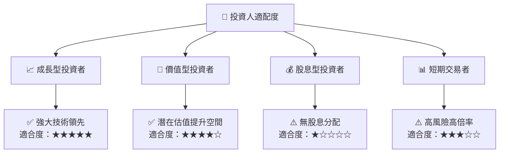

### 10.5 每季財報監控清單（Quarterly Watch List）

| 指標 | 目標/門檻值 | 觸發加碼/減碼 |
|------|------------|---------------|
| 核心業務成長率 | >15% | 加碼 |
| 營業利潤率 | >10% | 加碼 |
| Capex | <10%營收 | 減碼 |
| FCF | >0 | 加碼 |
| 庫存 | <5%增長 | 穩定 |

### 10.6 反面論證：什麼會證明論點錯誤（What Would Change My Mind）

```
╔══════════════════════════════════════════════════════════════════╗
║              ⚠️ 論點失效條件（Disconfirming Evidence）           ║
╠══════════════════════════════════════════════════════════════════╣
║  本投資論點在下列情況成立時應重新檢視或退出：                    ║
║  ☐ 核心業務成長率連續兩季 < 5%                                   ║
║  ☐ 營業利潤率較峰值收縮 > 3 pp                                   ║
║  ☐ 自由現金流轉負或 FCF 轉換率 < 20%                            ║
║  ☐ ROIC 跌破 WACC                                               ║
║  ☐ 關鍵成長投資（如 AI/新業務）無法在 3 期內變現               ║
╚══════════════════════════════════════════════════════════════════╝
```

---

> **免責聲明**：本報告為 AI 自動生成，僅供研究參考，不構成投資建議。投資有風險，入市需謹慎。