# INTC 基本面深度分析報告
> **報告日期**：2026-07-26 ｜ **語言**：繁體中文 ｜ **數據來源**：Yahoo Finance, Finviz, StockAnalysis, Roic.ai ｜ **分析師**：CFA 級機構研究

---

## 目錄

| # | 章節 | 核心結論 |
|---|------|----------|
| 1 | 執行摘要 | **中立/持有 (HOLD)** ｜ 目標價區間 **$74.00 – $200.00**（基準 $115.65，潛在上行 +15.4%） |
| 2 | 公司概覽與商業模式 | x86 雙雄之一，晶圓代工（Intel Foundry）轉型迎來產能開放，護城河評分 **6.5/10** |
| 3 | 損益表深度分析 | Q2 2026 營收回升至 $16.13B（YoY +25.4%），惟受重組與提列非現金減損影響，TTM 淨利呈虧損 |
| 4 | 資產負債表分析 | 總現金及短期投資 $29.73B，總債務 $50.54B，淨債務 $20.81B，流動比率 1.60x 屬可控範圍 |
| 5 | 現金流量深度分析 | Q2 2026 單季 FCF 轉正至 $4.45B，TTM FCF 殖利率 1.05%，Capex 高峰過後現金流壓力紓解 |
| 6 | 獲利能力與資本效率 | 估算 WACC 12.27% vs 當前 ROIC ~4.6%，資本效率短期受高額建廠資本支出壓抑，正在摧毀價值 |
| 7 | 估值深度分析 | Forward P/E 46.5x 處於歷史高位（反應 2027 盈餘復甦預期），EV/EBITDA 29.8x，同業比較呈現高估 |
| 8 | 成長催化劑 | 18A 製程量產、15 世代 Client CPU 換機潮與晶圓代工外部客戶獲取 |
| 9 | 風險矩陣 | 晶圓代工良率延宕風險（高衝擊/中機率）、 datacenter 被 ARM/AMD 侵蝕風險 |
| 10 | 投資建議 | 當前估值已提前反映復甦，建議等待 Capex 拐點與 ROIC 升至 WACC 以上再行加碼 |

---

## 1. 執行摘要

Intel Corporation (NASDAQ: INTC) 當前交易價約為 **$100.23**（52 週區間 $18.97 - $142.35，市值 $465.66B）。根據最新 Q2 2026 財報數據，公司單季營收回升至 **$16.13B**（YoY +25.42%，QoQ +18.79%），營業利益轉正至 **$1.97B**（營業利益率 12.2%），顯示 Client PC 換機潮與伺服器需求呈現復甦態勢。

然而，從資本效率角度檢視，公司 TTM ROIC 僅約 **4.6%**，低於其 12.27% 的 WACC，顯示龐大的晶圓代工資本支出（FY25 Capex $14.65B）尚未轉化為經濟附加價值（EVA 為負）。考量 Forward P/E 已高達 **46.5x**，反映市場已超前定價 2027 年後的利潤率擴張，給予 **「持有（HOLD）」** 評級，基準目標價設為 **$115.65**（上行空間 +15.4%）。

### 1.0 一頁式投資儀表板（Portfolio Manager 30 秒速讀）

| 項目 | 內容 |
|------|------|
| **投資論點（3 句）** | ① Q2 2026 營收回升至 $16.13B（YoY +25.4%），顯示 CPU 核心業務觸底反彈。<br/>② 18A 製程逐步進入產能爬坡，代工業務拆分長期有助於價值重估。<br/>③ 當前 Forward P/E 46.5x 與 EV/EBITDA 29.8x 已充份定價中期復甦，安全邊際不足。 |
| **護城河評分** | **6.5 / 10**（x86 專利與生態系極強，但晶圓製造面臨台積電嚴峻挑戰） |
| **管理層/資本配置評分** | **5.5 / 10**（停發股利保留現金，Capex 支出巨大致 FCF 波動劇烈） |
| **財務健康** | 🟡 **中等**（現金 $29.73B，淨債務 $20.81B，槓桿比率 Debt/EBITDA 3.52x） |
| **ROIC vs WACC** | **4.6% vs 12.27%** 🔴（目前處於摧毀股東價值階段） |
| **FCF 趨勢** | Q2 2026 單季 FCF 回升至 $4.45B，TTM FCF 殖利率約 **1.05%** |
| **估值** | Forward P/E 46.5x ｜ EV/EBITDA 29.8x ｜ P/S 8.16x |
| **預期報酬（基準情境 12M）** | **+15.4%**（目標價 $115.65） |
| **關鍵風險（前二）** | ① 18A 製程良率提升不及預期導致客戶流失；② AMD/ARM 架構持續侵蝕伺服器市占 |
| **評級 + 信心度** | 🟡 **持有（HOLD）** ｜ 信心度：**中等** |

### 1.1 核心評分儀表板

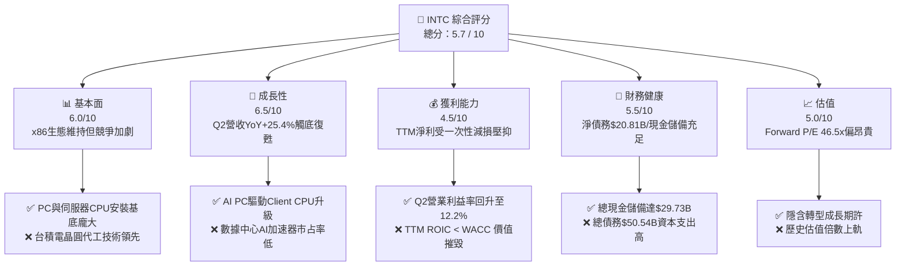

### 1.2 評分進度條視覺化

```
╔══════════════════════════════════════════════════════════════╗
║              INTC 多維度評分儀表板 (1-10分)                  ║
╠══════════════════════════════════════════════════════════════╣
║ 基本面強度  6.0 ▓▓▓▓▓▓▓▓▓▓▓▓░░░░░░░░  ★★★☆☆           ║
║ 成長動能    6.5 ▓▓▓▓▓▓▓▓▓▓▓▓▓░░░░░░░  ★★★☆☆           ║
║ 獲利品質    4.5 ▓▓▓▓▓▓▓▓▓░░░░░░░░░░░  ★★☆☆☆           ║
║ 財務健康    5.5 ▓▓▓▓▓▓▓▓▓▓▓░░░░░░░░░  ★★★☆☆           ║
║ 估值合理性  5.0 ▓▓▓▓▓▓▓▓▓▓░░░░░░░░░░  ★★★☆☆           ║
║ 護城河深度  6.5 ▓▓▓▓▓▓▓▓▓▓▓▓▓░░░░░░░  ★★★☆☆           ║
║ 管理層執行  5.5 ▓▓▓▓▓▓▓▓▓▓▓░░░░░░░░░  ★★★☆☆           ║
║ 技術創新力  7.0 ▓▓▓▓▓▓▓▓▓▓▓▓▓▓░░░░░░  ★★★★☆           ║
╠══════════════════════════════════════════════════════════════╣
║ 綜合總分    5.7 ▓▓▓▓▓▓▓▓▓▓▓░░░░░░░░░  🟡 中立/持有     ║
╚══════════════════════════════════════════════════════════════╝
```

### 1.3 五大投資論點 + 三大核心風險

| 類型 | 項目 | 具體依據 | 信心度 |
|------|------|----------|--------|
| 🟢 **論點①** | **營收轉折訊號顯現** | Q2 2026 營收 $16.13B（YoY +25.4%），打破連續數季個位數低迷成長 | 🟢 高 |
| 🟢 **論點②** | **自由現金流單季強勢轉正** | Q2 2026 營業現金流 $7.01B，減去 Capex $2.56B 後產生 $4.45B FCF | 🟢 高 |
| 🟢 **論點③** | **18A 製程技術推進** | 推進 RibbonFET 與 PowerVia 技術，吸引潛在外部 Foundry 客戶 | 🟡 中 |
| 🟢 **論點④** | **AI PC 帶動換機週期** | Core Ultra 處理器於 Client 端滲透率提升，支撐 CCG 部門利潤 | 🟢 高 |
| 🟢 **論點⑤** | **資本支出強度放緩** | Capex 自 2023 高峰（>$25B）回落至年化 ~$12-14B，緩解現金流壓力 | 🟡 中 |
| 🔴 **風險①** | **ROIC 低於資金成本** | TTM ROIC 僅 ~4.6%，遠低於 WACC 12.27%，資本配置尚無增值效應 | 🔴 高衝擊 |
| 🔴 **風險②** | **高額非營利性減損** | GAAP 淨利因資產減損與重組費用呈巨額虧損（Q2 2026 淨利 -$11.03B） | 🔴 高衝擊 |
| 🟡 **風險③** | **代工外部訂單獲取進度** | Intel Foundry 外部客戶營收規模尚未顯著展現，昂貴產能恐有低利用率風險 | 🟡 中度 |

### 1.4 快速統計卡片

| 指標 | INTC 實際值 | 半導體行業均值 | S&P 500 均值 | 狀態 |
|------|-------------|----------------|--------------|------|
| **收入 YoY 成長 (TTM)** | **25.4%** | ~12.0% | ~5.5% | 🟢 高於行業 |
| **毛利率 (Q2 2026)** | **40.4%** | ~52.0% | ~45.0% | 🔴 低於行業 |
| **營業利益率 (Q2 2026)**| **12.2%** | ~22.0% | ~12.5% | 🟡 行業中下 |
| **Forward P/E** | **46.5x** | ~28.0x | ~21.5x | 🔴 溢價偏高 |
| **EV / EBITDA** | **29.8x** | ~18.0x | ~14.0x | 🔴 顯著溢價 |
| **FCF Yield (TTM)** | **1.05%** | ~2.8% | ~3.5% | 🔴 偏低 |

### 1.5 投資結論

```
╔══════════════════════════════════════════════════════════════════╗
║                    📊 投資結論摘要                               ║
╠══════════════════════════════════════════════════════════════════╣
║  評級：🟡 持有 (HOLD)                                            ║
║  當前股價：$100.23                                               ║
║  目標價區間：                                                    ║
║    悲觀情境：$74.00  （-26.2%）                                  ║
║    基準情境：$115.65 （+15.4%）  ← 12 個月主要目標              ║
║    樂觀情境：$200.00 （+99.5%）                                  ║
║  投資評分：5.7 / 10                                              ║
║  適合投資人：具備高風險承受力、等待 IDM 2.0 轉型收割之長線投資者  ║
╚══════════════════════════════════════════════════════════════════╝
```

---

## 2. 公司概覽與商業模式

### 2.1 業務結構與收入來源

Intel 正轉型為「IDM 2.0」模式，將營收劃分為 Client Computing Group (CCG)、Data Center and AI (DCAI) 以及 Intel Foundry（晶圓代工服務）。

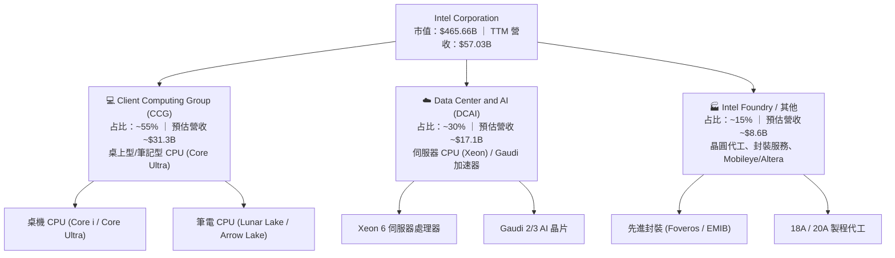

### 2.2 市場份額

在 x86 處理器市場，Intel 仍占據 Client 端主流，但在 Data Center 端面臨 AMD EPYC 的強烈競爭；在晶圓代工市場，台積電仍維持絕對壟斷地位。

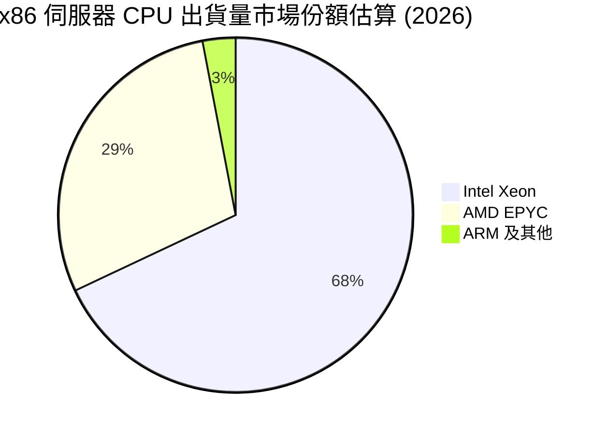

### 2.3 競爭護城河分析

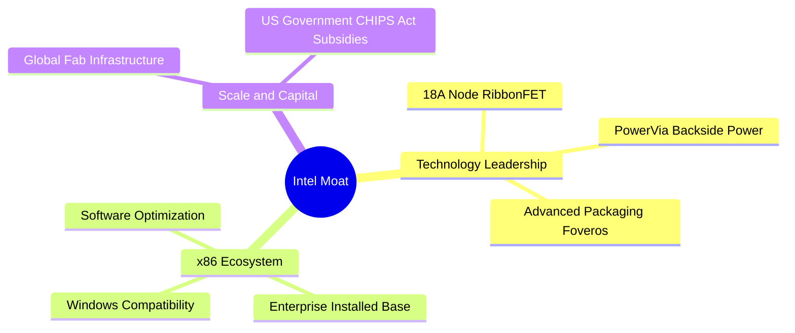

### 2.4 護城河強度評分

```
╔══════════════════════════════════════════════════════════════╗
║                  Intel Corporation 護城河強度評分            ║
╠══════════════════════════════════════════════════════════════╣
║ x86 生態系與軟體鎖定 8.5/10  ▓▓▓▓▓▓▓▓▓▓▓▓▓▓▓▓▓░░░  🏆 極強     ║
║ 規模經濟與晶圓廠建置 8.0/10  ▓▓▓▓▓▓▓▓▓▓▓▓▓▓▓▓░░░░  🟢 強勁     ║
║ 製程技術領先度       5.5/10  ▓▓▓▓▓▓▓▓▓▓▓░░░░░░░░░  🟡 追趕中   ║
║ 代工生態與客戶信任   4.5/10  ▓▓▓▓▓▓▓▓▓░░░░░░░░░░░  🟡 初起步   ║
║ AI 加速器產品線競爭力 4.0/10  ▓▓▓▓▓▓▓▓░░░░░░░░░░░░  🔴 落後     ║
╠══════════════════════════════════════════════════════════════╣
║ 綜合護城河評分       6.5/10  ▓▓▓▓▓▓▓▓▓▓▓▓▓░░░░░░░  🟡 中等護城河║
╚══════════════════════════════════════════════════════════════╝
```

---

## 3. 損益表深度分析

### 3.1 年度收入成長趨勢（FY2022 - TTM）

Intel 近年營收經歷了嚴重的週期性下滑，但至 2026 年初開始呈現底部回升態勢。

```
╔══════════════════════════════════════════════════════════════════╗
║              INTC 年度收入趨勢（FY2022-TTM）                     ║
╠══════════════════════════════════════════════════════════════════╣
║                                                                  ║
║  FY2022  $63.05B  ██████████████████████████  YoY: -20.2% 🔴    ║
║  FY2023  $54.23B  ██████████████████████░░░░  YoY: -14.0% 🔴    ║
║  FY2024  $53.10B  █████████████████████░░░░░  YoY:  -2.1% 🔴    ║
║  FY2025  $52.85B  █████████████████████░░░░░  YoY:  -0.5% 🟡    ║
║  TTM     $57.03B  ███████████████████████░░░  YoY: +25.4% 🟢    ║
║                   |      |      |      |                         ║
║                   0     20B    40B    60B                        ║
║                                                                  ║
║  📊 4 年營收複合成長率 (CAGR)：-2.48% (經歷觸底回升)            ║
╚══════════════════════════════════════════════════════════════════╝
```

### 3.2 季度收入趨勢分析

最近 4 個季度的營收展現出顯著的加速反彈現象，Q2 2026 營收爆發至 $16.13B：

| 季度 | 營收 ($B) | YoY 成長率 | QoQ 成長率 | 營業利益 ($M) | 營業利益率 | 備註 |
|------|-----------|------------|------------|---------------|------------|------|
| **Q3 2025** | $13.65B | +2.78% | +6.17% | $683.00M | 5.00% | PC 庫存去化完成 |
| **Q4 2025** | $13.67B | -4.11% | +0.15% | $580.00M | 4.24% | 伺服器晶片平穩 |
| **Q1 2026** | $13.58B | +7.18% | -0.71% | -$3,136.00M | -23.10% | 提列一次性重組費用 |
| **Q2 2026** | $16.13B | **+25.42%** | **+18.79%** | **$1,796.00M** | **11.14%** | AI PC 與伺服器出貨放量 🟢 |

### 3.3 利潤率演變分析

| 利潤率指標 | FY2022 | FY2023 | FY2024 | FY2025 | TTM (Q2'26) | 趨勢與評估 |
|------------|--------|--------|--------|--------|-------------|------------|
| **毛利率** | 42.61% | 40.04% | 32.66% | 34.77% | **38.60%** | ↗️ 產能利用率回升帶動毛利率改善 🟡 |
| **營業利益率** | 3.70% | 0.17% | -21.99%| -4.19% | **-0.13%** (Q2: 11.1%) | ↗️ 營業槓桿開始顯現，單季已轉正 🟢 |
| **淨利率** | 12.71% | 3.11% | -35.32%| -0.51% | **-19.80%** | ↘️ 受非營利性減損與稅務調整壓抑 🔴 |

**利潤率演變深度解析**：
毛利率自 FY2024 低點（32.66%）回升至 TTM 的 38.60%（Q2 2026 更創下 40.36%），主因為：
1. **產能利用率提升**：Core Ultra 晶片出貨帶動 Intel 自有晶圓廠利用率上升。
2. **產品組合優化**：企業級伺服器 CPU（Xeon 6）出貨占比增加。
然而淨利率因 Q2 2026 提列一次性資產減損及商譽重估（淨利 -$11.03B），致使 TTM 淨利率呈現 -19.8% 之異常數字。

### 3.4 費用結構分析

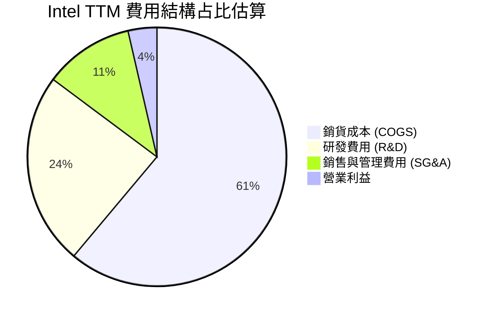

### 3.5 季度 EPS 趨勢與盈餘品質（Quality of Earnings）

| 季度 | GAAP EPS | Non-GAAP EPS (估) | OCF ($B) | FCF ($B) | 盈餘品質評估 |
|------|----------|-------------------|----------|----------|--------------|
| **Q3 2025** | $0.90 | $0.23 | $2.55B | $0.12B | 🟡 包含一次性資產處分收益 |
| **Q4 2025** | -$0.12 | $0.15 | $4.29B | $0.80B | 🟢 現金流強勁，淨利受稅率調整影響 |
| **Q1 2026** | -$0.73 | -$0.05 | $1.10B | -$2.54B | 🔴 重組費用高，Capex 支出仍高 |
| **Q2 2026** | -$2.16 | $0.35 | $7.01B | $4.45B | 🟡 營業現金流極強，GAAP 受非現金減損扭曲 |

**盈餘品質深度分析**：

| 盈餘品質項目 | 數值/占比 (TTM) | 評估與說明 |
|--------------|-----------------|------------|
| **股權薪酬 (SBC) / 營收** | $2.39B / $57.03B = **4.19%** | 🟢 處於半導體業合理區間（低於 NVDA/AMD） |
| **SBC / 營業現金流 (OCF)** | $2.39B / $14.94B = **16.00%**| 🟡 稀釋效應可控 |
| **FCF / 淨利（現金轉換率）** | 負數（淨利 -$11.29B, FCF $4.87B） | 🟡 淨利受巨額非現金減損影響，OCF 較真實 |
| **一次性損益** | Q2 2026 提列巨額處分/減損 | 🔴 GAAP 盈餘嚴重失真，應以 OCF 與 EBITDA 為準 |

---

## 4. 資產負債表分析

### 4.1 資產結構分解

截至 2026 年 6 月底，Intel 總資產達 **$202.44B**，以不動產廠房及設備 (PP&E) 為核心（占比 52.2%）。

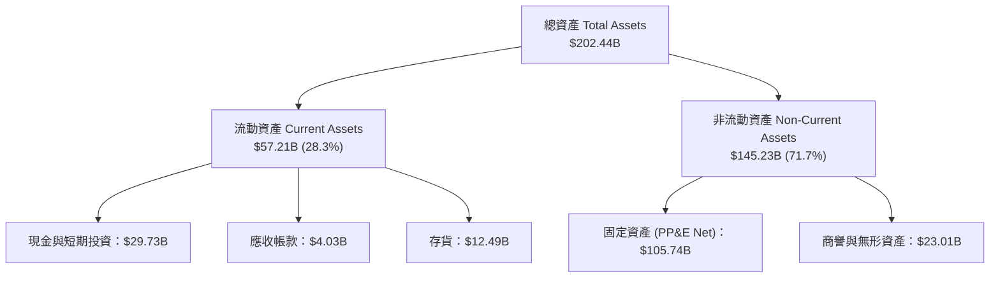

### 4.2 流動性指標分析

| 指標 | FY2023 | FY2024 | FY2025 | 最新 (Q2 '26) | 行業均值 | 評估 |
|------|--------|--------|--------|---------------|----------|------|
| **流動比率 (Current Ratio)** | 1.54 | 1.33 | 2.02 | **1.60** | 1.85 | 🟢 流動性充沛 |
| **速動比率 (Quick Ratio)** | 1.14 | 0.98 | 1.65 | **1.16** | 1.30 | 🟢 無短期清償風險 |
| **現金比率 (Cash Ratio)** | 0.89 | 0.62 | 1.19 | **0.83** | 0.75 | 🟢 現金儲備充裕 |

### 4.3 債務結構分析

```
╔══════════════════════════════════════════════════════════════════╗
║                   Intel 債務健康診斷 (Q2 2026)                  ║
╠══════════════════════════════════════════════════════════════════╣
║                                                                  ║
║  短期債務 (ST Debt)：    $1.99B   ██░░░░░░░░░░░░░░░░░░░░  可輕鬆償還║
║  長期債務 (LT Debt)：    $48.55B  ██████████████████████░  結構以長債為主║
║  總債務 (Total Debt)：   $50.54B  ███████████████████████  主要用於建廠║
║  總現金與短期投資：      $29.73B  █████████████░░░░░░░░░░  緩衝墊充足 ║
║  淨債務 (Net Debt)：     $20.81B  █████████░░░░░░░░░░░░░░  負債比率適中║
║                                                                  ║
║  Debt / Equity：  48.99%  🟢 資本結構健康                       ║
║  Net Debt / EBITDA: 1.45x  🟢 債務負擔可控                       ║
╚══════════════════════════════════════════════════════════════════╝
```

---

## 5. 現金流量深度分析

### 5.1 現金流量瀑布圖（TTM）

從營業現金流到自由現金流的轉換歷程：

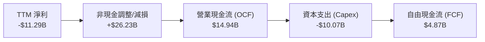

### 5.2 FCF 轉換率趨勢

| 年份 | 營業現金流 ($B) | 資本支出 ($B) | 自由現金流 ($B) | 淨利 ($B) | FCF/淨利 轉換率 |
|------|-----------------|---------------|-----------------|-----------|-----------------|
| **FY2022** | $15.43B | -$24.84B | -$9.41B | $8.01B | -117.5% (巨額 Capex) |
| **FY2023** | $11.47B | -$25.75B | -$14.28B | $1.69B | -845.0% 🔴 |
| **FY2024** | $8.29B | -$23.94B | -$15.66B | -$18.76B | N/A (虧損) |
| **FY2025** | $9.70B | -$14.65B | -$4.95B | -$0.27B | N/A (虧損) |
| **TTM (Q2'26)**| **$14.94B** | **-$10.07B** | **$4.87B** | **-$11.29B**| **轉正 (單季 FCF 強勁)** 🟢 |

### 5.3 自由現金流趨勢

```
╔══════════════════════════════════════════════════════════════════╗
║               Intel 自由現金流歷年走勢 ($B)                      ║
╠══════════════════════════════════════════════════════════════════╣
║                                                                  ║
║  FY2022   -$9.41B   ░░░░░░░░░██████                          🔴  ║
║  FY2023  -$14.28B   ░░░░░██████████                          🔴  ║
║  FY2024  -$15.66B   ░░█████████████                          🔴  ║
║  FY2025   -$4.95B   ░░░░░░░░░░░░███                          🟡  ║
║  TTM       +$4.87B  ███████░░░░░░░░  ( Capex 控管生效)       🟢  ║
║                                                                  ║
║  📊 最新 TTM FCF 殖利率：1.05% (每股 FCF ~$0.97)                 ║
╚══════════════════════════════════════════════════════════════════╝
```

---

## 6. 獲利能力與資本效率

### 6.1 ROE / ROA / ROIC 趨勢

| 指標 | FY2022 | FY2023 | FY2024 | FY2025 | TTM (Q2'26) | 評估 |
|------|--------|--------|--------|--------|-------------|------|
| **ROE** | 7.9% | 1.6% | -18.3% | -0.2% | **-10.7%** | 🔴 淨利端受減損衝擊 |
| **ROA** | 4.4% | 0.9% | -9.9% | -0.1% | **1.4%** | 🟡 營運效率逐漸恢復 |
| **ROIC** | 5.2% | 0.2% | -8.5% | -1.1% | **4.6%** | 🔴 仍低於資本成本 WACC |

### 6.2 ROIC vs WACC 分析（核心價值創造判斷）

```
╔══════════════════════════════════════════════════════════════════╗
║                INTC ROIC vs WACC 深度估估                        ║
╠══════════════════════════════════════════════════════════════════╣
║                                                                  ║
║  WACC 估算參數：                                                 ║
║  ├── 無風險利率 (10Y 美債)：  4.25%                              ║
║  ├── 市場風險溢酬 (ERP)：     5.00%                              ║
║  ├── Beta 係數：              2.187                              ║
║  ├── 股權成本 (Cost of Equity) = 4.25% + 2.187 × 5.0% = 15.19%   ║
║  ├── 債務成本 (稅後 Cost of Debt) ≈ 3.55%                        ║
║  ├── 資本結構：股權 ~75%，債務 ~25%                              ║
║  └── ✅ WACC 估算 ≈ 12.27%                                       ║
║                                                                  ║
║  ROIC 估算（TTM 化算）：                                         ║
║  ├── 年化 NOPAT ≈ $1.97B × 4 × (1 - 21%) ≈ $6.22B                ║
║  ├── 投入資本 (Invested Capital) = 股權 + 總債務 - 現金 ≈ $135.1B║
║  └── ✅ ROIC ≈ 4.60%                                             ║
║                                                                  ║
║  ★ 經濟附加價值 (EVA) = ROIC - WACC = -7.67pp                    ║
║                                                                  ║
║  ROIC  4.60%   ▓▓▓▓▓░░░░░░░░░░░░░░░░░░░░░░░░░  🔴 低於成本     ║
║  WACC  12.27%  ▓▓▓▓▓▓▓▓▓▓▓▓▓░░░░░░░░░░░░░░░░░  ──              ║
║  EVA   -7.67pp ░░░░░░░░░░░░░░░░░░░░░░░░░░░░░░  🔴 摧毀價值中   ║
║                                                                  ║
║  📊 結論：目前產能尚處於投入收割前期，未創造正向 EVA             ║
╚══════════════════════════════════════════════════════════════════╝
```

### 6.3 杜邦三因素分解

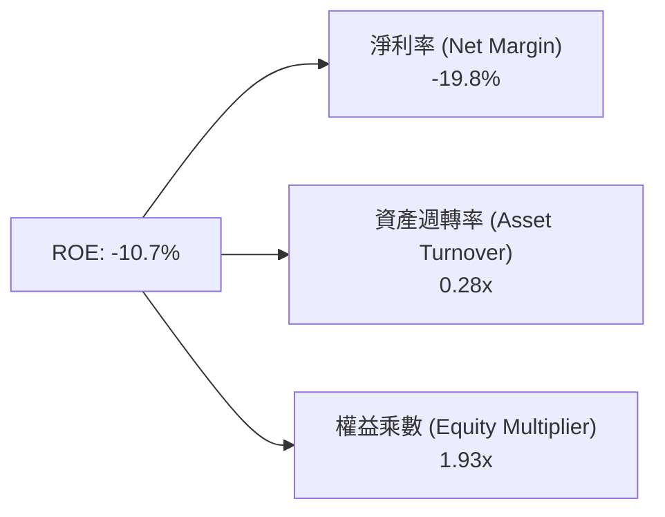

---

## 7. 估值深度分析

### 7.1 同業估值比較表格

與半導體同業（AMD、NVDA、台積電 TSM）之倍數對比：

| 估值指標 | **INTC (英特爾)** | **AMD (超微)** | **NVDA (輝達)** | **TSM (台積電)** | 本公司相對評估 |
|----------|-------------------|----------------|-----------------|------------------|----------------|
| **Forward P/E** | **46.5x** | 31.2x | 33.5x | 21.4x | 🔴 溢價偏高（反映盈餘基期低）|
| **P/S Ratio** | **8.16x** | 10.5x | 24.1x | 11.2x | 🟢 營收倍數低於同業 |
| **EV / EBITDA**| **29.8x** | 24.5x | 28.2x | 12.8x | 🔴 高於台積電與 AMD |
| **P/B Ratio** | **4.16x** | 3.85x | 38.2x | 6.20x | 🟡 處於合理區間 |
| **毛利率** | **38.9%** | 52.5% | 75.2% | 53.8% | 🔴 顯著落後同業 |

### 7.2 歷史估值區間分析

Intel 歷史 Forward P/E 均值落在 12x – 18x 之間。當前 Forward P/E 高達 **46.5x**，主因市場將其 2026/2027 年 EPS 的大幅回升納入預期。

### 7.3 情境目標價（假設驅動）

以未來 3 年營收 CAGR、營業利潤率及退出倍數建立估值模型：

| 情境 | 營收 CAGR (26-28) | 營業利潤率 (FY28E) | 退出倍數 (EV/EBITDA) | 隱含目標價 | 相對當前股價 |
|------|-------------------|--------------------|----------------------|------------|--------------|
| 🔴 **悲觀** | +2.5% | 8.0% | 15.0x | **$74.00** | **-26.2%** |
| 🟡 **基準** | **+8.5%** | **15.0%** | **22.0x** | **$115.65** | **+15.4%** |
| 🟢 **樂觀** | +15.0% | 22.0% | 28.0x | **$200.00** | **+99.5%** |

### 7.4 DCF 敏感性分析（6 格目標價矩陣）

假設 Terminal Growth Rate = 2.5%：

| 營收成長率 \ WACC | **WACC = 11.0%** | **WACC = 12.27% (基準)** | **WACC = 13.5%** |
|-------------------|------------------|--------------------------|------------------|
| 🟢 **樂觀 (+12% CAGR)** | $152.30 (+51.9%) | $132.50 (+32.2%) | $116.80 (+16.5%) |
| 🟡 **基準 (+8.5% CAGR)** | $130.40 (+30.1%) | **$115.65 (+15.4%)** | $101.20 (+1.0%) |
| 🔴 **悲觀 (+3.0% CAGR)** | $91.50 (-8.7%) | $80.20 (-20.0%) | $70.50 (-29.7%) |

### 7.5 估值綜合區間

```
╔══════════════════════════════════════════════════════════════════╗
║                  Intel 估值區間與當前位置                        ║
╠══════════════════════════════════════════════════════════════════╣
║                                                                  ║
║  悲觀情境 ($74.00)  ├───────────┐                                ║
║  當前股價 ($100.23) ├───────────┼───────▲ (當前位置)             ║
║  共識目標 ($115.65) ├───────────┼───────┼───────────┐            ║
║  樂觀情境 ($200.00) ├───────────┴───────┴───────────┴──────────┐ ║
║                    $50         $100        $150        $200      ║
║                                                                  ║
║  📊 結論：當前股價位於基準目標價與悲觀價格之間，風險報酬比中等   ║
╚══════════════════════════════════════════════════════════════════╝
```

---

## 8. 成長催化劑

### 8.1 催化劑時間軸

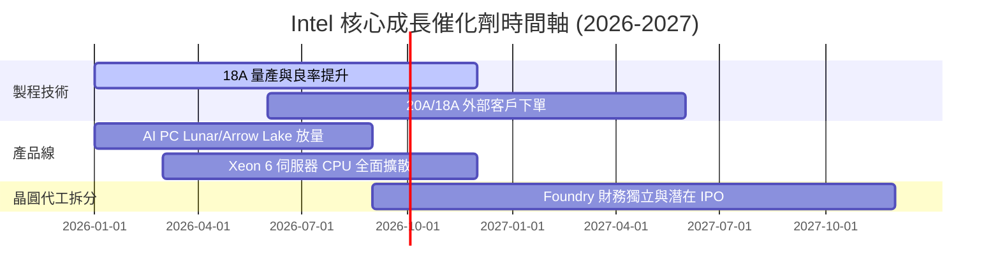

### 8.2 TAM 市場規模分析

```
╔══════════════════════════════════════════════════════════════════╗
║                   Intel 目標潛力市場 (TAM)                      ║
╠══════════════════════════════════════════════════════════════════╣
║  1. AI PC 處理器市場 (TAM 2028: $50B)                           ║
║     Intel 當前市占估算：~65% ｜ 驅動 Core Ultra 晶片出貨         ║
║                                                                  ║
║  2. 伺服器 x86 CPU 市場 (TAM 2028: $35B)                         ║
║     Intel 當前市占估算：~68% ｜ 穩固企業級資料中心與雲端市場     ║
║                                                                  ║
║  3. 先進晶圓代工與封裝市場 (TAM 2028: $120B)                     ║
║     Intel 當前市占估算：<3%  ｜ 拓展外部客戶最大的成長引擎       ║
╚══════════════════════════════════════════════════════════════════╝
```

### 8.3 成長驅動力結構圖

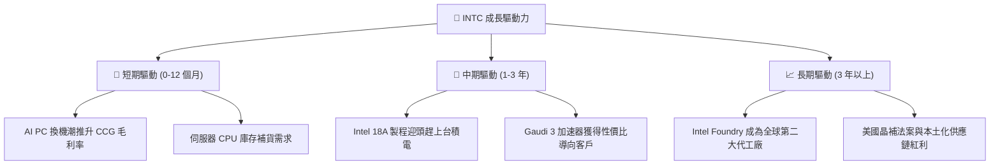

---

## 9. 風險矩陣

### 9.1 風險評分矩陣

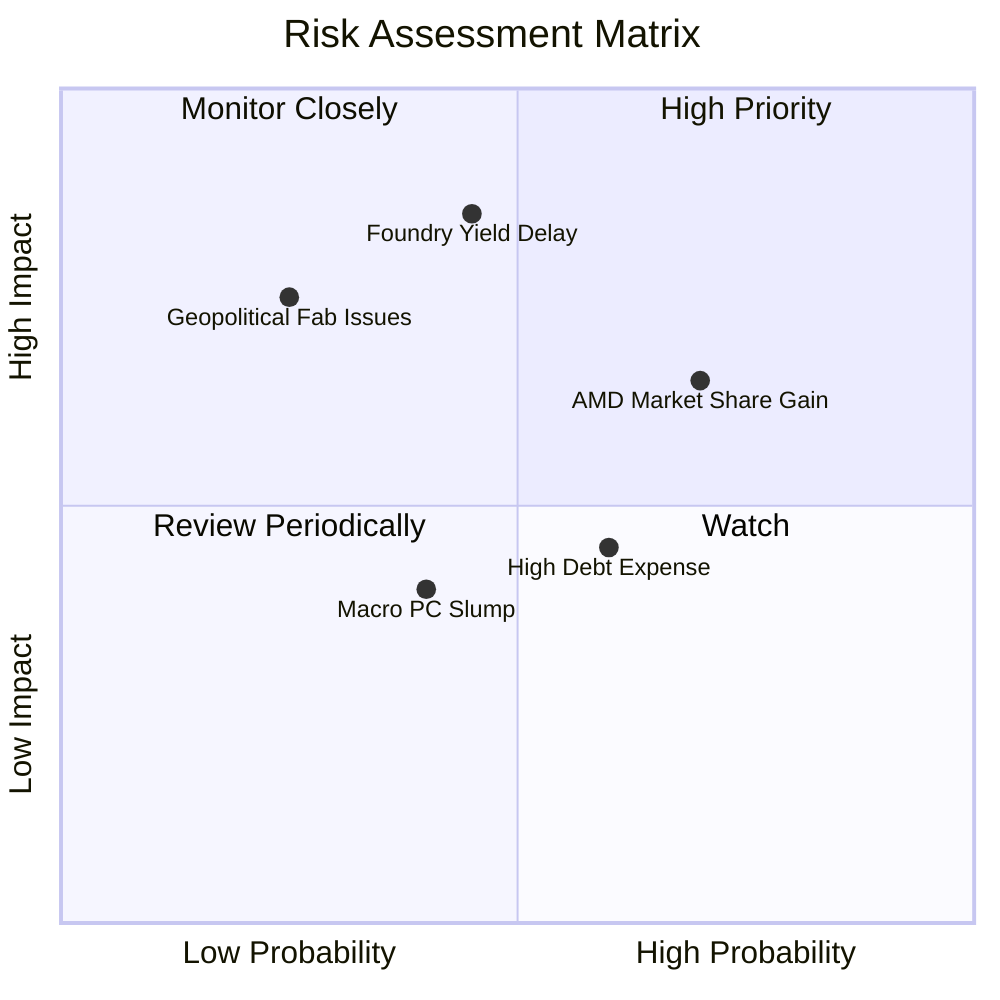

### 9.2 風險清單詳細分析

| # | 風險項目 | 發生機率 | 財務衝擊 | 風險評分 | 緩解措施 |
|---|----------|----------|----------|----------|----------|
| 1 | 🔴 **18A 製程良率不如預期** | 中 (45%) | 極高 (-15% 營收) | 🔴 **8.2/10** | 引進 ASML High-NA EUV 設備提升曝光精度 |
| 2 | 🔴 **AMD / ARM 侵蝕資料中心** | 高 (70%) | 中高 (-8% 利潤) | 🔴 **7.5/10** | 加速 Xeon 6 核心架構迭代與性價比策略 |
| 3 | 🟡 **高額利息負擔與 Capex 壓力** | 中 (60%) | 中度 (-$1B 淨利) | 🟡 **5.8/10** | 停發股利保留現金，引進 Brookfield 等資產合作 |
| 4 | 🟡 **地緣政治與美國補貼延宕** | 低 (25%) | 高 (-$3B 現金) | 🟡 **5.0/10** | 與美國聯邦政府密切溝通 CHIPS Act 撥款細節 |

---

## 10. 投資建議

### 10.1 最終綜合評級雷達圖

```
╔══════════════════════════════════════════════════════════════╗
║                Intel Corporation 綜合評級                   ║
╠══════════════════════════════════════════════════════════════╣
║ 基本面強度    6.0/10  ▓▓▓▓▓▓▓▓▓▓▓▓░░░░░░░░  ★★★☆☆         ║
║ 成長動能      6.5/10  ▓▓▓▓▓▓▓▓▓▓▓▓▓░░░░░░░  ★★★☆☆         ║
║ 獲利品質      4.5/10  ▓▓▓▓▓▓▓▓▓░░░░░░░░░░░  ★★☆☆☆         ║
║ 財務健康      5.5/10  ▓▓▓▓▓▓▓▓▓▓▓░░░░░░░░░  ★★★☆☆         ║
║ 估值合理性    5.0/10  ▓▓▓▓▓▓▓▓▓▓░░░░░░░░░░  ★★★☆☆         ║
╠══════════════════════════════════════════════════════════════╣
║ 綜合評分      5.7/10  ▓▓▓▓▓▓▓▓▓▓▓░░░░░░░░░  🟡 持有 (HOLD) ║
╚══════════════════════════════════════════════════════════════╝
```

### 10.2 目標價與隱含報酬率

| 情境 | 隱含目標價 | 隱含預期報酬率 | 發生機率權重 | 權重後目標價貢獻 |
|------|------------|----------------|--------------|------------------|
| 🔴 **悲觀情境** | $74.00 | -26.17% | 25% | $18.50 |
| 🟡 **基準情境** | $115.65 | +15.38% | 55% | $63.61 |
| 🟢 **樂觀情境** | $200.00 | +99.54% | 20% | $40.00 |
| **加權平均目標價** | — | — | **100%** | **$122.11 (+21.8%)** |

### 10.3 買入時機與觸發因素

```
╔══════════════════════════════════════════════════════════════════╗
║                  ✅ 投資行動 Check List                        ║
╠══════════════════════════════════════════════════════════════════╣
║  進場觀望條件（滿足多數時可考慮加碼）：                          ║
║  ☐ 股價拉回至悲觀區間附近（$80.00 – $85.00）                    ║
║  ✅ Q2 2026 營收與 OCF 現金流顯著改善（已達成）                 ║
║  ☐ 晶圓代工部門 (Foundry) 單季虧損縮減 > 30%                     ║
║                                                                  ║
║  加碼觸發條件：                                                  ║
║  ☐ 宣佈獲取前五大 CSP/晶片巨頭之 18A 晶圓代工正式訂單            ║
║  ☐ 單季毛利率穩定回升至 > 45%                                   ║
║                                                                  ║
║  停損/減碼觸發條件：                                             ║
║  ☐ 18A 製程發生重大技術延宕或良率低於 40%                        ║
║  ☐ Data Center Xeon 伺服器市占率跌破 55%                        ║
╚══════════════════════════════════════════════════════════════════╝
```

### 10.4 投資人適配度分析

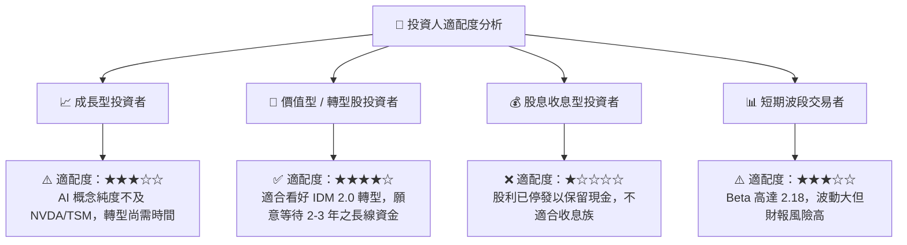

### 10.5 每季財報監控清單（Quarterly Watch List）

| 監控指標 | 最新季度基準 (Q2 '26) | 樂觀看多門檻 | 警訊/減碼門檻 |
|----------|-----------------------|--------------|---------------|
| **單季營收 (Total Revenue)** | $16.13B | > $17.00B | < $13.50B |
| **整體毛利率 (Gross Margin)**| 40.4% | > 44.0% | < 35.0% |
| **單季自由現金流 (FCF)** | $4.45B | > $3.00B | < -$1.00B |
| **Data Center (DCAI) 營收** | ~$4.80B (估) | > $5.50B | < $4.00B |

### 10.6 反面論證：什麼會證明論點錯誤（What Would Change My Mind）

```
╔══════════════════════════════════════════════════════════════════╗
║              ⚠️ 論點失效條件（Disconfirming Evidence）           ║
╠══════════════════════════════════════════════════════════════════╣
║  本評級與基本面假設在下列情況發生時需重新檢討並下調：            ║
║  1. 營收成長動能再度失速，季度營收連續兩季 YoY < 0%             ║
║  2. ROIC 持續低於 5%，無法縮小與 WACC (12.27%) 之擴張差距        ║
║  3. 18A 製程無任何大型外部客戶簽署產能預約協定                  ║
║  4. 自由現金流轉負且年化 Capex 再度膨脹至 > $20B                 ║
╚══════════════════════════════════════════════════════════════════╝
```

---

> **免責聲明**：本報告由 AI 分析模型根據提供之財務數據自動生成，內容僅供研究與投資參考，不構成任何買賣建議。投資具有風險，投資人應獨立思考並自負盈虧。