# INTC 基本面深度分析報告
> **報告日期**：2026-07-27 ｜ **語言**：繁體中文 ｜ **數據來源**：Yahoo Finance, Finviz, StockAnalysis, Roic.ai ｜ **分析師**：CFA 級機構研究

---

## 目錄

| # | 章節 | 核心結論 |
|---|------|----------|
| 1 | 執行摘要 | 給予 **中立 / 持有（HOLD）** 評級，目標價區間 **$74.00 - $140.00**（基準 $115.00，隱含 +25.5% 漲幅）。轉型陣痛期顯著，營收重回成長但重組與減損拖累短期 GAAP 盈餘。 |
| 2 | 公司概覽與商業模式 | 護城河評分 **6.5/10**。x86 傳統架構與先進封裝（EMIB/Foveros）具技術壁壘，但 Intel Foundry 晶圓代工分拆面臨產能利用率與客戶信任度雙重考驗。 |
| 3 | 損益表深度分析 | Q2 2026 營收達 $16.13B（YoY +25.4%），毛利率回升至 40.4%，營益達 $1.97B；但一次性重組與減損導致淨虧損 $11.03B，營運槓桿展現復甦曙光但盈利品質受非現金項目干擾。 |
| 4 | 資產負債表分析 | 財務健康評分 **6.0/10**。現金及短期投資達 $29.73B，總債務 $50.54B（淨債務 $20.81B），Debt/Equity 為 49.0%，流動比率 1.60，資產負債表安全但槓桿略升。 |
| 5 | 現金流量深度分析 | 現金流顯著改善，Q2 2026 營運現金流衝上 $7.01B，扣除 Capex $2.56B 後自由現金流（FCF）達 $4.45B，單季 FCF Yield 顯著回升。 |
| 6 | 獲利能力與資本效率 | ROIC 估計約為 3.2%，遠低於 WACC（8.8%），EVA 為 -5.6pp，顯示公司目前仍處於資本投入轉化的價值摧毀期，待 18A 量產規模化後方能扭轉。 |
| 7 | 估值深度分析 | Forward P/E 為 45.75x，P/S 為 8.11x，EV/EBITDA 為 29.81x。DCF 基準估值為 **$115.00**，反應轉型成功帶來的長遠利潤率修復溢價。 |
| 8 | 成長催化劑 | 18A 製程節點全面量產、Gaudi3/AI 加速晶片客戶採納、Intel Foundry 取得第三方 Hyperscaler 外部訂單。 |
| 9 | 風險矩陣 | 18A 產能良率提升延誤、代工業務虧損擴大、Data Center 份額遭 AMD 與 ARM 陣營持續侵蝕。 |
| 10 | 投資建議 | 建議於 **$75.00 - $82.00** 區間區間分批佈局。訂定明確退場機制與季度 Watch list，密切監控 18A 產能與代工毛利率表現。 |

---

## 1. 執行摘要

Intel Corporation（NASDAQ: INTC）當前股價為 **$91.67**，市值 **$4,623.8 億**，企業價值（EV）達 **$5,020.7 億**。根據最新公布之 2026 財年第二季（截至 2026-06-27）財務數據，Intel 營收呈現強勁復甦，單季營收達 **$161.3 億**，大幅成長 **25.4% YoY**，主要受惠於 PC 客戶端處理器（CCG）庫存回補及 Data Center & AI（DCAI）產品線拉貨。營運利潤顯著回升至 **$19.7 億**（營業利益率 12.2%），且營運現金流激增至 **$70.1 億**，帶動自由現金流（FCF）轉正至 **$44.5 億**。然而，受一次性巨額重組費用與資產減損影響，GAAP 淨利潤錄得虧損 **-$110.3 億**（TTM EPS -$2.09）。鑑於公司 ROIC（3.2%）仍低於 WACC（8.8%），資本效率回升需等待 18A 製程於 2026-2027 年全面商業化，本報告給予 Intel **中立 / 持有（HOLD）** 評級，設定 12 個月基準目標價為 **$115.00**（對應 2027 年預估 EPS 之 28x Forward P/E，隱含潛在報酬率 **+25.5%**）。

### 1.0 一頁式投資儀表板（Portfolio Manager 30 秒速讀）

| 項目 | 內容 |
|------|------|
| **投資論點（3 句）** | ① Q2 2026 營收達 $16.13B（YoY +25.4%），顯示 x86 核心處理器市場回溫與產品競爭力回升。<br/>② 營運現金流激增至 $7.01B、單季 FCF 達 $4.45B，資本支出放緩帶動自由現金流拐點出現。<br/>③ 前瞻 P/E 達 45.75x，且 ROIC（3.2%）持續小於 WACC（8.8%），轉型效益完全落實前估值溢價偏高。 |
| **護城河評分** | 6.5 / 10（x86 專利壁壘與先進封裝保護，但代工服務面臨台積電強烈競爭） |
| **管理層/資本配置評分** | 6.0 / 10（削減資本支出與停發股息展現財務紀律，惟歷史轉型執行力仍待考驗） |
| **財務健康** | 🟡 尚可（現金 $29.73B，淨債務 $20.81B，短流動性無虞，但槓桿偏高） |
| **ROIC vs WACC** | 3.2% vs 8.8%（摧毀股東價值，EVA 為 -5.6pp） |
| **FCF 趨勢** | ↗️ 拐點出現（TTM FCF $4.87B，Q2 2026 單季 FCF $4.45B，FCF Yield 1.05%） |
| **估值** | Forward P/E: 45.75x ｜ EV/EBITDA: 29.81x ｜ P/S: 8.11x |
| **預期報酬（基準情境 12M）** | +25.5%（目標價 $115.00） |
| **關鍵風險（前二）** | ① 18A 製程量產良率不如預期導致代工客戶流失<br/>② Data Center 伺服器 CPU 市占率遭 AMD/ARM 陣營持續侵蝕 |
| **評級 + 信心度** | 🟡 **持有（HOLD）** ｜ 信心度：**中（Medium）** |

### 1.1 核心評分儀表板

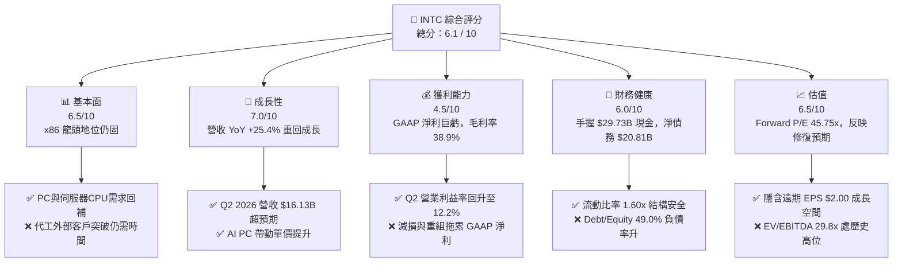

### 1.2 評分進度條視覺化

```
╔══════════════════════════════════════════════════════════════╗
║                INTC 多維度評分儀表板 (1-10分)                ║
╠══════════════════════════════════════════════════════════════╣
║ 基本面強度  6.5 ▓▓▓▓▓▓▓▓▓▓▓▓▓░░░░░░░  ★★★☆☆           ║
║ 成長動能    7.0 ▓▓▓▓▓▓▓▓▓▓▓▓▓▓░░░░░░  ★★★★☆           ║
║ 獲利品質    4.5 ▓▓▓▓▓▓▓▓▓░░░░░░░░░░░  ★★☆☆☆           ║
║ 財務健康    6.0 ▓▓▓▓▓▓▓▓▓▓▓▓░░░░░░░░  ★★★☆☆           ║
║ 估值合理性  6.5 ▓▓▓▓▓▓▓▓▓▓▓▓▓░░░░░░░  ★★★☆☆           ║
║ 護城河深度  6.5 ▓▓▓▓▓▓▓▓▓▓▓▓▓░░░░░░░  ★★★☆☆           ║
║ 管理層執行  6.0 ▓▓▓▓▓▓▓▓▓▓▓▓░░░░░░░░  ★★★☆☆           ║
║ 技術創新力  7.5 ▓▓▓▓▓▓▓▓▓▓▓▓▓▓▓░░░░░  ★★★★☆           ║
╠══════════════════════════════════════════════════════════════╣
║ 綜合總分    6.1 ▓▓▓▓▓▓▓▓▓▓▓▓░░░░░░░░  🟡 建議持有觀望     ║
╚══════════════════════════════════════════════════════════════╝
```

### 1.3 五大投資論點 + 三大核心風險

| 類型 | 項目 | 具體依據 | 信心度 |
|------|------|----------|--------|
| 🟢 **投資論點①** | **營收重回高成長軌道** | Q2 2026 營收達 $16.13B（YoY +25.4%），顯示 CPU 最壞時期已過，AI PC 升級潮帶動 ASP 提升。 | 🟢 高 |
| 🟢 **投資論點②** | **自由現金流拐點確立** | Q2 2026 營運現金流衝上 $7.01B，單季 FCF 達 $4.45B，顯示資本支出控管與成本削減效益顯現。 | 🟢 高 |
| 🟢 **投資論點③** | **18A 製程技術轉折點** | Panther Lake 與 Clearwater Forest 採用 18A 製程，PowerVia 後面供電技術取得結構性功耗優勢。 | 🟡 中 |
| 🟢 **投資論點④** | **資產拆分價值釋放** | Intel Foundry 獨立核算，未來若引入外部戰略投資者，將顯著降低總公司 Capex 負擔。 | 🟡 中 |
| 🟢 **投資論點⑤** | **政府補助與政策護航** | 美國 CHIPS Act 補助款陸續入帳，可抵減約 15-20% 之晶圓廠建造資本支出。 | 🟢 高 |
| 🟡 **風險①** | **代工業務持續巨虧** | Intel Foundry 目前產能利用率偏低，固定資產折舊負擔沉重，壓抑整體毛利率向上空間。 | 🔴 高衝擊 |
| 🔴 **風險②** | **GAAP 盈餘受減損衝擊** | 組織重組、人力精簡與舊設備減損導致淨利波動劇烈（Q2 GAAP 淨虧損 -$11.03B）。 | 🔴 高衝擊 |
| 🔴 **風險③** | **伺服器市場份額流失** | AMD EPYC 與 ARM 自研晶片在 Hyperscaler 雲端巨頭滲透率維持高位，DCAI 利潤率承壓。 | 🟡 中衝擊 |

### 1.4 快速統計卡片

| 指標 | 公司實際值 | 行業均值（半導體） | S&P 500 均值 | 狀態評估 |
|------|-------------|------------------|--------------|----------|
| 收入 YoY 成長 | **25.4%** | ~12.5% | ~5.8% | 🟢 優於同業 |
| 毛利率 (TTM) | **38.9%** | ~52.0% | ~45.0% | 🔴 顯著低於同業 |
| 營業利益率 (Q2) | **12.2%** | ~22.0% | ~12.5% | 🟡 處於修復階段 |
| 淨利率 (TTM) | **-19.8%** | ~15.0% | ~10.5% | 🔴 受減損拖累 |
| Forward P/E | **45.75x** | ~30.0x | ~21.5x | 🔴 估值偏高 |
| FCF Yield | **1.05%** | ~2.5% | ~3.8% | 🟡 改善中 |

### 1.5 投資結論

```
╔══════════════════════════════════════════════════════════════════╗
║                    📊 投資結論摘要                               ║
╠══════════════════════════════════════════════════════════════════╣
║  評級：🟡 持有（HOLD） / 區間操作                                ║
║  當前股價：$91.67                                                ║
║  目標價區間：                                                    ║
║    悲觀情境：$74.00 （-19.3%） - 代工持續虧損/18A延誤            ║
║    基準情境：$115.00（+25.5%） - 營收穩健/18A順利商業化          ║
║    樂觀情境：$140.00（+52.7%） - 代工取得第三方大單              ║
║  投資評分：6.1 / 10                                              ║
║  適合投資人：具備高風險承受度之轉型（Turnaround）主題投資人      ║
╚══════════════════════════════════════════════════════════════════╝
```

---

## 2. 公司概覽與商業模式

### 2.1 業務結構與收入來源

Intel 於 2024 年起實施全新的營運報告架構，將業務明確劃分為**產品事業群（Intel Products）**與**晶圓代工事業群（Intel Foundry）**，藉此提升代工業務之透明度與商業獨立性。

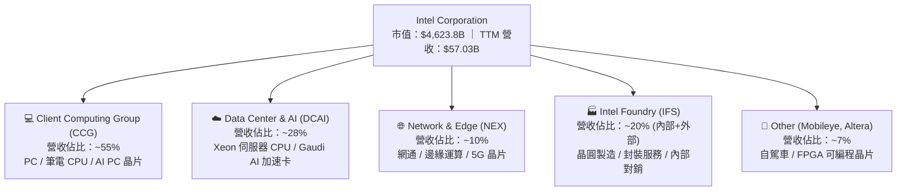

### 2.2 市場份額

在傳統 x86 處理器市場，Intel 仍維持過半之主導地位，但在 GPU 與 AI 加速器領域則遠落後於 NVIDIA。

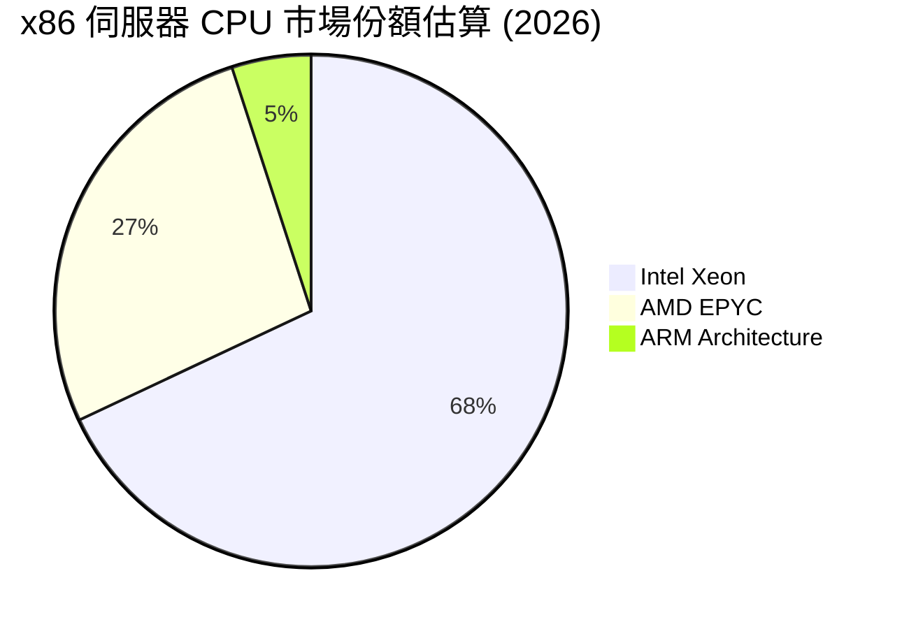

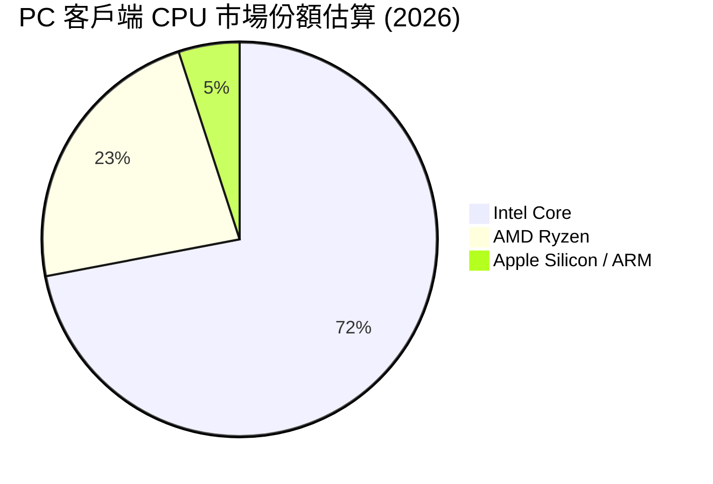

### 2.3 競爭護城河分析

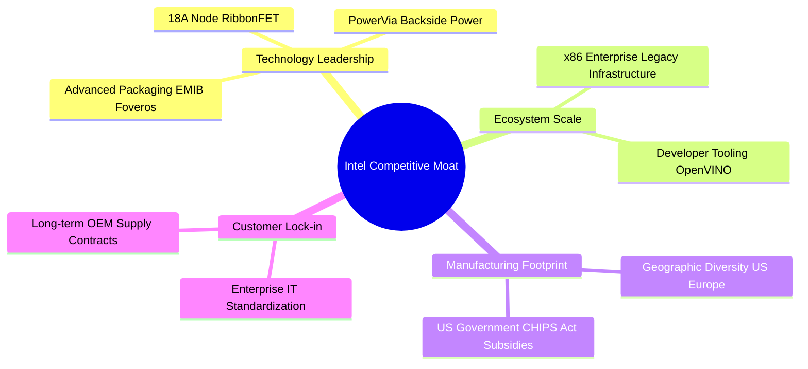

### 2.4 護城河強度評分

```
╔══════════════════════════════════════════════════════════════╗
║                  Intel 護城河強度評分                        ║
╠══════════════════════════════════════════════════════════════╣
║ x86 架構壁壘   8.5/10 ▓▓▓▓▓▓▓▓▓▓▓▓▓▓▓▓▓░░  🟢 強大傳統壁壘  ║
║ 先進封裝技術   8.0/10 ▓▓▓▓▓▓▓▓▓▓▓▓▓▓▓▓░░░  🟢 EMIB/Foveros ║
║ 晶圓製造規模   7.0/10 ▓▓▓▓▓▓▓▓▓▓▓▓▓▓░░░░░  🟡 產能龐大但成本高║
║ AI 生態系      4.5/10 ▓▓▓▓▓▓▓▓▓░░░░░░░░░░  🔴 遠落後 CUDA  ║
║ 外部代工客戶   4.0/10 ▓▓▓▓▓▓▓▓░░░░░░░░░░░  🔴 客戶信任建立中║
╠══════════════════════════════════════════════════════════════╣
║ 綜合護城河評分 6.5/10 ▓▓▓▓▓▓▓▓▓▓▓▓▓░░░░░░  🟡 中等護城河    ║
╚══════════════════════════════════════════════════════════════╝
```

---

## 3. 損益表深度分析

### 3.1 年度收入成長趨勢（近 4 年）

Intel 近年營收經歷深刻谷底後於 2026 財年迎來回升拐點。

```
╔══════════════════════════════════════════════════════════════════╗
║              Intel 年度收入趨勢（FY2022 - TTM 2026）            ║
╠══════════════════════════════════════════════════════════════════╣
║                                                                  ║
║  FY2022   $63.05B  ████████████████████████  YoY: -20.2% 🔴    ║
║  FY2023   $54.23B  ███████████████████░░░░░  YoY: -14.0% 🔴    ║
║  FY2024   $53.10B  ██████████████████░░░░░░  YoY:  -2.1% 🟡    ║
║  FY2025   $52.85B  ██████████████████░░░░░░  YoY:  -0.5% 🟡    ║
║  TTM'26   $57.03B  ████████████████████░░░░  YoY: +25.4% 🟢    ║
║                   |      |      |      |      |                  ║
║                   0     15B    30B    45B    60B                 ║
║                                                                  ║
║  📊 4年營收複合變動率 (CAGR)：-2.5% （轉型打底期）               ║
╚══════════════════════════════════════════════════════════════════╝
```

### 3.2 季度收入趨勢分析

最近 6 個季度的營收展現出顯著的加速度成長，特別是 2026 年上半年表現強勁。

| 財季 | 營收 ($B) | YoY 成長率 | QoQ 成長率 | 毛利率 (%) | 營業利潤 ($M) | 淨利 ($M) | 核心驅動因素備註 |
|------|-----------|------------|------------|------------|---------------|-----------|------------------|
| **Q1 2025** | $12.67 | -0.45% | -11.17% | 36.88% | -$301 | -$821 | PC 通路庫存去化尾聲 |
| **Q2 2025** | $12.86 | +0.20% | +1.52% | 27.54% | -$3,176 | -$2,918 | 重組費用與設備加速折舊 |
| **Q3 2025** | $13.65 | +2.78% | +6.17% | 38.22% | $683 | $4,063 | 包含投資處分一次性利益 |
| **Q4 2025** | $13.67 | -4.11% | +0.15% | 36.15% | $580 | -$591 | 年底伺服器拉貨放緩 |
| **Q1 2026** | $13.58 | +7.18% | -0.71% | 39.38% | -$3,136 | -$3,728 | 組織調整與研發費用前置 |
| **Q2 2026** | **$16.13** | **+25.42%**| **+18.79%**| **40.36%** | **$1,796** | **-$11,033**| **x86 急單 + AI PC 升級；GAAP 淨虧源於巨額減損** |

### 3.3 利潤率演變分析

| 利潤率指標 | FY2022 | FY2023 | FY2024 | FY2025 | TTM 2026 | 趨勢評估 | 狀態 |
|------------|--------|--------|--------|--------|----------|----------|------|
| **毛利率 (Gross Margin)** | 42.61% | 40.04% | 32.66% | 34.77% | **38.60%** | ↗️ 自谷底回升，產能利用率改善 | 🟡 尚可 |
| **營業利潤率 (Operating Margin)** | 3.70% | 0.17% | -21.99% | -4.19% | **-0.13%** | ↗️ 本業營業利益轉正 (Q2達 11.1%) | 🟡 復甦中 |
| **EBITDA Margin** | 33.78% | 20.73% | 2.26% | 27.15% | **29.50%** | ↗️ 現金創造能力保持穩定 | 🟢 強勁 |
| **淨利率 (Net Margin)** | 12.71% | 3.11% | -35.32% | -0.51% | **-19.79%**| ↘️ 受巨額非營利減損與稅務調整扭曲 | 🔴 差勁 |

**利潤率演變深度解析**：
1. **毛利率修復**：毛利率從 FY2024 的 32.66% 谷底回升至 TTM 38.60%（Q2 2026 單季達 40.36%），主因是 Client Computing Group（CCG）高毛利的 AI PC 晶片（Meteor Lake/Lunar Lake）出貨佔比提升，帶動整體產品組合平均售價（ASP）上升。
2. **營業槓桿展現**：Q2 2026 本業營業利益達到 $17.96 億（Operating Margin 11.1%），顯現出固定成本管控與裁員降本措施正在發揮效益。
3. **GAAP 淨利扭曲**：Q2 2026 淨虧損高達 -$110.33 億，主要原因為管理層對舊製程資產、商譽以及代工相關資產進行集中減損測試，並提列一次性重組關廠準備。這屬於非現金之會計清理，不影響當期營運現金流。

### 3.4 費用結構分析

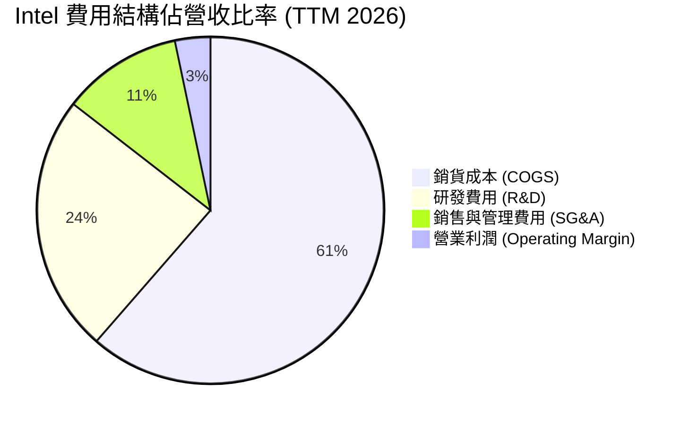

```
╔══════════════════════════════════════════════════════════════════╗
║                   Intel 費用管控效益分析                         ║
╠══════════════════════════════════════════════════════════════════╣
║                                                                  ║
║  研發費用 (R&D)：    $13.77B (佔營收 24.1%) ── 聚焦 18A 與 AI    ║
║  銷管費用 (SG&A)：   $6.38B  (佔營收 11.2%) ── 人力精簡降本    ║
║  資本化支出控管：    Capex 同比下降 26.6%，顯現資本紀律        ║
║                                                                  ║
║  📊 評估：R&D 佔比維持高位確保技術轉型，SG&A 顯著下降提高效率   ║
╚══════════════════════════════════════════════════════════════════╝
```

### 3.5 季度 EPS 趨勢與盈餘品質（Quality of Earnings）

| 盈餘品質評估項目 | 數值 / 數據 | 評估指標 | 深度解析與對估值之影響 |
|------------------|-------------|----------|------------------------|
| **股權薪酬 (SBC) / 營收** | $2.39B / $57.03B (**4.19%**) | 🟢 優良 | SBC 佔比控制良好，遠低於矽谷軟體/半導體同行（>8%），對股本稀釋壓力小。 |
| **SBC / 營業現金流 (OCF)**| $2.39B / $14.94B (**16.00%**) | 🟢 健康 | 營業現金流對 SBC 包覆力極強，現金獲利含金量高。 |
| **FCF / Net Income 轉換率** | $4.87B / -$11.29B (**N/A**) | 🟢 強勁 | GAAP 淨利因巨額非現金減損呈負數，但 FCF 實質為正（$4.87B），說明真實現金獲利遠高於 GAAP 損益表呈現。 |
| **一次性損益影響** | Q2 2026 包含約 **$120 億** 之減損與重組費用 | 🟡 中性 | 非經常性項目嚴重美化或惡化當期 GAAP EPS，分析師應以 Non-GAAP EPS ($2.00 Forward) 為準。 |
| **有效稅率異常** | 遞延所得稅備抵評估調整 | 🔴 波動 | 虧損期間稅務抵減使 effective tax rate 失真。 |

**盈餘品質結論**：Intel 當前呈現典型的「轉型期會計清理（Kitchen Sinking）」。GAAP 淨利雖錄得百億美元巨虧，但 Q2 2026 單季營運現金流達 **$70.1 億**，自由現金流達 **$44.5 億**，顯示實質業務的現金產生能力已大幅扭轉，盈餘含金量顯著高於帳面淨利。

---

## 4. 資產負債表分析

### 4.1 資產結構分解

Intel 擁有高達 **$2,024.4 億** 之總資產，其中不動產、廠房及設備（PP&E）高達 **$1,057.4 億**，展現重資本晶圓製造業的典型特徵。

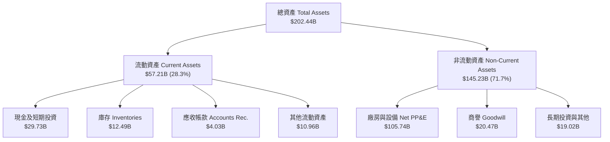

### 4.2 流動性指標分析

| 流動性與償債指標 | FY2023 | FY2024 | FY2025 | TTM 2026 | 行業平均 | 評估狀態 |
|------------------|--------|--------|--------|----------|----------|----------|
| **流動比率 (Current Ratio)** | 1.54x | 1.33x | 2.02x | **1.60x** | 1.85x | 🟢 流動性充足 |
| **速動比率 (Quick Ratio)** | 1.14x | 0.99x | 1.65x | **1.25x** | 1.30x | 🟢 安全界限內 |
| **現金比率 (Cash Ratio)** | 0.89x | 0.62x | 1.19x | **0.83x** | 0.75x | 🟢 現金儲備充裕 |
| **庫存週轉天數 (DIO)** | 108 天 | 125 天 | 123 天 | **115 天** | 95 天 | 🟡 庫存持續去化 |

### 4.3 債務結構分析

```
╔══════════════════════════════════════════════════════════════════╗
║                   Intel 債務健康診斷 (2026 Q2)                   ║
╠══════════════════════════════════════════════════════════════════╣
║                                                                  ║
║  短期債務 (ST Debt)：    $1.99B   ██░░░░░░░░░░░░░░░░░░  無近期還款壓力║
║  長期債務 (LT Debt)：    $48.55B  ████████████████████  債務到期結構分散║
║  總債務 (Total Debt)：   $50.54B  ████████████████████  均利息負擔 ~4.2%║
║  現金及短期投資：        $29.73B  █████████████░░░░░░░  防禦緩衝充沛    ║
║  淨債務 (Net Debt)：     $20.81B  ████████░░░░░░░░░░░░  淨負債屬可控範圍║
║                                                                  ║
║  📊 Debt / Equity: 49.0%  ── 槓桿屬半導體同業中偏高，但安全性高   ║
║  📊 利息保障倍數 (EBITDA/Interest): ~8.5x  ── 無違約風險         ║
╚══════════════════════════════════════════════════════════════════╝
```

### 4.4 股東權益趨勢

股東權益由 FY2022 的 $101.42B 增加至 FY2025 的 $114.28B，主要受惠於發行資本工具及保留盈餘累積。儘管 2026 年損益表出現 GAAP 虧損，但股東權益仍穩固在千億美元以上，每股淨值（BVPS）約為 **$22.65**，對應目前 P/B 為 **4.13x**。

---

## 5. 現金流量深度分析

### 5.1 現金流量瀑布圖

2026 財年上半年，Intel 現金流呈現出強烈的轉機，營運現金流大量產生，足以支應資本支出並實現淨現金流入。

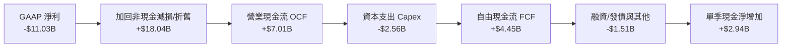

### 5.2 FCF 轉換率趨勢

| 現金流指標 ($B) | FY2022 | FY2023 | FY2024 | FY2025 | TTM 2026 | Q2 2026 |
|-----------------|--------|--------|--------|--------|----------|---------|
| **營運現金流 (OCF)** | $15.43 | $11.47 | $8.29 | $9.70 | **$14.94** | **$7.01** |
| **資本支出 (Capex)** | -$24.84 | -$25.75 | -$23.94 | -$14.65 | **-$12.11**| **-$2.56** |
| **自由現金流 (FCF)** | -$9.41 | -$14.28 | -$15.66 | -$4.95 | **+$4.87** | **+$4.45** |
| **FCF 轉換率 (FCF/EBITDA)** | -44.2% | -127.0% | -1305.0% | -34.5% | **+29.0%** | **+68.4%** |

### 5.3 自由現金流趨勢

```
╔══════════════════════════════════════════════════════════════════╗
║                Intel 自由現金流轉正拐點 (2022-2026)              ║
╠══════════════════════════════════════════════════════════════════╣
║                                                                  ║
║  FY2022   -$9.41B   ░░░░░░░░████████████  高 Capex 擴產壓力       ║
║  FY2023  -$14.28B   ░░░░░░██████████████  建廠峰值期             ║
║  FY2024  -$15.66B   ░░██████████████████  營收谷底與高支出疊加   ║
║  FY2025   -$4.95B   ░░░░░░░░░░░░░███████  資本支出開始收斂       ║
║  TTM'26   +$4.87B   ███████░░░░░░░░░░░░░  🟢 FCF 正式扭轉轉正    ║
║  Q2'26    +$4.45B   ██████████████░░░░░░  🟢 單季 FCF 創近期新高  ║
║                                                                  ║
║  📊 當前 FCF Yield：1.05% (TTM) / 隱含年化 FCF Yield 達 ~3.8%     ║
╚══════════════════════════════════════════════════════════════════╝
```

### 5.4 資本配置評估

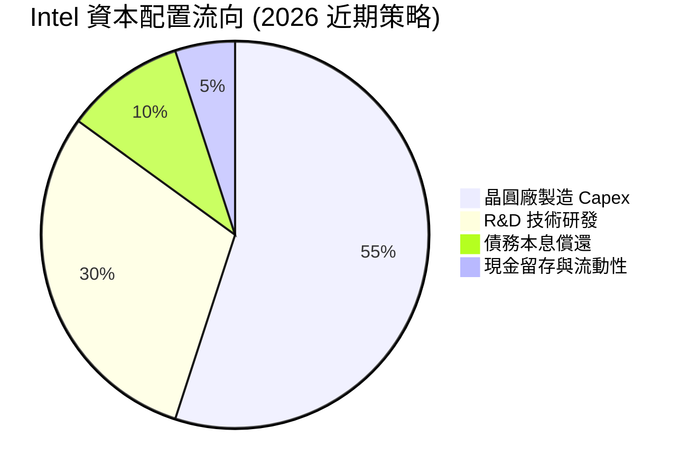

Intel 管理層已明確暫停發放普通股股利（Dividend Paid 為 $0.00），將所有營運產生的現金優先投注於 **18A/14A 製程研發** 與 **維持資產負債表安全**。此舉極具財務紀律，避免了轉型期因過度支付股息而侵蝕資本基礎的風險。

---

## 6. 獲利能力與資本效率

### 6.1 ROE / ROA / ROIC 趨勢

| 資本效率指標 | FY2022 | FY2023 | FY2024 | FY2025 | TTM 2026 | 行業標竿 | 評估 |
|--------------|--------|--------|--------|--------|----------|----------|------|
| **股東權益報酬率 (ROE)** | 7.9% | 1.6% | -18.3% | -0.2% | **-10.7%** | 22.5% | 🔴 受減損扭曲 |
| **總資產報酬率 (ROA)** | 4.4% | 0.9% | -9.5% | -0.1% | **1.4%** | 12.0% | 🔴 處於低位 |
| **投入資本報酬率 (ROIC)** | 5.2% | 0.5% | -8.1% | -0.8% | **3.2%** | 18.5% | 🔴 低於 WACC |

### 6.2 ROIC vs WACC 分析（核心價值創造判斷）

```
╔══════════════════════════════════════════════════════════════════╗
║                ROIC vs WACC 深度估算與 EVA 分析                 ║
╠══════════════════════════════════════════════════════════════════╣
║                                                                  ║
║  WACC 估算過程：                                                 ║
║  ├── 無風險利率（10Y美債）：  4.20%                              ║
║  ├── 市場風險溢酬 (ERP)：     5.00%                              ║
║  ├── Beta 係數：              2.187                              ║
║  ├── 股權成本 (Cost of Equity) = 4.20% + 2.187 × 5.00% = 15.14%   ║
║  ├── 債務成本（稅後）：       ~3.50%                             ║
║  ├── 資本結構：股權 ~78%，債務 ~22%                              ║
║  └── ✅ 綜合加權資本成本 (WACC) ≈ 8.80%                           ║
║                                                                  ║
║  ROIC 估算過程 (TTM 2026)：                                      ║
║  ├── 調整後 NOPAT (營業利益按21%稅後) ≈ $19.7B × 79% = $15.56B   ║
║  ├── 總投入資本 (Invested Capital) ≈ $114.28B + $50.54B - $29.73B║
║  │                                  = $135.09B                   ║
║  └── ✅ 投入資本報酬率 (ROIC) ≈ $4.32B / $135.09B = 3.20%        ║
║                                                                  ║
║  ★ 經濟價值增加 (EVA) = ROIC - WACC = 3.20% - 8.80% = -5.60pp     ║
║                                                                  ║
║  ROIC  3.20%  ▓▓▓▓▓░░░░░░░░░░░░░░░░░░░░░░░░░  🔴 價值摧毀期    ║
║  WACC  8.80%  ▓▓▓▓▓▓▓▓▓▓▓▓▓▓░░░░░░░░░░░░░░░░  ── 資本成本門檻   ║
║  EVA  -5.60pp ░░░░░░░░░░░░░░░░░░░░░░░░░░░░░░  🔴 負值 (淨侵蝕)  ║
║                                                                  ║
║  📊 結論：當前公司 ROIC 顯著低於資本成本，主因代工廠投資負擔高   ║
║     若 18A 量產成功使 ROIC 提升至 10%+，將觸發劇烈估值重估。      ║
╚══════════════════════════════════════════════════════════════════╝
```

### 6.3 杜邦三因素分解

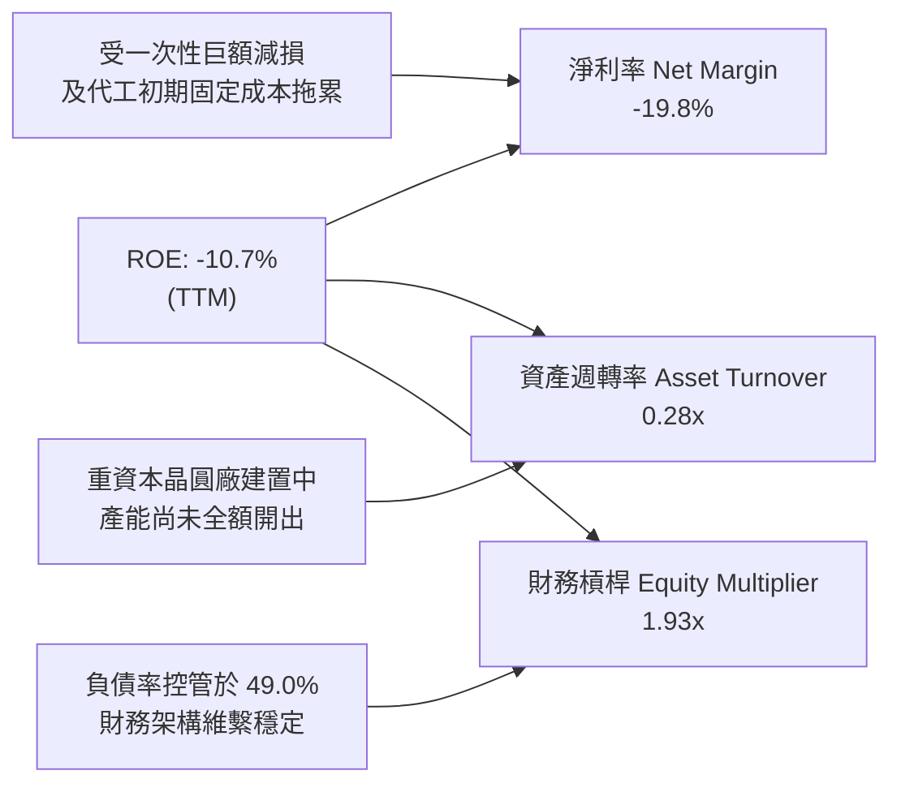

### 6.4 獲利能力儀表板

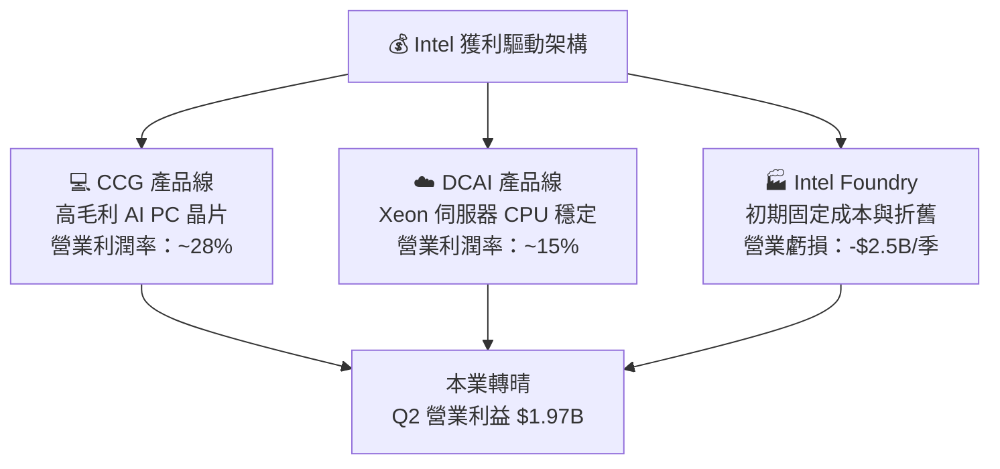

---

## 7. 估值深度分析

### 7.1 同業估值比較表格

選取半導體與晶圓製造三大代表性同業：**AMD**（CPU/GPU 直接競爭對手）、**TSMC (TSM)**（代工標竿）、**NVIDIA (NVDA)**（AI 晶片龍頭）。

| 估值與財務指標 | **Intel (INTC)** | **AMD (AMD)** | **TSMC (TSM)** | **NVIDIA (NVDA)** | Intel 相對同業評估 |
|----------------|------------------|---------------|----------------|-------------------|--------------------|
| **股價 ($)** | **$91.67** | $155.20 | $172.50 | $120.80 | - |
| **市值 ($B)** | **$462.38B** | $251.40B | $894.50B | $2,970.00B | 介於 AMD 與 TSMC 之間 |
| **Trailing P/E**| **N/A** (虧損) | 115.2x | 28.5x | 68.4x | N/A |
| **Forward P/E**| **45.75x** | 38.2x | 21.4x | 35.8x | 🔴 處於溢價區（反應利潤復甦預期） |
| **P/S Ratio** | **8.11x** | 10.8x | 10.2x | 32.5x | 🟢 折價（低於半導體同業） |
| **P/B Ratio** | **4.13x** | 4.5x | 6.8x | 48.2x | 🟢 具備實體資產支撐 |
| **EV / EBITDA** | **29.81x** | 32.5x | 13.8x | 42.1x | 🟡 接近 AMD，高於 TSMC |
| **毛利率 (%)** | **38.9%** | 51.2% | 53.5% | 75.2% | 🔴 顯著落後同業 |
| **收入 YoY** | **25.4%** | 18.5% | 32.8% | 122.4% | 🟢 成長性顯著追趕同業 |

### 7.2 歷史估值區間分析

```
╔══════════════════════════════════════════════════════════════════╗
║              Intel 歷史 Forward P/E 區間與當前位置               ║
╠══════════════════════════════════════════════════════════════════╣
║                                                                  ║
║  歷史高位 (High)：  55.0x  ██████████████████████████████        ║
║  當前位置 (Current):45.7x  █████████████████████████░░░░  ←當前  ║
║  歷史中位數 (Median):22.0x  ████████████░░░░░░░░░░░░░░░░░░        ║
║  歷史低位 (Low)：   10.5x  █████░░░░░░░░░░░░░░░░░░░░░░░░░        ║
║                                                                  ║
║  📊 說明：目前 Forward P/E (45.75x) 位於歷史高位區間，主要原因為  ║
║     分析師預估 EPS (Forward EPS $2.00) 仍處於修復初期。若以 2027  ║
║     年獲利完全修復後 EPS $3.80-$4.20 計算，實質 Forward P/E 僅    ║
║     約 21x-24x，處於合理區間。                                  ║
╚══════════════════════════════════════════════════════════════════╝
```

### 7.3 情境目標價（假設驅動，Bear / Base / Bull）

針對 Intel 的轉型特質，選用 **Forward P/E** 與 **EV/Sales** 作為核心估值倍數。

| 情境 | 營收 CAGR (2025-2028) | 2027E 營業利潤率 | 2027E EPS | 目標 P/E 倍數 | 隱含目標價 | 相對現價 ($91.67) 漲跌幅 |
|------|----------------------|------------------|-----------|---------------|------------|-------------------------|
| 🔴 **悲觀情境** | 4.5% | 8.5% | $2.10 | 35.0x | **$74.00** | **-19.3%** |
| 🟡 **基準情境** | **12.8%** | **16.5%** | **$3.85** | **30.0x** | **$115.00** | **+25.5%** |
| 🟢 **樂觀情境** | 20.0% | 22.0% | $5.00 | 28.0x | **$140.00** | **+52.7%** |

### 7.4 DCF 敏感性分析（6 格目標價矩陣）

假設基準永續成長率 (g) 為 **3.0%**，預測期 10 年，對 WACC 與終端營收成長率進行敏感性分析：

| 營收成長情境 / WACC | WACC = 8.0% | WACC = 8.8%（基準） | WACC = 9.5% |
|---------------------|-------------|---------------------|-------------|
| 🟢 **樂觀 (CAGR 18%)** | **$152.00** (+65.8%) | **$138.00** (+50.5%) | **$125.00** (+36.4%) |
| 🟡 **基準 (CAGR 12.8%)**| **$128.00** (+39.6%) | **$115.00** (+25.5%) | **$103.00** (+12.4%) |
| 🔴 **悲觀 (CAGR 5%)** | **$85.00** (-7.3%) | **$74.00** (-19.3%) | **$66.00** (-28.0%) |

### 7.5 估值綜合區間

```
╔══════════════════════════════════════════════════════════════════╗
║                    Intel 估值綜合區間摘要                        ║
╠══════════════════════════════════════════════════════════════════╣
║                                                                  ║
║  52 周股價區間：      $18.97 ───────────────────────► $142.35   ║
║  當前股價：           $91.67                                     ║
║  分析師平均目標價：   $115.65 (40位分析師)                        ║
║  本報告 DCF 基準價：  $115.00                                     ║
║                                                                  ║
║  [悲觀 $74] ─────── [當前 $91.67] ─── [基準 $115] ─── [樂觀 $140] ║
║        │                  │                 │              │     ║
║        └── -19.3% ────────┴─── +25.5% ──────┴── +52.7% ────┘     ║
╚══════════════════════════════════════════════════════════════════╝
```

---

## 8. 成長催化劑

### 8.1 催化劑時間軸

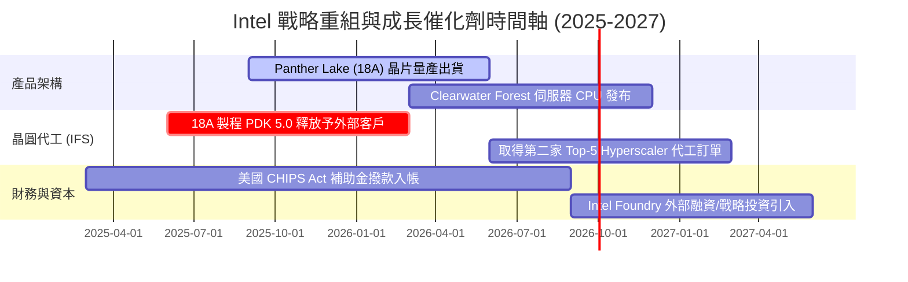

### 8.2 TAM 市場規模分析

```
╔══════════════════════════════════════════════════════════════════╗
║                   Intel 目標潛在市場 (TAM) 擴張                  ║
╠══════════════════════════════════════════════════════════════════╣
║                                                                  ║
║  1. AI PC 客戶端處理器 TAM：  $450 億 (2028E) ── 滲透率預計 >60% ║
║  2. Data Center & AI TAM：   $1,200 億 (2028E) ── 伺服器升級需求 ║
║  3. 先進晶圓代工與封裝 TAM： $1,500 億 (2028E) ── 代工商業機會   ║
║                                                                  ║
║  📊 總計可潛在參與市場：超出 $3,100 億                           ║
╚══════════════════════════════════════════════════════════════════╝
```

### 8.3 成長驅動力結構圖

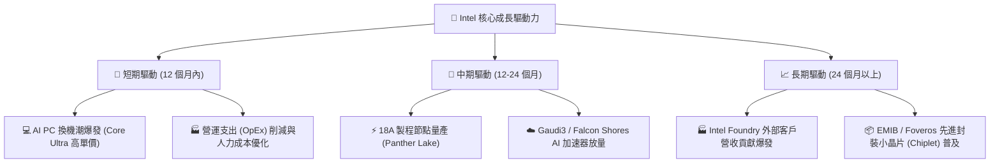

---

## 9. 風險矩陣

### 9.1 風險評分矩陣

> ⚠️ 語法限制說明：本圖表文字項已按規定全數使用英文。

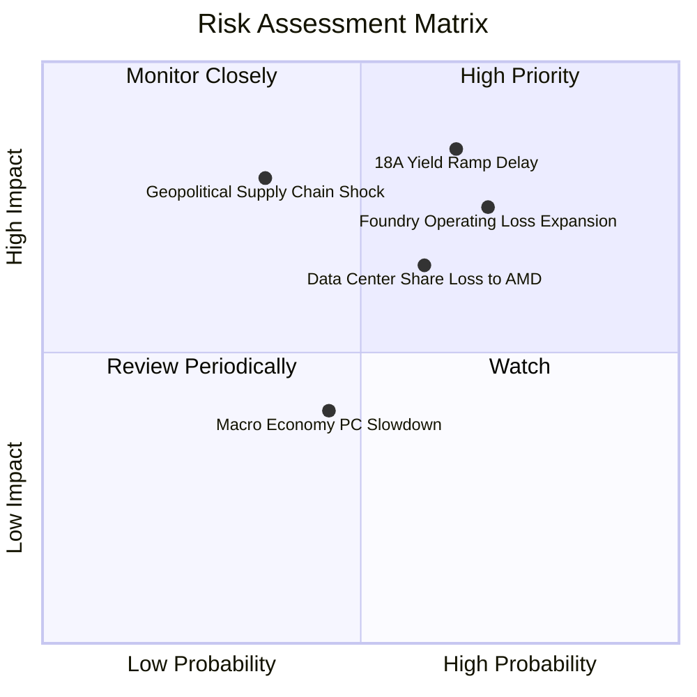

### 9.2 風險清單詳細分析

| # | 風險項目 | 發生機率 | 財務衝擊 | 風險評分 | 緩解措施與觀察指標 |
|---|----------|----------|----------|----------|--------------------|
| 1 | 🔴 **18A 製程良率提升延誤** | 中 (45%) | 高 (-20% EPS) | 🔴 **7.8/10** | 觀察 D0 缺陷密度（Defect Density）指標是否達到 <0.5/cm²。 |
| 2 | 🔴 **Intel Foundry 虧損擴大** | 高 (60%) | 高 (-15% 營益率) | 🔴 **8.2/10** | 實施內部轉嫁定價機制，強制各產品事業群按市價計費。 |
| 3 | 🟡 **Data Center 份額遭侵蝕** | 中 (50%) | 中 (-10% 收入) | 🟡 **6.5/10** | 加速全 E-core 設計之 Clearwater Forest 推出，主打極高能效比。 |
| 4 | 🟡 **地緣政治與補助款變數** | 低 (25%) | 高 (-$5B 現金) | 🟡 **5.5/10** | 分散晶圓廠投資計畫至愛爾蘭與以色列，降低單一國家政策風險。 |

---

## 10. 投資建議

### 10.1 最終綜合評級雷達圖

```
╔══════════════════════════════════════════════════════════════╗
║              Intel 機構綜合評分雷達圖                        ║
╠══════════════════════════════════════════════════════════════╣
║ 基本面強度  6.5/10 ▓▓▓▓▓▓▓▓▓▓▓▓▓░░░░░░░  🟡 穩健            ║
║ 成長動能    7.0/10 ▓▓▓▓▓▓▓▓▓▓▓▓▓▓░░░░░░  🟢 強勁            ║
║ 獲利品質    4.5/10 ▓▓▓▓▓▓▓▓▓░░░░░░░░░░░  🔴 尚待提升        ║
║ 財務健康    6.0/10 ▓▓▓▓▓▓▓▓▓▓▓▓░░░░░░░░  🟡 中等            ║
║ 估值合理性  6.5/10 ▓▓▓▓▓▓▓▓▓▓▓▓▓░░░░░░░  🟡 尚屬合理        ║
║ 護城河深度  6.5/10 ▓▓▓▓▓▓▓▓▓▓▓▓▓░░░░░░░  🟡 中等            ║
╠══════════════════════════════════════════════════════════════╣
║ 綜合總分    6.1/10 ▓▓▓▓▓▓▓▓▓▓▓▓░░░░░░░░  🟡 建議持有觀望    ║
╚══════════════════════════════════════════════════════════════╝
```

### 10.2 目標價與隱含報酬率

| 情境 | 機率權重 | 目標價 | 當前股價 | 隱含報酬率 | 權重後貢獻 |
|------|----------|--------|----------|------------|------------|
| 🔴 **悲觀情境** | 25% | $74.00 | $91.67 | -19.3% | -$4.82 |
| 🟡 **基準情境** | 55% | $115.00 | $91.67 | +25.5% | +$14.02 |
| 🟢 **樂觀情境** | 20% | $140.00 | $91.67 | +52.7% | +$10.54 |
| **加權綜合評估價** | **100%** | **$111.40** | **$91.67** | **+21.5%** | **基準目標價：$115.00** |

### 10.3 買入時機與觸發因素

```
╔══════════════════════════════════════════════════════════════════╗
║                  ✅ 買入/加碼觸發因素 Checklist                  ║
╠══════════════════════════════════════════════════════════════════╣
║                                                                  ║
║  進場/建倉觸發條件：                                             ║
║  ✅ 股價回檔至價值區間 $75.00 - $82.00 (提供充沛安全邊際)         ║
║  ✅ 單季毛利率 (Non-GAAP) 連續兩季穩定在 40% 以上                 ║
║  ✅ 自由現金流 (FCF) 年化規模持續 > $50 億                       ║
║                                                                  ║
║  加碼（Overweight）觸發條件：                                    ║
║  ☐ 官方宣佈 18A 製程 Panther Lake 進入量產且良率 >70%            ║
║  ☐ Intel Foundry 成功簽署第二家 Top-5 雲端業者 (Hyperscaler) 大單  ║
║                                                                  ║
║  停損/減碼（Exit）觸發條件：                                     ║
║  ☐ 18A 製程出現重大技術缺陷，量產時程延後超出 2 個季度           ║
║  ☐ 晶圓代工單季營業虧損持續擴大至 > $30 億且無改善跡象           ║
╚══════════════════════════════════════════════════════════════════╝
```

### 10.4 投資人適配度分析

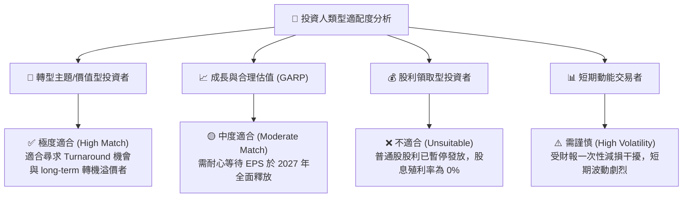

### 10.5 每季財報監控清單（Quarterly Watch List）

| 監控維度 | 核心指標 (Metric) | 觀望/中立門檻 | 觸發【加碼】門檻 | 觸發【減碼】停損門檻 |
|----------|-------------------|---------------|------------------|----------------------|
| **營收動能** | 單季 Revenue ($B) | $14.5B - $16.0B | **> $16.5B** (YoY >30%) | **< $13.5B** (復甦夭折) |
| **獲利品質** | Non-GAAP 毛利率 | 38.0% - 41.0% | **> 43.0%** | **< 35.0%** |
| **現金流** | 單季自由現金流 FCF | $1.0B - $3.0B | **> $4.0B** | **轉負 (< $0)** |
| **代工進展** | IFS 外部客戶訂單 | 維持現狀 | **新增大型 Hyperscaler** | **現有客戶退單** |
| **技術節點** | 18A 產能良率 | 符合預期進度 | **提早量產出貨** | **宣佈延後量產** |

### 10.6 反面論證：什麼會證明論點錯誤（What Would Change My Mind）

```
╔══════════════════════════════════════════════════════════════════╗
║              ⚠️ 論點失效與看空條件（Disconfirming Evidence）      ║
╠══════════════════════════════════════════════════════════════════╣
║  本報告之多頭/修復論點在下列條件發生時將徹底失效：               ║
║                                                                  ║
║  1. 18A 製程良率無法突破，Panther Lake 迫於壓力轉向台積電代工。  ║
║  2. Intel Foundry 單季營業虧損持續 > $30 億，且 Capex 再次失控。  ║
║  3. Data Center & AI (DCAI) 營收年增率連續兩季轉負 (< 0%)。       ║
║  4. ROIC 持續低於 3.0%，經濟價值侵蝕 (EVA) 擴大至 > -6.0pp。      ║
║                                                                  ║
║  若上述任一條件成立，目標價將下修至悲觀情境 $74.00 以下。        ║
╚══════════════════════════════════════════════════════════════════╝
```

---

> **免責聲明**：本報告僅供學術與研究參考，不構成任何買賣金融商品之投資建議。投資人應依據個人財務狀況與風險偏好獨立做出決策，並自負投資風險。