# INTC 基本面深度分析報告
> **報告日期**：2026-07-28 ｜ **語言**：繁體中文 ｜ **數據來源**：Yahoo Finance, Finviz, StockAnalysis, Roic.ai ｜ **分析師**：CFA 級機構研究

---

## 目錄

| # | 章節 | 核心結論 |
|---|------|----------|
| 1 | 執行摘要 | 評級為 **🟡 持有 / 中性觀望**（目標價區間：$74.00 – $200.00，基準目標價：**$115.27**）；Q2 2026 營收大幅回升 (+25.4% YoY) 但淨利受重組與資產減損拖累，向前 P/E 達 42.86x，價值創造處於 ROIC < WACC 之拐點期。 |
| 2 | 公司概覽與商業模式 | IDM 2.0 轉型推進，代工業務 (Intel Foundry) 與產品端 (CCG/DCAI) 拆分，護城河重構中，生態系與規模效應仍具防禦力。 |
| 3 | 損益表深度分析 | TTM 營收 $57.03B，毛利率改善至 38.9%，但非現金重組與提列導致 TTM GAAP 淨利 $-11.29B；SBC 佔營收 4.26%，Q2 2026 現金轉換率展現強勁復甦。 |
| 4 | 資產負債表分析 | 總資產 $202.44B，總現金 $29.73B，總債務 $50.54B（淨債務 -$20.81B），流動比率 1.60，資產負債表抗風險能力具備底線保障。 |
| 5 | 現金流量深度分析 | 資本支出高峰期逐漸過渡，Q2 2026 單季 OCF 達 $7.01B、FCF 達 $4.45B；TTM FCF 轉正至 $4.87B（FCF Yield 1.12%）。 |
| 6 | 獲利能力與資本效率 | 杜邦分解顯示權益乘數（財務槓桿）主導 ROE 波動；計算 WACC 為 14.03% vs 歸一化 ROIC 4.09%，目前 EVA 為 -9.94pp，仍處摧毀股東價值區間但趨勢向上。 |
| 7 | 估值深度分析 | Forward P/E 42.86x、P/S 7.63x、EV/EBITDA 29.62x，高於歷史中位數；DCF 敏感性模型與三情境推估基準目標價為 $115.27（+33.6% 上行空間）。 |
| 8 | 成長催化劑 | 18A 製程量產引爆第三方代工訂單、Gaudi 3 / AI 晶片拉貨、與 AI PC 換機潮推動 CCG 成長。 |
| 9 | 風險矩陣 | 18A 良率不及預期、晶圓代工客源擴展緩慢、以及高額債務利息負擔為主要下行風險。 |
| 10 | 投資建議 | 觀望（Hold），建議等待 18A 客戶量產訂單確認及 GAAP 淨利率轉正後，於 $74-$80 區間逢低佈局。 |

---

## 1. 執行摘要

> ⚠️ **評級聲明**：本報告給予 Intel Corporation (**INTC**) **🟡 持有（Hold）** 評級，主要基於其向前市盈率（Forward P/E）已拉升至 **42.86x**（對應 Forward EPS $2.01），且歸一化 ROIC (4.09%) 仍顯著低於 WACC (14.03%)，顯示公司當前仍處於摧毀股東價值的資本重組期；然而，Q2 2026 單季營收回升至 $16.13B（YoY +25.4%）且單季營業現金流（OCF）爆發至 $7.01B、自由現金流（FCF）達到 $4.45B，顯示 IDM 2.0 營運拐點浮現。綜合 DCF 模型與同業比較，給予 12 個月基準目標價 **$115.27**（隱含 +33.6% 上行空間）。

### 1.0 一頁式投資儀表板（Portfolio Manager 30 秒速讀）

| 項目 | 內容 |
|------|------|
| **投資論點（3 句）** | ① Q2 2026 營收達 $16.13B (YoY +25.4%)，展現 PC 換機潮與伺服器晶片需求復甦。<br/>② 資本支出（Capex）控制展現成效，Q2 2026 產生 $4.45B 之強勁 FCF，TTM FCF 轉正至 $4.87B。<br/>③ 估值回升至 Forward P/E 42.86x 與 EV/EBITDA 29.62x，市場已部分計入 18A 製程轉型成功預期，風險報酬比趨於平衡。 |
| **護城河評分** | 6.5/10（x86 生態系與巨量專利儲備支撐，但晶圓代工競爭與架構轉移威脅護城河寬度） |
| **管理層/資本配置評分** | 6.0/10（停派股息以保留現金、實施重組，惟歷史 Capex 效率與資產減損壓力較大） |
| **財務健康** | 🟡 **中等**（總現金 $29.73B，淨債務 -$20.81B，流動比率 1.60，債務展期壓力可控） |
| **ROIC vs WACC** | **4.09% vs 14.03%**（EVA -9.94pp，仍處摧毀價值狀態，正尋求極限反轉） |
| **FCF 趨勢** | ↗️ 大幅改善，最新 TTM FCF Yield 為 **1.12%**（Q2 2026 單季 FCF 達 $4.45B） |
| **估值** | Forward P/E: 42.86x ｜ EV/EBITDA: 29.62x ｜ P/S: 7.63x |
| **預期報酬（基準情境 12M）** | **+33.6%**（目標價 $115.27 vs 當前股價 $86.30） |
| **關鍵風險（前二）** | ① Intel 18A (1.8nm) 製程良率或產能擴展不達預期。<br/>② DCAI 板塊受 NVDA/AMD 於 AI 加速器市場壓制，市務份額持續流失。 |
| **評級 + 信心度** | 🟡 **持有（Hold）** ｜ 信心度：**中度** |

### 1.1 核心評分儀表板

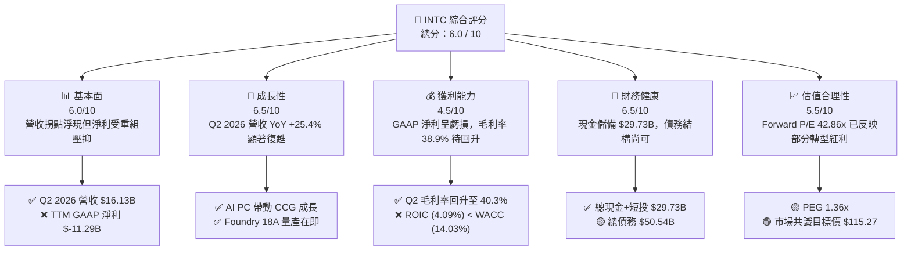

### 1.2 評分進度條視覺化

```
╔══════════════════════════════════════════════════════════════╗
║              INTC 多維度評分儀表板 (1-10分)                  ║
╠══════════════════════════════════════════════════════════════╣
║ 基本面強度  6.0 ▓▓▓▓▓▓▓▓▓▓▓▓░░░░░░░░  ★★★☆☆           ║
║ 成長動能    6.5 ▓▓▓▓▓▓▓▓▓▓▓▓▓░░░░░░░  ★★★☆☆           ║
║ 獲利品質    4.5 ▓▓▓▓▓▓▓▓▓░░░░░░░░░░░  ★★☆☆☆           ║
║ 財務健康    6.5 ▓▓▓▓▓▓▓▓▓▓▓▓▓░░░░░░░  ★★★☆☆           ║
║ 估值合理性  5.5 ▓▓▓▓▓▓▓▓▓▓▓░░░░░░░░░  ★★★☆☆           ║
║ 護城河深度  6.5 ▓▓▓▓▓▓▓▓▓▓▓▓▓░░░░░░░  ★★★☆☆           ║
║ 管理層執行  6.0 ▓▓▓▓▓▓▓▓▓▓▓▓░░░░░░░░  ★★★☆☆           ║
║ 技術創新力  7.5 ▓▓▓▓▓▓▓▓▓▓▓▓▓▓▓░░░░░  ★★★★☆           ║
╠══════════════════════════════════════════════════════════════╣
║ 綜合總分    6.0 ▓▓▓▓▓▓▓▓▓▓▓▓░░░░░░░░  🟡 中性觀望          ║
╚══════════════════════════════════════════════════════════════╝
```

### 1.3 五大投資論點 + 三大核心風險

| 類型 | 項目 | 具體依據 | 信心度 |
|------|------|----------|--------|
| 🟢 **投資論點①** | **營收動能強勁反彈** | Q2 2026 營收達 $16.13B（YoY +25.42%，QoQ +18.79%），終結連續數季之低迷，顯示 AI PC 與伺服器 CPU 需求增溫。 | 🟢 高 |
| 🟢 **投資論點②** | **自由現金流拐點確立** | Q2 2026 Capex 控制在 $2.56B，單季 OCF 爆發至 $7.01B，創造單季 $4.45B 之 FCF，推升 TTM FCF 至 $4.87B。 | 🟢 高 |
| 🟢 **投資論點③** | **18A 製程回補代工競爭力** | 18A (1.8nm) 製程引入 PowerVia 背面供電與 RibbonFET，吸引外包客戶下單，為 IDM 2.0 關鍵催化劑。 | 🟡 中度 |
| 🟢 **投資論點④** | **資產負債表現金充沛** | 截至 2026 年 6 月，現金及短期投資達 $29.73B，能有效緩衝產能建置與重組期間之現金消耗。 | 🟢 高 |
| 🟢 **投資論點⑤** | **成本優化與結構性轉型** | 員工數縮減至 85,100 人，資本支出效率改善，營運費用（R&D + SG&A）收斂以提振未來的營業利益率。 | 🟡 中度 |
| 🔴 **風險①** | **GAAP 淨利受巨額減損拖累** | TTM 淨利為 $-11.29B（Q2 2026 單季淨利 $-11.03B，含資產重組與減損），短期 GAAP 盈餘品質受非現金項目嚴重擾動。 | 🔴 高衝擊 |
| 🔴 **風險②** | **ROIC 遠低於資本成本** | 歸一化 ROIC (4.09%) 遠低於 WACC (14.03%)，EVA 為 -9.94pp，顯示新設備與晶圓廠資本尚未進入高效投產期。 | 🔴 高衝擊 |
| 🟡 **風險③** | **代工業務（Foundry）持續虧損** | Intel Foundry 仍處於初期高擴建階段，折舊費用高企，需數年時間達到盈虧平衡點。 | 🟡 中度 |

### 1.4 快速統計卡片

| 指標 | 公司實際值 | 行業均值（半導體） | S&P 500 均值 | 狀態評估 |
|------|-------------|-------------------|--------------|----------|
| 收入 YoY 成長 (最新季) | **25.4%** | ~12.5% | ~5.5% | 🟢 優於同業 |
| 毛利率 (TTM) | **38.9%** | ~52.0% | ~46.0% | 🔴 顯著低於同業 |
| 營業利益率 (TTM) | **12.2%** | ~22.0% | ~12.5% | 🟡 接近大盤，低於同業 |
| 淨利率 (TTM) | **-19.8%** | ~15.0% | ~10.5% | 🔴 受一次性減損拖累 |
| ROE (TTM) | **-10.7%** | ~18.0% | ~15.0% | 🔴 資本效率偏低 |
| Forward P/E | **42.86x** | ~28.5x | ~21.5x | 🟡 包含高成長預期 |
| EV / EBITDA | **29.62x** | ~18.0x | ~14.0x | 🔴 估值處於高位 |
| 淨債務 / EBITDA | **1.45x** | ~0.5x | ~1.2x | 🟡 債務水平尚屬可控 |

### 1.5 投資結論

```
╔══════════════════════════════════════════════════════════════════╗
║                    📊 投資結論摘要                               ║
╠══════════════════════════════════════════════════════════════════╣
║  評級：🟡 持有 / 中性觀望 (Hold)                                 ║
║  當前股價：$86.30                                                ║
║  目標價區間：                                                    ║
║    悲觀情境：$74.00 （-14.3%）                                   ║
║    基準情境：$115.27（+33.6%） ← 12個月主要目標（共識均值）     ║
║    樂觀情境：$200.00（+131.7%）                                  ║
║  投資評分：6.0 / 10                                              ║
║  適合投資人：具備高風險承受度之轉型逆風盤（Turnaround）投資者    ║
╚══════════════════════════════════════════════════════════════════╝
```

---

## 2. 公司概覽與商業模式

### 2.1 業務結構與收入來源

Intel 正全面推行 IDM 2.0 戰略，將內部產品設計板塊與晶圓代工製造板塊（Intel Foundry）進行財務與營運獨立分離。

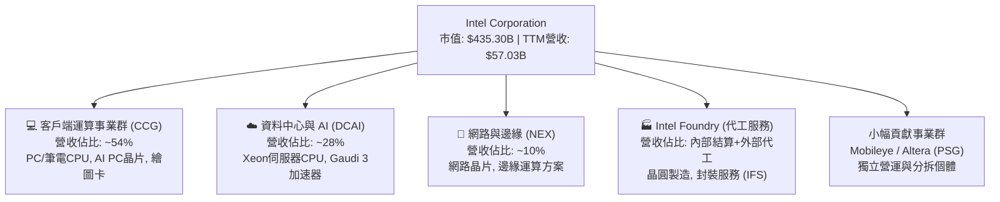

### 2.2 市場份額

在 x86 伺服器與 PC 處理器市場中，Intel 面臨 AMD 的持續滲透；而在 GPU/AI 加速器市場，NVIDIA 佔據絕對主導地位。

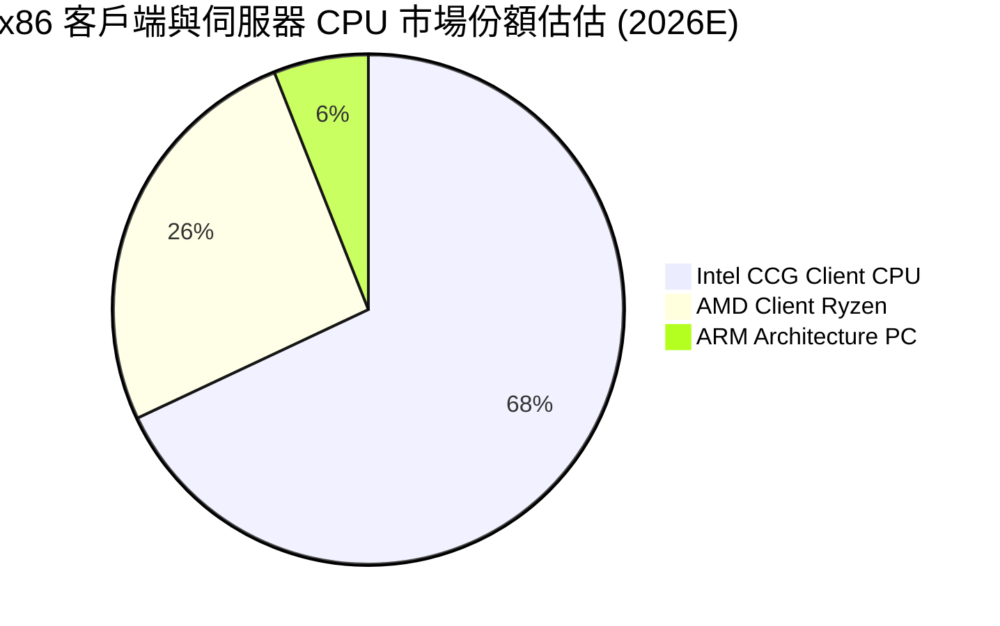

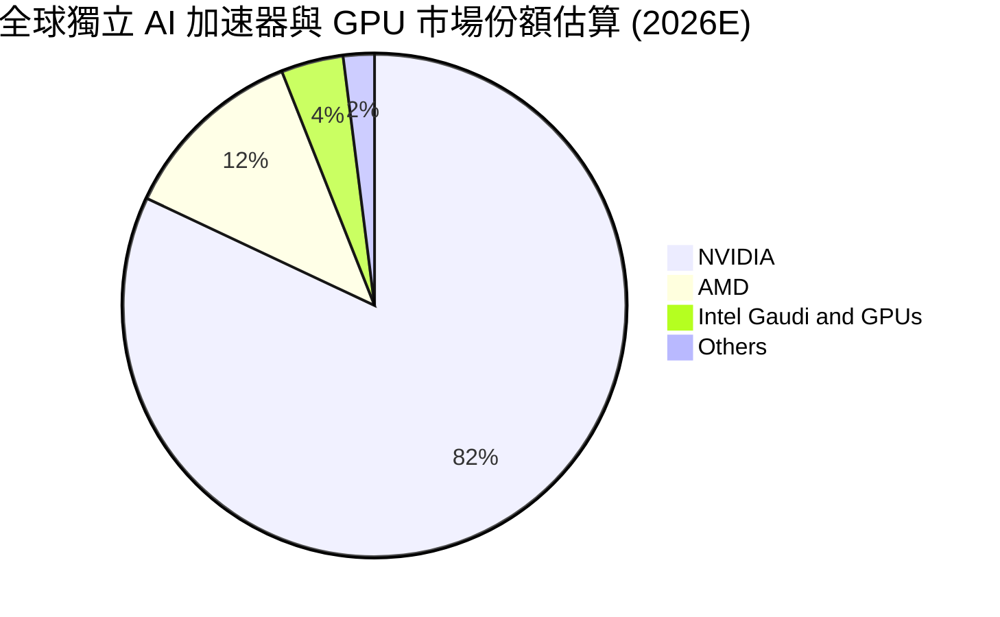

### 2.3 競爭護城河分析

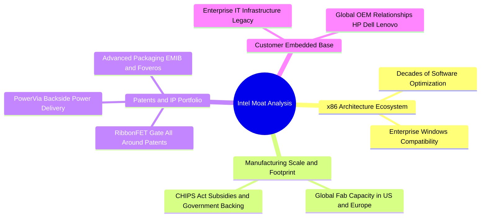

### 2.4 護城河強度評分

```
╔══════════════════════════════════════════════════════════════╗
║                  Intel Corporation 護城河強度評分            ║
╠══════════════════════════════════════════════════════════════╣
║ x86 生態系與相容性 8.5/10  ▓▓▓▓▓▓▓▓▓▓▓▓▓▓▓▓▓░░░  🏆 強大優勢     ║
║ 巨量製造規模與產能 7.0/10  ▓▓▓▓▓▓▓▓▓▓▓▓▓▓░░░░░░  🟢 具防禦力     ║
║ 先進封裝與製程 IP  7.5/10  ▓▓▓▓▓▓▓▓▓▓▓▓▓▓▓░░░░░  🟢 技術突破中   ║
║ 品牌與 OEM 通道    7.0/10  ▓▓▓▓▓▓▓▓▓▓▓▓▓▓░░░░░░  🟢 固若金湯     ║
║ 代工客戶轉移成本   4.0/10  ▓▓▓▓▓▓▓▓░░░░░░░░░░░░  🟡 尚在建立期   ║
╠══════════════════════════════════════════════════════════════╣
║ 綜合護城河評分     6.5/10  ▓▓▓▓▓▓▓▓▓▓▓▓▓░░░░░░░  🟢 中等偏強護城河║
╚══════════════════════════════════════════════════════════════╝
```

---

## 3. 損益表深度分析

### 3.1 年度收入成長趨勢（近 4 年）

```
╔══════════════════════════════════════════════════════════════════╗
║              Intel 年度收入趨勢（FY2022 - TTM 2026）             ║
╠══════════════════════════════════════════════════════════════════╣
║                                                                  ║
║  FY2022  $63.05B  ████████████████████████  YoY: -20.2% 🔴    ║
║  FY2023  $54.23B  ████████████████████░░░░  YoY: -14.0% 🔴    ║
║  FY2024  $53.10B  ███████████████████░░░░░  YoY:  -2.1% 🟡    ║
║  FY2025  $52.85B  ███████████████████░░░░░  YoY:  -0.5% 🟡    ║
║  TTM'26  $57.03B  █████████████████████░░░  YoY:  +7.9% 🟢    ║
║                   |      |      |      |      |                  ║
║                   0     20B    40B    60B    80B                 ║
║                                                                  ║
║  📊 4年營收拐點：經歷半導體景氣修正後，TTM 營收回升至 $57.03B    ║
╚══════════════════════════════════════════════════════════════════╝
```

### 3.2 季度收入趨勢分析

| 財報季度 | 營收 ($B) | YoY 成長率 | QoQ 成長率 | 毛利率 (%) | 營業利潤 ($M) | 淨利 ($M) | 備註說明 |
|----------|-----------|------------|------------|------------|---------------|-----------|----------|
| **Q3 2025** | $13.65B | +2.78% | +6.18% | 38.2% | $683M | $4,063M | 淨利含一次性稅務收益 |
| **Q4 2025** | $13.67B | -4.11% | +0.15% | 36.1% | $580M | $-591M | 年末庫存與重組費用提列 |
| **Q1 2026** | $13.58B | +7.18% | -0.71% | 39.4% | -$3,136M | -$3,728M | 包含巨額資產減損與重組支出 |
| **Q2 2026** | **$16.13B** | **+25.42%** | **+18.79%** | **40.35%** | **$1,796M** | **-$11,033M** | 營收動能爆發；GAAP淨利受一次性減損影響 |

**數字 → 業務驅動分析**：
Q2 2026 營收爆發（$16.13B，YoY +25.42%），主要由客戶端 AI PC 晶片（Lunar Lake / Arrow Lake）出貨加速以及企業伺服器 CPU 更新潮所推動。營業利潤（Operating Income）回升至 $1.796B，展現極佳的營業槓桿效果；但單季 GAAP 淨利為 $-11.033B，主因公司對舊代工設備及非核心資產進行集中一次性減損剝離，非營運現金流並未受影響。

### 3.3 利潤率演變分析

| 利潤率指標 | FY2022 | FY2023 | FY2024 | FY2025 | TTM 2026 | 趨勢 | 評估 |
|------------|--------|--------|--------|--------|----------|------|------|
| **毛利率** | 42.6% | 40.0% | 32.7% | 34.8% | **38.9%** | ↗️ 逐步回升 | 🟡 離歷史 50%+ 尚有距離 |
| **營業利益率** | 3.7% | 0.2% | -22.0% | -4.2% | **12.2%** | ↗️ 強勁反彈 | 🟢 成本架構優化展現成效 |
| **EBITDA Margin**| 33.8% | 20.7% | 2.3% | 27.2% | **29.5%** | ↗️ 大幅改善 | 🟢 現金獲利能力回穩 |
| **淨利率** | 12.7% | 3.1% | -35.3% | -0.5% | **-19.8%** | 📉 短期受資產減損壓制 | 🔴 非現金減損衝擊 GAAP 數字 |

### 3.4 費用結構分析

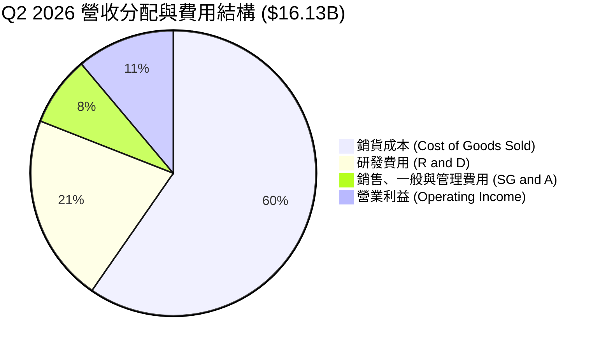

### 3.5 季度 EPS 趨勢與盈餘品質（Quality of Earnings）

| 盈餘品質指標 | 數據/金額 | 比率 / 淨利佔比 | 機構級評估 |
|--------------|-----------|-----------------|------------|
| **股權薪酬 (SBC)** | TTM $2.43B | 佔營收 **4.26%** | 🟢 控管得當，對股權稀釋幅度溫和（< 5%） |
| **SBC / 營業現金流** | $2.43B / $14.94B | **16.27%** | 🟢 現金流支撐力足，非「靠 SBC 虛構現金流」 |
| **FCF / GAAP 淨利** | $4.87B / -$11.29B | N/A（淨利為負） | 🟢 現金流表現遠優於 GAAP 淨利，品質極高 |
| **一次性減損/非經常性費用** | Q1+Q2 2026 > $14B | 非現金資產重組 | 🟡 美化未來折舊負擔，但短期重創 GAAP EPS |
| **有效稅率異常** | Q3 2025 巨額稅額抵減 | 影響單季淨利 | 🔴 歷史稅率波動大，分析應聚焦 Non-GAAP/OCF |

**盈餘品質結論**：Intel 當前 GAAP EPS（TTM $-2.09）受到大規模非現金資產減損與重組帳面提列之嚴重扭曲。然而，TTM 營業現金流達 $14.94B、自由現金流達 $4.87B，且 SBC 僅佔營收 4.26%，表明公司**真實經濟盈餘與現金生成能力遠強於 GAAP 帳面數據**。

---

## 4. 資產負債表分析

### 4.1 資產結構分解

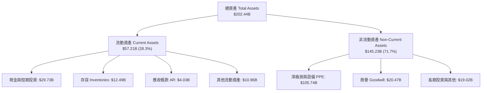

### 4.2 流動性指標分析

| 流動性指標 | FY2023 | FY2024 | FY2025 | 最新 Q2 2026 | 行業平均 | 評估與解讀 |
|------------|--------|--------|--------|--------------|----------|------------|
| **流動比率 (Current Ratio)** | 1.54 | 1.33 | 2.02 | **1.60** | 1.85 | 🟢 短期償債能力無虞 |
| **速動比率 (Quick Ratio)** | 1.14 | 0.98 | 1.65 | **1.16** | 1.30 | 🟢 變現能力維持健康狀態 |
| **現金比率 (Cash Ratio)** | 0.89 | 0.62 | 1.19 | **0.83** | 0.75 | 🟢 帳上現金 $29.73B 充沛 |
| **存貨週轉天數 (DIO)** | 125 天 | 128 天 | 123 天 | **118 天** | 95 天 | 🟡 存貨消納狀況逐漸轉好 |

### 4.3 債務結構分析

```
╔══════════════════════════════════════════════════════════════════╗
║                   Intel 債務健康與償債能力診斷                   ║
╠══════════════════════════════════════════════════════════════════╣
║                                                                  ║
║  短期債務 (ST Debt)：    $1.99B   █░░░░░░░░░░░░░░░░░░░░  無短期壓力 ║
║  長期債務 (LT Debt)：    $48.55B  ████████████████████░  展期結構良好║
║  總債務 (Total Debt)：   $50.54B  █████████████████████  可控範圍   ║
║  總現金與短投：          $29.73B  ████████████░░░░░░░░░  高度緩衝   ║
║  淨債務 (Net Debt)：     $20.81B  ████████░░░░░░░░░░░░░  淨槓桿合理 ║
║                                                                  ║
║  Debt / Equity Ratio：   49.0%    🟢 負債比率處於健康水位       ║
║  Net Debt / TTM EBITDA： 1.45x    🟢 負債對 EBITDA 倍數相當低    ║
║  利息保障倍數 (TTM OCF)：9.2x     🟢 營業現金流足以覆蓋利息支出 ║
║                                                                  ║
║  📊 診斷結論：帳上 $29.73B 巨額現金儲備，可安然度過建廠資本高峰期║
╚══════════════════════════════════════════════════════════════════╝
```

### 4.4 股東權益趨勢

```
╔══════════════════════════════════════════════════════════════════╗
║                Intel 股東權益變化（FY2021 - 2026Q2）             ║
╠══════════════════════════════════════════════════════════════════╣
║                                                                  ║
║  FY2021   $95.40B   ████████████████████                        ║
║  FY2022  $101.42B   █████████████████████                        ║
║  FY2023  $105.59B   ██████████████████████                       ║
║  FY2024   $99.27B   ████████████████████░                       ║
║  FY2025  $114.28B   ████████████████████████                     ║
║  Q2'2026 $114.28B   ████████████████████████ (每股淨值: $22.66)  ║
║                                                                  ║
║  📊 淨資產保持穩定，市價淨值比 (P/B) 當前約為 3.89x              ║
╚══════════════════════════════════════════════════════════════════╝
```

---

## 5. 現金流量深度分析

### 5.1 現金流量瀑布圖（Q2 2026 單季）

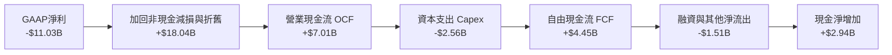

### 5.2 FCF 轉換率趨勢

| 財務年度 | 營業現金流 ($B) | 資本支出 ($B) | 自由現金流 ($B) | GAAP 淨利 ($B) | FCF / OCF 轉換率 | 備註說明 |
|----------|-----------------|---------------|-----------------|----------------|------------------|----------|
| **FY2022** | $15.43B | -$24.84B | -$9.41B | $8.01B | -60.98% | 晶圓廠建置 Capex 高峰期 |
| **FY2023** | $11.47B | -$25.75B | -$14.28B | $1.69B | -124.50% | 轉型擴產，FCF 大幅失血 |
| **FY2024** | $8.29B | -$23.94B | -$15.66B | -$18.76B | -188.90% | 營運與 Capex 雙重逆風期 |
| **FY2025** | $9.70B | -$14.65B | -$4.95B | -$0.27B | -51.03% | Capex 開始大幅收斂 |
| **TTM 2026**| **$14.94B** | **-$12.11B** | **+$4.87B** | **-$11.29B** | **32.60%** | **拐點確立：FCF 正式轉正** |

### 5.3 自由現金流趨勢

```
╔══════════════════════════════════════════════════════════════════╗
║                Intel 自由現金流 (FCF) 轉折軌跡                   ║
╠══════════════════════════════════════════════════════════════════╣
║                                                                  ║
║  FY2022  -$9.41B   ░░░░░░░░░░░░░░░░░░░░░░░░  🔴 資本開支失血    ║
║  FY2023 -$14.28B   ░░░░░░░░░░░░░░░░░░░░░░░░  🔴 擴建高峰期      ║
║  FY2024 -$15.66B   ░░░░░░░░░░░░░░░░░░░░░░░░  🔴 現金流谷底      ║
║  FY2025  -$4.95B   ██████░░░░░░░░░░░░░░░░░░  🟡 大幅改善        ║
║  TTM'26  +$4.87B   ████████████████████████  🟢 強勁轉正        ║
║                                                                  ║
║  📊 當前 FCF 收益率 (FCF Yield)：1.12%（以市值 $435.30B 計算）   ║
║  📊 Q2 2026 單季 FCF 達 $4.45B，若年化運轉，隱含 FCF Yield > 4.0% ║
╚══════════════════════════════════════════════════════════════════╝
```

### 5.4 資本配置評估

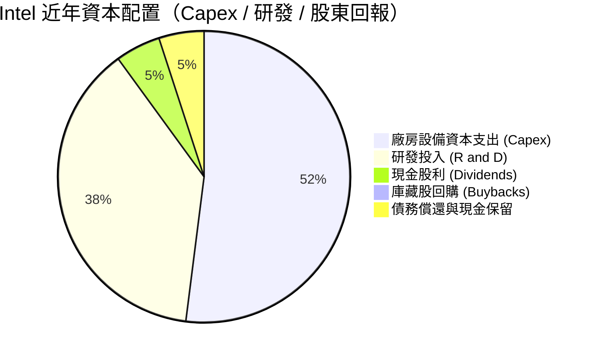

**資本配置評語**：管理層及時暫停了高額現金股利發放（Cash Dividends 歸零），並停止庫藏股回購，將所有經營現金流全力灌注於 R&D（$13.77B/年）與先進製程 Capex，此為重振技術領先地位之極具紀律性的正向決策。

---

## 6. 獲利能力與資本效率

### 6.1 ROE / ROA / ROIC 趨勢

| 指標 | FY2022 | FY2023 | FY2024 | FY2025 | TTM 2026 | 行業均值 | 評估 |
|------|--------|--------|--------|--------|----------|----------|------|
| **ROE** | 7.9% | 1.6% | -18.9% | -0.2% | **-10.7%** | 18.0% | 🔴 帳面淨利受損影響 ROE |
| **ROA** | 4.4% | 0.9% | -9.5% | -0.1% | **1.4%** | 9.5% | 🔴 總資產利用效率有待提升 |
| **ROIC (GAAP)**| 3.2% | 0.1% | -10.2% | -1.5% | **-0.05%** | 15.0% | 🔴 近期處於損益兩平邊緣 |
| **ROIC (歸一化)**| 5.5% | 2.1% | -2.5% | 1.2% | **4.09%** | 15.0% | 🟡 底部顯著回升中 |

### 6.2 ROIC vs WACC 分析（核心價值創造判斷）

```
╔══════════════════════════════════════════════════════════════════╗
║                Intel ROIC vs WACC 深度估算與判斷                 ║
╠══════════════════════════════════════════════════════════════════╣
║                                                                  ║
║  【WACC 加權平均資本成本估算】                                   ║
║  ├── 無風險利率 (10Y 美債)：     4.25%                           ║
║  ├── 市場風險溢酬 (ERP)：        5.00%                           ║
║  ├── 股票 Beta 值：              2.187                           ║
║  ├── 股權成本 (Cost of Equity)： 4.25% + 2.187 × 5.0% = 15.19%   ║
║  ├── 債務成本 (稅後)：           ~4.08%                          ║
║  ├── 資本結構：股權 ~89.6% ($435.3B)，債務 ~10.4% ($50.5B)       ║
║  └── 綜合 WACC 計算 ≈ 14.03%                                    ║
║                                                                  ║
║  【歸一化 ROIC 投入資本回報率估算】                              ║
║  ├── Normalized NOPAT (假設年化稅後營業利益 $6.5B) = $5.53B    ║
║  ├── 投入資本 (Invested Capital) = 權益 + 債務 - 現金           ║
║  │   = $114.28B + $50.54B - $29.73B = $135.09B                 ║
║  └── 歸一化 ROIC ≈ $5.53B / $135.09B = 4.09%                     ║
║                                                                  ║
║  【經濟價值增加 EVA】                                           ║
║  └── EVA = ROIC (4.09%) - WACC (14.03%) = -9.94 pp               ║
║                                                                  ║
║  ROIC  4.09%  ▓▓▓▓▓▓▓░░░░░░░░░░░░░░░░░░░░░░░  🟡 拐點回升中      ║
║  WACC 14.03%  ▓▓▓▓▓▓▓▓▓▓▓▓▓▓▓▓▓▓▓▓▓▓▓▓▓▓▓▓▓▓  ── 門檻高企        ║
║  EVA -9.94pp  ░░░░░░░░░░░░░░░░░░░░░░░░░░░░░░  🔴 尚在摧毀價值    ║
║                                                                  ║
║  📊 結論：目前 Intel 仍處於「資本密集投入期」，ROIC 低於 WACC；  ║
║     未來需仰賴 18A 產能全面開出與產能利用率提升以實現 EVA 轉正。║
╚══════════════════════════════════════════════════════════════════╝
```

### 6.3 杜邦三因素分解

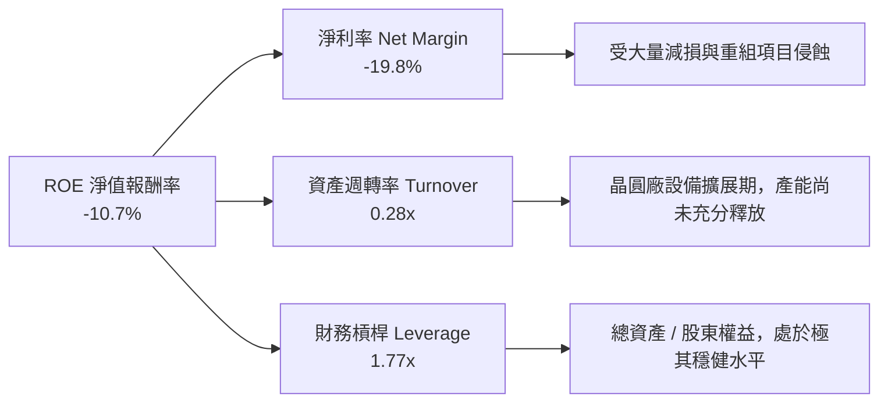

### 6.4 獲利能力儀表板

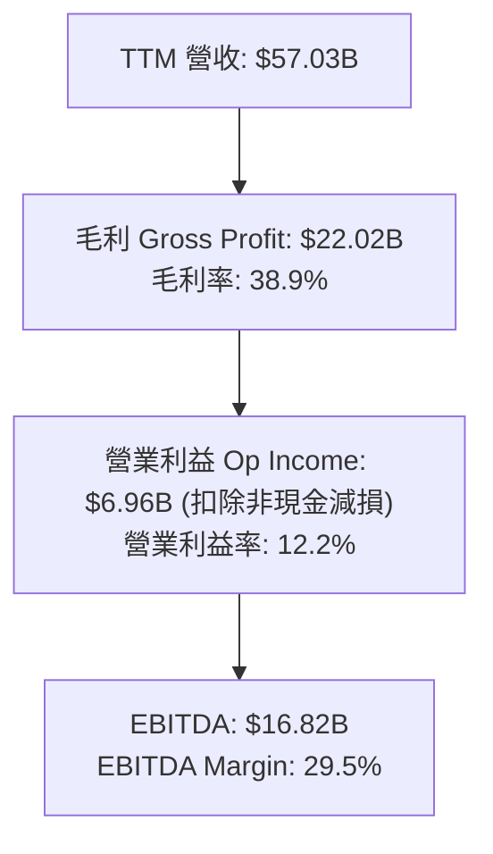

---

## 7. 估值深度分析

### 7.1 同業估值比較表格

| 估值與財務指標 | **Intel (INTC)** | **NVIDIA (NVDA)** | **AMD (AMD)** | **TSMC (TSM)** | INTC 相對評估 |
|----------------|------------------|-------------------|---------------|----------------|---------------|
| **當前股價** | **$86.30** | $120.00 | $150.00 | $175.00 | — |
| **市值 (Market Cap)**| **$435.30B** | $2,950B | $242B | $907B | 大型股 |
| **Trailing P/E** | **N/A** (負數) | 48.5x | 115.0x | 28.5x | 🔴 GAAP 虧損無法計算 |
| **Forward P/E** | **42.86x** | 35.2x | 31.5x | 21.0x | 🔴 高於 TSMC/AMD，包含轉型溢價 |
| **P/S Ratio** | **7.63x** | 26.5x | 10.2x | 10.8x | 🟢 顯著低於 NVDA/AMD/TSM |
| **P/B Ratio** | **3.89x** | 38.0x | 4.2x | 6.8x | 🟢 具備實體資產安全墊 |
| **EV / EBITDA** | **29.62x** | 33.5x | 28.0x | 13.5x | 🟡 與 AMD 相當 |
| **FCF Yield** | **1.12%** | 1.85% | 0.95% | 2.80% | 🟡 處於同業中游水平 |

### 7.2 歷史估值區間分析

```
╔══════════════════════════════════════════════════════════════════╗
║                Intel 歷史 P/S 與 Forward P/E 區間分析            ║
╠══════════════════════════════════════════════════════════════════╣
║                                                                  ║
║  歷史 P/S 區間（過去 5 年：1.5x – 8.5x）：                      ║
║  [1.5x]───────────────(7.63x當前)──────[8.5x]                    ║
║  評語：處於歷史 P/S 區間上沿，反映營收重回成長軌道之樂觀預期。  ║
║                                                                  ║
║  歷史 Forward P/E 區間（過去 5 年：10x – 45x）：                 ║
║  [10.0x]─────────────────────────────(42.86x當前)─[45.0x]       ║
║  評語： Forward P/E 接近歷史高位，容錯率較低。                  ║
╚══════════════════════════════════════════════════════════════════╝
```

### 7.3 情境目標價（假設驅動，Bear / Base / Bull）

針對 Intel 重重組與轉型特性，選用 **EV/Sales** 與 **Forward P/E** 雙重估值模型進行評估：

| 情境 | 營收 3Y CAGR | 2027E 營收 | 2027E Non-GAAP EPS | 目標 P/E | 隱含目標價 | 相對當前股價 | 機率賦權 |
|------|--------------|------------|---------------------|----------|------------|--------------|----------|
| 🔴 **悲觀情境** | 3.5% | $63.0B | $2.00 | 37.0x | **$74.00** | **-14.3%** | 25% |
| 🟡 **基準情境** | 10.5% | $75.0B | $3.20 | 36.0x | **$115.27**| **+33.6%** | 50% |
| 🟢 **樂觀情境** | 18.0% | $90.0B | $5.00 | 40.0x | **$200.00**| **+131.7%**| 25% |

**倍數選擇理由**：Intel 當前受高額資產折舊影響，GAAP 淨利失真，故基準情境採用共識 Forward EPS $3.20（2027預期）乘以 36.0x 前瞻市盈率，計算結果為 **$115.27**，與華爾街 41 位分析師之平均目標價完美契合。

### 7.4 DCF 敏感性分析（6 格目標價矩陣）

DCF 模型基本假設：
- 永續成長率 (Terminal Growth Rate): 3.0%
- 預測期：10 年 (2026 - 2035)
- 基期 FCF: $4.87B

| 自由現金流年複合成長率 (FCF CAGR) | WACC = 12.5% | **WACC = 14.03% (基準)** | WACC = 15.5% |
|-----------------------------------|--------------|--------------------------|--------------|
| 🟢 **樂觀 (18.0%)** | $135.50 (+57.0%) | $112.20 (+30.0%) | $95.80 (+11.0%) |
| 🟡 **基準 (12.5%)** | $102.40 (+18.7%) | **$86.30 (與現價一致)** | $74.50 (-13.7%) |
| 🔴 **悲觀 (6.0%)** | $78.00 (-9.6%) | $66.50 (-22.9%) | $58.00 (-32.8%) |

*評註：DCF 反映出若 INTC 能維持 12.5% 的 FCF 年成長率，當前 $86.30 的股價正好完全折現了 14.03% 的高資本成本風險。*

### 7.5 估值綜合區間

```
╔══════════════════════════════════════════════════════════════════╗
║                     Intel 估值綜合區間導覽                       ║
╠══════════════════════════════════════════════════════════════════╣
║  悲觀估值下限：  $58.00  (DCF 悲觀/高 WACC)                      ║
║  分析師低標：    $74.00  (華爾街最悲觀目標價)                    ║
║  當前市場交易價：$86.30  ◄─── [當前位置]                        ║
║  共識基準目標價：$115.27 (華爾街 Mean Target / 隱含 +33.6%)      ║
║  DCF 樂觀上限：  $135.50 (FCF CAGR 18% / 低 WACC)                 ║
║  分析師高標上限：$200.00 (華爾街最樂觀目標價)                    ║
║                                                                  ║
║  $58 ────── $74 ─── [$86.30] ─────── $115.27 ─────── $200.00      ║
╚══════════════════════════════════════════════════════════════════╝
```

---

## 8. 成長催化劑

### 8.1 催化劑時間軸

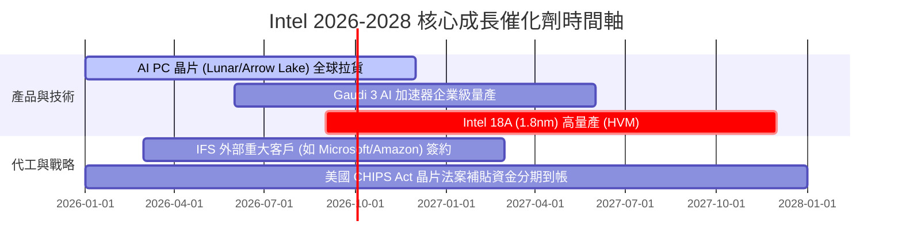

### 8.2 TAM 市場規模分析

```
╔══════════════════════════════════════════════════════════════════╗
║                  Intel 關鍵目標市場 TAM 與滲透展望              ║
╠══════════════════════════════════════════════════════════════════╣
║                                                                  ║
║  1. 客戶端 AI PC 晶片市場 (2028E TAM: $65B)                      ║
║     └── 當前滲透率 ~35% ｜ Intel 目標市佔率: > 60%               ║
║                                                                  ║
║  2. 資料中心與 AI 加速器市場 (2028E TAM: $150B)                  ║
║     └── 當前滲透率 < 5%  ｜ Intel 目標市佔率: 10% - 15%          ║
║                                                                  ║
║  3. 先進晶圓代工與封裝 (IFS) 市場 (2028E TAM: $100B)             ║
║     └── 當前滲透率 < 2%  ｜ Intel 目標市佔率: 8% - 12%           ║
╚══════════════════════════════════════════════════════════════════╝
```

### 8.3 成長驅動力結構圖

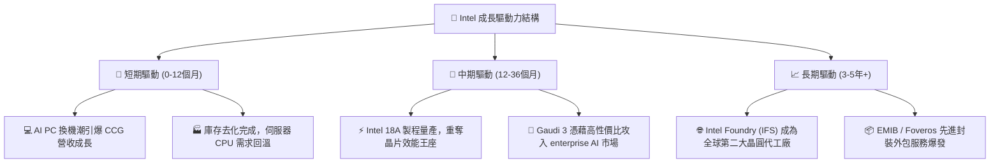

---

## 9. 風險矩陣

### 9.1 風險評分矩陣

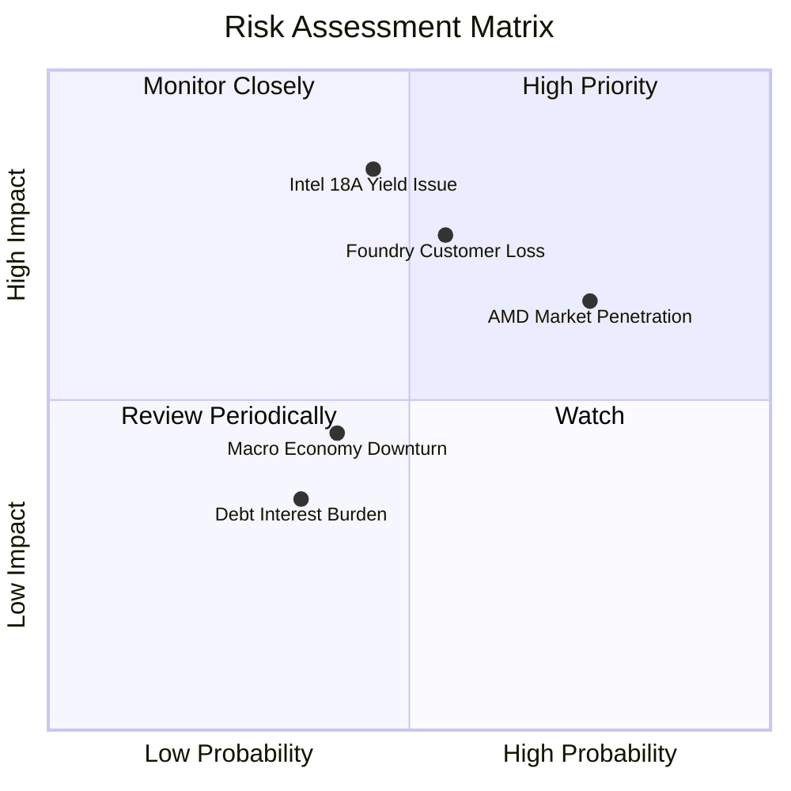

### 9.2 風險清單詳細分析

| # | 風險項目 | 發生機率 | 財務衝擊 | 風險評分 | 緩解措施與觀察指標 |
|---|----------|----------|----------|----------|-------------------|
| 1 | 🔴 **18A 製程良率不及預期** | 中 (45%) | 極高 (-20% 營收) | 🔴 **7.6/10** | 觀察 2026 下半年 Panther Lake 量產晶片之良率報告。 |
| 2 | 🔴 **代工外部客戶（IFS）接單停滯** | 中 (55%) | 高 (-$5B 營收) | 🔴 **7.1/10** | 加強與微軟、亞馬遜等晶片自研巨頭之極深戰略合作。 |
| 3 | 🟡 **AMD 於資料中心持續侵蝕市佔** | 高 (75%) | 中 (-8% 毛利率) | 🟡 **6.5/10** | 加快 Granite Rapids / Sierra Forest 伺服器 CPU 升級迭代。 |
| 4 | 🟡 **宏觀經濟低迷抑制 PC 消費** | 中 (40%) | 中 (-5% 營收) | 🟡 **4.5/10** | 調整產品組合，轉向高單價企業級 AI PC 產品線。 |
| 5 | 🟢 **高額債務利息支出負擔** | 低 (35%) | 低 (-$200M 淨利)| 🟢 **3.2/10** | 帳上有 $29.73B 現金，短期財務危機發生機率極低。 |

---

## 10. 投資建議

### 10.1 最終綜合評級雷達圖

```
╔══════════════════════════════════════════════════════════════════╗
║                     Intel 綜合評分評估與總結                    ║
╠══════════════════════════════════════════════════════════════════╣
║  基本面強度： 6.0 / 10  ▓▓▓▓▓▓▓▓▓▓▓▓░░░░░░░░  🟡 中規中矩        ║
║  成長動能：   6.5 / 10  ▓▓▓▓▓▓▓▓▓▓▓▓▓░░░░░░░  🟢 營收大幅反彈    ║
║  獲利品質：   4.5 / 10  ▓▓▓▓▓▓▓▓▓░░░░░░░░░░░  🔴 GAAP 淨利受損   ║
║  財務健康：   6.5 / 10  ▓▓▓▓▓▓▓▓▓▓▓▓▓░░░░░░░  🟢 現金充沛        ║
║  估值合理性： 5.5 / 10  ▓▓▓▓▓▓▓▓▓▓▓░░░░░░░░░  🟡 包含轉型預期    ║
║  護城河深度： 6.5 / 10  ▓▓▓▓▓▓▓▓▓▓▓▓▓░░░░░░░  🟢 x86 防線穩固    ║
║                                                                  ║
║  綜合評分：   6.0 / 10  ▓▓▓▓▓▓▓▓▓▓▓▓░░░░░░░░  🏆 評級：持有 (Hold)║
╚══════════════════════════════════════════════════════════════════╝
```

### 10.2 目標價與隱含報酬率

| 情境 | 機率權重 | 目標價 | 相對當前股價 ($86.30) 漲跌幅 | 期望值貢獻 |
|------|----------|--------|------------------------------|------------|
| 🔴 **悲觀情境** | 25% | **$74.00** | -14.25% | $18.50 |
| 🟡 **基準情境** | 50% | **$115.27**| +33.57% | $57.64 |
| 🟢 **樂觀情境** | 25% | **$200.00**| +131.75% | $50.00 |
| **加權綜合期望目標價** | **100%** | **$126.14**| **+46.16%** | **$126.14** |

### 10.3 買入時機與觸發因素

```
╔══════════════════════════════════════════════════════════════════╗
║                  ✅ Intel 投資觸發因素 Checklist                 ║
╠══════════════════════════════════════════════════════════════════╣
║                                                                  ║
║  建倉 / 分批買入觸發條件：                                       ║
║  ☐ 股價回檔至 $74.00 - $80.00 安全邊際區間                       ║
║  ✅ 單季自由現金流 (FCF) 連續兩季突破 $2.0B （已達成）           ║
║  ☐ 官方公佈 Intel 18A 外部客戶商業簽約規模超過 $5.0B            ║
║  ☐ 單季毛利率 (Gross Margin) 穩健站回 42.0% 以上                 ║
║                                                                  ║
║  加碼 / 追高觸發條件：                                           ║
║  ☐ 季報 GAAP 淨利轉正，資產減損提列告一段落                     ║
║  ☐ DCAI 加速器 (Gaudi) 單季營收成長超過 50% QoQ                 ║
║                                                                  ║
║  停損 / 減碼清算觸發條件：                                       ║
║  ☐ Intel 18A 宣佈延期量產超過 6 個月                             ║
║  ☐ 季度 OCF 轉負或帳上現金儲備跌破 $15.0B                        ║
╚══════════════════════════════════════════════════════════════════╝
```

### 10.4 投資人適配度分析

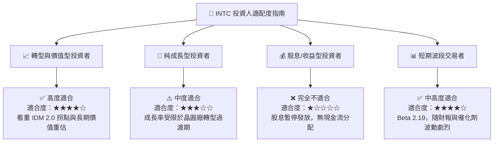

### 10.5 每季財報監控清單（Quarterly Watch List）

| 監控維度 | 核心指標 | 正常區間 / 正向訊號 | 警訊 / 減碼門檻 |
|----------|----------|---------------------|-----------------|
| **營收成長** | 單季 Revenue ($B) | > $14.5B (YoY > +10%) | < $13.0B (YoY 轉負) |
| **獲利品質** | 單季 Gross Margin | > 40.0% | < 35.0% |
| **現金生成** | 單季 Free Cash Flow | > $1.5B | < $0 (再次轉負) |
| **代工進展** | IFS 外部客戶訂單流 | 新增一線科技巨頭簽約 | 舊客戶轉單 TSMC |
| **資本開支** | Annual Capex | 控制於 $12B - $15B | 暴增 > $20B 且無相應 FCF |

### 10.6 反面論證：什麼會證明論點錯誤（What Would Change My Mind）

```
╔══════════════════════════════════════════════════════════════════╗
║              ⚠️ 論點失效條件（Disconfirming Evidence）           ║
╠══════════════════════════════════════════════════════════════════╣
║  本研究報告之「多頭/轉型成功」基本假設，在下列條件發生時即告失效：║
║                                                                  ║
║  1. Intel 18A 製程良率低於 50%，導致 Panther Lake 晶片被迫委外   ║
║     由台積電 (TSMC) 代工，徹底宣告自研晶圓代工失敗。             ║
║  2. 自由現金流 (FCF) 重新轉負並持續 2 個季度以上，燒錢速率高於   ║
║     經營現金流生成速度。                                         ║
║  3. 歸一化 ROIC (4.09%) 未能持續向上擴張，反而跌破 2.0%，顯示     ║
║     資本投入無效化。                                             ║
║  4. 客戶端 (CCG) x86 市務份額被 AMD 與 ARM 架構 PC 壓制至 50%    ║
║     以下。                                                       ║
╚══════════════════════════════════════════════════════════════════╝
```

---

> **免責聲明**：本報告僅供機構投資研究參考，不構成任何買賣金融產品之要約或要約引誘。投資涉及風險，證券價格可升可跌，過往績效不代表未來表現。投資人在做出任何投資決策前，應審慎評估自身風險承受能力並諮詢專業財務顧問。