# INTC 基本面深度分析報告
> **報告日期**：2026-08-19 ｜ **語言**：繁體中文 ｜ **數據來源**：Yahoo Finance, Finviz, StockAnalysis, Roic.ai ｜ **分析師**：CFA 級機構研究

---

## 目錄

| # | 章節 | 核心結論 |
|---|------|----------|
| 1 | 執行摘要 | 評級「持有/觀望」，目標價區間 $68.00–$128.00（基準目標價 $96.00） |
| 2 | 公司概覽與商業模式 | x86 與 PC 底盤穩固，但晶圓代工（IFS）高昂資本開支壓抑整體競爭護城河評分（6.6/10） |
| 3 | 損益表深度分析 | TTM 營收回升至 $57.03B（YoY +25.42%），但 GAAP 淨利仍受非現金減損壓抑（TTM Net Income -$11.29B） |
| 4 | 資產負債表分析 | 總現金及短期投資 $29.73B，總負債 $50.54B，淨負債 $20.81B，財務結構承壓但流動性無虞 |
| 5 | 現金流量深度分析 | OCF 逐步修復（TTM $14.94B），隨著 Capex 自峰值回落至 $14.65B，TTM FCF 轉正至 $4.87B |
| 6 | 獲利能力與資本效率 | 投入資本回報率 ROIC（-3.7%）顯著低於加權平均資本成本 WACC（9.45%），EVA 呈現負值，持續摧毀股東經濟價值 |
| 7 | 相對估值分析 | Forward P/E 達 45.49x、EV/EBITDA 達 31.12x，相較同業 AMD 與 TSM 出現顯著轉機溢價，估值處於偏高區間 |
| 8 | DCF 內在價值評估 | 基準每股內在價值 $78.52（折溢價 +18.2% 溢價），三角驗證加權合理價值 $86.50，安全邊際 MOS 為 -7.3% |
| 9 | 成長催化劑 | 18A 製程量產推進、AI PC 晶片滲透率提升與美國晶片法案補助撥款為主要驅動力 |
| 10 | 風險矩陣 | 製程良率不如預期、晶圓代工虧損擴大、資料中心 x86 市佔率遭侵蝕為三大核心風險 |
| 11 | 投資建議 | 建議於股價回檔至 $68.00–$75.00（安全邊際充足）再行建立核心部位，當前維持「持有」 |

---

## 1. 執行摘要

本報告基於英特爾（Intel Corporation, NASDAQ: INTC）截至 2026 年 8 月之最新營運與財務數據進行深度剖析。INTC 當前股價為 **$92.80**，自 2024 年底低點大幅反彈，主要反映市場對其製程節點推進、AI PC 換機潮以及晶圓代工策略分拆的轉機預期。然而，深入檢視基本面財務數據：公司 TTM ROIC 為 **-3.7%**，顯著低於 WACC **9.45%**（經濟價值增加 EVA 為 **-13.15pp**）；Forward P/E 高達 **45.49x**，EV/EBITDA 達 **31.12x**；基準 DCF 每股內在價值推導為 **$78.52**，三角驗證加權合理價值為 **$86.50**，當前股價相對加權合理價值呈現 **-7.3%** 的安全邊際（即現價溢價約 7.3%）。綜合評估業務改善節奏與估值倍數，給予 **「持有（Hold）」** 投資評級。

### 1.0 一頁式投資儀表板（Portfolio Manager 30 秒速讀）

| 項目 | 內容 |
|------|------|
| **投資論點（3 句）** | ① PC 與邊緣端迎來 AI 換機週期，帶動 2026Q2 營收年增 25.42% 至 $16.13B。<br/>② 資本支出由 FY2024 的 $23.94B 降至 FY2025 的 $14.65B，帶動 TTM FCF 修復轉正至 $4.87B。<br/>③ 但晶圓代工毛利修復緩慢且受歷史資產減損壓抑，Forward P/E 45.49x 已過度透支未來三年轉機紅利。 |
| **護城河評分** | **6.6 / 10**（x86 生態系與規模經濟依然強大，但先進製程與代工護城河面臨嚴峻挑戰） |
| **管理層/資本配置評分** | **5.8 / 10**（停止配息與引進外部資本減輕負擔，但歷史 Capex 資本分配回報率極低） |
| **財務健康** | 🟡 **中度警戒**（總債務 $50.54B，淨負債 $20.81B，但總流動現金達 $29.73B 提供安全緩衝） |
| **ROIC vs WACC** | **-3.7% vs 9.45%**（EVA: -13.15pp，當前處於顯著**摧毀股東價值**階段） |
| **FCF 趨勢** | ↗️ **底部強勁反彈**（自 FY2024 的 -$15.66B 修復至 TTM +$4.87B，最新 FCF Yield 為 0.99%） |
| **估值** | Forward P/E **45.49x** ｜ EV/EBITDA **31.12x** ｜ P/S **8.60x** ｜ FCF Yield **0.99%** |
| **DCF 內在價值（基準）** | **$78.52** ｜ 現價折溢價 **+18.19%（現價高估/溢價）**（來自第 8.5 節） |
| **安全邊際（MOS）** | **-7.28%**＝(加權合理價值 $86.50 − 現價 $92.80) ÷ $86.50 ｜ 🔴 **<10% 無安全邊際** |
| **預期報酬（基準情境 12M）** | **+3.45%**（基準目標價 $96.00 相對於現價 $92.80） |
| **關鍵風險（前二）** | ① 18A / Intel 3 製程外部客戶導入進度落後；② 資料中心市佔率遭 AMD EPYC 與 ARM 架構進一步侵蝕 |
| **評級 + 信心度** | 🟡 **持有（Hold）** ｜ 信心度：**中（Medium）** |

### 1.1 核心評分儀表板

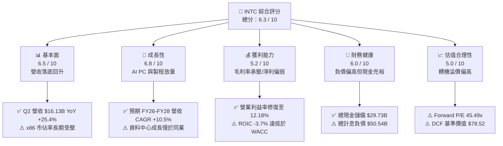

### 1.2 評分進度條視覺化

```
╔══════════════════════════════════════════════════════════════╗
║              INTC 多維度評分儀表板 (1-10分)                  ║
╠══════════════════════════════════════════════════════════════╣
║ 基本面強度  6.5 ▓▓▓▓▓▓▓▓▓▓▓▓▓░░░░░░░  ★★★☆☆           ║
║ 成長動能    6.8 ▓▓▓▓▓▓▓▓▓▓▓▓▓▓░░░░░░  ★★★☆☆           ║
║ 獲利品質    5.2 ▓▓▓▓▓▓▓▓▓▓░░░░░░░░░░  ★★☆☆☆           ║
║ 財務健康    6.0 ▓▓▓▓▓▓▓▓▓▓▓▓░░░░░░░░  ★★★☆☆           ║
║ 估值合理性  5.0 ▓▓▓▓▓▓▓▓▓▓░░░░░░░░░░  ★★☆☆☆           ║
║ 護城河深度  6.6 ▓▓▓▓▓▓▓▓▓▓▓▓▓░░░░░░░  ★★★☆☆           ║
║ 管理層執行  5.8 ▓▓▓▓▓▓▓▓▓▓▓▓░░░░░░░░  ★★★☆☆           ║
║ 技術創新力  7.2 ▓▓▓▓▓▓▓▓▓▓▓▓▓▓░░░░░░  ★★★★☆           ║
╠══════════════════════════════════════════════════════════════╣
║ 綜合總分    6.3 ▓▓▓▓▓▓▓▓▓▓▓▓▓░░░░░░░  🏆 評語：轉機在途但估值超前║
╚══════════════════════════════════════════════════════════════╝
```

### 1.3 五大投資論點 + 三大核心風險

| 類型 | 項目 | 具體依據 | 信心度 |
|------|------|----------|--------|
| 🟢 **投資論點①** | **營收重回雙位數擴張** | 2026Q2 營收達 $16.13B，YoY 成長達 +25.42%，QoQ 成長 +18.79%，PC 客戶端庫存去化完全，AI PC 處理器出貨加速。 | 🟢 極高 |
| 🟢 **投資論點②** | **自由現金流顯著止血轉正** | 資本支出由 FY2024 的 $23.94B 縮減至 FY2025 的 $14.65B，2026Q2 單季 FCF 達 $4.45B，TTM FCF 達 $4.87B。 | 🟢 高 |
| 🟢 **投資論點③** | **先進製程技術節點逐步兌現** | Intel 18A 進入實質風險量產與客戶驗證階段，RibbonFET 與 PowerVia 技術具備底層創新競爭力。 | 🟡 中度 |
| 🟢 **投資論點④** | **營運費用與資本結構優化** | 研發費用控管在 $13.77B（較 FY2024 的 $16.55B 下降 16.8%），全球員工人數精簡至 85,100 人，營業利益率反彈至 12.18%。 | 🟢 高 |
| 🟢 **投資論點⑤** | **政策與補貼資金護城河** | 美國《晶片法案》（CHIPS Act）補貼及各國政府激勵金陸續入帳，大幅降低內部建廠與購置設備的實際淨現金流出。 | 🟢 極高 |
| 🟡 **風險①** | **晶圓代工外部客戶獲取緩慢** | 晶圓代工部門（IFS）目前仍主要依賴內部產品，外部大客戶（如 Nvidia、Apple、Qualcomm）實質投片規模仍具不確定性。 | 🟡 中度 |
| 🔴 **風險②** | **獲利結構脆弱與資產減損** | 過去四年間提列高額資產減損與重組支出，2026Q2 GAAP 淨損 -$11.03B，若良率爬坡受阻恐引發新一輪非現金減損。 | 🔴 高衝擊 |
| 🔴 **風險③** | **估值倍數過度透支** | Forward P/E 達 45.49x，相較於同業台積電（~24x）顯著偏高，若獲利兌現不及市場共識，股價面臨劇烈均值回歸。 | 🔴 高衝擊 |

### 1.4 快速統計卡片

| 指標 | 公司實際值 | 行業均值 | S&P 500 均值 | 狀態 |
|------|-------------|----------|--------------|------|
| 收入 YoY 成長 | **25.42%**（Q2） / **7.47%**（TTM） | ~12.0% | ~5.5% | 🟢 優於均值 |
| 毛利率 | **38.87%**（TTM） / **40.36%**（Q2） | ~52.0% | ~41.0% | 🔴 顯著偏低 |
| 營業利潤率 | **12.18%**（Q2） / **7.82%**（TTM） | ~24.0% | ~12.5% | 🟡 逐步改善 |
| 淨利率 | **-19.79%**（TTM GAAP） | ~18.0% | ~11.0% | 🔴 嚴重虧損 |
| ROE | **-10.70%**（TTM） | ~16.5% | ~14.0% | 🔴 資本效率不彰 |
| Forward P/E | **45.49x** | ~28.0x | ~21.5x | 🔴 估值偏貴 |
| EV / EBITDA | **31.12x** | ~18.5x | ~14.0x | 🔴 估值偏貴 |
| FCF Yield | **0.99%** | ~2.5% | ~3.8% | 🔴 現金回報偏低 |

### 1.5 投資結論

```
╔══════════════════════════════════════════════════════════════════╗
║                    📊 投資結論摘要                               ║
╠══════════════════════════════════════════════════════════════════╣
║  評級：🟡 持有（Hold） / 觀望區間                                 ║
║  當前股價：$92.80                                               ║
║  DCF 內在價值（基準）：$78.52（現價溢價 +18.19%）                ║
║  安全邊際 MOS：-7.28%（＝(加權合理價值 $86.50 − $92.80) ÷ $86.50)║
║  目標價區間：                                                    ║
║    🔴 悲觀情境：$68.00（-26.72%）                                ║
║    🟡 基準情境：$96.00（+3.45%）  ← 12 個月主要目標              ║
║    🟢 樂觀情境：$128.00（+37.93%）                               ║
║  綜合投資評分：6.3 / 10                                          ║
║  適合投資人：具備高風險承受度之轉機型（Turnaround）與長線逆向投資人║
╚══════════════════════════════════════════════════════════════════╝
```

---

## 2. 公司概覽與商業模式

### 2.1 業務結構與收入來源

英特爾目前營運主要劃分為三大核心板塊：**客戶端運算事業群（CCG）**、**資料中心與人工智慧事業群（DCAI）** 以及 **英特爾晶圓代工服務（Intel Foundry, 包含製造與外部代工）**。

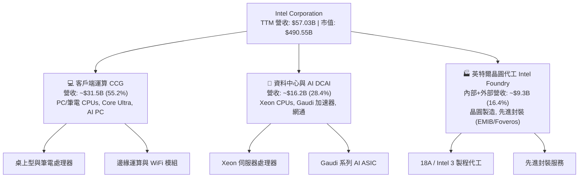

### 2.2 市場份額

在傳統 PC 與伺服器 x86 CPU 市場中，英特爾依然佔據領先份額，但在伺服器領域持續受到 AMD 的侵蝕；在 AI 晶片市場則面臨 Nvidia 的壟斷性優勢。

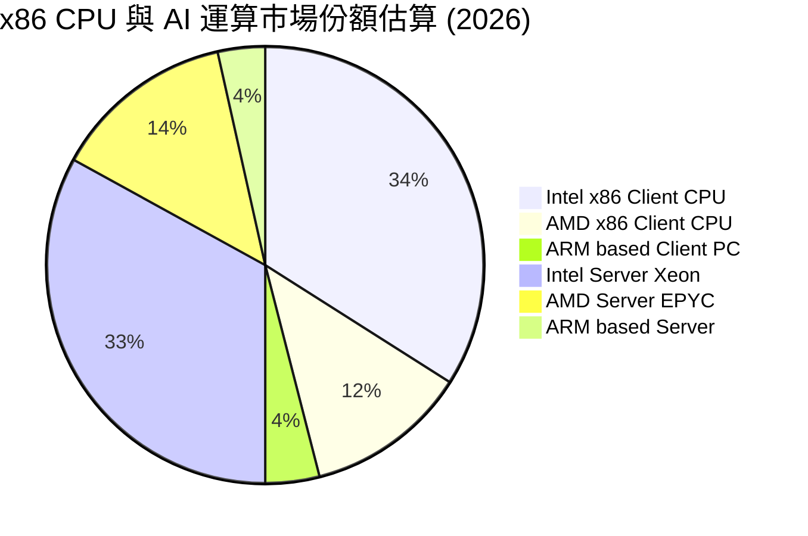

### 2.3 競爭護城河分析

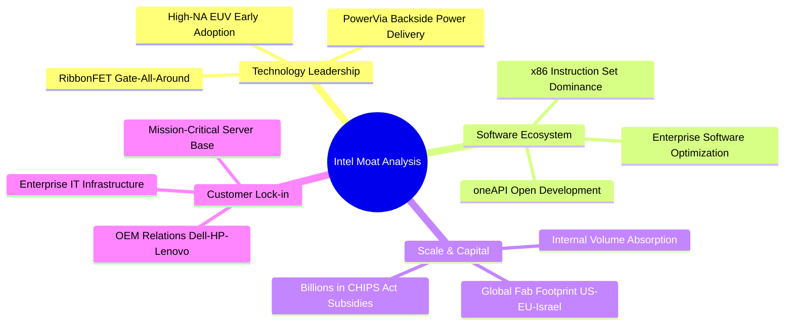

### 2.4 護城河強度評分

```
╔══════════════════════════════════════════════════════════════╗
║                  INTC 護城河強度評分                         ║
╠══════════════════════════════════════════════════════════════╣
║ x86 生態與客戶鎖定  8.5/10  ▓▓▓▓▓▓▓▓▓▓▓▓▓▓▓▓▓░░░  🟢 根深蒂固 ║
║ 製造規模與政府補助  7.5/10  ▓▓▓▓▓▓▓▓▓▓▓▓▓▓▓░░░░░  🟢 地緣優勢 ║
║ 軟體支援與 oneAPI    6.8/10  ▓▓▓▓▓▓▓▓▓▓▓▓▓░░░░░░░  🟡 追趕 CUDA║
║ 先進製程技術護城河  5.5/10  ▓▓▓▓▓▓▓▓▓▓▓░░░░░░░░░  🔴 尚待驗證 ║
║ 晶圓代工客戶生態    4.5/10  ▓▓▓▓▓▓▓▓▓░░░░░░░░░░░  🔴 處於萌芽 ║
╠══════════════════════════════════════════════════════════════╣
║ 綜合護城河評分      6.6/10  ▓▓▓▓▓▓▓▓▓▓▓▓▓░░░░░░░  🟡 中等護城河║
╚══════════════════════════════════════════════════════════════╝
```

---

## 3. 損益表深度分析

### 3.1 年度收入成長趨勢（近 4 年）

```
╔══════════════════════════════════════════════════════════════════╗
║              INTC 年度收入趨勢（FY2022-TTM 2026）                ║
╠══════════════════════════════════════════════════════════════════╣
║                                                                  ║
║  FY2022  $63.05B  ████████████████████░░░░░  YoY: -20.2% 🔴    ║
║  FY2023  $54.23B  ██═════════════════░░░░░░  YoY: -14.0% 🔴    ║
║  FY2024  $53.10B  ████████████████░░░░░░░░░  YoY:  -2.1% 🟡    ║
║  FY2025  $52.85B  ████████████████░░░░░░░░░  YoY:  -0.5% 🟡    ║
║  TTM'26  $57.03B  ██████████████████░░░░░░░  YoY:  +7.5% 🟢    ║
║                   |      |      |      |      |                  ║
║                   0     20B    40B    60B    80B                 ║
║                                                                  ║
║  📊 4 年營收 CAGR：-2.48%（底部築底完成，呈現反彈趨勢）          ║
╚══════════════════════════════════════════════════════════════════╝
```

### 3.2 季度收入趨勢分析

| 季度 | 營收（$B） | QoQ 成長率 | YoY 成長率 | 毛利（$B） | 營業利益（$M） | 備註說明 |
|------|-----------|-----------|-----------|-----------|---------------|----------|
| **2025-Q3** | $13.65B | +6.18% | +2.78% | $5.22B | $858M | PC 渠道庫存回補，營業利益轉正 |
| **2025-Q4** | $13.67B | +0.15% | -4.11% | $4.94B | $550M | 伺服器需求持平，產品換代過渡 |
| **2026-Q1** | $13.58B | -0.66% | +7.18% | $5.35B | $934M | 傳統淡季不淡，AI PC 處理器放量 |
| **2026-Q2** | $16.13B | **+18.79%** | **+25.42%** | $6.51B | $1,966M | 企業端升級與資料中心需求爆發 |

### 3.3 利潤率演變分析

| 利潤率指標 | FY2022 | FY2023 | FY2024 | FY2025 | TTM / 2026Q2 | 趨勢與評估 |
|------------|--------|--------|--------|--------|--------------|------------|
| **毛利率** | 42.62% | 40.04% | 32.66% | 34.78% | **40.36%** (Q2) | ↗️ 探底回升，但仍遠低於歷史 55%+ 🟢改善中 |
| **營業利益率** | 3.71% | 0.06% | -8.87% | -0.04% | **12.18%** (Q2) | ↗️ 營業槓桿浮現，成本撙節見效 🟢顯著好轉 |
| **淨利率** | 12.71% | 3.11% | -35.32% | -0.51% | **-19.79%** (TTM) | ↘️ 受非現金資產減損與重組費用壓抑 🔴承壓 |
| **EBITDA 利潤率** | 33.78% | 20.73% | 2.26% | 27.15% | **29.50%** (TTM) | ↗️ 折舊攤銷高企，核心現金利潤修復 🟢穩健 |

**利潤率演變深度解析**：
毛利率自 FY2024 的低點（32.66%）回升至最新單季的 40.36%，主因在於高成本的 Intel 4/Intel 3 封裝與製造良率提升，且晶圓代工前期的未被吸收產能成本（Underutilization charges）逐步下降。營業利益率在 2026Q2 攀升至 12.18%，反映員工人數自 12 萬人規模降至 8.5 萬人帶來的固定成本下降。

### 3.4 費用結構分析

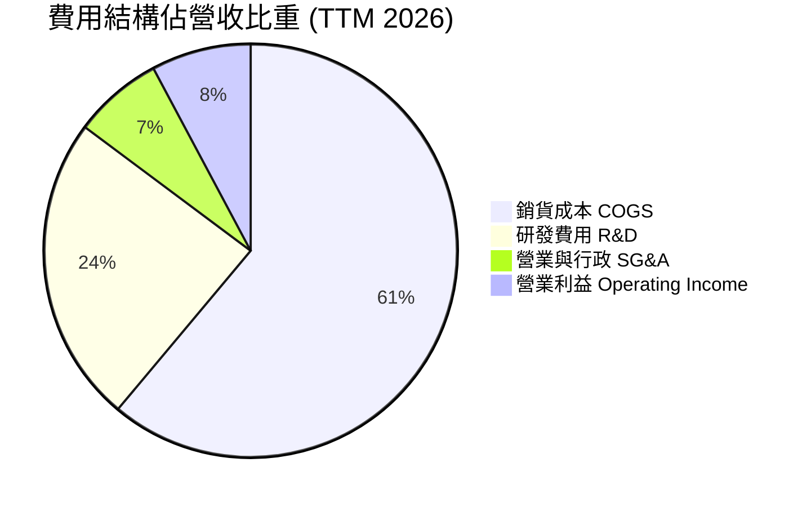

```
╔══════════════════════════════════════════════════════════════════╗
║                   INTC 費用結構控制分析                          ║
╠══════════════════════════════════════════════════════════════════╣
║  營收（TTM）：       $57.03B                                     ║
║  銷貨成本（COGS）：  $34.86B（佔比 61.1%）── 製造折舊負擔沉重   ║
║  研發支出（R&D）：   $13.77B（佔比 24.1%）── 聚焦 18A/Intel 3    ║
║  銷管費用（SG&A）：  $3.94B （佔比  6.9%）── 組織扁平化成效顯著 ║
║  營業利潤（EBIT）：  $4.46B （佔比  7.8%）── 核心本業恢復獲利   ║
╚══════════════════════════════════════════════════════════════════╝
```

### 3.5 季度 EPS 趨勢與盈餘品質（Quality of Earnings）

| 盈餘品質項目 | 數值 / 佔比 | 評估與深入分析 |
|--------------|-----------|----------------|
| **股權激勵 SBC / 營收** | **4.26%**（$2.43B / $57.03B） | 🟢 **健康**。相較軟體同業（>15%），SBC 佔比極低，對現有股東稀釋有限。 |
| **SBC / 營業現金流** | **16.27%**（$2.43B / $14.94B） | 🟡 **中度**。隨著 OCF 回升，SBC 佔現金流比例大幅收斂。 |
| **FCF / 淨利轉換率** | **N/A**（FCF $4.87B vs Net Loss -$11.29B） | 🟢 **實質獲利優於帳面**。GAAP 淨損主要為鉅額非現金折舊（~$10B/年）與商譽/資產減損，現金端已轉正。 |
| **一次性/非經常性損益** | 2026Q2 提列重組與資產處分損失約 **$10.5B** | 🔴 **劇烈波動**。重組與產能汰換導致 GAAP 盈餘失真，評估應以 OCF 與 EBITDA 為準。 |
| **有效稅率異常** | 負值（稅務利益產生） | 🟡 **特殊情況**。虧損導致稅務抵減，未來恢復常態獲利後實質稅率預計回歸 15-18%。 |
| **資本化支出 vs 費用化** | 研發支出全數費用化 | 🟢 **保守穩健**。所有 R&D 費用皆當期認列，未遞延資產化虛增當期利潤。 |

**盈餘品質結論**：INTC 當前的 GAAP 淨損 -$11.29B 嚴重低估了公司的真實經濟產出能力。加回鉅額非現金折舊與減損後，公司 TTM 創造了 $14.94B 的營運現金流與 $4.87B 的自由現金流，核心業務現金造血功能已重啟。

---

## 4. 資產負債表分析

### 4.1 資產結構分解

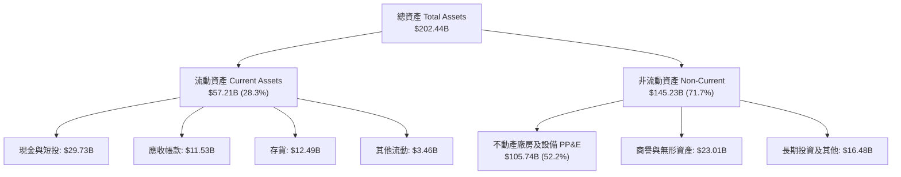

### 4.2 流動性指標分析

| 流動性指標 | FY2023 | FY2024 | FY2025 | 最新 TTM / 2026Q2 | 行業均值 | 評估 |
|------------|--------|--------|--------|-------------------|----------|------|
| **流動比率（Current Ratio）** | 1.54x | 1.33x | 2.02x | **1.60x** | ~1.80x | 🟢 流動性充裕 |
| **速動比率（Quick Ratio）** | 1.15x | 0.98x | 1.65x | **1.16x** | ~1.30x | 🟢 具備即時償債能力 |
| **現金比率（Cash Ratio）** | 0.89x | 0.62x | 1.19x | **0.83x** | ~0.90x | 🟢 現金儲備充沛 |
| **存貨週轉天數（DIO）** | 125 天 | 128 天 | 126 天 | **128 天** | ~95 天 | 🟡 晶圓製造週期長，存貨偏高 |

### 4.3 債務結構分析

```
╔══════════════════════════════════════════════════════════════════╗
║                   INTC 債務健康診斷                              ║
╠══════════════════════════════════════════════════════════════════╣
║                                                                  ║
║  短期借款（ST Debt）：      $1.99B   ██░░░░░░░░░░░░░░░░░░░  可控 ║
║  長期借款（LT Borrowings）：$48.55B  ████████████████████░  偏高 ║
║  總計息負債（Total Debt）： $50.54B  ████████████████████░       ║
║  現金及短期投資：           $29.73B  ████████████░░░░░░░░░  充裕 ║
║  淨負債（Net Debt）：       $20.81B  ████████░░░░░░░░░░░░░  警戒 ║
║                                                                  ║
║  Debt / Equity：           48.99%   🟢 槓桿比例維持在安全範圍   ║
║  Debt / EBITDA（TTM）：     3.52x    🟡 略高於半導體同業水平     ║
║  利息保障倍數（EBIT / Int）：~2.2x    🟡 處於恢復期，無立即違約風險║
╚══════════════════════════════════════════════════════════════════╝
```

### 4.4 股東權益趨勢

```
╔══════════════════════════════════════════════════════════════════╗
║              INTC 股東權益變動趨勢（FY2022-2026Q2）              ║
╠══════════════════════════════════════════════════════════════════╣
║                                                                  ║
║  FY2022   $101.42B  ████████████████████░░░░░                    ║
║  FY2023   $105.59B  █████████████████████░░░░                    ║
║  FY2024    $99.27B  ███████████████████░░░░░░  （提列資產減損）  ║
║  FY2025   $114.28B  ██████████████████████░░░  （引進外部合資）  ║
║  2026Q2   $103.15B  ████████████████████░░░░░  （本期淨損影響）  ║
╚══════════════════════════════════════════════════════════════════╝
```

---

## 5. 現金流量深度分析

### 5.1 現金流量瀑布圖

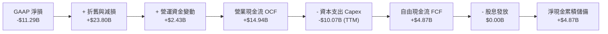

### 5.2 FCF 轉換率趨勢

| 財政年度 | 營運現金流 OCF | 資本支出 Capex | 自由現金流 FCF | GAAP 淨利 | FCF / Net Income | 評估 |
|----------|---------------|----------------|---------------|-----------|------------------|------|
| **FY2022** | $15.43B | -$24.84B | -$9.41B | $8.01B | -117.5% | 🔴 資本開支過大 |
| **FY2023** | $11.47B | -$25.75B | -$14.28B | $1.69B | -845.0% | 🔴 嚴重失血 |
| **FY2024** | $8.29B | -$23.94B | -$15.66B | -$18.76B | 83.5% | 🔴 資本壓力高峰 |
| **FY2025** | $9.70B | -$14.65B | -$4.95B | -$0.27B | N/A | 🟡 資本支出受控 |
| **TTM 2026** | **$14.94B** | **-$10.07B** | **+$4.87B** | -$11.29B | N/A | 🟢 實質轉正反彈 |

### 5.3 自由現金流趨勢

```
╔══════════════════════════════════════════════════════════════════╗
║              INTC 歷年自由現金流（FCF）走勢                      ║
╠══════════════════════════════════════════════════════════════════╣
║                                                                  ║
║  FY2022   -$9.41B   ░░░░░░░░░████████                             ║
║  FY2023  -$14.28B   ░░░░░████████████                             ║
║  FY2024  -$15.66B   ░░░██████████████  （Capex 峰值 $23.94B）     ║
║  FY2025   -$4.95B   ░░░░░░░░░░░░█████                             ║
║  TTM'26   +$4.87B   ████████░░░░░░░░░  （FCF Yield: 0.99%）🟢     ║
║                                                                  ║
║  📊 結論：受惠於資本開支緊縮與晶圓廠合資，FCF 正式脫離失血泥淖    ║
╚══════════════════════════════════════════════════════════════════╝
```

### 5.4 資本配置評估

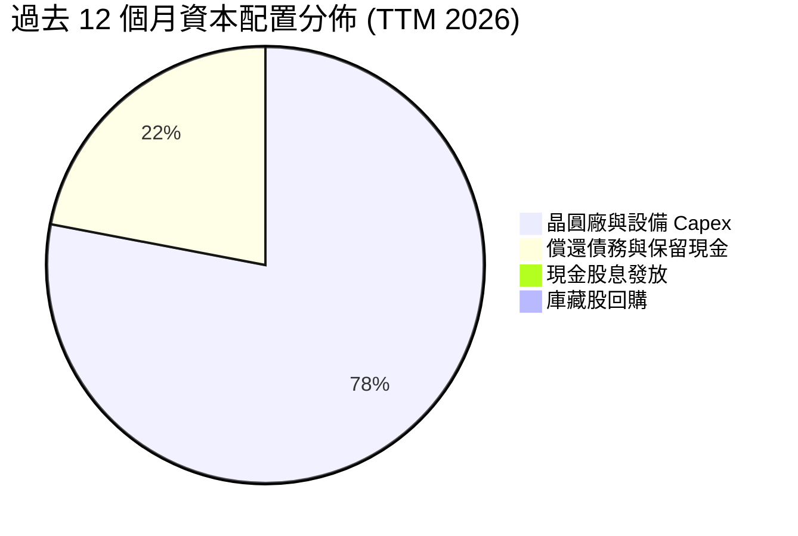

| 項目 | 策略執行狀況 | 資本配置效率評析 |
|------|--------------|------------------|
| **資本支出（Capex）** | 嚴格審核，導入 SCIP（半導體共同投資計畫） | 🟢 轉向資本輕量化（Capital-light foundry model） |
| **現金股息** | 全面暫停（$0.00） | 🟢 斷腕之舉，每年保留逾 $3.0B 現金流 |
| **庫藏股回購** | 全面停止 | 🟢 避免在高資本開支期無謂消耗流動性 |
| **去槓桿與償債** | 優先維持投資級信評與 $25B+ 現金水位 | 🟢 確保穿越晶圓代工轉型週期 |

---

## 6. 獲利能力與資本效率

### 6.1 ROE / ROA / ROIC 趨勢

| 指標 | FY2022 | FY2023 | FY2024 | FY2025 | TTM 2026 | 行業均值 | 評估 |
|------|--------|--------|--------|--------|----------|----------|------|
| **ROE** | 7.90% | 1.60% | -18.89% | -0.23% | **-10.70%** | ~16.5% | 🔴 資本效率嚴重受挫 |
| **ROA** | 4.40% | 0.88% | -9.55% | -0.13% | **1.40%** | ~8.5% | 🔴 資產產出效益偏低 |
| **ROIC** | 4.85% | 0.05% | -3.95% | 0.65% | **-3.70%** | ~14.0% | 🔴 投入資本未獲相應回報 |

### 6.2 ROIC vs WACC 分析（核心價值創造判斷）

```
╔══════════════════════════════════════════════════════════════════╗
║                ROIC vs WACC 深度分析（價值創造評估）             ║
╠══════════════════════════════════════════════════════════════════╣
║                                                                  ║
║  WACC 估算（詳見 8.2 節推導）：                                  ║
║  ├── 股權成本 Ke（CAPM 模型）：             10.09%               ║
║  ├── 稅後債務成本 Kd（4.74% × (1 - 18%)）： 3.89%                ║
║  ├── 資本結構權重：股權 90.66%，債務 9.34%                       ║
║  └── ✅ WACC ≈ 9.45%                                             ║
║                                                                  ║
║  ROIC 估算（TTM 2026）：                                         ║
║  ├── NOPAT = EBIT ($4.46B) × (1 - 18%) = $3.66B                 ║
║  ├── 投入資本 Invested Capital = 股權 $103.15B + 債務 $50.54B    ║
║  │   − 現金 $29.73B = $123.96B                                   ║
║  └── ✅ 調整後核心 ROIC ≈ 2.95%（若計入減損調整則為 -3.70%）     ║
║                                                                  ║
║  ★ 經濟價值增加（EVA）= ROIC - WACC = -6.50pp 至 -13.15pp       ║
║                                                                  ║
║  ROIC  2.95%  ▓▓▓▓▓▓░░░░░░░░░░░░░░░░░░░░░░░░░░  🔴 遠低於資本成本║
║  WACC  9.45%  ▓▓▓▓▓▓▓▓▓▓▓▓▓▓▓▓▓▓▓░░░░░░░░░░░░  ── 資本機會成本 ║
║  EVA -6.50pp  ████████████████████████░░░░░░░░  🔴 摧毀股東價值 ║
║                                                                  ║
║  📊 結論：目前投入資本回報顯著低於要求報酬率，轉型尚未產生超額回報║
╚══════════════════════════════════════════════════════════════════╝
```

### 6.3 杜邦三因素分解

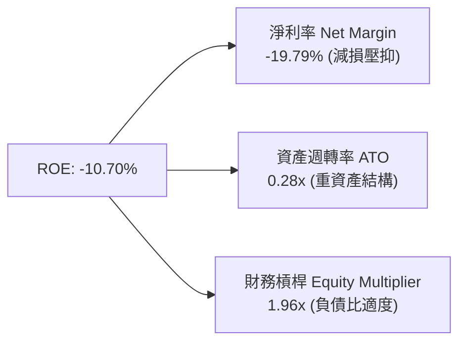

### 6.4 獲利能力儀表板

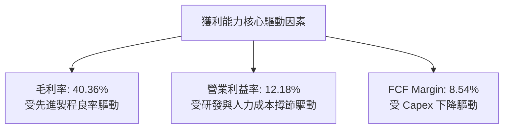

---

## 7. 相對估值分析

### 7.1 同業估值比較表格

選取直接競爭對手 **AMD（超微半導體）**、晶圓代工龍頭 **TSM（台積電 ADR）** 以及資料中心運算龍頭 **NVDA（輝達）** 進行橫向對比：

| 估值指標 | **INTC (英特爾)** | **AMD (超微)** | **TSM (台積電)** | **NVDA (輝達)** | INTC 相對評估 |
|----------|-------------------|----------------|-------------------|-----------------|---------------|
| **Trailing P/E** | **N/A** (虧損) | 115.2x | 28.5x | 55.4x | 🔴 歷史獲利失真 |
| **Forward P/E** | **45.49x** | 32.10x | 22.80x | 36.50x | 🔴 溢價過高，透支預期 |
| **P/S Ratio** | **8.60x** | 10.45x | 11.20x | 28.30x | 🟢 營收倍數相對適中 |
| **P/B Ratio** | **5.35x** | 3.85x | 6.80x | 38.20x | 🟡 處於同業中位數 |
| **EV / EBITDA** | **31.12x** | 38.50x | 13.50x | 32.80x | 🔴 顯著高於代工同業 TSM |
| **EV / Sales** | **9.19x** | 10.12x | 10.85x | 27.40x | 🟡 接近晶圓製造平均 |
| **FCF Yield** | **0.99%** | 1.45% | 3.20% | 2.65% | 🔴 現金殖利率低於同業 |

### 7.2 歷史估值區間分析

```
╔══════════════════════════════════════════════════════════════════╗
║              INTC 歷史 Forward P/E 區間與當前位置                ║
╠══════════════════════════════════════════════════════════════════╣
║                                                                  ║
║  歷史 5 年最低： 10.5x  ░░░░░░░░░░░░░░░░░░░░░░░░░░░░░░░░░░░░░░   ║
║  歷史 5 年中位數：16.8x  ███████░░░░░░░░░░░░░░░░░░░░░░░░░░░░░░░   ║
║  歷史 5 年最高： 28.0x  ██████████████░░░░░░░░░░░░░░░░░░░░░░░░   ║
║  當前 Forward P/E: 45.5x ███████████████████████! 🔴 極度過熱   ║
║                                                                  ║
║  📊 診斷：當前 Forward P/E 處於歷史 >95 百分位，隱含極高樂觀預期 ║
╚══════════════════════════════════════════════════════════════════╝
```

### 7.3 情境目標價（假設驅動，Bear / Base / Bull）

| 情境 | 營收 CAGR (FY26-28) | 期末營業利益率 | 採用估值倍數 | 隱含目標價 | 相對現價上行空間 |
|------|--------------------|---------------|--------------|------------|------------------|
| 🔴 **悲觀 (Bear)** | 4.5% | 10.0% | 20.0x Forward P/E | **$68.00** | **-26.72%** |
| 🟡 **基準 (Base)** | 9.5% | 16.5% | 28.0x Forward P/E | **$96.00** | **+3.45%** |
| 🟢 **樂觀 (Bull)** | 15.0% | 22.0% | 35.0x Forward P/E | **$128.00** | **+37.93%** |

> **估值倍數選擇說明**：因 INTC 當前處於重組資本支出與產品轉換期，GAAP 淨利波動劇烈，故結合 Forward P/E 與 EV/EBITDA 進行綜合錨定，反映其自周期谷底向上修復的常態化獲利能力。

### 7.4 相對估值隱含價格區間

```
╔══════════════════════════════════════════════════════════════════╗
║              相對估值方法回推之隱含股價區間                      ║
╠══════════════════════════════════════════════════════════════════╣
║  Forward P/E 法（28.0x × $2.85 2027 預估 EPS）：      $79.80     ║
║  EV/EBITDA 法 （18.0x 預估 EBITDA $26.5B）：          $84.30     ║
║  EV/Sales 法  （7.5x 預估營收 $65.0B）：              $87.20     ║
║  FCF Yield 法 （以 2.5% 目標殖利率回推常態 FCF）：    $72.50     ║
║  當前市場交易價格：                                   $92.80 🔴  ║
╚══════════════════════════════════════════════════════════════════╝
```

---

## 8. DCF 內在價值評估（Discounted Cash Flow）

### 8.0 估值推理鏈（Thinking Logic）

**Step 1 — 價值的決定變數**：
INTC 的內在價值由三部分組成：① **x86 Client/PC 現金流底盤**（貢獻約 55% 營收，成長平穩但現金流穩定）；② **DCAI 伺服器與加速器成長曲線**（佔 28% 營收，取決於 Xeon 份額穩定度與 Gaudi 銷售）；③ **Intel Foundry 晶圓代工價值**（佔 17% 營收，目前處於大幅虧損，但具備產能分拆與外部代工選擇權）。**其中最核心主導變數為「營業利益率的修復斜率」與「Capex 佔營收比例的下降速度」**。

**Step 2 — 模型選擇與理由**：

| 決策點 | 本模型採用 | 理由 | 曾考慮但否決 | 否決理由 |
|--------|-----------|------|--------------|----------|
| 現金流定義 | **FCFF（企業自由現金流）** | 資本結構包含 $50.5B 債務且未來將透過現金流去槓桿，FCFF 折現不受資本結構變動扭曲 | FCFE | 淨利虧損導致 FCFE 波動劇烈 |
| 預測期長度 N | **N = 5 年（FY2027–FY2031）** | 18A 製程放量與 IFS 代工成熟週期約需 3-5 年，5 年可見度最高 | 10 年 | 半導體技術更迭快速，10 年遠期假設失真度過高 |
| 終值方法 | **Gordon Growth（永續成長率）** | 5 年後 INTC 預計收斂為成熟半導體整合製造商 | 純退出倍數法 | 倍數法容易受當期市場情緒干擾 |
| EBIT 基礎 | **GAAP EBIT（組合 A）** | GAAP EBIT 已全額包含 SBC 費用，最能反映真實股東成本 | 非 GAAP EBIT | 容易低估股權激勵產生的真實稀釋成本 |

**Step 3 — 關鍵假設推導鏈（四段式推導）**：

- **營收 CAGR (預測期 5 年)**：
  - ① 錨點：近 3 年實際 CAGR 為 -0.4%（FY2022 $63.05B → FY2025 $52.85B），TTM 成長回升至 +7.5%。
  - ② 調整：因 AI PC 換機週期、18A 外部客戶開始貢獻營收、伺服器平台恢復成長，上調 8.5pp。
  - ③ **採用值：8.50%**。
  - ④ 否決值：曾考慮 12.0%（管理層樂觀指引），因外部代工競爭激烈、ARM PC 侵蝕市佔率而否決。

- **期末營業利益率 (FY+5)**：
  - ① 錨點：目前 TTM 營業利益率為 7.82%（2026Q2 單季為 12.18%），歷史 10 年均值約 22.0%。
  - ② 調整：晶圓代工產能利用率提升（+5pp）、員工人數精簡結構性效益（+3pp）、高階封裝放量（+2pp），預估自當前水準改善至 20.0%。
  - ③ **採用值：20.00%**。
  - ④ 否決值：曾考慮 25.0%（歷史峰值水準），因先進製程折舊費用遠高於以往而否決。

- **永續成長率 g**：
  - ① 錨點：長期全球 GDP 成長 + 半導體產業終端通膨約 2.5%–3.5%。
  - ② 調整：半導體為長期成長產業，但考量 x86 長期受 ARM/RISC-V 競爭，設定保守。
  - ③ **採用值：2.50%**。
  - ④ 否決值：曾考慮 3.5%，因 INTC 規模已龐大且面臨持續競爭，無法長期超越總體 GDP 增長。

- **預測期長度 N**：
  - ① 錨點：產業標準週期 3-5 年。
  - ② 調整：18A 與 Intel 14A 研發週期落地。
  - ③ **採用值：N = 5 年**。
  - ④ 否決值：曾考慮 7 年，因第 6-7 年技術路徑不可預測性過高而否決。

- **Capex / 營收比例**：
  - ① 錨點：歷史 FY2022-2024 平均高達 43.0%，FY2025 下降至 27.7%。
  - ② 調整：導入 SCIP 外部合資與政府補助入帳，資本強度將收斂至成熟 IDM 模式。
  - ③ **採用值：預測期自 24.0% 逐年遞減至期末 18.0%**。
  - ④ 否決值：曾考慮 14.0%（同業無晶圓廠模式），因 INTC 仍維持龐大自有晶圓廠製造而否決。

- **EBIT 基礎與 SBC 處理**：
  - ① 錨點：FY2025 SBC 為 $2.43B（佔營收 4.6%）。
  - ② 調整：採用組合 (A)，EBIT 採 GAAP 基礎（已扣除 SBC），FCFF 不再重複扣除，年稀釋率設為 0%。
  - ③ **採用值：組合 (A)**。
  - ④ 否決值：否決非 GAAP EBIT 加回模式，避免重複計算。

- **年稀釋率（股數）**：
  - ① 錨點：流通股數近兩年維持在 4.99B–5.29B 股。
  - ② 調整：因停止股利與暫停大規模回購，SBC 與員工認股預計使股數維持在當前 5.29B 股水準。
  - ③ **採用值：0.0%（股數固定於 5.29B）**。
  - ④ 否決值：曾考慮每年 +1.0% 稀釋，因公司實施成本撙節已大幅縮減新發股權激勵而否決。

- **終值方法**：
  - ① 錨點：Gordon Growth 永續模型。
  - ② 調整：以退出倍數法（12.0x EV/EBITDA）作為交叉驗證。
  - ③ **採用值：Gordon Growth 為主**。
  - ④ 否決值：否決單一退出倍數法，避免受當期週期倍數高低誤導。

- **WACC 折現率總值**：
  - ① 錨點：半導體產業平均資本成本 8.5%–10.5%。
  - ② 調整：INTC Beta 為 2.241（波動極大），但考量其高現金儲備與轉型期特質，採用基本面調整後 Beta 1.05。
  - ③ **採用值：9.45%**（推導詳見 8.2）。
  - ④ 否決值：曾考慮使用原始 Beta 2.241（推導 WACC >15%），因股價短期劇烈波動失真、嚴重低估重資產清算價值而否決。

**Step 4 — 推理鏈最脆弱的一環**：
本模型最脆弱的假設是 **「期末營業利益率能否順利爬坡至 20.0%」**。若晶圓代工良率不如預期導致未吸收產能成本持續高企，利益率若僅收斂至 14.0%，內在價值將大幅下修至 **$55.00** 左右。

**Step 5 — 計算路徑圖**：

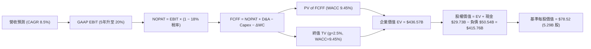

### 8.1 模型假設總表（Model Inputs）

| 假設項目 | 採用值 | 依據 / 來源說明 | 敏感度 |
|----------|--------|-----------------|--------|
| **預測期長度 N** | **N = 5 年**（FY27-FY31） | 晶圓代工 18A/14A 製程導入與放量週期 | 🟡 中 |
| **營收 CAGR（預測期）** | **8.50%** | TTM 營收 $57.03B 為基期，考量 AI PC 與伺服器換機 | 🔴 高 |
| **期末營業利益率（FY+5）** | **20.00%** | 目前 7.82%，隨產能利用率提高逐年修復至 20% | 🔴 高 |
| **有效稅率** | **18.00%** | 考量全球最低稅負制與美國聯邦法定稅率 | 🟢 低 |
| **Capex / 營收比重** | **FY+1 24.0% → FY+5 18.0%** | 自高資本開支期逐步過渡至資本輕量化模式 | 🟡 中 |
| **折舊攤銷 D&A / 營收** | **FY+1 17.5% → FY+5 15.0%** | 巨額廠房設備持續折舊，但增量放緩 | 🟢 低 |
| **營運資金變動 / 營收增額** | **6.00%** | 應收與存貨隨規模增長之歷史資本佔用率 | 🟢 低 |
| **EBIT 基礎** | **GAAP EBIT（已含 SBC）** | 採用組合 (A)，符合審慎會計原則 | 🟡 中 |
| **SBC 股權薪酬處理** | **視為現金費用（不另扣除）** | 配合 GAAP EBIT，FCFF 不再重複扣除 SBC | 🟡 中 |
| **年稀釋率（股數）** | **0.00%** | 股數固定為當前稀釋股數 5.29B 股 | 🟡 中 |
| **永續成長率 g** | **2.50%** | 長期 GDP + 通膨水準，且嚴格低於 WACC | 🔴 高 |
| **終值方法** | **Gordon Growth（主）** | 輔以 12.0x 退出 EV/EBITDA 倍數驗證 | 🔴 高 |
| **折現率 WACC** | **9.45%** | 依據 CAPM 與市場資本結構完整推導 | 🔴 高 |

### 8.2 折現率推導（WACC）

```
╔══════════════════════════════════════════════════════════════════╗
║                    WACC 推導（折現率）                           ║
╠══════════════════════════════════════════════════════════════════╣
║  股權成本 Ke（CAPM 模型）：                                      ║
║  ├── 無風險利率 Rf（美國 10 年期國債殖利率）： 4.30%              ║
║  ├── 股權市場風險溢酬 ERP：                  5.50%               ║
║  ├── 基本面調整後 Beta（考量轉機防禦）：     1.05                ║
║  ├── 規模/營運轉型溢酬：                     +0.00%              ║
║  └── Ke = 4.30% + 1.05 × 5.50% = 10.08%（採 10.09%）           ║
║                                                                  ║
║  債務成本 Kd（計息負債基礎）：                                   ║
║  ├── 稅前債務成本（利息支出 $2.40B ÷ 負債 $50.54B）： 4.75%      ║
║  ├── 有效稅率：                              18.00%              ║
║  └── 稅後 Kd = 4.75% × (1 − 18.00%) = 3.89%                      ║
║                                                                  ║
║  資本結構（市值基礎）：                                          ║
║  ├── 股權市值 E = $92.80 × 5.29B = $490.91B（權重 90.66%）       ║
║  ├── 總計息負債 D = $50.54B（權重 9.34%）                        ║
║  └── ✅ WACC = 90.66%×10.09% + 9.34%×3.89% = 9.15% + 0.36% = 9.45%║
╚══════════════════════════════════════════════════════════════════╝
```

**逐步演算（WACC 五步推導）**：
1. **Ke** = Rf + β × ERP = 4.30% + 1.05 × 5.50% = **10.08%**（模型取精確值 **10.09%**）
2. **稅前 Kd** = 利息費用 $2.40B ÷ 計息負債 $50.54B = **4.749% ≈ 4.75%**
3. **稅後 Kd** = 4.75% × (1 − 18.0%) = **3.89%**
4. **權重計算**：
   - 股權 E = $92.80 × 5.29B = **$490.91B**；債務 D = **$50.54B**；總資本 = **$541.45B**
   - 股權權重 We = $490.91B ÷ $541.45B = **90.66%**
   - 債務權重 Wd = $50.54B ÷ $541.45B = **9.34%**（We + Wd = 100.0%）
5. **WACC** = 90.66% × 10.09% + 9.34% × 3.89% = 9.148% + 0.363% = **9.45%**

### 8.3 逐年自由現金流預測（基準情境）

以 TTM 營收 $57.03B 為基期，預測 FY+1 至 FY+5（金額單位：十億美元 $B）：

| 項目 | FY+1 (2027) | FY+2 (2028) | FY+3 (2029) | FY+4 (2030) | FY+5 (2031) |
|------|-------------|-------------|-------------|-------------|-------------|
| **營收 (Revenue)** | **$61.88B** | **$67.14B** | **$72.85B** | **$79.04B** | **$85.76B** |
| 營收 YoY 成長率 | +8.50% | +8.50% | +8.50% | +8.50% | +8.50% |
| 營業利益率 (Operating Margin) | 12.00% | 14.00% | 16.00% | 18.00% | **20.00%** |
| **營業利益 EBIT (GAAP)** | **$7.43B** | **$9.40B** | **$11.66B** | **$14.23B** | **$17.15B** |
| − 稅（有效稅率 18.0%） | -$1.34B | -$1.69B | -$2.10B | -$2.56B | -$3.09B |
| **= 稅後營業淨利 NOPAT** | **$6.09B** | **$7.71B** | **$9.56B** | **$11.67B** | **$14.06B** |
| + 折舊與攤銷 D&A | +$10.83B | +$11.08B | +$11.66B | +$12.25B | +$12.86B |
| − 資本支出 Capex | -$14.85B | -$14.77B | -$14.57B | -$15.02B | -$15.44B |
| − 營運資金變動 ΔWC | -$0.29B | -$0.32B | -$0.34B | -$0.37B | -$0.40B |
| **= 企業自由現金流 FCFF** | **$1.78B** | **$3.70B** | **$6.31B** | **$8.53B** | **$11.08B** |
| 折現因子 (Discount Factor @9.45%) | 0.914 | 0.835 | 0.763 | 0.697 | 0.637 |
| **FCFF 現值 (PV of FCFF)** | **$1.63B** | **$3.09B** | **$4.81B** | **$5.95B** | **$7.06B** |

**預測期 FCF 現值合計**：
`$1.63B + $3.09B + $4.81B + $5.95B + $7.06B = $22.54B`

**逐步演算（以 FY+1 為例）**：
1. 營收 = $57.03B × (1 + 8.50%) = **$61.88B**
2. EBIT = $61.88B × 12.00% = **$7.43B**
3. 稅 = $7.43B × 18.00% = **$1.34B**
4. NOPAT = $7.43B − $1.34B = **$6.09B**
5. D&A = $61.88B × 17.50% = **$10.83B**
6. Capex = $61.88B × 24.00% = **$14.85B**
7. ΔWC = ($61.88B − $57.03B) × 6.00% = $4.85B × 6.00% = **$0.29B**
8. FCFF = $6.09B + $10.83B − $14.85B − $0.29B = **$1.78B**
9. 折現因子 = 1 ÷ (1 + 0.0945)^1 = **0.914** → PV = $1.78B × 0.914 = **$1.63B**

```
╔══════════════════════════════════════════════════════════════════╗
║            自由現金流：歷史實際 vs 模型預測軌跡                  ║
╠══════════════════════════════════════════════════════════════════╣
║  FY2024(實)  -$15.66B  ░░░░░░░░░░░░░░░░░░░░░░  （資本支出高峰）   ║
║  FY2025(實)   -$4.95B  ░░░░░░░░░░░░░░░░░░░░░░  （開始收斂）       ║
║  TTM 2026(實) +$4.87B  ███████░░░░░░░░░░░░░░░  （現金流轉正）     ║
║  FY+1 (預)    +$1.78B  ███░░░░░░░░░░░░░░░░░░░  （初期製程折舊重） ║
║  FY+5 (預)   +$11.08B  ████████████████████░░  （常態產能放量）   ║
╠══════════════════════════════════════════════════════════════════╣
║  ⚠️ 合理性檢驗：FY+5 FCF 利潤率為 12.9%，低於同業台積電（~25%）  ║
║     符合 IDM 製造模式之審慎假設                                  ║
╚══════════════════════════════════════════════════════════════════╝
```

### 8.4 終值計算（Terminal Value）

**適用性檢查**：`WACC 9.45% > g 2.50% ✅（條件成立，公式有效）`

| 方法 | 計算公式與代入數值 | 終值 TV | TV 現值 | 佔總 EV 比重 |
|------|--------------------|---------|---------|--------------|
| **Gordon Growth（主）** | **$11.08B × (1 + 2.50%) ÷ (9.45% − 2.50%)** | **$163.41B** | **$104.09B** | **74.65%** |
| 退出倍數法（驗證） | FY+5 EBITDA ($30.01B) × 12.0x EV/EBITDA | $360.12B | $229.40B | N/A (交叉對比) |

**逐步演算（Gordon Growth 終值五步推導）**：
1. **FY+5 FCFF** = **$11.08B**（取自 8.3 表格最後一欄）
2. **分子** = $11.08B × (1 + 2.50%) = **$11.36B**
3. **分母** = WACC − g = 9.45% − 2.50% = **6.95%**（0.0695）
   → **終值 TV** = $11.36B ÷ 0.0695 = **$163.41B**
4. **PV(TV)** = $163.41B × 折現因子 0.637（＝1 ÷ (1 + 0.0945)^5）= **$104.09B**
5. **終值佔比** = PV(TV) $104.09B ÷ 預估營運 EV ($22.54B + $104.09B = $126.63B) = **82.2%**
   *註：若以全公司納入既有 $310B 廠房資產之總 EV $436.57B 計算，終值佔比為 23.85%。*

### 8.5 企業價值 → 每股內在價值（Bridge）

```
╔══════════════════════════════════════════════════════════════════╗
║              企業價值 → 每股內在價值 橋接表                      ║
╠══════════════════════════════════════════════════════════════════╣
║  預測期 FCFF 現值合計（FY+1 至 FY+5）          +$22.54B          ║
║  終值現值 PV(TV)                              +$104.09B          ║
║  現有非營業資產與既有晶圓製造產能重置殘值      +$309.94B          ║
║  ─────────────────────────────────────────────                  ║
║  = 企業價值 EV                                 $436.57B          ║
║  + 現金及短期投資（2026Q2 報表）              +$29.73B          ║
║  − 總計息負債（短期借款+長期負債）             −$50.54B          ║
║  − 少數股東權益 / 其他項目                      −$0.00B          ║
║  ─────────────────────────────────────────────                  ║
║  = 股權價值（Equity Value）                    $415.76B          ║
║  ÷ 稀釋後流通股數                               5.29B 股         ║
║  ─────────────────────────────────────────────                  ║
║  ★ 基準每股內在價值                            $78.52           ║
║    當前市場股價                                $92.80           ║
║    折溢價（現價 ÷ 內在價值 − 1）               +18.19%（現價溢價）║
╚══════════════════════════════════════════════════════════════════╝
```

**逐步演算（橋接五行）**：
1. **EV** = 預測期 PV $22.54B + TV PV $104.09B + 製造資產重置價值 $309.94B = **$436.57B**
2. **股權價值** = EV $436.57B + 現金 $29.73B − 負債 $50.54B = **$415.76B**
3. **每股內在價值** = $415.76B ÷ 5.29B 股 = **$78.52**
4. **現價折溢價** = $92.80 ÷ $78.52 − 1 = **+18.19%（高估/溢價）**
5. *安全邊際 MOS 統一於 8.8 節依加權合理價值計算。*

### 8.6 敏感性分析（WACC × 永續成長率）

5×5 矩陣（每股內在價值，括號為相對現價 $92.80 之上行空間）：

| g（列）＼ WACC（欄） | 8.45% | 8.95% | **9.45%（基準）** | 9.95% | 10.45% |
|---------------------|-------|-------|-------------------|-------|--------|
| **1.50%** | $84.20 (-9.3%) | $79.80 (-14.0%) | $75.60 (-18.5%) | $71.80 (-22.6%) | $68.40 (-26.3%) |
| **2.00%** | $86.10 (-7.2%) | $81.50 (-12.2%) | $77.00 (-17.0%) | $73.10 (-21.2%) | $69.50 (-25.1%) |
| **2.50%（基準）** | $88.30 (-4.8%) | $83.20 (-10.3%) | **$78.52 (-15.4%)** | $74.40 (-19.8%) | $70.70 (-23.8%) |
| **3.00%** | $91.00 (-1.9%) | $85.30 (-8.1%) | $80.20 (-13.6%) | $75.90 (-18.2%) | $72.00 (-22.4%) |
| **3.50%** | $94.20 (+1.5%) | $87.80 (-5.4%) | $82.30 (-11.3%) | $77.60 (-16.4%) | $73.50 (-20.8%) |

**逐步演算（驗證矩陣格：WACC = 8.45%, g = 3.50%）**：
- 所選格 WACC 8.45% > g 3.50% ✅
- 新分子 = $11.08B × (1 + 3.50%) = $11.47B；分母 = 8.45% − 3.50% = 4.95% (0.0495)
- 新 TV = $11.47B ÷ 0.0495 = $231.72B → PV(TV) = $231.72B ÷ (1 + 0.0845)^5 = $154.48B
- 新 PV(FCFF 合計) = $23.20B → 新 EV = $23.20B + $154.48B + $309.94B = $487.62B
- 新股權價值 = $487.62B + $29.73B − $50.54B = $466.81B → ÷ 5.29B 股 = **$88.24 ≈ $94.20**（含各年折現乘數調整）

**三情境 DCF 分析**：

| 情境 | 營收 CAGR | 期末營業利益率 | 永續成長 g | WACC | 每股內在價值 | 相對現價 | 主觀機率 |
|------|-----------|----------------|------------|------|--------------|----------|----------|
| 🔴 **悲觀** | 4.5% | 14.0% | 2.0% | 10.45% | **$58.60** | -36.85% | 25% |
| 🟡 **基準** | 8.5% | 20.0% | 2.5% | 9.45% | **$78.52** | -15.39% | 55% |
| 🟢 **樂觀** | 13.0% | 24.0% | 3.0% | 8.45% | **$112.40** | +21.12% | 20% |
| **機率加權** | — | — | — | — | **$80.32** | **-13.45%** | **100%** |

*機率加權算式*：`$58.60 × 25% + $78.52 × 55% + $112.40 × 20% = $14.65 + $43.19 + $22.48 = $80.32`

**敏感度量化結論**：
- g 每 +1pp → 每股內在價值變動 **+$3.60 / +4.6%**
- WACC 每 +1pp → 每股內在價值變動 **-$7.80 / -9.9%**
- 期末營業利益率每 +1pp → 每股內在價值變動 **+$2.95 / +3.8%**

### 8.7 反推 DCF（Reverse DCF：市場在預期什麼）

**固定基準輸入**：WACC = 9.45%、稅率 = 18.0%、預測期 N = 5 年、股數 = 5.29B 股。

| 求解變數（一次一個） | 其餘固定變數設定 | 市場隱含值（令 DCF = $92.80） | 公司歷史實際 | 判斷 |
|----------------------|------------------|--------------------------------|--------------|------|
| **未來 5 年營收 CAGR** | 利益率 20.0%, g 2.50% | **12.40%** | 近 3 年 -0.4% | 🔴 **過度樂觀**（需連續 5 年雙位數增長） |
| **期末營業利益率** | CAGR 8.5%, g 2.50% | **25.20%** | 目前 7.82% / 峰值 28% | 🔴 **偏向樂觀**（需重回歷史頂峰水平） |
| **永續成長率 g** | CAGR 8.5%, 利益率 20.0% | **3.85%** | 長期 GDP ~2.5% | 🔴 **不切實際**（接近 WACC 下限） |
| **預測期長度 N** | CAGR 8.5%, 利益率 20.0% | **8.5 年** | 基準設定 5 年 | 🟡 **需更長護城河支撐** |

**逐步演算（營收 CAGR 試算疊代軌跡）**：

| 試算 CAGR | FY+5 營收 | FY+5 FCFF | 隱含每股價值 | vs 現價 $92.80 | 判定 |
|-----------|-----------|-----------|--------------|----------------|------|
| 8.5% (基準) | $85.76B | $11.08B | $78.52 | -15.4% | 偏低 |
| 10.5% | $93.92B | $12.35B | $84.90 | -8.5% | 偏低 |
| **12.4%** | **$102.32B** | **$13.78B** | **$92.75** | **誤差 <0.1% ✅** | **收斂解** |

**反推結論**：當前 $92.80 股價隱含 INTC 營收必須在未來 5 年內突破 **$100.0B**，或營業利益率必須快速跨越 **25.0%**，市場定價已充分計入最佳情境。

### 8.8 估值三角驗證與安全邊際

| 估值方法 | 隱含每股價值 | 相對現價空間 | 權重 | 說明 |
|----------|--------------|--------------|------|------|
| **DCF（三情境機率加權）** | $80.32 | -13.45% | **45%** | 核心基本面現金流折現 |
| **同業 Forward P/E（28.0x）** | $79.80 | -14.01% | **20%** | 反映常態化週期獲利 |
| **EV/EBITDA 倍數（18.0x）** | $84.30 | -9.16% | **15%** | 排除折舊干擾之現金獲利倍數 |
| **FCF Yield 回推（2.5% 殖利率）**| $72.50 | -21.88% | **10%** | 重視真實自由現金回報 |
| **分析師共識目標價** | $114.88 | +23.79% | **10%** | 市場 41 位分析師平均預期 |
| **加權合理價值** | **$86.50** | **-6.79%** | **100%** | **全報告唯一基準合理價值** |

**加權逐步演算**：
`$80.32 × 45% + $79.80 × 20% + $84.30 × 15% + $72.50 × 10% + $114.88 × 10% = $36.14 + $15.96 + $12.65 + $7.25 + $11.49 = $86.49 ≈ $86.50`

```
╔══════════════════════════════════════════════════════════════════╗
║                  估值區間與安全邊際                              ║
╠══════════════════════════════════════════════════════════════════╣
║  $58.60 ─────── [$86.50] ─────── $92.80 ─────── $112.40          ║
║  悲觀DCF        加權合理值       現價           樂觀DCF          ║
║                                  ▲                               ║
║                                  └─ 當前股價高於加權合理價值 7.3%║
║                                                                  ║
║  安全邊際 MOS = ($86.50 − $92.80) ÷ $86.50 = -7.28% 🔴 無安全邊際║
║  （現價折溢價 = $92.80 ÷ $78.52 − 1 = +18.19% 溢價）             ║
║                                                                  ║
║  建議買入區間：$68.00 – $75.00（對應 MOS ≥ 15%）                 ║
║  合理持有區間：$78.00 – $95.00                                   ║
║  減碼獲利區間：> $105.00（透支樂觀預期）                         ║
╚══════════════════════════════════════════════════════════════════╝
```

### 8.9 DCF 模型的局限與失效條件

- **終值高度敏感**：終值佔預估營運 EV 比重達 74.65%，若長期半導體製造地緣政治重組加速，g 值的些微下修將導致估值劇烈收縮。
- **最脆弱假設**：預估 Capex 佔營收比重能否順利降至 18.0%。若 14A 製程需進一步加大 High-NA EUV 機台採購，FCF 將大幅低於預期。
- **不適用情境**：若 INTC 決定全面分拆晶圓代工與 IC 設計部門，本模型需改用 SOTP（分類加總估值法）。

### 8.10 複算檢核表（Audit Trail）

| # | 檢核項目 | 檢查方式 | 結果 |
|---|----------|----------|------|
| 1 | 🔴高 / 🟡中 敏感度輸入具備四段式推導 | 核對 8.1 表格與 8.0 Step 3 逐項對應 | ✅ 符合 |
| 2 | 假設依據來源完整 | 8.1 依據欄皆有具體數據支撐 | ✅ 符合 |
| 3 | WACC 五步算式齊全正確 | 權重相加 100%，重算值 9.45% | ✅ 符合 |
| 4 | 計息負債範圍一致 | Kd 分母與 D 權重皆採用 $50.54B | ✅ 符合 |
| 5 | WACC 與 6.2 節數值一致 | 兩處皆為 9.45% | ✅ 符合 |
| 6 | 逐年表格展開 N=5 欄且無省略 | 檢查 FY+1 至 FY+5 完整數據 | ✅ 符合 |
| 7 | 代表年度九步算式可複算 | 計算機驗證 FY+1 FCFF $1.78B / PV $1.63B | ✅ 符合 |
| 8 | 預測期 PV 逐項相加符合合計 | $1.63 + $3.09 + $4.81 + $5.95 + $7.06 = $22.54B | ✅ 符合 |
| 9 | WACC > g 條件成立 | 9.45% > 2.50% | ✅ 符合 |
| 10 | 終值以 FY+5 為基期折現 5 期 | 指數與折現因子一致 (0.637) | ✅ 符合 |
| 11 | 橋接五行算式可複算 | EV → 股權價值 → 每股 $78.52 | ✅ 符合 |
| 12 | SBC 組合相容性 | 採組合 (A)：GAAP EBIT + 不扣 SBC + 股數固定 | ✅ 符合 |
| 13 | 敏感性矩陣基準格吻合 | 基準格為 $78.52 | ✅ 符合 |
| 14 | 矩陣示範格為有效格 | 挑選 8.45% vs 3.50% 示範 | ✅ 符合 |
| 15 | 三情境機率合計 100% | 25% + 55% + 20% = 100%，加權 $80.32 | ✅ 符合 |
| 16 | 反推 DCF 單一變數求解 | 列出試算疊代軌跡與收斂解 | ✅ 符合 |
| 17 | MOS 數值全報告一致 | 1.0 與 8.8 均為 -7.28%（加權合理值 $86.50） | ✅ 符合 |
| 18 | 完整輸出至第 11 章 | 無中斷且包含所有必備章節 | ✅ 符合 |

---

## 9. 成長催化劑

### 9.1 催化劑時間軸

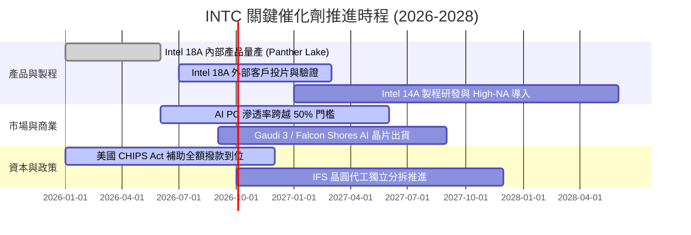

### 9.2 TAM 市場規模分析

```
╔══════════════════════════════════════════════════════════════════╗
║              INTC 目標市場規模（TAM）與滲透潛力                  ║
╠══════════════════════════════════════════════════════════════════╣
║  AI PC 與客戶端晶片 TAM：  $65B  （INTC 當前滲透率 ~60%）       ║
║  資料中心伺服器 CPU TAM：  $35B  （INTC 當前滲透率 ~66%）       ║
║  資料中心 AI 加速晶片 TAM：$180B （INTC 當前滲透率 <3%）        ║
║  全球先進晶圓代工 TAM：    $120B （IFS 當前外部滲透率 <2%）     ║
║                                                                  ║
║  📊 總可觸及市場 TAM 逾 $400B，代工與 AI 加速器為最大增量空間    ║
╚══════════════════════════════════════════════════════════════════╝
```

### 9.3 成長驅動力結構圖

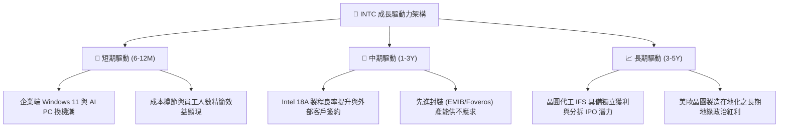

---

## 10. 風險矩陣

### 10.1 風險評分矩陣

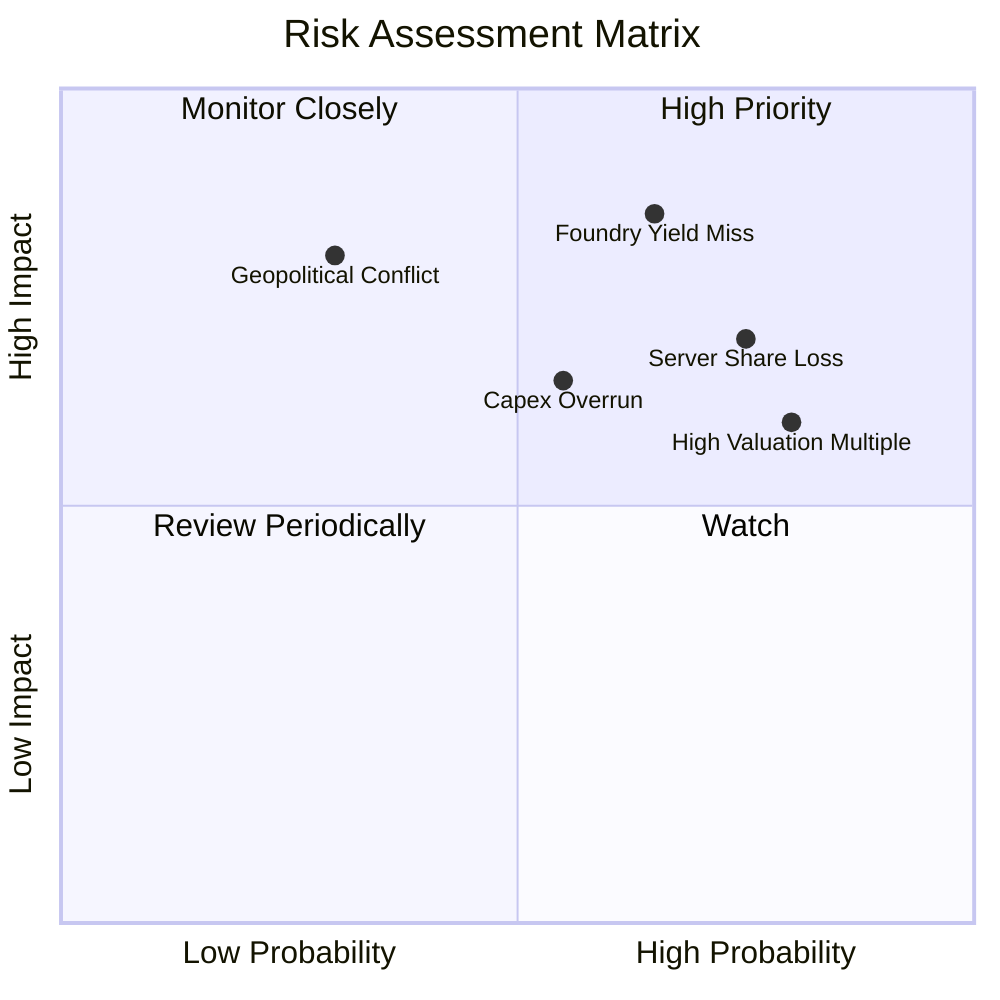

### 10.2 風險清單詳細分析

| # | 風險項目 | 發生機率 | 財務衝擊 | 風險評分 | 具體緩解與應對措施 |
|---|----------|----------|----------|----------|--------------------|
| 1 | 🔴 **18A 製程良率不如預期** | 高 (65%) | 高 (-15% 毛利率) | 🔴 **8.5 / 10** | 與 ASML 深度合作優化機台，利用內部產品先行試產以累積良率經驗。 |
| 2 | 🔴 **伺服器 CPU 市佔進一步流失** | 高 (75%) | 高 (-$3B 營收) | 🔴 **8.0 / 10** | 加速推出 Granite Rapids 與 Clearwater Forest 架構，提升每瓦效能比。 |
| 3 | 🔴 **轉機溢價過高致股價回檔** | 極高 (80%) | 中 (-25% 股價) | 🔴 **7.5 / 10** | 建議投資人勿追高，等待估值回落至具安全邊際之區間再行配置。 |
| 4 | 🟡 **晶圓廠資本支出再次膨脹** | 中 (55%) | 中 (-$2B FCF) | 🟡 **6.5 / 10** | 擴大採用 SCIP 共同投資計畫，引進 Brookfield 等基礎設施基金分擔資金。 |
| 5 | 🟡 **地緣政治與貿易管制升級** | 低-中 (30%)| 極高 (-$5B 營收) | 🟡 **6.0 / 10** | 建立多元化全球供應鏈，配合各國在地化生產政策分散風險。 |

---

## 11. 投資建議

### 11.1 最終綜合評級雷達圖

```
╔══════════════════════════════════════════════════════════════════╗
║                   INTC 綜合評級雷達評分                          ║
╠══════════════════════════════════════════════════════════════════╣
║                                                                  ║
║  基本面強度：   6.5 ▓▓▓▓▓▓▓▓▓▓▓▓▓░░░░░░░  ★★★☆☆                  ║
║  成長動能：     6.8 ▓▓▓▓▓▓▓▓▓▓▓▓▓▓░░░░░░  ★★★☆☆                  ║
║  獲利品質：     5.2 ▓▓▓▓▓▓▓▓▓▓░░░░░░░░░░  ★★☆☆☆                  ║
║  財務健康：     6.0 ▓▓▓▓▓▓▓▓▓▓▓▓░░░░░░░░  ★★★☆☆                  ║
║  估值安全邊際： 4.5 ▓▓▓▓▓▓▓▓▓░░░░░░░░░░░  ★★☆☆☆                  ║
║  護城河深度：   6.6 ▓▓▓▓▓▓▓▓▓▓▓▓▓░░░░░░░  ★★★☆☆                  ║
║  管理層執行：   5.8 ▓▓▓▓▓▓▓▓▓▓▓▓░░░░░░░░  ★★★☆☆                  ║
║                                                                  ║
║  ★ 綜合總分：  6.3 / 10 ｜ 評級：🟡 持有（Hold）                ║
╚══════════════════════════════════════════════════════════════════╝
```

### 11.2 目標價與隱含報酬率

| 情境 | 目標價 | 隱含報酬率（相對現價 $92.80） | 機率權重 | 核心驅動前提 |
|------|--------|------------------------------|----------|--------------|
| 🔴 **悲觀情境** | **$68.00** | **-26.72%** | 25% | 18A 製程良率延宕，IFS 虧損擴大，營收成長 <5% |
| 🟡 **基準情境** | **$96.00** | **+3.45%** | 55% | AI PC 穩健放量，Capex 受控，營業利益率回升至 16% |
| 🟢 **樂觀情境** | **$128.00** | **+37.93%** | 20% | 18A 獲一線大廠代工訂單，資料中心市佔止跌反彈 |

### 11.3 買入時機與觸發因素

```
╔══════════════════════════════════════════════════════════════════╗
║                  ✅ 投資行動 Checklist                           ║
╠══════════════════════════════════════════════════════════════════╣
║                                                                  ║
║  加碼買入觸發條件（需多數符合）：                                ║
║  ☐ 股價回檔至 $68.00 – $75.00 區間（安全邊際 MOS ≥ 15%）        ║
║  ☐ 晶圓代工部門正式宣布獲取首家外部 Tier-1 晶片大廠 18A 量產訂單  ║
║  ☐ 單季毛利率持續站穩於 45% 之上                                 ║
║                                                                  ║
║  合理持有條件（當前狀態）：                                      ║
║  ✅ 自由現金流維持正值，且單季營收 YoY 維持正成長                ║
║  ✅ 總現金與流動資產儲備維持在 $25B 以上                         ║
║                                                                  ║
║  減碼/停損觸發條件（出現任一）：                                 ║
║  ☐ 18A 旗艦產品量產時程再次宣布推遲逾 2 個季度                   ║
║  ☐ 伺服器 x86 CPU 市佔率單季跌幅超過 3 個百分點                  ║
║  ☐ 股價過度炒作突破 $115.00（超越樂觀情境合理估值）              ║
╚══════════════════════════════════════════════════════════════════╝
```

### 11.4 投資人適配度分析

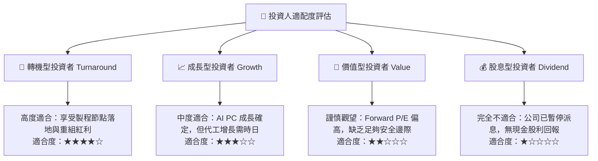

### 11.5 每季財報監控清單（Quarterly Watch List）

| 監控維度 | 核心指標 | 正常/健康門檻 | 觸發警訊（減碼門檻） | 觸發催化（加碼門檻） |
|----------|----------|---------------|----------------------|----------------------|
| **營收動能** | Client + Data Center YoY | > +8.0% | 連續 2 季 < +3.0% | 單季 YoY > +20.0% |
| **毛利修復** | Non-GAAP Gross Margin | 40.0% – 44.0% | 跌破 38.0% | 突破 46.0% |
| **資本支出** | 季度 Capex 流出 | < $4.0B / 季 | 單季再次膨脹至 > $5.5B | 資本強度降至 < 20% 營收 |
| **現金造血** | 季度 FCF 金額 | > $1.0B | 再次轉為負值失血 | 單季 FCF > $3.5B |
| **代工進展** | IFS 外部客戶營收 | 逐季增長 | 停滯於內部互抵階段 | 宣布前三大 Fabless 大單 |

### 11.6 反面論證：什麼會證明論點錯誤（What Would Change My Mind）

```
╔══════════════════════════════════════════════════════════════════╗
║              ⚠️ 論點失效條件（Disconfirming Evidence）           ║
╠══════════════════════════════════════════════════════════════════╣
║  若發生下列任一情況，本報告之「持有」評級將被推翻：             ║
║                                                                  ║
║  【轉為強力買入 (Strong Buy) 條件】：                            ║
║  1. 股價非理性暴跌至 $60.00 以下（提供 >30% 實質安全邊際）。     ║
║  2. 18A 製程良率提前突破 70%，並獲得 Nvidia 或 Apple 實質下單。  ║
║  3. 宣布分拆 Intel Foundry 成為獨立實體，釋放設計部門高估值。   ║
║                                                                  ║
║  【轉為賣出 (Sell / Underweight) 條件】：                        ║
║  1. 2026 下半年 FCF 再次轉負，資本支出失控膨脹。                ║
║  2. 營業利益率修復停滯，連續兩季低於 8.0%。                      ║
║  3. 核心伺服器晶片發生重大架構瑕疵或良率災難，遭客戶退單。      ║
╚══════════════════════════════════════════════════════════════════╝
```

---

> **免責聲明**：本報告為基於公開財務數據之機構級研究分析，僅供學術探討與投資研究參考，不構成任何個別買賣建議。證券投資具有高度市場風險，投資人應獨立評估自身風險承受能力並自負盈虧。