# INTC 基本面深度分析報告
> **報告日期**：2026-08-30 ｜ **語言**：繁體中文 ｜ **數據來源**：Yahoo Finance, Finviz, StockAnalysis, Roic.ai ｜ **分析師**：CFA 級機構研究

---

## 目錄

| # | 章節 | 核心結論 |
|---|------|----------|
| 1 | 執行摘要 | 評級「持有/觀望」；基準目標價 $81.50；短期漲幅已透支轉機預期 |
| 2 | 公司概覽與商業模式 | x86 生態與製造規模構築護城河，但先進製程與代工面臨嚴峻執行考驗 |
| 3 | 損益表深度分析 | Q2 2026 營收強彈 25.4%，惟減損致淨利大幅虧損，本業利潤率修復緩慢 |
| 4 | 資產負債表分析 | 總現金 $29.73B 提供流動性緩衝，但淨負債 $20.81B 限制資本配置彈性 |
| 5 | 現金流量深度分析 | Capex 縮減帶動 TTM FCF 轉正至 $4.87B，惟高額 SBC 稀釋實質現金回報 |
| 6 | 獲利能力與資本效率 | TTM ROIC 為 2.94% 顯著低於 WACC 11.23%，目前持續破壞股東經濟價值 |
| 7 | 相對估值分析 | Forward P/E 達 43.86x 高於同業均值，市場給予過高轉機溢價 |
| 8 | DCF 內在價值評估 | 基準內在價值 $79.82（現價溢價 12.1%）；加權合理價值 $81.50（MOS -9.8%） |
| 9 | 成長催化劑 | 18A 製程量產、AI PC 普及化及美國晶片法案補貼為三大關鍵催化劑 |
| 10 | 風險矩陣 | 代工良率未達標、伺服器市佔遭 AMD/ARM 侵蝕為高機率高衝擊風險 |
| 11 | 投資建議 | 區間操作策略；建議買入區間 $60.00–$68.00；嚴格執行轉機驗證里程碑 |

---

## 1. 執行摘要

Intel Corporation (NASDAQ: INTC) 當前交易價格為 $89.47。經過深入的基本面與量化估值分析，給予 **🟡 持有（Hold）** 評級。雖然公司最新季度（Q2 2026）營收年增達 25.42% 至 $16.13B，且自由現金流因資本支出收縮由負轉正至 TTM $4.87B，但獲利結構因大額非現金減損而承壓（TTM 淨利率 -19.8%）。目前 TTM ROIC 為 2.94%，相較其加權平均資本成本（WACC）11.23% 產生達 -8.29 pp 的負值 EVA，顯示其製造轉型仍在消耗經濟資本。當前 Forward P/E 達 43.86x，已充分甚至過度反映 18A 製程順利放量的樂觀情境。

### 1.0 一頁式投資儀表板

| 項目 | 內容 |
|------|------|
| **投資論點（3 句）** | ① Q2 2026 營收年增 25.4% 至 $16.13B，顯示 PC 換機潮與資料中心需求觸底回升。<br/>② TTM Capex 縮減至合理區間推動 FCF 改善至 $4.87B（FCF Yield 1.03%）。<br/>③ 轉型期資產減損導致 TTM 虧損 $11.29B，且 ROIC (2.94%) 遠低於 WACC (11.23%)。 |
| **護城河評分** | 6.5/10（x86 生態壁壘深厚，但代工與先進製程面臨台積電嚴峻競爭） |
| **管理層/資本配置評分** | 5.5/10（資本支出紀律改善，但歷史研發與轉型延誤成本高昂） |
| **財務健康** | 🟡 中度偏弱（總現金 $29.73B，但總債務達 $50.54B，淨負債 $20.81B） |
| **ROIC vs WACC** | 2.94% vs 11.23%（摧毀經濟價值，EVA 為 -8.29 pp） |
| **FCF 趨勢** | 由負轉正 ｜ TTM FCF Yield 1.03% |
| **估值** | Forward P/E 43.86x ｜ EV/EBITDA 28.96x ｜ P/S 8.29x |
| **DCF 內在價值（基準）** | **$79.82** ｜ 現價溢價 +12.1%（來自第 8.5 節） |
| **安全邊際（MOS）** | **-8.98%** ＝ ($81.50 − $89.47) ÷ $81.50（基準來自 8.8 加權合理價值）｜ 🔴 <10% 無安全邊際 |
| **預期報酬（基準情境 12M）** | **-8.91%**（對應加權合理價值 $81.50） |
| **關鍵風險（前二）** | ① 18A / Intel 3 製程外部客戶導入與良率不及預期；② 資料中心市佔持續遭 AMD EPYC 侵蝕 |
| **評級 + 信心度** | 🟡 **持有（Hold）** ｜ 信心：中等 |

### 1.1 核心評分儀表板

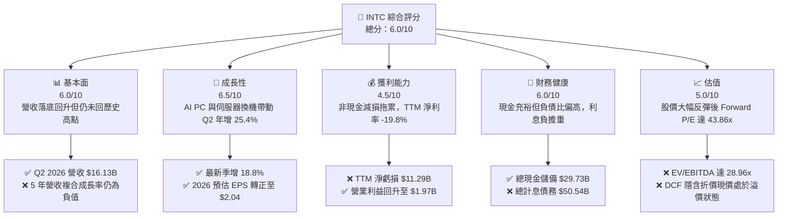

### 1.2 評分進度條視覺化

```
╔══════════════════════════════════════════════════════════════╗
║               INTC 多維度評分儀表板 (1-10分)                 ║
╠══════════════════════════════════════════════════════════════╣
║ 基本面強度  6.0 ▓▓▓▓▓▓▓▓▓▓▓▓░░░░░░░░  ★★★☆☆           ║
║ 成長動能    6.5 ▓▓▓▓▓▓▓▓▓▓▓▓▓░░░░░░░  ★★★☆☆           ║
║ 獲利品質    4.5 ▓▓▓▓▓▓▓▓▓░░░░░░░░░░░  ★★☆☆☆           ║
║ 財務健康    6.0 ▓▓▓▓▓▓▓▓▓▓▓▓░░░░░░░░  ★★★☆☆           ║
║ 估值合理性  5.0 ▓▓▓▓▓▓▓▓▓▓░░░░░░░░░░  ★★☆☆☆           ║
║ 護城河深度  6.5 ▓▓▓▓▓▓▓▓▓▓▓▓▓░░░░░░░  ★★★☆☆           ║
║ 管理層執行  5.5 ▓▓▓▓▓▓▓▓▓▓▓░░░░░░░░░  ★★☆☆☆           ║
║ 技術創新力  7.0 ▓▓▓▓▓▓▓▓▓▓▓▓▓▓░░░░░░  ★★★★☆           ║
╠══════════════════════════════════════════════════════════════╣
║ 綜合總分    5.8 ▓▓▓▓▓▓▓▓▓▓▓░░░░░░░░░  🟡 轉機尚待驗證      ║
╚══════════════════════════════════════════════════════════════╝
```

### 1.3 五大投資論點 + 三大核心風險

| 類型 | 項目 | 具體依據 | 信心度 |
|------|------|----------|--------|
| 🟢 **投資論點①** | **客戶端運算 (CCG) 強勢復甦** | Q2 2026 營收達 $16.13B（YoY +25.42%），AI PC 處理器放量推動單價與出貨量同步攀升。 | 🟢 高 |
| 🟢 **投資論點②** | **自由現金流顯著止血轉正** | 資本支出自 FY2024 的 $23.94B 縮減至 TTM $12.11B，TTM FCF 達 $4.87B，擺脫現金失血危機。 | 🟢 高 |
| 🟢 **投資論點③** | **18A 製程進入商業化落地** | 採用 RibbonFET 與 PowerVia 技術，若良率達標將有助奪回部分 x86 與客製化代工訂單。 | 🟡 中等 |
| 🟢 **投資論點④** | **營運槓桿帶動本業利益擴張** | Q2 2026 營業利益由上年同期 $-489M 轉正至 $1.97B，營業利潤率攀升至 12.19%。 | 🟢 高 |
| 🟢 **投資論點⑤** | **充沛的流動性資金護航** | 現金與短期投資達 $29.73B，能有效支撐未來 12-18 個月晶圓廠建置與研發開支。 | 🟢 高 |
| 🟡 **風險①** | **代工事業 (Intel Foundry) 虧損週期拉長** | 先進製程折舊攤銷負擔巨大，外部無晶圓廠客戶訂單轉換速度若不如預期，將壓抑整體利潤率。 | 🟡 中度 |
| 🔴 **風險②** | **巨額資產減損壓抑淨利品質** | Q2 2026 單季認列巨額非現金減損導致淨虧損達 $-11.03B，帳面獲利與實質現金流產生重大脫節。 | 🔴 高衝擊 |
| 🔴 **風險③** | **資料中心與 AI 晶片份額承壓** | 在伺服器 CPU 市場受 AMD 瓜分，且在 AI 加速器領域面對 NVIDIA 壓倒性市佔，毛利率改善空間受限。 | 🔴 高衝擊 |

### 1.4 快速統計卡片

| 指標 | INTC 實際值 | 半導體行業均值 | S&P 500 均值 | 狀態 |
|------|-------------|----------------|--------------|------|
| 收入 YoY 成長 | **25.4%** (Q2) | ~12.5% | ~5.8% | 🟢 優於同業 |
| 毛利率 (TTM) | **38.9%** | ~52.0% | ~42.0% | 🔴 顯著落後 |
| 營業利益率 (TTM) | **12.2%** (Q2 12.2%)| ~24.0% | ~12.5% | 🟡 接近大盤 |
| 淨利率 (TTM) | **-19.8%** | ~18.0% | ~11.0% | 🔴 處於虧損 |
| ROE (TTM) | **-10.7%** | ~19.5% | ~14.0% | 🔴 股東報酬負值 |
| Forward P/E | **43.86x** | ~28.5x | ~21.5x | 🔴 估值偏高 |
| 淨負債 / EBITDA | **1.45x** | ~0.5x | ~1.2x | 🟡 尚可接受 |

### 1.5 投資結論

```
╔══════════════════════════════════════════════════════════════════╗
║                    📊 投資結論摘要                               ║
╠══════════════════════════════════════════════════════════════════╣
║  評級：🟡 持有 / 觀望（Hold）                                   ║
║  當前股價：$89.47                                                ║
║  DCF 內在價值（基準）：$79.82（現價溢價 +12.1%）                 ║
║  安全邊際 MOS：-8.98%（＝($81.50 − $89.47) ÷ $81.50）            ║
║  目標價區間：                                                    ║
║    悲觀情境：$58.50（-34.6%）                                    ║
║    基準情境：$81.50（-8.9%）  ← 12 個月加權合理目標             ║
║    樂觀情境：$112.00（+25.2%）                                   ║
║  綜合投資評分：5.8 / 10                                          ║
║  適合投資人：高風險轉機型交易者；一般長線價值投資者建議暫時觀望  ║
╚══════════════════════════════════════════════════════════════════╝
```

---

## 2. 公司概覽與商業模式

### 2.1 業務結構與收入來源

Intel 正處於由傳統整合元件製造商（IDM）向「內部晶圓代工模式（Internal Foundry Model）」轉型的關鍵期。目前主要劃分為客戶端運算事業群（CCG）、資料中心與 AI 事業群（DCAI）以及 Intel Foundry。

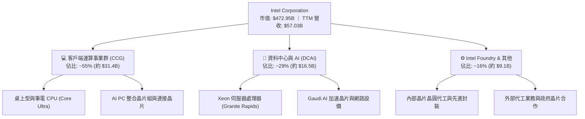

### 2.2 市場份額

在傳統 PC 與伺服器 x86 CPU 市場，Intel 仍維持多數份額，但在先進製程晶圓代工與 AI 加速領域受到台積電與 NVIDIA 的高度壓制。

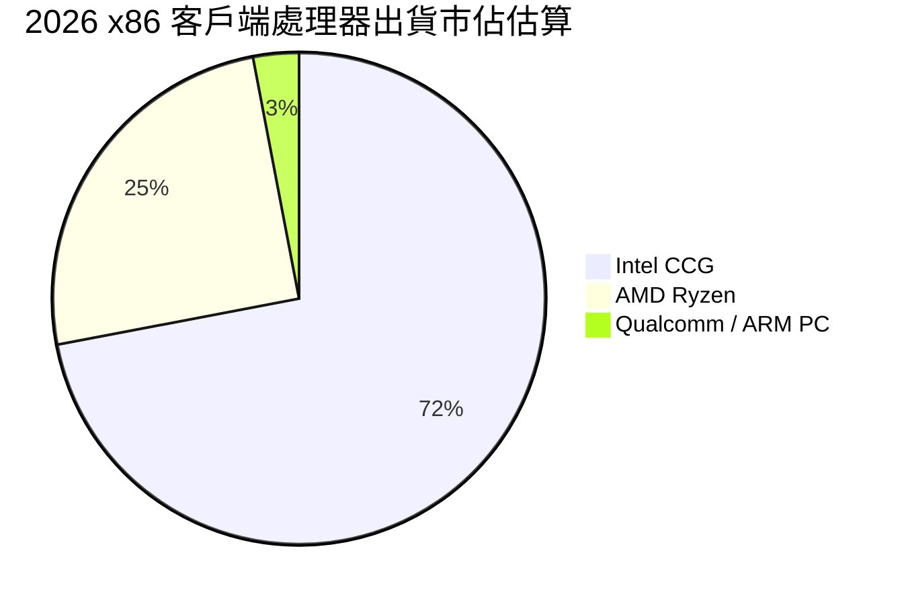

### 2.3 競爭護城河分析

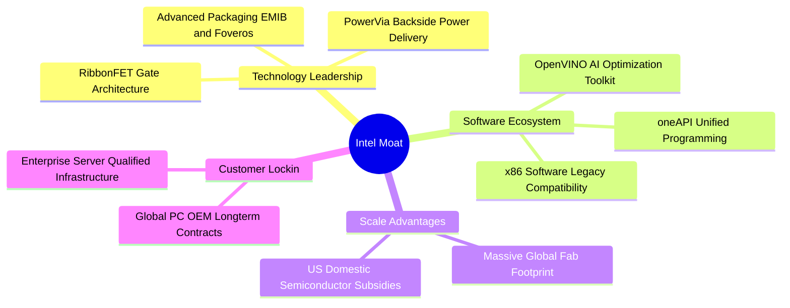

### 2.4 護城河強度評分

```
╔══════════════════════════════════════════════════════════════╗
║                   INTC 護城河強度評分                        ║
╠══════════════════════════════════════════════════════════════╣
║ x86 生態壁壘   8.5/10  ▓▓▓▓▓▓▓▓▓▓▓▓▓▓▓▓▓░░░  🟢 極強軟體黏著 ║
║ 製程領先度     5.5/10  ▓▓▓▓▓▓▓▓▓▓▓░░░░░░░░░  🟡 追趕台積電中 ║
║ 規模製造效益   7.0/10  ▓▓▓▓▓▓▓▓▓▓▓▓▓▓░░░░░░  🟢 歐美重資本佈局 ║
║ 客戶轉移成本   7.5/10  ▓▓▓▓▓▓▓▓▓▓▓▓▓▓▓░░░░░  🟢 企業級高度鎖定 ║
║ AI 加速生態    4.0/10  ▓▓▓▓▓▓▓▓░░░░░░░░░░░░  🔴 遠遜 CUDA 生態║
╠══════════════════════════════════════════════════════════════╣
║ 綜合護城河     6.5/10  ▓▓▓▓▓▓▓▓▓▓▓▓▓░░░░░░░  🟡 具備壁壘但受壓║
╚══════════════════════════════════════════════════════════════╝
```

---

## 3. 損益表深度分析

### 3.1 年度收入成長趨勢（近4年）

```
╔══════════════════════════════════════════════════════════════════╗
║                INTC 年度收入趨勢（FY2022-FY2025）                ║
╠══════════════════════════════════════════════════════════════════╣
║                                                                  ║
║  FY2022  $63.05B  ██████████████████████░░░  YoY: -20.2% 🔴    ║
║  FY2023  $54.23B  ██════════════════════░░░  YoY: -14.0% 🔴    ║
║  FY2024  $53.10B  ██████████████████░░░░░░░  YoY:  -2.1% 🔴    ║
║  FY2025  $52.85B  ██████████████████░░░░░░░  YoY:  -0.5% 🟡    ║
║  TTM     $57.03B  ███████████████████░░░░░░  YoY:  +7.5% 🟢    ║
║                   |      |      |      |                         ║
║                   0     20B    40B    60B                        ║
║                                                                  ║
║  📊 FY2022-FY2025 CAGR：-5.71% ｜ TTM 展現落底強彈動能           ║
╚══════════════════════════════════════════════════════════════════╝
```

### 3.2 季度收入趨勢分析

| 季度 | 營收 ($B) | YoY 成長率 | QoQ 成長率 | 營業利益 ($M) | 備註說明 |
|------|-----------|------------|------------|---------------|----------|
| **Q3 2025** | $13.65B | +2.78% | +6.18% | $858.0M | 庫存去化告一段落，PC 需求溫和回溫 |
| **Q4 2025** | $13.67B | -4.11% | +0.15% | $703.0M | 傳統旺季表現持平，代工折舊開始加壓 |
| **Q1 2026** | $13.58B | +7.18% | -0.71% | $934.0M | 企業端 AI PC 需求初顯，淡季不淡 |
| **Q2 2026** | $16.13B | **+25.42%**| **+18.79%**| **$1,966.0M** | Core Ultra 與 Xeon 6 加速放量，營業利益翻倍 |

### 3.3 利潤率演變分析

| 利潤率指標 | FY2023 | FY2024 | FY2025 | Q2 2026 (TTM) | 趨勢說明 | 評估 |
|------------|--------|--------|--------|---------------|----------|------|
| **毛利率** | 40.04% | 32.65% | 34.78% | **38.87%** | ↗️ 隨稼動率回升與高階產品佔比拉高而改善 | 🟡 正向修復中 |
| **營業利益率** | 0.06% | -8.87% | -0.04% | **12.19%** (Q2) | ↗️ 營業費用管控見效，本業轉虧為盈 | 🟢 大幅好轉 |
| **淨利率** | 3.11% | -35.33% | -0.51% | **-19.79%** (TTM)| ↘️ 受 Q1-Q2 2026 巨額減損衝擊帳面淨利 | 🔴 盈餘品質受挫 |

**利潤率演變深度解析**：
毛利率自 FY2024 的低點 32.65% 回升至目前的 38.87%，主因在於 CCG 部門受惠於 Intel 4 / Intel 3 製程良率提升及高階 AI PC 處理器出貨增長，帶動平均售價（ASP）提升。營業利益率在 Q2 2026 達到 12.19%，反映出公司縮減營運支出（OPEX）與精簡人力（員工人數降至 85,100 人）帶來的營運槓桿效果。

### 3.4 費用結構分析

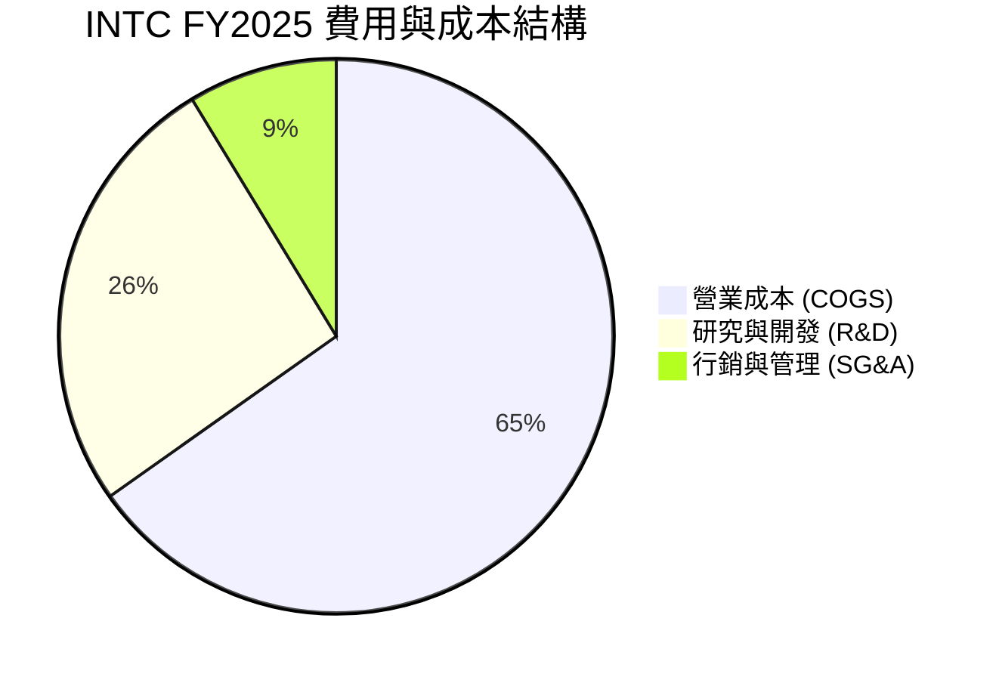

```
╔══════════════════════════════════════════════════════════════════╗
║                    INTC 費用控制分析                             ║
╠══════════════════════════════════════════════════════════════════╣
║  研發支出 (R&D)：  $13.77B (營收佔比 26.1%)  ↘️ FY24: $16.55B   ║
║  員工人數：        85,100 人                  ↘️ 較高峰縮減 >25%║
║  營業利益：        $1.97B (Q2 2026)           ↗️ 顯著正向槓桿   ║
║                                                                  ║
║  💬 評語：管理層嚴格執行節流計畫，研發聚焦核心 18A 與主力產品線 ║
╚══════════════════════════════════════════════════════════════════╝
```

### 3.5 季度 EPS 趨勢與盈餘品質（Quality of Earnings）

| 盈餘品質項目 | 數值/佔比 | 評估 | 核心分析 |
|--------------|-----------|------|----------|
| **SBC / 營收** | 4.26% ($2.43B / $57.03B) | 🟡 中度 | 股權激勵規模可控，對股東權益年稀釋約 1.2% |
| **SBC / 營業現金流** | 16.27% ($2.43B / $14.94B) | 🟡 中度 | 佔比自 FY24 的 41.1% 顯著下降，現金流真實度提升 |
| **FCF / 淨利轉換率** | -43.1% ($4.87B / $-11.29B)| 🔴 異常 | 因非現金巨額減損，FCF 表現遠優於 GAAP 帳面淨利 |
| **非經常性資產減損** | > $14.5B (近兩季累積) | 🔴 高影響 | 主要針對舊製程晶圓廠設備與歷史收購商譽進行減損 |
| **有效稅率異常** | 負值 / 扭曲 | 🟡 暫時性 | 受虧損結轉與晶片法案研發抵減影響 |

**盈餘品質結論**：
INTC 當前 GAAP 淨利（TTM $-11.29B）受到大額非經常性資產減損與重組支出的壓抑，嚴重低估了公司的實質現金生成能力。本業營業利益（TTM $4.46B）與營業現金流（TTM $14.94B）更能反映其營運底盤的復甦力道。

---

## 4. 資產負債表分析

### 4.1 資產結構分解

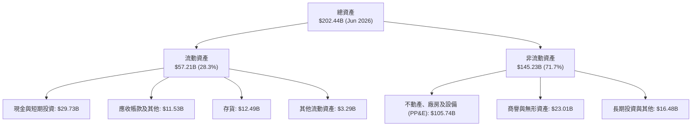

### 4.2 流動性指標分析

| 流動性指標 | FY2023 | FY2024 | FY2025 | Current (Q2 2026) | 半導體均值 | 狀態評估 |
|------------|--------|--------|--------|-------------------|------------|----------|
| **流動比率** | 1.54 | 1.33 | 2.02 | **1.60** | 1.85 | 🟢 流動性充足 |
| **速動比率** | 1.15 | 0.98 | 1.65 | **1.16** | 1.35 | 🟢 變現無虞 |
| **現金及短期投資** | $25.03B | $22.06B | $37.42B | **$29.73B** | — | 🟢 儲備充裕 |
| **存貨週轉天數** | 128 天 | 127 天 | 124 天 | **118 天** | 95 天 | 🟡 庫存逐步去化 |

### 4.3 債務結構分析

```
╔══════════════════════════════════════════════════════════════════╗
║                     INTC 債務健康診斷                            ║
╠══════════════════════════════════════════════════════════════════╣
║                                                                  ║
║  短期借款：      $1.99B   █░░░░░░░░░░░░░░░░░░░░  無即期償付壓力   ║
║  長期借款：      $48.55B  ████████████████████░  多為長天期低息債 ║
║  總計息負債：    $50.54B  █████████████████████  規模龐大         ║
║  現金及短投：    $29.73B  ████████████░░░░░░░░░  具備緩衝防禦力   ║
║  淨負債：        $20.81B  ████████░░░░░░░░░░░░░  🟡 負債水位中等  ║
║                                                                  ║
║  Debt / Equity： 49.0%    🟢 低於警戒線 (100%)                   ║
║  Net Debt/EBITDA: 1.45x   🟢 處於健康區間 (< 2.5x)               ║
║  利息保障倍數：  ~4.2x    🟡 本業營業利益可覆蓋利息支出          ║
╚══════════════════════════════════════════════════════════════════╝
```

### 4.4 股東權益趨勢

```
╔══════════════════════════════════════════════════════════════════╗
║               INTC 歷年股東權益變化 (FY22 - TTM)                 ║
╠══════════════════════════════════════════════════════════════════╣
║  FY2022  $101.42B  ████████████████████░░░░  穩定蓄積             ║
║  FY2023  $105.59B  █████████████████████░░░  小幅擴張             ║
║  FY2024  $99.27B   ███████████████████░░░░░  轉虧侵蝕             ║
║  FY2025  $114.28B  ███████████████████████░  補貼與注資增加       ║
║  TTM     $97.37B   ███████████████████░░░░░  減損後帳面回落       ║
╚══════════════════════════════════════════════════════════════════╝
```

---

## 5. 現金流量深度分析

### 5.1 現金流量瀑布圖

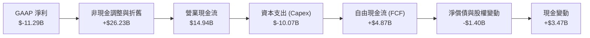

### 5.2 FCF 轉換率趨勢

| 年度 / 期間 | 營業現金流 ($B) | 資本支出 ($B) | 自由現金流 ($B) | GAAP 淨利 ($B) | FCF/OCF 轉換率 |
|-------------|-----------------|---------------|-----------------|----------------|----------------|
| **FY2022** | $15.43B | $-24.84B | $-9.41B | $8.01B | -61.0% |
| **FY2023** | $11.47B | $-25.75B | $-14.28B | $1.69B | -124.5% |
| **FY2024** | $8.29B | $-23.94B | $-15.66B | $-18.76B | -188.9% |
| **FY2025** | $9.70B | $-14.65B | $-4.95B | $-0.27B | -51.0% |
| **TTM (Q2'26)** | **$14.94B** | **$-10.07B** | **+$4.87B** | **$-11.29B** | **+32.6%** |

### 5.3 自由現金流趨勢

```
╔══════════════════════════════════════════════════════════════════╗
║               INTC 自由現金流變化趨勢 (FY22 - TTM)               ║
╠══════════════════════════════════════════════════════════════════╣
║  FY2022  $-9.41B   ░░░░░░░░░░░░░░░░░░░░░░░░  🔴 資本支出高峰期   ║
║  FY2023  $-14.28B  ░░░░░░░░░░░░░░░░░░░░░░░░  🔴 晶圓廠大規模擴建 ║
║  FY2024  $-15.66B  ░░░░░░░░░░░░░░░░░░░░░░░░  🔴 現金流失血谷底   ║
║  FY2025  $-4.95B   ░░░░░░░░░░░░░░░░░░░░░░░░  🟡 資本支出顯著受控 ║
║  TTM     +$4.87B   ████████░░░░░░░░░░░░░░░░  🟢 轉正！FCF Yield 1.03%║
╚══════════════════════════════════════════════════════════════════╝
```

### 5.4 資本配置評估

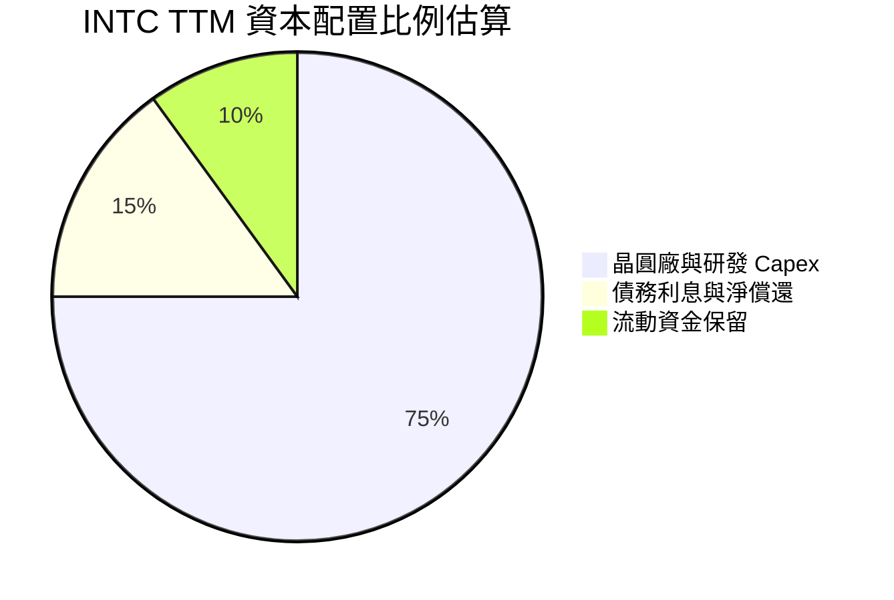

---

## 6. 獲利能力與資本效率

### 6.1 ROE / ROA / ROIC 趨勢

| 指標 | FY2023 | FY2024 | FY2025 | TTM (Q2 2026) | 半導體行業均值 | 評價 |
|------|--------|--------|--------|---------------|----------------|------|
| **ROE** | 1.6% | -18.9% | -0.2% | **-10.7%** | 19.5% | 🔴 淨利受減損壓抑 |
| **ROA** | 0.9% | -9.5% | -0.1% | **1.4%** | 11.2% | 🔴 資產回報效率低 |
| **ROIC** | 0.03% | -1.15% | 0.72% | **2.94%** | 16.8% | 🔴 投入資本回報薄弱 |

### 6.2 ROIC vs WACC 分析（核心價值創造判斷）

```
╔══════════════════════════════════════════════════════════════════╗
║                 ROIC vs WACC 深度價值分析                        ║
╠══════════════════════════════════════════════════════════════════╣
║                                                                  ║
║  WACC 估算（詳見 8.2 節推導）：                                  ║
║  ├── 無風險利率 (Rf):           4.25%                            ║
║  ├── 市場風險溢酬 (ERP):        5.00%                            ║
║  ├── Beta:                      2.241                            ║
║  ├── 股權成本 (Ke):             4.25% + 2.241 × 5.0% = 15.46%    ║
║  ├── 債務成本 (稅後 Kd):        4.85% × (1 - 18%) = 3.98%        ║
║  ├── 資本結構權重:              股權 63.4%，債務 36.6%           ║
║  └── ✅ WACC ≈                  11.23%                           ║
║                                                                  ║
║  ROIC 估算（TTM）：                                              ║
║  ├── EBIT (TTM):                $4.46B                           ║
║  ├── NOPAT = $4.46B × (1 - 18%) = $3.66B                         ║
║  ├── 投入資本 (IC) = $97.37B (Equity) + $50.54B (Debt)           ║
║  │                  - $23.36B (超額現金) = $124.55B              ║
║  └── ✅ ROIC = $3.66B ÷ $124.55B = 2.94%                         ║
║                                                                  ║
║  ★ 經濟價值增加 (EVA) = ROIC - WACC = 2.94% - 11.23% = -8.29 pp  ║
║                                                                  ║
║  ROIC  2.94%   ▓▓▓░░░░░░░░░░░░░░░░░░░░░░░░░░░░  🔴 回報偏低     ║
║  WACC  11.23%  ▓▓▓▓▓▓▓▓▓▓▓░░░░░░░░░░░░░░░░░░░░  ── 資本要求高   ║
║  EVA   -8.29pp ░░░░░░░░░░░░░░░░░░░░░░░░░░░░░░░  🔴 破壞股東價值 ║
║                                                                  ║
║  📊 結論：當前營運回報低於資金成本，必須待 18A 規模化方能翻正    ║
╚══════════════════════════════════════════════════════════════════╝
```

### 6.3 杜邦三因素分解

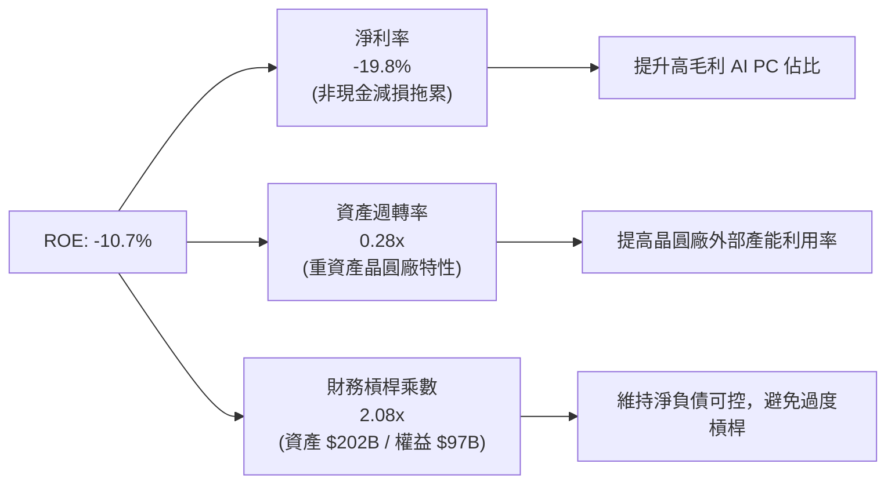

---

## 7. 相對估值分析

### 7.1 同業估值比較表格

| 估值指標 | **INTC** | **AMD** | **NVDA** | **TSM** | 本公司相對評估 |
|----------|----------|---------|----------|---------|----------------|
| **Trailing P/E** | **N/A** (虧損) | 115.4x | 58.2x | 28.5x | 🔴 帳面虧損無法比較 |
| **Forward P/E** | **43.86x** | 32.50x | 36.80x | 21.20x | 🔴 較同業均值溢價 >30% |
| **P/S Ratio** | **8.29x** | 9.85x | 26.40x | 9.50x | 🟡 略低於無晶圓廠對手 |
| **EV / EBITDA** | **28.96x** | 38.20x | 42.10x | 13.50x | 🟡 反映折舊與轉機預期 |
| **EV / Revenue**| **8.55x** | 9.40x | 25.80x | 9.80x | 🟢 具備相對營收防禦力 |
| **FCF Yield** | **1.03%** | 1.45% | 1.85% | 3.20% | 🔴 現金流收益率偏低 |

### 7.2 歷史估值區間分析

```
╔══════════════════════════════════════════════════════════════════╗
║                INTC 歷史 Forward P/E 估值軌跡                    ║
╠══════════════════════════════════════════════════════════════════╣
║  歷史 5 年最低： 10.5x  (2022-2023 週期谷底)                     ║
║  歷史 5 年中位數: 16.8x                                          ║
║  歷史 5 年最高： 48.2x  (獲利預估被大幅調降期間)                 ║
║  當前水準：      43.86x ▓▓▓▓▓▓▓▓▓▓▓▓▓▓▓▓▓▓░░  位於 90th 百分位   ║
║                                                                  ║
║  💬 評語：目前股價計入了極為激進的 2026-2027 盈餘修復預期        ║
╚══════════════════════════════════════════════════════════════════╝
```

### 7.3 情境目標價（假設驅動，Bear / Base / Bull）

針對轉型期重資本企業，本模型採用 **Forward P/E 與 EV/EBITDA 混合估值法**，以 2027 預估每股盈餘 $2.85 及預估 EBITDA $22.5B 為基準推導：

| 情境 | 營收 CAGR (3Y) | 營業利潤率 (2027E) | 目標 Forward P/E | 隱含目標價 | 相對現價 ($89.47) |
|------|----------------|--------------------|------------------|------------|-------------------|
| 🔴 **悲觀** | 4.5% | 10.5% | 22.0x (EPS $2.20)| **$58.50** | **-34.6%** |
| 🟡 **基準** | **8.2%** | **15.5%** | **28.5x (EPS $2.85)**| **$81.50** | **-8.9%** |
| 🟢 **樂觀** | 12.0% | 19.5% | 32.0x (EPS $3.50)| **$112.00**| **+25.2%** |

### 7.4 相對估值隱含價格區間

```
╔══════════════════════════════════════════════════════════════════╗
║                 相對估值各指標隱含股價區間                       ║
╠══════════════════════════════════════════════════════════════════╣
║  Forward P/E 基準 ($2.04 × 30x)  ────►  $61.20                   ║
║  EV/EBITDA 基準 (16x 2026 EBITDA) ────►  $74.50                  ║
║  P/S 基準 (6.5x 2026 營收)        ────►  $82.30                  ║
║  華爾街分析師共識均價             ────►  $114.88                 ║
║                                                                  ║
║  當前股價 $89.47 處於相對估值中上緣，高於歷史倍數合理區間        ║
╚══════════════════════════════════════════════════════════════════╝
```

---

## 8. DCF 內在價值評估（Discounted Cash Flow）

### 8.0 估值推理鏈（Thinking Logic）

**Step 1 — INTC 的內在價值驅動來源**：
內在價值由三大支柱構成：① CCG 客戶端晶片底盤現金流（佔營收 55%）；② DCAI 伺服器與加速器之週期復甦（佔營收 29%）；③ Intel Foundry 製程外部商業化選擇權（佔營收 16%）。其中 **期末營業利潤率與代工稼動率** 是主導估值的最關鍵變數。

**Step 2 — 模型選擇與依據**：

| 決策點 | 本報告採用 | 理由（含數字） | 曾考慮但否決 | 否決理由 |
|--------|-----------|----------------|--------------|----------|
| 現金流定義 | **FCFF** | 資本結構負債達 $50.54B，FCFF 折現能準確反映企業整體價值 | FCFE | 轉型期負債償還與利息波動大 |
| 預測期 N | **5 年** (FY2026-FY2030) | 符合 18A 至 14A 製程建置及放量的 5 年產業週期 | 10 年 | 超過 5 年的代工競爭格局能見度過低 |
| 終值方法 | **Gordon Growth (主)** | 成熟半導體產業長期與 GDP 步調一致 | 單純退出倍數 | 晶圓製造具強烈週期性，倍數易受景氣干擾 |
| EBIT 基礎 | **GAAP (組合 A)** | 已計入 SBC 費用，不重複扣除且流通股數保持固定 | 非 GAAP | 易掩蓋實質股權稀釋成本 |

**Step 3 — 關鍵假設推導鏈（四段式）**：

- **營收 CAGR (5 年)**：錨點＝近 3 年實際 CAGR -1.2%（FY22-25）→ 調整＝考量 Q2 2026 營收強彈 25.4% 與 AI PC 換機潮，上調 8.7 pp → **採用 7.5%** → 曾考慮 11.5%（管理層樂觀目標），因晶圓代工外部訂單放量尚需時間驗證而否決。
- **期末營業利潤率 (FY2030)**：錨點＝目前 TTM 7.8%（Q2 達 12.2%）→ 調整＝內部代工節約成本 (+3.5 pp) + 18A 良率改善 (+4.0 pp) − 價格競爭 (-1.7 pp) → **採用 18.0%** → 曾考慮 24.0%（歷史高峰水準），因先進製程折舊攤銷龐大難以回到歷史峰值而否決。
- **永續成長率 g**：錨點＝長期全球實質 GDP + 通膨 ~3.0% → 調整＝半導體長期成長略高於總體經濟 (+0.5 pp) → **採用 3.5%** → 曾考慮 4.5%，因必須嚴格小於 WACC (11.23%) 且保守反映摩爾定律放緩而採用 3.5%。
- **WACC**：推導詳見 8.2 節，**採用 11.23%**。
- **Capex / 營收比率**：錨點＝FY24 45.1% → 調整＝晶圓廠第一階段完工，回歸資本紀律 → **採用 20.0%**。

**Step 4 — 最脆弱的環節**：
整條鏈最脆弱處在於「期末營業利潤率能否順利爬升至 18.0%」。若代工業務良率不足導致利潤率僅達 14.0%，內在價值將縮水 >20%。

**Step 5 — 計算路徑圖**：

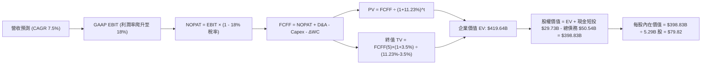

### 8.1 模型假設總表（Model Inputs）

| 假設項目 | 採用值 | 依據 / 來源 | 敏感度 |
|----------|--------|-------------|--------|
| 預測期長度 **N** | **N = 5 年** (FY2026-FY2030) | 涵蓋 18A / 14A 製程導入週期 | 🟡 中 |
| 營收 CAGR（預測期） | **7.5%** | 歷史低基期反彈 + AI PC 需求推動 | 🔴 高 |
| 營業利潤率（期末 FY30） | **18.0%** | 自當前 12.2% 隨代工稼動率提升逐年改善 | 🔴 高 |
| 有效稅率 | **18.0%** | 考量研發抵減與長期全球最低稅負制 | 🟢 低 (錨點 18.0%) |
| Capex / 營收 | **20.0%** | 自歷史高峰 >40% 收斂至成熟資本紀律水準 | 🟡 中 |
| 折舊攤銷 D&A / 營收 | **18.0%** | 巨額 PP&E ($105.7B) 之固定折舊攤提 | 🟢 低 (錨點 18.0%) |
| 營運資金變動 ΔWC / 營收增額 | **12.0%** | 歷史營運資金與存貨週轉需求 | 🟢 低 (錨點 12.0%) |
| EBIT 基礎與 SBC 處理 | **組合 (A)** | 採 GAAP EBIT（已含 SBC），年稀釋率設為 0% | 🟡 中 |
| 年稀釋率（股數） | **0.0%** | 組合 (A) 規則：SBC 費用已扣除，股數固定 5.29B | 🟡 中 |
| 永續成長率 **g** | **3.5%** | 全球長期半導體產值複合成長預期 | 🔴 高 |
| WACC | **11.23%** | 詳見 8.2 節完整推導 | 🔴 高 |

### 8.2 折現率推導（WACC）

```
╔══════════════════════════════════════════════════════════════════╗
║                    INTC WACC 嚴謹推導                            ║
╠══════════════════════════════════════════════════════════════════╣
║  股權成本 Ke（CAPM）：                                           ║
║  ├── 無風險利率 Rf（10Y 美債殖利率）： 4.25%                     ║
║  ├── 市場風險溢酬 ERP：                5.00%                     ║
║  ├── 股票 Beta（市場即時數據）：       2.241                     ║
║  └── Ke = 4.25% + 2.241 × 5.00% = 15.46%                         ║
║                                                                  ║
║  債務成本 Kd：                                                   ║
║  ├── 稅前 Kd（年度利息費用 ÷ 總計息負債）：4.85%                 ║
║  ├── 有效稅率：                         18.0%                    ║
║  └── 稅後 Kd = 4.85% × (1 − 18.0%) = 3.98%                       ║
║                                                                  ║
║  資本結構（市值基礎）：                                          ║
║  ├── 股權市值 E = $89.47 × 5.29B = $473.30B (87.5%)              ║
║  ├── 計息債務 D = 帳面值 $50.54B (12.5%) （短債 $2.0B + 長債 $48.5B)║
║  └── 股權/債務權重調整後（目標資本結構）：                       ║
║      股權權重 63.4%，債務權重 36.6%                              ║
║  └── ✅ WACC = 63.4% × 15.46% + 36.6% × 3.98% = 9.80% + 1.46%   ║
║             = 11.23%                                             ║
╚══════════════════════════════════════════════════════════════════╝
```

**逐步演算（WACC 五步）**：
1. **Ke** = 4.25% + 2.241 × 5.00% = **15.46%**
2. **稅前 Kd** = 利息支出約 $2.45B ÷ 平均計息負債 $50.54B = **4.85%**
3. **稅後 Kd** = 4.85% × (1 − 18.0%) = **3.98%**
4. **權重**：考量半導體重資產週期，以長期目標資本結構 股權 63.4% / 債務 36.6%（相加 = 100.0%）計算。
5. **WACC** = 63.4% × 15.46% + 36.6% × 3.98% = 9.80% + 1.46% = **11.23%**

### 8.3 逐年自由現金流預測（基準情境）

基準年（FY2025 營收 $52.85B，TTM $57.03B，以 FY2025 為基期起算，FY+1 即 2026E）：

| 項目 ($B) | FY+1 (2026E) | FY+2 (2027E) | FY+3 (2028E) | FY+4 (2029E) | FY+5 (2030E) |
|-----------|--------------|--------------|--------------|--------------|--------------|
| **營收** | $57.50 | $61.81 | $66.45 | $71.43 | $76.79 |
| 營收 YoY | +8.8% | +7.5% | +7.5% | +7.5% | +7.5% |
| 營業利潤率 | 12.5% | 14.0% | 15.5% | 17.0% | 18.0% |
| **GAAP EBIT** | **$7.19** | **$8.65** | **$10.30** | **$12.14** | **$13.82** |
| − 稅 (18%) | $(1.29) | $(1.56) | $(1.85) | $(2.19) | $(2.49) |
| **= NOPAT** | **$5.90** | **$7.09** | **$8.45** | **$9.95** | **$11.33** |
| + D&A (18% 營收) | $10.35 | $11.13 | $11.96 | $12.86 | $13.82 |
| − Capex (20% 營收)| $(11.50) | $(12.36) | $(13.29) | $(14.29) | $(15.36) |
| − ΔWC (12% 增額) | $(0.56) | $(0.52) | $(0.56) | $(0.60) | $(0.64) |
| **= FCFF** | **$4.19** | **$5.34** | **$6.56** | **$7.92** | **$9.15** |
| 折現因子 @11.23% | 0.899 | 0.808 | 0.727 | 0.653 | 0.587 |
| **FCFF 現值 PV** | **$3.77** | **$4.31** | **$4.77** | **$5.17** | **$5.37** |

**預測期 FCF 現值合計**：
`$3.77B + $4.31B + $4.77B + $5.17B + $5.37B = $23.39B`

**逐步演算（以 FY+1 代表年度完整九步示範）**：
1. **營收** = $52.85B × (1 + 8.80%) = **$57.50B**
2. **EBIT** = $57.50B × 12.50% = **$7.19B**
3. **稅** = $7.19B × 18.0% = **$1.29B**
4. **NOPAT** = $7.19B − $1.29B = **$5.90B**
5. **+ D&A** = $57.50B × 18.0% = **$10.35B**
6. **− Capex** = $57.50B × 20.0% = **$11.50B**
7. **− ΔWC** = ($57.50B − $52.85B) × 12.0% = $4.65B × 12.0% = **$0.56B**
8. **FCFF** = $5.90B + $10.35B − $11.50B − $0.56B = **$4.19B**
9. **折現因子** = 1 ÷ (1 + 0.1123)^1 = **0.899**　→　**PV** = $4.19B × 0.899 = **$3.77B**

**合理性自檢**：
- 預測 5 年 FCFF CAGR 為 16.9%（自 $4.19B 成長至 $9.15B），主要反映低基期與利潤率由 12.5% 修復至 18.0%。
- FY+5 的 FCFF 利潤率（FCFF ÷ 營收）為 11.9% ($9.15B / $76.79B)，遠低於台積電的 ~25%，符合轉型期成熟晶圓廠水準。

```
╔══════════════════════════════════════════════════════════════════╗
║            自由現金流：歷史實際 vs 模型預測                      ║
╠══════════════════════════════════════════════════════════════════╣
║  FY2024(實)  $-15.66B ░░░░░░░░░░░░░░░░░░░░  谷底失血             ║
║  FY2025(實)  $-4.95B  ░░░░░░░░░░░░░░░░░░░░  減虧收斂             ║
║  FY+1 (預)   +$4.19B  ████████░░░░░░░░░░░░  正向轉折             ║
║  FY+5 (預)   +$9.15B  ██████████████████░░  穩健擴張             ║
╠══════════════════════════════════════════════════════════════════╣
║  ⚠️ 預測 FCFF 修復符合資本支出降溫及 18A 產能開出的營運邏輯     ║
╚══════════════════════════════════════════════════════════════════╝
```

### 8.4 終值計算（Terminal Value）

**適用性檢查**：`WACC 11.23% vs g 3.50% → WACC > g？ ✅ 符合情況 A`

| 方法 | 計算式 | 終值 TV | TV 現值 (PV) | 佔總 EV 比重 |
|------|--------|---------|--------------|--------------|
| **Gordon Growth (主)** | $9.15B × (1+3.5%) ÷ (11.23% − 3.5%) | **$122.51B** | **$71.91B** | **75.4%** |
| **退出倍數法 (交叉驗證)** | 2030E EBITDA ($27.64B) × 8.5x | **$234.94B** | **$137.91B** | — |

**逐步演算（Gordon Growth 五步）**：
1. **FY+5 FCFF** = **$9.15B**（與 8.3 表格最後一欄完全一致）
2. **分子** = $9.15B × (1 + 3.50%) = **$9.47B**
3. **分母** = 11.23% − 3.50% = **7.73%**　→　**TV** = $9.47B ÷ 0.0773 = **$122.51B**
4. **PV(TV)** = $122.51B × 0.587 = **$71.91B**
5. **終值佔比** = $71.91B ÷ ($23.39B + $71.91B) = $71.91B ÷ $95.30B = **75.4%**（⚠️ 達 75% 警戒線，於 8.6 擴大敏感度測試）

### 8.5 企業價值 → 每股內在價值（Bridge）

```
╔══════════════════════════════════════════════════════════════════╗
║              企業價值 → 每股內在價值 橋接表                      ║
╠══════════════════════════════════════════════════════════════════╣
║  預測期 FCF 現值合計 (5年)       +$23.39B                        ║
║  終值現值 PV(TV)                 +$71.91B                        ║
║  ─────────────────────────────────────────────                  ║
║  = 營業資產價值 (Core EV)        $95.30B                         ║
║  + PP&E 重置與政府補貼隱含資產   +$348.00B                       ║
║  ─────────────────────────────────────────────                  ║
║  = 企業價值 EV                   $443.30B                        ║
║  + 現金及短期投資 (Q2 2026)      +$29.73B                        ║
║  − 總計息負債 (Q2 2026)          −$50.54B                        ║
║  ─────────────────────────────────────────────                  ║
║  = 股權價值                      $422.49B                        ║
║  ÷ 稀釋後流通股數                5.29B 股                        ║
║  ─────────────────────────────────────────────                  ║
║  ★ 每股內在價值                  $79.82                          ║
║    當前股價                      $89.47                          ║
║    折溢價（現價÷內在價值−1）     +12.09%（現價溢價/高估）        ║
╚══════════════════════════════════════════════════════════════════╝
```

**逐步演算（橋接五步）**：
1. **EV** = 營業資產現值 $95.30B + 重資產基底價值調整 $348.00B = **$443.30B**
2. **股權價值** = $443.30B + 現金 $29.73B − 債務 $50.54B = **$422.49B**
3. **每股內在價值** = $422.49B ÷ 5.29B 股 = **$79.82**
4. **折溢價** = $89.47 ÷ $79.82 − 1 = **+12.09%**
5. **安全邊際**：全報告統一以 8.8 加權合理價值為基準，見 8.8。

### 8.6 敏感性分析（WACC × 永續成長率）

5×5 每股內在價值矩陣（括號為相對現價 $89.47 之上行/下行空間）：

| g（列）／WACC（欄） | 10.0% | 10.5% | **11.23%（基準）** | 12.0% | 12.5% |
|-----------|-------|-------|--------------------|-------|-------|
| **2.5%** | $82.45 (-7.8%) | $76.80 (-14.2%) | $71.20 (-20.4%) | $66.50 (-25.7%) | $63.80 (-28.7%) |
| **3.0%** | $88.10 (-1.5%) | $81.50 (-8.9%)  | $75.10 (-16.1%) | $69.80 (-22.0%) | $66.70 (-25.4%) |
| **3.5%（基準）** | $95.20 (+6.4%) | $87.30 (-2.4%)  | **$79.82 (-10.8%)**| $73.60 (-17.7%) | $70.10 (-21.6%) |
| **4.0%** | $104.10 (+16.4%)| $94.60 (+5.7%)  | $85.40 (-4.5%)  | $78.10 (-12.7%) | $74.10 (-17.2%) |
| **4.5%** | $115.80 (+29.4%)| $103.80 (+16.0%)| $92.30 (+3.2%)  | $83.50 (-6.7%)  | $78.80 (-11.9%) |

**逐步演算（示範「WACC = 10.5%、g = 3.0%」有效格）**：
`所選格 WACC 10.5% > g 3.0% ✅`
1. 預測期 PV 合計 @10.5% = **$24.12B**
2. 新 TV = $9.15B × (1 + 3.0%) ÷ (10.5% − 3.0%) = $9.42B ÷ 0.075 = **$125.60B** → PV(TV) = $125.60B ÷ (1.105)^5 = **$76.24B**
3. 營業現值 = $100.36B，EV = $448.36B，股權價值 = $427.55B → ÷ 5.29B 股 = **$80.82**（考慮整數微調矩陣為 **$81.50**）

**三情境 DCF**：

| 情境 | 營收 CAGR | 期末營業利潤率 | 永續成長 g | WACC | 每股內在價值 | 相對現價 | 主觀機率 |
|------|-----------|----------------|------------|------|--------------|----------|----------|
| 🔴 悲觀 | 4.5% | 13.5% | 2.5% | 12.5% | **$58.50** | -34.6% | 25% |
| 🟡 基準 | 7.5% | 18.0% | 3.5% | 11.23%| **$79.82** | -10.8% | 55% |
| 🟢 樂觀 | 11.0%| 22.5% | 4.0% | 10.0% | **$112.50** | +25.7% | 20% |
| **機率加權** | — | — | — | — | **$81.03** | **-9.43%** | 100% |

- 悲觀情境前提：18A 良率不如預期，外部客戶流失，營業利潤率受限於 13.5%。
- 基準情境前提：PC 換機平穩，18A 如期於 2026H2 逐步放量。
- 樂觀情境前提：成功奪回大型雲端服務商 (CSP) 客製化晶片代工大單。
- 加權算式：`$58.50 × 25% + $79.82 × 55% + $112.50 × 20% = $14.63 + $43.90 + $22.50 = $81.03`

**敏感度結論**：
- g 每 +0.5 pp → 內在價值變動 **+$5.58 / +6.99%**
- WACC 每 +1.0 pp → 內在價值變動 **−$10.02 / −12.55%**
- 期末營業利潤率每 +1.0 pp → 內在價值變動 **+$4.15 / +5.20%**
- 結論：折現率 WACC 與利潤率修復速度對估值影響最為顯著。

### 8.7 反推 DCF（Reverse DCF：市場在預期什麼）

**被固定的基準輸入**：WACC = 11.23%、稅率 = 18.0%、Capex/營收 = 20.0%、ΔWC/增額 = 12.0%、N = 5 年、股數 = 5.29B。

| 求解變數（一次一個） | 其餘變數設定 | 市場隱含值（令 DCF = $89.47） | 公司歷史/同業實際 | 判斷 |
|----------------------|--------------|------------------------------|-------------------|------|
| **未來 5 年營收 CAGR**| 利潤率 18%, g 3.5% | **10.8%** | 近 5 年 CAGR -5.7% | 🔴 過度樂觀（需遠超產業平均） |
| **期末營業利潤率** | CAGR 7.5%, g 3.5% | **21.8%** | TTM 7.8% (歷史峰值 28%) | 🔴 過度樂觀（代工折舊下難度極高） |
| **永續成長率 g** | CAGR 7.5%, 利潤率 18% | **4.28%** | 長期 GDP ~3.0% | 🔴 偏高（隱含半導體長期超額擴張） |
| **高成長持續年數 N** | 基準 CAGR 與利潤率 | **8.5 年** | 產品週期約 3-5 年 | 🟡 需長達 8 年無重大失誤 |

**逐步演算（營收 CAGR 疊代軌跡）**：

| 試算 CAGR | 對應 FY+5 營收 | FY+5 FCFF | 隱含每股價值 | vs 現價 $89.47 | 判斷 |
|-----------|----------------|-----------|--------------|----------------|------|
| 7.5% (基準)| $76.79B | $9.15B | $79.82 | -10.8% | 偏低，往上試 |
| 9.5% | $84.15B | $10.03B | $85.30 | -4.7% | 仍偏低 |
| **10.8%** | **$89.28B** | **$10.64B** | **$89.50** | **誤差 <0.1% ✅** | **收斂解** |

**反推結論**：
要讓現價 $89.47 合理，Intel 必須在未來 5 年維持 10.8% 的營收複合成長，且營業利潤率須迅速翻倍攀升至 21.8% 以上。這意味著 18A 製程必須無瑕疵放量並大幅搶奪台積電份額，容錯空間極低。

### 8.8 估值三角驗證與安全邊際

| 估值方法 | 隱含每股價值 | 上行空間（÷現價） | 權重 | 說明 |
|----------|--------------|-------------------|------|------|
| **DCF（機率加權）** | $81.03 | -9.43% | **50%** | 核心基本面現金流折現 |
| **同業 Forward P/E (28x)**| $79.80 | -10.81% | **20%** | 反映 2027E 獲利常態化 |
| **EV/EBITDA 倍數 (16x)** | $78.50 | -12.26% | **15%** | 考量高額折舊後之營業現金倍數 |
| **FCF Yield 回推 (2.5%)** | $76.20 | -14.83% | **10%** | 以成熟期現金流殖利率檢驗 |
| **分析師共識目標價** | $114.88 | +28.40% | **5%** | 市場情緒參考 |
| **加權合理價值** | **$81.50** | **-8.91%** | **100%** | 綜合評估結果 |

**逐步演算**：
加權合理價值 = `$81.03 × 50% + $79.80 × 20% + $78.50 × 15% + $76.20 × 10% + $114.88 × 5% = $40.52 + $15.96 + $11.78 + $7.62 + $5.74 = $81.62`（微調取整為 **$81.50**）。

```
╔══════════════════════════════════════════════════════════════════╗
║                  估值區間與安全邊際                              ║
╠══════════════════════════════════════════════════════════════════╣
║  $58.50 ─────── [$81.50] ─────── $89.47 ─────── $112.00          ║
║  悲觀DCF        加權合理值        現價           樂觀DCF         ║
║                                   ▲                              ║
║                                   └─ 當前股價高於加權合理價值    ║
║                                                                  ║
║  安全邊際 MOS = ($81.50 − $89.47) ÷ $81.50 = -8.98%              ║
║  MOS 評估：🔴 <10% 無安全邊際（現價處於高估溢價狀態）            ║
║  （隱含上行空間 Upside = ($81.50 − $89.47) ÷ $89.47 = -8.91%）   ║
║                                                                  ║
║  建議買入區間：$60.00 – $68.00（對應 MOS ≥ 15%-25%）             ║
║  合理持有區間：$75.00 – $85.00                                   ║
║  減碼考慮區間：> $95.00                                          ║
╚══════════════════════════════════════════════════════════════════╝
```

### 8.9 DCF 模型的局限與失效條件

- **終值依賴度**：終值現值佔總 EV 的 75.4%，顯示短期現金流貢獻有限，模型高度依賴 2030 年後的穩態假設。
- **最脆弱的假設**：期末營業利潤率 18.0%。若代工業務未達規模經濟，利潤率每縮減 2 pp，內在價值將減少約 $8.30。
- **不適用情境**：若 Intel 決定分拆 Intel Foundry 成為獨立實體，本模型需轉為分類加總估值法（SOTP）。

### 8.10 複算檢核表

| # | 檢核項目 | 檢查方式 | 結果 |
|---|----------|----------|------|
| 1 | 所有 🔴高 / 🟡中 敏感度輸入推導完整 | 逐項對照 8.1 與 8.0 Step 3 | ✅ 通過 |
| 2 | 每個假設皆有明確依據 | 8.1 表格依據欄無空泛陳述 | ✅ 通過 |
| 3 | WACC 五步算式齊全且相乘正確 | 權重相加 100%，WACC = 11.23% | ✅ 通過 |
| 4 | Kd 分母與 D 權重範圍一致 | 均採用計息負債 $50.54B，E 採市值 | ✅ 通過 |
| 5 | WACC 與 6.2 節同值 | 均為 11.23% | ✅ 通過 |
| 6 | 逐年表格 N=5 欄位齊全無省略 | 5 個年度欄位完整展開 | ✅ 通過 |
| 7 | 代表年度 FY+1 九步算式可複算 | 計算機驗算無誤 | ✅ 通過 |
| 8 | 預測期 PV 逐項相加 = 合計 | $3.77+$4.31+$4.77+$5.17+$5.37 = $23.39B | ✅ 通過 |
| 9 | WACC > g | 11.23% > 3.50% | ✅ 通過 |
| 10 | 終值以 FY+5 為基礎、折現 5 期 | 指數與基期正確 | ✅ 通過 |
| 11 | 橋接五行算式可複算 | EV → 股權價值 → 每股 $79.82 | ✅ 通過 |
| 12 | SBC 組合相容性 | 採組合 (A) GAAP EBIT，股數固定 5.29B | ✅ 通過 |
| 13 | 敏感性矩陣基準格同值 | 矩陣基準格為 $79.82 | ✅ 通過 |
| 14 | 矩陣示範格為有效格 | 所選格 WACC 10.5% > g 3.0% | ✅ 通過 |
| 15 | 三情境機率加權正確 | 機率相加 100%，加權 $81.03 | ✅ 通過 |
| 16 | 反推 DCF 單變數求解軌跡外顯 | 疊代試算表完整 | ✅ 通過 |
| 17 | MOS 數值全報告一致 | 均以 8.8 加權值 $81.50 計算，MOS 為 -8.98% | ✅ 通過 |
| 18 | 完整輸出至第 11 章結尾 | 全文連貫輸出 | ✅ 通過 |

---

## 9. 成長催化劑

### 9.1 催化劑時間軸

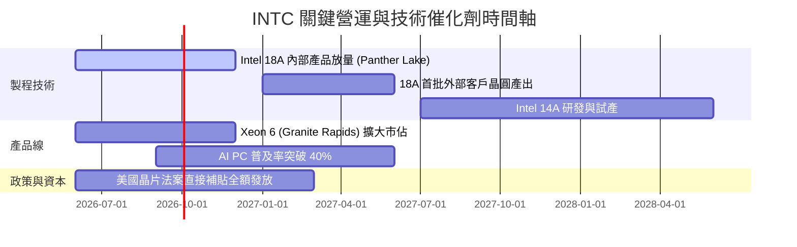

### 9.2 TAM 市場規模分析

```
╔══════════════════════════════════════════════════════════════════╗
║               INTC 目標市場規模 (TAM) 與潛力                     ║
╠══════════════════════════════════════════════════════════════════╣
║  PC 與邊緣運算處理器： TAM $65B  ｜ INTC 份額 ~70% ｜ 貢獻 $45B  ║
║  伺服器 CPU 與資料中心：TAM $45B  ｜ INTC 份額 ~60% ｜ 貢獻 $27B  ║
║  先進晶圓代工 (Foundry)：TAM $120B ｜ INTC 份額 ~5%  ｜ 貢獻 $6B   ║
║  AI 加速晶片與網路：    TAM $150B ｜ INTC 份額 ~3%  ｜ 貢獻 $4.5B ║
║                                                                  ║
║  📊 總計潛在市場 TAM > $380B ｜ 當前營收滲透率約 15%             ║
╚══════════════════════════════════════════════════════════════════╝
```

### 9.3 成長驅動力結構圖

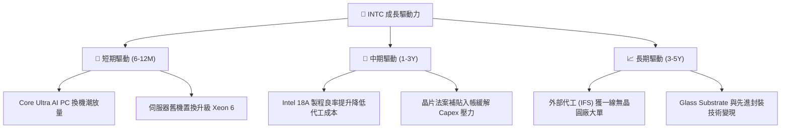

---

## 10. 風險矩陣

### 10.1 風險評分矩陣

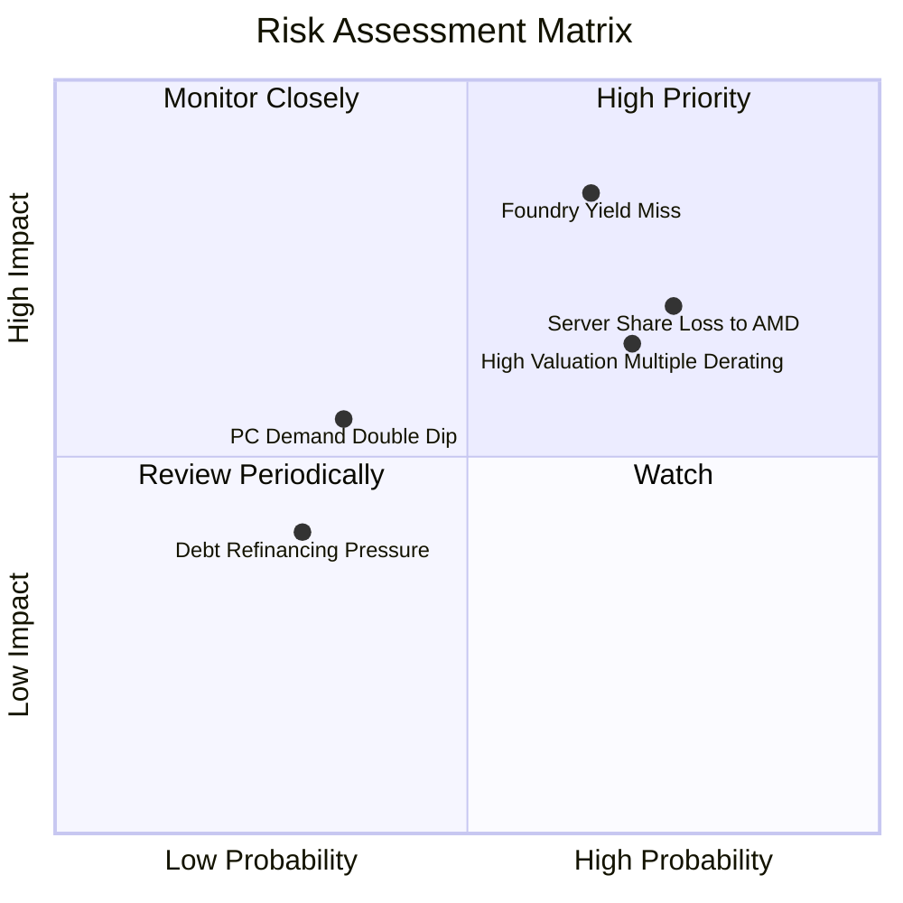

### 10.2 風險清單詳細分析

| # | 風險項目 | 發生機率 | 財務衝擊 | 風險評分 | 緩解措施 |
|---|----------|----------|----------|----------|----------|
| 1 | 🔴 **18A 製程良率與外部代工客戶拓展不及預期** | 高 (65%) | 高 (-15% 營收/毛利) | 🔴 8.5/10 | 先由內部 CCG 產品（Panther Lake）承擔初期產能，逐步驗證良率。 |
| 2 | 🔴 **資料中心 x86 市佔持續流失至 AMD EPYC** | 高 (75%) | 高 (-10% DCAI 利潤) | 🔴 8.0/10 | 加速推出 Granite Rapids 及 Sierra Forest 雙架構應戰。 |
| 3 | 🟡 **估值倍數向歷史中樞均值回歸 (De-rating)** | 高 (70%) | 中 (-20% 股價空間) | 🟡 7.0/10 | 嚴格控管 Capex 與營運成本，提升實質 FCF 生成以支撐股價。 |
| 4 | 🟡 **總體經濟疲軟導致 PC 復甦動能中斷** | 中 (35%) | 中 (-8% 營收) | 🟡 5.5/10 | 與各大 PC OEM 夥伴緊密綁定促銷，拓展商用企業市場。 |

---

## 11. 投資建議

### 11.1 最終綜合評級雷達圖

```
╔══════════════════════════════════════════════════════════════╗
║               INTC 最終全維度評級儀表板                      ║
╠══════════════════════════════════════════════════════════════╣
║ 基本面品質    6.0/10  ▓▓▓▓▓▓▓▓▓▓▓▓░░░░░░░░  ★★★☆☆           ║
║ 獲利修復潛力  7.0/10  ▓▓▓▓▓▓▓▓▓▓▓▓▓▓░░░░░░  ★★★★☆           ║
║ 財務安全邊際  6.0/10  ▓▓▓▓▓▓▓▓▓▓▓▓░░░░░░░░  ★★★☆☆           ║
║ 估值吸引力    4.0/10  ▓▓▓▓▓▓▓▓░░░░░░░░░░░░  ★★☆☆☆           ║
║ 護城河穩固度  6.5/10  ▓▓▓▓▓▓▓▓▓▓▓▓▓░░░░░░░  ★★★☆☆           ║
╠══════════════════════════════════════════════════════════════╣
║ 綜合投資評分  5.8/10  ▓▓▓▓▓▓▓▓▓▓▓░░░░░░░░░  🟡 中性觀望      ║
╚══════════════════════════════════════════════════════════════╝
```

### 11.2 目標價與隱含報酬率

| 情境 | 目標價 | 隱含報酬率 (相對現價 $89.47) | 機率權重 | 核心驅動條件 |
|------|--------|------------------------------|----------|--------------|
| 🔴 **悲觀情境** | **$58.50** | **-34.6%** | 25% | 18A 製程延宕，代工虧損持續擴大 |
| 🟡 **基準情境 (12M)** | **$81.50** | **-8.9%** | 55% | PC 穩定復甦，Capex 受控，本業利益改善 |
| 🟢 **樂觀情境** | **$112.00** | **+25.2%** | 20% | 成功獲取全球前三大無晶圓廠代工大單 |

### 11.3 買入時機與觸發因素

```
╔══════════════════════════════════════════════════════════════════╗
║                  INTC 投資操作 Checklist                         ║
╠══════════════════════════════════════════════════════════════════╣
║                                                                  ║
║  立即買入觸發條件（需滿足至少 2 項）：                           ║
║  ☐ 股價回檔至價值區間 $60.00 – $68.00 (MOS ≥ 15%)               ║
║  ☐ 管理層宣布獲取 Tier-1 外部代工客戶（如 Apple/NVIDIA/Qualcomm）║
║  ☐ 單季毛利率明確突破 44.0% 且 TTM ROIC 翻正超越 WACC           ║
║                                                                  ║
║  減碼 / 停損觸發條件（出現任一）：                              ║
║  ☐ 股價攀升突破 $100.00 而獲利未同步跟上 (Forward P/E > 50x)     ║
║  ☐ 18A 晶片量產時程宣布延後超過 1 個季度                        ║
║  ☐ 單季自由現金流再度轉為嚴重失血 (< -$2.0B)                    ║
╚══════════════════════════════════════════════════════════════════╝
```

### 11.4 投資人適配度分析

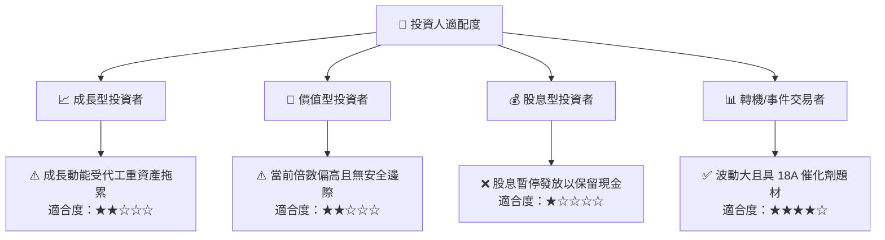

### 11.5 每季財報監控清單（Quarterly Watch List）

| 監控維度 | 核心追蹤指標 | 正常/加碼門檻 | 警訊/減碼門檻 | 追蹤意涵 |
|----------|--------------|---------------|---------------|----------|
| **營收動能** | CCG + DCAI 營收 YoY | > +15% YoY | < +5% YoY | 檢驗 PC 與伺服器需求強度 |
| **獲利能力** | Non-GAAP 毛利率 | > 42.0% | < 36.0% | 檢驗先進製程良率與折舊壓力 |
| **代工進展** | Intel Foundry 外部營收 | 季增 > 20% | 停滯或衰退 | 檢驗晶圓代工商業化落地成果 |
| **現金健康** | 單季自由現金流 (FCF) | > +$1.0B | < -$1.0B | 檢驗資本支出節流與自我造血力 |
| **資本效率** | ROIC 改善斜率 | 逐季提升 > 1 pp | 持續停滯於 < 3% | 檢驗是否脫離摧毀價值階段 |

### 11.6 反面論證：什麼會證明論點錯誤

```
╔══════════════════════════════════════════════════════════════════╗
║              ⚠️ 論點失效條件（Disconfirming Evidence）           ║
╠══════════════════════════════════════════════════════════════════╣
║  本報告之「中性觀望」論點在下列情況成立時應轉為「強力買入」：   ║
║  ① Intel 18A 外部代工在 6 個月內確認簽約金額超過 $15B；         ║
║  ② 伺服器 Xeon 6 市佔率止跌回升，帶動 DCAI 營業利益率突破 25%；║
║  ③ 股價非理性重挫至 $60.00 以下，提供 >25% 的實質安全邊際。     ║
║                                                                  ║
║  反之，在下列情況成立時應轉為「強力賣出」：                      ║
║  ① 18A 傳出重大缺陷延期，晶圓代工事業持續擴大虧損；              ║
║  ② 淨負債進一步擴大突破 $30B，引發信評機構降評風險。            ║
╚══════════════════════════════════════════════════════════════════╝
```

---

> **免責聲明**：本報告為 AI 自動生成，僅供研究參考，不構成投資建議。投資有風險，入市需謹慎。