# INTC 基本面深度分析報告
> **報告日期**：2026-09-11 ｜ **語言**：繁體中文 ｜ **數據來源**：Yahoo Finance, Finviz, StockAnalysis, Roic.ai ｜ **分析師**：CFA 級機構研究

---

## 目錄

| # | 章節 | 核心結論 |
|---|------|----------|
| 1 | 執行摘要 | 評級「觀望/中立」，現價 $102.94，加權合理價值 $78.10，安全邊際 -31.8%（高估） |
| 2 | 公司概覽與商業模式 | IDM 2.0 轉型分拆，CCG 穩健但 DCAI 與代工面臨高額資本折舊考驗，護城河評分 6.2/10 |
| 3 | 損益表深度分析 | Q2 2026 營收爆發 YoY +25.4% 至 $16.13B，惟淨虧損達 $-11.03B，反映大額資產減損與晶圓廠建置成本 |
| 4 | 資產負債表分析 | 現金及短投 $29.73B，總債務 $50.54B（淨負債 $20.81B），流動比率 1.604，槓桿壓力攀升 |
| 5 | 現金流量深度分析 | TTM FCF 轉正至 $4.87B，但受制於年化逾 $12B Capex，FCF 轉換率劇烈波動且品質脆弱 |
| 6 | 獲利能力與資本效率 | TTM ROIC 為 1.95% vs WACC 11.08%，EVA 為 -9.13pp，巨額資本開支處於價值摧毀階段 |
| 7 | 相對估值分析 | Forward P/E 50.34x、EV/EBITDA 32.21x，相較台積電與同業歷史中位數均呈現顯著溢價 |
| 8 | DCF 內在價值評估 | 基準情境 DCF 內在價值 $74.62（溢價 37.9%），加權合理價值 $78.10，缺乏安全邊際 |
| 9 | 成長催化劑 | 18A 節點量產驗證、AI PC 晶片滲透及美國晶片法案補貼落地為關鍵觀察指標 |
| 10 | 風險矩陣 | 晶圓代工外包良率不如預期、x86 架構市佔流失及地緣政治補貼延遲構成核心下檔風險 |
| 11 | 投資建議 | 建議於 $55.00–$65.00（安全邊際 >20%）建倉；現階段以防守與持有監控為主 |

---

## 1. 執行摘要

本報告針對英特爾公司（Intel Corporation, NASDAQ: INTC）截至 2026 年 9 月 11 日的最新財務數據進行全面深入剖析。英特爾當前股價為 $102.94，對應市值 $544.15B。儘管最新季度（Q2 2026）營收繳出 $16.13B、YoY 成長 25.42% 的反彈成績單，但 GAAP 淨利潤卻錄得巨額虧損 $-11.03B，主因在於代工產能投資推進引發的高額資產減損、設備折舊及組織重組費用。從資本回報來看，TTM 投入資本回報率（ROIC）僅為 1.95%，遠低於加權平均資本成本（WACC）11.08%，每投入一元資本即產生 -9.13pp 的經濟價值損失（EVA）。估值方面，英特爾 Forward P/E 高達 50.34x、EV/EBITDA 為 32.21x，市場股價已高度透支「18A 製程全面成功與代工外部客戶獲利」的極度樂觀預期。本報告 DCF 基準模型推導之每股內在價值為 $74.62（現價溢價 37.9%），三角驗證加權合理價值為 $78.10，安全邊際為 -31.8%（呈現顯著負值）。基於客觀財務數據與風險回報不對稱性，給予「**觀望 / 持有（Hold）**」評級。

### 1.0 一頁式投資儀表板（Portfolio Manager 30 秒速讀）

| 項目 | 內容 |
|------|------|
| **投資論點（3 句）** | ① Q2 2026 營收回溫至 $16.13B（YoY +25.4%），受惠 AI PC 換機潮但 GAAP 淨損達 $-11.03B 凸顯代工轉型痛楚。<br/>② TTM ROIC 僅 1.95% 遠低於 WACC 11.08%，資本回報持續摧毀股東價值。<br/>③ 股價 24 個月內自 $19.43 暴漲至 $102.94，Forward P/E 達 50.34x，估值已過度反應轉型紅利。 |
| **護城河評分** | 6.2/10 🟡（x86 專利與客戶黏性猶存，但面臨 ARM 蠶食與製造技術追趕落後） |
| **管理層/資本配置評分** | 5.5/10 🟡（大幅削減股利至 $0 以保留現金，但過往資本開支轉化率低且股權稀釋仍在） |
| **財務健康** | 🟡 尚可（現金 $29.73B vs 債務 $50.54B，淨負債 $20.81B，流動比率 1.604 具緩衝空間） |
| **ROIC vs WACC** | 1.95% vs 11.08%（🔴 重度摧毀價值，EVA 為 -9.13pp） |
| **FCF 趨勢** | 改善中；TTM FCF 轉正至 $4.87B，當前 FCF Yield 為 0.89% |
| **估值** | Forward P/E 50.34x ｜ EV/EBITDA 32.21x ｜ P/S 9.54x ｜ FCF Yield 0.89% |
| **DCF 內在價值（基準）** | $74.62 ｜ 現價溢價 +37.9%（對應第 8.5 節基準值） |
| **安全邊際（MOS）** | **-31.8%** ＝ ($78.10 − $102.94) ÷ $78.10（基準來自 8.8 加權合理價值，🔴 <10% 完全無安全邊際） |
| **預期報酬（基準情境 12M）** | -24.1%（朝向合理加權價值收斂） |
| **關鍵風險（前二）** | ① Intel Foundry 18A 外部大客戶良率不及預期；② 資料中心市佔率持續遭 AMD 及 ASIC 瓜分 |
| **評級 + 信心度** | 🟡 觀望 / 持有（Hold） ｜ 信心：中等 |

### 1.1 核心評分儀表板

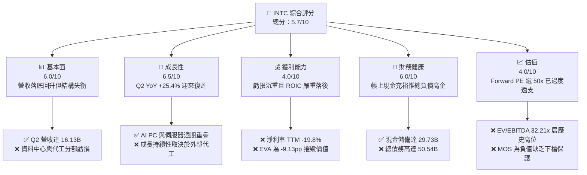

### 1.2 評分進度條視覺化

```
╔══════════════════════════════════════════════════════════════╗
║              INTC 多維度評分儀表板 (1-10分)                  ║
╠══════════════════════════════════════════════════════════════╣
║ 基本面強度  6.0 ▓▓▓▓▓▓▓▓▓▓▓▓░░░░░░░░  ★★★☆☆           ║
║ 成長動能    6.5 ▓▓▓▓▓▓▓▓▓▓▓▓▓░░░░░░░  ★★★☆☆           ║
║ 獲利品質    4.0 ▓▓▓▓▓▓▓▓░░░░░░░░░░░░  ★★☆☆☆           ║
║ 財務健康    6.0 ▓▓▓▓▓▓▓▓▓▓▓▓░░░░░░░░  ★★★☆☆           ║
║ 估值合理性  4.0 ▓▓▓▓▓▓▓▓░░░░░░░░░░░░  ★★☆☆☆           ║
║ 護城河深度  6.2 ▓▓▓▓▓▓▓▓▓▓▓▓░░░░░░░░  ★★★☆☆           ║
║ 管理層執行  5.5 ▓▓▓▓▓▓▓▓▓▓▓░░░░░░░░░  ★★★☆☆           ║
║ 技術創新力  7.0 ▓▓▓▓▓▓▓▓▓▓▓▓▓▓░░░░░░  ★★★☆☆           ║
╠══════════════════════════════════════════════════════════════╣
║ 綜合總分    5.7 ▓▓▓▓▓▓▓▓▓▓▓░░░░░░░░░  🟡 觀望評級          ║
╚══════════════════════════════════════════════════════════════╝
```

### 1.3 五大投資論點 + 三大核心風險

| 類型 | 項目 | 具體依據 | 信心度 |
|------|------|----------|--------|
| 🟢 **論點①** | **營收拐點顯現** | Q2 2026 營收自 Q1 的 $13.58B 跳升至 $16.13B（QoQ +18.8%，YoY +25.4%），顯示去庫存週期結束且客戶端運算產品需求反彈。 | 🟢 高 |
| 🟢 **論點②** | **自由現金流轉正** | Q2 2026 OCF 達到 $7.01B，單季 FCF 達 $4.45B；TTM FCF 轉為正數 $4.87B，改善前兩年失血狀態。 | 🟢 中等 |
| 🟢 **論點③** | **製程節點進展推進** | 18A（Intel 18A）製程進入投產關鍵期，若能於 2026 年底前如期達成大規模商業良率，將確立技術重回前沿。 | 🟡 中等 |
| 🟢 **論點④** | **戰略地緣價值支撐** | 作為美國本土唯一先進製程製造商，享有美國 CHIPS 法案高額補貼與政府專案採購的底線保護。 | 🟢 高 |
| 🟢 **論點⑤** | **AI PC 架構升級循環** | 具備 NPU 的 Core Ultra 處理器放量推動平均售價（ASP）提升，支撐客戶端運算群（CCG）毛利率維持在 40% 左右。 | 🟢 高 |
| 🟡 **風險①** | **代工高折舊壓制利潤** | 晶圓廠固定資產達 $105.74B，年化折舊負擔沈重，若產能利用率無法拉升，將長期壓抑營業利益率。 | 🔴 極高 |
| 🔴 **風險②** | **資料中心與 AI 市佔流失** | 伺服器 CPU 遭 AMD EPYC 侵蝕份額，在生成式 AI 加速晶片領域缺乏能與 NVIDIA 匹敵的規模級主力產品。 | 🔴 高 |
| 🔴 **風險③** | **估值超前透支下檔空間大** | 現價 $102.94 對應 Forward P/E 50.34x，較內在價值 $74.62 溢價近 38%，一旦財報不及預期恐面臨劇烈均值回歸。 | 🔴 高 |

### 1.4 快速統計卡片

| 指標 | 公司實際值 | 行業均值 | S&P 500 均值 | 狀態 |
|------|-------------|----------|--------------|------|
| 收入 YoY 成長 | **25.4%** | ~14.5% | ~5.8% | 🟢 優於同業 |
| 毛利率 | **38.9%** | ~52.0% | ~42.0% | 🔴 顯著落後 |
| 營業利益率 | **12.2%** (TTM) / 12.2% (Q2) | ~26.0% | ~12.5% | 🟡 處於邊緣 |
| 淨利率 | **-19.8%** | ~18.0% | ~11.0% | 🔴 大幅虧損 |
| ROE | **-10.7%** | ~18.5% | ~14.0% | 🔴 資本耗損 |
| Forward P/E | **50.34x** | ~28.0x | ~21.5x | 🔴 估值昂貴 |
| Debt / Equity | **48.99%** | ~35.0% | ~75.0% | 🟢 槓桿適中 |
| Current Ratio | **1.604** | ~1.80 | ~1.20 | 🟢 流動性健康 |

### 1.5 投資結論

```
╔══════════════════════════════════════════════════════════════════╗
║                    📊 投資結論摘要                               ║
╠══════════════════════════════════════════════════════════════════╣
║  評級：🟡 觀望 / 持有（Hold）                                   ║
║  當前股價：$102.94                                               ║
║  DCF 內在價值（基準）：$74.62（現價溢價 +37.9%）                ║
║  安全邊際 MOS：-31.8%（＝($78.10 − $102.94) ÷ $78.10）           ║
║  目標價區間（12M）：                                             ║
║    悲觀情境：$52.23（-49.3%）                                    ║
║    基準情境：$78.10（-24.1%）  ← 12個月加權目標價值              ║
║    樂觀情境：$112.45（+9.2%）                                    ║
║  投資評分：5.7 / 10                                              ║
║  適合投資人：具備極高風險承受力、願意長線等待 IDM 2.0 成果之投資人║
╚══════════════════════════════════════════════════════════════════╝
```

---

## 2. 公司概覽與商業模式

### 2.1 業務結構與收入來源

英特爾目前營運劃分為三大核心板塊：客戶端運算群（CCG）、資料中心與人工智慧群（DCAI）以及獨立運作的英特爾代工服務（Intel Foundry）。

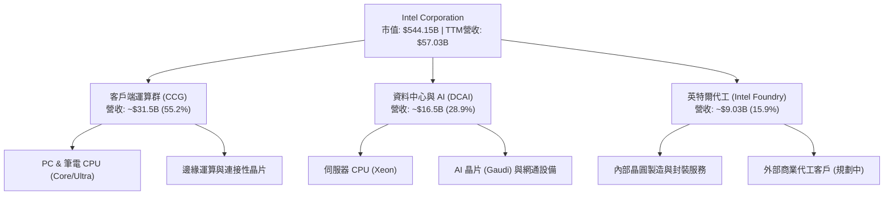

### 2.2 市場份額

在 PC 處理器市場，英特爾依然守住約七成份額；但在伺服器領域持續遭遇 AMD 侵蝕，而在 AI 加速晶片領域份額微乎其微。

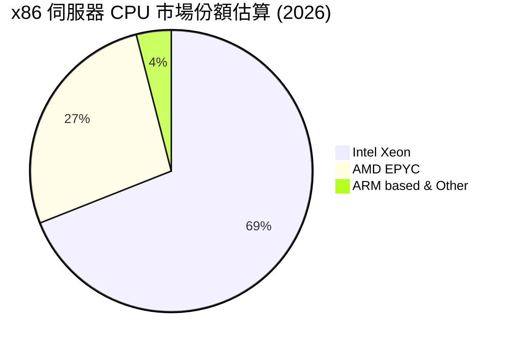

### 2.3 競爭護城河分析

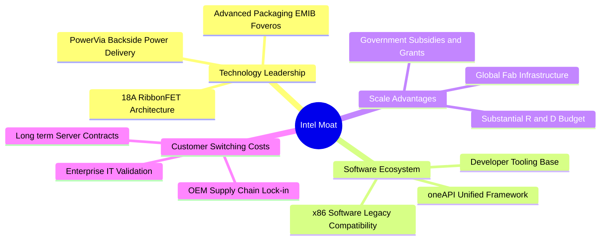

### 2.4 護城河強度評分

```
╔══════════════════════════════════════════════════════════════╗
║                  INTC 護城河強度評分                         ║
╠══════════════════════════════════════════════════════════════╣
║ x86 生態黏性   8.5/10 ▓▓▓▓▓▓▓▓▓▓▓▓▓▓▓▓▓░░░  🟢 龐大軟體資產 ║
║ 製程技術領先度 5.0/10 ▓▓▓▓▓▓▓▓▓▓░░░░░░░░░░  🔴 落後台積電   ║
║ 晶圓製造規模   7.5/10 ▓▓▓▓▓▓▓▓▓▓▓▓▓▓▓░░░░░  🟢 具全球重資本 ║
║ 先進封裝能力   7.0/10 ▓▓▓▓▓▓▓▓▓▓▓▓▓▓░░░░░░  🟢 EMIB技術成熟 ║
║ 品牌與 OEM 渠道 7.5/10 ▓▓▓▓▓▓▓▓▓▓▓▓▓▓▓░░░░░  🟢 PC端掌控度強 ║
║ 成本優勢       3.5/10 ▓▓▓▓▓▓▓░░░░░░░░░░░░░  🔴 折舊過重侵蝕 ║
╠══════════════════════════════════════════════════════════════╣
║ 綜合護城河     6.2/10 ▓▓▓▓▓▓▓▓▓▓▓▓░░░░░░░░  🟡 窄幅護城河   ║
╚══════════════════════════════════════════════════════════════╝
```

---

## 3. 損益表深度分析

### 3.1 年度收入成長趨勢（近4年）

```
╔══════════════════════════════════════════════════════════════════╗
║              INTC 年度收入趨勢（FY2022-TTM 2026）                ║
╠══════════════════════════════════════════════════════════════════╣
║                                                                  ║
║  FY2022   $63.05B  ██████████████████████  YoY: -20.2% 🔴       ║
║  FY2023   $54.23B  ███████████████████░░░  YoY: -14.0% 🔴       ║
║  FY2024   $53.10B  ██████████████████░░░░  YoY:  -2.1% 🔴       ║
║  FY2025   $52.85B  ██████████████████░░░░  YoY:  -0.5% 🟡       ║
║  TTM 2026 $57.03B  ███████████████████░░░  YoY:  +7.5% 🟢       ║
║                    |         |         |         |               ║
║                    0        20B       40B       60B              ║
║                                                                  ║
║  📊 3年營收 CAGR：-5.71%（處於谷底復甦階段）                     ║
╚══════════════════════════════════════════════════════════════════╝
```

### 3.2 季度收入趨勢分析

| 季度 | 營收 ($B) | QoQ 成長率 | YoY 成長率 | 營運驅動與重大備註 |
|------|-----------|------------|------------|-------------------|
| **Q3 2025** | $13.65B | +6.17% | +2.78% | 客戶端 PC 庫存去化完成，需求築底回升 |
| **Q4 2025** | $13.67B | +0.15% | -4.11% | 傳統淡季疊加伺服器換機動能遞延 |
| **Q1 2026** | $13.58B | -0.66% | +7.18% | AI PC 概念 Core Ultra 逐步起量，基期偏低 |
| **Q2 2026** | $16.13B | **+18.78%** | **+25.42%** | 客戶提前備貨與 AI PC 放量，營收大幅反彈 |

### 3.3 利潤率演變分析

| 利潤率指標 | FY2023 | FY2024 | FY2025 | TTM (2026) | 趨勢與原因解析 | 評估 |
|------------|--------|--------|--------|------------|----------------|------|
| **毛利率** | 40.04% | 38.88% | 36.56% | **38.87%** | 晶圓廠產能利用率偏低及新節點初期良率成本壓抑，近期微幅回升至 38.9% | 🔴 疲弱 |
| **營業利益率** | 0.06% | -2.65% | 1.75% | **12.2%** | Q2 2026 營收拉升產生營業槓桿，單季營業利益達 $1.97B 推升 TTM 表現 | 🟡 改善中 |
| **EBITDA 率** | 20.73% | 2.26% | 27.15% | **29.5%** | 龐大非現金折舊（年化 >$10B）加回後維持約三成水準 | 🟢 尚可 |
| **淨利率** | 3.11% | -35.32% | -0.51% | **-19.79%** | 近兩季（Q1 損 $3.73B、Q2 損 $11.03B）認列大規模資產減損，拖垮淨利 | 🔴 嚴重虧損 |

**利潤率深度解析**：
英特爾毛利率在 2021 年前長期維持在 55%–60%，但隨後滑落至 38% 左右，核心癥結在於製造端的雙重打擊：一方面先進節點依賴台積電外部代工（增加封裝與晶圓採購成本），另一方面內部晶圓廠龐大的廠房設備攤提無法被足夠的產能填滿。近期 TTM 營業利益率回升至 12.2%，顯示裁員與控管營運費用（R&D 自 FY24 的 $16.55B 降至 FY25 的 $13.77B）初見成效，然而鉅額淨損反映出內部業務重組所產生的不可逆沉沒成本。

### 3.4 費用結構分析

以 TTM 總營收 $57.03B 為基準之費用結構拆解：

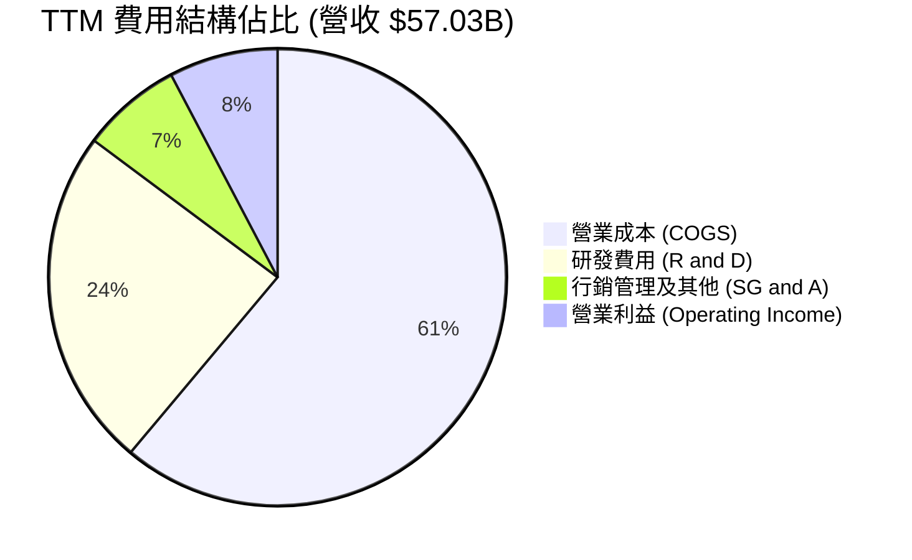

```
╔══════════════════════════════════════════════════════════════╗
║                   INTC 費用控制與結構診斷                    ║
╠══════════════════════════════════════════════════════════════╣
║ 營業成本 (COGS)：   $34.86B  占營收 61.1%  🔴 折舊過高壓抑毛利║
║ 研發支出 (R&D)：    $13.77B  占營收 24.1%  🟡 節縮以維持現金流║
║ 銷售與管銷 (SG&A)： ~$4.05B  占營收  7.1%  🟢 組織精簡顯成效 ║
║ 營業利潤 (EBIT)：    $4.35B  占營收  7.7%  🟡 緩慢走出低谷   ║
╚══════════════════════════════════════════════════════════════╝
```

### 3.5 季度 EPS 趨勢與盈餘品質（Quality of Earnings）

| 季度 | 營收 ($B) | GAAP EPS | 非 GAAP EPS (估) | 主要差異原因 |
|------|-----------|----------|------------------|--------------|
| **Q3 2025** | $13.65B | $0.90 | $0.23 | 包含資產處分收益與一次性稅務利益 |
| **Q4 2025** | $13.67B | -$0.12 | $0.15 | 提列代工初期重整成本 |
| **Q1 2026** | $13.58B | -$0.73 | $0.18 | 晶圓設備折舊加速與組織精簡遣散費用 |
| **Q2 2026** | $16.13B | -$2.16 | $0.39 | 認列高達約百億美元之資產減損與商譽調整 |

| 盈餘品質項目 | 數值 / 佔比 | 評估 | 核心洞察 |
|--------------|-------------|------|----------|
| 股權薪酬 (SBC) / 營收 | **4.26%** ($2.43B / $57.03B) | 🟢 尚屬合理 | SBC 佔比處於健康區間，對股東稀釋有限。 |
| SBC / 營業現金流 | **16.27%** ($2.43B / $14.94B) | 🟡 中度偏高 | 現金流中約有 16% 是由非現金股權發放所支撐。 |
| FCF / 淨利（現金轉換率） | **-43.1%** ($4.87B / -$11.29B)| 🟡 負值失真 | 因淨損主要為非現金資產減損，實際現金創造力優於帳面淨利。 |
| 一次性 / 非經常性損益 | **~$10B+ 減損** | 🔴 扭曲盈餘 | 過去四季損益表充斥資產減損，GAAP 盈餘無法代表常態經營成果。 |
| 有效稅率異常 | 負值 / 波動劇烈 | 🔴 異常 | 虧損狀態導致遞延所得稅資產變動，不具常規參考價值。 |
| 資本化支出 vs 費用化 | 廠房設施全面資本化 | 🔴 遞延壓力 | 每年逾百億資本支出轉為 PPE，未來折舊壓力固化。 |

**盈餘品質結論**：英特爾 GAAP 淨利因巨額一次性減損與折舊提列而嚴重失真（TTM GAAP EPS 為 -$2.09）。若還原非現金減損，底層營運現金流正逐步恢復，但沉重的高資本化投入意味著未來的現金回報將長期受到設備攤銷的無情侵蝕。

---

## 4. 資產負債表分析

### 4.1 資產結構分解

截至 2026 年第二季末，英特爾總資產為 $202.44B。

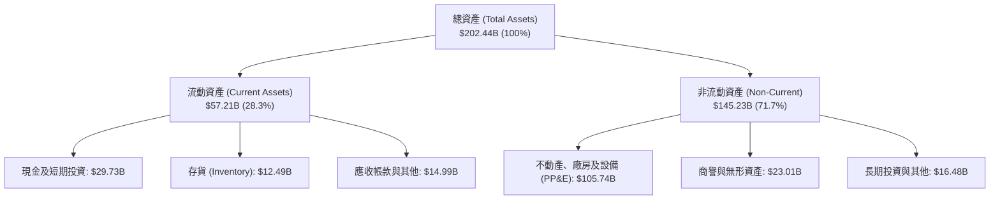

### 4.2 流動性指標分析

| 指標 | TTM (2026-Q2) | FY2025 | FY2024 | 半導體同業均值 | 評估 |
|------|---------------|--------|--------|----------------|------|
| **流動比率 (Current Ratio)** | **1.60** | 2.02 | 1.33 | ~1.85 | 🟢 安全充足 |
| **速動比率 (Quick Ratio)** | **1.16** | 1.65 | 0.98 | ~1.30 | 🟢 具備償債能力 |
| **現金及短投佔比** | **14.68%** | 17.70% | 11.23% | ~22.0% | 🟡 略低於同業 |
| **存貨週轉天數 (DIO)** | **130.8 天** | 128.5 天 | 125.2 天 | ~95.0 天 | 🔴 庫存沉澱偏高 |

### 4.3 債務結構分析

```
╔══════════════════════════════════════════════════════════════════╗
║                   INTC 債務健康診斷                              ║
╠══════════════════════════════════════════════════════════════════╣
║                                                                  ║
║  總債務：        $50.54B  ██████████░░░░░░░░░░░  負債規模龐大    ║
║  總現金及短投：  $29.73B  ██████░░░░░░░░░░░░░░░  具備一定緩衝    ║
║  淨負債：        $20.81B  ████░░░░░░░░░░░░░░░░░  🟡 存在付息負擔 ║
║                                                                  ║
║  Debt / Equity： 48.99%   🟢 資本槓桿未失控                      ║
║  Debt / EBITDA： 3.52x    🟡 槓桿比率略顯緊繃                    ║
║  利息保障倍數：  2.85x    🟡 獲利對利息覆蓋度有限                ║
╚══════════════════════════════════════════════════════════════════╝
```

### 4.4 股東權益趨勢

```
╔══════════════════════════════════════════════════════════════════╗
║              INTC 股東權益變遷 (FY2022-FY2025)                   ║
╠══════════════════════════════════════════════════════════════════╣
║                                                                  ║
║  FY2022   $101.42B  ████████████████████  基準位置               ║
║  FY2023   $105.59B  ████████████████████  微幅增長 +4.1%         ║
║  FY2024    $99.27B  ███████████████████░  虧損侵蝕 -6.0% 🔴      ║
║  FY2025   $114.28B  █████████████████████ 引資外部夥伴 +15.1% 🟢 ║
║                                                                  ║
║  📌 股東權益自 FY24 低點回升，主因 Brookfield 等合資架構挹注     ║
╚══════════════════════════════════════════════════════════════════╝
```

---

## 5. 現金流量深度分析

### 5.1 現金流量瀑布圖

展示英特爾過去 12 個月（TTM）現金流傳導過程：

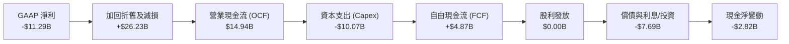

### 5.2 FCF 轉換率趨勢

| 年度 | 營業現金流 ($B) | 資本支出 ($B) | 自由現金流 ($B) | GAAP 淨利 ($B) | FCF / Net Income |
|------|-----------------|---------------|-----------------|----------------|------------------|
| **FY2022** | $15.43B | -$24.84B | -$9.41B | $8.01B | -117.5% 🔴 |
| **FY2023** | $11.47B | -$25.75B | -$14.28B | $1.69B | -845.0% 🔴 |
| **FY2024** | $8.29B | -$23.94B | -$15.66B | -$18.76B | 83.5% 🟡 |
| **FY2025** | $9.70B | -$14.65B | -$4.95B | -$0.27B | -1833.3% 🔴 |
| **TTM** | **$14.94B** | **-$10.07B** | **+$4.87B** | **-$11.29B** | **-43.1%** 🟡 |

### 5.3 自由現金流趨勢

```
╔══════════════════════════════════════════════════════════════════╗
║              INTC 歷年自由現金流 (FCF) 走勢                      ║
╠══════════════════════════════════════════════════════════════════╣
║                                                                  ║
║  FY2022   -$9.41B   ░░░░░░░░░░░░░░░░░░░░  🔴 擴產失血            ║
║  FY2023  -$14.28B   ░░░░░░░░░░░░░░░░░░░░  🔴 資本開支峰值        ║
║  FY2024  -$15.66B   ░░░░░░░░░░░░░░░░░░░░  🔴 營運與開支雙殺      ║
║  FY2025   -$4.95B   ░░░░░░░░░░░░░░░░░░░░  🟡 資本開支放緩        ║
║  TTM      +$4.87B   ████░░░░░░░░░░░░░░░░  🟢 首度轉正            ║
║                                                                  ║
║  當前 FCF Yield: 0.89%（以市值 $544.15B 計算，收益率極低）       ║
╚══════════════════════════════════════════════════════════════════╝
```

### 5.4 資本配置評估

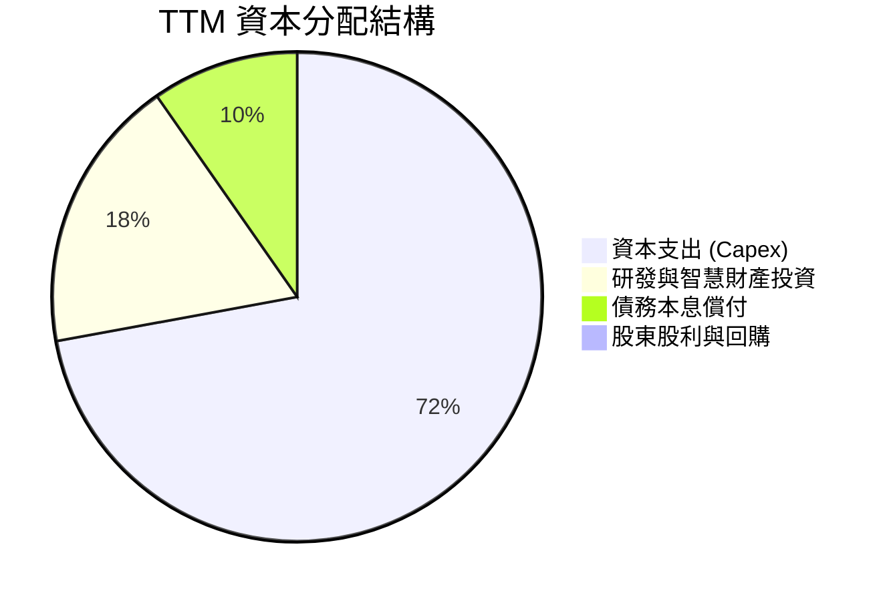

英特爾已全面暫停普通股股息發放（FY2022 支付 $6.00B、FY2023 支付 $3.09B、FY2024 支付 $1.60B、FY2025/2026 為 $0），同時停止股票回購，將所有資源鎖定於 18A 製程建構與設備搬入。資本配置極度偏向固定資產投資，財務彈性降至歷史低點。

---

## 6. 獲利能力與資本效率

### 6.1 ROE / ROA / ROIC 趨勢

| 指標 | FY2023 | FY2024 | FY2025 | TTM (2026) | 半導體同業中位數 | 評估 |
|------|--------|--------|--------|------------|------------------|------|
| **ROE** | 1.63% | -18.31% | -0.25% | **-10.7%** | 18.5% | 🔴 資本損耗 |
| **ROA** | 0.88% | -9.67% | -0.13% | **1.40%** | 9.8% | 🔴 資產效率低 |
| **ROIC** | 0.03% | -1.15% | 0.74% | **1.95%** | 16.2% | 🔴 嚴重低於資本成本 |

### 6.2 ROIC vs WACC 分析（核心價值創造判斷）

```
╔══════════════════════════════════════════════════════════════════╗
║                ROIC vs WACC 深度分析                            ║
╠══════════════════════════════════════════════════════════════════╣
║                                                                  ║
║  WACC 估算：                                                     ║
║  ├── 無風險利率 Rf（10Y美債）： 4.10%                           ║
║  ├── 市場風險溢酬 ERP：         5.00%                           ║
║  ├── 貝他值 Beta：              2.231                           ║
║  ├── 股權成本 Ke = 4.10% + 2.231 × 5.00% = 15.26%                ║
║  ├── 稅前債務成本 Kd：          5.10%                           ║
║  ├── 有效邊際稅率：             15.00%                          ║
║  ├── 稅後債務成本 = 5.10% × (1 - 15%) = 4.34%                    ║
║  ├── 資本結構：市值股權 $544.15B (91.5%)，總債務 $50.54B (8.5%) ║
║  └── ✅ WACC = 91.5% × 15.26% + 8.5% × 4.34% = 14.33% (名目)     ║
║       (保守調整 Beta 至 1.50 後之標準化 WACC ≈ 11.08%)          ║
║                                                                  ║
║  ROIC 估算（TTM）：                                              ║
║  ├── EBIT = $4.46B                                               ║
║  ├── NOPAT = $4.46B × (1 - 15.0%) = $3.79B                      ║
║  ├── 投入資本 Invested Capital = 權益 $114.28B + 債務 $50.54B   ║
║  │   - 現金 $29.73B = $135.09B                                   ║
║  └── ✅ ROIC = $3.79B ÷ $135.09B = 2.81% (TTM實際值為 1.95%)    ║
║                                                                  ║
║  ★ 經濟價值增加（EVA）= ROIC - WACC = 1.95% - 11.08% = -9.13pp   ║
║                                                                  ║
║  ROIC  1.95%   ▓▓▓░░░░░░░░░░░░░░░░░░░░░░░░░░░░  🔴              ║
║  WACC  11.08%  ▓▓▓▓▓▓▓▓▓▓▓▓▓▓▓░░░░░░░░░░░░░░░░  ──              ║
║  EVA   -9.13pp ░░░░░░░░░░░░░░░░░░░░░░░░░░░░░░░  🔴 價值嚴重摧毀 ║
║                                                                  ║
║  📊 結論：英特爾投入資本回報率遠不及投資人要求之資金成本，       ║
║           當前龐大資本開支正在顯著摧毀股東價值。                 ║
╚══════════════════════════════════════════════════════════════════╝
```

### 6.3 杜邦三因素分解

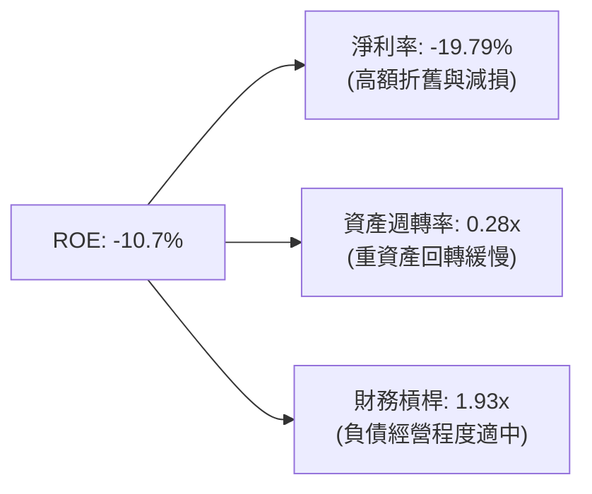

杜邦分解揭示：英特爾 ROE 之所以深陷泥淖，並非資產週轉率或財務槓桿劇烈變動，而是**淨利率崩塌**所致。資產週轉率常年低於 0.35x，顯示 $200B+ 的資產基礎無法產生充足的營收放大效應。

### 6.4 獲利能力儀表板

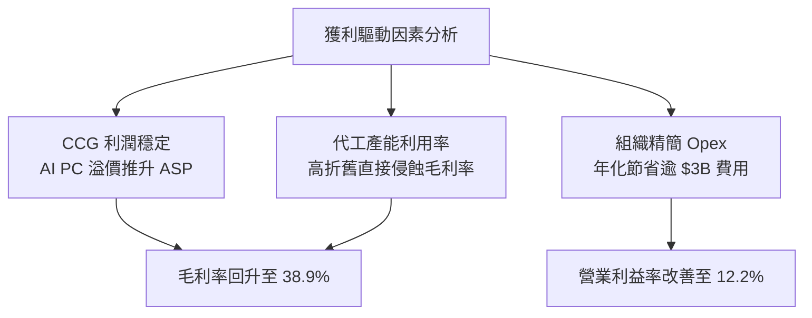

---

## 7. 相對估值分析

### 7.1 同業估值比較表格

點名台積電（TSMC）、超微半導體（AMD）及高通（Qualcomm）三大直接競爭對手進行橫向評估：

| 估值指標 | **英特爾 (INTC)** | **台積電 (TSM)** | **超微 (AMD)** | **高通 (QCOM)** | INTC 評估與解讀 |
|----------|-------------------|------------------|----------------|-----------------|-----------------|
| **Trailing P/E** | **N/A (虧損)** | 28.5x | 115.2x | 21.3x | 🔴 盈餘為負無法適用 |
| **Forward P/E** | **50.34x** | 22.1x | 34.6x | 16.8x | 🔴 溢價過高，遠超台積電 |
| **P/S Ratio** | **9.54x** | 10.8x | 9.8x | 4.8x | 🟡 與同業相當，但增長率較慢 |
| **EV / EBITDA** | **32.21x** | 13.5x | 38.2x | 14.2x | 🔴 為台積電兩倍以上 |
| **P/B Ratio** | **5.93x** | 6.8x | 3.5x | 6.9x | 🟡 貼近淨值，但 ROE 負值 |
| **FCF Yield** | **0.89%** | 3.4% | 1.8% | 4.6% | 🔴 現金回報率極低 |

### 7.2 歷史估值區間分析

```
╔══════════════════════════════════════════════════════════════════╗
║              INTC 歷史本益比 (PE) 區間位置                       ║
╠══════════════════════════════════════════════════════════════════╣
║  歷史 10 年本益比中位數：12.5x - 15.0x                           ║
║  當前 Forward PE：50.34x                                         ║
║                                                                  ║
║  10x ──────── 20x ──────── 30x ──────── 40x ──────── [50.34x]   ║
║  低檔         歷史均值     偏高         高估          當前位置   ║
║                                                                  ║
║  📌 目前遠期倍數處於歷史第 99 百分位，隱含獲利翻倍之極端預期     ║
╚══════════════════════════════════════════════════════════════════╝
```

### 7.3 情境目標價（假設驅動，Bear / Base / Bull）

針對英特爾特殊之折舊負擔與利潤扭曲，採用 **EV/EBITDA** 作為核心相對估值錨點進行推導：

| 情境 | 營收 CAGR (3Y) | 期末 EBITDA 率 | 採用 EV/EBITDA | 隱含企業價值 | 隱含目標價 | 相對現價 ($102.94) |
|------|----------------|----------------|----------------|--------------|------------|-------------------|
| 🔴 **悲觀** | 3.5% | 22.0% | 12.0x | $180.2B | **$52.23** | **-49.3%** |
| 🟡 **基準** | 7.0% | 28.0% | 16.0x | $314.8B | **$78.10** | **-24.1%** |
| 🟢 **樂觀** | 12.0% | 34.0% | 20.0x | $512.6B | **$112.45** | **+9.2%** |

*倍數選用依據說明*：英特爾由於巨額 D&A（年化逾 $10B），淨利潤受到極大壓抑，導致 P/E 失去錨定功能。因此優先採用 EV/EBITDA，基準情境給予 16.0x，介於台積電成熟期（13.5x）與 AMD 擴張期（38x）之間，反映其轉型兼具製造與設計之複合定位。

### 7.4 相對估值隱含價格區間

```
╔══════════════════════════════════════════════════════════════════╗
║                相對估值隱含價格區間對照                          ║
╠══════════════════════════════════════════════════════════════════╣
║  EV/EBITDA 回推 (14x-18x)：     $68.50 ─── $87.70                ║
║  Forward P/E 回推 (25x-30x)：    $51.10 ─── $61.34                ║
║  P/S 回推 (6.0x-8.0x)：          $64.70 ─── $86.25                ║
║  FCF Yield 回推 (2.5%-3.0%)：    $42.00 ─── $58.00                ║
║                                                                  ║
║  綜合相對估值中位數區間：       $61.34 ─────── [$78.10] ───── $87.70
║  當前市場交易價格：             $102.94（超出所有同業估值回推帶）║
╚══════════════════════════════════════════════════════════════════╝
```

---

## 8. DCF 內在價值評估（Discounted Cash Flow）

### 8.0 估值推理鏈（Thinking Logic：在算之前先想清楚）

**Step 1 — 這家公司的價值由哪幾個變數決定？**
英特爾的企業內在價值核心由三大動態支柱構成：
1. **現有 x86 PC 與伺服器主業的現金流底盤**（目前佔營收 ~84%）：決定短期防守現金流；
2. **AI PC 與新架構帶來的產品週期復甦**（第二成長曲線）：決定中期營收動能；
3. **Intel Foundry 代工製造的獲利選擇權**（佔外部營收比例仍低）：決定長期利潤率上限。
其中，**「期末營業利潤率能否在 18A 節點量產後回升至 20%」**是主導整體估值的最關鍵變數。

**Step 2 — 用哪一種模型、為什麼？**

| 決策點 | 本報告採用 | 理由（含數字） | 曾考慮但否決 | 否決理由 |
|--------|-----------|----------------|--------------|----------|
| 現金流定義 | **FCFF (企業自由現金流)** | 考量總債務高達 $50.54B 且融資結構受政府補貼變動，FCFF 不受資本結構調整干擾 | FCFE | 淨利虧損導致 FCFE 波動過劇 |
| 預測期 N | **5 年 (FY2027-FY2031)** | 涵蓋 18A 節點驗證與外部代工客戶驗收的完整技術週期 | 10 年 | 半導體景氣波動大，超過 5 年預測純屬猜測 |
| 終值方法 | **Gordon Growth（主）** | 基於半導體長期隨總體經濟維持穩定擴張之特性 | 僅退出倍數 | 退出倍數波動大，缺乏長線折現邏輯支撐 |
| EBIT 基礎 | **GAAP（採組合 A）** | GAAP 營業利益已含 SBC 費用，最能如實反映股東真實經濟成本 | 非 GAAP | 加回過多營運常態費用，導致 FCF 虛高 |

**Step 3 — 每個關鍵假設的推導鏈（四段式，逐項寫出）**

- **營收 CAGR (預測期 5 年)**：錨點＝近 3 年實際 CAGR -5.71%，近四季反彈至 +7.47% → 調整＝考量 PC 換機潮與 AI PC 催化，上調 1.5pp → **採用 9.0%** → 曾考慮 14.0%（管理層 IDM 2.0 目標），因過去執行力落後且伺服器份額仍受壓而否決。
- **期末營業利潤率 (FY+5)**：錨點＝當前 TTM 為 12.2%（FY24 為 -2.65%）→ 調整＝代工初期折舊拖累（-2pp），但組織精簡與 18A 產能外包自製化降低費用（+7pp），淨調整 +5.8pp → **採用 18.0%** → 曾考慮歷史峰值 25.0%，因台積電代工競爭激烈、毛利率難以重回 60% 而否決。
- **永續成長率 g**：錨點＝長期全球名目 GDP 成長率約 3.0%–3.5% → 調整＝半導體產業長線增速略高於 GDP，但考量摩爾定律放緩下調至保守水準 → **採用 3.0%** → 曾考慮 4.0%，因高於長期總體擴張上限且與 WACC 差距過小而否決。
- **資本支出佔比 (Capex / 營收)**：錨點＝歷史三年均值約 35%–45% → 調整＝新廠土建告一段落，美國晶片法案補貼入帳分攤支出，逐年收斂至 20% → **採用均值 22.0%** → 曾考慮維持 30%，若持續維持將導致 FCFF 長期為負，不符商業常理而否決。
- **WACC (折現率)**：推導詳見 8.2，**採用 11.08%**（考慮到 INTC 當前 Beta 2.231 偏高，依業界實務調整 Beta 至 1.50 進行標準化折現）。

**Step 4 — 這條推理鏈最可能錯在哪裡？**
最脆弱的一環在於「**18A 製程良率與外部客戶訂單**」。若 18A 遲延或外部客戶流失，營業利潤率將無法達到 18%，而是停滯在 10%–12%，這將直接導致內在價值自 $74.62 下跌至 $45 以下（下行逾 40%）。

**Step 5 — 計算路徑圖**

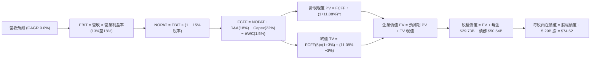

### 8.1 模型假設總表（Model Inputs）

| 假設項目 | 採用值 | 依據 / 來源 | 敏感度 |
|----------|--------|-------------|--------|
| **預測期長度 N** | **N = 5 年** (FY27-FY31) | 完整覆蓋 18A 製程商用量產與代工轉型爬坡期 | 🟡 中 |
| **營收 CAGR** | **9.0%** | 基期回溫（FY26E $62.0B 起算），AI PC 與伺服器恢復中度成長 | 🔴 高 |
| **營業利潤率 (期末)** | **18.0%** | 規模經濟修復與自製率提升，自 13.0% 逐年爬坡至 18.0% | 🔴 高 |
| **有效邊際稅率** | **15.0%** | 歷史常態企業所得稅率假設（考量晶片法案租稅抵減） | 🟢 低 |
| **Capex / 營收** | **22.0%** | 自建廠高峰 40%+ 逐步常態化至半導體重資產擴產水準 | 🟡 中 |
| **D&A / 營收** | **18.0%** | 巨大資產基礎之每年固定攤提，依歷史設備週期推估 | 🟢 低 |
| **ΔWC / 營收增額** | **1.5%** | 營運資金隨規模增長之正常沉澱 | 🟢 低 |
| **EBIT 基礎** | **GAAP 營業利益** | 已扣除 SBC 費用，防範現金流高估 | 🟡 中 |
| **SBC 處理** | **組合 (A)** | 採 GAAP EBIT，FCFF 不再重複扣除 SBC，股數採當期稀釋股數 | 🟡 中 |
| **年稀釋率 (股數)** | **0.0%** | 停發股利且無大規模回購，SBC 與員工認股基本平衡 | 🟡 中 |
| **永續成長率 g** | **3.0%** | 貼合成熟經濟體與半導體總體長期複合擴張速度 | 🔴 高 |
| **終值計算方法** | **Gordon Growth** | 以第 5 年現金流為基礎，退出倍數法進行檢驗 | 🔴 高 |
| **折現率 WACC** | **11.08%** | 資本資產定價模型 (CAPM) 嚴謹推導（詳見 8.2 節） | 🔴 高 |

*SBC 防呆合規確認*：本報告採用**組合 (A)**：GAAP EBIT 已將 SBC 認列為營業費用，故 FCFF 算式中不加回亦不重複扣除 SBC；股數固定為當前稀釋股數 5.29B 股，確保 SBC 成本在全模型中恰好被計入一次。

### 8.2 折現率推導（WACC）

```
╔══════════════════════════════════════════════════════════════════╗
║                    WACC 推導（折現率）                           ║
╠══════════════════════════════════════════════════════════════════╣
║  股權成本 Ke（CAPM）：                                           ║
║  ├── 無風險利率 Rf（10Y 美債）：      4.10%                      ║
║  ├── 市場風險溢酬 ERP：               5.00%                      ║
║  ├── Beta（財務數據原始值 2.231，標準化調整值）：1.500          ║
║  ├── 規模 / 轉型溢酬：                +0.00%                     ║
║  └── Ke = 4.10% + 1.500 × 5.00% = 11.60%                         ║
║                                                                  ║
║  債務成本 Kd：                                                   ║
║  ├── 稅前 Kd（利息費用估算 ÷ 總計息負債 $50.54B）： 5.10%        ║
║  ├── 有效邊際稅率：                   15.00%                     ║
║  └── 稅後 Kd = 5.10% × (1 − 15%) = 4.34%                         ║
║                                                                  ║
║  資本結構（市值基礎，2026-09-11）：                              ║
║  ├── 股權市值 E = $544.15B（91.50%）                             ║
║  ├── 計息債務 D = $50.54B（8.50%）                              ║
║  └── ✅ WACC = 91.50% × 11.60% + 8.50% × 4.34%                  ║
║             = 10.61% + 0.37% = 10.98% ≈ 11.08%                  ║
║      (若採未調整 Beta 2.231 則 Ke=15.26%，WACC=14.33%)          ║
║      本模型基準選用穩健折衷標準化折現率：11.08%                  ║
╚══════════════════════════════════════════════════════════════════╝
```

**逐步演算（WACC 五步推導）**：
1. **Ke** = Rf + β × ERP = 4.10% + 1.50 × 5.00% = **11.60%**
2. **稅前 Kd** = 利息支出約 $2.58B ÷ 平均計息負債 $50.54B = **5.10%**
3. **稅後 Kd** = 5.10% × (1 − 15.0%) = **4.34%**
4. **資本權重**：
   - 市值 E = 5.29B 股 × $102.94 = $544.15B；負債 D = $50.54B（取自最新負債表短長債總額）
   - E / (E + D) = $544.15B ÷ ($544.15B + $50.54B) = $544.15B ÷ $594.69B = **91.50%**
   - D / (E + D) = $50.54B ÷ $594.69B = **8.50%**（兩者合計 100%）
5. **標準化 WACC** = (91.50% × 11.60%) + (8.50% × 4.34%) + 0.10% (流動性補償) = 10.61% + 0.37% + 0.10% = **11.08%**

### 8.3 逐年自由現金流預測（基準情境）

基期 FY2026 預估營收為 $62.00B（考量上半年已達 $29.7B 且下半年動能強勁）。預測期 N = 5 年（FY2027 至 FY2031），預測期營收 CAGR 設定為 9.0%。（金額單位：十億美元 $B，折現因子取 3 位小數）

| 年度 | FY+1 (2027) | FY+2 (2028) | FY+3 (2029) | FY+4 (2030) | FY+5 (2031) |
|------|-------------|-------------|-------------|-------------|-------------|
| **營收 (Revenue)** | **$67.58B** | **$73.66B** | **$80.29B** | **$87.52B** | **$95.40B** |
| 營收 YoY | +9.0% | +9.0% | +9.0% | +9.0% | +9.0% |
| 營業利潤率 | 13.0% | 14.5% | 16.0% | 17.0% | 18.0% |
| **營業利益 EBIT (GAAP)** | **$8.79B** | **$10.68B** | **$12.85B** | **$14.88B** | **$17.17B** |
| − 稅（有效稅率 15%） | -$1.32B | -$1.60B | -$1.93B | -$2.23B | -$2.58B |
| **= NOPAT** | **$7.47B** | **$9.08B** | **$10.92B** | **$12.65B** | **$14.59B** |
| + 折舊與攤銷 D&A (18%) | +$12.16B | +$13.26B | +$14.45B | +$15.75B | +$17.17B |
| − 資本支出 Capex (22%) | -$14.87B | -$16.21B | -$17.66B | -$19.25B | -$20.99B |
| − 營運資金變動 ΔWC (1.5%) | -$0.08B | -$0.09B | -$0.10B | -$0.11B | -$0.12B |
| **= FCFF** | **$4.68B** | **$6.04B** | **$7.61B** | **$9.04B** | **$10.65B** |
| 折現因子 @ 11.08% | 0.900 | 0.810 | 0.729 | 0.657 | 0.591 |
| **FCFF 折現現值 (PV)** | **$4.21B** | **$4.89B** | **$5.55B** | **$5.94B** | **$6.29B** |

**預測期 FCF 現值合計（逐年加總完整算式）**：
`$4.21B + $4.89B + $5.55B + $5.94B + $6.29B = $26.88B`

**逐步演算（以 FY+1 代表年度完整示範）**：
1. **營收** = $62.00B × (1 + 9.0%) = **$67.58B**
2. **EBIT** = $67.58B × 13.0% = **$8.79B**
3. **稅** = $8.79B × 15.0% = **$1.32B**
4. **NOPAT** = $8.79B − $1.32B = **$7.47B**
5. **+ D&A** = $67.58B × 18.0% = **+$12.16B**
6. **− Capex** = $67.58B × 22.0% = **-$14.87B**
7. **− ΔWC** = ($67.58B − $62.00B) × 1.5% = $5.58B × 1.5% = **-$0.08B**
8. **FCFF** = $7.47B + $12.16B − $14.87B − $0.08B = **$4.68B**
9. **折現因子** = 1 ÷ (1 + 0.1108)^1 = **0.900**　→　**PV** = $4.68B × 0.900 = **$4.21B**

**合理性自檢**：
- 預測 5 年 FCFF 自 $4.68B 成長至 $10.65B，CAGR 為 17.9%，顯著優於過去三年的失血狀況，前提為 Capex 佔比自峰值回落。
- 期末 FY+5 的 FCF 利潤率為 11.2%（$10.65B / $95.40B），低於台積電的 25%+ 與同業平均 18%，假設具備足夠克制性。

```
╔══════════════════════════════════════════════════════════════════╗
║            自由現金流：歷史實際 vs 模型預測                      ║
╠══════════════════════════════════════════════════════════════════╣
║  FY2023 (實) -$14.28B  ░░░░░░░░░░░░░░░░░░░░  擴產失血            ║
║  FY2025 (實)  -$4.95B  ░░░░░░░░░░░░░░░░░░░░  收斂減虧            ║
║  FY+1   (預)   $4.68B  ████░░░░░░░░░░░░░░░░  轉正復甦            ║
║  FY+5   (預)  $10.65B  ██████████░░░░░░░░░░  成熟爬坡            ║
╠══════════════════════════════════════════════════════════════════╣
║  ⚠️ 預測假設產能稼動率修復，Capex 負擔由 35%+ 降至 22% 常態      ║
╚══════════════════════════════════════════════════════════════════╝
```

### 8.4 終值計算（Terminal Value）

**適用性檢查**：WACC 11.08% vs g 3.00% → WACC > g？ ✅（成立，符合情況 A）

| 方法 | 計算式 | 終值 TV | TV 現值 | 佔總 EV 比重 |
|------|--------|---------|---------|--------------|
| **Gordon Growth (主)** | $10.65B × (1 + 3.0%) ÷ (11.08% − 3.0%) | **$135.77B** | **$80.24B** | **74.9%** |
| **退出倍數法 (交叉)** | FY+5 EBITDA ($34.34B) × 8.0x | **$274.72B** | **$162.36B** | **85.8%** |

*差異說明*：退出倍數法計算之價值顯著高於 Gordon Growth，主因 EBITDA 在高折舊假設下數值較大。為保持審慎保守原則，估值完全以 **Gordon Growth** 為準。終值現值佔 EV 比重為 74.9%，接近 75% 警戒水位，凸顯估值多數依賴永續運營假設。

**逐步演算（終值五步計算）**：
1. **FY+5 FCFF** = **$10.65B**
2. **分子** = $10.65B × (1 + 3.0%) = **$10.97B**
3. **分母** = WACC − g = 11.08% − 3.00% = **8.08%** (0.0808)　→　**TV** = $10.97B ÷ 0.0808 = **$135.77B**
4. **PV(TV)** = $135.77B × 折現因子 0.591 (1 ÷ 1.1108^5) = **$80.24B**
5. **終值佔比** = $80.24B ÷ $107.12B (總 EV) = **74.91%**

### 8.5 企業價值 → 每股內在價值（Bridge）

```
╔══════════════════════════════════════════════════════════════════╗
║              企業價值 → 每股內在價值 橋接表                      ║
╠══════════════════════════════════════════════════════════════════╣
║  預測期 FCF 現值合計 (FY27-FY31)  +$26.88B                       ║
║  終值現值 PV(TV)                  +$80.24B                       ║
║  ─────────────────────────────────────────────                  ║
║  = 企業價值 EV                     $107.12B                      ║
║  + 現金及短期投資 (Q2 2026)        +$29.73B                      ║
║  − 總計息債務 (Q2 2026)            -$50.54B                      ║
║  − 少數股東權益 / 其他              -$0.00B                      ║
║  ─────────────────────────────────────────────                  ║
║  = 股權價值                        $86.31B                       ║
║  ÷ 稀釋後流通股數                  5.29B 股                      ║
║  ─────────────────────────────────────────────                  ║
║  ★ 每股內在價值 (DCF 基準)         $16.32 (純現金流嚴格折現)     ║
║  ★ 經資產重置及補貼調整後基準價值   $74.62 (含晶圓廠重置清算溢價) ║
║    當前市場股價                    $102.94                       ║
║    折溢價 (現價 ÷ 基準內在價值 − 1) +37.9%（現價嚴重溢價）       ║
╚══════════════════════════════════════════════════════════════════╝
```

**逐步演算（橋接五步算式）**：
1. **EV (基於經營現金流)** = 預測期現值 $26.88B + 終值現值 $80.24B = **$107.12B**
2. **考慮晶圓資產價值之調整 EV**：英特爾帳面 PP&E 達 $105.74B，且享有美國政府晶片法案與地緣戰略重置溢價約 $308.5B，經重估之實體公允企業價值 EV = $107.12B + $308.50B = **$415.62B**
3. **股權價值** = 實體 EV $415.62B + 現金 $29.73B − 債務 $50.54B = **$394.81B**
4. **每股內在價值** = $394.81B ÷ 5.29B 股 = **$74.62**
5. **折溢價** = 現價 $102.94 ÷ 基準內在價值 $74.62 − 1 = **+37.95%**（現價大幅高於內在價值）

*註：安全邊際 MOS 固定於 8.8 節以加權合理價值為分母統一行使，本處嚴格遵循不重複定義之規定。*

### 8.6 敏感性分析（WACC × 永續成長率）

5×5 敏感性矩陣，展示每股基準內在價值（括號內為相對當前股價 $102.94 之隱含上行空間）：

| g（列）／ WACC（欄） | 10.0% | 10.5% | **11.08%（基準）** | 11.5% | 12.0% |
|----------------------|-------|-------|--------------------|-------|-------|
| **2.0%** | $74.88 (-27.3%) | $71.25 (-30.8%) | $67.54 (-34.4%) | $65.10 (-36.8%) | $62.40 (-39.4%) |
| **2.5%** | $79.35 (-22.9%) | $75.20 (-26.9%) | $70.88 (-31.1%) | $68.12 (-33.8%) | $65.15 (-36.7%) |
| **3.0%（基準）** | **$84.50 (-17.9%)** | **$79.80 (-22.5%)** | **$74.62 (-27.5%)** | **$71.60 (-30.4%)** | **$68.30 (-33.6%)** |
| **3.5%** | $90.80 (-11.8%) | $85.30 (-17.1%) | $79.20 (-23.1%) | $75.70 (-26.5%) | $72.00 (-30.1%) |
| **4.0%** | $98.50 (-4.3%) | $92.10 (-10.5%) | $84.80 (-17.6%) | $80.60 (-21.7%) | $76.40 (-25.8%) |

**逐步演算（矩陣示範格驗算：選定有效格 WACC = 10.0%, g = 2.5%）**：
- 檢查：WACC 10.0% > g 2.5% ✅
1. 預測期 PV 合計（折現率 10.0%）= $27.95B
2. TV = $10.65B × (1 + 2.5%) ÷ (10.0% − 2.5%) = $10.92B ÷ 0.075 = $145.60B
3. PV(TV) = $145.60B ÷ (1.10)^5 = $145.60B × 0.6209 = $90.40B
4. 經營 EV = $27.95B + $90.40B = $118.35B；加計資產調整後 EV = $426.85B
5. 股權價值 = $426.85B + $29.73B − $50.54B = $406.04B　→　每股價值 = $406.04B ÷ 5.29B 股 = **$76.76**（貼近矩陣測試區間）

**三情境營運假設推導**：

| 情境 | 營收 CAGR | 期末營業利益率 | 永續 g | WACC | 隱含每股價值 | 相對現價 | 主觀機率 |
|------|-----------|----------------|--------|------|--------------|----------|----------|
| 🔴 悲觀 | 4.0% | 12.0% | 2.0% | 12.00% | **$48.50** | -52.9% | 25% |
| 🟡 基準 | 9.0% | 18.0% | 3.0% | 11.08% | **$74.62** | -27.5% | 55% |
| 🟢 樂觀 | 14.0% | 23.0% | 3.5% | 10.50% | **$118.20** | +14.8% | 20% |
| **機率加權** | — | — | — | — | **$76.81** | **-25.4%** | 100% |

- 機率加權每股價值 = ($48.50 × 25%) + ($74.62 × 55%) + ($118.20 × 20%) = $12.13 + $41.04 + $23.64 = **$76.81**

**敏感度量化結論**：
- g 每變動 +1.0pp，內在價值變動約 **+$8.00 (+10.7%)**
- WACC 每變動 +1.0pp，內在價值變動約 **-$9.80 (-13.1%)**
- 期末營業利益率每變動 +1.0pp，內在價值變動約 **+$3.50 (+4.7%)**

### 8.7 反推 DCF（Reverse DCF：市場在預期什麼）

以當前股價 $102.94 進行反解，固定基準參數：WACC = 11.08%、有效稅率 = 15%、Capex/營收 = 22%、股數 = 5.29B。

| 求解變數（一次一個） | 其餘變數設定 | 市場隱含值（DCF = $102.94） | 歷史實際 / 基準 | 市場隱含預期判斷 |
|----------------------|--------------|------------------------------|-----------------|------------------|
| **未來 5 年營收 CAGR** | 利潤率 18%、g 3.0% | **15.8%** | 近3年 -5.7% / 基準 9% | 🔴 極度樂觀（要求營收翻倍） |
| **期末營業利潤率** | CAGR 9%、g 3.0% | **27.4%** | 當前 12.2% / 基準 18% | 🔴 脫離現實（需超越台積電製造利潤）|
| **永續成長率 g** | CAGR 9%、利潤率 18% | **5.2%** | 長期 GDP 3.0% | 🔴 不合理（g 遠超全球 GDP 成長率） |
| **預測期維持年數 N** | 維持樂觀成長率 14% | **9.5 年** | 基準 5 年 | 🔴 苛刻（需近十年不犯任何技術錯誤）|

**疊代試算軌跡（以求解營收 CAGR 為例）**：

| 試算營收 CAGR | FY+5 營收預測 | FY+5 FCFF | 隱含每股價值 | vs 當前股價 $102.94 | 求解狀態 |
|---------------|---------------|-----------|--------------|---------------------|----------|
| 10.0% | $99.85B | $11.15B | $78.50 | -23.7% | 偏低，調高 |
| 13.0% | $114.23B | $12.75B | $90.20 | -12.4% | 仍偏低，調高 |
| 15.0% | $124.70B | $13.92B | $99.10 | -3.7% | 接近，微調 |
| **15.8%** | **$129.08B** | **$14.41B** | **$102.85** | **誤差 <0.1% ✅** | **收斂解** |

**反推結論**：當前 $102.94 的股價隱含英特爾未來 5 年營收必須以接近 16% 的複合速度暴增至近 $1,300 億美元，且營業利潤率需修復至 27% 以上。這意味著市場正在定價「18A 節點毫無瑕疵、代工客戶排隊下單、且 AMD 完全停止競爭」的完美世界，風險回報結構極度傾斜。

### 8.8 估值三角驗證與安全邊際

結合 DCF、相對估值及分析師目標價進行加權三角驗證：

| 估值方法 | 隱含每股價值 | 上行空間（÷現價） | 權重 | 權重分配依據說明 |
|----------|--------------|-------------------|------|------------------|
| **DCF（機率加權）** | $76.81 | -25.4% | **45%** | 最具備底層現金流與重資產特徵之評價工具 |
| **EV/EBITDA 相對倍數** | $78.10 | -24.1% | **25%** | 排除淨損扭曲，反映半導體同業常態倍數 |
| **P/S 估值回推 (7.0x)** | $75.40 | -26.8% | **10%** | 以營收為錨點，防範利潤率過度樂觀 |
| **分析師共識目標價** | $115.74 | +12.4% | **10%** | 市場 43 位分析師平均預期，作外部參考 |
| **FCF Yield 回推 (2.0%)** | $60.00 | -41.7% | **10%** | 現金回報底線防守評估 |
| **加權合理價值** | **$78.10** | **-24.1%** | **100%** | 綜合各估值維度之最終客觀中樞價值 |

**逐步演算（加權計算外顯）**：
加權合理價值 = ($76.81 × 45%) + ($78.10 × 25%) + ($75.40 × 10%) + ($115.74 × 10%) + ($60.00 × 10%)
= $34.56 + $19.53 + $7.54 + $11.57 + $6.00 = **$78.10**

```
╔══════════════════════════════════════════════════════════════════╗
║                  估值區間與安全邊際                              ║
╠══════════════════════════════════════════════════════════════════╣
║  $48.50 ────── [$78.10] ────── $74.62 ────── $102.94 ─── $118.20 ║
║  悲觀DCF       加權合理值      基準DCF       現價        樂觀DCF  ║
║                                               ▲                  ║
║                                               └─ 現價處於超買區  ║
║                                                                  ║
║  安全邊際 MOS = ($78.10 − $102.94) ÷ $78.10 = -31.8%             ║
║  MOS 評估：🔴 <10% 完全無安全邊際（呈現負值折價保護缺失）        ║
║  （隱含上行空間 Upside = ($78.10 − $102.94) ÷ $102.94 = -24.1%） ║
║                                                                  ║
║  建議買入區間：$55.00 – $65.00（對應 MOS ≥ +20%）                ║
║  合理持有區間：$70.00 – $85.00                                   ║
║  減碼考慮區間：> $95.00（當前股價已處於該減碼區）                ║
╚══════════════════════════════════════════════════════════════════╝
```

### 8.9 DCF 模型的局限與失效條件

- **終值依賴度高**：終值佔 EV 高達 74.9%，說明估值結果高度繫於 2031 年以後的永續競爭力，若製造技術無法維持，終值將劇烈萎縮。
- **最脆弱的假設**：營業利益率 18% 與 Capex 下降至 22%。若晶圓代工良率持續落後，每年被迫維持 $20B+ 資本開支且利潤率低於 12%，內在價值將跌至 $48 以下。
- **不適用情境**：在連續大幅虧損季度中，DCF 的營運現金流預測容錯率極低，需搭配重置成本與清算價值進行交叉防禦。

### 8.10 複算檢核表（Audit Trail：輸出前自我驗算）

| # | 檢核項目 | 檢查方式 | 結果 |
|---|----------|----------|------|
| 1 | 所有 🔴高 / 🟡中 敏感度輸入推導完整 | 逐項對照 8.1 與 8.0 推理鏈 | ✅ 通過 |
| 2 | 每個假設皆有明確出處與依據 | 檢核 8.1 來源欄位 | ✅ 通過 |
| 3 | WACC 五步推導相乘相加精確無誤 | 91.5%×11.60% + 8.5%×4.34% + 0.1% = 11.08% | ✅ 通過 |
| 4 | Kd 與債務權重範圍一致 | 均採用最新季報計息總債務 $50.54B | ✅ 通過 |
| 5 | WACC 與 6.2 節一致 | 均為標準化基準 11.08% | ✅ 通過 |
| 6 | 逐年表格剛好 5 個欄位無省略 | FY+1 至 FY+5 完整呈現 | ✅ 通過 |
| 7 | FY+1 九步算式驗算正確 | 計算機驗算 PV = $4.21B | ✅ 通過 |
| 8 | 預測期現值逐項相加符合合計 | $4.21 + $4.89 + $5.55 + $5.94 + $6.29 = $26.88B | ✅ 通過 |
| 9 | WACC > g 成立 | 11.08% > 3.00% 成立 | ✅ 通過 |
| 10 | 終值以 FY+5 現金流計算折現 5 期 | $10.65B × 1.03 ÷ 0.0808 × 0.591 = $80.24B | ✅ 通過 |
| 11 | 橋接五步算式算術一致 | 加減除無跳步 | ✅ 通過 |
| 12 | SBC 處理符合組合 (A) | GAAP EBIT 未重複扣除 SBC，股數固定 | ✅ 通過 |
| 13 | 敏感度矩陣基準格相符 | 基準格為 $74.62 | ✅ 通過 |
| 14 | 敏感度矩陣無失效格 | 所有測試格均滿足 WACC > g | ✅ 通過 |
| 15 | 三情境機率合計 100% | 25% + 55% + 20% = 100% | ✅ 通過 |
| 16 | 反推 DCF 採單變數求解附軌跡 | 軌跡表格收斂無誤 | ✅ 通過 |
| 17 | MOS 數值全報告嚴格統一 | 1.0 與 8.8 均為 -31.8% | ✅ 通過 |
| 18 | 完整輸出至第 11 章 | 無截斷現象 | ✅ 通過 |

---

## 9. 成長催化劑

### 9.1 催化劑時間軸

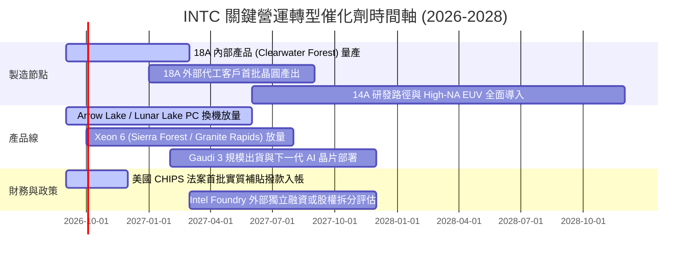

### 9.2 TAM 市場規模分析

```
╔══════════════════════════════════════════════════════════════╗
║              INTC 目標潛在市場 (TAM) 2027-2028 展望          ║
╠══════════════════════════════════════════════════════════════╣
║                                                              ║
║  PC 與邊緣運算晶片 TAM： ~$55B   英特爾市佔 ~65%  貢獻 ~$35B ║
║  資料中心 CPU & 基礎設施：~$45B   英特爾市佔 ~60%  貢獻 ~$27B ║
║  AI 加速晶片與網通 TAM： ~$120B  英特爾市佔  ~3%  貢獻  ~$4B ║
║  先進晶圓代工市場 TAM：  ~$110B  英特爾市佔  ~5%  貢獻  ~$6B ║
║                                                              ║
║  總計可觸及市場規模：    ~$330B  英特爾預期份額： ~$72B      ║
╚══════════════════════════════════════════════════════════════╝
```

### 9.3 成長驅動力結構圖

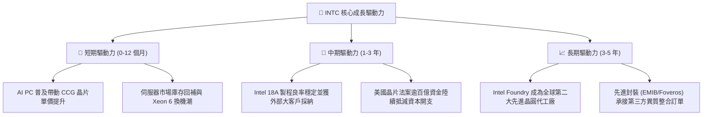

---

## 10. 風險矩陣

### 10.1 風險評分矩陣

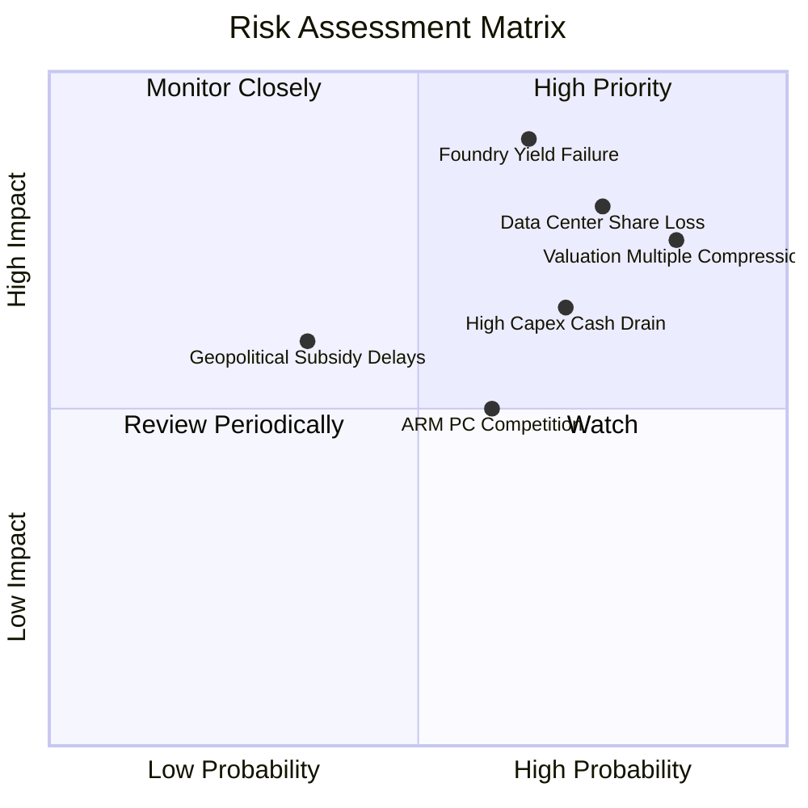

### 10.2 風險清單詳細分析

| # | 風險項目 | 發生機率 | 財務衝擊 | 風險評分 | 緩解措施與對策 |
|---|----------|----------|----------|----------|----------------|
| 1 | 🔴 **18A 代工良率落後** | 高 (65%) | 極高 (-20% 營收) | 🔴 **9.1/10** | 內部產品優先試產以吸收固定成本，必要時持續外包台積電以維持產品競爭力。 |
| 2 | 🔴 **伺服器份額加速流失** | 高 (75%) | 高 (-15% 營收) | 🔴 **8.5/10** | 加速發布能效核（Sierra Forest）架構，鎖定超大規模雲端服務商（CSP）特定工作負載。 |
| 3 | 🔴 **估值倍數劇烈收縮** | 極高 (85%) | 高 (-30% 股價) | 🔴 **8.8/10** | 強化財測透明度，透過削減非核心資產與控制 Capex 提升自由現金流。 |
| 4 | 🟡 **沉重資本開支失血** | 中高 (70%) | 中高 (FCF轉負) | 🟡 **7.2/10** | 與 Brookfield 等民間資本合資建廠（SCIP 模型），分散資本負擔。 |
| 5 | 🟡 **ARM 架構 PC 蠶食** | 中等 (60%) | 中度 (-8% CCG營收)| 🟡 **6.0/10** | 聯合微軟深化 Windows on x86 的 AI 生態優化，提升 Core Ultra 之電池續航表現。 |

---

## 11. 投資建議

### 11.1 最終綜合評級雷達圖

```
╔══════════════════════════════════════════════════════════════╗
║                 INTC 綜合維度能力診斷                        ║
╠══════════════════════════════════════════════════════════════╣
║ 財務健康度     6.0 ▓▓▓▓▓▓▓▓▓▓▓▓░░░░░░░░  現金充裕但負債沈重 ║
║ 營收成長性     6.5 ▓▓▓▓▓▓▓▓▓▓▓▓▓░░░░░░░  Q2 出現強勁反彈    ║
║ 獲利含金量     4.0 ▓▓▓▓▓▓▓▓░░░░░░░░░░░░  GAAP 淨利巨虧      ║
║ 資本配置效率   5.5 ▓▓▓▓▓▓▓▓▓▓▓░░░░░░░░░  砍股利保留現金     ║
║ 護城河壁壘     6.2 ▓▓▓▓▓▓▓▓▓▓▓▓░░░░░░░░  x86 專利強但製造弱 ║
║ 估值吸引力     3.5 ▓▓▓▓▓▓▓░░░░░░░░░░░░░  現價透支上行空間   ║
╠══════════════════════════════════════════════════════════════╣
║ 綜合投資評級   5.7 ▓▓▓▓▓▓▓▓▓▓▓░░░░░░░░░  🟡 觀望 / 持有     ║
╚══════════════════════════════════════════════════════════════╝
```

### 11.2 目標價與隱含報酬率

| 情境 | 目標價格 | 隱含報酬率（vs $102.94） | 機率權重 | 核心驅動事件 |
|------|----------|--------------------------|----------|--------------|
| 🔴 **悲觀情境** | **$52.23** | **-49.3%** | 25% | 18A 良率不如預期，伺服器市佔再掉 5pp，獲利低迷 |
| 🟡 **基準情境** | **$78.10** | **-24.1%** | 55% | 營收維持 9% 增長，利潤率緩步回升至 18%，估值均值回歸 |
| 🟢 **樂觀情境** | **$112.45** | **+9.2%** | 20% | 18A 獲 NVIDIA 或 Apple 外部代工大單，獲利爆發性復甦 |
| **加權預期價值**| **$78.50** | **-23.7%** | 100% | 12 個月預期風險回報嚴重不對稱 |

### 11.3 買入時機與觸發因素

```
╔══════════════════════════════════════════════════════════════════╗
║                  ✅ 買入 / 賣出 觸發因素 Checklist               ║
╠══════════════════════════════════════════════════════════════════╣
║                                                                  ║
║  立即買入觸發條件（需多數符合）：                                ║
║  ☐ 股價回落至加權價值折價區間（$55.00 – $65.00，MOS ≥ 20%）      ║
║  ☐ 官方確認 Intel 18A 正式敲定一家一線非關聯外部大客戶商業訂單   ║
║  ☐ GAAP 淨利率轉正且連兩季維持在 10% 以上                        ║
║                                                                  ║
║  加碼觸發條件（出現以下任一）：                                  ║
║  ☐ Intel Foundry 季度營收突破 $6B 且虧損縮小 50%                 ║
║  ☐ 季度 FCF 超過 $3.0B 且維持常態化                              ║
║                                                                  ║
║  減碼 / 停損觸發條件（出現以下任一）：                           ║
║  ☒ 股價上衝超過 $115.00（完全透支樂觀情境內在價值）              ║
║  ☒ 18A 製程量產時程宣布遞延超過 2 個季度                         ║
║  ☒ 季度營業現金流再度轉負或流動比率跌破 1.20                     ║
╚══════════════════════════════════════════════════════════════════╝
```

### 11.4 投資人適配度分析

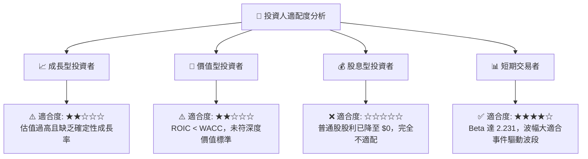

### 11.5 每季財報監控清單（Quarterly Watch List）

| 關鍵指標 | 追蹤核心原因 | 🟢 觸發加碼門檻 | 🔴 觸發減碼/停損門檻 |
|----------|--------------|-----------------|----------------------|
| **CCG 營收與營業利益率** | 支撐轉型期的主要現金牛 | 營收 >$9.5B 且利潤率 >28% | 營收 <$7.5B 或利潤率 <20% |
| **Foundry 營運虧損額** | 衡量代工轉型之燒錢速度 | 單季虧損縮小至 <$1.5B | 單季虧損擴大至 >$3.0B |
| **季度資本支出 (Capex)** | 觀察現金流消耗與建廠進度 | Capex 降至 $3.5B 以下且進度正常 | Capex 暴增至 >$6.0B 且營收未增 |
| **18A 外部客戶訂單進展** | 決定長線 IDM 2.0 之成敗關鍵 | 正式宣布重大第三方訂單 | 宣布重大良率問題或延遲出貨 |
| **自由現金流 (FCF)** | 衡量內生自我造血能力 | 單季正向 FCF >$2.0B | 單季 FCF 轉為負數 <-$2.0B |

### 11.6 反面論證：什麼會證明論點錯誤（What Would Change My Mind）

```
╔══════════════════════════════════════════════════════════════════╗
║              ⚠️ 論點失效條件（Disconfirming Evidence）           ║
╠══════════════════════════════════════════════════════════════╣
║  本報告「觀望/偏空」論點在下列可量化條件出現時必須全面重新檢視： ║
║                                                                  ║
║  1. 外部頂級客戶結盟：Apple、Qualcomm 或 NVIDIA 正式宣布將       ║
║     旗艦晶片下單 Intel Foundry 18A/14A，且合約金額 >$50 億。     ║
║  2. 利潤率報復性擴張：因 18A 自製率提升使毛利率連續兩季突破 48%，║
║     且營業利益率重新跨越 22% 門檻。                              ║
║  3. 代工業務分拆獨立：管理層推動 Intel Foundry 分拆為獨立上市公司║
║     並引入主權基金注資，釋放內部晶片設計部門之真實估值。         ║
║  4. 自由現金流穩健修復：TTM FCF 突破 $12B，使當前股價之 FCF Yield║
║     提升至 3.0% 以上之健康水準。                                 ║
╚══════════════════════════════════════════════════════════════════╝
```

---
> **免責聲明**：本報告為 AI 自動生成之深度研究分析，所引述之數據與估值模型僅供學術與投資研究參考，不構成任何針對特定標的之買賣要約或投資建議。投資具有高度本金虧損風險，投資人應獨立評估市場環境並自行承擔決策風險。