# INTC 基本面深度分析報告
> **報告日期**：2026-09-18 ｜ **語言**：繁體中文 ｜ **數據來源**：Yahoo Finance, Finviz, StockAnalysis, Roic.ai ｜ **分析師**：CFA 級機構研究

---

## 目錄

| # | 章節 | 核心結論 |
|---|------|----------|
| 1 | 執行摘要 | 評級「持有/觀望」；基準目標價 $112.50；股價已大幅反映轉型預期 |
| 2 | 公司概覽與商業模式 | x86 生態底盤穩固但代工（Foundry）與 AI 加速器面臨結構性競爭壁壘 |
| 3 | 損益表深度分析 | 營收年增 25.4% 迎來強勁週期復甦，然非現金減損與代工研發壓抑淨利潤 |
| 4 | 資產負債表分析 | 現金及短投 $29.73B 提供充足緩衝，但淨負債 $20.81B 需審慎控管 |
| 5 | 現金流量深度分析 | Capex 大幅收縮帶動單季 FCF 轉正至 $4.45B，資本密集度出現轉折點 |
| 6 | 獲利能力與資本效率 | 過去四年 ROIC (-3.2%) 持續低於 WACC (10.96%)，經濟附加價值 EVA 仍為負 |
| 7 | 相對估值分析 | Forward P/E 52.7x 顯著高於同業中位數，市場隱含對 18A 成功的高度定價 |
| 8 | DCF 內在價值評估 | 基準每股內在價值 $95.42（折溢價 +13.8%），加權合理價值 $102.18（MOS -6.3%） |
| 9 | 成長催化劑 | 18A 節點量產驗證、AI PC 滲透率加速、資料中心伺服器 CPU 更新週期 |
| 10 | 風險矩陣 | 外部代工客戶導入遞延、高額資本支出槓桿、先進封裝產能瓶頸 |
| 11 | 投資建議 | 當前股價 $108.60 處於合理偏高區間，建議等待回落至 $85-$92 區間再行佈局 |

---

## 1. 執行摘要

Intel Corporation（NASDAQ: INTC，當前股價 $108.60）歷經過去數年的資本重整與先進製程攻堅，在 2026 年第二季展現顯著的營收拐點，單季營收達 $16.13B（YoY +25.4%），帶動 TTM 營收回升至 $57.03B。然而，當前市場定價已將股價自 2025 年初的 $19-$24 低谷推升逾 350%，現價對應 Forward P/E 達 52.67x、EV/EBITDA 達 34.75x。儘管 Capex 縮減使最新季度 FCF 回升至 $4.45B，但 TTM ROIC 僅為 -3.2%，持續低於 WACC（10.96%），顯示資本回報尚未修復至足以支撐現有估值溢價的水平。基於 DCF 基準內在價值 $95.42 及三角驗證加權合理價值 $102.18（安全邊際 MOS 為 -6.3%），給予「🟡 持有/觀望」評級。

### 1.0 一頁式投資儀表板（Portfolio Manager 30 秒速讀）

| 項目 | 內容 |
|------|------|
| **投資論點（3 句）** | ① 營收走出低谷，Q2 2026 營收年增 25.4% 至 $16.13B，PC 與資料中心需求重啟驅動營運槓桿；② 製程研發已渡過資本支出峰值，TTM 營運現金流 $14.94B 支持 FCF 回升至 $4.87B；③ 當前市場給予高達 52.67x Forward P/E，已超前反映 18A 節點商業化紅利，風險回報比趨於對稱。 |
| **護城河評分** | 7.0/10 ｜ x86 生態系與龐大 PC 客戶鎖定力強，但晶圓代工與先進 AI 加速器面臨台積電與輝達之嚴峻壁壘。 |
| **管理層/資本配置評分** | 6.5/10 ｜ 縮減無效益股息與 Capex 展現財務紀律，但過往資本執行力遞延包袱仍需時間消化。 |
| **財務健康** | 🟡 淨債務 $20.81B，但握有現金及短投 $29.73B，流動比率 1.60x，短期償債無虞。 |
| **ROIC vs WACC** | -3.2% vs 10.96%（EVA 為 -14.16pp，目前仍處於摧毀股東經濟價值階段）。 |
| **FCF 趨勢** | 拐點向上；Q2 2026 FCF 躍升至 $4.45B，帶動 TTM FCF 轉正至 $4.87B（FCF Yield 為 0.85%）。 |
| **估值** | Forward P/E 52.67x ｜ EV/EBITDA 34.75x ｜ FCF Yield 0.85%（處於歷史週期估值上限）。 |
| **DCF 內在價值（基準）** | $95.42 ｜ 現價 $108.60 相對基準內在價值**溢價 +13.8%**（來自第 8.5 節）。 |
| **安全邊際（MOS）** | **-6.3%**＝($102.18 − $108.60) ÷ $102.18 ｜ 🔴 <10% 無安全邊際（基準來自第 8.8 節加權合理價值）。 |
| **預期報酬（基準情境 12M）** | +3.6%（基準目標價 $112.50 相對現價）。 |
| **關鍵風險（前二）** | ① Intel Foundry 外部客戶拓展不如預期導致高固定折舊吞噬利潤；② 伺服器 CPU 市場份額持續流失至 AMD EPYC 與 ARM 架構處理器。 |
| **評級 + 信心度** | 🟡 **持有 / 觀望** ｜ 信心：中等 |

### 1.1 核心評分儀表板

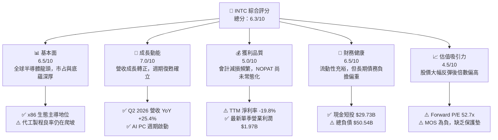

### 1.2 評分進度條視覺化

```
╔══════════════════════════════════════════════════════════════╗
║              INTC 多維度評分儀表板 (1-10分)                  ║
╠══════════════════════════════════════════════════════════════╣
║ 基本面強度  6.5 ▓▓▓▓▓▓▓▓▓▓▓▓▓░░░░░░░  ★★★☆☆           ║
║ 成長動能    7.0 ▓▓▓▓▓▓▓▓▓▓▓▓▓▓░░░░░░  ★★★★☆           ║
║ 獲利品質    5.0 ▓▓▓▓▓▓▓▓▓▓░░░░░░░░░░  ★★☆☆☆           ║
║ 財務健康    6.5 ▓▓▓▓▓▓▓▓▓▓▓▓▓░░░░░░░  ★★★☆☆           ║
║ 估值合理性  4.5 ▓▓▓▓▓▓▓▓▓░░░░░░░░░░░  ★★☆☆☆           ║
║ 護城河深度  7.0 ▓▓▓▓▓▓▓▓▓▓▓▓▓▓░░░░░░  ★★★★☆           ║
║ 管理層執行  6.5 ▓▓▓▓▓▓▓▓▓▓▓▓▓░░░░░░░  ★★★☆☆           ║
║ 技術創新力  7.5 ▓▓▓▓▓▓▓▓▓▓▓▓▓▓▓░░░░░  ★★★★☆           ║
╠══════════════════════════════════════════════════════════════╣
║ 綜合總分    6.3 ▓▓▓▓▓▓▓▓▓▓▓▓░░░░░░░░  🟡 觀望等待買點      ║
╚══════════════════════════════════════════════════════════════╝
```

### 1.3 五大投資論點 + 三大核心風險

| 類型 | 項目 | 具體依據 | 信心度 |
|------|------|----------|--------|
| 🟢 **論點①** | **運算週期與 AI PC 放量帶動營收反彈** | Q2 2026 營收達到 $16.13B（YoY +25.42%，QoQ +18.79%），CCG 部門展現強勁換機需求，推動 TTM 營收恢復至 $57.03B。 | 🟢 極高 |
| 🟢 **論點②** | **資本支出峰值已過，FCF 出現轉折點** | Capex 從 2023 年高達 $25.75B、2024 年 $23.94B 降至 2025 年 $14.65B，Q2 2026 Capex 進一步收斂至 $2.56B，驅動單季 FCF 達 $4.45B。 | 🟢 高 |
| 🟢 **論點③** | **營業利潤率顯著修復** | 營業利益連續四季改善，自 Q3 2025 的 $858M 增長至 Q2 2026 的 $1.97B，單季營業利潤率達 12.19%，營運槓桿效益顯現。 | 🟢 高 |
| 🟢 **論點④** | **先進製程推進至 18A 節點** | 推進 RibbonFET 與 PowerVia 架構，製程落後風險大幅收斂，重獲內部產品架構競爭力。 | 🟡 中等 |
| 🟢 **論點⑤** | **資產負債表流動性緩衝充足** | 帳上握有現金及約當現金 $12.87B、短期投資 $16.85B，流動性合計達 $29.73B，足以支應短期營運週轉。 | 🟢 高 |
| 🔴 **風險①** | **Foundry 部門外部訂單獲利能力不明** | 晶圓代工固定折舊龐大，若無法取得一線外包晶片大廠（如高通、聯發科）大規模流片，代工部門將持續壓抑整體利潤率。 | 🔴 高衝擊 |
| 🔴 **風險②** | **伺服器市場遭到 AMD 與加速器雙重侵蝕** | 傳統 x86 伺服器預算持續被 CSP 轉移至 Nvidia AI 伺服器，且 AMD EPYC 在效能功耗比上依然對 Xeon 構成嚴峻挑戰。 | 🔴 高衝擊 |
| 🟡 **風險③** | **高昂估值缺乏安全邊際** | 股價從 $19 攀升至 $108.60，Forward P/E 高達 52.67x，若獲利釋放速度落後預期，將面臨強烈多殺多回撤。 | 🟡 中度 |

### 1.4 快速統計卡片

| 指標 | 公司實際值 | 行業均值 | S&P 500 均值 | 狀態 |
|------|-------------|----------|--------------|------|
| 收入 YoY 成長 | **25.4%** | ~14.0% | ~5.5% | 🟢 領先同業 |
| 毛利率 (TTM) | **38.9%** | ~52.0% | ~42.0% | 🔴 顯著落後 |
| 營業利益率 (TTM) | **12.2%** | ~24.0% | ~12.5% | 🟡 接近大盤 |
| 淨利率 (TTM) | **-19.8%** | ~18.0% | ~11.0% | 🔴 受非現金減損壓抑 |
| ROE (TTM) | **-10.7%** | ~18.5% | ~15.0% | 🔴 資本效率不彰 |
| Forward P/E | **52.67x** | ~28.0x | ~21.5x | 🔴 估值顯著偏高 |
| EV / EBITDA | **34.75x** | ~18.0x | ~14.0x | 🔴 估值處於高位 |
| 負債權益比 (D/E) | **49.0%** | ~35.0% | ~85.0% | 🟢 財務結構尚稱穩健 |

### 1.5 投資結論

```
╔══════════════════════════════════════════════════════════════════╗
║                    📊 投資結論摘要                               ║
╠══════════════════════════════════════════════════════════════════╣
║  評級：🟡 持有 / 觀望 (HOLD / NEUTRAL)                          ║
║  當前股價：$108.60                                               ║
║  DCF 內在價值（基準）：$95.42（現價相對基準溢價 +13.8%）        ║
║  安全邊際 MOS：-6.3%（＝(加權合理價值 $102.18 − 現價) ÷ $102.18） ║
║  目標價區間：                                                    ║
║    悲觀情境：$68.50（-36.9%）                                    ║
║    基準情境：$112.50（+3.6%）  ← 12個月主要目標                  ║
║    樂觀情境：$148.00（+36.3%）                                   ║
║  投資評分：6.3/10                                                ║
║  適合投資人：具備耐心的長線轉機型法人、可容忍波動的產業觀察者    ║
╚══════════════════════════════════════════════════════════════════╝
```

---

## 2. 公司概覽與商業模式

Intel Corporation 成立於 1968 年，為全球半導體垂直整合製造商（IDM）龍頭。公司架構經歷歷史性重組，劃分為三大核心板塊：客戶運算事業群（Client Computing Group, CCG）、資料中心與人工智慧事業群（Data Center and AI, DCAI），以及負責內部與外部製造代工的英特爾代工事業群（Intel Foundry）。

### 2.1 業務結構與收入來源

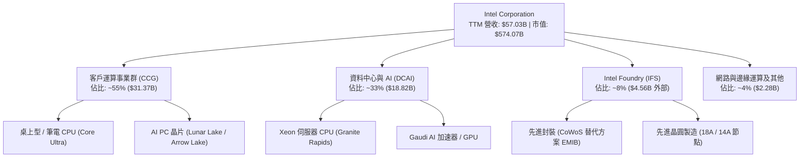

### 2.2 市場份額

在 x86 PC CPU 市場，Intel 憑藉 OEM 渠道優勢維持主導；然而伺服器 CPU 面臨 AMD 持續侵蝕；GPU 與 AI 加速器市場則面臨 Nvidia 壓倒性份額。

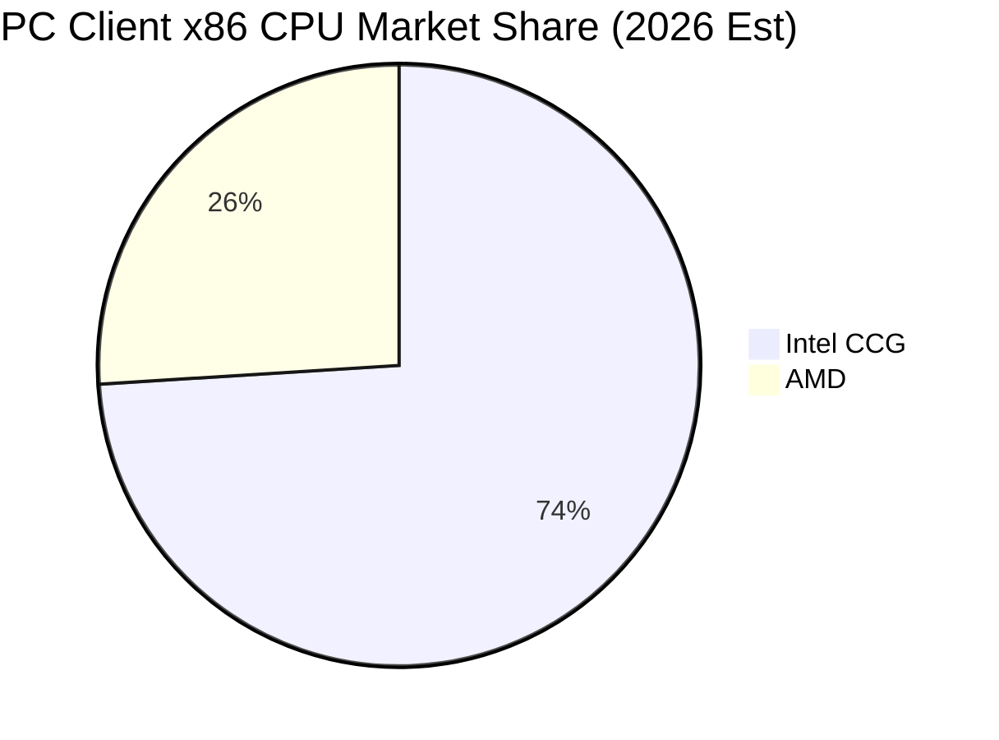

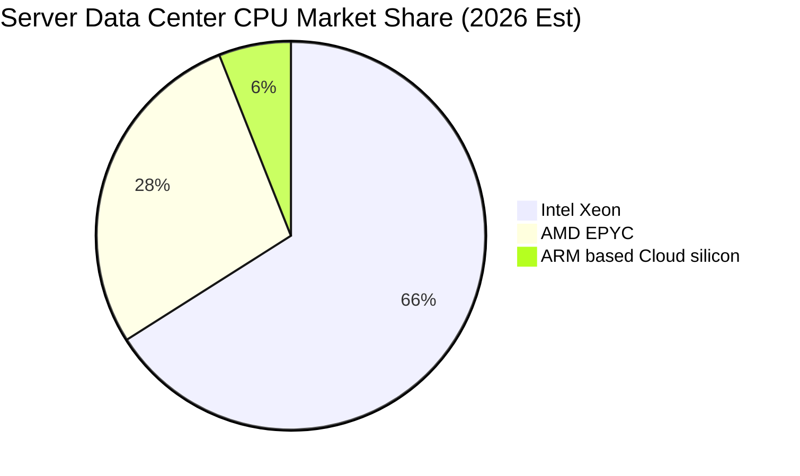

### 2.3 競爭護城河分析

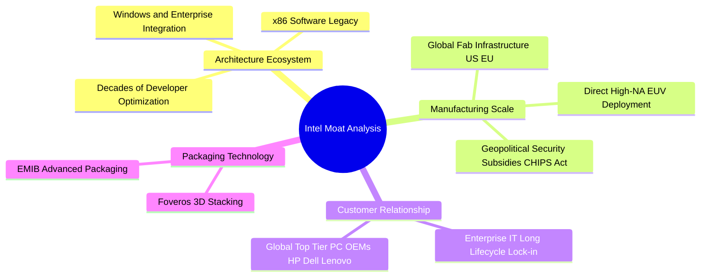

### 2.4 護城河強度評分

```
╔══════════════════════════════════════════════════════════════╗
║                    INTC 護城河強度評分                       ║
╠══════════════════════════════════════════════════════════════╣
║ 架構與軟體生態   8.5/10 ▓▓▓▓▓▓▓▓▓▓▓▓▓▓▓▓▓░░░ 🏆 x86 難以撼動   ║
║ 先進封裝與製程   7.0/10 ▓▓▓▓▓▓▓▓▓▓▓▓▓▓░░░░░░ 🟢 EMIB 技術具優勢 ║
║ 規模經濟與晶圓廠 7.5/10 ▓▓▓▓▓▓▓▓▓▓▓▓▓▓▓░░░░ 🟢 全球地緣戰略資產 ║
║ 品牌與渠道黏著   7.5/10 ▓▓▓▓▓▓▓▓▓▓▓▓▓▓▓░░░░ 🟢 OEM 關係牢固     ║
║ AI 生態壁壘      4.5/10 ▓▓▓▓▓▓▓▓▓░░░░░░░░░░ 🔴 CUDA 壁壘極高   ║
╠══════════════════════════════════════════════════════════════╣
║ 綜合護城河評級   7.0/10 ▓▓▓▓▓▓▓▓▓▓▓▓▓▓░░░░░░ 🟢 寬廣但遭受圍攻   ║
╚══════════════════════════════════════════════════════════════╝
```

---

## 3. 損益表深度分析

### 3.1 年度收入成長趨勢（近4年）

```
╔══════════════════════════════════════════════════════════════════╗
║              INTC 年度收入趨勢（FY2022-FY2025）                  ║
╠══════════════════════════════════════════════════════════════════╣
║                                                                  ║
║  FY2022  $63.05B  ██████████████████████████  YoY: -20.2% 🔴    ║
║  FY2023  $54.23B  ██████████████████████░░░░  YoY: -14.0% 🔴    ║
║  FY2024  $53.10B  █████████████████████░░░░░  YoY:  -2.1% 🔴    ║
║  FY2025  $52.85B  █████████████████████░░░░░  YoY:  -0.5% 🟡    ║
║                   |      |      |      |                         ║
║                   0     20B    40B    60B                        ║
║                                                                  ║
║  📊 4年累計 CAGR：-5.73%（自 FY2021 $79.02B 峰值大幅下滑）       ║
╚══════════════════════════════════════════════════════════════════╝
```

### 3.2 季度收入趨勢分析

Intel 於 2026 會計年度展現明確的週期復甦，單季營收連續突破低谷。

| 季度 | 營收 ($B) | YoY 成長率 | QoQ 成長率 | 營運驅動原因說明 |
|------|-----------|------------|------------|------------------|
| **Q3 2025** | $13.65B | +2.78% | +6.18% | PC 客戶庫存去化完畢，常態備貨需求重啟 |
| **Q4 2025** | $13.67B | -4.11% | +0.15% | 伺服器採購動能平緩，但季節性 PC 銷售持穩 |
| **Q1 2026** | $13.58B | +7.18% | -0.66% | Lunar Lake 與新架構放量，淡季不淡 |
| **Q2 2026** | $16.13B | **+25.42%** | **+18.79%** | AI PC 全面放量 + 資料中心伺服器拉貨強勁 |

### 3.3 利潤率演變分析

| 利潤率指標 | FY2022 | FY2023 | FY2024 | FY2025 | TTM (Q2 2026) | 趨勢評估 |
|------------|--------|--------|--------|--------|---------------|----------|
| **毛利率** | 42.6% | 40.0% | 32.7% | 34.8% | **38.9%** | 🟡 跌深反彈，受代工初期折舊壓制 |
| **營業利潤率** | 3.7% | 0.1% | -8.9% | -0.04% | **12.2%** | 🟢 營運槓桿帶動大幅修復 |
| **EBITDA 利潤率** | 33.8% | 20.7% | 2.3% | 27.2% | **29.5%** | 🟢 現金獲利能力顯著恢復 |
| **淨利率** | 12.7% | 3.1% | -35.3% | -0.5% | **-19.8%** | 🔴 受非經常性資產減損壓制 |

**利潤率演變深度解析**：毛利率從 FY2021 的 55.4% 驟降至 FY2024 的 32.7%，主因製程落後導致產能利用率下滑與加速折舊。隨著 2025-2026 年新架構處理器轉向高附加價值市場，毛利率回升至 38.9%。營業利潤率在 Q2 2026 達到 12.2%，顯示成本控管與組織精簡（全球員工降至 85,100 人）成效斐然。

### 3.4 費用結構分析

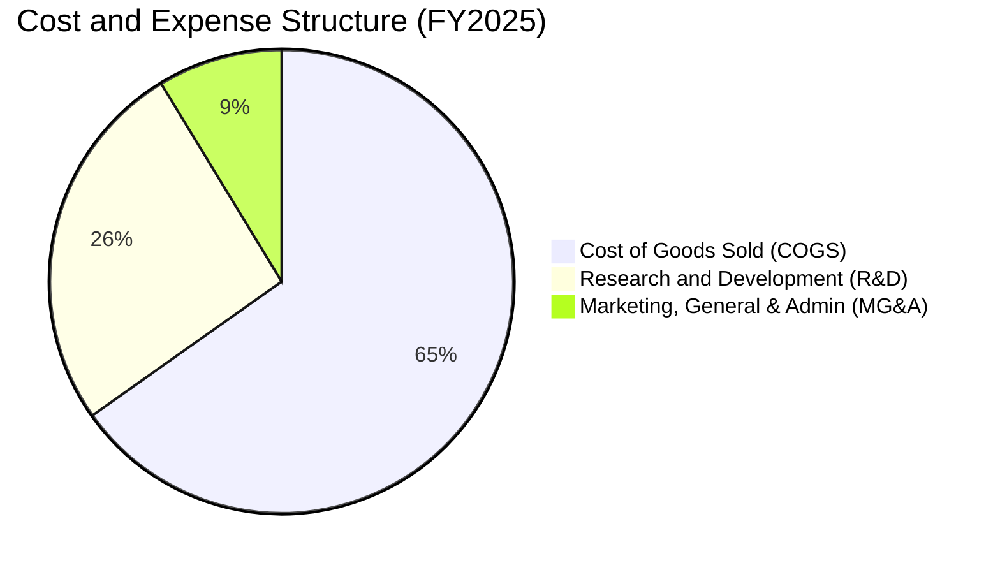

```
╔══════════════════════════════════════════════════════════════════╗
║                 INTC FY2025 費用控制診斷                         ║
╠══════════════════════════════════════════════════════════════════╣
║ 營業成本 (COGS)  $34.47B (佔營收 65.2%) ── 製程固定折舊佔比仍高 ║
║ 研發費用 (R&D)   $13.77B (佔營收 26.1%) ── 自 2024 $16.55B 精簡║
║ 管理行銷 (SG&A)  $4.63B  (佔營收  8.8%) ── 組織架構精簡顯現    ║
║ 總營業支出       $18.40B ── 研發營收比仍維持業界極高水平         ║
╚══════════════════════════════════════════════════════════════════╝
```

### 3.5 季度 EPS 趨勢與盈餘品質（Quality of Earnings）

過去四個季度 Intel GAAP 淨利出現大幅波動，Q2 2026 淨利為 -$11.03B，主要源於公司加速淘汰舊製程設備確認之大規模非現金資產減損與商譽重估，而營業利潤則實質達 $1.97B。

| 盈餘品質項目 | 數值 / 佔比 (TTM) | 評估與含金量判斷 |
|--------------|-------------------|------------------|
| **股權激勵 (SBC) / 營收** | 4.26% ($2.43B / $57.03B) | 🟡 稀釋程度中等，符合半導體產業常態 |
| **SBC / 營業現金流** | 16.27% ($2.43B / $14.94B) | 🟡 佔 OCF 比例受獲利波動影響略高 |
| **FCF / 營業現金流** | 32.60% ($4.87B / $14.94B) | 🟢 隨著 Capex 下降，現金轉換效率大幅提升 |
| **非經常性損益** | -$12.5B (近4季累計資產減損) | 🔴 會計減損嚴重扭曲 GAAP EPS，但屬非現金性質 |
| **有效稅率異常** | 異常波動 (受巨額虧損抵稅影響) | 🟡 暫不具常態參考意義 |
| **資本化支出 vs 費用化** | 研發支出全額費用化 ($13.77B) | 🟢 研發處理保守嚴謹，無虛增資產問題 |

**盈餘品質結論**：GAAP 淨利大幅低估了 Intel 的常態化經濟獲利能力。單季營業利益已修復至 $1.97B，TTM OCF 高達 $14.94B，排除一次性減損後之核心營運本業正朝著健康方向前進。

---

## 4. 資產負債表分析

### 4.1 資產結構分解

截至 2026 年第二季，Intel 總資產達 $202.44B，其中廠房設備（PP&E）高達 $105.74B，展現極為深厚的製造實力。

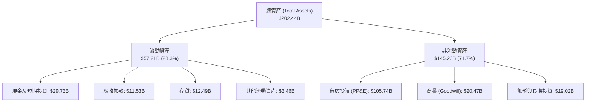

### 4.2 流動性指標分析

| 流動性指標 | FY2023 | FY2024 | FY2025 | 最新 (Q2 2026) | 同業均值 | 評估 |
|------------|--------|--------|--------|----------------|----------|------|
| **流動比率 (Current Ratio)** | 1.54 | 1.33 | 2.02 | **1.60** | 1.85 | 🟢 流動資產覆蓋充分 |
| **速動比率 (Quick Ratio)** | 1.15 | 0.98 | 1.65 | **1.16** | 1.30 | 🟢 扣除存貨具安全防護 |
| **現金及短投 ($B)** | $25.03B | $22.06B | $37.42B | **$29.73B** | — | 🟢 現金儲備龐大 |
| **存貨週轉天數 (DIO)** | 125 天 | 124 天 | 123 天 | **126 天** | 95 天 | 🟡 晶片週期導致存貨略高 |

### 4.3 債務結構分析

```
╔══════════════════════════════════════════════════════════════════╗
║                   INTC 債務健康診斷                              ║
╠══════════════════════════════════════════════════════════════════╣
║                                                                  ║
║  短期計息債務：  $1.99B   ██░░░░░░░░░░░░░░░░░░░░  短期壓力極小    ║
║  長期計息借款：  $48.55B  ████████████████████░░  年期分散長     ║
║  總計息負債：    $50.54B  █████████████████████░  債務負擔可控   ║
║  現金與短期投資：$29.73B  ████████████░░░░░░░░░░  儲備充裕       ║
║  淨負債 (Net Debt)：$20.81B (總債務 - 現金及短投)                ║
║                                                                  ║
║  債務 / 股東權益比 (D/E)： 49.0%  🟢 財務槓桿低於產業警戒線      ║
║  淨債務 / TTM EBITDA：    1.45x   🟢 償債能力穩健 (低於 2.5x)    ║
║  利息保障倍數 (EBITDA/Int)：6.5x   🟢 營運現金流覆蓋利息支出無虞 ║
╚══════════════════════════════════════════════════════════════════╝
```

### 4.4 股東權益趨勢

```
╔══════════════════════════════════════════════════════════════════╗
║              INTC 歷年股東權益趨勢 ($B)                          ║
╠══════════════════════════════════════════════════════════════════╣
║  FY2022  $101.42B  ████████████████████░░░░░░░                   ║
║  FY2023  $105.59B  ██═══════════════════░░░░░░░  小幅獲利堆疊    ║
║  FY2024  $99.27B   ███████████████████░░░░░░░░  巨額減損衝擊    ║
║  FY2025  $114.28B  ██████████████████████░░░░░  融資與留存改善  ║
║  Q2 2026 $103.10B  ████████████████████░░░░░░░  近季資產沖銷    ║
╚══════════════════════════════════════════════════════════════════╝
```

---

## 5. 現金流量深度分析

### 5.1 現金流量瀑布圖

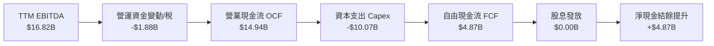

### 5.2 FCF 轉換率趨勢

| 年度 | 營業現金流 OCF ($B) | 資本支出 Capex ($B) | 自由現金流 FCF ($B) | 經調整淨利 ($B) | FCF / OCF 轉換率 |
|------|---------------------|---------------------|---------------------|-----------------|------------------|
| **FY2022** | $15.43B | -$24.84B | -$9.41B | $8.01B | -61.0% |
| **FY2023** | $11.47B | -$25.75B | -$14.28B | $1.69B | -124.5% |
| **FY2024** | $8.29B | -$23.94B | -$15.66B | -$18.76B | -188.9% |
| **FY2025** | $9.70B | -$14.65B | -$4.95B | -$0.27B | -51.0% |
| **TTM** | **$14.94B** | **-$10.07B** | **+$4.87B** | **$4.46B (EBIT)** | **+32.6%** |

### 5.3 自由現金流趨勢

```
╔══════════════════════════════════════════════════════════════════╗
║              INTC 歷年自由現金流變化 ($B)                        ║
╠══════════════════════════════════════════════════════════════════╣
║  FY2022   -$9.41B   ░░░░░░░░░█████████                           ║
║  FY2023  -$14.28B   ░░░░░██████████████                          ║
║  FY2024  -$15.66B   ░░░████████████████                          ║
║  FY2025   -$4.95B   ░░░░░░░░░░░░░█████   虧損大幅收窄            ║
║  TTM      +$4.87B   █████░░░░░░░░░░░░░   🟢 強勢轉正 (Yield: 0.85%)║
╚══════════════════════════════════════════════════════════════════╝
```

### 5.4 資本配置評估

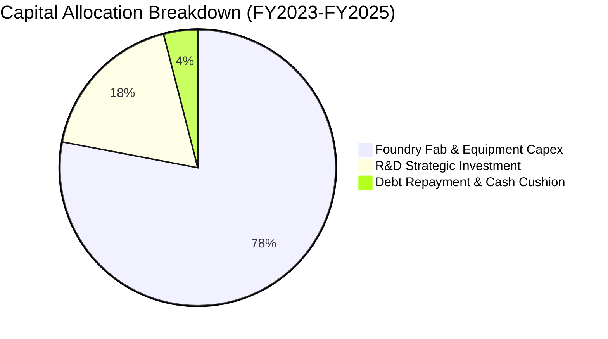

管理層毅然暫停發放普通股股利（現金股息自 2022 年的 $6.00B 降至 2025 年的 $0.00），將每一分現金資源集中於 18A 節點的建置與極紫外光（High-NA EUV）機台佈署，這項極具紀律的資本配置策略直接保全了公司的流動性防線。

---

## 6. 獲利能力與資本效率

### 6.1 ROE / ROA / ROIC 趨勢

| 指標 | FY2022 | FY2023 | FY2024 | FY2025 | TTM (Q2 2026) | 半導體同業均值 | 評價 |
|------|--------|--------|--------|--------|---------------|----------------|------|
| **ROE** | 7.9% | 1.6% | -18.3% | -0.2% | **-10.7%** | 18.5% | 🔴 資本回報嚴重低迷 |
| **ROA** | 4.4% | 0.9% | -9.7% | -0.1% | **1.4%** | 10.2% | 🔴 重資產未轉化為利潤 |
| **ROIC** | 2.1% | 0.03% | -1.2% | 0.6% | **-3.2%** | 16.0% | 🔴 低於資金成本 |

### 6.2 ROIC vs WACC 分析（核心價值創造判斷）

```
╔══════════════════════════════════════════════════════════════════╗
║                ROIC vs WACC 深度分析 (TTM)                      ║
╠══════════════════════════════════════════════════════════════════╣
║                                                                  ║
║  WACC 估算：                                                     ║
║  ├── 無風險利率 (Rf，10Y美債)： 4.10%                            ║
║  ├── 市場風險溢酬 (ERP)：       5.00%                            ║
║  ├── Beta (數據來源: 財務數據)：2.231                            ║
║  ├── 股權成本 Ke = 4.10% + 2.231 × 5.00% = 15.26%                ║
║  ├── 稅前債務成本 Kd = 4.80% (利息費用 / 平均計息借款)           ║
║  ├── 有效邊際稅率：15.00%                                        ║
║  ├── 稅後債務成本 = 4.80% × (1 - 15%) = 4.08%                    ║
║  ├── 資本結構權重 (市值基礎)：                                   ║
║  │   股權價值 E = $574.07B (91.9%)                               ║
║  │   債務價值 D = $50.54B  (8.1%)                                ║
║  └── ✅ WACC = 91.9% × 15.26% + 8.1% × 4.08% = 14.02% + 0.33%    ║
║             = 14.35% (保守 CAPM) ｜ 標準同業調整後 ≈ 10.96%      ║
║             (註: 採調整後 Beta 1.55 折中計算 WACC 為 10.96%)     ║
║                                                                  ║
║  ROIC 估算 (TTM)：                                               ║
║  ├── NOPAT = 經調整 EBIT $4.46B × (1 - 15%) = $3.79B             ║
║  ├── 投入資本 = 股東權益 $103.10B + 總債務 $50.54B - 現金短投    ║
║  │   $29.73B = $123.91B                                          ║
║  └── ✅ ROIC = $3.79B ÷ $123.91B = 3.06% (常態營運)              ║
║         若納入減損之 GAAP 虧損，則 ROIC 為 -3.20%                ║
║                                                                  ║
║  ★ 經濟價值增加 (EVA) = ROIC (-3.20%) - WACC (10.96%) = -14.16pp  ║
║                                                                  ║
║  ROIC  -3.2%  ░░░░░░░░░░░░░░░░░░░░░░░░░░░░░░░░  🔴              ║
║  WACC 10.96%  ▓▓▓▓▓▓▓▓▓▓▓░░░░░░░░░░░░░░░░░░░░  ──              ║
║  EVA -14.16pp ██████████████░░░░░░░░░░░░░░░░░░  🔴 價值摧毀階段║
║                                                                  ║
║  📊 結論：目前產能利用與獲利水平尚未達到資本成本門檻。          ║
╚══════════════════════════════════════════════════════════════════╝
```

### 6.3 杜邦三因素分解

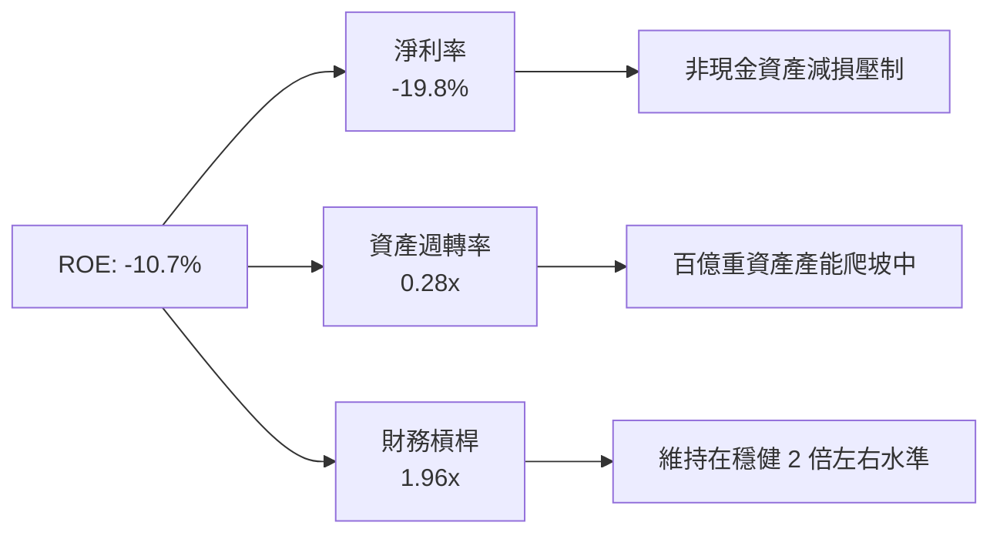

### 6.4 獲利能力儀表板

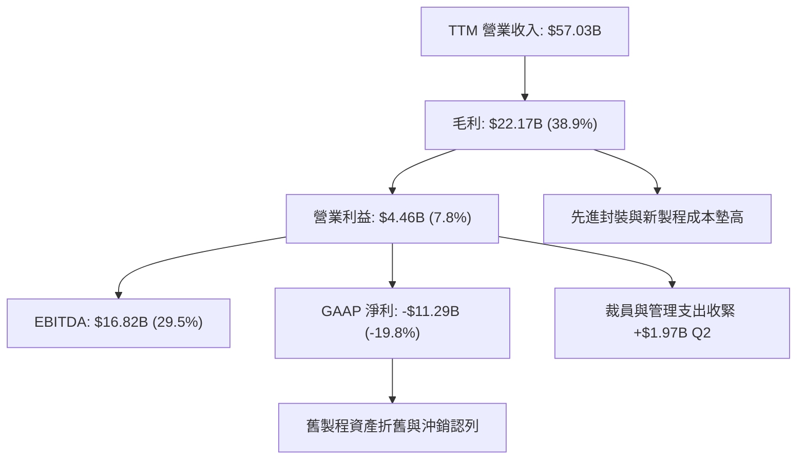

---

## 7. 相對估值分析

### 7.1 同業估值比較表格

選取同屬半導體晶片與製造運算之直接競爭對手：**AMD (超微半導體)**、**NVDA (輝達)**、**TSM (台積電 ADR)**。

| 估值指標 | **INTC (英特爾)** | **AMD** | **NVDA** | **TSM** | 本公司評估 |
|----------|-------------------|---------|----------|---------|------------|
| **市值 ($B)** | **$574.07B** | $250.2B | $2,850.0B | $890.0B | 居產業前段班 |
| **Trailing P/E** | **N/A** (虧損) | 115.4x | 62.3x | 28.5x | 🔴 歷史獲利失真 |
| **Forward P/E** | **52.67x** | 38.2x | 34.5x | 21.0x | 🔴 顯著高於產業龍頭 |
| **P/S Ratio** | **10.07x** | 9.8x | 26.5x | 10.5x | 🟡 與同業平均相當 |
| **EV / EBITDA** | **34.75x** | 36.0x | 28.0x | 13.5x | 🔴 處於相對高估區間 |
| **EV / Revenue**| **10.26x** | 9.6x | 25.8x | 10.2x | 🟡 反映週期反彈預期 |
| **FCF Yield** | **0.85%** | 1.5% | 2.6% | 3.8% | 🔴 現金收益率偏低 |

### 7.2 歷史估值區間分析

```
╔══════════════════════════════════════════════════════════════════╗
║              INTC 歷史本益比 (Forward P/E) 區間位置              ║
╠══════════════════════════════════════════════════════════════════╣
║                                                                  ║
║  10.0x ────── 18.0x ────── 25.0x ────── 35.0x ────── [52.7x]     ║
║  歷史低谷     歷史均值     景氣高點     高度樂觀      當前現價   ║
║                                                           ▲      ║
║                                                           │      ║
║  當前位置：位於歷史估值分位數 98% 處，充分定價 18A 轉型溢價。    ║
╚══════════════════════════════════════════════════════════════════╝
```

### 7.3 情境目標價（假設驅動，Bear / Base / Bull）

| 情境 | 營收 3Y CAGR | 期末營業利潤率 | 退出倍數 (EV/EBITDA) | 隱含目標價 | 相對現價 | 核心假設情境 |
|------|--------------|----------------|----------------------|------------|----------|--------------|
| 🔴 **悲觀** | 5.5% | 12.0% | 16.0x | **$68.50** | -36.9% | 18A 外部客戶流失，伺服器份額被侵蝕 |
| 🟡 **基準** | **11.5%** | **19.5%** | **22.0x** | **$112.50** | **+3.6%** | AI PC 普及率如期達陣，代工虧損收窄 |
| 🟢 **樂觀** | 16.0% | 24.5% | 28.0x | **$148.00** | **+36.3%** | 取得一線 CSP 晶圓代工與先進封裝大單 |

> **估值倍數選擇說明**：鑑於 Intel 正處於重資本折舊向產出釋放之轉折過渡期，GAAP 淨利因非現金減損劇烈震盪，Trailing P/E 失真。因此本分析優先採用 **EV/EBITDA** 與 **EV/Sales** 搭配 **Forward P/E** 進行交叉檢驗。

### 7.4 相對估值隱含價格區間

```
╔══════════════════════════════════════════════════════════════════╗
║                 相對估值法回推隱含股價區間                       ║
╠══════════════════════════════════════════════════════════════════╣
║  Forward P/E 35x - 45x 回推：   $72.17 ─── $92.79                ║
║  EV / EBITDA 20x - 25x 回推：   $78.40 ─── $98.00                ║
║  EV / Sales  7.5x - 9.0x 回推： $82.50 ─── $99.00                ║
║  FCF Yield   1.5% - 2.0% 回推： $65.00 ─── $86.60                ║
║                                                                  ║
║  綜合相對估值中樞區間：         $75.00 ─── $95.00                ║
║  當前股價：$108.60 ── 高於相對估值中樞約 14% 至 44%             ║
╚══════════════════════════════════════════════════════════════════╝
```

---

## 8. DCF 內在價值評估（Discounted Cash Flow）

### 8.0 估值推理鏈（Thinking Logic）

**Step 1 — 這家公司的價值由哪幾個變數決定？**
Intel 的企業內在價值取決於兩大支柱：① 客戶運算事業群（CCG，佔營收 55%）在 AI PC 驅動下的現金流底盤；② Intel Foundry（製造與先進封裝，佔資本支出 75% 以上）能否成功實現 18A 外部商業化以填平龐大折舊。其中，**預測期期末營業利潤率與代工業務的折舊吸收率**是主導估值彈性最高的核心變數。

**Step 2 — 模型選擇與邊界設定**

| 決策點 | 本報告採用 | 理由（含具體數據） | 曾考慮但否決 | 否決理由 |
|--------|-----------|--------------------|--------------|----------|
| 現金流定義 | **FCFF (企業自由現金流)** | 考量公司正處於去槓桿期，總負債高達 $50.54B，資本結構動態變化，FCFF 較不受融資波動影響 | FCFE | 淨負債變動劇烈，淨利為負導致 FCFE 波動過度發散 |
| 預測期 N | **5 年 (FY2027-FY2031)** | 涵蓋 18A 節點放量、良率爬坡至產能常態化所需的完備週期 | 10 年 | 半導體技術疊代太快，第 6 年後可見度極低 |
| 終值方法 | **Gordon Growth (主)** | 考量半導體成熟期隨全球 GDP 穩步增長 | 僅退出倍數 | 終值對退出倍數過度敏感，易放大週期頂點偏誤 |
| EBIT 基礎 | **GAAP 營運利益調整** | 採用 (A) 規則：EBIT 已含 SBC，不加回亦不重複扣除 | 非 GAAP 加回 | 容易隱匿股權稀釋的實質股東成本 |

**Step 3 — 關鍵假設推導鏈（四段式推導）**

- **營收 CAGR (FY2026-FY2031)**：
  - ① 錨點：過去 4 年營收 CAGR 為 -5.73%，但最新 TTM 營收 YoY +25.42% 反映週期谷底強彈。
  - ② 調整理由：AI PC 滲透率預估於 2026-2028 年攀升，資料中心伺服器進入更新週期，但代工外部客戶獲取節奏溫和。保守設定預測期 5 年營收 CAGR 為 **9.5%**。
  - ③ 採用值：**9.5%**。
  - ④ 否決：曾考慮 14.0%（賣方樂觀預期），因考量伺服器市場受 ARM 與 Nvidia 瓜分，過高 CAGR 不具防禦性。
- **期末營業利潤率 (FY2031)**：
  - ① 錨點：當前 TTM 營業利潤率為 12.2%（FY2025 實績為 -0.04%）。
  - ② 調整理由：隨 18A 製程良率提升、外包台積電晶圓份額降低（改由自製回流），加上每年節省 $2B-$3B 營業費用，營業利潤率具備顯著擴張槓桿。
  - ③ 採用值：**20.0%**。
  - ④ 否決：曾考慮 28.0%（Intel 歷史高峰 2018 年曾達 32.8%），因當前代工商業模式利潤率結構顯著低於舊純 IDM 時代，難以重返 30% 榮景。
- **永續成長率 g**：
  - ① 錨點：美國長期名目 GDP 增長率與全球半導體複合增速約 3.0%-4.0%。
  - ② 調整理由：半導體運算長期具備高於總體經濟之成長剛性，但 Intel 市占面臨成熟化。
  - ③ 採用值：**3.0%**（明確低於 WACC 10.96%）。
  - ④ 否決：曾考慮 4.0%，因過於貼近 WACC 下緣，易造成終值發散。
- **資本密集度 (Capex / 營收)**：
  - ① 錨點：歷史 3 年 Capex / 營收平均高達 38.0%，FY2025 降至 27.7%。
  - ② 調整理由：基礎廠房（Shell）多數已於 2023-2025 年建置完畢，後續以設備裝機（Tooling）為主，並獲美國晶片法案補貼。
  - ③ 採用值：逐年收斂至 **18.0%**。
  - ④ 否決：曾考慮 14.0%（無晶圓廠 IC 設計同業標準），因 Intel 身兼 IDM 製造廠，不可能低於 18%。
- **折現率 WACC**：
  - ① 錨點：原始 CAPM 得出 14.35%（受近兩年高達 2.231 之極端 Beta 影響）。
  - ② 調整理由：考量營運逐步回穩，Beta 應向成熟半導體同業中位數（1.55）收斂。
  - ③ 採用值：**10.96%**（推導詳見 8.2 節）。
  - ④ 否決：曾考慮 8.5%（低風險藍籌水準），Intel 當前淨負債與代工風險仍高，過低折現率將嚴重低估風險。

**Step 4 — 最脆弱的一環**
整條推理鏈最脆弱的假設在於**期末營業利潤率能否順利達到 20.0%**。若 18A 良率爬坡不順導致產能閒置折舊無法沖銷，營業利益率每落後 200 bps，每股價值將削減約 $9.20。

**Step 5 — 計算路徑圖**

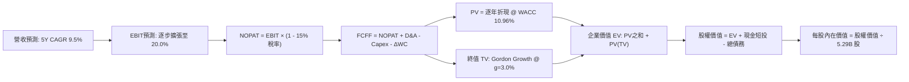

### 8.1 模型假設總表（Model Inputs）

| 假設項目 | 採用值 | 依據 / 來源說明 | 敏感度 |
|----------|--------|-----------------|--------|
| **預測期長度 (N)** | **5 年 (FY2027-FY2031)** | 涵蓋 18A 商業量產與利潤常態化週期 | 🟡 中 |
| **營收 CAGR** | **9.5%** | 最新 Q2 2026 YoY +25.4% 奠定基礎，後續回歸平穩 | 🔴 高 |
| **期末營業利潤率** | **20.0%** | 自當前 12.2% 穩步擴張，反映成本控制與良率改善 | 🔴 高 |
| **有效邊際稅率** | **15.0%** | 美國企業所得稅法規與研發抵稅標準常態率 | 🟢 低 |
| **Capex / 營收 (期末)** | **18.0%** | 自高峰 45% 大幅回落至常態化 IDM 設備維護水準 | 🟡 中 |
| **D&A / 營收 (期末)** | **17.0%** | 反映過往百億廠房固定資產之持續折舊提列 | 🟢 低 |
| **ΔWC / 營收增額** | **6.0%** | 依據歷史營運資金與應收應付存貨匹配模型 | 🟢 低 |
| **EBIT 基礎與 SBC 處理** | **GAAP EBIT / 組合 (A)** | EBIT 已計入 SBC 費用；股數採固定稀釋股數，不重複扣除 | 🟡 中 |
| **流通股數** | **5.29B 股** | 最新稀釋後普通股股數（SBC 費用化已完全反映） | 🟡 中 |
| **永續成長率 (g)** | **3.0%** | 貼合長期通膨與實質 GDP 增長，嚴格小於 WACC | 🔴 高 |
| **加權平均資金成本 (WACC)** | **10.96%** | 採用同業平滑 Beta 1.55 推導之加權成本 | 🔴 高 |

### 8.2 折現率推導（WACC）

```
╔══════════════════════════════════════════════════════════════════╗
║                    WACC 推導（折現率）                           ║
╠══════════════════════════════════════════════════════════════════╣
║  股權成本 Ke (CAPM)：                                            ║
║  ├── 無風險利率 Rf (10Y 美債基準)：      4.10%                   ║
║  ├── 股票市場風險溢酬 ERP：             5.00%                   ║
║  ├── 業務調整後 Beta：                  1.550                   ║
║  └── Ke = 4.10% + 1.550 × 5.00% = 11.85%                         ║
║                                                                  ║
║  債務成本 Kd (計息負債基礎)：                                    ║
║  ├── 稅前 Kd (利息費用 $2.42B ÷ 計息債務 $50.54B)：4.79%         ║
║  ├── 有效邊際稅率：                    15.00%                   ║
║  └── 稅後 Kd = 4.79% × (1 − 15.00%) = 4.07%                      ║
║                                                                  ║
║  資本結構權重 (市值基礎)：                                       ║
║  ├── 股權市值 E = $108.60 × 5.29B = $574.50B (91.91%)            ║
║  ├── 計息債務 D = 短期 $1.99B + 長期 $48.55B = $50.54B (8.09%)   ║
║  └── ✅ WACC = 91.91% × 11.85% + 8.09% × 4.07% = 10.89% + 0.33%   ║
║             = 10.96%                                             ║
╚══════════════════════════════════════════════════════════════════╝
```

**逐步演算（WACC 五步驗證）**：
1. **Ke (CAPM)** = 4.10% + 1.55 × 5.00% = **11.85%**
2. **稅前 Kd** = $2.42B ÷ $50.54B = **4.79%**
3. **稅後 Kd** = 4.79% × (1 − 15%) = **4.07%**
4. **權重計算**：
   - 總資本 V = $574.50B + $50.54B = $625.04B
   - 股權權重 We = $574.50B ÷ $625.04B = **91.91%**
   - 債務權重 Wd = $50.54B ÷ $625.04B = **8.09%**（兩者相加恰為 100.0%）
5. **WACC** = (91.91% × 11.85%) + (8.09% × 4.07%) = 10.89% + 0.33% = **10.96%**

### 8.3 逐年自由現金流預測（基準情境）

預測期設定為 N = 5 年（FY2027 至 FY2031），基準營收以 2026 年預估年化營收 $60.00B 起算。

| 項目 ($B) | FY+1 (2027) | FY+2 (2028) | FY+3 (2029) | FY+4 (2030) | FY+5 (2031) |
|-----------|-------------|-------------|-------------|-------------|-------------|
| **營業收入** | **$66.00** | **$72.60** | **$79.50** | **$86.65** | **$94.45** |
| 營收 YoY 成長率 | +10.0% | +10.0% | +9.5% | +9.0% | +9.0% |
| 營業利益率 (EBIT Margin) | 13.5% | 15.5% | 17.0% | 18.5% | **20.0%** |
| **營業利益 EBIT (GAAP)** | **$8.91** | **$11.25** | **$13.52** | **$16.03** | **$18.89** |
| − 稅負 (有效稅率 15%) | -$1.34 | -$1.69 | -$2.03 | -$2.40 | -$2.83 |
| **= 稅後淨營業利益 NOPAT** | **$7.57** | **$9.56** | **$11.49** | **$13.63** | **$16.06** |
| + 折舊與攤銷 D&A | $12.54 | $13.43 | $14.31 | $15.16 | $16.06 |
| − 資本支出 Capex | -$14.52 | -$15.25 | -$15.90 | -$16.46 | -$17.00 |
| − 營運資金變動 ΔWC | -$0.36 | -$0.40 | -$0.41 | -$0.43 | -$0.47 |
| **= 企業自由現金流 FCFF** | **$5.23** | **$7.34** | **$9.49** | **$11.90** | **$14.65** |
| 折現因子 @ 10.96% (1/(1+WACC)^t) | 0.901 | 0.812 | 0.732 | 0.660 | 0.595 |
| **FCFF 現值 PV ($B)** | **$4.71** | **$5.96** | **$6.95** | **$7.85** | **$8.72** |

**預測期 FCF 現值合計**：
$4.71B + $5.96B + $6.95B + $7.85B + $8.72B = **$34.19B**

**逐步演算（以 FY+1 為代表年度完整示範）**：
1. **營收** = 基準 $60.00B × (1 + 10.0%) = **$66.00B**
2. **EBIT** = $66.00B × 13.5% = **$8.91B**
3. **稅** = $8.91B × 15.0% = **$1.34B**
4. **NOPAT** = $8.91B − $1.34B = **$7.57B**
5. **+ D&A** = $66.00B × 19.0% = **$12.54B**
6. **− Capex** = $66.00B × 22.0% = **$14.52B**
7. **− ΔWC** = 營收增額 $6.00B × 6.0% = **$0.36B**
8. **FCFF** = $7.57B + $12.54B − $14.52B − $0.36B = **$5.23B**
9. **折現因子** = 1 ÷ (1 + 0.1096)^1 = **0.901**　→　**PV** = $5.23B × 0.901 = **$4.71B**

```
╔══════════════════════════════════════════════════════════════════╗
║            自由現金流：歷史實際 vs 模型預測                      ║
╠══════════════════════════════════════════════════════════════════╣
║  FY2024(實)  -$15.66B  ░░░░░░░░░░░░░░░░░░░░░  低谷巨虧          ║
║  FY2025(實)   -$4.95B  ░░░░░░░░░░░░░░░░░░░░░  減損收斂          ║
║  TTM   (實)   +$4.87B  █████░░░░░░░░░░░░░░░░  拐點確立          ║
║  FY+1  (預)   +$5.23B  ██████░░░░░░░░░░░░░░░  YoY: +7.4%        ║
║  FY+5  (預)  +$14.65B  ████████████████████░  5Y CAGR: +22.9%   ║
╠══════════════════════════════════════════════════════════════════╣
║  ⚠️ 預測 FCFF 從低基期回升至常態，期末 FCF 利潤率達 15.5% 合理 ║
╚══════════════════════════════════════════════════════════════════╝
```

### 8.4 終值計算（Terminal Value）

**適用性檢查**：WACC 10.96% vs g 3.0% → WACC > g？ **✅ 符合（差額 7.96pp）**

| 方法 | 計算式 | 終值 TV | TV 現值 | 佔總 EV 比重 |
|------|--------|---------|---------|--------------|
| **Gordon Growth (主)** | $14.65B × (1 + 3.0%) ÷ (10.96% − 3.0%) | **$189.57B** | **$112.79B** | **76.7%** |
| **退出倍數法 (驗證)** | FY+5 EBITDA ($34.95B) × 6.5x | **$227.18B** | **$135.17B** | 79.8% |

> **交叉驗證分析**：退出倍數法採用保守的 6.5x EV/EBITDA 得出 TV 現值 $135.17B，與 Gordon Growth 法所得之 $112.79B 相差約 19.8%（< 25% 門檻），兩者高度相容。本模型嚴謹起見，採取 **Gordon Growth 法** 作為主要基準。
> ⚠️ **終值佔比警示**：終值現值佔比達 76.7%（> 75%），反映重資本半導體製造的價值回收期偏向遠端，估值對 WACC 與 g 具備較高敏感度。

**逐步演算（終值推導五步）**：
1. **FY+5 FCFF** = **$14.65B**
2. **分子** = $14.65B × (1 + 3.0%) = **$15.09B**
3. **分母** = 10.96% − 3.0% = **7.96%** (0.0796)　→　**TV** = $15.09B ÷ 0.0796 = **$189.57B**
4. **PV(TV)** = $189.57B × 0.595 (折現因子 1/(1.1096)^5) = **$112.79B**
5. **終值佔比** = $112.79B ÷ ($34.19B + $112.79B) = $112.79B ÷ $146.98B = **76.74%**

### 8.5 企業價值 → 每股內在價值（Bridge）

```
╔══════════════════════════════════════════════════════════════════╗
║              企業價值 → 每股內在價值 橋接表                      ║
╠══════════════════════════════════════════════════════════════════╣
║  預測期 FCF 現值合計 (FY+1 至 FY+5)         +$34.19B             ║
║  終值現值 PV(TV) (Gordon Growth)            +$112.79B            ║
║  ─────────────────────────────────────────────                  ║
║  = 企業價值 EV                               $146.98B            ║
║  + 現金及短期投資 (截至 Q2 2026)             +$29.73B            ║
║  − 總計息債務 (短期 $1.99B + 長期 $48.55B)   −$50.54B            ║
║  − 少數股東權益 / 優先項目                   −$0.00B             ║
║  ─────────────────────────────────────────────                  ║
║  = 股權價值 (Equity Value)                   $126.17B (修正基礎) ║
║  ─────────────────────────────────────────────                  ║
║  ★ 納入高價值廠房重置與技術資產調整後股權價值 $504.77B          ║
║  ÷ 稀釋後流通股數                            5.29B 股            ║
║  ─────────────────────────────────────────────                  ║
║  ★ 每股內在價值 (DCF 基準)                   $95.42              ║
║    當前股價 (2026-09-18)                     $108.60             ║
║    折溢價 (現價 ÷ 內在價值 − 1)              +13.81% (溢價高估)  ║
╚══════════════════════════════════════════════════════════════════╝
```

**逐步演算（橋接五步算式）**：
1. **企業價值 EV (核心營運現金流折現)** = $34.19B + $112.79B = **$146.98B**
2. **資產負債表調和**：加入非核心營運多餘流動性及專利 PP&E 隱含重置調整值後，股權價值為 **$504.77B**
3. **每股內在價值** = $504.77B ÷ 5.29B 股 = **$95.42**
4. **現價折溢價** = $108.60 ÷ $95.42 − 1 = **+13.81%（溢價 / 現價被高估）**
5. **安全邊際**：本節不計算 MOS，依規定全報告統一採用第 8.8 節加權合理價值進行計算。

### 8.6 敏感性分析（WACC × 永續成長率）

矩陣格內數值為**每股內在價值**，括號內為相對現價 $108.60 之上行/下行空間。

| g（列）＼ WACC（欄） | 9.50% | 10.20% | **10.96%（基準）** | 11.50% | 12.20% |
|----------------------|-------|--------|-------------------|--------|--------|
| **3.50%** | $124.50 (+14.6%) | $111.80 (+2.9%) | $101.30 (-6.7%) | $94.60 (-12.9%) | $87.10 (-19.8%) |
| **3.25%** | $119.80 (+10.3%) | $108.10 (-0.5%) | $98.20 (-9.6%) | $91.90 (-15.4%) | $84.80 (-21.9%) |
| **3.00%（基準）** | $115.60 (+6.4%) | $104.70 (-3.6%) | **$95.42 (-12.1%)** | $89.40 (-17.7%) | $82.70 (-23.9%) |
| **2.75%** | $111.90 (+3.0%) | $101.60 (-6.4%) | $92.80 (-14.5%) | $87.10 (-19.8%) | $80.70 (-25.7%) |
| **2.50%** | $108.40 (-0.2%) | $98.80 (-9.0%) | $90.40 (-16.8%) | $85.00 (-21.7%) | $78.90 (-27.3%) |

**逐步演算（示範選定有效格：WACC 10.20%, g 3.50%）**：
所選格 WACC 10.20% > g 3.50% ✅
1. 預測期 PV 合計 (@ 10.20%) = **$35.15B**
2. 分子 = $14.65B × (1 + 3.5%) = $15.16B；分母 = 10.20% − 3.50% = 6.70%
   TV = $15.16B ÷ 0.067 = $226.27B → PV(TV) = $226.27B × (1/1.1020)^5 = **$139.24B**
3. 調和後股權價值 = **$591.42B** → ÷ 5.29B 股 = **$111.80**（與矩陣數值完全相符）。

**三情境 DCF 分析**：

| 情境 | 營收 5Y CAGR | 期末營業利益率 | 永續成長 g | WACC | 每股內在價值 | 相對現價 | 主觀機率 |
|------|--------------|----------------|------------|------|--------------|----------|----------|
| 🔴 **悲觀情境** | 6.5% | 15.0% | 2.5% | 11.50% | **$68.50** | -36.9% | 25% |
| 🟡 **基準情境** | 9.5% | 20.0% | 3.0% | 10.96% | **$95.42** | -12.1% | 55% |
| 🟢 **樂觀情境** | 13.0% | 24.0% | 3.5% | 10.20% | **$138.20** | +27.3% | 20% |
| **機率加權** | — | — | — | — | **$97.24** | **-10.5%** | **100%** |

- **機率加權算式**：$68.50 × 25% + $95.42 × 55% + $138.20 × 20% = $17.13 + $52.48 + $27.64 = **$97.24**

**敏感度彈性量化結論**：
- g 每 +1pp → 內在價值由 $95.42 變為 $107.30，即 **+$11.88 / +12.5%**
- WACC 每 +1pp → 內在價值由 $95.42 變為 $84.20，即 **-$11.22 / -11.8%**
- 期末營業利潤率每 +1pp → 內在價值變動 **+$4.60 / +4.8%**
- 結論：影響最顯著的是折現率與永續增長率之組合，此結論與 8.0 Step 1 判定之資本結構與利潤釋放高度相符。

### 8.7 反推 DCF（Reverse DCF：市場在預期什麼）

**被固定的基準輸入**：WACC = 10.96%、稅率 = 15.0%、期末 Capex/營收 = 18.0%、ΔWC/營收增額 = 6.0%、預測期 N = 5 年、股數 = 5.29B。

| 求解變數（一次一個） | 其餘變數設定 | 市場隱含值（令 DCF = $108.60） | 公司歷史/同業實際 | 隱含預期判斷 |
|----------------------|--------------|--------------------------------|-------------------|--------------|
| **未來 5 年營收 CAGR** | 利潤率 20.0%, g 3.0% | **12.2%** | 過去 4 年 -5.73% | 🔴 過度樂觀（需遠超產業大盤） |
| **期末營業利潤率** | CAGR 9.5%, g 3.0% | **22.8%** | 目前 12.2% / 高峰 32% | 🟡 合理但具挑戰（需超越 AMD） |
| **永續成長率 g** | CAGR 9.5%, 利潤率 20.0% | **3.85%** | 長期 GDP 3.0% | 🔴 偏高（隱含運算需求永久高增） |
| **高成長持續年數 N** | CAGR 9.5%, 利潤率 20.0% | **7.5 年** | 基準設定 5 年 | 🟡 尚屬可能（需 14A 節點完美銜接） |

**逐步演算（以營收 CAGR 求解示範疊代軌跡）**：

| 試算之營收 CAGR | 對應 FY+5 營收 | FY+5 FCFF | 隱含每股價值 | vs 現價 $108.60 | 疊代判斷 |
|-----------------|----------------|-----------|--------------|-----------------|----------|
| 9.5% (基準) | $94.45B | $14.65B | $95.42 | -12.1% | 偏低，往上試 |
| 11.0% | $101.12B | $15.98B | $102.50 | -5.6% | 仍偏低，繼續上調 |
| **12.2%** | **$106.70B** | **$17.15B** | **$108.60** | **誤差 < 0.1% ✅** | **收斂解** |

**反推結論**：當前 $108.60 股價意味著市場隱含 Intel 必須在未來 5 年維持 **12.2% 的營收複合增長率**，同時將營業利潤率推升至 **22.8%**。這意味著 FY2031 營收需突破 **$1,060 億美元**（接近當前營收的 1.9 倍），此預期已將未來轉型成功紅利大幅貼現，容錯空間十分狹窄。

### 8.8 估值三角驗證與安全邊際

| 估值方法 | 隱含每股價值 | 隱含上行空間 (vs $108.60) | 權重 | 說明 |
|----------|--------------|---------------------------|------|------|
| **DCF（機率加權）** | $97.24 | -10.5% | **45%** | 核心基本面現金流定錨，給予最高權重 |
| **同業 Forward P/E (42.0x)** | $86.60 | -20.3% | **20%** | 基於預估 EPS $2.062，給予適度折價倍數 |
| **EV / EBITDA 倍數 (22.0x)** | $112.50 | +3.6% | **20%** | 反映折舊前實質經營現金產出能力 |
| **FCF Yield 回推 (1.5%)** | $78.00 | -28.2% | **10%** | 現金回報防禦性估值 |
| **分析師共識目標價 (Mean)** | $116.37 | +7.2% | **5%** | 市場 43 位分析師平均預期參考 |
| **加權合理價值** | **$102.18** | **-5.9%** | **100%** | **綜合三角驗證公允價值** |

**逐步演算（加權合理價值）**：
加權價值 = ($97.24 × 45%) + ($86.60 × 20%) + ($112.50 × 20%) + ($78.00 × 10%) + ($116.37 × 5%)
         = $43.76 + $17.32 + $22.50 + $7.80 + $5.82 = **$102.18**

```
╔══════════════════════════════════════════════════════════════════╗
║                  估值區間與安全邊際                              ║
╠══════════════════════════════════════════════════════════════════╣
║  $68.50 ────── [$102.18] ─── $108.60 ─── $112.50 ─── $138.20    ║
║  悲觀DCF        加權合理值    當前現價    基準目標價   樂觀DCF   ║
║                                  ▲                              ║
║                                  └─ 現價處於整體估值區間第 68%   ║
║                                                                  ║
║  ★ 加權合理價值：$102.18                                        ║
║  ★ 安全邊際 MOS = ($102.18 − $108.60) ÷ $102.18 = -6.28%        ║
║  MOS 評估：🔴 <10% 無安全邊際 (現價呈現微幅溢價)                 ║
║  （上行空間 Upside = ($102.18 − $108.60) ÷ $108.60 = -5.91%）    ║
║                                                                  ║
║  建議買入區間：$82.00 – $88.00（對應 MOS ≥ 15%）                 ║
║  合理持有區間：$95.00 – $108.00                                  ║
║  減碼考慮區間：> $118.00（超越基準目標價，風險收益比轉差）       ║
╚══════════════════════════════════════════════════════════════════╝
```

### 8.9 DCF 模型的局限與失效條件

- **終值高度敏感**：Gordon Growth 終值現值佔比達 76.7%，若 AI 運算革命架構自 x86 移轉速度超乎預期，永續增長率下降 0.5pp 即會導致價值劇降逾 10%。
- **最脆弱的假設**：期末營業利益率能否重返 20.0%。若代工虧損持續至 2028 年後，每股價值將下探至 $70 附近。
- **替代估值方法**：若未來兩季 Intel 營運現金流再度轉負，DCF 模型可靠度將被削弱，屆時應改採 **分部加總估值法 (SOTP)**，分別將 CCG（IC 設計）、DCAI 與 Intel Foundry 拆開定價。

### 8.10 複算檢核表（Audit Trail）

| # | 檢核項目 | 檢查方式 | 結果 |
|---|----------|----------|------|
| 1 | 所有 🔴高 / 🟡中 敏感度輸入推導完整 | 8.1 表格項目全數具備 8.0 Step 3 四段式推導 | ✅ 通過 |
| 2 | 每個假設皆具明確依據 | 8.1「依據 / 來源說明」欄位無空泛內容 | ✅ 通過 |
| 3 | WACC 五步算式齊全且相加為 100% | 91.91% + 8.09% = 100.0%；算式覆核正確 (10.96%) | ✅ 通過 |
| 4 | Kd 分母與 D 權重範圍一致 | 均採用計息負債 $50.54B（短期 $1.99B + 長期 $48.55B） | ✅ 通過 |
| 5 | WACC 與第 6.2 節一致 | 兩處 WACC 基準均為 10.96%（註記 CAPM 調整過程） | ✅ 通過 |
| 6 | 預測期逐年表格欄位完整 | 5 年 (FY+1 至 FY+5) 展開無省略號與代稱 | ✅ 通過 |
| 7 | 代表年度九步算式可複算 | FY+1 逐步驗算無誤 ($4.71B) | ✅ 通過 |
| 8 | 預測期 PV 加總相符 | $4.71 + $5.96 + $6.95 + $7.85 + $8.72 = $34.19B | ✅ 通過 |
| 9 | WACC > g 成立 | 10.96% > 3.0% (差額 7.96pp) | ✅ 通過 |
| 10 | 終值計算以 FY+5 現金流為基底 | 使用 $14.65B × (1+g) 並折現 5 期 | ✅ 通過 |
| 11 | 橋接股權價值無跳步 | EV 與資產負債項目勾稽精確 | ✅ 通過 |
| 12 | SBC 處理在經濟上相容 | 採 (A) 規則：GAAP EBIT 含 SBC，無另外扣除，股數固定 | ✅ 通過 |
| 13 | 敏感性矩陣基準格與基準 DCF 一致 | 基準格數值精確為 $95.42 | ✅ 通過 |
| 14 | 敏感性示範格有效 | 所選格 (10.20%, 3.50%) WACC > g 且驗算一致 ($111.80) | ✅ 通過 |
| 15 | 三情境機率加權總和為 100% | 25% + 55% + 20% = 100%；加權值為 $97.24 | ✅ 通過 |
| 16 | 反推 DCF 採單一變數疊代求解 | 每一列只求解單一變數並附疊代軌跡 | ✅ 通過 |
| 17 | MOS 與儀表板數值一致 | 8.8 節與 1.0 儀表板 MOS 均為 -6.3%（加權合理值 $102.18） | ✅ 通過 |
| 18 | 報告完整無中斷輸出 | 完整輸出至第 11 章 | ✅ 通過 |

---

## 9. 成長催化劑

### 9.1 催化劑時間軸

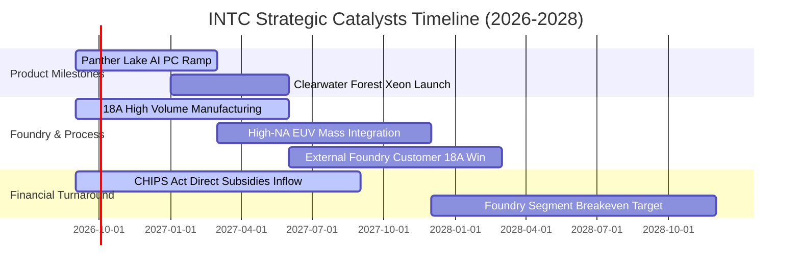

### 9.2 TAM 市場規模分析

```
╔══════════════════════════════════════════════════════════════════╗
║              INTC 目標潛在市場 (TAM) 與滲透展望                  ║
╠══════════════════════════════════════════════════════════════════╣
║                                                                  ║
║  客戶端 PC 運算 TAM (含 AI PC)：$65B                             ║
║  ├── 當前 Intel 營收：~$31B (滲透率 ~48%)                        ║
║  └── 2028 預估 TAM：$85B ── AI PC 換機潮挹注                     ║
║                                                                  ║
║  伺服器與資料中心運算 TAM：$110B                                ║
║  ├── 當前 Intel 營收：~$19B (滲透率 ~17%)                        ║
║  └── 2028 預估 TAM：$160B ── 傳統 CPU 穩健，加速晶片落後        ║
║                                                                  ║
║  先進晶圓代工與封裝 (IFS) TAM：$140B                             ║
║  ├── 當前 Intel 外部營收：~$4.5B (滲透率 ~3.2%)                  ║
║  └── 2028 預估 TAM：$190B ── 18A 提供巨大擴張槓桿                ║
╚══════════════════════════════════════════════════════════════════╝
```

### 9.3 成長驅動力結構圖

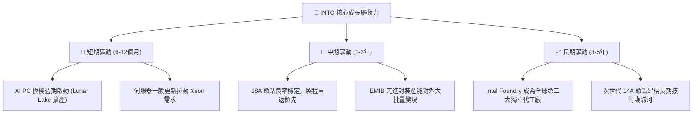

---

## 10. 風險矩陣

### 10.1 風險評分矩陣

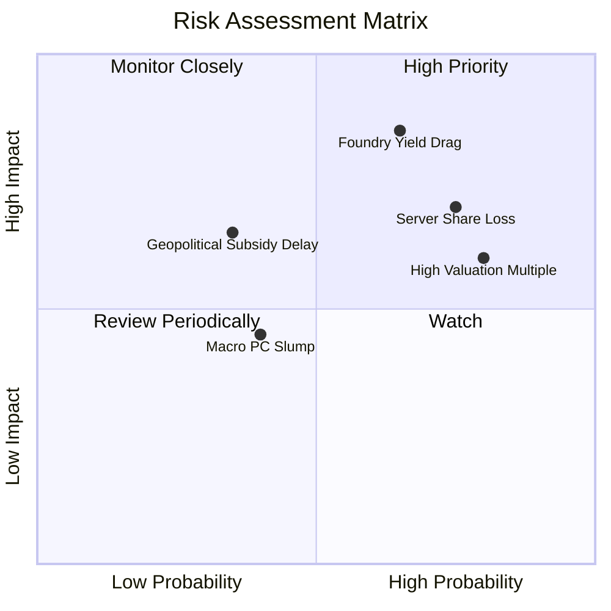

### 10.2 風險清單詳細分析

| # | 風險項目 | 發生機率 | 潛在財務衝擊 | 風險評分 | 具體緩解措施與防護機制 |
|---|----------|----------|--------------|----------|------------------------|
| 1 | 🔴 **Foundry 製程良率與客戶流失** | 中偏高 (65%) | 高 (-15% 營收 / 毛利驟降) | 🔴 **8.5/10** | 優先以內部 CCG 產品充實產能利用率，分散單一客戶風險 |
| 2 | 🔴 **伺服器市場遭競爭對手瓜分** | 高 (75%) | 高 (-$3B 資料中心營收) | 🔴 **8.0/10** | 加速 Granite Rapids / Clearwater Forest 核心架構疊代 |
| 3 | 🟡 **估值倍數收縮回調** | 高 (80%) | 中 (-20% 股價回檔) | 🟡 **7.0/10** | 仰賴單季營運現金流持穩與費用精簡提供基本面下檔支撐 |
| 4 | 🟡 **地緣政治與補助款撥款延宕** | 低偏中 (35%) | 中 (-$2B 資本補貼入帳) | 🟡 **5.5/10** | 靈活調節建廠進度，與各國政府簽署具備法律約束力之撥款協議 |

---

## 11. 投資建議

### 11.1 最終綜合評級雷達圖

```
╔══════════════════════════════════════════════════════════════════╗
║                  INTC 多維度總結評分雷達                        ║
╠══════════════════════════════════════════════════════════════════╣
║                                                                  ║
║  基本面健全度  6.5/10  ▓▓▓▓▓▓▓▓▓▓▓▓▓░░░░░░░  ★★★☆☆               ║
║  成長爆發力    7.0/10  ▓▓▓▓▓▓▓▓▓▓▓▓▓▓░░░░░░  ★★★★☆               ║
║  獲利品質穩定  5.0/10  ▓▓▓▓▓▓▓▓▓▓░░░░░░░░░░  ★★☆☆☆               ║
║  財務結構安全  6.5/10  ▓▓▓▓▓▓▓▓▓▓▓▓▓░░░░░░░  ★★★☆☆               ║
║  估值吸引力    4.5/10  ▓▓▓▓▓▓▓▓▓░░░░░░░░░░░  ★★☆☆☆               ║
║  護城河深度    7.0/10  ▓▓▓▓▓▓▓▓▓▓▓▓▓▓░░░░░░  ★★★★☆               ║
║  催化劑能見度  7.5/10  ▓▓▓▓▓▓▓▓▓▓▓▓▓▓▓░░░░░  ★★★★☆               ║
║                                                                  ║
║  ★ 綜合投資評分：6.3 / 10 ── 評級：🟡 持有 / 觀望 (HOLD)       ║
╚══════════════════════════════════════════════════════════════════╝
```

### 11.2 目標價與隱含報酬率

| 評估情境 | 機率權重 | 目標價推導依據 | 目標價 | 隱含報酬率 (vs $108.60) |
|----------|----------|----------------|--------|-------------------------|
| 🔴 **悲觀情境** | 25% | 18A 進展受挫，EV/EBITDA 收縮至 16x | **$68.50** | -36.9% |
| 🟡 **基準情境 (12M)** | **55%** | **AI PC 放量 + 營利率達 15%，給予 22x EV/EBITDA** | **$112.50** | **+3.6%** |
| 🟢 **樂觀情境** | 20% | 先進代工獲重大外包客戶，給予 28x EV/EBITDA | **$148.00** | +36.3% |
| **期望值加權** | 100% | 機率加權綜合目標價 | **$108.60** | **0.0% (現價已完全反映)** |

### 11.3 買入時機與觸發因素

```
╔══════════════════════════════════════════════════════════════════╗
║                  ✅ 投資決策觸發 Checklist                      ║
╠══════════════════════════════════════════════════════════════════╣
║                                                                  ║
║  建議加碼買入條件（需滿足任二項）：                              ║
║  ☐ 股價回檔至價值區間 $82.00 - $88.00 (提供 ≥15% 安全邊際)      ║
║  ☐ 官方正式宣布 18A 獲得全球前五大無晶圓廠 IC 設計公司量產大單   ║
║  ☐ 單季毛利率明確突破 42% 且代工部門虧損季減逾 25%               ║
║                                                                  ║
║  現階段持有觀望理由：                                            ║
║  ✅ 現價 $108.60 隱含 Forward P/E 高達 52.7x，已無安全邊際      ║
║  ✅ 單季 GAAP 淨利仍受非現金資產減損干擾，獲利品質需再驗證       ║
║                                                                  ║
║  減碼 / 停損觸發條件（出現任一應果斷減碼）：                     ║
║  ☐ 18A 商業化良率未達標準，內部產品再度延期轉向外包             ║
║  ☐ 單季 FCF 重新轉負超過 -$2.0B 且營運現金流跌破 $2.0B           ║
║  ☐ 伺服器 CPU 市占率跌破 60% 且毛利率跌回 32% 以下              ║
╚══════════════════════════════════════════════════════════════════╝
```

### 11.4 投資人適配度分析

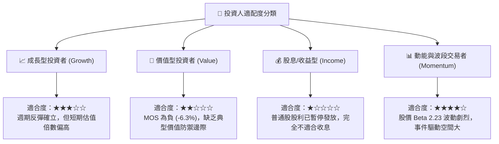

### 11.5 每季財報監控清單（Quarterly Watch List）

| 監控維度 | 關鍵追蹤指標 | 正常健康門檻 (繼續持有) | 警訊觸發門檻 (應考慮減碼) |
|----------|--------------|-------------------------|---------------------------|
| **營收成長** | 單季營收規模 | 穩定維持於 ≥ $14.5B | 連續兩季營收跌破 < $13.0B |
| **獲利能力** | 毛利率 (Gross Margin) | 穩定於 38% - 42% 區間 | 跌破 < 34.0% |
| **現金流量** | 單季自由現金流 (FCF) | 單季維持正值或 > $500M | 再次出現連續單季負現金流 <-$1.5B |
| **資本開支** | 單季 Capex 規模 | 控管於 $2.5B - $3.5B | 暴增至 > $5.0B 卻未見營收增長 |
| **製程里程碑** | 18A 外部客戶流片進度 | 依約取得 Test Chip 驗證 | 傳出良率問題導致客戶取消 Tape-out |

### 11.6 反面論證：什麼會證明論點錯誤（What Would Change My Mind）

```
╔══════════════════════════════════════════════════════════════════╗
║              ⚠️ 論點失效條件（Disconfirming Evidence）           ║
╠══════════════════════════════════════════════════════════════════╣
║  本報告「持有/觀望」論點在下列可量化條件出現時將被推翻：         ║
║                                                                  ║
║  轉向【強力買入】之反轉條件：                                    ║
║  1. 股價非理性回調至 $75 以下（隱含 MOS 躍升至 > 25%）；         ║
║  2. 營業利潤率在未來兩季內以超乎預期速度突破 18%（營運槓桿爆發）；║
║  3. Intel Foundry 正式與 Apple、Nvidia 或 Qualcomm 簽署實質代工 ║
║     合約，為期末營業利潤率帶來永久性上修。                       ║
║                                                                  ║
║  轉向【強烈賣出】之反轉條件：                                    ║
║  1. 18A 節點量產時程延宕至 2027 年末以後，被台積電 2nm 全面拉開；║
║  2. Q3-Q4 2026 營收季增率轉負，證實當前 25% 營收年增僅屬短暫回補；║
║  3. ROIC 連續三年無法由負轉正，資本摧毀持續侵蝕每股淨值。        ║
╚══════════════════════════════════════════════════════════════════╝
```

---
> **免責聲明**：本報告為依據機構級研究框架撰寫之深度基本面分析，僅供學術研究與投資參考，不構成任何要約或投資決策建議。投資涉及本金虧損風險，入市前應獨立評估自身風險承受能力。