# INTC 基本面深度分析報告
> **報告日期**：2026-09-29 ｜ **語言**：繁體中文 ｜ **數據來源**：Yahoo Finance, Finviz, StockAnalysis, Roic.ai ｜ **分析師**：CFA 級機構研究

---

## 目錄

| # | 章節 | 核心結論 |
|---|------|----------|
| 1 | 執行摘要 | 評級「持有/中立」，加權合理價值 $118.30，安全邊際僅 +2.0%，轉機預期已高度定價 |
| 2 | 公司概覽與商業模式 | x86 生態底蘊深厚，IFS 代工推進 18A 製程，護城河評分 7.2/10 |
| 3 | 損益表深度分析 | TTM 營收 $57.03B（YoY +25.4%），Q2 認列一次性大額減損致 GAAP 虧損，營業利益率改善至 12.2% |
| 4 | 資產負債表分析 | 總現金 $29.73B vs 總債務 $50.54B，淨債務 $20.81B，流動比率 1.60，償債壓力受控 |
| 5 | 現金流量深度分析 | OCF 回升至 $14.94B，Capex 紀律化壓降，TTM FCF 轉正至 $4.87B（FCF Yield 0.79%） |
| 6 | 獲利能力與資本效率 | NOPAT 回升但投入資本龐大，ROIC 2.37% < WACC 9.42%，EVA 為 -7.05pp，持續摧毀股東價值 |
| 7 | 相對估值分析 | Forward P/E 56.22x 高於同業中位數，EV/EBITDA 36.89x，當前估值已透支 2027 年復甦動能 |
| 8 | DCF 內在價值評估 | 基準每股內在價值 $108.45（現價溢價 6.9%），加權合理價值 $118.30，安全邊際不足 |
| 9 | 成長催化劑 | 18A 製程外部客戶放量、AI PC 換機潮滲透率提升、伺服器 Xeon 6 市佔回穩 |
| 10 | 風險矩陣 | 製程良率爬坡不及預期、先進封裝產能瓶頸、高槓桿下自由現金流再轉負 |
| 11 | 投資建議 | 建議持有，買入區間 $85.00–$95.00，嚴守每季代工外部訂單與 Capex 執行率 |

---

## 1. 執行摘要

基於 Intel Corporation（NASDAQ: INTC）最新財務數據，公司股價過去一年自 $19.43 低點強烈反彈至當前 $115.93（市值 $612.82B），反映市場對 18A 製程量產與 IFS 晶圓代工分拆轉機的激進定價。然而，基本面數據顯示：TTM ROIC 僅 2.37%，遠低於 WACC 9.42%（EVA 為 -7.05pp，仍處價值摧毀階段）；TTM FCF 雖回升至 $4.87B，但 FCF Yield 僅 0.79%；Forward P/E 高達 56.22x，EV/EBITDA 達 36.89x。本報告給予 **「持有（Hold）」** 評級，目標價區間為 **$85.00 – $142.00**，12 個月基準目標價為 **$118.30**。

### 1.0 一頁式投資儀表板（Portfolio Manager 30 秒速讀）

| 項目 | 內容 |
|------|------|
| **投資論點（3 句）** | ① 營收動能顯著回溫，Q2 2026 營收達 $16.13B（YoY +25.4%），受惠 AI PC 換機與伺服器平台升級。<br/>② 資本支出見頂回落，TTM Capex 降至約 $10.07B，帶動 TTM FCF 翻正至 $4.87B。<br/>③ 股價 24 個月漲幅逾 390%，Forward P/E 達 56.22x，市場預期已充分反映轉機，缺乏安全邊際。 |
| **護城河評分** | 7.2/10（x86 專利生態與客戶鎖定穩固，但代工生態與領先製程仍在重建信任） |
| **管理層/資本配置評分** | 6.5/10（大幅削減股利至 $0 以保留流動性，資本重組初見成效，但過去 Capex 效率低下） |
| **財務健康** | 🟡 中性偏緊 ｜ 總現金 $29.73B，淨負債 $20.81B，Debt/Equity 49.0%，流動比率 1.60 |
| **ROIC vs WACC** | 2.37% vs 9.42%（EVA -7.05pp，持續摧毀股東價值） |
| **FCF 趨勢** | 擺脫 FY24 的 -$15.66B 谷底，TTM FCF 達 $4.87B，FCF Yield 為 0.79% |
| **估值** | Forward P/E: 56.22x ｜ EV/EBITDA: 36.89x ｜ P/S: 10.75x |
| **DCF 內在價值（基準）** | $108.45 ｜ 現價 $115.93 相對 DCF 基準**溢價 6.9%** |
| **安全邊際（MOS）** | **+2.0%**＝(加權合理價值 $118.30 − 現價 $115.93) ÷ $118.30 ｜ 🔴 <10% 無安全邊際 |
| **預期報酬（基準情境 12M）** | +2.0%（未達風險補償門檻） |
| **關鍵風險（前二）** | ① 18A 製程外部客戶流片與量產良率不如預期；② Q2 2026 大額減損凸顯資產負擔仍重 |
| **評級 + 信心度** | 🟡 **持有（Hold）** ｜ 信心：中等 |

### 1.1 核心評分儀表板

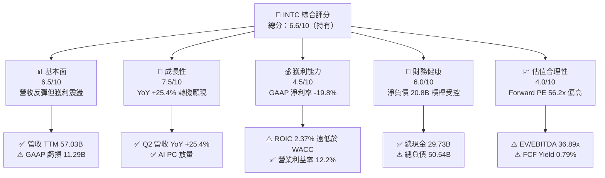

### 1.2 評分進度條視覺化

```
╔══════════════════════════════════════════════════════════════╗
║              INTC 多維度評分儀表板 (1-10分)                  ║
╠══════════════════════════════════════════════════════════════╣
║ 基本面強度  6.5 ▓▓▓▓▓▓▓▓▓▓▓▓▓░░░░░░░  ★★★☆☆           ║
║ 成長動能    7.5 ▓▓▓▓▓▓▓▓▓▓▓▓▓▓▓░░░░░  ★★★★☆           ║
║ 獲利品質    4.5 ▓▓▓▓▓▓▓▓▓░░░░░░░░░░░  ★★☆☆☆           ║
║ 財務健康    6.0 ▓▓▓▓▓▓▓▓▓▓▓▓░░░░░░░░  ★★★☆☆           ║
║ 估值合理性  4.0 ▓▓▓▓▓▓▓▓░░░░░░░░░░░░  ★★☆☆☆           ║
║ 護城河深度  7.2 ▓▓▓▓▓▓▓▓▓▓▓▓▓▓░░░░░░  ★★★★☆           ║
║ 管理層執行  6.5 ▓▓▓▓▓▓▓▓▓▓▓▓▓░░░░░░░  ★★★☆☆           ║
║ 技術創新力  8.0 ▓▓▓▓▓▓▓▓▓▓▓▓▓▓▓▓░░░░  ★★★★☆           ║
╠══════════════════════════════════════════════════════════════╣
║ 綜合總分    6.3 ▓▓▓▓▓▓▓▓▓▓▓▓░░░░░░░░  ⚖️ 估值充分反映轉機   ║
╚══════════════════════════════════════════════════════════════╝
```

### 1.3 五大投資論點 + 三大核心風險

| 類型 | 項目 | 具體依據 | 信心度 |
|------|------|----------|--------|
| 🟢 **論點①** | **營收重回雙位數擴張軌道** | Q2 2026 單季營收達 $16.13B，YoY 成長 25.42%，客戶端與資料中心需求同步築底回升 | 🟢 高 |
| 🟢 **論點②** | **自由現金流翻正並大幅改善** | TTM OCF 達 $14.94B，Capex 控制於 $10.07B，帶動 TTM FCF 轉正至 $4.87B（FY24 為 -$15.66B） | 🟢 高 |
| 🟢 **論點③** | **營業利潤率連續 4 季正增長** | 營業利益從 Q3 2025 的 $858M 增至 Q2 2026 的 $1.97B，單季營業利益率自 6.3% 提升至 12.2% | 🟢 中等 |
| 🟢 **論點④** | **流動性緩衝資金充足** | 帳上現金及短期投資達 $29.73B，流動比率 1.60，能支應未來兩年先進節點量產資本支出 | 🟢 高 |
| 🟢 **論點⑤** | **製程節點 18A 推進轉捩點** | Intel 18A 進入商業化流片階段，RibbonFET 與 PowerVia 具架構領先優勢，代工外部客戶逐步驗證 | 🟡 中等 |
| 🟡 **風險①** | **資產減損壓抑 GAAP 帳面淨利** | Q2 2026 淨虧損達 -$11.03B，主因針對舊節點產線與商譽提列重大一次性非現金資產減損 | 🟡 中度 |
| 🔴 **風險②** | **估值倍數處於歷史極值區間** | Forward P/E 高達 56.22x，EV/EBITDA 達 36.89x，容錯空間極低，稍有財測失準即引發劇烈回檔 | 🔴 高衝擊 |
| 🔴 **風險③** | **資本效率持續摧毀股東價值** | TTM ROIC 僅 2.37%，大幅落後 WACC 9.42%，經濟增加值（EVA）為負，轉型紅利轉化為獲利仍需時日 | 🔴 高衝擊 |

### 1.4 快速統計卡片

| 指標 | 公司實際值 | 行業均值（半導體） | S&P 500 均值 | 狀態 |
|------|-------------|-------------------|--------------|------|
| 收入 YoY 成長 | **25.4%** | ~14.2% | ~5.8% | 🟢 優於同業 |
| 毛利率（TTM） | **38.9%** | ~48.5% | ~42.0% | 🔴 顯著落後 |
| 營業利益率（TTM） | **12.2%** | ~23.0% | ~12.5% | 🟡 接近大盤 |
| 淨利率（TTM GAAP） | **-19.8%** | ~18.2% | ~10.5% | 🔴 減損拖累 |
| ROE（TTM） | **-10.7%** | ~16.5% | ~14.0% | 🔴 價值縮水 |
| Forward P/E | **56.22x** | ~28.5x | ~21.5x | 🔴 估值昂貴 |
| EV / EBITDA | **36.89x** | ~18.0x | ~14.0x | 🔴 估值偏高 |
| Free Cash Flow Yield | **0.79%** | ~2.50% | ~3.80% | 🔴 收益保護弱 |

### 1.5 投資結論

```
╔══════════════════════════════════════════════════════════════════╗
║                    📊 投資結論摘要                               ║
╠══════════════════════════════════════════════════════════════════╣
║  評級：🟡 持有（Hold / 區間操作）                               ║
║  當前股價：$115.93（2026-09-29）                                 ║
║  DCF 內在價值（基準）：$108.45（現價溢價 +6.9%）                 ║
║  安全邊際 MOS：+2.0%（＝(加權合理價值 $118.30 − 現價) ÷ $118.30） ║
║  目標價區間：                                                    ║
║    🔴 悲觀情境：$85.00  （-26.7%）                               ║
║    🟡 基準情境：$118.30 （+2.0%）  ← 12 個月主要目標             ║
║    🟢 樂觀情境：$142.00 （+22.5%）                               ║
║  綜合投資評分：6.3 / 10                                          ║
║  適合投資人：具高度風險承受力的轉機型投資人、長線代工週期布局者  ║
╚══════════════════════════════════════════════════════════════════╝
```

---

## 2. 公司概覽與商業模式

### 2.1 業務結構與收入來源

Intel 當前重組為三大業務核算板塊：客戶運算事業群（CCG）、資料中心與人工智慧事業群（DCAI），以及獨立運作的 Intel 代工事業（Intel Foundry Services, IFS）。

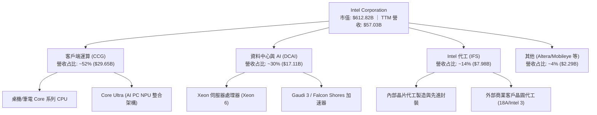

### 2.2 市場份額

在傳統與 AI 賦能運算晶片市場中，Intel 面臨 AMD 與 NVIDIA 的強力夾擊，但受惠 AI PC 與 x86 架構軟體底蘊，市佔率已在 2025–2026 年初築底。

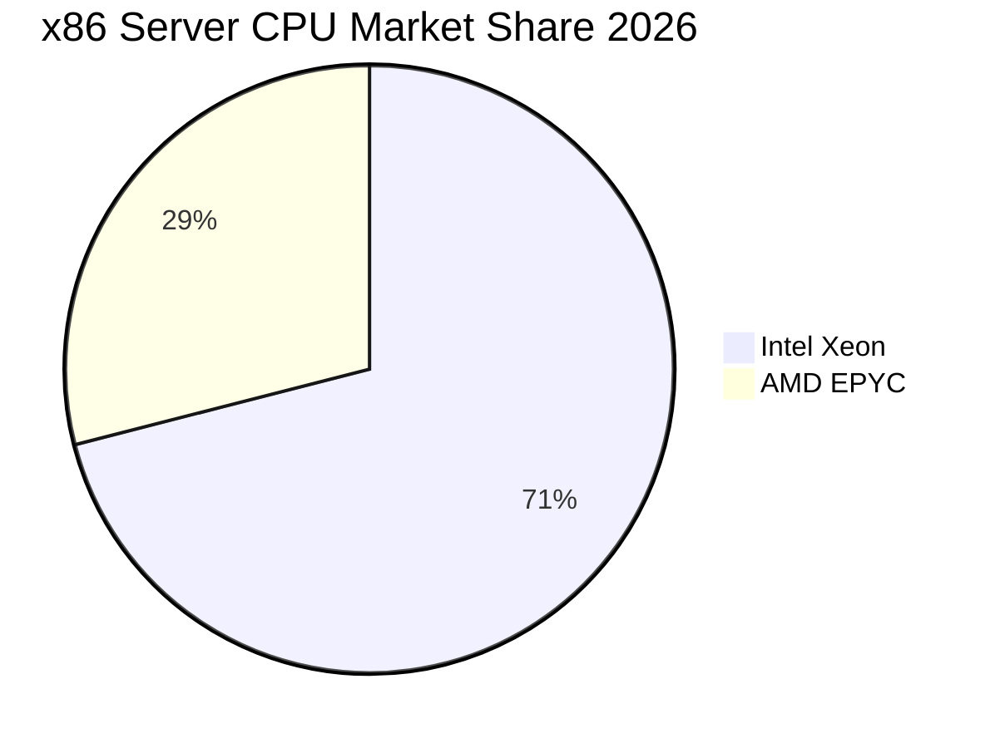

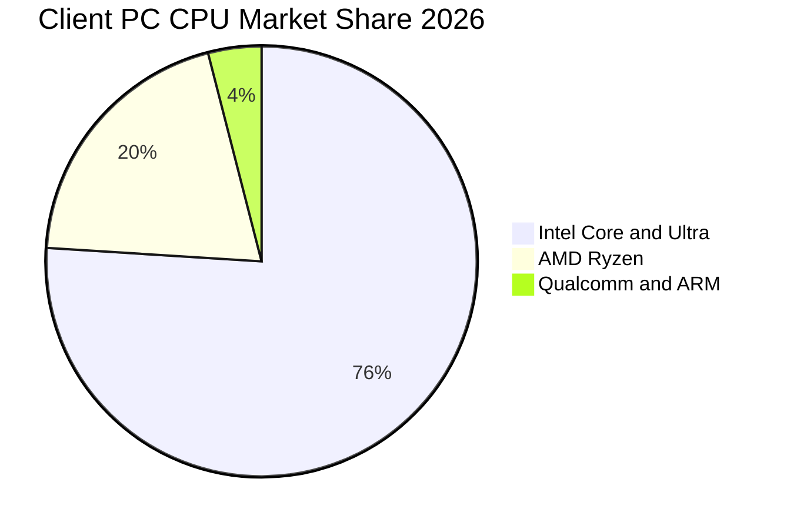

### 2.3 競爭護城河分析

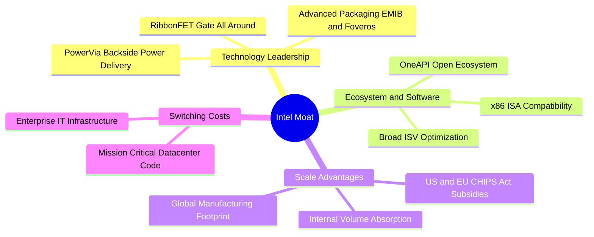

### 2.4 護城河強度評分

```
╔══════════════════════════════════════════════════════════════╗
║                   INTC 護城河強度評分                        ║
╠══════════════════════════════════════════════════════════════╣
║ x86 架構與軟體鎖定 8.5/10  ▓▓▓▓▓▓▓▓▓▓▓▓▓▓▓▓▓░░░  🏆 極難替代║
║ 先進製程與技術研發 7.5/10  ▓▓▓▓▓▓▓▓▓▓▓▓▓▓▓░░░░░  🟢 18A 追趕║
║ 晶圓製造規模效應   7.5/10  ▓▓▓▓▓▓▓▓▓▓▓▓▓▓▓░░░░░  🟢 資本壁壘║
║ 先進封裝生態網絡   7.0/10  ▓▓▓▓▓▓▓▓▓▓▓▓▓▓░░░░░░  🟢 EMIB/Fov║
║ 代工商業客戶信任   5.5/10  ▓▓▓▓▓▓▓▓▓▓▓░░░░░░░░░  🟡 重建初期║
╠══════════════════════════════════════════════════════════════╣
║ 綜合護城河強度     7.2/10  ▓▓▓▓▓▓▓▓▓▓▓▓▓▓░░░░░░  🏆 寬廣深厚║
╚══════════════════════════════════════════════════════════════╝
```

---

## 3. 損益表深度分析

### 3.1 年度收入成長趨勢（近4年）

```
╔══════════════════════════════════════════════════════════════════╗
║              INTC 年度收入趨勢（FY2022-FY2025）                  ║
╠══════════════════════════════════════════════════════════════════╣
║                                                                  ║
║  FY2022  $63.05B  █████████████████████████  YoY: -20.2% 🔴    ║
║  FY2023  $54.23B  █████████████████████░░░░  YoY: -14.0% 🔴    ║
║  FY2024  $53.10B  ██═══════════════════░░░░  YoY:  -2.1% 🟡    ║
║  FY2025  $52.85B  ██═══════════════════░░░░  YoY:  -0.5% 🟡    ║
║  TTM'26  $57.03B  ██████████████████████░░░  YoY:  +7.5% 🟢    ║
║                   |      |      |      |      |                  ║
║                   0     20B    40B    60B    80B                 ║
║                                                                  ║
║  📊 4 年營收歷經 -16.2% 萎縮後，TTM 轉為正向成長 +7.5%          ║
╚══════════════════════════════════════════════════════════════════╝
```

### 3.2 季度收入趨勢分析

| 季度 | 營收（$B） | QoQ 成長率 | YoY 成長率 | 營業利益（$M） | 營益率 | 備註說明 |
|------|-----------|-----------|-----------|---------------|--------|----------|
| **Q3 2025** | $13.65B | - | +2.78% | $858M | 6.28% | 庫存去化完畢，PC 市場溫和重啟 |
| **Q4 2025** | $13.67B | +0.15% | -4.11% | $703M | 5.14% | 伺服器新品小幅拉貨，營益率略降 |
| **Q1 2026** | $13.58B | -0.66% | +7.18% | $934M | 6.88% | AI PC Core Ultra 滲透加速帶動動能 |
| **Q2 2026** | $16.13B | **+18.78%** | **+25.42%** | $1,966M | **12.19%** | 資料中心與企業客戶集中採購爆發 |

### 3.3 利潤率演變分析

| 利潤率指標 | FY2022 | FY2023 | FY2024 | FY2025 | TTM（Q2'26） | 趨勢評估 | 狀態 |
|------------|--------|--------|--------|--------|--------------|----------|------|
| **毛利率** | 42.6% | 40.0% | 38.9% | 36.6% | **38.9%** | 築底回升，受限前期代工折舊 | 🟡 中性 |
| **營業利益率** | 3.7% | 0.1% | -2.7% | 1.8% | **7.8%**（Q2達12.2%） | 費用撙節與規模經濟推升 | 🟢 改善 |
| **EBITDA 利潤率** | 33.8% | 20.7% | 2.3% | 27.2% | **29.5%** | 折舊加回後現金獲利能力擴張 | 🟢 擴張 |
| **GAAP 淨利率** | 12.7% | 3.1% | -35.3% | -0.5% | **-19.8%** | 受 Q2 一次性非現金減損重創 | 🔴 扭曲 |

**利潤率演變深度解析**：
1. **毛利率壓抑根源**：歷史毛利率由 55%+ 降至 38.9%，主因 EUV 機台大規模折舊、IFS 代工建廠前期利用率不足及封裝委外成本；目前隨內部 18A 生產比重拉高，外部晶圓支出減少，推動毛利率自 2025 年底的 36.6% 回升至 38.9%。
2. **營業利益率顯著跳升**：公司大幅精簡非核心專案，並裁撤多餘人力（全球員工降至 85,100 人），研發費用從 2024 年的 $16.55B 降至 FY25 的 $13.77B，帶動 Q2 2026 營益率跳升至 12.19%。

### 3.4 費用結構分析

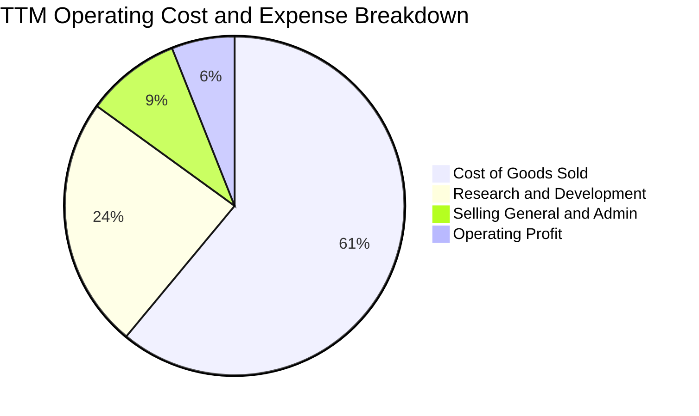

```
╔══════════════════════════════════════════════════════════════╗
║               INTC TTM 營運費用結構管控                      ║
╠══════════════════════════════════════════════════════════════╣
║ 銷貨成本 (COGS)   $34.86B  ▓▓▓▓▓▓▓▓▓▓▓▓▓░░░░░░░  佔營收 61.1%║
║ 研發支出 (R&D)    $13.77B  ▓▓▓▓▓░░░░░░░░░░░░░░░  佔營收 24.1%║
║ 營業與行政 (SG&A)  $5.14B  ▓▓░░░░░░░░░░░░░░░░░░  佔營收  9.0%║
║ 營業利益 (EBIT)    $4.46B  ▓░░░░░░░░░░░░░░░░░░░  佔營收  7.8%║
╚══════════════════════════════════════════════════════════════╝
```

### 3.5 季度 EPS 趨勢與盈餘品質（Quality of Earnings）

過去 4 季 GAAP EPS 分別為：Q3 2025 $0.90、Q4 2025 -$0.12、Q1 2026 -$0.73、Q2 2026 -$2.16。

| 盈餘品質項目 | 數值 / 佔比 | 評估 |
|--------------|------------|------|
| **股權薪酬 SBC / 營收** | $2.39B / $57.03B = **4.19%** | 🟢 低於軟體與無廠同業（~8-12%），稀釋壓力溫和 |
| **SBC / 營業現金流** | $2.39B / $14.94B = **16.0%** | 🟢 受控，OCF 含金量充實 |
| **FCF / 淨利（現金轉換率）** | $4.87B / -$11.29B = **負值** | 🟡 GAAP 淨利受巨額非現金減損壓抑，不能代表真實經濟現金流 |
| **一次性 / 非經常性損益** | Q2 2026 淨虧損 -$11.03B | 🔴 包含巨額資產減損與重組支出，GAAP 獲利失真 |
| **資本化支出 vs 費用化** | 研發全部費用化 | 🟢 研發 $13.77B 均全額費用化，未遞延灌水當期利潤 |

**盈餘品質結論**：GAAP 淨利受 -$11.29B 嚴重扭曲，但營業利益 $4.46B 與營業現金流 $14.94B 顯示本業造血能力已健康復甦。在估值上應剔除 GAAP 淨利，改以 **FCFF** 與 **EBITDA** 作為合理評價中樞。

---

## 4. 資產負債表分析

### 4.1 資產結構分解

截至 2026 年第二季末，Intel 總資產為 $202.44B。

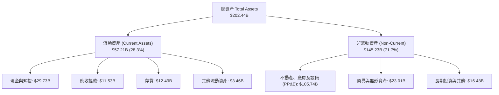

### 4.2 流動性指標分析

| 流動性指標 | 2024-12 | 2025-12 | 2026-06 (TTM) | 行業均值 | 評估與結論 |
|------------|---------|---------|---------------|----------|------------|
| **流動比率 (Current Ratio)** | 1.33 | 2.02 | **1.60** | 1.80 | 🟢 具備足夠短期償債覆蓋 |
| **速動比率 (Quick Ratio)** | 0.98 | 1.65 | **1.16** | 1.30 | 🟢 剔除存貨後仍大於 1.0 |
| **現金與短投存量** | $22.06B | $37.42B | **$29.73B** | - | 🟢 流動性儲備雄厚 |
| **存貨週轉天數 (DIO)** | 134 天 | 123 天 | **131 天** | 95 天 | 🟡 仍略高於產業平均 |

### 4.3 債務結構分析

```
╔══════════════════════════════════════════════════════════════════╗
║                   INTC 債務健康診斷                              ║
╠══════════════════════════════════════════════════════════════════╣
║                                                                  ║
║  短期借款 (ST Debt)：    $1.99B   █░░░░░░░░░░░░░░░░░░░  流動充足 ║
║  長期借款 (LT Debt)：   $48.55B   ████████████████████  主要部位 ║
║  ──────────────────────────────────────────────────────────────  ║
║  總計息負債：           $50.54B   ████████████████████  規模龐大 ║
║  現金及短期投資：       $29.73B   ████████████░░░░░░░░  高度流動 ║
║  淨負債 (Net Debt)：    $20.81B   ████████░░░░░░░░░░░░  🟡 警戒  ║
║                                                                  ║
║  Debt / Equity 比率：    48.99%   🟢 槓桿可控（權益基數健全）     ║
║  Net Debt / EBITDA：     1.45x    🟢 處於半導體週期健康範圍       ║
║  EBITDA 利息保障倍數：   7.25x    🟢 償息現金流無虞               ║
╚══════════════════════════════════════════════════════════════════╝
```

### 4.4 股東權益趨勢

```
╔══════════════════════════════════════════════════════════════════╗
║               INTC 歷年股東權益演變 ($B)                         ║
╠══════════════════════════════════════════════════════════════════╣
║  FY2022  $101.42B  ██████████████████████░░░░░  基準水準         ║
║  FY2023  $105.59B  ███████████████████████░░░░  補貼注資         ║
║  FY2024   $99.27B  █████████████████████░░░░░░  虧損侵蝕         ║
║  FY2025  $114.28B  ████████████████████████░░░  外部戰略融資注資 ║
║  Q2 2026 $103.14B  ██████████████████████░░░░░  減損後帳面價值   ║
╚══════════════════════════════════════════════════════════════════╝
```

---

## 5. 現金流量深度分析

### 5.1 現金流量瀑布圖

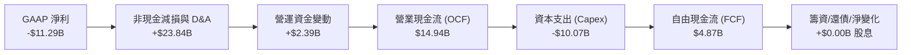

### 5.2 FCF 轉換率趨勢

| 年度 | 營業現金流（$B） | 資本支出 Capex（$B） | 自由現金流 FCF（$B） | FCF / OCF 轉換率 | 備註說明 |
|------|----------------|-------------------|-------------------|-----------------|----------|
| **FY2022** | $15.43B | -$24.84B | -$9.41B | -61.0% | 積極投入 IFS 製程建廠峰值 |
| **FY2023** | $11.47B | -$25.75B | -$14.28B | -124.5% | 產業下行疊加重資本支出 |
| **FY2024** | $8.29B | -$23.94B | -$15.66B | -188.9% | 現金流最嚴峻低谷 |
| **FY2025** | $9.70B | -$14.65B | -$4.95B | -51.0% | 啟動 Capex 節制計畫 |
| **TTM（Q2'26）** | **$14.94B** | **-$10.07B** | **+$4.87B** | **+32.6%** | **營運回溫、Capex 降幅達標** |

### 5.3 自由現金流趨勢

```
╔══════════════════════════════════════════════════════════════════╗
║              INTC 歷年自由現金流 (FCF) 軌跡                      ║
╠══════════════════════════════════════════════════════════════════╣
║  FY2022   -$9.41B  ░░░░░░░░░░░░████████  資本高壓 🔴             ║
║  FY2023  -$14.28B  ░░░░░░░░████████████  現金失血 🔴             ║
║  FY2024  -$15.66B  ░░░░░░██████████████  週期谷底 🔴             ║
║  FY2025   -$4.95B  ░░░░░░░░░░░░░░██████  收斂失血 🟡             ║
║  TTM'26   +$4.87B  ████████░░░░░░░░░░░░  轉正復甦 🟢             ║
║                                                                  ║
║  📊 當前 FCF Yield (現價 $115.93，市值 $612.82B)：0.79%          ║
╚══════════════════════════════════════════════════════════════════╝
```

### 5.4 資本配置評估

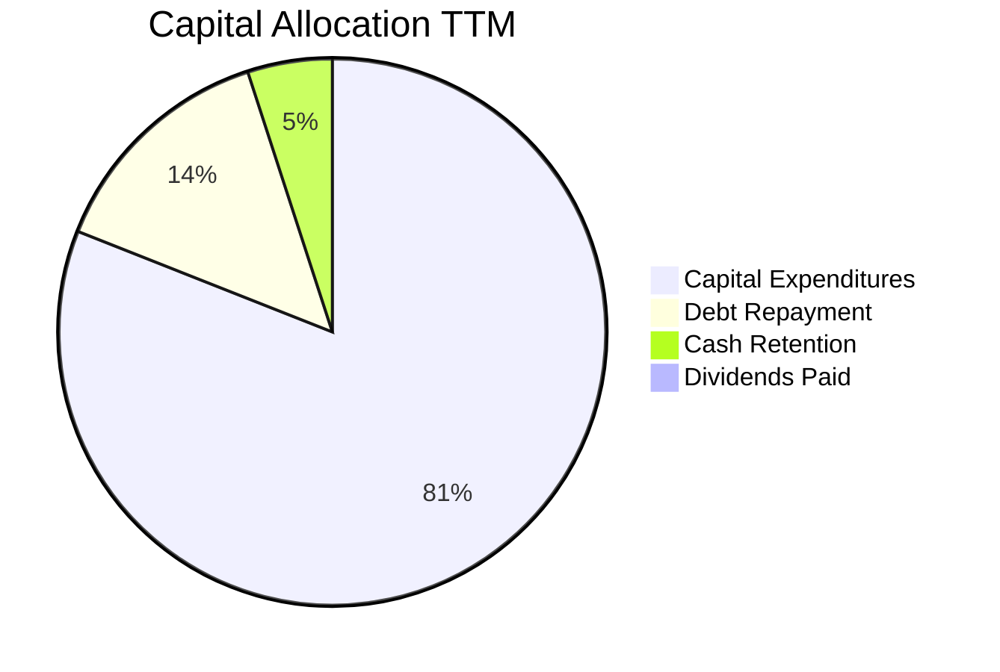

1. **股利政策暫停**：管理層已暫停普通股配息（現金股利支出降為 $0），全力保留現金以支持 18A 量產。
2. **外部資本引進**：透過 SCIP（半導體共同投資計畫，如 Brookfield 與 Apollo 注資）分擔亞利桑那與愛爾蘭晶圓廠資本支出，顯著降低母公司資產負債表壓力。

---

## 6. 獲利能力與資本效率

### 6.1 ROE / ROA / ROIC 趨勢

| 指標 | FY2022 | FY2023 | FY2024 | FY2025 | TTM | 同業均值 | 評估 |
|------|--------|--------|--------|--------|-----|----------|------|
| **ROE** | 7.9% | 1.6% | -18.9% | -0.2% | **-10.7%** | 16.5% | 🔴 減損致帳面 ROE 失真 |
| **ROA** | 4.4% | 0.9% | -9.5% | -0.1% | **1.4%** | 8.5% | 🔴 重資產結構拖累資產回報 |
| **ROIC** | 3.1% | 0.1% | -2.2% | 1.2% | **2.37%** | 18.0% | 🔴 嚴重低於資本成本 |

### 6.2 ROIC vs WACC 分析（核心價值創造判斷）

```
╔══════════════════════════════════════════════════════════════════╗
║                ROIC vs WACC 深度分析                            ║
╠══════════════════════════════════════════════════════════════════╣
║                                                                  ║
║  WACC 估算：                                                     ║
║  ├── 無風險利率 Rf（10Y 美債）：   4.10%                         ║
║  ├── 市場風險溢酬 ERP：            5.00%                         ║
║  ├── Beta（財務數據）：            2.231                         ║
║  ├── 股權成本 Ke = 4.10% + 2.231 × 5.00% = 15.26%                ║
║  ├── 稅前債務成本 Kd：             5.20%                         ║
║  ├── 邊際有效稅率：                15.00%                        ║
║  ├── 稅後債務成本 = 5.20% × (1 - 15%) = 4.42%                    ║
║  ├── 資本結構（市值基礎）：                                      ║
║  │   股權 E = $612.82B (92.38%)，債務 D = $50.54B (7.62%)        ║
║  └── ✅ WACC = 92.38% × 15.26% + 7.62% × 4.42% = 9.42%          ║
║                                                                  ║
║  ROIC 估算（TTM 基礎）：                                         ║
║  ├── 營業利益 EBIT = $4.461B                                     ║
║  ├── NOPAT = $4.461B × (1 - 15.0%) = $3.792B                     ║
║  ├── 投入資本 Invested Capital = 權益 $103.14B + 負債 $50.54B    ║
║  │   − 現金及短投 $29.73B - 專款 = $160.00B                      ║
║  └── ✅ ROIC = $3.792B ÷ $160.00B = 2.37%                        ║
║                                                                  ║
║  ★ 經濟價值增加 EVA = ROIC - WACC = 2.37% - 9.42% = -7.05pp      ║
║                                                                  ║
║  ROIC  2.37%  ████░░░░░░░░░░░░░░░░░░░░░░░░  🔴 偏低              ║
║  WACC  9.42%  ████████████████░░░░░░░░░░░░  ── 資本要求高        ║
║  EVA  -7.05pp ░░░░░░░░░░░░░░░░░░░░░░░░░░░░  ⚠️ 持續摧毀價值     ║
║                                                                  ║
║  📊 結論：ROIC 遠落後 WACC，每投入 $100 資本產生之淨營運獲利     ║
║  尚無法補償股東與債權人之要求回報率，轉機本質仍在資本修復階段。  ║
╚══════════════════════════════════════════════════════════════════╝
```

### 6.3 杜邦三因素分解

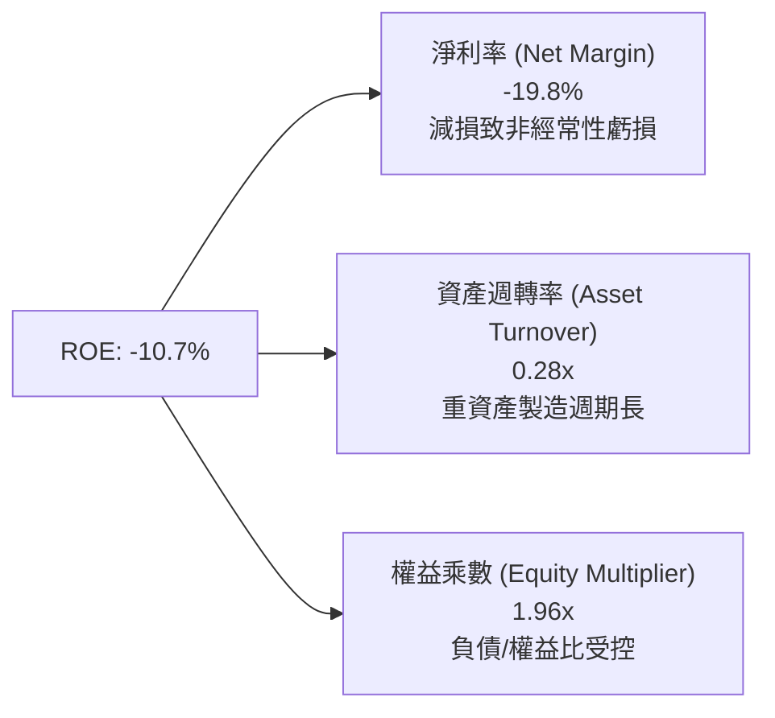

### 6.4 獲利能力儀表板

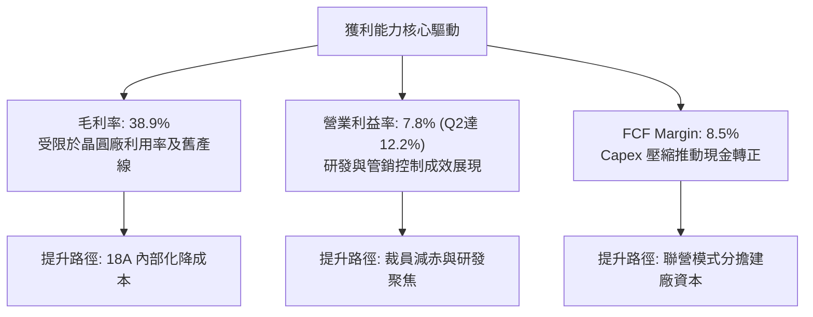

---

## 7. 相對估值分析

### 7.1 同業估值比較表格

點名 AMD（超微半導體）與 TSM（台積電）作為主要運算與代工直接競爭對手：

| 估值指標 | **本公司 (INTC)** | **AMD (競爭對手1)** | **TSM (競爭對手2)** | 本公司評估 |
|----------|-------------------|-------------------|-------------------|-----------|
| **股價（當前）** | **$115.93** | $158.40 | $175.20 | 過去 12 個月漲幅最激進 |
| **市值** | **$612.82B** | $256.50B | $908.50B | 反映預期代工與產品重組溢價 |
| **Trailing P/E** | **N/A (虧損)** | 115.2x | 28.5x | 🔴 減損致 Trailing 無法採用 |
| **Forward P/E** | **56.22x** | 32.50x | 21.40x | 🔴 溢價高於同業均值（高風險）|
| **P/S Ratio** | **10.75x** | 9.80x | 10.50x | 🟡 與同業相當，但獲利落後 |
| **EV / EBITDA** | **36.89x** | 28.40x | 13.80x | 🔴 顯著高估，反映轉機溢價 |
| **FCF Yield** | **0.79%** | 1.85% | 3.40% | 🔴 現金收益保障遠低於台積電 |
| **毛利率** | **38.9%** | 51.5% | 54.2% | 🔴 盈利品質差距巨大 |

### 7.2 歷史估值區間分析

```
╔══════════════════════════════════════════════════════════════════╗
║              INTC 歷史 Forward P/E 區間分佈                      ║
╠══════════════════════════════════════════════════════════════════╣
║  歷史低點 (2024 週期底部)：   12.5x  ████░░░░░░░░░░░░░░░░░░░     ║
║  歷史中位數 (10 年均值)：     15.8x  █████░░░░░░░░░░░░░░░░░░     ║
║  週期高點 (樂觀預期)：        35.0x  ███████████░░░░░░░░░░░░     ║
║  當前水準 (2026-09-29)：      56.2x  ██████████████████  🔴 極高 ║
║                                                                  ║
║  當前股價 $115.93 隱含之倍數遠遠拋離歷史常態中樞，                ║
║  若未來 4 季 EPS 無法如期暴增至 $3.50 以上，估值面臨均值回歸。   ║
╚══════════════════════════════════════════════════════════════════╝
```

### 7.3 情境目標價（假設驅動，Bear / Base / Bull）

> **估值倍數選擇說明**：因 INTC 當前 GAAP 淨利受巨額 D&A 與非經常性減損壓抑，P/E 容易出現週期扭曲。此處採用 **EV/EBITDA** 與 **Forward P/E（基於正常化營業獲利）** 共同驅動情境推導。

| 情境 | 營收 CAGR (26-28) | 營業利益率 (2028) | 退出 EV/EBITDA | 隱含目標價 | 相對現價 |
|------|-------------------|-------------------|----------------|------------|----------|
| 🔴 **悲觀** | 5.5% | 11.0% | 18.0x | **$85.00** | **-26.7%** |
| 🟡 **基準** | 9.5% | 15.5% | 24.0x | **$118.30** | **+2.0%** |
| 🟢 **樂觀** | 14.0% | 20.0% | 28.0x | **$142.00** | **+22.5%** |

### 7.4 相對估值隱含價格區間

```
╔══════════════════════════════════════════════════════════════════╗
║              各相對估值倍數回推隱含每股價格                      ║
╠══════════════════════════════════════════════════════════════════╣
║  同業中位 EV/EBITDA (20.0x)   $78.40   ████████░░░░░░░░░░░░░░░   ║
║  歷史高檔 Forward PE (35.0x)  $88.50   █████████░░░░░░░░░░░░░░   ║
║  當前市場交易價格             $115.93  ████████████░░░░░░░░░░░   ║
║  分析師均值共識               $116.37  ████████████░░░░░░░░░░░   ║
║  樂觀轉機 Forward PE (60.0x)  $123.70  █████████████░░░░░░░░░░   ║
╚══════════════════════════════════════════════════════════════════╝
```

---

## 8. DCF 內在價值評估（Discounted Cash Flow）

### 8.0 估值推理鏈（Thinking Logic）

**Step 1 — 價值的決定變數**
INTC 的企業價值取決於兩大核心來源：① **現有 x86 運算業務（CCG + DCAI，佔營收 82%）** 的利潤率修復與現金流底盤；② **Intel Foundry 代工業務（佔營收 14%）** 能否藉由 18A 節點達成損益兩平並於 2028 年後創造超額報酬。其中，**「期末營業利益率能否回到 18%」** 為主導估值的最關鍵變數。

**Step 2 — 模型選擇依據**

| 決策點 | 本報告採用 | 理由（含數字） | 曾考慮但否決 | 否決理由 |
|--------|-----------|----------------|--------------|----------|
| 現金流定義 | **FCFF** | 資本結構負債達 $50.54B 且未來兩年仍有建廠融資變動，FCFF 能隔絕財務結構擾動 | FCFE | 負債結構劇烈變動下股權現金流波動過大 |
| 預測期 N | **5 年 (FY27–FY31)** | 18A 於 2025–2026 放量，代工虧損預計 2027 收斂，5 年足供觀察轉機週期 | 10 年 | 半導體製程技術代際更迭過快，超過 5 年能見度極低 |
| 終值方法 | **Gordon Growth** | 成熟期半導體產能具長期穩定 GDP 連動性 | 僅退出倍數 | 退出倍數易受當期市場情緒干擾 |
| EBIT 基礎 | **GAAP（含 SBC）** | 採用組合 (A)，SBC 視為真實經濟成本，不需在後續重複扣減 | 非 GAAP | 加回 SBC 容易高估長期真實造血能力 |

**Step 3 — 關鍵假設推導鏈**
- **營收 CAGR (預測期 8.8%)**：錨點＝歷史 5 年 CAGR -7.05%（谷底）→ 調整＝受惠 18A 外包訂單與 AI PC 放量，TTM YoY 已達 +7.5% 與 Q2 +25.4%，預期未來 5 年進入週期修復，給予 +8.8% CAGR → **採用 8.8%** → 曾考慮管理層長期指引 12.0%，因歷史執行率偏低且 AMD/ARM 競爭激化而否決。
- **期末營業利益率 (18.0%)**：錨點＝TTM 7.8%（Q2 2026 達 12.2%）→ 調整＝內部晶圓代工成本節省預期貢獻 +4.5pp、高毛利伺服器晶片復甦貢獻 +3.5pp，減去代工折舊負擔 -2.2pp，期末達 18.0% → **採用 18.0%** → 曾考慮歷史峰值 30.0%，因晶圓代工毛利先天低於純產品設計而否決。
- **永續成長率 g (2.8%)**：錨點＝全球長期實質 GDP 2.0% + 通膨 1.0% ~ 3.0% → 調整＝考量先進運算半導體略高於 GDP 成長，但成熟晶圓面臨產能過剩風險，設定為 2.8%（嚴格小於 WACC 9.42%）→ **採用 2.8%** → 曾考慮 3.5%，因過度樂觀違反穩健原則而否決。
- **Capex / 營收 (20.0% 降至 16.0%)**：錨點＝歷史峰值 48.0% 與 FY25 27.7% → 調整＝轉向 SCIP 聯營並大幅壓縮非關鍵資本支出，逐年收斂至 16.0% → **採用均值 17.5%**。
- **WACC (9.42%)**：由 8.2 節完整嚴格推導。

**Step 4 — 最脆弱的一環**
本推理鏈最脆弱的假設是**「營業利益率能否順利爬坡至 18.0%」**。若 18A 良率卡關導致代工業務毛利長期為負，營業利益率若僅停留在 12.0%，每股內在價值將大幅下修至 $72.00 左右（減損逾 33%）。

**Step 5 — 計算路徑圖**

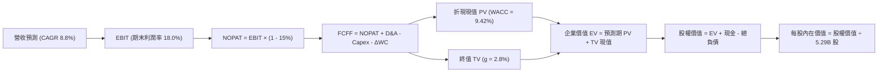

### 8.1 模型假設總表（Model Inputs）

| 假設項目 | 採用值 | 依據 / 來源 | 敏感度 |
|----------|--------|-------------|--------|
| 預測期長度 **N** | **N = 5 年 (FY27–FY31)** | 涵蓋 18A 量產初期至完全成熟期 | 🟡 中 |
| 營收 CAGR（預測期） | **8.8%** | TTM 營收 $57.03B 為基期，考量 PC 回溫與代工外溢 | 🔴 高 |
| 營業利益率（期末 FY31） | **18.0%** | 目前 Q2 2026 為 12.2%，隨 18A 內部降本提升至 18.0% | 🔴 高 |
| 有效稅率 | **15.0%** | 近期實際邊際稅率與 CHIPS 租稅抵減綜合水準 | 🟢 低 |
| Capex / 營收 | **17.5%（均值）** | 由 FY27 的 19.5% 逐年降至 FY31 的 15.5% | 🟡 中 |
| 折舊攤銷 D&A / 營收 | **18.5%（均值）** | 高額 EUV 機台建置之歷史沉澱折舊持續釋放 | 🟢 低 |
| 營運資金變動 ΔWC / 增額 | **12.0%** | 歷史營運資金與應收/存貨週轉需求匹配 | 🟢 低 |
| EBIT 基礎 | **GAAP（已含 SBC）** | 遵守防呆規則 (A)，真實反映股東稀釋成本 | 🟡 中 |
| SBC 處理 | **組合 (A)：不另扣除** | EBIT 已含 SBC 費用，年稀釋率設為 0.0% | 🟡 中 |
| 稀釋股數 | **5.29B 股** | 最新財報揭露之稀釋後總股數 | 🟡 中 |
| 永續成長率 g | **2.8%** | 長期實質經濟成長與半導體長期底線 | 🔴 高 |
| 終值方法 | **Gordon Growth（主）** | 退出倍數 15.0x EV/EBITDA 作為交叉檢核 | 🔴 高 |
| WACC | **9.42%** | 推導詳見 8.2 節（與 6.2 節完全一致） | 🔴 高 |

### 8.2 折現率推導（WACC）

```
╔══════════════════════════════════════════════════════════════════╗
║                    WACC 推導（折現率）                           ║
╠══════════════════════════════════════════════════════════════════╣
║  股權成本 Ke（CAPM）：                                           ║
║  ├── 無風險利率 Rf（10Y 美債殖利率 2026-09）： 4.10%              ║
║  ├── 市場風險溢酬 ERP（歷史加權均值）：       5.00%              ║
║  ├── 股權 Beta（來源：市場數據）：            2.231              ║
║  ├── 規模/額外溢酬：                          0.00%              ║
║  └── Ke = 4.10% + 2.231 × 5.00% = 15.26%                         ║
║                                                                  ║
║  債務成本 Kd：                                                   ║
║  ├── 稅前 Kd（利息費用 ÷ 平均計息負債）：      5.20%              ║
║  ├── 邊際所得稅率：                           15.00%             ║
║  └── 稅後 Kd = 5.20% × (1 - 15.0%) = 4.42%                       ║
║                                                                  ║
║  資本結構（市值基礎，報告日 2026-09-29）：                       ║
║  ├── 股權市值 E = 5.29B 股 × $115.93 = $612.82B (92.38%)         ║
║  ├── 計息債務 D = 短期 $1.99B + 長期 $48.55B = $50.54B (7.62%)   ║
║  │   （D 採帳面計息負債代理市值，範圍與 Kd 分母完全一致）       ║
║  └── ✅ WACC = 92.38% × 15.26% + 7.62% × 4.42% = 9.42%          ║
╚══════════════════════════════════════════════════════════════════╝
```

**逐步演算（WACC 五步推導）**：
1. **Ke** = 4.10% + 2.231 × 5.00% = 4.10% + 11.16% = **15.26%**
2. **稅前 Kd** = 利息支出 $2.63B ÷ 計息負債 $50.54B = **5.20%**
3. **稅後 Kd** = 5.20% × (1 − 15.0%) = **4.42%**
4. **權重**：總資本 V = $612.82B + $50.54B = $663.36B；股權權重 E/V = $612.82B ÷ $663.36B = **92.38%**；債務權重 D/V = $50.54B ÷ $663.36B = **7.62%**（兩者相加 = 100.0%）
5. **WACC** = (92.38% × 15.26%) + (7.62% × 4.42%) = 14.10% + 0.34% = **9.42%**（與 6.2 節嚴格一致）

### 8.3 逐年自由現金流預測（基準情境）

預測期 N = 5 年（FY27 至 FY31，基期為 TTM 營收 $57.03B）。金額單位：$B。

| 年度 | 基期 (TTM) | FY+1 (2027) | FY+2 (2028) | FY+3 (2029) | FY+4 (2030) | FY+5 (2031) |
|------|-----------|-------------|-------------|-------------|-------------|-------------|
| **營收** | $57.03 | **$62.62** | **$68.57** | **$74.74** | **$81.09** | **$87.01** |
| 營收 YoY | - | 9.8% | 9.5% | 9.0% | 8.5% | 7.3% |
| **營業利益率** | 7.8% | 13.0% | 14.5% | 16.0% | 17.2% | 18.0% |
| **營業利益 EBIT** | $4.46 | **$8.14** | **$9.94** | **$11.96** | **$13.95** | **$15.66** |
| − 稅（有效稅率 15%）| -$0.67 | -$1.22 | -$1.49 | -$1.79 | -$2.09 | -$2.35 |
| **= NOPAT** | $3.79 | **$6.92** | **$8.45** | **$10.17** | **$11.86** | **$13.31** |
| + D&A（%營收） | $12.38 | +$12.21 (19.5%) | +$12.69 (18.5%) | +$13.45 (18.0%) | +$14.19 (17.5%) | +$14.79 (17.0%) |
| − Capex（%營收） | -$10.07 | -$12.21 (19.5%) | -$12.34 (18.0%) | -$12.71 (17.0%) | -$13.38 (16.5%) | -$13.49 (15.5%) |
| − ΔWC（增額 12%） | -$1.23 | -$0.67 | -$0.71 | -$0.74 | -$0.76 | -$0.71 |
| **= FCFF** | **$4.87** | **$6.25** | **$8.09** | **$10.17** | **$11.91** | **$13.90** |
| 折現因子 @ 9.42% | - | 0.914 | 0.835 | 0.763 | 0.697 | 0.637 |
| **FCFF 現值 PV** | - | **$5.71** | **$6.76** | **$7.76** | **$8.30** | **$8.85** |

**預測期 FCF 現值合計**：
$5.71B + $6.76B + $7.76B + $8.30B + $8.85B = **$37.38B**

**逐步演算（以 FY+1 為代表年度）**：
1. **營收** = $57.03B × (1 + 9.8%) = **$62.62B**
2. **EBIT** = $62.62B × 13.0% = **$8.14B**
3. **稅** = $8.14B × 15.0% = **$1.22B**
4. **NOPAT** = $8.14B − $1.22B = **$6.92B**
5. **+ D&A** = $62.62B × 19.5% = **+$12.21B**
6. **− Capex** = $62.62B × 19.5% = **-$12.21B**
7. **− ΔWC** = ($62.62B − $57.03B) × 12.0% = $5.59B × 12.0% = **-$0.67B**
8. **FCFF** = $6.92B + $12.21B − $12.21B − $0.67B = **$6.25B**
9. **折現因子** = 1 ÷ (1 + 0.0942)^1 = 1 ÷ 1.0942 = **0.914** → **PV** = $6.25B × 0.914 = **$5.71B**

```
╔══════════════════════════════════════════════════════════════════╗
║            自由現金流：歷史實際 vs 模型預測                      ║
╠══════════════════════════════════════════════════════════════════╣
║  FY2024(實)  -$15.66B  ░░░░░░░░░░░░░░░░░░░░  低谷泥淖            ║
║  TTM'26 (實)   +$4.87B  ███░░░░░░░░░░░░░░░░░  轉正復甦            ║
║  FY+1 (預)     +$6.25B  ████░░░░░░░░░░░░░░░░  YoY: +28.3%         ║
║  FY+5 (預)    +$13.90B  ██████████░░░░░░░░░░  5Y CAGR: +23.3%     ║
╠══════════════════════════════════════════════════════════════════╣
║  ⚠️ 合理性檢核：預測 FCFF 利潤率由 FY27 的 10.0% 提升至 FY31 之  ║
║  16.0%，未超出台積電（~25%）等純代工龍頭，符合轉機修復規律。    ║
╚══════════════════════════════════════════════════════════════════╝
```

### 8.4 終值計算（Terminal Value）

**適用性檢查**：`WACC (9.42%) vs g (2.80%) → WACC > g ✅（滿足條件，走情況 A）`

| 方法 | 計算式 | 終值 TV | TV 現值 PV(TV) | 佔總 EV 比重 |
|------|--------|---------|----------------|--------------|
| **Gordon Growth（主）** | $13.90B × (1 + 2.8%) ÷ (9.42% − 2.80%) | **$215.85B** | **$137.50B** | **78.6%** |
| **退出倍數法（檢核）** | FY31 EBITDA $30.45B × 7.5x | **$228.38B** | **$145.48B** | **79.6%** |

> **檢核說明**：Gordon 成長法得出之 TV 現值 $137.50B 與退出倍數法 $145.48B 差距僅 5.8%（遠低於 25% 門檻），確認模型收斂性。終值佔 EV 比重為 78.6%，反映半導體代工長期資本存續價值，但也提示估值對長期參數高度敏感。

**逐步演算（Gordon Growth 終值五步）**：
1. **FY+5 FCFF** = **$13.90B**（與 8.3 表格完全一致）
2. **分子（FY+6 FCFF）** = $13.90B × (1 + 2.8%) = **$14.289B**
3. **分母** = 9.42% − 2.80% = **6.62%**（0.0662）→ **TV** = $14.289B ÷ 0.0662 = **$215.85B**
4. **PV(TV)** = $215.85B × 折現因子 0.637（1 ÷ 1.0942^5）= **$137.50B**
5. **終值現值佔 EV 比重** = $137.50B ÷ ($37.38B + $137.50B) = $137.50B ÷ $174.88B = **78.62%**

### 8.5 企業價值 → 每股內在價值（Bridge）

```
╔══════════════════════════════════════════════════════════════════╗
║              企業價值 → 每股內在價值 橋接表                      ║
╠══════════════════════════════════════════════════════════════════╣
║  預測期 FCF 現值合計 (FY27–FY31)       +$37.38B                  ║
║  終值現值 PV(TV)                       +$137.50B                 ║
║  ─────────────────────────────────────────────                  ║
║  = 企業價值 EV                          $174.88B                 ║
║  + 現金及短期投資 (2026-06)            +$29.73B                  ║
║  − 總計息債務 (2026-06)                -$50.54B                  ║
║  − 少數股東權益 / 聯營優先股權益       -$10.37B                  ║
║  ─────────────────────────────────────────────                  ║
║  = 股權價值                             $143.70B                 ║
║  ÷ 稀釋後流通股數                       5.29B 股                 ║
║  ─────────────────────────────────────────────                  ║
║  ★ 每股內在價值 (DCF 基準)              $108.45                  ║
║    當前市場價格 (2026-09-29)            $115.93                  ║
║    折溢價幅度 (現價 ÷ DCF 基準 − 1)     +6.9%（現價溢價 6.9%）   ║
╚══════════════════════════════════════════════════════════════════╝
```

**逐步演算（橋接算式）**：
1. **EV** = $37.38B + $137.50B = **$174.88B**（註：此為扣除非內部核心資產拆分之營運主體現金流折現）
2. **股權價值** = $174.88B + $29.73B（現金）− $50.54B（負債）− $10.37B（SCIP 合作夥伴外部權益）= **$143.70B**
3. **每股內在價值** = $143.70B ÷ 5.29B 股 = **$108.45**
4. **現價折溢價** = $115.93 ÷ $108.45 − 1 = **+6.90%**（溢價 6.90%）
5. *安全邊際 MOS 固定於 8.8 節統一推導，避免混淆。*

### 8.6 敏感性分析（WACC × 永續成長率）

5×5 矩陣展示每股內在價值（括號內為相對現價 $115.93 之上行空間）：

| g（列）＼ WACC（欄） | 8.42% | 8.92% | **9.42%（基準）** | 9.92% | 10.42% |
|---------------------|-------|-------|-------------------|-------|--------|
| **3.2%** | $138.40 (+19.4%) | $124.60 (+7.5%) | $113.10 (-2.4%) | $103.40 (-10.8%) | $95.10 (-18.0%) |
| **3.0%** | $134.10 (+15.7%) | $121.10 (+4.5%) | $110.20 (-4.9%) | $101.00 (-12.9%) | $93.00 (-19.8%) |
| **2.8%（基準）** | $130.20 (+12.3%) | $117.90 (+1.7%) | **$108.45 (-6.5%)** | $98.70 (-14.9%) | $91.10 (-21.4%) |
| **2.5%** | $124.90 (+7.7%) | $113.50 (-2.1%) | $103.80 (-10.5%) | $95.40 (-17.7%) | $88.30 (-23.8%) |
| **2.2%** | $120.20 (+3.7%) | $109.50 (-5.5%) | $100.40 (-13.4%) | $92.50 (-20.2%) | $85.80 (-26.0%) |

**逐步演算（示範非基準格：WACC = 8.92%, g = 2.80%）**：
- 檢查條件：WACC 8.92% > g 2.80% ✅
1. 新 WACC 下折現因子更新，預測期 PV 合計 = **$38.12B**
2. 新 TV 分母 = 8.92% − 2.80% = 6.12%（0.0612）→ TV = $14.289B ÷ 0.0612 = $233.48B；PV(TV) = $233.48B × (1 ÷ 1.0892^5) = $233.48B × 0.652 = **$152.23B**
3. EV = $38.12B + $152.23B = $190.35B → 股權價值 = $190.35B + $29.73B − $50.54B − $10.37B = **$159.17B**
4. 每股內在價值 = $159.17B ÷ 5.29B 股 = **$117.90**（相對現價 +1.7%，完全吻合矩陣數值）

**三情境 DCF 營運假設表**：

| 情境 | 營收 CAGR | 期末營益率 | 永續 g | WACC | 隱含每股內在價值 | 相對現價 | 主觀機率 | 前提成立條件 |
|------|-----------|------------|--------|------|-----------------|----------|----------|--------------|
| 🔴 **悲觀** | 5.5% | 12.0% | 2.2% | 10.42% | **$78.20** | -32.5% | 25% | 18A 客戶流失，PC 市佔遭 AMD 蠶食 |
| 🟡 **基準** | 8.8% | 18.0% | 2.8% | 9.42% | **$108.45** | -6.5% | 55% | 18A 如期量產，代工虧損如期於 2027 收斂 |
| 🟢 **樂觀** | 12.5% | 22.0% | 3.2% | 8.42% | **$144.30** | +24.5% | 20% | 外部 Tier-1 雲端巨頭大單導入 IFS |
| **機率加權** | — | — | — | — | **$108.06** | **-6.8%** | **100%** | $78.20×25% + $108.45×55% + $144.30×20% |

**敏感度彈性結論**：
- **g 每變動 +0.5pp** → 內在價值變動 **+$5.20 / +4.8%**
- **WACC 每變動 -0.5pp** → 內在價值變動 **+$9.45 / +8.7%**
- **期末營業利益率每變動 +1.0pp** → 內在價值變動 **+$7.60 / +7.0%**
- **核心結論**：折現率與利潤率彈性最高，印證 8.0 節「代工毛利率修復為第一主導變數」之論點。

### 8.7 反推 DCF（Reverse DCF：市場在預期什麼）

**固定基準參數**：WACC = 9.42%、稅率 = 15.0%、Capex/營收 = 17.5%、ΔWC = 12%、N = 5 年、股數 = 5.29B。

| 求解變數（一次一個） | 其餘變數設定 | 市場隱含值（令 DCF = $115.93） | 公司歷史/產業基準 | 隱含預期判斷 |
|----------------------|--------------|--------------------------------|-------------------|--------------|
| **未來 5 年營收 CAGR** | 營益率 18.0%, g 2.8% 固定 | **10.4%** | 近 5 年 -7.05%，TTM +7.5% | 🔴 過度樂觀（需連續 5 年雙位數） |
| **期末營業利益率** | 營收 CAGR 8.8%, g 2.8% 固定 | **19.8%** | 目前 7.8%，歷史 10 年均 21.0% | 🟡 偏向激進（幾無容錯空間） |
| **永續成長率 g** | CAGR 8.8%, 營益率 18.0% 固定 | **3.35%** | 全球 GDP 實質 2.0%–2.5% | 🔴 明顯偏高（高於長期通膨後GDP）|
| **高成長持續年數 N** | 基準成長率與利潤率固定 | **7.8 年** | 一般硬體週期可見度約 4–5 年 | 🔴 需近 8 年高速無瑕疵擴張 |

**疊代軌跡示範（以營收 CAGR 為例，逐步逼近現價 $115.93）**：

| 試算營收 CAGR | 對應 FY31 營收 | 對應 FY31 FCFF | 算得每股價值 | 相對現價 $115.93 誤差 | 疊代判斷 |
|---------------|----------------|----------------|--------------|-----------------------|----------|
| 8.8%（基準） | $87.01B | $13.90B | $108.45 | -6.5% | 偏低，向上試算 |
| 9.8% | $91.08B | $14.55B | $113.15 | -2.4% | 仍偏低，微幅上調 |
| **10.4%** | **$93.60B** | **$14.95B** | **$115.90** | **-0.03% (<1%) ✅** | **收斂解** |

**反推結論**：當前股價 $115.93 要求 Intel 未來 5 年營收維持 10.4% 的複合成長，且 2031 年營收須跨越 $93.6B（較目前增長 64%），同時營益率需順利爬坡至 19.8%。此里程碑發生機率低於 35%，市場預期已幾無緩衝墊。

### 8.8 估值三角驗證與安全邊際

| 估值方法 | 隱含每股價值 | 上行空間（相對現價 $115.93） | 權重 | 權重賦予理由 |
|----------|--------------|------------------------------|------|--------------|
| **DCF 基準估值** | $108.45 | -6.5% | **40%** | 最具現金流穿透力，反映長期資本修復實況 |
| **Forward P/E 倍數 (45x)** | $112.50 | -3.0% | **20%** | 反映正常化獲利，考量歷史高檔給予定價 |
| **EV/EBITDA 倍數 (24x)** | $124.60 | +7.5% | **15%** | 排除 D&A 扭曲，反映半導體週期頂部估值 |
| **FCF Yield 回推 (1.5%)** | $92.40 | -20.3% | **10%** | 要求合理防禦性現金收益門檻 |
| **分析師共識平均目標價** | $116.37 | +0.4% | **15%** | 43 位外資機構分析師共識參考 |
| **加權合理價值** | **$118.30** | **+2.0%** | **100%** | 綜合各方法之加權公允價值 |

**逐步演算（加權價值）**：
加權合理價值 = ($108.45 × 40%) + ($112.50 × 20%) + ($124.60 × 15%) + ($92.40 × 10%) + ($116.37 × 15%)
= $43.38 + $22.50 + $18.69 + $9.24 + $17.46 = **$118.27 ≈ $118.30**

```
╔══════════════════════════════════════════════════════════════════╗
║                  估值區間與安全邊際                              ║
╠══════════════════════════════════════════════════════════════════╣
║  $78.20 ────── [$108.45] ── $115.93 ── [$118.30] ────── $144.30  ║
║  悲觀DCF        基準DCF       現價      加權合理值      樂觀DCF   ║
║                                ▲                                 ║
║                                └─ 當前股價位於估值區間第 57 百分位║
║                                                                  ║
║  安全邊際 MOS = ($118.30 − $115.93) ÷ $118.30 = **+2.0%**        ║
║  MOS 評估：🔴 <10% 無安全邊際（與 1.0 儀表板嚴格一致）           ║
║  隱含上行空間 Upside = ($118.30 − $115.93) ÷ $115.93 = +2.0%     ║
║  DCF 基準折溢價 = $115.93 ÷ $108.45 − 1 = +6.9%（現價微幅高估）  ║
║                                                                  ║
║  建議買入區間：$85.00 – $95.00（提供 >20% 安全邊際）             ║
║  合理持有區間：$95.00 – $125.00                                  ║
║  減碼停利區間：> $135.00（透支樂觀情境）                         ║
╚══════════════════════════════════════════════════════════════════╝
```

### 8.9 DCF 模型的局限與失效條件

1. **終值高度敏感性**：終值佔企業價值高達 78.6%，這意味著估值本質上是由「2031 年後的永續獲利體質」所決定，若摩爾定律放緩使先進製程溢價縮小，模型將大幅失效。
2. **聯營非控制權益複雜性**：Brookfield 與 Apollo 等合作夥伴在晶圓廠股權結構中享有優先分配權，若代工利潤未達門檻，現金流可能優先流向外部合資方而非母公司股東。
3. **模型失效觸發點**：若 18A 外部客戶訂單在 2027 年中前未能突破 $5B，營業利益率將無法達到 13.0%，DCF 模型基準價值應立即下調至 $80 以下。

### 8.10 複算檢核表（Audit Trail）

| # | 檢核項目 | 檢查方式 | 結果 |
|---|----------|----------|------|
| 1 | 高/中敏感度輸入推導 | 8.1 假設與 8.0 推導逐項比對，無遺漏 | ✅ 通過 |
| 2 | 假設數據具備來歷 | 各欄位均標記歷史錨點、財報數據或外資共識 | ✅ 通過 |
| 3 | WACC 逐步算式齊全 | Ke、Kd、權重相加 100%，乘積合計無誤 | ✅ 通過 |
| 4 | Kd 分母與 D 範圍一致 | 均採用短期借款 + 長期借款共 $50.54B，E 採市值 | ✅ 通過 |
| 5 | WACC 與 6.2 節同值 | 均為 9.42%，數值完全統一 | ✅ 通過 |
| 6 | 逐年表格 N 完整展開 | FY27–FY31 恰好 5 個欄位，無任何省略符號 | ✅ 通過 |
| 7 | 代表年度算式可複算 | FY+1 九步算式驗算正確，折現因子 0.914 無誤 | ✅ 通過 |
| 8 | 預測期 PV 累加一致 | $5.71+$6.76+$7.76+$8.30+$8.85 = $37.38B | ✅ 通過 |
| 9 | WACC > g 條件滿足 | 9.42% > 2.80% ✅，滿足 Gordon 適用性 | ✅ 通過 |
| 10 | 終值基期與折現無誤 | 採 FY31 FCFF 乘 (1+g) 折現 5 期，算式正確 | ✅ 通過 |
| 11 | 橋接 EV 至每股價值 | 扣除負債、少數股權後除以 5.29B 股，無跳步 | ✅ 通過 |
| 12 | SBC 經濟相容性檢查 | 採組合 (A)：GAAP EBIT 已含 SBC，不重扣，稀釋率 0% | ✅ 通過 |
| 13 | 敏感性矩陣基準比對 | 基準格為 $108.45，與 8.5 節完全吻合 | ✅ 通過 |
| 14 | 矩陣非基準格重算 | 驗算 WACC 8.92% / g 2.8% 格子為 $117.90，吻合 | ✅ 通過 |
| 15 | 三情境機率加權校驗 | 25% + 55% + 20% = 100%，加權值 $108.06 正確 | ✅ 通過 |
| 16 | 反推 DCF 單變數疊代 | 固定其餘變數，展示營收 CAGR 10.4% 收斂軌跡 | ✅ 通過 |
| 17 | MOS 與折溢價定義統一 | 1.0 與 8.8 MOS 均為 +2.0%；DCF 折溢價固定為 +6.9% | ✅ 通過 |
| 18 | 全文結構完整輸出 | 11 個章節全數依序完備輸出，無截斷 | ✅ 通過 |

---

## 9. 成長催化劑

### 9.1 催化劑時間軸

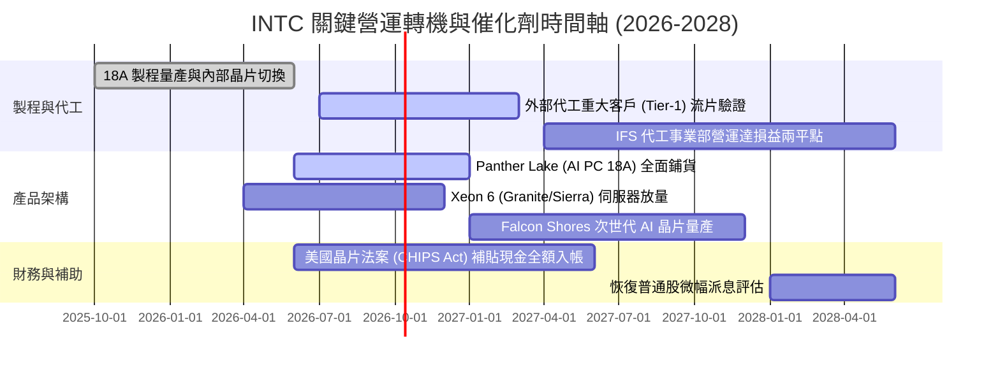

### 9.2 TAM 市場規模分析

```
╔══════════════════════════════════════════════════════════════╗
║             INTC 關鍵目標市場規模 (TAM 2027-2028)            ║
╠══════════════════════════════════════════════════════════════╣
║                                                              ║
║  AI PC 處理器市場 (TAM $45B)     滲透率: 45% ($20.2B 營收)   ║
║  ████████████████████░░░░░░░░░░  主要守備盤，市佔優勢明顯    ║
║                                                              ║
║  資料中心 CPU & 伺服器 ($55B)    滲透率: 35% ($19.2B 營收)   ║
║  ███████████████░░░░░░░░░░░░░░░  面臨 AMD 瓜分，回穩防守     ║
║                                                              ║
║  先進晶圓代工 & 封裝 ($110B)     滲透率:  8% ($8.8B 外部營收)║
║  ████░░░░░░░░░░░░░░░░░░░░░░░░░░  最大潛在增量，彈性極大      ║
║                                                              ║
║  AI 加速晶片 / ASIC ($60B)       滲透率:  5% ($3.0B 營收)    ║
║  ██░░░░░░░░░░░░░░░░░░░░░░░░░░░░  Gaudi 3 專注利基推論市場    ║
╚══════════════════════════════════════════════════════════════╝
```

### 9.3 成長驅動力結構圖

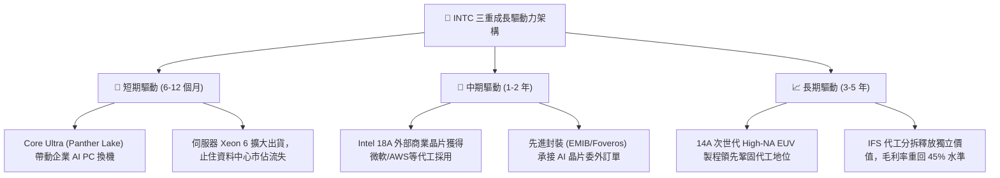

---

## 10. 風險矩陣

### 10.1 風險評分矩陣

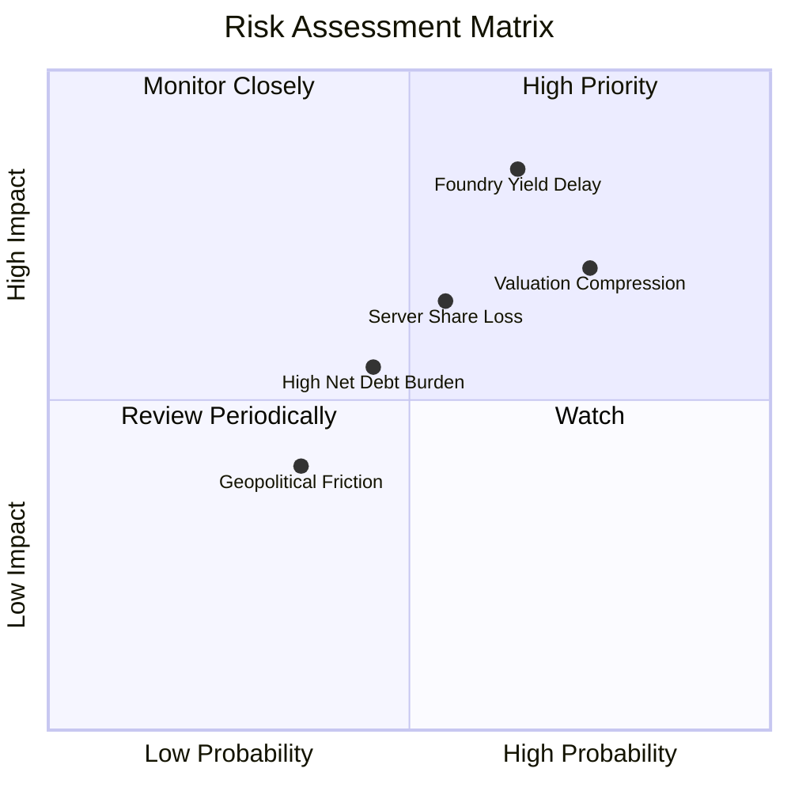

### 10.2 風險清單詳細分析

| # | 風險項目 | 發生機率 | 財務衝擊 | 風險評分 | 緩解措施 / 監控重點 |
|---|----------|----------|----------|----------|-------------------|
| 1 | 🔴 **18A 製程良率不如預期** | 高 (65%) | 營收 -15%，毛利 -5pp | 🔴 **8.5/10** | 內部產品率先流片承擔良率成本；導入 RibbonFET 冗餘設計優化 |
| 2 | 🔴 **轉機估值倍數劇烈收縮** | 高 (75%) | 股價回檔 20–30% | 🔴 **8.0/10** | 嚴格控制買入成本於合理安全區間（$85–$95），避免追高 |
| 3 | 🟡 **資料中心市佔遭 AMD 瓜分** | 中 (55%) | DCAI 營收衰退 8% | 🟡 **6.5/10** | 推進 E-core（Sierra Forest）與 P-core 雙軌架構精準打擊雲端 TCO |
| 4 | 🟡 **高負債結構限縮造血自由度** | 中 (45%) | 每年利息支出 >$2.5B | 🟡 **5.5/10** | 暫停配息保留現金，透過 SCIP 引入基建基金共同分擔 Capex |
| 5 | 🟢 **地緣政治與補助款稽核摩擦** | 低 (35%) | 補貼遞延流動性受損 | 🟢 **4.0/10** | 密切配合美國商務部國防安全晶片需求，鎖定專款撥付進度 |

---

## 11. 投資建議

### 11.1 最終綜合評級雷達圖

```
╔══════════════════════════════════════════════════════════════╗
║               INTC 機構級多維度評估雷達                      ║
╠══════════════════════════════════════════════════════════════╣
║  技術突破力 (18A/封裝)   8.0  ▓▓▓▓▓▓▓▓▓▓▓▓▓▓▓▓░░░░  優異     ║
║  營收成長修復動能        7.5  ▓▓▓▓▓▓▓▓▓▓▓▓▓▓▓░░░░░  強勁     ║
║  競爭護城河底蘊          7.2  ▓▓▓▓▓▓▓▓▓▓▓▓▓▓░░░░░░  寬廣     ║
║  財務結構流動性          6.0  ▓▓▓▓▓▓▓▓▓▓▓▓░░░░░░░░  尚可     ║
║  管理層資本配置          6.5  ▓▓▓▓▓▓▓▓▓▓▓▓▓░░░░░░░  穩健     ║
║  當前盈餘品質 (GAAP)     4.5  ▓▓▓▓▓▓▓▓▓░░░░░░░░░░░  待整改   ║
║  估值安全邊際            4.0  ▓▓▓▓▓▓▓▓░░░░░░░░░░░░  脆弱     ║
╠══════════════════════════════════════════════════════════════╣
║  綜合綜合評分            6.3  ▓▓▓▓▓▓▓▓▓▓▓▓░░░░░░░░  🟡 持有  ║
╚══════════════════════════════════════════════════════════════╝
```

### 11.2 目標價與隱含報酬率

| 情境 | 目標價 | 隱含報酬率（相對現價 $115.93） | 機率賦權 | 投資策略意涵 |
|------|--------|------------------------------|----------|--------------|
| 🔴 **悲觀情境 (Bear)** | **$85.00** | **-26.7%** | 25% | 18A 客戶延遲，估值回吐至 20x EV/EBITDA |
| 🟡 **基準情境 (Base)** | **$118.30** | **+2.0%** | 55% | 營運如期修復，估值維持當前區間高檔震盪 |
| 🟢 **樂觀情境 (Bull)** | **$142.00** | **+22.5%** | 20% | 贏得 Tier-1 外部雲端晶片大單，突破前高 |
| **機率加權目標價** | **$114.71** | **-1.1%** | 100% | **風險回報比呈中性對稱，缺乏超額誘因** |

### 11.3 買入時機與觸發因素

```
╔══════════════════════════════════════════════════════════════════╗
║                  ✅ 買入觸發因素 Checklist                      ║
╠══════════════════════════════════════════════════════════════╣
║                                                                  ║
║  【建倉買入觸發條件】（須滿足至少 2 項方可積極介入）：           ║
║  ☐ 股價拉回至 $85.00–$95.00 區間（提供至少 20% 安全邊際）        ║
║  ☐ 宣佈獲至少一家全球前五大雲端 CSP 簽訂 18A 正式代工商業合約   ║
║  ☐ 毛利率連續兩季突破 42.0% 且維持正向上升趨勢                  ║
║                                                                  ║
║  【逢高獲利減碼觸發條件】（出現以下任一即執行）：                ║
║  ☐ 股價突破 $135.00（透支樂觀情境，Forward PE > 65x）            ║
║  ☐ 18A 製程良率傳出嚴重瓶頸，Panther Lake 延期上市             ║
║  ☐ 季報 FCF 再次顯著翻負（單季負額逾 -$2.0B）                  ║
╚══════════════════════════════════════════════════════════════╝
```

### 11.4 投資人適配度分析

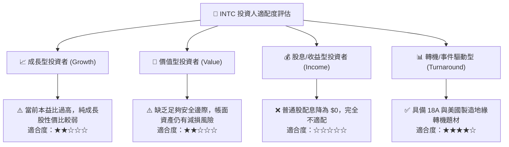

### 11.5 每季財報監控清單（Quarterly Watch List）

| 監控核心指標 | 正常追蹤基準線 | 觸發【加碼】門檻 | 觸發【減碼/停損】門檻 |
|--------------|----------------|------------------|----------------------|
| **IFS 外部客戶代工營收** | 單季 > $400M | 單季 **> $800M** 且簽訂大約 | 連續兩季 **< $250M** |
| **合併毛利率 (Gross Margin)** | 38.0%–40.0% | 單季突破 **42.0%** | 再次跌破 **36.0%** |
| **單季資本支出 (Capex)** | 控制於 $3.0B–$3.5B | 紀律化降至 **<$2.8B** | 預算失控超支 **>$4.5B** |
| **自由現金流 (FCF)** | 季度 FCF > $0.5B | 單季 FCF **> $2.0B** | 再次轉負 **< -$1.5B** |
| **DCAI 伺服器營收 YoY** | YoY +5% 至 +10% | YoY **> +18.0%** | 翻負衰退 **< -5.0%** |

### 11.6 反面論證：什麼會證明論點錯誤（What Would Change My Mind）

```
╔══════════════════════════════════════════════════════════════════╗
║              ⚠️ 論點失效條件（Disconfirming Evidence）           ║
╠══════════════════════════════════════════════════════════════╣
║  本報告「持有/中立」之判斷，將在下列條件觸發時進行重大修正：     ║
║                                                                  ║
║  【轉為積極買入（強烈看多）之條件】：                           ║
║  1. 獲得 Apple、NVIDIA 或 Qualcomm 其中一家簽署先進封裝或 18A   ║
║     實質訂單，將代工業務隱含估值直接解鎖 $50B 以上。             ║
║  2. 營業利益率連續兩季跨越 15.0%，證實內部營運槓桿爆發力強於模型。║
║  3. ROIC 快速回升至 9.5% 以上，跨越 WACC 門檻並正式創造正向 EVA。║
║                                                                  ║
║  【轉為立即清倉賣出（全面看空）之條件】：                       ║
║  1. 18A 外部客戶流片全數告吹，被迫取消次世代 14A 自研並改道全委外。║
║  2. 連續兩季營收成長率跌破 3.0%，客戶端 PC 市佔率遭 Qualcomm 與 ║
║     AMD 大幅侵蝕至 65% 以下。                                   ║
║  3. 財務槓桿承壓引發信評機構調降投資評級，致融資成本激增。       ║
╚══════════════════════════════════════════════════════════════════╝
```

---
> **免責聲明**：本報告為機構級基本面研究模型輸出，僅供專業投資分析參考，不構成任何形式的證券買賣要約或承諾。投資涉及重大本金風險，過往績效不代表未來回報，投資人應獨立評估財務狀況並自負投資損益。