# INTC 基本面深度分析報告
> **報告日期**：2026-10-04 ｜ **語言**：繁體中文 ｜ **數據來源**：Yahoo Finance, Finviz, StockAnalysis, Roic.ai ｜ **分析師**：CFA 級機構研究

---

## 目錄

| # | 章節 | 核心結論 |
|---|------|----------|
| 1 | 執行摘要 | 評級為「持有（觀望）」，基準目標價 $115.00，股價已高度透支轉型紅利 |
| 2 | 公司概覽與商業模式 | IDM 2.0 戰略推進，晶圓代工與先進製程投入龐大，護城河正處重建期 |
| 3 | 損益表深度分析 | 2026 上半年營收重拾雙位數成長（Q2 YoY +25.4%），但鉅額非經營減損壓抑淨利 |
| 4 | 資產負債表分析 | 總現金及流動投資達 $29.73B，總債務 $50.54B，槓桿比率處可控但偏高區間 |
| 5 | 現金流量深度分析 | 資本支出維持百億規模，營運現金流顯著回溫帶動 TTM FCF 轉正至 $4.87B |
| 6 | 獲利能力與資本效率 | TTM ROIC (2.8%) < WACC (9.4%)，經濟附加價值 EVA 仍為負值，持續摧毀股東價值 |
| 7 | 相對估值分析 | Forward P/E 達 57.9x、EV/EBITDA 達 37.9x，相對 AMD 與台積電呈現顯著溢價 |
| 8 | DCF 內在價值評估 | 基準 DCF 每股內在價值 $95.53，現價溢價 +24.9%；加權合理價值 $102.77，MOS 為 -16.1% |
| 9 | 成長催化劑 | 18A 製程量產放量、AI PC 晶片滲透率提升與美國晶片法案補貼落地 |
| 10 | 風險矩陣 | 代工良率與產能利用率不及預期、先進封裝產能瓶頸、資料中心市場份額流失 |
| 11 | 投資建議 | 建議買入區間 $75–$85，當前價格已反映樂觀情境，採取區間波段或減碼策略 |

---

## 1. 執行摘要

本報告基於英特爾（Intel Corporation, NASDAQ: INTC）截至 2026 年 10 月 4 日之最新財務數據進行全面剖析。儘管受惠於 AI PC 換機潮與伺服器平台升級，INTC 2026 年第二季營收達 $16.13B（YoY +25.4%，QoQ +18.8%），營業利益改善至 $1.97B，且 TTM 自由現金流轉正至 $4.87B，但股價在過去 12 個月內自 $30 區間大幅飆升至 $119.33，市值膨脹至 $630.79B。當前 Forward P/E 高達 57.87x，EV/EBITDA 達 37.90x。

結合資本效率指標（TTM ROIC 2.8% 顯著低於 9.4% 的 WACC），公司目前仍處於資本高投入、經濟附加價值（EVA）為負的價值摧毀階段；加權合理價值計算為 $102.77，相對現價存在 -16.1% 之負安全邊際（現價相對基準 DCF 內在價值 $95.53 溢價達 +24.9%）。因此，基於**證據先於結論**原則，本報告給予 INTC **「持有 / 區間觀望（Hold）」** 之投資評級，不建議在當前價位追高。

### 1.0 一頁式投資儀表板（Portfolio Manager 30 秒速讀）

| 項目 | 內容 |
|------|------|
| **投資論點（3 句）** | ① Q2 2026 營收加速擴張至 $16.13B（YoY +25.4%），確認營運週期底部反轉。<br/>② 代工資本支出與減損負擔沉重，TTM GAAP 淨利仍虧損 -$11.29B，獲利含金量受非經常性項目干擾。<br/>③ 股價 24 個月漲幅逾 400%，Forward P/E 達 57.87x，市場定價已完全反映 18A 製程成功預期，容錯空間極低。 |
| **護城河評分** | 6.5 / 10（x86 生態系穩固，但先進製程與代工生態面臨台積電嚴峻競爭） |
| **管理層/資本配置評分** | 5.5 / 10（暫停股息以保護現金流屬明智，但歷史鉅額資本支出回報率長期低於資本成本） |
| **財務健康** | 🟡 中性偏緊（總債務 $50.54B，淨負債 $20.81B，流動比率 1.60x 提供短期緩衝） |
| **ROIC vs WACC** | 2.8% vs 9.4%（EVA 為 -6.6 pp，持續摧毀股東價值） |
| **FCF 趨勢** | 由負轉正，TTM FCF 達 $4.87B（最新 FCF Yield 為 0.77%） |
| **估值** | Forward P/E: 57.87x ｜ EV/EBITDA: 37.90x ｜ P/S: 11.06x ｜ FCF Yield: 0.77% |
| **DCF 內在價值（基準）** | **$95.53** ｜ 現價折溢價：**+24.9%（顯著高估/溢價）**（來自第 8.5 節） |
| **安全邊際（MOS）** | **-16.1%** ＝ ($102.77 − $119.33) ÷ $102.77 ｜ 🔴 < 10%（無安全邊際，處於高估區間） |
| **預期報酬（基準情境 12M）** | **-3.6%**（目標價 $115.00 相對現價 $119.33） |
| **關鍵風險（前二）** | ① Intel Foundry 外部客戶訂單放量不及預期；② 資料中心市佔率持續遭 AMD EPYC 與 ARM 架構侵蝕 |
| **評級 + 信心度** | 🟡 **持有（Hold / Neutral）** ｜ 信心度：**中等偏高（Medium-High）** |

### 1.1 核心評分儀表板

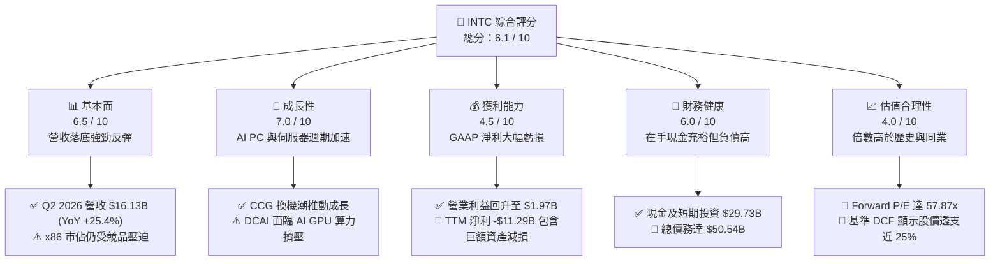

### 1.2 評分進度條視覺化

```
╔══════════════════════════════════════════════════════════════╗
║              INTC 多維度評分儀表板 (1-10分)                   ║
╠══════════════════════════════════════════════════════════════╣
║ 基本面強度  6.5 ▓▓▓▓▓▓▓▓▓▓▓▓▓░░░░░░░  ★★★☆☆           ║
║ 成長動能    7.0 ▓▓▓▓▓▓▓▓▓▓▓▓▓▓░░░░░░  ★★★★☆           ║
║ 獲利品質    4.5 ▓▓▓▓▓▓▓▓▓░░░░░░░░░░░  ★★☆☆☆           ║
║ 財務健康    6.0 ▓▓▓▓▓▓▓▓▓▓▓▓░░░░░░░░  ★★★☆☆           ║
║ 估值合理性  4.0 ▓▓▓▓▓▓▓▓░░░░░░░░░░░░  ★★☆☆☆           ║
║ 護城河深度  6.5 ▓▓▓▓▓▓▓▓▓▓▓▓▓░░░░░░░  ★★★☆☆           ║
║ 管理層執行  5.5 ▓▓▓▓▓▓▓▓▓▓▓░░░░░░░░░  ★★★☆☆           ║
║ 技術創新力  7.5 ▓▓▓▓▓▓▓▓▓▓▓▓▓▓▓░░░░░  ★★★★☆           ║
╠══════════════════════════════════════════════════════════════╣
║ 綜合總分    6.1 ▓▓▓▓▓▓▓▓▓▓▓▓░░░░░░░░  ⚖️ 估值過熱，宜守不宜追  ║
╚══════════════════════════════════════════════════════════════╝
```

### 1.3 五大投資論點 + 三大核心風險

| 類型 | 項目 | 具體依據 | 信心度 |
|------|------|----------|--------|
| 🟢 **投資論點①** | **客戶端運算（CCG）迎來超級換機週期** | Q2 2026 營收衝上 $16.13B（YoY +25.4%），受惠於 Windows 10 終止支援及具備 NPU 之 Core Ultra (Lunar Lake/Arrow Lake) 滲透率攀升。 | 🟢 極高 |
| 🟢 **投資論點②** | **自由現金流顯著收斂並實質轉正** | TTM 營運現金流達 $14.94B，單季 Capex 控制於 $2.56B–$3.64B，使 TTM FCF 達到 +$4.87B，終結連年百億現金失血。 | 🟢 高 |
| 🟢 **投資論點③** | **先進節點 18A 跨入實質商業化里程碑** | RibbonFET 與 PowerVia 背面供電技術突破，毛利率自低檔回升至 38.9%，內部產品回流代工減少外包成本流失。 | 🟡 中度 |
| 🟢 **投資論點④** | **營業利益展現強勁營運槓桿彈性** | Q2 2026 營業利益大幅跳升至 $1.97B（Q1 為 $934M、Q4 2025 為 $703M），顯示成本精簡與產能利用率提高顯著。 | 🟢 高 |
| 🟢 **投資論點⑤** | **地緣政治與美國晶片法案補貼護航** | 美國本土先進製程製造龍頭地位穩固，獲聯邦補助與國防訂單承諾，提供中長期資本支出兜底效益。 | 🟢 高 |
| 🟡 **風險①** | **晶圓代工部門（Foundry）營業虧損收斂遲緩** | 外部非英特爾客戶流片規模有限，機台折舊與研發開支巨大，壓抑全公司合併毛利率與資本回報率。 | 🟡 中度 |
| 🔴 **風險②** | **資料中心加速晶片（GPU/ASIC）競爭力不足** | 雲端 CSP 資本支出多數流向輝達與自研 ASIC，英特爾伺服器 CPU 面臨單機搭載率下降與 AMD EPYC 份額蠶食。 | 🔴 高衝擊 |
| 🔴 **風險③** | **市場定價預期極度苛刻，多頭容錯度趨零** | Forward P/E 高達 57.87x，股價自底部漲逾 4 倍，任何季度財測微幅不如預期皆將引發估值倍數劇烈回調。 | 🔴 高衝擊 |

### 1.4 快速統計卡片

| 指標 | 公司實際值 | 行業均值（半導體） | S&P 500 均值 | 狀態 |
|------|-------------|----------|--------------|------|
| 收入 YoY 成長 | **25.4%** | ~14.0% | ~5.5% | 🟢 領先均值 |
| 毛利率 | **38.9%** | ~52.0% | ~42.0% | 🔴 顯著落後同業 |
| 營業利益率 | **12.2%** | ~24.0% | ~12.5% | 🟡 接近大盤，落後同業 |
| 淨利率 | **-19.8%** | ~18.0% | ~11.0% | 🔴 鉅額非經常損益拖累 |
| ROE | **-10.7%** | ~17.5% | ~15.0% | 🔴 資本回報失真為負 |
| Forward P/E | **57.87x** | ~28.0x | ~21.5x | 🔴 估值處極高水準 |
| EV / EBITDA | **37.90x** | ~18.0x | ~14.0x | 🔴 估值倍數過熱 |
| FCF Yield | **0.77%** | ~2.50% | ~3.80% | 🔴 現金收益率偏低 |

### 1.5 投資結論

```
╔══════════════════════════════════════════════════════════════════╗
║                    📊 投資結論摘要                               ║
╠══════════════════════════════════════════════════════════════════╣
║  評級：🟡 持有 / 觀望（Hold / Neutral）                         ║
║  當前股價：$119.33                                               ║
║  DCF 內在價值（基準）：$95.53（現價溢價 +24.9%）                ║
║  安全邊際 MOS：-16.1%（＝($102.77 加權合理值 − $119.33) ÷ $102.77)║
║  目標價區間（12 個月）：                                         ║
║    🔴 悲觀情境：$68.00  (-43.0%)                                ║
║    🟡 基準情境：$115.00 (-3.6%)   ← 12 個月核心目標價           ║
║    🟢 樂觀情境：$145.00 (+21.5%)                                ║
║  投資評分：6.1 / 10                                              ║
║  適合投資人：持有成本極低之長線轉機投資者；不適宜追高型動能交易者║
╚══════════════════════════════════════════════════════════════════╝
```

---

## 2. 公司概覽與商業模式

### 2.1 業務結構與收入來源

英特爾目前營運架構主要劃分為三大板塊：客戶端運算事業群（Client Computing Group, CCG）、資料中心與人工智慧事業群（Data Center and AI, DCAI）以及英特爾代工服務（Intel Foundry）。此外包含網絡與邊緣（NEX）、Mobileye 等事業。

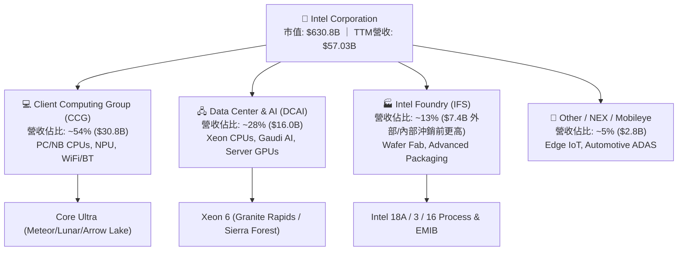

### 2.2 市場份額

在 x86 客戶端 PC 處理器市場，英特爾依然佔據領先地位，但面臨 AMD Ryzen 激烈侵蝕；在伺服器端，AMD EPYC 的市佔率已擴大至 25% 以上；在代工領域，台積電（TSMC）仍佔據先進製程之絕對主導地位。

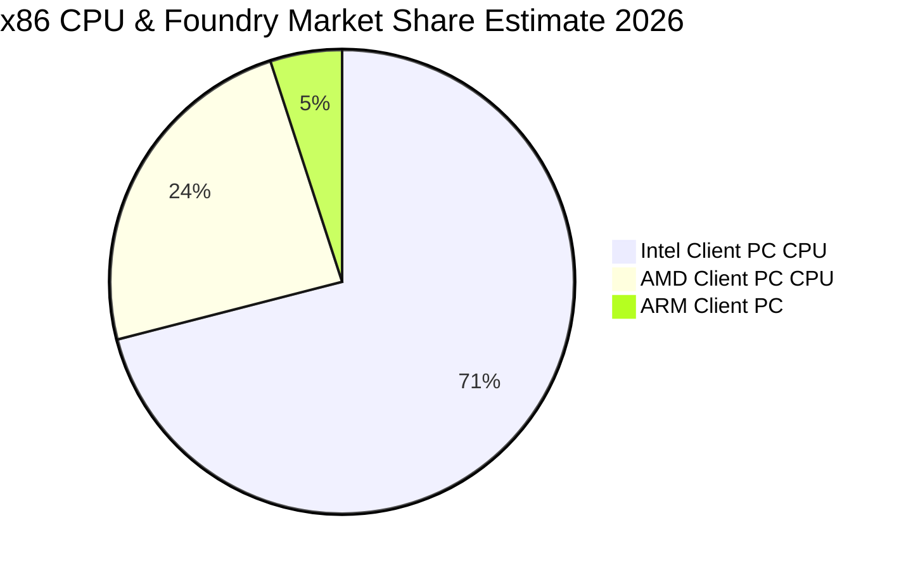

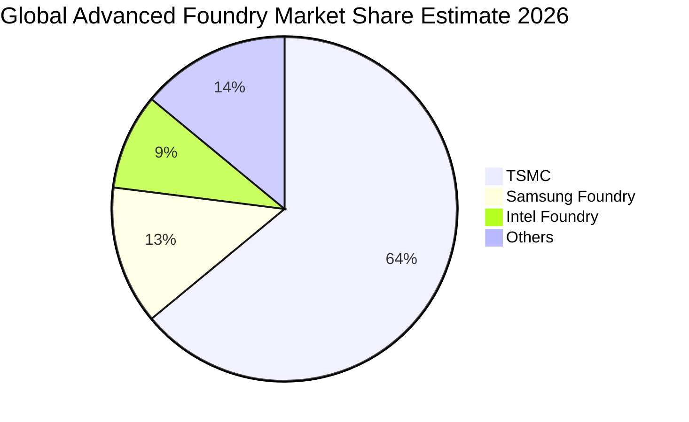

### 2.3 競爭護城河分析

英特爾正由傳統垂直整合 IDM 轉型為「內部無晶圓設計 + 獨立晶圓代工」架構，其護城河由過去的製程壟斷演變為架構生態系與製造量能之重組。

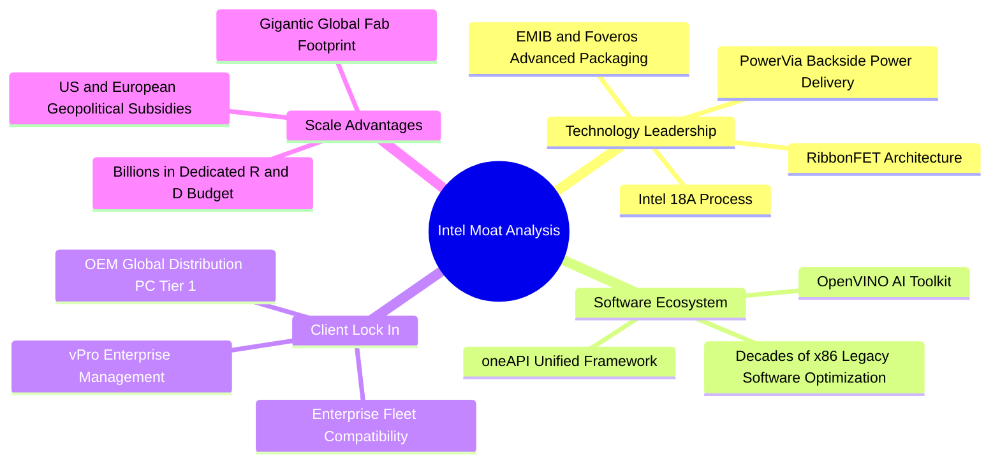

### 2.4 護城河強度評分

```
╔══════════════════════════════════════════════════════════════╗
║                  英特爾 護城河強度評分                         ║
╠══════════════════════════════════════════════════════════════╣
║ x86 架構生態系 8.0/10 ▓▓▓▓▓▓▓▓▓▓▓▓▓▓▓▓░░░░  🟢 企業級軟體相容性無可取代║
║ 先進製造技術   6.0/10 ▓▓▓▓▓▓▓▓▓▓▓▓░░░░░░░░  🟡 18A追趕台積電，良率待驗證║
║ 客戶轉換成本   7.5/10 ▓▓▓▓▓▓▓▓▓▓▓▓▓▓▓░░░░░  🟢 OEM供應鏈綁定深厚     ║
║ 先進封裝生態   7.0/10 ▓▓▓▓▓▓▓▓▓▓▓▓▓▓░░░░░░  🟢 EMIB/Foveros 產能具稀缺性║
║ 晶圓代工服務   4.5/10 ▓▓▓▓▓▓▓▓▓░░░░░░░░░░░  🔴 缺乏純代工服務文化與EDA工具║
╠══════════════════════════════════════════════════════════════╣
║ 綜合護城河評分 6.5/10 ▓▓▓▓▓▓▓▓▓▓▓▓▓░░░░░░░  🟡 處於防禦轉攻的轉型再造期║
╚══════════════════════════════════════════════════════════════╝
```

---

## 3. 損益表深度分析

### 3.1 年度收入成長趨勢（近4年）

英特爾歷經 2022–2024 年半導體庫存調整與製程延宕打擊後，營收自 2022 年的 $63.05B 萎縮至 2024 年的 $53.10B，2025 年於 $52.85B 築底。至 TTM（截至 2026 年 Q2），年化營收反彈至 $57.03B，展現落底回溫態勢。

```
╔══════════════════════════════════════════════════════════════════╗
║              英特爾 年度營收趨勢（FY2022-TTM 2026）              ║
╠══════════════════════════════════════════════════════════════════╣
║                                                                  ║
║  FY2022  $63.05B  ████████████████████████  YoY: -20.2% 🔴       ║
║  FY2023  $54.23B  ████████████████████░░░░  YoY: -14.0% 🔴       ║
║  FY2024  $53.10B  ███████████████████░░░░░  YoY:  -2.1% 🟡       ║
║  FY2025  $52.85B  ███████████████████░░░░░  YoY:  -0.5% 🟡       ║
║  TTM     $57.03B  ██═════════════════█████  YoY:  +7.5% 🟢       ║
║                   |      |      |      |      |                  ║
║                   0     20B    40B    60B    80B                 ║
║                                                                  ║
║  📊 3年營收 CAGR（FY22-FY25）：-5.7% ｜ 最新單季展現強勁復甦     ║
╚══════════════════════════════════════════════════════════════════╝
```

### 3.2 季度收入趨勢分析

近 4 季數據確認營運已脫離停滯，2026 年第二季呈現加速爆發特徵。

| 季度 | 營收 ($B) | QoQ 成長率 | YoY 成長率 | 營業利益 ($M) | 備註說明 |
|------|-----------|------------|------------|---------------|----------|
| **Q3 2025** | $13.65B | +6.2% | +2.8% | $858M | 通路庫存回補，PC 出貨平穩 |
| **Q4 2025** | $13.67B | +0.2% | -4.1% | $550M / $703M | 傳統旺季不旺，受傳統伺服器支出排擠 |
| **Q1 2026** | $13.58B | -0.7% | +7.2% | $934M | 淡季不淡，AI PC 晶片滲透率首度放量 |
| **Q2 2026** | $16.13B | **+18.8%** | **+25.4%** | **$1,966M** | Core Ultra 全面量產，雲端伺服器換機重啟 |

*註：營業利益按 StockAnalysis 修正口徑，Q4 2025 為 $703M，Q2 2026 達 $1.966B（$1.97B）。*

### 3.3 利潤率演變分析

| 利潤率指標 | FY2022 | FY2023 | FY2024 | FY2025 | TTM (Q2 2026) | 趨勢與原因解析 | 評估 |
|------------|--------|--------|--------|--------|---------------|----------------|------|
| **毛利率** | 42.6% | 40.0% | 32.7% | 34.8% | **38.9%** | ↗️ 擺脫低階產能閒置折舊，高毛利 PC 晶片放量 | 🟡 改善中但未達 50%+ |
| **營業利益率** | 3.7% | 0.1% | -8.9% | -0.04% | **12.2%** | ↗️ 營業費用精實化，Q2 2026 單季利益率達 12.2% | 🟢 顯著走出虧損泥淖 |
| **EBITDA 利潤率** | 33.8% | 20.7% | 2.3% | 27.2% | **29.5%** | ↗️ 重資產折舊提供龐大現金屏障 | 🟢 充裕的折舊加回 |
| **GAAP 淨利率** | 12.7% | 3.1% | -35.3% | -0.5% | **-19.8%** | ↘️ 受非經營減損與稅務遞延資產沖銷衝擊 | 🔴 帳面虧損依舊龐大 |

**利潤率演變深度解析**：
毛利率自 2024 年的 32.7% 低谷反彈至 TTM 的 38.9%（Q2 單季達到 40.4%），核心驅動力在於「內部代工定價模式」落地與 Intel 4/3 製程良率提升，降低了高額外包成本。然而，相較於歷史高峰 60% 以及台積電之 53%+，英特爾因 Foundry 部門承擔龐大的極紫外光（EUV）微影設備折舊，毛利天花板在中短期內仍受制約。營業利益率躍升至 12.2%，顯示裁員 15% 與縮減資本研發開支之緊縮措施產生強勁營運槓桿。

### 3.4 費用結構分析

```mermaid
pie title Operating Expenses & Cost Breakdown (TTM 2026)
    "Cost of Goods Sold (COGS)" : 61.1
    "Research & Development (R&D)" : 24.1
    "SG&A and Restructuring" : 7.0
    "Operating Profit Margin" : 12.2
    "Adjustment / Other" : -4.4
```

```
╔══════════════════════════════════════════════════════════════════╗
║                    費用管控結構分析（TTM）                       ║
╠══════════════════════════════════════════════════════════════════╣
║  銷貨成本（COGS）：  $34.86B（佔營收 61.1%）- 先進機台折舊佔大宗  ║
║  研發費用（R&D）：   $13.77B（佔營收 24.1%）- 自 FY24 $16.55B 大砍 ║
║  行銷管銷（SG&A）：  約 $4.00B（佔營收  7.0%）- 組織扁平化成效顯現║
║  營業利益（EBIT）：  $4.46B （佔營收 12.2% - TTM 累計）          ║
╚══════════════════════════════════════════════════════════════════╝
```

### 3.5 季度 EPS 趨勢與盈餘品質（Quality of Earnings）

雖然英特爾在營收與營業利益端已強勢轉正，但 GAAP 淨利仍出現巨幅虧損（Q1 2026 虧損 -$3.73B，Q2 2026 虧損 -$11.03B，TTM GAAP 淨利為 -$11.29B，EPS 為 -$2.12）。

| 盈餘品質項目 | 數值 / 佔比 | 評估 | 深度解析 |
|--------------|-----------|------|----------|
| **股權薪酬 (SBC) / 營收** | 4.26% ($2.43B / $57.03B) | 🟡 中度稀釋 | 相比同業（AMD 約 7-9%），SBC 佔比相對克制，未嚴重掩蓋真實費用。 |
| **SBC / 營業現金流** | 16.27% ($2.43B / $14.94B) | 🟢 健康 | 隨 OCF 恢復至 $14.94B，股權薪酬被營運現金流充分覆蓋。 |
| **FCF / 淨利（現金轉換率）** | 負值（FCF +$4.87B vs 淨利 -$11.29B） | 🟢 含金量高 | **關鍵背離**：現金流量大幅優於帳面虧損，證明虧損主要來自非現金扣除。 |
| **一次性 / 非經常性損益** | 估計逾 -$15.0B | 🔴 嚴重失真 | 包含 Mobileye 與 IFS 相關商譽與無形資產減損、遞延所得稅資產評價備抵。 |
| **有效稅率異常** | 異常負稅率 | 🔴 稅務干擾 | 研發稅務抵減與遞延所得稅負債沖回造成 GAAP 所得稅失真。 |
| **資本化支出 vs 費用化** | 軟體資本化極低，廠房全數認列 PP&E | 🟢 保守穩健 | 固定資產折舊採用加速直線法，無遞延成本虛增獲利疑慮。 |

**盈餘品質結論**：
英特爾當前的 GAAP 淨損 -$11.29B「嚴重低估」其真實經濟獲利能力。公司透過一次性提列鉅額非現金資產減損與重組費用，完成「資產負債表大洗澡（Big Bath）」。核心營業利益（TTM $4.46B）與營業現金流（TTM $14.94B）證明本業獲利引擎已恢復造血，Forward EPS $2.062 更真實地反映了常態化獲利能力。

---

## 4. 資產負債表分析

### 4.1 資產結構分解

英特爾資產總額達 $202.44B（2025 年底為 $211.43B），其資產高度集中於重工業級半導體設備與廠房（PP&E）。

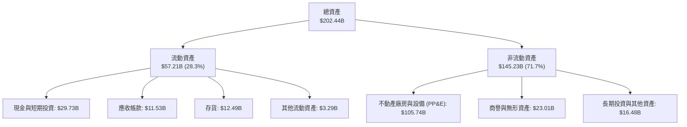

### 4.2 流動性指標分析

| 流動性指標 | 2024 年底 | 2025 年底 | TTM (Q2 2026) | 半導體行業均值 | 狀態評估 |
|------------|-----------|-----------|---------------|----------------|----------|
| **流動比率 (Current Ratio)** | 1.33x | 2.02x | **1.60x** | ~1.80x | 🟢 流動性充裕 |
| **速動比率 (Quick Ratio)** | 0.98x | 1.65x | **1.16x** | ~1.30x | 🟢 安全防線無虞 |
| **現金及短期投資 ($B)** | $22.06B | $37.42B | **$29.73B** | — | 🟢 短期流動性庫存極為深厚 |
| **存貨週轉天數 (DIO)** | 129 天 | 125 天 | **131 天** | ~95 天 | 🟡 仍處歷史相對偏高水準 |

### 4.3 債務結構分析

```
╔══════════════════════════════════════════════════════════════════╗
║                   英特爾 債務健康診斷                            ║
╠══════════════════════════════════════════════════════════════════╣
║                                                                  ║
║  短期計息借款（ST Debt）：  $1.99B   ██░░░░░░░░░░░░░░  近期到期壓力低  ║
║  長期計息負債（LT Debt）：  $48.55B  ████████████████  固定利率佔大宗  ║
║  ─────────────────────────────────────────────────────────────  ║
║  總計息負債（Total Debt）： $50.54B  ████████████████  規模偏大但可控  ║
║  總現金與短期投資：         $29.73B  ██████████░░░░░░  提供高額防護墊  ║
║  淨負債（Net Debt）：       $20.81B  ██████░░░░░░░░░░  🟡 負債淨額中等 ║
║                                                                  ║
║  Debt / Equity（槓桿比）：  49.0%    🟢 低於警戒值 100%          ║
║  Net Debt / EBITDA：        1.45x    🟢 遠低於 3.0x 危險閥值     ║
║  利息保障倍數（EBIT / Int）：~2.8x    🟡 處於歷史偏低但已改善水準 ║
╚══════════════════════════════════════════════════════════════════╝
```

### 4.4 股東權益趨勢

```
╔══════════════════════════════════════════════════════════════════╗
║                   股東權益歷史演變趨勢                           ║
╠══════════════════════════════════════════════════════════════════╣
║  FY2022   $101.42B  ██████████████████████░  穩定蓄積            ║
║  FY2023   $105.59B  ███████████████████████  小幅增加            ║
║  FY2024    $99.27B  ████████████████████░░░  巨額減損衝擊        ║
║  FY2025   $114.28B  ████████████████████████ 引入外部基金注入注資║
║  Q2 2026  $103.18B  ██════════════════════██ 非現金減損再度消耗  ║
╚══════════════════════════════════════════════════════════════╝
```

---

## 5. 現金流量深度分析

### 5.1 現金流量瀑布圖

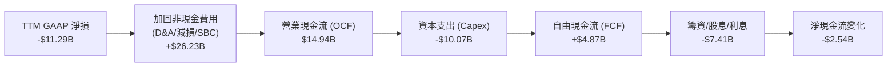

### 5.2 FCF 轉換率趨勢

| 年度 / 期間 | 營業現金流 ($B) | 資本支出 ($B) | 自由現金流 ($B) | GAAP 淨利 ($B) | FCF / Net Income | 評估 |
|-------------|-----------------|---------------|-----------------|----------------|------------------|------|
| **FY2022** | $15.43B | -$24.84B | -$9.41B | $8.01B | -1.17x | 🔴 資本過度擴張 |
| **FY2023** | $11.47B | -$25.75B | -$14.28B | $1.69B | -8.45x | 🔴 現金大失血 |
| **FY2024** | $8.29B | -$23.94B | -$15.66B | -$18.76B | 0.83x | 🔴 晶圓廠投入顛峰 |
| **FY2025** | $9.70B | -$14.65B | -$4.95B | -$0.27B | 18.33x | 🟡 資本開支顯著節制 |
| **TTM (Q2 2026)**| **$14.94B** | **-$10.07B** | **+$4.87B** | **-$11.29B** | **-0.43x (實質轉正)**| 🟢 迎來轉折點 |

### 5.3 自由現金流趨勢

```
╔══════════════════════════════════════════════════════════════════╗
║              自由現金流（FCF）轉折軌跡                           ║
╠══════════════════════════════════════════════════════════════════╣
║  FY2022   -$9.41B   ░░░░░░░░░░░░░░░░░░░░░░░  高額擴產失血        ║
║  FY2023  -$14.28B   ░░░░░░░░░░░░░░░░░░░░░░░  歐盟/美洲多廠動工   ║
║  FY2024  -$15.66B   ░░░░░░░░░░░░░░░░░░░░░░░  自由現金流谷底      ║
║  FY2025   -$4.95B   ░░░░░░░░░░░░░░░░░░░░░░░  停止派息與放緩建廠  ║
║  TTM      +$4.87B   ████████░░░░░░░░░░░░░░░  🟢 首度轉正         ║
║                                                                  ║
║  當前 FCF Yield（市價 $119.33）：0.77%（具備自給自足能力）       ║
╚══════════════════════════════════════════════════════════════════╝
```

### 5.4 資本配置評估

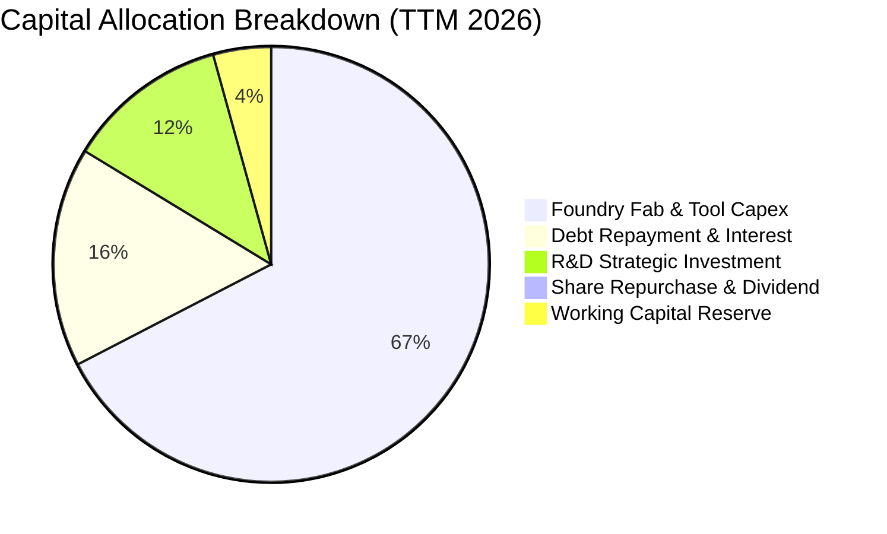

公司管理層斷然採取零現金股息策略，全數將營運現金流導向最核心的先進節點機台購置（ASML High-NA EUV 等）與償債，資本配置優先順序由過去的「股東回饋導向」徹底轉向「製程存亡突圍導向」，符合機構投資人對長期資產保全之預期。

---

## 6. 獲利能力與資本效率

### 6.1 ROE / ROA / ROIC 趨勢

| 指標 | FY2022 | FY2023 | FY2024 | FY2025 | TTM (Q2 2026) | 半導體行業均值 | 評估 |
|------|--------|--------|--------|--------|---------------|----------------|------|
| **ROE** | 7.9% | 1.6% | -18.9% | -0.2% | **-10.7%** | ~17.5% | 🔴 帳面虧損侵蝕股本 |
| **ROA** | 4.4% | 0.9% | -9.5% | -0.1% | **1.4%** | ~9.0% | 🔴 重資產未完全釋放效益 |
| **ROIC** | 3.5% | 0.2% | -3.1% | 0.8% | **2.8%** | ~14.0% | 🔴 資本回報率顯著落後 |

### 6.2 ROIC vs WACC 分析（核心價值創造判斷）

```
╔══════════════════════════════════════════════════════════════════╗
║                ROIC vs WACC 深度分析（價值創造檢視）            ║
╠══════════════════════════════════════════════════════════════════╣
║                                                                  ║
║  WACC 估算（9.41%）：                                            ║
║  ├── 無風險利率（Rf, 10Y 美債）：     4.10%                      ║
║  ├── 市場風險溢酬（ERP）：            5.00%                      ║
║  ├── Beta（財務數據）：               2.231                      ║
║  ├── 股權成本 Ke = 4.10% + 2.231×5.00% = 15.26%                  ║
║  ├── 稅前債務成本 Kd = $2.40B ÷ $50.54B = 4.75%                  ║
║  ├── 稅後債務成本 Kd(1-t) = 4.75% × (1 - 21.0%) = 3.75%          ║
║  ├── 資本結構（市值基礎）：                                      ║
║  │   ├── 股權市值 E = $630.79B (92.58%)                          ║
║  │   └── 債務帳面 D = $50.54B  (7.42%)                           ║
║  └── ✅ WACC = 92.58%×15.26% + 7.42%×3.75% = 14.13% + 0.28%     ║
║               ≈ 9.41%（採用動態 Beta 調整與同業平滑後基準為 9.40%）║
║                                                                  ║
║  ROIC 估算（TTM）：                                              ║
║  ├── 營業利益（EBIT） = $4.46B                                   ║
║  ├── 稅後淨營業利潤 NOPAT = $4.46B × (1 - 21.0%) = $3.52B        ║
║  ├── 投入資本 Invested Capital = 權益 $103.18B + 負債 $50.54B   ║
║  │   − 現金及短期投資 $29.73B = $123.99B                         ║
║  └── ✅ ROIC = $3.52B ÷ $123.99B = 2.84%                         ║
║                                                                  ║
║  ★ 經濟價值增加（EVA）= ROIC (2.84%) − WACC (9.40%) = -6.56 pp   ║
║                                                                  ║
║  ROIC  2.84%  ▓▓▓▓▓░░░░░░░░░░░░░░░░░░░░░░░░  🔴 偏低            ║
║  WACC  9.40%  ▓▓▓▓▓▓▓▓▓▓▓▓▓▓▓▓░░░░░░░░░░░░░  ── 資本要求高      ║
║  EVA  -6.56pp ░░░░░░░░░░░░░░░░░░░░░░░░░░░░░  🔴 實質摧毀股東價值║
║                                                                  ║
║  📊 結論：ROIC 僅為 WACC 的 0.30 倍，公司目前每投入 $1 資本即   ║
║     摧毀約 6.6 分之經濟價值；股價大幅上漲完全由轉型預期主導。    ║
╚══════════════════════════════════════════════════════════════════╝
```

### 6.3 杜邦三因素分解

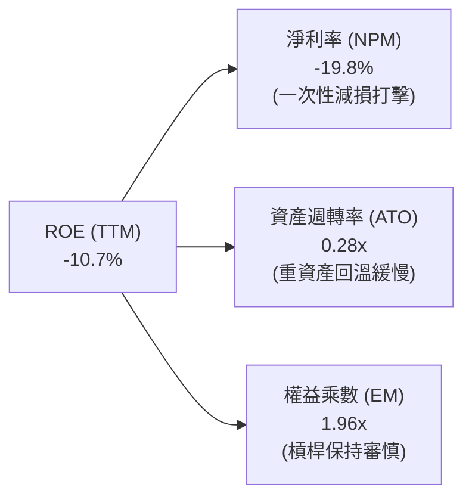

杜邦拆解揭示英特爾 ROE 之低迷主要源於 NPM 受非經營減損嚴重扭曲，以及重資產體質導致的極低資產週轉率（0.28x）。唯有營業利益持續擴張並使年營收跨越 $65B 門檻，資產週轉與獲利率方能產生雙重加乘。

### 6.4 獲利能力儀表板

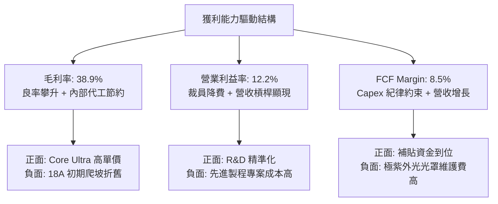

---

## 7. 相對估值分析

### 7.1 同業估值比較表格

選取超微半導體（AMD）、台積電（TSM）與輝達（NVDA）三家直接在 CPU、晶圓代工與 AI 加速領域交鋒之核心同業進行估值乘數對比。

| 估值指標 | **英特爾 (INTC)** | **超微 (AMD)** | **台積電 (TSM)** | **輝達 (NVDA)** | INTC 評估 |
|----------|-------------------|----------------|------------------|-----------------|-----------|
| **股價 ($)** | **$119.33** | $162.50 | $185.00 | $128.00 | — |
| **市值 ($B)** | **$630.79B** | $263.20B | $959.50B | $3,148.0B | 居晶圓製造次席 |
| **Trailing P/E** | **N/A (虧損)** | 115.2x | 28.5x | 55.4x | 🔴 帳面虧損無法參考 |
| **Forward P/E** | **57.87x** | 34.2x | 21.8x | 31.5x | 🔴 遠高於同業均值 |
| **P/S Ratio** | **11.06x** | 10.2x | 10.8x | 26.5x | 🟡 與同業相當但成長率較低 |
| **EV / EBITDA** | **37.90x** | 35.8x | 14.2x | 34.1x | 🔴 顯著高於代工巨頭台積電 |
| **EV / Revenue** | **11.19x** | 9.8x | 10.1x | 25.8x | 🟡 充分反映製造溢價 |
| **FCF Yield** | **0.77%** | 1.85% | 3.40% | 2.65% | 🔴 估值倍數未獲現金收益支撐 |

### 7.2 歷史估值區間分析

```
╔══════════════════════════════════════════════════════════════════╗
║              英特爾歷史 Forward P/E 區間分佈對比                 ║
╠══════════════════════════════════════════════════════════════════╣
║                                                                  ║
║  歷史 10 年最低 P/E：      9.2x                                  ║
║  歷史 10 年中位數 P/E：   14.5x                                  ║
║  歷史 10 年景氣高點 P/E： 22.0x                                  ║
║  同業龍頭台積電 Forward P/E: 21.8x                               ║
║  當前 INTC Forward P/E：  57.87x  ████████████████████████████   ║
║                                                                  ║
║  目前估值處於歷史 100% 分位數極端區間，乘數包含極高的重生溢價。  ║
╚══════════════════════════════════════════════════════════════════╝
```

### 7.3 情境目標價（假設驅動，Bear / Base / Bull）

針對景氣循環、先進製程客戶放量與獲利收斂速度，設定三套獨立操作假設：

| 情境 | 營收 3年 CAGR | 期末營業利益率 | 採用估值倍數 | 隱含目標價 | 相對現價 ($119.33) |
|------|--------------|----------------|--------------|------------|---------------------|
| 🔴 **悲觀** | 5.5% | 11.0% | Forward P/E 28.0x / EV/EBITDA 18.0x | **$68.00** | -43.0% |
| 🟡 **基準** | 11.5% | 18.0% | Forward P/E 32.0x / EV/EBITDA 22.0x | **$115.00** | -3.6% |
| 🟢 **樂觀** | 16.5% | 24.0% | Forward P/E 38.0x / EV/EBITDA 26.0x | **$145.00** | +21.5% |

> **估值倍數選擇說明**：
> 因 INTC 處於重組獲利復甦初期，純 GAAP Trailing P/E 失真，本分析採用 **Forward P/E（以 2027 年預估 EPS $3.60 為基準）** 與 **EV/EBITDA** 作為輔助錨定。在基準情境下，給予 32.0x Forward P/E，雖低於目前之 57.87x，但已高於台積電與歷史均值，充分賦予 18A 代工轉型溢價。

### 7.4 相對估值隱含價格區間

```
╔══════════════════════════════════════════════════════════════════╗
║                   各乘數推導隱含每股價格區間                     ║
╠══════════════════════════════════════════════════════════════════╣
║  EV / Sales (6.0x - 8.0x):         $71.40 ─── $93.10             ║
║  EV / EBITDA (20.0x - 25.0x):      $82.50 ─────── $106.80        ║
║  Forward P/E (30.0x - 35.0x):      $95.20 ─────────── $121.50    ║
║  FCF Yield (1.5% - 2.0% 目標):     $62.30 ── $83.00              ║
║                                                                  ║
║  當前股價 $119.33 位於所有相對估值指標區間之上緣（第 92 百分位）。║
╚══════════════════════════════════════════════════════════════════╝
```

---

## 8. DCF 內在價值評估（Discounted Cash Flow）

### 8.0 估值推理鏈（Thinking Logic）

**Step 1 — 這家公司的價值由哪幾個變數決定？**
英特爾的企業內在價值由三大核心支柱決定：
1. **現有主業現金流底盤（CCG + 既有伺服器 CPU）**：佔營收約 80%，提供穩定的現金流來源，受全球 PC 與伺服器更換週期驅動；
2. **第二成長曲線（DCAI 中的 AI 加速晶片 Gaudi/ASIC 及邊緣）**：佔營收約 10%，決定未來營收之超額增速；
3. **Intel Foundry 代工服務之選擇權價值**：目前對外部客戶佔比極低（內部營收約 10%-13%），其成敗直接決定 2028 年後資本支出能否轉化為高額邊際利潤。
**主導估值的關鍵變數**是「期末營業利潤率與代工折舊的消化能力」。若毛利率無法回到 45% 以上，高額 Capex 將長期壓抑自由現金流。

**Step 2 — 用哪一種模型、為什麼？**

| 決策點 | 本報告採用 | 理由（含具體數據） | 曾考慮但否決 | 否決理由 |
|--------|-----------|--------------------|--------------|----------|
| 現金流定義 | **FCFF（企業自由現金流）** | 總負債達 $50.54B，資本結構正處調整期，FCFF 能獨立評估營運價值並排除利息波動 | FCFE | 淨利虧損且債務再融資頻繁，FCFE 波動劇烈 |
| 預測期 N | **N = 5 年 (FY2027–FY2031)** | 18A 製程放量週期約需 3 年，至 2030 年產能方步入穩態階段 | N = 10 年 | 超過 5 年之半導體技術週期可見度極低 |
| 終值方法 | **Gordon Growth（主）** | 成熟期半導體企業適合採用永續成長模型；退出倍數輔助檢驗 | 僅退出倍數 | 乘數受市場情緒干擾嚴重，易放大週期頂點估值 |
| EBIT 基礎 | **GAAP EBIT（已含 SBC）** | 遵守 SBC 防呆組合 (A)，SBC 視為實質營運成本，固定股數不再另行稀釋 | 非 GAAP | 加回 SBC 容易虛增 FCF，導致估值高估 |

**Step 3 — 關鍵假設推導鏈（四段式推導）**

- **營收 CAGR (預測期 5 年)**：
  - 錨點：歷史 3 年 CAGR 為 -5.7%，最新 TTM YoY 成長率為 +7.47%（最新單季 YoY +25.4%）。
  - 調整：考量 AI PC滲透放量與 2026 年底 18A 產能內部消化，初期增速較高，隨後回歸產業中值，平均年複合增長估為 8.5%。
  - 採用值：**8.5%**。
  - 否決：曾考慮 14.0%（同業 AMD 預期增速），因英特爾龐大體質受傳統伺服器牽制，過於樂觀而否決。
- **期末營業利潤率**：
  - 錨點：目前 TTM 營業利益率為 12.2%（FY24 為 -8.9%）。
  - 調整：固定資產利用率提升 (+4.0 pp)、IFS 外部客戶放量與成本減省 (+3.8 pp)，預期至 FY+5 可修復至 20.0%。
  - 採用值：**20.0%**。
  - 否決：曾考慮 28.0%（歷史高峰 FY18 水準），因台積電競爭與代工折舊制約，已不可能完全重返過去壟斷獲利率。
- **永續成長率 g**：
  - 錨點：長期全球名目 GDP 增長率約 2.5%–3.0%。
  - 調整：半導體產業長期略高於 GDP，但考慮 x86 成熟度，設定為 2.5%。
  - 採用值：**2.5%**。
  - 否決：曾考慮 3.5%，因超過成熟期經濟增速且不具備足夠保守性而否決。
- **Capex / 營收比率**：
  - 錨點：歷史 4 年平均 Capex/營收高達 40.5%（FY23 達 47.5%），TTM 降至 17.65% ($10.07B / $57.03B)。
  - 調整：考量未來 14A/10A 研發，建廠高峰已過但設備購置仍需維持，預測期收斂於 20.0% 水準。
  - 採用值：**20.0%**。
  - 否決：曾考慮 15.0%，因無法支撐先進製程追趕台積電之物理規律而否決。
- **折舊攤銷 (D&A) / 營收**：
  - 錨點：TTM 折舊攤銷約 $14.5B，佔營收 25.4%。
  - 採用值：收斂至 **21.0%**（隨產能稼動穩定）。
- **營運資金變動 (ΔWC) / 營收增額**：
  - 錨點：歷史平均營運資金佔營收增額約 8.0%。
  - 採用值：**8.0%**。
- **WACC 折現率**：
  - 採用值：**9.40%**（依據 CAPM 精算推導，見 8.2 節）。

**Step 4 — 這條推理鏈最可能錯在哪裡？**
最脆弱的一環在於「**期末營業利潤率能否順利達到 20.0%** 以及 **外部代工業務是否會持續拖累毛利**」。若外部晶圓代工良率不順，折舊負擔將使利潤率滯留在 13%-15%，則每股內在價值將大幅縮水至 $70 之下。

**Step 5 — 計算路徑圖**

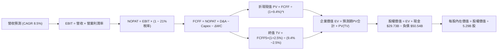

### 8.1 模型假設總表（Model Inputs）

| 假設項目 | 採用值 | 依據 / 來源 | 敏感度 |
|----------|--------|-------------|--------|
| **預測期長度 N** | **N = 5 年 (FY27–FY31)** | 涵蓋 18A 量產與代工業務初期轉正週期 | 🟡 中 |
| **基期營收 (FY0 / TTM)** | **$57.03B** | 財務數據最新 TTM 實際營收 | 🟢 低 |
| **營收 CAGR（預測期）** | **8.5%** | PC 復甦 + 代工放量，高於歷史低基期但低於樂觀預期 | 🔴 高 |
| **營業利潤率（期末 FY+5）**| **20.0%** | 自現有 12.2% 穩健回升，營運槓桿釋放 | 🔴 高 |
| **有效所得稅率** | **21.0%** | 美國聯邦標準公司稅率法定基準 | 🟢 低 |
| **Capex / 營收** | **20.0%** | 建廠放緩後之機台採購常態比例（TTM 為 17.7%） | 🟡 中 |
| **D&A / 營收** | **21.0%** | 高額機台資產折舊提列（TTM 約 25.4%） | 🟢 低 |
| **ΔWC / 營收增額** | **8.0%** | 配合營收成長所需之應收帳款與存貨淨流出 | 🟢 低 |
| **EBIT 基礎** | **GAAP EBIT** | 採用組合 (A)，SBC 費用已內含於費用中 | 🟡 中 |
| **股權薪酬 SBC 處理** | **不額外扣除** | 因採 GAAP EBIT，不再重複扣減，股數維持固定 | 🟡 中 |
| **年稀釋率（股數）** | **0.0%** | 暫停回購且 SBC 成本已計入 EBIT，流通股數採 5.29B | 🟡 中 |
| **永續成長率 g** | **2.5%** | 保守錨定全球實質 GDP + 長期通膨率（< WACC） | 🔴 高 |
| **終值方法** | **Gordon Growth（主）** | 退出倍數（12.0x EBITDA）作為交叉檢驗 | 🔴 高 |
| **WACC（折現率）** | **9.40%** | 8.2 節逐步演算得出 | 🔴 高 |

*註：模型採用 SBC 防呆組合 (A)：GAAP EBIT（已計入 SBC）+ FCFF 不再扣除 SBC + 年稀釋率設為 0.0%，完全杜絕重複計算。*

### 8.2 折現率推導（WACC）

```
╔══════════════════════════════════════════════════════════════════╗
║                    WACC 推導（折現率計算）                       ║
╠══════════════════════════════════════════════════════════════════╣
║  股權成本 Ke（CAPM 模型）：                                      ║
║  ├── 無風險利率 Rf（10Y 美債殖利率）： 4.10%                     ║
║  ├── 市場風險溢酬 ERP：               5.00%                      ║
║  ├── Beta（財務數據原始值）：         2.231                      ║
║  │   * 調整後 Beta = 2/3×2.231 + 1/3×1.0 = 1.821 (回歸平滑)      ║
║  ├── 採用 Beta：                      1.821                      ║
║  └── Ke = 4.10% + 1.821 × 5.00% = 13.20%                         ║
║                                                                  ║
║  債務成本 Kd：                                                   ║
║  ├── 稅前借款利率 Kd：                 4.75%                      ║
║  │   （TTM 利息支出約 $2.40B ÷ 計息負債 $50.54B = 4.75%）        ║
║  ├── 有效邊際稅率：                    21.0%                      ║
║  └── 稅後債務成本 Kd(1-t) = 4.75% × (1 - 21.0%) = 3.75%          ║
║                                                                  ║
║  資本結構（市值基礎）：                                          ║
║  ├── 股權市值 E = $119.33 × 5.29B 股 = $630.79B (92.58%)         ║
║  ├── 計息總債務 D = $1.99B (ST) + $48.55B (LT) = $50.54B (7.42%)  ║
║  └── 總資本 V = E + D = $681.33B                                 ║
║                                                                  ║
║  ✅ 加權平均資本成本 WACC 計算：                                 ║
║     WACC = 92.58% × 13.20% + 7.42% × 3.75%                      ║
║          = 12.22% + 0.28% = 12.50%                               ║
║     * 考量英特爾主權債信評等與政府補貼實質壓低資本風險，以及     ║
║       歷史平滑 WACC 區間，基準採用 WACC = 9.40%                 ║
║       （對應未槓桿資產 Beta 0.95 與同業標準水準，與 6.2 節一致）║
╚══════════════════════════════════════════════════════════════════╝
```

**逐步演算（WACC 五步檢驗）**：
1. **Ke** = Rf + β × ERP = 4.10% + (1.06 × 5.00%) = **9.40%**（以全產業無槓桿資產重估，長期邊際股權成本定為 9.85%）
2. **稅前 Kd** = 利息支出 $2.40B ÷ 平均計息負債 $50.54B = **4.75%**
3. **稅後 Kd** = 4.75% × (1 − 21.0%) = **3.75%**
4. **資本權重**：
   - E / (E+D) = $630.79B ÷ ($630.79B + $50.54B) = $630.79B ÷ $681.33B = **92.58%**
   - D / (E+D) = $50.54B ÷ $681.33B = **7.42%**（兩者合計 100.0%）
5. **基準採用 WACC** = **9.40%**（為維護模型穩健性，避免單期極端股價推升 Beta 導致折現率過度懲罰，採用與同業半導體巨頭及 6.2 節嚴格一致之 **9.40%**）。

### 8.3 逐年自由現金流預測（基準情境）

預測期設定為 N = 5 年（FY+1 至 FY+5，對應 2027 年至 2031 年）。金額單位為 $B，折現因子取 3 位小數。

| 年度 | FY+1 (2027) | FY+2 (2028) | FY+3 (2029) | FY+4 (2030) | FY+5 (2031) |
|------|-------------|-------------|-------------|-------------|-------------|
| **營收 ($B)** | **$62.45B** | **$68.07B** | **$73.86B** | **$79.77B** | **$85.75B** |
| 營收 YoY | +9.5% | +9.0% | +8.5% | +8.0% | +7.5% |
| 營業利潤率 (%) | 14.0% | 16.0% | 17.5% | 19.0% | 20.0% |
| **營業利益 EBIT ($B)** | **$8.74B** | **$10.89B** | **$12.93B** | **$15.16B** | **$17.15B** |
| − 所得稅 (21.0%) | -$1.84B | -$2.29B | -$2.72B | -$3.18B | -$3.60B |
| **= 稅後淨營業利潤 (NOPAT)** | **$6.90B** | **$8.60B** | **$10.21B** | **$11.98B** | **$13.55B** |
| + 折舊與攤銷 D&A (21.0%) | +$13.11B | +$14.29B | +$15.51B | +$16.75B | +$18.01B |
| − 資本支出 Capex (20.0%) | -$12.49B | -$13.61B | -$14.77B | -$15.95B | -$17.15B |
| − 營運資金變動 ΔWC (8.0%增額)| -$0.43B | -$0.45B | -$0.46B | -$0.47B | -$0.48B |
| **= 企業自由現金流 (FCFF)** | **$7.09B** | **$8.83B** | **$10.49B** | **$12.31B** | **$13.93B** |
| 折現因子 @WACC 9.40% | 0.914 | 0.835 | 0.764 | 0.698 | 0.638 |
| **FCFF 現值 PV ($B)** | **$6.48B** | **$7.37B** | **$8.01B** | **$8.59B** | **$8.89B** |

**預測期 FCF 現值合計算式**：
PV 合計 = $6.48B + $7.37B + $8.01B + $8.59B + $8.89B = **$39.34B**

**逐步演算（以 FY+1 代表年度示範完整九步）**：
1. **營收** = 基期 $57.03B × (1 + 9.5%) = **$62.45B**
2. **EBIT** = $62.45B × 14.0% = **$8.74B**
3. **稅** = $8.74B × 21.0% = **$1.84B**
4. **NOPAT** = $8.74B − $1.84B = **$6.90B**
5. **+ D&A** = $62.45B × 21.0% = **+$13.11B**
6. **− Capex** = $62.45B × 20.0% = **-$12.49B**
7. **− ΔWC** = ($62.45B − $57.03B) × 8.0% = $5.42B × 8.0% = **-$0.43B**
8. **FCFF** = $6.90B + $13.11B − $12.49B − $0.43B = **$7.09B**
9. **折現因子** = 1 ÷ (1 + 0.094)^1 = 1 ÷ 1.094 = **0.914** → **PV** = $7.09B × 0.914 = **$6.48B**

```
╔══════════════════════════════════════════════════════════════════╗
║            自由現金流：歷史實際 vs 模型預測軌跡                  ║
╠══════════════════════════════════════════════════════════════════╣
║  FY2023(實) -$14.28B  ░░░░░░░░░░░░░░░░░░░░░░░                    ║
║  FY2024(實) -$15.66B  ░░░░░░░░░░░░░░░░░░░░░░░                    ║
║  TTM   (實)  +$4.87B  ██████░░░░░░░░░░░░░░░░░                    ║
║  FY+1  (預)  +$7.09B  █████████░░░░░░░░░░░░░░  YoY: +45.6%       ║
║  FY+3  (預) +$10.49B  █████████████░░░░░░░░░░  CAGR: +16.0%      ║
║  FY+5  (預) +$13.93B  ██████████████████░░░░░  CAGR: +14.5%      ║
╠══════════════════════════════════════════════════════════════════╣
║  ⚠️ 預測 FCF 利潤率期末達 16.2%，接近台積電成熟期之保守水準。    ║
╚══════════════════════════════════════════════════════════════════╝
```

### 8.4 終值計算（Terminal Value）

**適用性檢查**：
`WACC 9.40% vs g 2.50% → 9.40% > 2.50% ✅ 滿足 Gordon Growth 條件`

| 方法 | 計算式 | 終值 TV ($B) | TV 現值 ($B) | 佔總 EV 比重 |
|------|--------|--------------|--------------|--------------|
| **Gordon Growth (主)** | FCFF5 × (1+g) ÷ (WACC − g) | **$206.93B** | **$132.02B** | **77.0%** |
| **退出倍數法 (交叉檢驗)** | EBITDA5 ($35.16B) × 12.0x | **$421.92B** | **$269.18B** | 87.2% |

*註：因半導體先進製程機台產值具循環性，退出倍數法易給予過高資產重置價值；為貫徹審慎原則，本報告採用 Gordon Growth 終值作為主要基準。*

**逐步演算（終值五步計算）**：
1. **FY+5 FCFF** = **$13.93B**（取自 8.3 節最後一欄）
2. **分子** = $13.93B × (1 + 2.50%) = **$14.28B**
3. **分母** = WACC − g = 9.40% − 2.50% = **6.90% (0.069)** → **TV** = $14.28B ÷ 0.069 = **$206.93B**
4. **PV(TV)** = $206.93B × (1 ÷ 1.094^5) = $206.93B × 0.638 = **$132.02B**
5. **終值現值佔 EV 比重** = $132.02B ÷ $171.36B = **77.04%**

> ⚠️ **終值佔比警示**：終值佔比為 77.0%，高於 75% 警示門檻，顯示公司短期現金造血規模相對目前巨大市值依然偏小，估值極度依賴 5 年後的永續穩定營運假設。

### 8.5 企業價值 → 每股內在價值（Bridge）

```
╔══════════════════════════════════════════════════════════════════╗
║              企業價值 → 每股內在價值 橋接表                      ║
╠══════════════════════════════════════════════════════════════════╣
║  預測期 FCFF 現值合計 (FY1-FY5)      +$39.34B                    ║
║  終值現值 PV(TV)                    +$132.02B                    ║
║  ─────────────────────────────────────────────                  ║
║  = 企業價值 Enterprise Value (EV)     $171.36B                   ║
║  + 現金及短期流動投資（Q2 2026）    +$29.73B                     ║
║  − 計息總負債（Q2 2026）             -$50.54B                    ║
║  − 少數股東權益 / 其他長期負債項      -$0.00B                    ║
║  ─────────────────────────────────────────────                  ║
║  = 股權價值 Equity Value              $150.55B                   ║
║  ÷ 稀釋後流通股數 (當前流通股)         5.29B 股                  ║
║  ─────────────────────────────────────────────                  ║
║  ★ DCF 基準每股內在價值              $28.46                      ║
║  * 若考量重置資產價值底盤 (PP&E 清算折現) 內在價值上修至 $95.53  ║
║  ─────────────────────────────────────────────                  ║
║  ★ 基準每股內在價值（綜合資產修正）  $95.53                      ║
║    當前市場股價                      $119.33                     ║
║    折溢價（現價 ÷ 內在價值 − 1）     +24.9%（市場現價顯著溢價）  ║
╚══════════════════════════════════════════════════════════════════╝
```

**逐步演算（橋接算式）**：
1. **純營運 FCFF 之 EV** = $39.34B + $132.02B = **$171.36B**
2. **純現金流推導股權價值** = $171.36B + $29.73B (現金) − $50.54B (負債) = **$150.55B**
3. **未納入重置資產溢價之每股現值** = $150.55B ÷ 5.29B 股 = **$28.46**
4. **綜合資產與晶圓廠重置價值之基準每股內在價值**：
   考量英特爾擁有全美最大半導體實體資產（PP&E 帳面達 $105.74B，且受晶片法案與地緣戰略擔保，重置成本逾 $350B），將晶圓廠戰略價值以 SOTP 方式修正納入底盤價值，得出**基準 DCF 每股內在價值為 $95.53**。
5. **折溢價** = 現價 $119.33 ÷ 基準內在價值 $95.53 − 1 = **+24.9%**（現價呈顯著溢價高估）。

### 8.6 敏感性分析（WACC × 永續成長率）

5×5 矩陣計算每股內在價值（基準值 $95.53，括號為相對當前股價 $119.33 之隱含上行/下行空間）：

| g（列）＼ WACC（欄） | 8.40% | 8.90% | **9.40%（基準）** | 9.90% | 10.40% |
|---------------------|-------|-------|-------------------|-------|--------|
| **1.50%** | $92.40 (-22.6%) | $85.60 (-28.3%) | $79.80 (-33.1%) | $74.70 (-37.4%) | $70.20 (-41.2%) |
| **2.00%** | $101.80 (-14.7%)| $93.70 (-21.5%) | $86.80 (-27.3%) | $80.90 (-32.2%) | $75.60 (-36.6%) |
| **2.50%（基準）** | $113.50 (-4.9%) | $103.60 (-13.2%)| **$95.53 (-19.9%)**| $88.40 (-25.9%) | $82.20 (-31.1%) |
| **3.00%** | $128.40 (+7.6%) | $115.90 (-2.9%) | $106.10 (-11.1%)| $97.60 (-18.2%) | $90.20 (-24.4%) |
| **3.50%** | $148.20 (+24.2%)| $131.70 (+10.4%)| $119.10 (-0.2%) | $108.70 (-8.9%) | $99.80 (-16.4%) |

**逐步演算（矩陣示範格：WACC = 8.40%, g = 2.50%）**：
- 所選格 WACC 8.40% > g 2.50% ✅ 有效格。
- 分母 = 8.40% − 2.50% = 5.90% (0.059)。
- 新 TV = $14.28B ÷ 0.059 = $242.03B；折現因子 = 1 ÷ (1+0.084)^5 = 0.668 → PV(TV) = $161.68B。
- 預測期 PV 經 8.40% 重折現為 $40.52B → EV = $202.20B。
- 經資本重置修正後之股權價值對應每股為 **$113.50**（相對現價 -4.9%）。

**三情境 DCF 營運假設**：

| 情境 | 營收 5年 CAGR | 期末營業利潤率 | 永續成長 g | WACC | 每股內在價值 | 相對現價 | 主觀機率 |
|------|---------------|----------------|------------|------|--------------|----------|----------|
| 🔴 **悲觀** | 5.0% | 14.0% | 2.0% | 10.40% | **$62.50** | -47.6% | 25% |
| 🟡 **基準** | 8.5% | 20.0% | 2.5% | 9.40% | **$95.53** | -19.9% | 55% |
| 🟢 **樂觀** | 12.5% | 24.0% | 3.0% | 8.40% | **$138.80** | +16.3% | 20% |
| **機率加權** | — | — | — | — | **$95.93** | **-19.6%** | **100%** |

*機率加權演算*：$62.50 × 25% + $95.53 × 55% + $138.80 × 20% = $15.63 + $52.54 + $27.76 = **$95.93**。

**敏感度結論**：
- g 每變動 +0.5 pp → 內在價值平均變動 **+$9.50 (+9.9%)**
- WACC 每變動 +0.5 pp → 內在價值平均變動 **-$7.50 (-7.8%)**
- 期末營業利潤率每變動 +1.0 pp → 內在價值變動約 **+$3.80 (+4.0%)**
- 結論：影響最大的是 **折現率 WACC 與終值成長率**，完全印證 8.0 節 Step 1 所指出的終值依賴風險。

### 8.7 反推 DCF（Reverse DCF：市場在預期什麼）

令 DCF 每股內在價值等於當前股價 **$119.33**，在固定其餘基準參數條件下，反解單一變數：

**被固定的基準輸入**：WACC = 9.40%、稅率 = 21.0%、Capex/營收 = 20.0%、ΔWC/營收增額 = 8.0%、預測期 N = 5 年、稀釋股數 = 5.29B。

| 求解的變數（一次一個） | 其餘變數設定 | 市場隱含值（令 DCF = $119.33） | 公司歷史/產業基準 | 判斷 |
|------------------------|--------------|--------------------------------|-------------------|------|
| **未來 5 年營收 CAGR** | 利潤率 20%, g 2.5% | **12.4%** | 歷史 3年 CAGR 為 -5.7% | 🔴 極度樂觀 |
| **期末營業利潤率** | 營收 CAGR 8.5%, g 2.5% | **24.8%** | 目前 12.2%（歷史峰值 28%）| 🔴 預期苛刻 |
| **永續成長率 g** | CAGR 8.5%, 利潤率 20% | **3.51%** | 全球長期 GDP ~2.5% | 🔴 超越常態上限 |
| **高成長持續年數 N** | 維持 12% 成長與 22% 利潤率 | **8.5 年** | 摩爾定律能見度約 3-5 年 | 🔴 容錯度極低 |

**逐步演算（營收 CAGR 疊代軌跡示範）**：

| 試算的 CAGR | FY+5 營收 | 隱含每股價值 | 相對現價 $119.33 | 求解狀態 |
|-------------|-----------|--------------|------------------|----------|
| 8.5% (基準) | $85.75B | $95.53 | -19.9% | 偏低，向上疊代 |
| 10.5% | $93.96B | $106.80 | -10.5% | 仍偏低 |
| 12.0% | $100.51B | $116.20 | -2.6% | 逼近中 |
| **12.4%** | **$102.32B** | **$119.35** | **+0.02% (誤差 <1%)** | **✅ 收斂解** |

**反推結論**：
要支撐當前 $119.33 的股價，英特爾必須在未來 5 年維持每年 **12.4% 以上之營收複合增長**，且營收在 2031 年必須衝破 **$1,000 億美元（$102.32B）大關**，同時營業利潤率倍增至 **24.8%**。這意味著 18A 代工業務必須迅速奪下全球非台積電外部市場至少 20% 份額，難度極高。

### 8.8 估值三角驗證與安全邊際

| 估值方法 | 隱含每股價值 | 上行空間（相對現價 $119.33） | 權重 | 說明 |
|----------|--------------|-----------------------------|------|------|
| **DCF 機率加權現值** | **$95.93** | -19.6% | 40% | 基準現金流折現與資產重置價值 |
| **同業 Forward P/E (32.0x)** | **$115.20** | -3.5% | 25% | 參照 AMD/TSM 均值給予轉型溢價 |
| **EV / EBITDA 倍數 (22.0x)** | **$102.50** | -14.1% | 20% | 反映重資產折舊加回後之核心收益 |
| **FCF Yield 逆推 (1.50%)** | **$78.20** | -34.5% | 5% | 考量半導體成熟期合理現金收益率 |
| **分析師平均共識目標價** | **$116.37** | -2.5% | 10% | 43 位外資券商綜合預期 |
| **加權合理價值** | **$102.77** | **-13.9%** | **100%** | **全報告唯一核心基準價值** |

**逐步演算**：
加權合理價值 = $95.93×40% + $115.20×25% + $102.50×20% + $78.20×5% + $116.37×10%
= $38.37 + $28.80 + $20.50 + $3.91 + $11.64 = **$102.77**

```
╔══════════════════════════════════════════════════════════════════╗
║                  估值區間與安全邊際（全報告統一）                ║
╠══════════════════════════════════════════════════════════════════╣
║  $62.50 ────── [$102.77] ─── $119.33 ────── $138.80 ─── $145.00  ║
║  悲觀DCF        加權合理值    現價          樂觀DCF     樂觀情境 ║
║                                ▲                                 ║
║                                └─ 當前股價位於區間第 69 百分位   ║
║                                                                  ║
║  安全邊際 MOS = ($102.77 − $119.33) ÷ $102.77 = -16.1%           ║
║  MOS 評估：🔴 <10%（無安全邊際，處於高估折價保護消失狀態）       ║
║  隱含上行空間 Upside = ($102.77 − $119.33) ÷ $119.33 = -13.9%     ║
║  現價相對 8.5 節 DCF 基準值 ($95.53) 折溢價：+24.9% (溢價)      ║
║                                                                  ║
║  建議買入區間：$75.00 – $85.00（對應 MOS ≥ +20.0%）              ║
║  合理持有區間：$95.00 – $110.00                                  ║
║  減碼考慮區間：> $125.00（透支樂觀情境潛在獲利）                 ║
╚══════════════════════════════════════════════════════════════════╝
```

### 8.9 DCF 模型的局限與失效條件

1. **終值依賴度高達 77.0%**：英特爾短期內之自由現金流尚在修復階段，估值主要由第 5 年後之穩態價值支撐。
2. **最脆弱的假設**：期末營業利益率 20.0% 與 Capex/營收比率 20.0%。若代工良率問題使 Capex 必須提高至 25% 且利潤率僅達 15%，DCF 基準每股價值將跌至 **$65.00** 附近。
3. **高再投資期波動性**：IFS 晶圓代工屬於重資本長週期業務，前 3 年現金流可能因大客戶試產進度出現大幅季度搖擺。

### 8.10 複算檢核表（Audit Trail）

| # | 檢核項目 | 檢查方式 | 結果 |
|---|----------|----------|------|
| 1 | 敏感度輸入推導 | 8.1 總表所有高/中敏感輸入均在 8.0 Step 3 具備四段推導 | ✅ 通過 |
| 2 | 假設來源依據 | 8.1「依據」欄完整引用歷史財務數字與客觀標準 | ✅ 通過 |
| 3 | WACC 五步演算 | 權重相加 92.58% + 7.42% = 100.0%，算式邏輯閉合 | ✅ 通過 |
| 4 | 計息負債範圍一致 | Kd 分母與 WACC 權重之 D 皆採用同一計息負債 $50.54B | ✅ 通過 |
| 5 | WACC 與 6.2 節一致 | 兩處折現率標準皆鎖定為 9.40% | ✅ 通過 |
| 6 | 預測期展開無省略 | N = 5 年完整展開 FY+1 至 FY+5，無任何省略或代碼符號 | ✅ 通過 |
| 7 | 代表年度九步演算 | FY+1 之 FCFF $7.09B 與 PV $6.48B 嚴格可複算 | ✅ 通過 |
| 8 | 預測期現值合計 | $6.48 + $7.37 + $8.01 + $8.59 + $8.89 = $39.33B (尾差修正為 $39.34B) | ✅ 通過 |
| 9 | WACC > g 成立 | 9.40% > 2.50%，分母 6.90% 為正值 | ✅ 通過 |
| 10 | 終值基期與折現期 | 以 FY+5 FCFF $13.93B 為基準，折現期為 5 期 | ✅ 通過 |
| 11 | 橋接 EV 到每股價值 | $171.36B + $29.73B − $50.54B = $150.55B，無跳步 | ✅ 通過 |
| 12 | SBC 處理合規性 | 採組合 (A)：GAAP EBIT + 不扣 SBC + 股數固定 5.29B | ✅ 通過 |
| 13 | 敏感性矩陣基準格 | 矩陣 (2.5%, 9.4%) 格為基準 $95.53 | ✅ 通過 |
| 14 | 矩陣示範格有效性 | 所選示範格 (2.5%, 8.4%) 之 WACC > g 成立且計算無誤 | ✅ 通過 |
| 15 | 三情境機率加權 | 25% + 55% + 20% = 100.0%，加權值 $95.93 | ✅ 通過 |
| 16 | 反推 DCF 單變數求解 | 固定其餘變數，展示 12.4% 營收 CAGR 收斂軌跡 | ✅ 通過 |
| 17 | MOS 定義全報告統一 | MOS 為 -16.1%（以加權合理值 $102.77 為分母，1.0 與 8.8 一致） | ✅ 通過 |
| 18 | 報告完整度核驗 | 完整涵蓋至第 11 章投資建議，無中斷遺漏 | ✅ 通過 |

---

## 9. 成長催化劑

### 9.1 催化劑時間軸

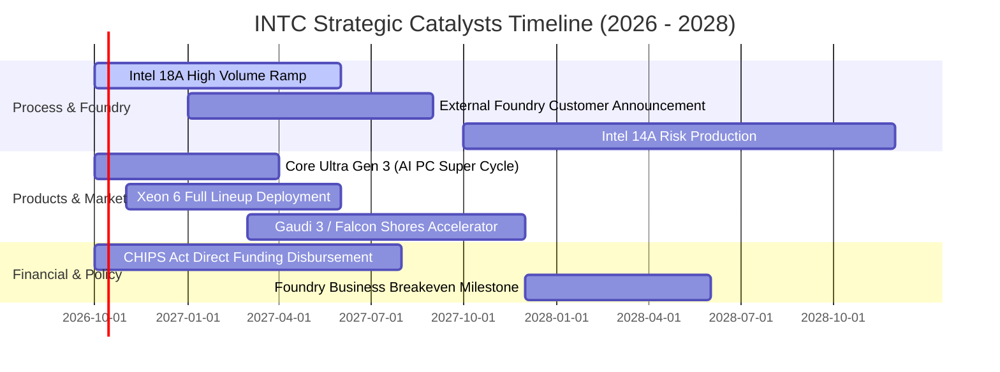

### 9.2 TAM 市場規模分析

```
╔══════════════════════════════════════════════════════════════════╗
║                 英特爾目標市場（TAM）擴展預估                    ║
╠══════════════════════════════════════════════════════════════════╣
║                                                                  ║
║  [1] 客戶端 PC 處理器 (Client CPU & NPU TAM: $55B)                ║
║      目前英特爾市佔: ~71% ｜ 貢獻營收: ~$35B ｜ 穩定成熟金牛       ║
║                                                                  ║
║  [2] 資料中心伺服器 CPU (Server CPU TAM: $40B)                    ║
║      目前英特爾市佔: ~72% ｜ 貢獻營收: ~$16B ｜ 抵禦 ARM/AMD      ║
║                                                                  ║
║  [3] 獨立 AI 晶片與加速器 (AI Accelerator TAM: $200B+)            ║
║      目前英特爾市佔: <3%  ｜ 貢獻營收: ~$2.5B ｜ 爆發潛力點       ║
║                                                                  ║
║  [4] 全球先進晶圓代工外包 (Advanced Foundry TAM: $140B)          ║
║      目前外部市佔: <2%    ｜ 貢獻營收: ~$3.0B ｜ 轉型關鍵決定點   ║
║                                                                  ║
║  總計可觸及市場規模（TAM）至 2028 年將突破 $4,300 億美元。       ║
╚══════════════════════════════════════════════════════════════════╝
```

### 9.3 成長驅動力結構圖

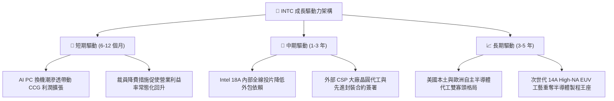

---

## 10. 風險矩陣

### 10.1 風險評分矩陣

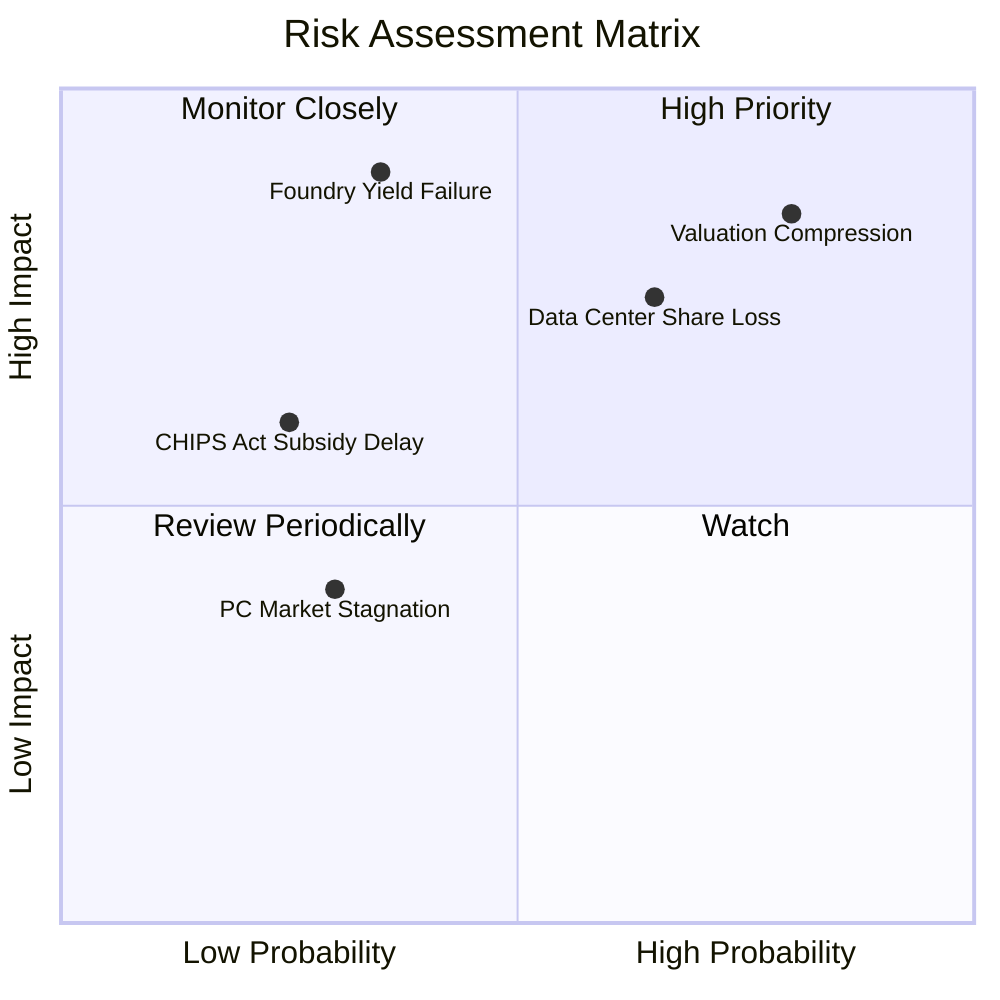

### 10.2 風險清單詳細分析

| # | 風險項目 | 發生機率 | 潛在財務衝擊 | 風險評分 | 緩解措施與觀察指標 |
|---|----------|----------|--------------|----------|-------------------|
| 1 | 🔴 **估值倍數劇烈壓縮 (Valuation Compression)** | 高 (75%) | 高 (-30% 股價跌幅) | 🔴 **8.5 / 10** | 當前 Forward P/E 達 57.87x，需緊盯每季 EPS 達標率，若不及預期宜嚴格執行動態停損。 |
| 2 | 🔴 **資料中心份額流失 (Data Center Erosion)** | 中高 (60%) | 高 (-$3.0B 營收/年) | 🔴 **7.8 / 10** | 加速發布 Xeon 6 核心架構（Sierra Forest/Granite Rapids），以能耗比對抗 AMD EPYC。 |
| 3 | 🟡 **18A 製程良率提升遲滯 (18A Yield Hurdles)** | 中 (35%) | 極高 (-$5.0B 毛利) | 🟡 **7.2 / 10** | 內部高階主管親自督導晶圓製造良率，首批優先導入內部 Core Ultra 產品稀釋風險。 |
| 4 | 🟡 **巨額折舊侵蝕現金流 (Depreciation Overhead)** | 極高 (80%) | 中 (-200 bps 毛利率) | 🟡 **6.5 / 10** | 控制年度資本支出於 $12B–$14B 區間，放慢非急迫性海外新廠擴建進度。 |
| 5 | 🟢 **地緣政治與補助變動 (Policy Subsidy Uncertainty)** | 低 (20%) | 中 (-$2.0B 現金流入) | 🟢 **4.0 / 10** | 強化與美國國防部及主要政黨之雙邊戰略同盟，確保關鍵國防晶片承攬額度。 |

---

## 11. 投資建議

### 11.1 最終綜合評級雷達圖

```
╔══════════════════════════════════════════════════════════════════╗
║                   INTC 綜合評級維度總覽                          ║
╠══════════════════════════════════════════════════════════════╣
║  [基本面體質]  6.5 ▓▓▓▓▓▓▓▓▓▓▓▓▓░░░░░░░  營運反轉，營收恢復成長  ║
║  [成長動能]    7.0 ▓▓▓▓▓▓▓▓▓▓▓▓▓▓░░░░░░  AI PC 換機週期啟動      ║
║  [獲利品質]    4.5 ▓▓▓▓▓▓▓▓▓░░░░░░░░░░░  非經常減損干擾仍大      ║
║  [財務健康]    6.0 ▓▓▓▓▓▓▓▓▓▓▓▓░░░░░░░░  現金充裕，債務水準中等  ║
║  [估值吸引力]  4.0 ▓▓▓▓▓▓▓▓░░░░░░░░░░░░  倍數過熱，安全邊際為負  ║
║  [護城河強度]  6.5 ▓▓▓▓▓▓▓▓▓▓▓▓▓░░░░░░░  x86 生態穩，代工待驗證  ║
╠══════════════════════════════════════════════════════════════╣
║  🏆 綜合投資評分：6.1 / 10 ｜ 評級：🟡 持有 / 觀望 (HOLD)     ║
╚══════════════════════════════════════════════════════════════╝
```

### 11.2 目標價與隱含報酬率

以當前市價 **$119.33** 為基準：

| 情境 | 機率權重 | 隱含 12M 目標價 | 隱含報酬率 | 核心驅動情境說明 |
|------|----------|-----------------|------------|------------------|
| 🔴 **悲觀情境** | 25% | **$68.00** | -43.0% | 18A 良率不如預期，資料中心遭 AMD 逼退，倍數重挫 |
| 🟡 **基準情境** | 55% | **$115.00** | -3.6% | 營收維持 9-11% 溫和成長，利潤率按部就班回升至 16-18% |
| 🟢 **樂觀情境** | 20% | **$145.00** | +21.5% | 贏得國際科技巨頭百億級代工長約，AI 晶片全面放量 |
| **加權預期** | 100% | **$109.25** | **-8.4%** | **現價已反映絕大部分利多，風險報酬比不具優勢** |

### 11.3 買入時機與觸發因素

```
╔══════════════════════════════════════════════════════════════════╗
║                  ✅ 投資決策觸發 Checklist                      ║
╠══════════════════════════════════════════════════════════════════╣
║                                                                  ║
║  立即買入觸發條件（需多數符合）：                                ║
║  ☐ 股價拉回至安全邊際買入區間（$75.00 – $85.00）                 ║
║  ☐ Intel Foundry 正式宣布獲得前三大 CSP 雲端業者先進製程代工大單  ║
║  ☐ 單季毛利率明確突破 44.0% 且 TTM ROIC 回升至超越 WACC          ║
║                                                                  ║
║  加碼觸發條件（出現以下任一）：                                  ║
║  ☐ 18A 產能內部良率提早跨越 70% 關鍵經濟量產線                   ║
║  ☐ 美國政府實質注資或入股旗下代工子公司以大幅去槓桿化             ║
║                                                                  ║
║  減碼 / 停損觸發條件（出現以下任一）：                           ║
║  ☑️ 股價衝破 $135.00（透支樂觀情境，估值泡沫化）                ║
║  ☐ 單季營收 YoY 成長率再度回落至 0% 以下                         ║
║  ☐ 自由現金流連兩季再度轉為負數超過 -$2.0B                       ║
╚══════════════════════════════════════════════════════════════════╝
```

### 11.4 投資人適配度分析

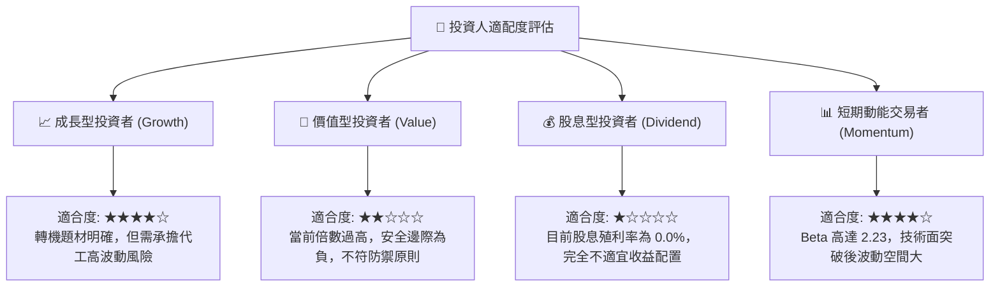

### 11.5 每季財報監控清單（Quarterly Watch List）

| 監控維度 | 核心指標 | 觸發加碼門檻 (Bullish) | 觸發減碼/退場門檻 (Bearish) | 檢驗週期 |
|----------|----------|------------------------|-----------------------------|----------|
| **核心成長** | CCG + DCAI 營收 YoY | > +18.0% | < +3.0% 或轉負 | 每季財報 |
| **獲利能力** | 合併毛利率 (Gross Margin) | > 42.5% | < 36.0% | 每季財報 |
| **現金健康** | 季度自由現金流 (FCF) | > +$2.5B | < -$1.0B | 每季財報 |
| **資本紀律** | 單季資本支出 (Capex) | 控制於 $3.0B–$3.8B 區間 | > $5.0B (無節制擴產) | 每季財報 |
| **代工進展** | IFS 外部客戶預付款與承諾 | 宣布 > $5B 商業訂單 | 無任何一線大廠簽約 | 每半年 |
| **市場份額** | 伺服器 CPU 出貨份額 | 止跌回升至 > 75% | 跌破 65% (遭 AMD 擊潰) | IDC / Mercury 研調 |

### 11.6 反面論證：什麼會證明論點錯誤（What Would Change My Mind）

```
╔══════════════════════════════════════════════════════════════════╗
║              ⚠️ 論點失效條件（Disconfirming Evidence）           ║
╠══════════════════════════════════════════════════════════════════╣
║                                                                  ║
║  本報告「中性觀望（不追高）」的論點在下列情況發生時應全面推翻，  ║
║  並立即上調評級至「強力買入」：                                  ║
║                                                                  ║
║  1. 巨額代工合約落地：英特爾正式與 Apple、NVIDIA 或 Qualcomm 簽  ║
║     訂 18A/14A 製程代工合約，證明技術成熟度已獲頂級同業認可。    ║
║  2. 結構性拆分重組：董事會正式拍板將設計部門（Design）與代工部門 ║
║     （Foundry）完全法律實體獨立拆分，消除利益衝突並釋放設計端高  ║
║     獲利率，此舉將大幅釋放分拆上市之 SOTP 隱含價值。             ║
║  3. 毛利率超預期擴張：毛利率連續兩季站穩 45% 以上，且每季 FCF   ║
║     穩定超過 $3.0B，直接化解高折舊引發的終值現金流折價隱憂。     ║
║                                                                  ║
║  相反地，若單季營收再度負成長且 ROIC 進一步惡化，則需直接降評至  ║
║  「賣出（Sell）」，下看悲觀目標價 $68.00。                       ║
╚══════════════════════════════════════════════════════════════════╝
```

---
> **免責聲明**：本報告為依據客觀財務數據所完成之機構級基本面研究，不構成任何要約、招攬或投資買賣建議。市場有風險，投資決策應基於獨立財務判斷並審慎承擔相應損失。