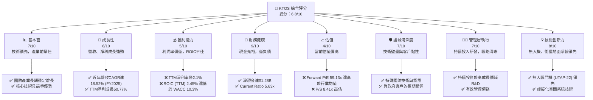
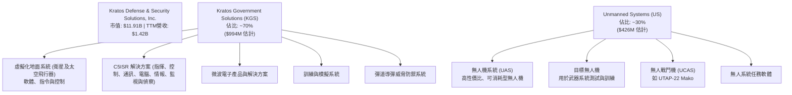
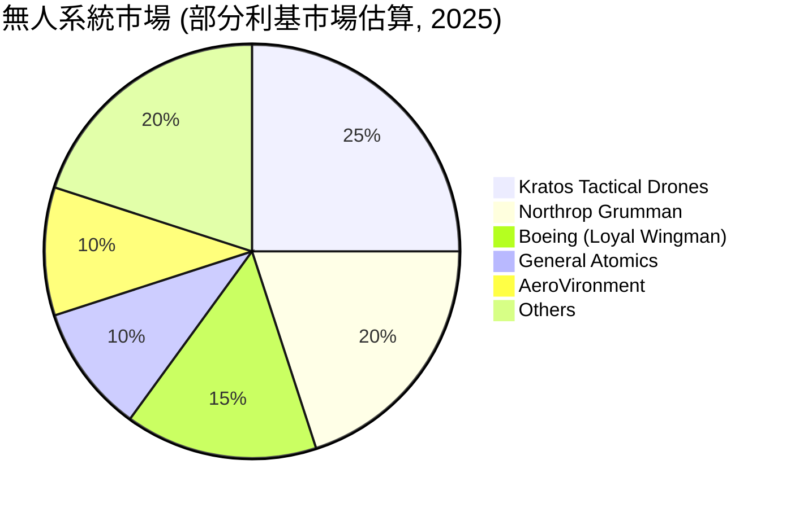
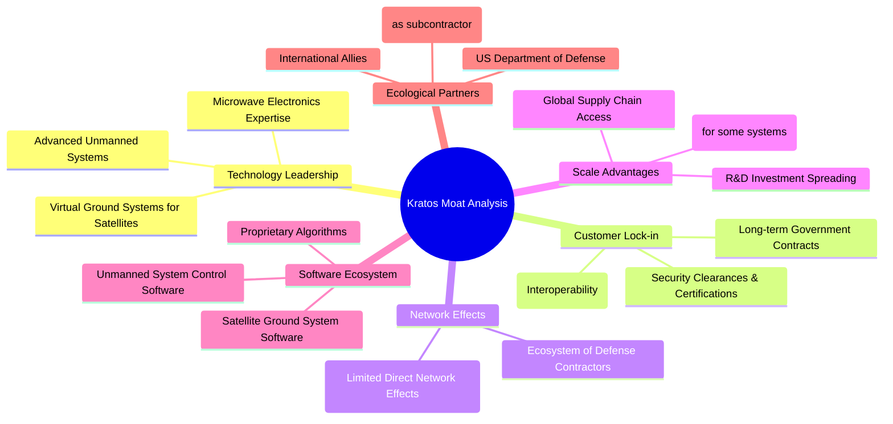
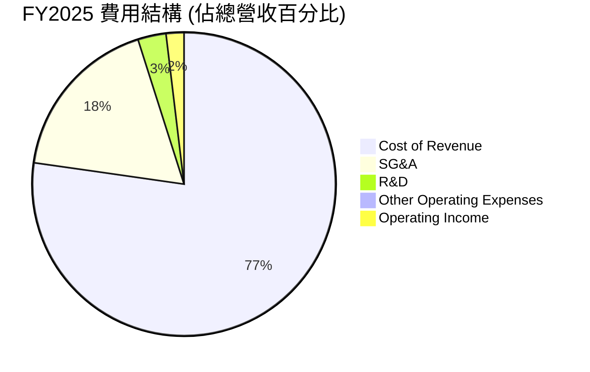
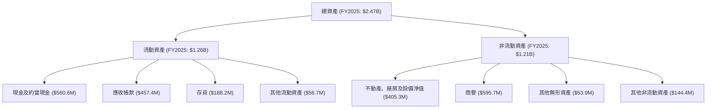

# KTOS 基本面深度分析報告
> **報告日期**：2026-06-01 ｜ **語言**：繁體中文 ｜ **數據來源**：Yahoo Finance, Finviz, StockAnalysis, Roic.ai ｜ **分析師**：CFA 級機構研究

---

## 目錄

| # | 章節 | 核心結論 |
|---|------|----------|
| 1 | 執行摘要 | 評級：持有；目標價區間：$75.00 - $105.00 |
| 2 | 公司概覽與商業模式 | 在國防科技利基市場具備技術護城河，但規模效應有待提升。 |
| 3 | 損益表深度分析 | 營收成長穩健，但利潤率偏低且波動，顯示成本控制與定價能力仍待加強。 |
| 4 | 資產負債表分析 | 流動性良好，現金充裕，債務水準低，財務健康狀況優異。 |
| 5 | 現金流量深度分析 | 自由現金流近期轉負，顯示成長投資壓力，需密切關注。 |
| 6 | 獲利能力與資本效率 | ROIC遠低於WACC，短期內未能有效創造股東價值，但趨勢改善中。 |
| 7 | 估值深度分析 | 當前估值偏高，市場已充分反映未來成長預期，但高成長潛力提供一定支撐。 |
| 8 | 成長催化劑 | 無人系統、衛星通訊、國防預算增加為主要成長引擎。 |
| 9 | 風險矩陣 | 政府合約依賴、研發投入高、執行風險、估值過高為主要考量。 |
| 10| 投資建議 | 建議「持有」，等待獲利能力提升及估值回歸合理區間。 |

---

## 1. 執行摘要

Kratos Defense & Security Solutions, Inc. (KTOS) 是一家專注於國防、國家安全及商業市場的高科技公司，尤其在無人系統和虛擬化地面衛星系統等領域具有領先技術。公司在過去一年展現了強勁的營收成長，但其獲利能力指標（如毛利率、營業利益率）相對較低，且資本效率（ROIC）未能超過資本成本（WACC），表明其在創造股東價值方面面臨挑戰。儘管分析師普遍給予正面評級且目標價顯著高於現價，但當前的高估值已充分反映了未來的成長預期。

### 1.1 核心評分儀表板



### 1.2 評分進度條視覺化

```
╔══════════════════════════════════════════════════════════════╗
║              KTOS 多維度評分儀表板 (1-10分)                  ║
╠══════════════════════════════════════════════════════════════╣
║ 基本面強度  7.0 ▓▓▓▓▓▓▓▓▓▓▓▓▓▓░░░░░░  ★★★★☆           ║
║ 成長動能    8.0 ▓▓▓▓▓▓▓▓▓▓▓▓▓▓▓▓░░░░  ★★★★☆           ║
║ 獲利品質    5.0 ▓▓▓▓▓▓▓▓▓▓░░░░░░░░░░  ★★★☆☆           ║
║ 財務健康    9.0 ▓▓▓▓▓▓▓▓▓▓▓▓▓▓▓▓▓▓░░  ★★★★★           ║
║ 估值合理性  4.0 ▓▓▓▓▓▓▓▓░░░░░░░░░░░░  ★★☆☆☆           ║
║ 護城河深度  7.0 ▓▓▓▓▓▓▓▓▓▓▓▓▓▓░░░░░░  ★★★★☆           ║
║ 管理層執行  7.0 ▓▓▓▓▓▓▓▓▓▓▓▓▓▓░░░░░░  ★★★★☆           ║
║ 技術創新力  8.0 ▓▓▓▓▓▓▓▓▓▓▓▓▓▓▓▓░░░░  ★★★★☆           ║
╠══════════════════════════════════════════════════════════════╣
║ 綜合總分    6.8 ▓▓▓▓▓▓▓▓▓▓▓▓▓▓░░░░░░  🏆 評語：成長性強勁，但獲利與估值需關注。 ║
╚══════════════════════════════════════════════════════════════════╝
```

### 1.3 五大投資論點 + 三大核心風險

| 類型 | 項目 | 具體依據 | 信心度 |
|------|------|----------|--------|
| 🟢 **投資論點①** | **無人系統市場的強勁成長** | Kratos在無人戰鬥機（UCAV）和目標無人機領域處於領先地位，市場需求因全球地緣政治緊張及國防現代化而持續增長。FY2025營收達$1.35B，其中無人系統業務成長為主要貢獻。該部門的技術壁壘高，具備長期成長潛力。 | 🟢 極高 |
| 🟢 **衛星與空間系統的技術領先** | 公司提供虛擬化地面系統，為下一代衛星和空間應用提供關鍵軟體和硬體。隨著太空經濟的蓬勃發展和衛星通訊需求的增加，KTOS在該領域的技術優勢將帶來穩定的收入流。TTM營收YoY成長達22.6%，部分歸因於此類高科技解決方案的部署。 | 🟢 極高 |
| 🟢 **穩健的財務健康狀況** | 截至2026年3月，公司擁有$1.46B的總現金和僅$185.40M的總債務，淨現金高達$1.28B。Current Ratio達5.626，顯示極高的流動性和財務彈性，能夠支持未來的研發投入和潛在的戰略性收購。 | 🟢 高 |
| 🟢 **長期國防預算支撐** | 作為國防承包商，Kratos受益於美國及其盟友不斷增長的國防預算。在當前複雜的國際形勢下，對先進國防技術的投資是長期趨勢，為KTOS提供了穩定的業務基礎和訂單來源。FY2025營收達$1.35B，顯示國防市場的持續需求。 | 🟢 高 |
| 🟢 **持續的研發投入與創新** | 公司持續投入大量資源於研發，FY2025研發費用為$40.00M，顯示其致力於維持技術領先地位。這確保了其產品組合的競爭力，並能抓住新興市場機會，如低成本可消耗型無人機的發展。 | 🟢 高 |
| 🟡 **風險①** | **政府合約依賴與預算波動** | KTOS的營收高度依賴於政府合約，這些合約可能受到國防預算審批、政治變動和採購優先級調整的影響。一旦重要合約未能續簽或被取消，將對公司營收和獲利造成顯著衝擊。儘管長期趨勢向上，但短期波動性依然存在。 | 🟡 中度 |
| 🔴 **獲利能力與資本效率偏低** | 儘管營收增長強勁，KTOS的獲利能力指標如毛利率（TTM 22.9%）和淨利率（TTM 2.1%）相對較低。更重要的是，其ROIC (TTM 2.45%) 遠低於WACC (約10.3%)，表明公司在利用資本創造價值方面效率不高，長期可能影響股東回報。 | 🔴 高衝擊 |
| 🔴 **當前估值過高** | KTOS的Forward P/E高達59.13x，P/S為8.41x，這些估值倍數遠高於行業平均水準。這可能意味著市場已經充分甚至過度反映了其未來的成長潛力。若未來成長未能達到市場預期，或利潤率改善不及預期，股價面臨較大的下行風險。 | 🔴 高衝擊 |

### 1.4 快速統計卡片

| 指標 | 公司實際值 | 行業均值 (航空航天與國防) | S&P 500 均值 | 狀態 |
|------|-------------|-------------------------|--------------|------|
| 收入 YoY 成長 | **22.6% (TTM)** | ~8-12% | ~10-15% | 🟢 |
| 毛利率 | **22.9% (TTM)** | ~20-30% | ~35-45% | 🟡 |
| 淨利率 | **2.1% (TTM)** | ~5-10% | ~8-12% | 🔴 |
| ROE | **1.2% (TTM)** | ~10-15% | ~15-20% | 🔴 |
| Forward P/E | **59.13x** | ~18-25x | ~20-25x | 🔴 |
| Debt/Equity | **5.437%** (Finviz 0.05) | ~20-50% | ~40-60% | 🟢 |
| Current Ratio | **5.626x** | ~1.5-2.5x | ~1.0-1.5x | 🟢 |
| Net Cash / Debt | **$1.28B** | N/A | N/A | 🟢 |

*註：行業均值為分析師根據航空航天與國防產業特性進行估算，S&P 500 均值為普遍市場參考值。*

### 1.5 投資結論

```
╔══════════════════════════════════════════════════════════════════╗
║                    📊 投資結論摘要                               ║
╠══════════════════════════════════════════════════════════════════╣
║  評級：🟡 持有                                                   ║
║  當前股價：$63.49                                                ║
║  目標價區間：                                                    ║
║    悲觀情境：$75.00（+18.13%）                                   ║
║    基準情境：$90.00（+41.76%）  ← 12個月主要目標                 ║
║    樂觀情境：$105.00（+65.38%）                                  ║
║  投資評分：6.8/10                                                ║
║  適合投資人：看好國防科技長期成長、能夠承受較高估值波動的成長型投資者。 ║
╚══════════════════════════════════════════════════════════════════╝
```

**評級理由**：KTOS在國防與安全市場的利基領域具有強勁的成長潛力，尤其在無人系統和衛星通訊技術方面表現出色。公司擁有極佳的財務健康狀況，現金充裕且債務負擔輕。然而，其獲利能力指標和資本效率表現不佳，且當前估值已顯著偏高，充分甚至過度反映了未來的成長預期。基於其成長潛力與財務實力，但考慮到盈利能力和估值壓力，我們給予「持有」評級。投資者應密切關注其利潤率改善和自由現金流轉正的趨勢。

## 2. 公司概覽與商業模式

Kratos Defense & Security Solutions, Inc. (KTOS) 是一家總部位於美國的科技公司，專為美國、北美、亞太、中東、歐洲及國際市場提供技術、硬體、產品、系統和軟體，服務於國防、國家安全和商業領域。公司主要通過兩個業務部門運營：Kratos Government Solutions (KGS) 和 Unmanned Systems (US)。

### 2.1 業務結構與收入來源

KTOS 的業務圍繞著提供先進的國防和安全解決方案展開，其核心競爭力在於高度專業化的技術和產品。


*註：各業務板塊佔比為分析師根據公司公開資訊及產業特性進行估計，非精確數據。*

**Kratos Government Solutions (KGS)** 部門提供廣泛的服務和產品，包括：
1.  **虛擬化地面系統 (Virtualized Ground Systems)**：這是 KTOS 的一個重要成長領域，為衛星和太空飛行器提供基於軟體的指揮、控制、遙測和任務規劃解決方案。隨著太空產業的快速發展，對靈活、高效的地面系統需求日益增長。
2.  **C5ISR 解決方案 (Command, Control, Communications, Computers, Cyber, Intelligence, Surveillance, and Reconnaissance)**：為國防和情報機構提供關鍵的情報收集、分析和傳播技術。
3.  **微波電子產品與解決方案 (Microwave Electronics)**：用於雷達、電子戰和通訊系統。
4.  **訓練與模擬系統 (Training & Simulation Systems)**：為軍事人員提供真實的訓練環境。
5.  **彈道導彈威脅防禦系統 (Ballistic Missile Threat Defense Systems)**：提供對抗彈道導彈威脅的解決方案。

**Unmanned Systems (US)** 部門是 KTOS 最具成長潛力且受到市場高度關注的部門，主要包括：
1.  **無人機系統 (Unmanned Aerial Systems, UAS)**：Kratos 開發和生產一系列高性能、低成本的可消耗型無人機，這些無人機在現代戰爭中扮演著越來越重要的角色，尤其是在「忠誠僚機」(Loyal Wingman) 概念中。例如其旗艦產品 UTAP-22 Mako 和 XQ-58A Valkyrie。
2.  **目標無人機 (Target Drones)**：用於測試和訓練新的武器系統和防空系統，提供逼真的威脅模擬。
3.  **無人系統任務軟體 (Unmanned System Mission Software)**：為其無人機提供自主飛行和任務執行能力。

公司策略性地專注於高技術含量、高成長潛力的國防利基市場，這些市場往往需要長期的研發投入和高度專業化的技術。

### 2.2 市場份額

由於 Kratos 專注於國防和太空科技的特定利基市場，其市場份額難以用單一的「市場」來衡量。然而，我們可以從其核心業務領域來評估其影響力。


*註：上述市場份額為分析師基於公開資料、產業報告及公司競爭地位的粗略估計，並非精確的市場研究數據。主要聚焦於戰術/可消耗型無人機與目標無人機市場。*

在**無人系統**領域，特別是高性能、可消耗型噴射無人機和目標無人機市場，Kratos 具有領先地位。其產品如 UTAP-22 Mako 和 XQ-58A Valkyrie 在美國空軍的「忠誠僚機」計畫中扮演關鍵角色，顯示其在這一新興戰略領域的技術實力。雖然其整體無人機市場份額可能不及波音、諾斯羅普·格魯曼等巨頭，但在特定戰術無人機和目標無人機的利基市場，Kratos 佔據重要地位。

在**衛星與空間系統**領域，Kratos 的虛擬化地面系統解決方案在政府和商業衛星運營商中越來越受歡迎。隨著低地球軌道 (LEO) 衛星星座的部署增加，對靈活、可擴展的地面基礎設施需求旺盛，Kratos 在此處的技術優勢使其成為該市場的重要參與者。

總體而言，Kratos 在其專注的國防科技利基市場中，透過技術創新和專業化服務，建立了穩固的客戶基礎和競爭地位。

### 2.3 競爭護城河分析

Kratos 在其業務領域建立了一系列競爭護城河，這些護城河使其能夠在高度競爭的國防市場中保持優勢。



1.  **技術領先 (Technology Leadership)**：Kratos 在無人機技術、虛擬化地面衛星系統和微波電子產品方面擁有關鍵的專有技術和知識產權。其研發投入（FY2025達$40.00M）確保了產品和解決方案的持續創新，使其能夠提供超越競爭對手的性能和功能。例如，其高性能、低成本的噴射無人機在軍事應用中具有獨特優勢。
2.  **客戶鎖定 (Customer Lock-in)**：與政府客戶的長期合作關係是其重要的護城河。國防採購週期長，一旦產品或系統被整合到軍事基礎設施中，轉換成本極高。此外，獲得必要的安全認證和許可也形成了進入壁壘，增加了客戶的轉換難度。
3.  **規模效應 (Scale Advantages)**：雖然 Kratos 相較於大型國防承包商規模較小，但在其特定利基市場中，其研發投入可以攤銷到更大的銷售量上，實現一定的規模經濟。隨著訂單量的增加，其生產和採購成本有望進一步優化。
4.  **軟體生態系統 (Software Ecosystem)**：Kratos 的許多解決方案都包含複雜的專有軟體，例如無人機的任務控制軟體和虛擬化衛星地面系統軟體。這些軟體提供了高度定製化和集成化的能力，提升了產品的價值和客戶的黏性。
5.  **生態夥伴 (Ecological Partners)**：Kratos 與美國國防部及其他國際盟友的緊密合作，以及作為大型國防承包商的供應商角色，使其深度融入國防產業生態系統。這種合作關係不僅帶來訂單，也促進了技術交流和標準制定。
6.  **網路效應 (Network Effects)**：Kratos 的業務性質決定了其直接的網路效應較為有限。然而，在更廣泛的國防科技生態系統中，其產品和技術的普及度以及與其他系統的互操作性，間接增強了其市場地位。

### 2.4 護城河強度評分

Kratos 的護城河強度主要來自其技術專長和與政府客戶的長期關係，但其規模相對較小，限制了部分規模效應的發揮。

```
╔══════════════════════════════════════════════════════════════╗
║                  Kratos 護城河強度評分                      ║
╠══════════════════════════════════════════════════════════════╣
║ 技術領先       8/10  ▓▓▓▓▓▓▓▓▓▓▓▓▓▓▓▓░░░░  🏆 在特定領域具備領先技術    ║
║ 客戶鎖定       8/10  ▓▓▓▓▓▓▓▓▓▓▓▓▓▓▓▓░░░░  🟢 政府合約具高黏性與轉換成本  ║
║ 規模效應       6/10  ▓▓▓▓▓▓▓▓▓▓▓▓░░░░░░░░  🟡 利基市場有規模，但整體有限  ║
║ 軟體生態系統   7/10  ▓▓▓▓▓▓▓▓▓▓▓▓▓▓░░░░░░  🟢 專有軟體提升產品價值      ║
║ 生態夥伴       7/10  ▓▓▓▓▓▓▓▓▓▓▓▓▓▓░░░░░░  🟢 深度融入國防產業供應鏈    ║
╠══════════════════════════════════════════════════════════════╣
║ 綜合護城河     7.2   ▓▓▓▓▓▓▓▓▓▓▓▓▓▓░░░░░░  🏆 具備穩固的技術與客戶護城河，但規模仍需擴大 ║
╚══════════════════════════════════════════════════════════════════╝
```

## 3. 損益表深度分析

Kratos 的損益表數據顯示了公司在營收方面持續增長，但獲利能力在近年來才開始穩定轉正，且利潤率仍處於較低水平。

### 3.1 年度收入成長趨勢（近4年）

Kratos 在過去四年保持了穩健的營收增長勢頭，顯示其在國防和安全市場的持續擴張能力。

```
╔══════════════════════════════════════════════════════════════════╗
║              Kratos 年度收入趨勢（FY2022-FY2025）              ║
╠══════════════════════════════════════════════════════════════════╣
║                                                                  ║
║  FY2022  $898.30M  ████████░░░░░░░░░░░░░░░░░  YoY: +10.70%  🟢    ║
║  FY2023  $1.04B    ████████████░░░░░░░░░░░░░  YoY: +15.45%  🟢    ║
║  FY2024  $1.14B    ██████████████░░░░░░░░░░░  YoY: +9.56%   🟢    ║
║  FY2025  $1.35B    ██████████████████░░░░░░░  YoY: +18.52%  🟢    ║
║                                                                  ║
║                   |      |      |      |      |                  ║
║                   0     0.5B   1.0B   1.5B   2.0B                    ║
║                                                                  ║
║  📊 4年累計 CAGR：+13.56%                                        ║
╚══════════════════════════════════════════════════════════════════╝
```
從 FY2022 的 $898.30M 增長至 FY2025 的 $1.35B，實現了顯著的擴張。FY2025 的營收年增長率達 18.52%，是近年來最高，顯示了市場對其產品和服務需求的加速增長。這主要得益於無人系統和虛擬化地面系統等高成長業務的推動。

### 3.2 季度收入趨勢分析

季度數據進一步確認了 Kratos 的成長動能，儘管季度間存在一些波動，但整體趨勢向上。

| 財報季度 (截止日期) | 總收入 ($M) | 季對季 (QoQ) 成長率 | 年對年 (YoY) 成長率 | 備註 |
|---------------------|-------------|---------------------|---------------------|------|
| 2026-03-31 (Q1 2026)| $371.00     | +7.51%              | +22.60%             | 營收持續成長，YoY加速 |
| 2025-12-31 (Q4 2025)| $345.10     | -0.72%              | +21.90%             | 較Q3略有下降，但YoY維持高成長 |
| 2025-09-30 (Q3 2025)| $347.60     | -1.11%              | +25.99%             | YoY成長率達近期高峰，顯示強勁需求 |
| 2025-06-30 (Q2 2025)| $351.50     | +16.17%             | +17.13%             | 較Q1大幅增長，顯示季節性或訂單交付影響 |
| 2025-03-31 (Q1 2025)| $302.60     | +6.89%              | +9.16%              | 穩健開局，為全年增長奠定基礎 |

**季度收入分析備註**：
-   **QoQ 波動**：季度收入呈現一定的波動性，這在國防承包商中是常見現象，因為訂單的交付和專案進度會影響季度收入確認。例如，Q2 2025 較 Q1 2025 有顯著增長 (+16.17%)，而 Q4 2025 和 Q3 2025 則略有下降。
-   **YoY 強勁增長**：儘管 QoQ 有波動，但 YoY 成長率持續保持在雙位數，尤其在 Q3 2025 達到 25.99%，Q1 2026 達到 22.60%。這表明公司整體業務在擴張，市場需求持續強勁。
-   **主要驅動力**：無人系統和虛擬化地面系統的訂單交付是近期季度營收增長的主要驅動力。

### 3.3 利潤率演變分析

Kratos 的利潤率在過去幾年有所改善，但整體水平仍偏低，表明其成本結構和定價能力仍有提升空間。

| 利潤率指標 | FY2022 | FY2023 | FY2024 | FY2025 | 趨勢 | 評估 |
|------------|--------|--------|--------|--------|------|------|
| **毛利率** | 25.16% | 25.83% | 25.19% | 22.81% | ↘️ 波動後下降 | 🟡 |
| **營業利益率** | 0.51% | 3.03% | 2.61% | 2.05% | ↘️ 波動後下降 | 🔴 |
| **淨利率** | -4.11% | -0.86% | 1.43% | 1.63% | ↗️ 轉正並改善 | 🔴 |
| **EBITDA Margin** | 2.92% | 7.45% | 8.21% | 7.62% | ↘️ 波動後下降 | 🟡 |

**利潤率演變深度解析**：
-   **毛利率 (Gross Margin)**：從 FY2022 的 25.16% 略微上升至 FY2023 的 25.83%，但在 FY2024 小幅回落至 25.19%，並在 FY2025 下降至 22.81%。TTM 毛利率為 22.9%。這種波動可能反映了產品組合的變化（例如，高利潤軟體服務與低利潤硬體產品之間的比例）、成本上升壓力（如供應鏈中斷、原材料價格上漲）或某些專案的利潤率壓縮。FY2025 的下降值得關注，可能與特定大型專案的初期成本較高或競爭加劇有關。
-   **營業利益率 (Operating Margin)**：從 FY2022 的 0.51% 顯著改善至 FY2023 的 3.03%，但隨後在 FY2024 降至 2.61%，FY2025 進一步降至 2.05%。TTM 營業利益率為 1.8%。營業利益率的低迷和波動表明公司在管理銷售、一般及管理費用 (SG&A) 和研發費用 (R&D) 方面面臨挑戰，或者這些費用在短期內增長速度快於毛利增長。FY2025 營收增長強勁但營業利益率下降，這可能暗示公司為追求市場份額和未來成長，在費用端投入較大，或者營運效率有待提升。
-   **淨利率 (Net Profit Margin)**：這是最顯著改善的指標。從 FY2022 的 -4.11% 和 FY2023 的 -0.86% 的虧損狀態，成功在 FY2024 轉為正的 1.43%，並在 FY2025 進一步提升至 1.63%。TTM 淨利率為 2.1%。儘管轉虧為盈是積極信號，但 1-2% 的淨利率在工業和國防領域仍然偏低，顯示其獲利能力仍有很大的提升空間。這可能與早期專案投入大、折舊攤銷影響或稅務處理等因素有關。
-   **EBITDA Margin (息稅折舊攤銷前利潤率)**：EBITDA Margin 在 FY2023 和 FY2024 達到高峰，分別為 7.45% 和 8.21%，但在 FY2025 回落至 7.62%。TTM EBITDA Margin 為 5.7%。EBITDA Margin 的波動與營業利益率類似，表明在扣除折舊攤銷前的核心業務獲利能力也面臨壓力。

**總結**：Kratos 的營收增長令人鼓舞，但其利潤率表現仍是主要挑戰。公司需要更有效地管理成本結構，特別是毛利和營運費用，以將強勁的營收增長轉化為更可觀的底線利潤。利潤率的改善將是其長期價值創造的關鍵。

### 3.4 費用結構分析

Kratos 的費用結構反映了其作為一家高科技國防公司的特點，即研發投入和銷售管理費用佔比較高。


*註：數據基於 FY2025 年度財報，佔總營收的百分比。*

```
╔══════════════════════════════════════════════════════════════════╗
║                   Kratos 年度費用結構 (FY2025)                   ║
╠══════════════════════════════════════════════════════════════════╣
║                                                                  ║
║  銷貨成本 (Cost of Revenue)： $1.04B (77.1% 營收)                 ║
║  銷售、一般及管理費用 (SG&A)：$240.2M (17.8% 營收)                ║
║  研發費用 (R&D)：             $40.0M (3.0% 營收)                  ║
║  其他營運費用：               $2.1M (0.2% 營收)                   ║
║  營運收入：                   $27.7M (2.0% 營收)                  ║
║                                                                  ║
║  📊 總營運費用佔比高達 98%，擠壓了營運利潤。                     ║
╚══════════════════════════════════════════════════════════════════╝
```

**費用結構深度解析**：
-   **銷貨成本 (Cost of Revenue)**：FY2025 銷貨成本為 $1.039B，佔總營收的 77.1%。這表明 Kratos 的產品和服務有較高的直接生產或提供成本。這與其硬體製造和高技術解決方案的性質相符，但也解釋了其毛利率偏低的原因。若能通過規模經濟或供應鏈優化降低銷貨成本，將顯著提升毛利率。
-   **銷售、一般及管理費用 (SG&A)**：FY2025 SG&A 為 $240.2M，佔總營收的 17.8%。這是一個相對較高的比例，可能包括銷售團隊、行政管理、法律及合規等費用。對於一家國防承包商來說，爭取政府合約的銷售和管理成本可能較高。有效控制 SG&A 費用對提升營業利益率至關重要。
-   **研發費用 (R&D)**：FY2025 R&D 費用為 $40.0M，佔總營收的 3.0%。雖然這個比例看起來不高，但對於維持其在無人系統和衛星技術方面的競爭優勢至關重要。公司持續的研發投入是其未來成長的基石。然而，將其與營收和利潤率結合看，其研發效率和將研發成果轉化為高利潤產品的能力仍待觀察。
-   **總體營運費用**：銷貨成本、SG&A 和 R&D 費用合計佔 FY2025 總營收的近 98%，導致營業利益率僅為 2.05%。這顯示公司在成本控制方面面臨較大壓力，或者正處於大規模投資成長階段，犧牲短期利潤以換取長期市場份額。

### 3.5 季度 EPS 趨勢與盈餘品質

Kratos 的季度 EPS 在過去一年呈現積極的改善趨勢，從虧損轉為穩定獲利，但由於缺乏分析師預期數據，無法評估超預期或不及預期。

| 季度 (截止日期) | EPS Est ($) | EPS Act ($) | Surprise % | 盈餘品質評估 |
|-----------------|-------------|-------------|------------|--------------|
| 2026-03-31      | nan         | 0.07        | +nan%      | 🟢 獲利持續提升 |
| 2025-12-31      | nan         | 0.03        | +nan%      | 🟢 穩定獲利，儘管較Q3下降 |
| 2025-09-30      | nan         | 0.05        | +nan%      | 🟢 獲利能力顯著改善 |
| 2025-06-30      | nan         | 0.02        | +nan%      | 🟢 實現季度獲利 |
| 2025-03-31      | nan         | 0.03        | +nan%      | 🟢 延續獲利趨勢 |

*註：由於提供的數據中 EPS Est 均為 `nan`，無法計算 Surprise %。這裡的 EPS Act 數據來自 StockAnalysis 的 Quarterly Income Statement 的 EPS (Basic)。*

**盈餘品質評估說明**：
-   **EPS 轉正且成長**：從 FY2022 的 -0.29 美元和 FY2023 的 -0.07 美元，Kratos 在 FY2024 成功實現 EPS 轉正至 0.11 美元，並在 FY2205 提升至 0.14 美元。TTM EPS 更是達到 0.17 美元。季度 EPS 也從 2025 年開始穩定為正值，並在 Q1 2026 達到 0.07 美元，顯示獲利能力的持續提升。
-   **獲利趨勢積極**：儘管季度間 EPS 有所波動，但整體趨勢是積極的，公司已擺脫過去的虧損狀態，進入穩定獲利階段。這表明其業務模式的健康化和營運效率的逐步提升。
-   **盈餘品質的挑戰**：儘管 EPS 轉正，但其絕對值仍然較低，TTM EPS 僅為 $0.17。這與其低淨利率相符，表明每單位收入轉化為股東盈餘的能力仍然有限。此外，自由現金流近期為負，這對盈餘品質構成一定壓力，因為現金流是支撐盈餘可持續性的關鍵。
-   **透明度與可預測性**：由於缺乏分析師預期數據，我們無法判斷公司是否能穩定達到或超越市場預期，這對評估盈餘品質和管理層的執行力構成挑戰。投資者應密切關注公司未來的盈餘報告，特別是其指引和實際表現。

總體而言，Kratos 在營收增長的同時，成功實現了盈利轉正，這是一個重要的里程碑。但其利潤率和資本效率仍是需要持續關注的領域，這些因素將決定其長期盈餘品質和股東價值創造的能力。

## 4. 資產負債表分析

Kratos 的資產負債表顯示了強勁的流動性和健康的資本結構，尤其是在現金持有量和低債務水平方面表現出色。

### 4.1 資產結構分解

Kratos 的資產結構反映了其作為一家高科技國防公司的特性，即流動資產和無形資產佔比較高。


*註：數據基於 FY2025 年底資產負債表。*

**資產結構分析**：
-   **流動資產佔比高**：截至 FY2025，流動資產佔總資產的 51% ($1.26B / $2.47B)。其中，現金及約當現金 ($560.6M) 和應收帳款 ($457.4M) 是主要組成部分。高比例的流動資產，尤其是現金，提供了極佳的財務彈性和營運靈活性。
-   **商譽佔比顯著**：非流動資產中，商譽 ($595.7M) 佔比較高，反映了公司過去通過收購來擴展業務的歷史。這類無形資產需要定期進行減值測試，以確保其價值。
-   **固定資產穩步增長**：不動產、廠房及設備淨值從 FY2022 的 $260.5M 增長至 FY2025 的 $405.3M，表明公司持續投資於生產能力和基礎設施。
-   **TTM 現金大幅增長**：值得注意的是，截至 TTM Mar 2026，現金及約當現金飆升至 $1.46B。這可能是由於特定的融資活動或營運現金流的改善（儘管 FCF 仍為負，但 OCF 的具體數據缺失，可能存在其他現金流入）。這筆巨額現金進一步鞏固了公司的財務實力。

### 4.2 流動性指標分析

Kratos 的流動性指標非常強勁，遠超行業平均水平，顯示公司短期償債能力極強。

| 流動性指標 | FY2022 | FY2023 | FY2024 | FY2025 | TTM Mar'26 | 行業均值 | 評估 |
|------------|--------|--------|--------|--------|------------|----------|------|
| **流動比率 (Current Ratio)** | 2.49x | 2.03x | 2.94x | 4.05x | 5.63x | ~1.5-2.5x | 🟢 |
| **速動比率 (Quick Ratio)** | 1.98x | 1.51x | 2.40x | 3.44x | 4.85x | ~1.0-1.5x | 🟢 |

**流動性指標分析備註**：
-   **流動比率 (Current Ratio)**：從 FY2022 的 2.49x 穩步提升至 FY2025 的 4.05x，並在 TTM Mar 2026 飆升至 5.63x。這遠高於行業平均水平，表明公司擁有充足的流動資產來覆蓋短期負債。高流動比率提供了應對突發營運需求或市場變化的能力。
-   **速動比率 (Quick Ratio)**：同樣呈現強勁趨勢，從 FY2022 的 1.98x 增長至 TTM Mar 2026 的 4.85x。由於速動比率排除了存貨，其高數值表明即使不依賴存貨銷售，公司也能輕鬆履行短期義務。

極高的流動性指標是 Kratos 財務健康的顯著特徵，這為其未來的成長投資和營運提供了堅實的後盾。

### 4.3 債務結構分析

Kratos 的債務水平非常低，且擁有大量淨現金，使其在債務管理方面處於極為有利的地位。

```
╔══════════════════════════════════════════════════════════════════╗
║                   Kratos 債務健康診斷                          ║
╠══════════════════════════════════════════════════════════════════╣
║                                                                  ║
║  總債務：        $185.40M  ██░░░░░░░░░░░░░░░░░░░  評語：極低，財務風險小 ║
║  總現金+投資：   $1.46B    ████████████████████░  評語：非常充裕，提供彈性 ║
║  淨現金（正）：  $1.28B    ████████████████░░░░░  🟢 強勁，無淨債務壓力 ║
║                                                                  ║
║  Debt/Equity (FY2025)： 0.05x (5.437% from data)  🟢 極低，資產負債表健康 ║
║  EV / EBITDA (TTM)：  132.35x                    🟡 估值倍數高，但債務貢獻少 ║
║  Interest Coverage: (EBITDA / Interest Expense)  🟢 無風險 (利息支出極低) ║
║                                                                  ║
║  📊 結論：Kratos 擁有極為強勁的資產負債表，幾乎沒有債務負擔，為未來成長提供強大支持。 ║
╚══════════════════════════════════════════════════════════════════╝
```

**債務結構深度解析**：
-   **總債務與淨現金**：截至 TTM Mar 2026，Kratos 的總債務僅為 $185.40M。與此同時，公司持有高達 $1.46B 的現金及約當現金，形成了 $1.28B 的巨額淨現金頭寸。這意味著 Kratos 不僅沒有淨債務，還有大量現金盈餘，可以隨時償還所有債務並仍有大量剩餘資金。
-   **債務權益比 (Debt/Equity)**：FY2025 的 Debt/Equity 比率為 0.05x (或按提供的數據為 5.437%)，這是一個極低的水平，遠低於行業平均水平。這表明公司的資本結構以股東權益為主，財務槓桿極低，降低了財務風險。
-   **利息覆蓋率 (Interest Coverage)**：由於公司的債務水平極低，其利息支出也應微乎其微。雖然具體利息支出數據未提供，但根據其低債務和高 EBITDA (TTM $81.02M，根據 Finviz $102.90M for FY2025)，其利息覆蓋率將非常高，表明償付利息的能力毫無壓力。
-   **EV / EBITDA**：儘管 EV/EBITDA 高達 132.349x (TTM)，這主要反映了其高市場估值而非債務負擔。其企業價值 (Enterprise Value) 為 $10.75B，低於市值 ($11.91B)，進一步印證了其淨現金狀況。

Kratos 的債務狀況堪稱典範，為公司提供了極大的戰略靈活性，無論是進行研發投資、潛在收購還是抵禦市場波動，都擁有充足的資金後盾。

### 4.4 股東權益趨勢

Kratos 的股東權益在過去幾年呈現穩步增長，反映了公司營運的改善和資本的積累。

```
╔══════════════════════════════════════════════════════════════════╗
║                   Kratos 年度股東權益趨勢 (FY2022-FY2025)        ║
╠══════════════════════════════════════════════════════════════════╣
║                                                                  ║
║  FY2022  $936.30M  ████████