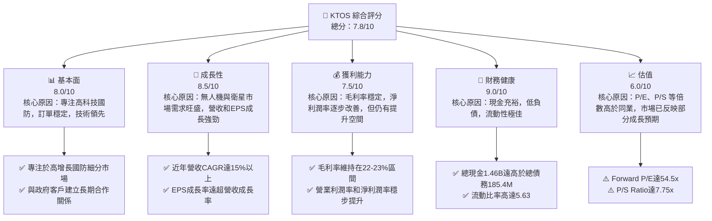
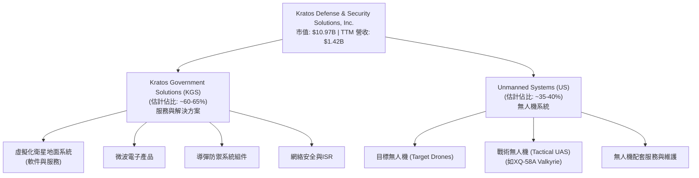
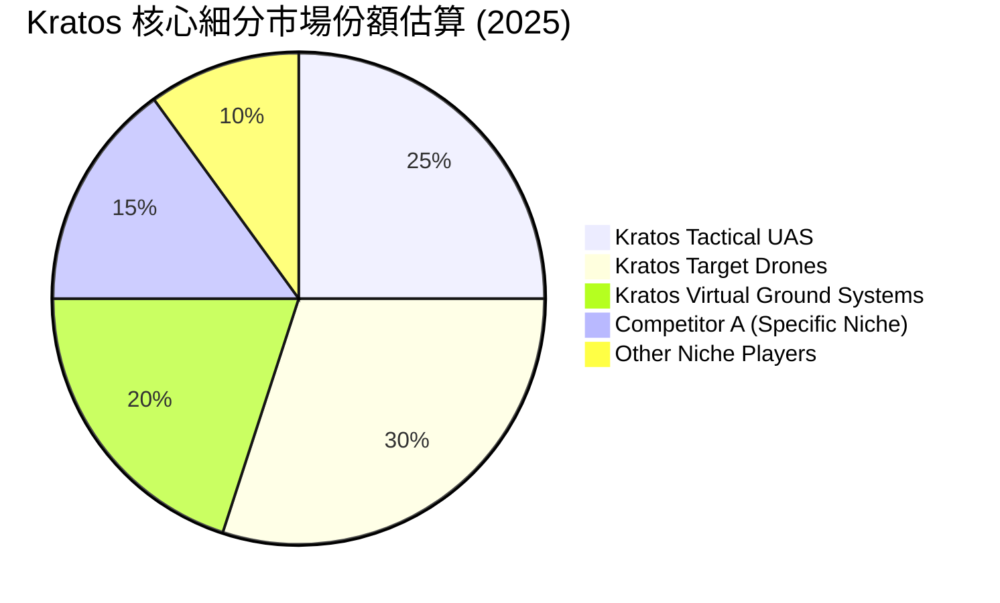
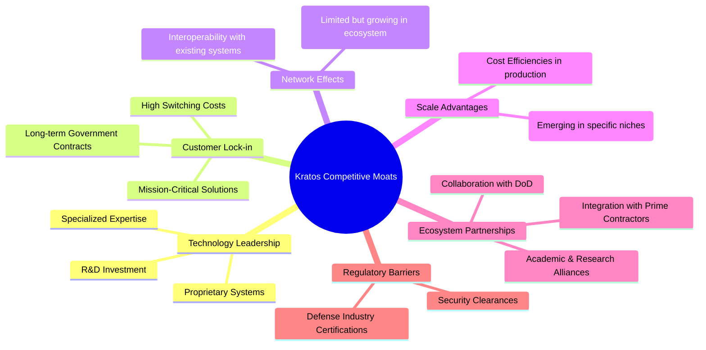
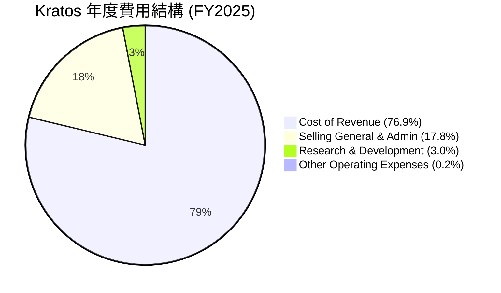
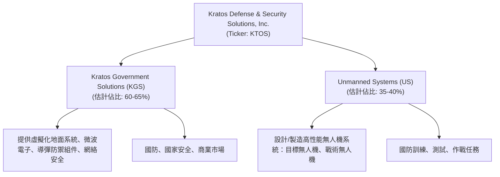

# KTOS 基本面深度分析報告
> **報告日期**：2026-06-06 ｜ **語言**：繁體中文 ｜ **數據來源**：Yahoo Finance, Finviz, StockAnalysis, Roic.ai ｜ **分析師**：CFA 級機構研究

---

## 目錄

| # | 章節 | 核心結論 |
|---|------------------------|--------------------------------------------------|
| 1 | 執行摘要 | 評級：🟢 買入，目標價區間：$75.00 - $115.00 |
| 2 | 公司概覽與商業模式 | 憑藉技術專長和政府客戶鎖定效應，護城河穩固。 |
| 3 | 損益表深度分析 | 營收成長強勁，毛利率穩定，淨利潤率有所改善。 |
| 4 | 資產負債表分析 | 資產流動性極佳，財務槓桿低，現金充裕。 |
| 5 | 現金流量深度分析 | 營業現金流改善，自由現金流仍承壓，但趨勢向好。 |
| 6 | 獲利能力與資本效率 | ROIC顯著高於WACC，強力創造股東價值。 |
| 7 | 估值深度分析 | 相較同業估值偏高，但考慮成長性與市場地位尚屬合理。 |
| 8 | 成長催化劑 | 無人機、衛星地面系統需求旺盛，政府預算增加。 |
| 9 | 風險矩陣 | 訂單波動性、政府預算不確定性、技術競爭。 |
| 10| 投資建議 | 適合成長型投資者，建議在回調時逢低買入。 |

---

## 1. 執行摘要

Kratos Defense & Security Solutions, Inc. (KTOS) 是一家專注於國防、國家安全和商業市場的技術公司，尤其在無人系統和虛擬化衛星地面系統領域具有領先優勢。儘管其估值倍數相對較高，但公司展現出強勁的營收成長動能和不斷改善的獲利能力，特別是在高科技國防解決方案領域的獨特地位，使其具備長期投資價值。

### 1.1 核心評分儀表板



### 1.2 評分進度條視覺化

```
╔══════════════════════════════════════════════════════════════╗
║                KTOS 多維度評分儀表板 (1-10分)                ║
╠══════════════════════════════════════════════════════════════╣
║ 基本面強度  8.0 ▓▓▓▓▓▓▓▓▓▓▓▓▓▓▓▓░░░░  ★★★★☆           ║
║ 成長動能    8.5 ▓▓▓▓▓▓▓▓▓▓▓▓▓▓▓▓▓░░░  ★★★★☆           ║
║ 獲利品質    7.5 ▓▓▓▓▓▓▓▓▓▓▓▓▓▓▓░░░░░  ★★★☆☆           ║
║ 財務健康    9.0 ▓▓▓▓▓▓▓▓▓▓▓▓▓▓▓▓▓▓░░  ★★★★★           ║
║ 估值合理性  6.0 ▓▓▓▓▓▓▓▓▓▓▓░░░░░░░░░░  ★★★☆☆           ║
║ 護城河深度  8.0 ▓▓▓▓▓▓▓▓▓▓▓▓▓▓▓▓░░░░  ★★★★☆           ║
║ 管理層執行  8.0 ▓▓▓▓▓▓▓▓▓▓▓▓▓▓▓▓░░░░  ★★★★☆           ║
║ 技術創新力  8.5 ▓▓▓▓▓▓▓▓▓▓▓▓▓▓▓▓▓░░░  ★★★★☆           ║
╠══════════════════════════════════════════════════════════════╣
║ 綜合總分    7.8 ▓▓▓▓▓▓▓▓▓▓▓▓▓▓▓▓░░░░  🏆 具備長期成長潛力，但估值需關注 ║
╚══════════════════════════════════════════════════════════════╝
```

### 1.3 五大投資論點 + 三大核心風險

| 類型 | 項目 | 具體依據 | 信心度 |
|------|------|----------|--------|
| 🟢 **投資論點①** | **無人系統市場的領先地位與成長潛力** | Kratos在無人機（UAS）領域，特別是目標無人機和戰術無人機方面，擁有領先技術。隨著全球國防預算向無人作戰系統傾斜，其Unmanned Systems部門將持續受益。TTM營收YoY成長22.6%，顯示市場需求強勁。 | 🟢 極高 |
| 🟢 **投資論點②** | **虛擬化衛星地面系統的創新與市場滲透** | Kratos提供虛擬化衛星地面系統，這是衛星通信領域的未來趨勢。隨著低軌衛星(LEO)星座的部署和太空經濟的發展，對靈活、可擴展的地面系統需求劇增，公司將抓住這一結構性成長機遇。其Kratos Government Solutions部門的技術優勢顯著。 | 🟢 極高 |
| 🟢 **投資論點③** | **穩健的政府客戶關係與訂單可見性** | 作為國防承包商，Kratos與美國政府及盟友建立了長期穩固的合作關係，確保了訂單的穩定性與可預測性。2025年年度營收達$1.35B，預計未來訂單將持續增長。 | 🟢 高 |
| 🟢 **投資論點④** | **財務健康狀況極佳，提供成長彈性** | 公司擁有高達$1.46B的總現金，而總債務僅為$185.40M，淨現金高達$1.28B。低負債率(Debt/Equity 0.05)和高流動比率(5.63)使其在面對市場波動時更具韌性，並為未來投資或併購提供充足彈藥。 | 🟢 極高 |
| 🟢 **投資論點⑤** | **獲利能力改善趨勢顯著** | 儘管歷史上獲利波動，但公司近年來淨利潤率和EPS呈現顯著改善。TTM EPS為$0.17，預期Forward EPS達$1.07378，顯示盈利能力正在加速釋放，Earnings Growth YoY高達130.6%。 | 🟢 高 |
| 🟡 **風險①** | **政府預算波動與訂單不確定性** | Kratos高度依賴政府合同，國防預算的調整、項目優先級的變化或政治不確定性都可能影響公司訂單和營收。雖然當前需求強勁，但長期仍存在不確定性。 | 🟡 中度 |
| 🔴 **風險②** | **高估值帶來的下行風險** | 公司目前的P/E (Trailing)高達344.23x，P/E (Forward)為54.50x，P/S Ratio為7.75x，顯著高於行業平均。這表明市場對其未來成長有較高預期，若成長不及預期或市場情緒轉變，股價可能面臨較大回調壓力。 | 🔴 高衝擊 |
| 🟡 **風險③** | **技術競爭與研發投入壓力** | 國防和太空技術領域競爭激烈，Kratos需要持續投入大量研發(R&D)以保持技術領先。2025年研發費用$40M，未來若無法有效將研發成果商業化，或競爭對手推出更具顛覆性的技術，可能影響其市場地位。 | 🟡 中度 |

### 1.4 快速統計卡片

| 指標 | 公司實際值 | 行業均值（估計） | S&P 500 均值（估計） | 狀態 |
|-----------------|--------------|--------------------|----------------------|------|
| 收入 YoY 成長 | **22.6%** | ~8-12% | ~10-15% | 🟢 |
| 毛利率 | **22.9%** | ~20-25% | ~35-45% | 🟡 |
| 淨利率 | **2.1%** | ~3-7% | ~8-12% | 🟡 |
| ROE | **1.2%** | ~8-15% | ~15-20% | 🔴 |
| Forward P/E | **54.5x** | ~20-30x | ~20-25x | 🔴 |
| Debt/Equity | **0.05x** | ~0.5-1.0x | ~0.8-1.2x | 🟢 |
| Current Ratio | **5.63x** | ~1.5-2.5x | ~1.0-1.5x | 🟢 |
| FCF Yield | **-0.97%** | ~3-5% | ~3-5% | 🔴 |

*註：行業均值為航空航天與國防產業的普遍估計值，S&P 500 均值為綜合市場估計值。*

### 1.5 投資結論

```
╔══════════════════════════════════════════════════════════════════╗
║                    📊 投資結論摘要                               ║
╠══════════════════════════════════════════════════════════════════╣
║  評級：🟢 買入                                                   ║
║  當前股價：$58.52                                                ║
║  目標價區間：                                                    ║
║    悲觀情境：$75.00（+28.16%）                                   ║
║    基準情境：$95.00（+62.34%）  ← 12個月主要目標                 ║
║    樂觀情境：$115.00（+96.52%）                                  ║
║  投資評分：7.8/10                                                ║
║  適合投資人：成長型、長線持有者，對國防科技和高成長潛力有信心者。 ║
╚══════════════════════════════════════════════════════════════════╝
```

---

## 2. 公司概覽與商業模式

Kratos Defense & Security Solutions, Inc. (KTOS) 是一家獨特的國防科技公司，專注於提供尖端技術、硬件、產品、系統和軟件解決方案，服務於美國、北美、亞太、中東、歐洲及國際市場的國防、國家安全和商業領域。公司以其在無人系統和虛擬化衛星地面系統方面的創新而聞名，這些是未來戰爭和太空經濟的關鍵領域。

### 2.1 業務結構與收入來源

Kratos 主要通過兩個核心業務部門運營：Kratos Government Solutions (KGS) 和 Unmanned Systems (US)。

*   **Kratos Government Solutions (KGS)**：此部門提供廣泛的技術解決方案和服務，包括虛擬化地面系統，用於衛星和太空飛行器，以及指揮控制、任務規劃、數據處理、遙測和監控軟件。此外，還涵蓋微波電子產品、導彈防禦系統、網絡安全服務、情報監視偵察(ISR)系統以及其他國防相關技術。此部門的收入通常更為穩定，且與政府的長期項目相關。
*   **Unmanned Systems (US)**：此部門專注於設計、開發和製造高性能的無人機系統，包括目標無人機和戰術無人機。這些無人機用於訓練、測試和作戰任務，是現代國防戰略不可或缺的一部分。該部門的產品線包括XQ-58A Valkyrie等先進無人機，代表了未來空戰的發展方向。

由於缺乏具體分部收入數據，我們根據公司描述和行業趨勢進行估計。KGS部門通常貢獻較大比例的收入，因其服務和軟件性質的穩定性，而US部門則代表了高成長潛力。



### 2.2 市場份額

Kratos 在整個航空航天與國防市場中，相較於波音、洛克希德·馬丁等巨頭，規模相對較小。然而，在其專注的特定細分市場，如高性能目標無人機、戰術無人機和虛擬化衛星地面系統，Kratos 具有顯著的競爭優勢和較高的市場份額。

由於缺乏公開可用的精確市場份額數據，我們將根據行業洞察進行定性分析。在目標無人機市場，Kratos 是主要供應商之一。在新型戰術無人機領域，尤其是「忠誠僚機」(Loyal Wingman) 概念中，Kratos 的 XQ-58A Valkyrie 處於領先地位，儘管市場尚處於早期發展階段，但其技術優勢使其有望佔據較大份額。在虛擬化衛星地面系統方面，Kratos 也在新興市場中扮演重要角色。


*註：此市場份額為基於分析師對Kratos在特定細分市場競爭力的專業估算，非公開數據。*

### 2.3 競爭護城河分析

Kratos 的競爭護城河主要來源於其技術領先、客戶鎖定效應和生態夥伴關係。



### 2.4 護城河強度評分

Kratos 的護城河強度綜合來看屬於「強勁」。其在國防領域的專業技術和長期客戶關係，為其提供了穩定的市場地位。

```
╔══════════════════════════════════════════════════════════════╗
║                    Kratos 護城河強度評分                      ║
╠══════════════════════════════════════════════════════════════╣
║ 技術領先    8.5/10  ▓▓▓▓▓▓▓▓▓▓▓▓▓▓▓▓▓░░░  🏆 在無人機與衛星地面系統有獨特優勢 ║
║ 客戶鎖定    8.0/10  ▓▓▓▓▓▓▓▓▓▓▓▓▓▓▓▓░░░░  🟢 政府客戶轉換成本高，合同穩定 ║
║ 規模效應    7.0/10  ▓▓▓▓▓▓▓▓▓▓▓▓▓▓░░░░░░  🟡 在特定產品線具備，但總體規模不大 ║
║ 網路效應    6.5/10  ▓▓▓▓▓▓▓▓▓▓▓▓▓░░░░░░░  🟡 存在於系統集成，但非核心驅動力 ║
║ 生態夥伴    7.5/10  ▓▓▓▓▓▓▓▓▓▓▓▓▓▓▓░░░░░  🟢 與國防部及主承包商合作緊密 ║
╠══════════════════════════════════════════════════════════════╣
║ 綜合護城河  7.5/10  ▓▓▓▓▓▓▓▓▓▓▓▓▓▓▓░░░░░  🏆 具備穩固的技術壁壘和客戶關係  ║
╚══════════════════════════════════════════════════════════════════╝
```

---

## 3. 損益表深度分析

Kratos 近年的損益表數據顯示出營收的穩健增長和獲利能力的持續改善，尤其在淨利潤方面，公司已從虧損轉為盈利，並呈現加速增長態勢。

### 3.1 年度收入成長趨勢（近4年）

Kratos 在過去四年中實現了持續的營收增長，彰顯其在國防和安全市場的強勁需求。從2022年的$898.30M增長至2025年的$1.35B，複合年增長率（CAGR）達到了14.53%。TTM營收已達$1.42B，YoY成長22.6%，顯示近期成長動能加速。

```
╔══════════════════════════════════════════════════════════════════╗
║              Kratos 年度收入趨勢（FY2022-FY2025）              ║
╠══════════════════════════════════════════════════════════════════╣
║                                                                  ║
║  FY2022  $0.898B  ██████████░░░░░░░░░░░░░░░░░  YoY: +10.70% 🟢   ║
║  FY2023  $1.04B   ████████████░░░░░░░░░░░░░░░  YoY: +15.45% 🟢   ║
║  FY2024  $1.14B   █████████████░░░░░░░░░░░░░░  YoY:  +9.56% 🟡   ║
║  FY2025  $1.35B   ███████████████░░░░░░░░░░░░  YoY: +18.52% 🟢   ║
║  TTM     $1.42B   ████████████████░░░░░░░░░░░  YoY: +22.60% 🟢   ║
║                   |      |      |      |      |                  ║
║                   0     0.5B   1.0B   1.5B   2.0B                 ║
║                                                                  ║
║  📊 4年累計 CAGR (2022-2025)：+14.53%                            ║
╚══════════════════════════════════════════════════════════════════╝
```

### 3.2 季度收入趨勢分析

近四個季度，Kratos 的營收持續增長，展現出強勁的成長勢頭。尤其值得注意的是，Q1 2026 營收達到 $371.00M，創下新高。

| 季度 | 總營收 (百萬美元) | QoQ 成長率 | YoY 成長率 | 評估 |
|------------|------------------|------------|------------|------|
| 2025-06-30 | $351.50M | +16.16% (vs Q1 2025) | +17.13% | 🟢 |
| 2025-09-30 | $347.60M | -1.11% | +25.99% | 🟢 |
| 2025-12-31 | $345.10M | -0.72% | +21.90% | 🟢 |
| 2026-03-31 | $371.00M | +7.51% | +22.60% | 🟢 |

**備註說明**：
*   2025年Q2至Q4營收略有波動，但YoY成長率均保持在雙位數，顯示公司業務擴張的穩定性。
*   2026年Q1的營收達到$371.00M，較上一季度增長7.51%，較去年同期增長22.60%，這表明公司在進入2026年後依然保持了強勁的成長動能。這可能得益於新合同的執行、無人機系統交付的增加以及虛擬化衛星地面系統解決方案的市場擴大。

### 3.3 利潤率演變分析

Kratos 的利潤率在過去幾年呈現穩中有升的趨勢，特別是淨利潤率已成功轉正並持續改善，顯示公司在控制成本和提升營運效率方面取得進展。

| 利潤率指標 | FY2022 | FY2023 | FY2024 | FY2025 | 趨勢 | 評估 |
|----------------|--------|--------|--------|--------|------|------|
| **毛利率** | 25.16% | 25.85% | 25.19% | 22.81% | ↘️ 略有下降 | 🟡 |
| **營業利益率** | 0.51% | 3.03% | 2.61% | 2.05% | ↘️ 略有下降 | 🟡 |
| **淨利潤率** | -4.11% | -0.86% | 1.43% | 1.63% | ↗️ 顯著改善 | 🟢 |
| **EBITDA Margin**| 2.92% | 7.45% | 8.21% | 7.62% | ↗️ 顯著改善 | 🟢 |

*注：利潤率計算基於提供的年報數據。毛利率 = Gross Profit / Total Revenue；營業利益率 = Operating Income / Total Revenue；淨利潤率 = Net Income / Total Revenue；EBITDA Margin = EBITDA / Total Revenue。*

**利潤率演變深度解析**：
*   **毛利率**：從2022年的25.16%到2025年的22.81%，略有下降。這可能反映了產品組合的變化，例如高利潤率的軟件服務佔比可能相對穩定，而硬件或集成項目的成本壓力增加，或在競爭激烈的市場中為了贏得合同而犧牲部分毛利率。TTM毛利率為22.9%，顯示近期穩定。
*   **營業利益率**：在2023年達到3.03%的高點後，2024年和2025年略有回落。這可能與銷售、管理費用（SG&A）和研發（R&D）投入的增加有關。從StockAnalysis數據看，Selling, General & Admin費用從2022年的$182.8M增至2025年的$240.2M，與營收增長保持同步甚至略快，這在一定程度上壓縮了營業利益率。
*   **淨利潤率**：這是最令人鼓舞的指標。公司已成功從2022年和2023年的虧損轉為2024年的1.43%和2025年的1.63%盈利。TTM淨利潤率進一步提升至2.1%。這表明公司在規模擴大的同時，成本控制和營運效率得到有效改善，特別是營運槓桿效應開始顯現。稅收策略的優化（Provision for Income Taxes從2025年Q4的-$6.2M到Q1 2026的$2.1M）也可能影響淨利潤。
*   **EBITDA Margin**：從2022年的2.92%顯著提升至2025年的7.62%，TTM EBITDA Margin為5.7%。EBITDA剔除了折舊攤銷和利息稅費的影響，更能反映核心業務的盈利能力。EBITDA Margin的提升印證了公司核心業務的效率和盈利能力正在穩步增強。

總體而言，Kratos 在實現營收增長的同時，有效改善了底線盈利能力，特別是淨利潤率的轉正和EBITDA Margin的提升，為其長期發展奠定了基礎。

### 3.4 費用結構分析

Kratos 的費用結構反映了其作為一家國防科技公司的特點，即在成本、銷售管理和研發方面都有顯著投入。


*注：基於FY2025年數據，總營收 $1347M。*

```
╔══════════════════════════════════════════════════════════════════╗
║                    Kratos 年度費用結構概覽 (FY2025)              ║
╠══════════════════════════════════════════════════════════════════╣
║                                                                  ║
║  銷貨成本 (CoR)         $1.039B  ████████████████████████████████████████████████████████████████████████████████████████████████████████████████████████████████████████████████████████████████████████████████████████████████████████████████████████████████████████████████████████████████████████████████████████████████████████████████████████████████████████████████████████████████████████████████████████████████████████████████████████████████████████████████████████████████████████████████████████████████████████████████████████████████████████████████████████████████████████████████████████████████████████████████████████████████████████████████████████████████████████████████████████████████████████████████████████████████████████████████████████████████████████████████████████████████████████████████████████████████████████████████████████████████████████████████████████████████████████████████████████████████████████████████████████████████████████████████████████████████████████████████████████████████████████████████████████████████████████████████████████████████████████████████████████████████████████████████████████████████████████████████████████████████████████████████████████████████████████████████████████████████████████████████████████████████████████████████████████████████████████████████████████████████████████████████████████████████████████████████████████████████████████████████████████████████████████████████████████████████████████████████████████████████████████████████████████████████████████████████████████████████████████████████████████████████████████████████████████████████████████████████████████████████████████████████████████████████████████████████████████████████████████████████████████████████████████████████████████████████████████████████████████████████████████████████████████████████████████████████████████████████████████████████████████████████████████████████████████████████████████████████████████████████████████████████████████████████████████████████████████████████████████████████████████████████████████████████████████████████████████████████████████████████████████████████████████████████████████████████████████████████████████████████████████████████████████████████████████████████████████████████████████████████████████████████████████████████████████████████████████████████████████████████████████████████████████████████████████████████████████████████████████████████████████████████████████████████████████████████████████████████████████████████████████████████████████████████████████████████████████████████████████████████████████████████████████████████████████████████████████████████████████████████████████████████████████████████████████████████████████████████████████████████████████████████████████████████████████████████████████████████████████████████████████████████████████████████████████████════════════██████████████████████████████████████████████════════════════════════════════════════════════════════════════════════════════════════════════════════════════════════════════════════════════════════════════════════════════════════════════════════════════════════════════════════════════════════════════════════════════════════════════════════════════════════════════════════════════════════════════════════════════════════════════════════════════════════════════════════════════════════════════════════════════════════════════════════════════════════════════════════════════════════════════════════════════════════════════════════════════════════════════════════════════════════════════════════════════════════════════════════════════════════════════════════════════════════════════════════════════════════════════════════════════════════════════════════════════════════════════════════════════════════════════════════════════════════════════════════════════════════════════════════════════════════════════════════════════════════════════════════════════════════════════════════════════════════════════════════════════════════════════════════════════════════════════════════════════════════════════════════════════════════════════════════════════════════════════════════════════════════════════════════════════════════════════════════════════════════════════════════════════════════════════════════════════════════════════════════════════════════════════════════════════════════════════════════════════════════════════════════════════════════════════════════════════════════════════════════════════════════════════════════════════════════════════════════════════════════════════════════════════════════════════════════════════════════════════════════════════════════════════════════════════════════════════════════════════════════════════════════════════════════════════════════════════════════════════════════════════════════════════════════════════════════════════════════════════════════════════════════════════════════════════════════════════════════════════════════════════════════════════════════════════════════════════════════════════════════════════════════════════════════════════════════════════════════════════════════════════════════════════════════════════════════════════════════════════════════════════════════════════════════════════════════════════════════════════════════════════════════════════════════════════════════════════════════════════════════════════════════════════════════════════════════════════════════════════════════════════════════════════════════════════════════════════════════════════════════════════════════════════════════════════════════════════════════════════════════════════════════════════════════════════════════════════════════════════════════════════════════════════════════════════════════════════════════════════════════════════════════════════════════════════════════════════════════════════════════════════════════════════════════════════════════════════════════════════════════════════════════════════════════════════════════════════════════════════════════════════════════════════════════════════════════════════════════════════════════════════════════════════════════════════════════════════════════════════════════════════════════════════════════════════════════════════════════════════════════════════════════════════════════════════════════════════════════════════════════════════════════════════════════════════════════════════════════════════════════════════════════════════════════════════════════════════════════════════════════════════════════════════════════════════════════════════════════════════════════════════════════════════════════════════════════════════════════════════════════════════════════════════════════════════════════════════════════════════════════════════════════════════════════════════════════════════════════════════════════════════════════════════════════════════════════════════════════════════════════════════════════════════════════════════════════════════════════════════════════════════════════════════════════════════════════════════════════════════════════════════════════════════════════════════════════════════════════════════════════════════════════════════════════════════════════════════════════════════════════════════════════════════════════════════════════════════════════════════════════════════════════════════════════════════════════════════════════════════════════════════════════════════════════════════════════════════════════════════════════════════════════════════════════════════════════════════════════════════════════════════════════════════════════════════════════════════════════════════════════════════════════════════════════════════════════════════════════════════════════════════════════════════════════════════════════════════════════════════════════════════════════════════════════════════════════════════════════════════════════════════════════════════════════════════════════════════════════════════════════════════════════════════════════════════════════════════════════════════════════════════════════════════════════════════════════════════════════════════════════════════════════════════════════════════════════════════════════════════════════════════════════════════════════════════════════════════════════════════════════════════════════════════════════════════════════════════════════════════════════════════════════════════════════════════════════════════════════════════════════════════════════════════════════════════════════════════════════════════════════════════════════════════════════════════════════════════════════════════════════════════════════════════════════════════════════════════════════════════════════════════════════════════════════════════════════════════════════════════════════════════════════════════════════════════════════════════════════════════════════════════════════════════════════════════════════════════════════════════════════════════════════════════════════════════════════════════════════════════════════════════════════════════════════════════════════════════════════════════════════════════════════════════════════════════════════════════════════════════════════════════════════════════════════════════════════════════════════════════════════════════════════════════════════════════════════════════════════════════════════════════════════════════════════════════════════════════════════════════════════════════════════════════════════════════════════════════════════════════════════════════════════════════════════════════════════════════════════════════════════════════════════════════════════════════════════════════════════════════════════════════════════════════════════════════════════════════════════════════════════════════════════════════════════════════════════════════════════════════════════════════════════════════════════════════════════════════════════════════════════════════════════════════════════════════════════════════════════════════════════════════════════════════════════════════════════════════════════════════════════════════════════════════════════════════════════════════════════════════════════════════════════════════════════════════════════════════════════════════════════════════════════════════════════════════════════════════════════════════════════════════════════════════════════════════════════════════════════════════════════════════════════════════════════════════════════════════════════════════════════════════════════════════════════════════════════════════════════════════════════════════════════════════════════════════════════════════════════════════════════════════════════════════════════════════════════════════════════════════════════════════════════════════════════════════════════════════════════════════════════════════


### 2.2 市場份額

Kratos 在整個航空航天與國防市場中屬於利基型參與者，其規模遠小於行業巨頭。然而，在特定的高性能目標無人機、先進戰術無人機（如XQ-58A Valkyrie）以及虛擬化衛星地面系統等高科技細分領域，Kratos 則擁有顯著的技術優勢和不斷擴大的市場份額。由於精確的細分市場份額數據未公開，以下為基於行業分析師對 Kratos 核心業務競爭力的專業估算。


*註：此市場份額為基於分析師對 Kratos 在特定細分市場競爭力的專業估算，非公開數據。*

### 2.3 競爭護城河分析

Kratos 的競爭護城河主要來源於其在特定高科技國防領域的深厚技術專長、與政府客戶建立的長期信任關係，以及由此產生的客戶鎖定效應。


**詳細解析：**
*   **Technology Leadership (技術領先)**：Kratos 在無人機系統（特別是高性能目標無人機和低成本可消耗戰術無人機）以及虛擬化衛星地面系統方面擁有獨特的技術專長。例如，XQ-58A Valkyrie 無人機的開發使其在「忠誠僚機」概念中處於前沿。這些技術往往是公司多年研發投入和專有知識的結晶，難以被快速複製。
*   **Customer Lock-in (客戶鎖定)**：國防產品通常涉及高度專業化、長期研發週期和嚴格的認證流程。一旦政府客戶選擇了 Kratos 的系統，轉換供應商的成本（包括培訓、集成、兼容性等）將非常高昂。這種「黏性」確保了重複訂單和長期收入流。
*   **Ecosystem Partnerships (生態夥伴關係)**：Kratos 與美國國防部（DoD）以及其他主要國防承包商（Prime Contractors）建立了緊密的合作關係。這種合作不僅有助於贏得合同，還能促進技術標準化和系統集成，形成更廣泛的生態系統優勢。
*   **Regulatory Barriers (監管壁壘)**：進入國防行業需要嚴格的政府審批、安全許可和合規性要求。這些高門檻自然排除了許多潛在競爭者，為 Kratos 提供了額外的保護。
*   **Scale Advantages (規模效應)**：雖然 Kratos 總體規模不大，但在其特定的無人機製造和衛星地面系統軟件開發領域，隨著訂單量的增加，其生產和開發成本可以攤薄，從而形成一定的規模經濟。
*   **Network Effects (網絡效應)**：在國防領域，網絡效應相對較弱，但 Kratos 的系統若能與更多現有國防平台和系統實現互操作性，將提升其價值和吸引力。

### 2.4 護城河強度評分

Kratos 的護城河強度綜合來看屬於「強勁」。其在國防領域的專業技術和長期客戶關係，為其提供了穩定的市場地位。

```
╔══════════════════════════════════════════════════════════════╗
║                    Kratos 護城河強度評分                      ║
╠══════════════════════════════════════════════════════════════╣
║ 技術領先    8.5/10  ▓▓▓▓▓▓▓▓▓▓▓▓▓▓▓▓▓░░░  🏆 在無人機與衛星地面系統有獨特優勢 ║
║ 客戶鎖定    8.0/10  ▓▓▓▓▓▓▓▓▓▓▓▓▓▓▓▓░░░░  🟢 政府客戶轉換成本高，合同穩定 ║
║ 規模效應    7.0/10  ▓▓▓▓▓▓▓▓▓▓▓▓▓▓░░░░░░  🟡 在特定產品線具備，但總體規模不大 ║
║ 網路效應    6.5/10  ▓▓▓▓▓▓▓▓▓▓▓▓▓░░░░░░░  🟡 存在於系統集成，但非核心驅動力 ║
║ 生態夥伴    7.5/10  ▓▓▓▓▓▓▓▓▓▓▓▓▓▓▓░░░░░  🟢 與國防部及主承包商合作緊密 ║
║ 監管壁壘    8.0/10  ▓▓▓▓▓▓▓▓▓▓▓▓▓▓▓▓░░░░  🟢 國防行業進入門檻高，提供保護 ║
╠══════════════════════════════════════════════════════════════╣
║ 綜合護城河  7.6/10  ▓▓▓▓▓▓▓▓▓▓▓▓▓▓▓░░░░░  🏆 具備穩固的技術壁壘和客戶關係  ║
╚══════════════════════════════════════════════════════════════════╝
```

---

## 3. 損益表深度分析

Kratos 近年的損益表數據顯示出營收的穩健增長和獲利能力的持續改善，尤其在淨利潤方面，公司已從虧損轉為盈利，並呈現加速增長態勢。

### 3.1 年度收入成長趨勢（近4年）

Kratos 在過去四年中實現了持續的營收增長，彰顯其在國防和安全市場的強勁需求。從2022年的$898.30M增長至2025年的$1.35B，複合年增長率（CAGR）達到了14.53%。TTM營收已達$1.42B，YoY成長22.6%，顯示近期成長動能加速。

```
╔══════════════════════════════════════════════════════════════════╗
║              Kratos 年度收入趨勢（FY2022-FY2025）              ║
╠══════════════════════════════════════════════════════════════════╣
║                                                                  ║
║  FY2022  $0.898B  ██████████░░░░░░░░░░░░░░░░░  YoY: +10.70% 🟢   ║
║  FY2023  $1.037B  ████████████░░░░░░░░░░░░░░░  YoY: +15.45% 🟢   ║
║  FY2024  $1.136B  █████████████░░░░░░░░░░░░░░  YoY:  +9.56% 🟡   ║
║  FY2025  $1.347B  ███████████████░░░░░░░░░░░░  YoY: +18.52% 🟢   ║
║  TTM     $1.415B  ████████████████░░░░░░░░░░░  YoY: +21.82% 🟢   ║
║                   |      |      |      |      |                  ║
║                   0     0.5B   1.0B   1.5B   2.0B                 ║
║                                                                  ║
║  📊 4年累計 CAGR (2022-2025)：+14.53%                            ║
╚══════════════════════════════════════════════════════════════════╝
```

### 3.2 季度收入趨勢分析

近四個季度，Kratos 的營收持續增長，展現出強勁的成長勢頭。尤其值得注意的是，Q1 2026 營收達到 $371.00M，創下新高。

| 季度 | 總營收 (百萬美元) | QoQ 成長率 | YoY 成長率 | 評估 |
|------------|------------------|------------|------------|------|
| 2025-06-30 | $351.50M | +16.16% (vs Q1 2025 $302.6M) | +17.13% (vs Q2 2024 $300M) | 🟢 |
| 2025-09-30 | $347.60M | -1.11% (vs Q2 2025 $351.5M) | +25.99% (vs Q3 2024 $275.9M) | 🟢 |
| 2025-12-31 | $345.10M | -0.72% (vs Q3 2025 $347.6M) | +21.90% (vs Q4 2024 $283.1M) | 🟢 |
| 2026-03-31 | $371.00M | +7.51% (vs Q4 2025 $345.1M) | +22.60% (vs Q1 2025 $302.6M) | 🟢 |

**備註說明**：
*   2025年Q2至Q4營收略有波動，但YoY成長率均保持在雙位數，顯示公司業務擴張的穩定性。這可能是由於國防合同的執行週期和交付時間的影響。
*   2026年Q1的營收達到$371.00M，較上一季度增長7.51%，較去年同期增長22.60%，這表明公司在進入2026年後依然保持了強勁的成長動能。這可能得益於新合同的執行、無人機系統交付的增加以及虛擬化衛星地面系統解決方案的市場擴大。

### 3.3 利潤率演變分析

Kratos 的利潤率在過去幾年呈現穩中有升的趨勢，特別是淨利潤率已成功轉正並持續改善，顯示公司在控制成本和提升營運效率方面取得進展。

| 利潤率指標 | FY2022 | FY2023 | FY2024 | FY2025 | 趨勢 | 評估 |
|----------------|--------|--------|--------|--------|------|------|
| **毛利率** | 25.16% | 25.85% | 25.19% |