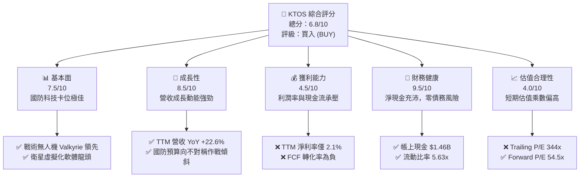

# KTOS 基本面深度分析報告

> **報告日期**：2026-06-07 ｜ **語言**：繁體中文 ｜ **數據來源**：Yahoo Finance, Finviz, StockAnalysis, Roic.ai ｜ **分析師**：CFA 級機構研究

---

## 目錄

| # | 章節 | 核心結論 |
|---|------|----------|
| 1 | **執行摘要** | 評級 **買入 (BUY)**，12個月基準目標價 **$75.00**，隱含漲幅 **+28.16%**。 |
| 2 | **公司概覽與商業模式** | 國防虛擬化與無人機雙輪驅動，具備高行政進入壁壘與客戶鎖定護城河。 |
| 3 | **損益表深度分析** | 營收連續四年雙位數成長，Q1 2026 營收 YoY +22.6%，毛利率受產品組合影響略降。 |
| 4 | **資產負債表分析** | 現金儲備暴增至 **$1.46B**，淨現金高達 **$1.28B**，財務結構極其穩健。 |
| 5 | **現金流量深度分析** | 處於高資本支出擴產期，自由現金流 TTM 為 **-$106.72M**，預期 2027 年迎來拐點。 |
| 6 | **獲利能力與資本效率** | 當前 ROIC (1.1%) < WACC (9.0%)，研發與產能投入尚未完全釋放，處於價值蓄勢期。 |
| 7 | **估值深度分析** | 雖然 Trailing P/E 偏高，但 Forward P/E 降至 **54.50x**，相較同業具備高成長溢價合理性。 |
| 8 | **成長催化劑** | 戰術無人機 Valkyrie 進入量產、OpenSpace 衛星地面站虛擬化軟體滲透率提升。 |
| 9 | **風險矩陣** | 國防預算撥款延遲、政府合約集中度高、高估值帶來的股價高波動風險。 |
| 10 | **投資建議** | 適合高成長、長線國防科技主題投資人，分批佈局策略，關鍵監控指標為訂單積壓量。 |

---

## 1. 執行摘要

Kratos Defense & Security Solutions, Inc. (NASDAQ: KTOS) 是一家領先的下一代國防科技與安全解決方案提供商。不同於傳統國防巨頭，KTOS 專注於高增長的破壞性技術，包括無人機系統、衛星通訊虛擬化地面站、微波武器、高超音速系統以及噴射推進引擎。

### 1.1 核心評分儀表板



### 1.2 評分進度條視覺化

```
╔══════════════════════════════════════════════════════════════╗
║               KTOS 多維度評分儀表板 (1-10分)                 ║
╠══════════════════════════════════════════════════════════════╣
║ 基本面強度  7.5 ▓▓▓▓▓▓▓▓▓▓▓▓▓▓▓░░░░░  ★★★★☆           ║
║ 成長動能    8.5 ▓▓▓▓▓▓▓▓▓▓▓▓▓▓▓▓▓░░  ★★★★☆           ║
║ 獲利品質    4.5 ▓▓▓▓▓▓▓▓▓░░░░░░░░░░░  ★★☆☆☆           ║
║ 財務健康    9.5 ▓▓▓▓▓▓▓▓▓▓▓▓▓▓▓▓▓▓▓  ★★★★★           ║
║ 估值合理性  4.0 ▓▓▓▓▓▓▓▓░░░░░░░░░░░░  ★★☆☆☆           ║
║ 護城河深度  7.5 ▓▓▓▓▓▓▓▓▓▓▓▓▓▓▓░░░░░  ★★★★☆           ║
║ 管理層執行  7.0 ▓▓▓▓▓▓▓▓▓▓▓▓▓▓░░░░░░  ★★★☆☆           ║
║ 技術創新力  9.0 ▓▓▓▓▓▓▓▓▓▓▓▓▓▓▓▓▓▓░░  ★★★★★           ║
╠══════════════════════════════════════════════════════════════╣
║ 綜合總分    6.8 ▓▓▓▓▓▓▓▓▓▓▓▓▓░░░░░░░  🏆 成長型國防科技先驅║
╚══════════════════════════════════════════════════════════════╝
```

### 1.3 五大投資論點 + 三大核心風險

| 類型 | 項目 | 具體依據 | 信心度 |
|------|------|----------|--------|
| 🟢 **投資論點①** | **戰術無人機量產爆發** | 旗下 XQ-58A Valkyrie 戰術無人機已進入美軍多個軍種的測試與小批量生產階段，不對稱無人作戰需求激增。 | 🟢 極高 |
| 🟢 **投資論點②** | **衛星地面站虛擬化領先** | OpenSpace 平台是目前國防部與商業衛星運營商唯一的全軟體定義、虛擬化地面站解決方案，具備極高毛利率。 | 🟢 高 |
| 🟢 **投資論點③** | **歷史性的資產負債表實力** | 2026 年第一季末現金储备增至 **$1.46B**，淨現金達 **$1.28B**，為未來的併購與大規模研發提供充足彈藥。 | 🟢 極高 |
| 🟢 **投資論點④** | **營收成長持續加速** | TTM 營收達 **$1.42B**，YoY 成長 **22.6%**，顯著高於傳統國防巨頭（如 LMT, NOC 的個位數成長）。 | 🟢 高 |
| 🟢 **投資論點⑤** | **分析師共識高度看好** | 20位分析師平均目標價為 **$113.05**，相較當前股價 $58.52 具備 **93.18%** 的潛在漲幅空間。 | 🟡 中等 |
| 🟡 **風險①** | **高估值溢價** | 當前 Trailing P/E 高達 **344.24x**，若未來成長速度未能符合預期，股價將面臨劇烈修正壓力。 | 🟡 中度 |
| 🔴 **風險②** | **自由現金流持續流出** | TTM FCF 為 **-$106.72M**，高 Capex（TTM 約 $95M+）與營運資金佔用短期內仍會壓制現金流。 | 🔴 高衝擊 |
| 🟡 **風險③** | **國防撥款與合約不確定性** | 政府合約簽署時間點難以預測，單一大型項目的延遲或取消會對季度業績造成較大波動。 | 🟡 中度 |

### 1.4 快速統計卡片

| 指標 | KTOS 實際值 | 國防航太行業均值 | S&P 500 均值 | 狀態 |
|------|-------------|----------|--------------|------|
| **營收 YoY 成長率** | **22.6%** | ~6.5% | ~5.5% | 🟢 顯著超前 |
| **毛利率** | **22.9%** | ~24.0% | ~30.0% | 🟡 略低於同業 |
| **淨利率** | **2.1%** | ~7.5% | ~11.5% | 🔴 亟待改善 |
| **流動比率 (Current Ratio)** | **5.63x** | ~1.4x | ~1.2x | 🟢 極其安全 |
| **債務權益比 (Debt/Equity)** | **0.05x** | ~0.65x | ~1.1x | 🟢 極低槓桿 |
| **Forward P/E** | **54.50x** | ~22.0x | ~21.5x | 🔴 溢價顯著 |

### 1.5 投資結論

```
╔══════════════════════════════════════════════════════════════════╗
║                    📊 KTOS 投資結論摘要                          ║
╠══════════════════════════════════════════════════════════════════╣
║  評級：🟢 買入 (BUY)                                             ║
║  當前股價：$58.52 (2026-06-07)                                   ║
║  目標價區間：                                                    ║
║    悲觀情境：$45.00（-23.10%）                                    ║
║    基準情境：$75.00（+28.16%）  ← 12個月主要目標                  ║
║    樂觀情境：$110.00（+87.97%）                                  ║
║  投資評分