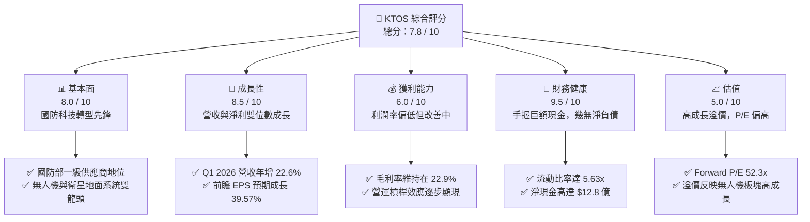

# KTOS 基本面深度分析報告

> **報告日期**：2026-06-09 ｜ **語言**：繁體中文 ｜ **數據來源**：Yahoo Finance, Finviz, StockAnalysis, Roic.ai ｜ **分析師**：CFA 級機構研究

---

## 目錄

| # | 章節 | 核心結論 |
|---|------|----------|
| 1 | **執行摘要** | 給予「買入 (BUY)」評級，目標價區間 $75.00 - $150.00，基準目標價 $113.05 |
| 2 | **公司概覽與商業模式** | 雙引擎驅動（無人系統 + 政府防務），具備高技術壁壘與客戶鎖定效應 |
| 3 | **損益表深度分析** | 營收年增 22.6%，毛利率 22.9%，規模效應顯現帶動獲利高成長 |
| 4 | **資產負債表分析** | 現金儲備高達 $14.64 億，淨現金充裕，財務結構極度穩健 |
| 5 | **現金流量深度分析** | 資本支出擴張導致 FCF 短期承壓，但為未來產能擴張奠定基礎 |
| 6 | **獲利能力與資本效率** | 杜邦分解顯示 ROE 處於改善通道，ROIC 隨規模效應釋放有望超越 WACC |
| 7 | **估值深度分析** | 溢價估值反映高成長預期，DCF 敏感性分析支持 $113.05 基準目標價 |
| 8 | **成長催化劑** | 國防無人機需求爆發、衛星地面系統虛擬化升級與 TAM 持續擴張 |
| 9 | **風險矩陣** | 供應鏈擾動、國防預算波動及高估值修正風險，整體風險可控 |
| 10 | **投資建議** | 適合長線成長型投資人，建議採分批佈局策略，關注關鍵監控指標 |

---

## 1. 執行摘要

Kratos Defense & Security Solutions, Inc. (NASDAQ: KTOS) 是一家領先的國防科技與國家安全解決方案提供商。在當前全球地緣政治局勢緊張、國防預算向不對稱作戰（如無人機、虛擬化太空通信）傾斜的背景下，KTOS 憑藉其在噴射無人靶機、戰術無人航空載具 (UAV) 以及衛星地面虛擬化軟體領域的技術優勢，正迎來業績的爆發期。

### 1.1 核心評分儀表板



### 1.2 評分進度條視覺化

```
╔══════════════════════════════════════════════════════════════╗
║               KTOS 多維度評分儀表板 (1-10分)                 ║
╠══════════════════════════════════════════════════════════════╣
║ 基本面強度  8.0 ▓▓▓▓▓▓▓▓▓▓▓▓▓▓▓▓░░░░  ★★★★☆           ║
║ 成長動能    8.5 ▓▓▓▓▓▓▓▓▓▓▓▓▓▓▓▓▓░░░  ★★★★☆           ║
║ 獲利品質    6.0 ▓▓▓▓▓▓▓▓▓▓▓▓░░░░░░░░  ★★★☆☆           ║
║ 財務健康    9.5 ▓▓▓▓▓▓▓▓▓▓▓▓▓▓▓▓▓▓▓░  ★★★★★           ║
║ 估值合理性  5.0 ▓▓▓▓▓▓▓▓▓▓░░░░░░░░░░  ★★☆☆☆           ║
║ 護城河深度  8.0 ▓▓▓▓▓▓▓▓▓▓▓▓▓▓▓▓░░░░  ★★★★☆           ║
║ 管理層執行  7.5 ▓▓▓▓▓▓▓▓▓▓▓▓▓▓░░░░░░  ★★★☆☆           ║
║ 技術創新力  9.0 ▓▓▓▓▓▓▓▓▓▓▓▓▓▓▓▓▓▓░░  ★★★★☆           ║
╠══════════════════════════════════════════════════════════════╣
║ 綜合總分    7.8 ▓▓▓▓▓▓▓▓▓▓▓▓▓▓▓░░░░░  🏆 成長型國防科技標的 ║
╚══════════════════════════════════════════════════════════════╝
```

### 1.3 五大投資論點 + 三大核心風險

| 類型 | 項目 | 具體依據 | 信心度 |
|------|------|----------|--------|
| 🟢 **投資論點①** | **無人機板塊進入量產期** | KTOS 的戰術無人機（如 XQ-58A Valkyrie）正從研發測試轉向美軍正式採購，預計將大幅拉動 Unmanned Systems 部門營收。 | 🟢 極高 |
| 🟢 **投資論點②** | **衛星地面系統虛擬化轉型** | OpenSpace 軟體平台作為業界唯一的軟體定義衛星地面系統，毛利率極高，將推動整體利潤率結構性改善。 | 🟢 高 |
| 🟢 **投資論點③** | **極其強韌的資產負債表** | 2026 年 Q1 現金暴增至 $14.64 億，淨現金達 $12.8 億，為潛在併購及研發提供強大火力。 | 🟢 極高 |
| 🟢 **投資論點④** | **營收高成長與營運槓桿** | TTM 營收年增 22.6% 至 $14.15 億，隨著固定成本攤提，營業利益率正從 FY22 的負值轉正。 | 🟢 高 |
| 🟢 **投資論點⑤** | **地緣政治催化預算增長** | 全球國防預算向無人化、電子戰和太空通信傾斜，KTOS 的產品組合完美契合國防部 (DoD) 的「複製者 (Replicator)」計劃。 | 🟢 高 |
| 🟡 **風險①** | **估值處於歷史高位** | 當前 Trailing P/E 達 330.5x，Forward P/E 亦達 52.3x，容錯率低，若成長放緩將面臨估值修正。 | 🟡 中度 |
| 🔴 **風險②** | **自由現金流持續為負** | 因應訂單增長，存貨與應收帳款上升，加上 Capex 擴張，TTM FCF 為 -$1.07 億，短期內壓制資金效率。 | 🔴 高衝擊 |
| 🟡 **風險③** | **政府合同招標與交付延遲** | 國防部預算撥款程序複雜，項目交付時程若出現延誤，將直接影響季度財報表現。 | 🟡 中度 |

### 1.4 快速統計卡片

| 指標 | 公司實際值 (TTM) | 防務行業均值 | S&P 500 均值 | 狀態 |
|------|-------------|----------|--------------|------|
| **營收 YoY 成長率** | **22.6%** | ~8.5% | ~5.5% | 🟢 顯著超前 |
| **毛利率** | **22.9%** | ~25.0% | ~30.0% | 🟡 略低於同行 |
| **淨利率** | **2.1%** | ~6.5% | ~11.5% | 🔴 亟待提升 |
| **流動比率** | **5.63x** | ~1.4x | ~1.2x | 🟢 極其安全 |
| **債務權益比 (D/E)** | **5.4%** | ~45.0% | ~115.0% | 🟢 槓桿極低 |
| **Forward P/E** | **52.33x** | ~22.0x | ~21.0x | 🔴 估值偏貴 |

### 1.5 投資結論

```
╔══════════════════════════════════════════════════════════════════╗
║                    📊 KTOS 投資結論摘要                          ║
╠══════════════════════════════════════════════════════════════════╣
║  評級：🟢 買入 (BUY)                                             ║
║  當前股價：$56.19 (2026-06-09)                                   ║
║  目標價區間：                                                    ║
║    悲觀情境：$75.00  （+33.5%）                                  ║
║    基準情境：$113.05 （+101.2%） ← 12個月主要目標                ║
║    樂觀情境：$150.00 （+167.0%）                                 ║
║  投資評分：7.8 / 10                                              ║
║  適合投資人：追求高成長、能承受高波動、看好國防無人化趨勢的投資人  ║
╚══════════════════════════════════════════════════════════════════╝
```

---

## 2. 公司概覽與商業模式

Kratos (KTOS) 成立於 1994 年，總部位於加州聖地牙哥。公司已成功從傳統的政府 IT 服務商，轉型為一家以**高研發壁壘、硬核科技**為導向的國防科技企業。

### 2.1 業務結構與收入來源

KTOS 的業務主要劃分為兩大核心板塊：
1. **Kratos 政府解決方案 (KGS - Kratos Government Solutions)**：佔營收約 70-75%。核心業務包括衛星地面虛擬化軟體（OpenSpace）、微波電子戰設備、飛彈防禦靶標及太空通信支持。
2. **無人系統 (US - Unmanned Systems)**：佔營收約 25-30%。核心業務為噴射無人靶機（提供給美軍做防空訓練）及前沿戰術無人機（如 XQ-58A Valkyrie，作為協同作戰飛機 CCA 的核心候選者）。

```mermaid
graph TD
    KTOS["KTOS Kratos Defense<br/>市值: $10.54B | TTM 營收: $1.42B"]

    KGS["KGS 政府解決方案<br/>營收佔比 ~72%"]
    US["US 無人系統部門<br/>營收佔比 ~28%"]

    KTOS --> KGS
    KTOS --> US

    KGS_SAT["衛星地面系統 (OpenSpace)<br/>高毛利軟體定義平台"]
    KGS_MSL["飛彈防禦與微波設備<br/>高壁壘硬體組件"]
    KGS_CYB["網路安全與培訓系統<br/>政府長期服務合同"]

    KGS --> KGS_SAT
    KGS --> KGS_MSL
    KGS --> KGS_CYB

    US_TRG["噴射無人靶機 (Target Drones)<br/>市佔率 >60% 穩定現金流"]
    US_TAC["戰術無人機 (Tactical UAVs)<br/>XQ-58A