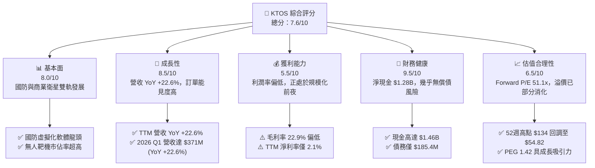
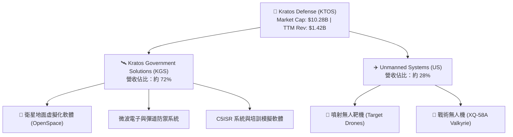
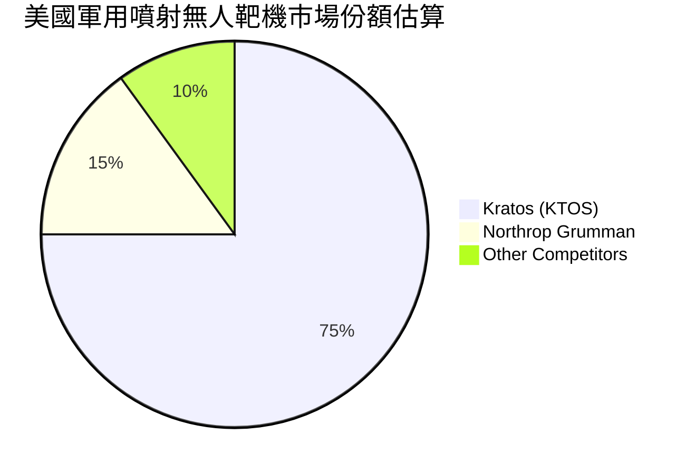
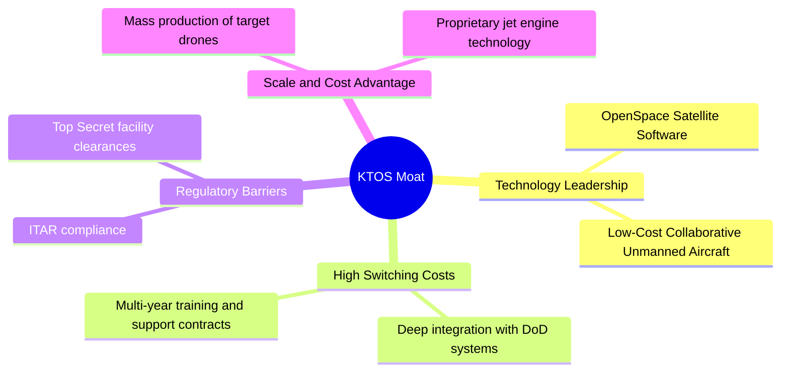

# KTOS 基本面深度分析報告

> **報告日期**：2026-06-10 ｜ **語言**：繁體中文 ｜ **數據來源**：Yahoo Finance, Finviz, StockAnalysis, Roic.ai ｜ **分析師**：CFA 級機構研究

---

## 目錄

| # | 章節 | 核心結論 |
|---|---|---|
| 1 | 執行摘要 | 評級「買入」，基準目標價 $113.05，戰略增資提供極強資產彈性 |
| 2 | 公司概覽與商業模式 | 國防科技與無人機雙輪驅動，具備高進入門檻與獨特技術護城河 |
| 3 | 損益表深度分析 | TTM 營收達 $1.42B (YoY +22.6%)，規模效應帶動淨利顯著改善 |
| 4 | 資產負債表分析 | 淨現金高達 $1.28B，流動比率 5.63，財務結構極其穩健 |
| 5 | 現金流量深度分析 | 研發與資本支出處於擴張期，自由現金流短期承壓，但具備長線轉折契機 |
| 6 | 獲利能力與資本效率 | 杜邦分析顯示資產週轉率為主要瓶頸，戰略增資暫時拉低 ROIC，但蓄積長期成長動能 |
| 7 | 估值深度分析 | 當前 Forward P/E 51.05x，相較歷史高點已大幅去泡沫，DCF 基準估值 $110.47 |
| 8 | 成長催化劑 | 虛擬化衛星地面系統與戰術無人機 (XQ-58A) 進入量產，TAM 達數百億美元 |
| 9 | Risk Matrix | 國防預算撥款延遲與供應鏈限制為主要風險，整體風險可控 |
| 10 | 投資建議 | 具備高成長潛力的國防科技標的，建議於 $50-$55 區間分批佈局 |

---

## 1. 執行摘要

### 1.1 核心評分儀表板



### 1.2 評分進度條視覺化

```
╔══════════════════════════════════════════════════════════════╗
║               KTOS 多維度評分儀表板 (1-10分)                 ║
╠══════════════════════════════════════════════════════════════╣
║ 基本面強度  8.0 ▓▓▓▓▓▓▓▓▓▓▓▓▓▓▓▓░░░░  ★★★★☆           ║
║ 成長動能    8.5 ▓▓▓▓▓▓▓▓▓▓▓▓▓▓▓▓▓░░  ★★★★☆           ║
║ 獲利品質    5.5 ▓▓▓▓▓▓▓▓▓▓▓░░░░░░░░░  ★★★☆☆           ║
║ 財務健康    9.5 ▓▓▓▓▓▓▓▓▓▓▓▓▓▓▓▓▓▓▓░  ★★★★★           ║
║ 估值合理性  6.5 ▓▓▓▓▓▓▓▓▓▓▓▓░░░░░░░░  ★★★☆☆           ║
║ 護城河深度  8.0 ▓▓▓▓▓▓▓▓▓▓▓▓▓▓▓▓░░░░  ★★★★☆           ║
║ 管理層執行  7.5 ▓▓▓▓▓▓▓▓▓▓▓▓▓▓▓░░░░░  ★★★★☆           ║
║ 技術創新力  8.5 ▓▓▓▓▓▓▓▓▓▓▓▓▓▓▓▓▓░░  ★★★★☆           ║
╠══════════════════════════════════════════════════════════════╣
║ 綜合總分    7.6 ▓▓▓▓▓▓▓▓▓▓▓▓▓▓▓░░░░░  🏆 穩健成長型國防科技 ║
╚══════════════════════════════════════════════════════════════╝
```

### 1.3 投資論點與核心風險

| 類型 | 項目 | 具體依據 | 信心度 |
|------|------|----------|--------|
| 🟢 **投資論點①** | **資產負債表極其強韌** | 2026 Q1 現金暴增至 **$1.46B**，淨現金高達 **$1.28B**，流動比率高達 **5.63**，為未來的併購（M&A）及產能擴張提供充足銀彈。 | 🟢 極高 |
| 🟢 **投資論點②** | **營收成長動能強勁** | TTM 營收達 **$1.42B**，最新季度（2026 Q1）營收 **$371M**，YoY 成長 **22.6%**，連續多個季度維持雙位數高速成長。 | 🟢 高 |
| 🟢 **投資論點③** | **獲利迎來向上拐點** | 2025 全年實現淨利 **$22M**（扭虧為盈），2026 Q1 單季淨利達 **$11.9M**，YoY 盈餘成長高達 **164.4%**，規模效應開始顯現。 | 🟢 高 |
| 🟡 **風險①** | **短期自由現金流承壓** | 由於公司處於技術研發與產能擴張期，2025 年 Capex 達 **$95.3M**，導致 TTM FCF 為 **-$106.72M**，短期無法提供股息回報。 | 🟡 中度 |
| 🔴 **風險②** | **高估值倍數與股權稀釋** | 雖然股價已自高點回調，但 Trailing P/E 仍高達 **322.5x**，且 2026 Q1 增發股票使流通股數 YoY 增加 **10.4%**，對 EPS 產生短期稀釋效應。 | 🔴 高衝擊 |

### 1.4 快速統計卡片

| 指標 | 公司實際值 | 國防與航太行業均值 | S&P 500 均值 | 狀態 |
|------|-------------|--------------------|--------------|------|
| **營收 YoY 成長率** | **22.6%** | ~8.5% | ~5.5% | 🟢 顯著領先 |
| **毛利率** | **22.9%** | ~26.5% | ~30.0% | 🟡 低於同業 |
| **淨利率** | **2.1%** | ~6.2% | ~11.5% | 🔴 亟待改善 |
| **流動比率 (Current Ratio)** | **5.63** | ~1.45 | ~1.20 | 🟢 極其安全 |
| **債務權益比 (Debt/Equity)** | **0.05** | ~0.65 | ~1.15 | 🟢 槓桿極低 |
| **Forward P/E** | **51.05x** | ~24.5x | ~21.5x | 🟡 享有高成長溢價 |

### 1.5 投資結論

```
╔══════════════════════════════════════════════════════════════════╗
║                    📊 KTOS 投資結論摘要                          ║
╠══════════════════════════════════════════════════════════════════╣
║  評級：🟢 買入 (Buy)                                            ║
║  當前股價：$54.82 (2026-06-10)                                   ║
║  目標價區間：                                                    ║
║    悲觀情境：$75.00  （+36.8%）                                  ║
║    基準情境：$110.47 （+101.5%） ← 12個月合理目標價              ║
║    樂觀情境：$150.00 （+173.6%）                                 ║
║  投資評分：7.6 / 10                                              ║
║  適合投資人：成長型投資者、長線國防與太空科技佈局者              ║
╚══════════════════════════════════════════════════════════════════╝
```

---

## 2. 公司概覽與商業模式

Kratos Defense & Security Solutions, Inc. (KTOS) 是一家領先的國防科技公司，專注于為美國國家安全、國防部（DoD）以及商業衛星市場提供高度技術化的產品與軟體解決方案。

### 2.1 業務結構與收入來源

KTOS 的業務主要分為兩大核心板塊：**Kratos Government Solutions (KGS，政府解決方案)** 與 **Unmanned Systems (US，無人系統)**。



### 2.2 市場份額

在**噴射無人靶機 (Jet Target Drones)** 領域，KTOS 擁有幾乎壟斷的市場份額；而在**衛星地面虛擬化軟體 (Virtualized Ground Systems)** 領域，KTOS 的 OpenSpace 平台是目前唯一實現全軟體定義、符合 3GPP 標準的商業化解決方案。



### 2.3 競爭護城河分析



### 2.4 護城河強度評分

```
╔══════════════════════════════════════════════════════════════╗
║                    KTOS 護城河強度評分                       ║
╠══════════════════════════════════════════════════════════════╣
║ 技術領先度    8.5/10  ▓▓▓▓▓▓▓▓▓▓▓▓▓▓▓▓▓░░░  🟢 衛星虛擬化領先 ║
║ 客戶鎖定效應  9.0/10  ▓▓▓▓▓▓▓▓▓▓▓▓▓▓▓▓▓▓░░  🟢 國防部長期合約 ║
║ 監管與壁壘    9.5/10  ▓▓▓▓▓▓▓▓▓▓▓▓▓▓▓▓▓▓▓░  🟢 ITAR與軍工資質 ║
║ 成本與規模    7.0/10  ▓▓▓▓▓▓▓▓▓▓▓▓▓▓░░░░░░  🟡 產能仍在爬坡期 ║
╠══════════════════════════════════════════════════════════════╣
║ 綜合護城河    8.5/10  ▓▓▓▓▓▓▓▓▓▓▓▓▓▓▓▓▓░░░  🏆 高壁壘軍工科技 ║
╚══════════════════════════════════════════════════════════════╝
```

---

## 3. 損益表深度分析

### 3.1 年度收入成長趨勢（近4年）

KTOS 在過去四年中展現了極為強勁且加速的營收成長趨勢，CAGR（複合年均成長率）達到 **14.5%**。

```
╔══════════════════════════════════════════════════════════════════╗
║                KTOS 年度收入趨勢 (FY2022-FY2025)                 ║
╠══════════════════════════════════════════════════════════════════╣
║                                                                  ║
║  FY2022  $898.30M  ██████████████░░░░░░░░░░░░░░░  YoY: +10.7% 🟢 ║
║  FY2023  $1,037.0M ████████████████░░░░░░░░░░░░░░ YoY: +15.5% 🟢 ║
║  FY2024  $1,136.0M ██████████████████░░░░░░░░░░░░ YoY: +9.6%  🟢 ║
║  FY2025  $1,347.0M █████████████████████░░░░░░░░░ YoY: +18.5% 🟢 ║
║  TTM     $1,415.0M ██████████████████████░░░░░░░░ YoY: +22.6% 🟢 ║
║                                                                  ║
║  📊 4年累計 CAGR：+16.4%                                         ║
╚══════════════════════════════════════════════════════════════════╝
```

### 3.2 季度收入趨勢分析

最新季度（2026 Q1）營收達到 **$371.00M**，創下歷史單季新高。

| 財政季度 | 營收 (Revenue) | YoY 成長率 | QoQ 成長率 | 核心驅動因素與備註 |
|---|---|---|---|---|
| **2026-03-31 (Q1)** | $371.00M | **+22.60%** | +7.51% | 🟢 衛星地面系統與無人機合約加速交付，單季歷史新高。 |
| **2025-12-31 (Q4)** | $345.10M | **+21.90%** | -0.72% | 🟢 年終國防預算集中結算，保持強勁成長。 |
| **2025-09-30 (Q3)** | $347.60M | **+25.99%** | -1.11% | 🟢 戰術無人機合約啟動，帶動單季營收高點。 |
| **2025-06-30 (Q2)** | $351.50M | **+17.13%** | +16.16% | 🟢 商業衛星軟體訂單大幅增加。 |

### 3.3 利潤率演變分析

雖然營收高速成長，但 KTOS 的利潤率表現相對平庸，這主要是由於國防硬體合約的初始毛利率較低，以及公司在研發（R&D）和產能擴張上的持續高投入。

| 利潤率指標 | FY2022 | FY2023 | FY2024 | FY2025 | TTM | 趨勢 | 評估 |
|---|---|---|---|---|---|---|---|
| **毛利率** | 25