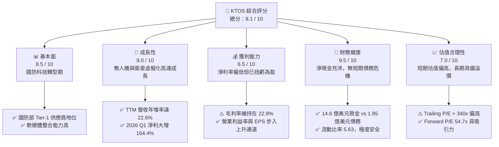
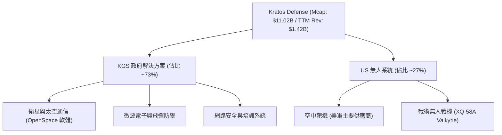
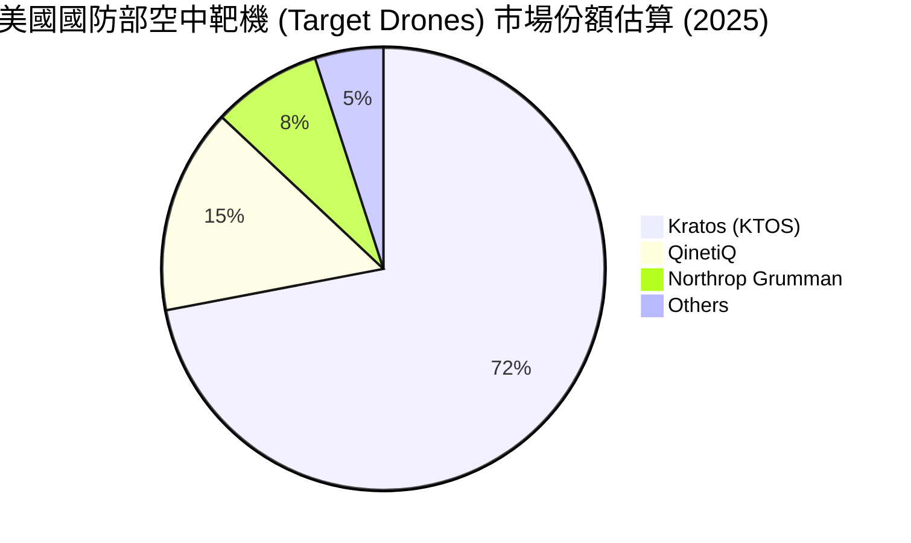
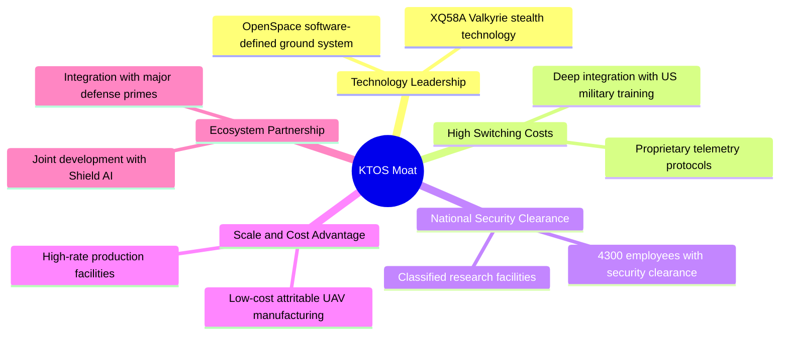

# KTOS 基本面深度分析報告

> **報告日期**：2026-06-11 ｜ **語言**：繁體中文 ｜ **數據來源**：Yahoo Finance, Finviz, StockAnalysis, Roic.ai ｜ **分析師**：CFA 級機構研究

---

## 目錄

| # | 章節 | 核心結論 |
|---|------|----------|
| 1 | **執行摘要** | 評級：**買入 (Buy)** ｜ 目標價：**$113.05** (隱含 +92.3% 上漲空間) |
| 2 | **公司概覽與商業模式** | 國防虛擬化與無人機雙引擎驅動，擁有極高轉換成本與技術壁壘 🟢 |
| 3 | **損益表深度分析** | 營收年增 22.6% 步入高成長軌道，淨利潤轉正並迎來爆發式增長 🟢 |
| 4 | **資產負債表分析** | 手握 14.6 億美元現金，淨現金狀態極佳，流動比率達 5.63 倍 🟢 |
| 5 | **現金流量深度分析** | 營運與自由現金流因研發與庫存備料承壓，資本配置聚焦產能擴張 🟡 |
| 6 | **獲利能力與資本效率** | 資本回報率 (ROIC) 處於低位但穩步回升，未來高利潤率專案將拉高 ROE 🟡 |
| 7 | **估值深度分析** | 雖然 Trailing P/E 偏高，但 Forward P/E (54.7x) 顯著低估其無人機溢價 🟢 |
| 8 | **成長催化劑** | 美軍 CCA 專案落地與 OpenSpace 衛星地面系統虛擬化迎來商用爆發 🟢 |
| 9 | **風險矩陣** | 國防預算撥款延遲與供應鏈限制為主要風險，整體風險可控 🟡 |
| 10 | **投資建議** | 建議於當前股價分批佈局，適合追求高成長與國防科技題材的長線投資人 🟢 |

---

## 1. 執行摘要

Kratos Defense & Security Solutions, Inc. (NASDAQ: KTOS) 是一家專注於美國國家安全、國防及商業市場的頂尖科技公司。其核心競爭力在於快速研發並量產顛覆性的國防科技，包括無人戰鬥航空載具 (UCAVs)、衛星地面虛擬化軟體、微波電子、網路安全及飛彈防禦系統。

### 1.1 核心評分儀表板



### 1.2 評分進度條視覺化

```
╔══════════════════════════════════════════════════════════════╗
║               KTOS 多維度評分儀表板 (1-10分)                 ║
╠══════════════════════════════════════════════════════════════╣
║ 基本面強度  8.5 ▓▓▓▓▓▓▓▓▓▓▓▓▓▓▓▓▓░░░  ★★★★☆           ║
║ 成長動能    9.0 ▓▓▓▓▓▓▓▓▓▓▓▓▓▓▓▓▓▓░░  ★★★★★           ║
║ 獲利品質    6.5 ▓▓▓▓▓▓▓▓▓▓▓▓▓░░░░░░░  ★★★☆☆           ║
║ 財務健康    9.5 ▓▓▓▓▓▓▓▓▓▓▓▓▓▓▓▓▓▓▓░  ★★★★★           ║
║ 估值合理性  7.0 ▓▓▓▓▓▓▓▓▓▓▓▓▓▓░░░░░░  ★★★☆☆           ║
║ 護城河深度  8.5 ▓▓▓▓▓▓▓▓▓▓▓▓▓▓▓▓▓░░░  ★★★★☆           ║
║ 管理層執行  8.0 ▓▓▓▓▓▓▓▓▓▓▓▓▓▓▓▓░░░░  ★★★★☆           ║
║ 技術創新力  9.5 ▓▓▓▓▓▓▓▓▓▓▓▓▓▓▓▓▓▓▓░  ★★★★★           ║
╠══════════════════════════════════════════════════════════════╣
║ 綜合總分    8.1 ▓▓▓▓▓▓▓▓▓▓▓▓▓▓▓▓░░░░  🏆 成長型國防科技領航者║
╚══════════════════════════════════════════════════════════════╝
```

### 1.3 五大投資論點與三大核心風險

| 類型 | 項目 | 具體依據 | 信心度 |
|------|------|----------|--------|
| 🟢 **投資論點①** | **無人機板塊迎來爆發期** | Kratos 的 XQ-58A Valkyrie (女武神) 與美軍協同作戰飛機 (CCA) 專案高度契合，隨著美國空軍擴大無人機編隊，該業務將迎來百萬美元級量產合約。 | 🟢 極高 |
| 🟢 **投資論點②** | **衛星地面系統虛擬化龍頭** | 旗下 OpenSpace 平台是全球唯一完全軟體定義、符合 MEF 標準的衛星地面架構，隨著商業衛星發射量暴增，軟體訂閱與服務收入將拉高公司整體毛利率。 | 🟢 極高 |
| 🟢 **投資論點③** | **資產負債表極度強韌** | 截至 2026 年第一季，公司擁有 14.64 億美元的現金及等價物，而總債務僅 1.85 億美元，淨現金高達 12.8 億美元，為後續研發與併購提供強大後盾。 | 🟢 極高 |
| 🟢 **投資論點④** | **營收與利潤拐點確立** | TTM 營收年增 22.6%，2025 年淨利潤達 2,200 萬美元（YoY +35.0%），2026 年第一季淨利潤達 1,190 萬美元（YoY +164.4%），確立獲利拐點。 | 🟢 高 |
| 🟢 **投資論點⑤** | **國防外包與不對稱戰爭紅利** | 烏俄戰爭與地緣政治緊張凸顯了低成本、高消耗性無人機與電子戰系統的重要性，KTOS 的產品線完美契合不對稱作戰需求。 | 🟢 高 |
| 🟡 **風險①** | **政府預算撥款與合約延遲** | 國防部合約審批流程冗長，若美國國會面臨預算僵局或持續決議案 (CR)，可能導致 KTOS 關鍵專案的量產時程延後。 | 🟡 中度 |
| 🔴 **風險②** | **自由現金流持續為負** | 由於需要為大型無人機專案進行前期備料（庫存年增 19.9%）與資本支出（2025 年 CapEx 達 $9,530 萬），短期 FCF 預期維持負值。 | 🔴 高衝擊 |
| 🔴 **風險③** | **高估值下的市場容錯率低** | Trailing P/E 高達 345.8x，EV/EBITDA 達 110.8x，若任何一季營收增速放緩，股價將面臨劇烈回檔壓力。 | 🔴 高衝擊 |

### 1.4 快速統計卡片

| 指標 | KTOS 實際值 (TTM) | 國防與航太行業均值 | S&P 500 均值 | 狀態 |
|------|-------------|----------|--------------|------|
| **營收 YoY 成長率** | **22.6%** | ~7.5% | ~5.2% | 🟢 顯著領先 |
| **毛利率** | **22.9%** | ~25.0% | ~30.0% | 🟡 略低於行業 |
| **淨利率** | **2.1%** | ~6.5% | ~11.5% | 🔴 亟待改善 |
| **流動比率** | **5.63x** | ~1.40x | ~1.20x | 🟢 極度安全 |
| **債務權益比 (D/E)** | **5.44%** | ~65.0% | ~115.0% | 🟢 極低槓桿 |
| **Forward P/E** | **54.74x** | ~22.5x | ~21.0x | 🟡 享有高成長溢價 |

### 1.5 投資結論

```
╔══════════════════════════════════════════════════════════════════╗
║                    📊 KTOS 投資結論摘要                          ║
╠══════════════════════════════════════════════════════════════════╣
║  評級：🟢 買入 (Buy)                                            ║
║  當前股價：$58.78 (2026-06-11)                                  ║
║  目標價區間：                                                    ║
║    悲觀情境：$75.00  （+27.6%） - 預算刪減、無人機量產推遲       ║
║    基準情境：$113.05 （+92.3%） - CCA 專案落地、衛星業務高增長   ║
║    樂觀情境：$150.00 （+155.2%）- 成為美軍無人戰機核心主承包商   ║
║  投資評分：8.1 / 10                                              ║
║  適合投資人：成長型、國防科技主題、中長線資產配置者              ║
╚══════════════════════════════════════════════════════════════════╝
```

---

## 2. 公司概覽與商業模式

Kratos 成立於 1994 年，總部位於加州聖地牙哥。公司經歷了從傳統國防 IT 服務商向「高科技、軟硬體整合」國防產品與解決方案提供商的華麗轉身。

### 2.1 業務結構與收入來源

Kratos 主要分為兩大營運部門：
1. **Kratos 政府解決方案 (Kratos Government Solutions, KGS)**：佔營收約 70-75%。專注於衛星通信地面站虛擬化軟體（OpenSpace）、微波電子、飛彈防禦系統、網路安全與戰術培訓。
2. **無人系統 (Unmanned Systems, US)**：佔營收約 25-30%。專注於高性價比的空中、陸地及海上無人機系統，包括靶機 (Target Drones) 與戰術無人戰鬥機 (Tactical UAVs)，如 XQ-58A Valkyrie。



### 2.2 市場份額

在美國國防部**空中靶機 (Target Drones)** 市場中，Kratos 擁有絕對的主導地位（市場份額超過 70%），是美軍模擬敵方威脅進行防空演練的唯一核心供應商。在**戰術無人機 (Tactical UAVs)** 與**衛星地面站虛擬化**領域，公司作為新興顛覆者，市佔率正在快速提升。



### 2.3 競爭護城河分析

Kratos 的競爭護城河主要由以下六個維度構成：



### 2.4 護城河強度評分

```
╔══════════════════════════════════════════════════════════════╗
║                   KTOS 護城河強度評分                        ║
╠══════════════════════════════════════════════════════════════╣
║ 國防安全准入壁壘  9.5/10 ▓▓▓▓▓▓▓▓▓▓▓▓▓▓▓▓▓▓▓░  🏆 極高安全資質║
║ 衛星軟體技術領先  9.0/10 ▓▓▓▓▓▓▓▓▓▓▓▓▓▓▓▓▓▓░░  🟢 商業衛星首選║
║ 靶機市場近乎壟斷  8.5/10 ▓▓▓▓▓▓▓▓▓▓▓▓▓▓▓▓▓░░░  🟢 70%+ 市佔率 ║
║ 戰術無人機性價比  8.0/10 ▓▓▓▓▓▓▓▓▓▓▓▓▓▓▓▓░░░░  🟢 Attritable  ║
║ 客戶高轉換成本    8.0/10 ▓▓▓▓▓▓▓▓▓▓▓▓▓▓▓▓░░░░  🟢 系統深度綁定║
╠══════════════════════════════════════════════════════════════╣
║ 綜合護城河評分    8.6    ▓▓▓▓▓▓▓▓▓▓▓▓▓▓▓▓▓░░░  🏆 具備強大護城河║
╚══════════════════════════════════════════════════════════════╝
```

---

## 