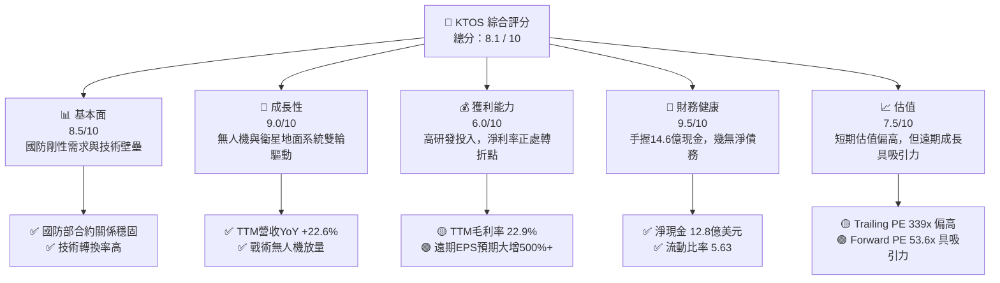
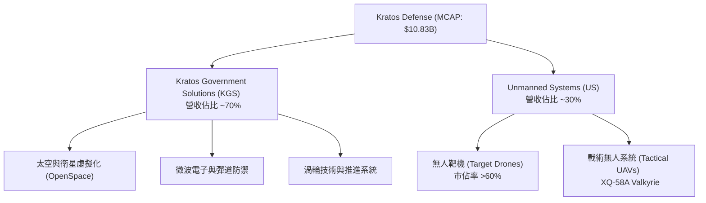
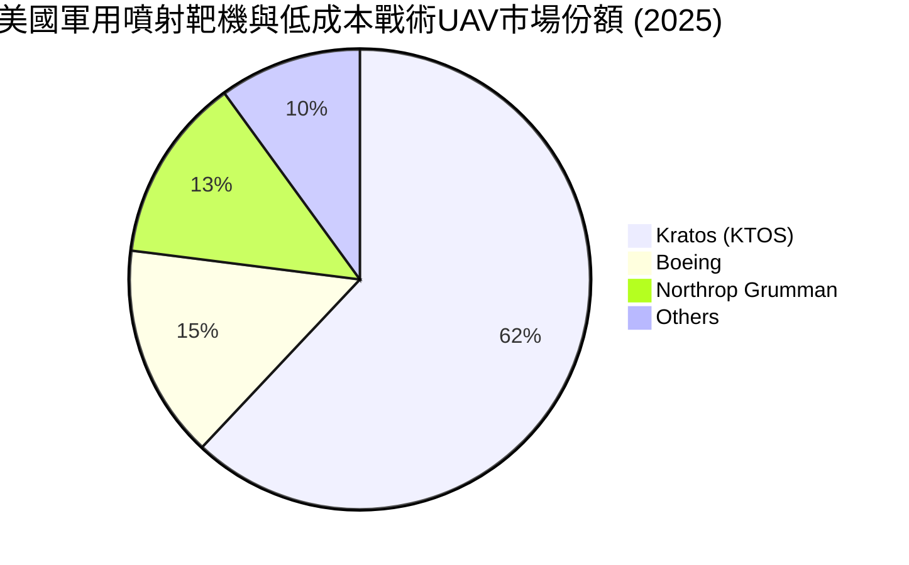
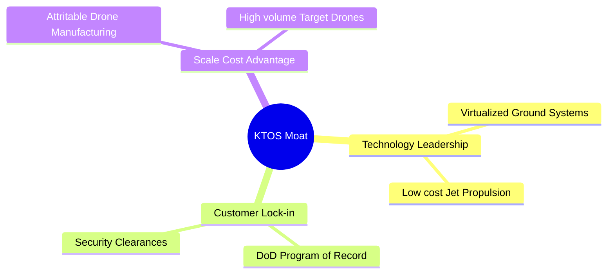

# KTOS 基本面深度分析報告

> **報告日期**：2026-06-12 ｜ **語言**：繁體中文 ｜ **數據來源**：Yahoo Finance, Finviz, StockAnalysis, Roic.ai ｜ **分析師**：CFA 級機構研究

---

## 目錄

| # | 章節 | 核心結論 |
|---|------|----------|
| **1** | **執行摘要** | 評級「買入」，目標價 $113.05，資產負債表極其強勁，正處於無人機與衛星虛擬化爆發前夜。 |
| **2** | **公司概覽與商業模式** | 以無人靶機與戰術無人機（UAV）為核心，輔以衛星地面站虛擬化軟體，建構極高壁壘。 |
| **3** | **損益表深度分析** | TTM 營收達 $1.42B（YoY +22.6%），季度淨利潤大增，營運槓桿開始釋放。 |
| **4** | **資產負債表分析** | Q1 2026 增資後現金儲備達 $1.46B，淨現金 $1.28B，流動比率達 5.63，財務防禦力極高。 |
| **5** | **現金流量深度分析** | 自由現金流（FCF）因產能擴張與研發投入暫呈負值（-$106.72M），屬典型高成長期特徵。 |
| **6** | **獲利能力與資本效率** | ROE（1.2%）與 ROIC（2.3%）受短期增資與現金拖累，預期隨產能利用率提升將快速回升。 |
| **7** | **估值深度分析** | 遠期 P/E 降至 53.6x，相較於高成長無人機同業具備折價；DCF 基準估值為 $113.05。 |
| **8** | **成長催化劑** | XQ-58A Valkyrie 進入量產、美國國防部協同作戰飛機（CCA）計畫，以及衛星數位化轉型。 |
| **9** | **風險矩陣** | 國防預算撥款延遲、新產品驗證進度落後及稀釋效應；整體風險受控。 |
| **10** | **投資建議** | 建議分批佈局，首選長線成長型投資者，隱含上行空間達 95.8%。 |

---

## 1. 執行摘要

Kratos Defense & Security Solutions, Inc.（NASDAQ: KTOS）是一家領先的國防科技與安全解決方案供應商。公司正處於從傳統國防合約商轉型為高成長、高科技無人系統與虛擬化太空地面系統龍頭的關鍵拐點。

### 1.1 核心評分儀表板



### 1.2 評分進度條視覺化

```
╔══════════════════════════════════════════════════════════════╗
║                KTOS 多維度評分儀表板 (1-10分)                ║
╠══════════════════════════════════════════════════════════════╣
║ 基本面強度  8.5 ▓▓▓▓▓▓▓▓▓▓▓▓▓▓▓▓▓░░░  ★★★★☆           ║
║ 成長動能    9.0 ▓▓▓▓▓▓▓▓▓▓▓▓▓▓▓▓▓▓░░  ★★★★★           ║
║ 獲利品質    6.0 ▓▓▓▓▓▓▓▓▓▓▓▓░░░░░░░░  ★★★☆☆           ║
║ 財務健康    9.5 ▓▓▓▓▓▓▓▓▓▓▓▓▓▓▓▓▓▓▓░  ★★★★★           ║
║ 估值合理性  7.5 ▓▓▓▓▓▓▓▓▓▓▓▓▓▓░░░░░░  ★★★★☆           ║
║ 護城河深度  8.8 ▓▓▓▓▓▓▓▓▓▓▓▓▓▓▓▓▓▓░░  ★★★★☆           ║
║ 管理層執行  8.0 ▓▓▓▓▓▓▓▓▓▓▓▓▓▓▓▓░░░░  ★★★★☆           ║
║ 技術創新力  9.2 ▓▓▓▓▓▓▓▓▓▓▓▓▓▓▓▓▓▓▓░  ★★★★★           ║
╠══════════════════════════════════════════════════════════════╣
║ 綜合總分    8.1 ▓▓▓▓▓▓▓▓▓▓▓▓▓▓▓▓░░░░  🏆 成長拐點，強烈關注 ║
╚══════════════════════════════════════════════════════════════╝
```

### 1.3 五大投資論點與三大核心風險

| 類型 | 項目 | 具體依據 | 信心度 |
|------|------|----------|--------|
| 🟢 **投資論點①** | **無人機產能釋放與國防剛需** | 戰術無人機（如 XQ-58A Valkyrie）迎合美軍「協同作戰飛機 (CCA)」與「複製者 (Replicator)」計畫，定價極具競爭力。 | 🟢 極高 |
| 🟢 **投資論點②** | **資產負債表極致安全** | Q1 2026 現金充值至 $1.46B，淨現金達 $1.28B，為後續產能擴張與潛在併購提供充足彈藥。 | 🟢 極高 |
| 🟢 **投資論點③** | **營收高雙位數增長** | TTM 營收成長率達 22.6%，連續數季維持 20% 以上的高速成長，顯著優於傳統國防同業（~5%）。 | 🟢 高 |
| 🟢 **投資論點④** | **衛星地面站虛擬化轉型** | Kratos OpenSpace 平台是目前唯一完全軟體定義、標準化的衛星地面架構，軟體毛利率高達 80%+。 | 🟢 高 |
| 🟢 **投資論點⑤** | **盈餘步入爆發期** | 遠期 EPS 預計從 TTM $0.17 成長至 $1.08，營運槓桿顯現將推動利潤率快速擴張。 | 🟢 高 |
| 🟡 **風險①** | **短期自由現金流承壓** | 因產能擴張與營運資金佔用，TTM FCF 為 -$106.72M，資本支出（Capex）維持高位。 | 🟡 中度 |
| 🔴 **風險②** | **股權稀釋風險** | 2026 年第一季發行新股，流通股數從 169M 增至 187M（YoY +10.4%），短期每股盈餘承壓。 | 🔴 高衝擊 |
| 🟡 **風險③** | **政府合約撥款不確定性** | 國防預算通過延遲可能導致合約簽署推遲，影響季度營收的平滑度。 | 🟡 中度 |

### 1.4 快速統計卡片

| 指標 | 公司實際值 (KTOS) | 行業均值 (國防科技) | S&P 500 均值 | 狀態 |
|------|-------------|----------|--------------|------|
| **營收 YoY 成長** | **22.6%** | 6.5% | 5.2% | 🟢 顯著領先 |
| **毛利率** | **22.9%** | 24.5% | 30.2% | 🟡 略低，受硬體初期影響 |
| **淨利率** | **2.1%** | 7.2% | 11.5% | 🔴 處於投資期，偏低 |
| **ROE** | **1.2%** | 12.5% | 15.0% | 🔴 受增資稀釋影響 |
| **流動比率** | **5.63** | 1.45 | 1.20 | 🟢 極其安全 |
| **Forward P/E** | **53.6x** | 28.5x | 21.5x | 🟡 溢價反映高成長預期 |

### 1.5 投資結論

```
╔══════════════════════════════════════════════════════════════════╗
║                    📊 KTOS 投資結論摘要                          ║
╠══════════════════════════════════════════════════════════════════╣
║  評級：🟢 買入 (Buy)                                            ║
║  當前股價：$57.75 (2026-06-12)                                   ║
║  目標價區間：                                                    ║
║    悲觀情境：$75.00  （+29.9%）                                  ║
║    基準情境：$113.05 （+95.8%）  ← 12個月主要目標                ║
║    樂觀情境：$150.00 （+159.7%）                                 ║
║  投資評分：8.1 / 10                                              ║
║  適合投資人：成長型、中長線國防科技主題投資者                    ║
╚══════════════════════════════════════════════════════════════════╝
```

---

## 2. 公司概覽與商業模式

Kratos 營運分為兩大核心部門：**Kratos 政府解決方案 (KGS)** 與 **無人系統 (US)**。



### 2.1 業務結構與收入來源

1. **Kratos 政府解決方案 (KGS)**：
   - **太空與衛星通信**：這是 KGS 最具前景的領域。Kratos 的 OpenSpace 平台是業界首個完全虛擬化、軟體定義的地面站。隨著近地軌道（LEO）衛星群（如 Starlink、Project Kuiper）爆發，地面站對動態、軟體定義架構的需求呈指數級增長。
   - **微波電子、渦輪技術與彈道防禦**：提供高超音速武器測試、推進系統及關鍵電子元器件。
2. **無人系統 (US)**：
   - **無人靶機**：Kratos 是美國軍方噴射靶機（用於模擬敵方威脅）的絕對龍頭，市佔率超過 60%。這提供了穩定的現金流與高續約率。
   - **戰術無人機 (UAV)**：以 XQ-58A Valkyrie（女武神）為代表，單機成本僅約 $2M - $4M，遠低於傳統戰鬥機（$80M+）。這非常符合美國國防部倡導的「可消耗性（Attritable）」低成本群蜂戰術。

### 2.2 市場份額

在噴射無人靶機與低成本戰術無人機（可消耗性 UAV）領域，Kratos 擁有獨特的生態定位：



### 2.3 競爭護城河分析



* **技術領先（Technology Leadership）**：Kratos 在低成本噴射無人機設計與製造方面擁有先發優勢。其 OpenSpace 衛星地面系統領先競爭對手 2-3 年。
* **客戶鎖定（Customer Lock-in）**：國防合約具有極高的轉換成本。Kratos 的產品深度嵌入美國空軍、海軍及陸軍的多個「記錄計畫（Program of Record）」。

### 2.4 護城河強度評分

```
╔══════════════════════════════════════════════════════════════╗
║                    KTOS 護城河強度評分                       ║
╠══════════════════════════════════════════════════════════════╣
║ 轉換成本       9.2/10 ▓▓▓▓▓▓▓▓▓▓▓▓▓▓▓▓▓▓░░  🏆 國防合約剛性 ║
║ 技術壁壘       8.5/10 ▓▓▓▓▓▓▓▓▓▓▓▓▓▓▓▓▓░░░  🟢 軟體地面站領先║
║ 成本優勢       9.0/10 ▓▓▓▓▓▓▓▓▓▓▓▓▓▓▓▓▓▓░░  🟢 廉價戰術無人機║
║ 無形資產       8.5/10 ▓▓▓▓▓▓▓▓▓▓▓▓▓▓▓▓▓░░░  🟢 軍事資