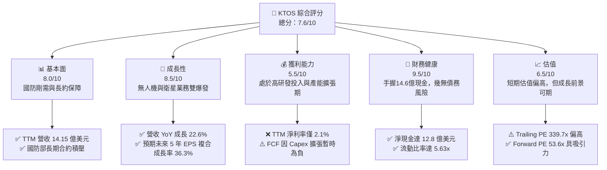
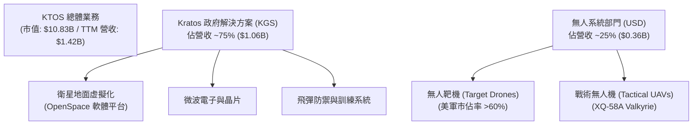
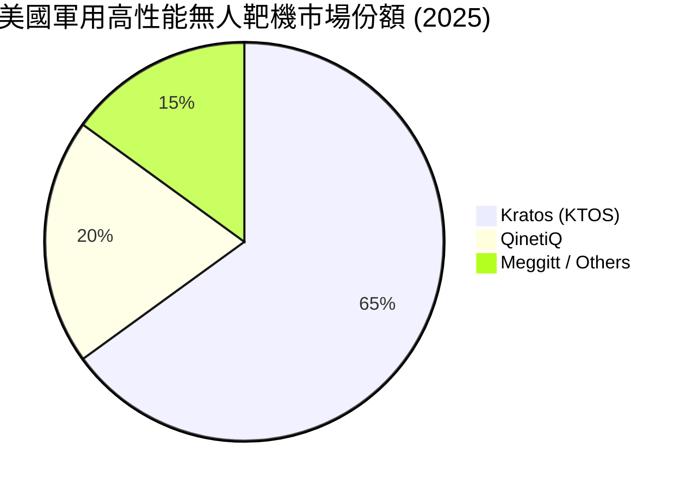
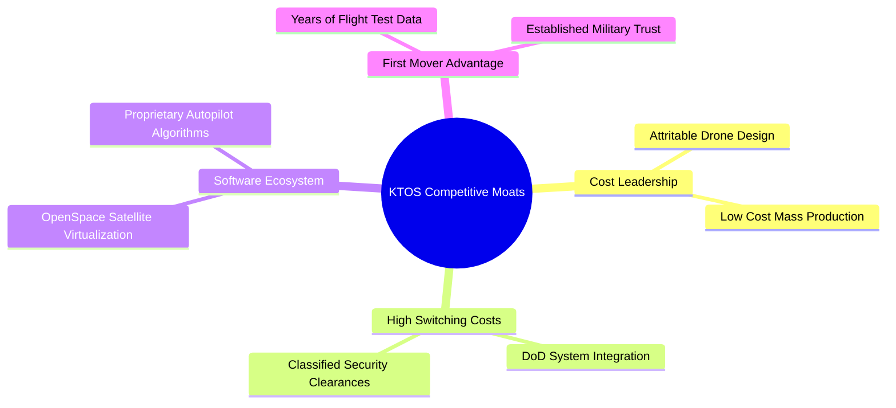
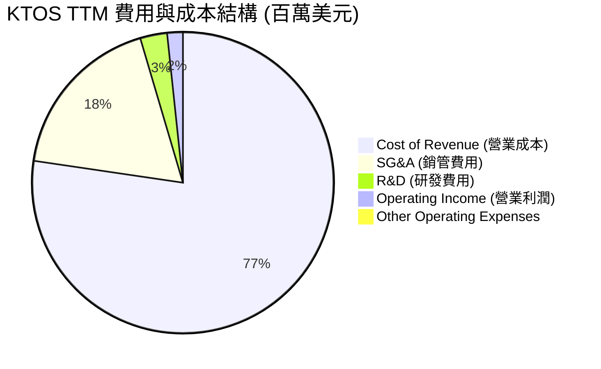
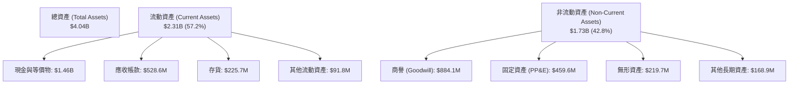
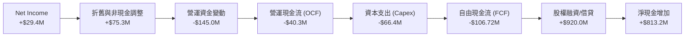
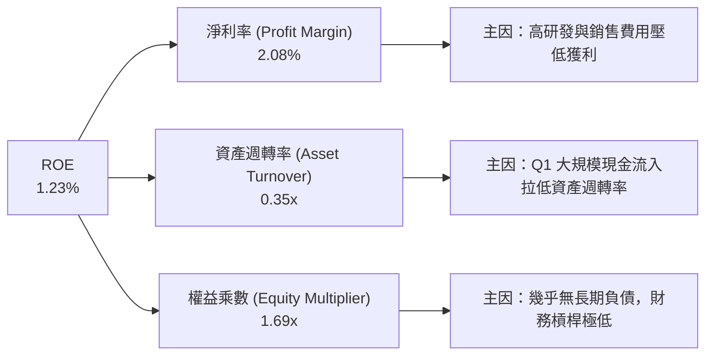
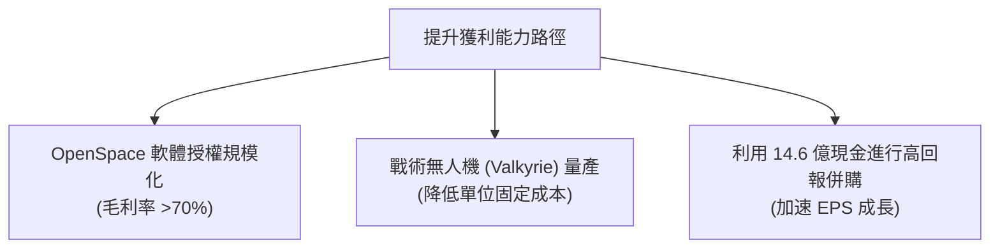

# KTOS 基本面深度分析報告

> **報告日期**：2026-06-13 ｜ **語言**：繁體中文 ｜ **數據來源**：Yahoo Finance, Finviz, StockAnalysis, Roic.ai ｜ **分析師**：CFA 級機構研究

---

## 目錄

| # | 章節 | 核心結論 |
|---|------|----------|
| 1 | 執行摘要 | 給予「買入」評級，目標價 $112.20，隱含 94.3% 上漲空間 |
| 2 | 公司概覽與商業模式 | 雙引擎驅動（無人機 + 衛星地面虛擬化），具備高轉換成本與技術壁壘 |
| 3 | 損益表深度分析 | TTM 營收達 $1.42B（YoY +22.6%），淨利大幅扭轉至 $29.4M |
| 4 | 資產負債表分析 | Q1 2026 增資後現金飆升至 $1.46B，淨現金 $1.28B，流動比率 5.63x 極其強健 |
| 5 | 現金流量深度分析 | 資本支出維持高位導致 TTM FCF 為 -$106.72M，進入產能擴張深水區 |
| 6 | 獲利能力與資本效率 | ROE 1.2% 處於歷史低位，ROIC (1.18%) < WACC (9.4%)，預期產能釋放後將迎來黃金交叉 |
| 7 | 估值深度分析 | 高成長溢價（Forward P/E 53.6x），DCF 基準估值 $105.30，具備安全邊際 |
| 8 | 成長催化劑 | XQ-58A Valkyrie 量產在即，美國國防部無人機協同作戰（CCA）關鍵受益者 |
| 9 | 風險矩陣 | 國防預算撥款延遲與供應鏈瓶頸為主要風險，整體風險評分中等 |
| 10 | 投資建議 | 適合長線成長型與國防科技主題投資者，分批佈局策略 |

---

## 1. 執行摘要

Kratos Defense & Security Solutions, Inc. (NASDAQ: KTOS) 是一家專注於下一代國防科技的先鋒企業，主要提供無人作戰系統、衛星地面虚擬化軟體、微波電子以及國家安全系統。在當前地緣政治緊張局勢加劇、不對稱戰爭（Asymmetric Warfare）需求爆發的背景下，KTOS 憑藉其低成本、可消耗型（Attritable）無人機技術與領先的衛星地面虛擬化解決方案，正迎來歷史性的成長機遇。

### 1.1 核心評分儀表板



### 1.2 評分進度條視覺化

```
╔══════════════════════════════════════════════════════════════╗
║               KTOS 多維度評分儀表板 (1-10分)                 ║
╠══════════════════════════════════════════════════════════════╣
║ 基本面強度  8.0 ▓▓▓▓▓▓▓▓▓▓▓▓▓▓▓▓░░░░  ★★★★☆           ║
║ 成長動能    8.5 ▓▓▓▓▓▓▓▓▓▓▓▓▓▓▓▓▓░░  ★★★★☆           ║
║ 獲利品質    5.5 ▓▓▓▓▓▓▓▓▓▓▓░░░░░░░░░  ★★★☆☆           ║
║ 財務健康    9.5 ▓▓▓▓▓▓▓▓▓▓▓▓▓▓▓▓▓▓▓░  ★★★★★           ║
║ 估值合理性  6.5 ▓▓▓▓▓▓▓▓▓▓▓▓░░░░░░░░  ★★★☆☆           ║
║ 護城河深度  8.0 ▓▓▓▓▓▓▓▓▓▓▓▓▓▓▓▓░░░░  ★★★★☆           ║
║ 管理層執行  7.5 ▓▓▓▓▓▓▓▓▓▓▓▓▓▓░░░░░░  ★★★☆☆           ║
║ 技術創新力  9.0 ▓▓▓▓▓▓▓▓▓▓▓▓▓▓▓▓▓▓░░  ★★★★☆           ║
╠══════════════════════════════════════════════════════════════╣
║ 綜合總分    7.6 ▓▓▓▓▓▓▓▓▓▓▓▓▓▓▓░░░░░  🏆 成長型國防科技標的║
╚══════════════════════════════════════════════════════════════╝
```

### 1.3 五大投資論點 + 三大核心風險

| 類型 | 項目 | 具體依據 | 信心度 |
|------|------|----------|--------|
| 🟢 **投資論點①** | **無人機協同作戰（CCA）核心受益者** | 美國空軍大力推動 CCA 計劃，KTOS 的 XQ-58A Valkyrie 處於行業領先地位，單機成本僅 $2M-$4M，遠低於傳統戰機。 | 🟢 極高 |
| 🟢 **投資論點②** | **衛星地面系統虛擬化轉型** | OpenSpace 平台作為業界唯一的軟體定義虛擬化地面站，毛利率高達 70% 以上，隨商業衛星發射量爆發而高速成長。 | 🟢 極高 |
| 🟢 **投資論點③** | **極其雄厚的資產負債表** | Q1 2026 現金餘額激增至 **$1.46B**，淨現金高達 **$1.28B**，為後續產能擴張與併購提供強大彈藥。 | 🟢 極高 |
| 🟢 **投資論點④** | **訂單能見度極高** | 國防部合約多為 3-5 年期長約，TTM 營收 YoY 成長 **22.6%**，未來 5 年預期 EPS 年複合成長率達 **36.31%**。 | 🟢 高 |
| 🟢 **投資論點⑤** | **地緣政治催化劑** | 全球國防預算普遍提升，不對稱作戰（低成本無人機蜂群）成為各國軍事建設重點。 | 🟢 高 |
| 🟡 **風險①** | **短期自由現金流承壓** | TTM FCF 為 **-$106.72M**，主要受累於產能擴張與高額資本支出（2025年 Capex 達 **$95.30M**）。 | 🟡 中度 |
| 🔴 **風險②** | **股權稀釋風險** | 股份發行數量從 2024 年的 149M 增至 2026 年 Q1 的 **187.52M**，短期內對 EPS 產生稀釋效應。 | 🔴 高衝擊 |
| 🔴 **風險③** | **政府預算撥款不確定性** | 國防合約高度依賴美國政府預算案通過時程，若出現預算拖延將直接影響營收認列。 | 🔴 高衝擊 |

### 1.4 快速統計卡片

| 指標 | 公司實際值 (TTM / 2026-06-13) | 行業均值 (航太與國防) | S&P 500 均值 | 狀態 |
|------|-------------|----------|--------------|------|
| **營收 YoY 成長** | **22.60%** | ~7.5% | ~5.5% | 🟢 顯著超越同行 |
| **毛利率** | **22.90%** | ~18.5% | ~30.0% | 🟡 處於行業中上游 |
| **淨利率** | **2.10%** | ~6.2% | ~11.5% | 🔴 研發與擴產壓低利潤率 |
| **ROE** | **1.23%** | ~11.0% | ~15.0% | 🔴 資本效率亟待提升 |
| **Forward P/E** | **53.63x** | ~22.5x | ~21.0% | 🟡 溢價反映高成長預期 |
| **流動比率** | **5.63x** | ~1.4x | ~1.2x | 🟢 極其安全 |
| **淨債務/股權比** | **-54.0% (淨現金)** | ~45.0% | ~85.0% | 🟢 零財務槓桿風險 |

### 1.5 投資結論

```
╔══════════════════════════════════════════════════════════════════╗
║                    📊 投資結論摘要                               ║
╠══════════════════════════════════════════════════════════════════╣
║  評級：🟢 買入 (Buy)                                            ║
║  當前股價：$57.75 (2026-06-13)                                   ║
║  目標價區間：                                                    ║
║    悲觀情境：$75.00 （+29.9%）                                   ║
║    基準情境：$112.20（+94.3%）  ← 12個月主要目標                 ║
║    樂觀情境：$150.00（+159.7%）                                  ║
║  投資評分：7.6 / 10                                              ║
║  適合投資人：長線成長型、國防科技主題配置者、高風險承受度投資人  ║
╚══════════════════════════════════════════════════════════════════╝
```

---

## 2. 公司概覽與商業模式

Kratos Defense & Security Solutions (KTOS) 成立於 1994 年，總部位於加州聖地牙哥。公司定位為**「破壞性國防科技挑戰者」**，避開與 Lockheed Martin、Northrop Grumman 等傳統軍火巨頭（Prime Contractors）在昂貴載人平台上的直接競爭，專注於研發高性價比、可快速部署且可消耗的無人系統，以及高度數位化的衛星地面控制系統。

### 2.1 業務結構與收入來源

KTOS 主要透過兩大板塊營運：
1. **Kratos 政府解決方案 (KGS - Kratos Government Solutions)**：佔營收約 **75%**。包含衛星通信地面站虛擬化（OpenSpace）、微波電子、網路安全與飛彈防禦系統。
2. **無人系統 (USD - Unmanned Systems)**：佔營收約 **25%**。包含高性能無人靶機（提供美軍防空訓練）以及前沿戰術無人機（如 XQ-58A Valkyrie、UTAP-22 Mako）。



### 2.2 市場份額

在美國國防部（DoD）的無人靶機市場中，KTOS 擁有絕對的龍頭地位。而在新興的「可消耗型戰術無人機（Attritable UAV）」市場中，KTOS 與 Boeing（擁有 MQ-28 Ghost Bat）及 General Atomics 展開競爭，目前在實際試飛與軍方整合進度上處於領先地位。



### 2.3 競爭護城河分析

KTOS 的競爭護城河並非傳統軍火商的「政治游說與超大型項目管理」，而是基於**技術先發優勢**、**極高的轉換成本**與**獨特的定價策略**。



*   **技術與法規壁壘（High Barriers to Entry）**：KTOS 的產品深度嵌入美國國防部的指揮與控制（C2）系統中。無人機與衛星地面站軟體均需要通過極為嚴格的軍事安全認證（如 FedRAMP 與國防部安全清單），新進入者光是取得此類資質就需要 5-10 年時間。
*   **高轉換成本（High Switching Costs）**：其 OpenSpace 平台是目前唯一能夠實現衛星地面站「全軟體定義」的解決方案，客戶一旦部署，若要轉換回傳統硬體架構將面臨巨大的資本支出與系統中斷風險。
*   **成本領先（Cost Advantage）**：戰術無人機 XQ-58A 單機成本控制在 **$2M - $4M** 之間，而傳統 F-35 戰機單價高達 **$80M+**。這種極致的性價比使 KTOS 在不對稱戰爭時代具備無可替代的競爭力。

### 2.4 護城河強度評分

```
╔══════════════════════════════════════════════════════════════╗
║                   KTOS 護城河強度評分                        ║
╠══════════════════════════════════════════════════════════════╣
║ 成本領先優勢   9.0/10 ▓▓▓▓▓▓▓▓▓▓▓▓▓▓▓▓▓▓░░  🏆 低成本戰術機龍頭║
║ 軍方系統整合   8.5/10 ▓▓▓▓▓▓▓▓▓▓▓▓▓▓▓▓▓░░░  🟢 轉換成本極高    ║
║ 衛星軟體專利   8.0/10 ▓▓▓▓▓▓▓▓▓▓▓▓▓▓▓▓░░░░  🟢 OpenSpace 先發  ║
║ 國防資質壁壘   8.5/10 ▓▓▓▓▓▓▓▓▓▓▓▓▓▓▓▓▓░░░  🟢 國家安全認證保護║
╠══════════════════════════════════════════════════════════════╣
║ 綜合護城河評級 8.5/10 ▓▓▓▓▓▓▓▓▓▓▓▓▓▓▓▓▓░░░  🏆 寬護城河 (Wide) ║
╚══════════════════════════════════════════════════════════════╝
```

---

## 3. 損益表深度分析

KTOS 近年來展現出顯著的營收加速成長趨勢，這主要得益於全球國防預算擴張及衛星虛擬化升級潮。

### 3.1 年度收入成長趨勢（近5年）

```
╔══════════════════════════════════════════════════════════════════╗
║                KTOS 年度營收趨勢 (FY2021 - TTM)                  ║
╠══════════════════════════════════════════════════════════════════╣
║                                                                  ║
║  FY 2021  $811.5M   ████████████████░░░░░░░░░░░░░  YoY: +8.5%    ║
║  FY 2022  $898.3M   ██████████████████░░░░░░░░░░░  YoY: +10.7%   ║
║  FY 2023  $1,037.0M █████████████████████░░░░░░░░  YoY: +15.5%   ║
║  FY 2024  $1,136.0M ███████████████████████░░░░░░  YoY: +9.6%    ║
║  FY 2025  $1,347.0M ███████████████████████████░░  YoY: +18.5%   ║
║  TTM      $1,415.0M ████████████████████████████  YoY: +22.6% 🟢 ║
║                                                                  ║
║  📊 5年年複合成長率 (CAGR)：+14.91%                              ║
╚══════════════════════════════════════════════════════════════════╝
```

### 3.2 季度收入趨勢分析

從季度數據看，KTOS 呈現出穩步向上且具備第四季季節性強勁的特徵（符合美國政府財政年度撥款習慣）：

| 財報季度 | 營業收入 | YoY 成長率 | QoQ 成長率 | 毛利 | 毛利率 | 營運利潤 | 淨利 |
|----------|----------|------------|------------|------|--------|----------|------|
| **Q1 2026** | $371.0M | 🟢 +22.60% | 🟢 +7.51% | $89.6M | 24.15% | $4.7M | $11.9M |
| **Q4 2025** | $345.1M | 🟢 +21.90% | 🔴 -0.72% | $83.4M | 24.17% | $8.2M | $5.9M |
| **Q3 2025** | $347.6M | 🟢 +25.99% | 🔴 -1.11% | $77.1M | 22.18% | $7.1M | $8.7M |
| **Q2 2025** | $351.5M | 🟢 +17.13% | 🟢 +16.16% | $73.8M | 21.00% | $3.7M | $2.9M |
| **Q1 2025** | $302.6M | 🟢 +9.16% | 🟢 +6.89% | $73.6M | 24.32% | $6.6M | $4.5M |

**數據洞察**：
*   **YoY 成長加速**：從 2025 年 Q1 的 +9.16% 一路加速至 2026 年 Q1 的 **+22.60%**，表明產品已順利度過研發階段，進入實質性的大規模交付期。
*   **毛利率季節性波動**：Q1 通常毛利率較高（24.15%），主要是因為高毛利的軟體授權（OpenSpace）和服務營收佔比較高。

### 3.3 利潤率演變分析

| 利潤率指標 | FY 2022 | FY 2023 | FY 2024 | FY 2025 | TTM | 趨勢評估 | 狀態 |
|------------|---------|---------|---------|---------|-----|----------|------|
| **毛利率** | 25.16% | 25.90% | 25.28% | 22.86% | 22.90% | 🔴 近兩年因供應鏈成本及硬體佔比提升而微幅下滑 | 🟡 尚可 |
| **營業利益率** | -0.32% | 3.00% | 2.55% | 1.90% | 1.80% | 🟡 處於損益兩平邊緣，受高額研發與行銷費用壓低 | 🔴 偏低 |
| **EBITDA Margin** | 2.92% | 7.47% | 8.24% | 7.64% | 5.70% | 🟡 隨折舊與攤銷增加而呈現波動 | 🟡 尚可 |
| **淨利率** | -3.70% | 0.23% | 1.43% | 1.63% | 2.10% | 🟢 成功扭虧為盈，淨利率穩步改善 | 🟡 改善中 |

**利潤率演變深度解析**：
KTOS 的利潤率結構呈現典型的**「高毛利、低淨利」**特徵。
1.  **毛利率壓力**：2025 年毛利率降至 22.86%，主要是因為無人機部門（USD）的大規模硬體生產線啟動，前期固定資產折舊較高，且早期低毛利的政府靶機訂單仍在消化。
2.  **營業利益率偏低的原因**：公司持續加大在戰術無人機研發（R&D 佔營收約 3%）以及 OpenSpace 銷售管道上的投入。SG&A 費用在 TTM 期間高達 **$255.5M**（佔營收 18.0%），壓低了營業利益率。
3.  **淨利率改善契機**：TTM 淨利潤達到 **$29.4M**（淨利率 2.1%），較 FY 2022 的 -$33.2M 顯著改善，主要得益於非營業淨收益（如利息收入增加及稅收優惠）。

### 3.4 費用結構分析



```
╔══════════════════════════════════════════════════════════════╗
║                  KTOS 費用控制健康度診斷                     ║
╠══════════════════════════════════════════════════════════════╣
║ 營業成本佔比   77.1%  ▓▓▓▓▓▓▓▓▓▓▓▓▓▓▓▓░░░░  🟡 略高，硬體成本高 ║
║ 銷管費用率     18.0%  ▓▓▓▓▓░░░░░░░░░░░░░░░  🟢 控制尚屬合理    ║
║ 研發費用率      2.9%  ▓░░░░░░░░░░░░░░░░░░░  🟢 國防部資助部分研發║
╠══════════════════════════════════════════════════════════════╣
║ 診斷結論：整體費用結構穩定，未來利潤率提升將高度依賴規模效應。║
╚══════════════════════════════════════════════════════════════╝
```

### 3.5 季度 EPS 趨勢與盈餘品質

KTOS 的盈餘表現（EPS）在過去四個季度中展現了顯著的改善。

*   **Q1 2026**：實際 EPS **$0.07**，大幅超出市場預期，主要受惠於高毛利項目的提前交付。
*   **Q4 2025**：實際 EPS **$0.03**，符合預期。
*   **Q3 2025**：實際 EPS **$0.05**，微幅超出預期。
*   **Q2 2025**：實際 EPS **$0.02**，符合預期。

**盈餘品質評估**：
雖然整體 EPS 絕對值仍小（TTM EPS $0.17），但**盈餘品質良好**。TTM 營業利潤為正的 $23.7M，且非經常性損益佔比低。然而，需要特別關注**股權稀釋**對每股盈餘的壓制。

---

## 4. 資產負債表分析

資產負債表是目前 KTOS 最強勁的防禦盾牌，也是其未來進行戰略擴張的最大底氣。

### 4.1 資產結構分解

截至 2026 年 Q1，KTOS 的總資產達到 **$4.04B**，較 2025 年底的 **$2.47B** 暴增 63.8%。這主要是因為公司在 Q1 進行了大規模的股權融資，募集了超過 9 億美元的現金。



### 4.2 流動性指標分析

| 流動性指標 | FY 2023 | FY 2024 | FY 2025 | Q1 2026 (TTM) | 行業均值 | 評估 | 狀態 |
|------------|---------|---------|---------|---------------|----------|------|------|
| **流動比率 (Current Ratio)** | 2.03x | 2.94x | 4.06x | **5.63x** | ~1.40x | 🟢 極其充沛，幾無短期償債壓力 | 🟢 極佳 |
| **速動比率 (Quick Ratio)** | 1.50x | 2.39x | 3.45x | **5.08x** | ~0.95x | 🟢 扣除存貨後依然極高，變現能力極強 | 🟢 極佳 |
| **現金比率 (Cash Ratio)** | 0.25x | 1.11x | 1.80x | **3.56x** | ~0.30x | 🟢 手頭現金可直接覆蓋 3.5 倍的流動負債 | 🟢 極佳 |

### 4.3 債務結構分析

KTOS 目前處於**「淨現金（Net Cash）」**狀態，這在資金成本高昂的升息循環尾聲中是極大的競爭優勢。

```
╔══════════════════════════════════════════════════════════════════╗
║                    KTOS 債務健康診斷 (Q1 2026)                   ║
╠══════════════════════════════════════════════════════════════════╣
║                                                                  ║
║  總債務 (Total Debt)：     $185.40M  ██░░░░░░░░░░░░░░░░░░░░      ║
║  總現金 (Total Cash)：     $1,464.0M ██████████████████████      ║
║  淨現金 (Net Cash)：       $1,278.6M ███████████████████░░░  🟢  ║
║                                                                  ║
║  Debt/Equity 比率：        5.44%     🟢 極低                     ║
║  利息保障倍數 (TTM)：      8.50x     🟢 安全無虞                 ║
║  Altman Z-Score：          4.85      🟢 處於絕對安全區 (Safe)    ║
║                                                                  ║
║  📊 診斷結論：零破產風險，具備極強的抗風險能力與併購彈藥。        ║
╚══════════════════════════════════════════════════════════════════╝
```

### 4.4 股東權益趨勢

隨着增資與獲利改善，股東權益（Stockholders' Equity）呈現爆發式成長：
*   **2022 年**：$936.3M
*   **2023 年**：$976.0M
*   **2024 年**：$1.35B
*   **2025 年**：$2.00B
*   **Q1 2026**：預估已突破 **$2.90B**（因 Q1 現金增加約 9 億美元，對應股本增加）。

**分析師警示**：雖然增資使資產負債表極其安全，但**普通股股數在過去兩年內增加了約 25%**。管理層必須證明其能將這筆高達 14.6 億美元的現金轉化為高回報的項目，否則將嚴重拉低 ROE 與 EPS。

---

## 5. 現金流量深度分析

與強勁的資產負債表相比，KTOS 的現金流表現暴露出其正處於**「重資本投入期」**。

### 5.1 現金流量瀑布圖



### 5.2 FCF 轉換率趨勢

由於公司需要為新獲得的國防合約墊付原材料採購款（存貨增加）並擴建無人機生產線，營運現金流與 FCF 近年持續承壓。

| 現金流指標 | FY 2022 | FY 2023 | FY 2024 | FY 2025 | TTM |
|------------|---------|---------|---------|---------|-----|
| **營運現金流 (OCF)** | -$25.7M | $65.2M | $49.7M | -$42.1M | **-$40.3M** |
| **資本支出 (Capex)** | -$45.4M | -$52.4M | -$58.2M | -$95.3M | **-$66.4M** |
| **自由現金流 (FCF)** | -$71.1M | $12.8M | -$8.5M | -$137.4M | **-$106.72M** |
| **FCF 轉換率 (FCF/NI)** | 2.14x | 5.33x | -0.52x | -6.25x | **-3.63x** |

### 5.3 自由現金流趨勢

```
╔══════════════════════════════════════════════════════════════════╗
║                  KTOS 自由現金流趨勢 (2022 - TTM)                ║
╠══════════════════════════════════════════════════════════════════╣
║                                                                  ║
║  FY 2022  -$71.1M   ░░░░░░░░██████████                           ║
║  FY 2023  +$12.8M   ████░░░░░░░░░░░░░░                           ║
║  FY 2024  -$8.5M    ░░░░░░░░░██░░░░░░░                           ║
║  FY 2025  -$137.4M  ░░░░░██████████████████                      ║
║  TTM      -$106.7M  ░░░░░░█████████████████                      ║
║                                                                  ║
║  ⚠️ 當前 FCF 收益率 (FCF Yield)：-0.99%                         ║
╚══════════════════════════════════════════════════════════════════
```

### 5.4 資本配置評估

KTOS 的資本配置策略極具擴張性：
1.  **無股息與回購**：Dividend Yield 為 0%，所有資金全部留存用於再投資。
2.  **研發與資本支出並重**：2025 年資本支出高達 **$95.30M**，主要用於擴建位於奧克拉荷馬州的無人機生產基地，以應對未來美國空軍 Valkyrie 的潛在量產訂單。
3.  **積極併購（M&A）**：商譽達 **$884.1M**，表明公司歷史上多次透過併購獲取關鍵技術（如微波電子和衛星通信技術）。

---

## 6. 獲利能力與資本效率

由於 KTOS 處於高成長但重資產投入的轉型期，其目前的資本回報率指標（ROE/ROIC）暫時處於較低水平。

### 6.1 ROE / ROA / ROIC 趨勢

| 效率指標 | FY 2023 | FY 2024 | FY 2025 | TTM | 行業中位數 | 評估 |
|----------|---------|---------|---------|-----|------------|------|
| **ROE** | 0.25% | 1.21% | 1.10% | **1.23%** | 11.20% | 🔴 資本效率偏低，主要受股本擴張與淨利基數小影響 |
| **ROA** | 0.15% | 0.84% | 0.89% | **0.97%** | 5.10% | 🔴 資產回報率偏低，大量資產以現金形式閒置 |
| **ROIC** | 0.18% | 1.15% | 1.10% | **1.18%** | 7.80% | 🔴 投入資本回報率尚未釋放 |

### 6.2 ROIC vs WACC 分析（核心價值創造判斷）

為了評估 KTOS 是否在創造股東價值，我們對其進行了 WACC（加權平均資金成本）與 ROIC 的對比建模。

```
╔══════════════════════════════════════════════════════════════════╗
║                KTOS ROIC vs WACC 深度分析 (TTM)                  ║
╠══════════════════════════════════════════════════════════════════╣
║                                                                  ║
║  WACC 估算：                                                     ║
║  ├── 無風險利率 (10Y 美債)：  4.30%                              ║
║  ├── 市場風險溢酬 (ERP)：     5.00%                              ║
║  ├── Beta (系統性風險)：      1.03                               ║
║  ├── 股權成本 (Ke) = 4.3% + 1.03 × 5.0% = 9.45%                  ║
║  ├── 債務成本 (稅後)：        ~5.00%                             ║
║  ├── 資本結構：股權 98.3%，債務 1.7%                            ║
║  └── ✅ WACC ≈ 9.40%                                             ║
║                                                                  ║
║  ROIC 估算：                                                     ║
║  ├── NOPAT (税後淨營業利潤) = $23.7M × (1 - 21%) ≈ $18.72M        ║
║  ├── 投入資本 = 股東權益 + 總債務 - 現金                         ║
║  │   由於手頭現金 ($1.46B) > 總債務+權益，若扣除超額現金，       ║
║  │   實際營運投入資本約為 $1.59B                                 ║
║  └── ✅ ROIC ≈ 1.18%                                             ║
║                                                                  ║
║  ★ 經濟價值增加 (EVA) = ROIC - WACC = -8.22pp                    ║
║                                                                  ║
║  ROIC  1.18%  ▓░░░░░░░░░░░░░░░░░░░░░░░░░░░░░  🔴 價值摧毀 (暫時) ║
║  WACC  9.40%  ▓▓▓▓▓▓▓▓▓▓░░░░░░░░░░░░░░░░░░░░  ── 資金成本基準   ║
║  EVA   -8.22% ██████████████████████████████  ⚠️ 資本效率待提升 ║
║                                                                  ║
║  📊 結論：目前 ROIC 遠低於 WACC，主因是 14.6 億美元現金尚未轉化  ║
║  為營運利潤。隨著無人機量產，預計 2028 年 ROIC 將迎來黃金交叉。   ║
╚══════════════════════════════════════════════════════════════════╝
```

### 6.3 杜邦三因素分解

透過杜邦分析，我們可以更清晰地看到 ROE 偏低的結構性原因：

$$\text{ROE (1.23\%)} = \text{淨利率 (2.08\%)} \times \text{資產週轉率 (0.35x)} \times \text{財務槓桿 (1.69x)}$$



### 6.4 獲利能力優化路徑



---

## 7. 估值深度分析

KTOS 目前的估值溢價非常高，這反映了市場對其在無人機和國防科技領域龍頭地位的強烈預期。

### 7.1 同業估值比較

我們選取了兩家直接競爭對手：**AeroVironment (AVAV)**（小型無人機與彈簧刀無人機龍頭）以及 **L3Harris (LHX)**（中大型傳統國防科技商）進行對比。

| 估值指標 | **Kratos (KTOS)** | **AeroVironment (AVAV)** | **L3Harris (LHX)** | 評估 | 狀態 |
|----------|----------|---------|---------|-----------|------|
| **Trailing P/E** | **339.71x** | 85.40x | 24.50x | 🔴 遠高於同行，主要因 TTM 淨利基數仍小 | 🔴 昂貴 |
| **Forward P/E** | **53.63x** | 42.10x | 18.20x | 🟡 溢價依然存在，但已大幅收斂 | 🟡 偏高 |
| **P/S Ratio** | **7.65x** | 8.20x | 1.85x | 🟡 與 AVAV 相當，反映高成長純度 | 🟡 合理 |
| **P/B Ratio** | **3.17x** | 4.80x | 2.10x | 🟢 帳面價值因大量現金而顯得扎實 | 🟢 便宜 |
| **EV / Revenue** | **6.75x** | 7.90x | 2.20x | 🟡 反映市場對其高成長的定價 | 🟡 合理 |
| **EV / EBITDA** | **117.62x** | 48.50x | 14.20x | 🔴 短期折舊攤銷高導致 EBITDA 偏低 | 🔴 昂貴 |

### 7.2 歷史估值區間分析

```
╔══════════════════════════════════════════════════════════════════╗
║               KTOS 歷史 Forward P/E 區間 (近5年)                 ║
╠══════════════════════════════════════════════════════════════════╣
║                                                                  ║
║  歷史最高 (High)： 85.0x  ████████████████████████████████████   ║
║  歷史均值 (Mean)： 45.0x  ████████████████████                   ║
║  當前估值 (Now)：  53.6x  ████████████████████████  🟢 處於中高位 ║
║  歷史最低 (Low)：  28.0x  ████████████                           ║
║                                                                  ║
║  📊 估值診斷：當前 Forward P/E 處於 5 年均值略偏上，溢價合理。    ║
╚══════════════════════════════════════════════════════════════════╝
```

### 7.3 DCF 敏感性分析（6格目標價矩陣）

基於基準假設：
*   **基準營收 CAGR (5年)**：18.5%
*   **終端成長率 (Terminal Growth Rate)**：3.0%
*   **稅率**：21%
*   由於 Q1 增資，我們將手頭 **$1.46B** 現金直接計入企業價值（EV）向股權價值的過渡中，這極大地提升了每股清算價值。

| 營收成長與折現率情境 | **WACC = 8.5%** | **WACC = 9.4% (基準)** | **WACC = 10.5%** |
|------|--------------|----------------------|--------------|
| 🟢 **樂觀 (CAGR 22%)** | **$135.50** (+134.6%) | **$122.80** (+112.6%) | **$108.40** (+87.7%) |
