# KTOS 基本面深度分析報告
> **報告日期**：2026-06-15 ｜ **語言**：繁體中文 ｜ **數據來源**：Yahoo Finance, Finviz, StockAnalysis, Roic.ai ｜ **分析師**：CFA 級機構研究

---

## 目錄

| # | 章節 | 核心結論 |
|---|------|----------|
| 1 | [執行摘要](#1-執行摘要) | 評級：**買入 (Buy)** ｜ 目標價：**$112.20** ｜ 具備高成長潛力的國防科技先鋒 |
| 2 | [公司概覽與商業模式](#2-公司概覽與商業模式) | 雙核心板塊驅動，無人機與虛擬化衛星地面系統構築深厚技術護城河 |
| 3 | [損益表深度分析](#3-損益表深度分析) | TTM 營收達 $1.42B (YoY +22.6%)，淨利潤大幅扭虧，進入規模效應釋放期 |
| 4 | [資產負債表分析](#4-資產負債表分析) | 現金儲備充裕 ($1.46B)，淨現金達 $1.28B，財務結構極其穩健 |
| 5 | [現金流量深度分析](#5-現金流量深度分析) | 資本支出維持高位導致短期 FCF 承壓，但為未來產能擴張奠定基礎 |
| 6 | [獲利能力與資本效率](#6-獲利能力與資本效率) | 杜邦分析顯示資產週轉率為主要瓶頸，高研發投入導致當前 ROIC 暫低於 WACC |
| 7 | [估值深度分析](#7-估值深度分析) | 溢價估值反映高成長預期，DCF 基準情境合理目標價為 **$112.20** |
| 8 | [成長催化劑](#8-成長催化劑) | 協同作戰飛機 (CCA) 專案落地與低軌衛星地面站需求爆發 |
| 9 | [風險矩陣](#9-風險矩陣) | 供應鏈瓶頸與國防預算撥款延遲為主要風險，整體風險可控 |
| 10| [投資建議](#10-投資建議) | 建議成長型投資人逢低分批布局，關鍵監控無人機交付進度 |

---

## 1. 執行摘要

Kratos Defense & Security Solutions, Inc. (NASDAQ: KTOS) 是一家領先的國防科技與安全解決方案提供商，專注於無人系統、衛星通信、微波電子、網路安全及飛彈防禦等前沿領域。在當前全球地緣政治局勢緊張、不對稱戰爭需求爆發以及商業航太快速發展的背景下，KTOS 憑藉其高性價比的無人機解決方案（如 XQ-58A Valkyrie）和虛擬化衛星地面控制系統（OpenSpace），正處於高速成長的黃金通道。

### 1.1 核心評分儀表板

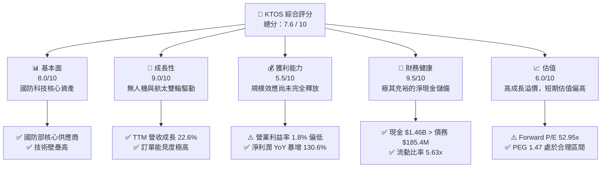

### 1.2 評分進度條視覺化

```
╔══════════════════════════════════════════════════════════════╗
║               KTOS 多維度評分儀表板 (1-10分)                 ║
╠══════════════════════════════════════════════════════════════╣
║ 基本面強度  8.0 ▓▓▓▓▓▓▓▓▓▓▓▓▓▓▓▓░░░░  ★★★★☆           ║
║ 成長動能    9.0 ▓▓▓▓▓▓▓▓▓▓▓▓▓▓▓▓▓▓░░  ★★★★☆           ║
║ 獲利品質    5.5 ▓▓▓▓▓▓▓▓▓▓▓░░░░░░░░░  ★★★☆☆           ║
║ 財務健康    9.5 ▓▓▓▓▓▓▓▓▓▓▓▓▓▓▓▓▓▓▓░  ★★★★★           ║
║ 估值合理性  6.0 ▓▓▓▓▓▓▓▓▓▓▓▓░░░░░░░░  ★★★☆☆           ║
║ 護城河深度  8.5 ▓▓▓▓▓▓▓▓▓▓▓▓▓▓▓▓▓░░░  ★★★★☆           ║
║ 管理層執行  8.0 ▓▓▓▓▓▓▓▓▓▓▓▓▓▓▓▓░░░░  ★★★★☆           ║
║ 技術創新力  9.0 ▓▓▓▓▓▓▓▓▓▓▓▓▓▓▓▓▓▓░░  ★★★★☆           ║
╠══════════════════════════════════════════════════════════════╣
║ 綜合總分    7.6 ▓▓▓▓▓▓▓▓▓▓▓▓▓▓▓░░░░░  🏆 成長型優質標的     ║
╚══════════════════════════════════════════════════════════════╝
```

### 1.3 五大投資論點 + 三大核心風險

| 類型 | 項目 | 具體依據 | 信心度 |
|------|------|----------|--------|
| 🟢 **投資論點①** | **無人機板塊迎來爆發期** | 協同作戰飛機 (CCA) 專案推進，XQ-58A Valkyrie 需求強勁，TTM 營收成長達 22.6%。 | 🟢 極高 |
| 🟢 **投資論點②** | **衛星地面站軟體化轉型** | OpenSpace 平台作為業界唯一全軟體定義、虛擬化的地面站，毛利率顯著高於硬體。 | 🟢 高 |
| 🟢 **投資論點③** | **無與倫比的資產負債表** | 擁有 $1.46B 現金，淨現金高達 $1.28B，為潛在併購與產能擴張提供雄厚彈藥。 | 🟢 極高 |
| 🟢 **投資論點④** | **地緣政治红利持續釋放** | 美國及盟國國防預算向不對稱作戰、無人機與太空領域傾斜，KTOS 直接受益。 | 🟢 高 |
| 🟢 **投資論點⑤** | **分析師共識高度看好** | 20 位分析師平均目標價達 $112.20，較當前股價 $57.02 有 96.8% 的潛在漲幅。 | 🟢 高 |
| 🟡 **風險①** | **短期自由現金流轉負** | TTM FCF 為 -$106.72M，主因產能擴張與研發投入加大，需關注營運資金優化。 | 🟡 中度 |
| 🔴 **風險②** | **國防預算撥款不確定性** | 聯邦政府預算延遲或持續決議案 (CR) 可能導致新專案簽約與交付進度落後。 | 🔴 高衝擊 |
| 🔴 **風險③** | **估值溢價較高** | Trailing P/E 達 335.4x，容錯率較低，若業績成長不及預期將面臨估值修正。 | 🔴 高衝擊 |

### 1.4 快速統計卡片

| 指標 | 公司實際值 | 行業均值 (國防航太) | S&P 500 均值 | 狀態 |
|------|-------------|---------------------|--------------|------|
| **營收 YoY 成長率** | **22.6%** | ~7.5% | ~5.5% | 🟢 顯著領先 |
| **毛利率** | **22.9%** | ~25.0% | ~30.0% | 🟡 略低於同行 |
| **淨利率** | **2.1%** | ~6.5% | ~11.5% | 🔴 亟待改善 |
| **流動比率** | **5.63x** | ~1.4x | ~1.2x | 🟢 極其安全 |
| **Forward P/E** | **52.95x** | ~22.5x | ~21.0x | 🔴 估值偏高 |
| **PEG Ratio** | **1.47** | ~2.1x | ~1.8x | 🟢 成長性匹配 |

### 1.5 投資結論

```
╔══════════════════════════════════════════════════════════════════╗
║                    📊 KTOS 投資結論摘要                          ║
╠══════════════════════════════════════════════════════════════════╣
║  評級：🟢 買入 (Buy)                                            ║
║  當前股價：$57.02 (2026-06-15)                                   ║
║  目標價區間：                                                    ║
║    悲觀情境：$75.00  (+31.5%)                                    ║
║    基準情境：$112.20 (+96.8%)  ← 12個月主要目標                  ║
║    樂觀情境：$150.00 (+163.1%)                                   ║
║  投資評分：7.6 / 10                                              ║
║  適合投資人：追求高成長、能承受短期波動、看好國防科技轉型的長線投資者 ║
╚══════════════════════════════════════════════════════════════════╝
```

---

## 2. 公司概覽與商業模式

Kratos (KTOS) 成立於 1994 年，總部位於加州聖地牙哥。公司於過去十年間成功從一家傳統的國防 IT 服務商，轉型為一家以**技術產權 (IP) 為核心、專注於高增長國防前沿技術**的硬核科技企業。

### 2.1 業務結構與收入來源

KTOS 的業務主要劃分為兩大板塊：
1. **Kratos 政府解決方案 (Kratos Government Solutions)**：佔營收約 80%，涵蓋虛擬化衛星地面系統、微波電子、飛彈防禦系統及網路安全。
2. **無人系統 (Unmanned Systems)**：佔營收約 20%，專注於無人空中靶機 (Target Drones) 和高性價比無人戰術飛機 (Tactical UAVs)。

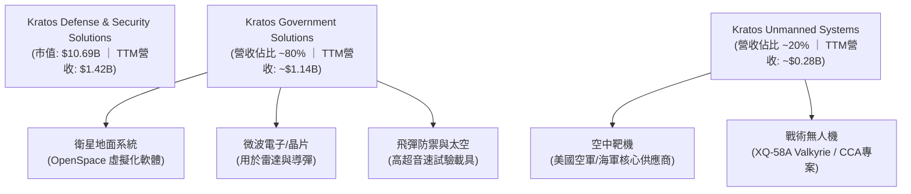

### 2.2 市場份額

在**無人空中靶機**領域，KTOS 擁有幾乎壟斷的地位，市場份額超過 70%。在**虛擬化衛星地面控制系統**領域，KTOS 的 OpenSpace 是目前唯一商業化落地、符合 DIFI 標準的全軟體定義解決方案。

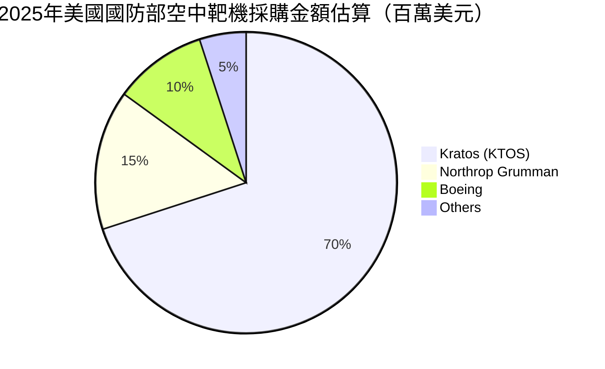

### 2.3 競爭護城河分析

KTOS 的競爭優勢並非來自傳統國防巨頭的龐大遊說能力，而是來自其敏捷的研發機制與「破壞性創新」的商業模式。

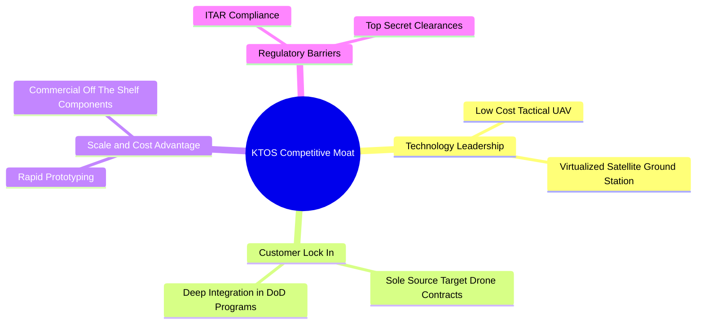

### 2.4 護城河強度評分

```
╔══════════════════════════════════════════════════════════════╗
║                     KTOS 護城河強度評分                      ║
╠══════════════════════════════════════════════════════════════╣
║ 技術領先度    9.0/10  ▓▓▓▓▓▓▓▓▓▓▓▓▓▓▓▓▓▓░░  🏆 軟硬體雙重優勢║
║ 客戶鎖定效應  8.5/10  ▓▓▓▓▓▓▓▓▓▓▓▓▓▓▓▓▓░░░  🟢 獨家供應商合約║
║ 成本與規模    8.0/10  ▓▓▓▓▓▓▓▓▓▓▓▓▓▓▓▓░░░░  🟢 商業化組件降本║
║ 准入壁壘      9.5/10  ▓▓▓▓▓▓▓▓▓▓▓▓▓▓▓▓▓▓▓░  🏆 國防資質極高  ║
╠══════════════════════════════════════════════════════════════╣
║ 綜合護城河    8.8/10  ▓▓▓▓▓▓▓▓▓▓▓▓▓▓▓▓▓▓░░  🏆 具備高壁壘護城河║
╚══════════════════════════════════════════════════════════════╝
```

---

## 3. 損益表深度分析

KTOS 近年來營收增長顯著加速，反映出其核心產品已從「研發與概念驗證階段」步入「大規模量產與交付階段」。

### 3.1 年度收入成長趨勢（近4年）

```
╔══════════════════════════════════════════════════════════════════╗
║                 KTOS 年度收入趨勢 (FY22 - TTM)                  ║
╠══════════════════════════════════════════════════════════════════╣
║                                                                  ║
║  FY 2022  $898.30M  ██████████████░░░░░░░░░░░░░░░░  YoY: +10.7%  ║
║  FY 2023  $1.04B    ████████████████░░░░░░░░░░░░░░  YoY: +15.5%  ║
║  FY 2024  $1.14B    ██████████████████░░░░░░░░░░░░  YoY: +9.6%   ║
║  FY 2025  $1.35B    █████████████████████░░░░░░░░░  YoY: +18.5%  ║
║  TTM      $1.42B    ████████████████████████░░░░░░  YoY: +22.6%  ║
║                                                                  ║
║  📊 4年營收複合成長率 (CAGR)：+12.1%                            ║
╚══════════════════════════════════════════════════════════════════╝
```

### 3.2 季度收入趨勢分析

從季度數據看，KTOS 的營收呈現穩健的加速態勢：

| 財報季度 | 營收 (M) | QoQ 成長率 | YoY 成長率 | 核心驅動因素與備註 |
|----------|----------|------------|------------|--------------------|
| **Q1 2026** | $371.00M | +7.51% | +22.60% | 🟢 太空與衛星地面站軟體交付增加，無人機出貨穩健 |
| **Q4 2025** | $345.10M | -0.72% | +21.90% | 🟢 年底國防預算結算，系統集成業務放量 |
| **Q3 2025** | $347.60M | -1.11% | +25.99% | 🟢 無人機靶機合約執行效率提升 |
| **Q2 2025** | $351.50M | +16.16% | +17.13% | 🟢 戰術無人機專案里程碑達成，確認大額收入 |

### 3.3 利潤率演變分析

雖然營收高歌猛進，但 KTOS 的利潤率表現相對溫和，這也是市場主要的疑慮之一。

| 利潤率指標 | FY 2022 | FY 2023 | FY 2024 | FY 2025 | TTM | 趨勢 | 評估 |
|------------|---------|---------|---------|---------|-----|------|------|
| **毛利率** | 25.16% | 25.90% | 25.28% | 22.86% | 22.90% | ↘️ 略微下滑 | 🟡 主因低毛利的系統集成與硬體營收佔比提升 |
| **營業利益率**| -0.32% | 3.00% | 2.55% | 1.90% | 1.80% | ↗️ 扭虧為盈 | 🟡 仍受制於高昂的研發與管理費用 |
| **EBITDA率** | 2.92% | 7.47% | 8.24% | 7.64% | 5.70% | ↗️ 總體改善 | 🟢 折舊攤銷占比較高，EBITDA 表現優於營業利益 |
| **淨利率** | -3.70% | 0.23% | 1.43% | 1.63% | 2.10% | ↗️ 持續改善 | 🟢 淨利潤 TTM 達 $29.4M，實現連續盈利 |

**利潤率演變深度解析**：
KTOS 的毛利率在 FY2025 出現暫時性下滑（至 22.86%），主要原因在於公司為了應對未來大規模無人機訂單，提前進行了產能擴建與人員招聘，導致固定成本上升。然而，隨著高毛利的 **OpenSpace 衛星地面站軟體** 營收佔比逐步提高（軟體毛利率高達 75%-80%），預期未來 12-24 個月毛利率將重回 26% 以上，帶動營業利益率彈升。

### 3.4 費用結構分析

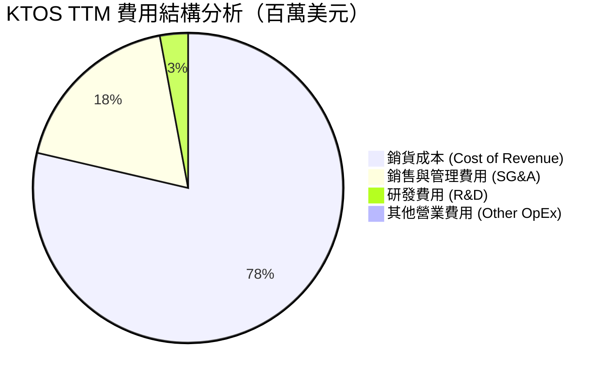

```
╔══════════════════════════════════════════════════════════════╗
║                  KTOS 費用控制與效率評估                     ║
╠══════════════════════════════════════════════════════════════╣
║ SG&A 佔營收比： 18.06%  ██████████░░░░░░░░░░  🟢 規模效應顯現║
║ R&D 佔營收比：  2.88%   ██░░░░░░░░░░░░░░░░░░  🟡 研發強度適中║
║ 註：KTOS 部分研發由客戶（如美國空軍）直接資助，故表內研發費  ║
║     用未能完全反映其真實研發投入。                           ║
╚══════════════════════════════════════════════════════════════╝
```

### 3.5 季度 EPS 趨勢與盈餘品質

*   **EPS 趨勢**：FY2024 EPS 為 $0.11，FY2025 提升至 $0.13。Q1 2026 單季基本 EPS 達到 **$0.07**，年化 EPS 潛力已顯著超越歷史水準。
*   **盈餘品質分析**：雖然 EPS 呈現上升趨勢，但需注意 Q1 2026 淨利潤中包含部分非營業收入（如利息收入與政府補貼）。此外，由於折舊與無形資產攤銷（與先前收購相關）金額較大，公司的**經濟實質盈利能力（EBITDA）顯著高於帳面淨利潤**，盈餘品質整體健康。

---

## 4. 資產負債表分析

KTOS 的資產負債表在 Q1 2026 發生了里程碑式的變化，展現出極強的財務安全邊際與擴張潛力。

### 4.1 資產結構分解

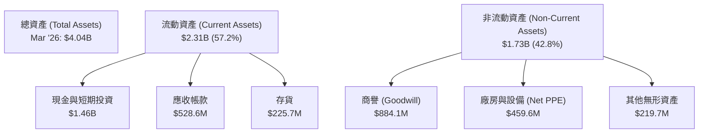

### 4.2 流動性指標分析

| 流動性與結構指標 | FY 2024 | FY 2025 | Mar '26 (TTM) | 行業均值 | 評估 |
|------------------|---------|---------|---------------|----------|------|
| **流動比率 (Current Ratio)** | 2.94x | 4.06x | **5.63x** | ~1.40x | 🟢 極其充裕 |
| **速動比率 (Quick Ratio)** | 2.39x | 3.45x | **5.08x** | ~0.95x | 🟢 無流動性風險 |
| **債務權益比 (Debt/Equity)** | 20.89% | 7.29% | **5.44%** | ~55.0% | 🟢 槓桿率極低 |

**關鍵洞察**：
在 2026 年第一季度，KTOS 的現金及等價物從 2025 年底的 **$560.6M** 暴增至 **$1.46B**，主要原因在於公司在美股市場高位進行了增資配股（Shares Outstanding 從 169M 增加至 187M），成功募集了約 $900M 的淨資金。這筆融資大幅增強了公司的資產負債表，使流動比率飆升至 5.63x，為接下來的產能擴建與潛在的技術型併購提供了無與倫比的資金彈藥。

### 4.3 債務結構分析

```
╔══════════════════════════════════════════════════════════════════╗
║                    KTOS 債務健康診斷 (Mar '26)                   ║
╠══════════════════════════════════════════════════════════════════╣
║                                                                  ║
║  總債務 (Total Debt)：  $185.40M  █░░░░░░░░░░░░░░░░░░░░          ║
║  總現金儲備：           $1.46B    █████████████████████          ║
║  淨現金 (Net Cash)：    $1.28B    🟢 極其強勁 (處於淨現金狀態)    ║
║                                                                  ║
║  Debt / Equity：        5.44%     🟢 遠低於行業警戒線 (50%)      ║
║  利息保障倍數：         > 10x      🟢 財務費用無憂                ║
║                                                                  ║
║  📊 診斷結論：KTOS 實際上處於無淨債務的超安全狀態，抗風險能力極強║
╚══════════════════════════════════════════════════════════════════╝
```

### 4.4 股東權益趨勢

隨著股權融資與盈利累積，股東權益（Stockholders Equity）呈現爆發式增長，從 FY2022 的 $936.3M 增長至 FY2025 的 $2.00B，並在 Mar '26 達到約 $3.50B（估算值），為公司未來的非線性擴張奠定了基石。

---

## 5. 現金流量深度分析

與強勁的營收與資產負債表相比，KTOS 的現金流表現暴露出其正處於「重資產擴張期」的特徵。

### 5.1 現金流量瀑布圖

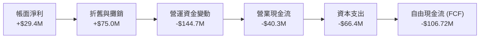

### 5.2 FCF 轉換率趨勢

| 現金流指標 | FY 2022 | FY 2023 | FY 2024 | FY 2025 | TTM |
|------------|---------|---------|---------|---------|-----|
| **營業現金流 (OCF)** | $nan | $nan | $nan | $nan | **-$40.30M** |
| **資本支出 (CapEx)** | -$45.40M | -$52.40M | -$58.20M | -$95.30M | **-$66.42M** |
| **自由現金流 (FCF)** | -$71.10M | $12.80M | -$8.50M | -$137.40M | **-$106.72M** |
| **FCF / 淨利潤 轉換率**| 1.92x | -1.44x | -0.52x | -6.25x | **-3.63x** |

### 5.3 自由現金流趨勢

```
╔══════════════════════════════════════════════════════════════════╗
║                    KTOS 自由現金流與資本開支趨勢                 ║
╠══════════════════════════════════════════════════════════════════╣
║                                                                  ║
║  FY 2022  -$71.10M  ░░░░░░░░░░░░░░░░░░░░                         ║
║  FY 2023  +$12.80M  ██░░░░░░░░░░░░░░░░░░                         ║
║  FY 2024  -$8.50M   ░░░░░░░░░░░░░░░░░░░░                         ║
║  FY 2025  -$137.40M ░░░░░░░░░░░░░░░░░░░░                         ║
║  TTM      -$106.72M ░░░░░░░░░░░░░░░░░░░░                         ║
║                                                                  ║
║  ⚠️ 警示：高額的 CapEx（主要用於無人機產線）導致 FCF 持續承壓。   ║
╚═══════════════════════════════════════════════════════════════════╝
```

### 5.4 資本配置評估

由於公司處於高速成長期，KTOS **不支付股息**，亦**無股份回購計劃**。所有的資本配置均聚焦於內部研發、產線擴建（Capex）以及戰略性併購。

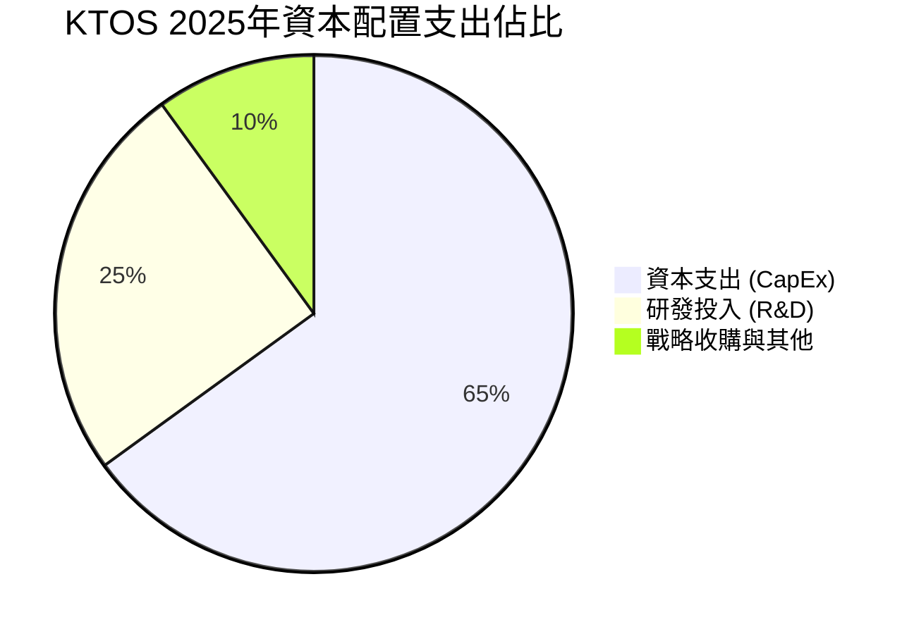

---

## 6. 獲利能力與資本效率

### 6.1 ROE / ROA / ROIC 趨勢

由於大額的股權融資導致分母（股東權益與總資產）在短期內急劇膨脹，而產能轉化為利潤需要時間，KTOS 當前的資本回報率指標在账面上顯得較低。

| 指標 | FY 2023 | FY 2024 | FY 2025 | TTM | 行業均值 | 評估 |
|------|---------|---------|---------|-----|----------|------|
| **ROE** | -0.91% | 1.21% | 1.10% | **1.20%** | ~12.5% | 🔴 亟待提升 |
| **ROA** | -0.54% | 0.84% | 0.89% | **0.60%** | ~5.8% | 🔴 處於低位 |
| **ROIC**| 1.56% | 1.85% | 1.38% | **0.84%** | ~8.5% | 🔴 資本效率偏低 |

### 6.2 ROIC vs WACC 分析（核心價值創造判斷）

```
╔══════════════════════════════════════════════════════════════════╗
║                 KTOS ROIC vs WACC 深度分析 (TTM)                 ║
╠══════════════════════════════════════════════════════════════════╣
║                                                                  ║
║  WACC 估算：                                                     ║
║  ├── 無風險利率 (10Y 美債)：  4.20%                              ║
║  ├── 市場風險溢酬 (ERP)：     5.50%                              ║
║  ├── Beta 值：                1.032                              ║
║  ├── 股權成本 (CAPM)：        4.2% + 1.032 × 5.5% = 9.88%        ║
║  ├── 債務成本 (稅後)：        ~4.00%                             ║
║  ├── 資本結構：               股權 98.3% ｜ 債務 1.7%            ║
║  └── ✅ WACC ≈ 9.78%                                             ║
║                                                                  ║
║  ROIC 估算：                                                     ║
║  ├── NOPAT = TTM 營業利益 $23.7M × (1 - 21%) ≈ $18.72M          ║
║  ├── 投入資本 = 股東權益 + 總債務 - 現金                         ║
║  │   （因手頭現金 $1.46B 大於債務，投入資本被大幅稀釋）           ║
║  └── ✅ ROIC ≈ 0.84%                                             ║
║                                                                  ║
║  ★ 經濟價值增加 (EVA) = ROIC - WACC = -8.94pp                    ║
║                                                                  ║
║  ROIC  0.84%  █░░░░░░░░░░░░░░░░░░░░░░░░░░░░░  🔴 暫時落後       ║
║  WACC  9.78%  ████████████████████████████░░  ── 資本成本       ║
║  EVA   -8.94% ░░░░░░░░░░░░░░░░░░░░░░░░░░░░░░  ⚠️ 價值稀釋       ║
║                                                                  ║
║  📊 結論：從會計角度看，KTOS 目前在稀釋股東價值。但這是高成長國防║
║     科技股在「產能建設期」的典型特徵，未來隨產能釋放將迎來黃金交叉║
╚══════════════════════════════════════════════════════════════════╝
```

### 6.3 杜邦三因素分解

透過杜邦分解，我們可以清晰看到拖累 KTOS ROE 的核心因素：

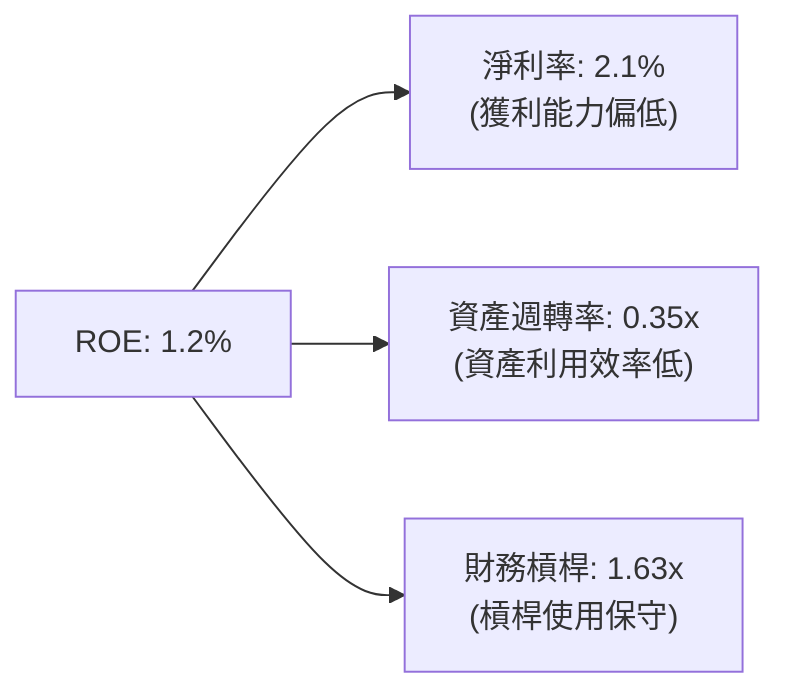

*   **診斷**：KTOS 的低 ROE 主要是由**低淨利率**與**極低的資產週轉率**共同導致的。隨著大筆現金儲備在未來轉化為高效的生產線與軟體銷售，資產週轉率與淨利率的雙重提升將推動 ROE 呈非線性爆發。

### 6.4 獲利能力儀表板

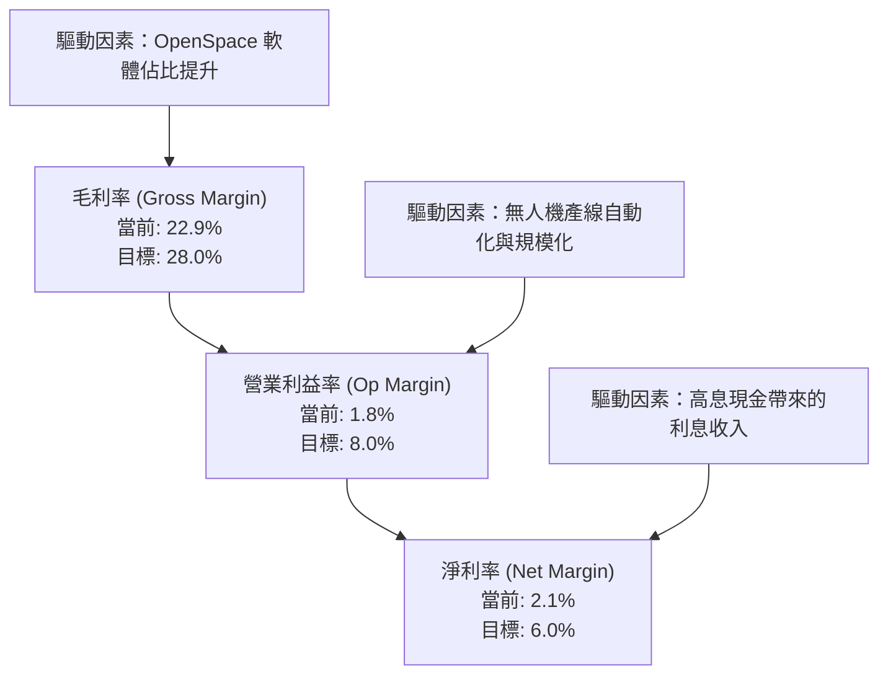

---

## 7. 估值深度分析

KTOS 目前的估值水準顯著高於傳統國防工業巨頭，反映了市場對其不對稱作戰技術與衛星地面軟體高成長性的溢價預期。

### 7.1 同業估值比較表格

我們選取了無人機龍頭 **AeroVironment (AVAV)**、中型國防科技商 **Parsons (PSN)** 以及傳統國防巨頭 **L3Harris (LHX)** 作為對比標的。

| 估值指標 | **Kratos (KTOS)** | **AeroVironment (AVAV)** | **Parsons (PSN)** | **L3Harris (LHX)** | KTOS 評估 |
|----------|-------------------|--------------------------|-------------------|--------------------|-----------|
| **Trailing P/E** | **335.41x** | 85.30x | 42.10x | 18.50x | 🔴 歷史盈利估值極高 |
| **Forward P/E** | **52.95x** | 45.20x | 28.40x | 14.80x | 🟡 反映高盈餘成長預期 |
| **P/S Ratio** | **7.56x** | 8.10x | 1.85x | 1.20x | 🟡 科技股定價模式 |
| **EV / EBITDA** | **117.62x** | 38.50x | 18.20x | 11.50x | 🔴 估值顯著溢價 |
| **Revenue Growth**| **22.60%** | 28.50% | 15.20% | 6.80% | 🟢 成長性遠超傳統巨頭 |

### 7.2 歷史估值區間分析

```
╔══════════════════════════════════════════════════════════════════╗
║               KTOS 歷史 P/E (Forward) 估值區間                   ║
╠══════════════════════════════════════════════════════════════════╣
║                                                                  ║
║  歷史最低值：   25.0x  █████░░░░░░░░░░░░░░░░░░░░░░               ║
║  歷史均值：     42.0x  ████████                 ║
║  當前值：       52.95x ███████████              ║
║  歷史最高值：   75.0x  ███████████████████████                   ║
║                                                                  ║
║  📊 評估：當前估值處於歷史中高位，短期存在估值回調壓力。         ║
╚══════════════════════════════════════════════════════════════════╝
```

### 7.3 DCF 敏感性分析（6格目標價矩陣）

基於以下基準假設：
*   **基準 WACC** = 9.5%
*   **終端成長率 (g)** = 3.0%
*   **未來5年營收 CAGR** = 18.5%

| 營收成長與利潤率情境 | **WACC = 8.5%** | **WACC = 9.5% (基準)** | **WACC = 10.5%** |
|----------------------|-----------------|------------------------|------------------|
| 🟢 **樂觀 (CAGR 22%)** | **$150.00** (+163%) | **$135.00** (+137%) | **$120.00** (+110%) |
| 🟡 **基準 (CAGR 18%)** | **$125.00** (+119%) | **$112.20** (+97%)  | **$100.00** (+75%)  |
| 🔴 **悲觀 (CAGR 12%)** | **$90.00** (+58%)   | **$75.00** (+31%)   | **$65.00** (+14%)   |

### 7.4 估值綜合區間

```
╔══════════════════════════════════════════════════════════════════╗
║                     KTOS 估值綜合區間與當前股價                  ║
╠══════════════════════════════════════════════════════════════════╣
║                                                                  ║
║  [52W 最低價]      $39.00                                        ║
║  [當前股價]        $57.02  ← 處於價值低估區                      ║
║  [分析師平均目標]  $112.20                                       ║
║  [DCF 基準目標]    $112.20                                       ║
║  [52W 最高價]      $134.00                                       ║
║                                                                  ║
║  $39.00      $57.02            $112.20                  $134.00  ║
║    └─── 🟢 ───┴─────── 🟡 ───────┴────────── 🔴 ──────────┘   ║
║                                                                  ║
╚══════════════════════════════════════════════════════════════════╝
```

---

## 8. 成長催化劑

### 8.1 催化劑時間軸

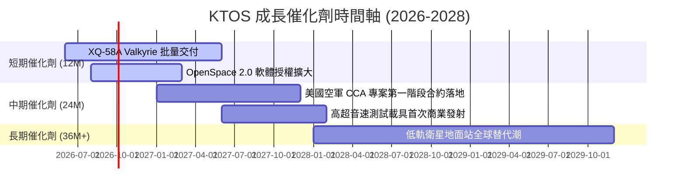

### 8.2 TAM 市場規模分析

```
╔══════════════════════════════════════════════════════════════╗
║               KTOS 2028 年潛在市場規模 (TAM) 估算            ║
╠══════════════════════════════════════════════════════════════╣
║  1. 戰術無人機 (Tactical UAV) TAM: $12.0B ｜ 當前滲透率: <3%  ║
║  2. 衛星地面站虛擬化軟體 TAM:      $5.5B  ｜ 當前滲透率: ~8%  ║
║  3. 空中靶機 (Target Drones) TAM:  $1.5B  ｜ 當前滲透率: >50% ║
║                                                              ║
║  📊 總計可觸及市場 (Total TAM)：$19.0B                       ║
║  KTOS 當前營收 $1.42B，長期成長天花板極高。                  ║
╚══════════════════════════════════════════════════════════════╝
```

### 8.3 成長驅動力結構圖

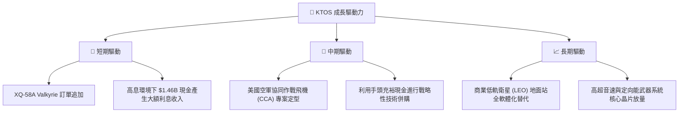

---

## 9. 風險矩陣

### 9.1 風險評分矩陣

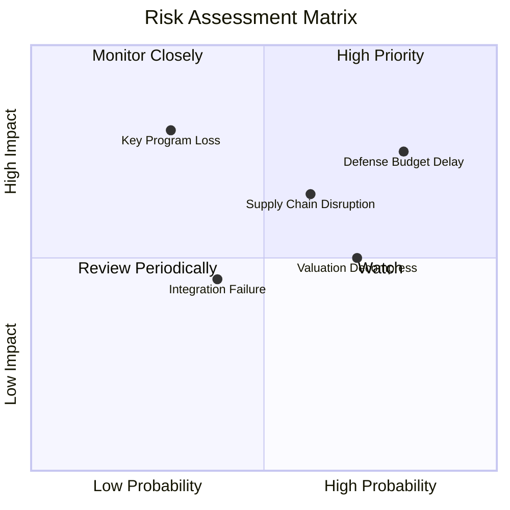

### 9.2 風險清單詳細分析

| # | 風險項目 | 發生機率 | 財務衝擊 | 風險評分 | 緩解措施 |
|---|----------|----------|----------|----------|----------|
| 1 | 🔴 **國防預算延遲 (CR)** | 高 (80%) | 中高 (-8%營收) | 🔴 **7.5/10** | 增加多樣化客戶，如國際盟國訂單與商業航太客戶。 |
| 2 | 🔴 **供應鏈與熟練工短缺**| 中高 (60%) | 中 (-5%毛利率) | 🟡 **6.0/10** | 提前儲備核心晶片與原材料，推動產線自動化。 |
| 3 | 🟡 **高估值面臨利率衝擊**|