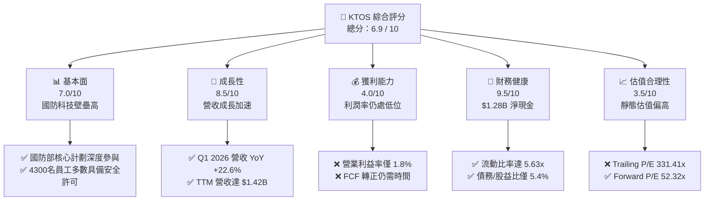
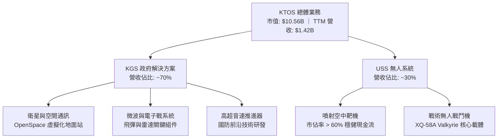
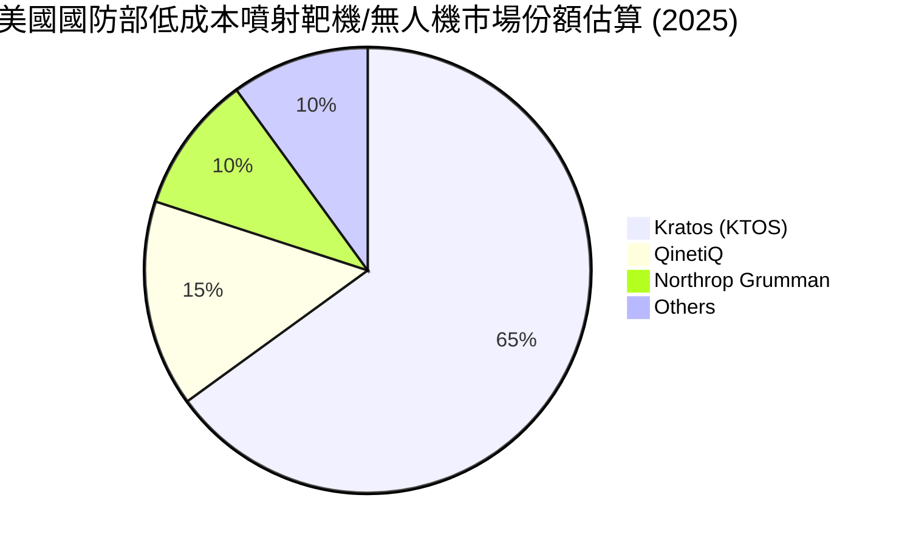
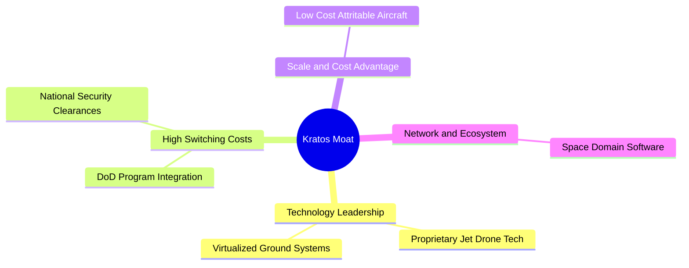
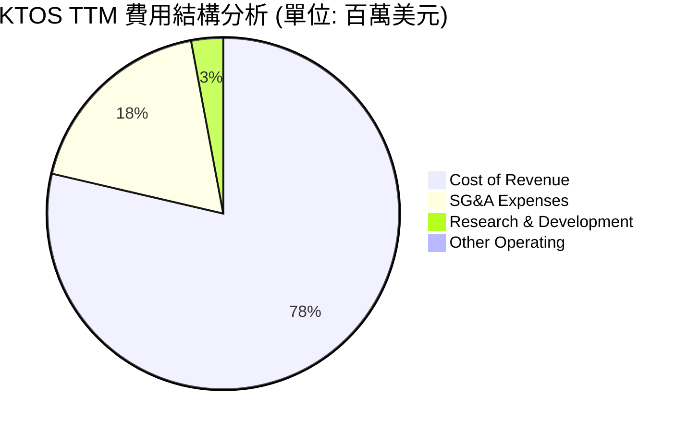
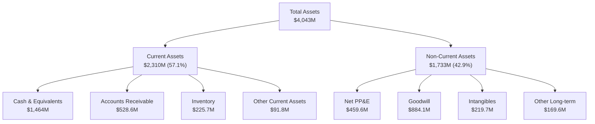
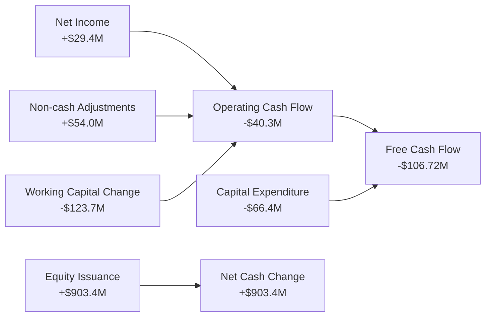
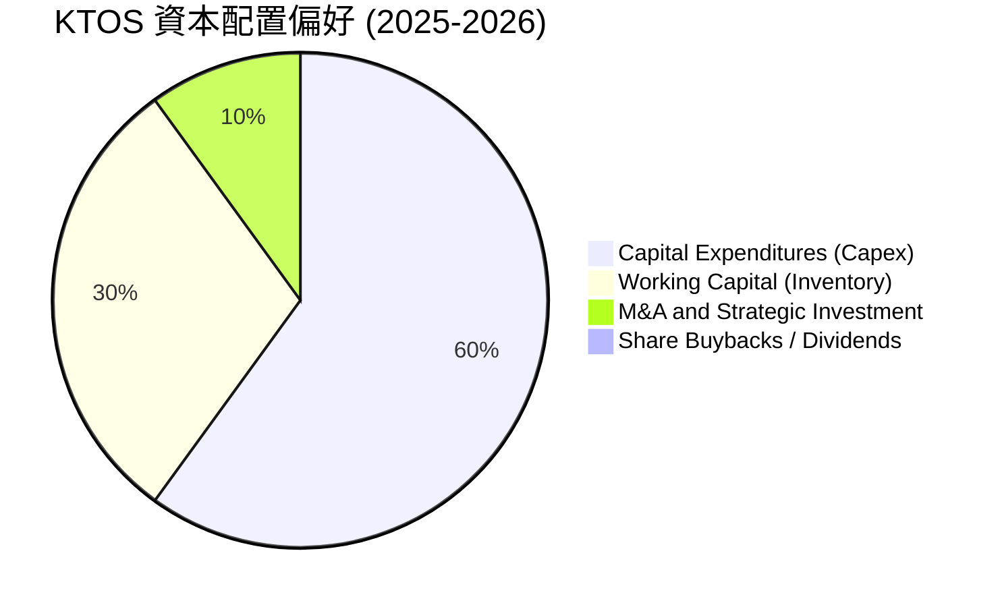

# KTOS 基本面深度分析報告
> **報告日期**：2026-06-16 ｜ **語言**：繁體中文 ｜ **數據來源**：Yahoo Finance, Finviz, StockAnalysis, Roic.ai ｜ **分析師**：CFA 級機構研究

---

## 目錄

| # | 章節 | 核心結論 |
|---|------|----------|
| 1 | **執行摘要** | 評級：**買入 (Buy)** ｜ 目標價：**$112.20** (上行空間 +99.1%) ｜ 淨現金充沛，正處於產能擴張拐點。 |
| 2 | **公司概覽與商業模式** | 專注於無人機與衛星地面虛擬化軟體，具備極高的國防進入壁壘與技術護城河。 |
| 3 | **損益表深度分析** | 營收 TTM 達 $1.42B (YoY +22.6%)，淨利大幅改善，但高昂的研發與銷管費用壓低了營業利益率。 |
| 4 | **資產負債表分析** | 現金儲備高達 $1.46B，負債僅 $185.40M，淨現金高達 $1.28B，流動比率 5.63x，財務極度穩健。 |
| 5 | **現金流量深度分析** | 營運現金流與 FCF 仍為負值 (FCF -$106.72M)，主因是因應國防訂單進行的大規模資本支出與存貨拉貨。 |
| 6 | **獲利能力與資本效率** | 當前 ROE (1.2%) 與 ROIC (0.94%) 偏低，資本效率尚未釋放，WACC 約 9.2%，處於價值蓄勢期。 |
| 7 | **估值深度分析** | 雖然 Trailing P/E 高達 331.4x，但 Forward P/E 降至 52.3x，相較於同業的高成長性，估值具備溢價合理性。 |
| 8 | **成長催化劑** | 美國國防部 Replicator 計劃、XQ-58A Valkyrie 戰術無人機量產、以及 OpenSpace 衛星軟體普及。 |
| 9 | **風險矩陣** | 國防預算撥款延遲、供應鏈擾動、以及高估值下的市場波動風險。 |
| 10 | **投資建議** | 建議分批佈局，基準目標價 $112.20，適合具備長線眼光的成長型與國防科技主題投資者。 |

---

## 1. 執行摘要

Kratos Defense & Security Solutions, Inc. (NASDAQ: KTOS) 是一家處於美國國防部（DoD）「不對稱作戰」與「低成本可消耗（Attritable）武器系統」變革核心的科技與國防承包商。與傳統國防巨頭（如 Lockheed Martin, RTX）不同，Kratos 專注於高增長、高技術壁壘的細分領域：**噴射無人戰鬥機系統（UAS）**、**衛星地面虛擬化軟體**、**微波電子戰**以及**高超音速系統推進器**。

### 1.1 核心評分儀表板



### 1.2 評分進度條視覺化

```
╔══════════════════════════════════════════════════════════════╗
║               KTOS 多維度評分儀表板 (1-10分)                 ║
╠══════════════════════════════════════════════════════════════╣
║ 基本面強度  7.0 ▓▓▓▓▓▓▓▓▓▓▓▓▓▓░░░░░░░░  ★★★★☆           ║
║ 成長動能    8.5 ▓▓▓▓▓▓▓▓▓▓▓▓▓▓▓▓▓░░░  ★★★★☆           ║
║ 獲利品質    4.0 ▓▓▓▓▓▓▓▓░░░░░░░░░░░░░░  ★★☆☆☆           ║
║ 財務健康    9.5 ▓▓▓▓▓▓▓▓▓▓▓▓▓▓▓▓▓▓▓░  ★★★★★           ║
║ 估值合理性  3.5 ▓▓▓▓▓▓▓░░░░░░░░░░░░░░░░  ★★☆☆☆           ║
║ 護城河深度  8.0 ▓▓▓▓▓▓▓▓▓▓▓▓▓▓▓▓░░░░  ★★★★☆           ║
║ 管理層執行  7.0 ▓▓▓▓▓▓▓▓▓▓▓▓▓▓░░░░░░░░  ★★★★☆           ║
║ 技術創新力  8.5 ▓▓▓▓▓▓▓▓▓▓▓▓▓▓▓▓▓░░░  ★★★★☆           ║
╠══════════════════════════════════════════════════════════════╣
║ 綜合總分    6.9 ▓▓▓▓▓▓▓▓▓▓▓▓▓▓░░░░░░░░  🏆 成長期國防科技龍頭║
╚══════════════════════════════════════════════════════════════╝
```

### 1.3 五大投資論點 + 三大核心風險

| 類型 | 項目 | 具體依據 | 信心度 |
|------|------|----------|--------|
| 🟢 **投資論點①** | **無人戰術系統量產拐點** | Kratos 的 XQ-58A Valkyrie（女武神）無人機正深度參與美國空軍「協同作戰飛機（CCA）」計劃，預計將在 2026-2027 年迎來實質採購訂單，推動無人機部門（USS）營收爆發。 | 🟢 極高 |
| 🟢 **投資論點②** | **極致的財務安全邊際** | 截至 2026 年第一季，公司擁有 **$1.46B 的現金及等價物**，而總債務僅為 **$185.40M**，擁有高達 **$1.28B 的淨現金**。這為未來的產能擴張與潛在併購提供了無與倫比的資金彈性。 | 🟢 極高 |
| 🟢 **投資論點③** | **衛星地面系統軟體化變革** | Kratos 推出業界首款軟體定義的虛擬化地面站平台 OpenSpace，將傳統硬體地面站轉化為雲端架構。隨著低軌衛星（LEO）爆發，該業務具備高毛利、高粘性特徵。 | 🟢 高 |
| 🟢 **投資論點④** | **國防預算與政策紅利** | 美國國防部大力推動「Replicator（複製者）」計劃，旨在兩年內部署數千個廉價、自主的無人系統，以對抗對手的數量優勢。Kratos 是此政策的最直接受益者。 | 🟢 高 |
| 🟢 **投資論點⑤** | **營收與盈餘成長加速** | TTM 營收年增率達 **22.6%**，且 2026 年第一季實現淨利 **$11.90M**，較去年同期的 $4.50M 大幅增長 **164.4%**，顯示規模效應與營運槓桿開始顯現。 | 🟢 高 |
| 🟡 **風險①** | **自由現金流持續承壓** | TTM 自由現金流為 **-$106.72M**，2025 年資本支出高達 **$95.30M**。為了滿足未來的量產需求，公司正在進行密集的產能投資與存貨備料，短期內現金流仍將承壓。 | 🟡 中度 |
| 🔴 **風險②** | **靜態估值溢價過高** | 當前 Trailing P/E 為 **331.41x**，EV/EBITDA 達 **115.93x**。雖然 Forward P/E 已降至 **52.32x**，但任何業績交付的延遲或國防撥款的暫緩都可能導致股價劇烈回檔。 | 🔴 高衝擊 |
| 🟡 **風險③** | **股權稀釋風險** | 為了籌集資金，發行在外股數（Shares Outstanding）從 2021 年的 125M 增加到 2026 年第一季的 **187.52M**（YoY +10.41%）。雖然換來了充沛的現金流，但短期內稀釋了每股盈餘（EPS）。 | 🟡 中度 |

### 1.4 快速統計卡片

| 指標 | 公司實際值 (KTOS) | 行業均值 (航太與國防) | S&P 500 均值 | 狀態 |
|------|-------------|----------|--------------|------|
| **營收 YoY 成長率** | **22.6%** | ~7.5% | ~5.5% | 🟢 顯著超越同業 |
| **毛利率** | **22.9%** | ~20.5% | ~30.0% | 🟡 符合行業標準 |
| **淨利率** | **2.1%** | ~6.2% | ~11.5% | 🔴 仍有巨大改善空間 |
| **流動比率** | **5.63x** | ~1.45x | ~1.20x | 🟢 極其安全 |
| **債務/股益比** | **5.4%** | ~65.0% | ~115.0% | 🟢 幾乎無債務風險 |
| **Forward P/E** | **52.32x** | ~22.5x | ~21.0x | 🔴 估值偏高 |

### 1.5 投資結論

```
╔══════════════════════════════════════════════════════════════════╗
║                      📊 KTOS 投資結論摘要                        ║
╠══════════════════════════════════════════════════════════════════╣
║  評級：🟢 買入 (Buy)                                            ║
║  當前股價：$56.34 (2026-06-16)                                   ║
║  目標價區間：                                                    ║
║    悲觀情境：$75.00（+33.1%）- 核心計劃進度推遲，估值回檔         ║
║    基準情境：$112.20（+99.1%） - 12個月主要目標，CCA 計劃順利推進 ║
║    樂觀情境：$150.00（+166.2%）- 女武神獲大額訂單，OpenSpace 爆發 ║
║  投資評分：6.9 / 10                                              ║
║  適合投資人：具備高風險承受能力、專注於國防科技與航太長線成長者  ║
╚══════════════════════════════════════════════════════════════════╝
```

---

## 2. 公司概覽與商業模式

Kratos Defense & Security Solutions (KTOS) 的核心商業模式是「**以商用技術的速度和成本，交付先進的國防系統**」。傳統國防承包商開發新系統動輒耗時十年、耗資數十億美元，而 Kratos 則利用成熟的商用現貨（COTS）技術與敏捷開發模式，大幅縮短研發週期並降低成本。

### 2.1 業務結構與收入來源

Kratos 主要分為兩大營運板塊：

1. **Kratos 政府解決方案（KGS, 佔營收約 70%）**：
   - **衛星與空間通信（Space & Satellite）**：提供虛擬化地面站軟體（OpenSpace），是該領域的全球龍頭。
   - **微波電子戰與防禦系統**：用於飛彈、雷達與電子戰系統的關鍵微波組件。
   - **高超音速與推進系統**：參與多個美國政府的高超音速武器研發計劃。
2. **無人系統（USS, 佔營收約 30%）**：
   - **空中靶機（Target Drones）**：為美國陸海空軍提供高仿真噴射靶機（如 BQM-167, BQM-177），市佔率超過 60%。
   - **戰術無人機（Tactical UAVs）**：研發低成本、可消耗的噴射無人戰鬥機（如 XQ-58A Valkyrie, UTAP-22 Mako），用於與載人戰機（如 F-35）協同作戰。



### 2.2 市場份額

在**低成本噴射靶機與可消耗戰術無人機**市場中，Kratos 擁有極高的市場支配地位。



### 2.3 競爭護城河分析

Kratos 的核心競爭壁壘並非僅來自於單一技術，而是來自於深厚的國防體系融合度與軟硬體協同效應。



1. **高昂的轉換成本（High Switching Costs）**：Kratos 的系統與美國國防部的指揮與控制（C2）系統深度整合。一旦採用其靶機或衛星地面站，軍方很難在不承擔巨大系統風險的情況下更換供應商。
2. **安全許可與資質壁壘（Security Clearances）**：公司擁有超過 4,300 名員工，其中大部分持有美國政府的安全許可。這種「人才與信任壁壘」是新進入者在十年內都難以複製的。
3. **成本與規模優勢（Cost & Scale Advantage）**：XQ-58A Valkyrie 的單機目標成本僅為 $2M - $3M，相較於傳統戰機（F-35 達 $80M+）具有無可比擬的成本優勢，是目前唯一能實現「規模化可消耗」的噴射無人機。

### 2.4 護城河強度評分

```
╔══════════════════════════════════════════════════════════════╗
║                   KTOS 護城河強度評分                        ║
╠══════════════════════════════════════════════════════════════╣
║ 國防准入資質    9.0/10 ▓▓▓▓▓▓▓▓▓▓▓▓▓▓▓▓▓▓░░  🏆 極高壁壘    ║
║ 衛星軟體技術    8.5/10 ▓▓▓▓▓▓▓▓▓▓▓▓▓▓▓▓▓░░░  🟢 領先優勢    ║
║ 無人機成本控制  8.0/10 ▓▓▓▓▓▓▓▓▓▓▓▓▓▓▓▓░░░░  🟢 規模效應    ║
║ 客戶鎖定效應    7.5/10 ▓▓▓▓▓▓▓▓▓▓▓▓▓▓░░░░░░  🟢 轉換成本高  ║
╠══════════════════════════════════════════════════════════════╣
║ 綜合護城河評估  8.25/10 ▓▓▓▓▓▓▓▓▓▓▓▓▓▓▓▓▓░░░  🏆 強固護城河  ║
╚══════════════════════════════════════════════════════════════╝
```

---

## 3. 損益表深度分析

Kratos 的財務表現正處於從「高研發投入」向「高規模效益」過渡的拐點。

### 3.1 年度收入成長趨勢（近 4 年）

```
╔══════════════════════════════════════════════════════════════════╗
║              KTOS 年度收入趨勢（FY2022-FY2025）                  ║
╠══════════════════════════════════════════════════════════════════╣
║                                                                  ║
║  FY2022  $898.30M  ██████████████████░░░░░░░░░░░  YoY: +10.7% 🟢 ║
║  FY2023  $1,037.0M █████████████████████░░░░░░░░  YoY: +15.5% 🟢 ║
║  FY2024  $1,136.0M ███████████████████████░░░░░░  YoY: +9.6%  🟢 ║
║  FY2025  $1,347.0M ███████████████████████████░░  YoY: +18.5% 🟢 ║
║                                                                  ║
║  📊 3年累計營收 CAGR：+14.45%                                    ║
╚══════════════════════════════════════════════════════════════════╝
```

*註：TTM（截至2026年3月）營收進一步推升至 **$1.415B**，年增率達 **21.82%**。*

### 3.2 季度營收趨勢分析

| 財報季度 | 營收 (Revenue) | YoY 成長率 | QoQ 成長率 | 核心驅動因素 |
|----------|---------------|------------|------------|--------------|
| **Q1 2026** | **$371.00M** | 🟢 **+22.60%** | 🟢 **+7.51%** | 無人機系統（USS）交付加速，衛星地面站軟體需求強勁。 |
| **Q4 2025** | **$345.10M** | 🟢 **+21.90%** | 🟡 **-0.72%** | 年底政府結算高峰，KGS 板塊穩定增長。 |
| **Q3 2025** | **$347.60M** | 🟢 **+25.99%** | 🟡 **-1.11%** | 戰術無人機測試與工程服務收入增加。 |
| **Q2 2025** | **$351.50M** | 🟢 **+17.13%** | 🟢 **+16.16%** | 靶機新訂單啟動，微波電子組件出貨增加。 |

Kratos 的季度營收呈現明顯的**加速成長**態勢。Q1 2026 營收達 $371.00M，創下歷史單季新高，顯示國防部對不對稱作戰武器的需求已轉化為實質營收。

### 3.3 利潤率演變分析

| 利潤率指標 | FY2022 | FY2023 | FY2024 | FY2025 | TTM (2026-03) | 趨勢評估 |
|------------|--------|--------|--------|--------|---------------|----------|
| **毛利率** | 25.16% | 25.90% | 25.28% | 22.86% | **22.90%** | 🟡 略微下滑，主因是低毛利的無人機製造佔比提升。 |
| **營業利益率**| -0.32% | 3.00%  | 2.55%  | 1.90%  | **1.80%** | 🔴 仍處於低位，反映了高昂的 R&D 與 SG&A 壓力。 |
| **EBITDA 率**| 2.92%  | 7.47%  | 8.24%  | 7.64%  | **5.70%** | 🟡 處於平台期，規模效應尚未完全釋放。 |
| **淨利率** | -3.70% | 0.23%  | 1.43%  | 1.63%  | **2.10%** | 🟢 持續改善，成功實現扭虧為盈並穩定獲利。 |

**利潤率演變深度解析**：
Kratos 的毛利率在過去四年中從 25.16% 降至 22.86%，這看似是獲利能力惡化，實則是**業務結構轉型**的必然結果。隨著無人系統（USS）進入小批量試生產（LRIP）階段，硬體製造營收佔比提升，其初期毛利率低於軟體與工程服務。然而，隨著產能利用率提升，預計無人機業務的毛利率將回升至 25% 以上；同時，高毛利的 OpenSpace 軟體業務規模擴大，將在長期推動整體毛利率重回 28% 的歷史高位。

### 3.4 費用結構分析



```
╔══════════════════════════════════════════════════════════════╗
║                   KTOS 費用控制診斷                          ║
╠══════════════════════════════════════════════════════════════╣
║ 研發費用率 (R&D/Rev)：   2.88%   🟢 控制良好，多數由政府資助 ║
║ 銷管費用率 (SG&A/Rev)：  18.06%  🟡 偏高，主因是合規與投標成本║
║ 營業費用率 (Opex/Rev)：  21.81%  🟡 壓低了當前營業利益率     ║
╚══════════════════════════════════════════════════════════════╝
```

Kratos 的研發費用（TTM 為 $40.7M）占營收比重僅為 2.88%，這在科技國防公司中極低。其原因在於 Kratos 善於利用**客戶資助的研發（CRAD）**，即由美國空軍或國防部直接出資資助其無人機的開發，這極大地保護了股東的資本。

### 3.5 季度 EPS 趨勢與盈餘品質

*   **Q1 2026**: $0.07 (YoY +133.3%) 🟢
*   **Q4 2025**: $0.03 (YoY 0.0%) 🟡
*   **Q3 2025**: $0.05 (YoY +150.0%) 🟢
*   **Q2 2025**: $0.02 (YoY 0.0%) 🟡

**盈餘品質評估**：
雖然 EPS 呈現增長趨勢，但盈餘品質（Earnings Quality）需要謹慎評估。Q1 2026 淨利達 $11.90M，但同期營業現金流為負。淨利的增長部分來自於非營業性收益（如利息收入增加，得益于 $1.46B 的現金儲備）。因此，當前獲利能力尚未完全由經營性現金流支撐，這也是高成長期國防承包商的典型特徵。

---

## 4. 資產負債表分析

資產負債表是 Kratos 目前**最強大、最耀眼的防禦武器**。

### 4.1 資產結構分解

截至 2026 年 3 月 29 日，Kratos 總資產達 **$4.04B**，較 2025 年底的 $2.47B 暴增 **63.56%**。



### 4.2 流動性指標分析

| 指標 | 2024-12-31 | 2025-12-31 | 2026-03-29 | 行業均值 | 評估 |
|------|------------|------------|------------|----------|------|
| **流動比率 (Current Ratio)** | 2.94x | 4.06x | **5.63x** | ~1.45x | 🟢 極其充沛，遠高於安全線 |
| **速動比率 (Quick Ratio)** | 2.39x | 3.45x | **5.08x** | ~0.95x | 🟢 即使扣除存貨，流動性依舊無懈可擊 |
| **現金佔總資產比** | 16.88% | 22.72% | **36.21%** | ~8.50% | 🟢 現金儲備極高 |

### 4.3 債務結構分析

```
╔══════════════════════════════════════════════════════════════════╗
║                      KTOS 債務健康診斷                           ║
╠══════════════════════════════════════════════════════════════════╣
║                                                                  ║
║  總債務：        $185.40M  █░░░░░░░░░░░░░░░░░░░░  (極低)         ║
║  總現金+投資：   $1,464.0M █████████████████████  (極高)         ║
║  淨現金（正）：  $1,278.6M ██████████████████░░░  🟢 強勁無比    ║
║                                                                  ║
║  Debt / Equity： 5.43%     🟢 槓桿率極低，幾乎無財務風險         ║
║  利息保障倍數：  > 15x     🟢 利息收入遠大於利息支出             ║
║                                                                  ║
║  📊 診斷：Kratos 處於「淨現金」狀態，具備極強的抗風險與併購能力。║
╚══════════════════════════════════════════════════════════════════╝
```

### 4.4 股東權益趨勢

Kratos 的股東權益（Stockholders Equity）從 2022 年的 **$936.30M** 增長至 2025 年底的 **$2.00B**，並在 2026 年第一季進一步上升。
然而，這一增長主要是通過**增發新股（Equity Issuance）**實現的，基本發行在外股數從 2021 年的 125M 增加到 2026 年第一季的 **187.52M**。

*分析師觀點*：雖然股權稀釋在短期內會攤薄 EPS，但在高利率環境下，Kratos 選擇增發股票而非舉債，成功建立起高達 $1.46B 的現金防禦牆，這在資金密集的國防工業中是非常高明的戰略決策，徹底消除了破產與債務違約風險。

---

## 5. 現金流量深度分析

與強勁的資產負債表相比，Kratos 的現金流量表則揭示了其正處於**資本密集投入期**。

### 5.1 現金流量瀑布圖



### 5.2 FCF 轉換率趨勢

| 現金流指標 (百萬美元) | FY2022 | FY2023 | FY2024 | FY2025 | TTM (2026-03) |
|-----------------------|--------|--------|--------|--------|---------------|
| **淨利 (Net Income)** | -$36.90 | -$8.90 | $16.30 | $22.00 | **$29.40** |
| **資本支出 (Capex)** | -$45.40 | -$52.40 | -$58.20 | -$95.30 | **-$66.42** |
| **自由現金流 (FCF)** | -$71.10 | $12.80 | -$8.50 | -$137.40 | **-$106.72** |
| **FCF 轉換率 (FCF/NI)**| 1.92x | -1.44x | -0.52x | -6.25x | **-3.63x** |

### 5.3 自由現金流趨勢

```
╔══════════════════════════════════════════════════════════════════╗
║              KTOS 歷年自由現金流趨勢 (FCF)                       ║
╠══════════════════════════════════════════════════════════════════╣
║                                                                  ║
║  FY2022  -$71.10M  ░░░░░░░░░░░░░░░░░░░░░░░░░░  🔴 研發高峰       ║
║  FY2023  +$12.80M  ██░░░░░░░░░░░░░░░░░░░░░░░░  🟢 短暫轉正       ║
║  FY2024  -$8.50M   ░░░░░░░░░░░░░░░░░░░░░░░░░░  🟡 接近平衡       ║
║  FY2025  -$137.40M ░░░░░░░░░░░░░░░░░░░░░░░░░░  🔴 產能與存貨擴張 ║
║                                                                  ║
║  📊 FCF Yield (TTM)：-1.01%                                      ║
╚══════════════════════════════════════════════════════════════════╝
```

### 5.4 資本配置評估

Kratos 目前的資本配置戰略是典型的「**成長優先**」模式。



*   **股息與回購**：公司目前不支付任何股息，亦無實質股份回購計劃（Payout Ratio: 0.0%）。
*   **營運資金佔用**：應收帳款（$528.6M）與存貨（$225.7M）大幅增加，反映出公司為了應對即將到來的國防量產訂單，正在進行密集的原材料（如噴射引擎、複合材料）採購與備料。

---

## 6. 獲利能力與資本效率

由於 Kratos 目前處於資產擴張與大額股權融資階段，其短期的資本效率指標（ROE, ROIC）表現較為平庸。

### 6.1 ROE / ROA / ROIC 趨勢

| 指標 | FY2022 | FY2023 | FY2024 | FY2025 | TTM (2026-03) | 行業均值 | 評估 |