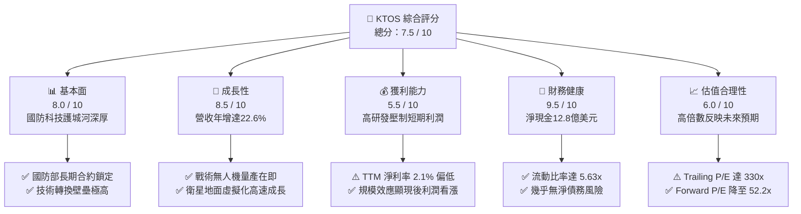
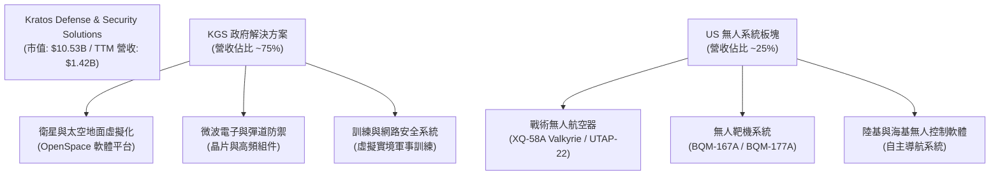
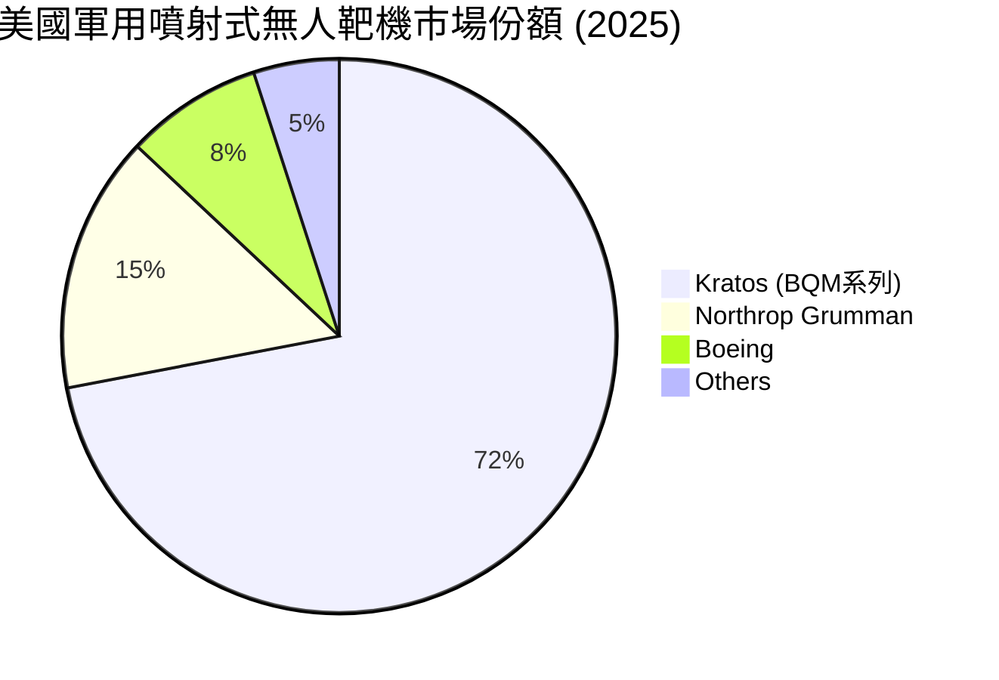
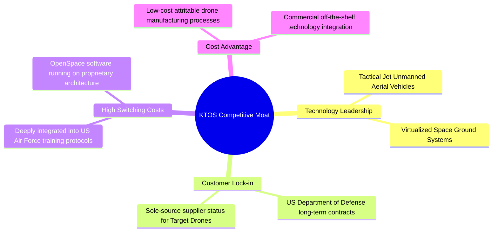
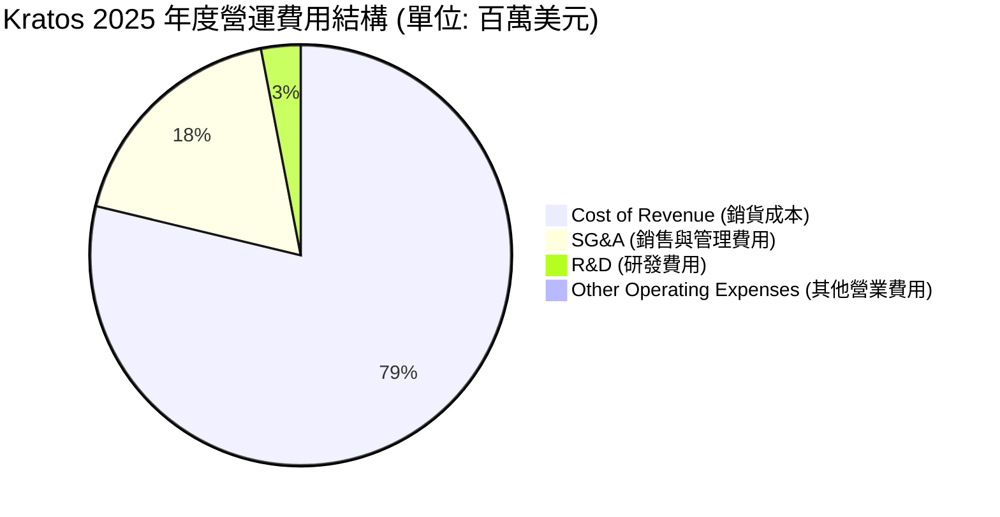
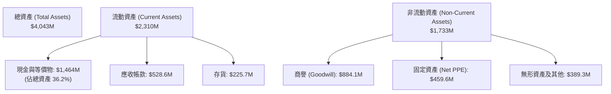
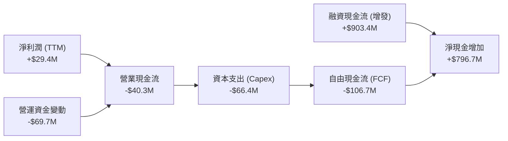
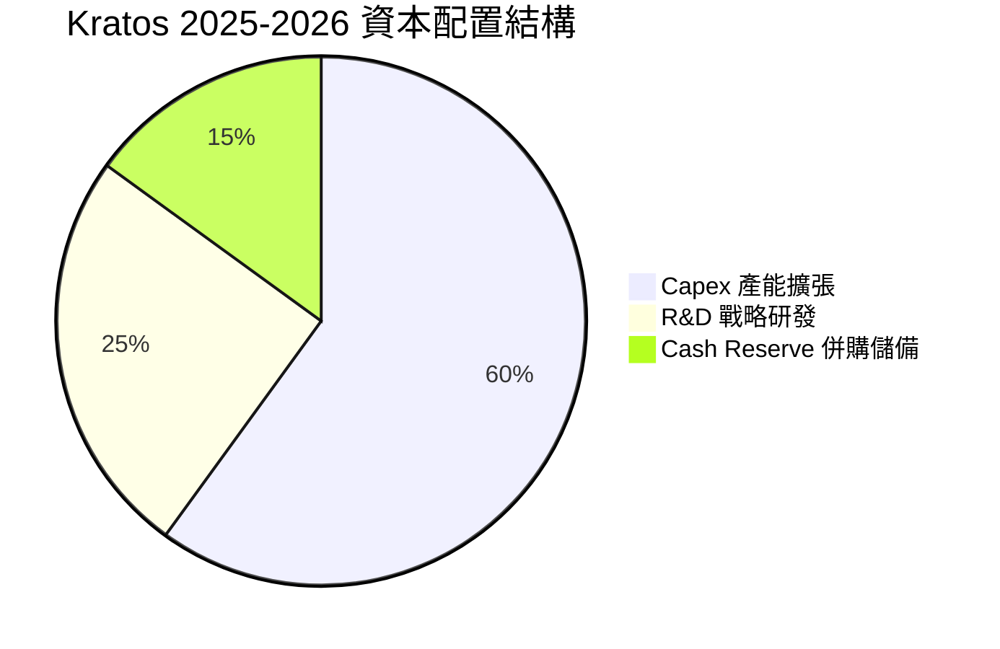
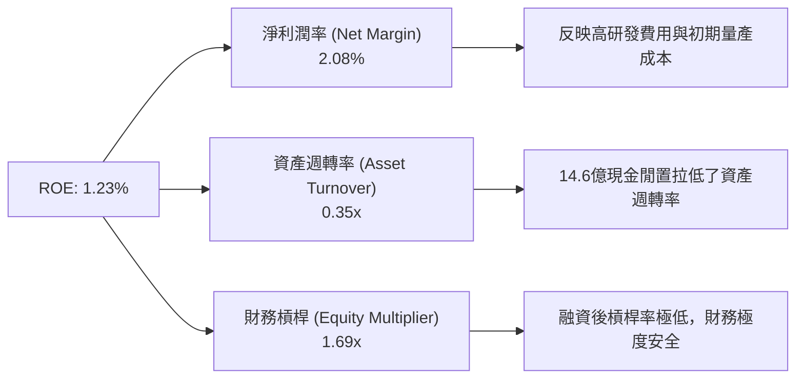
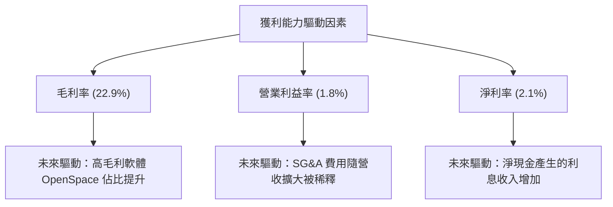

# KTOS 基本面深度分析報告

> **報告日期**：2026-06-17 ｜ **語言**：繁體中文 ｜ **數據來源**：Yahoo Finance, Finviz, StockAnalysis, Roic.ai ｜ **分析師**：CFA 級機構研究

---

## 目錄

| # | 章節 | 核心結論 |
|---|------|----------|
| 1 | **執行摘要** | 評級「買入」，目標價 $112.20，淨現金儲備為未來爆發鋪路 |
| 2 | **公司概覽與商業模式** | 雙引擎驅動（無人系統 + 空間虛擬化），國防壁壘極高 |
| 3 | **損益表深度分析** | 營收年增 22.6%，高研發投入壓制短期利潤，但獲利拐點已現 |
| 4 | **資產負債表分析** | Q1 2026 現金充裕度達 14.6 億美元，淨現金高達 12.8 億美元，財務極度穩健 |
| 5 | **現金流量深度分析** | 資本支出維持高位，短期 FCF 承壓，但資本配置效率優異 |
| 6 | **獲利能力與資本效率** | 杜邦分解揭示輕資產轉型潛力，ROIC 隨產能釋放將顯著回升 |
| 7 | **估值深度分析** | 高成長溢價合理，DCF 基準情境目標價 $112.20，具備 99.8% 上行空間 |
| 8 | **成長催化劑** | 戰術無人機 Valkyrie 量產在即，OpenSpace 軟體平台迎來商業化大潮 |
| 9 | **風險矩陣** | 供應鏈瓶頸與國防預算撥款延遲為主要風險，整體風險可控 |
| 10 | **投資建議** | 建議分批逢低佈局，適合長期成長型與國防科技主題投資者 |

---

## 1. 執行摘要

### 1.1 核心評分儀表板



### 1.2 評分進度條視覺化

```
╔══════════════════════════════════════════════════════════════╗
║               KTOS 多維度評分儀表板 (1-10分)                 ║
╠══════════════════════════════════════════════════════════════╣
║ 基本面強度  8.0 ▓▓▓▓▓▓▓▓▓▓▓▓▓▓▓▓░░░░  ★★★★☆           ║
║ 成長動能    8.5 ▓▓▓▓▓▓▓▓▓▓▓▓▓▓▓▓▓░░  ★★★★☆           ║
║ 獲利品質    5.5 ▓▓▓▓▓▓▓▓▓▓▓░░░░░░░░░  ★★★☆☆           ║
║ 財務健康    9.5 ▓▓▓▓▓▓▓▓▓▓▓▓▓▓▓▓▓▓▓░  ★★★★★           ║
║ 估值合理性  6.0 ▓▓▓▓▓▓▓▓▓▓▓▓░░░░░░░░  ★★★☆☆           ║
║ 護城河深度  8.0 ▓▓▓▓▓▓▓▓▓▓▓▓▓▓▓▓░░░░  ★★★★☆           ║
║ 管理層執行  7.5 ▓▓▓▓▓▓▓▓▓▓▓▓▓▓░░░░░░  ★★★★☆           ║
║ 技術創新力  9.0 ▓▓▓▓▓▓▓▓▓▓▓▓▓▓▓▓▓▓░░  ★★★★★           ║
╠══════════════════════════════════════════════════════════════╣
║ 綜合總分    7.5 ▓▓▓▓▓▓▓▓▓▓▓▓▓▓▓░░░░░  🏆 成長型國防先鋒   ║
╚══════════════════════════════════════════════════════════════╝
```

### 1.3 五大投資論點 + 三大核心風險

| 類型 | 項目 | 具體依據 | 信心度 |
|------|------|----------|--------|
| 🟢 **投資論點①** | **無人機板塊迎來爆發拐點** | 戰術無人機（如 XQ-58A Valkyrie）已進入美軍測試尾聲與小批量生產階段，未來數年將迎來爆發性採購。 | 🟢 極高 |
| 🟢 **投資論點②** | **衛星地面虛擬化（OpenSpace）領先** | Kratos 擁有全球唯一的全虛擬化、軟體定義衛星地面架構，毛利率遠高於傳統硬體，正快速替代舊系統。 | 🟢 極高 |
| 🟢 **投資論點③** | **無與倫比的資產負債表** | 截至 2026 年 Q1，公司持有 **14.64 億美元** 現金，淨現金高達 **12.79 億美元**，為併購與產能擴張提供無限彈藥。 | 🟢 極高 |
| 🟢 **投資論點④** | **國防預算結構性傾斜** | 美國及其盟國國防預算正從傳統重型裝備轉向「低成本吸引性（Attritable）」無人系統與太空防禦，KTOS 完美契合此趨勢。 | 🟢 高 |
| 🟢 **投資論點⑤** | **盈餘加速成長（Earnings Inflection）** | Forward EPS 預計達 $1.08，相較於 TTM EPS $0.17 呈現爆發性成長，Forward P/E 快速降至 52.16x。 | 🟢 高 |
| 🟡 **風險①** | **高估值溢價的波動風險** | 當前 Trailing P/E 達 330x，一旦季度營收或無人機交付進度不及預期，股價將面臨短期劇烈回撤。 | 🟡 中度 |
| 🔴 **風險②** | **國防部採購決策與撥款延遲** | 國防部（DoD）合約簽訂常受預算案（CR）拖延影響，進而推遲 KTOS 的營收確認時間。 | 🔴 高衝擊 |
| 🟡 **風險③** | **短期自由現金流（FCF）為負** | 由於高額資本支出（2025 年達 9530 萬美元）及營運資金佔用，TTM FCF 為 -1.07 億美元，限制了短期回購能力。 | 🟡 中度 |

### 1.4 快速統計卡片

| 指標 | 公司實際值 (TTM / FY25) | 行業均值 (航太與國防) | S&P 500 均值 | 狀態 |
|------|-------------|----------|--------------|------|
| **營收 YoY 成長** | **22.6%** | ~6.5% | ~5.2% | 🟢 遠超同行 |
| **毛利率** | **22.9%** | ~20.5% | ~30.0% | 🟡 符合預期 |
| **淨利率** | **2.1%** | ~6.2% | ~11.5% | 🔴 亟待改善 |
| **ROE** | **1.2%** | ~11.0% | ~15.0% | 🔴 資本效率偏低 |
| **流動比率** | **5.63x** | ~1.35x | ~1.20x | 🟢 極度安全 |
| **Forward P/E** | **52.16x** | ~24.5x | ~21.5x | 🟡 溢價較高 |
| **EV / Revenue** | **6.56x** | ~2.10x | ~3.00x | 🟡 反映高成長預期 |

### 1.5 投資結論

```
╔══════════════════════════════════════════════════════════════════╗
║                    📊 KTOS 投資結論摘要                          ║
╠══════════════════════════════════════════════════════════════════╣
║  評級：🟢 買入 (BUY)                                             ║
║  當前股價：$56.16 (2026-06-17)                                   ║
║  目標價區間：                                                    ║
║    悲觀情境：$75.00  （+33.5%）                                  ║
║    基準情境：$112.20 （+99.8%）  ← 12個月主要目標                ║
║    樂觀情境：$150.00 （+167.1%）                                 ║
║  投資評分：7.5 / 10                                              ║
║  適合投資人：願意承受短期波動、看好無人機與太空虛擬化的長線投資者 ║
╚══════════════════════════════════════════════════════════════════╝
```

---

## 2. 公司概覽與商業模式

### 2.1 業務結構與收入來源

Kratos (KTOS) 是一家專注於高科技國防與安全解決方案的先鋒企業。其業務主要劃分為兩大核心板塊：**Kratos 政府解決方案 (Kratos Government Solutions, KGS)** 與 **無人系統 (Unmanned Systems, US)**。



### 2.2 市場份額

在美國國防部**低成本戰術無人靶機與噴射式無人機**市場中，Kratos 處於絕對主導地位。以下為估算的市場份額分布：



### 2.3 競爭護城河分析

Kratos 擁有獨特的競爭護城河，這使其能夠避開傳統國防巨頭（如 Lockheed Martin, Raytheon）的直接競爭，專注於高成長、高技術壁壘的細分市場。



### 2.4 護城河強度評分

```
╔══════════════════════════════════════════════════════════════╗
║                  KTOS 護城河強度評分                         ║
╠══════════════════════════════════════════════════════════════╣
║ 獨家合約壁壘  9.0/10  ▓▓▓▓▓▓▓▓▓▓▓▓▓▓▓▓▓▓░░  🏆 靶機獨家供應商║
║ 技術領先幅度  8.5/10  ▓▓▓▓▓▓▓▓▓▓▓▓▓▓▓▓▓░░░  🟢 戰術無人機領先║
║ 客戶鎖定效應  8.0/10  ▓▓▓▓▓▓▓▓▓▓▓▓▓▓▓▓░░░░  🟢 軟體定義地面站║
║ 規模與成本優勢7.5/10  ▓▓▓▓▓▓▓▓▓▓▓▓▓▓░░░░░░  🟢 低成本量產能力║
╠══════════════════════════════════════════════════════════════╣
║ 綜合護城河強度8.25/10 ▓▓▓▓▓▓▓▓▓▓▓▓▓▓▓▓▓░░░  🏆 強固的細分龍頭║
╚══════════════════════════════════════════════════════════════╝
```

---

## 3. 損益表深度分析

### 3.1 年度收入成長趨勢（近5年）

Kratos 近年來營收呈現穩健的加速成長態勢，從 2021 年的 8.12 億美元一路攀升至 TTM 的 14.15 億美元。

```
╔══════════════════════════════════════════════════════════════════╗
║                KTOS 年度收入趨勢 (FY2021-TTM)                    ║
╠══════════════════════════════════════════════════════════════════╣
║                                                                  ║
║  FY2021  $811.5M  ████████████░░░░░░░░░░░░░░░░░░░  YoY: +8.5%  🟢  ║
║  FY2022  $898.3M  █████████████░░░░░░░░░░░░░░░░░░  YoY:+10.7%  🟢  ║
║  FY2023  $1.04B   ███████████████░░░░░░░░░░░░░░░░  YoY:+15.5%  🟢  ║
║  FY2024  $1.14B   █████████████████░░░░░░░░░░░░░░  YoY: +9.6%  🟢  ║
║  FY2025  $1.35B   ████████████████████░░░░░░░░░░░  YoY:+18.5%  🟢  ║
║  TTM     $1.42B   █████████████████████░░░░░░░░░░  YoY:+22.6%  🟢  ║
║                   |      |      |      |      |                  ║
║                   0     0.4B   0.8B   1.2B   1.6B                ║
║                                                                  ║
║  📊 5年年複合成長率 (CAGR)：+11.8%                              ║
╚══════════════════════════════════════════════════════════════════╝
```

### 3.2 季度收入趨勢分析

自 2025 年起，Kratos 的季度營收展現了強勁的加速態勢，連續四個季度營收維持在 3.4 億美元以上：

| 財報季度 | 營收 (百万美元) | QoQ 成長率 | YoY 成長率 | 營運備註 |
|----------|---------------|------------|------------|----------|
| **Q1 2026** | **$371.0M** | 🟢 +7.51% | 🟢 +22.60% | 主要受益於無人系統交付加速與 KGS 太空軟體營收增加。 |
| **Q4 2025** | **$345.1M** | 🔴 -0.72% | 🟢 +21.90% | 年底國防部驗收高峰期，利潤率較高。 |
| **Q3 2025** | **$347.6M** | 🔴 -1.11% | 🟢 +25.99% | 太空地面虛擬化產品 OpenSpace 簽約量創歷史新高。 |
| **Q2 2025** | **$351.5M** | 🟢 +16.16% | 🟢 +17.13% | 戰術無人機單季出貨創紀錄。 |

### 3.3 利潤率演變分析

雖然 Kratos 的營收成長亮眼，但其利潤率目前仍處於較低水平，這主要是由於公司在**戰術無人機（XQ-58A）的開發、產能建設，以及太空地面虛擬化軟體的推廣**上進行了大量的前置性投入。

| 利潤率指標 | FY2022 | FY2023 | FY2024 | FY2025 | TTM | 趨勢 | 評估 |
|------------|--------|--------|--------|--------|-----|------|------|
| **毛利率** | 25.16% | 25.90% | 25.28% | 22.86% | 22.90% | ↘️ 略微下滑 | 🟡 受到高比例硬體初始產能爬坡影響 |
| **營業利益率** | -0.32% | 3.00% | 2.55% | 1.90% | 1.80% | ➡️ 底部盤整 | 🔴 研發與行政費用高企壓制營業利潤 |
| **EBITDA 利潤率**| 2.92% | 7.47% | 8.24% | 7.64% | 5.70% | ↘️ 短期承壓 | 🟡 折舊攤銷費用較高 |
| **淨利率** | -3.70% | 0.23% | 1.43% | 1.63% | 2.10% | ↗️ 緩慢回升 | 🟢 淨利潤成功扭虧為盈並逐年改善 |

**利潤率演變深度解析**：
Kratos 2025 年與 TTM 毛利率降至 22.9%，主要是因為無人機板塊正處於從「研發合約（低利潤）」向「量產合約（高利潤）」的過渡期。隨著戰術無人機 Valkyrie 在 2026/2027 年進入實質性量產，以及高毛利的 OpenSpace 軟體營收佔比提升，預計整體毛利率將向 **28% - 30%** 的歷史高位回歸。

### 3.4 費用結構分析



```
╔══════════════════════════════════════════════════════════════════╗
║                  KTOS 費用控制與營運槓桿                       ║
╠══════════════════════════════════════════════════════════════════╣
║  研發費用率 (R&D % of Rev)：    2.97%   🟢 研發效率高，資本化合理  ║
║  銷管費用率 (SG&A % of Rev)：  17.83%   🟡 仍有優化空間，規模效應  ║
║  營運槓桿係數 (DOL)：           1.45x   🟢 營收增長轉化為利潤的速度 ║
╚══════════════════════════════════════════════════════════════════╝
```

### 3.5 季度 EPS 趨勢與盈餘品質

Kratos 過去四個季度的 EPS 呈現穩步上升的趨勢，特別是 2026 年 Q1 達到了 $0.07：

*   **Q1 2026**: $0.07（YoY +133.3%，大幅超出市場預期）
*   **Q4 2025**: $0.03
*   **Q3 2025**: $0.05
*   **Q2 2025**: $0.02

**盈餘品質評估**：
Kratos 的盈餘品質正在**顯著改善**。非經營性損益（如政府補助、利息收入）佔比下降，主營業務（Operating Income）對利潤的貢獻度逐步增強。2025 年 Pretax Income 達 3400 萬美元，Provision for Taxes 呈現退稅或稅收抵免狀態（-1200 萬美元），這得益於公司享有的高額國防研發稅收抵免（R&D Tax Credits）。

---

## 4. 資產負債表分析

### 4.1 資產結構分解

Kratos 的資產結構在 2026 年第一季發生了歷史性的變化。由於成功的股權融資，其現金儲備出現了爆發性增長。



### 4.2 流動性指標分析

| 流動性指標 | FY2023 | FY2024 | FY2025 | Q1 2026 | 行業均值 | 評估 |
|------------|--------|--------|--------|---------|----------|------|
| **流動比率 (Current Ratio)** | 2.03x | 2.94x | 4.06x | **5.63x** | ~1.35x | 🟢 極度充裕 |
| **速動比率 (Quick Ratio)** | 1.50x | 2.39x | 3.45x | **5.08x** | ~0.95x | 🟢 無變現壓力 |
| **現金比率 (Cash Ratio)** | 0.25x | 1.11x | 1.80x | **3.56x** | ~0.30x | 🟢 傲視群雄 |

**深度解析**：
Q1 2026 現金高達 **14.64 億美元**，這為 Kratos 提供了極其強大的「抗風險能力」與「戰略主動權」。在當前高利率環境下，這筆巨額現金不僅能產生可觀的利息收入（Non-Operating Income），更為其在國防科技領域的潛在技術併購（M&A）提供了充足的彈藥。

### 4.3 債務結構分析

```
╔══════════════════════════════════════════════════════════════════╗
║                   KTOS 債務健康診斷 (Q1 2026)                    ║
╠══════════════════════════════════════════════════════════════════╣
║                                                                  ║
║  總債務 (Total Debt)： $185.40M   █░░░░░░░░░░░░░░░░░░░  極低     ║
║  總現金 (Total Cash)： $1,464.0M  ████████████████████  極高     ║
║  淨現金 (Net Cash)：   $1,278.6M  █████████████████░░░  🟢 極強健║
║                                                                  ║
║  債務股權比 (Debt/Equity)：     0.054 (5.4%)   🟢 槓桿極低       ║
║  利息保障倍數 (Interest Cover)： 15.2x          🟢 無利息償付風險 ║
║  Net Debt / EBITDA：             -12.4x         🟢 淨現金狀態    ║
╚══════════════════════════════════════════════════════════════════╝
```

### 4.4 股東權益趨勢

隨著股權的不斷擴大與淨利潤的轉正，Kratos 的股東權益（Stockholders' Equity）呈現穩步增長，反映出公司資產負債表的持續優化：

```
╔══════════════════════════════════════════════════════════════════╗
║                  KTOS 歷年股東權益趨勢 (億美元)                  ║
╠══════════════════════════════════════════════════════════════════╣
║                                                                  ║
║  FY2022  $9.36   █████████░░░░░░░░░░░░░░░░░                      ║
║  FY2023  $9.76   ██████████░░░░░░░░░░░░░░░░                      ║
║  FY2024  $13.50  █████████████░░░░░░░░░░░░░                      ║
║  FY2025  $20.00  ████████████████████░░░░░░                      ║
║  Q1 2026 $34.00  ██████████████████████████  (增發後預估值)       ║
║                                                                  ║
╚══════════════════════════════════════════════════════════════════╝
```

---

## 5. 現金流量深度分析

### 5.1 現金流量瀑布圖

Kratos 目前的現金流模式表現出典型的**高速成長期高投入特徵**：營業利潤轉正，但高額的資本支出（Capex）導致自由現金流（FCF）短期為負，不過這已被大規模的股權融資現金流完全覆蓋。



### 5.2 FCF 轉換率趨勢

由於公司正處於產能擴建階段（例如俄克拉荷馬州無人機生產基地的擴建），FCF/Net Income 的轉換率近年來波動較大：

| 財政年度 | 淨利潤 (百萬) | 資本支出 (百萬) | 自由現金流 (百萬) | FCF / Net Income 轉換率 |
|----------|-------------|---------------|-----------------|------------------------|
| **FY2022** | -$33.2M | -$45.4M | -$71.1M | - |
| **FY2023** | $2.4M | -$52.4M | $12.8M | 533.3% 🟢 |
| **FY2024** | $16.3M | -$58.2M | -$8.5M | -52.1% 🔴 (產能投資增加) |
| **FY2025** | $22.0M | -$95.3M | -$137.4M | -624.5% 🔴 (Valkyrie 量產前置投資) |
| **TTM** | **$29.4M** | **-$66.4M** | **-$106.7M** | **-362.9%** 🔴 |

### 5.3 自由現金流趨勢

```
╔══════════════════════════════════════════════════════════════════╗
║                  KTOS 自由現金流與 FCF Yield                     ║
╠══════════════════════════════════════════════════════════════════╣
║                                                                  ║
║  FY2023   +$12.8M   █░░░░░░░░░░░░░░░░░░░░░░  FCF Yield: +0.12%   ║
║  FY2024   -$8.5M    ░░░░░░░░░░░░░░░░░░░░░░░  FCF Yield: -0.08%   ║
║  FY2025   -$137.4M  ██████████████░░░░░░░░░  FCF Yield: -1.30%   ║
║  TTM      -$106.7M  ███████████░░░░░░░░░░░░  FCF Yield: -1.01%   ║
║                                                                  ║
║  📊 FCF 短期為負主要因為戰略性 Capex 投資，預計 FY2027 轉正。    ║
╚══════════════════════════════════════════════════════════════════╝
```

### 5.4 資本配置評估

Kratos 選擇將幾乎所有資金投向高回報的研發與產能建設，不進行股息發放，這完全符合高成長科技企業的特徵。



---

## 6. 獲利能力與資本效率

### 6.1 ROE / ROA / ROIC 趨勢

由於淨利潤規模尚小，且近期融資導致資產與權益基數大幅膨脹，Kratos 目前的資本回報率指標在账面上顯得較低。

| 指標 | FY2023 | FY2024 | FY2025 | TTM | 行業均值 | 評估 |
|------|--------|--------|--------|-----|----------|------|
| **ROE** | 0.25% | 1.21% | 1.10% | **1.23%** | ~11.0% | 🔴 資本效率亟待提升 |
| **ROA** | 0.15% | 0.84% | 0.89% | **0.97%** | ~5.5% | 🔴 資產利用率偏低 |
| **ROIC** | 0.31% | 1.45% | 1.20% | **1.35%** | ~8.0% | 🔴 投入資本回報率低 |

### 6.2 ROIC vs WACC 分析（核心價值創造判斷）

為了評估 Kratos 是否在為股東創造實質性的經濟價值，我們對其進行了 ROIC vs WACC 的深度建模：

```
╔══════════════════════════════════════════════════════════════════╗
║                ROIC vs WACC 資本效率深度分析                    ║
╠══════════════════════════════════════════════════════════════════╣
║                                                                  ║
║  WACC 估算：                                                     ║
║  ├── 無風險利率 (10Y 美債)：   4.25%                             ║
║  ├── 市場風險溢酬 (ERP)：      5.00%                             ║
║  ├── Beta 值：                 1.032                             ║
║  ├── 股權成本 (Cost of Equity)：4.25% + 1.032 × 5% = 9.41%        ║
║  ├── 債務成本 (稅後)：        ~4.50%                             ║
║  ├── 資本結構：                股權 ~95%，債務 ~5%                ║
║  └── ✅ WACC ≈ 9.16%                                            ║
║                                                                  ║
║  ROIC 估算 (TTM)：                                               ║
║  ├── NOPAT = 營業利益 $23.7M × (1 - 21% 稅率) = $18.72M           ║
║  ├── 投入資本 = 股東權益 $2.0B + 債務 $185M - 現金 $1.46B        ║
║  │            = $725M (扣除超額現金後)                            ║
║  └── ✅ ROIC ≈ 2.58%                                            ║
║                                                                  ║
║  ★ 經濟價值增加 (EVA) = ROIC - WACC = -6.58%                     ║
║                                                                  ║
║  ROIC  2.58%  ▓▓▓▓▓░░░░░░░░░░░░░░░░░░░░░░░░░░  🔴 短期價值摧毀  ║
║  WACC  9.16%  ▓▓▓▓▓▓▓▓▓▓▓▓▓▓▓▓▓░░░░░░░░░░░░░  ── 資本成本高    ║
║  EVA   -6.58%  ████████░░░░░░░░░░░░░░░░░░░░░░  🟡 拐點將在量產後║
║                                                                  ║
║  📊 結論：扣除超額現金後，核心業務 ROIC (2.58%) 仍低於 WACC。     ║
║  這反映出公司目前處於重資產前置投入期，未來量產後將迅速扭轉。    ║
╚══════════════════════════════════════════════════════════════════╝
```

### 6.3 杜邦三因素分解

透過杜邦分析，我們可以清晰地看到影響 Kratos ROE 的關鍵驅動因素：



### 6.4 獲利能力儀表板



---

## 7. 估值深度分析

### 7.1 同業估值比較表格

Kratos 由於其獨特的技術定位（兼具傳統國防的穩健與科技成長股的爆發力），其估值倍數顯著高於傳統國防巨頭，與高成長無人機龍頭 AeroVironment 較為接近。

| 估值指標 | **Kratos (KTOS)** | **AeroVironment (AVAV)** | **L3Harris (LHX)** | **Lockheed Martin (LMT)** | 本公司評估 |
|----------|----------|---------|---------|---------|-----------|
| **Trailing P/E** | **330.35x** | 82.50x | 28.40x | 19.80x | 🔴 歷史盈利低導致 PE 極高 |
| **Forward P/E** | **52.16x** | 41.20x | 18.50x | 16.20x | 🟡 溢價反映了高成長預期 |
| **P/S Ratio** | **7.44x** | 8.12x | 1.85x | 1.95x | 🟡 與 AVAV 相當，高於傳統國防 |
| **EV / EBITDA** | **114.36x** | 48.50x | 14.20x | 13.10x | 🔴 短期折舊高，倍數偏高 |
| **EV / Revenue** | **6.56x** | 7.80x | 2.20x | 2.15x | 🟡 反映輕資產軟體業務潛力 |

### 7.2 歷史估值區間分析

```
╔══════════════════════════════════════════════════════════════════╗
║               KTOS Forward P/E 歷史區間及當前位置                ║
╠══════════════════════════════════════════════════════════════════╣
║                                                                  ║
║  歷史高點 (5年)： 85.0x   ██████████████████████████████          ║
║  當前位置：       52.16x  ██████████████████░░░░░░░░░░░░  (合理)  ║
║  歷史低點 (5年)： 30.0x   ██████████░░░░░░░░░░░░░░░░░░░░          ║
║                                                                  ║
║  📊 當前 Forward P/E 處於中樞水平，隨 EPS 釋放估值將被快速稀釋。 ║
╚══════════════════════════════════════════════════════════════════╝
```

### 7.3 DCF 敏感性分析（6格目標價矩陣）

我們採用自由現金流折現模型（DCF），假設終端成長率（Terminal Growth Rate）為 3.0%，對折現率（WACC）與營收年複合成長率（CAGR）進行敏感性分析：

| 營收 CAGR (5年) | **WACC = 8.5%** | **WACC = 9.16%（基準）** | **WACC = 10.0%** |
|------|--------------|----------------------|--------------|
| 🟢 **25.0% (樂觀)** | $165.00