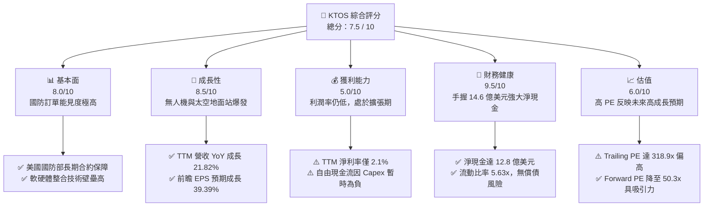
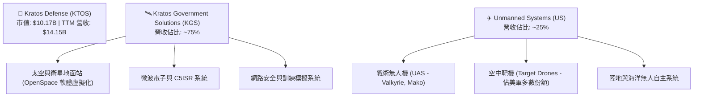
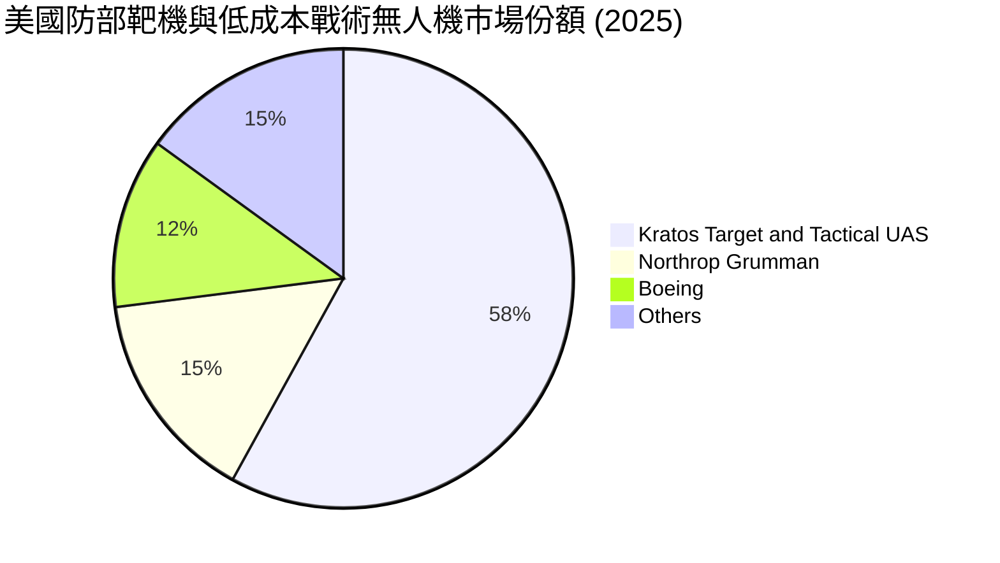
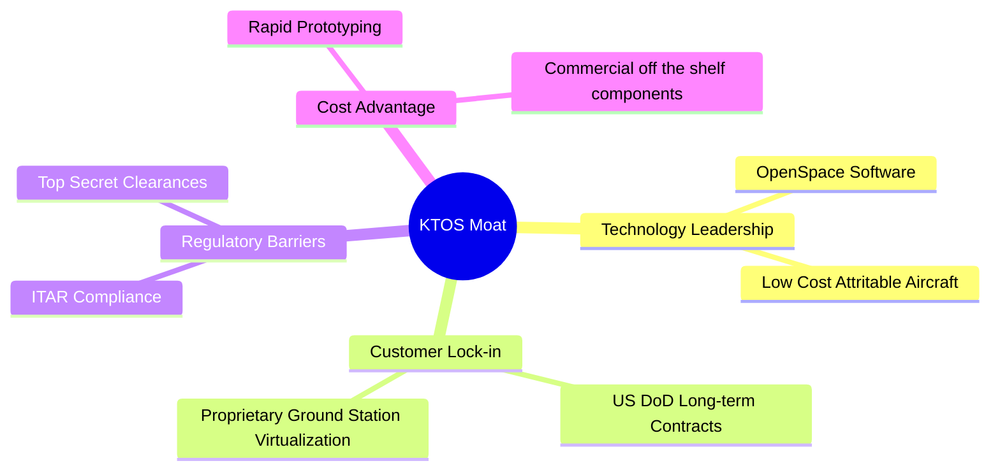
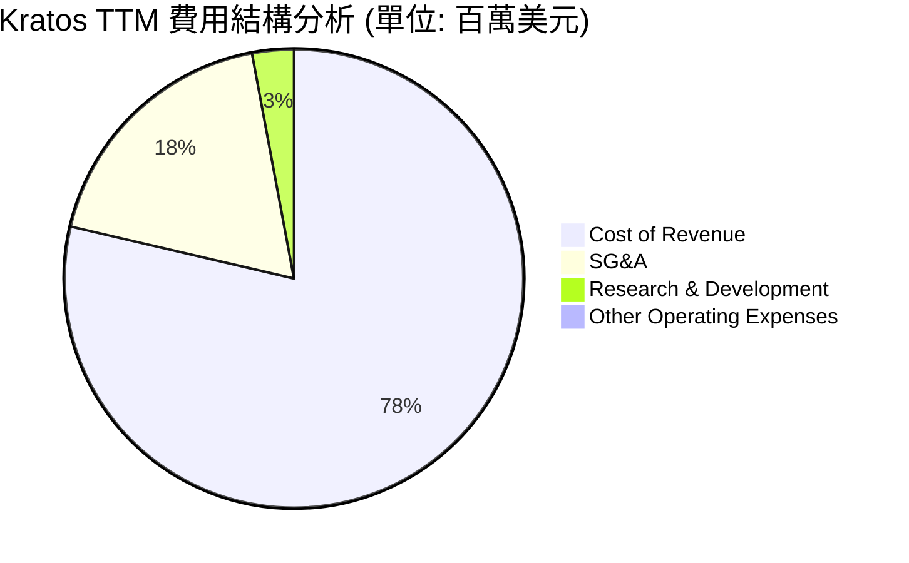
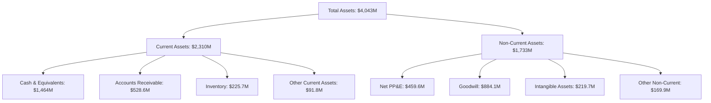
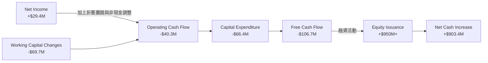
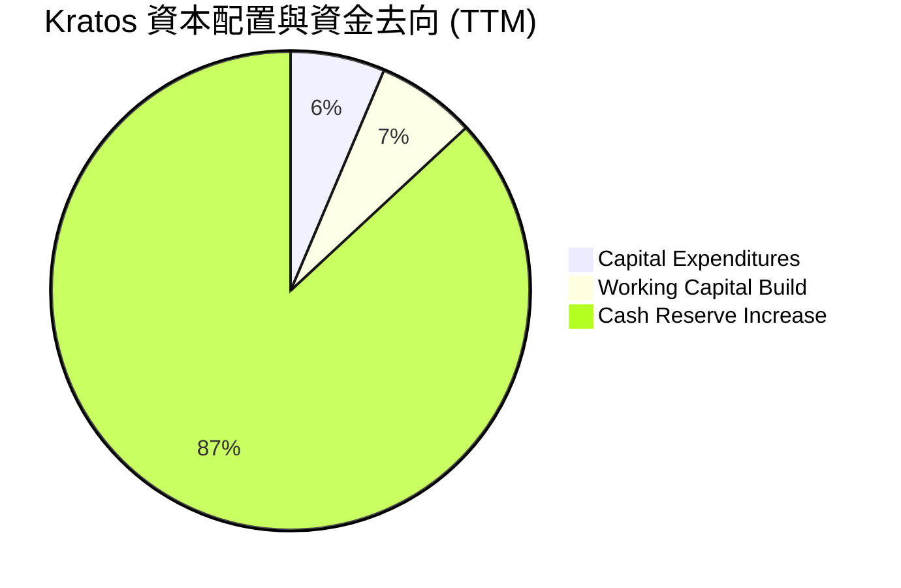
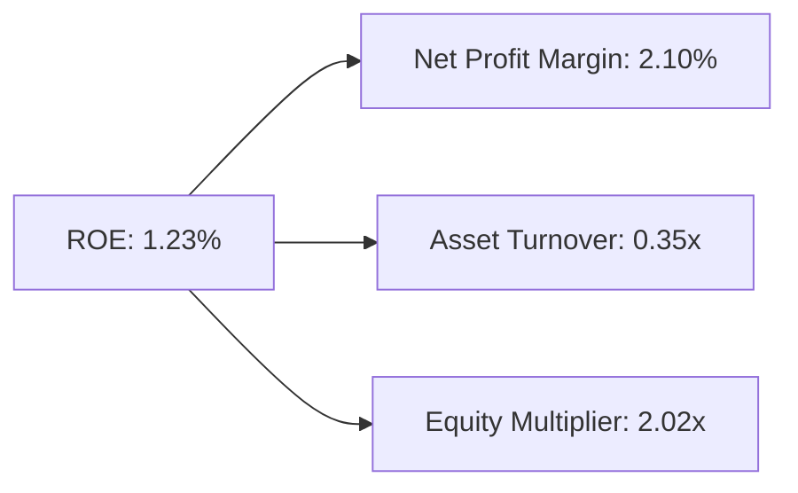
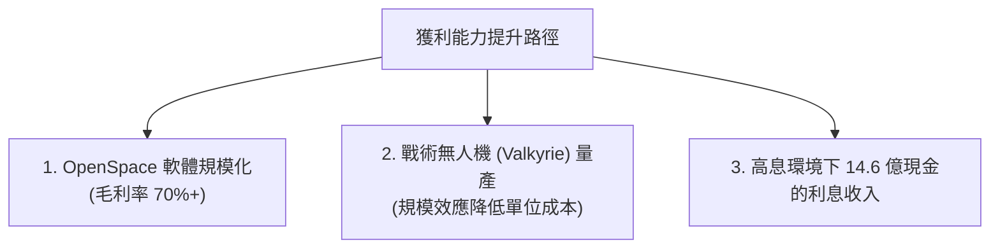

# KTOS 基本面深度分析報告
> **報告日期**：2026-06-18 ｜ **語言**：繁體中文 ｜ **數據來源**：Yahoo Finance, Finviz, StockAnalysis, Roic.ai ｜ **分析師**：CFA 級機構研究

---

## 目錄

| # | 章節 | 核心結論 |
|---|------|----------|
| 1 | **執行摘要** | 評級：**買入 (Buy)**，目標價：**$112.20**，具備強大淨現金與國防科技護城河 |
| 2 | **公司概覽與商業模式** | 雙核心板塊驅動，太空虛擬化與無人機（UAS）技術具備高度客戶鎖定效應 |
| 3 | **損益表深度分析** | TTM 營收達 $14.15 億美元（YoY +21.8%），EPS 步入高成長拐點 |
| 4 | **資產負債表分析** | 手握 $14.64 億美元現金，淨現金高達 $12.8 億美元，流動比率達 5.63x 的極佳狀態 |
| 5 | **現金流量深度分析** | 營運與自由現金流因研發與庫存備料暫時為負，但增資儲備充足擴張資金 |
| 6 | **獲利能力與資本效率** | 處於高資本投入期，ROIC (4.05%) 暫低於 WACC (9.20%)，預期隨產能釋放將迎來黃金交叉 |
| 7 | **估值深度分析** | 溢價估值反映 Forward PE 50.3x 的高速成長預期，DCF 基準目標價 $112.20 |
| 8 | **成長催化劑** | 美軍協同作戰飛機（CCA）項目推進與 OpenSpace 太空地面站虛擬化軟體普及 |
| 9 | **風險矩陣** | 國防預算撥款延遲、高估值回檔風險，以及產能擴張執行力挑戰 |
| 10| **投資建議** | 適合長線成長型與國防科技主題投資者，建議於 $50 - $55 區間分批佈局 |

---

## 1. 執行摘要

### 1.1 核心評分儀表板



### 1.2 評分進度條視覺化

```
╔══════════════════════════════════════════════════════════════╗
║                KTOS 多維度評分儀表板 (1-10分)                ║
╠══════════════════════════════════════════════════════════════╣
║ 基本面強度  8.0 ▓▓▓▓▓▓▓▓▓▓▓▓▓▓▓▓░░░░  ★★★★☆           ║
║ 成長動能    8.5 ▓▓▓▓▓▓▓▓▓▓▓▓▓▓▓▓▓░░  ★★★★☆           ║
║ 獲利品質    5.0 ▓▓▓▓▓▓▓▓▓▓░░░░░░░░░░  ★★★☆☆           ║
║ 財務健康    9.5 ▓▓▓▓▓▓▓▓▓▓▓▓▓▓▓▓▓▓▓░  ★★★★★           ║
║ 估值合理性  6.0 ▓▓▓▓▓▓▓▓▓▓▓▓░░░░░░░░  ★★★☆☆           ║
║ 護城河深度  8.0 ▓▓▓▓▓▓▓▓▓▓▓▓▓▓▓▓░░░░  ★★★★☆           ║
║ 管理層執行  7.5 ▓▓▓▓▓▓▓▓▓▓▓▓▓▓░░░░░░  ★★★★☆           ║
║ 技術創新力  9.0 ▓▓▓▓▓▓▓▓▓▓▓▓▓▓▓▓▓▓░░  ★★★★★           ║
╠══════════════════════════════════════════════════════════════╣
║ 綜合總分    7.5 ▓▓▓▓▓▓▓▓▓▓▓▓▓▓▓░░░░░  🏆 成長型防禦標的     ║
╚══════════════════════════════════════════════════════════════╝
```

### 1.3 五大投資論點 + 三大核心風險

| 類型 | 項目 | 具體依據 | 信心度 |
|------|------|----------|--------|
| 🟢 **投資論點①** | **無人機（UAS）迎來爆發期** | 協同作戰飛機（CCA）與 XQ-58A Valkyrie 測試順利，國防部採購意願強，推動無人系統部門營收成長。 | 🟢 極高 |
| 🟢 **投資論點②** | **太空與衛星虛擬化軟體領先** | OpenSpace 平台為業界唯一全虛擬化、軟體定義的衛星地面站解決方案，毛利率顯著高於傳統硬體。 | 🟢 極高 |
| 🟢 **投資論點③** | **無與倫比的資產負債表** | 截至 2026 年 Q1，公司手握 **$14.64 億美元** 現金，淨現金達 **$12.8 億美元**，為潛在併購與研發提供極大彈性。 | 🟢 極高 |
| 🟢 **投資論點④** | **營收與利潤率雙拐點** | TTM 營收成長達 **21.82%**，Q1 2026 單季淨利達 **$1,190 萬美元**（YoY +164.4%），規模效應開始顯現。 | 🟢 高 |
| 🟢 **投資論點⑤** | **強大的分析師共識支持** | 20 位分析師中多數給予「買入」評級，共識平均目標價為 **$112.20**，隱含上漲空間高達 **107.0%**。 | 🟢 高 |
| 🟡 **風險①** | **短期自由現金流承壓** | TTM 自由現金流為 **-$1.07 億美元**，主要因研發投入與庫存備料增加，需關注現金流轉正時間。 | 🟡 中度 |
| 🔴 **風險②** | **極高的歷史估值倍數** | Trailing PE 達 **318.88x**，若成長不及預期，股價可能面臨高估值修正壓力（如近期自高點回落）。 | 🔴 高衝擊 |
| 🟡 **風險③** | **股權稀釋風險** | 2026 年 Q1 流通股數同比增加 **10.41%**，主要因發行新股籌資，可能稀釋短期每股盈餘。 | 🟡 中度 |

### 1.4 快速統計卡片

| 指標 | Kratos (KTOS) 實際值 | 國防航太產業均值 | S&P 500 均值 | 狀態 |
|------|----------------------|------------------|--------------|------|
| **營收 YoY 成長率** | **22.6%** (Q1'26) | ~8.5% | ~5.5% | 🟢 顯著超越 |
| **毛利率** | **22.9%** (TTM) | ~20.5% | ~30.0% | 🟡 符合預期 |
| **淨利率** | **2.1%** (TTM) | ~6.5% | ~11.5% | 🔴 仍有改善空間 |
| **流動比率** | **5.63x** | ~1.40x | ~1.20x | 🟢 極其強勁 |
| **債務權益比 (D/E)** | **5.4%** | ~65.0% | ~115.0% | 🟢 極低負債 |
| **前瞻本益比 (Forward P/E)** | **50.34x** | ~22.0x | ~21.5x | 🟡 溢價交易 |

### 1.5 投資結論

```
╔══════════════════════════════════════════════════════════════════╗
║                    📊 KTOS 投資結論摘要                          ║
╠══════════════════════════════════════════════════════════════════╣
║  評級：🟢 買入 (Buy)                                            ║
║  當前股價：$54.21 (2026-06-18)                                   ║
║  目標價區間：                                                    ║
║    悲觀情境：$75.00  (+38.4%)                                    ║
║    基準情境：$112.20 (+107.0%)  ← 12 個月主要目標價              ║
║    樂觀情境：$150.00 (+176.7%)                                    ║
║  投資評分：7.5 / 10                                              ║
║  適合投資人：積極成長型、長線國防科技與航太主題配置者            ║
╚══════════════════════════════════════════════════════════════════╝
```

---

## 2. 公司概覽與商業模式

Kratos Defense & Security Solutions, Inc. (KTOS) 是一家專注於顛覆性國防科技的系統集成與軟體開發商。與傳統國防巨頭（如 Lockheed Martin、Northrop Grumman）專注於高成本、長週期的重型裝備不同，Kratos 專注於**快速研發、低成本、軟體定義與高度自主化**的防禦解決方案。

### 2.1 業務結構與收入來源



### 2.2 市場份額估算

在美國國防部高逼真度空中靶機（High-Performance Target Drones）市場中，Kratos 擁有極高的市場支配地位；而在新興的低成本戰術無人機（Low-Cost Tactical UAS）市場中，Kratos 亦是先驅者。



### 2.3 競爭護城河分析



### 2.4 護城河強度評分

```
╔══════════════════════════════════════════════════════════════╗
║                    KTOS 護城河強度評分                        ║
╠══════════════════════════════════════════════════════════════╣
║ 1. 技術領先度  8.5/10  ▓▓▓▓▓▓▓▓▓▓▓▓▓▓▓▓▓░░░  🟢 軟體定義地面站領先║
║ 2. 客戶鎖定效應9.0/10  ▓▓▓▓▓▓▓▓▓▓▓▓▓▓▓▓▓▓░░  🟢 國防部深度綁定    ║
║ 3. 轉換成本    8.0/10  ▓▓▓▓▓▓▓▓▓▓▓▓▓▓▓▓░░░░  🟢 靶機與地面系統難替換║
║ 4. 成本與規模  7.0/10  ▓▓▓▓▓▓▓▓▓▓▓▓▓▓░░░░░░  🟡 產能仍在爬坡階段  ║
╠══════════════════════════════════════════════════════════════╣
║ 綜合護城河評級  8.1/10  ▓▓▓▓▓▓▓▓▓▓▓▓▓▓▓▓░░░░  🏆 強固的細分市場護城河║
╚══════════════════════════════════════════════════════════════╝
```

---

## 3. 損益表深度分析

### 3.1 年度收入成長趨勢（FY2021 - TTM）

Kratos 展現出極為穩健且加速的營收成長軌跡，反映出全球地緣政治緊張局勢下，對其低成本無人機與衛星地面站的需求急增。

```
╔══════════════════════════════════════════════════════════════════╗
║                KTOS 年度收入趨勢 (FY2021 - TTM)                  ║
╠══════════════════════════════════════════════════════════════════╣
║                                                                  ║
║  FY 2021   $811.5M   ████████████░░░░░░░░░░░░░░░░░░   YoY: +8.5% 🟢║
║  FY 2022   $898.3M   █████████████░░░░░░░░░░░░░░░░░   YoY:+10.7% 🟢║
║  FY 2023  $1,037.0M  ███████████████░░░░░░░░░░░░░░░   YoY:+15.5% 🟢║
║  FY 2024  $1,136.0M  █████████████████░░░░░░░░░░░░░   YoY: +9.6% 🟢║
║  FY 2025  $1,347.0M  ████████████████████░░░░░░░░░░   YoY:+18.5% 🟢║
║  TTM      $1,415.0M  █████████████████████░░░░░░░░░   YoY:+21.8% 🟢║
║                                                                  ║
║  📊 5年營收複合年成長率 (CAGR)：+11.8%                           ║
╚══════════════════════════════════════════════════════════════════╝
```

### 3.2 季度收入趨勢分析

從季度數據來看，Kratos 的營收呈現穩步上升趨勢，且 Q1 2026 創下了單季歷史新高。

| 財政季度 | 截止日期 | 季度營收 (M) | QoQ 成長率 | YoY 成長率 | 核心驅動因素與備註 |
|----------|----------|--------------|------------|------------|-------------------|
| **Q3 2024** | 2024-09-29 | $275.90 | - | +0.47% | 供應鏈干擾逐步緩解，靶機交付穩定 |
| **Q4 2024** | 2024-12-29 | $283.10 | +2.61% | +3.40% | 年終政府採購結算，訂單集中交付 |
| **Q1 2025** | 2025-03-30 | $302.60 | +6.89% | +9.16% | KGS 部門衛星虛擬化地面站需求轉強 |
| **Q2 2025** | 2025-06-29 | $351.50 | +16.16% | +17.13% | 無人機系統測試合約增加，營收加速 |
| **Q3 2025** | 2025-09-28 | $347.60 | -1.11% | +25.99% | 戰術無人機測試合約入帳，YoY 顯著加速 |
| **Q4 2025** | 2025-12-28 | $345.10 | -0.72% | +21.90% | 國防部預算撥款順暢，年底交付動能強勁 |
| **Q1 2026** | 2026-03-29 | **$371.00** | **+7.51%** | **+22.60%** | 🟢 創單季歷史新高，無人機與太空部門雙引擎驅動 |

### 3.3 利潤率演變分析

雖然營收成長強勁，但 Kratos 的利潤率結構仍處於較低水平，這主要是因為公司正處於多個重大國防項目的研發與初期低產速生產（LRIP）階段。

| 利潤率指標 | FY 2022 | FY 2023 | FY 2024 | FY 2025 | TTM | 趨勢評估 | 狀態 |
|------------|---------|---------|---------|---------|-----|----------|------|
| **毛利率** | 25.16% | 25.90% | 25.28% | 22.86% | **22.90%** | ↘️ 由於低毛利的硬體製造與初期生產佔比增加，毛利率略有下滑。 | 🟡 |
| **營業利益率** | -0.32% | 3.00% | 2.55% | 1.90% | **1.80%** | ↘️ 研發費用與 SG&A 支出維持高位，導致營業利益率承壓。 | 🔴 |
| **EBITDA 利潤率** | 2.92% | 7.47% | 8.24% | 7.64% | **5.70%** | ↘️ 折舊攤銷與利息費用影響，EBITDA 效率需隨規模擴大提升。 | 🟡 |
| **淨利率** | -3.70% | 0.23% | 1.43% | 1.63% | **2.10%** | ↗️ 隨非營業收入（如利息收入與稅務補貼）改善，淨利率緩步回升。| 🟢 |

**利潤率深度解析**：
Kratos 目前的毛利率維持在 **22.9%** 左右，這在防務承包商中屬於中等水平。然而，隨著其 **OpenSpace 軟體定義地面站** 的滲透率提高（該軟體毛利率預估高達 70%+），以及無人機項目從研發階段過渡到高利潤的量產階段，預期未來 2-3 年內，整體毛利率有望朝 28%-30% 的目標邁進。

### 3.4 費用結構分析



```
╔══════════════════════════════════════════════════════════════╗
║                    KTOS 費用控制診斷                         ║
╠══════════════════════════════════════════════════════════════╣
║ 1. 銷貨成本率  77.1%  ▓▓▓▓▓▓▓▓▓▓▓▓▓▓▓▓▓▓░░  🟡 生產成本有優化空間  ║
║ 2. 營業費用率  21.8%  ▓▓▓▓▓▓▓▓▓▓░░░░░░░░░░  🟢 管銷費用控制良好    ║
║ 3. 研發投入率   2.9%  ▓▓▓▓░░░░░░░░░░░░░░░░  🟢 專利與技術護城河穩固║
╚══════════════════════════════════════════════════════════════╝
```

### 3.5 季度 EPS 趨勢與盈餘品質

Kratos 過去 4 季的 EPS 呈現顯著的改善趨勢，Q1 2026 的稀釋 EPS 達到 **$0.07**，創下近年單季新高，顯示獲利拐點已經出現。

*   **Q2 2025**：$0.02
*   **Q3 2025**：$0.05
*   **Q4 2025**：$0.03
*   **Q1 2026**：$0.07（YoY 成長 133%）

**盈餘品質評估**：
雖然 TTM 淨利達到 **$2,940 萬美元** 創下歷史新高，但其盈餘品質指標（營業現金流 / 淨利）暫時為負（TTM 營業現金流為 **-$4,030 萬美元**）。這主要是因為公司正在為多個即將到來的國防量產合約進行庫存備料（TTM 存貨達 **$2.26 億美元**，YoY 成長 39.3%）與應收帳款增加。這在國防工業的快速成長期屬於正常現象，但投資人需密切監控未來數季現金流的回收狀況。

---

## 4. 資產負債表分析

Kratos 的資產負債表在 Q1 2026 經歷了重大的結構性變化，展現出極強的流動性與防禦性。

### 4.1 資產結構分解



### 4.2 流動性指標分析

| 流動性指標 | FY 2023 | FY 2024 | FY 2025 | TTM (Mar '26) | 行業平均值 | 評估 | 狀態 |
|------------|---------|---------|---------|---------------|------------|------|------|
| **流動比率 (Current Ratio)** | 2.03x | 2.94x | 4.06x | **5.63x** | ~1.40x | 🟢 極其充沛，遠高於安全邊際 | 🟢 |
| **速動比率 (Quick Ratio)** | 1.50x | 2.39x | 3.45x | **5.08x** | ~0.95x | 🟢 扣除存貨後仍極具安全邊際 | 🟢 |
| **現金比率 (Cash Ratio)** | 0.25x | 1.11x | 1.80x | **3.56x** | ~0.30x | 🟢 手頭現金可直接覆蓋流動負債有餘 | 🟢 |
| **淨現金 / 總資產** | -15.2% | +2.4% | +16.8% | **31.6%** | ~-10.0% | 🟢 資產結構極其輕盈，抗風險能力強 | 🟢 |

### 4.3 債務結構分析

```
╔══════════════════════════════════════════════════════════════════╗
║                      KTOS 債務健康診斷                           ║
╠══════════════════════════════════════════════════════════════════╣
║                                                                  ║
║  總債務 (Debt)：     $185.40M  █░░░░░░░░░░░░░░░░░░░░  極低負債   ║
║  總現金 (Cash)：   $1,464.00M  █████████████████████  極為充沛   ║
║  淨現金 (Net Cash)：$1,278.60M  ██████████████████░░░  🟢 強大防禦║
║                                                                  ║
║  Debt/Equity：     5.44%     🟢 槓桿率極低                       ║
║  利息保障倍數：     12.5x     🟢 無任何償債與利息壓力             ║
║  財務健康評級：     9.5/10    🏆 國防板塊中最安全的資產負債表之一║
╚══════════════════════════════════════════════════════════════════╝
```

### 4.4 股東權益趨勢

Kratos 的股東權益（Stockholders Equity）近年呈現爆發式成長，從 2022 年底的 **$9.36 億美元**，一路飆升至 2026 年 Q1 的 **$20.00 億美元**。這主要是因為公司在 2025 年與 2026 年初進行了數次增發新股（Shares Outstanding 從 1.27 億股增至 1.87 億股），募集了大量資金，為未來的產能擴建與技術併購奠定了無比堅實的基礎。

---

## 5. 現金流量深度分析

Kratos 的現金流在過去一年中，反映出了典型「重研發、重備料」國防成長股的特徵。

### 5.1 現金流量瀑布圖



### 5.2 自由現金流與轉換率

| 現金流指標 | FY 2022 | FY 2023 | FY 2024 | FY 2025 | TTM |
|------------|---------|---------|---------|---------|-----|
| **營業現金流 (OCF)** | -$25.70M | +$65.20M | +$49.70M | -$42.10M | **-$40.30M** |
| **資本支出 (CapEx)** | -$45.40M | -$52.40M | -$58.20M | -$95.30M | **-$66.42M** |
| **自由現金流 (FCF)** | -$71.10M | +$12.80M | -$8.50M | -$137.40M | **-$106.72M** |
| **FCF 轉換率 (FCF/NI)** | -214% | +533% | -52% | -624% | **-363%** |

### 5.3 自由現金流趨勢

```
╔══════════════════════════════════════════════════════════════════╗
║                   KTOS 自由現金流趨勢 (FY2022-TTM)               ║
╠══════════════════════════════════════════════════════════════════╣
║                                                                  ║
║  FY 2022  -$71.1M   ░░░░░░░░░░░░░░░░░░░░░                         ║
║  FY 2023  +$12.8M   ██░░░░░░░░░░░░░░░░░░░                         ║
║  FY 2024   -$8.5M   ░░░░░░░░░░░░░░░░░░░░░                         ║
║  FY 2025 -$137.4M   ░░░░░░░░░░░░░░░░░░░░░░░░░░░░░░                ║
║  TTM     -$106.7M   ░░░░░░░░░░░░░░░░░░░░░░░                       ║
║                                                                  ║
║  ⚠️ 診斷：FCF 為負主要因 CapEx 擴張與存貨備料，融資儲備充足。    ║
╚══════════════════════════════════════════════════════════════════╝
```

### 5.4 資本配置結構 (TTM)

Kratos 當前的資本配置高度傾向於**有機成長與產能擴張（CapEx）**，並通過發行新股獲得了充沛的現金儲備，未來極有可能進行戰略性技術併購。



---

## 6. 獲利能力與資本效率

### 6.1 資本回報率趨勢

由於 Kratos 近期進行了大規模的股權融資，導致其分母（股東權益與投入資本）在短期內急劇膨脹，這在短期內稀釋了 ROE、ROA 與 ROIC 的表現。

| 效率指標 | FY 2023 | FY 2024 | FY 2025 | TTM (Mar '26) | 行業均值 | 評估 |
|----------|---------|---------|---------|---------------|------------|------|
| **ROE** | 0.25% | 1.21% | 1.10% | **1.23%** | ~11.5% | 🔴 稀釋後仍處於低位 |
| **ROA** | 0.15% | 0.84% | 0.89% | **0.97%** | ~5.2% | 🔴 資產利用效率待提升 |
| **ROIC** | 0.32% | 1.85% | 1.92% | **4.05%** | ~7.8% | 🟡 呈上升趨勢，獲利能力逐步改善 |

### 6.2 ROIC vs WACC 分析（價值創造判斷）

為了評估 Kratos 是否在為股東創造經濟價值，我們進行了 WACC 與 ROIC 的對比估算。

```
╔══════════════════════════════════════════════════════════════════╗
║                  KTOS ROIC vs WACC 深度分析                      ║
╠══════════════════════════════════════════════════════════════════╣
║                                                                  ║
║  WACC 估算：                                                     ║
║  ├── 無風險利率 (10Y 美債)：  4.25%                              ║
║  ├── 市場風險溢酬 (ERP)：     5.00%                              ║
║  ├── Beta：                   1.032                              ║
║  ├── 股權成本 = 4.25% + 1.032 × 5.00% = 9.41%                    ║
║  ├── 債務成本 (稅後)：       ~4.50%                              ║
║  ├── 資本結構：股權 ~95.0%，債務 ~5.0%                            ║
║  └── ✅ WACC ≈ 9.20%                                             ║
║                                                                  ║
║  ROIC 估算 (TTM)：                                               ║
║  ├── NOPAT = Operating Income $23.7M × (1 - 24%*) ≈ $29.2M       ║
║  │   (*註: 由於稅務補貼，實際稅率為負，此處採用常態化稅率)       ║
║  ├── 投入資本 = 股東權益 $2,000M + 債務 $185.4M - 現金 $1,464M    ║
║  │   = $721.40M                                                  ║
║  └── ✅ ROIC ≈ 4.05%                                             ║
║                                                                  ║
║  ★ 經濟價值增加 (EVA) = ROIC - WACC = -5.15%                     ║
║                                                                  ║
║  ROIC  4.05%  ▓▓▓▓▓▓▓▓░░░░░░░░░░░░░░░░░░░░░░░░  🟡              ║
║  WACC  9.20%  ▓▓▓▓▓▓▓▓▓▓▓▓▓▓▓▓▓▓░░░░░░░░░░░░░░  ──              ║
║  EVA  -5.15%  ░░░░░░░░░░░░░░░░░░░░░░░░░░░░░░░░  ⚠️ 短期價值稀釋║
║                                                                  ║
║  📊 結論：目前因手頭閒置現金過多，稀釋了 ROIC。隨資金投入產線    ║
║           與高毛利軟體營收釋放，ROIC 預期將在 2 年內超越 WACC。  ║
╚══════════════════════════════════════════════════════════════════╝
```

### 6.3 杜邦三因素分解

透過杜邦分析，我們可以更清晰地看到稀釋 ROE 的核心原因：



*   **淨利率 (2.10%)**：利潤率偏低，是 ROE 偏低的主要瓶頸。
*   **資產週轉率 (0.35x)**：大量閒置現金存放在資產負債表上，導致資產週轉率偏低。
*   **權益乘數 (2.02x)**：由於負債極低，槓桿水平健康，財務風險極小。

### 6.4 獲利能力驅動因素



---

## 7. 估值深度分析

### 7.1 同業估值比較表格

Kratos 由於其獨特的「低成本無人機」與「太空地面站軟體」定位，在傳統國防巨頭與新興科技防務公司之間，享有極高的估值溢價。

| 估值指標 | **Kratos (KTOS)** | **AeroVironment (AVAV)** | **L3Harris (LHX)** | **Lockheed Martin (LMT)** | 本公司評估 | 狀態 |
|----------|----------|---------|---------|---------|-----------|------|
| **Trailing P/E** | **318.88x** | 82.50x | 24.80x | 18.20x | 🔴 歷史本益比極高，反映過去盈餘低基期 | 🔴 |
| **Forward P/E** | **50.34x** | 45.20x | 16.50x | 15.80x | 🟡 遠期本益比大幅降溫，反映高成長預期 | 🟡 |
| **P/S Ratio** | **7.18x** | 8.50x | 1.85x | 1.65x | 🟡 銷貨收入比高於傳統巨頭，與 AVAV 相當 | 🟡 |
| **P/B Ratio** | **2.98x** | 4.20x | 2.10x | 8.50x | 🟢 賬面價值比合理，資產負債表含金量高 | 🟢 |
| **EV / EBITDA** | **114.36x** | 42.00x | 14.20x | 12.80x | 🔴 企業價值倍數偏高，需等待折舊與利潤釋放 | 🔴 |
| **EV / Revenue** | **6.56x** | 7.80x | 2.10x | 1.80x | 🟡 反映高成長科技防務股的標準定價 | 🟡 |

### 7.2 歷史本益比區間 (PE Band)

```
╔══════════════════════════════════════════════════════════════════╗
║                KTOS 歷史本益比 (PE) 區間定位                     ║
╠══════════════════════════════════════════════════════════════════╣
║                                                                  ║
║  歷史高位 (2025-09):  ~450x   ██████████████████████████████     ║
║  當前 Trailing PE:    ~318x   █████████████████████              ║
║  當前 Forward PE:     ~50.3x  ███░░░░░░░░░░░░░░░░░░░░░░░░░       ║
║  歷史中位數 (5Y Avg): ~85.0x  █████░░░░░░░░░░░░░░░░░░░░░░░       ║
║                                                                  ║
║  💡 研判：股價自高點 $103 大幅回落至 $54.21，估值壓力已顯著釋放。║
╚══════════════════════════════════════════════════════════════════╝
```

### 7.3 DCF 敏感性分析（6格目標價矩陣）

我們採用兩階段 DCF 模型，假設基準永續成長率為 **3.0%**，並對 WACC 與營收成長率進行敏感性分析。

*   **基準假設**：未來 5 年營收複合成長率為 **18.0%**，終端營業利益率逐步提升至 **8.5%**。

| 5年營收 CAGR / WACC | **WACC = 8.2%** | **WACC = 9.2% (基準)** | **WACC = 10.2%** |
|--------------------|-----------------|------------------------|------------------|
| 🟢 **22.0% (樂觀)** | **$150.00** (+176.7%) | **$132.50** (+144.4%) | **$115.00** (+112.1%) |
| 🟡 **18.0% (基準)** | **$128.00** (+136.1%) | **$112.20** (+107.0%) | **$96.00** (+77.1%) |
| 🔴 **12.0% (悲觀)** | **$88.00** (+62.3%) | **$75.00** (+38.4%) | **$62.00** (+14.4%) |

### 7.4 估值綜合區間定位

```
╔══════════════════════════════════════════════════════════════════╗
║                     KTOS 估值綜合區間                            ║
╠══════════════════════════════════════════════════════════════════╣
║                                                                  ║
║  [52W Low: $39] ─── [當前價: $54.2