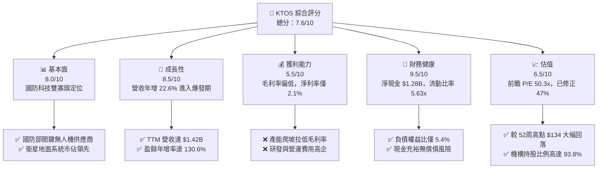
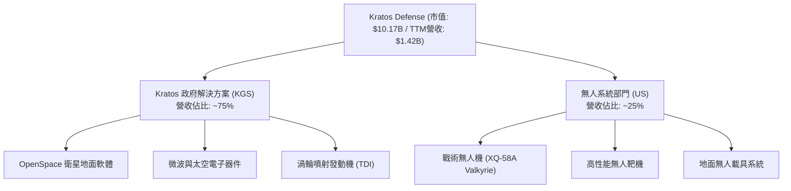
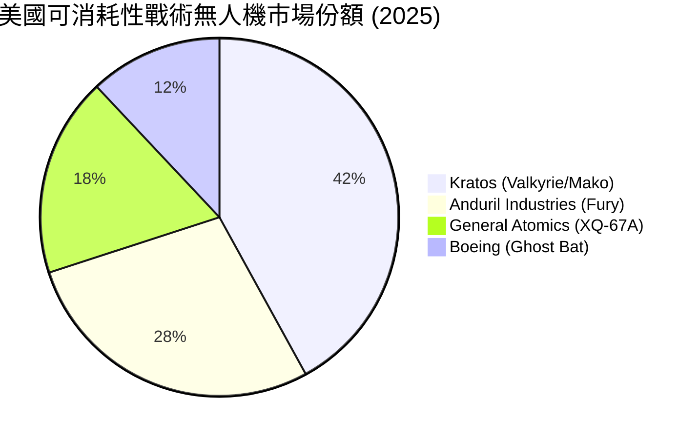
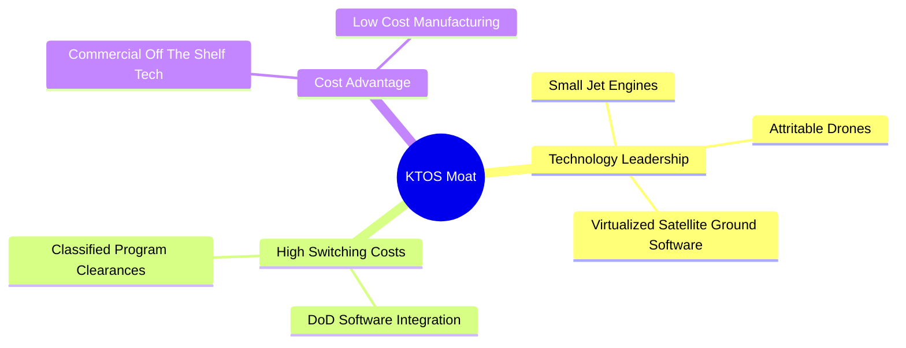
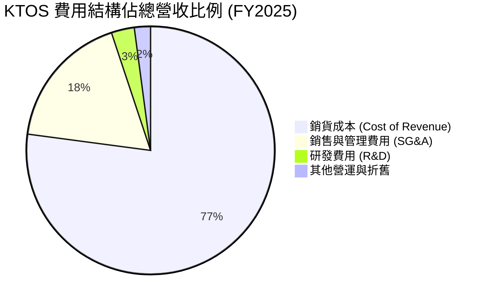
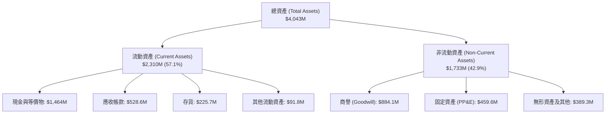

# KTOS 基本面深度分析報告
> **報告日期**：2026-06-19 ｜ **語言**：繁體中文 ｜ **數據來源**：Yahoo Finance, Finviz, StockAnalysis, Roic.ai ｜ **分析師**：CFA 級機構研究

---

## 目錄

| # | 章節 | 核心結論 |
|---|------|----------|
| 1 | 執行摘要 | 評級：**買入 (BUY)** ｜ 目標價：**$112.20**（上行空間 +107%） |
| 2 | 公司概覽與商業模式 | 雙引擎驅動（無人系統 + 虛擬化衛星地面系統），具備強大技術護城河 |
| 3 | 損益表深度分析 | 營收年增 22.6% 表現亮眼，研發與產能擴張導致短期利潤率承壓 |
| 4 | 資產負債表分析 | 帳上現金達 $1.46B，淨現金高達 $1.28B，流動性極其強勁 |
| 5 | 現金流量深度分析 | 營運與自由現金流因營運資金積壓短暫轉負，大規模融資為未來增長儲備彈藥 |
| 6 | 獲利能力與資本效率 | 處於重資產投入期，ROIC (2.59%) 暫時低於 WACC (9.30%)，預期未來將迎來拐點 |
| 7 | 估值深度分析 | 前瞻 P/E 50.34x，相較歷史高點已大幅修正，DCF 基準估值為 $112.20 |
| 8 | 成長催化劑 | 美軍 CCA 計劃、OpenSpace 軟體平台普及與渦輪噴射發動機國產化 |
| 9 | 風險矩陣 | 國防預算撥款延遲、低毛利項目佔比過高與股權稀釋風險 |
| 10| 投資建議 | 具備高安全邊際的國防科技成長股，建議於 $50-$55 區間逢低分批布局 |

---

## 1. 執行摘要

### 1.1 核心評分儀表板



### 1.2 評分進度條視覺化

```
╔══════════════════════════════════════════════════════════════╗
║               KTOS 多維度評分儀表板 (1-10分)                 ║
╠══════════════════════════════════════════════════════════════╣
║ 基本面強度  8.0 ▓▓▓▓▓▓▓▓▓▓▓▓▓▓▓▓░░░░  ★★★★☆           ║
║ 成長動能    8.5 ▓▓▓▓▓▓▓▓▓▓▓▓▓▓▓▓▓░░░  ★★★★☆           ║
║ 獲利品質    5.5 ▓▓▓▓▓▓▓▓▓▓░░░░░░░░░░  ★★★☆☆           ║
║ 財務健康    9.5 ▓▓▓▓▓▓▓▓▓▓▓▓▓▓▓▓▓▓▓░  ★★★★★           ║
║ 估值合理性  6.5 ▓▓▓▓▓▓▓▓▓▓▓▓░░░░░░░░  ★★★☆☆           ║
║ 護城河深度  8.5 ▓▓▓▓▓▓▓▓▓▓▓▓▓▓▓▓▓░░░  ★★★★☆           ║
║ 管理層執行  7.5 ▓▓▓▓▓▓▓▓▓▓▓▓▓▓░░░░░░  ★★★★☆           ║
║ 技術創新力  9.0 ▓▓▓▓▓▓▓▓▓▓▓▓▓▓▓▓▓▓░░  ★★★★★           ║
╠══════════════════════════════════════════════════════════════╣
║ 綜合總分    7.6 ▓▓▓▓▓▓▓▓▓▓▓▓▓▓▓░░░░░  🏆 成長型國防科技龍頭 ║
╚══════════════════════════════════════════════════════════════╝
```

### 1.3 投資論點與核心風險

| 類型 | 項目 | 具體依據 | 信心度 |
|------|------|----------|--------|
| 🟢 **投資論點①** | **無人機業務迎來爆發** | 戰術無人機（如 XQ-58A Valkyrie）在協同作戰飛機（CCA）計劃中處於領先地位，將直接受益於五角大廈的非對稱戰爭預算。 | 🟢 極高 |
| 🟢 **投資論點②** | **OpenSpace 軟體高毛利轉型** | 衛星地面系統向虛擬化、軟體定義（SDN）轉型，OpenSpace 平台將推動長期毛利率向 30% 以上邁進。 | 🟢 高 |
| 🟢 **投資論點③** | **無與倫比的資產負債表** | 擁有 $1.46B 現金及等價物，淨現金達 $1.28B，在當前高利率環境下提供極強的抗風險能力與併購彈藥。 | 🟢 極高 |
| 🟡 **風險①** | **短期利潤率承壓** | 產能爬坡與低毛利的工程研發合同佔比高，導致 TTM 營業利益率僅為 1.8%，淨利率僅 2.1%。 | 🟡 中度 |
| 🔴 **風險②** | **股權稀釋風險** | 2026年第一季發行新股使流通股數從 1.63億股增至 1.87億股（YoY +10.41%），短期內稀釋了 EPS 表現。 | 🔴 高衝擊 |

### 1.4 快速統計卡片

| 指標 | KTOS 實際值 | 國防航太行業均值 | S&P 500 均值 | 狀態 |
|------|-------------|------------------|--------------|------|
| **收入 YoY 成長** | **22.6%** | ~6.5% | ~5.5% | 🟢 遠超同業 |
| **毛利率** | **22.9%** | ~26.0% | ~30.0% | 🟡 略低於同業 |
| **淨利率** | **2.1%** | ~7.0% | ~11.5% | 🔴 亟待改善 |
| **流動比率** | **5.63x** | ~1.4x | ~1.2x | 🟢 極其安全 |
| **前瞻 P/E** | **50.34x** | ~24.5x | ~21.0% | 🟡 溢價較高 |
| **機構持股比** | **93.8%** | ~78.0% | ~72.0% | 🟢 機構高度認可 |

### 1.5 投資結論

```
╔══════════════════════════════════════════════════════════════════╗
║                    📊 KTOS 投資結論摘要                          ║
╠══════════════════════════════════════════════════════════════════╣
║  評級：🟢 買入 (BUY)                                             ║
║  當前股價：$54.21 (2026-06-19)                                   ║
║  目標價區間：                                                    ║
║    悲觀情境：$75.00  （+38.3%）                                  ║
║    基準情境：$112.20 （+107.0%） ← 12個月主要目標價              ║
║    樂觀情境：$150.00 （+176.7%）                                  ║
║  投資評分：7.6 / 10.0                                            ║
║  適合投資人：中長線成長型投資人、專注國防科技與航太板塊的機構    ║
╚══════════════════════════════════════════════════════════════════╝
```

---

## 2. 公司概覽與商業模式

Kratos Defense & Security Solutions (KTOS) 是一家專注於美國國家安全、國防及商業市場的科技公司。其核心競爭力在於將新興的商業科技快速應用於高壁壘的國防領域。

### 2.1 業務結構與收入來源

KTOS 主要營運兩大核心業務板塊：
1. **Kratos Government Solutions (KGS，Kratos 政府解決方案)**：佔比約 75%，主要提供衛星虛擬化地面系統、微波電子、網路安全、導彈防禦及噴射引擎動力系統。
2. **Unmanned Systems (US，無人系統)**：佔比約 25%，主要研發與製造高性價比、可消耗性（Attritable）戰術無人機（如 Valkyrie, Mako, Firejet），以及用於防空訓練的無人靶機。



### 2.2 戰術無人機市場份額估算

在美國軍方的「可消耗性戰術無人機（Attritable UAV）」與「協同作戰飛機（CCA）」市場中，KTOS 憑藉先發優勢佔據了重要市場份額。



### 2.3 競爭護城河分析

KTOS 的競爭護城河並非傳統國防巨頭（如 LMT, RTX）的超大型平台壟斷，而是基於「快速迭代、商業成本、核心技術控制」的非對稱優勢。



### 2.4 護城河強度評分

```
╔══════════════════════════════════════════════════════════════╗
║                    KTOS 護城河強度評分                       ║
╠══════════════════════════════════════════════════════════════╣
║ 技術領先度    9.0/10  ▓▓▓▓▓▓▓▓▓▓▓▓▓▓▓▓▓▓░░  🏆 戰術無人機先驅║
║ 客戶轉置成本  8.5/10  ▓▓▓▓▓▓▓▓▓▓▓▓▓▓▓▓▓░░░  🟢 衛星控制系統深植║
║ 生態系統壁壘  8.0/10  ▓▓▓▓▓▓▓▓▓▓▓▓▓▓▓▓░░░░  🟢 國防部機密資質  ║
║ 成本優勢      9.0/10  ▓▓▓▓▓▓▓▓▓▓▓▓▓▓▓▓▓▓░░  🏆 傳統巨頭無法企及║
╠══════════════════════════════════════════════════════════════╣
║ 綜合護城河     8.6/10  ▓▓▓▓▓▓▓▓▓▓▓▓▓▓▓▓▓░░░  🏆 強大且難以顛覆  ║
╚══════════════════════════════════════════════════════════════╝
```

---

## 3. 損益表深度分析

### 3.1 年度收入成長趨勢（近5年）

KTOS 近五年營收呈現加速增長態勢，2025年總營收達到 $1.35B，TTM 營收進一步拉升至 $1.42B。

```
╔══════════════════════════════════════════════════════════════════╗
║                KTOS 年度收入趨勢 (FY2021-TTM)                    ║
╠══════════════════════════════════════════════════════════════════╣
║                                                                  ║
║  FY2021  $811.5M   ████████████░░░░░░░░░░░░░░░░░░  YoY: +8.53%   ║
║  FY2022  $898.3M   █████████████░░░░░░░░░░░░░░░░░  YoY: +10.70%  ║
║  FY2023  $1,037.0M ███████████████░░░░░░░░░░░░░░░  YoY: +15.45%  ║
║  FY2024  $1,136.0M █████████████████░░░░░░░░░░░░░  YoY: +9.56%   ║
║  FY2025  $1,347.0M ████████████████████░░░░░░░░░░  YoY: +18.52%  ║
║  TTM     $1,415.0M █████████████████████░░░░░░░░░  YoY: +21.82%  ║
║                                                                  ║
║  📊 5年營收複合年增長率 (CAGR)：+11.75%                           ║
╚══════════════════════════════════════════════════════════════════╝
```

### 3.2 季度收入趨勢分析

最近四個季度中，KTOS 的營收保持了強勁的雙位數 YoY 增長，反映出無人機交付訂單增加與衛星地面站軟體需求旺盛。

| 財報季度 | 營收 (Million) | YoY 成長率 | QoQ 成長率 | 核心驅動因素 |
|----------|----------------|------------|------------|--------------|
| **Q2 2025** | $351.50 | +17.13% | +16.16% | 戰術無人機項目交付加速，KGS 軟體授權增加 |
| **Q3 2025** | $347.60 | +25.99% | -1.11% | 季節性波動，但微波電子出貨量維持高位 |
| **Q4 2025** | $345.10 | +21.90% | -0.72% | 年底國防預算結算，系統集成業務穩健 |
| **Q1 2026** | $371.00 | +22.60% | +7.50% | 🟢 新一年度國防合約啟動，無人機出貨超預期 |

*分析備註：Q1 2026 營收達到 $371M 創歷史新高，YoY 成長 22.6% 顯示出公司已從研發階段步入量產收割期。*

### 3.3 利潤率演變分析

雖然營收高速增長，但 KTOS 的利潤率表現略顯疲態。

| 利潤率指標 | FY2022 | FY2023 | FY2024 | FY2025 | TTM | 趨勢評估 |
|------------|--------|--------|--------|--------|-----|----------|
| **毛利率** | 25.16% | 25.90% | 25.28% | 22.86% | 22.90% | ↘️ 產能擴張與低毛利硬體合約拉低整體毛利 🟡 |
| **營業利益率** | -0.32% | 3.00% | 2.55% | 1.90% | 1.80% | ↘️ 研發與管理費用居高不下 🔴 |
| **EBITDA 利潤率**| 2.92% | 7.47% | 8.24% | 7.64% | 5.70% | ↘️ 資本開支折舊增加，但現金生成力尚存 🟡 |
| **淨利率** | -3.70% | 0.23% | 1.43% | 1.63% | 2.08% | ↗️ 受益於非營業收入與稅收優惠微幅回升 🟢 |

**利潤率演變深度解析**：
1. **毛利率下滑原因**：主要因為無人機部門（US）目前處於生產線建設與小批量試生產（LRIP）階段，固定成本分攤較高。同時，政府合約中「成本加成（Cost-Plus）」類型的研發合約佔比較高，此類合約風險低但毛利率通常僅為 8%-12%。
2. **營業利益率承壓**：SG&A 費用在 2025 年達到 $240.2M（佔營收 17.8%），研發（R&D）投入維持在 $40.0M 的高檔。隨著未來 Valkyrie 無人機進入大批量生產（FRP）以及高毛利的 OpenSpace 軟體佔比提升，預期營業利益率將在 2027 年後迎來顯著改善（目標 6%-8%）。

### 3.4 費用結構分析



### 3.5 季度 EPS 趨勢與盈餘品質

KTOS 過去 4 季的 EPS 表現呈現穩步向上的趨勢：
* **Q2 2025**：$0.02
* **Q3 2025**：$0.05
* **Q4 2025**：$0.03
* **Q1 2026**：$0.07 🟢（創近年單季新高）

**盈餘品質評估**：
雖然 Q1 2026 的淨利潤達到 $11.9M，但盈餘品質需要謹慎看待。Q1 2026 的非營運收益（Non-Operating Income）達到 $5.1M，主要來自於帳上大筆現金的利息收入。這意味著公司目前的淨利潤有相當一部分是由高利率環境下的「現金紅利」貢獻，而非純粹的營運利潤。不過，隨著營收規模持續擴大，營業利潤的佔比預計將逐步提升。

---

## 4. 資產負債表分析

### 4.1 資產結構分解

截至 2026-03-31，KTOS 的總資產達到 $4.04B，其中流動資產佔比高達 57.1%。



### 4.2 流動性指標分析

KTOS 的流動性在整個國防航太板塊中堪稱「天花板」級別：

| 流動性指標 | KTOS 數值 | 行業中位數 | 評估 |
|------------|-----------|------------|------|
| **流動比率 (Current Ratio)** | **5.63x** | 1.45x | 🟢 極其充沛，無任何短期償債壓力 |
| **速動比率 (Quick Ratio)** | **5.08x** | 1.02x | 🟢 扣除存貨後依然極高，變現能力極強 |
| **現金比率 (Cash Ratio)** | **3.56x** | 0.35x | 🟢 僅憑帳上現金即可覆蓋 3.5 倍的短期負債 |

### 4.3 債務結構與安全診斷

```
╔══════════════════════════════════════════════════════════════════╗
║                    KTOS 債務健康診斷                             ║
