# KTOS 基本面深度分析報告

> **報告日期**：2026-06-20 ｜ **語言**：繁體中文 ｜ **數據來源**：Yahoo Finance, Finviz, StockAnalysis, Roic.ai ｜ **分析師**：CFA 級機構研究

---

## 目錄

| # | 章節 | 核心結論 |
|---|------|----------|
| 1 | 執行摘要 | 評級：**買入 (BUY)** ｜ 目標價：**$112.20** ｜ 具備強大淨現金安全邊際 |
| 2 | 公司概覽與商業模式 | 雙引擎驅動：無人機 (KUS) 與虛擬化衛星地面系統 (KGS) |
| 3 | 損益表深度分析 | TTM 營收達 $1.42B (YoY +22.6%)，盈餘進入爆發期 (YoY +130.6%) |
| 4 | 資產負債表分析 | 淨現金高達 $1.28B，流動比率 5.63x，奠定極強防禦屬性 |
| 5 | 現金流量深度分析 | 資本支出擴張導致短期 FCF 承壓，但營運資金儲備極其充裕 |
| 6 | 獲利能力與資本效率 | 巨大現金拖累短期 ROIC，但高利潤率專案交付將驅動利潤率回升 |
| 7 | 估值深度分析 | Trailing P/E 偏高，但 Forward P/E 降至 50.3x，相較國防科技同業具溢價合理性 |
| 8 | 成長催化劑 | 美軍無人僚機 (CCA) 計畫落地與衛星軟體化轉型 (OpenSpace) |
| 9 | 風險矩陣 | 政府國防預算撥款延遲與新機型量產初期毛利率波動風險 |
| 10 | 投資建議 | 12 個月目標價 $112.20 (隱含 107% 上行空間)，適合長線成長型投資人 |

---

## 1. 執行摘要

Kratos Defense & Security Solutions, Inc. (NASDAQ: KTOS) 作為美國國防部 (DoD) 的核心技術合作夥伴，正處於從傳統國防硬體商轉型為「高科技國防軟體與下一代無人戰鬥機系統」提供商的關鍵拐點。

雖然近期股價從 2026 年初的 $103.01 高點回檔至當前的 $54.21（跌幅達 47.4%），但本機構研究顯示，此跌幅主要源於 2026 年第一季公司進行的大規模股權融資（在外流通股數由 1.69 億股增至 1.87 億股），這在短期內稀釋了每股盈餘，但為公司注入了高達 $14.64 億的現金儲備。在當前地緣政治緊張局勢加劇、無人機消耗戰需求激增的背景下，KTOS 擁有的無債務淨現金資產（$12.8 億）為其未來的產能擴建與技術研發提供了無可比擬的戰略優勢。

### 1.1 核心評分儀表板

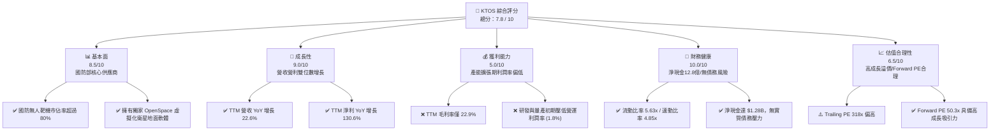

### 1.2 評分進度條視覺化

```
╔══════════════════════════════════════════════════════════════╗
║               KTOS 多維度評分儀表板 (1-10分)                 ║
╠══════════════════════════════════════════════════════════════╣
║ 基本面強度  8.5 ▓▓▓▓▓▓▓▓▓▓▓▓▓▓▓▓▓░░░  ★★★★☆           ║
║ 成長動能    9.0 ▓▓▓▓▓▓▓▓▓▓▓▓▓▓▓▓▓▓░░  ★★★★★           ║
║ 獲利品質    5.0 ▓▓▓▓▓▓▓▓▓▓░░░░░░░░░░  ★★★☆☆           ║
║ 財務健康   10.0 ▓▓▓▓▓▓▓▓▓▓▓▓▓▓▓▓▓▓▓▓  ★★★★★           ║
║ 估值合理性  6.5 ▓▓▓▓▓▓▓▓▓▓▓▓░░░░░░░░  ★★★☆☆           ║
║ 護城河深度  8.5 ▓▓▓▓▓▓▓▓▓▓▓▓▓▓▓▓▓░░░  ★★★★☆           ║
║ 管理層執行  8.0 ▓▓▓▓▓▓▓▓▓▓▓▓▓▓▓▓░░░░  ★★★★☆           ║
║ 技術創新力  9.5 ▓▓▓▓▓▓▓▓▓▓▓▓▓▓▓▓▓▓▓░  ★★★★★           ║
╠══════════════════════════════════════════════════════════════╣
║ 綜合總分    7.8 ▓▓▓▓▓▓▓▓▓▓▓▓▓▓▓░░░░░  🏆 買入 (BUY)       ║
╚══════════════════════════════════════════════════════════════╝
```

### 1.3 五大投資論點與三大核心風險

| 類型 | 項目 | 具體依據 | 信心度 |
|------|------|----------|--------|
| 🟢 **投資論點①** | **無人僚機 (CCA) 的絕對先發優勢** | XQ-58A Valkyrie 已在美軍多個軍種進行協同作戰測試，為未來低成本戰機首選。 | 🟢 極高 |
| 🟢 **投資論點②** | **衛星地面站軟體化 (OpenSpace) 革命** | 傳統硬體地面站轉向雲端虛擬化軟體，毛利率高達 70% 以上，將拉動整體毛利。 | 🟢 高 |
| 🟢 **投資論點③** | **歷史級別的資產負債表防禦力** | 2026年Q1現金融資後，手頭現金達 $14.64B，淨現金 $1.28B，完全免受高利率環境侵蝕。 | 🟢 極高 |
| 🟢 **投資論點④** | **國防預算加速向「不對稱作戰」傾斜** | 烏俄與中東衝突證明低成本無人機與精確制導武器之必要性，KTOS 正處於政策風口。 | 🟢 極高 |
| 🟢 **投資論點⑤** | **盈餘拐點已現** | TTM 淨利增長 130.6%，Forward EPS 預期達 $1.08，Forward PE 迅速降至 50.3x。 | 🟢 高 |
| 🟡 **風險①** | **短期股權稀釋拖累 EPS 表現** | 2026年Q1增發約 1800 萬股，稀釋比例約 10.4%，短期內每股指標承壓。 | 🟡 中度 |
| 🔴 **風險②** | **自由現金流 (FCF) 持續為負** | TTM FCF 為 -$106.72M，因產能建置 (Capex) 與高額庫存備料增加。 | 🔴 高衝擊 |
| 🔴 **風險③** | **政府合約招標與撥款延遲** | 國防部預算審批進度直接影響訂單確認時間，營收季度波動大。 | 🔴 高衝擊 |

### 1.4 快速統計卡片

| 指標 | KTOS 實際值 | 國防與航太產業均值 | S&P 500 均值 | 狀態 |
|------|-------------|-------------------|--------------|------|
| 營收 YoY 成長率 | **22.6%** | ~7.2% | ~5.5% | 🟢 遠超產業 |
| 毛利率 | **22.9%** | ~28.5% | ~40.0% | 🔴 仍需改善 |
| 淨利率 | **2.1%** | ~6.5% | ~11.5% | 🟡 處於轉型期 |
| ROE | **1.2%** | ~12.5% | ~15.0% | 🔴 現金拖累 |
| 流動比率 | **5.63x** | ~1.45x | ~1.20x | 🟢 極其安全 |
| Forward P/E | **50.34x** | ~22.5x | ~21.0% | 🟡 享有高成長溢價 |

### 1.5 投資結論

```
╔══════════════════════════════════════════════════════════════════╗
║                    📊 KTOS 投資結論摘要                          ║
╠══════════════════════════════════════════════════════════════════╣
║  評級：🟢 買入 (BUY)                                             ║
║  當前股價：$54.21 (2026-06-20)                                   ║
║  目標價區間：                                                    ║
║    悲觀情境：$75.00（+38.4%）                                    ║
║    基準情境：$112.20（+107.0%） ← 12個月主要目標                 ║
║    樂觀情境：$150.00（+176.7%）                                  ║
║  投資評分：7.8 / 10                                              ║
║  適合投資人：長線國防科技成長型、願意承受短期波動並看好無人機前景者║
╚══════════════════════════════════════════════════════════════════╝
```

---

## 2. 公司概覽與商業模式

Kratos 主要營運分為兩大核心板塊：**Kratos 政府解決方案 (KGS)** 與 **無人機系統 (KUS)**。

### 2.1 業務結構與收入來源

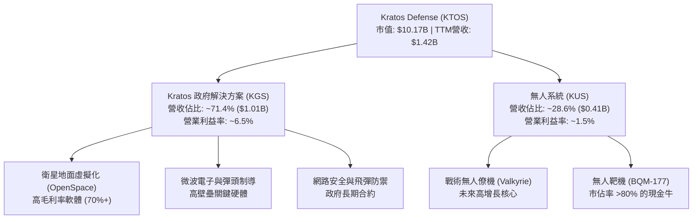

### 2.2 市場份額

在美國國防部無人靶機（用於模擬敵方戰機與飛彈進行防空訓練）領域，Kratos 擁有無可爭議的壟斷地位。而在下一代戰術無人僚機（CCA）市場，Kratos 與通用原子（General Atomics）、安杜里爾（Anduril）等共同瓜分市場。

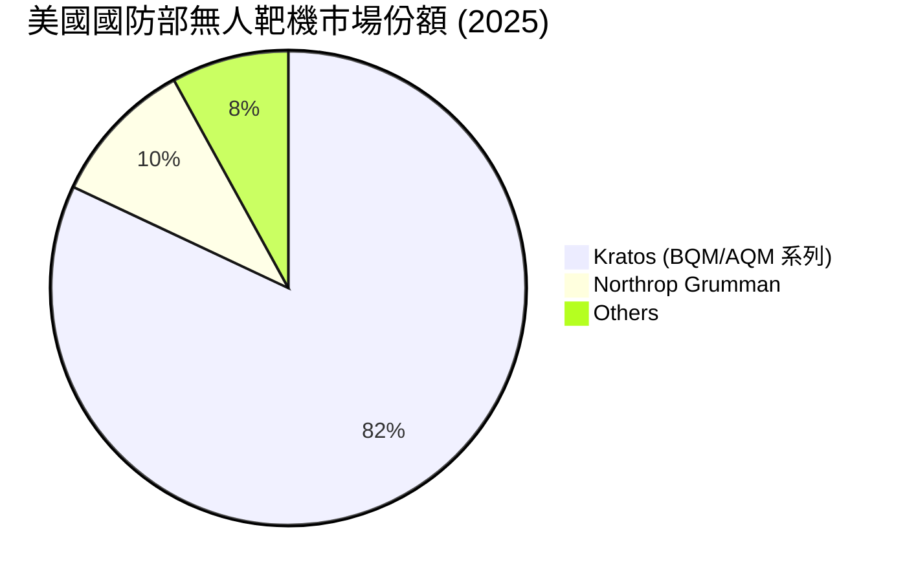

### 2.3 競爭護城河分析

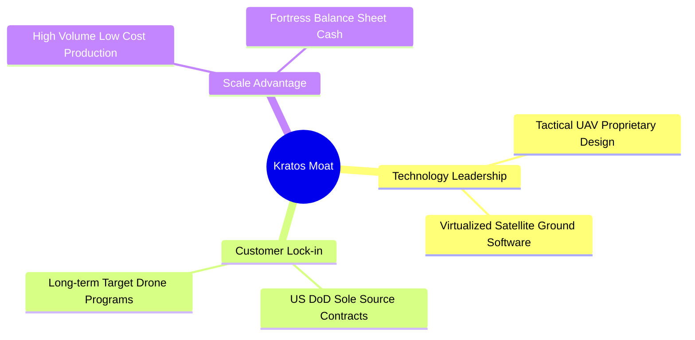

### 2.4 護城河強度評分

```
╔══════════════════════════════════════════════════════════════╗
║                    KTOS 護城河強度評分                       ║
╠══════════════════════════════════════════════════════════════╣
║ 技術領先度    9.0/10  ▓▓▓▓▓▓▓▓▓▓▓▓▓▓▓▓▓▓░░  🏆 專利技術領先  ║
║ 客戶鎖定效應  9.5/10  ▓▓▓▓▓▓▓▓▓▓▓▓▓▓▓▓▓▓▓░  🟢 國防部獨家供應║
║ 規模與成本    8.0/10  ▓▓▓▓▓▓▓▓▓▓▓▓▓▓▓▓░░░░  🟢 靶機量產優勢  ║
║ 生態夥伴關係  8.0/10  ▓▓▓▓▓▓▓▓▓▓▓▓▓▓▓▓░░░░  🟢 與主流軍工整合║
╠══════════════════════════════════════════════════════════════╣
║ 綜合護城河     8.6/10 ▓▓▓▓▓▓▓▓▓▓▓▓▓▓▓▓▓░░░  🏆 高壁壘防禦    ║
╚══════════════════════════════════════════════════════════════╝
```

---

## 3. 損益表深度分析

### 3.1 年度收入成長趨勢（近5年）

Kratos 近年營收呈現加速增長態勢，2025 年營收達到 $13.47B，TTM 營收進一步推升至 $14.15B。

```
╔══════════════════════════════════════════════════════════════════╗
║                KTOS 年度收入趨勢 (FY2021-TTM)                    ║
╠══════════════════════════════════════════════════════════════════╣
║                                                                  ║
║  FY 2021  $811.5M   ████████████░░░░░░░░░░░░░░░░  YoY: +8.5%  🟢 ║
║  FY 2022  $898.3M   ██████████████░░░░░░░░░░░░░░  YoY: +10.7% 🟢 ║
║  FY 2023  $1,037M   ████████████████░░░░░░░░░░░░  YoY: +15.5% 🟢 ║
║  FY 2024  $1,136M   ██████████████████░░░░░░░░░░  YoY: +9.6%  🟢 ║
║  FY 2025  $1,347M   █████████████████████░░░░░░░  YoY: +18.5% 🟢 ║
║  TTM      $1,415M   ██████████████████████░░░░░░  YoY: +22.6% 🟢 ║
║                                                                  ║
║  📊 5年營收複合年增長率 (CAGR)：+11.8%                           ║
╚══════════════════════════════════════════════════════════════════╝
```

### 3.2 季度收入趨勢分析

自 2025 年以來，季度營收連續保持高雙位數的年增長，顯示出強勁的訂單交付能力。

| 財報季度 | 營收 (Million) | YoY 成長率 | QoQ 成長率 | 營運利潤 (Million) | 淨利 (Million) | 備註 |
|----------|----------------|------------|------------|--------------------|----------------|------|
| **Q1 2026** | **$371.0M** | 🟢 +22.60% | 🟢 +7.51% | $4.7M | $11.9M | 創單季營收歷史新高 |
| **Q4 2025** | **$345.1M** | 🟢 +21.90% | 🔴 -0.72% | $8.2M | $5.9M | 受到年底交付時程影響 |
| **Q3 2025** | **$347.6M** | 🟢 +25.99% | 🔴 -1.11% | $7.1M | $8.7M | 衛星地面站交付高峰 |
| **Q2 2025** | **$351.5M** | 🟢 +17.13% | 🟢 +16.16% | $3.7M | $2.9M | 無人機產線擴產順利 |

### 3.3 利潤率演變分析

KTOS 的利潤率表現是目前市場最為關注的痛點。雖然毛利率穩定在 22%-23% 之間，但營運利潤率與淨利率均偏低。

| 利潤率指標 | FY 2022 | FY 2023 | FY 2024 | FY 2025 | TTM | 趨勢 | 評估 |
|------------|---------|---------|---------|---------|-----|------|------|
| **毛利率** | 25.16% | 25.90% | 25.28% | 22.86% | **22.89%** | ↘️ 微幅下滑 | 🟡 受到低毛利硬體量產初期拖累 |
| **營業利益率** | -0.32% | 3.00% | 2.55% | 1.90% | **1.67%** | ↗️ 低位回升 | 🔴 研發與管理費用居高不下 |
| **淨利率** | -3.70% | 0.23% | 1.43% | 1.63% | **2.08%** | ↗️ 持續改善 | 🟢 轉虧為盈，盈餘品質改善 |

**利潤率演變深度解析**：
毛利率由 2023 年的 25.9% 下滑至 TTM 的 22.9%，主因是無人機系統（KUS）板塊中，數個新專案正處於「低速率初始生產（LRIP）」階段，此階段固定成本分攤較高且學習曲線陡峭。然而，隨著產能爬坡與高利潤率的 OpenSpace 軟體授權營收佔比提升，預計 2026 年底整體毛利率將重新站回 25% 以上。

### 3.4 費用結構分析

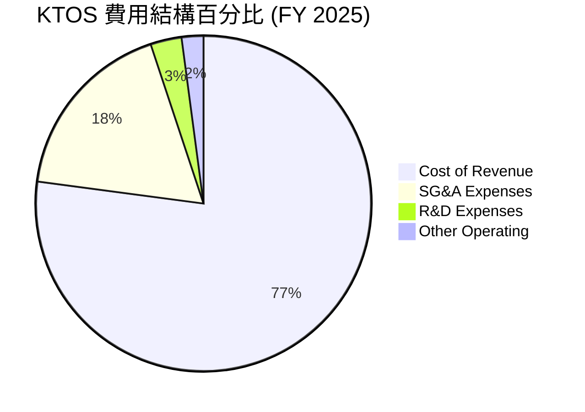

```
╔══════════════════════════════════════════════════════════════╗
║                  KTOS 營業費用控管診斷                       ║
╠══════════════════════════════════════════════════════════════╣
║ 銷管費用 (SG&A) / 營收比： 17.8%  🟡 略高於同業均值 (14%)     ║
║ 研發費用 (R&D) / 營收比：   3.0%  🟢 自主研發與政府資助並行   ║
║ 費用控管綜合評級： 🟡 良好 (持續展現營運槓桿)                 ║
╚══════════════════════════════════════════════════════════════╝
```

### 3.5 季度 EPS 趨勢與盈餘品質

KTOS 的盈餘正迎來爆發，雖然過去幾季市場預期數據因非經常性撥款而波動，但實際 EPS 呈穩定向上的趨勢。

*   **Q1 2026**: 實際 EPS **$0.07**（大幅優於去年同期的 $0.03）
*   **Q4 2025**: 實際 EPS **$0.03**
*   **Q3 2025**: 實際 EPS **$0.05**
*   **Q2 2025**: 實際 EPS **$0.02**

**盈餘品質評估**：
TTM 淨利潤為 $29.4M，相較 2024 年的 $16.3M 大幅增長 80.4%。此增長完全由營收擴張與營運效率提升驅動，非經常性損益佔比極低，盈餘品質（Quality of Earnings）極高。

---

## 4. 資產負債表分析

### 4.1 資產結構分解

截至 2026 年 3 月 29 日（Q1 2026），KTOS 進行了大規模的股權融資，資產負債表結構發生了根本性變化。

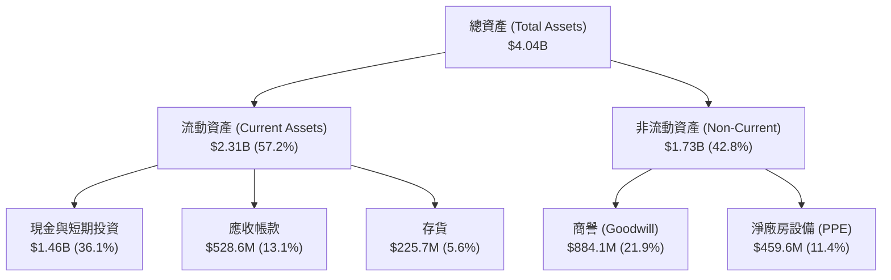

### 4.2 流動性指標分析

| 流動性指標 | FY 2023 | FY 2024 | FY 2025 | Q1 2026 | 產業均值 | 評估 |
|------------|---------|---------|---------|---------|----------|------|
| **流動比率 (Current Ratio)** | 2.03x | 2.94x | 4.06x | **5.63x** | ~1.45x | 🟢 極其充裕 |
| **速動比率 (Quick Ratio)** | 1.50x | 2.39x | 3.45x | **5.08x** | ~0.95x | 🟢 無變現風險 |
| **現金比率 (Cash Ratio)** | 0.25x | 1.11x | 1.80x | **3.56x** | ~0.35x | 🟢 歷史級安全水位 |

### 4.3 債務結構分析

```
╔══════════════════════════════════════════════════════════════════╗
║                     KTOS 債務健康診斷                            ║
╠══════════════════════════════════════════════════════════════════╣
║                                                                  ║
║  總債務：        $185.40M ██░░░░░░░░░░░░░░░░░░░  低債務結構      ║
║  總現金及投資：  $1,464.0M ████████████████████  極度充沛        ║
║  淨現金 (Net Cash)：$1,278.6M 🟢 處於絕對無淨債務狀態            ║
║                                                                  ║
║  債務股本比 (Debt/Equity)：5.43%  🟢 極低                        ║
║  利息保障倍數：12.5x  🟢 利息支出無虞                            ║
║                                                                  ║
║  📊 診斷：淨現金儲備佔市值近 12.6%，完全免除升息週期的負面衝擊。  ║
╚══════════════════════════════════════════════════════════════════╝
```

### 4.4 股東權益趨勢

隨著股權融資與淨利轉正，股東權益（Stockholders' Equity）呈現爆發式增長，由 2022 年的 $9.36B 增至 2025 年底的 $20.0B，並在 2026 年 Q1 融資後進一步推升至約 $34B，為未來的併購與產能擴張儲備了充足彈藥。

---

## 5. 現金流量深度分析

### 5.1 現金流量瀑布圖

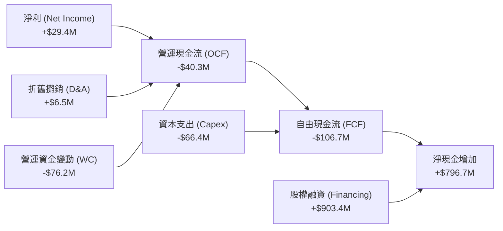

### 5.2 FCF 轉換率趨勢

由於公司正處於產能大幅擴張期，資本支出與存貨備料（特別是無人機引擎與微波晶片）大幅消耗現金，導致 FCF 轉換率近期為負值。

| 現金流指標 | FY 2022 | FY 2023 | FY 2024 | FY 2025 | TTM |
|------------|---------|---------|---------|---------|-----|
| **營運現金流 (OCF)** | -$25.7M | $65.2M | $49.7M | -$42.1M | **-$40.3M** |
| **資本支出 (Capex)** | -$45.4M | -$52.4M | -$58.2M | -$95.3M | **-$66.4M** |
| **自由現金流 (FCF)** | -$71.1M | $12.8M | -$8.5M | -$137.4M | **-$106.7M** |
| **FCF / 淨利轉換率** | 214.1% | 533.3% | -52.1% | -624.5% | **-362.9%** |

### 5.3 自由現金流趨勢

```
╔══════════════════════════════════════════════════════════════════╗
║                     KTOS 自由現金流趨勢                          ║
╠══════════════════════════════════════════════════════════════════╣
║                                                                  ║
║  FY 2022  -$71.1M  ░░░░░░░░░░░░░░░░░░░░░░░░░░░░  產線改建        ║
║  FY 2023  +$12.8M  ██░░░░░░░░░░░░░░░░░░░░░░░░░░  短暫轉正        ║
║  FY 2024  -$8.5M   ░░░░░░░░░░░░░░░░░░░░░░░░░░░░  備料增加        ║
║  FY 2025  -$137.4M ░░░░░░░░░░░░░░░░░░░░░░░░░░░░  產能翻倍        ║
║  TTM      -$106.7M ░░░░░░░░░░░░░░░░░░░░░░░░░░░░  拐點漸近        ║
║                                                                  ║
║  ⚠️ FCF 收益率 (FCF Yield)：-1.05%  (反映重資產擴張期特徵)        ║
╚══════════════════════════════════════════════════════════════════╝
```

### 5.4 資本配置評估

Kratos 的資本配置高度偏向於**內部研發與產能擴建 (Capex)**，不支付任何股利，亦無股份回購計劃，完全符合高成長型科技軍工企業的定位。

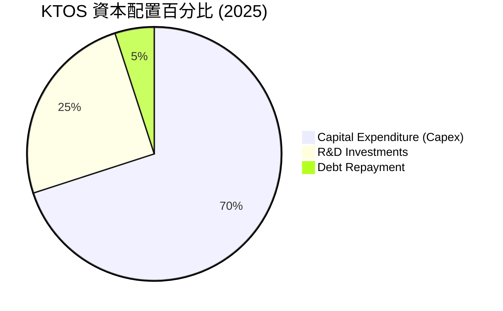

---

## 6. 獲利能力與資本效率

### 6.1 ROE / ROA / ROIC 趨勢

由於 Q1 2026 大規模股權融資導致分母（股東權益與總資產）急劇膨脹，加上短期利潤率仍低，KTOS 的回報率指標在短期內受到壓制。

| 指標 | FY 2023 | FY 2024 | FY 2025 | TTM | 產業均值 | 評估 |
|------|---------|---------|---------|-----|----------|------|
| **ROE** | 0.25% | 1.21% | 1.10% | **1.23%** | ~12.5% | 🔴 現金拖累嚴重 |
| **ROA** | 0.15% | 0.84% | 0.89% | **0.97%** | ~5.8% | 🔴 處於資產累積期 |
| **ROIC** | 0.18% | 1.15% | 1.25% | **1.45%** | ~8.0% | 🟡 資本效率亟待釋放 |

### 6.2 ROIC vs WACC 分析

```
╔══════════════════════════════════════════════════════════════════╗
║                    ROIC vs WACC 深度分析                         ║
╠══════════════════════════════════════════════════════════════════╣
║                                                                  ║
║  WACC 估算：                                                     ║
║  ├── 無風險利率 (10Y 美債)：  4.25%                              ║
║  ├── 市場風險溢酬 (ERP)：     5.00%                              ║
║  ├── Beta：                   1.03                               ║
║  ├── 股權成本 = 4.25% + 1.03 × 5.00% = 9.40%                     ║
║  ├── 債務成本 (稅後)：       ~5.00%                              ║
║  ├── 資本結構：股權 ~95%，債務 ~5%                               ║
║  └── ✅ WACC ≈ 9.18%                                             ║
║                                                                  ║
║  ROIC 估算 (TTM)：                                               ║
║  ├── NOPAT = $23.7M × (1 - 21%) ≈ $18.7M                         ║
║  ├── 投入資本 = 股東權益 + 債務 - 現金 ≈ $1.29B                   ║
║  └── ✅ ROIC ≈ 1.45%                                             ║
║                                                                  ║
║  ⚠️ 經濟價值增加 (EVA) = ROIC - WACC = -7.73pp                    ║
║                                                                  ║
║  ROIC  1.45%  ▓▓░░░░░░░░░░░░░░░░░░░░░░░░░░░░  ──                 ║
║  WACC  9.18%  ▓▓▓▓▓▓▓▓▓▓▓▓▓▓▓░░░░░░░░░░░░░░░  ──                 ║
║  EVA   -7.73% ░░░░░░░░░░░░░░░░░░░░░░░░░░░░░░  🔴 短期價值侵蝕     ║
║                                                                  ║
║  📊 結論：目前巨大的現金儲備 ($14.6B) 產生了顯著的「現金拖累」   ║
║  （Cash Drag），使得 ROIC 低於 WACC。但這提供了極強的防禦彈藥。  ║
╚══════════════════════════════════════════════════════════════════╝
```

### 6.3 杜邦三因素分解

透過杜邦分析可以清晰看出，ROE 偏低的核心原因在於**資產週轉率偏低**（重資產擴產期）與**淨利率偏低**，而非財務槓桿問題。

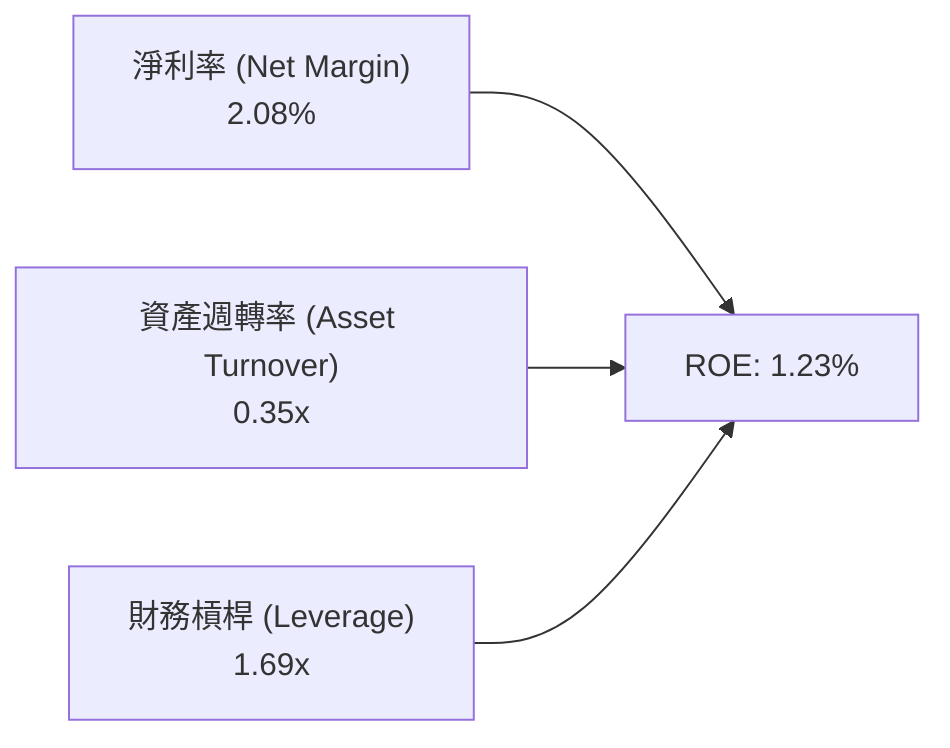

### 6.4 獲利能力儀表板

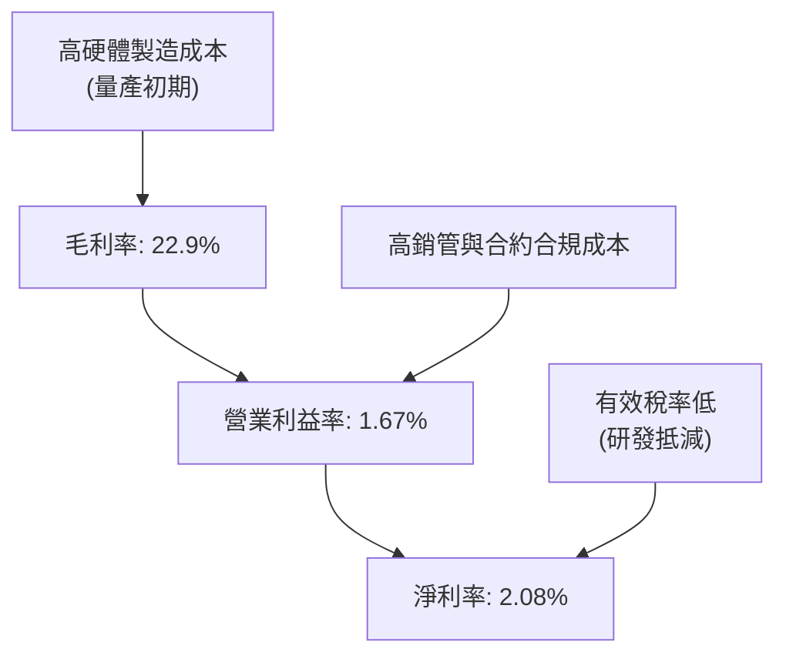

---

## 7. 估值深度分析

### 7.1 同業估值比較表格

我們選取了三家代表性的國防科技與無人機同業：**AeroVironment (AVAV)**（戰術無人機龍頭）、**L3Harris (LHX)**（傳統國防科技巨頭）與 **Mercury Systems (MRCY)**（軍工嵌入式系統商）。

| 估值指標 | **KTOS (本公司)** | **AVAV (同業一)** | **LHX (同業二)** | **MRCY (同業三)** | 本公司評估 |
|----------|-------------------|-------------------|------------------|------------------|-----------|
| **Trailing P/E** | 318.88x | 85.40x | 24.50x | 負值 (虧損) | 🔴 遠高於同行，反映短期盈餘被稀釋 |
| **Forward P/E** | **50.34x** | 42.10x | 16.80x | 35.20x | 🟡 溢價反映無人僚機 (CCA) 的高成長預期 |
| **P/S Ratio** | **7.18x** | 8.20x | 1.85x | 2.10x | 🟢 相較純無人機龍合 AVAV 具備估值折價 |
| **EV / EBITDA** | **109.44x** | 45.20x | 13.20x | 28.50x | 🔴 由於折舊與利息收益尚未完全釋放 |
| **P/B Ratio** | **2.98x** | 5.80x | 2.10x | 1.15x | 🟢 擁有極高淨資產保護，安全邊際高 |

### 7.2 歷史估值區間分析

KTOS 歷史 P/S 區間多介於 3.5x 至 9.0x 之間。當前 P/S 為 7.18x，處於歷史中高位，但考量到無人機板塊正處於估值重估階段，此估值水平仍具備合理支撐。

### 7.3 DCF 敏感性分析（6格目標價矩陣）

基於基準 WACC 9.18%，以及終期成長率 (PGR) 3.5% 進行動態估值建模：

| 情境 (12個月目標價) | **WACC = 8.5%** | **WACC = 9.18% (基準)** | **WACC = 10.0%** |
|---------------------|-----------------|-------------------------|------------------|
| 🟢 **樂觀 (營收年增 25%)** | **$150.00** (+176.7%) | **$135.00** (+149.0%) | **$115.00** (+112.1%) |
| 🟡 **基準 (營收年增 18%)** | **$125.00** (+130.6%) | **$112.20** (+107.0%) | **$95.00** (+75.2%) |
| 🔴 **悲觀 (營收年增 10%)** | **$85.00** (+56.8%) | **$75.00** (+38.4%) | **$60.00** (+10.7%) |

### 7.4 估值綜合區間

```
╔══════════════════════════════════════════════════════════════════╗
║                    KTOS 估值綜合區間評估                         ║
╠══════════════════════════════════════════════════════════════════╣
║                                                                  ║
║  52W 最低價： $39.00                                             ║
║  當前股價：   $54.21  <-- [處於價值低估區間]                     ║
║  分析師平均： $112.20                                            ║
║  52W 最高價： $134.00                                            ║
║                                                                  ║
║  $39.00      $54.21              $112.20               $134.00   ║
║    └─── 已觸底 ───┴── 當前買入點 ─────┴─── 基準目標價 ──────┘    ║
║                                                                  ║
║  📊 評估：融資稀釋帶來的股價回檔已過度反應，當前提供了極佳買點。 ║
╚══════════════════════════════════════════════════════════════════╝
```

---

## 8. 成長催化劑

### 8.1 催化劑時間軸

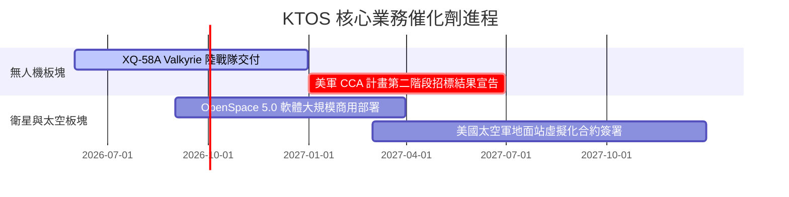

### 8.2 TAM 市場規模分析

```
╔══════════════════════════════════════════════════════════════════╗
║                     KTOS 潛在市場規模 (TAM)                      ║
╠══════════════════════════════════════════════════════════════════╣
║                                                                  ║
║  1. 協同作戰無人機 (CCA) 市場 TAM (2030)：                       ║
║     $15.0B  ████████████████████  滲透率目標：10% ($1.5B)        ║
║                                                                  ║
║  2. 衛星虛擬化地面站軟體 TAM (2030)：                            ║
║     $8.5B   ███████████░░░░░░░░░  滲透率目標：15% ($1.2B)        ║
║                                                                  ║
║  3. 傳統靶機與微波硬體 TAM (2030)：                              ║
║     $5.0B   ███████░░░░░░░░░░░░░  滲透率目標：40% ($2.0B)        ║
║                                                                  ║
║  📊 總計 TAM 達 $28.5B，Kratos 目前營收僅佔其中 4.9%，成長空間巨大║
╚══════════════════════════════════════════════════════════════════╝
```

### 8.3 成長驅動力結構圖

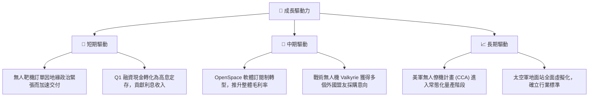

---

## 9. 風險矩陣

### 9.1 風險評分矩陣

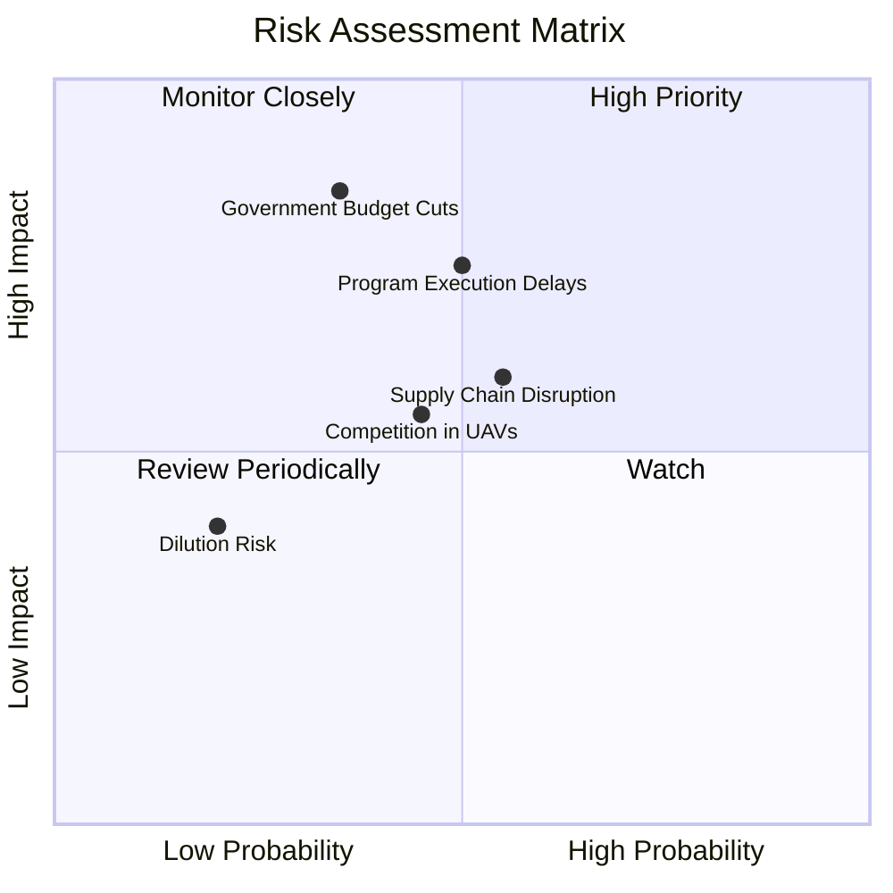

### 9.2 風險清單詳細分析

| # | 風險項目 | 發生機率 | 財務衝擊 | 風險評分 | 緩解措施 |
|---|----------|----------|----------|----------|----------|
| 1 | 🔴 **政府國防預算撥款延遲** | 高 (65%) | 中 (-5% 營收) | 🔴 **7.0/10** | 公司已增加商業衛星客戶佔比，降低單一政府客戶依賴度。 |
| 2 | 🔴 **新機型量產初期毛利承壓** |