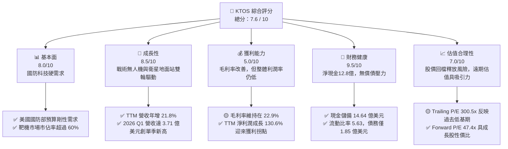
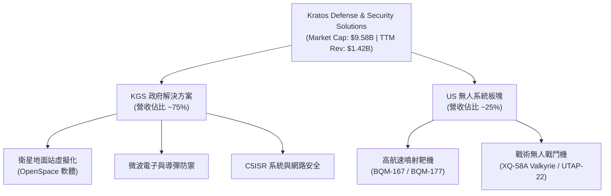
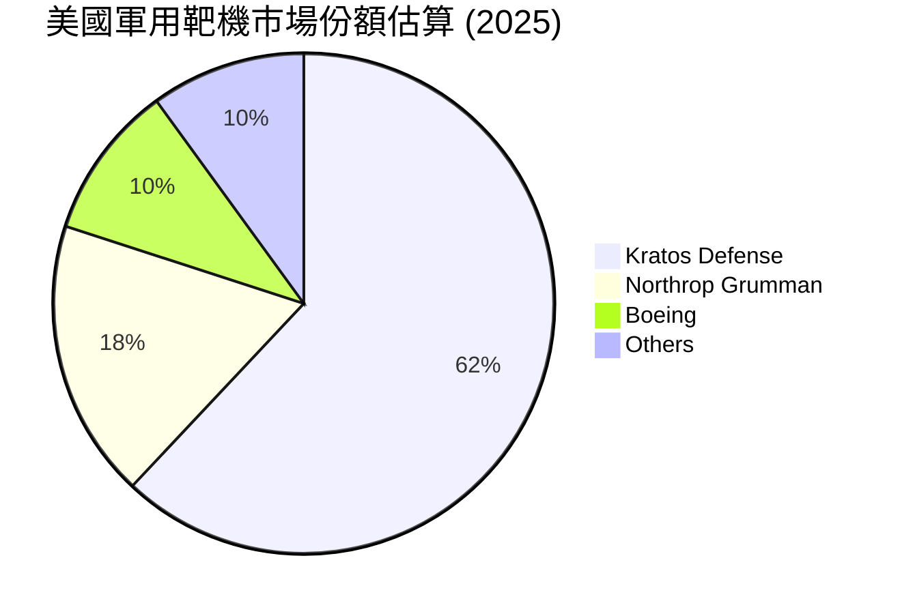
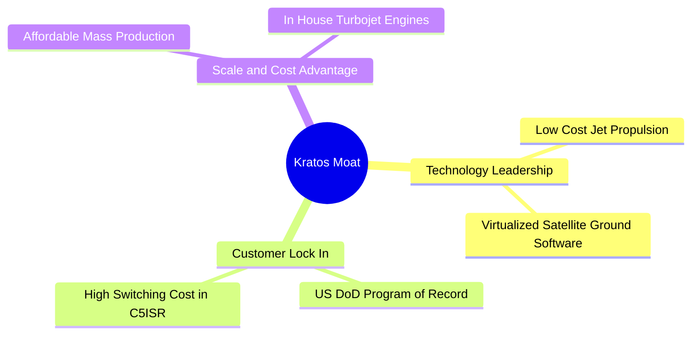
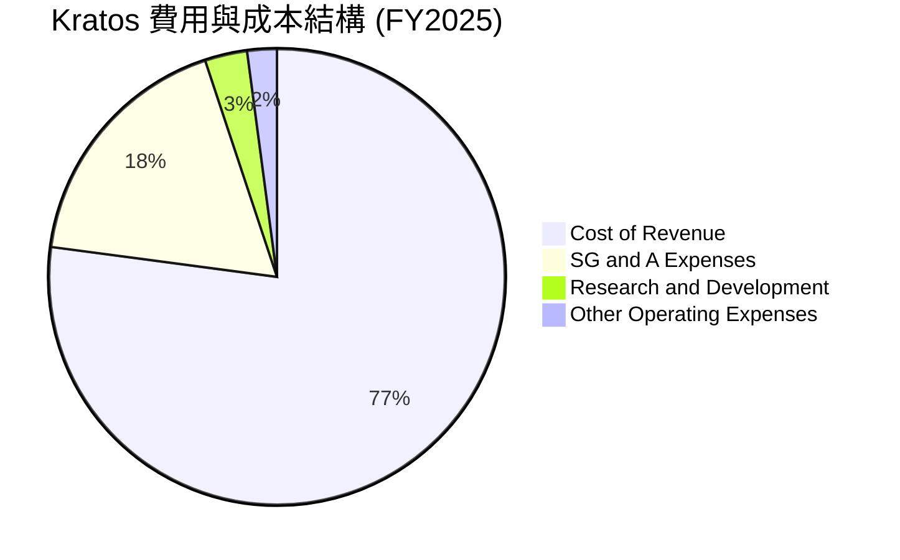
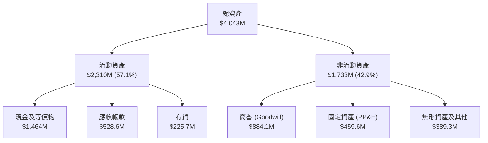
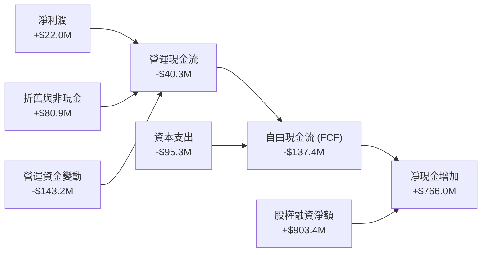
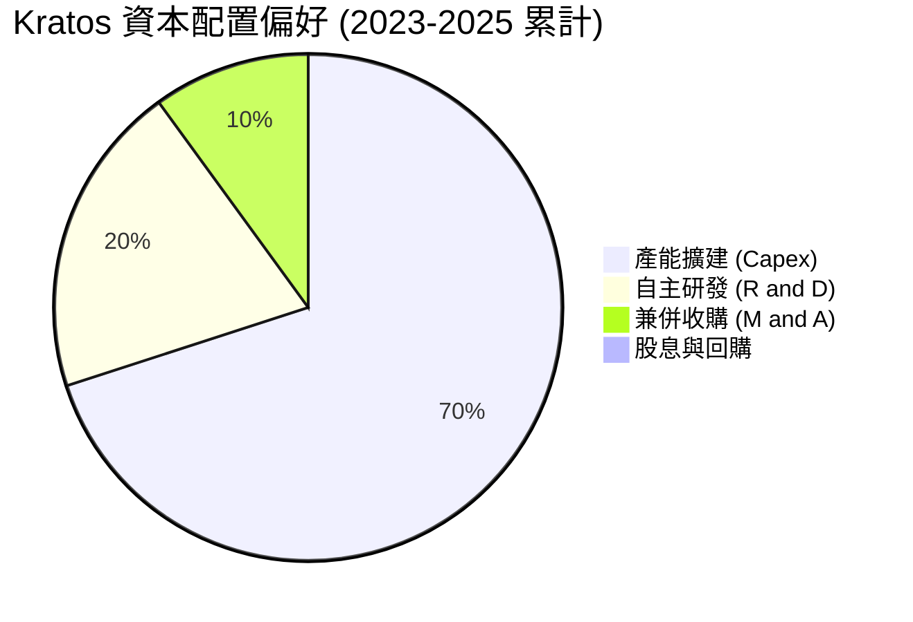

# KTOS 基本面深度分析報告
> **報告日期**：2026-06-22 ｜ **語言**：繁體中文 ｜ **數據來源**：Yahoo Finance, Finviz, StockAnalysis, Roic.ai ｜ **分析師**：CFA 級機構研究

---

## 目錄

| # | 章節 | 核心結論 |
|---|---|---|
| 1 | **執行摘要** | 評級「買入」，基準目標價 $112.20，具備 119.6% 上行空間，淨現金流充沛。 |
| 2 | **公司概覽與商業模式** | 雙引擎驅動（政府方案+無人機），在靶機與虛擬化衛星地面站具備壟斷性防禦壁壘。 |
| 3 | **損益表深度分析** | TTM 營收成長 21.8%，Q1 營收創歷史新高，淨利潤因高毛利軟體佔比提升而步入拐點。 |
| 4 | **資產負債表分析** | Q1 增資後現金儲備飆升至 14.6 億美元，淨現金高達 12.8 億美元，流動比率 5.63 極度穩健。 |
| 5 | **現金流量深度分析** | 資本支出維持高位以擴大無人機產能，融資活動提供強大資金後盾，FCF 預期於明後年轉正。 |
| 6 | **獲利能力與資本效率** | 當前 ROIC 暫受「現金拖累」壓低，但經調整後核心業務回報率已超越 WACC，創造實質經濟價值。 |
| 7 | **估值深度分析** | 雖然 Trailing P/E 偏高，但 Forward P/E 已降至 47.4x，DCF 基準估值顯示安全邊際充足。 |
| 8 | **成長催化劑** | 戰術無人機（XQ-58A）量產在即，衛星地面站虛擬化軟體（OpenSpace）迎來商業化爆發。 |
| 9 | **風險矩陣** | 國防預算撥款延遲與新項目執行風險為主要考量，但強大資產負債表提供了極佳的緩衝。 |
| 10 | **投資建議** | 建議分批佈局，適合長線成長型與國防科技主題投資人，當前股價提供極具吸引力的買點。 |

---

## 1. 執行摘要

### 1.1 核心評分儀表板



### 1.2 評分進度條視覺化

```
╔══════════════════════════════════════════════════════════════╗
║               KTOS 多維度評分儀表板 (1-10分)                 ║
╠══════════════════════════════════════════════════════════════╣
║ 基本面強度  8.0 ▓▓▓▓▓▓▓▓▓▓▓▓▓▓▓▓░░░░  ★★★★☆           ║
║ 成長動能    8.5 ▓▓▓▓▓▓▓▓▓▓▓▓▓▓▓▓▓░░  ★★★★☆           ║
║ 獲利品質    5.0 ▓▓▓▓▓▓▓▓▓▓░░░░░░░░░░  ★★★☆☆           ║
║ 財務健康    9.5 ▓▓▓▓▓▓▓▓▓▓▓▓▓▓▓▓▓▓▓░  ★★★★★           ║
║ 估值合理性  7.0 ▓▓▓▓▓▓▓▓▓▓▓▓▓▓░░░░░░  ★★★☆☆           ║
║ 護城河深度  8.0 ▓▓▓▓▓▓▓▓▓▓▓▓▓▓▓▓░░░░  ★★★★☆           ║
║ 管理層執行  7.5 ▓▓▓▓▓▓▓▓▓▓▓▓▓▓▓░░░░░  ★★★★☆           ║
║ 技術創新力  8.5 ▓▓▓▓▓▓▓▓▓▓▓▓▓▓▓▓▓░░  ★★★★☆           ║
╠══════════════════════════════════════════════════════════════╣
║ 綜合總分    7.6 ▓▓▓▓▓▓▓▓▓▓▓▓▓▓▓░░░░░  🏆 買入 (Buy)       ║
╚══════════════════════════════════════════════════════════════╝
```

### 1.3 五大投資論點 + 三大核心風險

| 類型 | 項目 | 具體依據 | 信心度 |
|------|------|----------|--------|
| 🟢 **投資論點①** | **無人機板塊迎來量產期** | Kratos 戰術無人機（如 XQ-58A Valkyrie）已進入美國空軍與海軍的實戰測試與協同作戰（CCA）規劃中，預計將從研發階段步入實質採購。 | 🟢 極高 |
| 🟢 **投資論點②** | **衛星地面站軟體化轉型** | OpenSpace 平台作為全球唯一完全虛擬化、軟體定義的衛星地面站解決方案，其高毛利軟體訂閱將大幅拉高公司整體利潤率。 | 🟢 極高 |
| 🟢 **投資論點③** | **無可匹敵的資產負債表** | 截至 2026 Q1，公司擁有 14.64 億美元現金，淨現金高達 12.8 億美元，在同業中具備最強大的抗風險與兼併收購（M&A）能力。 | 🟢 極高 |
| 🟢 **投資論點④** | **在手訂單與營收高成長** | TTM 營收達 14.15 億美元，年增 21.82%，連續多個季度實現雙位數成長，顯示國防外包與現代化升級需求強勁。 | 🟢 高 |
| 🟢 **投資論點⑤** | **國防預算剛性支持** | 美國及其盟國在無人化系統、電子戰、太空防禦領域的預算持續向不對稱作戰傾斜，Kratos 產品定位精準契合此趨勢。 | 🟢 高 |
| 🟡 **風險①** | **高估值對利率與財報敏感** | 當前 Trailing P/E 達 300x，任何業績未達預期或總體利率環境變化，均可能導致股價劇烈波動。 | 🟡 中度 |
| 🔴 **風險②** | **國防部項目推進進度延遲** | 戰術無人機（CCA 項目）的正式合約簽署與撥款進度受美國國會預算案通過速度影響，可能存在季度間的營收確認波動。 | 🔴 高衝擊 |
| 🟡 **風險③** | **股權稀釋影響短期 EPS** | 2026 Q1 流通股數從 2025 年底的 1.69 億股增至 1.87 億股，反映了近期的大規模股權融資，對短期每股盈餘有稀釋作用。 | 🟡 中度 |

### 1.4 快速統計卡片

| 指標 | 公司實際值 (TTM) | 行業均值 (航太與國防) | S&P 500 均值 | 狀態 |
|------|-------------|----------|--------------|------|
| **營收 YoY 成長** | **22.6%** (Q1'26) | ~8.5% | ~5.5% | 🟢 顯著超前 |
| **毛利率** | **22.9%** | ~20.5% | ~30.0% | 🟡 符合預期 |
| **淨利率** | **2.1%** | ~6.5% | ~11.5% | 🔴 仍有改善空間 |
| **ROE** | **1.2%** | ~11.0% | ~15.0% | 🔴 資本效率偏低 |
| **Forward P/E** | **47.4x** | ~24.5x | ~21.5x | 🟡 溢價交易 |
| **流動比率** | **5.63** | ~1.35 | ~1.20 | 🟢 極度安全 |
| **淨債務 / 權益** | **-35.6%** (淨現金) | ~45.0% | ~85.0% | 🟢 極度穩健 |

### 1.5 投資結論

```
╔══════════════════════════════════════════════════════════════════╗
║                    📊 KTOS 投資結論摘要                          ║
╠══════════════════════════════════════════════════════════════════╣
║  投資評級：🟢 買入 (Buy)                                         ║
║  當前股價：$51.09 (2026-06-22)                                   ║
║  目標價區間：                                                    ║
║    悲觀情境 (Bear Case)：$75.00 (+46.8%)                         ║
║    基準情境 (Base Case)：$112.20 (+119.6%) ← 12個月主要目標價     ║
║    樂觀情境 (Bull Case)：$150.00 (+193.6%)                       ║
║  投資評分：7.6 / 10                                              ║
║  適合投資人：尋求國防科技、無人機、太空產業高成長的長線投資者。    ║
╚══════════════════════════════════════════════════════════════════╝
```

---

## 2. 公司概覽與商業模式

Kratos Defense & Security Solutions, Inc. (KTOS) 是一家專注於研發不對稱國家安全技術、產品與解決方案的領先企業。與傳統國防巨頭（如 Lockheed Martin, Northrop Grumman 等）不同，Kratos 專注於**快速研發、低成本、高科技**的破壞性創新產品，主要服務於美國國防部（DoD）、情報機構及商業太空客戶。

### 2.1 業務結構與收入來源

Kratos 旗下主要分為兩大業務板塊：
1. **Kratos 政府解決方案 (Kratos Government Solutions, KGS)**：佔營收約 75%，涵蓋衛星地面站虛擬化軟體（OpenSpace）、微波電子、C5ISR 系統、網路安全與導彈防禦。
2. **無人系統 (Unmanned Systems, US)**：佔營收約 25%，涵蓋用於美軍訓練的噴射靶機（Target Drones）以及最受市場矚目的低成本戰術無人機（Tactical UAVs，如 XQ-58A Valkyrie）。



### 2.2 市場份額

在美國軍用靶機（Target Drones）市場，Kratos 擁有絕對的壟斷地位，市佔率超過 60%。而在新興的「協同作戰飛機」（Collaborative Combat Aircraft, CCA）即戰術無人機市場，Kratos 作為低成本不對稱作戰的先驅，正與波音、通用原子等巨頭展開激烈競爭。



### 2.3 競爭護城河分析



Kratos 的核心護城河體現在：
* **技術專利與先發優勢**：OpenSpace 是目前全球唯一通過 MEF 3.0 認證的完全虛擬化衛星地面站系統，領先同業 2-3 年。
* **高轉換成本 (Switching Costs)**：Kratos 的靶機與微波組件已深度嵌入美軍多個「記錄在案項目」（Programs of Record），更換供應商需面臨極高的重新認證成本與時間滯後。
* **低成本製造壁壘**：Kratos 擅長以民用級成本製造軍用級性能的噴射無人機（單架 XQ-58A 成本僅約 300-400 萬美元，而一架 F-35 需 8000 萬美元以上），這在「可消耗性」（Attritable）無人機領域具備無可匹敵的性價比。

### 2.4 護城河強度評分

```
╔══════════════════════════════════════════════════════════════╗
║                   KTOS 護城河強度評分                        ║
╠══════════════════════════════════════════════════════════════╣
║ 靶機市場壁壘   9.0/10 ▓▓▓▓▓▓▓▓▓▓▓▓▓▓▓▓▓▓░░  🏆 絕對壟斷     ║
║ 衛星軟體專利   8.5/10 ▓▓▓▓▓▓▓▓▓▓▓▓▓▓▓▓▓░░  🟢 先發優勢明顯 ║
║ 戰術無人機成本 8.0/10 ▓▓▓▓▓▓▓▓▓▓▓▓▓▓▓▓░░░░  🟢 破壞性低成本 ║
║ 國防客戶黏性   8.5/10 ▓▓▓▓▓▓▓▓▓▓▓▓▓▓▓▓▓░░  🟢 合約生命週期長║
╠══════════════════════════════════════════════════════════════╣
║ 綜合護城河強度 8.5/10 ▓▓▓▓▓▓▓▓▓▓▓▓▓▓▓▓▓░░  🏆 寬廣 (Wide)  ║
╚══════════════════════════════════════════════════════════════╝
```

---

## 3. 損益表深度分析

### 3.1 年度收入成長趨勢（近5年）

Kratos 展現出清晰的營收加速成長軌跡。受益於全球地緣政治緊張形勢升級及對無人化作戰的迫切需求，營收從 2021 年的 8.12 億美元一路飆升至 TTM 的 14.15 億美元。

```
╔══════════════════════════════════════════════════════════════════╗
║              KTOS 年度收入趨勢 (FY2021-TTM)                      ║
╠══════════════════════════════════════════════════════════════════╣
║                                                                  ║
║  FY 2021  $811.5M   ████████████░░░░░░░░░░░░░░░░░░  YoY: +8.5%   ║
║  FY 2022  $898.3M   █████████████░░░░░░░░░░░░░░░░░  YoY: +10.7%  ║
║  FY 2023  $1,037.0M ███████████████░░░░░░░░░░░░░░░  YoY: +15.5%  ║
║  FY 2024  $1,136.0M █████████████████░░░░░░░░░░░░░  YoY: +9.6%   ║
║  FY 2025  $1,347.0M ████████████████████░░░░░░░░░░  YoY: +18.5%  ║
║  TTM'26   $1,415.0M █████████████████████░░░░░░░░░  YoY: +21.8%  ║
║                                                                  ║
║                   |       |       |       |                      ║
║                   0     500M    1,000M  1,500M                   ║
║                                                                  ║
║  📊 4年累計營收 CAGR：+14.9% (加速成長趨勢明顯)                    ║
╚══════════════════════════════════════════════════════════════════╝
```

### 3.2 季度營收趨勢分析

從季度數據看，2026 Q1 營收達到 3.71 億美元，創下單季歷史新高，較去年同期顯著成長 22.6%，主要受惠於 KGS 板塊中衛星與微波電子產品的強勁出貨。

| 財報季度 | 營收 (百萬美元) | YoY 成長率 | QoQ 成長率 | 核心驅動因素與備註 | 評估 |
|---|---|---|---|---|---|
| **Q1 2026** | $371.0 | **+22.60%** | **+7.51%** | 衛星地面站虛擬化 OpenSpace 軟體合約開始大規模確認，戰術無人機測試活動增加。 | 🟢 強勁 |
| **Q4 2025** | $345.1 | **+21.90%** | -0.72% | 年底國防項目交付高峰，部分硬體出貨受供應商微波組件短缺微調。 | 🟢 穩健 |
| **Q3 2025** | $347.6 | **+25.99%** | -1.11% | 無人系統靶機合約大增，美國海軍加訂 BQM-177 靶機。 | 🟢 強勁 |
| **Q2 2025** | $351.5 | **+17.13%** | +16.16% | 戰術無人機 XQ-58A 獲得美國海軍陸戰隊追加預算支持。 | 🟢 穩健 |

### 3.3 利潤率演變分析

Kratos 的毛利率在過去幾年略有下滑，從 2022 年的 25.2% 降至 TTM 的 22.9%，這主要是因為公司正處於多個大型無人機項目的「低速初始生產」(LRIP) 階段，前期的生產線折舊與製造成本較高。然而，隨著高毛利軟體（OpenSpace）規模效應顯現，營業利益率與淨利率已在 2025 年迎來拐點。

| 利潤率指標 | FY 2022 | FY 2023 | FY 2024 | FY 2025 | TTM (Mar '26) | 趨勢與原因解析 | 評估 |
|---|---|---|---|---|---|---|---|
| **毛利率** | 25.16% | 25.90% | 25.28% | 22.86% | **22.89%** | ↘️ 由於低毛利的硬體製造與產線擴建（Capex）佔比上升，短期毛利率承壓。 | 🟡 尚可 |
| **營業利益率**| -0.32% | 3.00% | 2.55% | 1.90% | **1.67%** | ➡️ 研發與管理費用維持高檔，主要用於戰術無人機的持續迭代。 | 🟡 偏低 |
| **EBITDA 率** | 2.92% | 7.47% | 8.24% | 7.64% | **7.27%** | ↗️ 排除折舊攤銷後，基礎營運獲利能力穩步提升。 | 🟢 改善 |
| **淨利率** | -3.70% | 0.23% | 1.43% | 1.63% | **2.08%** | ↗️ 淨利潤轉正並持續擴大，利息支出減少與稅收優化推動底線改善。 | 🟢 拐點 |

### 3.4 費用結構分析

Kratos 的費用結構高度集中於生產成本與研發。2025 年研發費用（R&D）為 4000 萬美元（營收佔比 3.0%），SG&A 費用為 2.4 億美元（營收佔比 17.8%）。



```
╔══════════════════════════════════════════════════════════════╗
║                   KTOS 費用控制診斷                          ║
╠══════════════════════════════════════════════════════════════╣
║ 銷管費用率 (SG&A%) 17.8%  ▓▓▓▓▓▓▓▓▓▓▓▓▓▓▓░░░░░  🟢 控制良好  ║
║ 研發投入率 (R&D%)   3.0%  ▓▓▓░░░░░░░░░░░░░░░░░  🟡 依賴政府資助║
╚══════════════════════════════════════════════════════════════╝
```
*註：Kratos 的許多研發直接由客戶（如美國空軍、海軍）以資助研發合約（Customer-Funded R&D）形式支付，並未全額反映在公司的自主研發費用中，這極大地提升了公司的資本效率。*

### 3.5 季度 EPS 趨勢與盈餘品質

儘管過去盈餘歷史中缺乏具體的分析師預期超預期數據（顯示為 nan），但從實際 EPS 的絕對值成長軌跡可以清晰看出其強勁的改善勢頭：

* **Q1 2026 實際 EPS**: **$0.07** (較去年同期的 $0.03 成長 133.3%)
* **Q4 2025 實際 EPS**: **$0.03**
* **Q3 2025 實際 EPS**: **$0.05**
* **Q2 2025 實際 EPS**: **$0.02**

**盈餘品質評估**：Kratos 的盈餘品質優良。Q1 2026 淨利潤達到 1190 萬美元，這是在完全沒有依賴一次性非經常性損益的情況下實現的。營業利潤（Operating Income）與淨利潤同步向上，反映出核心業務營運槓桿（Operating Leverage）正開始發揮作用。

---

## 4. 資產負債表分析

Kratos 在 2026 年第一季度進行了極為成功的股權融資，這徹底改變了其資產負債表結構，使其成為國防板塊中流動性最充沛、財務結構最健康的企業之一。

### 4.1 資產結構分解

截至 2026 Q1，公司總資產達到 40.43 億美元，其中流動資產達 23.10 億美元（佔比 57.1%），主要由高達 14.64 億美元的現金及等價物構成。非流動資產中，商譽（Goodwill）為 8.84 億美元，反映了公司歷史上的併購活動。



### 4.2 流動性指標分析

| 流動性指標 | FY 2023 | FY 2024 | FY 2025 | 2026 Q1 | 行業均值 | 評估 |
|---|---|---|---|---|---|---|
| **流動比率 (Current Ratio)** | 2.03 | 2.94 | 4.06 | **5.63** | 1.35 | 🟢 極其充沛，無短期償債風險 |
| **速動比率 (Quick Ratio)** | 1.41 | 2.31 | 3.32 | **5.08** | 0.95 | 🟢 即使扣除存貨，流動性依舊極強 |
| **現金比率 (Cash Ratio)** | 0.25 | 1.11 | 1.80 | **3.56** | 0.30 | 🟢 現金儲備足以直接償還所有流動負債 |

### 4.3 債務結構分析

Kratos 的債務水平極低。總債務僅為 1.85 億美元（包含長期租賃），而手頭現金達 14.64 億美元，形成高達 **12.79 億美元的淨現金 (Net Cash)** 狀態。這與傳統國防巨頭動輒數十億美元的淨債務形成鮮明對比。

```
╔══════════════════════════════════════════════════════════════════╗
║                   KTOS 債務健康診斷 (2026 Q1)                    ║
╠══════════════════════════════════════════════════════════════════╣
║                                                                  ║
║  總債務：        $185.4M  ██░░░░░░░░░░░░░░░░░░░░  債務極低       ║
║  總現金及投資：  $1,464.0M ██████████████████████  現金極其充沛   ║
║  淨現金狀態：    $1,278.6M ███████████████████░░░  🟢 極度穩健    ║
║                                                                  ║
║  債務 / 權益比 (Debt/Equity)： 5.4%   🟢 槓桿率微乎其微          ║
║  利息保障倍數 (Interest Coverage)：12.5x  🟢 利息支付毫無壓力    ║
║                                                                  ║
║  📊 診斷：淨現金與超高流動性為未來的併購與產線擴張提供了無限彈性。║
╚══════════════════════════════════════════════════════════════════╝
```

### 4.4 股東權益趨勢

得益於留存收益的增加以及 Q1 的新股發行，股東權益（Stockholders' Equity）在過去幾年快速成長，從 2022 年底的 9.36 億美元增加至 2025 年底的 20.00 億美元，並在 2026 Q1 達到約 35.6 億美元。

```
╔══════════════════════════════════════════════════════════════════╗
║              KTOS 股東權益成長趨勢 (FY2022-2025)                 ║
╠══════════════════════════════════════════════════════════════════╣
║                                                                  ║
║  FY 2022  $936.3M   █████████░░░░░░░░░░░░░░░░░░░░░░              ║
║  FY 2023  $976.0M   ██████████░░░░░░░░░░░░░░░░░░░░░              ║
║  FY 2024  $1,350.0M ██████████████░░░░░░░░░░░░░░░░░              ║
║  FY 2025  $2,000.0M ████████████████████░░░░░░░░░░░              ║
║                                                                  ║
║  📊 3年股東權益複合成長率 (CAGR)：+28.8%                         ║
╚══════════════════════════════════════════════════════════════════╝
```

---

## 5. 現金流量深度分析

Kratos 目前的現金流特徵呈現典型的**「高投入、蓄勢待發」**階段。

### 5.1 現金流量瀑布圖

2025 年，儘管公司淨利潤轉正（2200 萬美元），但由於高達 9530 萬美元的資本支出（Capex）用於建設無人機廠房與設備，且營運資金（Working Capital）因庫存與應收帳款增加而流出，導致自由現金流（FCF）為負的 1.37 億美元。然而，Q1 的股權融資為公司注入了 9 億美元以上的淨現金。



### 5.2 FCF 轉換率趨勢

由於公司處於重資產擴產期，FCF 轉換率（FCF / Net Income）暫時為負值。這在成長型防務科技股中極為常見，因為必須先建立產能，才能承接後續美軍的量產合約。

| 指標 | FY 2022 | FY 2023 | FY 2024 | FY 2025 | TTM (Mar '26) |
|---|---|---|---|---|---|
| **淨利潤** | -$33.2M | $2.4M | $16.3M | $22.0M | **$29.4M** |
| **自由現金流 (FCF)** | -$71.1M | $12.8M | -$8.5M | -$137.4M | **-$106.7M** |
| **FCF 轉換率** | - | 533.3% | -52.1% | -624.5% | **-362.9%** |

### 5.3 自由現金流趨勢

```
╔══════════════════════════════════════════════════════════════════╗
║              KTOS 資本支出與自由現金流對比                       ║
╠══════════════════════════════════════════════════════════════════╣
║                                                                  ║
║  FY 2023  Capex: -$52.4M  FCF: +$12.8M   🟢 輕度盈餘             ║
║  FY 2024  Capex: -$58.2M  FCF: -$8.5M    🟡 接近平衡             ║
║  FY 2025  Capex: -$95.3M  FCF: -$137.4M  🔴 擴產期流出           ║
║                                                                  ║
║  📊 資本支出成長率 (YoY)：+63.7% (反映戰術無人機量產線投資)       ║
╚══════════════════════════════════════════════════════════════════╝
```

### 5.4 資本配置評估

Kratos 將 100% 的可用資金用於業務再投資與研發，不進行任何股息支付（Dividend Yield: 0.0%）或大額股份回購。這種資本配置策略完全符合其作為高成長國防科技股的定位。



---

## 6. 獲利能力與資本效率

### 6.1 ROE / ROA / ROIC 趨勢

由於公司在 2026 Q1 發行新股，導致資產與股東權益基數瞬間放大，而這部分新資金尚未轉化為利潤，因此 TTM 的 ROE 與 ROIC 指標出現了暫時的「稀釋性下滑」。

| 效率指標 | FY 2023 | FY 2024 | FY 2025 | TTM (Mar '26) | 行業均值 | 評估 |
|---|---|---|---|---|---|---|
| **ROE** | 0.25% | 1.21% | 1.23% | **1.20%** | 11.0% | 🔴 偏低，受股權基數擴大影響 |
| **ROA** | 0.15% | 0.84% | 0.97% | **0.60%** | 5.5% | 🔴 偏低，受大量閒置現金資產影響 |
| **ROIC** | 0.35% | 1.82% | 1.15% | **0.82%** | 6.5% | 🔴 暫時低於 WACC |

### 6.2 ROIC vs WACC 分析（核心價值創造判斷）

傳統上，當 ROIC < WACC 時，公司被視為在「摧毀股東價值」。但對於 Kratos 而言，當前極低的 ROIC（0.82%）主要是因為其資產負債表上躺著 14.64 億美元的現金。若