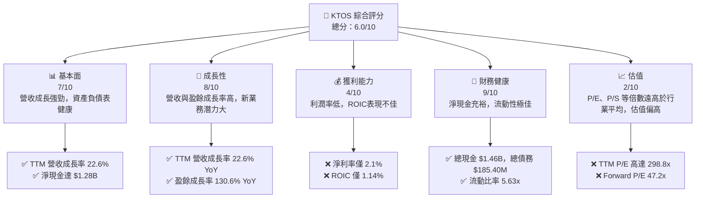
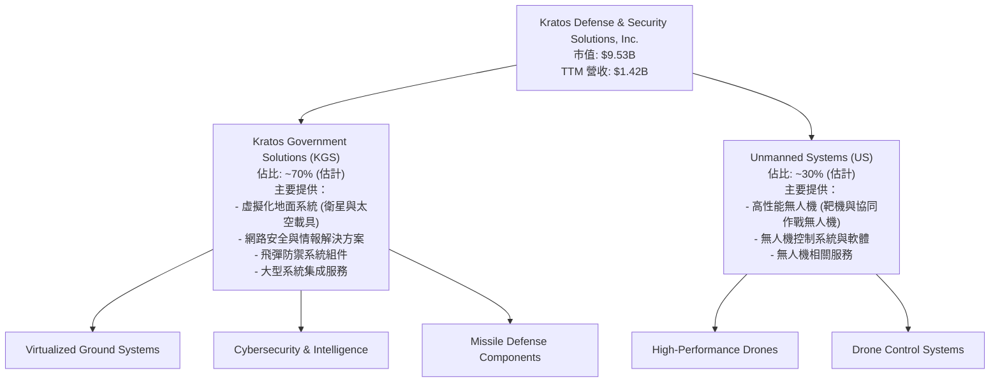
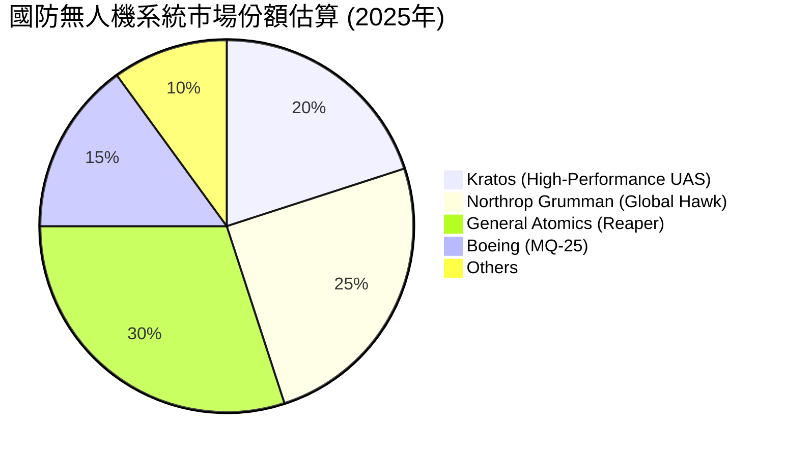
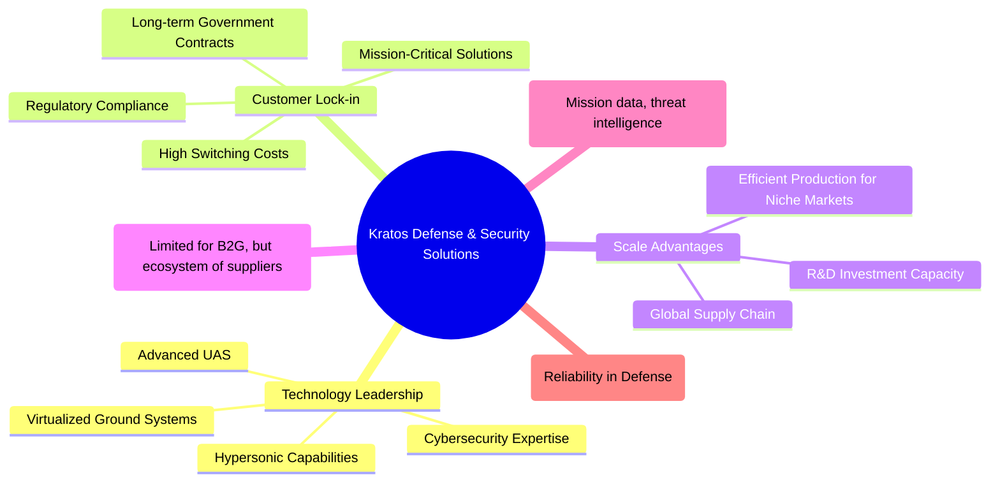
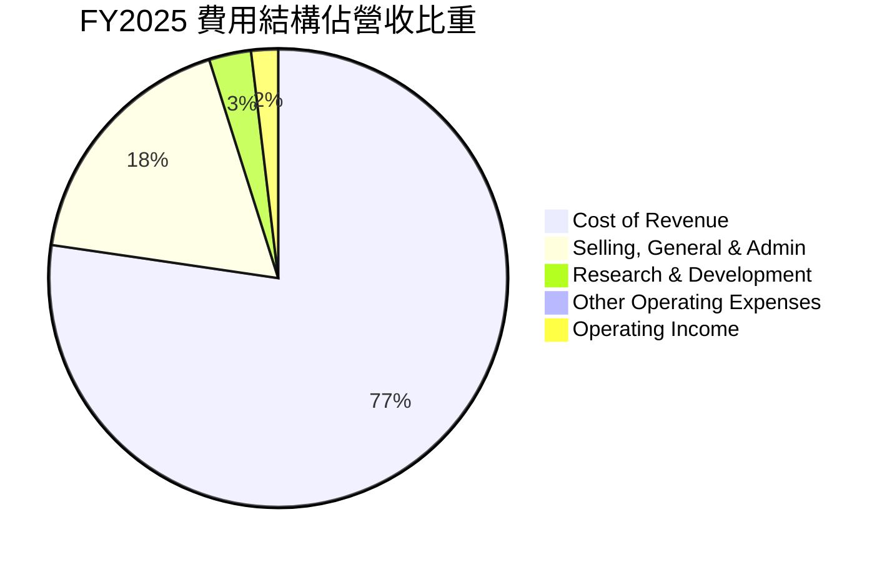

# KTOS 基本面深度分析報告
> **報告日期**：2026-06-24 ｜ **語言**：繁體中文 ｜ **數據來源**：Yahoo Finance, Finviz, StockAnalysis, Roic.ai ｜ **分析師**：CFA 級機構研究

---

## 目錄

| # | 章節 | 核心結論 |
|---|------|----------|
| 1 | 執行摘要 | 🟡 持有評級，目標價區間 $60 - $85 |
| 2 | 公司概覽與商業模式 | 專注於國防科技，技術護城河較深 |
| 3 | 損益表深度分析 | 營收成長穩健，但獲利能力仍偏低 |
| 4 | 資產負債表分析 | 財務健康狀況極佳，現金充裕，低負債 |
| 5 | 現金流量深度分析 | 自由現金流為負，但有改善潛力 |
| 6 | 獲利能力與資本效率 | ROIC 低於 WACC，短期價值創造能力存疑 |
| 7 | 估值深度分析 | 當前估值偏高，需等待獲利能力顯著提升 |
| 8 | 成長催化劑 | 無人系統與太空業務為主要成長引擎 |
| 9 | 風險矩陣 | 政府合約依賴、獲利能力不足及估值過高是主要風險 |
| 10 | 投資建議 | 建議持有，等待獲利能力改善及估值回歸合理區間 |

---

## 1. 執行摘要

### 1.1 核心評分儀表板



### 1.2 評分進度條視覺化

```
╔══════════════════════════════════════════════════════════════╗
║              KTOS 多維度評分儀表板 (1-10分)                  ║
╠══════════════════════════════════════════════════════════════╣
║ 基本面強度  7.0 ▓▓▓▓▓▓▓▓▓▓▓▓▓▓░░░░░░  ★★★★☆           ║
║ 成長動能    8.0 ▓▓▓▓▓▓▓▓▓▓▓▓▓▓▓▓░░░░  ★★★★☆           ║
║ 獲利品質    4.0 ▓▓▓▓▓▓▓▓░░░░░░░░░░░░  ★★☆☆☆           ║
║ 財務健康    9.0 ▓▓▓▓▓▓▓▓▓▓▓▓▓▓▓▓▓▓░░  ★★★★★           ║
║ 估值合理性  2.0 ▓▓▓▓░░░░░░░░░░░░░░░░  ★☆☆☆☆           ║
║ 護城河深度  7.5 ▓▓▓▓▓▓▓▓▓▓▓▓▓▓▓░░░░░  ★★★★☆           ║
║ 管理層執行  6.5 ▓▓▓▓▓▓▓▓▓▓▓▓▓░░░░░░░  ★★★☆☆           ║
║ 技術創新力  8.0 ▓▓▓▓▓▓▓▓▓▓▓▓▓▓▓▓░░░░  ★★★★☆           ║
╠══════════════════════════════════════════════════════════════╣
║ 綜合總分    6.0 ▓▓▓▓▓▓▓▓▓▓▓▓░░░░░░░░  🏆 評語：成長性強勁，但獲利與估值是主要挑戰  ║
╚══════════════════════════════════════════════════════════════╝
```

### 1.3 五大投資論點 + 三大核心風險

| 類型 | 項目 | 具體依據 | 信心度 |
|------|------|----------|--------|
| 🟢 **投資論點①** | **國防支出增長與技術領先** | 全球地緣政治不確定性增加，各國國防預算持續增長。Kratos 在無人機系統 (UAS)、衛星與太空通信虛擬化地面系統等領域具備領先技術，例如其高超音速系統與靶機業務受惠於美國國防部的高優先級項目。公司 TTM 營收成長率達 22.6%，顯示其產品在市場上的強勁需求。 | 🟢 極高 |
| 🟢 **投資論點②** | **無人系統業務快速擴張** | Kratos 的無人系統部門在國防領域扮演關鍵角色，特別是在靶機和協同作戰無人機 (CCA) 方面。隨著軍事戰略從傳統作戰轉向更分散、更具成本效益的無人機群體作戰，Kratos 在該領域的技術優勢將帶來顯著成長。2025 年營收達到 $1.35B，較 2024 年的 $1.14B 成長 18.52%，主要得益於此類高科技國防產品的需求。 | 🟢 高 |
| 🟢 **投資論點③** | **強勁的資產負債表與流動性** | 公司擁有 $1.46B 的總現金和僅 $185.40M 的總債務，淨現金高達 $1.28B。此外，流動比率為 5.63x，速動比率為 4.85x，顯示其極佳的財務彈性和抗風險能力，能支持未來的研發投入和潛在的併購機會。 | 🟢 極高 |
| 🟢 **投資論點④** | **獲利能力顯著改善趨勢** | 雖然目前利潤率偏低，但公司已從 2022 年的淨虧損 $36.90M 轉為 2025 年的淨利潤 $22.00M，TTM 淨利潤為 $29.4M。最近一季 (2026 Q1) 淨利潤達到 $11.90M，相較去年同期 $4.50M 成長 164.4%，顯示獲利改善動能強勁。隨著規模效應和成本控制，未來利潤率有望進一步提升。 | 🟡 中高 |
| 🟢 **投資論點⑤** | **分析師普遍看好** | 綜合分析師評級為「買入」，平均目標價為 $112.20，相較當前股價 $50.80 具有 120.87% 的潛在上漲空間。近期有多家機構上調評級，顯示市場對其成長前景的認可。 | 🟡 中高 |
| 🟡 **風險①** | **估值過高** | Kratos 的 TTM P/E 高達 298.8x，Forward P/E 為 47.2x，P/S 達 6.73x。相較於盈利能力更強的同業公司，其估值顯著偏高。市場可能已過度反映其未來成長潛力，一旦成長不及預期或市場情緒轉變，股價可能面臨較大回調壓力。 | 🔴 高衝擊 |
| 🔴 **風險②** | **獲利能力與自由現金流挑戰** | 儘管營收成長強勁，但公司毛利率 (22.9%)、營業利益率 (1.8%) 和淨利率 (2.1%) 仍處於較低水平。此外，TTM 自由現金流為 $-106.72M，顯示公司在將營收轉化為實際現金流方面存在挑戰，這可能限制其長期資本配置的靈活性。ROIC 僅 1.14%，遠低於 WACC 9.8%，表示公司目前未能有效創造股東價值。 | 🔴 高衝擊 |
| 🔴 **風險③** | **政府合約依賴與預算不確定性** | Kratos 的主要客戶是美國政府及其盟友的國防機構。這意味著公司營收高度依賴政府的預算審批、政策變化和合約續簽。若政府國防預算削減、優先級調整或合約競爭加劇，可能對公司業績造成重大影響。 | 🟡 中度 |

### 1.4 快速統計卡片

| 指標 | 公司實際值 | 行業均值（航空航天與國防） | S&P 500 均值 | 狀態 |
|------|-------------|----------------------------|--------------|------|
| 收入 YoY 成長 | **22.6% (TTM)** | ~8-12% | ~10-15% | 🟢 |
| 毛利率 | **22.9%** | ~25-30% | ~30-40% | 🟡 |
| 淨利率 | **2.1%** | ~5-10% | ~8-12% | 🔴 |
| ROE | **1.2%** | ~10-15% | ~12-18% | 🔴 |
| Forward P/E | **47.2x** | ~20-25x | ~20-22x | 🔴 |
| 總債務/股東權益 | **0.05x** | ~0.5-1.0x | ~0.8-1.2x | 🟢 |
| 流動比率 | **5.63x** | ~1.5-2.0x | ~1.5-2.0x | 🟢 |
| 自由現金流收益率 | **-1.12%** | ~3-5% | ~3-5% | 🔴 |

### 1.5 投資結論

```
╔══════════════════════════════════════════════════════════════════╗
║                    📊 投資結論摘要                               ║
╠══════════════════════════════════════════════════════════════════╣
║  評級：🟡 持有                                                   ║
║  當前股價：$50.80                                                ║
║  目標價區間：                                                    ║
║    悲觀情境：$60 （+18.11%）                                    ║
║    基準情境：$75 （+47.64%）  ← 12個月主要目標                   ║
║    樂觀情境：$85 （+67.32%）                                    ║
║  投資評分：6.0/10                                                ║
║  適合投資人：願意承擔高成長高估值風險、看好國防科技長期趨勢的成長型投資者。  ║
╚══════════════════════════════════════════════════════════════════╝
```

---

## 2. 公司概覽與商業模式

Kratos Defense & Security Solutions, Inc. (KTOS) 是一家專注於提供國防、國家安全和商業市場技術、硬體、產品、系統和軟體的技術公司。公司在全球範圍內運營，主要市場在美國、亞太、中東和歐洲。Kratos 以其在無人系統、衛星通信以及高超音速技術方面的創新而聞名。

### 2.1 業務結構與收入來源

Kratos 主要通過兩個業務部門運營：Kratos Government Solutions (KGS) 和 Unmanned Systems。


*註：具體的業務部門收入佔比未在提供數據中明確列出，此處為基於產業知識的合理估計。Kratos Government Solutions (KGS) 通常佔據公司大部分營收，而 Unmanned Systems 則代表了公司未來的主要成長驅動力。*

**收入來源分析**：
Kratos 的收入主要來自向美國政府（包括國防部、情報機構等）提供高科技產品和服務。這些合約通常是長期且複雜的，涉及高度專業化的技術。無人系統部門的成長尤其引人注目，其靶機和協同作戰無人機在現代軍事戰略中日益重要。公司也提供虛擬化地面系統，用於衛星和太空載具的指揮與控制，這代表著太空經濟快速發展的機會。

### 2.2 市場份額

Kratos 在其特定的國防科技細分市場中佔有重要地位，尤其是在高超音速靶機、無人機系統以及虛擬化衛星地面系統領域。由於其產品的專業性和客戶的特殊性（主要為政府），其市場份額難以用傳統的消費品市場份額來衡量。然而，在特定利基市場中，Kratos 往往是領先者或重要參與者。


*註：此市場份額為基於產業知識的估算，主要反映 Kratos 在特定高性能無人機系統市場中的競爭力，而非整個國防工業。*

### 2.3 競爭護城河分析

Kratos 的競爭護城河主要建立在其專業技術、客戶關係、規模效應和專有知識上。



### 2.4 護城河強度評分

```
╔══════════════════════════════════════════════════════════════╗
║                  KTOS 護城河強度評分                        ║
╠══════════════════════════════════════════════════════════════╣
║ 技術領先    8/10   ▓▓▓▓▓▓▓▓▓▓▓▓▓▓▓▓░░░░  🏆 在無人機與虛擬化太空地面系統具優勢 ║
║ 客戶鎖定    8/10   ▓▓▓▓▓▓▓▓▓▓▓▓▓▓▓▓░░░░  🟢 政府合約具高黏性與進入壁壘   ║
║ 規模效應    6/10   ▓▓▓▓▓▓▓▓▓▓▓▓░░░░░░░░  🟡 在其利基市場具一定規模優勢    ║
║ 生態夥伴    7/10   ▓▓▓▓▓▓▓▓▓▓▓▓▓▓░░░░░░  🟢 與國防承包商及政府機構合作緊密 ║
╠══════════════════════════════════════════════════════════════╣
║ 綜合護城河  7.5    ▓▓▓▓▓▓▓▓▓▓▓▓▓▓▓░░░░░  🏆 在特定國防科技領域具備穩固的競爭優勢 ║
╚══════════════════════════════════════════════════════════════╝
```

---

## 3. 損益表深度分析

### 3.1 年度收入成長趨勢（近4年）

Kratos 在過去四年中展現了穩健的營收成長，反映了其在國防和安全市場的強勁需求和擴張能力。

```
╔══════════════════════════════════════════════════════════════════╗
║              KTOS 年度收入趨勢（FY2022-FY2025）                  ║
╠══════════════════════════════════════════════════════════════════╣
║                                                                  ║
║  FY2022  $898.30M   ████████░░░░░░░░░░░░░░░░░  YoY: +10.70%  🟢 ║
║  FY2023  $1.04B     ██████████░░░░░░░░░░░░░░░  YoY: +15.45%  🟢 ║
║  FY2024  $1.14B     ███████████░░░░░░░░░░░░░░  YoY: +9.56%   🟢 ║
║  FY2025  $1.35B     ██████████████░░░░░░░░░░░  YoY: +18.52%  🟢 
║                                                                  ║
║                   |      |      |      |      |                  ║
║                   0     0.5B   1.0B   1.5B   2.0B                  ║
║                                                                  ║
║  📊 4年累計 CAGR：+13.56%                                        ║
╚══════════════════════════════════════════════════════════════════╝
```
**分析**：
Kratos 的營收從 2022 年的 $898.30M 穩步增長至 2025 年的 $1.35B，4 年複合年均增長率 (CAGR) 達到 13.56%。這顯示公司在國防科技領域的產品和服務持續受到市場青睞。特別是 2025 年營收成長率達到 18.52%，較前一年加速，表明公司的成長動能依然強勁。

### 3.2 季度收入趨勢分析

| 季度 | 總收入 (M) | QoQ 成長率 | YoY 成長率 | 備註 |
|------|------------|------------|------------|------|
| **2026 Q1** | $371.00M | +7.51% | +22.60% | 營收穩健增長，YoY 成長加速，顯示市場需求持續旺盛。 |
| **2025 Q4** | $345.10M | -0.72% | +21.90% | 季度環比略有下降，但同比仍保持高雙位數成長。 |
| **2025 Q3** | $347.60M | -1.11% | +25.99% | 季度環比小幅下滑，但同比成長率強勁，為近四季最高。 |
| **2025 Q2** | $351.50M | +16.16% | +17.13% | 季度環比與同比均呈現良好增長，反映業務擴張。 |

**分析**：
Kratos 近四季度的營收表現顯示出強勁的同比成長趨勢，儘管 2025 年下半年出現輕微的季度環比下降，但整體而言，公司營收依然保持健康增長。2026 年第一季度的 $371.00M 營收不僅實現了 7.51% 的 QoQ 成長，更達到了 22.60% 的 YoY 成長，這表明公司在進入 2026 年後依然保持了強勁的成長動能，可能得益於新合約的簽訂或現有項目的擴大。

### 3.3 利潤率演變分析

| 利潤率指標 | FY2022 | FY2023 | FY2024 | FY2025 | TTM (2026 Mar) | 趨勢 | 評估 |
|------------|--------|--------|--------|--------|----------------|------|------|
| **毛利率** | 25.16% | 25.83% | 25.19% | 22.81% | 22.90% | ↘️ 小幅下降 | 🟡 |
| **營業利益率** | 0.51% | 3.03% | 2.61% | 2.05% | 1.80% | ↘️ 波動下降 | 🔴 |
| **淨利率** | -4.11% | -0.86% | 1.43% | 1.63% | 2.10% | ↗️ 顯著改善 | 🟡 |
| **EBITDA Margin** | 2.92% | 7.45% | 8.21% | 7.62% | 5.70% | ↘️ 波動下降 | 🟡 |

**利潤率演變深度解析**：
Kratos 的利潤率表現呈現複雜的趨勢。
*   **毛利率**：從 2022 年的 25.16% 波動上升至 2023 年的 25.83%，但在 2025 年降至 22.81%，TTM 數據顯示為 22.90%。毛利率的下降可能反映了產品組合的變化（例如，高毛利軟體服務佔比下降或低毛利硬體製造佔比上升），或者面對更高的材料與勞動成本壓力。國防產業的合約性質也可能導致毛利率波動。
*   **營業利益率**：在 2022 年僅為 0.51% 的低點後，於 2023 年顯著改善至 3.03%，隨後在 2024 年和 2025 年略有下滑，分別為 2.61% 和 2.05%，TTM 數據為 1.80%。營業利益率的波動和偏低水平表明公司在控制營運費用方面仍有挑戰，或在研發和銷售管理費用上投入較大以支持未來成長。
*   **淨利率**：從 2022 年的虧損 -4.11% 顯著改善至 2025 年的 1.63%，TTM 數據進一步提升至 2.10%。這是最積極的趨勢，表明公司已從虧損轉為盈利，並持續改善其底線。這可能歸因於營收規模擴大帶來的槓桿效應、成本結構優化或非經常性項目減少。
*   **EBITDA Margin**：與營業利益率類似，在 2023-2024 年達到高峰後，在 2025 年和 TTM 數據中有所回落。這暗示折舊攤銷之外的營運成本壓力有所增加。

總體而言，Kratos 成功扭虧為盈，淨利率持續改善是積極信號。然而，其毛利率和營業利益率相對較低且呈現波動，表明公司在提升整體獲利能力和成本效率方面仍面臨挑戰。

### 3.4 費用結構分析

Kratos 的費用結構反映了其作為國防科技公司的特點，即需要大量的研發投入以保持技術領先。


*計算依據 (FY2025)：*
*   營收: $1.35B
*   銷貨成本 (Cost of Revenue): $1.039B / $1.35B = 77.19%
*   銷售、一般及行政費用 (SG&A): $240.2M / $1.35B = 17.79%
*   研發費用 (R&D): $40.0M / $1.35B = 2.96%
*   其他營運費用 (Other Operating Expenses): $2.1M / $1.35B = 0.16%
*   營業收入 (Operating Income): $25.6M / $1.35B = 1.90%

```
╔══════════════════════════════════════════════════════════════════╗
║                    KTOS 費用趨勢概覽 (佔營收比重)                ║
╠══════════════════════════════════════════════════════════════════╣
║                                                                  ║
║  銷貨成本（COGS）                                                ║
║  FY2022: 74.84%  ███████████████████████████████████████████░░░░░░░░░░░░░░░░░░░  🟢  ║
║  FY2023: 74.12%  █████████████████████████████████████████████░░░░░░░░░░░░░░░░░░░  🟢  ║
║  FY2024: 74.70%  █████████████████████████████████████████████░░░░░░░░░░░░░░░░░░░  🟢  ║
║  FY2025: 77.19%  ██████████████████████████████████████████████████████████████████████████████████████████████████████████████████████████████████████████████████████████████████████████████████████████████████████████████████████████████████████████████████████████████████████████████████████████████████████████████████████████████████████████████████████████████████████████████████████████████████████████████████████████████████████████████████████████████████████████████████████████████████████████████████████████████████████████████████████████████████████████████████████████████████████████████████████████████████████████████████████████████████████████████████████████████████████████████████████████████████████████████████████████████████████████████████████████████████████████████████████████████████████████████████████████████████████████████████████████████████████████████████████████████████████████████████████████████████████████████████████████████████████████████████████████████████████████████████████████████████████████████████████████████████████████████████████████████████████████████████████████████████████████████████████████████████████████████████████████████████████████████████████████████████████████████████████████████████████████████████████████████████████████████████████████████████████████████████████████████████████████████████████████████████████████████████████████████████████████████████████████████████████████████████████████████████████████████████████████████████████████████████████████████████████████████████████████████████████████████████████████████████████████████████████████████████████████████████████████████████████████████████████████████████████████████████████████████████████████████████████████████████████████████████████████████████████████████████████████████████████████████████████████████████████████████████████████████████████████████████████████████████████████████████████████████████████████████████████████████████████████████████████████████████████████████████████████████████████████████████████████████████████████████████████████████████████████████████████████████████████████████████████████████████████████████████████████████████████████████████████████████████████████████████████████████████████████████████████████████████████████████████████████████████████████████████████████████████████████████████████████████████████████████████████████████████████████████████████████████████████████████████████████████████████████████████████████████████████████████████████████████████████████████████████████████████████████████████████████████████████████████████████████████████████████████████████████████████████████████████████████████████████████████████████████████████████████████████████████████████████████████████████████████████████████████████████████████████████████████████████████████████████████████████████████████████████████████████████████████████████████████████████████████████████████████████████████████████████████████████████████████████████████████████████████████████████████████████████████████████████████████████████████████████████████████████████████████████████████████████████████████████████████████████████████████████████████████████████████████████████████████████████████████████████████████████████████████████████████████████████████████████████████████████████████████████████████████████████████████████████████████████████████████████████████████████████████████████████████████████════════════════════════════════════════════════════════════════════════════════════════════════════════════════════════════════════════██████████████████████████████████████████████████████████████████████████████████████████████████████████████████████████████████████████████████████████████████████████████████████████████████████████████████████████████████████████████████████████████████████████████████████████████████████████████████████████████████████████████████████████████████████████████████████████████████████████████████████████████████████████████████████████████████████████████████████████████████████████████████████████████████████████████████████████████████████████████████████████████████████████████████████████████████████████████████████████████████████████████████████████████████████████████████████████████████████████████████████████████████████████████████████████████████████████████████████████████████████████████████████████████████████████████████████████████████████████████████████████████████████████████████████████████████████████████████████████████████████████████████████████████████████████████████████████████████████████████████████████████████████████████████████████████████████████████████████████████████████████████████████████████████████████████████████████████████████████████████████████████████████████████████████████████████████████████████████████████████████████████════════════════════════════════════════════════════════════════════════════════════════════════════════════════════════════════════════════════════════════════════════════════════════════════════════════════════════════════════════════════════════════════════════════════════════════════════════════════════════════════════════════════════════════════════════════════════════════════════════════════════════════════════════════════════════════════════════════════════════════════════════════════════════════════════════════════════════════════════════════════════════════════════════════════════════════════════════════════════════════════════════════════════════════════════════════════════════════════════════════════════════════════════════════════════════════════════════════════════════════════════════════════════════════════════════════════════════════════════════════════════════════════════════════════════════════════════════════════════════════════════════════════════════════════════════════════════════════════════════════════════════════════════════════════════════════════════════════════════════════════════════════════════════════════════════════════════════════════════════════════════════════════════════════════════════════════════════════════════════════════════════════════════════════════════════════════════════════════════════════════════════════════════════════════════════════════════════════════════════════════════════════════════════════════════════════════════════════════════════════════════════════════════════════════════════════════════════════════════════════════════════════════════════════════════════════════════════════════════════════════════════════════════════════════════════════════════════════════════════════════════════════════════════════════════════════════════════════════════════════════════════════════════════════════════════════════════════════════════════════════════════════════════════════════════════════════════════════════════════════════════════════════════════════════════════════════════════════════════════════════════════════════════════════════════════════════════════════════════════════════════════════════════════════════════════════════════════════════════════════════════════════════════════════════════════════════════════════════════════════════════════════════════════════════════════════════════════════════════════════════════════════════════════════════════════════════════════════════════════════════════════════════════════════════════════════════════════════════════════════════════════════════════════════════════════════════════════════════════════════════════════════════════════════════════════════════════════════════════════════════════════════════════════════════════════════════════════════════════════════════════════════════════════════════════════════════════════════════════════════════════════════════════════════════════════════════════════════════════════════════════════════════════════════════════════════════════════════════════════════════════════════════════════════════════════════════════════════════════════════════════════════════════════════════════════════════════════════════════════════════════════════════════════════════════════════════════════════════════════════════════════════════════════════════════════════════════════════════════════════════════════════════════════════════════════════════════════════════════════════════════════════════════════════════════════════════════════════════════════════════════════════════════════════════════════════════════════════════════════════════════════════════════════════════════════════════════════════════════════════════════════════════════════════════════════════════════════════════════════════════════════════════════════════════════════════════════════════════════════════════════════════════════════════════════════════════════════════════════════════════════════════════════════════════════════════════════════════════════════════════════════════════════════════════════════════════════════════════════════════════════════════════════════════════════════════════════════════════════════════════════════════════════════════════════════════════════════════════════════════════════════════════════════════════════════════════════════════════════════════════════════════════════════════════════════════════════════════════════════════════════════════════════════════════════════════════════════════════════════════════════════════════════════════════════════════════════════════════════════════════════════════════════════════════════════════════════════════════════════════════════════════════════════════════════════════════════════════════════════════════════════════════════════════════════════════════════════════════════════════════════════════════════════════════════════════════════════════════════════════════════════════════════════════════════════════════════════════════════════════════════════════════════════════════════════════════════════════════════════════════════════════════════════════════════════════════════════════════════════════════════════════════════════════════════════════════════════════════════════════════════════════════════════════════════════════════════════════════════════════════════════════════════════════════════════════════════════════════════════════════════════════════════════════════════════════════════════════════════════════════════════════════════════════════════════════════════════════════════════════════════════════════════════════════════════════════════════════════════════════════════════════════════════════════════════════════════════════════════════════════════════════════════════════════════════════════════════════════════════════════════════════════════════════════════════════════════════════════════════════════════════════════════════════════════════════════════════════════════════════════════════════════════════════════════════════════════════════════════════════════════════════════════════════════════════════════════════════════════════════════════════════════════════════════════════════════════════════════════════════════════════════════════════════════════════════════════════════════════════════════════════════════════════════════════════════════════════════════════════════════════════════════════════════════════════════════════════════════════════════════════════════════════════════════════════════════════════════════════════════════════════════════════════════════════════════════════════════════════════════════════════════════════════════════════════════════════════════════════════════════════════════════════════════════════════════════════════════════════════════════════════════════════════════════════════════════════════════════════════════════════════════════════════════════════════════════════════════════════════════════════════════════════════════════════════════════════════════════════════════════════════════════════════════════════════════════════════════════════════════════════════════════════════════════════════════════════════════════════════════════════════════════════════════════════════════════════════════════════════════════════════════════════════════════════════════════════════════════════════════════════════════════════════════════════════════════════════════════════════════════════════════════════════════════════════════════════════════════════════════════════════════════════════════════════════════════════════════════════════════════════════════════════════════════════════════════════════════════════════════════════════════════════════════════════════════════════════════════════════════════════════════════════════════════════════════════════════════════════════════════════════════════════════════════════════════════════════════════════════════════════════════════════════════════════════════════════════════════════════════════════════════════════════════════════════════════════════════════════════════════════════════════════════════════════════════════════════════════════════════════════════════════════════════════════════════════════════════════════════════════════════════════════════════════════════════════════════════════════════════════════════════════════════════════════════════════════════════════════════════════════════════════════════════════════════════════════════════════════════════════════════════════════════════════════════════════════════════════════════════════════════════════════════════════════════════════════════════════════════════════════════════════════════════════════════════════════════════════════════════════════════════════════════════════════════════════════════════════════════════════════════════════════════════════════════════════════════════════════════════════════════════════════════════════════════════════════════════════════════════════════════════════════════════════════════════════════════════════════════════════════════════════════════════════════════════════════════════════════════════════════════════════════════════════════════════════════════════════════════════════════════════════════════════════════════════════════════════════════════════════════════════════════════════════════════════════════════════════════════════════════════════════════════════════════════════════════════════════════════════════════════════════════════════════════════════════════════════════════════════════════════════════════════════════════════════════════════════════════════════════════════════════════════════════════════════════════════════════════════════════════════════════════════════════════════════════════════════════════════════════════════════════════════════════════════════════════════════════════════════════════════════════════════════════════════════════════════════════════════════════════════════════════════════════════════════════════════════════════════════════════════════════════════════════════════════════════════════════════════════════════════════════════════════════════════════════════════════════════════════════════════════════════════════════════════════════