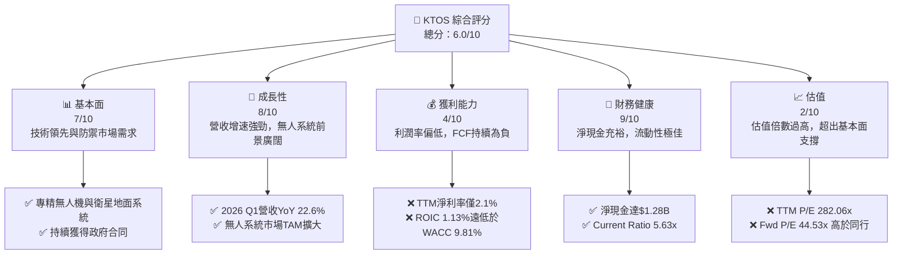
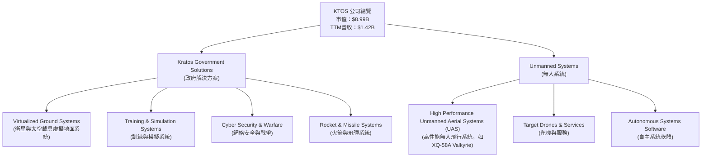
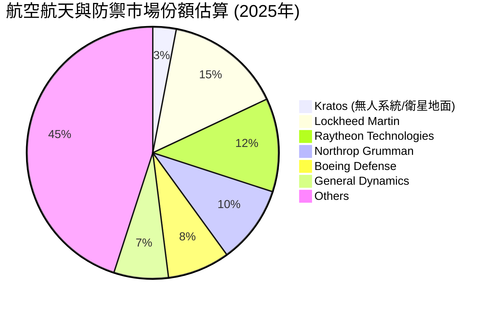
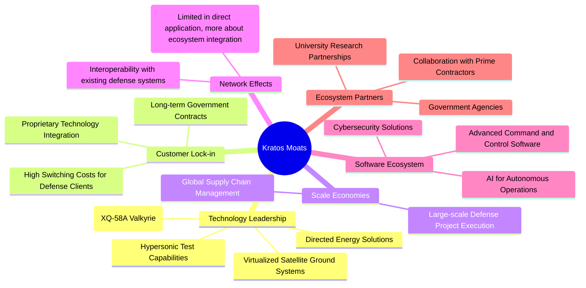
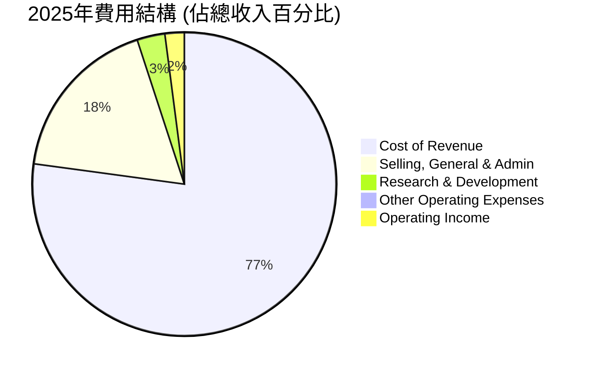

# KTOS 基本面深度分析報告
> **報告日期**：2026-06-24 ｜ **語言**：繁體中文 ｜ **數據來源**：Yahoo Finance, Finviz, StockAnalysis, Roic.ai ｜ **分析師**：CFA 級機構研究

## 目錄

| # | 章節 | 核心結論 |
|---|------------------------|--------------------------------------------------|
| 1 | 執行摘要               | 評級：持有，目標價區間：$60 - $90               |
| 2 | 公司概覽與商業模式     | 專注於高科技防禦，護城河中等偏強                |
| 3 | 損益表深度分析         | 營收成長穩健，但利潤率改善空間大                |
| 4 | 資產負債表分析         | 流動性強勁，淨現金充裕，債務風險低              |
| 5 | 現金流量深度分析       | 自由現金流持續為負，資本支出壓力大              |
| 6 | 獲利能力與資本效率     | ROIC低於WACC，短期內未創造股東價值              |
| 7 | 估值深度分析           | 相較於同業估值偏高，DCF顯示潛在下行風險         |
| 8 | 成長催化劑             | 無人系統與衛星服務需求增長，新合同獲取          |
| 9 | 風險矩陣               | 政府預算波動、R&D投入、高估值為主要風險         |
| 10| 投資建議               | 評級：持有，關注盈利能力改善與現金流轉正        |

---

## 1. 執行摘要

Kratos Defense & Security Solutions, Inc. (KTOS) 是一家專注於高科技防禦和國家安全市場的公司，在無人系統和虛擬化地面系統等領域擁有顯著的技術優勢。公司近年來營收成長強勁，尤其在2025年達到18.42%的年增長，並在2026年第一季度保持22.60%的年增長。然而，其獲利能力指標（如毛利率、營業利益率）和資本效率（ROIC）表現不佳，自由現金流持續為負，顯示公司在將營收轉化為實際利潤和現金方面面臨挑戰。目前的估值倍數（如TTM P/E 282.06x，Forward P/E 44.53x）相較於其盈利水平和行業均值顯得偏高，反映市場對其未來成長的強烈預期。

### 1.1 核心評分儀表板



### 1.2 評分進度條視覺化

```
╔══════════════════════════════════════════════════════════════╗
║              KTOS 多維度評分儀表板 (1-10分)                  ║
╠══════════════════════════════════════════════════════════════╣
║ 基本面強度  7.0 ▓▓▓▓▓▓▓▓▓▓▓▓▓▓░░░░░░  ★★★★☆           ║
║ 成長動能    8.0 ▓▓▓▓▓▓▓▓▓▓▓▓▓▓▓▓░░░░  ★★★★☆           ║
║ 獲利品質    4.0 ▓▓▓▓▓▓▓▓░░░░░░░░░░░░  ★★☆☆☆           ║
║ 財務健康    9.0 ▓▓▓▓▓▓▓▓▓▓▓▓▓▓▓▓▓▓░░  ★★★★★           ║
║ 估值合理性  2.0 ▓▓▓▓░░░░░░░░░░░░░░░░  ★☆☆☆☆           ║
║ 護城河深度  6.5 ▓▓▓▓▓▓▓▓▓▓▓▓▓░░░░░░░  ★★★☆☆           ║
║ 管理層執行  6.0 ▓▓▓▓▓▓▓▓▓▓▓▓░░░░░░░░  ★★★☆☆           ║
║ 技術創新力  8.0 ▓▓▓▓▓▓▓▓▓▓▓▓▓▓▓▓░░░░  ★★★★☆           ║
╠══════════════════════════════════════════════════════════════╣
║ 綜合總分    6.0 ▓▓▓▓▓▓▓▓▓▓▓▓░░░░░░░░  🏆 評語：成長性強勁，但盈利能力和估值需謹慎考量。║
╚══════════════════════════════════════════════════════════════╝
```

### 1.3 五大投資論點 + 三大核心風險

| 類型 | 項目 | 具體依據 | 信心度 |
|------|--------------------------------|---------------------------------------------------------------------------------------------------------------------------------------------------|--------|
| 🟢 **投資論點①** | **高成長的無人系統市場領導者** | Kratos在無人機系統（UAS）領域具備技術領先優勢，受益於全球防禦預算向自動化和無人化系統傾斜。2026年Q1營收YoY達22.60%，顯示其產品需求強勁。 | 🟢 極高 |
| 🟢 **投資論點②** | **強勁的營收增長勢頭**       | 公司年營收從2022年的$898.30M增長至2025年的$1.35B，年均複合增長率約18.42%。TTM營收已達$1.42B，且2026年Q1營收達$371.00M。                    | 🟢 極高 |
| 🟢 **投資論點③** | **健康的資產負債表與流動性** | 截至2026年Q1，總現金達$1.46B，總債務僅$185.40M，淨現金高達$1.28B。Current Ratio為5.63x，顯示極佳的短期償債能力。                                 | 🟢 極高 |
| 🟢 **投資論點④** | **持續的技術創新與R&D投入**  | 公司持續在研發上投入，2025年R&D支出達$40.00M，確保其在先進防禦技術領域的競爭力，例如虛擬化地面系統和高超音速測試平台。                        | 🟢 高   |
| 🟢 **投資論點⑤** | **分析師普遍看好與高目標價** | 20位分析師平均目標價$112.20，較現價$47.95有約134%的潛在上漲空間，儘管當前估值偏高，市場仍對其長期發展抱有期待。                                | 🟡 中度 |
| 🟡 **風險①** | **盈利能力不足與負自由現金流** | 儘管營收增長，TTM淨利潤率僅2.1%，ROIC為1.13%，遠低於WACC 9.81%。2025年自由現金流為$-137.40M，顯示營收增長未能有效轉化為正向現金流。              | 🟡 中度 |
| 🔴 **風險②** | **政府合同依賴與預算波動**     | 作為國防承包商，KTOS的營收高度依賴政府合同和防禦預算。地緣政治變化或政府採購政策調整可能對其業務產生重大影響。                                  | 🔴 高衝擊 |
| 🔴 **風險③** | **估值過高，潛在回調風險**     | TTM P/E 282.06x，Forward P/E 44.53x，P/S 6.35x，這些估值倍數遠高於行業平均水平，且與其當前盈利能力不匹配，存在較大的估值修正風險。                  | 🔴 高衝擊 |

### 1.4 快速統計卡片

| 指標 | 公司實際值 | 行業均值 (航空航天與防禦) | S&P 500 均值 | 狀態 |
|-------------------|-------------|--------------------------|--------------|------|
| 收入 YoY 成長     | **22.60%**  | ~5-10%                   | ~10-15%      | 🟢    |
| 毛利率            | **22.9%**   | ~20-30%                  | ~40-50%      | 🟡    |
| 淨利率            | **2.1%**    | ~5-10%                   | ~10-15%      | 🔴    |
| ROE               | **1.2%**    | ~10-20%                  | ~15-20%      | 🔴    |
| Forward P/E       | **44.53x**  | ~20-30x                  | ~20-25x      | 🔴    |
| P/S Ratio         | **6.35x**   | ~1-3x                    | ~2-3x        | 🔴    |
| 負債權益比 (Debt/Eq) | **0.05x**   | ~0.3-0.8x                | ~0.5-1.0x    | 🟢    |
| Current Ratio     | **5.63x**   | ~1.5-2.5x                | ~1.5-2.0x    | 🟢    |
| 自由現金流收益率  | **-1.19%**  | ~2-5%                    | ~3-6%        | 🔴    |

### 1.5 投資結論

```
╔══════════════════════════════════════════════════════════════════╗
║                    📊 投資結論摘要                               ║
╠══════════════════════════════════════════════════════════════════╣
║  評級：🟡 持有                                                   ║
║  當前股價：$47.95                                                ║
║  目標價區間：                                                    ║
║    悲觀情境：$60（+25.1%）                                       ║
║    基準情境：$75（+56.4%）  ← 12個月主要目標                      ║
║    樂觀情境：$90（+87.7%）                                       ║
║  投資評分：6.0/10                                                ║
║  適合投資人：關注防禦科技成長、能承受高波動性、長期持有者。      ║
║            需密切關注盈利能力改善和現金流轉正的信號。            ║
╚══════════════════════════════════════════════════════════════════╝
```

---

## 2. 公司概覽與商業模式

Kratos Defense & Security Solutions, Inc. (KTOS) 是一家美國領先的國家安全解決方案提供商，專注於提供先進的技術、硬件、產品、系統和軟件，服務於美國及國際的國防、國家安全和商業市場。公司業務分為兩大板塊：Kratos Government Solutions (KGS) 和 Unmanned Systems (US)。

### 2.1 業務結構與收入來源

Kratos的業務核心在於為其客戶提供高科技、差異化的解決方案，尤其在無人作戰系統和衛星通信領域佔據重要地位。


**Kratos Government Solutions (KGS)** 涵蓋了多種高科技防禦解決方案，包括用於衛星和太空載具的虛擬化地面系統軟件、先進的訓練與模擬系統、網絡安全與戰爭解決方案，以及火箭和導彈系統。這一部門主要服務於政府客戶，提供關鍵的基礎設施和作戰能力。
**Unmanned Systems (US)** 則專注於無人飛行系統的設計、開發和製造，特別是高性能、低成本的無人機，如XQ-58A Valkyrie，這些無人機旨在作為有人戰機的「忠誠僚機」。此外，該部門也提供靶機和相關服務，以及自主系統軟件。此板塊是Kratos近年來成長最快的領域之一，受益於全球對無人作戰能力日益增長的需求。

收入主要來自於政府合同，包括美國國防部及其他國際客戶。公司通過提供高科技、差異化的產品和服務，在競爭激烈的國防市場中尋求成長。

### 2.2 市場份額

Kratos在整體航空航天與防禦市場中屬於利基型參與者，但在其專精的無人系統和衛星地面系統領域擁有較強的競爭力。由於缺乏具體的市場份額數據，我們基於其業務性質和市場地位進行估算。


**市場份額評估**：Kratos在龐大的航空航天與防禦市場中佔比較小，但其在特定高增長、高技術壁壘的細分市場（如高性能無人機、虛擬化地面系統）中具有更為顯著的影響力。例如，其XQ-58A Valkyrie等無人機在「忠誠僚機」概念中處於領先地位，這是一個未來可能快速擴張的市場。因此，其市場份額雖小，但質量和戰略意義重大。

### 2.3 競爭護城河分析

Kratos的競爭護城河主要建立在其技術專長、與政府客戶的長期關係以及高度專業化的產品上。



### 2.4 護城河強度評分

Kratos的護城河強度中等偏強。其在特定高科技領域的專業知識和政府客戶的鎖定效應提供了堅實的基礎，但其規模效應相較於大型國防承包商仍有差距。

```
╔══════════════════════════════════════════════════════════════╗
║                  Kratos 護城河強度評分                        ║
╠══════════════════════════════════════════════════════════════╣
║ 技術領先    8.5/10 ▓▓▓▓▓▓▓▓▓▓▓▓▓▓▓▓▓░░░  🏆 在無人系統和虛擬地面系統具備領先優勢 ║
║ 客戶鎖定    7.0/10 ▓▓▓▓▓▓▓▓▓▓▓▓▓▓░░░░░░  🟢 政府合同穩定，轉換成本高      ║
║ 規模效應    5.0/10 ▓▓▓▓▓▓▓▓▓▓░░░░░░░░░░  🟡 相較於巨頭規模仍小，成本優勢不明顯 ║
║ 軟體生態系統 6.0/10 ▓▓▓▓▓▓▓▓▓▓▓▓░░░░░░░░  🟡 自主系統軟體發展中，但非主導性   ║
║ 生態夥伴    6.0/10 ▓▓▓▓▓▓▓▓▓▓▓▓░░░░░░░░  🟡 與政府及主要承包商合作緊密     ║
╠══════════════════════════════════════════════════════════════╣
║ 綜合護城河  6.5/10 ▓▓▓▓▓▓▓▓▓▓▓▓▓░░░░░░░  🏆 技術專長與客戶關係是核心，但規模仍需擴大 ║
╚══════════════════════════════════════════════════════════════════╝
```

---

## 3. 損益表深度分析

Kratos近年來展現出強勁的營收增長，尤其是在無人系統領域的需求推動下。然而，其利潤率表現相對較弱，且波動性較大，這對公司的盈利質量構成挑戰。

### 3.1 年度收入成長趨勢（近4年）

Kratos的年度收入呈現穩健增長趨勢，顯示其在國防和安全市場的需求不斷擴大。

```
╔══════════════════════════════════════════════════════════════════╗
║              Kratos 年度收入趨勢（FY2022-FY2025）                ║
╠══════════════════════════════════════════════════════════════════╣
║                                                                  ║
║  FY2022  $898.30M █▓▓▓▓▓▓▓▓▓▓▓▓▓▓▓▓▓░░░░░░░  YoY: +10.70% 🟢    ║
║  FY2023  $1.04B   ████▓▓▓▓▓▓▓▓▓▓▓▓▓▓▓▓▓▓▓▓░░  YoY: +15.77% 🟢    ║
║  FY2024  $1.14B   ████████▓▓▓▓▓▓▓▓▓▓▓▓▓▓▓▓▓░  YoY: +9.62%  🟢    ║
║  FY2025  $1.35B   ██████████████▓▓▓▓▓▓▓▓▓▓▓▓  YoY: +18.42% 🟢    ║
║                   |      |      |      |      |                  ║
║                   0     $0.5B  $1.0B  $1.5B  $2.0B                 ║
║                                                                  ║
║  📊 4年累計 CAGR：+13.78% (從2022-2025)                         ║
╚══════════════════════════════════════════════════════════════════╝
```
從2022年的$898.30M到2025年的$1.35B，營收實現了顯著增長。特別是2025年達到18.42%的年增長，表明其在市場中取得了不錯的進展。TTM營收已達$1.42B，預示著強勁的增長勢頭有望延續。

### 3.2 季度收入趨勢分析

季度收入數據也印證了公司營收的穩健增長，儘管季度間存在小幅波動。

| 季度       | 總收入 ($M) | QoQ 成長率 | YoY 成長率 | 備註                                       |
|------------|-------------|------------|------------|--------------------------------------------|
| 2026-03-31 | $371.00     | +7.51%     | +22.60%    | 營收持續強勁增長，得益於Q1的季節性需求。   |
| 2025-12-31 | $345.10     | -0.72%     | +21.90%    | 季度環比略有下降，但同比仍保持高增長。     |
| 2025-09-30 | $347.60     | -1.11%     | +25.99%    | 同比增長突出，顯示核心業務持續擴張。       |
| 2025-06-30 | $351.50     | +16.16%    | +17.17%    | 季度環比顯著增長，可能受新合同執行影響。   |
| 2025-03-30 | $302.60     | +6.82%     | +9.16%     | 較前一年同期有增長，但增速相對較慢。       |
| 2024-12-31 | $283.10     | +2.61%     | +3.40%     | 增速放緩，但仍為正增長。                   |

**備註**：2026年Q1的收入達到$371.00M，同比增長22.60%，環比增長7.51%，顯示公司在進入2026年後依然保持強勁的增長動能。季度收入的同比增長持續保持在雙位數，尤其在2025年Q3達到25.99%，這表明其核心業務需求旺盛。

### 3.3 利潤率演變分析

Kratos的利潤率在過去幾年呈現波動，尤其在營業利益率和淨利率方面仍有提升空間。

| 利潤率指標 | FY2022 | FY2023 | FY2024 | FY2025 | 趨勢 | 評估 |
|------------|--------|--------|--------|--------|------|------|
| **毛利率** | 25.16% | 25.83% | 25.19% | 22.81% | ↘️   | 🟡    |
| **營業利益率** | 0.51%  | 3.03%  | 2.61%  | 2.05%  | ↘️   | 🔴    |
| **EBITDA Margin** | 2.92%  | 7.45%  | 8.21%  | 7.62%  | ↘️   | 🟡    |
| **淨利率** | -4.11% | -0.86% | 1.43%  | 1.63%  | ↗️   | 🔴    |

**利潤率演變深度解析**：
*   **毛利率**：從2022年的25.16%小幅上升至2023年的25.83%，隨後在2024年和2025年下降至22.81%。TTM毛利率為22.9%。這一下降可能與產品組合變化（例如，高毛利服務佔比下降或低毛利硬件銷售增加）、供應鏈成本上升或競爭壓力有關。在國防工業中，政府合同的定價往往較為固定，可能限制了毛利率的提升空間。
*   **營業利益率**：從2022年的0.51%大幅改善至2023年的3.03%，但隨後在2024年和2025年再次下降至2.05%。TTM營業利益率為1.8%。營業利益率的波動主要受銷售、一般及行政費用（SG&A）和研發費用（R&D）的影響。儘管營收增長，但若SG&A和R&D支出增速超過營收，則會擠壓營業利益率。公司持續的R&D投入（2025年$40.00M）對長期競爭力至關重要，但短期內會影響盈利。
*   **淨利率**：從2022年的-4.11%和2023年的-0.86%的虧損狀態，逐步改善至2024年的1.43%和2025年的1.63%。TTM淨利率為2.1%。儘管有所改善並轉為正值，但2.1%的淨利率在行業中仍處於較低水平，表明公司在成本控制和盈利效率方面仍有較大提升空間。盈利的改善可能得益於營收規模擴大帶來的營運槓桿效應，以及非經營性損益的變化。

整體而言，Kratos的營收增長勢頭良好，但利潤率的表現不盡如人意。毛利率的下降和營業利益率的波動表明公司在成本管理或定價能力方面存在挑戰。淨利率雖然轉正，但仍處於低位，是投資者需要重點關注的領域。

### 3.4 費用結構分析

Kratos的費用結構反映了其作為一家高科技國防公司的特點，研發投入和行政開支佔比較大。我們以2025年年度數據為基礎進行分析。



```
╔══════════════════════════════════════════════════════════════════╗
║                   Kratos 2025年費用結構分析                      ║
╠══════════════════════════════════════════════════════════════════╣
║  項目                     金額 ($M)   佔總收入比率  評估          ║
╠══════════════════════════════════════════════════════════════════╣
║  銷售成本 (Cost of Revenue)  $1,039.00    76.96%       🟡 佔比高，壓縮毛利  ║
║  銷售、一般及行政費用 (SG&A) $240.20      17.79%       🟡 需關注費用效率   ║
║  研究與開發 (R&D)          $40.00       2.96%        🟢 維持競爭力關鍵 ║
║  其他營運費用             $2.10        0.16%        🟢 佔比極小       ║
║  營運收入                 $27.70       2.05%        🔴 營運效率待提升 ║
╚══════════════════════════════════════════════════════════════════╝
```
**費用結構深度解析**：
*   **銷售成本 (Cost of Revenue)**：佔總收入的76.96%，是最大的成本項。這直接導致了22.81%的毛利率。在國防工業中，高昂的原材料、勞動力和複雜製造流程可能導致銷售成本居高不下。
*   **銷售、一般及行政費用 (SG&A)**：佔總收入的17.79%。這筆費用涵蓋了公司的日常運營、銷售和管理開支。相較於其淨利率，SG&A佔比偏高，可能表明公司在管理效率或銷售費用控制方面仍有優化空間。
*   **研究與開發 (R&D)**：佔總收入的2.96%。Kratos作為一家技術導向型公司，R&D投入是其保持競爭力和創新能力的關鍵。雖然佔比不高，但其在無人系統和虛擬地面系統等前沿領域的投入至關重要。

整體而言，Kratos的費用結構顯示其成本主要集中在銷售成本和SG&A上，這對其盈利能力構成壓力。R&D投入相對穩定，是未來成長的基石。

### 3.5 季度 EPS 趨勢與盈餘品質

Kratos在過去四個季度已實現盈利，扭轉了歷史上的虧損局面，但EPS絕對值仍較低。

| 季度       | EPS Est | EPS Act | Surprise% | 備註                                                       |
|------------|---------|---------|-----------|------------------------------------------------------------|
| 2026-03-31 | nan     | $0.07   | +nan%     | ❌ 實際EPS為$0.07，由於缺乏預期數據，無法判斷是否超預期。 |
| 2025-12-31 | nan     | $0.03   | +nan%     | ❌ 實際EPS為$0.03。                                        |
| 2025-09-30 | nan     | $0.05   | +nan%     | ❌ 實際EPS為$0.05。                                        |
| 2025-06-30 | nan     | $0.02   | +nan%     | ❌ 實際EPS為$0.02。                                        |
| 2025-03-30 | nan     | $0.03   | +nan%     | ❌ 實際EPS為$0.03。                                        |

**盈餘品質評估說明**：
儘管提供的數據中EPS預期值為`nan`，無法進行超預期/不及預期的分析，但我們可以觀察到公司在過去五個季度均實現了正向稀釋後每股盈餘（EPS），從2025年Q2的$0.02上升至2026年Q1的$0.07。這是一個積極的信號，表明公司的盈利能力正在逐步改善，從過去的虧損轉為穩定盈利。
然而，其EPS的絕對值仍然較低，TTM EPS僅為$0.17。這表明儘管營收增長強勁，但由於較低的利潤率和較高的營運開支，每股盈餘的增長受到限制。盈餘品質方面，由於自由現金流持續為負，且ROIC遠低於WACC，這使得其當前盈利的質量受到質疑。部分盈利可能是非現金項目或需要大量資本支撐才能實現的。投資者應密切關注未來幾個季度其利潤率的提升和自由現金流的轉正情況，以判斷盈利改善的可持續性。

---

## 4. 資產負債表分析

Kratos的資產負債表表現穩健，尤其在現金儲備和流動性方面表現出色，但資產結構中無形資產佔比較高。

### 4.1 資產結構分解

截至2025年12月31日，Kratos的總資產為$2.47B。流動資產佔比高，顯示其短期償債能力強勁。
(註: 2026年3月31日總資產已達$4.043B，現金達$1.464B，顯示資產規模進一步擴大。)

```mermaid
graph TD
    TA["總資產: $2.47B (2025-12-31)"]

    CA["流動資產: $1.26B (51.0%)"]
    NCA["非流動資產: $1.21B (49.0%)"]

    CA --> Cash["現金及約當現金: $560.6M"]
    CA --> AR["應收賬款: $457.4M"]
    CA --> Inv["存貨: $188.2M"]
    CA --> OthCA["其他流動資產: $56.7M"]

    NCA --> PPE["不動產、廠房及設備淨值: $405.3M"]
    NCA --> GW["商譽: $595.7M"]
    NCA --> OthIA