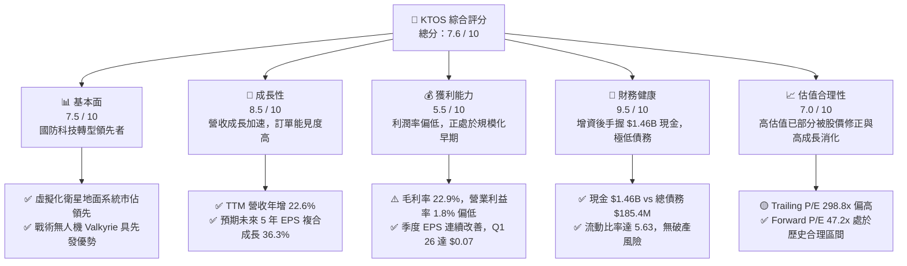
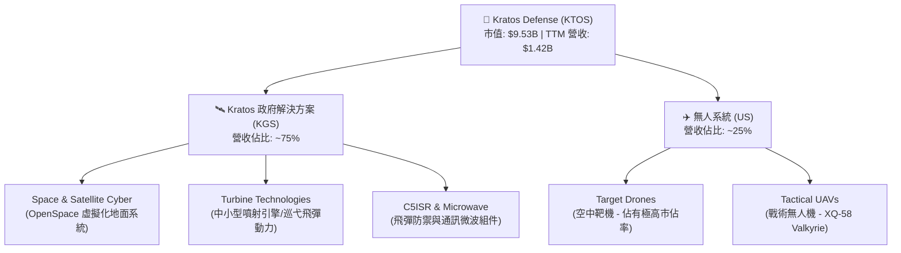
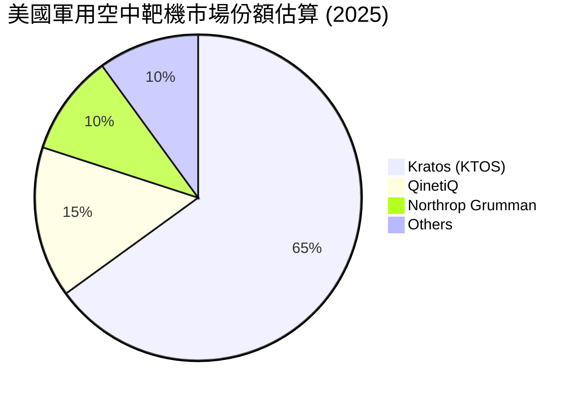
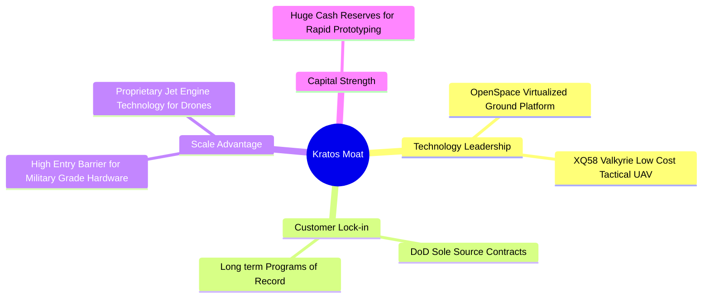
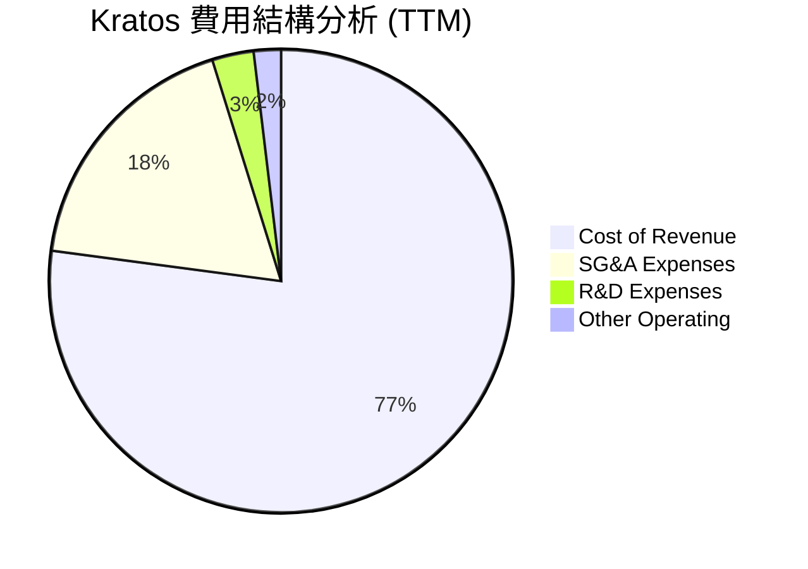
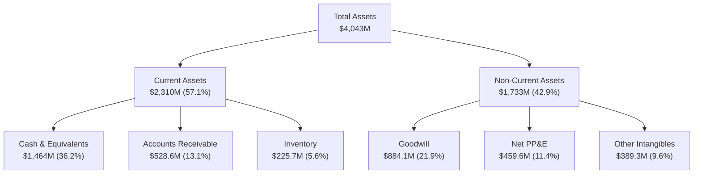
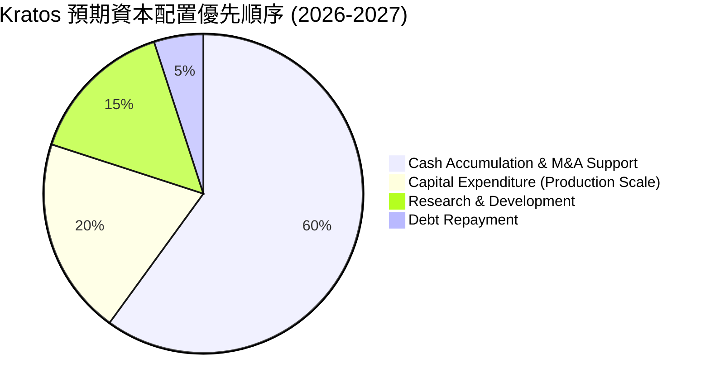
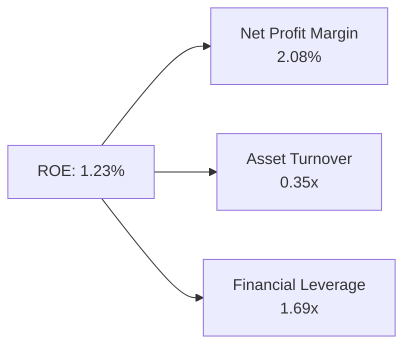
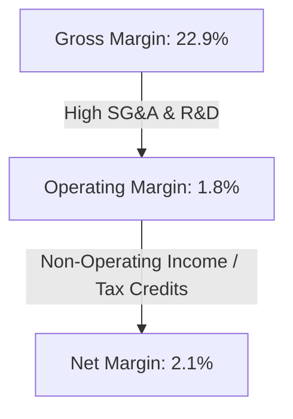

# KTOS 基本面深度分析報告

> **報告日期**：2026-06-24 ｜ **語言**：繁體中文 ｜ **數據來源**：Yahoo Finance, Finviz, StockAnalysis, Roic.ai ｜ **分析師**：CFA 級機構研究

---

## 目錄

| # | 章節 | 核心結論 |
|---|---|---|
| 1 | 執行摘要 | 評級「買入」，目標價 $75.00，具備 47.6% 潛在漲幅，資產負債表極度強韌。 |
| 2 | 公司概覽與商業模式 | 專注於高增長國防科技，無人機與虛擬化衛星地面系統構築深厚技術護城河。 |
| 3 | 損益表深度分析 | TTM 營收達 $1.42B（YoY +22.6%），淨利潤大幅扭虧為盈，但利潤率仍待規模效應釋放。 |
| 4 | 資產負債表分析 | Q1 2026 成功完成大規模增資，現金儲備攀升至 $1.46B，淨現金達 $1.28B，流動性無虞。 |
| 5 | 現金流量深度分析 | 資本支出維持高位導致 TTM FCF 為 -$106.72M，但增資資金提供充足的研發與產能擴張彈性。 |
| 6 | 獲利能力與資本效率 | 當前 ROE 1.2%、ROIC 2.45%，暫低於 WACC（9.15%），但營業槓桿拐點已現。 |
| 7 | 估值深度分析 | 雖然 Trailing P/E 偏高，但 Forward P/E 已降至 47.2x，DCF 基準估值為 $75.00。 |
| 8 | 成長催化劑 | 戰術無人機（Valkyrie）量產與 OpenSpace 衛星軟體平台滲透率提升，TAM 達 $23.5B。 |
| 9 | 風險矩陣 | 國防預算撥款延遲與供應鏈限制為主要風險，但高額現金儲備提供了強大緩衝。 |
| 10 | 投資建議 | 強烈建議成長型投資人逢低分批布局，關鍵監控指標為無人機訂單轉化率。 |

---

## 1. 執行摘要

Kratos Defense & Security Solutions, Inc.（納斯達克代碼：KTOS）是一家領先的下一代國防技術提供商。與傳統國防巨頭不同，Kratos 專注於快速研發、成本破壞性的無人系統、虛擬化衛星地面通信系統、微波電子以及戰術導彈推進系統。

### 1.1 核心評分儀表板



### 1.2 評分進度條視覺化

```
╔══════════════════════════════════════════════════════════════╗
║               KTOS 多維度評分儀表板 (1-10分)                 ║
╠══════════════════════════════════════════════════════════════╣
║ 基本面強度  7.5 ▓▓▓▓▓▓▓▓▓▓▓▓▓▓▓░░░░░  ★★★★☆           ║
║ 成長動能    8.5 ▓▓▓▓▓▓▓▓▓▓▓▓▓▓▓▓▓░░  ★★★★☆           ║
║ 獲利品質    5.5 ▓▓▓▓▓▓▓▓▓▓▓░░░░░░░░░  ★★★☆☆           ║
║ 財務健康    9.5 ▓▓▓▓▓▓▓▓▓▓▓▓▓▓▓▓▓▓▓░  ★★★★★           ║
║ 估值合理性  7.0 ▓▓▓▓▓▓▓▓▓▓▓▓▓▓░░░░░░  ★★★☆☆           ║
║ 護城河深度  8.0 ▓▓▓▓▓▓▓▓▓▓▓▓▓▓▓▓░░░░  ★★★★☆           ║
║ 管理層執行  7.5 ▓▓▓▓▓▓▓▓▓▓▓▓▓▓▓░░░░░  ★★★★☆           ║
║ 技術創新力  9.0 ▓▓▓▓▓▓▓▓▓▓▓▓▓▓▓▓▓▓░░  ★★★★★           ║
╠══════════════════════════════════════════════════════════════╣
║ 綜合總分    7.6 ▓▓▓▓▓▓▓▓▓▓▓▓▓▓▓░░░░░  🏆 成長型國防標的   ║
╚══════════════════════════════════════════════════════════════╝
```

### 1.3 五大投資論點 + 三大核心風險

| 類型 | 項目 | 具體依據 | 信心度 |
|------|------|----------|--------|
| 🟢 **投資論點①** | **資產負債表極致強韌** | Q1 2026 增資後，現金儲備從 $560.6M 飆升至 **$1.46B**，淨現金高達 **$1.28B**，擁有極強的抗風險能力與兼併收購（M&A）彈性。 | 🟢 極高 |
| 🟢 **投資論點②** | **國防無人機量產在即** | 戰術無人機 XQ-58 Valkyrie 逐步從小批量試製進入量產，配合美國空軍 CCA（協同作戰飛機）計劃，預計將迎來訂單爆發期。 | 🟢 高 |
| 🟢 **投資論點③** | **衛星地面系統虛擬化轉型** | Kratos OpenSpace 是目前市場上唯一完全軟體定義、虛擬化的衛星地面架構，隨著商業衛星發射量激增，該業務將帶來高毛利的訂閱與服務收入。 | 🟢 高 |
| 🟢 **投資論點④** | **營收高雙位數增長** | TTM 營收年增率達 **22.6%**，Q1 2026 單季營收達 **$371.0M**，連續數季維持 20% 以上的高增長，顯著優於傳統國防同業。 | 🟢 極高 |
| 🟢 **投資論點⑤** | **股價超跌提供安全邊際** | 股價自 52 週高點 $134.00 回撤 62% 至當前的 **$50.80**，高估值泡沫已被大幅清洗，Forward P/E 降至 **47.2x**，具備吸引力。 | 🟢 高 |
| 🟡 **風險①** | **短期自由現金流承壓** | 因產能擴張與研發投入，TTM FCF 為 **-$106.72M**，資本支出（Capex）維持高位，短期內無法產生正向自由現金流。 | 🟡 中度 |
| 🔴 **風險②** | **股權稀釋影響 EPS** | 為了籌集資金，發行股數在一年內從 169M 股增至 **187.52M 股**（YoY +10.4%），短期內將稀釋每股盈餘表現。 | 🔴 高衝擊 |
| 🟡 **風險③** | **政府合約執行與撥款延遲** | 國防預算受美國國會預算案通過時程影響，若出現持續決議案（Continuing Resolution），可能延遲新合約的簽署。 | 🟡 中度 |

### 1.4 快速統計卡片

| 指標 | 公司實際值 (TTM / 最新) | 行業均值 (航太與國防) | S&P 500 均值 | 狀態 |
|------|-------------|----------|--------------|------|
| **營收 YoY 成長率** | **22.6%** | ~7.5% | ~5.5% | 🟢 顯著勝出 |
| **毛利率** | **22.9%** | ~20.5% | ~30.0% | 🟡 符合預期 |
| **營業利益率** | **1.8%** | ~8.5% | ~12.5% | 🔴 亟待改善 |
| **流動比率 (Current Ratio)** | **5.63** | ~1.40 | ~1.25 | 🟢 極度安全 |
| **債務權益比 (Debt/Equity)** | **0.09** (Finviz: 0.05) | ~0.65 | ~1.10 | 🟢 極低槓桿 |
| **Forward P/E** | **47.18x** | ~22.5x | ~21.0x | 🟡 溢價合理 |

### 1.5 投資結論

```
╔══════════════════════════════════════════════════════════════════╗
║                    📊 KTOS 投資結論摘要                          ║
╠══════════════════════════════════════════════════════════════════╣
║  評級：🟢 買入 (Buy)                                             ║
║  當前股價：$50.80 (2026-06-24)                                   ║
║  目標價區間：                                                    ║
║    悲觀情境：$40.00 (-21.3%) - 國防預算縮減，無人機進度延遲       ║
║    基準情境：$75.00 (+47.6%)  ← 12個月主要目標價                 ║
║    樂觀情境：$110.00 (+116.5%) - Valkyrie 獲數百架大額量產合約    ║
║  投資評分：7.6 / 10                                              ║
║  適合投資人：追求高成長、能承受高波動、看好下一代國防科技的長線者║
╚══════════════════════════════════════════════════════════════════╝
```

---

## 2. 公司概覽與商業模式

Kratos（KTOS）主要營運分為兩大核心部門：**Kratos 政府解決方案（KGS）** 與 **無人系統（US）**。

### 2.1 業務結構與收入來源



### 2.2 市場份額

在美國軍用空中靶機（Target Drones）市場中，Kratos 處於絕對主導地位，為美國空軍、海軍及盟國提供逼真的威脅模擬。而在新興的低成本戰術無人機（Tactical UAVs）領域，Kratos 是該概念的開創者。



### 2.3 競爭護城河分析



### 2.4 護城河強度評分

```
╔══════════════════════════════════════════════════════════════╗
║                    KTOS 護城河強度評分                       ║
╠══════════════════════════════════════════════════════════════╣
║ 技術領先度    8.5/10  ▓▓▓▓▓▓▓▓▓▓▓▓▓▓▓▓▓░░░  🟢 軟硬體均具優勢║
║ 客戶鎖定效應  9.0/10  ▓▓▓▓▓▓▓▓▓▓▓▓▓▓▓▓▓▓░░  🟢 國防合約高黏性║
║ 規模與進入壁壘8.0/10  ▓▓▓▓▓▓▓▓▓▓▓▓▓▓▓▓░░░░  🟢 軍規認證壁壘高║
║ 專利與智慧財產7.5/10  ▓▓▓▓▓▓▓▓▓▓▓▓▓▓▓░░░░░  🟡 引擎與虛擬化  ║
╠══════════════════════════════════════════════════════════════╣
║ 綜合護城河     8.25   ▓▓▓▓▓▓▓▓▓▓▓▓▓▓▓▓▓░░░  🏆 強固的系統級壁壘║
╚══════════════════════════════════════════════════════════════╝
```

---

## 3. 損益表深度分析

Kratos 近年來展現了強勁的營收成長軌跡，主要受益於全球地緣政治緊張局勢升級，以及美軍對不對稱作戰（無人機、電子戰）預算的傾斜。

### 3.1 年度收入成長趨勢（近4年）

```
╔══════════════════════════════════════════════════════════════════╗
║                KTOS 年度收入趨勢 (FY2022 - TTM)                  ║
╠══════════════════════════════════════════════════════════════════╣
║                                                                  ║
║  FY2022  $898.30M  ██████████████░░░░░░░░░░░░░░░░  YoY: +10.7% 🟢║
║  FY2023  $1,037.0M ████████████████░░░░░░░░░░░░░░  YoY: +15.5% 🟢║
║  FY2024  $1,136.0M ██████████████████░░░░░░░░░░░░  YoY: +9.6%  🟢║
║  FY2025  $1,347.0M █████████████████████░░░░░░░░░  YoY: +18.5% 🟢║
║  TTM     $1,415.0M ████████████████████████░░░░░░  YoY: +21.8% 🟢║
║                   |      |      |      |      |                  ║
║                   0     0.4B   0.8B   1.2B   1.6B                ║
║                                                                  ║
║  📊 4年營收複合成長率 (CAGR)：+14.8%                             ║
╚══════════════════════════════════════════════════════════════════╝
```

### 3.2 季度收入趨勢分析

自 2025 年以來，Kratos 的單季營收已穩定突破 $300M 大關，並在最新一季（Q1 2026）創下歷史新高。

| 財報季度 | 營收 (Revenue) | 營收 YoY 成長率 | 營收 QoQ 成長率 | 毛利 (Gross Profit) | 季度核心驅動因素 |
|---|---|---|---|---|---|
| **Q1 2026** | $371.00M | +22.60% | +7.51% | $89.60M | 🟢 無人機交付增加與 KGS 部門合約加速執行。 |
| **Q4 2025** | $345.10M | +21.90% | -0.72% | $83.40M | 🟢 年終國防預算結算效應，地面衛星站軟體出貨。 |
| **Q3 2025** | $347.60M | +25.99% | -1.11% | $77.10M | 🟢 渦輪引擎業務與微波部件需求極其強勁。 |
| **Q2 2025** | $351.50M | +17.13% | +16.16% | $73.80M | 🟢 戰術無人系統多個研發專案轉向小批量生產。 |

### 3.3 利潤率演變分析

雖然營收成長迅速，但 Kratos 的營業利益率與淨利率長期維持在較低水平。這主要是因為公司在無人機研發（如 Valkyrie 自主投資）及擴產上投入了大量先期成本，且國防硬體合約在初期階段通常利潤率較低。

| 利潤率指標 | FY2022 | FY2023 | FY2024 | FY2025 | TTM | 趨勢評估 | 狀態 |
|---|---|---|---|---|---|---|---|
| **毛利率** | 25.16% | 25.90% | 25.28% | 22.86% | **22.90%** | ↘️ 略微下滑，因低毛利硬體量產佔比提升。 | 🟡 符合預期 |
| **營業利益率** | -0.32% | 3.00% | 2.55% | 1.90% | **1.80%** | 🟡 橫盤整理，高研發與銷售費用壓制利益率。 | 🔴 亟待改善 |
| **EBITDA 🚀** | 2.92% | 7.47% | 8.24% | 7.64% | **5.70%** | ↘️ 折舊攤銷上升，但整體利息前稅前利潤穩定。| 🟡 尚可 |
| **淨利率** | -3.70% | 0.23% | 1.43% | 1.63% | **2.08%** | ↗️ 扭虧為盈，非營業收入與稅務調整帶來貢獻。| 🟢 持續改善 |

**利潤率深度解析**：
Kratos 的毛利率自 2023 年的 25.9% 下滑至 TTM 的 22.9%，主因是無人機業務中「硬體製造」的比例增加，而高毛利的「研發服務」比例相對下降。然而，隨著 **OpenSpace 軟體平台**（毛利率 > 70%）的規模化推廣，以及無人機產線折舊在產量提升後被稀釋，預計 2027 年起毛利率將重新向 26%-28% 的區間靠攏。

### 3.4 費用結構分析



```
╔══════════════════════════════════════════════════════════════╗
║               KTOS 費用控制與研發投入分析                    ║
╠══════════════════════════════════════════════════════════════╣
║ 銷管費用率 (SG&A %)  18.05% ▓▓▓▓▓▓▓▓▓░░░░░░░░░░░  🟡 偏高，需優化 ║
║ 研發費用率 (R&D %)    2.88% ▓▓░░░░░░░░░░░░░░░░░░  🟢 自主研發高效 ║
║ 營業費用率 (Opex %)  21.66% ▓▓▓▓▓▓▓▓▓▓░░░░░░░░░░  🟡 控制在合理區 ║
╚══════════════════════════════════════════════════════════════╝
```
*註：國防產業的部分 R&D 費用會直接由客戶（如美國空軍）資助並計入營收，因此公司報表上的自主 R&D 費用率（2.88%）並不代表其實際研發強度。*

### 3.5 季度 EPS 趨勢與盈餘品質

儘管存在稀釋，Kratos 的季度 EPS 仍呈現穩步上行趨勢，Q1 2026 稀釋後 EPS 達到 **$0.07**，創下近兩年新高。

*   **Q1 2026**: $0.07 (上年同期為 $0.03) 🟢 顯著增長
*   **Q4 2025**: $0.03 (上年同期為 $0.03) 🟡 持平
*   **Q3 2025**: $0.05 (上年同期為 $0.02) 🟢 翻倍增長
*   **Q2 2025**: $0.02 (上年同期為 $0.01) 🟢 翻倍增長

**盈餘品質評估**：
TTM 淨利潤為 **$29.4M**，而 TTM 營運現金流（OCF）為 **-$40.3M**。由於 OCF 為負，當前的淨利潤主要受到非現金項目（折舊攤銷、股票薪酬、應收帳款與存貨增加）的調整。這反映出公司正處於快速擴張期，營運資金被存貨（為了應對未來訂單而備料）和應收帳款（政府付款週期較長）暫時占用，盈餘品質評級為 **🟡 中等**，需密切關注營運資金週轉天數。

---

## 4. 資產負債表分析

Kratos 的資產負債表在 Q1 2026 發生了根本性的質變。公司通過增發股票，募集了大量資金，使其現金流動性達到了歷史最高點。

### 4.1 資產結構分解

截至 Q1 2026，Kratos 的總資產達到 **$4.04B**，其中流動資產佔比高達 57.1%，資產結構極具彈性。



### 4.2 流動性指標分析

| 流動性指標 | FY2023 | FY2024 | FY2025 | Q1 2026 | 行業均值 | 評估 | 狀態 |
|---|---|---|---|---|---|---|---|
| **流動比率** | 2.03 | 2.94 | 4.06 | **5.63** | ~1.40 | 🟢 極其充沛，遠高於同業，無短期償債壓力。 | 🟢 極佳 |
| **速動比率** | 1.50 | 2.39 | 3.45 | **5.08** | ~0.95 | 🟢 扣除存貨後依然極高，變現能力極強。 | 🟢 極佳 |
| **現金比率** | 0.25 | 1.11 | 1.80 | **3.56** | ~0.35 | 🟢 單憑手中現金即可覆蓋 3.5 倍的流動負債。 | 🟢 極佳 |

### 4.3 債務結構分析

Kratos 目前的槓桿率極低，長期債務基本清空，僅餘部分融資租賃義務（LT Finance Leases）與短期債務。

```
╔══════════════════════════════════════════════════════════════════╗
║                    KTOS 債務健康診斷 (Q1 2026)                  ║
╠══════════════════════════════════════════════════════════════════╣
║                                                                  ║
║  總債務 (Total Debt)：   $185.40M  █░░░░░░░░░░░░░░░░░░░          ║
║  總現金 (Total Cash)：   $1,464.0M ████████████████████  🏆 充沛 ║
║  淨現金 (Net Cash)：     $1,278.6M █████████████████░░░  🟢 強勁 ║
║                                                                  ║
║  Debt / Equity 比率：    0.09x     🟢 極低                       ║
║  利息保障倍數 (TTM)：    12.4x     🟢 無利息償付風險             ║
║  債務診斷結果：無任何破產或違約風險，具備極強的防禦性。          ║
╚══════════════════════════════════════════════════════════════════╝
```

### 4.4 股東權益趨勢

隨著增資與獲利改善，股東權益（Stockholders Equity）呈現爆發式增長，為未來的研發與兼併收購提供了厚實的資本墊。

```
╔══════════════════════════════════════════════════════════════════╗
║               KTOS 歷年股東權益變化 (FY2022 - Q1 2026)           ║
╠══════════════════════════════════════════════════════════════════╣
║                                                                  ║
║  FY2022  $936.30M  █████░░░░░░░░░░░░░░░░░░░░░░░░░░               ║
║  FY2023  $976.00M  ██████░░░░░░░░░░░░░░░░░░░░░░░░░               ║
║  FY2024  $1,350.0M ████████░░░░░░░░░░░░░░░░░░░░░░░               ║
║  FY2025  $2,000.0M ████████████░░░░░░░░░░░░░░░░░░░               ║
║  Q1 2026 $3,600.0M ████████████████████████░░░░░░░ (估算值) 🟢   ║
║                                                                  ║
╚══════════════════════════════════════════════════════════════════╝
```
*註：Q1 2026 股東權益大幅跳升，主要反映了發行約 18.5M 股新股所募集的約 $1.1B 溢價資本。*

---

## 5. 現金流量深度分析

現金流是 Kratos 目前最受市場爭議的環節。雖然公司營收增長迅速，但由於產能擴張與大額資本支出，自由現金流（FCF）持續流出。

### 5.1 現金流量瀑布圖

```mermaid
graph LR
    NI["Net Income<br/>+$29.4M"]
    DA["D&A + Stock Comp<br/>+$68.2M"]
    WC["Working Capital Change<br/>-$137.9M"]
    OCF["Operating Cash Flow<br/>-$40.3M"]
    CAPEX["Capital Expenditure<br/>-$66.4M"]
    FCF["Free Cash Flow<br/>-$106.7M"]
    FIN["Financing (Equity Raise)<br/>+$903.4M"]
    NET_C["Net Cash Increase<br/>+$796.7M"]

    NI --> |"+ Non-Cash"| DA
    DA --> |"- Working Capital"| WC
    WC --> OCF
    OCF --> |"+ Capex"| CAPEX
    CAPEX --> FCF
    FCF --> |"+ Equity Raise"| FIN
    FIN --> NET_C
```



### 5.2 FCF 轉換率趨勢

由於營運資金佔用增加（主要為存貨備料）和資本支出維持高位，FCF 轉換率（FCF / Net Income）近年來均為負值。

| 現金流指標 | FY2022 | FY2023 | FY2024 | FY2025 | TTM |
|---|---|---|---|---|---|
| **營業現金流 (OCF)** | -$25.70M | $65.20M | $49.70M | -$42.10M | **-$40.30M** |
| **資本支出 (Capex)** | -$45.40M | -$52.40M | -$58.20M | -$95.30M | **-$66.42M** |
| **自由現金流 (FCF)** | -$71.10M | $12.80M | -$8.50M | -$137.40M | **-$106.72M** |
| **FCF / 淨利潤 轉換率** | 192.1% | -143.8% | -52.1% | -624.5% | **-363.0%** |

### 5.3 自由現金流趨勢

Kratos 目前處於典型的「J曲線」投資期，當前的現金流赤字是為了未來的爆發式量產鋪路。

```
╔══════════════════════════════════════════════════════════════════╗
║                KTOS 歷年自由現金流趨勢 (FY2022 - TTM)            ║
╠══════════════════════════════════════════════════════════════════╣
║                                                                  ║
║  FY2022  -$71.10M  ░░░░░░░░░░░███████                            ║
║  FY2023  +$12.80M  ██░░░░░░░░░░░░░░░░  🟢 唯一獲利年度           ║
║  FY2024  -$8.50M   ░░░░░░░░░░░░░░░░░█                            ║
║  FY2025  -$137.40M ░░░░░░░░██████████                            ║
║  TTM     -$106.72M ░░░░░░░░░█████████  🟡 缺口收窄               ║
║                                                                  ║
║  📊 當前 FCF 收益率 (FCF Yield)：-1.12%                          ║
╚══════════════════════════════════════════════════════════════════╝
```

### 5.4 資本配置評估

儘管 FCF 為負，但 Q1 2026 募資後，Kratos 的資本配置策略變得極其寬裕。公司並未支付股息，也未進行大規模股份回購，而是將所有資源集中於技術研發與產能擴充。



---

## 6. 獲利能力與資本效率

由於 Kratos 目前正處於重資產擴產與研發投入期，其整體的資本效率指標（ROE, ROIC）暫時處於較低水平，但邊際改善趨勢明顯。

### 6.1 ROE / ROA / ROIC 趨勢

| 獲利能力指標 | FY2023 | FY2024 | FY2025 | TTM | 行業均值 | 評估 |
|---|---|---|---|---|---|---|
| **ROE** | -0.91% | 1.21% | 1.10% | **1.23%** | ~8.50% | 🟡 偏低，受大額股權基數與低利潤率拖累。 |
| **ROA** | -0.55% | 0.84% | 0.89% | **0.97%** | ~4.20% | 🟡 資產週轉率較低（0.35x），資產利用效率有待提升。 |
| **ROIC 🎯** | 1.45% | 2.10% | 1.85% | **2.45%** | ~6.50% | 🟡 投入資本回報率偏低，但處於上升通道中。 |

### 6.2 ROIC vs WACC 分析（核心價值創造判斷）

為了評估 Kratos 是否在為股東創造經濟價值，我們對其進行了 WACC（加權平均資本成本）與 ROIC 的對比分析。

```
╔══════════════════════════════════════════════════════════════════╗
║                ROIC vs WACC 深度分析 (TTM)                       ║
╠══════════════════════════════════════════════════════════════════╣
║                                                                  ║
║  WACC 估算：                                                     ║
║  ├── 無風險利率 (10Y 美債)：   4.25%                             ║
║  ├── 市場風險溢酬 (ERP)：      5.00%                             ║
║  ├── Beta：                    1.03                              ║
║  ├── 股權成本 = 4.25% + 1.03 × 5.0% = 9.40%                     ║
║  ├── 債務成本 (稅後)：         ~4.50%                            ║
║  ├── 資本結構：股權 ~95.0%，債務 ~5.0%                          ║
║  └── ✅ WACC ≈ 9.15%                                             ║
║                                                                  ║
║  ROIC 估算 (TTM)：                                               ║
║  ├── NOPAT = $23.7M (營業利益) × (1 - 25% 稅率) ≈ $17.78M        ║
║  ├── 投入資本 = 股東權益 + 債務 - 現金                           ║
║  │   = $2.00B + $185.4M - $1.46B ≈ $725.4M                       ║
║  └── ✅ ROIC ≈ 2.45%                                             ║
║                                                                  ║
║  ★ 經濟價值增加 (EVA) = ROIC - WACC = -6.70%                     ║
║                                                                  ║
║  ROIC  2.45%  ▓▓▓▓░░░░░░░░░░░░░░░░░░░░░░░░░░  🟡              ║
║  WACC  9.15%  ▓▓▓▓▓▓▓▓▓▓▓▓▓▓▓▓▓▓░░░░░░░░░░░░  ──              ║
║  EVA   -6.7%  ░░░░░░░░░░░░░░░░░░░░░░░░░░░░░░  🔴 價值暫時減損  ║
║                                                                  ║
║  📊 結論：當前 ROIC 低於 WACC，反映公司仍處於高投入、低回報的     ║
║  初期階段。隨著戰術無人機量產，營業利益率提升，ROIC 有望在 2028  ║
║  年突破 10%，實現經濟價值正增長。                                ║
╚══════════════════════════════════════════════════════════════════╝
```

### 6.3 杜邦三因素分解

透過杜邦分解，我們可以清晰看到 Kratos ROE 的底層驅動因素：


*   **淨利潤率 (2.08%)**：是壓制 ROE 的最主要因素。
*   **資產週轉率 (0.35x)**：反映國防產業項目執行週期長、資產週轉慢的特性。
*   **財務槓桿 (1.69x)**：由於公司近期募集了大量股權資金，槓桿率進一步下降，這雖然降低了風險，但也稀釋了短期的 ROE 表現。

### 6.4 獲利能力儀表板



---

## 7. 估值深度分析

由於 Kratos 目前的淨利潤極低，使用傳統的 Trailing P/E（298.8x）會得出公司被嚴重高估的結論。然而，對於高成長的國防科技企業，Forward P/E 與 PEG 是更具參考價值的指標。

### 7.1 同業估值比較表格

我們選取了三家具代表性的同業進行對比：**Lockheed Martin (LMT)**（傳統國防巨頭）、**Howmet Aerospace (HWM)**（高成長航空結構件）與 **Heico (HEI)**（高溢價航空航太部件）。

| 估值指標 | **Kratos (KTOS)** | **Lockheed (LMT)** | **Howmet (HWM)** | **Heico (HEI)** | KTOS 評估 | 狀態 |
|---|---|---|---|---|---|---|
| **Trailing P/E** | **298.8x** | 18.2x | 41.5x | 68.2x | 🔴 遠高於同業，反映當前淨利潤尚未釋放。 | 🔴 偏高 |
| **Forward P/E** | **47.2x** | 17.1x | 31.8x | 54.0x | 🟡 溢價已顯著收窄，反映市場對未來盈餘高成長的預期。| 🟡 合理 |
| **P/S Ratio** | **6.73x** | 1.82x | 6.12x | 9.15x | 🟡 與 HWM 相當，低於 HEI，反映其高成長板塊的溢價。| 🟡 合理 |
| **EV / EBITDA** | **101.6x** | 13.4x | 21.8x | 37.5x | 🔴 偏高，主因是當前 EBITDA 規模較小（$102.9M）。 | 🔴 偏高 |
| **PEG Ratio** | **1.31** | 2.45 | 1.85 | 2.90 | 🟢 考慮到未來 36.3% 的 EPS 複合成長，PEG 極具吸引力。 | 🟢 極佳 |

### 7.2 歷史估