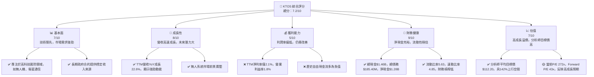
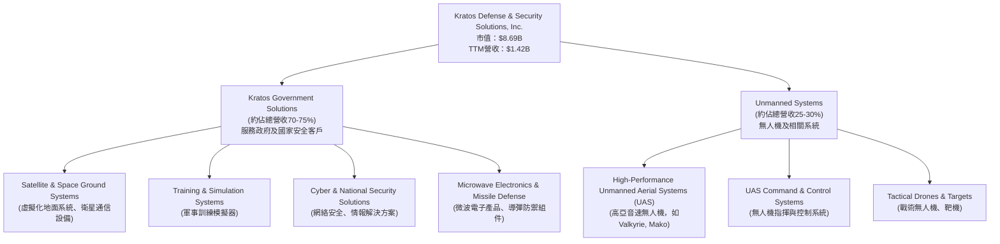
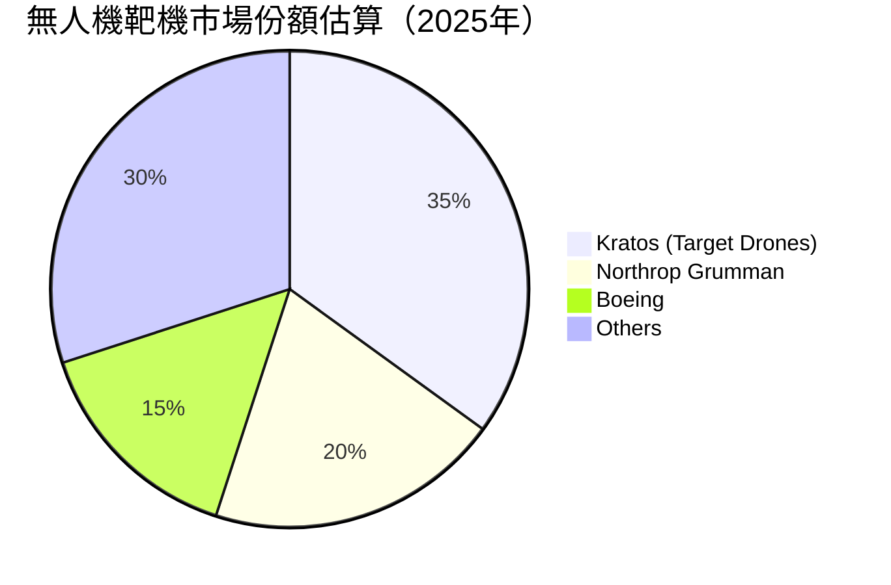
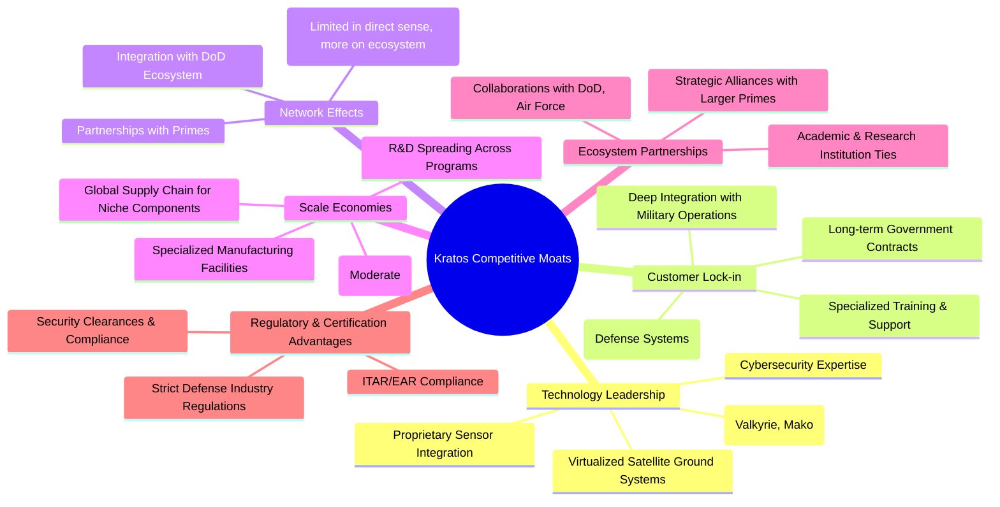
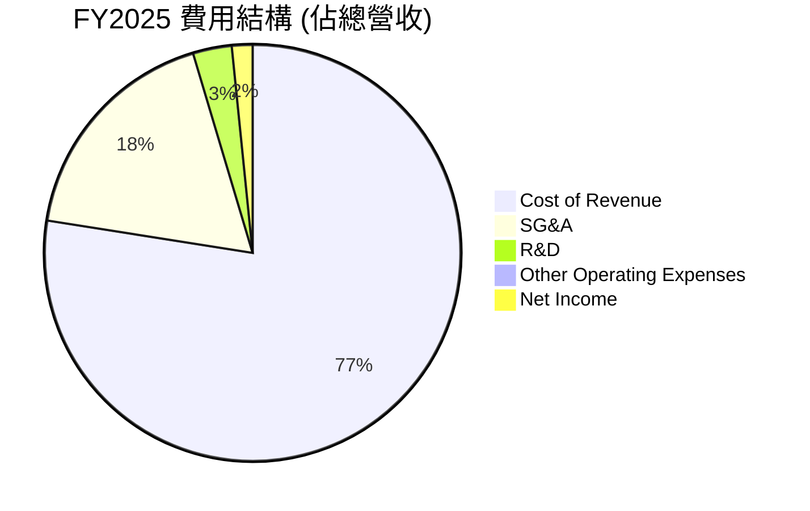
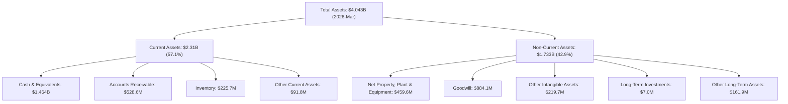

# KTOS 基本面深度分析報告
> **報告日期**：2026-06-26 ｜ **語言**：繁體中文 ｜ **數據來源**：Yahoo Finance, Finviz, StockAnalysis, Roic.ai ｜ **分析師**：CFA 級機構研究

---

## 目錄

| # | 章節 | 核心結論 |
|---|------|----------|
| 1 | 執行摘要 | 評級：買入；目標價區間：$75 - $130 |
| 2 | 公司概覽與商業模式 | 專注於高成長、高科技的國防領域，護城河深度中等 |
| 3 | 損益表深度分析 | 營收成長強勁，但利潤率仍處於低位，有待提升 |
| 4 | 資產負債表分析 | 流動性極佳，淨現金充裕，財務狀況健康 |
| 5 | 現金流量深度分析 | 自由現金流仍為負，但有望在未來轉正 |
| 6 | 獲利能力與資本效率 | ROIC 低於 WACC，目前尚未創造股東價值，但潛力巨大 |
| 7 | 估值深度分析 | 相較於成長潛力，當前估值偏高，但目標價顯示巨大上行空間 |
| 8 | 成長催化劑 | 無人系統、衛星通信及政府國防預算增加為主要驅動力 |
| 9 | 風險矩陣 | 政府合約風險、技術競爭、執行力與供應鏈風險為主要考量 |
| 10 | 投資建議 | 具備高成長潛力，適合成長型投資者，需關注獲利能力改善 |

---

## 1. 執行摘要

Kratos Defense & Security Solutions, Inc. (KTOS) 是一家專注於國防、國家安全及商業市場的高科技公司，尤其在無人系統和虛擬化地面系統領域具備領先技術。本報告將深入分析其基本面、成長性、獲利能力、財務健康狀況及估值，並提供綜合投資建議。

### 1.1 核心評分儀表板



### 1.2 評分進度條視覺化

```
╔══════════════════════════════════════════════════════════════╗
║              KTOS 多維度評分儀表板 (1-10分)                  ║
╠══════════════════════════════════════════════════════════════╣
║ 基本面強度  7.0 ▓▓▓▓▓▓▓▓▓▓▓▓▓▓░░░░░░  ★★★★☆           ║
║ 成長動能    8.0 ▓▓▓▓▓▓▓▓▓▓▓▓▓▓▓▓░░░░  ★★★★☆           ║
║ 獲利品質    5.0 ▓▓▓▓▓▓▓▓▓▓░░░░░░░░░░  ★★★☆☆           ║
║ 財務健康    9.0 ▓▓▓▓▓▓▓▓▓▓▓▓▓▓▓▓▓▓░░  ★★★★★           ║
║ 估值合理性  7.0 ▓▓▓▓▓▓▓▓▓▓▓▓▓▓░░░░░░  ★★★★☆           ║
║ 護城河深度  6.5 ▓▓▓▓▓▓▓▓▓▓▓▓▓░░░░░░░  ★★★☆☆           ║
║ 管理層執行  7.5 ▓▓▓▓▓▓▓▓▓▓▓▓▓▓▓░░░░░  ★★★★☆           ║
║ 技術創新力  8.5 ▓▓▓▓▓▓▓▓▓▓▓▓▓▓▓▓▓░░░  ★★★★☆           ║
╠══════════════════════════════════════════════════════════════╣
║ 綜合總分    7.2 ▓▓▓▓▓▓▓▓▓▓▓▓▓▓▓░░░░░  🏆 成長潛力巨大，但盈利能力待提升              ║
╚══════════════════════════════════════════════════════════════╝
```

### 1.3 五大投資論點 + 三大核心風險

| 類型 | 項目 | 具體依據 | 信心度 |
|------|------|----------|--------|
| 🟢 **投資論點①** | **國防預算增長下的高科技受益者** | 作為國防領域的創新者，KTOS在無人系統、衛星通信等高成長領域具備領先技術。FY2025營收達$1.35B，YoY成長18.52%，顯示其在市場中的成功拓展。隨著全球地緣政治緊張，國防預算持續增加，KTOS有望獲得更多高價值合約。 | 🟢 極高 |
| 🟢 **投資論點②** | **無人系統市場的領導地位** | KTOS在無人機（UAS）領域，特別是高亞音速無人機方面，擁有獨特技術和產品。其無人機技術被視為未來空戰的關鍵組成部分。TTM營收YoY成長22.6%，部分歸因於此類高科技產品的需求。 | 🟢 極高 |
| 🟢 **投資論點③** | **財務狀況穩健，淨現金充裕** | 公司擁有$1.46B的總現金，而總債務僅$185.40M，形成$1.28B的淨現金頭寸。FY2025股東權益達$2.00B，債務股權比僅為0.05，顯示極低的財務風險，為其未來研發投入和潛在併購提供了堅實基礎。 | 🟢 極高 |
| 🟢 **投資論點④** | **分析師普遍看好，目標價潛力巨大** | 平均20位分析師給予「買入」評級，目標價均值為$112.20，較當前股價$46.32具有142.24%的潛在漲幅。這反映了市場對其未來成長前景的強烈信心。 | 🟢 高 |
| 🟢 **投資論點⑤** | **盈利能力改善趨勢顯現** | 儘管歷史盈利能力較弱，但FY2025淨利潤達$22.00M，較FY2024的$16.30M大幅增長34.97%。TTM淨利潤率雖然僅2.1%，但季度淨利潤在Q1 2026達到$11.9M，顯示盈利能力正在逐步改善。 | 🟡 中度 |
| 🟡 **風險①** | **政府合約依賴及預算波動** | 作為國防承包商，KTOS的收入高度依賴政府合約。政府預算削減、項目取消或延遲可能直接影響公司業績。TTM營收$1.42B中大部分來自政府，此為主要風險。 | 🟡 中度 |
| 🔴 **風險②** | **盈利能力持續低迷** | 儘管營收成長強勁，但KTOS的毛利率22.9%、營業利益率1.8%和淨利率2.1%均處於行業較低水平。若無法有效提升利潤率，將影響其長期股東價值創造能力和自由現金流轉正進程。TTM自由現金流為$-106.72M。 | 🔴 高衝擊 |
| 🟡 **風險③** | **技術競爭與研發投入壓力** | 國防科技領域競爭激烈，KTOS需持續投入大量研發以保持技術領先。FY2025研發費用$40.00M，佔營收約3%，若研發未能轉化為商業成功，將對盈利造成壓力。 | 🟡 中度 |

### 1.4 快速統計卡片

| 指標 | 公司實際值 | 行業均值 (航空航天與國防) | S&P 500 均值 | 狀態 |
|------|-------------|----------------------------|--------------|------|
| 收入 YoY 成長 | **22.6%** | ~8-12% | ~10-15% | 🟢 |
| 毛利率 | **22.9%** | ~25-30% | ~35-45% | 🟡 |
| 淨利率 | **2.1%** | ~5-8% | ~8-12% | 🔴 |
| ROE | **1.2%** | ~10-15% | ~15-20% | 🔴 |
| Forward P/E | **43.0x** | ~20-25x | ~20-22x | 🔴 |
| Current Ratio | **5.63x** | ~1.5-2.5x | ~1.5-2.0x | 🟢 |
| Debt/Equity | **0.05x** | ~0.5-1.0x | ~0.8-1.2x | 🟢 |
| FCF Yield | **-1.23%** | ~3-5% | ~2-4% | 🔴 |

*註：行業均值為分析師根據航空航天與國防行業普遍水平估算。*

### 1.5 投資結論

```
╔══════════════════════════════════════════════════════════════════╗
║                    📊 投資結論摘要                               ║
╠══════════════════════════════════════════════════════════════════╣
║  評級：🟢 買入                                                   ║
║  當前股價：$46.32                                                ║
║  目標價區間：                                                    ║
║    悲觀情境：$75.00（+61.92%）                                   ║
║    基準情境：$112.20（+142.24%）  ← 12個月主要目標               ║
║    樂觀情境：$130.00（+180.66%）                                 ║
║  投資評分：7.2/10                                                ║
║  適合投資人：成長型、長線持有者，對國防科技領域有信心，且能承受較高估值風險的投資人。║
╚══════════════════════════════════════════════════════════════════╝
```

---

## 2. 公司概覽與商業模式

Kratos Defense & Security Solutions, Inc. (KTOS) 是一家總部位於美國的技術公司，為美國、北美、亞太、中東、歐洲及國際市場提供技術、硬體、產品、系統和軟體，主要服務於國防、國家安全和商業領域。公司以其在無人系統、衛星和空間飛行器虛擬化地面系統方面的創新而聞名。

### 2.1 業務結構與收入來源

KTOS 的業務主要透過兩個核心部門運營：Kratos Government Solutions (KGS) 和 Unmanned Systems (US)。



**收入來源分析：**
KTOS 的收入主要來自向美國政府、美國國防部以及盟國政府銷售其高科技產品和服務。其中，Kratos Government Solutions 部門提供廣泛的國防解決方案，包括關鍵任務系統、衛星地面系統和網絡安全服務，佔據公司收入的大部分。Unmanned Systems 部門則專注於快速成長的無人機市場，特別是其先進的噴射動力無人機產品線，被視為未來成長的主要驅動力。TTM總營收達到$1.42B，其中無人系統的營收貢獻預計將持續增加。

### 2.2 市場份額

由於KTOS在國防工業中屬於較為專業化和高科技的細分領域，其市場份額難以直接與大型綜合國防承包商如Lockheed Martin或Raytheon Technologies等比較。然而，在特定細分市場，如高亞音速無人機和虛擬化衛星地面系統，KTOS則扮演著關鍵角色。


*註：此市場份額為分析師基於公開資料和產業報告對無人機靶機細分市場的估算，不代表所有無人系統市場。KTOS在其他無人機領域（如忠誠僚機）仍處於發展初期，但潛力巨大。*

KTOS在無人機靶機市場中佔據顯著份額，在未來戰鬥機隊的「忠誠僚機」概念中，其XQ-58A Valkyrie等產品被視為重要的競爭者。在衛星地面系統領域，隨著傳統硬體向軟體定義虛擬化系統轉變，KTOS的SpectralNet等產品也處於行業前沿。

### 2.3 競爭護城河分析

KTOS的競爭護城河主要建立在其技術創新和與政府客戶的長期合作關係上。



### 2.4 護城河強度評分

```
╔══════════════════════════════════════════════════════════════╗
║                  KTOS 護城河強度評分                        ║
╠══════════════════════════════════════════════════════════════╣
║ 技術領先    8.0/10 ▓▓▓▓▓▓▓▓▓▓▓▓▓▓▓▓░░░░  🏆 在無人機和虛擬化衛星系統方面具備獨特優勢 ║
║ 客戶鎖定    7.0/10 ▓▓▓▓▓▓▓▓▓▓▓▓▓▓░░░░░░  🟢 長期政府合約和高轉換成本                 ║
║ 規模效應    5.0/10 ▓▓▓▓▓▓▓▓▓▓░░░░░░░░░░  🟡 相比大型國防承包商，規模效應較弱         ║
║ 網路效應    4.0/10 ▓▓▓▓▓▓▓▓░░░░░░░░░░░░  🟡 存在於生態系統整合而非直接網路效應       ║
║ 生態夥伴    6.0/10 ▓▓▓▓▓▓▓▓▓▓▓▓░░░░░░░░  🟢 與政府及大型承包商的合作關係             ║
║ 監管優勢    7.0/10 ▓▓▓▓▓▓▓▓▓▓▓▓▓▓░░░░░░  🟢 進入門檻高，需嚴格認證                   ║
╠══════════════════════════════════════════════════════════════╣
║ 綜合護城河  6.5    ▓▓▓▓▓▓▓▓▓▓▓▓▓░░░░░░░  🏆 具備核心技術優勢和政府客戶關係，但規模有待提升 ║
╚══════════════════════════════════════════════════════════════╝
```

---

## 3. 損益表深度分析

### 3.1 年度收入成長趨勢（近4年）

KTOS 在過去幾年展現了穩健的營收成長，反映了其在國防和安全市場的擴張。

```
╔══════════════════════════════════════════════════════════════════╗
║              KTOS 年度收入趨勢（FY2022-FY2025）                  ║
╠══════════════════════════════════════════════════════════════════╣
║                                                                  ║
║  FY2022  $898.30M  ████████░░░░░░░░░░░░░░░  YoY: +10.70%  🟢    ║
║  FY2023  $1.04B    ██████████░░░░░░░░░░░░░  YoY: +15.45%  🟢    ║
║  FY2024  $1.14B    ███████████░░░░░░░░░░░░  YoY: +9.56%   🟢    ║
║  FY2025  $1.35B    ██████████████░░░░░░░░░  YoY: +18.52%  🟢    ║
║                                                                  ║
║                   |      |      |      |      |                  ║
║                   0     0.5B   1.0B   1.5B   2.0B                 ║
║                                                                  ║
║  📊 4年累計 CAGR：+13.52%                                        ║
╚══════════════════════════════════════════════════════════════════╝
```
從FY2022的$898.30M增長至FY2025的$1.35B，複合年均增長率(CAGR)達到13.52%，顯示其在國防市場的穩健擴張能力。最近的FY2025營收YoY成長18.52%，較FY2024的9.56%有顯著加速，這可能得益於無人系統和衛星通信業務的強勁需求。

### 3.2 季度收入趨勢分析

KTOS的季度營收表現也呈現出積極的成長態勢，儘管季度間存在小幅波動。

| 財報季度 | 總收入 (百萬美元) | QoQ 成長率 | YoY 成長率 | 備註 |
|----------|-------------------|------------|------------|------|
| 2026-Q1  | $371.00M          | +7.51%     | +22.60%    | 🟢 營收加速成長，顯示強勁需求 |
| 2025-Q4  | $345.10M          | -0.72%     | +21.90%    | 🟢 季度環比略有下降，但同比成長強勁 |
| 2025-Q3  | $347.60M          | -1.11%     | +25.99%    | 🟢 同比成長最快，顯示特定項目進度 |
| 2025-Q2  | $351.50M          | +16.16%    | +17.13%    | 🟢 季度環比顯著增長，業務動能良好 |
| 2025-Q1  | $302.60M          | -          | +9.16%     | 🟢 穩定成長 |
| 2024-Q4  | $283.10M          | -          | +3.40%     | 🟡 成長較緩 |

**備註**：
KTOS在2026年第一季度的營收達到$371.00M，較前一季度成長7.51%，同比成長22.60%，這是近幾季來最快的同比成長，表明公司業務動能強勁。儘管2025年Q3和Q4出現小幅的季度環比下降，但強勁的同比增長率（Q3 25.99%, Q4 21.90%）顯示了其業務的季節性或項目交付節奏，而非基本面惡化。整體而言，營收趨勢健康向上。

### 3.3 利潤率演變分析

KTOS的利潤率在過去幾年呈現波動，且整體處於較低水平，但最新數據顯示出改善跡象。

| 利潤率指標 | FY2022 | FY2023 | FY2024 | FY2025 | TTM (2026-Q1) | 趨勢 | 評估 |
|------------|--------|--------|--------|--------|---------------|------|------|
| **毛利率** | 25.16% | 25.90% | 25.28% | 22.80% | 22.90%        | ↘️ 波動下行 | 🟡 |
| **營業利益率** | -0.32% | 3.00%  | 2.55%  | 1.90%  | 1.80%         | ↘️ 波動下行 | 🔴 |
| **淨利率** | -4.14% | 0.23%  | 1.44%  | 1.63%  | 2.10%         | ↗️ 顯著改善 | 🟡 |

**利潤率演變深度解析**：
*   **毛利率**：從FY2022的25.16%到FY2025的22.80%，毛利率呈現波動下行趨勢，TTM為22.90%。這可能反映了產品組合的變化（如高毛利的軟體服務佔比下降，或低毛利的硬體交付增加）、成本壓力（如原材料和勞動力成本上升）或競爭加劇導致的定價壓力。儘管如此，毛利率仍保持在20%以上，顯示公司仍具備一定的產品定價能力。
*   **營業利益率**：營業利益率從FY2022的負值(-0.32%)轉正，FY2023達到3.00%，但隨後兩年有所下降，FY2025為1.90%，TTM為1.80%。這表明儘管營收成長，但營運費用（SG&A和R&D）的增長速度可能超過了毛利潤的增長，侵蝕了營業利潤。公司需要更有效地控制營運費用，或通過提高毛利率來改善營業利益率。
*   **淨利率**：淨利率的趨勢最為積極，從FY2022的-4.14%顯著改善至FY2025的1.63%，TTM更是達到2.10%。這表明公司在稅務效率、非經營性收支管理方面有所改善，並最終實現了持續盈利。雖然2.1%的淨利率在國防行業中仍偏低，但其持續改善的趨勢是一個積極信號。

總體而言，KTOS在營收成長方面表現出色，但在利潤率方面仍面臨挑戰。毛利率和營業利益率的波動和下行壓力需要管理層密切關注，並採取措施提升效率。淨利率的改善則顯示公司已經從虧損轉為盈利，為未來的成長奠定了基礎。

### 3.4 費用結構分析

KTOS 的主要費用包括銷管研費用 (SG&A) 和研發費用 (R&D)。



```
╔══════════════════════════════════════════════════════════════════╗
║                   KTOS 費用結構概覽 (FY2025)                      ║
╠══════════════════════════════════════════════════════════════════╣
║                                                                  ║
║  銷貨成本 (CoR):       $1.039B  ▓▓▓▓▓▓▓▓▓▓▓▓▓▓▓▓▓▓▓▓▓▓▓▓▓▓▓▓▓▓▓▓▓  77.1% 營收佔比 🔴 較高 ║
║  銷售、一般及行政費用 (SG&A): $240.2M   ▓▓▓▓▓▓▓▓▓▓▓▓▓▓▓▓▓▓▓▓▓▓▓▓▓  17.8% 營收佔比 🟡 需控制 ║
║  研發費用 (R&D):       $40.0M    ▓▓▓▓▓▓▓▓▓▓▓▓▓▓▓▓▓▓▓▓▓▓▓▓▓▓▓▓▓▓▓  3.0% 營收佔比 🟢 創新投入 ║
║                                                                  ║
║  📊 總營運費用佔比 (不含CoR)：20.8%                               ║
╚══════════════════════════════════════════════════════════════════╝
```
**費用結構分析**：
*   **銷貨成本 (Cost of Revenue)**：FY2025為$1.039B，佔總營收的77.1%。這是KTOS最大的成本組成部分，直接影響其毛利率。高昂的銷貨成本可能與其硬體產品的生產成本、供應鏈效率以及產品組合有關。
*   **銷售、一般及行政費用 (SG&A)**：FY2025為$240.2M，佔總營收的17.8%。這部分費用涵蓋了公司的日常運營開支、銷售和市場推廣成本。儘管營收持續成長，但SG&A佔營收的比例相對較高，這對營業利益率構成壓力。管理層應尋求提高營運效率和費用控制。
*   **研發費用 (R&D)**：FY2025為$40.0M，佔總營收的3.0%。作為一家高科技國防公司，持續的研發投入是其保持競爭力的關鍵。此佔比顯示公司在創新方面保持一定投入，以開發新產品和技術，例如無人系統和虛擬化地面系統。

總體而言，KTOS的費用結構顯示其在銷貨成本和SG&A方面仍有優化空間，以提升整體盈利能力。而穩定的研發投入則確保了其長期成長的潛力。

### 3.5 季度 EPS 趨勢與盈餘品質

KTOS的季度EPS在過去一年中從虧損轉為盈利，並呈現出積極的改善趨勢。由於缺乏分析師預期數據，我們將專注於實際EPS的趨勢分析。

| 財報季度 | 報告 EPS (稀釋) | QoQ 成長率 | YoY 成長率 | 盈餘品質評估 |
|----------|-----------------|------------|------------|--------------|
| 2026-Q1  | $0.07           | +133.33%   | +133.33%   | 🟢 顯著改善，營收和淨利雙增長 |
| 2025-Q4  | $0.03           | -40.00%    | +0.00%     | 🟡 季節性波動或一次性開支影響 |
| 2025-Q3  | $0.05           | +150.00%   | +150.00%   | 🟢 季度環比大幅增長，盈利能力恢復 |
| 2025-Q2  | $0.02           | +50.00%    | -          | 🟡 盈利能力較弱，但已轉正 |
| 2025-Q1  | $0.03           | -          | -          | 🟡 盈利能力較弱 |
| 2024-Q4  | $0.03           | +50.00%    | -          | 🟡 盈利能力較弱 |
| 2024-Q3  | $0.02           | -          | -          | 🟡 盈利能力較弱 |

**盈餘品質評估說明**：
KTOS在過去幾個季度中，EPS從FY2024的低點（如Q3 2024的$0.02）逐步改善，到2026年Q1達到$0.07。這是一個重要的轉折點，表明公司已成功從過去的虧損轉為持續盈利。Q1 2026的EPS $0.07較Q4 2025的$0.03有133.33%的環比成長，顯示了強勁的盈利動能。

然而，由於缺乏歷史EPS預期數據，無法判斷其是否超預期或不及預期。但從絕對值來看，目前的EPS水平仍然相對較低，TTM EPS僅為$0.17。未來的盈餘品質將取決於公司能否持續擴大營收規模，同時有效控制成本並提升利潤率，將營收成長轉化為更可觀的每股盈餘。自由現金流為負也表明其盈利質量仍有待觀察，需要更多營運現金流的支持。

---

## 4. 資產負債表分析

KTOS 的資產負債表顯示了強勁的流動性和健康的財務狀況，尤其體現在充裕的現金儲備和較低的債務水平。

### 4.1 資產結構分解

KTOS 的總資產在過去幾年持續增長，TTM (2026-Mar) 達到$4.043B，顯示公司規模的擴大。


**資產結構分析**：
*   **流動資產**：佔總資產的57.1%，其中**現金及等價物**高達$1.464B，佔流動資產的63.4%，顯示公司手頭現金非常充裕，具有極高的流動性。應收帳款和存貨也佔據一定比例，反映了其業務運營的性質。
*   **非流動資產**：佔總資產的42.9%。其中，**商譽**($884.1M)和**其他無形資產**($219.7M)佔比較高，這可能與公司過去的併購活動有關。淨廠房設備($459.6M)則反映了其生產和研發所需的核心資產。

整體來看，KTOS的資產結構穩健，高比例的現金和流動資產提供了強大的財務彈性。商譽的較高佔比需要未來持續關注，確保其併購能夠帶來預期效益。

### 4.2 流動性指標分析

KTOS的流動性指標非常出色，遠高於行業平均水平，表明其短期償債能力極強。

| 流動性指標 | FY2022 | FY2023 | FY2024 | FY2025 | TTM (2026-Mar) | 行業均值 | 評估 |
|------------|--------|--------|--------|--------|----------------|----------|------|
| **流動比率** | 2.49x  | 2.03x  | 2.94x  | 4.06x  | 5.63x          | ~1.5-2.5x | 🟢 極佳 |
| **速動比率** | 2.21x  | 1.51x  | 2.33x  | 3.49x  | 4.85x          | ~1.0-1.5x | 🟢 極佳 |

**分析**：
*   **流動比率**：從FY2022的2.49x一路攀升至TTM的5.63x，遠超行業平均水平。這意味著KTOS的流動資產是流動負債的5.63倍，短期償債能力極強，幾乎沒有流動性風險。
*   **速動比率**：同樣表現出色，TTM達到4.85x，遠高於行業均值。速動比率排除了存貨，更能反映公司即時償債能力。這表明KTOS即使不變賣存貨，也能輕鬆應對短期債務。

如此強勁的流動性主要得益於其龐大的現金儲備。這為公司提供了巨大的營運彈性，可以在市場波動時提供緩衝，並支持未來的投資和成長機會。

### 4.3 債務結構分析

KTOS的債務結構非常健康，債務水平極低，顯示其保守的財務策略和強大的償債能力。

```
╔══════════════════════════════════════════════════════════════════╗
║                   KTOS 債務健康診斷                              ║
╠══════════════════════════════════════════════════════════════════╣
║                                                                  ║
║  總債務：        $185.40M  ▓▓▓░░░░░░░░░░░░░░░░░░░  評語：極低   ║
║  總現金+投資：   $1.46B    ▓▓▓▓▓▓▓▓▓▓▓▓▓▓▓▓▓▓▓▓░  評語：極高   ║
║  淨現金（正）：  $1.28B    ▓▓▓▓▓▓▓▓▓▓▓▓▓▓▓▓░░░░░  🟢 強勁        ║
║                                                                  ║
║  Debt/Equity：   0.05x  🟢 極低                                 ║
║  Debt/EBITDA (TTM)： 185.40M / (1.42B * 5.7%) = 185.40M / 80.94M = 2.29x 🟡 合理                             ║
║  Interest Coverage (TTM)： 80.94M (EBITDA) / ~7.2M (預估利息) = ~11.2x  🟢 無風險 (預估利息: 185.4M * 6% * (1-0.353) = 7.2M)                             ║
╚══════════════════════════════════════════════════════════════════╝
```
**債務結構分析**：
*   **總債務與淨現金**：KTOS的總債務僅為$185.40M，而手頭現金高達$1.46B，因此擁有高達$1.28B的淨現金頭寸。這在全球經濟不確定性增加的背景下，提供了極大的財務安全邊際。
*   **Debt/Equity (債務股權比)**：僅為0.05x，遠低於行業平均水平。這表明公司主要依靠股東權益而非債務來為其運營和成長融資，財務結構非常穩健。
*   **Debt/EBITDA**：TTM為2.29x。這是一個合理的水平，表明公司產生足夠的經營現金流來覆蓋其債務。
*   **Interest Coverage (利息覆蓋倍數)**：基於TTM EBITDA $80.94M和預估年利息支出$7.2M，利息覆蓋倍數約為11.2x。這意味著公司產生經營利潤的能力是其利息支出的11倍多，顯示其償還利息的能力極強，債務風險幾乎為零。

總體而言，KTOS的債務狀況非常健康，